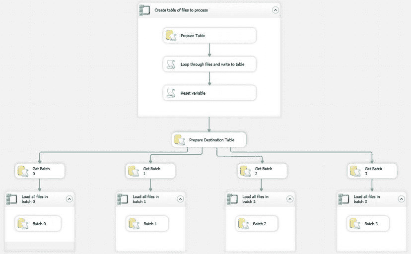

# 并行加载源文件

在 Foreach Loop 容器内添加一个 Data Flow 任务，并将其配置为使用`CarSales_Staging_OLEDB`连接管理器，将 Flat File 连接管理器`Process0`连接到目标表`ParallelStock`。确保勾选了`Tablock`选项。

26. 重复步骤 22 到 24 三次（为每个额外的并行加载执行一次）。务必为 Flat File 连接管理器命名为`Process1`、`Process2`和`Process3`。将 Process Loop 容器命名为`Load all files in Batch 1`、`Load all files in Batch 2`和`Load all files in Batch 3`。最终的包应如图 13-16 所示。
    
    图 13-16。完整的并行加载包

现在可以运行该包了。

## 工作原理

本方案基于这样的场景：你接收到许多格式相同的平面文件，都需要加载到同一张表中。显然你可以如前面的方案所示，顺序处理它们，但在大多数情况下，并行处理应该会更快。速度的提升通常值得为创建更复杂的 SSIS 包所付出的额外努力。

在本方案中，我们将加载操作分为两个不同的部分进行：
*   首先，遍历目录中的文件，并将文件路径存储在 SQL Server 表中。
*   其次，使用此表作为文件名的来源来加载文件，其中每个独立的文件加载任务独立地遍历分配给它的文件，而不受其他待加载文件的影响。

将这两部分分开处理，并首先为源文件分配进程号，使得流程的每个分支只加载自己的文件集，这一点很重要，因为每个进程都是独立的。你可以将其想象为给每个文件贴上“旗帜”，告诉它该走哪条路径。

你可以如方案 13-4 所述，使用 ADO.NET 记录集作为此技术的一部分，但我更倾向于引入另一种方法，即使用持久化的数据库表。这似乎更可取，因为使用表可以将列表存储在磁盘上，并且可以为日志记录和批处理提供基础，正如方案 13-12 将要描述的那样。

我们必须清楚这个包将实现什么。它将简单地将所有源文件分成批次（这里我使用四个，每个将是一个独立的并行进程）并处理它们。它不会尝试执行任何负载平衡或进程排序。因此，当所有文件大小大致相同，并且你不需要寻找最优顺序时，这种方法很有效。然而，它在概念和实践上都因其简单性而吸引人。用于定义哪个文件分配给哪个进程的技术是使用一个 SQL Server 标识列，然后应用“% 4”来依次为每个文件创建数字 0 到 3（应用模运算符后的余数）作为单独的`ProcessNumber`列。在此示例中，进程线程分配被定义为一个计算列，以避免额外的步骤。然后，包含文件名和批号的表被用作并行加载的源列表。当然，你不必使用四个并行进程——你可以使用更多或更少。具体需要多少进程才能达到最优的数据加载性能，可能需要你在与生产环境相同的配置中进行大量测试。

为了扩展功能，我将添加一个调整来重用——或截断——待处理文件列表，如果源数据发生变化，这将允许重新处理定义好的文件列表。这就是`CreateList`变量的用途。当包加载时，此变量设置为`True`，因此初始列表在`SimpleParallelLoad` SQL Server 表中被截断，然后重新填充。

表填充后，该变量被设置为`False`，因此除非你需要重新创建它，否则表将保持持久化。这允许你从命令行或 SQL Server 代理作业传入变量，并控制重新处理。

如果这个过程看起来相当复杂，那么我建议你仔细查看图 13-16 中整个作业的截图。这有望使事情更清晰一些。

**注意** 在 OLEDB 目标任务中，必须勾选`Tablock`复选框，因为这将允许并行批量加载发生。不这样做将大大减慢加载速度。通常，为了高效的并行加载，目标数据库不能处于 FULL 恢复模式。此外，不应有任何非聚集索引。这在方案 14-10 中有更深入的讨论。

#### 提示、技巧与陷阱

*   务必测试执行并行处理所需的时间，永远不要假定它自动会更快。测试，测试，再测试！
*   包含用于隔离待处理文件列表任务的 Sequence 容器并非绝对必要，但它有助于在视觉上隔离流程的初始部分。
*   你可以在 Script 任务中使用存储过程而不是 SQL 文本。尽管这稍微复杂一些，但被认为是更好的编码实践。在这种情况下，使用`sqlCommand.CommandType = CommandType.StoredProcedure`，将存储过程的名称添加为`SqlCommand`，并在“参数”窗格中定义任何参数。
*   为了简单起见，在本方案中，我将`SimpleParallelLoad`控制表放在了与数据加载目标相同的数据库中。在生产环境中，你可能希望将其放在单独的日志记录和监控数据库中。
*   什么是并行加载任务的最优数量？这是一个好问题，需要明智地使用那个神圣的答案：“视情况而定。”通常，更准确的回答是“不超过可用处理器核心的数量，也不要多到使 I/O 子系统过载”。因此，再次强调，在尝试生产运行之前，最好在与生产环境相同的测试系统上进行测试和测量。

