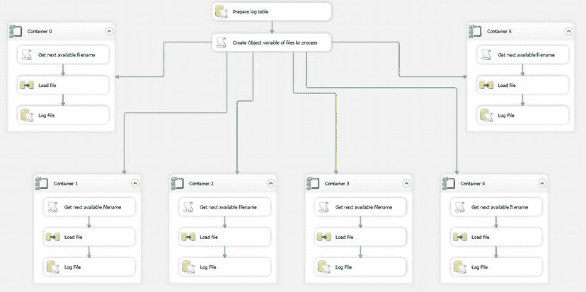
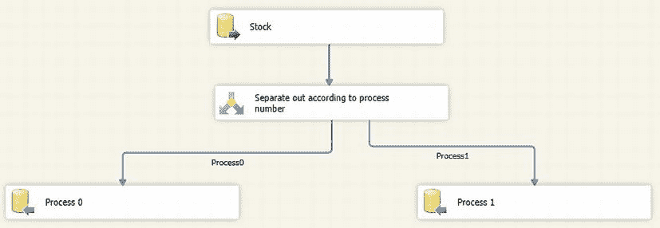
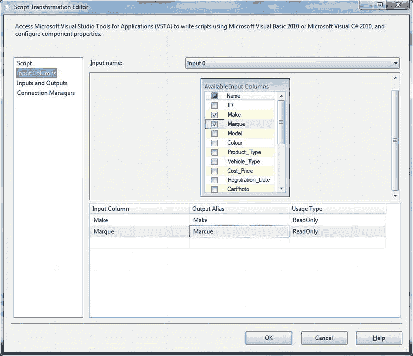
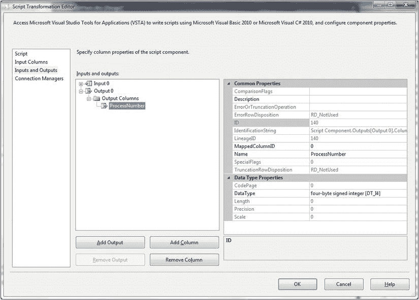

# 13-6. 使用负载平衡加载源文件

## 问题

你希望使用可用处理器以最佳效果并行加载多个结构相同的文件。

## 解决方案

使用负载平衡并行加载文件。现在我将向你展示如何执行多个并行文件加载，同时通过跨可用处理器核心平衡负载来优化时间：

1.  创建一个表，用于记录文件加载完成后的情况。创建此表的代码如下（C:\SQL2012DIRecipes\CH13\tblBulkFilesLoaded.Sql）：
    ```
    CREATE TABLE CarSales_Staging.dbo.BulkFilesLoaded
    (
     ID int IDENTITY(1,1) NOT NULL,
     DateAdded DATETIME NULL DEFAULT GETDATE(),
     FileName NVARCHAR(250) NULL,
     Source TINYINT NULL
    ) ;
    GO
    ```
2.  创建一个新的 SSIS 任务。添加一个指向目标数据库（此例中为`CarSales_Staging`）的 OLEDB 连接管理器，命名为`CarSales_Staging_OLEDB`。创建一个指向`CarSales_Staging`数据库的 ADO.NET 连接管理器，命名为`CarSales_Staging_ADONET`。这将用于写入`BulkFilesLoaded`表。
3.  添加以下变量：
    | 变量名 | 类型 | 值 | 注释 |
    | --- | --- | --- | --- |
    | `FilePath` | String | `C:\SQL2012DIRecipes\CH13\ MultipleFlatFiles` | 源文件的路径。 |
    | `FileType` | String | .CSV | 源文件扩展名。 |
    | `MaxFiles` | Int32 | 1000 | 要处理的最大可能文件数。 |
    | `RecordSet` | Object |  | 保存待处理文件列表的 ADO 记录集。 |


| | `Counter0` | `Int32` | | 对应可用处理器的处理器亲合性的最低计数器值。 | | `FileName0` | `String` | | 映射到最低处理器亲合性的文件名变量。 | | ... | | | | | `Counter’n’` | | | 对应最高处理器亲合性的最高计数器值。 | | `FileName’n’` | | | 映射到最高处理器亲合性的文件名变量。 |

4.  添加一个名为`准备日志表`的**执行 SQL**任务，并双击进行编辑。配置如下：
    | 连接类型： | `ADO.NET` |
    | --- | --- |
    | 连接： | `CarSales_Staging_ADONET` |
    | SQL 语句： | `TRUNCATE TABLE dbo.BulkFilesLoaded` |

5.  添加一个**脚本**任务，并将前一个任务连接到它。设置以下变量为读写：`User::FilePath`、`User::FileType`、`User::MaxFiles`、`User::RecordSet`。
6.  将脚本语言设置为`Microsoft Visual C# 2010`，然后点击**编辑脚本**。
7.  在`namespaces`区域添加以下引用：
    ```
    using System.IO;
    ```
8.  用以下代码替换`Main`方法（`C:\SQL2012DIRecipes\CH13\LoadBalancing1.cs`）：
    ```
    public void Main()
    {
        // 创建数据集以保存文件名
        DataSet ds = new DataSet("ds");
        DataTable dt = ds.Tables.Add("FileList");

        DataColumn IndexID = new DataColumn("IndexID", typeof(System.Int32));
        dt.Columns.Add(IndexID);
        DataColumn FileName = new DataColumn("FileName", typeof(string));
        dt.Columns.Add(FileName);
        DataColumn IsProcessed = new DataColumn("IsProcessed", typeof(Boolean));
        dt.Columns.Add(IsProcessed);

        // 在 IndexID 字段上创建主键
        IndexID.Unique = true;
        DataColumn[] pK = new DataColumn[1];
        pK[0] = IndexID;
        dt.PrimaryKey = pK;

        DirectoryInfo di = new DirectoryInfo(Dts.Variables["FilePath"].Value.ToString());
        FileInfo[] filesToLoad = di.GetFiles(Dts.Variables["FileType"].Value.ToString());

        DataRow rw = null;
        Int32 MaxFiles = 0;
        foreach (FileInfo fi in filesToLoad)
        {
            rw = dt.NewRow();
            rw["IndexID"] = MaxFiles + 1;
            rw["FileName"] = fi.Name;
            rw["IsProcessed"] = 0;
            dt.Rows.Add(rw);
            MaxFiles += 1;
        }

        Dts.Variables["User::MaxFiles"].Value = MaxFiles;
        Dts.Variables["User::RecordSet"].Value = dt;
        Dts.TaskResult = (int)ScriptResults.Success;
    }
    ```
9.  关闭脚本窗口。点击**确定**确认对脚本任务的修改。
10. 在**控制流**窗格中添加一个**For 循环**容器，并将**脚本**任务连接到它。将其命名为`容器 0`。双击进行编辑，并按如下设置 For 循环属性：
    | InitExpression: | `@Counter0 = 0` |
    | --- | --- |
    | EvalExpression: | `@Counter0 <= @MaxFiles` |
    | AssignExpression: | `@Counter0 = @Counter0 + 1` |
11. 在 For 循环容器内添加一个**脚本组件**，将其命名为`获取下一个可用文件名`，并设置以下变量为读写：`User::FileName0`、`User::Counter0`。
12. 将脚本语言设置为`Microsoft Visual C# 2010`，然后点击**编辑脚本**。
13. 在`namespaces`区域添加以下引用：
    ```
    using System.Data.OleDb;
    using System.Xml;
    using System.Threading;
    ```
14. 设置`Main`方法如下：
    ```
    public void Main()
    {
        DataTable dT = new DataTable();
        DataRow[] matchingRows;
        String fileName = "";
        Variables vars = null;
        Variables varsMax = null;

    PollLabel:
        try
        {
            Dts.VariableDispenser.LockOneForWrite("User::RecordSet", ref vars);
            dT = (DataTable)vars[0].Value;
            matchingRows = dT.Select("IsProcessed  = 0", "IndexID ASC");
            int numberOfRows = matchingRows.GetLength(0);
            if (numberOfRows != 0)
            {
                fileName = matchingRows[0][1].ToString();
                matchingRows[0]["IsProcessed"] = true;
                Dts.Variables["FileName0"].Value = fileName;
                vars[0].Value = dT;
            }
            else
            {
                Dts.VariableDispenser.LockOneForRead("User::MaxFiles", ref varsMax);
                Dts.Variables["Counter0"].Value = varsMax[0].Value;
            }
            vars.Unlock();
        }
        catch
        {
            System.Random RandomNumber = new System.Random();
            Thread.Sleep(RandomNumber.Next(200, 800));
            goto PollLabel;
        }
        Dts.TaskResult = (int)ScriptResults.Success;
    }
    ```
15. 在**Foreach 循环**容器中添加一个**数据流**任务，并将**脚本组件**连接到它。双击优先约束（绿色箭头），并按如下设置约束选项：
    | 评估运算： | `表达式和约束` |
    | --- | --- |
    | 值： | `成功` |
    | 表达式： | `@Counter0 != @MaxFiles` |
    | 逻辑与： | `所有约束必须计算结果为 True` |
16. 点击**确定**确认修改，并使用**数据流**任务配置实际的文件加载。这里不作描述，因为其他方案已详尽涵盖，特别是方案 13-1。
17. 在**Foreach 循环**容器中添加一个**执行 SQL**任务，并将**数据流**任务连接到它。配置如下：
    | 连接类型： | `ADO.NET` |
    | --- | --- |
    | 连接： | `CarSales_Staging_ADONET` |
    | SQL 语句： | `INSERT INTO dbo.BulkFilesLoaded (Filename, Source) VALUES (@FileName0, 0)` |
18. 点击左侧的**参数映射**，并添加以下参数：
    | 变量名称 | 方向 | 数据类型 | 参数名称 |
    | --- | --- | --- | --- |
    | `User::FileName0` | `输入` | `String` | `@FileName0` |
19. 点击**确定**确认修改。
20. 为希望添加的每个并行加载重复步骤 10 到 19。你必须将所有对`FileName0`的引用更改为`FileName’n’`（进程编号）。对`Counter0`也做同样处理。请记住，这不仅指脚本代码中，还包括步骤 10 中 For 循环参数和步骤 15 中优先约束所使用的变量名。你的包应如图 13-17 所示。
    
    `图 13-17`. 负载均衡包的流程

## 工作原理
上一个方案并行加载了多组文件，但并未尝试平衡负载过程。它假定所有文件大小大致相似，并且分配给它们的所有处理核心都能充分发挥潜力，无需切换到其他进程——从而不会减慢文件加载速度。


虽然这种方法能满足许多负载需求，但总有些情况需要你采用一种能够**平衡负载**的方法。这意味着每个处理核心在可用时都能获取下一个待处理的文件，而无需预先将文件分配给特定的 SSIS 路径——从而也避免了预先将它们分配给某个处理器或核心。

在可用处理器（或处理核心）之间平衡负载会稍微复杂一些，但它有一个优势：能够以硬件允许的最快速度处理所有源文件。实际上，此过程中唯一棘手的部分在于隔离出待加载的文件列表，然后确保：(a) 从列表中获取文件名时没有冲突，(b) 没有文件被加载两次，以及 (c) 当列表中的文件名被更新为已加载状态时不会发生死锁。我解决此问题的首选方案是使用一个 ADO `DataTable` 来保存文件列表，并让 SSIS 将其作为一个对象变量来处理。由于它在内存中，这几乎是你能获得的最佳保证，能避免对文件列表的并发读/写访问（以及随之而来的锁定问题）——而如果将其存储在 SQL Server 表中，则可能会发生这种情况。

与大多数并行处理方法一样，我建议仅在有可用处理器核心时才设置加载路径。因此，在本方案中，定义要使用的变量时，你应该设置八个 `Counter` 变量和八个 `Filename` 变量，如果你的服务器有八个 SSIS 可用于此过程的内核，则编号从 0 到 7。

哦，这次破例，我用 C# 编写了脚本。我知道许多 SQL Server 开发人员似乎倾向于使用 VB.NET，但我不想排除那些偏好 C# 的人。毕竟，自 SQL Server 2008 出现以来，它就已经可以用于 SSIS 中的脚本编写了。

代码工作原理如下：

首先，对于“创建待处理文件的对象变量”这个 `脚本` 任务而言。此任务做两件事：

- 首先，它创建一个 `dataset` 和 `datatable` 来保存待处理文件的列表。
- 其次，它用待处理文件的名称填充这个 `datatable`。

代码的前半部分创建了一个 `dataset`，然后创建了一个包含所需列（`IndexID`、`FileName`、`IsProcessed`）的 `datatable`。接着，利用文件路径和扩展名，它遍历源目录中所有必需文件的名称，并将它们添加到 `datatable` 的 `FileName` 列中。最后，该 `datatable` 被传递到 `RecordSet` SSIS 变量中。

`Foreach` 循环内部的 `脚本` 组件（每个并行加载都会复制一个）从 `RecordSet` SSIS 对象变量中读取 `datatable`。为此，它首先短暂锁定该变量，并过滤 `datatable` 以仅返回尚未处理的文件。然后，它获取第一个可用的文件名，将 `IsProcessed` 标志设置为 `True`，并解锁该变量。还有一个简单的冲突检测过程，如果该变量被另一个加载进程锁定，则会使进程休眠随机的毫秒数。值得注意的是，当 `datatable` 被传入 `脚本` 组件时需要转换自 SSIS 对象变量——但在传回 SSIS 对象变量时则不需要。

### 提示、技巧和陷阱

- 可以使用 SQL Server 表来存储待加载文件列表，并在每个文件加载后更新它，但根据我的经验，处理读/写冲突——并确保没有表被加载两次——可能有点棘手。使用内存中的对象允许极快的读写速度，从而可以避免冲突。至少在我使用过此特定方法的系统中是这种情况。
- 在脚本中使用 `LockOneForWrite` 方法来锁定某些变量很重要。这是因为，如果你在脚本级别锁定那些需要频繁、几乎同时访问的变量（使用读/写变量），在包执行过程中的某个时刻必然会导致争用，从而导致整个包失败。
- `MaxFiles` 变量用作一个安全措施，以防止在处理内存中 `dataset` 的文件时发生无限循环。如果 `datatable` 中没有可用文件，该进程会循环迭代，直到达到最大文件数。

## 13-7. 加载数据到并行目标

### 问题

你希望在多处理器服务器上从单一源表快速加载数据。

### 解决方案

从源表读取数据，然后将源数据流拆分成两个独立的数据流。使用并行目标加载来加速流程中的加载部分。要使用并行加载将数据加载到 SQL Server 表中：

1.  创建一个新的 SSIS 包，将其命名为 `SingleSourceParallelProcessing`。添加两个连接管理器，均为 `OLEDB` 类型。第一个将连接到你将用于加载数据的源数据库（本例中为 `CarSales`）。第二个将连接到目标数据库（此处为 `CarSales_Staging`）。我将它们分别命名为 `CarSales_OLEDB` 和 `CarSales_Staging_OLEDB`。
2.  在控制流窗格上添加一个 `数据流` 任务。将其命名为 `Parallel Table Import`。双击进行编辑。
3.  添加一个 `OLEDB Source` 任务，命名为 `Stock`。双击进行编辑，将 `OLEDB 连接管理器` 设置为 `CarSales_OLEDB`。将数据访问模式设置为 `SQL 命令`，并输入或构建以下查询（`C:\SQL2012DIRecipes\CH13\StockToParallel.Sql`）：

    ```sql
    SELECT
        ID
        ,Make
        ,Marque
        ,Model
        ,Registration_Date
        ,Mileage
        ,ID % 2 AS ProcessNumber
    FROM    dbo.Stock
    ```

4.  点击确定确认。
5.  在数据流窗格上添加一个 `条件拆分` 任务。将其命名为 `Separate out according to process number`。将数据源任务连接到这个新任务。双击进行编辑。
6.  添加两个输出，分别命名为 `Process0` 和 `Process1`。设置条件如下：

    | 条件 | 值 |
    |---|---|
    | `ProcessNumber == 0` | |
    | `ProcessNumber == 1` | |

    这样，在源 SQL 中创建的 `ProcessNumber` 列的内容将被用来将数据定向到适当的目标。对话框应如 图 13-18 所示。

    
    图 13-18.  定义条件拆分任务的输出

7.  向数据流窗格添加两个 `OLEDB 目标`。分别命名为 `Process0` 和 `Process1`。
8.  将 `条件拆分` 任务连接到 `Process0` 目标。在 `输入输出选择` 对话框中选择 `Process0` 作为输出（参见 图 13-19）。

    
    图 13-19.  从条件拆分任务中选择输出

9.  双击 `Process0` `OLEDB 目标` 任务，并按如下方式配置：

    | 属性 | 值 |
    |---|---|
    | OLEDB 连接管理器: | `CarSales_Staging_OLEDB` |
    | 表或视图的名称: | `ParallelTableLoad` |
    | 保留标识: | 已勾选 |
    | 表锁: | 已勾选 |

10. 点击确定确认。
11. 对每个目标任务重复步骤 7 到 9。
12. 你现在可以运行该包了，它应如 图 13-20 所示。

    
    图 13-20.  用于并行目标加载的最终包

### 工作原理

此方案简要介绍了如何从单一数据源并行加载数据。


