# SSIS 并行数据加载技术

## 概述

源可以是任何可以使用 OLEDB 或 ADO.NET 数据源读取的数据库表。由于这个想法有一些微小的变体，我先展示核心方法，然后在接下来的几个“配方”中解释对这种技术的几个扩展。在所有这些示例中，我仅创建两个并行加载。当然，你可以将其扩展到最适合你需求和系统的方式。一如既往，对于运行多少并行负载以获得最佳性能，并没有硬性规定。你需要进行测试和调整以获得最佳结果。

让我们从一个源数据表开始。它可以是一个 SQL Server 源——或者任何 SSIS 可以连接的数据源。除了 SQL Server 之外的经典源是市场上的主要关系数据库。我假设你面临的是一个单一的源数据表和一个单一的目标表。作为初始 `SELECT` 子句的一部分，会生成一个“处理路径”标识符。在本例中，它是使用 SQL Server 取模运算符 (`%`) 从 ID 推导出来的。这保证了每条源记录都将被标记为 0 或 1，用作条件拆分任务的标志。这允许将负载拆分为两个——即使对于单一目标表也是如此。但是，你必须使用批量插入 API（表或视图——快速加载）并且必须选择表锁才能确保并行插入正常工作。

#### 提示、技巧与陷阱

*   使用 SQL 生成 `ProcessNumber` 时，在运行大型导入之前预览结果可能是个好主意。
*   请记住，你总是可以仅执行批处理号列的简单加载，然后计算每个批处理的行数，以检查你是否获得了相当平衡的分布。
*   有些时候你可能需要在没有像本例中那样好的、简单的唯一 ID 字段作为起点的情况下计算 `ProcessNumber` 字段。因此，请尝试在 `SELECT` 语句中使用如下代码：
    ```
    ,ABS(CAST(HashBytes('SHA1', CAST(Make AS VARCHAR(20))+ Marque) AS INT)) % 2 AS ProcessNumber
    ```
    此代码将从一个或多个字段创建一个哈希，然后用于派生 `ProcessNumber` 字段。

*   如果你连接到非 SQL Server 的数据库，也有类似的方法可以从直通 SQL 生成处理号。然而，这将取决于数据库所使用的 SQL 风格，因此我只能参考你所使用的特定数据库的文档。

## 13-8. 将单个数据文件用作并行目标加载的多数据源

### 问题
你想要从单个平面文件快速加载数据，并且有多个处理器可用。

### 解决方案
使源文件能够被多个源任务读取，从而允许高效地并行加载到目标表中，步骤如下。

1.  创建一个新的 SSIS 包，并向目标数据库（本例中为 `CarSales_Staging`）添加一个 OLEDB 连接管理器，命名为 `CarSales_Staging__OLEDB`。
2.  在“连接管理器”选项卡中右键单击，选择“新建平面文件连接”。将连接管理器命名为 `Stock`。
3.  单击“浏览...”按钮，导航到包含要加载文件的目录 (`C:\SQL2012DIRecipes\CH13\MultipleFlatFiles`)。选择 `Stock01.Csv`（本例中）。确保输入了所有相关的配置信息（SSIS 应该能正确猜出所有这些）。
4.  添加一个新的数据流任务并双击进行编辑。
5.  添加一个平面文件源任务，并将其配置为使用你在第 2 步创建的名为 `Stock` 的平面文件连接。
6.  向数据流窗格添加一个脚本组件，并将其设置为转换命令类型。将名为 `Stock` 的平面文件源任务连接到此脚本任务，我建议将其命名为 `Generate Hash`。
7.  编辑脚本组件，在左窗格中选择“输入列”，然后选择：
    *   `Make`
    *   `Marque`
    或者你希望用于生成哈希键的列。对话框应类似于图 13-21。

    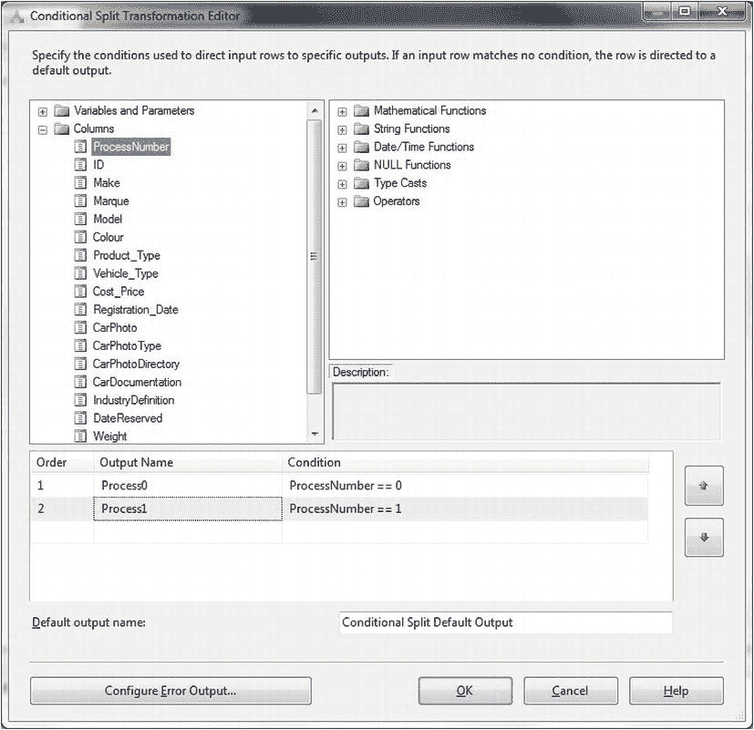
    图 13-21.  为脚本任务选择输入列

8.  在左窗格中选择“输入和输出”，并添加一个输出列（展开“输出 0”，选择“输出列”，然后单击“添加列”按钮）。将输出列命名为 `ProcessNumber`。它最好是 4 字节有符号或无符号整数数据类型。对话框将类似于图 13-22。

    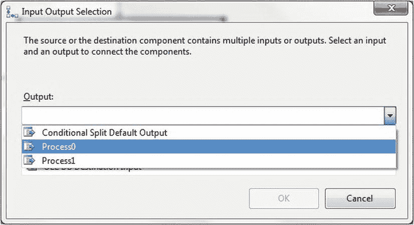
    图 13-22.  为脚本任务创建输出列

9.  在左窗格中选择“脚本”。将脚本语言设置为“Microsoft Visual Basic 2010”，然后单击“编辑脚本”。首先将以下两个指令添加到脚本文件的 `Imports` 区域：
    ```
    Imports System.Security.Cryptography
    Imports System.Text
    ```
10. 将方法 `Input0_ProcessInputRow` 替换为以下代码：
    ```
    Public Overrides Sub Input0_ProcessInputRow(ByVal Row As Input0Buffer)
        Row.ProcessNumber = GetHashValue(Row.Marque & Row.Make) Mod 2
    End Sub
    ```
11. 在 `ScriptMain` 类中添加以下函数：
    ```
    Private Function GetHashValue(ByVal SourceData As String) As Object
        Dim dataToHash As [Byte]() = New UnicodeEncoding().GetBytes(SourceData)
        Dim SHA As datatype = New SHA256Managed
        Dim hashedData As [Byte]() = SHA.ComputeHash(dataToHash)
        RNGCryptoServiceProvider.Create().GetBytes(dataToHash)
        Dim hashedDataInt As Int64 = BitConverter.ToInt64(hashedData, 0)
        Return Abs(hashedDataInt)
    End Function
    ```
12. 关闭 SSIS 脚本窗口并单击“确定”。
13. 添加一个 OLEDB 目标任务并将脚本任务连接到它。
14. 双击编辑目标任务，将其配置为使用 `CarSales_Staging_OLEDB` 连接管理器和 `Stock` 目标表。单击左侧的“列”进行列映射。
15. 单击“确定”完成。

你现在可以运行该包并加载数据。

### 工作原理
本配方试图回答这个问题：“如何从平面文件派生一个处理线程列以支持多个数据目标？”答案相当直接，包括使用脚本任务生成哈希和相应的 `ProcessNumber` 字段。为了避免重复前一个配方中描述的所有内容，我将仅解释差异，并使用之前的示例作为扩展的基础。

关于脚本代码有几点需要注意。首先，过程 `Input0_ProcessInputRow` 将在 SSIS 包处理的每一行触发。所以你要做的是向行中添加一个新列——然后向其中添加处理号。请注意，你必须在创建脚本之前创建新的输出列（至少如果你想避免烦人的警报和错误）。其次，`GetHashValue` 函数获取连接后的输入列，并创建一个 SHA 哈希，然后将其（嗯，至少是第一个字节）转换为整数。然后使用 `MOD` 函数（与前一个配方中使用的 T-SQL `%` 函数类似）使用此整数来派生处理号。


#### 提示、技巧与陷阱

-   哈希值不需要基于源表中的所有字段，因为此处并不需要确保唯一性（我们并非将此哈希用于比较，而仅用于在数据批次定义中实现近似平衡）。因此，请使用您认为能够提供公平分布的任何字段组合。
-   如果源数据中已有整数字段，且不需要生成哈希来推导流程 ID，那么您可以简单地使用以下单行代码来定义流程编号：`Row.ProcessNumber = (CType(Row.ID % 2, Int32) + 1);`

## 13-9. 并行读写数据库源数据

### 问题
您希望利用所有可用的处理器核心，高效地将数据从源数据库加载到 SQL Server 中。

### 解决方案
创建一个包含多个数据流任务的 SSIS 包，以并行方式读写数据，步骤如下。

1.  创建一个新的 SSIS 包。添加两个 OLEDB 连接管理器——一个连接到源数据库 CarSales (`CarSales_OLEDB`)，另一个连接到目标数据库 CarSales_Staging (`CarSales_Staging_OLEDB`)。
2.  在目标数据库 (CarSales_Staging) 中，使用以下 DDL 创建目标表 (`C:\SQL2012DIRecipes\CH13\tblExportStock.Sql`):
    ```sql
    CREATE TABLE CarSales_Staging.dbo.ExportStock
    (
     ID BIGINT NOT NULL,
     Make VARCHAR (50) NULL,
     Marque NVARCHAR(50) NULL,
     Model NVARCHAR(50) NULL,
    )  ;
    GO
    ```
3.  添加一个数据流任务，并双击进行编辑。
4.  添加一个 OLEDB 源并按如下配置：
    | OLEDB 连接管理器: | `CarSales_OLEDB` |
    | 数据访问模式: | SQL 命令 |
    | SQL 文本: | ```SELECT   ID, Make, Marque, Model FROM     dbo.Stock WITH (NOLOCK) WHERE    (AccountID % 4) = 0 OPTION (MAXDOP 1)``` |
5.  添加一个 OLEDB 目标，将前一个任务连接到它，并按如下配置：
    | OLEDB 连接管理器: | `CarSales_Staging_OLEDB` |
    | 数据访问模式: | 表或视图 – 快速加载 |
    | 表或视图的名称: | `dbo.ExportStock` |
    | 表锁: | 已勾选 |
6.  点击“映射”并映射列（源和目标中的所有列名相同，因此 SSIS 应该会自动完成此操作）。
7.  针对服务器上每个可用的处理器核心，重复步骤 5 到 6，但注意每次需将取模因子加一。对于第二个源到目标任务对，应为：`WHERE (AccountID % 4) = 1`；对于第三个源到目标任务对：`WHERE (AccountID % 4) = 2`；依此类推。

### 工作原理
另一种可以证明极其高效的方法（如果源和目标数据库的磁盘安装及网络设置允许的话）是执行多次并行读写，其中源数据使用取模运算分割到多个路径中，返回的值用作数据路径标识符。这将为您提供多个源组件，然后可以连接到多个目标组件，从而处理并行数据加载。

由于本方法本质上是前面方法中技术的融合，此处不再赘述过程的所有细节。所有详尽细节，请参考方法 13-7 和 13-8。

和之前一样，请务必在您的数据和设备上测试流程的效率，然后再假定它会带来真正的好处。再次提醒，只添加与您可用且空闲的处理器核心数量一样多的并行流程。

随着添加更多并行处理，此技术不会带来处理时间的线性改进。尽管如此，它仍然应该能缩短数据加载时间。如果源数据没有可用于设置数据分段的整数字段，请考虑使用一个或多个字段的数据哈希作为取模函数的基础，如前所述。

#### 提示、技巧与陷阱

-   不要害怕尝试各种可用参数。您可能不需要 `MAXDOP` 选项（无论如何，该选项仅适用于 SQL Server 源）。您可能会发现多个连接管理器可能会也可能不会带来好处。
-   如果改用 ODBC 数据连接，值得注意的是，对于同一张表或不同表，可以并行运行的 ODBC 目标组件数量没有限制。但 BOL 指出，所使用的 ODBC 提供程序的限制可能会限制通过该提供程序的并发连接数。这些限制会限制 ODBC 目标可能的受支持并行实例数量。

## 13-10. 并行批量插入记录

### 问题
您希望高效地将数据从源文件加载到 SQL Server 中。

### 解决方案
从单个源文件中读取多个连续范围的数据，并使用 SSIS 和多个 `BULK INSERT` 任务并行写入数据。具体操作说明如下。

1.  创建一个新的 SSIS 任务。创建以下包作用域变量。这将是每个批量插入任务处理的记录范围：
    | 变量名称 | 类型 | 值 |
    | --- | --- | --- |
    | `RecordRange` | Int16 | 1,000,000（或源文件中的近似记录数除以处理器核心数） |
2.  添加一个 OLEDB 配置管理器，配置为连接到名为 `CarSales_Staging_OLEDB` 的目标数据库。
3.  添加一个名为 `BulkLoad` 的平面文件连接管理器，并配置为读取源文件 (`C:\SQL2012DIRecipes\CH13\BulkStock.Csv`)。
4.  使用以下 DDL (`C:\SQL2012DIRecipes\CH13\tblBulkStock.Sql`) 创建 `CarSales_Staging.dbo.BulkStock` 目标表：
    ```sql
    CREATE TABLE CarSales_Staging.dbo.BulkStock
    (
     ID BIGINT NULL,
     Make VARCHAR(50) NULL,
     Marque NVARCHAR(50) NULL,
     Model VARCHAR(50) NULL
    ) ;
    GO
    ```
5.  假设您正在将数据加载到暂存表中，在数据流窗格中添加一个执行 SQL 任务，将其命名为 **准备目标表**，并按如下配置：
    | 连接类型: | OLEDB |
    | 连接: | `CarSales_Staging_OLEDB` |
    | SQL 语句: | `TRUNCATE TABLE dbo.BulkStock` |
6.  在数据流窗格中添加一个序列容器。将前一个任务——“准备目标表”——连接到它。
7.  在序列容器内添加与服务器上可用处理器核心数量一样多的批量插入任务。配置每个任务（使用“连接”窗格）使用 `BulkLoad` 源配置管理器读取数据，并写入相应的目标表，如图 13-23 所示。
    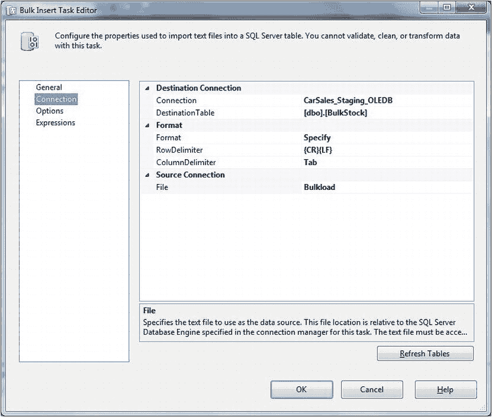
8.  双击第一个批量插入任务，点击“表达式”。展开右侧窗格中的“表达式”，然后点击省略号按钮。选择 `LastRow` 属性并将其设置为 `User::RecordRange` 变量。点击“确定”确认表达式，然后再次点击“确定”确认您对该批量插入任务的所有修改。
9.  双击第二个批量插入任务，点击“表达式”。展开右侧窗格中的“表达式”，然后点击省略号按钮。设置以下两个表达式：
    | FirstRow: | `@[User::RecordRange] + 1` |
    | LastRow: | `(@[User::RecordRange] * 2)` |
10. 双击第三个批量插入任务，点击“表达式”。展开右侧窗格中的“表达式”，然后点击省略号按钮。设置以下两个表达式：
    | FirstRow: | `(@[User::RecordRange] * 2) + 1` |
    | LastRow: | `(@[User::RecordRange] * 3)` |
11.


对所有批量插入任务执行相同的操作——**除了最后一个任务**——确保为每个任务将乘数（即上一步中的`*2`和`*3`）递增一。

12. 双击**最后一个**批量插入任务，点击`表达式`。在右侧窗格中展开`表达式`，并点击椭圆按钮。选择`FirstRow`属性并将其设置为`(@[User::RecordRange] * n) + 1`——其中`n`是乘数。不要设置最后一个`Row`属性，因为它将默认为源文件的最后一行。点击`确定`确认表达式，然后再次点击`确定`确认对该批量插入任务的所有修改。

最终的包应如图 图 13-24 所示。

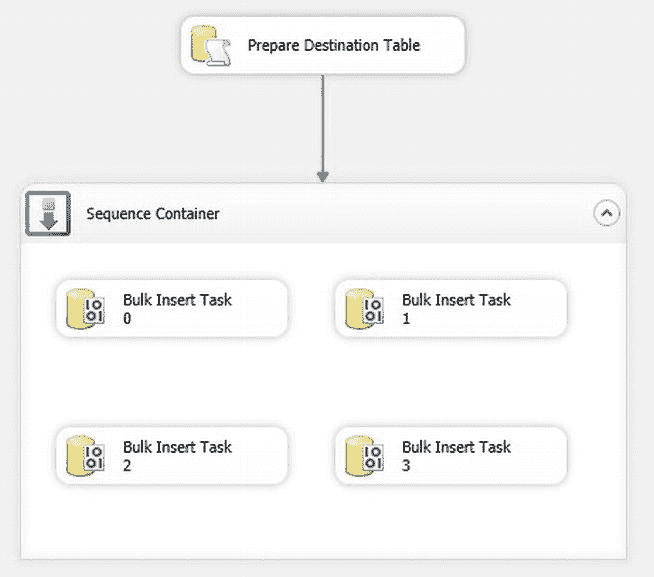

图 13-24。并行批量加载包

现在，当你运行该包时，源文件将使用所有可用的处理器核心并行加载，并且每个核心对应一个批量插入任务。每个批量插入任务将加载一组独立的记录。

### 工作原理

有些情况下，你会拥有一个非常大的单一源文件，并且加载数据的时间窗口非常有限。这时你需要能够从同一个文件中并行加载数据批次。幸运的是，批量插入任务恰恰可以做到这一点，因为它允许你指定从源文件加载的起始记录和结束记录。因此，如果你知道（或大致知道）源文件中可能有多少条记录，以及正在运行多少个并行进程，那么你就可以使用 SSIS 表达式为每个并行加载定义这些参数，从而从单个源文件执行并行批量插入。

你可以统计源文件中的记录数，以获得用于定义要加载记录子集的精确数字，但在大多数情况下，获取精确数字所花费的时间可能会使操作失去意义，因此一个近似值应该就足够了。如果文件大小差异很大，那么你可能别无选择，只能获取实际的行数。为此，只需创建一个数据流任务，使用平面文件源。从可用列中仅选择一列，并将其连接到一个行数转换，该转换配置有 `FileCounter` 变量作为行数变量。在测试包时，你将能够从源文件获取近似的记录数，并将其放入 `FileCounter` 变量中。

 **注意** 当我提到“可用”处理器核心时，我指的是可用于你正在构建的 ETL 过程的那些核心。如果你有一台专用于 SSIS 的服务器，并且你设计的过程将独占服务器资源，那么定义你可以使用的内核很容易——就是全部内核。如果服务器在你的加载过程运行的同时还将用于其他进程，那么你必须决定你希望 SSIS 使用多少个核心。

#### 提示、技巧与陷阱

*   创建比可用处理器核心更多的批量插入任务可能适得其反，因为核心之间的切换以及相关的等待会显著减慢进程速度。
*   你可以根据需要调整批量插入的各种可用配置选项——它们在配方 5-3 中有解释。
*   不幸的是，批量插入任务提供的日志记录、计数器或错误捕获选项很少。

## 13-11. 创建自优化的并行批量插入

### 问题

你希望实现并行批量插入的负载均衡。你希望进程能根据上一次加载作业的记录数来调整本次要加载的记录数。

### 解决方案

扩展在配方 13-10 中创建的包，以统计并存储数据加载的记录数。

这随后成为计算后续加载中平衡负载所用记录计数器的基础。配方 13-10 的包位于 `C:\SQL2012DIRecipes\CH13\13_10.Dtsx`。

以该包为基础，执行以下步骤。

1.  使用以下 DDL (`C:\SQL2012DIRecipes\CH13\tblSSISVariables.Sql`) 创建 `SSISVariables` SQL Server 表——用于存储 SSIS 变量：
    ```sql
    CREATE TABLE CarSales_Staging.dbo.SSISVariables
    (
     ID INT IDENTITY(1,1) NOT NULL,
     SSISPackageName NVARCHAR (50) NULL,
     SSISVarName NVARCHAR (50) NULL,
     SSISVarValue NVARCHAR (50) NULL,
     LastUpdated DATETIME NULL,
     CONSTRAINT PK_SSISVariables PRIMARY KEY CLUSTERED
      (
       ID ASC
      )
    ) ;
    GO
    ```
2.  使用类似以下的 T-SQL 向 `SSISVariables` 表添加一条记录：
    ```sql
    INSERT INTO dbo.SSISVariables (SSISPackageName, SSISVarName, SSISVarValue)
    VALUES ('ParallelBulkInsertFile.dtsx', 'RecordRange', '1000000')
    ```
3.  创建一个名为 `CarSales_Staging_ADONET` 的 ADO.NET 连接管理器，配置为连接到 `dbo.SSISVariables` 表所在的数据库（CarSales_Staging）。
4.  添加一个新的执行 SQL 任务，命名为 `获取记录范围`。按如下方式配置它：
    *   连接类型：ADO.NET
    *   连接：`CarSales_Staging_ADONET`
    *   SQL 语句：`SELECT @RecordRange = CAST(SSISVarValue AS INT) FROM dbo.SSISVariables WHERE SSISVarName = 'RecordRange'`
5.  点击参数映射并添加一个参数，如下所示：
    *   变量名称：`User::RecordRange`
    *   方向：输出
    *   类型：Int64
    *   参数名称：`@RecordRange`
    确认所有修改。
6.  将新任务连接到现有任务“准备目标表”。
7.  添加一个新的执行 SQL 任务，名为 `重新定义数据范围`。将序列容器连接到它。按如下方式配置：
    *   连接类型：ADO.NET
    *   连接：`CarSales_Staging_ADONET`
    *   SQL 语句：`UPDATE dbo.SSISVariables SET SSISVarValue = FLOOR(@RecordRange / @FileCounter) WHERE SSISVarName = 'RecordRange'`
8.  点击参数映射并添加一个参数，如下所示：
    *   变量名称：`User::RecordRange`
    *   方向：输入
    *   类型：Int64
    *   参数名称：`@RecordRange`
9.  确认所有修改。

最终的包应如图 图 13-25 所示。

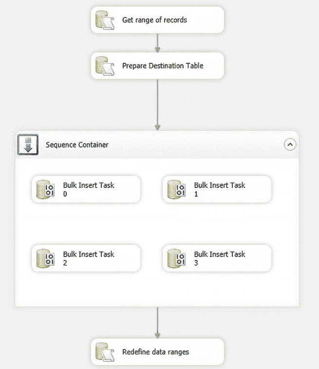

图 13-25。使用动态记录范围批量加载数据

### 工作原理

如果你面对的源文件大小可能略有甚至中等程度的变化，你可以计算并存储最近的加载计数器，并将其作为计算每个批量插入任务要加载记录范围的基础。当然，这样做是为了尝试实现所有软件开发的理想境界——一个自我管理的程序！要加载的记录范围无非就是最近一次加载的行数除以加载线程数。

## 13-12. 在受控批次中加载文件

### 问题

你希望在指定的时间范围内，以指定的批次加载多个不同的文件。

### 解决方案

使用 SSIS 创建一个批处理控制框架来分批加载数据，并对输入目录和扩展名进行参数化，步骤如下。

1.  使用以下 DDL (`C:\SQL2012DIRecipes\CH13\tblBatchFileLoad.Sql`) 创建一个 SQL Server 表 (`BatchFileLoad`) 来存储批处理元数据：
    ```sql
    CREATE TABLE CarSales_Staging.dbo.
    ```


# 批处理文件加载

## 1. 创建表
```sql
BatchFileLoad
(
    ID int IDENTITY(1,1) NOT NULL,
    FileName VARCHAR(250) NULL,
    IsToload BIT NULL,
    IsLoaded BIT NULL,
    FileSize BIGINT NULL,
    CreationTime DATETIME NULL,
    FileExtension VARCHAR(5) NULL,
    DirectoryName VARCHAR(250) NULL,
    LastWriteTime DATETIME NULL
);
GO
```

## 2. 配置 SSIS 任务和连接管理器
创建一个新的 SSIS 任务，将其命名为`BatchFileLoad`。添加两个连接管理器：一个名为`CarSales_Staging_ADONET`的 ADO.NET 连接管理器，以及一个名为`CarSales_Staging_OLEDB`的 OLEDB 连接管理器。这两个连接管理器都连接到用于加载数据和持久化元数据的数据库。

## 3. 添加平面文件连接
添加一个新的平面文件连接，命名为`Data Source File`。将其配置为使用源目录中的任意文件。

## 4. 创建变量
创建以下变量：

| 变量名 | 作用域 | 类型 | 值/注释 |
|---|---|---|---|
| `ADOTable` | 包 | 对象 | 包含要处理文件列表的对象变量。 |
| `BatchQuantity` | 包 | Int32 | 每批处理的文件数量（50）。 |
| `CreateList` | 包 | Boolean | 指示是否要删除并重新创建文件列表的标志（True）。 |
| `FileFilter` | 包 | String | 所有要处理文件的文件扩展名（`*.CSV`）。 |
| `FileSource` | 包 | String | 源文件的源目录（`C:\SQL2012DIRecipes\CH13`）。 |
| `IsFinished` | 包 | Boolean | 指示进程是否已完成的标志（False）。 |
| `ListConn` | 包 | String | 连接管理器名称（`CarSales_StagingADONET`）。 |
| `MaxFilesToProcess` | 包 | Int64 | 每批处理文件数量的最大上限阈值（5000）。 |
| `MaxProcessDuration` | 包 | Int32 | 批处理停止前运行的最大秒数上限阈值（7200）。 |
| `ProcessFile` | 包 | String | 当前正在处理的文件（n/a）。 |
| `SortElement` | 包 | String | 列表排序的指示器（`FileSize.`）。 |
| `TotalFilesLoaded` | 包 | Int64 | 批处理中已处理文件的计数器（0）。 |

## 5. 创建文件处理循环容器
在控制流窗格中添加一个`For Loop`容器，将其命名为`Create table of files to process`。

### 5.1 添加任务
在容器内部，添加一个名为`Prepare Table`的执行 SQL 任务。然后添加两个脚本组件，分别命名为`Loop Through Files and Write to table`和`Reset Variable`。

### 5.2 连接组件
按照图 13-26 所示顺序连接这些组件。

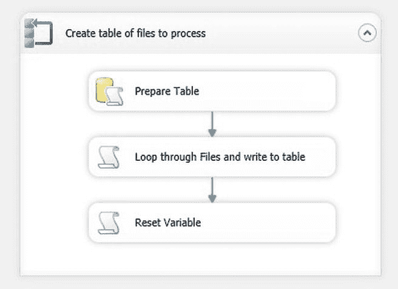
*图 13-26. 为受控文件加载定义要处理的文件列表*

### 5.3 设置循环条件
将`Create table of files to process`任务的`EvalExpression`设置为：
```
@CreateList == True
```

## 6. 配置“准备表”任务
配置`Prepare Table`任务如下：

| 连接类型 | ADO.NET |
|---|---|
| 连接 | `CarSales_Staging_ADONET` |
| SQL 语句 | `TRUNCATE TABLE dbo.BatchFileLoad` |

## 7. 配置“循环文件并写入表”脚本组件
配置`Loop Through Files and Write to table`脚本组件如下：
`ReadOnly Variables`: `User::FileFilter`, `User::FileSource`, `User::ListConn`

## 8. 添加脚本代码
将脚本组件的语言设置为 Microsoft Visual Basic 2010，然后单击“编辑脚本”。

### 8.1 添加导入语句
将以下内容添加到导入区域：
```vb
Imports System.Data.SqlClient
Imports System.IO
```

### 8.2 替换主方法
使用以下代码替换`Main`方法（`C:\SQL2012DIRecipes\CH13\ControlBatchLoad.Vb`）：
```vb
Public Sub Main()

    Dim sqlConn As SqlConnection
    Dim sqlCommand As SqlCommand

    sqlConn = DirectCast(Dts.Connections(Dts.Variables("ListConn").Value.ToString). _
                         AcquireConnection(Dts.Transaction), SqlConnection)

    Dim FileSource As String = Dts.Variables("FileSource").Value.ToString
    Dim FileFilter As String = Dts.Variables("FileFilter").Value.ToString

    Dim dirInfo As New System.IO.DirectoryInfo(FileSource)
    Dim fileSystemInfo As System.IO.FileSystemInfo
    Dim FileName As String
    Dim FileFullName As String
    Dim FileSize As Long
    Dim FileExtension As String
    Dim CreationTime As Date
    Dim DirectoryName As String
    Dim LastWriteTime As Date

    Dim sqlText As String

    For Each fileSystemInfo In dirInfo.GetFileSystemInfos(FileFilter)

        FileName = fileSystemInfo.Name
        FileFullName = fileSystemInfo.FullName

        Dim fileDetail As New FileInfo(FileFullName)

        FileSize = fileDetail.Length
        CreationTime = fileDetail.CreationTime
        FileExtension = fileDetail.Extension
        DirectoryName = fileDetail.DirectoryName
        LastWriteTime = fileDetail.LastWriteTime

        sqlText = "INSERT INTO dbo.BatchFileLoad " _
                  & "(FileName, IsToload, IsLoaded, FileSize, CreationTime, " _
                  & "FileExtension, DirectoryName, LastWriteTime) " _
                  & "VALUES('" & FileName & "', 1, 0, " & FileSize & ", '" _
                  & String.Format("{0:s}", CreationTime) & "', '" & FileExtension & "', '" _
                  & DirectoryName & "', '" & String.Format("{0:s}", LastWriteTime) & "')"

        sqlCommand = New SqlCommand(sqlText, sqlConn)
        sqlCommand.CommandType = CommandType.Text
        sqlCommand.ExecuteNonQuery()

    Next

    Dts.TaskResult = ScriptResults.Success

End Sub
```

## 9. 配置“重置变量”任务
配置`Reset Variable`任务，变量设置如下：
`ReadWrite Variables`: `CreateList`

## 10. 添加重置脚本
将语言设置为 Microsoft Visual Basic 2010 后，向脚本任务添加以下脚本：
```vb
Public Sub Main()

    Dts.Variables("CreateList").Value = False

    Dts.TaskResult = ScriptResults.Success

End Sub
```

> 这完成了包的第一部分——遍历所有要处理的文件并将其数据存储在`BatchFileLoad`表中的过程，以及重新启动进程和重新生成文件列表的可能性。

## 11. 初始化文件计数器
在控制流窗格中添加一个脚本任务，命名为`Initialize file counter`，并设置以下变量：
`ReadWrite Variables`: `User::TotalFilesLoaded`

### 11.1 添加初始化脚本
将语言设置为 Microsoft Visual Basic 2010 后，向脚本任务添加以下脚本：
```vb
Public Sub Main()

    Dts.Variables("TotalFilesLoaded").Value = 0
    Dts.TaskResult = ScriptResults.Success

End Sub
```

## 12. 创建批处理循环容器
在控制流窗格中添加一个`For Loop`容器，将其命名为`Batch Process`。将其`EvalExpression`设置为：
```
@IsFinished == False || @TotalFilesLoaded < @MaxFilesToProcess ||
DATEADD( "ss", @MaxProcessDuration, @[System::ContainerStartTime] ) > GETDATE()
```

### 12.1 在容器内添加任务
在此`For Loop`容器内，按顺序添加以下任务：
- 一个名为`Get Batch`的执行 SQL 任务。
- 一个名为`Process Files while there are files to Process`的`Foreach Loop`容器。
- 一个名为`Count remaining files to process`的执行 SQL 任务。


## 每次循环容器内部

在名为 `Load Batch` 的每次循环容器内部，按此顺序添加并连接以下内容：
*   一个名为 `Data Load` 的数据流任务。
*   一个名为 `Log file is loaded` 的执行 SQL 任务。
*   一个名为 `Increment file counter` 的脚本任务。

此部分程序包应类似于图 13-27。
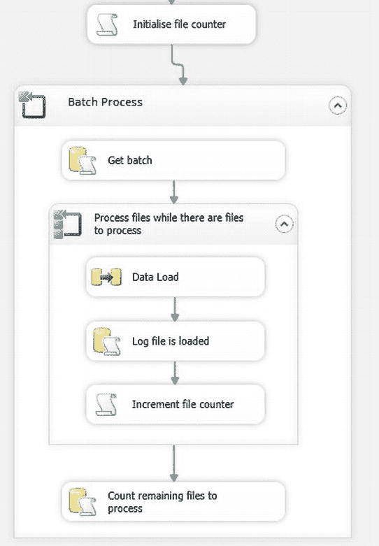
图 13-27. 处理受控批量加载

25. 配置 "Get Batch" 执行 SQL 任务，使其属性如下：
| **连接：** | | |
| 连接类型： | ADO.NET | |
| 连接： | `CarSales_Staging_ADONET` | |
| SQL 语句： | `SELECT TOP (@BatchQuantity) [FileName] FROM dbo.BatchFileLoad WHERE IsToload = 1 AND IsLoaded = 0 ORDER BY FileSize` | |
| 结果集： | 完整结果集 | |
| 结果集： | 变量名: `User::ADOTable` | |
| 结果名称： | 0 | |
| **参数映射：** | | |
| 变量名： | `User::BatchQuantity` | |
| 方向： | 输入 | |
| 数据类型： | Int32 | |
| 参数名： | `@BatchQuantity` | |

26. 配置 `Data Load` 任务，使数据流源是名为 `Data Source File` 的平面文件连接，数据流目标是使用 `CarSales_Staging_OLEDB` 连接的 OLEDB 目标。确保已映射列。

27. 配置 "Log file is loaded" 任务，属性如下：
| **连接窗格：** | |
| 连接类型： | ADO.NET |
| 连接： | `CarSales_Staging_ADONET` |
| SQL 语句： | `UPDATE BatchFileLoad SET IsLoaded = 1, DateLoaded = GETDATE() WHERE FileName = @ProcessFile` |
| **参数映射窗格：** | |
| 变量名： | `User::ProcessFile` |
| 方向： | 输入 |
| 数据类型： | String |
| 参数名： | `@ProcessFile` |

28. 配置名为 `Increment File counter` 的脚本任务，添加以下变量：
| ReadWrite 变量： | `User::TotalFilesLoaded` |

29. 将语言设置为 Microsoft Visual Basic 2010 后，将以下脚本添加到脚本任务中：
```
Public Sub Main()
    Dts.Variables("TotalFilesLoaded").Value = Dts.Variables("TotalFilesLoaded").Value + 1
    Dts.TaskResult = ScriptResults.Success
End Sub
```

30. 关闭脚本窗口并确认。

31. 配置 "Count remaining files to process" 执行 SQL 任务，使其如下：
| **连接窗格：** | | |
| 连接类型： | ADO.NET | |
| 连接： | `CarSales_Staging_ADONET` | |
| SQL 语句： | `DECLARE @FileCountToProcess INT SELECT @FileCountToProcess = COUNT(*) FROM BatchFileLoad WHERE IsLoaded = 0 IF @FileCountToProcess = 0 BEGIN SET @IsFinished = 1 END ELSE BEGIN SET @IsFinished = 0 END` | |
| **参数映射窗格：** | |
| 变量名： | `User::IsFinished` |
| 方向： | 输出 |
| 数据类型： | String |
| 参数名： | `@IsFinished` |

现在可以运行该流程了。

## 工作原理

根据我的经验，另一个常见的需求是从多个文件加载数据，并分批加载。想要这样做可能有几个原因：
*   无法保证数据加载能在所需（或合理）时间内完成，并且需要能够随时停止加载并在之后继续。
*   希望在指定时间段内加载文件，并在指定时间段过去后，一旦最后一个完整文件加载完毕，流程即停止。
*   需要在数据批次加载完成后执行中间处理。
*   如果数据以优化的批次加载，您的 ETL 流程会更高效（例如，分解 XML 文件或由于索引约束）。

当然，能够处理这些需求的批处理流程也必须能够对源文件进行排序，并记录加载了哪个文件。它必须具有足够的弹性，以允许从故障点进行优雅的恢复和重启。

因此，这里有一个满足这些需求的 SSIS 程序包。为了使其更加灵活，它允许您以 SSIS 变量的形式传入表 13-1 中的参数。

表 13-1. 并行加载中使用的 SSIS 参数
| 参数 | 描述 |
| --- | --- |
| 批次大小 | 每批处理的源文件数量。 |
| 总处理大小 | SSIS 程序包停止前处理的源文件数量。 |
| 最大处理持续时间 | 流程将运行的秒数——加上完成当前文件加载所需的时间。 |
| 要处理的目录 | 存储源文件的目录。 |
| 文件筛选器 | 通常是文件扩展名。 |

该程序包分为两部分。首先，处理一个循环容器，该容器收集所有待处理文件的数据，并将此数据写入 SQL Server 表。使用表是为了确保所有元数据都持久存储到可保证可靠的数据存储中。其次，另一个循环容器只要还有文件待处理——并且还有时间且未达到最大文件数——就会处理文件。在这个“逻辑”循环容器内部是另一个提供批量加载的循环容器。

该流程需要知道它是全新的加载，还是继续现有的加载。为此，如果流程要从中断处继续，`@CreateList` 变量将作为 `False` 传入。默认是 `True`，（乐观地）假设流程总能及时完成，没有错误，并且永远不会有太多文件需要处理。由于有三个阻塞阈值，在运行流程时必须传入这些值——或者接受默认值：
*   最大时间（通过比较容器启动时间与系统日期相加的秒数来检测）。
*   最大文件数（每次加载文件时递增）。
*   所有文件已加载（当最后一批不包含文件时标记）。

流程的初始部分——“创建待处理文件表” For 循环容器——在 `BatchFileLoad` 表中定义了要加载的文件列表，并初始标记为尚未加载。跟踪实际已加载文件数的计数器变量设置为 0。外部（控制）For 循环容器检查：
*   并非所有文件都已加载。
*   未超过分配的时间。
*   未超过要处理的文件总数。

假设这些条件都不成立，则控制权传递给加载流程。首先，从 `BatchFileLoad` 表中选择指定数量的要加载的文件（或剩余的文件，如果数量更少），并传递给 `ADOTable` ADO.NET 对象。然后，内部（加载）For 循环容器处理 `ADOTable` 中的文件。这包括：
*   加载文件。
*   将成功加载记录到 `BatchFileLoad` 控制表。
*   递增已加载文件总数计数器。

“遍历文件并写入表”任务遍历指定目录中的所有文件，并将文件名和相关属性写入控制表。它使用现有的 ADO.NET 连接管理器。在此示例中，SQL 作为文本发送，但您可以使用存储过程并将值作为参数传入。

“统计剩余待处理文件”中的 SQL 统计“控制”表中剩余待处理的文件数。


随后，若满足条件，它会将 `IsFinished` “停止”变量设置为 `True`，此值会被 `Foreach 循环容器` 捕获，作为将控制权传递给下一个任务的指示。

**注意**   为简化解释和代码，上述描述的过程并未包含错误处理。然而，在生产环境中，你绝对应该添加错误捕获和处理机制，至少应能检测文件加载失败并记录一次失败的文件加载。你还应在 `加载批次` 容器的级别定义 `MaximumErrorCount`，以指示在包失败前允许的错误数量。

#### 提示、技巧与陷阱

*   在实际生产环境中，你可能更倾向于将元数据（即 `BatchFileLoad` 表）存储在不同的数据库中。这完全取决于你的决定。
*   当然，你必须根据你的需求设置变量值和连接管理器。
*   你可以扩展此过程，利用配方 13-3 中描述的技术，来处理来自多个文件夹和文件筛选器的文件。

## 13-13. 使用 SSIS 并行执行 SQL 语句与存储过程

### 问题
你希望加速一个包含多个 T-SQL 存储过程的 SSIS ETL 过程。

### 解决方案
使用多个并发任务来执行 SQL。这就像设置两个或多个并行的执行 SQL 任务一样简单。

1.  对于要并行执行的每个进程，在 `控制流` 选项卡上、前置任务（如果存在）下方添加一个 `执行 SQL` 任务。
2.  将前置任务（如果存在）连接到所有新的 `执行 SQL` 任务。
3.  将所有新的 `执行 SQL` 任务连接到后续任务（如果存在）。
4.  为每个任务定义 SQL（作为存储过程调用或 T-SQL 代码）。创建或使用任何你需要的连接管理器。

一个纯粹理论性的包可能如 图 13-28 所示。
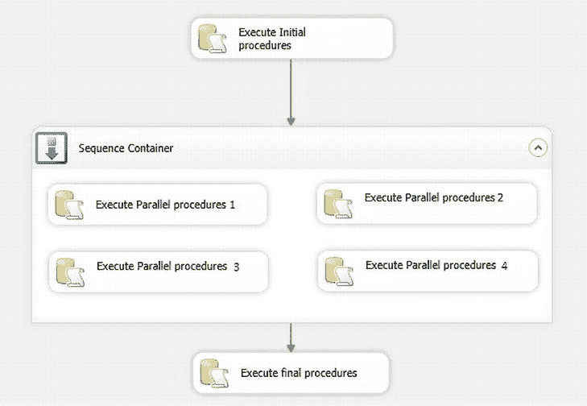
图 13-28.  并行 SQL 任务

### 工作原理
有时，你可能希望避免 T-SQL 纯粹的顺序执行特性，并希望并行执行一系列 T-SQL 语句或存储过程。虽然两种经典的技术解决方案实现起来很简单，但实践起来可能陷阱重重。如果你打算这样做，你必须绝对确保：

*   任何并行运行的进程不会相互阻塞，导致你的系统瘫痪。这可能意味着它们不会同时写入相同的表。在 ETL 场景中，这意味着要确保数据读取时适当使用 `NOLOCK` 提示。当然，I/O 子系统也必须能够处理增加的争用。
*   这些进程不会竞争相同的资源（磁盘、内存等），否则可能导致系统随着 SQL Server 试图处理所有冲突的需求而慢如蜗牛。
*   你的系统拥有多处理器，并且在运行并行进程时这些处理器处于空闲或低负载状态。
*   进程流逻辑允许并行执行。也就是说，你可以同时运行进程 A 和进程 B，因为进程 B 不依赖于进程 A。在实际世界中，这意味着从一开始就要设计包来处理并行处理。

无论如何，我建议谨慎行事。所以，无论何种情况，都要对并行进程进行多次、多次测试——因为你永远不知道在这些情况下何时会发生冲突或锁定。然后，为顺序进程建立时间基准，并用其与并行进程进行比较。如果你获得了显著更快的结果，那么就要问：“风险是什么？” 切勿假定并行执行会自动变得更快。

当然，没有硬性规定说明何时应该并行处理、何时不应该，因此我只能建议一些我发现它有用的情形。当然，可能还有成百上千的其他可能性：

*   你希望更新索引或重新索引表，而这些表和索引位于不同磁盘阵列的不同文件组上，因此几乎不会有 I/O 争用。话虽如此，根据我的经验，即使索引和数据位于相同的磁盘上，并行（重新）索引也可能更快——只是要小心避免因并行索引而堵塞系统 I/O！
*   进程是完全独立的——一个在一个数据库中聚合数据，而另一个从链接服务器将数据加载到另一个独立的数据库中。

## 13-14. 不使用 SSIS 并行执行 SQL 语句与存储过程

### 问题
你希望加速一个包含多个 T-SQL 存储过程的 ETL 过程。你不想使用 SSIS。

### 解决方案
调用操作系统 shell 来使用 `SQLCMD` 调用 T-SQL 存储过程。下面的代码是一个纯粹假设性的示例，用以说明原理。

1.  使用文本编辑器创建一个命令文件，如下所示（我将其命名为 `C:\SQL2012DIRecipes\CH13\runinparallel.cmd`）：
    ```
    START SQLCMD -E -dCarSales_Staging -Q"EXEC dbo.pr_AA_1_Par" -b
    START SQLCMD -E -dCarSales_Staging -Q"EXEC dbo.pr_AA_2_Par" -b
    ```
2.  保存文件。
3.  从 T-SQL 内部调用该命令文件，例如：
    ```
    DECLARE @CmdResult INT
    EXEC      @CmdResult = master..xp_CmdShell 'C:\SQL2012DIRecipes\CH13\runinparallel.cmd'
    IF (@result <> 0)
       RETURN
    ```

### 工作原理
此技术使用 `xp_cmdshell` 来运行操作系统命令文件。该文件运行 `SQLCMD` 调用，并使用大写的 `-Q` 选项在运行后退出，以及 `-b` 选项在出错时退出。`-E` 指定使用可信连接。`START` 命令将在独立的窗口（即独立的进程）中运行每个 `SQLCMD`。

从 T-SQL 调用并行进程需要：

*   调用操作系统 shell
*   或者创建一个 CLR 进程来处理多线程。

这里我仅简要探讨前者，因为我尚未在生产环境中使用过后者。然而，由于我们正在“逆 T-SQL 之流而行”，需要警告的是，这在生产环境中可能充满问题，并且将需要：

*   权限（以及可能的 `xp_cmdshell` 代理帐户）——请查阅联机丛书（BOL）。
*   启用 `xp_cmdshell`。许多 DBA 不允许这样做——所以请注意！

#### 提示、技巧与陷阱
*   当然，数据库和存储过程的名称必须与你想要并行运行的名称相对应。
*   你可以使用 `-vnn`（例如 `-v16`）来设置将导致错误并退出进程的严重级别。
*   此方法假设你已在存储过程中实现了错误捕获和日志记录。
*   你可以将多个（顺序的）存储过程作为并行进程调用的一部分发送。在这种情况下，在 `START` 行中用分号分隔每个存储过程。
*   我强烈建议在使用 `xp_cmdshell` 时添加错误捕获。

## 13-15. 使用 SQL Server Agent 并行执行 SQL 语句与存储过程

### 问题
你希望加速一个包含多个 T-SQL 存储过程的 ETL 过程。你不想使用 SSIS。

### 解决方案
使用 `SQL Server Agent`。尽管这是一个极其简化的解决方案，但仍然可以使用 `SQL Server Agent` 来并行运行 T-SQL 过程（无论是存储过程还是代码片段）。你需要做的就是创建与要运行的进程数量一样多的 SQL Server Agent 作业，并将每个作业的计划设置为在完全相同的时间开始。


#### 提示、技巧与陷阱
-   虽然您可以使用 SQL Server Agent 启动并行 SSIS 包，但更简单的方法是使用单个 SSIS 包，然后调用其他子包。
-   当需要在初始并行进程之后运行进一步的流程时，情况会变得更加棘手。在这种情况下，我首选的解决方案是让并行进程将它们的结果记录到一个表中，后续进程轮询这个表。一旦所有并行进程完成，后续进程就可以开始。

#### 总结
本章说明了加速数据加载的多种方法。我希望这些方法能立即用于您优化 ETL 流程的任务中，或者能启发您找到加载数据的最佳方法。

本章中的许多技巧都基于使用并行加载。我假设您将使用多处理器服务器来运行您的流程，但在当今世界，这种情况很少见。不过请记住，分割源读取和目标加载不会自动带来更好的结果，并且在部署到生产环境之前，您必须测试您评估的每种方法。

为了更清晰地概述，表 13-2 展示了我对各种方法的看法。

**表 13-2. 本章中使用的各种方法的优缺点**

| 技术 | 优点 | 缺点 |
| --- | --- | --- |
| 多个顺序文件加载 | 易于设置。 | 慢。 |
| 从多个目录进行多个顺序文件加载 | 避免将文件复制到单个源目录。可以扩展以提供许多优点。 | 慢。设置更复杂。 |
| MULTIFLATFILE 连接管理器 | 易于设置。避免将文件复制到单个源目录。 | 慢。 |
| 文件加载的排序和筛选 | 使用标准或 MULTIFLATFILE 连接管理器无法实现。 | 设置更复杂。 |
| 并行文件加载 | 相对易于设置。吞吐量显著增加。 | 文件格式必须相同。仅在多处理器服务器上有效。 |
| 带负载均衡的并行文件加载 | 吞吐量显著增加。 | 难以设置。仅在多处理器服务器上有效。 |
| 从单个数据源并行加载 | 相对易于设置。吞吐量有所增加。 | 仅在多处理器服务器上有效。 |
| SQL 数据库的并行读写 | 相对易于设置。吞吐量显著增加。 | 仅在多处理器服务器上有效。 |
| 受控的批处理文件加载 | 允许定时加载和受控的文件加载数量。 | 难以设置。 |
| 并行 SQL 语句 | 需要 SSIS 或 `xp_cmdshell`。 | 存储过程之间无依赖关系。 |

## 第 14 章


## ETL 流程加速
有时，让源数据快速加载到 SQL Server 中需要很好地审视整个流程。当然，如果您能充分利用所有可用的处理器核心并尝试并行化加载，就可以缩短加载时间——正如我们在第 13 章中所见。然而，如果您正在尝试优化加载并确保作业的整个时间（而不仅仅是数据加载）缩短到可接受的时间范围内，ETL 加载的其他方面也需要考虑。

在本章中，我们将探讨 ETL 加载的这些其他方面，以及如何调整它们以确保最佳的加载时间。它们包括：
-   高效使用 SSIS 查找缓存。
-   目标表的索引管理。
-   确保最小化日志记录。
-   确保批量加载而非逐行插入。

与往常一样，任何示例文件都可以在电子书的配套网站上找到。下载并安装后，它们位于 `C:\SQL2012DIRecipes\CH14` 文件夹中。

我建议您为每个技巧删除并重新创建任何表或其他对象。

作为研究这些更“高级”想法的前奏，有一些基本技巧值得重复。因此，在着手解决具有挑战性的加载时间的复杂解决方案之前，请记住首先查看以下内容：
-   在查找任务中定义源数据时，使用 `SELECT` T-SQL 查询而不是表源。这是因为任何未使用的源列都会不必要地占用 SSIS 管道带宽。
-   在读取外部数据源时使用 `NOLOCK`（或任何非 SQL Server 数据库的等效命令）可以提高数据读取速度。
-   如果您使用平面文件源，请仅选择（在“列”窗格中）您需要通过 SSIS 管道发送的列。与数据库源一样，这缩小了行宽度，从而允许 SSIS 管道中容纳更多行。
-   对于平面文件，如果日期和时间字段对区域设置不敏感，您还可以选择 `FastParse` 选项。
-   如果需要对数据库源数据进行排序，通常最好在源数据库中使用 `ORDER BY`。
-   在源数据库中执行数据类型转换可以提高 SSIS 吞吐量。
-   以压缩格式传输平面文件，然后在本地服务器磁盘（尤其是快速磁盘）上解压缩，比通过网络读取平面文件更高效。
-   毫无疑问，您是将数据加载到 SQL Server 中——因此一个经过优化的服务器可以带来巨大的差异。始终值得确保 `TempDB` 得到最优配置（文件数量与处理器数量相同，文件位于单独的磁盘阵列上等）。当然，将数据与日志文件以及索引分离同样是基础。
-   检查服务器上分配给 SQL Server 的内存。我多次看到人为设置的过低阈值。没有什么比内存不足更能拖慢您的查询速度。
-   由于 SQL Server 和 SSIS 喜欢内存——您能添加更多内存吗？这可能是缓解 ETL 流程缓慢的最简单方法。
-   默认的网络数据包大小是否适合您的环境？这是一个复杂的主题，但将数据包大小（使用网络数据包大小配置选项）从默认的 4096 增加到 32767——或者在安全套接字层（SSL）和传输层安全性（TLS）环境中增加到 16Kb，可以提高吞吐量。在 SSIS 中，这是 OLEDB 连接管理器“全部”窗格中的 `Packet Size` 选项。
-   如果可以避免异步转换（例如排序和聚合转换），那就避免。这可能意味着在源数据库中对数据进行排序，或者说服平面文件提供程序提供预先排序的数据集。

无论如何，确保遵循基本的优化技术绝不会损害您的加载流程。因此，在基础工作完成后，也许是时候转向一些更高级的可能性了。

由于 ETL 优化无法通过应用单一技术实现，因此本章中的技巧之间不可避免地存在一定的重叠。这对于最后一个技巧尤其如此，它融合了本章其他许多技巧中看到的几种技术。这是为了提供一个最终的“整体”概述来结束本章。

### 14-1. 加速 SSIS 查找
**问题**
您希望构建尽可能高效地使用查找任务的 SSIS 包。

**解决方案**
“预热”查找转换数据缓存，使查找只需要很少或不需要磁盘访问。

1.  使用以下 DDL 创建目标表：
    ```
    CREATE TABLE dbo.CarSales_Staging.CachedCountry
     (
      ID INT,
      ClientName NVARCHAR(150),
      CountryName_EN NVARCHAR(50)
     )
    ```
2.  创建一个新的 SSIS 包。
3.  添加两个 OLEDB 连接管理器。


第一个命名为 `CarSales_OLEDB`，连接至 `CarSales` 数据库；第二个命名为 `CarSales_Staging_OLEDB`，连接至 `CarSales_Staging` 数据库。

4.  添加一个数据流任务，命名为 `Prepare Cache`。双击进行编辑。
5.  添加一个 OLEDB 源连接并按如下配置：
    - OLEDB 连接管理器：`CarSales_OLEDB`
    - 数据访问模式：`SQL 命令`
    - SQL 命令文本：`SELECT CountryID, CountryName_EN FROM dbo.Countries WITH (NOLOCK)`
6.  点击确定确认。
7.  添加一个缓存转换，并将 OLEDB 源连接到它。双击进行编辑。
8.  点击新建以创建一个新的缓存连接管理器。将其命名为 `ClientDimensionCache`，勾选 `使用文件缓存`，并输入缓存文件将存储的路径（此示例中为 `C:\SQL2012DIRecipes\CH14\CachePreLoad.caw`）。对话框应大致如图 14-1 所示。

    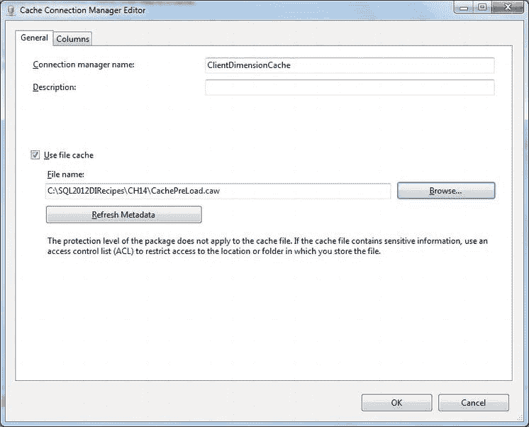
    图 14-1. 缓存连接管理器编辑器

9.  点击“列”选项卡，并将本示例中的 ID 列的“索引位置”设置为 1。对话框应如图 14-2 所示。

    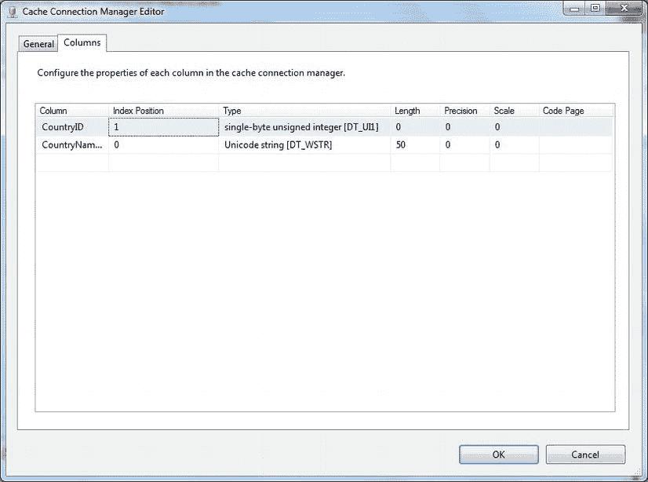
    图 14-2. 在缓存连接管理器中指定索引列

10. 点击确定确认缓存连接管理器的规格。返回 OLEDB 源编辑器。
11. 点击左侧的“列”，确保源和目标之间的列已正确映射。
12. 点击确定完成 OLEDB 源编辑器的修改。
13. 点击“控制流”返回“控制流”窗格。
14. 添加一个新的名为“数据加载”的数据流任务，并将“准备缓存”数据流任务连接到它。双击进行编辑。
15. 添加一个 OLEDB 源任务。按如下配置：
    - OLEDB 连接管理器：`CarSales_OLEDB`
    - 数据访问模式：`SQL 命令`
    - SQL 命令文本：`SELECT ID, ClientName, Country FROM Client`
16. 添加一个查找任务。将 OLEDB 源任务连接到它。按如下配置查找任务：

    | 窗格 | 选项 | 设置 |
    |---|---|---|
    | 常规 | 缓存模式 | 完全缓存 |
    | | 连接类型 | 缓存连接管理器 |
    | | 无匹配条目 | 组件失败 |
    | 连接 | 缓存连接管理器 | `ClientDimensionCache` |
    | 列 | | 映射 `Country` 和 `CountryID` 列。从“可用查找列”中选择 `CountryName_EN` 列。 |

    查找转换编辑器对话框将如图 14-3 所示。

    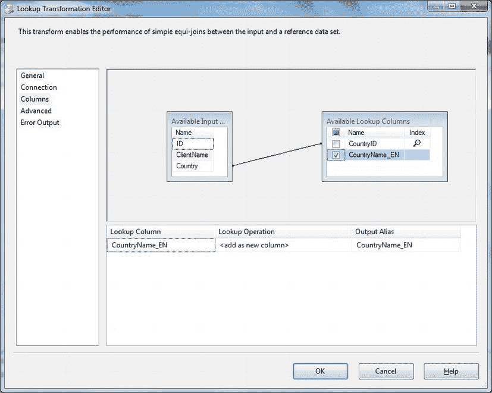
    图 14-3. 在缓存连接管理器中映射列

17. 点击确定确认更改。
18. 添加一个 OLEDB 目标任务。将其连接到查找转换，并使用查找匹配输出。双击进行编辑。
19. 按如下配置 OLEDB 目标：
    - OLEDB 连接管理器：`CarSales_Staging_OLEDB`
    - 数据访问模式：`表或视图 – 快速加载`
    - 表或视图的名称：`CachedCountry`
20. 点击左侧的“映射”，确认列已正确映射。
21. 点击确定确认更改。

现在您可以运行该包并在查找任务中使用预加载的缓存。

## 它是如何工作的

自产品发布以来，查找转换一直是 SSIS 的一部分，而对其性能的抱怨也大约从那时开始。SQL Server 2008 和查找转换数据缓存的出现，为查找转换可能导致的速度问题提供了一个高效的解决方案。

本质上，这是在 SSIS 项目中预加载和/或重用缓存数据的一种方式。因此，假设您的 ETL 作业允许，本配方展示了如何预加载查找缓存。

文件缓存的优势在于它可以在一个进程中多次使用，并且可以从多个包中使用。如果您是为一个单独的包（即正在准备缓存的那个包）预热缓存，那么您可能最好只将缓存预加载到内存中。

一些 SSIS 查找缓存选项需要进一步解释，如表 14-1 所述。

表 14-1. SSIS 缓存选项

| 选项 | 定义 | 说明 |
|---|---|---|
| 完全缓存 | 查询（或表）的结果被完全加载。用于填充缓存的查询几乎在 SSIS 包执行开始时执行。 | 这非常耗费资源，因为必须有足够的内存来加载所需数据。此外，如果查询的是大表，完全加载可能需要相当长的时间，并且会给 I/O 子系统增加压力。 |
| 部分缓存 | 加载匹配的行，并且最近最少使用的行会从缓存中移除。 | 查询仅在请求查找时才执行。 |
| 无缓存 | 没有记录被加载到缓存中。 | 不需要内存——但通常是最慢的查找选项。可能 I/O 密集，因为每次查找都是一个单独的查询。 |
| 为无匹配条目的行启用缓存 | 存储不匹配的行以避免代价高昂的后续查找。 | 确保不会发生无意义的 I/O。如果记录不在引用数据集中，SSIS 缓存将“记住”它，不会再次查找。 |
| 缓存大小 | 您可以指定要分配的缓存大小。 | 32 位和 64 位环境不同。可能需要一些实践才能使其达到最佳。 |

 **注意** 为了最高效地预热缓存，您应该在查找所使用的列上建立索引（本例中为 `CountryID` 和 `CountryName_EN`）。这可以是一个使用 `INCLUDE CountryName_EN` 的覆盖索引。

### 提示、技巧和陷阱

-   预加载数据缓存仍然可能花费很长时间，并且不是解决使用查找转换时所有速度问题的灵丹妙药。但是，如果您能够在进程早期预加载缓存以备后用，它可以实现有用的并行处理。同样，如果缓存持久化到磁盘，它可以被其他包重用。
-   列必须具有匹配的数据类型才能正确映射。
-   查找缓存在内存溢出的情况下不使用磁盘溢出。必须有足够的内存用于完全缓存加载，或者用于您为部分缓存指定的内存。
-   如果将缓存数据存储在磁盘上，磁盘阵列越快，性能就越好。
-   只有当缓存数据在 ETL 过程中不会更改时，您才能预加载它。

### 14-2. 禁用并重建目标表中的非聚集索引

**问题**

您希望禁用表（或多个表）上的索引以加快数据加载速度。

**解决方案**

存储目标表上所有当前非聚集索引的列表。然后在执行数据加载之前禁用所有非聚集索引。最后，重建表中的所有索引。以下步骤说明了如何在 SSIS 包中执行此操作。

1.  创建以下表以保存要禁用的索引的持久化列表 (`C:\SQL2012DIRecipes\CH14\tblIndexList.Sql`)：

    ```
    CREATE TABLE CarSales_Staging.dbo.IndexList
      (
       TableName VARCHAR(128)
       ,SchemaName VARCHAR(128)
       ,IndexScript VARCHAR(4000)
      );
    GO
    ```

2.  运行以下脚本以创建一个存储过程，该过程会整理并存储要禁用的索引列表 (`C:\SQL2012DIRecipes\CH14\pr_IndexesToDisable.`)。


### 禁用与重建索引的操作步骤

以下是创建和执行用于管理索引的存储过程的步骤。

1.  在目标数据库（`CarSales_Staging`）中运行以下代码，创建用于收集索引信息的存储过程（文件路径：`C:\SQL2012DIRecipes\CH14\pr_IndexesToDisable.Sql`）：
    ```sql
    USE CarSales_Staging;
    GO

    CREATE PROCEDURE dbo.pr_IndexesToDisable
    AS

    TRUNCATE TABLE dbo.IndexList;

    INSERT INTO dbo.IndexList (TableName, SchemaName, IndexScript)
    SELECT
               ,SSC.name
               ,SOB.name
               ,'ALTER INDEX ' + SIX.name + ' ON ' + SSC.name + '.' + SOB.name + ' DISABLE'
    FROM sys.indexes SIX
               INNER JOIN sys.objects SOB
               ON SIX.object_id = SOB.object_id
               INNER JOIN sys.schemas AS SSC
               ON SOB.schema_id = SSC.schema_id

    WHERE SOB.is_ms_shipped = 0
               AND SIX.type_desc = 'NONCLUSTERED'
               AND SOB.name = 'Clients' -- 在此处输入表名

    ORDER BY SIX.type_desc, SOB.name, SIX.name;
    GO
    ```

2.  执行以下代码，创建用于禁用所选数据库中索引的存储过程（文件路径：`C:\SQL2012DIRecipes\CH14\pr_DisableIndexes.Sql`）：
    ```sql
    USE CarSales_Staging;
    GO

    CREATE PROCEDURE dbo.pr_DisableIndexes
    AS

    DECLARE @TableName NVARCHAR(128), @SchemaName NVARCHAR(128), @DisableIndex NVARCHAR(4000)

    DECLARE DisableIndex_CUR CURSOR
    FOR
    SELECT DISTINCT TableName, SchemaName FROM dbo.IndexList

    OPEN DisableIndex_CUR

    FETCH NEXT FROM DisableIndex_CUR INTO @TableName, @SchemaName

    WHILE @@FETCH_STATUS <> -1
    BEGIN

    SET @DisableIndex = 'ALTER INDEX ALL ON ' + @SchemaName + '.' + @TableName + ' DISABLE'
        EXEC (@DisableIndex)

    FETCH NEXT FROM DisableIndex_CUR INTO @TableName, @SchemaName
    END;

    CLOSE DisableIndex_CUR;
    DEALLOCATE DisableIndex_CUR;
    ```

3.  运行以下脚本，创建用于重建所有禁用索引的存储过程（文件路径：`C:\SQL2012DIRecipes\CH14\pr_RebuildIndexes.Sql`）：
    ```sql
    USE CarSales_Staging;
    GO

    CREATE PROCEDURE dbo.pr_RebuildIndexes
    AS

    DECLARE @TableName NVARCHAR(128), @SchemaName NVARCHAR(128), @RebuildIndex NVARCHAR(4000)

    DECLARE RebuildIndex_CUR CURSOR
    FOR
    SELECT DISTINCT TableName, SchemaName FROM dbo.IndexList

    OPEN RebuildIndex_CUR

    FETCH NEXT FROM RebuildIndex_CUR INTO @TableName, @SchemaName

    WHILE @@FETCH_STATUS <> -1
    BEGIN

    SET @RebuildIndex = 'ALTER INDEX ALL ON ' + @SchemaName + '.' + @TableName + ' REBUILD'
    EXEC (@RebuildIndex)

    FETCH NEXT FROM RebuildIndex_CUR INTO @TableName, @SchemaName
    END;

    CLOSE RebuildIndex_CUR;
    DEALLOCATE RebuildIndex_CUR;
    ```

4.  创建一个新的 SSIS 包。

5.  添加两个 OLEDB 连接管理器。第一个命名为`CarSales_OLEDB`，连接到 CarSales 数据库；第二个命名为`CarSales_Staging_OLEDB`，连接到 CarSales_Staging 数据库。

6.  添加一个新的 ADO.NET 连接管理器，命名为`CarSales_Staging_ADONET`，并将其配置为连接到 CarSales_Staging 数据库。

7.  添加一个名为`Create Index Metadata`的执行 SQL 任务。双击进行编辑。

8.  将执行 SQL 任务配置为使用 ADO.NET 连接管理器`CarSales_Staging_ADONET`。将`IsQueryStoredProcedure`设置为 True，并将 SQL 语句设置为`dbo.pr_IndexesToDisable`。

9.  添加一个名为`Disable Indexes`的执行 SQL 任务。将上一个执行 SQL 任务连接到它。双击进行编辑。

10. 将执行 SQL 任务配置为使用 ADO.NET 连接管理器`CarSales_Staging_ADONET`。将`IsQueryStoredProcedure`设置为 True，并将 SQL 语句设置为`dbo.pr_DisableIndexes`。

11. 添加一个数据流任务。将上一个执行 SQL 任务连接到它。双击进行编辑。

12. 添加一个 OLEDB 源任务。将其配置为使用连接管理器`CarSales_OLEDB`和 Clients 源表。

13. 添加一个 OLEDB 目标任务。将其配置为使用连接管理器`CarSales_OLEDB_Staging`和 Clients 目标表。

14. 单击`Columns`并确保列已正确映射。

15. 单击`OK`完成数据流的配置。返回到数据流窗格。

16. 添加一个名为`Rebuild Indexes`的执行 SQL 任务。将上一个数据流任务连接到它。双击进行编辑。

17. 将执行 SQL 任务配置为使用`CarSales_Staging_ADONET`连接管理器。将`IsQueryStoredProcedure`设置为 True，并将 SQL 语句设置为`dbo.pr_RebuildIndexes`。数据流应如图 14-4 所示。
    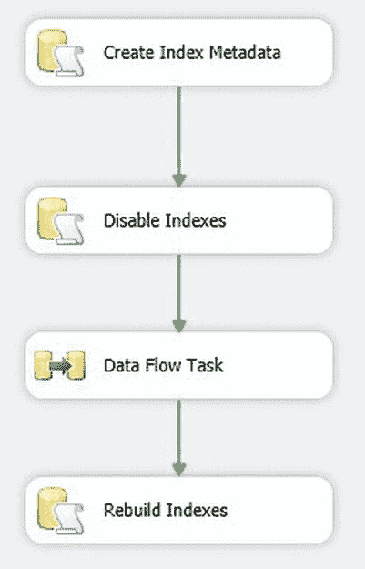
    图 14-4. 禁用和重建非聚集索引时的数据流

首先禁用任何非聚集索引后，您现在可以运行包来加载数据，并在加载完成后重建它们。

### 工作原理

在加载大量数据时，通常更快的做法是先禁用任何非聚集索引（特别是如果有很多个），然后在数据加载后重建它们。原因如下：
*   维护多个索引所需的开销相当大。
*   如果表上存在非聚集索引，SQL Server 无法使用批量加载 API（在大多数情况下如此，但更多内容请参见配方 14-10）。

因此，您可能会发现需要一种技术来检测并禁用任何非聚集索引，然后再运行数据加载，并在加载阶段完成后重建表上的索引。这就是当前配方中发生的情况。我们使用一个持久化表来存储禁用索引所需的代码，以及它们所属的表和架构。这就是存储过程`dbo.pr_IndexesToDisable`所做的工作。之后，`dbo.pr_DisableIndexes`存储过程中的一个简单游标循环遍历禁用索引的代码并应用它。加载完成后，相同的表提供重建索引所需的信息（表和架构）——使用存储过程`dbo.pr_RebuildIndexes`。

当您希望保留聚集索引（这意味着您的数据必须根据索引键预先排序加载）——或者没有聚集索引时，此技术是理想的。我意识到这种方法可能看起来很复杂，但它避免了将索引名称硬编码到 SSIS 包中，从而允许包管理索引的更改而无需开发人员介入。

#### 提示、技巧与陷阱

*   切勿禁用聚集索引！您将使表无法访问。
*   请记住，存储过程`sp_foreachtable`也可以用作重建数据库中所有索引的快速方法。
*   通过对`WHERE`子句进行明智的扩展，您可以对多个表执行此操作。您将需要更改`ALTER INDEX...REBUILD`语句以考虑这一点。
*   如果表碎片很小，并且您正在添加或替换非常少量的数据，您可以选择`REORGANIZE`而不是`REBUILD`索引。但是，当`ALLOW_PAGE_LOCKS`设置为`OFF`时，您无法`REORGANIZE`索引。
*   在修改基础表中的数据之前，必须禁用列存储索引。您可以在`sys.indexes`系统视图中识别列存储索引，因为它们的`type_desc`是`'NONCLUSTERED COLUMNSTORE'`。

### 14-3. 持久化目标数据库索引元数据

#### 问题

您想收集目标数据库的相关索引元数据，并将其独立于 SQL Server 系统表进行存储。这样，您就可以放心地删除索引，并在数据加载后重新创建它们。

#### 解决方案

查询 SQL Server 元数据以收集索引元数据，并将其存储在数据库表中。以下脚本展示了一种方法。

1.  在目标数据库中使用以下 DDL 创建一个表来存储索引元数据（文件路径：`C:\SQL2012DIRecipes\CH14\tblMetaData_Indexes.Sql`）：
    ```sql
    IF OBJECT_ID('dbo.MetaData_Indexes') IS NOT NULL
        DROP TABLE dbo.MetaData_Indexes;
    ```


# 元数据索引

```sql
CREATE TABLE CarSales_Staging.dbo.MetaData_Indexes
(
    SERVER_NAME NVARCHAR(128) NULL,
    DATABASE_NAME NVARCHAR(128) NULL,
    SCHEMA_NAME NVARCHAR(128) NULL,
    TABLE_NAME NVARCHAR(128) NULL,
    INDEX_NAME NVARCHAR(128) NULL,
    name NVARCHAR(128) NULL,
    index_column_id INT NULL,
    key_ordinal INT NULL,
    type_desc NVARCHAR(60) NULL,
    is_unique BIT NULL,
    ignore_dup_key BIT NULL,
    is_primary_key BIT NULL,
    is_unique_constraint BIT NULL,
    fill_factor tinyINT NULL,
    is_padded BIT NULL,
    is_disabled BIT NULL,
    allow_row_locks BIT NULL,
    allow_page_locks BIT NULL,
    has_filter BIT NULL,
    filter_definition NVARCHAR(max) NULL,
    is_included_column BIT NULL,
    is_descending_key BIT NULL,
    FileGroup NVARCHAR(128) NULL,
    TableObjectID INT NULL,
    IsNoRecompute BIT NULL,
    IndexDepth INT NULL,
    IsAutoStatistics BIT NULL,
    IsClustered BIT NULL,
    IsFulltextKey BIT NULL,
    DataSpace NVARCHAR(128) NULL
) ;
GO
```

2. 运行以下代码以收集索引元数据（`C:\SQL2012DIRecipes\CH14\GatherIndexMetadata.Sql`）：

```sql
DECLARE @SERVER_NAME NVARCHAR(128) = @@SERVERNAME
DECLARE @DATABASE_NAME NVARCHAR(128) = DB_NAME()

INSERT INTO MetaData_Indexes
(
SERVER_NAME
,DATABASE_NAME
,SCHEMA_NAME
,TABLE_NAME
,INDEX_NAME
,name
,index_column_id
,key_ordinal
,type_desc
,is_unique
,ignore_dup_key
,is_primary_key
,is_unique_constraint
,fill_factor
,is_padded
,is_disabled
,allow_row_locks
,allow_page_locks
,has_filter
,filter_definition
,is_included_column
,is_descending_key
,FileGroup
,TableObjectID
,IsNoRecompute
,IndexDepth
,IsAutoStatistics
,IsClustered
,IsFulltextKey
,DataSpace
)

SELECT DISTINCT TOP (100) PERCENT
@SERVER_NAME
,@DATABASE_NAME
,SCH.name AS SCHEMA_NAME
,TBL.name AS TABLE_NAME
,SIX.name AS INDEX_NAME
,COL.name
,SIC.index_column_id
,SIC.key_ordinal
,SIX.type_desc
,SIX.is_unique
,SIX.ignore_dup_key
,SIX.is_primary_key
,SIX.is_unique_constraint
,SIX.fill_factor
,SIX.is_padded
,SIX.is_disabled
,SIX.allow_row_locks
,SIX.allow_page_locks
,SIX.has_filter
,SIX.filter_definition
,SIC.is_included_column
,SIC.is_descending_key
,CAST(NULL AS VARCHAR(128))
,TBL.object_id
,CAST(NULL AS BIT)
,INDEXPROPERTY(TBL.object_id, SIX.name,'IndexDepth') AS IndexDepth
,INDEXPROPERTY(TBL.object_id, SIX.name,'IsAutoStatistics') AS IsAutoStatistics
,INDEXPROPERTY(TBL.object_id, SIX.name,'IsClustered') AS IsClustered
,INDEXPROPERTY(TBL.object_id, SIX.name,'IsFulltextKey') AS IsFulltextKey
,DSP.name AS DataSpace

FROM      sys.data_spaces DSP
          INNER JOIN sys.indexes SIX
          ON DSP.data_space_id = SIX.data_space_id
          INNER JOIN sys.tables TBL
          ON SIX.object_id = TBL.object_id
          INNER JOIN sys.schemas SCH
          ON TBL.schema_id = SCH.schema_id
          INNER JOIN sys.index_columns SIC
          ON SIX.index_id = SIC.index_id
          AND SIX.object_id = SIC.object_id
          INNER JOIN sys.columns COL
          ON SIC.column_id = COL.column_id
          AND TBL.object_id = COL.object_id
          LEFT OUTER JOIN   sys.xml_indexes XMI
          ON SIX.name = XMI.name
          AND SIX.object_id = XMI.object_id

WHERE     TBL.is_ms_shipped = 0
          AND XMI.name IS NULL

ORDER BY  SCHEMA_NAME, TABLE_NAME, INDEX_NAME, SIC.key_ordinal

-- 添加文件组、禁止自动重新计算统计信息，注意在线操作和删除现有索引的信息未存储在元数据中
IF OBJECT_ID('tempdb.
```


.# `Tmp_IndexFileGroups`') IS NOT NULL DROP TABLE `tempdb..#Tmp_IndexFileGroups`；
SELECT DISTINCT
    `DSP.name` AS `DataSpace`
    , `TBL.name` AS `TABLE_NAME`
    , `TBL.object_id` AS `TableObjectID`
    , `SIX.name`
    , `SIX.type_desc`
    , `STT.no_recompute`
INTO `#Tmp_IndexFileGroups`
FROM `sys.data_spaces` `DSP`
INNER JOIN `sys.indexes` `SIX`
    ON `DSP.data_space_id` = `SIX.data_space_id`
INNER JOIN `sys.tables` `TBL`
    ON `SIX.object_id` = `TBL.object_id`
INNER JOIN `sys.stats` `STT`
    ON `STT.object_id` = `TBL.object_id`
    AND `STT.name` = `SIX.name`
WHERE `SIX.name` IS NOT NULL;

-- 更新文件组
UPDATE `D`
SET `D.FileGroup` = `Tmp.DataSpace`,
    `D.IsNoRecompute` = `TMP.no_recompute`
FROM `MetaData_Indexes` `D`
INNER JOIN `#Tmp_IndexFileGroups` `TMP`
    ON `D.TableObjectID` = `Tmp.TableObjectID`;

## 工作原理

删除并重建索引——与我们在技巧 14-2 中看到的禁用并重建索引相反——需要你能够存储 `DROP` 和 `CREATE` 索引脚本。获取这些脚本的一种方法是使用 SQL Server Management Studio 单独或针对选定的表提取索引脚本。然后，这些脚本可以存储在文本文件或你调用的存储过程中。然而，维护这样一个基于脚本的解决方案可能会变得非常繁琐，因此我有另一个建议，那就是从系统视图中独立收集和存储索引元数据，并以反规范化形式存储，然后允许你随时删除和创建任何索引。尽管工作量更大，但这种解决方案确实有几个优点：

*   随着数据库中索引的添加、删除和更新，可以轻松地重新生成元数据。
*   你不必处理并行的脚本集。
*   它适用于 ETL 任务，你的测试表明将数据加载到堆表中并在数据加载后添加聚集索引速度更快——可能是因为源数据未排序，而在 SSIS 中添加排序转换会造成太大的内存压力。

因此，在本技巧中，提供了一个脚本来收集和存储在临时数据库中删除和创建（几乎所有）索引所需的元数据，并将索引元数据持久化存储在磁盘上的表中。

一旦你学会了如何使用这个脚本，它就成为更动态的 ETL 流程的一部分。这是通过以下方式完成的：

*   在数据加载之前创建并执行 `DROP` 脚本。
*   在数据加载之后创建并执行 `CREATE` 脚本。

然而，这些流程扩展分别是技巧 14-4 和 14-5 的主题。

存储并用于删除和重新创建索引的字段需要一些解释，如 表 14-2 所示。

表 14-2. 用于存储索引元数据的字段

| 字段名称 | 源表 | 描述 |
| --- | --- | --- |
| `SERVER_NAME` |  | 从当前环境获取服务器名称。 |
| `DATABASE_NAME` |  | 从当前环境获取数据库名称。 |
| `SCHEMA_NAME` | `sys.tables` | 架构名称。 |
| `TABLE_NAME` | `sys.tables` | 表名。 |
| `INDEX_NAME` | `sys.indexes` | 索引名称。 |
| `name` | `sys.columns` | 列名。 |
| `index_column_id` | `sys.index_columns` | 索引列的内部 ID。 |
| `key_ordinal` | `sys.index_columns` | 索引列的位置。 |
| `type_desc` | `sys.indexes` | 索引类型的完整描述。 |
| `is_unique` | `sys.indexes` | 索引是否唯一？ |
| `ignore_dup_key` | `sys.indexes` | 是否忽略重复键？ |
| `is_primary_key` | `sys.indexes` | 此列是否为主键的一部分？ |
| `is_unique_constraint` | `sys.indexes` | 此列是否为唯一约束的一部分？ |
| `fill_factor` | `sys.indexes` | 索引的填充因子。 |
| `is_padded` | `sys.indexes` | 索引是否被填充？ |
| `is_disabled` | `sys.indexes` | 索引是否被禁用？ |
| `allow_row_locks` | `sys.indexes` | 索引是否允许行锁定？ |
| `allow_page_locks` | `sys.indexes` | 索引是否允许页锁定？ |
| `has_filter` | `sys.indexes` | 索引是否有筛选器（即是否为筛选索引）？ |
| `filter_definition` | `sys.indexes` | 任何筛选器的定义（如果有）。 |
| `is_included_column` | `sys.indexes` | 该列是覆盖索引的一部分。 |
| `is_descending_key` | `sys.indexes` | 排序键为 `DESC`。 |
| `FileGroup` | `sys.tables` | 用于存储的文件组。 |
| `TableObjectID` | `sys.stats` | 内部对象 ID。 |
| `IsNoRecompute` | `sys.stats` | 表示计算列不应重新计算。 |
| `IndexDepth` | `sys.stats` | 索引级别。 |
| `IsAutoStatistics` | `sys.stats` | 索引统计信息是自动创建的。 |
| `IsClustered` | `sys.stats` | 该索引是聚集索引。 |
| `IsFulltextKey` | `sys.stats` | 这是全文索引的键。 |
| `DataSpace` | `sys.dataspaces` | 用于存储的数据空间。 |

 **注意** 存储的索引元数据可以成为 ETL 流程中索引维护的核心元素。你不必在每个流程开始时截断 `MetaData_Indexes` 表，而只需用新的索引元数据更新该表——并删除不再使用的索引元数据。然后，你可以添加一个标志列来指示索引的优先级和顺序。例如，这允许你将关键索引分类为优先级一，并在 ETL 周期的早期处理它们。你以这种方式继续，直到在周期结束时处理所有剩余的索引。

## 提示、技巧和陷阱

*   在删除索引之前，始终对你的临时数据库编写脚本并制作备份副本。
*   该脚本假设元数据中不需要带引号的标识符。如果你的数据库命名约定不是这样，那么你需要处理带引号的标识符。
*   你可以通过明智地调整初始 `SELECT` 语句的 `WHERE` 子句，来调整脚本以选择所有遵循特定命名约定的表，或特定架构中的所有对象。
*   此脚本未处理空间索引管理。
*   此脚本未处理全文索引管理——此方法专为临时数据库设计。
*   此脚本未管理列索引——无论如何，这些索引必须被删除并重新创建。
*   用于存储索引元数据以删除 (`DROP`) 并随后创建 (`CREATE`) 索引的脚本可以变成存储过程，并从 SSIS 包中的 SSIS 执行 SQL 任务中调用。技巧 14-2 就是一个例子。
*   如果你愿意，索引元数据可以存储在单独的数据库或单独的架构中。
*   脚本中没有添加 `IF EXISTS` 陷阱，因为我们处理的是临时数据库，索引会定期删除。你可能更愿意在脚本中添加这个。
*   我对在这类脚本中使用游标没有顾虑。考虑到处理的记录数量很少，开销是最小的。无论如何，与索引过程使用的开销相比，游标的开销是微不足道的。

## 14-4. 为目标数据库索引编写和执行 `DROP` 语句

### 问题

你想在运行数据加载之前，删除临时数据库中的所有现有索引。

### 解决方案

要删除所有现有索引，请使用你通过技巧 14-3 中描述的技术获取的索引元数据来生成并运行 `DROP` 脚本。以下是执行此操作的脚本 (`C:\SQL2012DIRecipes\CH14\DropIndexes.Sql`)：

```
-- 创建表以保存脚本元素
IF OBJECT_ID('tempdb..#ScriptElements') IS NOT NULL DROP TABLE tempdb..#ScriptElements;
CREATE TABLE #ScriptElements (ID INT IDENTITY(1,1), ScriptElement NVARCHAR(MAX))

-- 非聚集索引
INSERT INTO #ScriptElements (ScriptElement)
SELECT DISTINCT 'DROP INDEX ' + INDEX_NAME + ' ON ' + DATABASE_NAME + '.' + SCHEMA_NAME + '.' + TABLE_NAME
```


-- 唯一约束
INSERT INTO #ScriptElements (ScriptElement)
SELECT DISTINCT 'ALTER TABLE ' + DATABASE_NAME + '.' + SCHEMA_NAME + '.' + TABLE_NAME + ' DROP CONSTRAINT ' + INDEX_NAME
FROM    MetaData_Indexes
WHERE   is_unique_constraint = 1

-- 聚集索引
INSERT INTO #ScriptElements (ScriptElement)
SELECT DISTINCT 'DROP INDEX ' + INDEX_NAME + ' ON ' + DATABASE_NAME + '.' + SCHEMA_NAME + '.' + TABLE_NAME
FROM     MetaData_Indexes
WHERE    type_desc = 'CLUSTERED'
         AND is_primary_key = 0

-- 主键索引
INSERT INTO #ScriptElements (ScriptElement)
SELECT DISTINCT 'ALTER TABLE ' + DATABASE_NAME + '.' + SCHEMA_NAME + '.' + TABLE_NAME + ' DROP CONSTRAINT ' + INDEX_NAME
FROM       MetaData_Indexes
WHERE      is_primary_key = 1

-- 创建并执行 DROP 脚本
DECLARE @DropIndex NVARCHAR(MAX)
DECLARE DropIndex_CUR CURSOR
FOR SELECT ScriptElement FROM #ScriptElements ORDER BY ID

OPEN DropIndex_CUR
FETCH NEXT FROM DropIndex_CUR INTO @DropIndex

WHILE @@FETCH_STATUS <> -1
BEGIN
    EXEC (@DropIndex)
    FETCH NEXT FROM DropIndex_CUR INTO @DropIndex
END ;

CLOSE DropIndex_CUR ;
DEALLOCATE DropIndex_CUR ;
```

### 工作原理

幸运的是，这里定义的代码相当简单。首先，它会收集所有需要 `DROP` 掉任何非聚集索引、唯一约束、聚集索引，以及最后主键索引的信息。然后，按照那个顺序（多亏了 `ID` 列）为这些索引创建并执行 `DROP` 脚本。

重要的一点是，要先删除任何非聚集索引，因为在删除非聚集索引之前删除表上的聚集索引，会导致非聚集索引被更新，从而大大减慢处理速度。

#### 提示、技巧与陷阱

*   在 ETL 过程的不同阶段添加索引时，你可以使用索引创建脚本，并使用相关的表名和索引类型进行筛选，根据需要创建特定的索引。

## 14-5. 为目标数据库索引编写和执行 CREATE 语句

### 问题

你想在数据加载前重新创建之前删除的索引。

### 解决方案

使用你在配方 14-3 中持久化到数据库表中的索引元数据来生成 `CREATE` 脚本。这样，目标数据库将得到完全优化。以下是执行此操作的脚本 (`C:\SQL2012DIRecipes\CH14\CreateIndexes.Sql`):

```sql
DECLARE @SORT_IN_TEMPDB BIT = 1
DECLARE @DROP_EXISTING BIT = 0
DECLARE @ONLINE BIT = 0
DECLARE @MAX_DEGREE_OF_PARALLELISM TINYINT = 0

-- 创建表以保存脚本元素
IF OBJECT_ID('tempdb..#ScriptElements') IS NOT NULL
    DROP TABLE tempdb..#ScriptElements;

CREATE TABLE #ScriptElements (ID INT IDENTITY(1,1), ScriptElement NVARCHAR(MAX))

-- 非聚集索引
IF OBJECT_ID('tempdb..#Tmp_IndexedFields') IS NOT NULL
    DROP TABLE tempdb..#Tmp_IndexedFields;

-- 索引字段
;WITH Core_CTE ( INDEX_NAME, Rank, Name ) AS (
    SELECT   INDEX_NAME,
             ROW_NUMBER() OVER( PARTITION BY INDEX_NAME ORDER BY INDEX_NAME, key_ordinal),
             CAST(name AS VARCHAR(MAX))
    FROM    MetaData_Indexes
    WHERE   is_included_column = 0),
   Root_CTE ( INDEX_NAME, Rank, Name )
            AS ( SELECT INDEX_NAME, Rank, name
                   FROM Core_CTE
                  WHERE Rank = 1 ),
  Recursion_CTE ( INDEX_NAME, Rank, Name )
            AS ( SELECT INDEX_NAME, Rank, name
                   FROM Root_CTE
                   UNION ALL
                  SELECT Core_CTE.INDEX_NAME, Core_CTE.Rank,
                         Recursion_CTE.name + ', ' + Core_CTE.name
                   FROM Core_CTE
                   INNER JOIN Recursion_CTE
                      ON Core_CTE.INDEX_NAME = Recursion_CTE.INDEX_NAME
                     AND Core_CTE.Rank = Recursion_CTE.Rank + 1 )
SELECT INDEX_NAME, MAX( Name ) AS IndexFields_Main
INTO #Tmp_IndexedFields
FROM Recursion_CTE
GROUP BY INDEX_NAME;

-- 包含字段
IF OBJECT_ID('tempdb..#Tmp_IncludedFields') IS NOT NULL
    DROP TABLE tempdb..#Tmp_IncludedFields;

WITH Core_CTE ( INDEX_NAME, Rank, Name )
            AS ( SELECT INDEX_NAME,
                        ROW_NUMBER() OVER( PARTITION BY INDEX_NAME ORDER BY INDEX_NAME ),
                        CAST( name AS VARCHAR(MAX) )
                   FROM MetaData_Indexes
                  WHERE is_included_column = 1 ),
   Root_CTE ( INDEX_NAME, Rank, Name )
            AS ( SELECT INDEX_NAME, Rank, name
                   FROM Core_CTE
                  WHERE Rank = 1 ),
  Recursion_CTE ( INDEX_NAME, Rank, Name )
            AS ( SELECT INDEX_NAME, Rank, name
                   FROM Root_CTE
                   UNION ALL
                  SELECT Core_CTE.INDEX_NAME, Core_CTE.Rank,
                         Recursion_CTE.name + ', ' + Core_CTE.name
                   FROM Core_CTE
                   INNER JOIN Recursion_CTE
                      ON Core_CTE.INDEX_NAME = Recursion_CTE.INDEX_NAME
                     AND Core_CTE.Rank = Recursion_CTE.Rank + 1 )
SELECT    INDEX_NAME, MAX( Name ) AS IndexFields_Included
INTO      #Tmp_IncludedFields
FROM      Recursion_CTE
GROUP BY  INDEX_NAME;

-- 创建索引脚本
-- 首先是核心索引的元数据
IF OBJECT_ID('tempdb..#Tmp_IndexData') IS NOT NULL
    DROP TABLE tempdb..#Tmp_IndexData;

SELECT DISTINCT
       MetaData_Indexes.SCHEMA_NAME,
       MetaData_Indexes.TABLE_NAME,
       MetaData_Indexes.INDEX_NAME,
       #Tmp_IndexedFields.IndexFields_Main,
       #Tmp_IncludedFields.IndexFields_Included,
       MetaData_Indexes.type_desc,
       MetaData_Indexes.is_unique,
       MetaData_Indexes.has_filter,
       MetaData_Indexes.filter_definition,
       MetaData_Indexes.is_padded,
       MetaData_Indexes.IsNoRecompute,
       MetaData_Indexes.[ignore_dup_key],
       MetaData_Indexes.[allow_page_locks],
       MetaData_Indexes.[allow_row_locks],
       MetaData_Indexes.fill_factor,
       MetaData_Indexes.DataSpace,
       MetaData_Indexes.is_primary_key,
       MetaData_Indexes.is_unique_constraint
INTO        #Tmp_IndexData
FROM        MetaData_Indexes
            INNER JOIN #Tmp_IndexedFields
            ON MetaData_Indexes.INDEX_NAME = #Tmp_IndexedFields.INDEX_NAME
            LEFT OUTER JOIN #Tmp_IncludedFields
            ON MetaData_Indexes.INDEX_NAME = #Tmp_IncludedFields.INDEX_NAME

-- 创建主键
INSERT INTO #ScriptElements (ScriptElement)
SELECT DISTINCT ' ALTER TABLE ' + SCHEMA_NAME + '.' + TABLE_NAME + ' ADD CONSTRAINT ' + INDEX_NAME + ' PRIMARY KEY ' +
       CASE WHEN type_desc = 'CLUSTERED' THEN 'CLUSTERED ' ELSE 'NONCLUSTERED  ' END +
       ' (' + IndexFields_Main + ')' + ' ON [' + DataSpace + ']'
FROM          #Tmp_IndexData
WHERE         #Tmp_IndexData.is_primary_key = 1

-- 创建聚集索引
INSERT INTO   #ScriptElements (ScriptElement)
SELECT DISTINCT 'CREATE ' +
       CASE WHEN is_unique = 1 THEN 'UNIQUE ' ELSE '' END +
       'CLUSTERED INDEX ' + INDEX_NAME + ' ON ' + SCHEMA_NAME + '.' + TABLE_NAME +
       ' (' + IndexFields_Main + ')' +
       CASE WHEN has_filter = 1 THEN ' WHERE ' + filter_definition ELSE '' END +
       ' ON [' + DataSpace + ']'
FROM          #Tmp_IndexData
WHERE         #Tmp_IndexData.type_desc = 'CLUSTERED'
              AND #Tmp_IndexData.is_primary_key = 0
              AND #Tmp_IndexData.is_unique_constraint = 0
```


