# 15-1. 从 T-SQL 记录事件

## 问题

你想应用一种简单但健壮的方法来记录基于 `T-SQL` 的 `ETL` 例程中的事件（包括成功和失败）。

## 解决方案

创建一个日志表和一个存储过程，用于将事件和事件详细信息（包括错误信息）写入该表。然后，你可以从你的 `ETL` 存储过程或脚本中调用此存储过程。

1.  使用以下 `DDL` 创建用于存储记录事件的表 (`C:\SQL2012DIRecipes\CH15\tblEventDetail_Simple.Sql`)：

    ```sql
    CREATE TABLE CarSales_Logging.log.EventDetail_Simple
    (
     EventDetailID INT IDENTITY(1,1) NOT NULL,
     Event VARCHAR(150) NULL,
     Comments VARCHAR(MAX) NULL,
     ErrorNo INT NULL,
     ErrorDescription VARCHAR(MAX) NULL,
     ErrorLineNo INT NULL,
     ErrorSeverity INT NULL,
     ErrorState INT NULL,
     StartTime DATETIME NULL,
     Logtime DATETIME DEFAULT GETDATE()
    ) ;
    GO
    ```

2.  使用以下 `DDL` 创建执行日志记录所需的存储过程 (`C:\SQL2012DIRecipes\CH15\pr_Logging_Simple.Sql`)：

    ```sql
    CREATE PROCEDURE CarSales_Logging.log.pr_Logging_Simple
    (
    @Event VARCHAR(150)
    ,@Comments VARCHAR(MAX) = NULL
    ,@ErrorNo INT = NULL
    ,@ErrorDescription VARCHAR(MAX) = NULL
    ,@ErrorLineNo INT = NULL
    ,@ErrorSeverity INT = NULL
    ,@ErrorState INT  = NULL
    ,@StartTime DATETIME
    )

    AS

    INSERT INTO CarSales_Logging.log.


# 15-2. 从 SSIS 记录日志数据

## 问题

你已经构建了一个 SSIS 包，并想为其添加日志记录功能。

## 解决方案

在你的 SSIS 包内部配置 SSIS 日志记录。

1.  从**SSIS**菜单中选择**日志记录**—或者右键单击“控制流”窗格并单击**日志记录**。**配置 SSIS 日志：日志记录**对话框将出现。
2.  当日志记录屏幕显示时，从**提供程序类型**列表中选择类型，并为你希望使用的每种类型单击**添加**。
3.  确保每个日志提供程序的复选框都被勾选。
4.  对于每个日志提供程序，通过单击**配置**列中的弹出窗口来选择或添加到日志目标的连接。
5.  在对话框的左侧**容器**窗格中，勾选你希望记录其事件的每个容器（这些是构成你 SSIS 包的各种任务）。对话框应类似于 图 15-1。

    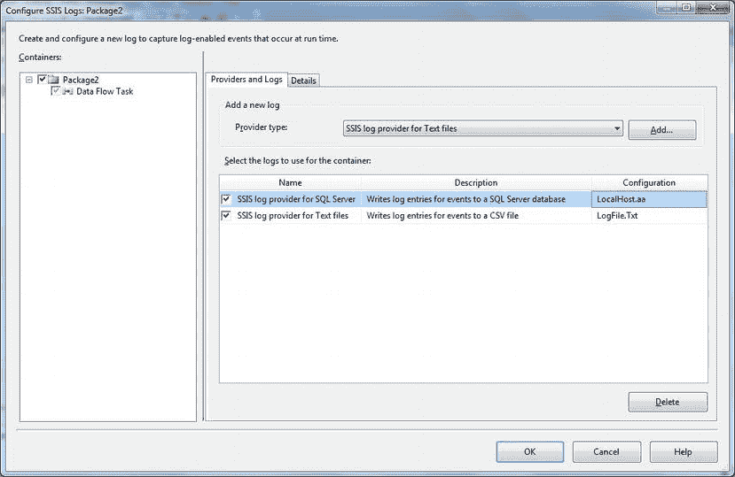

    图 15-1. 选择日志目标

6.  单击对话框的**详细信息**选项卡，然后选择你想要选择记录事件的任务。
7.  勾选**事件**复选框以选择所有事件。
8.  单击**确定**。

当你运行 SSIS 包时，你选择的所有事件都将被记录到你添加的提供程序中。

## 工作原理

SSIS 配备了高级且完整的日志记录功能，允许你跟踪 SSIS 包执行期间的进度和状态。实际上，如果你在 BIDS/SSDT 中查看过“进度”或“执行结果”选项卡，你就已经见过 SSIS 日志记录了—因为在这里看到的日志信息与你将在自定义日志中看到的大部分相同。

使用这个内置的日志记录基础设施需要你回答三个基本问题：

*   你打算如何记录事件？
*   你想要记录 SSIS 包中的哪些步骤？
*   对于每个包步骤，你想要记录哪些事件？

“如何”的部分意味着你希望将记录的信息存储在哪里—或者用 SSIS 术语来说，你希望使用哪个日志提供程序。这些包括：

*   一个 SQL Server 表
*   一个 XML 文件
*   一个文本文件
*   一个 SQL Server Profiler 跟踪文件
*   Windows 事件日志

这些的任何组合或全部都可以同时使用。当然，每个都必须使用适当的工具来读取。实际上，大多数都可以使用像 LogParser（在技巧 2-21 中描述）这样的工具转换为另一种类型的日志。本质上，SSIS 日志记录是一组需要启用的简单选项。

> **注意**
> 在描述如何从 SSIS 记录事件的同时，我想补充一个简短的说明。这种方法，虽然在 SQL Server 2012 中并非完全被弃用，但在很大程度上已被 SSIS 服务器中的 SSIS 目录所取代。你仍然可以在 SQL Server 2012 中使用这种方法（并且在之前的版本中没有其他真正的替代方案），但你需要意识到现在有另一种可用的解决方案。这种新技术在技巧 15-16 到 15-18 中解释。

一旦你知道了想要保存日志信息的位置，你就可以决定保存哪些信息以及针对哪个包步骤。这个信息在 SSIS 术语中是“已记录事件”，并在表 15-6 中描述。

表 15-6. SSIS 中的已记录事件

| 事件 | 说明 |
| --- | --- |
| BufferSizeTuning | 缓冲区大小变化的原因和结果大小（仅在数据流任务中）。 |
| Diagnostic | 返回包诊断信息。 |
| Error | 显示错误事件。 |
| ExecStatusChanged | 显示任务执行状态的变化。 |
| FileSystemOperation | 已执行的文件系统操作（仅在文件系统任务中）。 |
| Information | 显示信息事件。这些是任务特定的，并根据为日志记录选择的任务而变化。 |

```sql
CREATE PROCEDURE Log.pr_Logging_Simple
(
    @Event           VARCHAR(50),
    @StartTime       DATETIME,
    @Comments        VARCHAR(2000),
    @ErrorNo         INT = NULL,
    @ErrorDescription VARCHAR(8000) = NULL,
    @ErrorLineNo     INT = NULL,
    @ErrorSeverity   INT = NULL,
    @ErrorState      INT = NULL
) AS
    INSERT INTO Log.EventDetail_Simple
        (Event, StartTime, Comments, ErrorNo, ErrorDescription, ErrorLineNo, ErrorSeverity, ErrorState)
    VALUES
        (@Event, @StartTime, @Comments, @ErrorNo, @ErrorDescription, @ErrorLineNo, @ErrorSeverity, @ErrorState);
GO
```

然后，你可以从其他存储过程或脚本内部调用此存储过程，如以下代码所示：

```sql
BEGIN TRY
    DECLARE @StartTime DATETIME = GETDATE()

    --  你的处理代码在此处

    --  在此记录成功的处理
    EXECUTE Log.pr_Logging_Simple '加载销售数据', @StartTime, '销售数据加载成功'
END TRY
BEGIN CATCH
    --  在此记录不成功的处理
    DECLARE @ErrorNo_TMP INT
    DECLARE @ErrorDescription_TMP VARCHAR(MAX)
    DECLARE @ErrorLineNo_TMP INT
    DECLARE @ErrorSeverity_TMP INT
    DECLARE @ErrorState_TMP INT

    SELECT @ErrorNo_TMP = ERROR_NUMBER()
    SELECT @ErrorDescription_TMP = ERROR_MESSAGE()
    SELECT @ErrorLineNo_TMP = ERROR_LINE()
    SELECT @ErrorSeverity_TMP = ERROR_SEVERITY()
    SELECT @ErrorState_TMP = ERROR_STATE()

    EXECUTE Log.pr_Logging_Simple
        '加载销售数据',
        @Comments = '加载销售数据时出错',
        @StartTime = @STARTTIME,
        @ErrorNo = @ErrorNo_TMP,
        @ErrorDescription = @ErrorDescription_TMP,
        @ErrorLineNo = @ErrorNo_TMP,
        @ErrorSeverity = @ErrorSeverity_TMP,
        @ErrorState = @ErrorState_TMP
END CATCH
```

## 提示、技巧和陷阱

*   本技巧的方法没有显式地标记错误，而是让你查询包含错误数据的列来隔离错误记录。当然，你可以基于日志记录表创建视图来隔离错误，如技巧 15-19 所示。
*   记住设置一个变量来记录进程开始的时间。用进程（或进程的一部分）开始的时间来实例化它—而不是你记录结果的时间—否则你将无法通过将开始时间从进程结束和日志记录发生的时间中减去来推断运行时长。这个时刻也可能是错误发生的时间。
*   记录事件的调用可以在存储过程执行过程中重复多次。它可以在存储过程开始时调用，也可以在存储过程内部的一个工作单元运行后调用。


# SSIS 日志事件与配置

## 可用日志事件

以下是可以记录的 SSIS 事件：
*   `PipelineBufferLeak`：未完成的（占用内存的）缓冲区消耗内存（仅限于数据流任务）。
*   `PipelineComponentTime`：关于每个数据流组件验证和执行的信息（仅限于数据流任务）。
*   `PipelineExecutionPlan`：数据流的执行计划（仅限于数据流任务）。
*   `PipelineExecutionTrees`：创建执行计划时的调度器输入（仅限于数据流任务）。
*   `PipelineInitialization`：来自管道初始化的信息（仅限于数据流任务）。
*   `PipelinePostEndOfRowset`：组件收到行集结束信号。
*   `PipelinePostPrimeOutput`：组件已从其 `Prime Output` 调用返回。
*   `PipelinePreEndOfRowset`：组件收到行集结束前信号。
*   `PipelinePrePrimeOutput`：组件收到其 `Prime Output` 前调用。
*   `PipelineRowsSent`：行已作为输入提供给数据流组件。
*   `PostExecute`：显示在后执行阶段发生的 `PostExecute` 事件。
*   `PostValidate`：显示在后验证阶段发生的 `PostValidate` 事件。
*   `PostExecute`：显示在后执行阶段发生的后执行事件。
*   `PreValidate`：显示在前验证阶段发生的事件。
*   `Progress`：处理进度通知。
*   `QueryCancel`：处理取消事件。按轮询间隔确定是否取消包执行。
*   `TaskFailed`：处理任务失败。指示任务已失败。
*   `Warning`：显示警告事件。这些事件根据为日志记录选择的任务而异。它们是任务特定的。

再次强调，这些事件中的任何一个或全部都可以记录到所有选定的日志提供程序。

需要注意的是：在记录 SSIS 包时很容易做得过头，从而产生巨大的日志文件（或表），导致无法看清全局。因此，在选择要记录的事件时要谨慎，因为明智的选择与日志记录本身同样重要。同样，将日志事件记录到所有日志提供程序通常是完全多余的，通常一个日志提供程序就足够了。

#### 提示、技巧与陷阱

*   要添加、删除或重新配置日志提供程序，请先单击左侧窗格中的`日志记录`。否则，无论你多么努力并经常单击选择某个日志，都无法选中它。
*   日志提供程序配置使用标准的 SSIS 连接管理器。这些可以直接从`连接管理器`窗格进行编辑。
*   配置用于 SQL Server 日志记录的日志提供程序将在目标数据库中创建 `sysssislog` 表（对于 SQL Server 2005，将是 `sysdtslog90`）。SSIS 还将在目标数据库中创建 `sp_ssis_addlogentry`（在 SQL Server 2005 中为 `sp_dts_addlogentry`）存储过程，SSIS 使用它将日志信息写入目标表。如果需要，两者都可以按照食谱 15-4 中的描述进行调整。
*   只有经验才能教会你在每种不同情况下真正需要哪些日志信息。通常，在测试开始时尽可能多地记录可消化的日志信息是值得的，然后在进入生产环境时减少记录的事件数量。可用的海量信息可能导致产生从未使用的、适得其反的数据洪水，除非在实践中应用适度的克制。

#### 15-3. 自定义 SSIS 日志记录

## 问题

你需要比食谱 15-2 的解决方案更精确、更细致地选择要记录的 SSIS 事件。

## 解决方案

选择要记录的事件以及每个事件要记录的详细信息。

1.  按照食谱 15-2 的步骤 1 到 5 配置 SSIS 日志记录。
2.  在`配置 SSIS 日志记录`对话框中，单击`详细信息`选项卡，然后单击`高级`按钮。
3.  为每个记录的事件选择（或取消选择）要记录的事件详细信息。

你最终应该得到类似图 15-2 的结果。
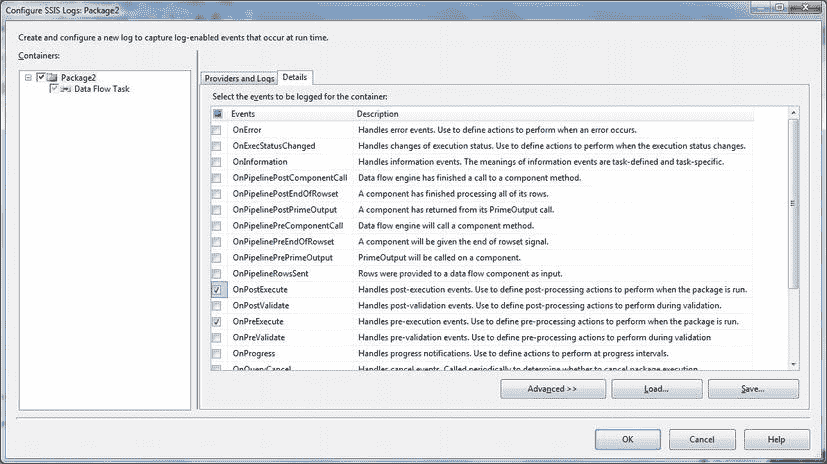
*图 15-2. 选择要记录的事件*

4.  单击`确定`以确认并关闭对话框。

## 工作原理

尽管 SSIS 日志记录很简单，但仍有一些可用的调整选项，允许开发人员：
*   选择记录的详细信息。
*   加载和保存日志详细信息。
*   重新应用日志详细信息。
*   修改日志详细信息文件。

选择触发日志记录的事件只是故事的一部分。所有事件都可以记录：
*   `Computer`（计算机名称）。
*   `Operator`（执行包的用户）。
*   `Source`（包）。
*   `Sourceid`（包标识符）。
*   `ExecutionID`（执行上下文的 GUID——父包或子包）。
*   `MessageText`（返回的任何消息）。
*   `Databytes`（当前未使用）。

以及：
*   `Event`（事件名称）。
*   `StartTime`（事件开始的准确日期和时间）。
*   `EndTime`（事件结束的准确日期和时间）。

# 15-4. 保存和应用复杂的 SSIS 日志详细信息

## 问题

为 SSIS 任务重新定义相同的日志详细信息集合过于耗时。

## 解决方案

将日志详细信息集合保存到 XML 文件，然后重新应用它们。

1.  在左窗格中，选择要保存其日志详细信息的任务。
2.  在`配置 SSIS 日志记录`对话框中，单击`详细信息`选项卡，然后单击`保存`按钮。
3.  选择路径并输入文件名（在此示例中为 `C:\SQL2012DIRecipes\CH15\MyTaskLogDetails.Xml`）。
4.  单击`保存`。
5.  单击`确定`。

然后 SSIS 允许你保存任务日志的详细信息，然后快速轻松地将它们重新应用于多个包，如下所示：

1.  选择要修改其日志详细信息的任务。
2.  在`配置 SSIS 日志记录`对话框中，单击`详细信息`选项卡，然后单击`加载`按钮。
3.  选择先前保存的日志详细信息文件（`C:\SQL2012DIRecipes\CH15\MyTaskLogDetails.Xml`）。
4.  单击`打开`。
5.  单击`确定`。

## 工作原理

如果你为任务（例如数据流任务）定义了复杂的日志详细信息集合，为多个类似任务单独重新定义相同的日志事件可能极其繁琐和耗时。如果你已保存了一组要记录的详细信息，可以将它们应用于另一个 SSIS 包。

由于日志详细信息保存为 XML，你可以在任何文本编辑器或任何 XML 编辑器（例如 Microsoft 的 XML Notepad）中编辑生成的 XML 文件。如果你希望这些更改应用于你的任务，则需要将任何保存的包重新应用到现有任务。以下是保存文件的简化示例：
```xml
<?xml version="1.0" encoding="utf-8"?>
<DTSLoggingTemplate xmlns:xsi="http://www.w3.org/2001/XMLSchema-instance" xmlns:xsd="http://www.w3.org/2001/XMLSchema" Name="TaskHost" xmlns="www.microsoft.com/SqlServer/Dts">
  <EventsFilter Name="OnError">
    <Filter>
      <Computer>true</Computer>
      <Operator>true</Operator>
      <SourceName>false</SourceName>
      <SourceID>true</SourceID>
      <ExecutionID>true</ExecutionID>
      <MessageText>true</MessageText>
      <DataBytes>true</DataBytes>
    </Filter>
  </EventsFilter>
  ...
</DTSLoggingTemplate>
```
如你所见，结构非常简单，因此很容易编辑 XML 文件来添加或删除 `EventsFilters` 和 `Filters`。

#### 提示、技巧与陷阱

*   你无法同时加载多个任务的日志详细信息。
*   要应用某种类型任务的所有日志详细信息，最好加载从类似类型任务保存的日志详细信息文件。例如，文件系统任务包含 `FileSystemOperation` 的日志详细信息。因此，要应用你对此类日志详细信息的选择，你必须首先从文件系统任务保存日志详细信息。


### 15-5\. 将 SSIS 日志扩展到 SQL Server 目标

#### 问题
您希望利用 SSIS 将信息记录到 SQL Server 表中的功能，但您希望调整和扩展此过程，以便向日志表添加您自己的元素。

#### 解决方案
扩展内置的日志表和存储过程以满足您的需求。

1.  在您选择用于保存日志信息的数据库中，单击名为 `dbo.sysssislog` 的表（此表通常位于“系统表”文件夹中）。
2.  右键单击并选择“设计”。
3.  输入列名（例如 `ProcessID`）和数据类型（例如 `INT`）。
4.  保存并关闭表。
5.  在 SQL Server Management Studio 中，展开“可编程性”->“存储过程”节点。
6.  展开“系统存储过程”，右键单击 `sp_ssis_addlogentry`，然后选择“修改”。
7.  按如下方式修改存储过程的 T-SQL 代码（示例文件路径：`C:\SQL2012DIRecipes\CH15\Modifiedsp_ssis_addlogentry.Sql`）：

    ```sql
    ALTER PROCEDURE dbo.sp_ssis_addlogentry
        @event sysname,
        @computer NVARCHAR(128),
        @operator NVARCHAR(128),
        @source NVARCHAR(1024),
        @sourceid UNIQUEIDENTIFIER,
        @executionid UNIQUEIDENTIFIER,
        @starttime DATETIME,
        @endtime DATETIME,
        @datacode int,
        @databytes image,
        @message NVARCHAR(2048),
        @PROCESSID INT = 1 -- NOTE: The added field
    AS
        INSERT INTO sysssislog
        (
            event,
            computer,
            operator,
            source,
            sourceid,
            executionid,
            starttime,
            endtime,
            datacode,
            databytes,
            message,
            ProcessID -- NOTE: This has been added to extend the logging capability
        )
        VALUES
        (
            @event,
            @computer,
            @operator,
            @source,
            @sourceid,
            @executionid,
            @starttime,
            @endtime,
            @datacode,
            @databytes,
            @message,
            @ProcessID --NOTE: This has been added to extend the logging capability
        )
        RETURN 0 ;
    GO
    ```
8.  按 F5 或单击“执行”以重新编译存储过程。

#### 工作原理
如果您已使用用于 SQL Server 的 SSIS 日志提供程序保存日志数据，您可能已经注意到存储过程 `sp_ssis_addlogentry` 及其创建的表 `sysssislog`。这些并非完全固定不变，如果您愿意，可以对日志默认元素进行微小的更改。例如，您可以：

*   添加或删除列。
*   扩展 `sp_ssis_addlogentry` 存储过程（在 SSIS 2012、2008 和 2008R2 中）或 `sp_dts_addlogentry`（在 SSIS 2005 中）以向日志记录添加更多元素。
*   修改表名和/或架构。

您可以根据需要向日志表结构添加更多列，然后扩展 `sp_ssis_addlogentry` 日志记录过程以输入任何新数据。您可能想知道为什么或何时需要这样做，以下是一个合理的场景。假设您有一个极其复杂的日常运行的 ETL 过程，并为每个日常过程编号。最终，您将希望存储一个过程标识符。您希望现在使用硬编码标识符为此做准备。这正是我们在本教程中所做的。它涉及修改日志表和日志记录存储过程。

在此示例中，我假设您使用的是 SQL Server 创建的默认对象名称。需要注意几点：

*   您需要找到与您所用 SQL Server 版本对应的表。
*   如果您愿意，完全可以选择编写任何表更改的脚本，而不是使用 SSMS。

如果您更改了 SSIS 向其记录数据的表的结构，并且希望利用对表的更改，则必须更改 `sp_ssis_addlogentry` 存储过程。这是一个标准的存储过程，因此修改起来非常简单。在现实世界中，您可能有一个包含过程标识符的表，您希望从中提取最新的过程运行 ID 并将其添加到日志数据中，而不是像我这里这样硬编码。

SSIS 为 SQL Server 日志创建的表 `dbo.sysssislog` 包含 表 15-7 中所示的字段。

**表 15-7** `dbo.sysssislog` 表中的字段
| 字段名 | 描述 |
| :--- | :--- |
| event | 触发日志记录的事件（例如 OnError）。 |
| computer | 运行过程的计算机。 |
| operator | 运行过程的操作员。 |
| source | 触发日志记录的任务。 |
| sourceid | 引起日志记录发生的任务的 GUID。 |
| executionid | 执行 GUID。 |
| starttime | 过程开始的日期和时间。 |
| endtime | 过程结束的日期和时间。 |
| datacode | 内部代码。 |
| databytes | 处理的字节数。 |
| message | 从事件发送的消息。 |

您可以根据需要重命名此表，而不会产生任何不良后果。唯一需要注意的是，如果更改了表名，则必须记住修改日志查询 (`sp_dts_addlogentry`) 使其指向重命名后的表。如果需要这样做，以下是一种方法：

1.  在您选择用于保存日志信息的数据库中，单击名为 `dbo.sysssislog` 的表。
2.  右键单击并选择“重命名”。
3.  用新名称替换旧表名。
4.  在 SQL Server Management Studio 中，展开“可编程性”->“存储过程”节点，然后展开“系统存储过程”。
5.  右键单击 `sp_ssis_addlogentry` 并选择“修改”。
6.  在 `INSERT INTO` 语句中，将表名 `dbo.sysssislog` 替换为步骤 3 中的新表名。
7.  按 F5 或单击“执行”以重新编译存储过程。

#### 提示、技巧与陷阱
*   如果您愿意，也可以将日志表放在不同的架构中——只需记住在存储过程中指明正确的架构，而不是 “dbo”。
*   请记住，在 SQL Server 2008 和 2012 上，表是 `dbo.sysssislog`，而在 2005 版本上，它是 `dbo.sysdtslog90`。
*   在 SSIS 2005 中，存储过程名为 `sp_dts_addlogentry`，位于“存储过程”文件夹中。
*   当然，您可以使用 T-SQL DDL 来添加任何新列。
*   请注意，您没有修改传递给存储过程的任何内置参数——这些参数必须保持初始定义。

### 15-6\. 从 SSIS 脚本任务记录信息

#### 问题
您的 SSIS 包中有一个脚本任务，您希望从中将信息写入标准日志提供程序。

#### 解决方案
使用 `Dts.Log` 方法写入任何常用日志提供程序。

1.  作为脚本任务的一部分，输入以下代码（此处为 Microsoft Visual Basic 2010）以记录事件：
    ```vb
    Dim nullBytes(0) As Byte
    Dts.Log("My script task has done something",0, nullBytes)
    ```
2.  将此代码片段包含在脚本代码的 `Try...Catch` 错误捕获块中，如以下示例所示（文件路径：`C:\SQL2012DIRecipes\CH15\SCriptTaskLogging.vb`）：
    ```vb
    Public Sub Main()
            Try
                'Some code here
                Dim nullByte() As Byte
                Dts.Log("Write to log that all has worked", 0, nullByte)
            Catch ex As Exception
                Dts.Log(ex.Message, 0, nullByte) 'Log the error message
            End Try
            Dts.TaskResult = ScriptResults.Success
    End Sub
    ```


# 成功结束子程序

## 工作原理

有一种特定的方式，可以将用户定义的日志信息写入所有启用的日志提供程序，并且可以从 SSIS 脚本任务中调用。你需要执行以下操作：

*   在“配置 SSIS 日志”对话框的“容器”窗格中，确保选中了脚本任务。
*   在“配置 SSIS 日志”对话框的“详细信息”选项卡中，确保勾选了 `脚本任务日志项`。

现在，此脚本将把过程错误信息记录到为包启用的所有日志提供程序中。

#### 15-7. 从 T-SQL 记录到 SSIS 日志表

### 问题

你有一个复杂的 SSIS 包，频繁使用存储过程，并且你希望将来自 SSIS 和 T-SQL 的过程与错误信息记录到一个集中表中。你更倾向于使用内置的日志表。

### 解决方案

创建一个存储过程，从 T-SQL 代码和存储过程将日志数据写入内置的 `dbo.sysssislog` 表。

1.  使用以下代码（`C:\SQL2012DIRecipes\CH15\pr_SQLtoSSISLogging.Sql`）创建一个存储过程，用于从你的 T-SQL 过程执行日志记录：

    ```sql
    CREATE PROCEDURE dbo.pr_SQLtoSSISLogging
    @event sysname,
    @message NVARCHAR(2048),
    @datacode int,
    @starttime DATETIME,
    @source NVARCHAR(1024),
    @operator NVARCHAR(128)
    
    AS
    
    DECLARE @computer NVARCHAR(128)
    DECLARE @sourceid UNIQUEIDENTIFIER
    DECLARE @endtime DATETIME
    DECLARE @executionid UNIQUEIDENTIFIER
    DECLARE @databytes VARBINARY(MAX)
    
    SET @computer = @@SERVERNAME
    SELECT @operator = USER_NAME()
    SET @sourceid = NEWID()
    SET @endtime = GETDATE()
    SET @executionid = NEWID()
    SET @databytes = CONVERT(VARBINARY(MAX),'x')
    
    INSERT INTO dbo.sysssislog
    (
    event,
    computer,
    operator,
    source,
    sourceid,
    executionid,
    starttime,
    endtime,
    datacode,
    databytes,
    message
    )
    
    VALUES
    (
    @event,
    @computer,
    @operator,
    @source,
    @sourceid,
    @executionid,
    @starttime,
    @endtime,
    @datacode,
    @databytes,
    @message
    )
    
    RETURN 0 ;
    
    GO
    ```

2.  在你的存储过程开始处，放置以下代码：

    ```sql
    DECLARE @source NVARCHAR(1024)
    DECLARE @starttime DATETIME
    DECLARE @operator NVARCHAR(128)
    SELECT @source = OBJECT_NAME(@@PROCID)
    SELECT @operator = USER_NAME()
    在你希望记录的每个过程部分之前，在 T-SQL 中放置以下代码：
    SET @StartTime = GETDATE()
    -- 你的代码在这里
    EXECUTE pr_SQLtoSSISLogging 'Success', 'Log to SSIS Table', 0, @StartTime, @source, @operator
    ```

3.  按照配方 15-2 所述，配置记录到 SQL Server 表。

### 工作原理

你可能更倾向于将日志数据集中到单个表，并使用 SSIS 日志提供程序表。这意味着你所有的日志数据都在一个地方，无论它是由 SSIS 任务还是 SQL 存储过程触发的。然而，如果你这样做，可能会发现 `dbo.sysssislog` 标准 SSIS 表有点限制，并且可能不理想于记录来自 T-SQL 存储过程的信息。但作为一个快速而高效的解决方案，这种方法无疑有其优点——尤其是因为你不需要做任何额外的事情来记录来自 SSIS 的信息，只需按照配方 15-2 描述配置日志记录即可。执行此操作时，我更倾向于将写入 `dbo.sysssislog` 表的存储过程放在与 `dbo.sysssislog` 表本身相同的数据库中。

### 提示、技巧和陷阱

*   如果你不想插入虚拟数据（`sourceId` 和 `executionID` 的 GUID），你可能更愿意将表类型更改为 `VARCHAR`，这将允许你存储其他信息。
*   同样，允许 `dbo.sysssislog` 表中某些（如果不是大多数）列为 `NULL` 将给你更大的灵活性，因为这意味着你可以调整存储过程以写入表，而无需包含多余的数据。
*   如果你将此方法作为错误捕获 `TRY...CATCH` 块的一部分使用（如前所述），你可以用 `@@ERROR` 返回的错误代码替换 “datacode”。
*   当然，如果你愿意，可以向存储过程添加更多元素（并向它记录的表添加相应的列）。
*   虽然我说这通常是从存储过程中运行的，但它可以从大多数 T-SQL 片段运行，例如 SSIS 执行 SQL 任务中的代码或从 SQL Server 代理调用的 T-SQL 代码。然而，它可能需要一些调整——例如用硬编码引用替换 `OBJECT_NAME(@@PROCID)`。

#### 15-8. 在 T-SQL 中处理错误

### 问题

你希望你的存储过程（和 T-SQL 片段）具有弹性并能优雅地处理错误。

### 解决方案

在存储过程和 T-SQL 片段中使用 `TRY...CATCH` 块来捕获和处理错误。以下是在存储过程中处理错误捕获的“包装器”代码：

```sql
DECLARE @StartTime DATETIME
DECLARE @ProcName VARCHAR(150) -- 调用过程
DECLARE @ProcStep VARCHAR(150) -- 过程中的步骤
SET @ProcName = OBJECT_NAME(@@PROCID)

BEGIN TRY
SET @ProcStep = 'My test'
--你的代码在这里 --
END TRY
BEGIN CATCH

DECLARE @Error_Number int
DECLARE @ErrorDescription VARCHAR(MAX)
DECLARE @ErrorLine INT
DECLARE @ErrorSeverity INT
DECLARE @ErrorState INT
DECLARE @Message VARCHAR(150)

SET @Error_Number = ERROR_NUMBER()
SET @ErrorDescription = ERROR_MESSAGE()
SET @ErrorLine = ERROR_LINE()
SET @ErrorSeverity = ERROR_SEVERITY()
SET @ErrorState = ERROR_STATE()
SET @Message = 'Error in procedure: ' +  @ProcName + ' - ' + @ErrorDescription

RAISERROR(@Message ,16,1)

END CATCH
```

### 工作原理

日志记录必须跟踪成功和失败。因此，你需要能够开发出能够优雅地处理失败（而不仅仅是阻塞和停止）的 ETL 包和例程，并能将失败的详细信息传递给所选类型的日志记录。以下是捕获错误并将错误数据返回到日志的主要方法。

关于 T-SQL 中的错误捕获已经有很多著作和章节进行了论述。因此，与其讨论所有可能性，这里介绍的是在你的 ETL 存储过程中处理错误的经过验证的方法——使用 `TRY...CATCH` 块来收集任何错误详细信息。正如你可能知道的那样，`CATCH` 块可以为错误返回以下内容：

*   错误编号
*   错误描述
*   发生错误的行号
*   错误严重性（按 SQL Server 术语）
*   错误状态

实际上，它可以很简单。当然，错误捕获中有很多细微之处，对于这些，我只能向你推荐许多优秀的评论员，他们已经对此进行了非常详尽的描述。作为基本原则，你应该始终至少为 T-SQL 例程添加基本的错误处理。此外，将存储过程的关键部分（或全部）包装在事务中，将允许在发生失败时回滚数据修改。如果复制和粘贴这个样板文本变得有点重复，那么请参阅配方 15-12，了解一种将其添加到 SSMS 模板集合的技术。

#### 15-9. 在 SSIS 中处理错误

### 问题

你希望你的 SSIS 包具有弹性，并且在执行时能够优雅地处理错误。

### 解决方案

应用 SSIS 的内置错误处理。以下是一个高级示例。

1.  创建一个新的 SSIS 包。添加以下 OLEDB 源连接管理器（除非它们已在包级别或项目级别可用）：

    | 类型 | 名称 | 数据库 |
    | --- | --- | --- |
    | OLEDB | Car_Sales_OLEDB | Car_Sales |
    | OLEDB | Car_Sales_Staging_OLEDB | Car_Sales_Staging |


# 15-10. 创建集中式日志框架

创建以下变量：
*   `ErrorRowsDestination`：作用域 Package，数据类型 Integer
*   `ErrorRowsSource`：作用域 Package，数据类型 Integer

3.  添加一个数据流任务，双击进行编辑。
4.  添加一个 OLE DB 源组件，编辑它，并选择 `Car_Sales_OLEDB` 连接管理器。选择 `Clients` 表。
5.  点击左侧的“错误输出”。在主窗格中选择所有单元格，然后从“将此值设置为所选单元格”弹出框中选择“重定向行”。点击“应用”。对话框应如图 15-3 所示。

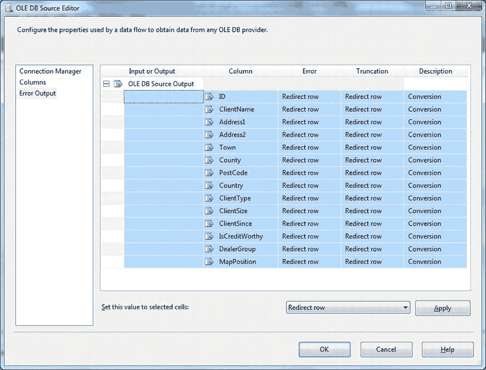
图 15-3 在数据流任务中重定向错误行

6.  点击“确定”确认。暂时忽略警告。
7.  添加一个 OLE DB 目标，将其与 OLE DB 源组件连接。双击并选择 `Car_Sales_Staging_OLEDB` 连接管理器。创建一个名为 `Clients` 的新表并进行列映射。将任务的“错误输出”设置为“重定向行”。
8.  向数据流窗格添加两个行计数任务。将它们命名为 `RowCountSource` 和 `RowCountDestination`。将前者连接到 OLE DB 源任务，后者连接到 OLE DB 目标任务。当你连接行计数器（使用红色的优先级约束）时，“配置错误输出”对话框会出现。只需点击“确定”。
9.  将 `ErrorRowsSource` 变量添加到名为 `RowCountSource` 的行计数任务中，将 `ErrorRowsDestination` 变量添加到名为 `RowCountDestination` 的行计数任务中。
10. 添加一个脚本组件——选择“转换”选项。将名为 `RowCountSource` 的行计数任务连接到它。双击进行编辑。
11. 点击“输入和输出”，向 `Output 0` 添加一个新的输出列。将该列命名为 `ErrorColumn`。点击左侧的“脚本”，然后点击“编辑脚本”。添加以下代码（假设脚本语言设置为 Microsoft Visual Basic 2010）：

    ```vbnet
    Public Overrides Sub Input0_ProcessInputRow(ByVal Row As Input0Buffer)
      Row.ErrorDescription = ComponentMetaData.GetErrorDescription(Row.ErrorCode)
    End Sub
    ```

12. 添加一个平面文件目标任务。将脚本任务连接到它，并配置为分隔文件目标。建议将其命名为`C:\SQL2012DIRecipes\CH15\SSISErrors.Txt`。将所有源列映射到它（包括 SSIS 添加的三列：`ErrorCode`、`ErrorColumn` 和 `ErrorDescription`）。
13. 添加一个 OLE DB 目标。将 `RowCountDestination` 任务连接到它，双击进行编辑。使用 `Car_Sales_Staging_OLEDB` 连接管理器并创建一个新表来存储错误记录。这个表同样包含 `ErrorCode` 和 `ErrorColumn` 字段。数据流应如图 15-4 所示。

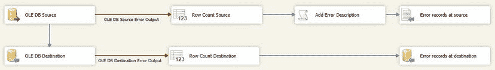
图 15-4 带有错误重定向的数据流

你现在可以运行导入过程了。OLE DB 源中的任何错误都将被发送到平面文件`SSISErrors.Txt`。目标任务中的任何错误都将被捕获到目标数据库中。

## 工作原理

当然，SSIS 也有自己的错误处理。需要进行优雅错误处理的关键地方是在数据流中，当数据无法正确通过 SSIS 管道时。

当数据行包含错误时（通常是数据类型错误或数据长度错误），SSIS 提供三个选项：

*   `继续`
*   丢弃该行。
*   将该行重定向到文件或数据表。

由于仅仅跳过错误行会导致加载不完整且无法跟踪丢失的记录，这里我只关注重定向选项。这样你就可以隔离任何错误记录。

在实际操作中，你可以将错误记录发送到平面文件、普通目标数据库——或者任何数据库。我发现将源错误输出到平面文件要容易得多，因为它几乎可以处理你抛给它的任何问题。如果你想在这里使用目标表，必须确保它具有足够宽的列来处理因截断导致的溢出——假设你正在处理截断错误。在实践中，这几乎总是意味着将所有列设置为非常宽的 `NVARCHAR` 类型。

## 提示、技巧和陷阱

*   平面文件目标无法处理某些源列类型，例如图像列。你需要从列映射中删除这些类型。
*   用于添加错误描述的脚本组件并非绝对必要——但在调试时拥有更完整的错误描述会很有帮助！
*   你也可以从数据转换任务和派生列任务中重定向错误信息。

## 15-10. 创建集中式日志框架

### 问题

你开发了一个相当复杂的 SSIS 包，其中包含许多对 T-SQL 存储过程的调用，并且你希望将事件记录到单个存储库中。

### 解决方案

开发一个自定义日志框架来处理来自 T-SQL 和 SSIS 的日志事件。以下是一个这样的框架：

1.  创建表（使用以下 DDL）来存储记录的信息 (`C:\SQL2012DIRecipes\CH15\tblEventDetail.Sql`)：

    ```sql
    CREATE TABLE CarSales_Logging.log.EventDetail
    (
     EventDetailID INT IDENTITY(1,1) NOT NULL,
     Process VARCHAR(255) NULL,
     Step VARCHAR(255) NULL,
     Comments VARCHAR(MAX) NULL,
     ErrorNo INT NULL,
     ErrorDescription VARCHAR(MAX) NULL,
     ErrorLineNo INT NULL,
     ErrorSeverity INT NULL,
     ErrorState INT NULL,
     StartTime DATETIME NULL,
     Logtime DATETIME NULL
    );
    GO
    ```

2.  使用以下 DDL，创建记录任何结果的存储过程 (`C:\SQL2012DIRecipes\CH15\pr_LogEvents.Sql`)：

    ```sql
    CREATE PROCEDURE CarSales_Logging.log.pr_LogEvents
    (
    @Process VARCHAR(150)
    ,@Step VARCHAR(150)
    ,@StartTime DATETIME
    ,@Comments VARCHAR(MAX) = NULL
    ,@ErrorNo INT = NULL
    ,@ErrorDescription VARCHAR(MAX) = NULL
    ,@ErrorLineNo INT = NULL
    ,@ErrorSeverity INT = NULL
    ,@ErrorState INT = NULL
    )

    AS

    INSERT INTO CarSales_Logging.log.EventDetail
    (
    Process
    ,Step
    ,StartTime
    ,Comments
    ,ErrorNo
    ,ErrorDescription
    ,ErrorLineNo
    ,ErrorSeverity
    ,ErrorState
    )

    VALUES
    (
    @Process
    ,@Step
    ,@StartTime
    ,@Comments
    ,@ErrorNo
    ,@ErrorDescription
    ,@ErrorLineNo
    ,@ErrorSeverity
    ,@ErrorState
    ) ;
    GO
    ```

3.  为所有基于 T-SQL 的进程添加日志记录，如下所示：

    ```sql
    -- Start Header -------------------------------------------------------------
    DECLARE @StartTime DATETIME
    DECLARE @ProcName VARCHAR(150) --- 调用过程
    DECLARE @ProcStep VARCHAR(150) -- 过程中的步骤
    SET @ProcName = OBJECT_NAME(@@PROCID)

    BEGIN TRY
    ---- End Header ------------------------------------------------------------

    SET @ProcStep = '我的测试'

    --你的代码在此处 --

    EXECUTE CarSales_Logging.log.


```markdown
# SSIS 中的自定义日志记录

## 存储过程代码
```sql
pr_Logging_Simple @ProcName, @ProcStep, @StartTime, 'Part of the process OK'

-- Start Footer ------------------------------------------------
BEGIN TRY
    END TRY
    BEGIN CATCH
        IF @@trancount > 0 ROLLBACK TRAN
        SET XACT_ABORT OFF;

        DECLARE @Error_Number int;
        DECLARE @ ErrorDescription VARCHAR(MAX);
        DECLARE @ErrorLine INT;
        DECLARE @ErrorSeverity INT;
        DECLARE @ErrorState INT;
        DECLARE @Message VARCHAR(150);

        SET @ERROR_NUMBER = ERROR_NUMBER();
        SET @ErrorDescription = ERROR_MESSAGE();
        SET @ErrorLine = ERROR_LINE();
        SET @ErrorSeverity = ERROR_SEVERITY();
        SET @ErrorState = ERROR_STATE();

        EXECUTE CarSales_Logging.log.pr_Logging_Simple @ProcName, @ProcStep, @StartTime, 'Error - Stored Procedure', @ERROR_NUMBER, @ErrorDescription, @ErrorLineNo, @ErrorSeverity, @ErrorState;

        SET @Message = 'Error in procedure: ' + @ProcName;
        RAISERROR(@Message, 16, 1);
    END CATCH
-- End footer -------------------------------------------
```

## 配置步骤

1.  创建一个名为`CarSales_Logging_ADONET`的 ADO.NET 连接管理器，用于连接到`CarSales_Logging`数据库。
2.  按如下方式将日志记录添加到 SSIS 任务。对于一个你希望记录其结果的任务或容器（在此示例中，将是一个数据流任务）。
3.  在任务的作用域内添加以下两个变量（最安全的方式是先选择任务再创建变量）：

    | 变量名 | 类型 | 值 |
    | --- | --- | --- |
    | `IsError` | `Boolean` | `False` |
    | `StartTime` | `DateTime` | |

4.  选择任务，单击“事件处理程序”选项卡，从可用事件处理程序列表中选择`OnPreExecute`。
5.  单击“单击此处以选择...”，然后在事件处理程序窗格上添加一个执行 SQL 任务。将其命名为**获取开始时间**。将其配置为使用 ADO.NET 连接`CarSales_Logging_ADONET`。
6.  在“参数映射”窗格中添加以下参数：

    | 变量 | 方向 | 类型 | 参数名 |
    | --- | --- | --- | --- |
    | `User::TaskStartTime` | `Output` | `DateTime` | `@TaskStartTime` |

7.  添加以下 SQL 作为 SQL 语句：
    ```sql
    SELECT @TaskStartTime = GETDATE()
    ```
8.  关闭并确认任务。这会将任务开始时间传递给作用域在任务级别的 SSIS 变量。
9.  从事件处理程序列表中选择`OnError`，然后单击“单击此处以选择...”。在事件处理程序窗格上添加一个执行 SQL 任务。将其命名为**记录失败**。添加用于日志记录的数据库的 ADO.NET 连接。
10. 对于“记录失败”执行 SQL 任务，添加以下参数：

    | 变量名 | 方向 | 数据类型 | 参数名 |
    | --- | --- | --- | --- |
    | `User::ErrorCode` | `Input` | `Int32` | `@ErrorNo` |
    | `User::ErrorDescription` | `Input` | `String` | `@ErrorDescription` |
    | `System::PackageName` | `Input` | `String` | `@Process` |
    | `System::SourceName` | `Input` | `String` | `@Step` |
    | `User::StartTime` | `Input` | `DateTime` | `@StartTime` |
    | `User::IsError` | `Input` | `Boolean` | `@IsError` |

11. 在“记录失败”SQL 任务中，添加以下 SQL 作为要执行的 SQL 语句：
    ```sql
    SET @IsError = 1;
    EXECUTE dbo.pr_LogEvents @Process, @Step, @StartTime, 'SSIS Error', @ErrorNo, @ErrorDescription;
    ```
12. 从事件处理程序列表中选择`OnPostExecute`，然后单击“单击此处以选择...”。在事件处理程序窗格上添加一个执行 SQL 任务。将其命名为**记录成功**。添加用于日志记录的数据库的 ADO.NET 连接。
13. 添加以下参数：

    | 变量名 | 方向 | 数据类型 | 参数名 |
    | --- | --- | --- | --- |
    | `User::TaskStartTime` | `Input` | `DateTime` | `@TaskStartTime` |
    | `System::PackageName` | `Input` | `String` | `@Process` |
    | `User::IsError` | `Input` | `Boolean` | `@IsError` |

14. 在“记录成功”SQL 任务中，添加以下 SQL 作为要执行的 SQL 语句：
    ```sql
    IF @IsError = 0
    BEGIN
        EXECUTE dbo.pr_LogEvents @Process, @Step, @StartTime;
    END
    ```
15. 返回到“控制流”选项卡。

## 工作原理

如果你正在构建（或已经构建）一个用于加载数据的中等复杂程度的 SSIS 包，那么你可能还希望将所有相关信息记录到一个中央存储库中。同样可能的是，这个存储库可能是一个 SQL Server 表，而不是文本文件。这样做的原因是：
*   一个集中的关注点避免了需要从多个信息源中搜索。
*   一个 T-SQL 表可以非常快速地被搜索和过滤。

那么，与使用和扩展 SSIS 提出的内置解决方案相比，使用“自己动手”的日志记录将日志记录到 T-SQL 有什么优点和缺点呢？表 15-8 提供了简明的概述。

表 15-8. 创建自定义日志框架的优点和缺点

| 优点 | 缺点 |
| --- | --- |
| 对于存储过程的集中记录非常有用——或者简单来说，就是什么工作正常、什么不正常的列表。 | 实现起来需要更多精力。 |
| 高度可定制。 | 难以调试。 |
| 记录高度有针对性和具体的信息不会导致资源争用。 | 容易忘记向任务和代码添加日志调用。 |
| 只记录所需的事件和信息。 | 本身可能成为包错误的来源并导致包失败。 |
| 易于指定数据存储的持续时间。只保留最近的信息。 | |
| 易于提取高级数据进行基线分析。 | |
| 有助于调试。 | |

尽管如此，我坚信将日志记录到中央表非常适合于生产 ETL 作业，而且我已经应用多年了。如果说有什么不同的话，那就是它变成了一种习惯和有价值的辅助工具，不仅在包投入生产之后，在调试它们时也是如此。

你可能会建议，既然 SQL Server 2012 提供了 SSIS 目录来提供日志记录，构建自定义日志框架已经是过去式了。我的回应是，虽然 SSIS 目录是一个用于记录 SSIS 任务和包日志的绝佳工具，但它（至少目前还不是）一个用于记录所有事件（包括由存储过程生成的事件）的中央存储库。但是，如果 SSIS 处理了整个 ETL 过程而没有任何对存储过程的调用，那么 SSIS 目录日志记录当然是可行的方法。SSIS 目录在配方 15-16 到 15-18 中有描述。

我在这里建议的方法是使用一个 SQL Server 表来记录当 SSIS 任务或 T-SQL 代码片段成功或失败时生成的事件数据。一个存储过程记录结果。这个存储过程从 T-SQL 或从 SSIS 调用。无论如何，出于本章开头概述的原因，我还强烈建议任何日志记录都使用自己的数据库。

日志表的 DDL 解释了其用途。由于 T-SQL 和 SSIS 之间的术语不同，为表字段名称做出了一些词汇选择，但我希望它们是自解释的。唯一可能需要进一步解释的字段是`Step`和`Process`。我添加了这些，因为一个包可能记录许多事件，并且这些事件是嵌套的（存储过程调用其他存储过程，SSIS 包调用 SSIS 包，而它们又有任务）。这两个字段允许你跟踪哪个进程调用了什么子元素，从而创建一个简单的层次结构来跟踪这种调用嵌套。它意味着始终包含对以下内容的引用：
*   `Process`：容器（SSIS 包或存储过程）。
*   `Step`：要记录的元素或任务。

我认为这种方法对于中小型 SSIS 流程很有用，这些流程需要基本（但不过度详细）的日志记录。
```


对于非常复杂的 ETL 系统，您将需要扩展这些表和过程以满足您的特定需求。像这样的集中式方法需要存储三种类型的元素：
-   SSIS 和 T-SQL 的通用数据。
-   仅特定于 SSIS 或 T-SQL 的数据。
-   错误详情（同样可以是 SSIS 和 T-SQL 的通用数据或特定于其中之一）。

因此，基于此方法的假设是您希望有相当最少的日志记录，让我们假设每个步骤需要记录以下基本原则：
-   包进程
-   包步骤
-   记录内容的描述
-   开始时间
-   结束时间（事件被记录的时间）
-   如果捕获到错误，记录错误详情

您将需要以下内容：
-   一个存储成功记录的表。
-   一个记录事件结果的存储过程。
-   一个到用于日志记录的数据库的 ADO.NET 连接管理器。我建议使用 ADO.NET 而非 OLEDB，纯粹是因为它处理参数传递的简便性，尤其是在有多个参数时。如果您愿意，可以使用 OLEDB 连接管理器。

从 T-SQL 进行日志记录是直接日志记录（如“Recipe 15-7”中所述）和错误处理（如“Recipe 15-8”中所述）的组合。这里是一个存储过程模板的示例，我将错误处理包装在标准的页眉和页脚中，并使用相同的存储过程来记录成功的步骤以及任何失败。此存储过程大纲甚至可以成为您 ETL 流程中所有存储过程的模型。

从 SSIS 记录到集中式表（与从存储过程记录时使用的表相同）需要明智地使用事件处理器才能干净有效地工作。对于大多数任务，您可以使用以下内容：
-   `OnPreExecute` 事件处理器来设置任务开始的时间。
-   `OnPostExecute` 事件处理器来记录任务完成。
-   `OnError` 事件处理器来记录任务失败的事实以及任何错误消息。

此外，您需要设置两个任务作用域的变量（作用域很重要），以便可以初始化开始时间，并设置一个错误标志（如果发生错误，这将阻止 `OnPostExecute` 事件处理器记录事件以及 `OnError` 事件处理器）。换句话说，作为 `OnError` 事件的一部分将 `IsError` 变量标记为 True，允许错误状态在 `OnPostExecute` 事件触发时被日志记录过程获取。由于“Log Success”任务在触发时也会测试此变量，它仅在错误***未***发生时调用存储过程来记录事件。

使用指向执行日志记录的服务器的 `Getdate()` 可能很重要，但您不能确保所有服务器都同步返回完全相同的日期和时间。因此，如果您使用脚本包和托管 SSIS 的服务器上的 `Now()` 函数，而日志记录发生在另一台服务器上，您最终可能会得到不一致的时间戳。

提示、技巧和陷阱
-   如果您的 SSIS 包非常简单，只包含一个步骤，那么您可以使用 `System::StartTime` 系统变量来记录开始时间，您将不需要使用或设置 `TaskStartTime` 变量。
-   不要试图使用 `ContainerStartTime` 系统变量来记录包开始时间——这将给出执行日志记录的 Execute SQL 任务的开始时间——**而不是**您试图监视的任务。
-   从 T-SQL 记录时，存储过程输入参数的顺序很重要，因为任何非强制（`NULL`）参数必须跟在强制参数之后。

#### 15-11. 使用 SSIS 容器时记录到集中式框架

### 问题
当使用 SSIS 容器和基于事件处理器的自定义日志框架时，您发现相同的事件被记录了多次。

### 解决方案
以特定方式将您的自定义日志框架应用于 SSIS 容器，以便只制作一条日志条目。以下是完成方法：
1.  创建一个 SSIS 包。
2.  创建一个名为 `CarSales_Logging_ADONET` 的 ADO.NET 连接管理器，连接到 CarSales_Logging 数据库——当然，除非它已存在。
3.  创建以下变量：
    | 名称 | 作用域 | 数据类型 |
    | --- | --- | --- |
    | ContainerStart | 包 | DateTime |
4.  添加一个 Execute SQL 任务。将其命名为 `SetStartTime`。双击进行编辑并按如下配置：
    | 连接类型 | ADO.NET |
    | --- | --- |
    | 连接 | CarSales_ADONET |
    | SQL 源类型 | 直接输入 |
    | SQLStatement | `SELECT @ContainerStart = GETDATE()` |
    | IsQueryStoredProcedure | False |
5.  点击左侧的“ParameterMapping”，并添加以下参数：
    | 变量名称 | 方向 | 数据类型 | 参数名称 |
    | --- | --- | --- | --- |
    | ContainerStart | 输出 | DateTime | @ContainerStart |
6.  点击“确定”完成修改。
7.  将此 Execute SQL 任务连接到您希望记录的容器。
8.  添加两个 Execute SQL 任务。将两个都连接到您希望记录的容器。双击其中一个优先约束并将其设置为“Failure”。将一个命名为 `Log Success`，另一个（通过设置为“Failure”的优先约束连接）命名为 `Log Failure`。
9.  对于这两个任务，按照步骤 3 中的描述添加 ContainerStart 参数，但方向设置为“Input”。
10. 对于这两个任务，双击进行编辑并设置以下内容：
    | 连接类型 | ADO.NET |
    | --- | --- |
    | 连接 | CarSales_Staging_ADONET |
    | SQL 源类型 | 直接输入 |
    | IsQueryStoredProcedure | False |
11. 对于“Log Success”任务，设置 SQLStatement 为：
    ```
    EXECUTE pr_Logging @Process, @Step, @StartTime
    ```
12. 对于“Log Failure”任务，设置 SQLStatement 为：
    ```
    EXECUTE pr_Logging @Process, @Step, @StartTime, 'SSIS Error', 5000,'Failure to Load Staging Tables'
    ```

该包应该类似于 图 15-5。
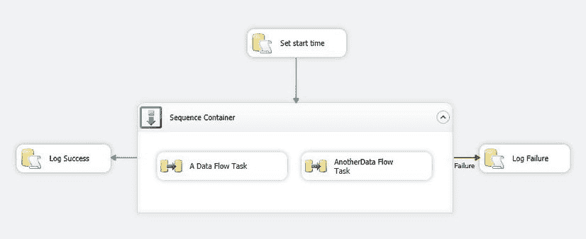
图 15-5. 为容器对象记录事件

### 工作原理
不幸的是，容器需要一种稍有不同的日志记录方法——假设您希望为整个容器制作单个日志条目。这是因为如果您使用“Recipe 15-10”中容器的事件处理器，它们将在容器中的任务触发时全部重复触发，这会导致多个相同的日志条目。因此，简单的解决方案是添加三个 Execute SQL 任务：
-   一个在容器之前，并连接到容器，用于设置开始时间。
-   一个使用“Success”优先约束连接到容器，用于记录成功。
-   一个使用“Failure”优先约束连接到容器，用于记录失败。

这样，容器只被记录一次，并包含任何最终失败的错误消息。

#### 15-12. 使用 SSIS 脚本任务和组件时记录到集中式框架

### 问题
您希望从您编写的脚本代码内部写入自定义日志框架。

### 解决方案
在脚本任务或组件内部使用 .NET 来调用执行日志记录的存储过程。
1.  创建一个 SSIS 包。
2.  创建一个名为 `CarSales_Logging_ADONET` 的 ADO.NET 连接管理器，连接到数据库 `CarSales_Logging`——当然，除非它已存在。
3.  添加一个脚本任务。双击进行编辑。
4.  将脚本语言设置为 Microsoft Visual Basic 2010，然后单击“Edit Script”按钮。
5.  在脚本的适当位置，添加以下代码以写入日志表
    (`C:\SQL2012DIRecipes\CH15\CentralisedSSISLogging.`)


```markdown
## 工作原理

在记录 SSIS 包日志时，一个略微具体的需求是来自脚本任务的详细日志记录。当然，如果任务很简单，那么仅添加三个事件处理程序（`OnPreExecute`、`OnPostExecute` 和 `OnError`）就足够了。然而，可能需要一些微调才能更进一步，更全面地跟踪事件——以及错误。

如果你的脚本任务复杂或具有迭代性，你可能希望将过程事件作为任务执行的一部分记录下来。你将需要以下内容：

*   一个用于记录日志数据库的 ADO.NET 连接管理器。
*   日志记录存储过程（`Log.pr_LogEvents`），如配方 15-10 所示。
*   日志记录表（`log.EventDetail`），如配方 15-10 所定义。

当然，如果你从脚本任务内部记录多个事件，那么对于所有后续事件，你只需要重置 `Comments` 参数并添加 `cmd.ExecuteNonQuery()`。你需要在脚本文件中添加 `Imports System.Data.SqlClient`。你还需要为事件添加你能提供的最准确、最具描述性的注释，因为你可能某天需要在日志表中理解它。

如果你希望从 SSIS 脚本组件写入中央日志表，则会有一些不同。具体来说，连接管理器是为任务定义的，然后在脚本内部“获取”。

你将再次需要一个用于记录日志数据库的 ADO.NET 连接管理器、日志记录存储过程（`Log.pr_LogEvents`）和日志记录表（`log.EventDetail`）。

假设这些都已就位，请执行以下步骤：

1.  双击以编辑脚本组件。
2.  单击“连接管理器”，然后单击“添加”。
3.  从列表中选择你用于日志记录的 ADO.NET 连接管理器。对话框应类似于 图 15-6。

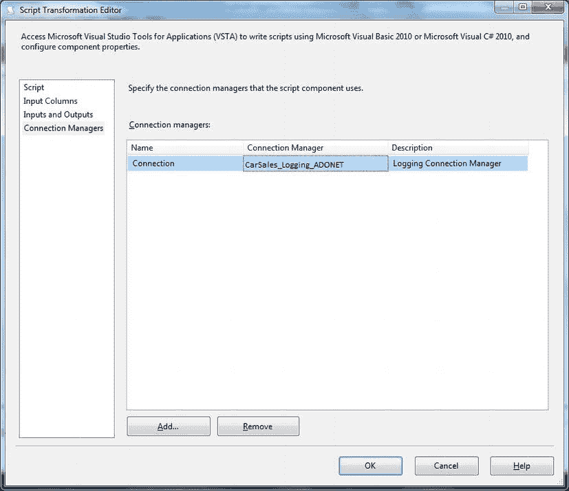

图 15-6. 从脚本任务记录日志

4.  单击“脚本”，然后单击“编辑脚本”。
5.  将以下代码添加到代码主体中：

    ```vbnet
    Public Overrides Sub AcquireConnections(ByVal Transaction As Object)
        SQLMgr = Me.Connections.LogConnection
        cnMgr = CType(SQLMgr.AcquireConnections(Nothing), SqlClient.SqlConnection)
    End Sub
    ```

6.  为脚本任务添加日志记录代码（如前所述）。

如果你已为 SSIS 脚本任务添加了 `OnError` 事件处理程序，那么确保脚本执行期间引发的任何错误消息都被准确记录将特别有用。这可以通过捕获任何错误，然后触发一个错误事件来实现——该事件将错误消息传递给任务错误处理程序。它可能类似于这样：

```vbnet
Try
    'Your code here
Catch ex As Exception
    ' Error code and description passed to handler
    Dts.Events.FireError(20, "", ex.Message, "", False)
End Try
```

这样，如果遇到错误，`OnError` SSIS 事件会被触发，特定的错误消息会被记录到中央错误表中——无需在脚本组件中编写复杂的日志记录代码。

 **注意** 即使复制和粘贴构成由事件处理程序触发的日志记录基础结构的执行 SQL 任务很容易，但很快就会变得有点烦人。另一个有效的方法是在包级别为 `OnPreExecute`、`OnPostExecute` 和 `OnError` 任务定义三个执行 SQL 日志记录任务——也就是说，在单击“事件处理程序”选项卡之前，单击“控制流”窗格内的任意位置。这意味着此处设置的任何事件处理程序都将为包中的 `每个` 任务触发。但是，你可以通过将包的 `DisableEventHandler` 属性设置为 `False`，并 `仅` 对你希望记录日志的任务将其设置为 `True` 来添加一定程度的控制。然而，你仍然必须为每个将被记录日志的任务定义任务作用域变量。

最后一点，将 T-SQL 日志记录和错误处理代码复制并粘贴到数十个存储过程中可能会迅速变得既令人沮丧又乏味。所以可能值得提醒我们自己，SSMS 允许你在创建存储过程时使用存储过程模板。诀窍是找到这些模板存储的目录。

在 32 位 Windows 上，它是（至少在我的 32 位工作站上）：

```
C:\Program Files\Microsoft SQL Server\110\Tools\Binn\VSShell\Common7\IDE\SqlWorkbenchProjectItems\Sql\
```

在 64 位 Windows 上，它是（至少在我的 64 位工作站上）：

```
C:\Program Files (x86)\Microsoft SQL Server\110\Tools\Binn\VSShell\Common7\IDE\SqlWorkbenchProjectItems\Sql\
```

无论哪种情况，你都可以使用一个现有目录，或者在你找到的目录旁边创建自己的目录。然后，你可以将包含模板结构的 SQL 文件（带有合适的名称）复制到该目录中。

一旦完成，你所要做的就是按 `Ctrl+Alt+T` 或单击 `View Template Explorer` 以显示模板窗口，然后打开你之前创建的作为新过程模型的模板。

如果你真的想更进一步，你可以通过将你的日志记录模板的内容粘贴到以下文件来将模板设置为默认的“新建存储过程”模板：

```
C:\Program Files\Microsoft SQL Server\110\Tools\Binn\VSShell\Common7\IDE\SqlWorkbenchProjectItems\Sql\Stored Procedure\ Create Stored Procedure (New Menu).sql
```

在 SSMS 中，展开数据库的 `可编程性/存储过程`。右键单击并选择 `新建存储过程`。你的模板将被加载，准备扩展。

#### 15-13. 从 T-SQL 记录到文本或 XML 文件

### 问题

你希望将过程信息记录到文本或 XML 文件，而不是 SQL Server 表中。

### 解决方案

创建一个基于 CLR 的存储过程，将信息记录到磁盘，如下所示。

1.  首先，你需要一个简单的 CLR 例程将日志数据输出到磁盘。这可以通过创建一个名为 `WriteToDisk` 的 CLR 存储过程来完成，使用以下 C# 代码（有关如何创建和加载 CLR 例程的概述，请参见配方 10-21）：

    ```csharp
    using System;
    using System.Diagnostics;
    using System.IO;

    public class DiskWriter
    {
        [Microsoft.SqlServer.Server.SqlProcedure()]
        public static void WriteToDisk(string theData, string theFile)
        {
            File.WriteAllText(theFile, theData);
        }
    }
    ```

2.  一旦你部署并安装了 CLR 存储过程，你就可以使用它写入文本文件。

```vbnet
Dim StartTime As Date = Now()
Dim cnMgr As SqlClient.SqlConnection

cnMgr = DirectCast(Dts.Connections("CarSales_ADONET").AcquireConnection(Dts.Transaction), SqlClient.SqlConnection)

Dim cmd As New SqlClient.SqlCommand

cmd.CommandText = "Log.pr_LogEvents"
cmd.CommandType = CommandType.StoredProcedure
cmd.Parameters.AddWithValue("Process", DbType.String).Value = Dts.Variables("PackageName").Value
cmd.Parameters.AddWithValue("Step", DbType.String).Value = Dts.Variables("TaskName").Value
cmd.Parameters.AddWithValue("StartTime", DbType.DateTime).Value = StartTime
cmd.Parameters.AddWithValue("Comments", DbType.String).Value = "This seems to have worked!"

cmd.ExecuteNonQuery()

Dts.Connections("CarSales_Logging_ADONET").ReleaseConnection(Nothing)

Dts.TaskResult = ScriptResults.Success
```

6. 关闭脚本窗口并单击“确定”以完成你的修改。
```


这就像将你希望记录的元素串联起来并传递给 CLR 存储过程一样简单，如下面的 T-SQL 代码片段所示：

```
DECLARE @OUTPUT NVARCHAR(MAX)
DECLARE @PackageName VARCHAR(150)
DECLARE @StepName VARCHAR(150)
DECLARE @StartTime DATETIME
DECLARE,@MachineName VARCHAR(150)

SET PackageName = 'MyPackage'
SET StepName = 'FirstStep'
SET StartTime = CONVERT(VARCHAR(20), @StartTime, 112)
SET MachineName = 'MyPC'

SET @OUTPUT = @PackageName + ',' + @StepName + ',' + @StartTime + ',' + @MachineName

EXECUTE dbo.WriteToDisk @OUTPUT,'C:\SQL2012DIRecipes\CH13\AA_log.Csv'
```

### 工作原理

如果你倾向于将状态信息写入 SQL Server 外部的文件（作为文本或 XML），那么可以使用相当“经典”的技术来实现。你可能出于以下几个原因希望这样做：

*   将日志写入文件可以减少数据库开销——代价是运行一个 CLR 函数。
*   你可以轻松地将数据记录到不同的服务器，进一步降低主 SQL Server 的负载。
*   你更喜欢将日志数据保存在数据库之外。
*   即使发生致命的数据库问题，你仍然拥有日志数据。

首先，你需要一个基于 CLR 的存储过程，该过程接受两个输入参数：

*   要写入文件的数据行。
*   数据将被写入的文件的完整路径。

此过程仅包含一行代码，该行使用 `WriteAllText` 函数将一行内容添加到指定的文件中。一旦这个 CLR 程序集被编译并部署到 SQL Server 并创建了程序集，它的调用方式就与其他任何存储过程一样。

编写 XML 日志可能需要对 XML 进行一些准备。在这里，我将格式化从日志表中提取的数据，并使用与 SSIS 相同的格式导出为 XML：

```
DECLARE @OUTPUT NVARCHAR(MAX)

; WITH XML_CTE (XMLOUTPUT) AS (
    SELECT ERROR_LOG_ID AS 'record/event',
           CREATEDATE AS 'record/message',
           CREATEUSERNAME AS 'record/computer'
    FROM CarSales_Logging.Log.EventDetail
    FOR XML PATH('dtslog'), ROOT('dtslogs')
)

SELECT @OUTPUT = XMLOUTPUT FROM XML_CTE

EXECUTE dbo.WriteToDisk @OUTPUT,'D:\AdamProject\Test\AA_XML.XML'
```

#### 提示、技巧与陷阱

*   你可以在每个事件发生时将其写入磁盘，也可以在过程结束时执行一次写入操作。第一个示例中的文本输出假设采用了前一种方法；XML 示例则假设选择了后一种。每一行都写入可确保在发生大规模故障时，你仍然拥有日志记录；而在过程结束时写出数据，可以被视为一种可选操作，作为对数据库日志记录的补充。

#### 15-14. 在 T-SQL 中记录计数器

### 问题

你希望记录计数器（记录数）以跟踪基于 T-SQL 的过程中每个阶段处理的记录数量。

### 解决方案

创建一个自定义的计数器记录框架。

1.  至少，你需要一个存储所记录计数器的存储库。最简单的存储介质是 SQL 表，因此这里提供了 `Log_ProcessCounters` 表的 DDL（`C:\SQL2012DIRecipes\CH15\tblLog_ProcessCounters.Sql`）：

```
CREATE TABLE CarSales_Logging.log.Log_ProcessCounters
(
    ID INT IDENTITY(1,1) NOT NULL,
    PROCESSID INT NULL,
    CounterType NVARCHAR(250) NULL,
    CounterDescription NVARCHAR(250) NULL,
    CounterResult BIGINT NULL,
    ProcessName VARCHAR(150) NULL,
    ProcessStep VARCHAR(150) NULL,
    UserName VARCHAR(150) NULL,
    ComputerName VARCHAR(150) NULL,
    DateCreated DATETIME NULL DEFAULT GETDATE()
)
```

2.  由于你不太可能希望反复编写 SQL 来使用此表存储计数器，因此创建一个存储过程来执行此重复任务，使用以下 DDL（`C:\SQL2012DIRecipes\CH15\pr_LogCounters.Sql`）：

```
CREATE PROCEDURE CarSales_Logging.log.
```


#### 15-15. 从 SSIS 记录计数器

#### 问题

您希望记录计数器（记录数）以跟踪 SSIS 包所有重要阶段处理的记录数量。

#### 解决方案

使用 SSIS 的`Row Count`任务捕获记录数，然后将其写入您自定义的计数器日志框架。

1.  创建在配方 15-14 中描述的`Log_ProcessCounters`表和`pr_LogCounters`存储过程。
2.  在控制流窗格中右键单击，然后选择“变量”，打开变量窗格。
3.  单击“添加变量”按钮并为变量命名。确保它是足够大小的整数。在本配方中，我将使用名称`NumberOfRecordsHandled`。
4.  添加一个数据流任务，双击进行编辑。

```sql
pr_LogCounters     (     @CounterType NVARCHAR(250)     ,@CounterDescription  NVARCHAR(250)     ,@CounterResult BIGINT     ,@ProcessName NVARCHAR(150) = NULL     ,@ProcessStep NVARCHAR(150) = NULL     ,@UserName NVARCHAR(150) = NULL     ,@ComputerName NVARCHAR(150) =  NULL     )          AS          DECLARE @PROCESSID INT     SELECT @PROCESSID = MAX(ID) FROM dbo.ProcessHistory          INSERT INTO dbo.Log_ProcessCounters     (     ProcessID     ,CounterType     ,CounterDescription     ,CounterResult     ,ProcessName     ,ProcessStep     ,UserName     ,ComputerName          )          VALUES     (     @PROCESSID     ,@CounterType     ,@CounterDescription     ,@CounterResult     ,@ProcessName     ,@ProcessStep     ,@UserName     ,@ComputerName     )
```

5.  添加一个源组件，配置为连接到任何有效源。我将使用`CarSales`数据库和`Clients`表。
6.  在数据流窗格中添加一个`Row Count`任务。将源组件连接到它。
7.  双击`Row Count`任务进行编辑。
8.  从“变量”属性的变量列表中选择您刚创建的变量。最终应得到类似图 15-7 所示的结果。

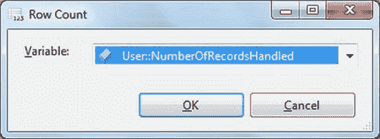

图 15-7。为`Row Count`任务选择变量

9.  单击“确定”。
10. 添加一个目标组件，配置为使用任何有效的 SQL Server 目标数据库。我建议使用`CarSales_Staging`数据库和`Client`表，如附录 B 中所述。
11. 将`Rowcount`任务连接到目标组件。双击目标组件并映射列。
12. 选择控制流窗格，在最后一个要执行的任务（本例中是数据流任务）之后的控制流上添加一个“执行 SQL 任务”。将前一个任务连接到这个新任务。
13. 双击编辑“执行 SQL 任务”，并添加或创建一个 ADO.NET 连接。将其命名为`LogCounters`。连接到您将记录计数器的服务器和数据库。
14. 在对话框的左侧窗格中单击“参数映射”，并设置以下参数：

| 变量名 | 方向 | 数据类型 | 参数名 |
| :--- | :--- | :--- | :--- |
| `System::MachineName` | 输入 | 字符串 | `@MachineName` |
| `System::PackageName` | 输入 | 字符串 | `@PackageName` |
| `System::UserName` | 输入 | 字符串 | `@UserName` |
| `User::NumberOfRecordsHandled` | 输入 | Int32 | `@Counter` |

15. 将以下内容设置为 SQL 语句：

```sql
EXECUTE CarSales_Logging.log.pr_LogCounters 'SourceData', 'Rows added to myTable', @Counter, @PackageName, 'Insert Data', @UserName, @MachineName
```

16. 单击“确定”确认您的修改。

运行此包时，存储 SSIS 用户变量记录的行数的计数器将被写入日志表。

#### 工作原理

在运行 SSIS 任务时，您可能需要记录关键计数器，可能包括输入行、输出行和错误行。

计数器可以记录到 SQL Server 表、文本文件或 XML 文件中。它们可以在进程执行过程中记录，也可以在包结束时记录。此方法在进程执行期间捕获行计数，然后将其写入目标表。

计数器记录就像在 SSIS 数据流任务（无论是数据流源、数据流转换等等）内部添加一个`Row Counter`任务一样简单。`Row Counter`将记录在`Row Counter`任务所在位置通过数据管道的数据行数。

#### 提示、技巧和陷阱

*   如果希望记录多个计数器，则每个都必须定义为单独的变量。但是，您可以将所有计数器作为单个“执行 SQL 任务”的一部分写入日志表，在该任务中多次调用`pr_LogCounters`存储过程。在这种情况下，您必须记得在此任务中将所有“计数器”变量设置为参数。
*   请记住，SSIS 变量作用域可能会困扰疲倦或不小心的程序员。如果您希望避免在调试时浪费大量时间，请最好在包级别设置所有用户定义变量（方法是在定义它们之前单击控制流窗格）。
*   如果您愿意，可以使用 OLEDB 连接管理器，但这需要使用位置参数，我个人觉得这非常繁琐，因此我只能鼓励您使用 ADO.NET 连接管理器。

### 15-14. 从存储过程记录计数器（续）

一旦计数器日志表和存储过程就位，记录任何可以设置内置`@@ROWCOUNT`全局变量的事件就很简单，只需使用以下代码。在存储过程的开头，确保存在以下行：

```sql
DECLARE @ProcName VARCHAR(128)
DECLARE @UserName VARCHAR(128)
SET @ProcName = OBJECT_NAME(@@PROCID)
SELECT @UserName = USER_NAME()
```

在每个要记录的事件处，添加以下代码片段：

```sql
EXECUTE CarSales_Logging.log.pr_LogCounters
'SourceData'
,'Rows Truncated from myTable'
,@@ROWCOUNT
,@ProcName
,'Truncate table'
,@UserName
,@@SERVERNAME
```

#### 工作原理（针对配方 15-14）

记录计数器是对配方 15-8 中描述的日志记录技术的扩展。我这里建议不要跳过实现计数器记录，因为如果您想跟踪、建立基线和改进任何数据加载过程，它可能非常有用。我假设所有计数器都是由进程步骤生成的，因此我包含了对进程名称和步骤的引用，以便您可以将两者联系起来。`@CounterType`参数是为了便于以后分析和分类计数器。当然，如果您觉得它对您的日志记录要求没有用，可以将其删除。

#### 提示、技巧和陷阱（针对配方 15-14）

*   在进程结束时记录所有计数器（与在每个步骤后记录相反）速度稍快，但与整体处理时间相比，这种差异通常微乎其微，不应影响您的设计决策。此外，将多个计数器变量传递给单个“执行 SQL 任务”所涉及的工作量也不容小觑。事实上，考虑到这种方法潜在的错误风险，我认为最好避免使用。
*   请记住，`@@ROWCOUNT`几乎在存储过程中的每个事件中都会被 SQL Server 更新。这意味着，如果您担心`@@ROWCOUNT`捕获的数字可能不是您想要的，则必须捕获结果并将其传递给用户定义的变量，然后在调用`pr_LogCounters`存储过程时使用该变量。
*   在`pr_LogCounters`存储过程中将除三个必需参数外的所有参数的默认值定义为`NULL`的原因是，这样如果您对其他日志记录元素不感兴趣，就可以始终使用简化的存储过程调用。


#### 15-16. 创建 SSIS 目录

### 问题

您希望利用 SQL Server 2012 提供的功能，从 SQL Server 数据库存储并运行 SSIS 包。

### 解决方案

创建一个 SSIS 目录，并将 SSIS 项目部署到其中。

1.  在 SSMS 中，右键单击 `Integration Services Catalogs`，然后选择 `Create Catalog`。
2.  为保护数据库的加密密钥添加一个密码。
3.  单击 `OK`。
4.  展开 `Integration Services Catalogs`，右键单击 `SSISDB` 并选择 `Create Folder`。
5.  输入文件夹名称并单击 `OK`。

至此，您已创建了一个 SSIS 目录，因此可以将 SSIS 项目部署到其中。步骤如下：

6.  在 SSDT 中，打开一个项目。选择 `Project` -> `<Project name> Properties`。您项目的 `Pages` 属性对话框将出现，如 图 15-8 所示。

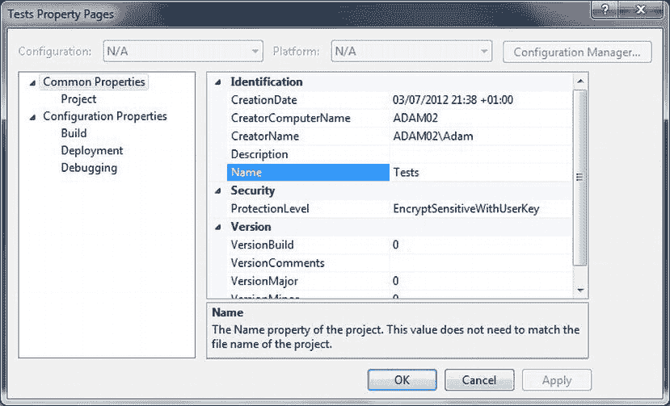
图 15-8. SSIS 项目属性

7.  在左侧窗格中展开 `Configuration Properties` 并单击 `Deployment`。添加您将要部署到的服务器和 `Server Project Path`。对话框应如 图 15-9 所示。

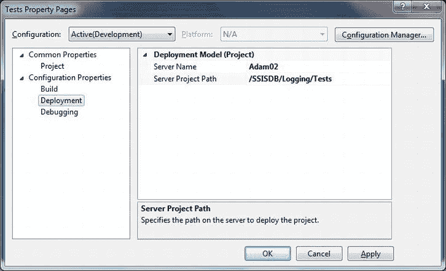
图 15-9. 用于部署的 SSIS 项目属性

8.  单击 `OK` 完成项目属性配置。
9.  在 `Solution Explorer` 中右键单击项目并选择 `Deploy` 来部署您的 SSIS 包。
10. 如果看到起始页，请单击 `Next`。
11. 在 `Select Source` 窗格中，确认项目是您希望部署的那个。对话框应如 图 15-10 所示。

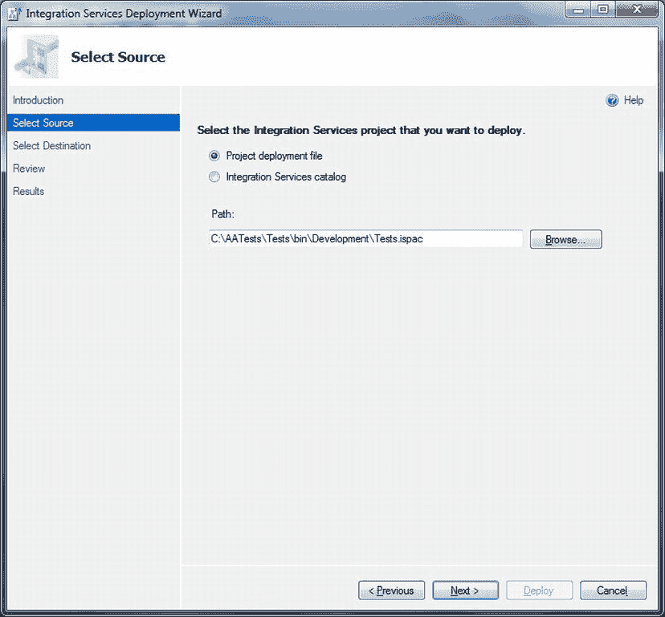
图 15-10. 选择要部署到 SSIS 目录的源项目

12. 单击 `Next`。
13. 在 `Select Destination` 窗格中，输入或浏览到您希望部署项目的目标服务器和路径。对话框应如 图 15-11 所示。

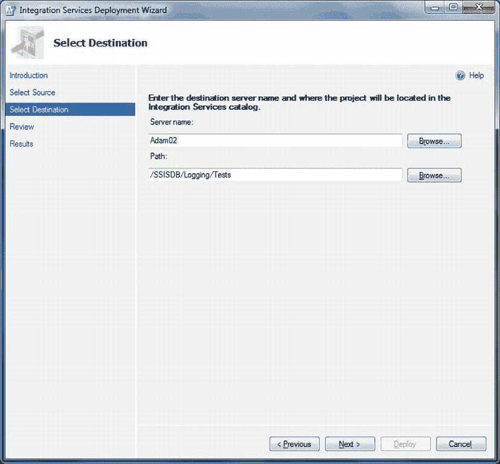
图 15-11. 选择要部署到 SSIS 目录的目标项目

14. 单击 `Next`。对话框应如 图 15-12 所示。

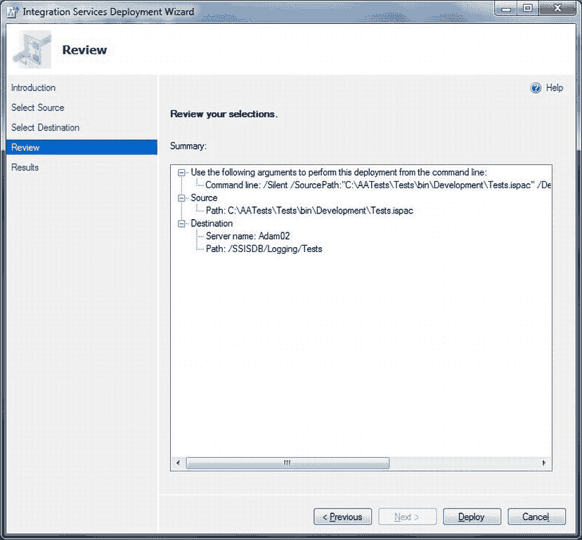
图 15-12. 项目部署审阅窗格

15. 单击 `Deploy`。项目部署完成后，部署向导的结果窗格将出现。它将类似于 图 15-13。

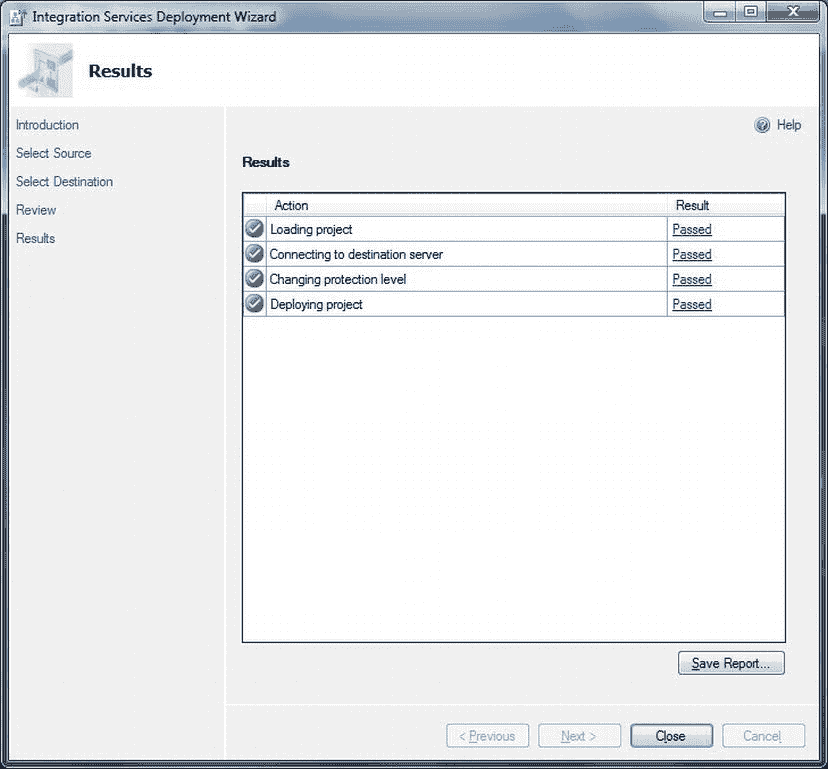
图 15-13. 成功部署 SSIS 项目后的结果窗格

16. 单击 `Close`。

由于您最多只会向 SQL Server 写入几条记录，因此两种连接管理器之间的速度差异根本不成问题。

*   如果传递给存储过程的所有参数都是 SSIS 变量，那么您可以在名为 `LogCounters` 的 `Execute SQL` 任务中将 `IsQueryStoredProcedure` 设置为 `True`。然后，您只需使用存储过程名称 (`log.pr_LogCounters`) 作为 `SQL Statement`。

### 工作原理

本质上，SSIS 目录是一个 SQL Server 数据库，它允许您存储 SSIS 项目。一旦项目被部署到这个数据库（或称为 Catalog）中，您就可以从一个中心位置运行包。您还可以为事件和计数器请求不同级别的日志记录，而无需对已部署到目录的包进行任何修改。

我们使用的过程包括以下四个步骤：

*   创建 SQL Server 用来管理 SSIS 项目的 `SSISDB` 数据库。
*   创建您想要部署项目的任何文件夹。
*   准备项目。
*   部署项目。

就是这么简单。然后，您可以通过展开部署目标服务器的 `Integration Services Catalogs` 文件夹来查看任何已部署的项目。您将看到您创建的文件夹、项目以及项目中的所有包——类似于 图 15-14 所示的完全简单的示例。

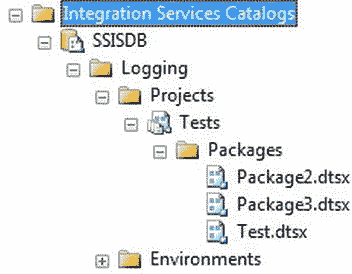
图 15-14. SSMS 中的 Integration Services 目录

### 提示、技巧和陷阱

*   SSIS 目录数据库名为 `SSISDB`，且此名称无法更改。
*   重新部署项目时，您会收到警告，提示您将覆盖现有项目。
*   您可以通过在 SSMS 中右键单击目录中存储的任何包，选择 `Execute ...`，然后单击 `OK` 来运行它。
*   必须启用 CLR 集成才能创建 SSIS 目录。如果您的环境不是这种情况，以下是启用它的 T-SQL 代码片段：

    ```sql
    sp_configure 'show advanced options', 1;
    GO
    RECONFIGURE;
    GO
    sp_configure 'clr enabled', 1;
    GO
    RECONFIGURE;
    GO
    ```

#### 15-17. 从 SSIS 目录读取已记录的事件和计数器

### 问题

您想使用 SQL Server 2012 快速查看 SSIS 目录中提供的事件和计数器。

### 解决方案

显示 SSMS 提供的内置报告。方法如下：

1.  展开 `Integration Services Catalogs` -> `SSISDB` -> `<FolderName>` -> `Projects` -> `<ProjectName>` -> `Packages`。
2.  右键单击要执行的包并选择 `Execute`。
3.  选择 `Advanced` 窗格并将日志记录级别设置为 `Performance`。
4.  单击 `OK`。包将运行。将出现如下对话框，如 图 15-15 所示。

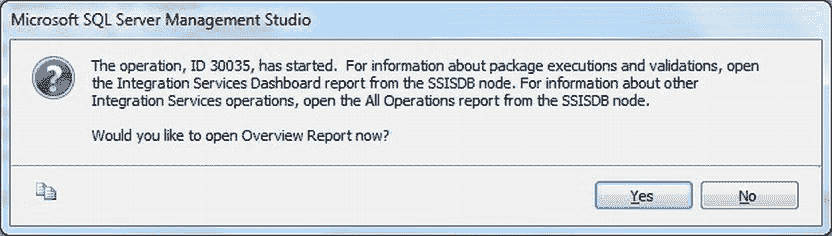
图 15-15. 在 SSMS 中打开概览报告

5.  单击 `Yes` 显示 `Overview` 报告。您将看到类似 图 15-16 的内容。

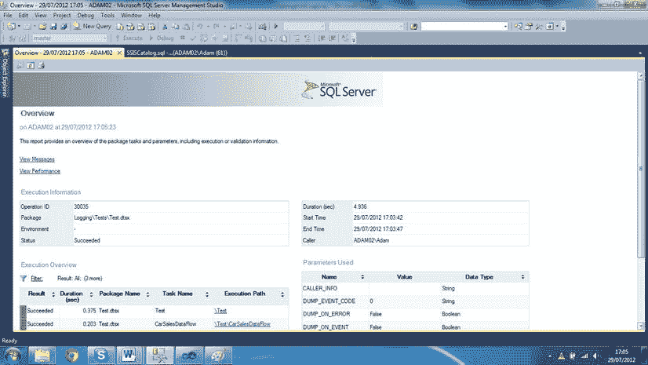
图 15-16. SSMS 中的概览报告

6.  您可以在基础包仍在运行时刷新报告。事实上，在使用目录报告提供的任何数据之前，您应始终确保包已完成。

### 工作原理

既然您已将项目部署到 SSIS 目录，那么每次运行包时都可以查看事件和指标。实际上，当您使用 SSMS 从目录运行包时，默认情况下此选项是可用的。

以下是可用的三个基本报告：

*   `Overview` 报告
*   `Performance` 报告
*   `Messages` 报告

您可以通过单击每个报告中的超链接在报告之间切换。您还可以通过单击 `Overview` 报告中的 `Execution Path` 元素来查看包中每个任务的执行详细信息。在 图 15-16 中，这些是 `\Test` 和 `\Test\CarSalesDataFlow`。

SSIS 目录允许您选择日志记录级别；但是，必须在执行包之前选择。可用的四个级别如 表 15-9 所示。


