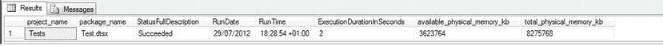
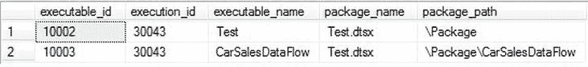
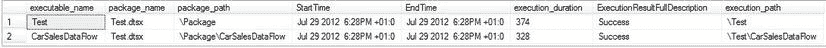
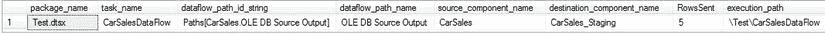

# 15-18. 深入分析 SSIS 目录中的事件和计数器

**问题**
在 SQL Server 2012 中，您希望深入查看 SSIS 目录中选定的事件和计数器。

**解决方案**
查询 `SSISDB` 数据库的目录视图。

1.  使用 T-SQL 运行存储在目录中的 SSIS 包（当然，请使用您自己的文件夹名称、项目名称和包名称），使用以下代码片段（`C:\SQL2012DIRecipes\CH15\CatalogExecution.Sql`）：

```sql
DECLARE @execution_id bigint
EXECUTE SSISDB.catalog.create_execution
    @package_name=N'Test.dtsx'
    ,@execution_id=@execution_id OUTPUT
    ,@folder_name=N'Logging'
    ,@project_name=N'Tests'
    ,@use32bitruntime=False
    ,@reference_id=Null

EXECUTE SSISDB.catalog.set_execution_parameter_value  @execution_id, 50, 'LOGGING_LEVEL', 3 -- Verbose

EXECUTE SSISDB.catalog.start_execution @execution_id

SELECT @execution_id  -- Returns the execution ID for later querying
```

2.  查询有关包及其运行的任务的信息，使用以下 T-SQL（`C:\SQL2012DIRecipes\CH15\CatalogPackageAndTasks.Sql`）：

```sql
SELECT
    project_name
    ,package_name
    ,CASE status
        WHEN 1 THEN 'Created'
        WHEN 2 THEN 'Running'
        WHEN 3 THEN 'Cancelled'
        WHEN 4 THEN 'Failed'
        WHEN 5 THEN 'Pending'
        WHEN 6 THEN 'Ended unexpectedly'
        WHEN 7 THEN 'Succeeded'
        WHEN 8 THEN 'Stopping'
        WHEN 9 THEN 'Completed'
    END AS StatusFullDescription
    ,CONVERT(VARCHAR(25),start_time,103) AS RunDate
    ,CONVERT(VARCHAR(25),start_time,108) AS RunTime
    ,DATEDIFF(ss, start_time, end_time) AS ExecutionDurationInSeconds
    ,available_physical_memory_kb
    ,total_physical_memory_kb
FROM   SSISDB.catalog.executions
WHERE          execution_id = @execution_id
```

输出结果可能类似于 图 15-17。



图 15-17。 关于包的目录信息

3.  获取包内可执行文件（任务）的列表，使用以下代码片段（`C:\SQL2012DIRecipes\CH15\CatalogExecutables.Sql`）：

```sql
SELECT
    executable_id
    ,execution_id
    ,executable_name
    ,package_name
    ,package_path
FROM SSISDB.catalog.executables
WHERE   execution_id = @execution_id
```

输出结果将如 图 15-18 所示。



图 15-18。 关于任务的目录信息

4.  现在查看包内可执行文件的更详细信息，使用以下 T-SQL（`C:\SQL2012DIRecipes\CH15\CatalogExecutionDetail.Sql`）：

```sql
SELECT
    EX.executable_name
    ,EX.package_name
    ,EX.package_path
    ,CONVERT(VARCHAR(25),ES.start_time,100) AS StartTime
    ,CONVERT(VARCHAR(25),ES.end_time,100) AS EndTime
    ,ES.execution_duration
    ,CASE ES.execution_result
        WHEN 0 THEN 'Success'
        WHEN 1 THEN 'Failure'
        WHEN 2 THEN 'Completion'
        WHEN 3 THEN 'Cancelled'
    END AS ExecutionResultFullDescription
    ,ES.execution_path
FROM  SSISDB.catalog.executables EX
INNER JOIN SSISDB.catalog.executable_statistics ES
    ON EX.executable_id = ES.executable_id
    AND EX.execution_id = ES.execution_id
WHERE ES.execution_id = @execution_id
ORDER BY ES.start_time
```

输出结果将类似于 图 15-19。



图 15-19。 显示可执行文件的 SSIS 目录输出

5.  使用以下 T-SQL 代码片段（`C:\SQL2012DIRecipes\CH15\CatalogRowCounts.Sql`）返回通过每个数据路径发送的行数：

```sql
SELECT
    package_name
    ,task_name
    ,dataflow_path_id_string
    ,dataflow_path_name
    ,source_component_name
    ,destination_component_name
    ,SUM(rows_sent) AS RowsSent
    ,execution_path
FROM SSISDB.catalog.execution_data_statistics
WHERE execution_id = @execution_id
GROUP BY
    execution_id
    ,package_name
    ,task_name
    ,dataflow_path_id_string
    ,dataflow_path_name
    ,source_component_name
    ,destination_component_name
    ,execution_path
```

输出结果将如 图 15-20 所示。



图 15-20。 从 SSIS 目录返回通过每个数据路径发送的行数

### 提示、技巧和陷阱

*   目录报告仅适用于作为 SSIS 项目的一部分部署到 Integration Services 目录的 SSIS 包。
*   记得在重新运行包之前部署任何更改。
*   目录绝对不是调试工具。在部署之前，请始终彻底调试您的包。
*   “概述”报告为您提供了 `ExecutionID`，这是对包执行的唯一引用。

表 15-9。 SSIS 目录日志记录的详细级别

| 级别 | 包含的事件 | 注释 |
| :--- | :--- | :--- |
| 无 | 关闭日志记录。仅记录包执行状态。 | 捕获足够的信息以说明包是否成功，并且不会将任何消息记录到 [`operation_messages`] 视图。 |
| 基本 | 记录所有事件，自定义和诊断事件除外。这是默认值。事件包括：`OnPreValidate` `OnPostValidate` `OnPreExecute` `OnPostExecute` `OnInformation` `OnWarning` `OnError` | 捕获的信息类似于默认情况下使用 `dtexec` 运行包时在控制台上显示的信息。 |
| 性能 | 仅记录性能统计信息和 `OnError`、`OnWarning` 事件。 | 需要此日志级别来跟踪运行的性能信息（运行每个任务/组件所需的时间等），但不会记录基本日志级别捕获的所有事件。 |
| 详细 | 记录所有事件，包括自定义和诊断事件。自定义事件包括 Integration Services 任务记录的那些事件。 | 详细日志级别捕获所有日志事件（包括性能和诊断事件）。此日志级别可能会对性能产生一些开销。 |

**注意** 表 15-9 经许可取自 Matt Masson 的博客文章 [www.mattmasson.com/index.php/2011/12/what-events-are-included-in-the-ssis-catalog-log-levels/](http://www.mattmasson.com/index.php/2011/12/what-events-are-included-in-the-ssis-catalog-log-levels/)。Matt 是 *SQL Server 2012 Integration Services Design Patterns* (Apress, 2012) 的合著者。


