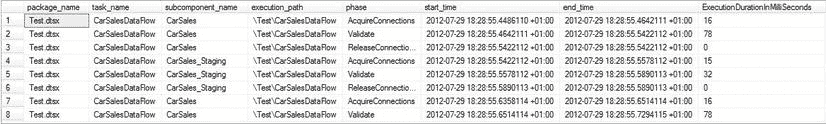
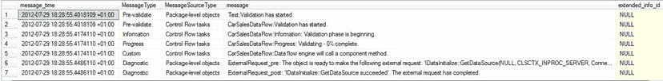
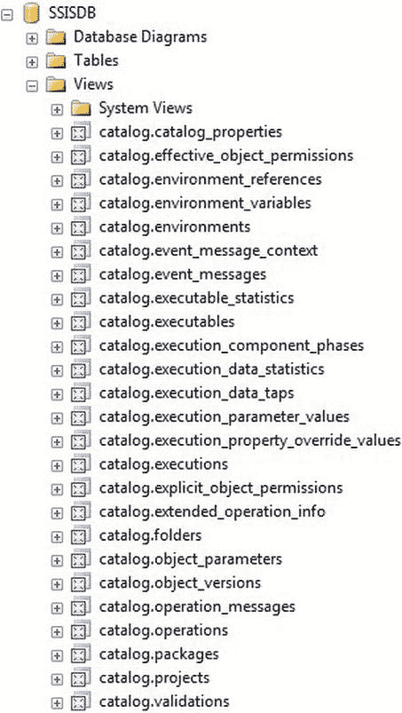

# 获取执行阶段和消息的详细信息

现在，你可以使用如下 T-SQL 来获取执行阶段的详细信息（`C:\SQL2012DIRecipes\CH15\CatalogExecutionPhases.Sql`）：

```sql
SELECT
    package_name
    ,task_name
    ,subcomponent_name
    ,execution_path
    ,phase
    ,start_time
    ,end_time
    ,DATEDIFF(ms, start_time, end_time) AS ExecutionDurationInMilliSeconds
FROM SSISDB.catalog.execution_component_phases
WHERE execution_id = @ExecutionID
ORDER BY phase_stats_id
```

输出结果可能类似于 图 15-21。



图 15-21. 从 SSIS 目录返回的执行阶段详情

最后，你可以使用如下代码返回包执行期间捕获的任何消息（`C:\SQL2012DIRecipes\CH15\CatalogMessages.Sql`）：

```sql
SELECT
    message_time
    ,CASE message_type
        WHEN -1 THEN 'Unknown'
        WHEN 10 THEN 'Pre-validate'
        WHEN 20 THEN 'Post-validate'
        WHEN 30 THEN 'Pre-execute'
        WHEN 40 THEN 'Post-execute'
        WHEN 50 THEN 'StatusChange'
        WHEN 60 THEN 'Progress'
        WHEN 70 THEN 'Information'
        WHEN 80 THEN 'VariableValueChanged'
        WHEN 90 THEN 'Diagnostic'
        WHEN 100 THEN 'QueryCancel'
        WHEN 110 THEN 'Warning'
        WHEN 120 THEN 'Error'
        WHEN 130 THEN 'TaskFailed'
        WHEN 140 THEN 'DiagnosticEx'
        WHEN 200 THEN 'Custom'
        WHEN 400 THEN 'NonDiagnostic'
    END AS MessageType
    ,CASE message_source_type
        WHEN 10 THEN 'Entry APIs, such as T-SQL and CLR Stored procedures'
        WHEN 20 THEN 'External process used to run package'
        WHEN 30 THEN 'Package-level objects'
        WHEN 40 THEN 'Control Flow tasks'
        WHEN 60 THEN 'Control Flow containers'
        WHEN 50 THEN 'Data Flow task'
    END AS MessageSourceType
    ,message
    ,extended_info_id
FROM SSISDB.catalog.operation_messages
WHERE operation_id = @ExecutionID
ORDER BY operation_message_id
```

输出结果可能类似于 图 15-22。



图 15-22. 包执行期间捕获的 SSIS 目录消息

## 工作原理

本方法中的七个步骤对 SSIS 目录视图执行了以下查询：

*   `步骤 1` 设置日志记录的详细程度级别并运行包。然后，它返回一个唯一的 ID，你将使用该 ID 来查询与此特定包执行关联的所有事件和度量指标。它使用了 `@ExecutionID` 变量，该变量被以下所有查询所使用。
*   `步骤 2` 提供有关包本身的信息——具体来说，它是否成功。
*   `步骤 3` 列出包调用的所有任务。
*   `步骤 4` 提供包内每个任务的详细信息——尤其是成功或失败。
*   `步骤 5` 提供包中每个任务的每个数据路径上发送的行数。
*   `步骤 6` 提供每个任务中的所有步骤——或阶段。它特别提供了每个执行阶段的持续时间（以毫秒为单位），这对于调试和性能分析非常宝贵。
*   `步骤 7` 提供 SSIS 在执行期间返回的详细消息。

 **注意** 只有在日志记录级别设置为 `Verbose`（如本方法 `步骤 1` 所做）时，你才能在 `步骤 5` 中获得返回的信息，以及在 `步骤 7` 中获得返回的信息的数量。

日志记录级别的值（通过存储过程 `SSISDB.catalog.set_execution_parameter_value` 设置）在 表 15-10 中给出。

表 15-10. 日志记录级别

| 级别 | 值 |
|-------|-------|
| 无 | 0 |
| 基本 | 1 |
| 性能 | 2 |
| 详细 | 3 |

当然，这些只是查询 `SSISDB` 数据库中目录视图的一些示例方式。该数据库非常完备，值得深入研究。然而，此处篇幅有限，无法详尽阐述，因此我将留给你来更深入地研究这些视图（及其许多相关的存储过程和函数）。图 15-23 为你提供了一个概览。



图 15-23. SSISDB 目录视图

 **注意** Jamie Thomson 提供了一套出色的报表，可用于可视化 SSIS 目录中保存的数据，可在 [`ssisreportingpack.codeplex.com/`](http://ssisreportingpack.codeplex.com/) 获取。

#### 提示、技巧与陷阱

*   你不必按任何特定顺序执行前面的 T-SQL 代码片段。唯一强制性的是 `步骤 1`，它会返回 `@ExecutionID`，然后你可以在所有查询中使用它。
*   你也可以通过以下方式获取最新的 `execution_id`：
    ```sql
    SELECT MAX(execution_id)
    FROM catalog.executions
    WHERE package_name = 'Test.dtsx'
    AND folder_name = 'Tests'
    ```
*   此数据持久存储在 `SSISDB` 表中，因此你不必在包运行后立即查询它。
*   前面的查询可以扩展，以将选定的数据输出到你自己的高级日志表中。

#### 15-19. 创建过程控制框架

## 问题

你希望使你的自定义日志记录框架成为一个成熟的过程跟踪系统。

## 解决方案

扩展你的自定义日志记录框架，添加允许你跟踪事件序列和层次结构以及识别负载详细信息的元素。

1.  首先，你需要向 `EventDetail` 表添加一个 `Calling Process` 和一个 `Calling Step`。更改事件日志记录表的结构如下：
    ```sql
    DROP TABLE CarSales_Logging.log.EventDetail
    GO
    CREATE TABLE CarSales_Logging.log.EventDetail(
        EventDetailID INT IDENTITY(1,1) NOT NULL,
        Process VARCHAR(255) NULL,
        Step VARCHAR(255) NULL,
        CallingProcess VARCHAR(255) NULL,
        CallingStep VARCHAR(255) NULL,
        Comments VARCHAR(MAX) NULL,
        ErrorNo INT NULL,
        ErrorDescription VARCHAR(MAX) NULL,
        ErrorLineNo INT NULL,
        ErrorSeverity INT NULL,
        ErrorState INT NULL,
        StartTime DATETIME NULL,
        Logtime DATETIME NULL
    )
    GO
    ```

2.  修改存储过程（现在已扩展到处理过程层次结构以记录任何结果）为：
    ```sql
    DROP PROCEDURE CarSales_Logging.log.pr_LogEvents
    GO
    CREATE PROCEDURE CarSales_Logging.log.pr_LogEvents
    (
        @Process VARCHAR(150),
        @Step VARCHAR(150),
        @CallingProcess VARCHAR(150),
        @CallingStep VARCHAR(150),
        @StartTime DATETIME,
        @Comments VARCHAR(MAX) = NULL,
        @ErrorNo INT = NULL,
        @ErrorDescription VARCHAR(MAX) = NULL,
        @ErrorLineNo INT = NULL,
        @ErrorSeverity INT = NULL,
        @ErrorState INT = NULL
    )
    AS
    INSERT INTO EventDetail
    (
        Process,
        Step,
        CallingProcess,
        CallingStep,
        StartTime,
        Comments,
        ErrorNo,
        ErrorDescription,
        ErrorLineNo,
        ErrorSeverity,
        ErrorState
    )
    VALUES
    (
        @Process,
        @Step,
        @CallingProcess,
        @CallingStep,
        @StartTime,
        @Comments,
        @ErrorNo,
        @ErrorDescription,
        @ErrorLineNo,
        @ErrorSeverity,
        @ErrorState
    )
    ```

3.  现在你需要识别并跟踪每个过程。因此，创建一个表来包含过程数据：
    ```sql
    CREATE TABLE CarSales.CarSales_Logging.log.
    ```


