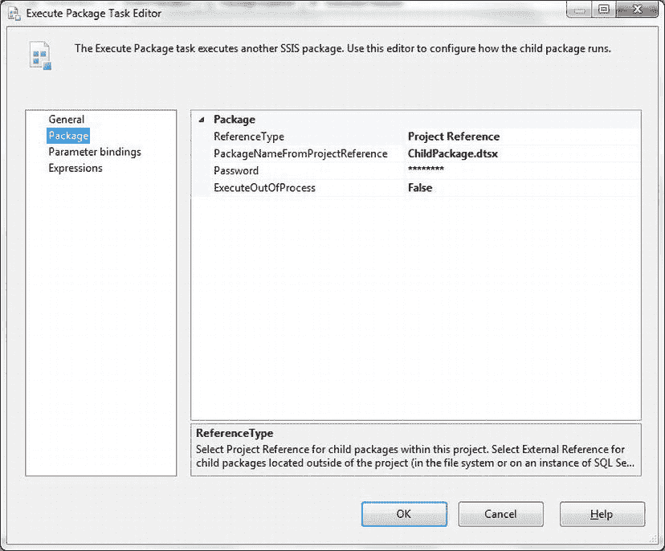
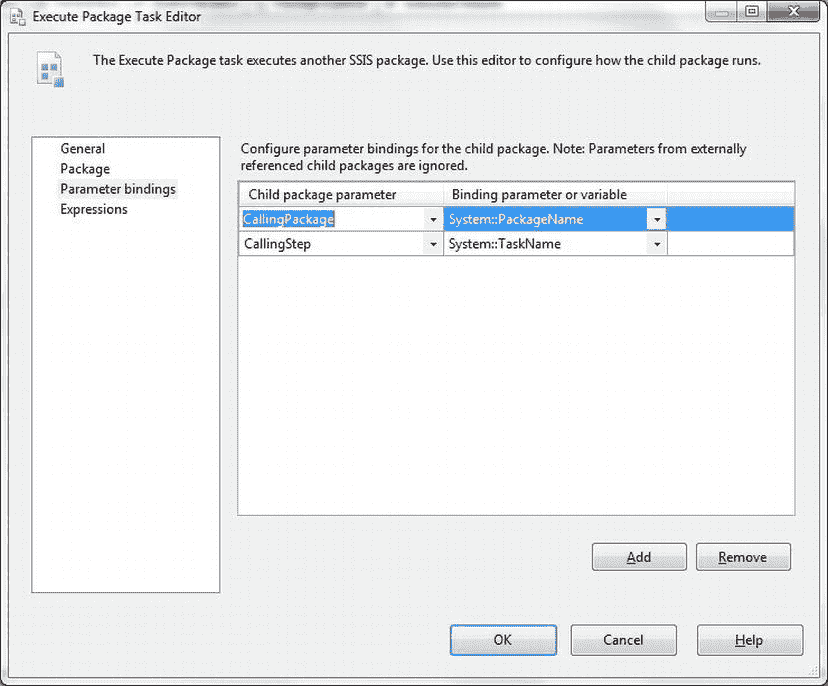
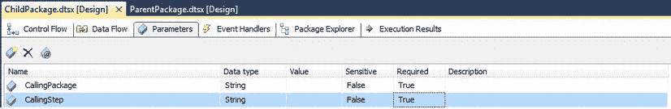
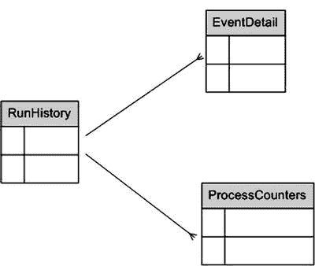
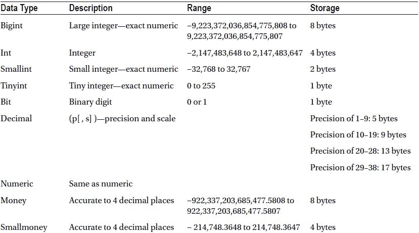
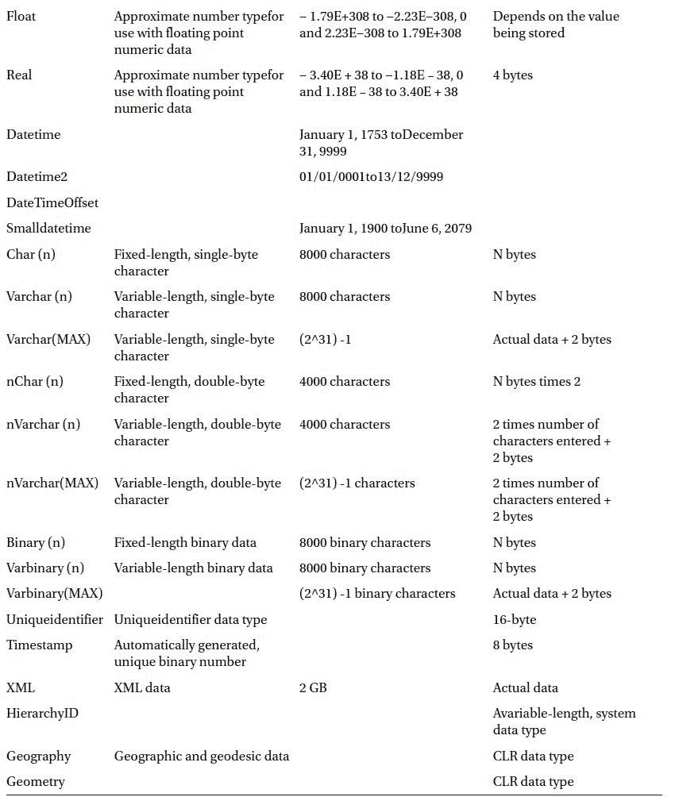

# 配置日志框架

```
RunHistory     (      RunID INT NULL,      RunStartDate DATETIME NULL,      Notes NVARCHAR(MAX) NULL,      IsSuccess BIT NULL,      RunEndTime DATETIME NULL,      RunDuration  AS (DATEDIFF(second,RunStartDate,RunEndTime))     )
```

4.  创建以下存储过程以记录进程开始：
```
CREATE PROCEDURE CarSales_Logging.log.dbo.pr_InitiateProcess
AS
-- need to add start time
DECLARE @StartDate DATETIME
DECLARE @RunID INT

SET @StartDate = GETDATE()
SELECT @RunID = ISNULL(MAX(RunID),1) + 1 FROM CarSales_Logging.log.RunHistory

INSERT INTO  CarSales_Logging.log.RunHistory (RunID)
VALUES           (@RunID)
```
必须将此存储过程作为 Execute SQL Task 添加到 SSIS 包的开始。

5.  创建以下存储过程以记录进程结束：
```
CREATE PROCEDURE CarSales.Log.pr_FinaliseProcess
(
@IsProcessSuccess BIT
)
AS

DECLARE @RunID INT
SELECT @RunID = MAX(RunID) FROM BI_Logging.CarSales_Logging.log.RunHistory

DECLARE @NoteComment VARCHAR(250)

IF @IsProcessSuccess = 1
BEGIN
SET             @NoteComment = 'Automated data load successfull'
END
ELSE
BEGIN
SET             @NoteComment = 'Automated data load FAILED!!'
END

UPDATE          CarSales_Logging.log.RunHistory
SET    IsSuccess = @IsProcessSuccess
      ,RunEndTime = GETDATE()
      ,Notes = @NoteComment
WHERE    RunID = @RunID

-- Truncate logs and counters over 3 months old

DELETE  FROM CarSales_Logging.Log.EventDetail
WHERE DATEDIFF(dd, DateCreated, GETDATE())  > 180

DELETE  FROM CarSales_Logging.Log.ProcessCounters
WHERE DATEDIFF(dd, DateCreated, GETDATE())  > 180
```
必须将此存储过程作为 Execute SQL Task 添加到 SSIS 包的末尾。

要将调用包和步骤从“父”包传递到“子”包，请执行以下操作：

6.  在父包中，编辑 Execute Package 任务，并确保 Reference Type 是 Project Reference。对话框将如 图 15-24 所示。

图 15-24。配置 Execute Package 任务以使用项目引用。

7.  点击左侧的 Parameter bindings，然后点击 Add 两次。
8.  添加以下两个参数：
    | CallingPackage | System::PackageName |
    | CallingStep | System::TaskName |
对话框将如 图 15-25 所示。

图 15-25。定义子包参数绑定。

9.  点击 OK 完成父包。
10. 在子包中，点击 Control Flow 窗格内部，然后点击 Parameters 选项卡。
11. 点击 Add Parameter 图标两次（这是列标题“name”上方左侧的图标）。
12. 添加以下两个参数：
    | 名称 | 数据类型 | 敏感 | 必需 |
    | --- | --- | --- | --- |
    | CallingPackage | String | False | True |
    | CallingStep | String | False | True |
窗格将如 图 15-26 所示。

图 15-26。定义包参数。

13. 部署项目。
现在可以运行该包（如配方 15-17 所述，从目录运行）。

此技术仅适用于使用项目部署模型且子包与父包包含在同一项目中的 SSIS 项目。

## 工作原理

每个与 SQL Server 和 SSIS（用于 ETL）相处过一段时间的开发人员，最终可能都会开发出自己的日志框架。到目前为止，本章概述了一套简单的表和存储过程，允许进行基本到中级的日志记录，但对于更复杂的 ETL 流程，这可能还不够。因此，这里提供了一些想法，你可以全部或部分使用，以扩展一个简单的日志框架。由于描述一个真正复杂的日志框架本身就需要一本书（而我绝对无意写这样一本书），我展示了一些想法，希望你在开发自己的复杂数据加载过程时，能挑选出你觉得有用的部分。

如果你有更复杂的 ETL 包，你可能希望将调用存储过程的进程和步骤（以及当前的进程/包和批处理/任务）添加到你记录事件的表中，当然也要添加到记录事件的存储过程中。这样做的好处是，它使你能够看到一个清晰定义的层次结构，描述哪个进程/步骤组合调用了后续的每个进程和步骤。这将允许你创建视图或存储过程——甚至在 Reporting Services 或 .NET 中创建一个界面（例如）——使你能够从最高级别到最低级别向下钻取进程日志。

在 T-SQL 中，在存储过程之间传递调用的进程和步骤意味着向“子”存储过程添加两个（更多）参数，并将 `@ProcName` 和 `@ProcStep` 变量从“父”存储过程传递到“子”存储过程。使用前面的存储过程可以实现这一点。

在 SSIS 中，传递调用的进程和步骤更为复杂，涉及使用包参数作为包配置的一部分。然而，这是一种极其健壮的技术，值得付出努力。然后可以使用 Derived Column 转换来引用这些参数，或者将其传递给日志记录存储过程。

如果你使用的是旧版本的 SQL Server，那么传递调用的包和任务的方法是定义两个配置变量并引用 system::TaskId 和 System::PackageID 变量。

一个简单的进程流控制框架的最后一个要素是跟踪其每次运行的情况，以及记录其最终的成功或失败。这非常容易，只需要一个表来跟踪进程执行的历史记录。该表的 DDL 在第 14 步中给出。

显然，你必须以某种方式检测成功或失败（例如，如果包任务失败，则将 SSIS 变量设置为 False，或者可能检测日志表中任何 `NOT NULL` 的错误列——或者实际上，任何适合你整体流程的方式）并将信息传递给 `@IsProcessSuccess` 输入变量。

最后，你需要注意以下几点：
- 任何进程的持续时间都是通过计算开始和结束时间之间的秒数来确定的。
- 记录开始和结束时间的两个存储过程可以从 SSIS、SQL Server Agent 或另一个存储过程调用。

这个稍微更完善的框架中使用的表将类似于 图 15-27 所示。

图 15-27。基本进程控制框架中使用的表。

创建一个能够存储你将来可能认为必要的所有数据，同时保持模块化和可访问性的日志框架并不容易。最终的挑战是能够分析关键数据。


## 为了实现这个特定目标

为了实现这个特定目标，我建议添加以下两个视图：
*   `vw_LatestEvents`：仅隔离最新进程运行期间发生的事件。
*   `vw_LatestErrorEvents`：识别最新进程运行期间发生的任何错误。

创建这些视图的代码非常简单（`C:\SQL2012DIRecipes\CH15\ProcessViews.Sql`）：

```sql
CREATE VIEW CarSales_Logging.Log.vw_LatestEvents AS
SELECT EventDetailID, Process, Step, Comments, ErrorNo, ErrorDescription
FROM CarSales_Logging.Log.EventDetail
WHERE RunID = (SELECT MAX(RunID) AS RunID
               FROM CarSales_Logging.log.RunHistory)
GO

CREATE VIEW CarSales_Logging.Log.vw_LatestErrorEvents AS
SELECT EventDetailID, Process, Step, Comments, ErrorNo, ErrorDescription
FROM CarSales_Logging.Log.EventDetail
WHERE RunID = (SELECT MAX(RunID) AS RunID
               FROM CarSales_Logging.log.RunHistory)
AND (ErrorNo IS NOT NULL
     OR ErrorDescription IS NOT NULL
     OR ErrorSeverity IS NOT NULL)
GO
```

总的来说，这三个元素（跟踪事件层次结构、进程运行表和视图）为你的自定义日志框架添加了一个基本的进程控制层。我承认这是一个非常简化的框架，但你可以以此为起点进行扩展和调整。

#### 15-20. 将 SSIS 目录链接到 T-SQL 日志记录

### 问题
你希望将来自 SSIS 目录和 T-SQL 存储过程的日志集中到一个统一、连贯的日志框架中。遗憾的是，目前没有方法可以直接从 T-SQL 写入 SSIS 目录。

### 解决方案
你无法完全集中日志记录——但通过向 T-SQL 日志表传递每个调用存储过程的 `ExecuteSQL` 任务的 `executionID` 和任务 GUID，可以非常接近这一目标。这允许你连接两个日志源（SSIS 目录和自定义日志表），并在各自独立的日志之上维护一个统一视图。

1.  传入参数 `System::TaskID`（字符串类型）——即任务的 GUID。这将是 `SSISDB.catalog.executables` 中的 `executable_guid`。
2.  传入参数 `System::ServerExecutionID`——这与上表中 `[execution_id]` 相同。
3.  使用类似以下的 T-SQL 语句，在从 SSIS 调用的每个存储过程头部捕获这些输入参数：
    ```sql
    CREATE PROCEDURE CarSales_Logging.log.pr_TestCatalog
        (
        @SSISTaskGuid NVARCHAR(50)
        ,@SSISExecutionID INT
        )
    AS
    -- 你的代码写在这里
    ```
4.  确保将这些元素添加到用于记录 T-SQL 事件的表中，并传递到执行日志记录的存储过程中，如之前配方所述。

### 工作原理
不幸的是，似乎没有方法可以写入 SSIS 目录表——因此当使用从 SSIS 调用的存储过程时，无法集中日志记录。但是，如果你记录了来自存储过程的步骤和其他信息（如前面的配方所述），并传入两个关键变量（允许你将存储过程与 SSIS 日志记录关联起来：`@SSISTaskGuid` 和 `@ExecutionID`），那么你就可以从日志记录的角度重建整个进程，因为你的自定义日志表可以映射回 `SSISDB.catalog.executables`。

#### 15-21. 为 ETL 进程建立基线

### 问题
你希望跟踪常规 ETL 进程的关键指标演变情况。

### 解决方案
扩展你的自定义日志框架，包含表和存储过程以实现基线建立。以下展示了如何创建和使用所需的对象：

1.  创建前面描述的 `RunHistory` 表，以提供 `RunID`。
2.  使用 DDL 创建以下三个参考表（`C:\SQL2012DIRecipes\CH15\ReferenceTables.Sql`）：
    ```sql
    CREATE TABLE CarSales_Logging.Log.RefTables
    (
     ID INT IDENTITY(1,1) NOT NULL,
     DatabaseName VARCHAR(150) NULL,
     SchemaName VARCHAR(150) NULL,
     TableName VARCHAR(150) NULL,
     TableMaxThreshold BIGINT NULL,
     TableMinThreshold BIGINT NULL,
     TablePercentAcceptableVariation NUMERIC(8, 4) NULL
    )
    CREATE TABLE CarSales_Logging.Log.RefBaselineProcessess
    (
     ID INT IDENTITY(1,1) NOT NULL,
     ProcessName VARCHAR(150) NULL,
     ProcessMaxThreshold BIGINT NULL,
     ProcessMinThreshold BIGINT NULL,
     ProcessPercentAcceptableVariation NUMERIC(8, 4) NULL
    )
    CREATE TABLE CarSales_Logging.Log.RefBaselineCounters
    (
     ID INT IDENTITY(1,1) NOT NULL,
     CounterName VARCHAR(150) NULL,
     CounterComments VARCHAR(4000) NULL,
     CounterMinThreshold INT NULL,
     CounterMaxThreshold INT NULL,
     CounterPercentAcceptableVariance INT NULL
    )
    ```
3.  使用以下 DDL 添加三个基线表（`C:\SQL2012DIRecipes\CH15\BaselineTables.Sql`）：
    ```sql
    CREATE TABLE CarSales_Logging.Log.TableSize
    (
     ID INT IDENTITY(1,1) NOT NULL,
     TableSchema VARCHAR(50) NULL,
     TableName VARCHAR(50) NULL,
     SpaceUsedKB BIGINT NULL,
     SpaceReservedKB BIGINT NULL,
     Rowcounts BIGINT NULL,
     RunID INT NULL,
     DateUpdated DATE NULL
    )
    CREATE TABLE CarSales_Logging.Log.ProcessCounterBaseline
    (
     ID INT IDENTITY(1,1) NOT NULL,
     RunID INT NULL,
     CounterName VARCHAR(150) NULL,
     CounterNumber BIGINT NULL
    )
    CREATE TABLE CarSales_Logging.Log.ProcessBaseline
    (
     ID INT IDENTITY(1,1) NOT NULL,
     RunID INT NULL,
     ProcessName VARCHAR(150) NULL,
     ProcessDuration INT NULL
    )
    ```
4.  使用以下 DDL 创建用于更新基线表的三个存储过程（`C:\SQL2012DIRecipes\CH15\BaselineSprocs.Sql`）：
    ```sql
    -- pr_AuditCounters
    CREATE PROCEDURE CarSales_Logging.Log.pr_AuditCounters
    AS
    DECLARE @RunID INT
    SELECT @RunID=MAX(RunID) FROM CarSales_Logging.log.RunHistory

    INSERT INTO CarSales.Log.ProcessCounterHistory (RunID, CounterName, CounterNumber)
    SELECT TOP 1000
    @RunID
    ,CounterName
    ,CounterNumber
    FROM CarSales_Logging.Log.ProcessCounterBaseline AS D
    INNER JOIN CarSales_Logging.Log.RefBaselineProcessessAS S
    ON D.CounterName = S.CounterName
    WHERE D.RunID = (SELECT MAX(RunID) FROM CarSales_Logging.log.RunHistory)

    -- pr_AuditEvents
    CREATE PROCEDURE CarSales_Logging.Log.pr_AuditEvents
    AS
    DECLARE @RunID INT
    SELECT @RunID=MAX(RunID) FROM CarSales_Logging.log.RunHistory

    INSERT INTO CarSales_Logging.Log.ProcessHistory (RunID, StageName, StageDuration)
    SELECT TOP 1000
    @RunID
    ,StageName
    ,DurationInSeconds
    FROM CarSales_Logging.Log.EventDetail D
    INNER JOIN CarSales_Logging.Log.RefBaselineprocesses S
    ON D.Step = S.StageName
    WHERE D.RunID = (SELECT MAX(RunID) FROM CarSales_Logging.log.RunHistory)

    -- pr_AuditTableSize
    CREATE PROCEDURE CarSales_Logging.Log.pr_AuditTableSize
    AS
    DECLARE @RunID INT
    SELECT @RunID=MAX(RunID) FROM CarSales_Logging.log.RunHistory

    DELETE FROM CarSales_Logging.Log.TableSize WHERE RunID = @RunID

    INSERT INTO CarSales_Logging.Log.TableSize
    (TableName, SpaceUsedKB, SpaceReservedKB, Rowcounts, RunID)
    SELECT DISTINCT
    SO.name AS TableName
    ,DPS.used_page_count * 8 AS SpaceUsedKB
    ,DPS.reserved_page_count * 8 AS SpaceReservedKB
    ,DPS.row_count AS RowCounts
    ,@RunID
    FROM CarSales.sys.dm_db_partition_stats DPS
    INNER JOIN CarSales.sys.indexes SIX
    ON DPS.object_id = SIX.object_id
    AND DPS.index_id = SIX.index_id
    INNER JOIN CarSales.sys.objects SO
    ON DPS.object_id = SO.object_id
    WHERE SIX.
    ```


#### 15-22. 审计 ETL 流程

## 问题

您希望确认一个 ETL 流程不仅成功运行，而且没有发生溢出或出现任何潜在未来问题的迹象。

## 解决方案

审计日志数据并隔离您定义的关键指标。

1.  在您所有的 T-SQL 存储过程中，请记得为 T-SQL 中的所有数据流（即 `INSERTS`，包括 `SELECT...INTO` 和 `INSERT INTO`）添加以下代码片段。

    ```
    ...
    ,GETDATE() AS DATE_PROCESSED
    ...
    ```

2.  对于所有 T-SQL 更新操作，只需记得添加：

    ```
    ...
    ,DATE_PROCESSED = GETDATE()
    ...
    ```

    要在 SSIS 数据流内部添加处理日期和时间，您需要在数据源和目标任务之间的数据流窗格上添加一个派生列任务。

3.  将派生列任务连接到前序和后继任务。
4.  双击派生列任务进行编辑，添加一个名称（例如 `Last_Processed`），并将表达式设置为 `GETDATE()` —— SSIS 会自动将数据类型设置为 `DT_DBTIMESTAMP`。
5.  在目标任务中，将派生列映射到目标表中的 `LAST_PROCESSED` 列。
6.  您需要一个表来存储最新的审计数据。建议的 DDL 如下（路径：`C:\SQL2012DIRecipes\CH15\tblTableAuditData.Sql`）：

    ```
    CREATE TABLE dbo.TableAuditData
    (
        ID INT IDENTITY(1,1) NOT NULL,
        QualifiedTableName VARCHAR(500) NULL,
        LastUpdatedDate DATETIME NULL,
        LastRunID INT,
        LastRecordCount BIGINT
    )
    ```

7.  用于捕获审计数据的存储过程的 DDL 如下（路径：`C:\SQL2012DIRecipes\CH15\pr_AuditETL.Sql`）：

    ```
    CREATE PROCEDURE pr_AuditETL
    AS
        DECLARE @SQL AS VARCHAR(MAX)
        DECLARE @TableToAudit AS VARCHAR(150)
        DECLARE @SchemaToAudit AS VARCHAR(150)
        DECLARE @DatabaseToAudit AS VARCHAR(150)

        DECLARE Tables_CUR CURSOR
        FOR
            SELECT SchemaName, TableName, DatabaseName FROM dbo.RefTables

        OPEN Tables_CUR

        FETCH NEXT FROM Tables_CUR INTO @SchemaToAudit, @TableToAudit, @DatabaseToAudit

        WHILE @@FETCH_STATUS =0
        BEGIN
            SET @SQL = 'INSERT INTO dbo.TableAuditData (LastUpdatedDate, LastRunID, QualifiedTableName, LastRecordCount) SELECT MAX(LastRunDate), MAX(RunID),''' + @DatabaseToAudit + '.' + @SchemaToAudit + '.' + @TableToAudit + ''',COUNT(RunID) FROM '+ @DatabaseToAudit + '.' + @SchemaToAudit + '.' + @TableToAudit
            EXECUTE (@SQL)
            FETCH NEXT FROM Tables_CUR INTO @SchemaToAudit, @TableToAudit, @DatabaseToAudit
        END

        CLOSE Tables_CUR
        DEALLOCATE Tables_CUR
    ```

## 工作原理

一旦您记录了 ETL 流程运行期间发生的所有事情，您可能希望在流程结束时进行一些交叉检查，以确保某些基本元素都已到位。这归结为对关键表——甚至所有您创建或更新的表——进行一些简单的检查。

这些检查可以包括验证：

*   表数据的最后处理日期
*   多维数据集最后处理日期
*   行计数器（表中的总行数和最后更新的行数）

这并不困难，也通常不需要很长时间。然而，作为对您的流程所记录计数器的交叉检查，这非常值得付出努力。对于此技术，我使用了先前方案中用于日志记录的表。

有一个字段对于审计暂存表和数据表至关重要——`DATE_PROCESSED`。这必须是一个 `DATETIME` 字段。我建议不要将其默认值设置为 `GETDATE()`，因为太容易忘记默认值只会在创建行时触发，而不是在更新时。同样，我建议避免在 ETL 流程中使用触发器来设置最后处理日期和时间，因为它们可能会显著减慢流程。

一旦所有重要的表都有了 `LAST_PROCESSED` 日期字段，您就可以建立一个简短的存储过程来计算每个表的行数并返回最后处理日期。对于某些表，您可能希望返回插入或更新的行数以及总行数，以了解修改行的百分比。

#### 提示、技巧与陷阱

*   一旦您获得了选定的数据，就可以将其存储在审计表中（例如包含流程 ID），以随着时间的推移跟踪流程指标。


*   如果你正在查看大量的表集合，你可能希望将表列表存储在一个表中，并将前面的代码转换为动态 SQL，以收集不同 ETL 表组的计数器。
*   统计大表中的行数可能极其耗时，因此你可能更倾向于使用旧的 `sys.sysindexes` 表来获取记录数。然而，至少可以说，跨数据库使用这个系统视图极其繁琐，实际上可能无法使用。

#### 15-23. 记录审计数据

### 问题
你需要能够对审计数据进行深入验证，以跟踪关键事件，如插入、更新和删除。

### 解决方案
在 ETL 表中添加元数据列，并扩展你的 ETL 过程，以便在 ETL 作业期间更新这些列。以下是跟踪每种事件的方法。

#### 审计插入
记录插入操作最简单的方法可能是在运行一个进程前将 `IsInserted` 列设置为 `0`，然后确保在你的 `INSERT` 语句中将此列添加 `1`（True）。

如果你使用 SSIS，则添加一个 `IsInserted` 派生列并输入 `1` 作为表达式。

#### 审计更新
与插入类似，确保在 `UPDATE` 的一部分将 `IsUpdated` 列设置为 `1`（True）。

如果你使用 SSIS 并有一个单独的更新路径，请使用单独的表或临时表，如第 11 章所述。然后，在保存更新记录的表中添加一个 `IsUpdated` 列。输入 `1` 作为值。

#### 审计删除
根据定义，删除的行将不再存在于表中，因此这给你留下了两个选择：
*   逻辑删除（将记录标记为已删除，并在进一步处理中排除）。
*   将已删除的记录存储在 `_Deleted` 表中。

你甚至可以结合这两种方法。最初将记录标记为已删除，然后在主要（并且可能是时间敏感的）处理完成后将这些记录输出到 `_Deleted` 表中。

为了完整起见，逻辑删除就像将 `IsDeleted` 标志设置为 `1`（True）一样简单。

在处理过程中将已删除的记录存储在 `_Deleted` 表中可以使用一个 T-SQL 触发器——类似如下：
*   表的一个副本（例如，如果基于 `Clients` 表，可以想象地称为 `Clients_DELETED`）。
*   在 `_DELETED` 表中添加一个名为 `DATETIMEDELETED` 的额外列——这是一个 `DATETIME` 数据类型。
*   一个删除触发器，类似这样：
```
CREATE TRIGGER Trg_Del_Clients ON dbo.Clients
AFTER DELETE AS
IF @@ROWCOUNT = 0
RETURN
INSERT INTO dbo.Clients_Deleted (ID, ClientName, DeleteDate)
SELECT ID, ClientName, GETDATE()
FROM DELETED
```

### 工作原理
仅验证添加或更新的记录数，或者暂存表是在批处理作业日期处理的，对于深入审计来说是不够的。你需要能够检查结果数据表的以下内容：
*   插入
*   更新
*   删除
*   更新次数

虽然这些技术众所周知，但或许值得重申执行这些要求的最佳方式。我不打算给出 SQL Server 内置审计功能的速成课程，因为这些功能在其他地方已有出色的文档记录（例如 [www.bradmcgehee.com/2010/03/an-introduction-to-sql-server-2008-audit](http://www.bradmcgehee.com/2010/03/an-introduction-to-sql-server-2008-audit) 就浮现在脑海中）。此外，在 ETL 环境中，我觉得全面的审计有些过头。因此，这里我们只是粗略地了解了 ETL 表的基本审计。你不可避免地可以自由扩展这些技术，以更好地满足你的任何要求。

实施关键事件审计有几个原因：
*   作为健全性检查，确保数据表中合理比例的行被插入、更新或删除。
*   按操作类型记录受影响记录数的累计计数，使你能够随着时间的推移跟踪这些百分比，并将每次运行与基线进行比较。

对于你要记录的每个表，你需要确保存在以下列：
```
IsInserted BIT NULL
IsUpdated BIT NULL
IsDeleted BIT NULL
DATE_PROCESSED DATETIME
```

### 提示、技巧和陷阱
*   如果你愿意，可以使用一个 `Change_Type` 列（可能是一个 `CHAR(1)`），并存储 I、D 或 U，而不是为操作类型使用单独的列。
*   记住保存源表中所有重要列的状态！如果你要复制很大比例的列和行，并且如果时间、表大小和磁盘空间允许，请考虑使用简单的 `INSERT INTO` 来复制表！

#### 总结
在本章中，你了解了记录 ETL 过程中步骤事件以及与这些步骤相关联的指标的各种方法。你还了解了如何将它们写入 SQL Server 表和磁盘上的文件。

我希望你开始体会到 SSIS 中内置日志记录的强大功能，特别是 SSIS 2012 目录中可用的丰富信息。然而，正如你也看到的，有时你需要扩展这些功能。这可以从对允许你记录 SSIS 事件的内置对象进行微小调整，到创建一个完全定制的流程控制框架。

然而，主要要理解的是 SQL Server 日志记录和监控能力的巨大范围和微妙之处。你可以选择最适合你特定需求的方法和技术。

我希望本章能帮助你做出选择。

## 附录 A


### 数据类型
数据类型既是数据迁移的生命线，也是其祸根。它们确实可以成就或破坏你的 ETL 过程。成功加载数据过程的第一个，也是基础的方面是数据类型映射。很简单，如果任何源数据是 SQL Server 无法理解的类型，那么导入很可能会失败。

因此（作为一个快速的复习课程），本附录介绍了你需要了解的数据类型，首先是 SQL Server 中的，然后是 SSIS 中的。

#### SQL Server 数据类型
表 A-1 是 SQL Server 数据类型的快速概览。我意识到数据类型并不是地球上最令人兴奋的东西，但它们是数据摄取和数据类型验证的基础。所以，即使你从不记住这些东西，至少你在这里有一个易于获取的参考。

表 A-1。 SQL Server 数据类型范围和存储



#### SSIS 数据类型
表 A-2 提供了关于可用 SSIS 数据类型的快速复习。

表 A-2。 SSIS 数据类型

| 数据类型 | 描述 |
| --- | --- |
| `DT_BOOL` | 布尔值。 |
| `DT_BYTES` | 二进制变长数据值。其最大长度为 8000 字节。 |
| `DT_CY` | 货币值。这是一个 8 字节的有符号整数，小数位数为 4，最大精度为 19 位。 |
| `DT_DATE` | 由年、月、日、时、分、秒和小数秒组成的日期类型。小数秒的固定比例为 7 位。它使用 8 字节浮点数实现。 |
| `DT_DBDATE` | 由年、月、日组成的日期类型。 |
| `DT_DBTIME` | 由时、分、秒组成的时间类型。 |
| `DT_DBTIME2` | 由时、分、秒和小数秒组成的时间类型。小数秒的最大比例为 7 位。 |
| `DT_DBTIMESTAMP` | 一个时间戳结构，由年、月、日、时、分、秒和小数秒组成。 |


