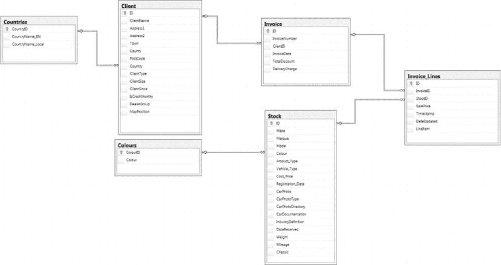
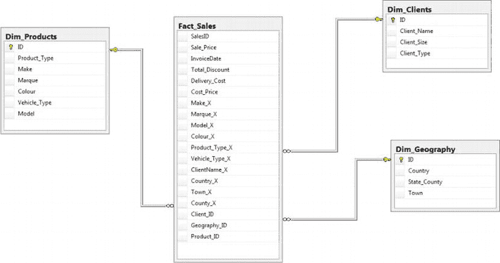

# Stock 表定义

如果`OBJECT_ID('dbo.Stock ')`不为`NULL`，则删除表`dbo.Stock`。

```
CREATE TABLE dbo.Stock (
  ID bigint IDENTITY(1,1) NOT NULL,
  Make VARCHAR(50) NULL,
  Marque NVARCHAR(50) NULL,
  Model VARCHAR(50) NULL,
  Colour TINYINT NULL,
  Product_Type VARCHAR(50) NULL,
  Vehicle_Type VARCHAR(20) NULL,
  Cost_Price NUMERIC(18, 2) NULL,
  Registration_Date DATE NULL,
  CarPhoto VARBINARY(max) NULL,
  CarPhotoType VARCHAR(5) NULL,
  CarPhotoDirectory VARCHAR(150) NULL,
  CarDocumentation NVARCHAR(max) NULL,
  IndustryDefinition XML NULL,
  DateReserved DATETIME2(7) NULL,
  Weight float NULL,
  Mileage NUMERIC(32, 4) NULL,
  Chassis UNIQUEIDENTIFIER NULL CONSTRAINT DF_Stock_Chassis  DEFAULT (newid())
);
GO
```

## 脚本

以下是在`CarSales`数据库中创建主键的脚本 (`C:\SQLDIRecipes\Databases\CarSalesCreatePrimaryKeys.Sql`):

```
USE CarSales;
GO

If OBJECT_ID('PK_Client') IS NULL
BEGIN
  ALTER TABLE dbo.Client
  ADD CONSTRAINT PK_Client PRIMARY KEY CLUSTERED (ID ASC)
  WITH (PAD_INDEX = OFF, STATISTICS_NORECOMPUTE = OFF, IGNORE_DUP_KEY = OFF,
        ALLOW_ROW_LOCKS = ON, ALLOW_PAGE_LOCKS = ON) ;
END

If OBJECT_ID('PK_Colours') IS NULL
BEGIN
  ALTER TABLE dbo.Colours
  ADD CONSTRAINT PK_Colours PRIMARY KEY CLUSTERED (ColourID ASC)
  WITH (PAD_INDEX = OFF, STATISTICS_NORECOMPUTE = OFF, IGNORE_DUP_KEY = OFF,
        ALLOW_ROW_LOCKS = ON, ALLOW_PAGE_LOCKS = ON) ;
END

If OBJECT_ID('PK_Countries') IS NULL
BEGIN
  ALTER TABLE dbo.Countries
  ADD CONSTRAINT PK_Countries PRIMARY KEY CLUSTERED (CountryID ASC)
  WITH (PAD_INDEX = OFF, STATISTICS_NORECOMPUTE = OFF, IGNORE_DUP_KEY = OFF,
        ALLOW_ROW_LOCKS = ON, ALLOW_PAGE_LOCKS = ON) ;
END

If OBJECT_ID('PK_Invoice') IS NULL
BEGIN
  ALTER TABLE dbo.Invoice
  ADD CONSTRAINT PK_Invoice PRIMARY KEY CLUSTERED (ID ASC)
  WITH (PAD_INDEX = OFF, STATISTICS_NORECOMPUTE = OFF, IGNORE_DUP_KEY = OFF,
        ALLOW_ROW_LOCKS = ON, ALLOW_PAGE_LOCKS = ON) ;
END

If OBJECT_ID('PK_Invoice_Lines') IS NULL
BEGIN
  ALTER TABLE dbo.Invoice_Lines
  ADD CONSTRAINT PK_Invoice_Lines PRIMARY KEY CLUSTERED (ID ASC)
  WITH (PAD_INDEX = OFF, STATISTICS_NORECOMPUTE = OFF, IGNORE_DUP_KEY = OFF,
        ALLOW_ROW_LOCKS = ON, ALLOW_PAGE_LOCKS = ON) ;
END

If OBJECT_ID('PK_Stock') IS NULL
BEGIN
  ALTER TABLE dbo.Stock
  ADD CONSTRAINT PK_Stock PRIMARY KEY CLUSTERED (ID ASC)
  WITH (PAD_INDEX = OFF, STATISTICS_NORECOMPUTE = OFF, IGNORE_DUP_KEY = OFF,
        ALLOW_ROW_LOCKS = ON, ALLOW_PAGE_LOCKS = ON) ;
END

GO
```

这是在`CarSales`数据库中创建外键的脚本 (`C:\SQLDIRecipes\Databases\CarSalesCreateForeignKeys.Sql`):

```
USE CarSales;
GO

If OBJECT_ID('FK_Client_Countries') IS NULL
  ALTER TABLE dbo.Client  WITH CHECK ADD CONSTRAINT FK_Client_Countries FOREIGN KEY(Country)
  REFERENCES dbo.Countries (CountryID);
  ALTER TABLE dbo.Client CHECK CONSTRAINT FK_Client_Countries;

If OBJECT_ID('FK_Invoice_Client') IS NULL
  ALTER TABLE dbo.Invoice  WITH CHECK ADD CONSTRAINT FK_Invoice_Client FOREIGN KEY(ClientID)
  REFERENCES dbo.Client (ID);
  ALTER TABLE dbo.Invoice CHECK CONSTRAINT FK_Invoice_Client;

If OBJECT_ID('FK_Invoice_Lines_Invoice') IS NULL
  ALTER TABLE dbo.Invoice_Lines  WITH NOCHECK ADD CONSTRAINT FK_Invoice_Lines_Invoice FOREIGN KEY(InvoiceID)
  REFERENCES dbo.Invoice (ID);
  ALTER TABLE dbo.Invoice_Lines CHECK CONSTRAINT FK_Invoice_Lines_Invoice;

If OBJECT_ID('FK_Invoice_Lines_Stock') IS NULL
  ALTER TABLE dbo.Invoice_Lines  WITH NOCHECK ADD CONSTRAINT FK_Invoice_Lines_Stock FOREIGN KEY(StockID)
  REFERENCES dbo.Stock (ID);
  ALTER TABLE dbo.Invoice_Lines CHECK CONSTRAINT FK_Invoice_Lines_Stock;

If OBJECT_ID('FK_Stock_Colours') IS NULL
  ALTER TABLE dbo.Stock  WITH CHECK ADD  CONSTRAINT FK_Stock_Colours FOREIGN KEY(Colour)
  REFERENCES dbo.Colours (ColourID);
  ALTER TABLE dbo.Stock CHECK CONSTRAINT FK_Stock_Colours;

GO
```

以下脚本用于删除所有主键 (`C:\SQLDIRecipes\Databases\DropPrimaryKeys.Sql`):

```
USE CarSales;
GO

If OBJECT_ID('PK_Client') IS NOT NULL ALTER TABLE dbo.Client DROP CONSTRAINT PK_Client;
If OBJECT_ID('PK_Colours') IS NOT NULL ALTER TABLE dbo.Colours DROP CONSTRAINT PK_Colours;
If OBJECT_ID('PK_Countries') IS NOT NULL ALTER TABLE dbo.Countries DROP CONSTRAINT PK_Countries;
If OBJECT_ID('PK_Invoice') IS NOT NULL ALTER TABLE dbo.Invoice DROP CONSTRAINT PK_Invoice;
If OBJECT_ID('PK_Invoice_Lines') IS NOT NULL ALTER TABLE dbo.Invoice_Lines DROP CONSTRAINT PK_Invoice_Lines;
If OBJECT_ID('PK_Stock') IS NOT NULL ALTER TABLE dbo.Stock DROP CONSTRAINT PK_Stock;
GO
```

如果需要，以下脚本用于从`CarSales`数据库删除外键 (`C:\SQLDIRecipes\Databases\DropForeignKeys.Sql`):

```
USE CarSales;
GO

If OBJECT_ID('FK_Client_Countries') IS NOT NULL ALTER TABLE dbo.Client DROP CONSTRAINT FK_Client_Countries;
If OBJECT_ID('FK_Invoice_Client') IS NOT NULL ALTER TABLE dbo.Invoice DROP CONSTRAINT FK_Invoice_Client;
If OBJECT_ID('FK_Invoice_Lines_Invoice') IS NOT NULL ALTER TABLE dbo.Invoice_Lines DROP CONSTRAINT FK_Invoice_Lines_Invoice;
If OBJECT_ID('FK_Invoice_Lines_Stock') IS NOT NULL ALTER TABLE dbo.Invoice_Lines DROP CONSTRAINT FK_Invoice_Lines_Stock;
If OBJECT_ID('FK_Stock_Colours') IS NOT NULL ALTER TABLE dbo.Stock DROP CONSTRAINT FK_Stock_Colours;
GO
```

同样，这是一个从`CarSales`数据库移除数据的脚本 (`C:\SQLDIRecipes\Databases\RemoveCarSalesData.Sql`):

```
USE CarSales;
GO

DELETE FROM CarSales.dbo.Invoice_Lines;
DELETE FROM CarSales.dbo.Stock;
DELETE FROM CarSales.dbo.Colours;
DELETE FROM CarSales.dbo.Invoice;
DELETE FROM CarSales.dbo.Client;
DELETE FROM CarSales.dbo.Countries;

GO
```

`CarSales`数据库的模式如图 B-1 所示。



图 B-1. CarSales 数据库

## CarSales_Staging

该数据库本质上是一个用于测试加载技术以及数据库到数据库加载的“暂存区”。其核心表与`CarSales`数据库中的表相同——但没有任何主键或外键。可以根据需要为某个方案创建其他表。可以使用以下脚本 (`C:\SQLDIRecipes\Databases\CarSales_StagingDatabaseCreation.Sql`) 创建此数据库:

```
USE master
GO

IF db_id('CarSales_Staging') IS NOT NULL
  DROP DATABASE CarSales_Staging';
GO

CREATE DATABASE CarSales_Staging
 CONTAINMENT = NONE
 ON  PRIMARY
( NAME = N'CarSales_Staging',
  FILENAME = N'C:\SQLDIRecipes\Databases\CarSales_Staging.mdf' ,
  SIZE = 33792KB ,
  MAXSIZE = UNLIMITED,
  FILEGROWTH = 1024KB )
 LOG ON
( NAME = N'CarSales_Staging_log',
  FILENAME = N'C:\SQLDIRecipes\Databases\CarSales_Staging_log.ldf' ,
  SIZE = 4224KB ,
  MAXSIZE = 2048GB ,
  FILEGROWTH = 10%)
GO

ALTER DATABASE CarSales_Staging SET COMPATIBILITY_LEVEL = 110
GO

ALTER DATABASE CarSales_Staging SET QUOTED_IDENTIFIER OFF
GO

ALTER DATABASE CarSales_Staging SET RECOVERY SIMPLE
GO

ALTER DATABASE CarSales_Staging SET  READ_WRITE
GO
```

## CarSales_DW

`CarSales_DW`数据库是一个基于`CarSales`数据库的维度结构，为`CarSales`多维数据集提供数据。它包含以下表:

*   `Dim_Clients`
*   `Dim_Geography`
*   `Dim_Products`
*   `Fact_Sales`

该数据库如图 B-2 所示。



图 B-2.


