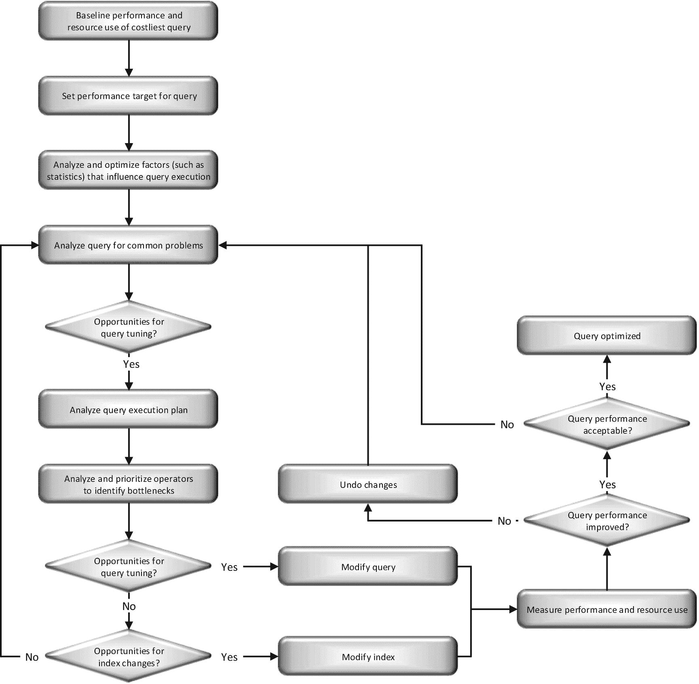

# 1. SQL 查询性能调优

查询性能调优依然是现代数据库维护和开发的一个基本方面。诚然，硬件性能在持续提升。对`SQL Server`的升级——特别是针对优化器（它决定查询如何执行）和查询引擎（它执行查询）的升级——本身就会带来更好的性能。此外，`SQL Server`内置的自动化功能会为您完成一些调优工作。与此同时，`SQL Server`实例正被部署到虚拟机上，无论是在本地还是在托管环境中，其硬件行为无法得到保证。数据库正在转向平台即服务系统，例如`Amazon RDS`和`Azure SQL Database`。诸如`Entity Framework`之类的对象关系映射软件将为您生成大部分查询。尽管如此，您仍然需要处理基础的数据库设计和代码生成问题。简而言之，查询性能调优仍然是提升数据库管理系统性能的关键机制。查询性能调优的妙处在于，在许多情况下，对索引或`SQL`查询进行微小的改动，就能以极低的成本带来应用程序效率的大幅提升。在这些情况下，性能的提升可能比采用速度稍快的`CPU`或略好的优化器所带来的提升高出几个数量级。

然而，对于粗心大意的人来说，其中存在许多陷阱。因此，需要一个经过验证的流程来确保您能正确识别并解决性能瓶颈。为了激发您对提升查询优化技能所必需的核心主题的兴趣，以下是我在本书中涵盖的查询优化方面的快速列表：

*   识别有问题的`SQL`查询
*   分析查询执行计划
*   评估当前索引的有效性
*   利用`Query Store`来监视和修复查询
*   评估当前统计信息的有效性
*   理解参数嗅探并在其失效时进行修复
*   优化执行计划缓存
*   分析并最小化语句重编译
*   最小化阻塞和死锁
*   利用`列存储`机制
*   应用内存中表存储和过程执行
*   应用性能调优流程、工具和优化技术来优化`SQL`工作负载

在直接深入这些主题之前，让我们首先审视一下我们为何要以这种方式进行性能调优。在本章中，我将讨论针对`SQL Server`数据库系统进行性能调优的基本概念。拥有一个遵循的流程非常重要，它能帮助您发现和识别性能问题、修复这些问题，并记录您所做的改进。如果没有一个结构良好的流程，您将如同在黑暗中摸索，希望能碰巧命中目标。我将详细说明主要的性能瓶颈，并展示设计一个对数据库友好的应用程序（即数据的消费者）是多么重要，同时也会介绍如何优化数据库。具体来说，我将涵盖以下主题：

*   性能调优流程
*   性能与成本
*   性能基线
*   调优应重点关注的方面
*   13 个主要的`SQL Server`性能杀手

本书未能涵盖的内容足以填充其他许多书籍。正如书名所示，本书的重点是`T-SQL`查询性能调优。但为了让您清楚了解，本书将不涉及以下内容：

*   硬件选择
*   应用程序编码方法学
*   服务器配置（除非其影响查询调优）
*   `SQL Server Integration Services`
*   `SQL Server Analysis Services`
*   `SQL Server Reporting Services`
*   `PowerShell`
*   虚拟机，无论是`Azure`上还是本地的
*   `Linux`上`SQL Server`的细节（尽管会提供少量相关信息）

## 性能调优流程

性能调优流程包括识别性能瓶颈、对已识别的问题进行排序、排查其原因、应用不同的解决方案、量化性能改进——然后不断重复整个流程。需要一点创造力，因为大多数时候并不存在单一的“银弹”来提升性能。挑战在于缩小可能原因的范围，并评估不同解决方案的效果。在迭代调优过程中，您甚至可能撤销先前的修改。

### 核心流程

在调优过程中，你必须检查可能影响基于 SQL Server 的应用程序性能的各种硬件和软件因素。在进行性能分析时，你应该反复思考以下几个核心问题：

*   同一服务器上是否还运行着其他资源密集型应用程序？
*   硬件子系统的容量能否承受最大工作负载？
*   SQL Server 是否配置得当？
*   SQL Server 环境（无论是物理服务器、虚拟机还是平台）是否拥有足够的资源？或者我遇到的是配置问题，甚至是来自其他服务的资源争用？
*   SQL Server 与应用程序之间的网络连接是否充足？
*   数据库设计是否支持最快的数据检索（对于可更新的数据库，还包括修改）？
*   由 SQL 查询组成的工作负载是否经过优化，以减少 SQL Server 的负载？
*   通过测量各种等待状态、性能计数器和其他测量源，反映出哪些进程导致系统变慢？
*   该工作负载是否支持所需的并发级别？

如果这些因素中有任何一项配置不当，整体系统性能都可能受到影响。让我们简要审视一下这些因素。

在同一台服务器上运行另一个资源密集型应用程序，会限制 SQL Server 可用的资源。即使是一个作为服务运行的应用程序，也可能消耗大量的系统资源，从而限制 SQL Server 的可用资源。当 SQL Server 必须等待其他服务的资源时，你的查询在能够检索或更新数据之前，也会被迫等待这些资源。

硬件配置不当可能会阻碍 SQL Server 充分利用可用资源。主要需要考虑的硬件资源是处理器、内存、磁盘和网络。如果某个特定硬件资源的容量不足，它很快就可能成为 SQL Server 的性能瓶颈。虽然本书不涉及硬件选择，但作为查询调优的一部分，你确实需要理解由于现有硬件可能导致性能瓶颈的方式和位置。第 2、3 和 4 章将详细讨论其中一些硬件瓶颈。

你还应该检查 SQL Server 的配置，因为正确的配置对于优化应用程序至关重要。有一长串的 SQL Server 配置项，它们定义了 SQL Server 安装的通用行为。可以使用系统存储过程 `sp_configure` 查看和修改这些配置，也可以通过系统视图 `sys.configurations` 直接查看。其中许多配置也可以通过 SQL Server Management Studio 进行交互式管理。

由于 SQL Server 配置适用于整个 SQL Server 安装，通常更倾向于使用标准配置。好消息是，一般情况下，你无需修改这些配置中的大多数；默认设置在大多数情况下效果最佳。事实上，一般的建议是将大多数 SQL Server 配置保持在默认值。本书通篇详细讨论了一些配置参数，并对修改其中少数几个提出了一些建议。

同样的原则也适用于数据库选项。`model` 数据库上的默认设置足以满足大多数系统的需求。你可能需要调整自动增长设置以偏离默认值，但许多其他属性，如自动关闭或自动收缩，应该保持关闭，而其他属性，如自动创建统计信息，在大多数情况下应保持开启。

如果你在某个托管环境内运行，你可能会与多个其他虚拟机或数据库共享一台服务器。在某些情况下，你可以与供应商或本地管理员合作，调整这些虚拟环境的设置，以帮助你的 SQL Server 实例运行得更好。但在许多情况下，你对系统行为的控制力可能很小甚至没有。你需要与具体的平台合作，以确定何时触及了该平台的限制，这些限制也可能导致性能问题。

SQL Server 与数据库应用程序之间的连接不良会损害应用程序性能。你应该问自己的问题之一是：网络连接的质量如何？例如，应用程序执行的查询可能经过高度优化，但用于提交此查询的网络连接可能会给整体性能带来相当大的开销。确保拥有具有适当带宽的最佳网络配置，将是系统设置的基本部分。如果你的环境托管在云端，这一点尤其重要。

在排查性能问题时，还应分析数据库设计。这不仅有助于你理解数据库的实体关系模型，还能理解查询为何以某种方式编写。虽然由于对数据库应用程序的广泛影响，修改正在使用的数据库设计可能并不总是可行，但深入理解数据库设计有助于你聚焦于正确的方向，并理解解决方案的影响。对于表中的主键、外键和聚集索引尤其如此。

应用程序速度缓慢可能是因为查询编写不佳、查询无法使用索引，或者索引本身效率低下或缺失。如果任何查询未经过充分优化，它们可能会严重影响其他查询的性能。我将在第 8、9、12、13 和 14 章深入讨论索引优化。这个阶段的下一个问题应该是：查询变慢是因为它资源消耗大，还是因为与其他查询存在并发问题？你可以在第 21 章找到关于阻塞分析的深入信息。

当进程在服务器（即使是具有多个处理器的服务器）上运行时，有时一个进程会等待另一个进程完成。通过识别是什么在等待以及是什么导致了等待，你可以从根本上理解性能下降的根本原因。你可以通过 SQL Server 内的动态管理视图以及性能监视器中的操作系统计数器来实现这一点。我将在第 2-4 章和第 21 章中介绍这方面的信息。

挑战在于找出导致性能瓶颈的因素。例如，面对运行缓慢的 SQL 查询和硬件资源的高压，你可能会发现糟糕的数据库设计和未优化的查询工作负载都是罪魁祸首。在这种情况下，你必须进一步诊断症状，并将发现与可能的原因关联起来。由于性能调优可能耗时且昂贵，理想情况下，你应该从一开始就为系统设计最佳性能，采取预防性方法。

## 强化预防性方法

要强化预防性方法，在优化性能不佳的数据库时所学到的每一课，都应在实施新的数据库应用时被视为优化准则。实施数据库应用时，还应考虑一些经过验证的最佳实践。我将在本书中详细介绍这些最佳实践，并且`第 27 章`专门概述了许多优化最佳实践。

请务必在数据库应用开发的早期阶段就考虑性能优化技术。这样做将有助于您推出数据库项目，避免日后出现大的意外情况。

遗憾的是，我们很少能达到这种理想状态，并且常常发现数据库应用需要进行性能调优。因此，不仅了解如何提高基于`SQL Server`的应用程序的性能很重要，了解如何诊断性能不佳的原因也同样重要。

## 迭代优化过程

性能调优是一个迭代过程，您需要识别主要瓶颈，尝试解决它们，衡量更改带来的影响，然后返回第一步，直到性能达到可接受的程度。在应用解决方案时，应尽可能遵循一次只做一个更改的黄金法则。任何更改通常都会影响系统的其他部分，因此您必须重新评估每个更改对整体系统性能的影响。

例如，添加索引可能会修复特定查询的性能，但也可能导致其他查询运行变慢，正如`第 8 章`和`第 9 章`所解释的那样。因此，最好在测试环境中进行性能分析，以使用户免受您的诊断尝试和中间优化步骤的影响。在这种情况下，一次评估一个更改也有助于根据其相对贡献，确定在生产服务器上实施更改的优先顺序。`第 26 章`解释了如何自动化测试数据库和查询性能，以帮助完成此过程。

您可以持续解决那些您认为最棘手、最痛苦的性能瓶颈，从而逐步提高系统性能。最初，您将能够解决重大的性能瓶颈，并实现显著的性能改进，但随着迭代的进行，您的收益将逐渐减少。因此，为了高效利用时间，首先量化性能目标（例如，某个查询的执行时间减少 80%，且对服务器其他部分无不利影响）是值得的，然后朝着这些目标努力。

`SQL Server`应用程序的性能在很大程度上取决于用户活动（或工作负载）的数量和分布以及数据。工作负载和数据的数量和分布通常会随时间而变化，不同的数据可能导致`SQL Server`以不同方式执行`SQL`查询。适用于特定工作负载和数据的性能解决方案，可能会在一段时间后失去其有效性。因此，为确保系统性能持续达到最佳状态，您需要定期分析系统和应用程序的性能。如`图 1-1`所示，性能调优是一个永无止境的过程。

`图 1-1` 性能调优过程

您可以看到，优化成本最高的查询的步骤构成了一个复杂的过程，这也需要多次迭代来对查询内的性能问题进行故障排除并一次应用一个更改。`图 1-2`展示了优化成本最高的查询所涉及的步骤。

`图 1-2` 成本最高查询的优化

从这个过程可以看出，要确保正确调整给定查询的性能，有很多工作要做。在性能调优中使用这样一个坚实的过程，以专注于已识别的主要问题，是非常重要的。

话虽如此，对问题整体保持更广阔的视野也有帮助，因为您可能认为某一方面导致了性能瓶颈，而实际上问题是由其他原因引起的。有时，您可能不得不回到业务部门，识别需求中的潜在变化，以找到让事情运行更快的方法。

## 性能与成本

我之前提到的一点是，为了获得越来越小的性能提升，您需要投入越来越多的时间和金钱。因此，为了确保获得最佳的投资回报，在优化性能时您应该保持客观。始终考虑以下两个方面：

-   您的应用程序可接受的性能是什么？
-   这项投资是否值得获得的性能提升？

### 性能目标

为了获得最大效率，您必须切实际地估计您的性能需求。您可以遵循许多最佳实践来提高性能。例如，您可以将数据库文件放在最高性能的磁盘子系统上。然而，在应用最佳实践之前，您应该考虑可能从中获得多少收益，以及这个收益是否值得投资。这些性能要求通常由其他人设定，要么是应用程序开发人员，要么是数据的业务消费者。查询调优的一个基本部分将涉及与这些相关方沟通，以确定一套足够好且现实的需求。

有时，在没有实际进行增强的情况下，确实很难估计性能提升。这使得正确识别性能瓶颈的来源变得更加重要。您是受`CPU`、`内存`还是磁盘限制？原因是代码、数据结构、索引，还是您只是达到了硬件的极限？是否存在劣质路由器、配置不当的 I/O 路径或应用不当的补丁导致网络性能缓慢？您平台上的服务层是否设置为适当的级别？请确保您能够基于一个已知的点做出这些可能成本高昂的决定，而不是靠猜测。一个实际的方法是逐步增加资源，并分析应用程序在增加资源后的可扩展性。如果该资源确实是导致可扩展性瓶颈的原因，那么一个可扩展的应用程序将从该资源的增量增加中成比例地受益。如果结果看起来令人满意，那么您可以承诺进行全面的增强。经验在这里也扮演着重要角色。

然而，有时您在性能方面正承受痛苦，需要尽您所能来缓解这种痛苦。完全的根因分析可能并不总是可行。为您的生产系统提供最大程度的保护仍然是首选路径，但也承认您并不总是能够做到这一点。

## “足够好”的调优

与其将系统调优至理论最大性能，目标应当是调至系统性能“足够好”即可。这是一种普遍采用的性能调优方法。超过这个点后的成本投入，相较于性能提升，通常呈指数级增长。80:20 法则非常适用：投入你 20% 的资源，你可能获得 80% 的潜在性能提升；但为了剩余 20% 的性能提升，你可能需要额外投入 80% 的资源。因此，在设定性能目标时，保持现实很重要。只需记住，“足够好”是由你、你的客户以及与你共事的业务人员来定义的，并没有一个大家都遵守的标准。

企业受益并非源于考虑纯粹的性能，而是考虑性能的代价。然而，如果目标是找出你应用程序的可扩展性上限（出于各种原因，包括将其与竞品进行营销对比），那么尽可能多地投入可能是值得的。即便在这样的情况下，使用第三方压力测试实验室也可能是更佳的投资决策。

虽然在某些情况下，确实需要深挖以寻求每一微秒的性能提升，但对于我们大多数人来说，在大多数时间里，这完全没有必要。相反，专注于确保我们恰当地执行标准的最佳实践，就能达到所需的目标。你可能会遇到特殊情况，但通常这不会是常态。首先要专注于正确的标准。

### 性能基线

性能分析的主要目标之一是了解不同硬件和软件子系统上的系统使用基础水平或压力。这些知识在以下方面对你有所帮助：

*   允许你分析资源瓶颈。
*   使你能够通过比较系统利用率模式与预先建立的基线来进行故障排除。
*   协助你在容量规划和硬件升级安排中做出准确预估。
*   帮助你识别出低利用率时段，此时可以最佳地执行数据库管理活动。
*   帮助你预估可能的硬件缩减或服务器整合的性质。公司为何要缩减？嗯，公司可能租赁了一个非常高端的系统，预期会强劲增长，但由于增长不佳，现在他们希望缩减系统规模。那整合呢？公司有时购买了太多服务器，或者意识到维护和许可成本过高。这使得使用更少的服务器变得极具吸引力。
*   有些指标只有在与先前记录的数值进行比较时才有意义。没有那个先前的度量值，你将无法理解这些信息。

因此，为了更好地理解你的应用程序的资源需求，你应该为应用程序的硬件和软件使用创建一个基线。`基线` 作为你系统当前使用模式的统计数据，以及与未来统计数据进行比较的参考。基线分析帮助你在稳定期间理解你的应用程序行为、在此期间硬件资源的使用情况以及软件的特性。有了基线，你可以执行以下操作：

*   衡量当前性能并阐明你应用程序的性能目标。
*   比较其他硬件和软件组合，或将平台服务层级与基线进行比较。
*   衡量工作负载和/或数据随时间的变化情况。这包括了解业务周期，如年度续费或销售活动。
*   确保你了解你的服务器上“正常”状态是什么，以免将一个任意数字误解为问题。
*   评估应用程序的高峰和非高峰使用模式。此信息可用于在非高峰时段有效分配数据库管理活动，如完整数据库备份和数据库碎片整理。

你可以使用 Windows 内置的 `性能监视器` 为 `SQL Server` 的硬件和软件资源利用创建基线。你也可以通过使用 `动态管理视图` 和 `动态管理函数` 来获取此信息的快照。同样，你可以使用 `扩展事件` 来建立 `SQL Server` 查询工作负载的基线，这可以帮助你在条件稳定时了解 `SQL` 查询的平均资源利用率和执行时间。你将在第 2-5 章详细学习如何使用这些工具和查询。一个平台系统可能有不同的度量标准，例如 `Azure SQL 数据库` 的 `数据库事务单元 (DTU)`。

另一个选项是利用众多可以在给定服务器或数据库上生成人工负载的工具之一。有许多第三方工具可用。微软提供 `分布式重放`，这将在第 25 章详细介绍。

