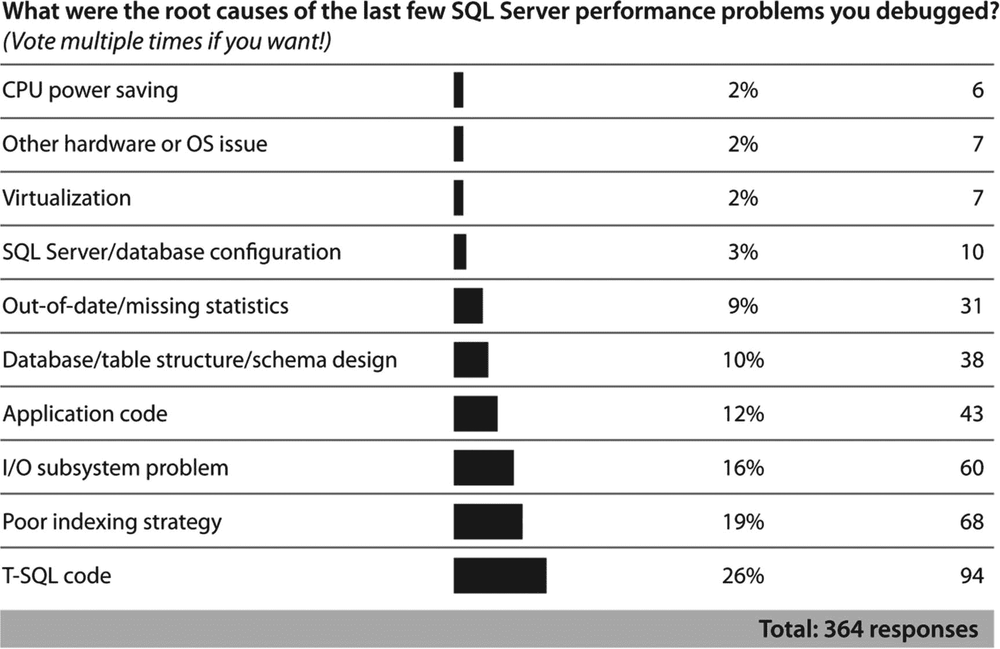

# 应将精力集中于何处

当你对特定系统进行调优时，请特别关注数据访问层（即由你的代码或通过对象关系映射引擎执行的、用于访问数据库的数据库查询和存储过程）。你通常会发现，在数据访问层上，你能够对性能产生的积极影响，远大于你花同等时间去琢磨如何调优硬件、操作系统或 `SQL Server` 配置所能带来的效果。尽管对硬件、操作系统和 `SQL Server` 实例进行合理配置对于数据库应用程序获得最佳性能至关重要，但这些专业领域已非常标准化，因此通常只需要花费有限的时间即可为性能正确配置系统。而另一方面，诸如查询设计、索引策略等应用程序设计问题，则是你代码和数据集所特有的。因此，数据访问层通常比硬件、操作系统、`SQL Server` 配置或平台有更多可优化的空间。图 1-3 展示了一项针对 346 名数据专业人员的调查结果（经 Paul Randal 许可使用：[`http://bit.ly/1gRANRy`](http://bit.ly/1gRANRy)）。

图 1-3

性能问题的根本原因

如你所见，两个最常见的问题是 `T-SQL` 代码和糟糕的索引。六个最常见问题中的四个都与 `T-SQL`、索引、代码和数据结构直接相关。我的经验与其他受访者一致。你可以首先审视数据访问领域（包括逻辑/物理数据库设计、查询设计和索引设计），从而获得数据库应用程序性能的最大提升。

诚然，如果你专注于硬件配置和升级，可能会获得令人满意的性能提升。然而，应用程序发出的糟糕 `SQL` 查询会消耗掉所有可用的硬件资源，无论你拥有多少资源。因此，糟糕的应用程序设计可能使硬件升级的需求变得非常高，甚至超出你的成本限制。在存在繁重 `SQL` 工作负载的情况下，专注于硬件配置和升级通常投资回报率很低。

你应该在两个层面分析应用程序对 `SQL Server` 数据库造成的压力。

- `高层级`：分析数据库应用程序对各个硬件资源以及 `SQL Server` 实例整体行为造成了多大压力。衡量这一点的最佳指标是各种 `等待状态` 以及 `Azure` 等平台的 `DTU`。此信息可在两方面帮助你。首先，它帮助你在性能不佳的 `SQL Server` 应用程序中确定需要重点关注的领域。其次，它帮助你在更高级别识别出任何配置不当之处。然后，你可以决定可能需要升级哪种硬件资源。

- `低层级`：识别应用程序中确切的元凶——换句话说，就是那些造成了在整体高层级可见的大部分压力的 `SQL` 查询。这可以通过使用 `扩展事件` 工具和各种动态管理视图来实现，如第 6 章所述。

