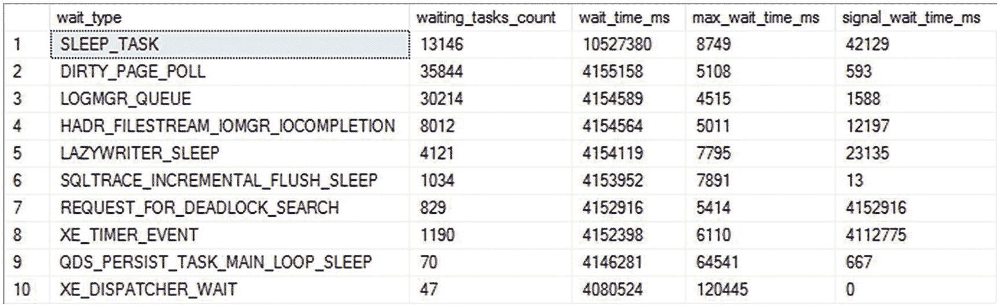
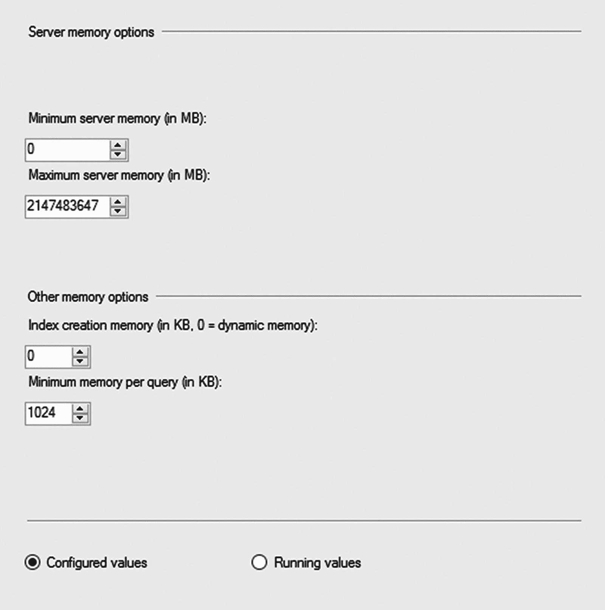
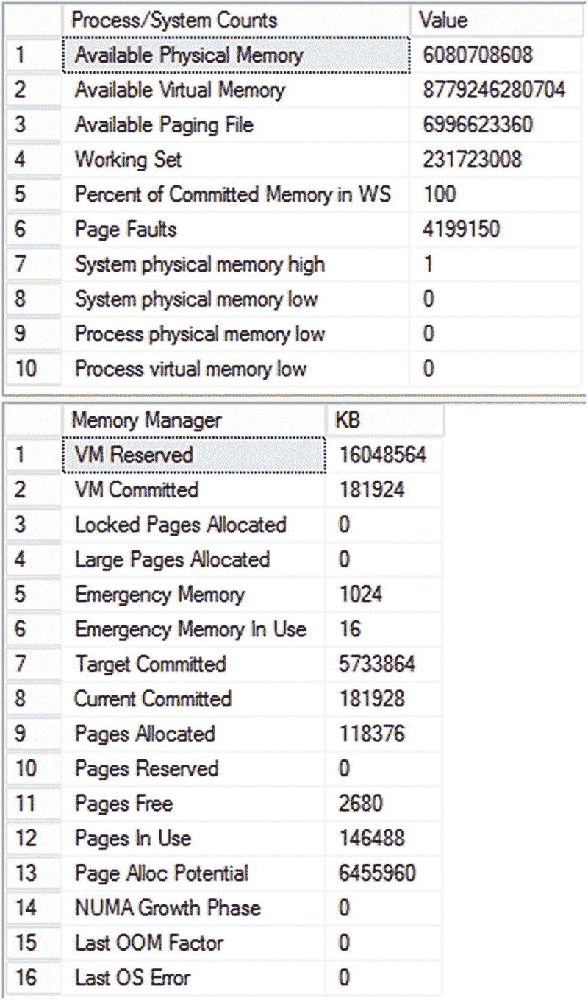
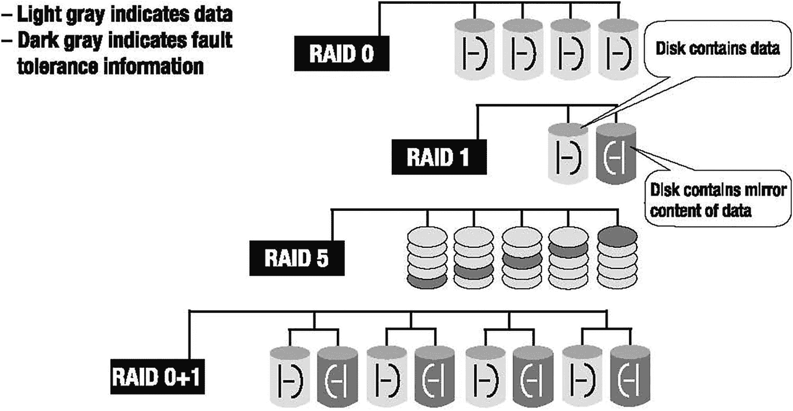
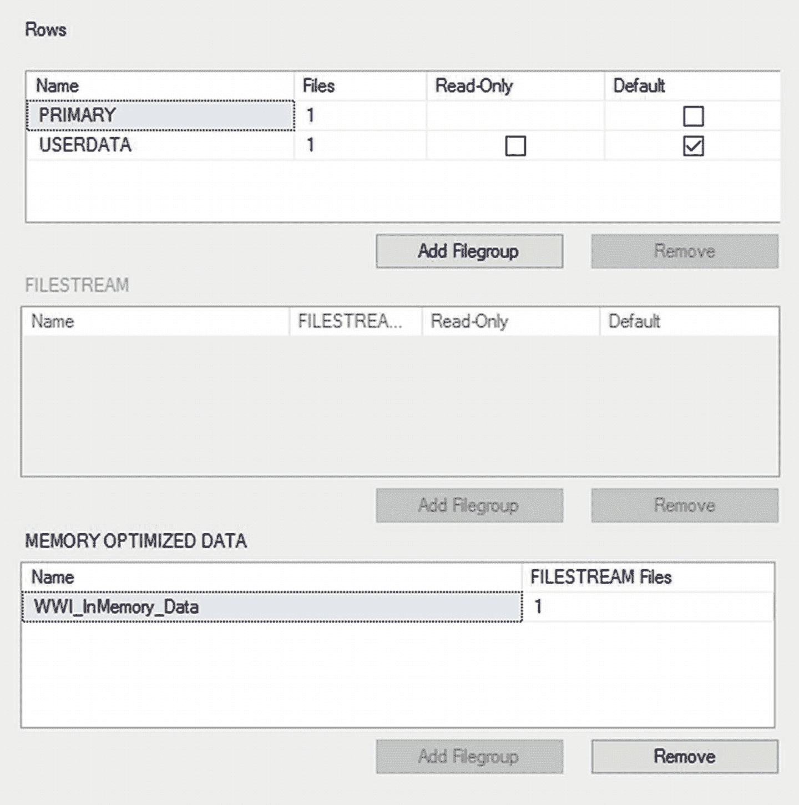

# 2. 内存性能分析

系统可以通过三个主要位置直接影响 SQL Server 及其上运行的查询：内存、磁盘和 CPU。从本章开始，我们将依次探讨每一个。在 SQL Server 中检索数据的查询必须首先将该数据加载到内存中。对数据的任何更改首先加载到内存中，在写入磁盘之前在内存中进行修改。许多其他操作也利用了系统中内存的速度，例如使用查询中的`ORDER BY`子句对数据进行排序、在连接两个表时执行计算以创建哈希表，以及通过内存中 OLTP 表功能将表放入内存。因为所有这些工作都是在系统的内存中完成的，所以理解内存是如何管理的就很重要。

在本章中，我将涵盖以下主题：

*   `Performance Monitor`（性能监视器）工具的基础知识
*   一些用于观察系统行为的动态管理对象
*   硬件资源如何以及为何会成为瓶颈
*   在 SQL Server 和 Windows 中观察和测量内存使用的方法
*   在 Linux 中观察和测量内存使用的方法
*   解决内存瓶颈的可能方案


## 性能监视器工具

Windows Server 2016 提供了一个名为“性能监视器”的工具，它收集有关操作系统资源利用率的详细信息。它可以跟踪系统性能的几乎所有方面，包括内存、磁盘、处理器和网络。此外，SQL Server 2017 还提供了对性能监视器工具的扩展，用于跟踪 SQL Server 内的各种功能区域。

性能监视器通过捕获系统硬件和软件组件（如处理器、进程、线程等）生成的性能数据来跟踪资源行为。系统组件生成的性能数据由**性能对象**表示。该性能对象提供代表组件特定方面的计数器，例如处理器对象的 `% Processor Time`。请记住，在虚拟机中运行这些计数器时，许多实例中计数器所测量的性能（取决于计数器类型）是针对该虚拟机的，而非物理服务器。这意味着在虚拟机上收集的一些值并不能准确反映物理现实。

一个系统组件可以有多个实例。例如，在具有双处理器的计算机中，`Processor` 对象将有两个实例，表示为实例 0 和 1。具有多个实例的性能对象也可能有一个名为 `Total` 的实例，用以表示所有实例的总值。例如，可以使用以下性能对象、计数器和实例（如图 2-1 所示）来确定具有双处理器的计算机的处理器使用率：


图 2-1：添加性能监视器计数器

*   性能对象：`Processor`
*   计数器：`% Processor Time`
*   实例：`_Total`

系统行为可以实时以图形形式跟踪，也可以捕获为文件（称为 `数据收集器集`）以供离线分析。在生产服务器上，首选机制是使用文件。你需要将信息收集到文件中进行存储，并根据需要随时间传输。此外，将收集的数据写入文件比在活动内存中显示在屏幕上所占用的资源更少。

要运行性能监视器工具，请在命令提示符下执行 `perfmon`，这将打开性能监视器套件。你也可以右键单击桌面或“开始”菜单上的“计算机”图标，展开“诊断”，然后展开“性能监视器”。你还可以转到“开始”屏幕并开始输入 `性能监视器`；你将看到启动该应用程序的图标。这些方法中的任何一种都可以让你打开性能监视器实用程序。

你将在第 5 章学习如何设置各个计数器。既然我已经介绍了性能监视器的概念，我将介绍另一个收集指标的接口：动态管理视图。

### 动态管理视图

为了立即获取以前只能在性能监视器中获得的大量数据的快照，SQL Server 通过一组动态管理视图和动态管理函数（统称为 `动态管理视图`（文档过去称为 `对象`，但现在已改变））在内部提供了一些相同的数据，以及大量不同的信息。这些是捕获系统当前性能快照的极其有用的机制。我将在本书中介绍几种 DMV，但现在我将重点介绍一些对于监控服务器性能和建立基准最重要的视图。

`sys.dm_os_performance_counters` 视图在查询中显示 SQL Server 计数器，允许你立即将 T-SQL 的全部功能应用于这些数据。例如，这个简单的查询将返回 `Logins/sec` 的当前值：

```sql
SELECT  dopc.cntr_value,
        dopc.cntr_type
FROM    sys.dm_os_performance_counters AS dopc
WHERE   dopc.object_name = 'SQLServer:General Statistics'
        AND dopc.counter_name = 'Logins/sec';
```

这在我的测试服务器上返回值 46。对于你的服务器，如果你有命名实例，例如 `MSSQL$SQL1-General Statistics`，则需要在 `object_name` 比较中替换相应的服务器名称。值得注意的是 `cntr_type` 列。该列告诉你正在读取的计数器类型（Microsoft 在 [`http://bit.ly/1mmcRaN`](http://bit.ly/1mmcRaN) 中有文档说明）。例如，前面的计数器返回值 272696576，这意味着该计数器是一个平均值。还有一些值是时间点快照、自服务器启动以来的累积值等。了解度量值代表什么，是理解这些指标的重要组成部分。

有大量的 DMV 可用于收集有关服务器的信息。我在这里再介绍一个你会发现自己会经常访问的 DMV：`sys.dm_os_wait_stats`。此 DMV 显示 SQL Server 启动以来、故障转移以来或计数器重置以来，在各种资源上发生的聚合等待时间。等待时间是在工作完成后记录的，因此这些数字不反映任何活动线程。识别系统中正在发生的等待类型是开始识别瓶颈来源的最简单机制之一。你可以以各种方式对数据进行排序；第一个示例使用这个简单的查询查看当前计数最长的等待：

```sql
SELECT TOP(10) dows.*
FROM sys.dm_os_wait_stats AS dows
ORDER BY dows.wait_time_ms DESC;
```

图 2-2 显示了输出结果。



图 2-2：`sys.dm_os_wait_stats` 的输出

你不仅可以看到特定等待累积的总时间，还可以看到它们发生的次数以及某事必须等待的最长时间。从这里，你可以识别等待类型并开始进行故障排除。最常见的等待类型之一是 I/O。如果你在前十种等待类型中看到 `ASYNC_IO_COMPLETION`、`IO_COMPLETION`、`LOGMGR`、`WRITELOG` 或 `PAGEIOLATCH`，你可能正在经历 I/O 争用，现在你知道从何处开始着手解决了。前面的列表包含了许多基本上可归类为“噪音”的等待。常见的做法是将它们排除。然而，这类等待很多。处理此问题的最简单方法是参考 Paul Randal 在这篇文章中提供的脚本：“Wait statistics, or please tell me where it hurts” ([`http://bit.ly/2wsQHQE`](http://bit.ly/2wsQHQE))。此外，你现在还可以在查询存储捕获的信息中看到单个查询的聚合等待统计信息，我们将在第 11 章介绍。你始终可以通过 MSDN 支持 ([`http://bit.ly/2vAWAfP`](http://bit.ly/2vAWAfP)) 直接联系 Microsoft 来查找有关更晦涩的等待类型的信息。最后，Paul Randal 也维护了一个等待类型的库（收集于 [`http://bit.ly/2ePzYO2`](http://bit.ly/2ePzYO2)）。

## 硬件资源瓶颈

通常，SQL Server 数据库性能受到以下硬件资源的压力影响：

*   内存
*   磁盘 I/O
*   处理器
*   网络

超出硬件资源容量的压力会形成瓶颈。要解决系统的整体性能问题，你需要识别这些瓶颈，因为它们形成了对整个系统性能的限制。此外，当你清除一个瓶颈时，你可能会发现你还有其他瓶颈，因为一组不良行为会掩盖或限制其他行为。


## 瓶颈识别

资源瓶颈之间通常存在关联。例如，处理器瓶颈可能是分页过多（内存瓶颈）或由糟糕的执行计划导致的慢速磁盘（磁盘瓶颈）所表现出的症状。如果系统内存不足，导致分页过多，并且同时存在慢速磁盘，那么最终结果之一将是处理器利用率过高，因为处理器需要花费大量的 CPU 周期将页面换入换出内存，并管理由此产生的大量 I/O 请求。更换更快的处理器可能略有帮助，但并非最佳的全局解决方案。在这种情况下，增加内存是更合适的解决方案，因为这将减轻磁盘和处理器的压力。实际上，升级磁盘可能比升级处理器是更好的解决方案。如果可能的话，减少工作负载也会有所帮助，当然，调整查询以确保最大效率也是一种选择。

定位瓶颈的最佳方法之一，是识别那些正在等待其他资源完成其操作的资源。你可以使用性能监视器计数器或动态管理视图（DMV），例如 `sys.dm_os_wait_stats` 来收集这些信息。由某个资源处理的请求的响应时间，包括该请求在资源队列中等待的时间以及执行请求所花费的时间，因此最终用户的响应时间与系统中的排队量成正比。

另一种识别瓶颈的方法是参考系统的响应时间和容量。例如，到磁盘的吞吐量通常应该接近供应商建议的磁盘处理能力。因此，测量诸如“磁盘秒/传输”之类的信息，将表明磁盘何时因负载过大而变慢。

并非所有资源都有显示队列级别的特定计数器，但大多数资源都有代表该资源被过度使用的某些计数器。例如，内存没有这样的计数器，但大量的硬错误页代表着物理内存的过度使用（硬错误页将在本章后面的“页/秒和错误页/秒”一节中解释）。其他资源，如处理器和磁盘，有特定的计数器来指示队列级别。例如，“页面寿命预期”计数器表示一个页面在缓冲池中未被引用的情况下能驻留多久。这表明了 SQL Server 管理其内存的能力，因为较长的寿命意味着缓冲池中的数据将保持可用，等待下次引用。然而，较短的寿命意味着 SQL Server 正在快速地将页面移入移出缓冲池，这可能暗示着内存瓶颈。

稍后你将看到在分析每种瓶颈时应使用哪些计数器。

## 瓶颈解决

一旦识别出瓶颈，你可以通过两种方式来解决它们。

*   你可以增加资源容量。
*   你可以降低到达该资源的请求速率。

增加容量通常需要额外的资源，如内存、磁盘、处理器或网络适配器。通过更严格地筛选发往某个资源的请求，可以降低其到达速率。例如，当存在磁盘子系统瓶颈时，你可以选择增加磁盘子系统的容量，或者减少 I/O 请求数量。

增加容量意味着添加更多磁盘或升级到更快的磁盘。降低到达速率则意味着识别导致磁盘子系统高 I/O 请求的原因，并采取解决方案以减少其数量。例如，你或许可以通过在表上添加适当的索引以限制访问的数据量，或者编写 T-SQL 语句在 WHERE 子句中包含更多或更好的过滤条件来减少 I/O 请求。

## 内存瓶颈分析

内存可能是一个棘手的瓶颈，因为内存中的瓶颈也会在其他资源上显现出来。对于运行 SQL Server 的系统尤其如此。当 SQL Server 的缓存（或内存）不足时，SQL Server 内部的一个进程（称为 `lazy writer` ）必须大量工作以在 SQL Server 内维护足够的空闲内部内存页面。这会消耗额外的 CPU 周期，并执行额外的物理磁盘 I/O 操作，将内存页面写回磁盘。


## SQL Server 内存管理

SQL Server 在一个称为*缓冲池*的大型内存池中管理数据库的内存，包括数据和查询执行计划所需的内存。内存池过去由一组 8KB 缓冲区来管理内存。现在则有用于数据页和计划缓存页、空闲页等的多种页面分配。缓冲池通常是 SQL Server 内存中最大的部分。SQL Server 通过动态增长或收缩其内存池大小来管理内存。

你可以在 SQL Server Management Studio (SSMS) 中配置 SQL Server 进行动态内存管理。转到“服务器属性”对话框的“内存”文件夹，如图 2-3 所示。


图 2-3：SQL Server 内存配置

动态内存范围通过两个配置属性控制：最小值(MB)和最大值(MB)。

*   `最小值(MB)`，也称为*min server memory*，作为内存池的下限值。一旦内存池达到与下限值相同的大小，SQL Server 可以继续提交内存池中的页面，但不能将其收缩到小于下限值。请注意，SQL Server 不会以 `min server memory` 配置值启动，而是根据需要动态提交内存。

*   `最大值(MB)`，也称为*max server memory*，作为上限值，用于限制内存池的最大增长。这些配置设置立即生效，无需重启。在 Windows 上运行时，SQL Server 2017 的最低最大内存对于 Express 版是 512MB，对于其他所有版本是 1GB。在 Linux 上的内存要求是 3.5GB。

Microsoft 建议对 SQL Server 使用动态内存配置，其中 `min server memory` 设为 0，`max server memory` 设为允许操作系统使用一些内存，假设机器上是单个实例。为操作系统预留的内存量首先取决于操作系统的类型，其次是所配置服务器的规模。

在 Windows 中，对于内存在 8GB 到 16GB 的小型系统，应为操作系统预留大约 2GB 到 4GB。随着服务器内存量的增加，需要为操作系统分配更多内存。一个常见的建议是，系统总内存超过 32GB 后，每增加 16GB 预留 4GB。你需要根据自己系统的需求和内存分配情况进行调整。不应在与 SQL Server 相同的服务器上运行其他内存密集型应用程序，但如果必须这样做，我建议你首先估算其他应用程序需要多少内存，然后配置 SQL Server，设置一个 `max server memory` 值，以防止其他应用程序导致 SQL Server 内存不足。在运行多个 SQL Server 实例的服务器上，你需要调整这些内存设置，以确保每个实例都有足够的值。只需确保你为操作系统和外部进程预留了足够的内存。

在 Linux 上，一般准则是为系统预留大约 20% 的内存给操作系统。同样类型的处理需求也适用，因为操作系统需要内存来管理其各种资源以支持 SQL Server。

无论操作系统如何，SQL Server 内部的内存大致可分为缓冲池内存（代表数据页和空闲页）和非缓冲内存（由线程、DLL、链接服务器等组成）。SQL Server 使用的大部分内存都用于缓冲池。但你也可能获得缓冲池之外的分配，称为*私有字节*，这可能导致在正常监控缓冲池过程中不明显的内存压力。如果你的系统存在此问题，请检查 `Process: sqlservr: Private Bytes` 与 `SQL Server: Buffer Manager: Total pages` 进行对比。

你还可以通过使用 `sp_configure` 系统存储过程来管理 `min server memory` 和 `max server memory` 的配置值。要查看这些参数的配置值，请执行 `sp_configure` 存储过程，如下所示：

```sql
EXEC sp_configure 'show advanced options', 1;
GO
RECONFIGURE;
GO
EXEC sp_configure 'min server memory';
EXEC sp_configure 'max server memory';
```

图 2-4 显示了运行这些命令的结果。


图 2-4：SQL Server 内存配置属性

请注意，`min server memory` 设置的默认值是 0MB，`max server memory` 设置的默认值是 2147483647MB。

你也可以使用 `sp_configure` 存储过程修改这些配置值。例如，要将 `max server memory` 设置为 10GB，`min server memory` 设置为 5GB，请执行以下语句集（下载中的 `setmemory.sql`）：

```sql
USE master;
EXEC sp_configure 'show advanced option', 1;
RECONFIGURE;
exec sp_configure 'min server memory (MB)', 5120;
exec sp_configure 'max server memory (MB)', 10240;
RECONFIGURE WITH OVERRIDE;
```

`min server memory` 和 `max server memory` 配置被归类为高级选项。默认情况下，`sp_configure` 存储过程不会影响/显示高级选项。如前所述，将 `show advanced option` 设置为 1，可使 `sp_configure` 存储过程能够影响/显示高级选项。

`RECONFIGURE` 语句更新由 `sp_configure` 设置的内存配置值。由于不建议对包含内存配置值的系统目录进行即席更新，因此将 `OVERRIDE` 标志与 `RECONFIGURE` 语句一起使用以强制应用内存配置。如果你通过 Management Studio 进行内存配置，Management Studio 会在配置设置后自动执行 `RECONFIGURE WITH OVERRIDE` 语句。

另一种查看设置但不进行操作的方法是使用 `sys.configurations` 系统视图。你可以使用标准 T-SQL 从 `sys.configurations` 中选择，而不必执行命令。

你可能需要考虑 SQL Server 共享系统内存的情况。详细来说，考虑一台运行 SQL Server 和 SharePoint 的计算机。这两个服务器都是内存的大量使用者，因此会不断相互争夺内存。SQL Server 的动态内存行为允许它在一个实例中向 SharePoint 释放内存，并在 SharePoint 释放时重新获取。你可以通过将 SQL Server 配置为固定内存大小来避免这种动态内存管理开销。然而，请记住，由于 SQL Server 是一个极其资源密集型的进程，强烈建议你拥有专用的 SQL Server 生产机器。

现在你已经对 SQL Server 内存管理有了一个非常高层次的理解，让我们考虑一下可以用来分析内存压力的性能计数器，如表 2-1 所示。

## 表 2-1：用于分析内存压力的性能监视器计数器


## 引言

内存和磁盘 I/O 关系密切。即使你认为你的问题直接与内存相关，也应该收集 I/O 指标，以了解系统在这两种资源之间的行为方式。现在，我将引导你了解这些计数器，以便你更好地理解其可能的用途。

| **对象(实例[,实例 N])** | **计数器** | **描述** | **取值** |
| --- | --- | --- | --- |
| Memory | `Available Bytes` | 可用物理内存 | 依赖于系统 |
| | `Pages/sec` | 硬性页面错误率 | 与基线对比 |
| | `Page Faults/sec` | 总页面错误率 | 与其基线值对比以进行趋势分析 |
| | `Pages Input/sec` | 输入页面错误率 | |
| | `Pages Output/sec` | 输出页面错误率 | |
| | `Paging File %Usage Peak` | 内存分页文件的峰值使用率 | |
| | `Paging File: %Usage` | 内存分页文件的使用率 | |
| `SQLServer:Buffer Manager` | `Buffer cache hit ratio` | 由缓冲区缓存满足的请求百分比 | 与其基线值对比以进行趋势分析 |
| | `Page Life Expectancy` | 页面在缓冲区缓存中停留的时间 | 与其基线值对比以进行趋势分析 |
| | `Checkpoint Pages/sec` | 由检查点写入磁盘的页面数 | 与基线对比 |
| | `Lazy writes/sec` | 从缓冲区刷新的脏页（老化）数 | 与基线对比 |
| `SQLServer:Memory Manager` | `Memory Grants Pending` | 等待内存授权的进程数 | 平均值 = 0 |
| | `Target Server Memory (KB)` | SQL Server 在该机器上可以拥有的最大物理内存 | 接近物理内存大小 |
| | `Total Server Memory (KB)` | 当前分配给 SQL 的物理内存 | 接近目标服务器内存 (KB) |
| `Process` | `Private Bytes` | 此进程已分配且无法与其他进程共享的内存大小（以字节为单位） | |

### Available Bytes

`Available Bytes` 计数器表示系统中的可用物理内存。你也可以查看 `Available Kbytes` 和 `Available Mbytes` 以获取相同数据，但精度较低。为了获得良好性能，此计数器的值不应过低。如果 SQL Server 被配置为动态内存使用，那么此值将通过调用 Windows API 来控制，该 API 决定何时以及释放多少内存。此值长时间处于很低水平且 SQL Server 内存没有变化，表明服务器正承受严重的内存压力。

### Pages/Sec and Page Faults/Sec

要理解 `Pages/sec` 和 `Page Faults/sec` 计数器的重要性，首先你需要了解页面错误。当进程需要的代码或数据不在其`工作集`（其在物理内存中的空间）中时，就会发生`页面错误`。它可能导致软页面错误或硬页面错误。如果错误页面在物理内存的其他地方找到，则称为`软页面错误`。当进程需要的代码或数据既不在其工作集中，也不在物理内存的其他地方，而必须从磁盘获取时，则会发生`硬页面错误`。

磁盘访问的速度，对于机械硬盘来说是毫秒量级，对于固态硬盘（SSD）则可低至 0.1 毫秒，而内存访问的速度是纳秒量级。磁盘访问和内存访问之间的这种巨大速度差异，使得硬页面错误的影响与软页面错误相比显得尤为显著。

`Pages/sec` 计数器表示为解决硬页面错误每秒从磁盘读取或写入磁盘的页面数。`Page Faults/sec` 性能计数器指示系统处理的每秒总页面错误数——软页面错误加上硬页面错误。这些主要是负载的衡量指标，并非性能问题的直接指标。

由 `Pages/sec` 指示的硬页面错误不应持续高于正常水平。对于什么数值表明存在问题，并没有硬性规定，因为这些数字会因系统内存的数量和类型以及系统磁盘访问速度的不同而有很大差异。

如果 `Pages/sec` 计数器很高，你可以将其分解为 `Pages Input/sec` 和 `Pages Output/sec`。

*   `Pages Input/sec`：应用程序只会在输入页面上等待，而不会在输出页面上等待。
*   `Pages Output/sec`：页面输出会给系统带来压力，但应用程序通常不会感知到这种压力。页面输出通常由应用程序需要写回磁盘的脏页面表示。`Pages Output/sec` 只有在磁盘负载成为问题时才是个问题。

此外，在 `Pages/sec` 很高的情况下，检查 `Process:Page Faults/sec` 可以找出是哪个进程导致了过多的分页。`Process` 对象是提供系统上运行进程性能数据的系统组件，这些进程由其对应的实例名称单独表示。

例如，SQL Server 进程由 `Process` 对象的 `sqlservr` 实例表示。除非 `Pages/sec` 很高，否则此计数器的数值通常意义不大。`Page Faults/sec` 在正常应用程序行为中可能范围很广，从每秒 0 到 1,000 的值都是可接受的。整个数据集意味着基线对于确定预期的正常行为至关重要。

### Paging File %Usage and Page File %Usage

Windows 系统中的所有内存并非都是物理机的物理内存。Windows 会将当前未立即活跃的内存换出物理内存空间，换入换出到分页文件。这些计数器用于了解这在你的系统上发生的频率。作为系统性能的一般衡量指标，这些计数器仅适用于 Windows 操作系统，而不适用于 SQL Server。然而，虚拟内存不足的影响会影响到 SQL Server。收集这些计数器是为了了解 SQL Server 上的内存压力是内部的还是外部的。如果是外部内存压力，你将需要进入 Windows 操作系统来确定可能的问题。

### Buffer Cache Hit Ratio

`缓冲区缓存` 是数据页被读入的缓冲页池，通常是 SQL Server 内存池中最大的部分。此计数器的值应尽可能高，特别是对于 OLTP 系统，其数据访问应相当规范，不像数据仓库或报表系统。对于大多数生产服务器来说，此计数器值达到 99% 或更高是极其常见的。`Buffer cache hit ratio` 值较低表明很少有请求可以由缓冲区缓存满足，其余请求由磁盘满足。

当这种情况发生时，要么 SQL Server 仍在预热，要么缓冲区缓存的内存需求超过了其可用增长的最大内存。如果缓存命中率持续较低，你可能需要考虑为系统增加更多内存，或通过使用良好的索引和其他查询调优机制来减少内存需求，除非你正在处理具有大量即席查询的报表系统。在处理报表系统时，持续看到缓存命中率变得极低是可能的。

这使得缓冲区缓存命中率成为理解系统行为方面的有趣数字，但单凭它本身并不能暗示潜在的性能问题。虽然这个数字代表了系统内部一种有趣的行为，但它并不是精确问题的绝佳衡量标准，而是显示了一种行为类型。关于此主题的更多详情，请阅读 Simple-Talk 上的 “Great SQL Server Debates: Buffer Cache Hit Ratio” 文章（ `https://bit.ly/2rzWJv0` ）。


## 页面预期寿命

页面预期寿命表示一个页面在未被引用的情况下，将在缓冲池中停留的时间。通常，该计数器的数值较低意味着页面正被移出缓冲区，这会降低缓存的效率，并表明可能存在内存压力。与 OLTP 系统相比，在报表系统上，此数值可能保持在较低的水平，因为报表系统会访问更多数据。在夜间数据加载期间，页面预期寿命降至极低水平也很常见。由于这取决于您可用的内存量以及系统上运行的查询类型，因此没有能适用于所有用户的硬性规定数值。因此，您需要为系统建立一个基线并对其进行持续监控。

如果您使用的是非统一内存访问架构（NUMA）的机器，您需要知道标准的页面预期寿命计数器是一个平均值。要查看具体度量值，您需要使用缓冲节点：页面预期寿命计数器。

## 检查点页数/秒

检查点页数/秒计数器表示由检查点操作移动到磁盘的页数。这些数字应该相对较低，例如，对于大多数系统应低于每秒 30。较高的数字意味着缓存中有更多的页被标记为脏。`脏页`是指在缓冲池中被修改过的页面。当它被修改时，它会被标记为脏页，并在下一个检查点期间写回磁盘。此计数器上较高的值表明系统内发生了大量的写入操作，这可能是 I/O 问题的迹象。但是，如果您正在利用间接检查点（它允许您控制检查点发生的时间以减少恢复间隔），您可能会看到不同的数值。在监控配置了间接检查点的数据库时，请将此考虑在内。关于 SQL Server 2016 及更高版本中检查点的更多信息，我建议您阅读 MSDN 上的“SQL Server 2016 中的检查点行为更改”文章（[`https://bit.ly/2pdggk3`](https://bit.ly/2pdggk3)）。

## 惰性写入次数/秒

惰性写入次数/秒计数器记录了缓冲区管理器的惰性写入进程每秒写入的缓冲区数量。此进程会将脏的、陈旧的缓冲区从缓冲区中移除，由系统进程释放内存供其他用途使用。一个脏的、陈旧的缓冲区是指包含了需要写入磁盘的更改的缓冲区。此计数器上的较高值可能表明存在 I/O 问题甚至内存问题。对于普通系统，惰性写入次数/秒的值应持续低于 20。但是，与所有其他计数器一样，您必须将您的数值与基线度量值进行比较。

## 内存授予挂起数

内存授予挂起数计数器表示在 SQL Server 内存中等待内存授予的进程数量。如果此计数器值很高，则表明 SQL Server 缓冲区内存短缺，这可能不仅仅是由内存不足引起的，还可能是由于统计信息过时导致行数不正确，从而造成内存授予过大等问题引起的。在正常情况下，对于大多数生产服务器，此计数器值应持续为 0。

另一种实时检索此值的方法是查询动态管理视图 `sys.dm_exec_query_memory_grants`。在 `grant_time` 列中的 `null` 值表示该进程仍在等待内存授予。这是您可以用来排查查询超时的一种方法，通过识别出某个（或某些）查询正在等待内存以执行。

## 目标服务器内存（KB）和服务器总内存（KB）

目标服务器内存（KB）表示 SQL Server 愿意消耗的动态内存总量。服务器总内存（KB）表示当前分配给 SQL Server 的内存量。如果系统专用于 SQL Server，服务器总内存（KB）计数器值可能会非常高。如果服务器总内存（KB）远低于目标服务器内存（KB），那么要么是 SQL Server 的内存需求较低，要么是 SQL Server 的最大服务器内存配置参数设置得太低，要么系统处于`预热阶段`。`预热阶段`是指 SQL Server 启动后，数据库服务器随着访问更多数据集而动态扩展其内存分配，将更多数据页调入内存的时期。

您可以通过是否存在大量空闲页（通常为 5,000 页或更多）来确认 SQL Server 的内存需求较低。此外，您可以通过查询动态管理视图 `sys.dm_os_ring_buffers` 来直接检查内存状态，该视图返回有关 SQL Server 内部内存分配的信息。我将在下一节更详细地介绍 `sys.dm_os_ring_buffers`。

## 其他内存监控工具

虽然您可以从性能监视器计数器获取 SQL Server 内存行为的基础信息，但一旦您知道需要花时间查看内存使用情况，您就需要利用其他工具和工具集。以下是一些用于识别 SQL Server 系统上内存问题的常用参考点。其中一些工具仅用于内存中 OLTP 管理。其中一些工具，虽然被大量 SQL Server 社区积极使用，但并未记录在 SQL Server 联机丛书中。这意味着它们绝对可能被更改或删除。

## DBCC MEMORYSTATUS

此命令会深入 SQL Server 内存并读取当前分配情况。它是一个时间点的度量，一个快照。它为您提供一组关于内存当前分配位置的度量值。运行该命令的结果以两个基本结果集返回，如图 2-5 所示。



图 2-5：`DBCC MEMORYSTATUS` 的输出

第一个数据集显示了内存的基本分配情况和发生次数。例如，“可用物理内存”是系统可用内存的度量，而“页错误”只是发生的页错误次数的计数。

第二个数据集显示了 SQL Server 内部不同的内存管理器以及它们在 `MEMORYSTATUS` 命令被调用时刻所消耗的内存量。

其中每一项都可以用来理解系统内内存分配发生的位置。例如，在大多数系统的大部分时间里，内存的主要消费者是缓冲池。您可以比较目标提交值与当前提交值，以了解您是否看到了缓冲池的压力。当目标提交值高于当前提交值时，您可能正在遇到缓冲区缓存问题，并需要找出当前正在执行的 SQL Server 进程中哪个进程使用了最多的内存。这可以使用动态管理对象 `sys.dm_os_performance_counters` 来完成。

其余的数据集来自 `DBCC MEMORYSTATUS` 产生的完整内存转储，包含各种内存管理器、内存 clerks 和其他内存存储。它们只在处理 SQL Server 管理的特定方面的狭窄情况下才会令人感兴趣，并且将它们全部记录下来远远超出了本书的范围。您可以在 MSDN 文章“如何使用 DBCC MEMORYSTATUS 命令”（[`http://bit.ly/1eJ2M2f`](http://bit.ly/1eJ2M2f)）中阅读更多信息。


### 动态管理视图

SQL Server 中存在大量与内存相关的动态管理视图（DMV）。其中一些视图已在 SQL Server 2017 中进行了更新，同时也新增了一些视图。逐一审视所有视图超出了本书的范围。在判断 SQL Server 是否存在内存瓶颈时，有三个视图是最常使用的。此外，当你需要监控内存 OLTP 内存使用情况时，还有另外两个视图也十分有用。

#### Sys.dm_os_memory_brokers

虽然 SQL Server 中的大部分内存分配给了缓冲区缓存，但其中也有一些进程会消耗内存。这些进程通过此 DMV 暴露其内存分配情况。当你有其他迹象表明存在内存瓶颈时，可以使用此视图查看哪些进程可能正在占用本应属于缓冲区缓存的资源。

#### Sys.dm_os_memory_clerks

内存 clerks 是在 SQL Server 内部分配内存的进程。观察这些进程的活动情况，可以让你了解 SQL Server 内部是否存在可能抢占过程缓存所需内存的内部内存分配问题。如果性能监视器中“专用字节”计数器很高，你可以通过此 DMV 确定系统中哪些部分正在被消耗。

如果你有一个使用内存 OLTP 存储的数据库，可以使用 `sys.dm_db_xtp_table_memory_stats` 来查看各个数据库对象。但如果你想查看整个实例中这些对象的分配情况，则需要使用 `sys.dm_os_memory_clerks`。

#### Sys.dm_os_ring_buffers

此 DMV 未在联机丛书中文档化，因此可能会更改或被移除。它在 SQL Server 2008R2 和 SQL Server 2012 之间发生了变化。我通常针对它运行的查询在 SQL Server 2017 上似乎仍然有效，但这并不能保证。此 DMV 以 XML 格式输出。通常你可以直接肉眼阅读输出内容，但可能需要实现 XQuery 才能从环形缓冲区中获取非常复杂的读取结果。

环形缓冲区不过是对通知的记录响应。环形缓冲区保存在此 DMV 中，访问 `sys.dm_os_ring_buffers` 可以让你看到内存内部的变化。表 2-2 描述了与内存相关的主要环形缓冲区。

**表 2-2**
**与内存相关的主要环形缓冲区**

| **环形缓冲区** | **Ring_buffer_type** | **用途** |
| --- | --- | --- |
| 资源监视器 | `RING_BUFFER_RESOURCE_MONITOR` | 随着内存分配的变化，此变化的通知会记录在这里。此信息可用于识别外部内存压力。 |
| 内存不足 | `RING_BUFFER_OOM` | 当你遇到内存不足问题时，它们会被记录在此，以便你能判断是哪种内存操作失败了。 |
| 内存代理 | `RING_BUFFER_MEMORY_BROKER` | 当 SQL Server 内部内存下降时，低内存通知将强制进程为缓冲区释放内存。这些通知记录在此处，这使其成为衡量内部内存压力发生时的有效指标。 |
| 缓冲池 | `RING_BUFFER_BUFFER_POOL` | 当缓冲池本身内存不足时的通知记录在此。这只是内存压力的一般性指示。 |

还有其他可用的环形缓冲区，但它们不适用于内存分配问题。

#### Sys.dm_db_xtp_table_memory_stats

要查看你创建在内存中的表和索引所使用的内存，可以查询此 DMV。输出会度量表和索引的已分配内存和已使用内存。它仅输出 `object_id`，因此你还需要查询系统视图 `sys.objects` 来获取表或索引的名称。此 DMV 输出的是你查询时当前连接到的数据库的信息。

#### Sys.dm_xtp_system_memory_consumers

此 DMV 显示用于管理内存引擎内部结构的系统结构。这通常不是你需要处理的内容，但在排查内存问题时，了解你是直接处理系统内部发生的某种情况，还是仅仅处理你加载到内存中的数据量，是很有帮助的。你在这里主要查找的指标是每个管理结构显示的已分配字节和已使用字节。

### 在 Linux 中监控内存

在 Linux 操作系统中你将无法使用 Perfmon。然而，这并不意味着你不能观察服务器上的内存行为以了解系统运行状况。你可以在运行于 Linux 上的 SQL Server 2017 实例中查询 DMV `sys.dm_os_performance_counters` 和 `sys.dm_os_wait_stats`，以此方式观察内存行为。

可以通过 Linux 原生工具对 Linux 操作系统进行额外的监控。这类工具数量众多，但一个常用的是 Grafana。它是开源的，网上有大量可用文档。SQL Server 客户顾问团队有一个我推荐的有文档记录的监控 Linux 的方法：[`http://bit.ly/2wi73bA`](http://bit.ly/2wi73bA)。

## 内存瓶颈解决方案

当内存压力很大时（表现为大量的硬页错误），你可以使用图 2-6 所示的流程图来解决内存瓶颈。


**图 2-6**
**内存瓶颈解决方案流程图**

内存瓶颈的一些常见解决方案如下：

*   优化应用程序工作负载
*   为 SQL Server 分配更多内存
*   将内存表移回标准存储
*   增加系统内存
*   从 32 位处理器更换为 64 位处理器
*   启用 3GB 进程空间
*   压缩数据
*   处理碎片问题

当然，修复任何可能导致过度内存使用的查询问题始终是一个选择。让我们依次来看看这些方案。

### 优化应用程序工作负载

优化应用程序工作负载在大多数情况下是最有效的解决方案，但由于此过程的复杂性和挑战性，它通常被放在最后考虑。要识别内存密集型查询，可以使用扩展事件（你将在第 6 章学习如何使用）捕获所有 SQL 查询，或使用查询存储（我们将在第 11 章介绍），然后按 `Reads` 列对输出进行分组。逻辑读取次数最多的查询通常最常导致内存压力，但两者之间并非线性相关。你也可以使用 `sys.dm_exec_query_stats`（一个收集缓存中活动查询指标的 DMV）来识别相同的问题。但是，由于此 DMV 基于缓存，它可能不如使用扩展事件捕获指标那么准确，尽管它会更快、更简单。你将在本书中更详细地看到如何优化这些查询。

### 为 SQL Server 分配更多内存

正如你在“SQL Server 内存管理”部分所学到的，“最大服务器内存”配置可以限制 SQL Server 缓冲内存池的最大大小。如果 SQL Server 的内存需求超过了“最大服务器内存”值（你可以通过硬页错误的数量来判断），那么增加该值将允许内存池增长。为了从增加“最大服务器内存”值中受益，请确保系统中有足够的物理内存可用。

如果你正在使用内存 OLTP 存储，你可能需要调整为内存对象定义的资源池所分配的内存百分比。但这将从 SQL Server 实例的其他部分获取内存。


### 将内存表移回标准存储

SQL Server 2014 引入了一种名为 `in-memory` 的新表类型。它将表的存储从磁盘转移到了内存，从而极大地提升了性能。然而，并非所有的表或所有工作负载都能从这一新特性中受益。您需要关注内存表的通用查询性能指标，并利用特定的 DMV 来监控它们。我将在第 24 章详细介绍这些内容。如果您的工作负载不适合内存表，或者系统中没有足够的内存，您可能需要将这些内存表移回磁盘存储。

### 增加系统内存

SQL Server 的内存需求取决于它所处理的 SQL 活动的数据总量，这与数据库的大小或传入的 SQL 查询数量没有直接关联。例如，如果一个内存密集型查询在两个小表之间执行交叉连接，且没有任何过滤条件来缩小结果集，就可能给系统内存带来巨大压力。

最简单、最快速的解决方案之一就是直接购买并安装更多内存。但是，找出是什么消耗了物理内存仍然至关重要，因为如果应用程序工作负载极其耗费内存，您可能很快就会受限于系统可访问的最大内存量。要识别哪些查询使用了更多内存，可以查询 `sys.dm_exec_query_memory_grants` DMV 并收集查询及其 I/O 使用情况的指标。在使用 JOIN 或 ORDER BY 语句针对此 DMV 运行查询时要格外小心；如果您的系统已经处于内存压力之下，这些操作可能导致您的查询需要自己的内存授权。

### 从 32 位处理器更改为 64 位处理器

将物理服务器从 32 位处理器切换到 64 位处理器（以及随之而来的 Windows Server 软件升级）会从根本上改变 SQL Server 的内存管理能力。SQL Server 的内存限制从 3GB 提高到了最高 24TB，具体取决于操作系统版本和特定的处理器类型。

在 SQL Server 2012 之前，可以通过使用地址窗口扩展插件（Address Windowing Extensions）向 SQL Server 实例添加最多 64GB 的数据缓存。这些插件在 SQL Server 2012 中被移除，因此 32 位的 SQL Server 实例只能访问 3GB 内存。由于此限制，只有小型系统才应运行 2017 之前的 32 位版本 SQL Server。

SQL Server 2017 不支持 x86 芯片组。您必须改用 64 位处理器才能使用 2017 版本。

### 压缩数据

数据压缩在存储和检索信息方面有许多显著的好处。它还有一个许多人不知道的额外好处：当压缩后的信息存储在内存中时，它保持压缩状态。这意味着可以移动更多信息，同时使用更少的系统内存，从而提高整体内存吞吐量。这一切确实需要付出一些 CPU 代价，因此您需要密切关注，以确保您不是在简单地转移压力。有时，由于数据性质的原因，您可能看不到太大的压缩效果。

### 启用 3GB 进程地址空间

标准的 32 位地址最多可以映射 4GB 内存。因此，32 位 Windows 操作系统进程的标准地址空间被限制为 4GB。在这个 4GB 的进程空间中，默认情况下，上部的 2GB 保留给操作系统，下部的 2GB 提供给应用程序使用。如果您在 32 位操作系统的 `boot.ini` 文件中指定 `/3GB` 开关，则操作系统仅保留 1GB 的地址空间，应用程序最多可以访问 3GB。这也被称为 *4GB 调优*（4GT）。为此不需要新的 API。

因此，在具有 4GB 物理内存和默认 Windows 配置的机器上，您会发现可用内存约为 2GB 或更多。为了让 SQL Server 使用最多 3GB 的可用内存，您可以在 `boot.ini` 文件中添加 `/3GB` 开关，如下所示：

```
[boot loader]
timeout=30
default=multi(0)disk(0)rdisk(0)partition(1)\WINNT
[operating systems]
multi(0)disk(0)rdisk(0)partition(1)\WINNT=
"Microsoft Windows Server 2016 Advanced Server"
/fastdetect /3GB
```

`/3GB` 开关不应用于物理内存超过 16GB 的系统（如下一节所述），或需要更多内核内存的系统。

64 位系统上的 SQL Server 2017 在 x64 平台上最高可支持 24TB。将生产系统，尤其是企业级生产系统放在 32 位架构上已经没有太大意义，而且使用 SQL Server 2017 时您也无法这样做。

### 处理碎片

存储的碎片听起来可能不像是性能问题，因为 SQL Server 从磁盘检索信息并加载到内存中时，访问的是一页信息。如果您有高水平的碎片，这将直接转化为您的内存管理问题，因为您必须将从磁盘检索的页面（包括空白空间）原样存储在内存中。因此，虽然碎片可能影响存储，但它也可能影响内存。我将在第 17 章讨论碎片问题。

## 总结

在本章中，您了解了性能监视器和 DMV。您探索了在 SQL Server 中收集内存和内存行为指标的不同方法。理解内存的行为将帮助您了解系统的性能。您还看到了一些解决内存问题的可能方案，而不仅仅是购买更多内存。SQL Server 会利用您能提供的所有内存，因此请管理好这个资源。

在下一章中，您将介绍下一个系统瓶颈——磁盘和磁盘子系统。

### 3. 磁盘性能分析

磁盘和磁盘子系统（包括控制器、连接器和管理软件）是任何计算系统中最慢的部分之一。多年来，内存变得越来越快，CPU 也是如此。但是磁盘，除了我们最近看到的像固态硬盘（SSD）这样的技术带来的一些根本性改进外，变化并不大；磁盘仍然是大多数系统中最慢的部分之一。这意味着您需要能够监控您的磁盘以了解其行为。在本章中，您将探索以下领域：

*   使用系统计数器收集磁盘性能指标
*   使用其他机制收集磁盘行为数据
*   解决磁盘性能问题
*   处理 Linux 操作系统和磁盘 I/O 时的差异


## 磁盘瓶颈分析

SQL Server 可能有苛刻的 I/O 要求，并且由于磁盘速度相对于内存和处理器速度慢得多，I/O 资源的争用会显著降低 SQL Server 性能。分析和解决任何 I/O 路径瓶颈都可以显著提高 SQL Server 性能。与任何性能指标一样，仅基于单个计数器或单次测量结果来判定性能的好坏会导致问题。在涉及传统 `RAID` 系统与现代磁盘虚拟化之间的现代磁盘和 I/O 管理系统时，这一点更为突出，因为衡量 I/O 是一个复杂的主题。请计划使用多个指标来了解您环境中 I/O 子系统的行为。尽管本章涵盖了许多信息，但它只涵盖了基础知识。

现代系统中还有其他机制也会使衡量 I/O 变得更加困难。更多的系统正在虚拟化运行并共享资源（包括磁盘）。这将导致更多的随机 I/O，因此在查看本章中的各项指标时，必须考虑到这一点。防病毒程序在 I/O 方面是一个常见问题，因此在使用我们即将讨论的 I/O 指标之前，请务必确认您是否在处理此问题。您可能还会看到筛选器驱动程序在 I/O 路径中成为瓶颈的问题，这是另一个需要关注的事项。

在我们讨论指标和解决方案之前，您需要了解一件事，那就是检查点过程如何工作。当 SQL Server 写入数据时，它首先将所有数据写入内存（我们将在第 4 章讨论内存问题）。内存中包含更改的任何页面都称为*脏页*。检查点过程基于内部度量标准和您的 `recovery interval` 设置周期性地发生。检查点过程将脏页写入磁盘，并将所有更改记录到事务日志中。检查点过程是您将在 SQL Server 中看到的写入 I/O 活动的主要驱动因素。

让我们看看如何衡量 I/O 子系统的行为。

### 磁盘计数器

要分析磁盘性能，您可以使用表 3-1 中所示的计数器。

**表 3-1** 用于分析 I/O 压力的性能监视器计数器

| 对象 (实例[,实例 N]) | 计数器 | 描述 | 值 |
| --- | --- | --- | --- |
| `PhysicalDisk`(`数据磁盘`, `日志磁盘`) | `Disk Transfers/sec` | 磁盘上读/写操作的速率 | 最大值取决于 I/O 子系统 |
| | `Disk Bytes/sec` | 每秒向/从每个磁盘传输的数据量 | 最大值取决于 I/O 子系统 |
| | `Avg. Disk Sec/Read` | 从磁盘读取的平均时间（毫秒） | 平均值 < 10 毫秒，但需与基线比较 |
| | `Avg. Disk Sec/Write` | 写入磁盘的平均时间（毫秒） | 平均值 < 10 毫秒，但需与基线比较 |
| `SQLServer:Buffer Manager` | `Page reads/sec` | 读入缓冲区管理器的页数 | 与基线比较 |
| | `Page writes/sec` | 从缓冲区管理器写出的页数 | 与基线比较 |

`PhysicalDisk` 计数器表示物理磁盘上的活动。`LogicalDisk` 计数器表示在物理磁盘上创建的逻辑子单元（或分区）。如果您在物理磁盘上创建两个分区，例如 `R:` 和 `S:`，那么您可以使用逻辑磁盘计数器来监控各个逻辑磁盘的磁盘活动。然而，由于磁盘瓶颈最终发生在物理磁盘上，而不是逻辑磁盘上，因此通常更倾向于使用 `PhysicalDisk` 计数器。

请注意，对于硬件独立磁盘冗余阵列 (`RAID`) 子系统（有关 `RAID` 的更多信息，请参阅“使用 RAID 阵列”部分），计数器会将阵列视为单个物理磁盘。例如，即使您的 `RAID` 配置中有十个磁盘，它们对操作系统而言都将表示为一个物理磁盘，因此您将只有该 `RAID` 子系统的一组 `PhysicalDisk` 计数器。同样的观点也适用于存储区域网络 (`SAN`) 磁盘（具体请参阅“使用 SAN 系统”部分）。您在许多更现代的磁盘系统和虚拟磁盘中也会看到这种情况。正因如此，表 3-1 中显示的一些数字可能比您的系统实际支持的数值要低（或高）很多。

请将这些数字视为监控磁盘的一般指导原则，并根据技术不断发展以及硬件改进后您可能看到不同性能的现实情况来调整这些数字。我们正越来越多地转向固态硬盘甚至是 `SSD` 阵列，这使磁盘 I/O 操作的速度提高了几个数量级。在尚未采用 `SSD` 的地方，我们正在利用 `iSCSI` 接口。在使用这类硬件时，请记住，这些数字更符合老式的盘片硬盘驱动器的情况，而这些硬盘正迅速被淘汰。

### 磁盘传输数/秒

`Disk Transfers/sec` 监控磁盘上读取和写入操作的速率。当今典型的硬盘驱动器对于顺序 I/O (`IOPS`) 每秒大约可以执行 180 次磁盘传输，对于随机 I/O 每秒大约可以执行 100 次磁盘传输。在随机 I/O 的情况下，`Disk Transfers/sec` 较低，因为涉及更多的磁盘臂和磁头移动。`OLTP` 工作负载（主要用于单例操作、小型操作和随机访问的工作负载）通常受限于每秒磁盘传输次数。因此，在 `OLTP` 工作负载的情况下，您更受限于磁盘每秒只能执行 100 次磁盘传输这一事实，而不是其 1000MB 每秒的吞吐量规格。

**注意：** 一个 `SSD` 的 `IOPS` 可能在大约 5,000 到某些高端 `SSD` 系统的 500,000 `IOPS` 之间。您对 `Disk Transfers/sec` 的监控需要相应地调整比例。有关此指标的详细信息，请咨询您的供应商。

由于磁盘固有的缓慢性，建议您尽可能保持每秒磁盘传输次数较低。

### 磁盘字节数/秒

`Disk Bytes/sec` 计数器监控在读取或写入操作期间向磁盘或从磁盘传输字节的速率。一个典型的 7200RPM 磁盘每秒可以传输大约 1000MB。通常，`OLTP` 应用程序不受磁盘子系统磁盘传输能力的限制，因为 `OLTP` 应用程序在单个数据库请求中访问少量数据。如果数据传输量超过磁盘子系统的容量，那么磁盘子系统上就会开始形成积压，这反映在 `Disk Queue Length` 计数器上。

同样，对于 `SSD` 访问，这些数字可能会高得多，因为它主要只受限于驱动器到主机接口引起的延迟。

### 平均磁盘秒数/读取和平均磁盘秒数/写入

`Avg. Disk Sec/Read` 和 `Avg. Disk Sec/Write` 跟踪从磁盘读取或写入磁盘平均所需的时间（以毫秒为单位）。了解磁盘处理接收到的写入和读取操作的效果如何，可以成为指示问题所在的重要指标。如果将数据移入或移出磁盘需要超过大约 10 毫秒的时间，您可能需要检查硬件和配置，以确保一切正常工作。为了使事务日志运行良好，您需要获得更好的响应时间。

就衡量 I/O 系统性能而言，这是最佳的单一指标。`Sec/Read` 或 `Write` 可能无法告诉您是哪个查询或哪些查询导致了问题。但这些指标绝对能告诉您 I/O 系统的行为方式，因此我会将它们与您收集的任何其他指标集一起使用。


### 缓冲区管理器页面读写

虽然如前所述，衡量 I/O 系统很重要，但你需要不止一项度量来展示 I/O 系统的运行状况。了解进出缓冲区管理器的页面，能让你很好地判断所观察到的 I/O 是否发生在 SQL Server 内部。当你试图证明一个 I/O 问题时，这是你想添加到其他度量项中的一项重要指标。

## 附加 I/O 监控工具

就像所有其他工具一样，你需要用其他来源可用的数据来补充从性能监视器收集的信息。关于 I/O 和磁盘问题的真正有价值的信息都在 DMO（动态管理对象）中。

### sys.dm_io_virtual_file_stats

这是一个返回构成数据库的文件信息的函数。你可以像下面这样调用它：

```sql
SELECT  *
FROM    sys.dm_io_virtual_file_stats(DB_ID('AdventureWorks2017'), 2) AS divfs;
```

它返回关于该文件的多个有趣的信息列。最值得关注的是延迟数据，即用户等待不同 I/O 操作所花费的时间。首先，`io_stall_read_ms` 表示用户等待读操作的时间（毫秒）。其次是 `io_stall_write_ms`，它显示了该数据库中文件上写操作不得不等待的时间。你还可以查看通用数值 `io_stall`，它表示文件上所有 I/O 等待的总和。为了使这些数字有意义，你还会得到另一个值 `sample_ms`，它显示了测量的时长。你可以将此值与其他值进行比较，以了解 I/O 问题阻碍系统的程度。此外，你可以将其缩小到特定文件，从而知道是日志还是某个特定数据文件导致了速度变慢。这是确定 I/O 瓶颈是否存在的极其有用的度量。它对于识别具体的瓶颈帮助不大。请将其与等待统计信息和前面提到的 Perfmon 指标结合使用。

### sys.dm_os_wait_stats

这是一个有用的 DMO，它显示了系统上等待的汇总信息。要确定你是否存在 I/O 瓶颈，你可以通过如下查询利用这个 DMO：

```sql
SELECT  *
FROM    sys.dm_os_wait_stats AS dows
WHERE   wait_type LIKE 'PAGEIOLATCH%';
```

你看到的是导致等待发生的各种 I/O 锁存器操作。与 `sys.dm_io_virtual_file_stats` 类似，你无法从这个 DMO 获得具体的查询，但它确实能识别你是否存在 I/O 瓶颈。像许多性能计数器一样，你不能简单地寻找一个固定值。你需要将当前值与基线值进行比较，以得出当前的状况。

前面显示的 WHERE 子句使用了 `PAGEIOLATCH%`，但你还应该查找与其它 I/O 进程相关的等待，例如 `WRITELOG`、`LOGBUFFER` 和 `ASYNC_IO_COMPLETION`。

当你运行此查询时，你会得到已发生等待的次数以及总等待时间的聚合值。你还会得到这些等待的最大值，以便了解最长的等待是多久，因为有可能单个等待就造成了大部分的等待时间。

别忘了，你可以在查询存储中查看等待统计信息。我们将在第 11 章详细讨论这些内容。

### 监控 Linux I/O

对于 I/O 监控，你将仅限于使用 SQL Server 内部工具，或者利用第 2 章提到的 Linux 特定监控工具。Linux 系统内的输入和输出基本原理与 Windows 操作系统内并无太大不同。主要区别仅在于你如何在操作系统级别捕获磁盘行为。

## 磁盘瓶颈解决方案

一些常见的磁盘瓶颈解决方案如下：

*   优化应用程序工作负载
*   使用更快的 I/O 路径
*   使用 RAID 阵列
*   使用 SAN（存储区域网络）系统
*   使用固态硬盘
*   正确对齐磁盘
*   增加系统内存
*   创建多个文件和文件组
*   将日志文件移动到单独的物理驱动器
*   使用分区表

现在我将依次介绍这些解决方案中的每一项。

### 优化应用程序工作负载

我无法更加强调优化应用程序工作负载对于解决性能问题的重要性。具有最高读取或写入次数的查询将是导致大量磁盘 I/O 的元凶。本书的其余部分将更详细地介绍优化这些查询的策略。

### 使用更快的 I/O 路径

最有效的解决方案之一，也是你任何时候都应优先考虑的，就是使用具有更快磁盘传输速率（每秒）的驱动器、控制器和其他架构。然而，你不应该在未做进一步调查的情况下仅仅升级磁盘驱动器；你需要找出导致磁盘压力的根源。

### 使用 RAID 阵列

获得磁盘 I/O 并行性的一种方法是创建一个驱动器池来服务于所有 SQL Server 数据库文件（事务日志文件除外）。该池可以是一个单独的 RAID 阵列，在 Windows Server 2016 中显示为一个物理磁盘驱动器。驱动器池的有效性取决于 RAID 磁盘的配置。

在所有可用的 RAID 配置中，最常用的 RAID 配置如下（也如图 3-1 所示）：



图 3-1 RAID 配置

*   `RAID 0`：条带化，无容错能力
*   `RAID 1:` 镜像
*   `RAID 5:` 带奇偶校验的条带化
*   `RAID 1+0`：镜像条带化

#### RAID 0

由于此 RAID 配置没有容错能力，你只能在数据可靠性无关紧要的情况下使用它。阵列中任何磁盘的故障都将导致磁盘子系统中的数据完全丢失。因此，你不应将其用于构成数据库的任何数据文件或事务日志文件，可能除了系统临时数据库 `tempdb`。RAID 0 中每个磁盘的 I/O 数由以下等式表示：

```
每个磁盘的 I/O 数 = (读取次数 + 写入次数) / 阵列中的磁盘数
```

在此等式中，`读取次数` 是指对磁盘子系统的读取请求数，`写入次数` 是指对磁盘子系统的写入请求数。

#### RAID 1

RAID 1 通过将数据磁盘镜像到单独的磁盘上，为关键数据提供高容错能力。它可以用于数据可以完全容纳在一个磁盘中的情况。用户数据库的数据库事务日志文件、操作系统文件和 SQL Server 系统数据库（`master` 和 `msdb`）通常足够小，可以使用 RAID 1。

RAID 1 中每个磁盘的 I/O 数由以下等式表示：

```
每个磁盘的 I/O 数 = (读取次数 + 2 X 写入次数) / 2
```


#### RAID 5

RAID 5 在许多情况下都是一个可以接受的选择。如图 3-1 所示，它通过仅有效地使用一个额外磁盘来保存其他磁盘数据的计算奇偶校验，提供了合理的容错能力。当 RAID 5 配置中有一个磁盘发生故障时，I/O 性能会变得非常糟糕，尽管系统在故障驱动器下仍然可用。

任何写入操作占总磁盘请求超过 10% 的数据都不适合使用 RAID 5。因此，请在只读卷或磁盘写入百分比低的卷上使用 RAID 5。

RAID 5 中每个磁盘的 I/O 数由以下等式表示：

```
I/Os per disk = (Reads + 4 X Writes) / Number of disks in the array
```

如这个等式所示，RAID 5 磁盘子系统上的写入操作被放大了四倍。对于每个传入的写入请求，磁盘子系统上都有对应的四个 I/O 请求：

*   一个读 I/O，用于从要修改内容的数据磁盘读取现有数据
*   一个读 I/O，用于从相应的奇偶校验磁盘读取现有奇偶校验信息
*   一个写 I/O，用于将新数据写入要修改内容的数据磁盘
*   一个写 I/O，用于将新的奇偶校验信息写入相应的奇偶校验磁盘

因此，每个写入请求的四个 I/O 由两个读 I/O 和两个写 I/O 组成。

在 `OLTP` 数据库中，所有数据修改都会作为数据库事务的一部分立即写入事务日志文件，但数据文件本身的数据是通过批处理操作与事务日志文件内容异步同步的。此操作由 `SQL Server` 的内部进程管理，称为 `checkpoint process`。此操作的频率可以通过使用 `SQL Server` 的 `recovery interval (min)` 配置参数来控制。请记住，检查点的时间安排可以通过 `SQL Server` 2012 中引入的间接检查点来控制。

由于高事务性 `OLTP` 数据库的事务日志文件持续写入操作，将事务日志文件放在 RAID 5 阵列上会降低阵列的性能。虽然不应将事务日志文件放在 RAID 5 阵列上（如果可能），但数据文件可以放在 RAID 5 上，因为对数据文件的写入操作是间歇性的，并且是批处理在一起以提高写入操作的效率。

#### RAID 6

RAID 6 是在 RAID 5 之上增加的一层。它在 RAID 5 的存储中添加了一个额外的奇偶校验块。这不会以任何方式对读取产生负面影响。这意味着对于读取，性能与 RAID 5 相同。额外的写入会带来一些开销，但并不大。添加这个额外的奇偶校验块是因为如今的 RAID 阵列变得如此之大，数据丢失是不可避免的。这个额外的奇偶校验块可以起到检查作用，更好地确保您的数据安全。

#### RAID 1+0 (RAID 10)

RAID 1+0（也称为 RAID 10）配置通过在阵列中镜像每个数据磁盘，提供了高度的容错能力。它比 RAID 5 昂贵得多，因为需要两倍数量的数据磁盘来提供容错能力。当需要大容量卷来保存数据且超过 10% 的磁盘请求是写入时，应使用此 RAID 配置。由于 RAID 1+0 支持 `split seeks`（能够将读取操作分发到数据磁盘和镜像磁盘，然后收敛两个数据流），读取性能也非常好。因此，在性能至关重要的任何地方都使用 RAID 1+0。

RAID 1+0 中每个磁盘的 I/O 数由以下等式表示：

```
I/Os per disk = (Reads + 2 X Writes) / Number of disks in the array
```

### 使用 SAN 系统

尽管成本有所下降，`SAN` 在很大程度上仍然是大型企业系统的领域。`SAN` 可用于通过简单地提供更多主轴和磁盘驱动器来读取和写入，从而提高存储子系统的性能。由于其规模、复杂性和成本，`SAN` 并不一定在所有情况下都是好的解决方案。此外，根据数据量的不同，直接连接存储（`DAS`）可以配置得运行更快。`SAN` 系统的主要优势不在于性能，而在于可扩展性、可用性和维护性方面。

`SAN` 的另一个增长领域是使用 `Internet Small Computing System Interface`（`iSCSI`）将设备连接到网络的 `SAN` 设备。由于 `iSCSI` 接口的工作方式，您可以使网络设备看起来像是本地连接的存储。实际上，它的速度几乎与本地连接的存储一样快，但您可以整合您的存储系统。

相反，您可以通过转到本地磁盘并摆脱 `SAN` 来获得性能提升。`SAN` 系统在设计上是极其冗余的。但是，这种冗余为磁盘操作增加了很多开销，特别是 `SQL Server` 通常执行的那种操作：大量快速的小型写入。虽然从单个本地磁盘迁移到 `SAN` 可能是一种改进，但根据您的系统和您组合的磁盘子系统，您甚至可以在 `SAN` 之外获得更好的性能。

### 使用固态驱动器

固态驱动器正在席卷磁盘性能领域。这些驱动器使用内存而非旋转磁盘来存储信息。它们安静、功耗低且速度极快。然而，与硬盘驱动器（`HDD`）相比，它们也相当昂贵。在撰写本文时，`HDD` 的成本约为 0.03 美元/GB，`SSD` 的成本约为 0.90 美元/GB。但这种成本被速度的提升所抵消，从大约每秒 100 次操作提高到 5,000 次操作及以上。您还可以通过 `SAN` 或 `RAID` 将 `SSD` 放入阵列中，进一步提高性能优势。`SSD` 驱动器的写入操作次数有限，但到目前为止，其故障率并不比 `HDD` 高。还有具有不同价格点和性能指标的混合解决方案。对于纯硬件解决方案，实现 `SSD` 可能是对 I/O 受限系统所能做的最佳操作。

### 正确对齐磁盘

`Windows Server 2016` 在安装过程中对齐磁盘，因此现代服务器不应遇到此问题。但是，如果您有较旧的服务器，这仍然是一个需要关注的问题。如果您正在将卷从 `Windows Server 2008` 之前的系统迁移，您也需要担心这一点。您将需要重新格式化这些卷以正确设置对齐。数据在磁盘上的存储方式是一系列 `sectors`（也称为 `blocks`），存储在磁道上。当磁道的大小（由供应商确定）包含的扇区数量与您写入的默认大小不同时，磁盘就未对齐。这意味着一个扇区将被正确写入，但下一个扇区将必须跨越两个磁道。这可能会使读写磁盘所需的 I/O 量增加一倍以上。关键是对齐分区，以便为磁道存储正确数量的扇区。

### 添加系统内存

当物理内存不足时，系统开始将内存内容写回磁盘，并更频繁地读取较小的数据块，或读取较大的数据块，这两者都会导致大量分页。系统的内存越少，磁盘子系统的使用就越多。这可以通过使用前一节列举的内存瓶颈解决方案来解决。


### 创建多个文件和文件组

在 SQL Server 中，每个用户数据库由一个或多个数据文件以及通常一个事务日志文件组成。属于一个数据库的数据文件可以分组到一个或多个文件组中，以便于管理和数据分配/放置。例如，如果将一个数据文件放置在单独的文件组中，那么可以通过将该文件组设置为只读来集中控制对该文件组中所有表的写入访问（事务日志文件不属于任何文件组）。

你可以从 SQL Server Management Studio 为数据库创建文件组，如图 3-2 所示。数据库的文件组显示在“数据库属性”对话框的“文件组”窗格中。



图 3-2
`文件组配置`

在图 3-2 中，你可以看到为 `WideWorldImporters` 数据库定义了三个文件组。你可以将多个文件添加到分布在多个 I/O 路径上的多个文件组中，以便在将数据库对象也移动到这些不同的组之后，可以在组之间和分布式存储上并行执行工作，这实质上是让多个磁盘盘片和多个 I/O 路径协同工作。但是，仅仅通过单个磁盘控制器将大量文件（即使位于不同的磁盘上）投入运行，可能会导致性能更差，而不是更好。

你可以在“数据库属性”对话框的“文件”窗口中，通过从下拉列表中选择来向文件组添加数据文件，如图 3-3 所示。


图 3-3
`数据文件配置`

你也可以通过编程方式执行此操作，如下所示：

```sql
ALTER DATABASE WideWorldImporters
ADD FILEGROUP Indexes;
ALTER DATABASE WideWorldImporters
ADD FILE
(
NAME = AdventureWorks2017_Data2,
FILENAME = 'c:\DATA\WWI_Index.ndf',
SIZE = 20GB,
FILEGROWTH = 10%
)
TO FILEGROUP Indexes;
```

通过将经常连接的表分离到不同的文件组中，然后将文件组内的文件放置在单独的磁盘或 LUN 上，分离的 I/O 路径可以提高性能——当然，前提是到这些磁盘的路径配置正确且未过载（不要误以为磁盘多就自动意味着 I/O 多；事实并非如此）。例如，考虑以下查询：

```sql
SELECT si.StockItemName,
s.SupplierName
FROM Warehouse.StockItems AS si
JOIN Purchasing.Suppliers AS s
ON si.SupplierID = s.SupplierID;
```

如果表 `Warehouse.StockItems` 和 `Purchasing.Suppliers` 被放置在各自包含一个文件的单独文件组中，那么可以从多个 I/O 路径读取磁盘，从而提高性能。

出于性能和恢复目的，建议如果要使用多个文件组，则主文件组应仅用于系统对象，而辅助文件组应仅用于用户对象。这种方法提高了从损坏中恢复的能力。如果主数据文件和日志文件完好无损，数据库的可恢复性就更高。仅将主文件组用于系统对象，并将所有用户相关对象存储在一个或多个辅助文件组上。

将数据库分散到多个文件中，即使位于同一驱动器上，也便于将来将数据库文件移动到单独的驱动器上，从而使未来的磁盘升级更容易。例如，要将用户数据库文件 (`WWI_Index.ndf`) 移动到新的磁盘子系统 (F:)，你可以按照以下步骤操作：

1.  分离用户数据库，如下所示：

    ```sql
    USE master;
    GO
    EXEC sp_detach_db 'WideWorldImporters';
    GO
    ```

2.  将数据文件 `WWI_Index.ndf` 复制到新磁盘子系统上的文件夹 `F:\Data\`。

3.  通过引用适当位置的文件重新附加用户数据库，如下所示：

    ```sql
    USE master;
    GO
    sp_attach_db 'WideWorldImporters',
    'R:\DATA\WWI_Primary.mdf',
    'R:\DATA\WWI_UserData.ndf',
    'F:\DATA\WWI_Indexes.ndf',
    'R:\DATA\WWI_InMemory.ndf',
    'S:\LOG\WWI_Log.1df ';
    GO
    ```

4.  要验证属于数据库的文件，请执行以下命令：

    ```sql
    USE WideWorldImporters;
    GO
    SELECT * FROM sys.database_files;
    GO
    ```

### 将日志文件移动到单独的物理磁盘

SQL Server 事务日志文件应尽可能始终位于与所有其他 SQL Server 数据库文件分开的独立硬盘驱动器上。事务日志活动主要由顺序写入 I/O 组成，这与数据文件所需的非顺序（或随机）I/O 不同。将事务日志活动与其他非顺序磁盘 I/O 活动分离可以提高 I/O 性能，因为它允许包含日志文件的硬盘驱动器专注于顺序 I/O。但是，请记住，事务日志也存在随机读取，并且数据读写也可以像事务日志一样是顺序的。只是事务日志写入具有很强的顺序性趋势。

然而，为所有日志文件创建一个单独的磁盘只会让你再次回到随机 I/O。如果这个特定的日志文件至关重要，它可能需要自己的存储和路径以最大化性能。

从硬盘访问数据所需时间的主要部分花费在磁盘主轴头的物理移动以定位数据上。一旦定位到数据，数据就会以电子方式读取，这比主轴头的物理移动快得多。如果在日志磁盘上仅进行顺序 I/O 操作，那么日志磁盘的主轴头可以用最少的物理移动写入日志磁盘。然而，如果同一个磁盘用于数据文件，那么主轴头在写入日志文件之前必须移动到正确的位置。这增加了写入日志文件所需的时间，从而损害了性能。

即使使用 SSD 磁盘，将数据与事务日志隔离也意味着工作将分布到多个位置，从而提高性能。

此外，对于具有多个 OLTP 数据库的 SQL Server，事务日志文件应在不同的物理驱动器上彼此物理隔离以提高性能。此要求的例外情况是只读数据库或很少发生数据库更改的数据库。由于不对只读数据库进行在线更改，因此不会对日志文件执行写入操作。因此，对于只读数据库，不需要将日志文件放在单独的磁盘上。

作为一般经验法则，你应尽可能尝试将 I/O 最高的文件与其他高 I/O 文件隔离。这将减少磁盘上的争用并可能提高性能。要识别使用 I/O 最多的文件，请参考 `sys.dm_io_virtual_file_stats`。

### 使用分区表

除了简单地将文件添加到文件组并让 SQL Server 在它们之间分发数据之外，还可以定义一种称为*分区*的数据水平分割，以便数据通过分区被划分到多个文件中。一个经过筛选的数据集就是一个段；例如，如果按月份分区，那么数据段就是任何一个给定的月份。创建分区会将数据段移动到特定的文件组，并且只移动到那个文件组。虽然分区主要是为了简化数据管理，但在某些情况下，你可能会看到速度的提升，因为在对定义良好的分区进行查询时，通过一个称为 `分区消除` 的过程，只有包含你感兴趣的数据分区的文件才会在给定查询中被访问。假设数据是按月份分区的，那么每个月的数据文件可以在月份结束时设置为只读。这种只读状态意味着你将能更快地恢复系统，并且你可以压缩存储，从而带来一定的性能改进。请记住，分区主要是一个可管理性功能。虽然在某些情况下你可能会从中看到一些性能收益，但不应将其作为数据分区的指望。SQL Server 2017 最多支持 15,000 个分区（请记住，这是一个限制，而不是目标）。我重申一下，分区绝对不是一个性能增强工具。

## 总结

本章重点介绍收集和解读关于磁盘行为的度量指标。请记住，每一套硬件都可能存在根本性的不同，因此应用任何关于行为的硬性度量标准都可能带来问题。你现在拥有了使用 `性能监视器` 和一些 `T-SQL` 命令来收集磁盘性能指标的工具。解决磁盘瓶颈的方法多种多样，但如果你正在处理与磁盘行为相关的瓶颈，则必须进行探索。

下一章将通过讨论 CPU 来完成对系统瓶颈的考察。

