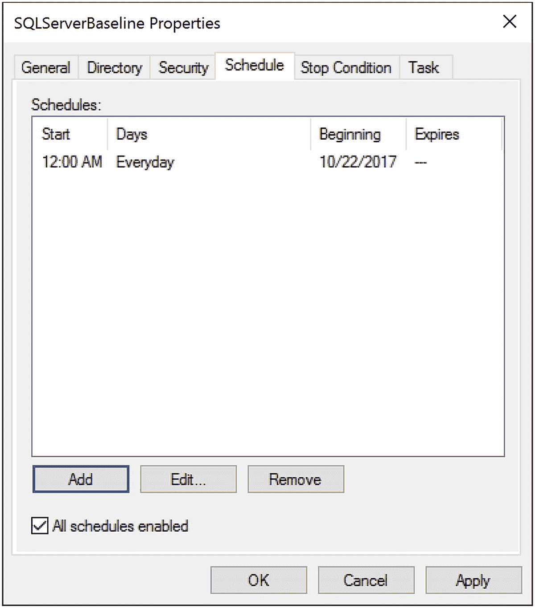

# 5. 创建基线

在前三章中，您了解了很多关于由内存、磁盘和 CPU 引起的各种可能的系统瓶颈。我还介绍了一些用于收集系统这些部分数据的性能监视器指标。在大多数计数器的描述中，我都提到了将您的指标与基线进行比较。本章将介绍如何收集您的指标，以便您拥有那个基线供以后比较。我将介绍如何配置一种自动化方法来收集这些信息。基线是理解系统行为的基础部分，因此您应该始终有一个可用的基线。本章涵盖以下主题：

*   监控虚拟机和托管机器的注意事项
*   如何设置性能监视器指标的自动化收集
*   使用性能监视器时避免问题的注意事项
*   Azure SQL Database 的基线
*   创建基线

## 监控虚拟机和托管机器的注意事项

在开始创建基线之前，我将讨论虚拟机（VM）。越来越多的 SQL Server 实例运行在虚拟机上。当你使用虚拟机，或者在亚马逊或微软 Azure 等远程环境中托管虚拟机时，许多标准的性能计数器将不再显示准确的信息。如果你在虚拟机内部监控这些计数器，你的数据在故障排查方面可能没有帮助。如果你在物理机上监控这些计数器（假设你可以访问它，这台物理机无疑被多个不同的虚拟机共享），你将无法识别特定的 SQL Server 实例资源瓶颈。因此，在使用虚拟机时，必须监控额外的信息。大多数你可以收集的关于磁盘和网络性能的信息在虚拟机设置中仍然适用。所有的查询度量信息对这些查询来说都是准确的。查询运行多长时间以及它有多少次读取，这些就是确切的时长和读取量。主要你会发现内存和 CPU 的度量完全不同且相当不可靠。

这是因为在虚拟化服务器环境中，CPU 和内存是在机器之间共享的。你可能在一个 CPU 上启动一个进程，却在另一个完全不同的 CPU 上完成它。一些虚拟环境实际上可以根据机器对内存需求的变化，改变分配给该机器的内存。有了这些变化，传统的监控就不再适用了。好消息是，主要的虚拟机厂商为你提供了如何监控他们的系统以及如何在他们的系统中使用 SQL Server 的指南。对于监控虚拟机的具体细节，你基本上可以依赖这些第三方文档。以两个最常见的虚拟机监控程序为例，`VMware`和`HyperV`，以下是各自的一份文档：

*   `VMware` 监控虚拟机性能 ( `http://bit.ly/1f37tEh` )
*   测量 `HyperV` 上的性能 ( `http://bit.ly/2y2U6Iw` )

队列计数器（例如处理器队列长度）在监控虚拟机内部时仍然适用。这些计数器表明虚拟机本身资源匮乏，导致你的 SQL Server 实例资源不足，不得不等待访问虚拟 CPU。重要的是要记住，在虚拟机上，CPU 和内存可能会更慢，因为虚拟机的管理介入了系统资源。由于托管资源的共享性质，你可能还会在托管虚拟机上看到更慢的 I/O。

在 Azure SQL Database 和任何 SQL Server 2016 或更高版本的实例中，还有一个内置的、自动化的基线机制，称为查询存储。我们将在第 11 章详细介绍查询存储。

另一个可用于了解系统运行情况的机制是 DMV（动态管理视图）。很难将它们与基线视为同一回事，因为它们会因缓存、重启、故障转移和其他机制而变化很大。然而，它们确实提供了一种查看查询性能聚合视图的方法。我们将在第 6 章及本书的其余部分更详细地介绍它们。

## 创建基线

现在你已经看了一些主要的性能计数器，让我们看看如何将这些计数器组合在一起以创建系统基线。你需要遵循以下步骤：

1.  创建一个可复用的性能计数器列表。
2.  使用你的性能计数器列表创建一个计数器日志。
3.  最小化 `性能监视器` 的开销。

### 创建可复用的性能计数器列表

在与 SQL Server 系统同一网络的 Windows Server 2016 机器上运行 `性能监视器` 工具。通过 属性 ➤ 数据 ➤ 添加计数器 对话框，将性能计数器添加到 `性能监视器` 的“查看图表”显示中，如图 5-1 所示。

图 5-1：添加 `性能监视器` 计数器

例如，要添加性能计数器 `SQLServer:Latches:Total Latch Wait Time(ms)`，请按照以下步骤操作：

1.  选择“从计算机选择计数器”选项，并在相应的输入字段中指定运行 SQL Server 的计算机名称，或者，如果在本地运行 `性能监视器`，你会看到“<本地计算机>”，如图 5-1 所示。
2.  单击性能对象 `SQLServer:Latches` 旁边的箭头。
3.  从性能计数器列表中选择 `Total Latch Wait Time(ms)` 计数器。
4.  单击“添加”按钮，将此性能计数器添加到待添加计数器列表中。
5.  根据需要继续添加其他计数器。完成后，单击“确定”按钮。

在为基线创建可复用列表时，你可以重复上述步骤，添加表 5-1 中列出的所有性能计数器。

表 5-1：用于分析 SQL Server 性能的性能监视器计数器

| 对象(实例[,实例 N]) | 计数器 |
| --- | --- |
| `Memory` | `Available MBytes` `Pages/sec` |
| `PhysicalDisk`(数据盘, 日志盘) | `% Disk Time` `Current Disk Queue Length` `Disk Transfers/sec` `Disk Bytes/sec` |
| `Processor`(_Total) | `% Processor Time` `% Privileged Time` |
| `System` | `Processor Queue Length` `Context Switches/sec` |
| `Network Interface`(网卡) | `Bytes Total/sec` |
| `Network Segment` | `% Net Utilization` |
| `SQLServer:Access Methods` | `FreeSpace Scans/sec` `Full Scans/sec` |
| `SQLServer:Buffer Manager` | `Buffer cache hit ratio` |
| `SQLServer:Latches` | `Total Latch Wait Time (ms)` |
| `SQLServer:Locks`(_Total) | `Lock Timeouts/sec` `Lock Wait Time (ms)` `Number of Deadlocks/sec` |
| `SQLServer:Memory Manager` | `Memory Grants Pending` `Target Server Memory (KB)` `Total Server Memory (KB)` |
| `SQLServer:SQL Statistics` | `Batch Requests/sec` `SQL Re-Compilations/sec` |
| `SQLServer:General Statistics` | `User Connections` |

添加完所有性能计数器后，单击“确定”关闭“添加计数器”对话框。要将计数器列表保存为 `.htm` 文件，请在 `性能监视器` 的右框架中任意位置右键单击，然后选择“将设置另存为”菜单项。

这个 `.htm` 文件列出了所有的性能计数器，可以作为一组基本计数器来创建计数器日志，或者为同一台 SQL Server 机器交互式地查看 `性能监视器` 图表。要将此计数器列表用于其他 SQL Server 机器，请在记事本等编辑器中打开 `.htm` 文件，并将所有 `\\SQLServerMachineName` 实例替换为空字符串（即删除）。

Erin Stellato 在文章“自定义性能监视器的默认计数器”( `http://bit.ly/1brQKeZ` )中概述了一个捷径。还有更简单的方法来处理其中一些数据，使用微软提供的工具——日志性能分析（`PAL`），可从 `https://bit.ly/2KeJJmy` 获取。

你还可以使用此计数器列表文件，在互联网浏览器中交互式地查看 `性能监视器` 图表，如图 5-2 所示。

图 5-2：在互联网浏览器中查看 `性能监视器`

## 使用性能计数器列表创建计数器日志

性能监视器提供了一种计数器日志工具，用于在一段时间内保存多个计数器的性能数据。你可以使用性能监视器查看已保存的计数器日志，以分析性能数据。通常，从已定义的性能计数器列表创建计数器日志会非常方便。对于为服务器性能故障排查或建立基准做准备这种自动化任务来说，直接收集数据（而非通过图形界面查看）是首选方法。

在性能监视器中，展开 `数据收集器集` ➤ `用户定义的`。右键单击并选择 `新建` ➤ `数据收集器集`。定义集的名称，并通过选择相应的单选按钮进行手动创建；然后像我在图 5-3 中配置的那样，点击 `下一步`。

图 5-3：命名数据收集器集

你需要定义要收集的数据类型。在本例中，选择 `创建数据日志` 单选按钮下的 `性能计数器` 复选框，然后点击 `下一步`，如图 5-4 所示。

图 5-4：为数据收集器集选择数据日志和性能计数器

在这里，你可以使用之前图 5-1 中展示的相同 `添加计数器` 对话框来定义要收集的性能对象。点击 `下一步` 允许你定义目标文件夹。点击 `下一步`，然后选择 `打开此数据收集器集的属性` 单选按钮，并点击 `完成`。你可以安排计数器日志在特定时间自动启动，并在一段时间后或在特定时间停止。你可以通过 `计划` 窗格配置这些设置。你可以在图 5-5 中看到一个示例。

图 5-5：在数据收集器集属性中定义的计划

图 5-6 总结了已选择的计数器以及收集这些计数器的频率。

图 5-6：定义性能监视器计数器日志

## 注意

我将在下一节中针对这些设置提供额外的建议。

有关如何使用性能监视器创建计数器日志的更多信息，请参阅微软知识库文章 "Windows Server 2016 性能调整指南" (`http://bit.ly/1icVvgn`)。

## 性能监视器使用注意事项

如果使用得当，性能监视器工具旨在尽可能减少系统开销。为了最小化使用此工具对系统的影响，请考虑以下建议：

*   限制计数器数量，尤其是性能对象的数量。
*   使用计数器日志，而不是交互式地查看性能监视器图表。
*   在交互式查看图表时，远程运行性能监视器。
*   将计数器日志文件保存到不同的本地磁盘。
*   增加采样间隔。

让我们更详细地考虑每一点。

### 限制计数器数量

使用较小的采样间隔监控大量的性能计数器可能会给系统带来一定程度的开销。这种开销主要来自你正在监控的性能对象的数量，因此明智地选择它们很重要。所选性能对象的计数器数量不会增加太多开销，因为它只是提供对象本身的一个属性。因此，了解你想监控哪些对象以及为什么监控是很重要的。

### 优先使用计数器日志

使用计数器日志，而不是交互式地查看性能监视器图表，因为性能监视器绘图在开销方面成本更高。对当前活动的监控应仅限于短期数据查看、故障排查和诊断。通过计数器日志报告的性能数据是*采样*的，意味着数据是周期性收集的，而不是被跟踪，而性能监视器图表则是在事件发生时实时更新的。使用计数器日志将减少开销。

### 远程查看性能监视器图表

由于使用性能监视器图表查看实时性能数据会在系统上产生相当大的开销，请在另一台机器上远程运行该工具，并通过它连接到 SQL Server 系统。要远程连接到 SQL Server 计算机，在连接到 SQL Server 计算机所在网络的另一台计算机上运行性能监视器工具。

在 `从此计算机选择计数器` 框中，键入 SQL Server 计算机的计算机名（或 IP 地址）。请注意，如果你通过 Windows Server 2016 终端服务会话连接到生产服务器，该工具的主要部分仍将在服务器上运行。

不过，我仍然建议你避免使用性能监视器图表来查看实时数据。你可以使用这些图表来查看通过计数器日志收集的文件，并应倾向于使用这些日志。

### 将计数器日志保存在本地

收集计数器日志的性能数据不会产生显示图表的开销。因此，在使用计数器日志模式时，在 SQL Server 系统本地记录计数器值比通过网络传输性能数据更高效。将计数器日志文件放在与被监控磁盘（即你的 SQL Server 数据和日志文件所在的磁盘）不同的本地磁盘上。

然后，在收集完数据后，将该计数器日志复制到你的本地计算机进行分析。这样，你处理的只是一个副本，并且不会给存储位置增加 I/O 开销。

### 增加采样间隔

由于在基准监控期间你主要关注资源利用模式，你可以轻松地将性能数据采样间隔增加到 60 秒或更长，以减少日志文件大小并降低对磁盘 I/O 的需求。你可以使用较短的采样间隔来检测和诊断时序问题。即使在交互式查看性能监视器图表时，也要将采样间隔从默认的每秒一次采样增加。只需记住，增大或减小采样大小会影响数据的粒度以及数量。你必须仔细权衡这些选择。

## 基于基准线的系统行为分析

数据库应用程序的默认行为会随着时间因各种因素而发生变化，例如：

*   数据量与分布变化
*   用户群增长
*   应用程序使用模式改变
*   应用程序行为的新增或变更
*   新服务包或软件升级的安装
*   硬件变更

由于这些变化，为数据库服务器创建的基准线会逐渐失去其意义。将系统当前行为与旧基准线进行比较并不总是准确的。因此，重要的是通过定期创建新基准线来保持其时效性。同时，将之前的基准线日志归档也有益处，以便日后需要时可以查阅。所以，是的，虽然旧的基准线不适用于日常操作，但它们确实有助于您建立模式和长期趋势。

可以按照以下步骤，使用 `性能监视器` 工具分析基准线或系统当前行为的计数器日志：

图 5-7：定义日志分析的时间范围

1.  打开计数器日志。使用 `性能监视器` 工具栏中的 `查看日志文件数据` 项，并选择日志文件名。
2.  添加所有性能计数器以分析性能数据。请注意，只有在创建计数器日志时选择的性能对象、计数器和实例才会在选择列表中显示。
3.  通过相应地调整时间范围来分析一天中不同时段的系统行为，如图 5-7 所示。

在进行性能审查时，您可以通过比较性能计数器的当前值与最新的基准线来分析数据库的系统级行为。比较性能数据时请考虑以下几点：

*   在两种情况下使用相同的性能计数器集。
*   针对单个计数器适用的情况，比较其最小值、最大值和平均值。我之前已解释过这些计数器的具体数值。
*   如前所述，某些计数器具有绝对的好/坏值。这些计数器的当前值无需与基准线值进行比较。例如，如果 `Deadlocks/min` 计数器的当前平均值为 10，则表明系统正遭受大量死锁。虽然无需与基准线比较，但审查相应的基准线值仍然是有利的，因为您的死锁问题可能已存在很长时间。归档的基准线日志有助于检测死锁的演变发生情况。
*   某些计数器没有明确的好/坏值。因为它们的值取决于应用程序，所以必须将其与相应的基准线计数器进行相对比较。例如，`SQL Server` 的 `User Connections` 计数器的当前值并不表示应用程序有任何好坏。但将其与相应的基准线值进行比较，可能揭示用户连接数的大幅增加，表明工作负载有所上升。
*   从当前和基准线的计数器日志中比较计数器的一系列值。计数器的个别值的波动将通过值的范围来归一化。
*   比较一天中相同时段的日志。对于大多数应用程序，使用模式在一天的不同时段会有所不同。如前所述，调整计数器日志的时间范围，以获取特定时间的计数器最小值、最大值和平均值。

一旦确定了系统级瓶颈，就应该分析应用程序的内部行为以确定瓶颈原因。识别并优化瓶颈源头将有助于高效利用系统资源。

## Azure SQL Database 的基准线

正如您希望为在物理机和虚拟机上运行的 `SQL Server` 实例建立基准线一样，您也需要为 `Azure SQL Database` 的性能建立基准线。您无法捕获其的 `性能监视器` 指标。此外，`Azure SQL Database` 不被视为虚拟机或物理服务器。它是一种数据库即服务。因此，您无法测量 CPU 或磁盘使用率。相反，微软定义了一种称为数据库事务单元 (`DTU`) 的性能度量单位。您可以观察数据库的 `DTU` 行为随时间的变化。

`DTU` 被定义为 I/O、CPU 和内存的综合度量。它并不代表名称所暗示的字面事务，而是对服务内数据库性能的一种度量。您可以查询 `sys.resource_stats` 来查看 CPU 使用率和存储数据。它保留了 14 天的历史记录，并按五分钟间隔汇总数据。

虽然 `Azure 门户` 提供了观察 `DTU` 使用情况的机制，但并未提供建立基准线的机制。相反，您应使用 `Azure SQL Database` 特定的 DMV `sys.dm_db_resource_stats`。此 DMV 维护有关给定 `Azure SQL Database` 的 `DTU` 使用情况的信息。它包含以 15 分钟为间隔汇总的一小时信息。要像对待 `SQL Server` 实例一样建立基准线，您需要随时间捕获此数据。将 `sys.dm_db_resource_stats` 中显示的信息收集到表中，将是您为 `Azure SQL Database` 的性能指标建立基准线的方式。

`Azure SQL Database` 默认启用了查询存储，因此您可以使用它来了解系统上发生的情况。

## 总结

在本章中，您学习了如何使用 `性能监视器` 工具来分析 `SQL Server` 的整体行为，以及性能不佳的数据库应用程序对系统资源的影响。您还了解了作为服务器和数据库监控一部分的基准线建立。借助这些工具，您将能够理解何时偏离了标准行为。您需要定期收集基准线，以防止数据过时。

在下一章中，您将学习如何分析数据库应用程序的工作负载以进行性能调优。

