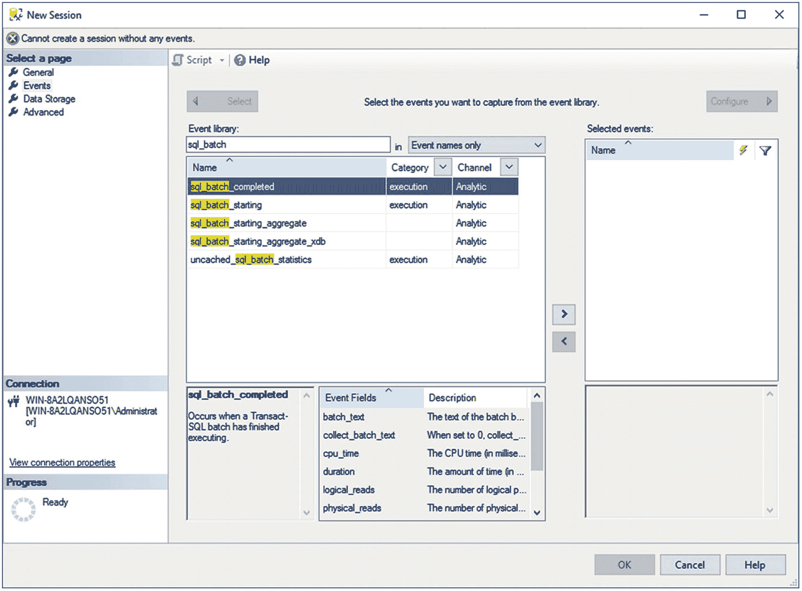
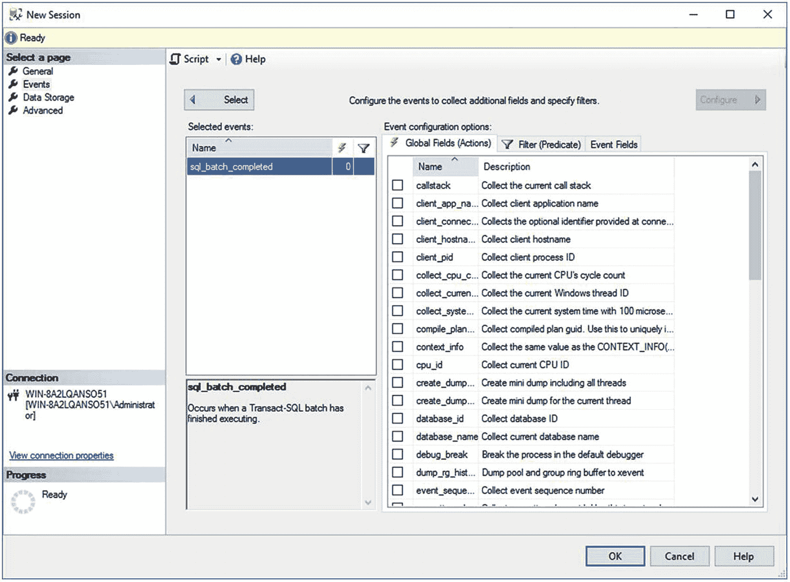
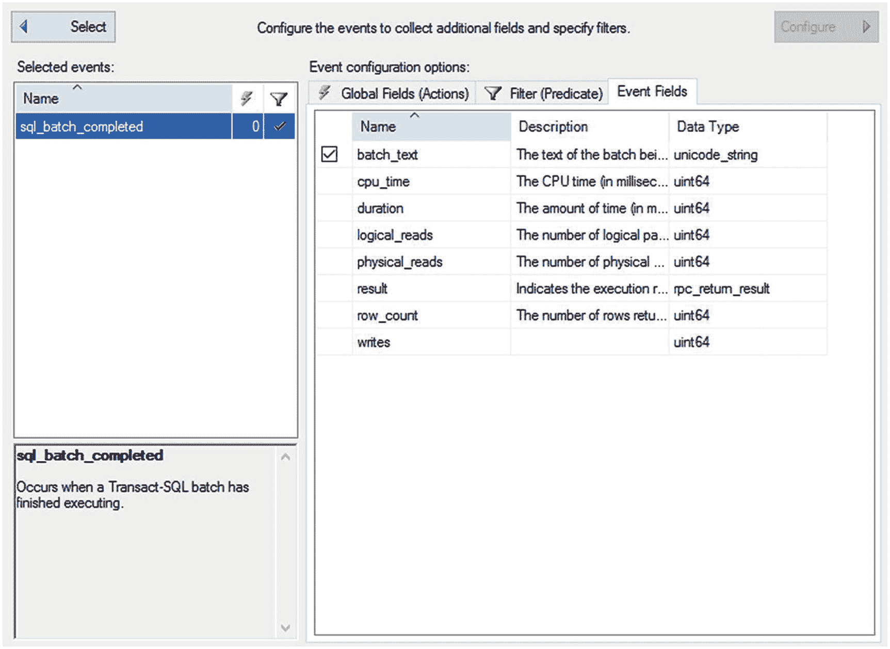

# 6. 查询性能指标

`SQL Server` 性能缓慢的一个常见原因是繁重的数据库应用程序工作负载——即查询本身的性质和数量。因此，要分析系统瓶颈的原因，检查数据库应用程序工作负载并识别对系统资源造成最大压力的 SQL 查询至关重要。为此，您可以使用 `扩展事件` 和其他 `Management Studio` 工具。

在本章中，我将涵盖以下主题：

*   `扩展事件` 的基础知识
*   如何使用 `扩展事件` 分析 `SQL Server` 工作负载并识别高成本的 SQL 查询
*   如何通过动态管理对象跟踪查询性能


## 扩展事件

扩展事件在 SQL Server 2008 中被引入，但由于没有图形界面以及需要编写相对复杂的代码来设置，它在捕获性能指标方面并未得到广泛使用。随着 SQL Server 2012 的发布，一个用于管理扩展事件的图形界面被引入，消除了阻碍扩展事件成为收集查询性能指标及其他度量指标的首选机制的最后一个障碍。作为此前收集这些指标的最佳机制，跟踪事件已被弃用，且不再处于积极开发状态。多年来，一直没有添加新的跟踪事件。SQL Server Profiler（用于生成和使用跟踪事件的图形界面）如果在生产实例上不当运行，甚至可能导致性能问题。因此，本书中的示例将主要使用扩展事件，并以查询存储作为辅助机制（查询存储在第 11 章中介绍）。

扩展事件允许您执行以下操作：

*   图形化监视 SQL Server 查询
*   在后台收集查询信息
*   分析性能
*   诊断诸如死锁等问题
*   调试 Transact-SQL (T-SQL) 语句

您还可以使用扩展事件来捕获在 SQL Server 实例上执行的其他类型的活动。您可以从图形前端或通过直接调用 T-SQL 过程来设置扩展事件。定义扩展事件会话最有效的方式是使用 T-SQL 命令，但学习会话的一个良好起点是通过图形界面。

### 扩展事件会话

您可以在 Management Studio 图形界面中找到扩展事件工具。您可以使用对象资源管理器导航到给定实例下的 **管理** 文件夹，以找到 **扩展事件** 文件夹。从那里，您可以查看系统中已构建的会话。要开始设置自己的会话，只需右键单击“会话”文件夹并选择“新建会话”。有一个向导可用于设置会话，但它实现的功能与常规图形界面并无不同，而且常规界面易于使用。此时会打开一个窗口，显示第一个页面，名为“常规”，如图 6-1 所示。


图 6-1 扩展事件的新建会话窗口，常规页面

您必须提供一个会话名称。我强烈建议为其起一个清晰的名字，以便日后查看时能明确该会话的作用。您还可以选择使用模板。模板是预定义的会话，您只需花费最少的精力即可使其工作。在“查询执行”类别下，有五个与查询调优直接相关的模板：

*   `Query Batch Sampling`：此模板将捕获服务器上所有活动会话中 20% 的查询和过程调用。
*   `Query Batch Tracking`：此模板捕获服务器上所有会话的所有查询和过程。
*   `Query Detail Sampling`：此模板包含一组事件，将捕获服务器上所有活动会话中 20% 的查询和过程内的每条语句。
*   `Query Detail Tracking`：此模板与“查询批处理跟踪”相同，但还会跟踪系统中每条单独的语句。这会产生大量数据。
*   `Query Wait Statistic`：此模板捕获服务器上所有活动会话中 20% 的每个查询和过程的每条语句的等待统计信息。

此外，还有一些模板可以模拟您习惯使用的 Profiler 模板。并且，在 SQL Server 2017 中引入了一种额外的方法，可以以最少的努力快速查看查询性能。在对象资源管理器窗格的底部有一个新文件夹，`XE Profiler`。展开该文件夹，您会发现两个扩展事件会话，它们定义了类似于您通常在 Profiler 中看到的查询监视功能。我将在本章稍后介绍这些选项打开的“实时数据”窗口。不过，现在我们先不深入这个，而是跳过模板和 `XE Profiler` 报告，自己动手设置事件，以便了解具体操作方法。

## 注意

没有免费的午餐，也没有零风险的操作。扩展事件是收集系统信息的一种比旧版跟踪事件高效得多的机制。但这并非没有成本和风险。根据您定义的事件，尤其是本章稍后将详细讨论的一些全局字段，实施扩展事件可能会对您的系统产生影响。在生产系统上使用这些事件时需谨慎行事，以确保不会造成负面影响。查询存储可以以更小的影响提供大量信息，而使用 DMO（动态管理对象，在本章稍后介绍）的影响甚至更小。这些替代方案在某些情况下是可行的。

查看新建会话窗口的第一页，除了命名会话外，还有许多其他选项。您必须决定是否希望会在服务器启动时自动启动。长时间收集性能指标会产生大量数据，您将不得不处理这些数据。您还可以决定是否希望在创建会话后立即启动它，以及是否希望查看实时数据。最后，最后一个选项是确定是否要跟踪事件因果关系。我们将在本章后面讨论这一点。

如您所见，新建会话窗口实际上已经非常接近一个向导了。它只是缺少一个“下一步”按钮。在此处提供名称并做出其他选择后，请单击窗口左侧的下一页“事件”，如图 6-2 所示。



图 6-2 扩展事件的新建会话窗口，事件页面

`事件`代表在 SQL Server 中执行的各种活动，在某些情况下，也代表底层操作系统中的活动。围绕事件目标、事件包和事件会话有一个完整的架构，但图形界面的使用意味着您不必担心所有这些细节。我将在本章后面展示如何编写会话脚本时介绍部分架构。

对于性能分析，您主要关注那些有助于您判断在 SQL Server 上执行的各种活动所造成的资源压力级别的事件。所谓资源压力，我指的是以下事项：

*   T-SQL 活动涉及何种程度的 CPU 利用率？
*   使用了多少内存？
*   涉及多少 I/O？
*   SQL 活动执行了多长时间？
*   特定查询执行的频率如何？
*   查询遇到了哪些类型的错误和警告？

您可以在事件完成后计算 SQL 活动的资源压力，因此用于性能分析的主要事件是那些代表 SQL 活动完成的事件。表 6-1 描述了这些事件。

表 6-1 用于监视查询完成的事件

| 事件类别 | 事件 | 描述 |
| --- | --- | --- |
| 执行 | `rpc_completed` | 远程过程调用完成事件 |
|   | `sp_statement_completed` | 存储过程内的 SQL 语句完成事件 |
|   | `sql_batch_completed` | T-SQL 批处理完成事件 |
|   | `sql_statement_completed` | T-SQL 语句完成事件 |

RPC 事件表明该存储过程是通过 OLEDB 命令使用远程过程调用 (RPC) 机制执行的。如果数据库应用程序使用 T-SQL `EXECUTE` 语句执行存储过程，则该存储过程将被解析为 SQL 批处理，而不是 RPC。


## 查询性能相关事件

T-SQL 批处理是一组一起提交到 SQL Server 的 SQL 查询。T-SQL 批处理通常以`GO`命令结束。`GO`命令不是 T-SQL 语句。相反，`GO`命令由`sqlcmd`实用工具以及 Management Studio 识别，它表示一个批处理的结束。批处理中的每个 SQL 查询被视为一个 T-SQL 语句。因此，一个 T-SQL 批处理由一个或多个 T-SQL 语句组成。语句或 T-SQL 语句也是存储过程内独立的、离散的命令。使用`sp_statement_completed`或`sql_statement_completed`事件捕获单个语句可能是一个开销更大的操作，这取决于查询中单个语句的数量。假设一下，您系统中的每个存储过程都只包含一个且仅有一个 T-SQL 语句。在这种情况下，收集已完成语句的成本非常低，无论是在收集数据时对系统行为的影响，还是在收集数据所需的存储量方面。现在假设您的过程包含多个语句，并且其中一些过程是对其他带有其他语句的过程的调用。收集所有这些额外数据现在对系统来说就变成了一个更明显的负载。捕获语句的影响完全取决于您要捕获的语句的大小和数量。语句完成事件应谨慎收集，尤其是在生产系统上。您应该应用过滤器来限制这些事件的返回值。本章稍后将介绍过滤器。

要向会话添加事件，请在事件库中找到该事件。这很简单；您只需键入名称。在图 6-2 中，您可以看到`sql_batch`被键入搜索框，并且事件名称的相应部分被高亮显示。选中一个事件后，使用箭头按钮将事件从库移动到“选定事件”列表中。要删除不需要的事件，请单击箭头将其移回库中。

尽管表 6-1 中列出的事件代表了用于确定查询性能的最常用事件，但有时您也可以使用许多其他事件来诊断相同的问题。例如，如第 1 章所述，存储过程的反复重新编译会增加处理开销，这会损害数据库请求的性能。事件库中的执行类别包括一个事件`sql_statement_recompile`，用于指示语句的重新编译（此事件在第 12 章中有详细解释）。事件库还包含其他事件，用于指示数据库工作负载的其他性能相关问题。表 6-2 展示了其中一些事件。

表 6-2

```
| 事件类别 | 事件 | 描述 |
| --- | --- | --- |
| 会话 | `login``logout` | 跟踪用户连接到和断开 SQL Server 时的数据库连接。 |
|   | `existing_connection` | 表示在会话启动之前连接到 SQL Server 的所有用户。 |
| 错误 | `attention` | 表示由于客户端取消查询或数据库连接中断（包括超时）等操作导致的请求中途终止。 |
|   | `error_reported` | 当报告错误时发生。 |
|   | `execution_warning` | 表示等待语句的内存授予已超过一秒，或者语句的内存授予失败。 |
|   | `hash_warning` | 表示哈希操作中内存不足的发生。将此与捕获执行计划结合使用，以了解哪个操作出现了错误。 |
| 警告 | `missing_column_statistics` | 表示缺少列的统计信息，这些统计信息是优化器决定处理策略所必需的。 |
|   | `missing_join_predicate` | 表示在没有两个表之间的连接谓词的情况下执行查询。 |
|   | `sort_warnings` | 表示查询（如`SELECT`）中执行的排序操作无法容纳在内存中。 |
| 锁 | `lock_deadlock` | 当一个进程被选为死锁牺牲品时发生。 |
|   | `lock_deadlock_chain` | 显示导致死锁的查询链的跟踪。 |
|   | `lock_timeout` | 表示锁已超过由 SET LOCK_TIMEOUT timeout_period(ms) 设置的超时参数。 |
| 执行 | `sql_statement_recompile` | 表示必须重新编译查询语句的执行计划，原因包括执行计划不存在、强制重新编译或现有执行计划无法重用。这是在语句级别，而非批处理级别，无论该批处理是即席查询、存储过程还是准备好的语句。 |
|   | `rpc_starting` | 表示存储过程的开始。这对于识别那些已启动但因导致 Attention 事件的操作而无法完成的进程很有用。 |
|   | `Query_post_compilation_showplan` | 显示 SQL 语句编译后的执行计划。 |
|   | `Query_post_execution_showplan` | 显示 SQL 语句执行后的执行计划，包括执行统计信息。注意，此事件开销可能相当大，因此应极其节省地使用，仅在短时间内并配备良好的过滤器时使用。 |
| 事务 | `sql_transaction` | 提供有关数据库事务的信息，包括事务开始、完成和回滚等信息。 |
```


### 全局字段

一旦在事件页面上选择了感兴趣的事件，你可能需要配置一些设置，例如全局字段。在事件屏幕上，单击“配置”按钮。这将更改事件屏幕的视图，如图 6-3 所示。


图 6-3：事件页面配置部分中的全局字段选择

全局字段（在 T-SQL 中称为`actions`）代表事件的不同属性，例如与事件相关的用户、事件的执行计划、事件的一些额外资源开销以及事件的来源。这些是可以随事件一起收集的附加信息片段。它们会增加事件收集的开销。每个事件都有一组它收集的数据（我将在本章后面讨论），但这是你添加更多信息的机会。大多数时候，在可能的情况下，我尽量避免为大多数数据收集带来这种开销。但有时，这里会有一些你希望收集的信息。

要添加操作，只需单击图 6-3 所示的全局字段页面上提供的列表中的复选框。你可以不时使用额外的数据列来诊断性能不佳的原因。例如，在存储过程重新编译的情况下，事件通过`recompile_cause`事件字段指示重新编译的原因。（该字段在第 18 章中有深入解释。）一些常用的附加操作如下：

*   `plan_handle`
*   `query_hash`
*   `query_plan_hash`
*   `database_id`
*   `client_app_name`
*   `transaction_id`
*   `session_id`

其他信息可作为事件字段的一部分获得。例如，`binary_data`和`integer_data`事件字段提供关于给定 SQL Server 活动的特定信息。例如，在游标的情况下，它们指定了请求的游标类型和创建的游标类型。尽管这些附加字段的名称在很大程度上表明了它们的用途，但我将在后续章节中随着你的使用来解释这些全局字段的实用性。

### 事件筛选器

除了为扩展事件会话定义事件和操作外，你还可以定义各种筛选条件。这有助于保持会话输出较小，这通常是个好主意。你可以为事件字段或全局字段添加筛选器。你还可以选择希望每个筛选器是`OR`还是`AND`，以进一步控制筛选方法。你可以决定比较运算符，例如小于、等于等等。最后，你设置比较的值。所有这些都将用于筛选捕获的事件，减少你处理的数据量，并可能减少系统上的负载。表 6-3 描述了在性能分析期间你可能常用的筛选条件。

表 6-3：SQL 跟踪筛选器

| 事件 | 筛选条件示例 | 用途 |
| --- | --- | --- |
| `sqlserver.username` | = <某个值> | 仅捕获单个用户或登录名的事件。 |
| `sqlserver.database_id` | = <要监视的数据库的 ID> | 过滤掉由其他数据库生成的事件。你可以根据数据库名称确定其 ID，如下所示：`SELECT DB_ID('AdventureWorks20012')`。 |
| `duration` | >= 200 | 对于性能分析，你通常会捕获大工作负载的跟踪。在大型跟踪中，会有很多持续时间小于你感兴趣值的事件日志。过滤掉这些事件日志，因为几乎没有优化这些 SQL 活动的范围。 |
| `physical_reads` | >= 2 | 这类似于持续时间筛选器的标准。 |
| `sqlserver.session_id` | = <要监视的数据库用户> | 用于排查特定服务器会话发送的查询。 |

图 6-4 显示了在会话窗口中选择上述筛选条件的片段。


图 6-4：在会话窗口中应用的筛选器

如果你查看图 6-4 中的“字段”值，你会注意到它写的是`sqlserver.session_id`。这是因为有不同的数据集可供你使用，并且它们通过所引用数据的类型进行限定。在这种情况下，我特指`sqlserver.session_id`。但我可能指的是来自 SQL OS 或甚至是扩展事件包本身的东西。

### 事件字段

标准事件字段随事件类型自动包含。表 6-4 显示了你用于性能分析的一些常见操作。

表 6-4：用于查询分析的操作命令

| 数据列 | 描述 |
| --- | --- |
| `Statement` | 来自`rpc_completed`事件的 SQL 文本。 |
| `Batch_text` | 来自`sql_batch_completed`事件的 SQL 文本。 |
| `cpu_time` | 事件的 CPU 成本，单位为微秒（mc）。例如，`SELECT`语句的 CPU = 100 表示该语句执行花费了 100mc。 |
| `logical_reads` | 为事件执行的逻辑读取次数。例如，`SELECT`语句的 logical_reads = 800 表示该语句总共需要 800 次页面读取。 |
| `Physical_reads` | 为事件执行的物理读取次数。这可能与`logical_reads`值不同，因为访问了磁盘子系统。 |
| `writes` | 为事件执行的逻辑写入次数。 |
| `duration` | 事件的执行时间，单位为毫秒（ms）。 |

每个逻辑读和写都由内存中 8KB 页面活动组成，这可能需要零次或多次物理 I/O 操作。你可以通过单击图 6-5 中显示的“事件字段”选项卡来查看任何给定事件的字段。


图 6-5：显示了“配置”中“事件字段”选项卡的“新建会话”窗口

一些事件字段是可选的，但大多数字段随事件自动包含。你可以决定是否要包含可选字段。在图 6-5 中，你可以通过单击`batch_text`字段旁边的复选框来排除它。

### 数据存储

在新建会话窗口的下一个页面，即“选择页面”窗格中的“数据存储”，用于确定如何处理会话生成的数据。输出机制被称为 `target`。你有两种基本选择：将信息输出到文件，或者仅使用缓冲区来捕获事件。有七种不同的输出类型，但其中大多数**超出了本书的范围**。出于收集性能信息的目的，你将使用 `event_file` 或 `ring_buffer`。你应该仅对缓冲区使用小数据集，因为它会消耗内存。由于它使用系统内的内存，缓冲区的构建方式是为了避免压垮系统内存，它会选择丢弃事件，因此使用缓冲区时更有可能丢失信息。在大多数监控查询性能的情况下，你应该将会话的输出捕获到文件中。

你必须选择你的 `target`，如图 6-6 所示。


图 6-6

新建会话窗口中的数据存储窗口

你应该在系统上指定一个合适的存储位置。你还可以决定是否使用多个文件、使用多少个文件以及这些文件是否滚动更新。所有这些都属于管理决策，作为处理环境和 SQL 查询监控工作的一部分，你必须处理这些决策。你可以**全天候**运行此会话，但必须准备好处理大量数据，具体取决于你创建的筛选条件有多严格。

除了缓冲区或文件之外，你还有其他输出选项，但它们通常保留用于特殊类型的监控，对于查询性能调优通常不是必需的。

### 完成会话

一旦定义了存储，你就设置了会话所需的所有内容。还有一个“高级”页面，但在大多数系统上，你确实不需要修改其默认设置。当你单击“确定”时，会话将被创建。如果你在第一个选项卡中指示会在创建后启动会话，它将立即启动，但无论是否启动，它都将存储在服务器上。扩展事件会话的优点之一是它们存储在服务器上，因此你可以根据需要打开和关闭它们，而无需重新创建会话。会话是永久存储的，直到你移除它们，甚至会在重启后保留，尽管根据你会话的配置方式，你可能需要在必要时重新启动它们。

假设你既没有自动启动会话，也没有选择实时查看数据选项，你可以对刚刚创建的会话执行这两项操作。右键单击该会话，你会看到一个操作菜单，包括“启动会话”、“停止会话”和“查看实时数据”。如果你启动了会话并选择了观察输出，你应该会在 Management Studio 中看到一个新窗口出现，显示你正在捕获的事件。这些事件来自与写入磁盘的缓冲区相同的缓冲区，因此你可以实时查看事件。请参阅图 6-7 以查看实际操作。


图 6-7

向导创建的扩展事件会话的实时输出

你可以看到窗口顶部的事件，显示事件类型以及事件的日期和时间。单击顶部的事件将在屏幕底部打开随事件一起捕获的字段。如你所见，我一直在谈论的所有信息都可供你使用。另外，如果你对分割输出不满意，可以右键单击某一列，然后从上下文菜单中选择“在表中显示列”。这会将它移动到屏幕顶部，将所有信息显示在一个位置，如图 6-8 所示。


图 6-8

“语句”列已添加到表中。

你还可以通过此界面打开收集到的文件，并用它浏览数据。你可以在收集的数据中搜索某一列中的内容，按列排序，以及按字段分组。查看对特定查询的所有调用汇总的一种好方法是使用 `query_hash`，这是一个可以添加到数据收集中的全局字段。GUI 提供了很多方法来操作你收集的信息。

通过 GUI 查看此信息并浏览文件是可以的，但你会想要自动化创建这些会话。这就是下一节要介绍的内容。

### 内置的 system_health 会话

SQL Server 内置了一个名为 `system_health` 的扩展事件会话，默认情况下自动运行。它主要用作观察系统整体运行状况以及收集内部错误和诊断信息的机制。然而，它也会自动捕获一些在我们讨论查询性能调优时有用的信息。

默认情况下，开箱即用，它会在死锁发生时收集完整信息。死锁绝对是一个性能问题，并在第 22 章中介绍。`system_health` 扩展事件会话意味着我们无需做任何其他工作即可开始诊断死锁情况。

`system_health` 会话会捕获任何等待闩锁超过 15 秒的进程的 `sql_text` 和 `session_id`。该信息对于立即识别可能需要调优的查询非常有用。你还会获得任何等待锁超过 30 秒的查询的 `sql_text` 和 `session_id`。同样，这是一种立即识别哪些查询可能需要调优的方法，除了搜索 `system_health` 信息外无需做其他工作。

因为这只是另一个会话，你完全控制它，甚至可以从系统中删除它，虽然我当然不推荐这样做。它在 5MB 文件中收集其信息，并保留一组滚动的四个文件。你将无法通过此信息回溯到服务器安装的起点，但它应该包含服务器最近的记录。文件默认与其他日志文件位于同一位置。你可以这样找到位置：

```sql
SELECT path
FROM sys.dm_os_server_diagnostics_log_configurations;
```

通过该位置，你可以查询会话或在“实时数据”资源管理器窗口中打开它，如图 6-9 所示。


图 6-9

system_health 扩展事件会话中的 wait_info 事件

图 6-9 中显示的事件是 `wait_info` 事件，它显示我的一个进程等待获取锁超过 30 秒。`sql_text` 字段将显示有问题的查询。如你所见，从性能调优的角度来看，这是无价的信息。最重要的是，它现在就在你的系统上可用。你无需进行任何设置。

## 扩展事件自动化

使用图形用户界面来构建会话并定义要捕获的事件确实让操作变得简单，但不幸的是，这种模式无法扩展。如果你需要管理多台服务器，并为它们创建会话以捕获关键的查询性能指标，你肯定不想连接到每一台服务器并通过图形界面来选择事件、输出等。尤其是考虑到出错的可能性时。相反，学会直接通过 T-SQL 来操作会话要好得多。这将使你能够构建一个可以在系统中多台服务器上运行的会话。更棒的是，你会发现直接构建会话在某些方面比使用图形界面更容易，并且你将更深入地了解这些进程是如何工作的。

## 使用图形界面创建会话脚本

你可以通过两种方式之一来创建脚本化跟踪：手动或使用图形界面。在你熟悉脚本的所有要求之前，简单的方法是使用扩展事件图形界面。你需要执行以下步骤：

1.  定义一个会话。
2.  右键单击该会话，选择 `将会话脚本化为`、`创建到`，然后选择 `文件` 以直接输出到文件。或者，使用“新建会话”窗口顶部的 `脚本` 按钮，在查询窗口中创建一个 T-SQL 命令。

这些步骤将生成创建会话所需的脚本并将其输出到文件。

要手动创建这个新跟踪，请按如下方式使用 Management Studio：

1.  打开脚本文件或导航到查询窗口。
2.  修改服务器路径和文件位置，以适应你正在创建此会话的服务器。
3.  执行脚本。

会话创建完成后，你可以使用以下命令启动它：

```sql
ALTER EVENT SESSION QueryMetrics
ON SERVER
STATE = START;
```

你可能希望通过 SQL Agent 来自动化执行最后一步，或者你甚至可以使用 `sqlcmd.exe` 实用程序从命令行运行脚本。无论你使用哪种方法，最后一步都将启动会话。要停止会话，只需运行相同的脚本，并将 `STATE` 设置为 `stop`。我将在下一节展示如何做到这一点。

## 使用 T-SQL 定义会话

如果你按照上一节的步骤创建了脚本，你会在查询编辑器窗口中看到类似这样的内容：

```sql
CREATE EVENT SESSION [QueryMetrics]
ON SERVER
ADD EVENT sqlserver.sql_batch_completed
(SET collect_batch_text = (1)
WHERE ([sqlserver].[database_name] = N'AdventureWorks2017')
)
ADD TARGET package0.event_file
(SET filename = N'q:\PerfData\QueryMetrics')
WITH
(
MAX_MEMORY = 4096KB,
EVENT_RETENTION_MODE = ALLOW_SINGLE_EVENT_LOSS,
MAX_DISPATCH_LATENCY = 30 SECONDS,
MAX_EVENT_SIZE = 0KB,
MEMORY_PARTITION_MODE = NONE,
TRACK_CAUSALITY = OFF,
STARTUP_STATE = OFF
);
GO
```

要创建一个扩展事件会话，只需使用一条命令 `CREATE EVENT SESSION` 来定义会话。然后，你只需在该命令中使用 `ADD EVENT` 来定义会话。筛选器只是添加到每个事件定义中的 `WHERE` 子句。最后，你添加一个目标，定义捕获的数据应存储在何处。`WITH` 子句实际上只是图形界面中“高级”页面的默认值。你可以省略 `WITH` 子句及其值，它们仍然会为会话设置。

会话定义完成后，你可以使用前面展示的 `ALTER EVENT` 来激活它。

一旦会话在服务器上启动，你就不必再保持 Management Studio 或查询编辑器打开。你可以使用动态管理视图 `sys.dm_xe_sessions` 来识别活动会话，如以下查询所示：

```sql
SELECT  dxs.name,
        dxs.create_time
FROM    sys.dm_xe_sessions AS dxs;
```

图 6-10 显示了该视图的输出。


**图 6-10**

`sys.dm_xe_sessions` 的输出

返回的行数表示 SQL Server 上活动的会话数。除了我在本章创建的那个会话之外，我还有另外四个运行中的会话，它们都是系统默认的。你可以通过执行存储过程 `ALTER EVENT SESSION` 来停止特定会话。

```sql
ALTER EVENT SESSION QueryMetrics
ON SERVER
STATE = STOP;
```

要验证会话是否成功停止，请重新执行对目录视图 `sys.dm_xe_sessions` 的查询，并确保视图的输出中不再包含该命名的会话。

使用脚本创建会话允许你在大量服务器上实现自动化。使用脚本来启动和停止会话意味着你可以通过计划事件（例如通过 SQL Agent）来控制它们。在第 20 章，你将学习如何在长时间捕获 SQL 工作负载活动时控制会话的计划。

## 注意

如本节所示定义的会话所捕获的时间是以微秒而非毫秒存储的。单位之间的这种差异如果不加以考虑，可能会导致混淆。你必须基于微秒进行筛选。

## 使用因果跟踪

无论是通过图形界面还是 T-SQL 定义会话都相当简单。消费这些信息也相当容易。然而，你很快会发现你不仅想观察单个批处理语句或单个过程调用。你想看到一个过程内的所有语句以及过程调用本身。你想看到语句级的重新编译、等待以及所有其他类型的事件，并让它们都直接关联回单个存储过程或语句。这就是 `因果跟踪` 的用武之地。

如前所述，你可以通过图形界面启用因果跟踪，也可以将其包含在 SQL 命令中。以下脚本捕获远程过程调用的开始和停止，以及这些调用内的所有语句。我还启用了因果跟踪。

```sql
CREATE EVENT SESSION ProcedureMetrics
ON SERVER
ADD EVENT sqlserver.rpc_completed
    (WHERE (sqlserver.database_name = N'AdventureWorks2017')),
ADD EVENT sqlserver.rpc_starting
    (WHERE (sqlserver.database_name = N'AdventureWorks2017')),
ADD EVENT sqlserver.sp_statement_completed
    (SET collect_object_name = (1))
ADD TARGET package0.event_file
    (SET filename = N'C:\PerfData\ProcedureMetrics.xel')
WITH
(
    TRACK_CAUSALITY = ON
);
```

## 扩展事件建议

扩展事件在信息收集方式上是一个巨大的变革，以前使用跟踪事件时出现的许多问题区域在很大程度上已被消除。你不再需要像以前那样过分担心严重限制收集的事件数量或返回的字段数量。但是，如前所述，过度加载收集的事件仍然可能对系统产生负面影响。仍然有一些特定领域需要注意。

*   适当设置最大文件大小。
*   谨慎使用调试事件。
*   避免使用 `No_Event_Loss`。

我将在以下各节中更详细地讨论这些内容。

## 适当设置最大文件大小

文件的默认值为 1GB。考虑到扩展事件可以收集的信息量，这实际上非常小。建议将此数字设置得高得多，大约在 50GB 到 100GB 的范围内，以确保你有足够的空间来捕获信息，并且不会因为缓冲区已满而等待文件子系统为你创建文件。这可能导致事件丢失。但这确实取决于你的系统。如果你对预期的输出量有很好的把握，请根据你的具体环境设置更合适的文件大小。


### 谨慎使用调试事件

扩展事件不仅为你提供了一种观察 SQL Server 行为及其内部机制的方式，其能力远超跟踪事件，而且微软在排查 SQL Server 故障时也使用相同的功能。有许多事件与 SQL Server 调试相关。这些事件默认不通过向导提供，但你可以通过 T-SQL 命令访问它们，并且可以通过会话编辑器窗口中的通道选择来启用它们。

如果没有微软的直接指导，请不要使用它们。它们可能会发生变化，并且仅供微软内部使用。如果你确实觉得有必要进行实验，则需要密切关注任何包含**中断操作**的事件。这意味着如果事件触发，它将在引发事件的确切代码行处停止 SQL Server。这将导致你的服务器完全离线并处于未知状态。如果在生产系统中这样做，可能会导致重大中断。这可能导致数据丢失和数据库损坏。

不过，并非所有事件都会导致中断操作，有些甚至被推荐使用。一个例子是 `query_thread_profile` 事件。运行此事件能够让你以轻量级的方式捕获实时执行计划事件。我们将在第 15 章讨论执行计划时详细介绍这一点。

### 避免使用 No_Event_Loss

扩展事件的设置使得某些事件可能会丢失。根据设计，这极有可能发生。但是，在配置会话时，你可以使用一个设置 `No_Event_Loss`。如果你在已经负载较重的系统上这样做，可能会看到系统负载显著增加，因为你实际上是在告诉它无论后果如何都要在缓冲区中保留信息。对于针对特定行为的小型且专注的会话，这种方法是可以接受的。

## 其他查询性能指标收集方法

建立扩展事件会话允许你收集大量数据供后续使用，但收集过程可能有点耗费资源。此外，你必须等待结果，然后还要处理大量数据。另一种总体成本较低的机制是查询存储。我们将在第 11 章详细介绍它。如果你需要立即捕获有关系统的性能指标，特别是与查询性能相关的指标，那么用于查询的动态管理视图 `sys.dm_exec_query_stats` 和用于存储过程的 `sys.dm_exec_procedure_stats` 正是你所需要的。如果你仍然需要历史追踪查询运行时间及其各自成本，扩展事件会话仍然是最佳工具。但如果你只是想知道此时此刻运行时间最长的查询或物理读取最多的查询，那么你可以从这两个动态管理对象中获取该信息。但是，这些对象中的数据依赖于查询计划保留在缓存中。如果计划老化退出缓存，这些数据就会消失。`sys.dm_exec_query_stats` DMO 将返回所有查询（包括存储过程）的结果，而 `sys.dm_exec_procedure_stats` 将仅返回存储过程的信息。

由于这两个 DMO 只是视图，你可以简单地查询它们，获取服务器上计划缓存中查询的统计信息。表 6-5 显示了从 `sys.dm_exec_query_stats` DMO 返回的一些数据。

表 6-5 只是一个示例。完整详情请参阅在线手册。

**表 6-5: sys.dm_exec_query_stats 输出**

| 列名 | 描述 |
| --- | --- |
| `Plan_handle` | 指向执行计划的指针 |
| `Creation_time` | 计划创建的时间 |
| `Last_execution_time` | 计划上次被查询使用的时间 |
| `Execution_count` | 计划已被使用的次数 |
| `Total_worker_time` | 计划自创建以来使用的总 CPU 时间 |
| `Total_logical_reads` | 计划自创建以来使用的逻辑读总数 |
| `Total_logical_writes` | 计划自创建以来使用的逻辑写总数 |
| `Query_hash` | 可用于识别具有相似逻辑的查询的二进制哈希值 |
| `Query_plan_hash` | 可用于识别具有相似逻辑的计划的二进制哈希值 |
| `Max_dop` | 查询使用的最大并行度 |
| `Max_columnstore_segment_skips` | 查询期间跳过的列存储段数量 |

要筛选从 `sys.dm_exec_query_stats` 返回的信息，你需要将其与其他动态管理函数连接，例如 `sys.dm_exec_sql_text`（显示与计划关联的查询文本）或 `sys.dm_exec_query_plan`（包含查询的执行计划）。一旦连接到这些其他 DMO，你就可以按想要查看的数据库或过程进行筛选。这些其他 DMO 在本书其他章节中有详细介绍。我将在本书的其余部分展示结合使用 `sys.dm_exec_query_stats` 和其他 DMO 的示例。请记住，这些查询依赖于缓存。当给定的执行计划老化退出缓存时，此信息将会丢失。

## 总结

在本章中，你了解到可以使用扩展事件来识别 SQL 工作负载中导致系统资源高压力的查询。收集会话数据可以并且应该使用系统存储过程实现自动化。要立即访问有关正在运行的查询的统计信息，请使用 DMV `sys.dm_exec_query_stats`。

既然你有了收集系统上运行的查询指标的机制，在下一章中，你将探索如何在查询运行时收集信息，这样你就不必每次运行查询时都诉诸于这些测量工具。

