# 7. 分析查询性能

上一章展示了如何收集查询性能指标。本章将展示如何使用这些指标来识别长时间运行或频繁调用的查询。然后，我将介绍 Management Studio 中内置的工具，以便你能理解特定查询的执行情况。我还将花大量时间讨论如何使用执行计划，这是你深入了解查询优化器所做决策的最佳途径。

在本章中，我将涵盖以下主题：

*   如何使用 Management Studio 分析昂贵 SQL 查询的处理策略
*   如何分析 SQL 查询中查询优化器使用的方法
*   如何使用 T-SQL 命令测量 SQL 查询的成本


## 高成本查询

既然你已经看到了两种收集查询性能指标的不同方法，现在让我们看看这些数据代表什么：高成本查询本身。当 SQL Server 的性能变差时，很可能发生了以下几件事。

首先，某些查询给系统资源造成了高压力。这些查询会影响整个系统的性能，因为服务器无法足够快速地处理其他 SQL 查询。

此外，高成本查询会阻塞所有其他请求相同数据库资源（用于修改数据，而非读取数据）的查询，从而进一步降低那些查询的性能。优化高成本查询不仅能提高它们自身的性能，还能通过减少数据库阻塞和 SQL Server 资源压力来提升其他查询的性能。

数据或传递给查询的值发生变化，可能导致查询行为改变，从而降低其性能。

最后，一个本身成本不高的查询如果每分钟被调用数千次，由于次优代码的简单累积，也可能导致主要的资源瓶颈。

要开始确定你需要花时间处理哪些查询，你将使用我目前谈到过的资源。例如，假设查询在缓存中，你将能够使用 DMO 来汇总有意义的数据，以确定成本最高的查询。或者，因为你已经使用扩展事件捕获了查询，所以可以访问该数据作为识别最高成本查询的手段。另一种可能的选择是 SQL Server 2016 引入的查询存储；你可以使用查询存储来捕获和检查查询性能指标。我们将在第 11 章详细探讨该机制。

这里我们将从扩展事件开始。捕获查询指标最简单、最直接的方式是针对当前在缓存中的查询使用 DMO。不幸的是，这是聚合数据，并且完全依赖于当前缓存中的内容（我们将在第 16 章更多讨论缓存），因此你没有历史记录，也无法获得存储过程的单个测量值和单个参数值。查看查询指标的第二种最简单且同样直接的方法是使用查询存储。它提供了比 DMO 更完整的记录，但其中的数据也是聚合的。我们将探讨这三种方法，但为了精确起见，我们将从扩展事件开始。

关于扩展事件数据的一点小提示：如果数据要收集到文件中，那么你需要将数据加载到表中或直接查询它。你可以通过使用此系统函数查询扩展事件文件来直接读取：

```sql
SELECT module_guid,
package_guid,
object_name,
event_data,
file_name,
file_offset,
timestamp_utc
FROM sys.fn_xe_file_target_read_file('C:\Sessions\QueryPerformanceMetrics*.xel',
NULL,
NULL,
NULL);
```

所需参数首先是路径，我已经提供了。你可以像我一样使用 `*` 来处理存在多个滚动文件的情况。第二个参数是 SQL Server 2008R2 的遗留物，可以忽略。第三个参数允许你选择一个初始文件名；否则，如果你像我这样做，它将读取路径下的所有文件。最后，最后一个参数允许你指定一个偏移量，以便你可以（如果愿意）跳过某些事件。它只是一个数字，所以你无法真正过滤事件；只能计数到你想开始的那个。

该查询将每个事件作为一行返回。关于事件的数据存储在 XML 列 `event_data` 中。你需要使用 XQuery 直接读取数据，但一旦读取，你就可以搜索、排序和聚合捕获的数据。我将在下一节引导你完成此机制的完整示例。

### 识别高成本查询

SQL Server 的目标是在最短时间内将结果集返回给用户。为此，SQL Server 有一个内置的基于成本的优化器，称为 `query optimizer`，它会生成一个经济高效的策略，称为 `query execution plan`。`query optimizer` 权衡许多因素，包括（但不限于）执行查询所需的 CPU、内存和磁盘 I/O 的使用情况，这些都源自各种来源，例如由索引维护或动态生成的统计数据、数据约束以及有关查询运行系统的一些知识，例如 CPU 数量和内存量。优化器根据所有这些信息创建一个经济高效的执行计划。

在会话返回的数据中，`cpu_time` 和 `logical_reads` 或 `physical_reads` 字段也显示了查询在哪些方面让你付出代价。`cpu_time` 字段表示执行查询所使用的 CPU 时间。两个 `reads` 字段表示查询操作的页数（大小为 8KB），从而表明查询引起的内存或 I/O 压力大小。它们也表明磁盘压力，因为在操作查询的情况下内存页需要备份，在首次数据访问期间需要填充，并在内存瓶颈期间被置换到磁盘。查询的逻辑读取次数越高，对磁盘造成的潜在压力就越大。过多的逻辑页也会增加 CPU 管理这些页的负载。这不是自动关联的。你不能总是指望读取次数最多的查询就是性能最差的查询。但它是一个通用指标，也是一个很好的起点。尽管最小化 I/O 数量不是经济高效计划的必需条件，但你通常会发现成本最低的计划通常具有最少的 I/O，因为 I/O 操作是昂贵的。

导致大量逻辑读取的查询通常会在相应大量的数据上获取锁。即使是读取（相对于写入）也可能需要在所有数据上放置共享锁，具体取决于隔离级别。这些查询会阻塞所有其他为了修改数据（而不是读取数据）而请求此数据（或部分数据）的查询。由于这些查询本质上是成本高昂的，并且需要长时间执行，因此它们会在很长一段时间内阻塞其他查询。被阻塞的查询随后会导致对更多查询的阻塞，在数据库中引入一系列阻塞链。（第 13 章涵盖锁模式。）

因此，识别高成本查询并首先优化它们是有意义的，从而实现以下目标：

*   提升高成本查询自身的性能
*   降低对系统资源的整体压力
*   减少数据库阻塞

高成本查询可以分为以下两种类型：

*   `单次执行`：单个查询执行成本高昂。
*   `多次执行`：查询本身可能成本不高，但重复执行会对系统资源造成压力。

你可以使用不同的方法来识别这两种类型的高成本查询，如下节所述。

### 成本高昂的单次执行查询

您可以通过分析会话输出文件、使用查询存储或查询 `sys.dm_exec_query_stats` 来识别高成本查询。在本例中，我们将从识别执行大量逻辑读取的查询开始，因此您应该按 `logical_reads` 数据列对会话输出进行排序。您可以更改为按持续时间或 CPU 排序，甚至以有趣的方式组合它们。您可以通过以下步骤访问会话信息：

1.  捕获包含典型工作负载的会话。
2.  将会话输出保存到文件。
3.  通过“文件”->“打开”打开文件，并选择 `.xel` 文件以使用数据浏览器窗口。在其中对信息进行排序。
4.  或者，您可以查询跟踪文件进行分析，按 `logical_reads` 字段排序。

```sql
WITH    xEvents
AS (SELECT    object_name AS xEventName,
              CAST (event_data AS XML) AS xEventData
    FROM      sys.fn_xe_file_target_read_file('C:\Sessions\QueryPerformanceMetrics*.xel',
                                              NULL, NULL, NULL)
    )
SELECT  xEventName,
        xEventData.value('(/event/data[@name="duration"]/value)[1]',
                         'bigint') Duration,
        xEventData.value('(/event/data[@name="physical_reads"]/value)[1]', 'bigint') PhysicalReads,
        xEventData.value('(/event/data[@name="logical_reads"]/value)[1]',
                         'bigint') LogicalReads,
        xEventData.value('(/event/data[@name="cpu_time"]/value)[1]',
                         'bigint') CpuTime,
        CASE xEventName
          WHEN 'sql_batch_completed'
          THEN xEventData.value('(/event/data[@name="batch_text"]/value)[1]',
                                'varchar(max)')
          WHEN 'rpc_completed'
          THEN xEventData.value('(/event/data[@name="statement"]/value)[1]',
                                'varchar(max)')
        END AS SQLText,
        xEventData.value('(/event/data[@name="query_hash"]/value)[1]',
                         'binary(8)') QueryHash
INTO    Session_Table
FROM    xEvents;
SELECT  st.xEventName,
        st.Duration,
        st.PhysicalReads,
        st.LogicalReads,
        st.CpuTime,
        st.SQLText,
        st.QueryHash
FROM    Session_Table AS st
ORDER BY st.LogicalReads DESC;
```

让我们稍微分解一下这个查询。首先，我创建了一个名为 `xEvents` 的公用表表达式（CTE）。我这样做只是因为它使代码更容易阅读。它没有从根本上改变任何行为。当我需要从文件读取并转换数据类型时，我更喜欢这样做。然后我下面语句中的 XML 查询就更有意义了。注意，我在从文件读取时使用了通配符 `QueryPerformanceMetrics*.xel`。这使我能够读取扩展事件会话创建的所有滚动文件（更多详情，请参见第 6 章）。

根据收集的数据量和文件大小，直接对从扩展事件收集的文件运行查询可能异常缓慢。在这种情况下，请使用相同的基本函数 `sys.fn_xe_file_target_read_file` 将数据加载到表中，而不是直接查询。完成后，您可以对表应用索引以加快查询速度。我使用前面的脚本将数据放入表中，然后查询该表以获取输出。这对于测试来说可以正常工作，但对于更永久的解决方案，您需要有一个专门的数据库来存储这种类型的数据，表具有适当的结构，而不是像我这里使用 `INTO` 这样的快捷方式。

在某些情况下，您可能从系统监视器输出中识别出 CPU 承受巨大压力。CPU 压力可能源于大量的 CPU 密集型操作，例如存储过程重新编译、聚合函数、数据排序、哈希联接等。在这种情况下，您应该按 `cpu_time` 字段对会话输出进行排序，以识别占用大量处理器周期的查询。

### 成本高昂的多次执行查询

正如前面提到的，有时一个查询本身可能成本不高，但同一查询多次执行的累积效应可能会给系统资源带来压力。在这种情况下，按 `logical_reads` 字段排序将无助于识别此类高成本查询。相反，您希望了解多次执行该查询的总读取次数、总 CPU 时间或累计持续时间。

*   查询会话输出并按您感兴趣的一些值进行分组。
*   查询查询存储中的信息。
*   访问 `sys.dm_exec_query_stats` DMO 以从生产服务器检索信息。这假设您处理的问题是最近发生的或不依赖于已知历史记录，因为此数据仅是当前过程缓存中的内容。

如果您正在寻找数据的准确历史视图，可以转到您使用扩展事件收集的指标或查询存储中的信息，具体取决于您清除该数据的频率（更多内容见第 11 章）。查询存储具有聚合数据，可用于此类调查。但是，它只有聚合信息。如果您还想要详细的单次调用信息，您将需要回到使用扩展事件。

将会话数据导入数据库表后，执行 `SELECT` 语句以查找同一查询的多次执行执行的总读取次数，如下所示：

```sql
SELECT COUNT(*) AS TotalExecutions,
       st.xEventName,
       st.SQLText,
       SUM(st.Duration) AS DurationTotal,
       SUM(st.CpuTime) AS CpuTotal,
       SUM(st.LogicalReads) AS LogicalReadTotal,
       SUM(st.PhysicalReads) AS PhysicalReadTotal
FROM Session_Table AS st
GROUP BY st.xEventName, st.SQLText
ORDER BY LogicalReadTotal DESC;
```

前面脚本中的 `TotalExecutions` 列指示查询执行的次数。`LogicalReadTotal` 列指示查询的多次执行执行的逻辑读取总数。

通过这种方法识别的高成本查询比通过会话识别的单次执行的高成本查询更能指示负载。例如，一个需要 50 次读取的查询可能执行 1,000 次。该查询本身可能被认为是足够廉价的，但查询执行的读取总数结果为 50,000（= 50 × 1,000），这不能被认为是廉价的。将该查询优化以减少每次执行 10 次读取，可将总读取次数减少 10,000（= 10 × 1,000），这可能比优化一个具有 5,000 次读取的单次查询更有益。

这种方法的问题在于，大多数查询在 `WHERE` 子句中会有一组不同的条件，或者过程调用会传入不同的值。这使得按带参数的查询或过程进行简单分组变得不可能。您可以采用多种方法来解决这个问题。因为您拥有扩展事件，您实际上可以利用它为您工作。例如，`rpc_completed` 事件将过程名捕获为一个字段。您可以简单地按该字段分组。对于批处理，您可以添加 `query_hash` 字段，然后按其分组。另一种方法是清理数据，移除参数值，如 Microsoft 开发者网络 [`http://bit.ly/1e1I38f`](http://bit.ly/1e1I38f) 上所述。尽管它是为 SQL Server 2005 编写的，但这些概念适用于直到 SQL Server 2017 的其他 SQL Server 版本。

从 `sys.dm_exec_query_stats` 视图获取相同信息，只需针对 DMV 进行查询即可。


SELECT s.TotalExecutionCount,
t.text,
s.TotalExecutionCount,
s.TotalElapsedTime,
s.TotalLogicalReads,
s.TotalPhysicalReads
FROM
(
SELECT deqs.plan_handle,
SUM(deqs.execution_count) AS TotalExecutionCount,
SUM(deqs.total_elapsed_time) AS TotalElapsedTime,
SUM(deqs.total_logical_reads) AS TotalLogicalReads,
SUM(deqs.total_physical_reads) AS TotalPhysicalReads
FROM sys.dm_exec_query_stats AS deqs
GROUP BY deqs.plan_handle
) AS s
CROSS APPLY sys.dm_exec_sql_text(s.plan_handle) AS t
ORDER BY s.TotalLogicalReads DESC;
```

利用执行 DMO 提供的数据的另一种方法是使用 `query_hash` 和 `query_plan_hash` 作为聚合机制。虽然一个给定的存储过程或参数化查询可能会传入不同的值，但这些查询的 `query_hash` 和 `query_plan_hash` 值在大多数情况下是相同的。这意味着你可以针对这些哈希值进行聚合，以识别那些否则无法看到的通用执行计划或通用查询模式。以下只是对前一个查询稍作修改：

```
SELECT s.TotalExecutionCount,
t.text,
s.TotalExecutionCount,
s.TotalElapsedTime,
s.TotalLogicalReads,
s.TotalPhysicalReads
FROM
(
SELECT deqs.query_plan_hash,
SUM(deqs.execution_count) AS TotalExecutionCount,
SUM(deqs.total_elapsed_time) AS TotalElapsedTime,
SUM(deqs.total_logical_reads) AS TotalLogicalReads,
SUM(deqs.total_physical_reads) AS TotalPhysicalReads
FROM sys.dm_exec_query_stats AS deqs
GROUP BY deqs.query_plan_hash
) AS s
CROSS APPLY
(
SELECT plan_handle
FROM sys.dm_exec_query_stats AS deqs
WHERE s.query_plan_hash = deqs.query_plan_hash
) AS p
CROSS APPLY sys.dm_exec_sql_text(p.plan_handle) AS t
ORDER BY TotalLogicalReads DESC;
```

这比收集会话数据所需的所有工作要简单得多，以至于你可能会疑惑为什么还要使用扩展事件。主要原因是，正如我在本章开头所写，精确性。`sys.dm_exec_query_stats` 视图是针对某个执行计划在内存中存在期间的累计聚合数据。而扩展事件会话则是针对你运行它的任何时间范围的历史跟踪记录。你甚至可以将扩展事件的会话结果添加到数据库中。有了这份数据列表，你可以以更精确的方式生成有关事件的总汇，而不是简单地依赖某个特定时间点。然而，请理解，大量的性能问题故障排查都侧重于服务器最近发生的情况，并且由于 `sys.dm_exec_query_stats` 基于缓存，该 DMV 通常反映了系统的近期状况，因此 `sys.dm_exec_query_stats` 极其重要。但是，如果你处理的是更具体的、当前究竟是什么运行缓慢的问题，你会使用 `sys.dm_exec_requests`。

你会发现，在易用性方面，查询存储与 DMO 视图是一样的。然而，由于其中的信息不依赖于缓存，它可能比 DMO 数据更有用。不过，与 DMO 视图类似，查询存储也没有扩展事件会话那样的详细记录。

### 识别运行缓慢的查询

由于用户的体验受其请求响应时间的严重影响，你应该定期监控传入 SQL 查询的执行时间，并找出运行缓慢查询的响应时间，创建一个查询性能基线。如果运行缓慢查询的响应时间（或持续时间）变得不可接受，那么你就应该分析性能下降的原因。然而，并非每个性能不佳的查询都是由资源问题引起的。其他问题，如阻塞，也可能导致查询性能缓慢。阻塞将在第 12 章详细讨论。

要识别运行缓慢的查询，只需修改针对会话数据的查询，更改排序依据，如下所示：

```
WITH xEvents
AS (SELECT object_name AS xEventName,
CAST(event_data AS XML) AS xEventData
FROM sys.fn_xe_file_target_read_file('Q:\Sessions\QueryPerformanceMetrics*.xel', NULL, NULL, NULL)
)
SELECT xEventName,
xEventData.value('(/event/data[@name="duration"]/value)[1]', 'bigint') Duration,
xEventData.value('(/event/data[@name="physical_reads"]/value)[1]', 'bigint') PhysicalReads,
xEventData.value('(/event/data[@name="logical_reads"]/value)[1]', 'bigint') LogicalReads,
xEventData.value('(/event/data[@name="cpu_time"]/value)[1]', 'bigint') CpuTime,
xEventData.value('(/event/data[@name="batch_text"]/value)[1]', 'varchar(max)') BatchText,
xEventData.value('(/event/data[@name="statement"]/value)[1]', 'varchar(max)') StatementText,
xEventData.value('(/event/data[@name="query_plan_hash"]/value)[1]', 'binary(8)') QueryPlanHash
FROM xEvents
ORDER BY Duration DESC;
```

对于一个运行缓慢的系统，你应该在优化过程前后记录下运行缓慢查询的持续时间。应用了优化技术之后，你应该评估其对系统的总体影响。你的优化步骤可能对其他查询产生了不利影响，使它们变得更慢。


## 执行计划

一旦你识别出了一个代价高昂的查询，就需要找出其代价高昂的原因。你可以从扩展事件、查询存储视图或 `sys.dm_exec_procedure_stats` 中识别出代价高的存储过程；在 SQL Server Management Studio 中重新运行它；并查看查询优化器所使用的执行计划。执行计划展示了查询优化器用来执行查询的处理策略（包括多个中间步骤）。

为了创建一个执行计划，查询优化器会评估索引、统计信息、约束和连接策略的各种排列组合。由于潜在的计划数量可能非常庞大，这个优化过程可能需要很长时间才能生成最具成本效益的执行计划。为了防止对执行计划的过度优化，优化过程被划分为多个阶段。每个阶段都是一组转换规则，用于评估与优化过程直接相关的各种数据库对象和设置，最终试图找到一个“足够好”的计划，而非一个“完美的计划”。正是“足够好”与“完美”之间的这种差异，可能导致因执行计划优化不足而产生的性能问题。查询优化器在仅仅采用当前成本最低的计划（这被称为 `timeout`）之前，只会尝试有限次数的优化。

在完成一个阶段后，查询优化器会检查所得计划的预估代价。如果查询优化器确定该计划的代价足够低，它就会采用该计划，而无需经历剩余的优化阶段。然而，如果计划的代价仍然不够低，优化器将进入下一个优化阶段。我将在第 `15` 章更深入地介绍执行计划的生成过程。

SQL Server 以多种形式显示查询执行计划，并且有两种不同类型。SQL Server 2017 中最常用的形式是图形化执行计划和 XML 执行计划。实际上，图形化执行计划只是为屏幕显示而解析的 XML 执行计划。两种类型的执行计划分别是估计执行计划和实际执行计划。`估计`计划代表查询优化器的输出结果，而 `实际`计划则是相同的计划加上一些运行时指标。估计计划的妙处在于它不需要实际执行查询。这两种类型的计划可能不同，但仅当执行期间发生语句级重新编译时才会如此。大多数情况下，这两种类型的计划是相同的。主要区别在于实际计划中包含了一些估计计划中没有的执行统计信息。

图形化执行计划使用图标来表示查询的处理策略。要获取图形化的估计执行计划，请选择“查询” ➤ “显示估计的执行计划”。XML 执行计划包含与图形化计划相同的数据，但格式更便于程序化访问。此外，借助 SQL Server 的 XQuery 功能，可以像查询表一样查询 XML 执行计划。XML 执行计划由 `SET SHOWPLAN_XML` 语句（用于估计计划）和 `SET STATISTICS XML` 语句（用于实际执行计划）生成。你也可以右键单击图形化执行计划并选择“显示执行计划 XML”。你还可以使用 DMO（动态管理对象）`sys.dm_exec_query_plan` 直接从计划缓存中提取计划。存储在缓存中的计划没有运行时信息，因此从技术上讲，它们是估计计划。存储在查询存储中的计划也是如此。

## 注意

你应确保数据库设置为兼容性级别 140，以便它能准确反映 SQL Server 2017 的更新。

你可以使用 `SET SHOWPLAN_XML` 命令获取先前识别出的代价最高查询的估计 XML 执行计划，如下所示：

```
USE AdventureWorks2017;
GO
SET SHOWPLAN_XML ON;
GO
SELECT soh.AccountNumber,
sod.LineTotal,
sod.OrderQty,
sod.UnitPrice,
p.Name
FROM Sales.SalesOrderHeader soh
JOIN Sales.SalesOrderDetail sod
ON soh.SalesOrderID = sod.SalesOrderID
JOIN Production.Product p
ON sod.ProductID = p.ProductID
WHERE sod.LineTotal > 20000;
GO
SET SHOWPLAN_XML OFF;
GO
```

运行此查询会生成一个指向执行计划的链接，而不是执行计划或任何数据。单击该链接将打开执行计划。虽然该计划将以图形化计划的形式显示，但右键单击该计划并选择“显示执行计划 XML”将显示 XML 数据。`图 7-1` 显示了 XML 执行计划输出的一部分。


`图 7-1` XML 执行计划输出


### 分析查询执行计划

让我们从上一节中识别出的昂贵查询开始。将其（去掉 `SET SHOWPLAN_XML` 语句）复制到 Management Studio 的查询窗口中。我们可以通过单击“显示估计的执行计划”按钮或按下 `Ctrl+L` 立即捕获一个执行计划。你将在图 7-2 中看到该执行计划。

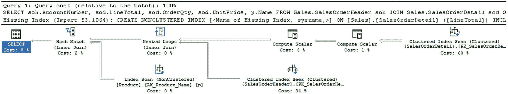
图 7-2: 查询执行计划

执行计划展示了两种不同的信息流。从左侧读起，你可以看到逻辑流，从 `SELECT` 运算符开始，依次经过每个执行步骤。从右侧开始并反向读取，则是信息的物理流，首先从 `聚集索引扫描` 运算符拉取数据，然后进入后续的每个步骤。大多数情况下，按照数据物理流的方向阅读更易于理解执行计划中发生的事情，但并非总是如此。有时，理解执行计划中发生什么的唯一方法是按照逻辑处理顺序，从左到右阅读。每个步骤代表为获取查询最终输出而执行的一项操作。

执行计划的一个重要方面是其中显示的值。有许多值我们将在本书中用到，但最直观明显的是 `成本`，它显示了估计的成本百分比。你可以在图 7-2 中看到它。左侧的 `SELECT` 运算符的 `成本` 值为 0%，而右侧的 `聚集索引扫描` 操作的 `成本` 值为 60%。这些成本应被视为简单的成本单位。它们不是任何类型性能的字面度量。它们是查询优化器分配或计算的值。名义上，它们代表了 I/O 和 CPU 使用的数学构造。然而，它们并不代表字面上的 I/O 和 CPU 使用。这些值始终是估计值，单位就是简单的成本单位。这是我们需要首先确立的一个至关重要的理解方面。

执行计划所代表的查询执行的某些方面如下：

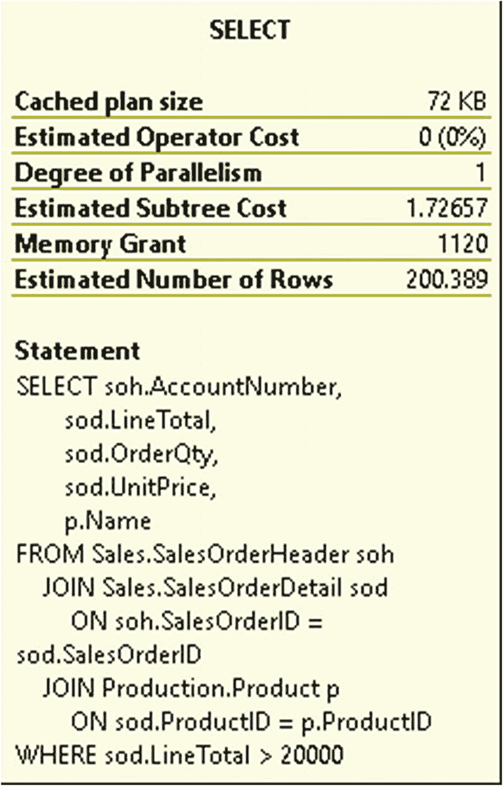
图 7-3: 来自执行计划运算符的工具提示窗口

*   如果一个查询由一批多个查询组成，则每个查询的执行计划将按执行顺序显示。批次中的每个执行计划都有一个相对的估计成本，整个批次的总成本为 100%。

*   执行计划中的每个图标代表一个运算符。它们各自都有一个相对的估计成本，执行计划中所有节点的总成本为 100%。（尽管统计信息的不准确，甚至 SQL Server 中的错误，可能导致你看到超过 100% 的成本，但这主要出现在旧版本的 SQL Server 中。）

*   通常，执行计划中的第一个物理运算符代表从数据库对象（表或索引）检索数据的机制。例如，在图 7-2 的执行计划中，三个起点代表从 `SalesOrderHeader`、`SalesOrderDetail` 和 `Product` 表中检索数据。

*   数据检索通常是表操作或索引操作。例如，在图 7-2 的执行计划中，所有三个数据检索步骤都是索引操作。

*   对索引的数据检索将是索引扫描或索引查找。例如，你可以在图 7-2 中看到一个聚集索引扫描、一个聚集索引查找和一个索引扫描。

*   对索引进行数据检索操作的命名规范是 `[表名].[索引名]`。

*   计划的逻辑流是从左到右，就像阅读英文书籍一样。数据在运算符之间从右向左流动，并通过运算符之间的连接箭头表示。

*   运算符之间连接箭头的粗细代表了传输行数的图形化表示。

*   同一列中两个运算符之间的连接机制将是嵌套循环连接、哈希匹配连接、合并连接或自适应连接（添加到 SQL Server 2017 和 Azure SQL Database 中）。例如，在图 7-2 所示的执行计划中，有一个哈希连接和一个循环连接。（连接机制稍后将更详细地介绍。）

*   将鼠标悬停在执行计划中的节点上会显示一个包含一些详细信息的弹出窗口。工具提示大多数情况下并不是非常有用。图 7-3 显示了一个示例。


图 7-4: 选择运算符属性

*   有关运算符的完整详细信息可在 `属性` 窗口中找到，如图 7-4 所示，你可以通过右键单击运算符并从上下文菜单中选择 `属性` 来打开该窗口。

*   运算符详细信息在顶部显示物理和逻辑操作类型。物理操作代表存储引擎实际使用的操作，而逻辑操作是优化器用于构建估计执行计划的构造。如果逻辑和物理操作相同，则只显示物理操作。它还显示其他有用的信息，例如行数、I/O 成本、CPU 成本等。

*   阅读许多运算符上的属性可能是必要的，以了解查询在 SQL Server 内是如何执行的，从而更好地知道如何调整该查询。

值得注意的是，在 SQL Server 2017 Management Studio 生成的实际执行计划中，你还可以看到查询的执行时间统计信息作为查询计划的一部分。它们在图 7-4 的 `QueryTimeStats` 部分可见。这提供了一种衡量查询性能的附加机制。当等待统计信息超过 1 毫秒时，你也可以在执行计划中看到等待统计信息。任何少于该时间的等待都不会显示在执行计划中。


## 识别执行计划中的高开销步骤

执行计划中最直接的方法是找出哪些步骤相对开销较高。这些步骤是您进行查询优化的起点。您可以采用以下技术来选择起始步骤：

*   执行计划中的每个节点都显示了其在整个执行计划中的相对估计开销，整个计划的总开销为 100%。因此，请重点关注相对开销最高的节点。例如，图 7-2 中的执行计划有一个步骤的估计开销为 59%。
*   一个执行计划可能来自一批语句，因此您可能还需要找出估计开销最高的语句。在图 7-2 中，您可以在计划顶部看到文本“Query 1”。在批处理情况下，会有多个计划，并且它们将按在批处理中发生的顺序编号。
*   观察节点之间连接箭头的粗细。粗的连接箭头表示在相应节点之间传输的行数很多。分析箭头左侧的节点，以理解为什么它需要这么多行。同时检查箭头的属性。您可能会看到估计行数与实际行数不同。这可能是由于统计信息过时等原因造成的。如果您在计划的大部分区域看到粗箭头，而在末尾看到细箭头，则可能可以通过修改查询或索引，以便在计划更早的阶段完成过滤。
*   寻找哈希连接操作。对于小的结果集，嵌套循环连接通常是首选的连接技术。本章后面将详细介绍哈希连接与嵌套循环连接的比较。请记住，哈希连接不一定不好，循环连接也不一定就好。这确实取决于查询返回的数据量。
*   寻找键查找操作。对大结果集的查找操作可能导致大量随机读取。我将在第 11 章更详细地介绍键查找。
*   可能存在警告，由某个运算符上的感叹号指示，这些是需要立即关注的区域。这些可能由多种问题引起，包括缺少连接条件的连接，或缺少统计信息的索引或表。通常，解决警告情况将有助于提升性能。
*   寻找执行排序操作的步骤。这表明数据未按正确的排序顺序检索。同样，这可能不是问题，但它是一个潜在问题的指标，可能是缺失或不正确的索引。使用 `ORDER BY` 确保数据按指定方式排序没有问题，但排序可能导致性能下降。
*   注意那些可能给系统带来额外负载的运算符，例如表假脱机。它们对于查询的操作可能是必要的，也可能表明查询编写不当或索引设计不佳。
*   并行查询执行的默认开销阈值是估计开销为 5，这个值非常低。注意在不需要的地方出现并行操作。请记住，估计开销是查询优化器分配的数字，代表 CPU 和 I/O 的数学模型，而不是实际的度量值。

## 分析索引有效性

要进一步检查执行计划中的高开销步骤，您应该分析相关表或索引的数据检索机制。首先，您应检查索引操作是查找还是扫描。通常，为了获得最佳性能，您应该从表中检索尽可能少的行，而索引 `seek`（查找）通常是访问少量行最有效的方式。`scan`（扫描）操作通常表示访问了大量行。因此，通常更倾向于查找而非扫描。然而，这并不是说查找天生就好，扫描天生就坏。数据检索机制需要准确反映查询的需求。检索表中所有行的查询将从扫描中受益，而对同一查询进行查找反而会导致性能低下。这里的关键是通过检查运算符的属性来理解操作的细节，从而理解优化器做出其选择的原因。

接下来，您要确保索引机制设置正确。查询优化器会评估可用的索引，以发现哪个索引能以最高效的方式从表中检索数据。如果所需的索引不可用，优化器会使用次优的索引。为了获得最佳性能，您应始终确保在数据检索操作中使用了最佳索引。您可以通过分析节点详细信息中的“参数”部分来判断索引有效性（是否使用了最佳索引），具体检查以下内容：

*   数据检索操作
*   连接操作

让我们看看预估执行计划中 `SalesOrderHeader` 表的数据检索机制。图 7-5 显示了运算符属性。

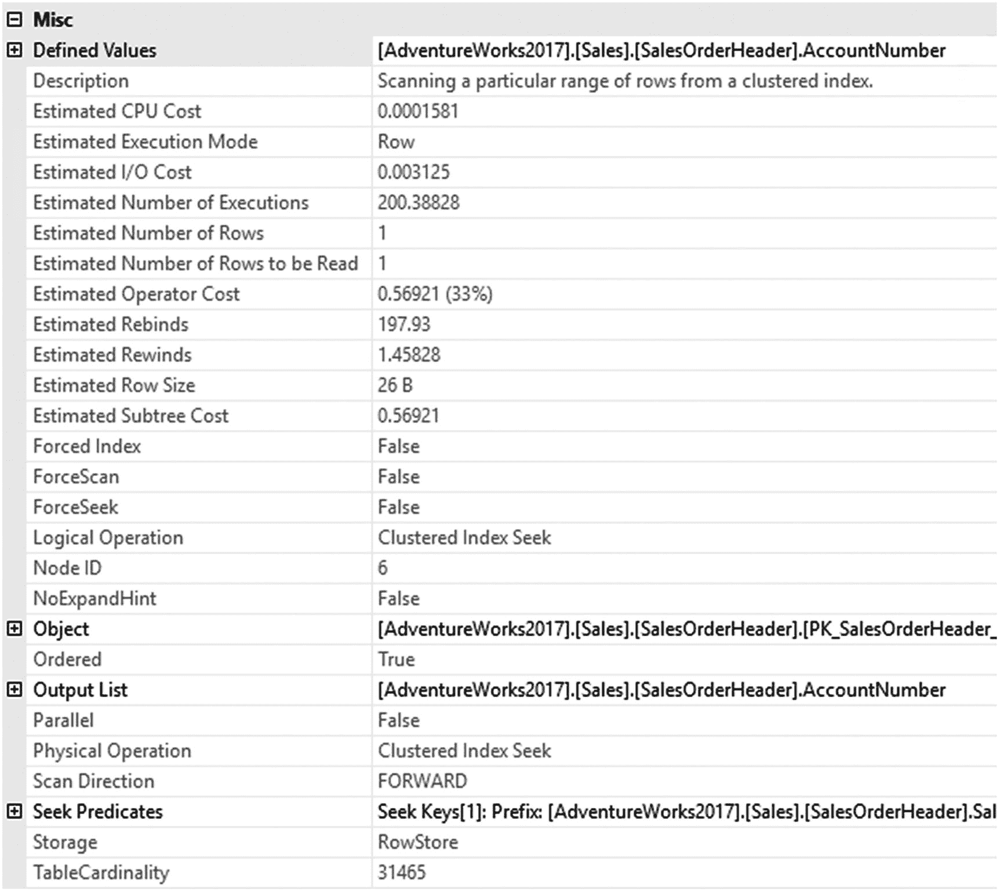

图 7-5：SalesOrderHeader 表的数据检索机制

在 `SalesOrderHeader` 表的运算符属性中，`Object` 属性指定了使用的索引 `PK_SalesOrderHeader_SalesOrderID`。它使用以下命名约定：`[数据库].[所有者].[表名].[索引名]`。`Seek Predicates`（查找谓词）属性指定了用于在索引中查找键的列。`SalesOrderHeader` 表通过 `SalesOrderld` 列与 `SalesOrderDetail` 表连接。`SEEK`（查找）之所以有效，是因为连接条件 `SalesOrderld` 是聚集索引和主键 `PK_SalesOrderHeader` 的前导列。

有时您可能会遇到不同的数据检索机制。图 7-5 中您看到的是 `Seek Predicates` 属性，而图 7-6 则显示了一个简单的谓词，表示完全不同的数据检索机制。

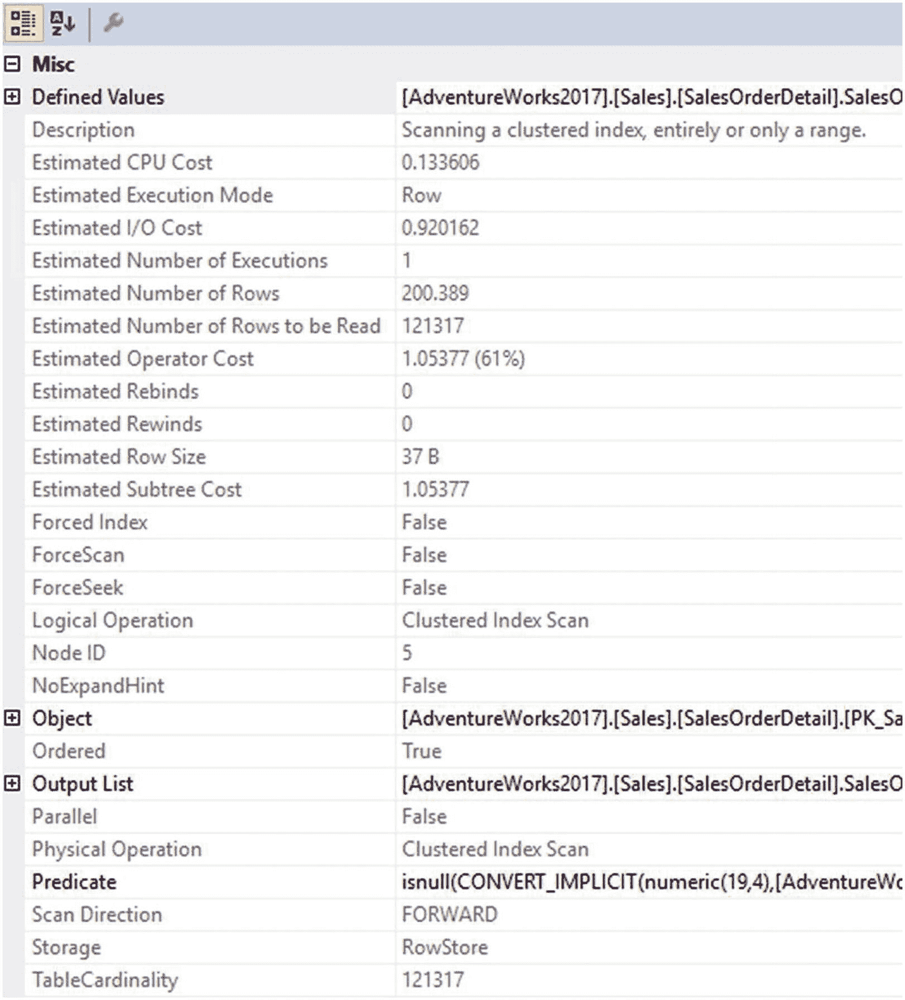

图 7-6：数据检索机制的一种变体：扫描

在图 7-6 的属性中，没有查找谓词。由于对列执行了 `ISNULL` 和 `CONVERT_IMPLICIT` 函数，必须检查整个表是否存在 `Predicate`（谓词）值。

```
isnull(CONVERT_IMPLICIT(numeric(19,4),[AdventureWorks2017].[Sales].[SalesOrderDetail].[UnitPrice] as [sod].[UnitPrice],0)*((1.0)-CONVERT_IMPLICIT(numeric(19,4),[AdventureWorks2017].[Sales].[SalesOrderDetail].[UnitPriceDiscount] as [sod].[UnitPriceDiscount],0))*CONVERT_IMPLICIT(numeric(5,0),[AdventureWorks2017].[Sales].[SalesOrderDetail].[OrderQty] as [sod].[OrderQty],0),(0.000000))>(20000.000000)
```

因为对数据执行了计算，而索引不存储计算结果，所以您无法简单地通过索引查找信息，而必须扫描所有数据，执行计算，然后检查数据是否与我们要查找的值匹配。


### 分析连接有效性

除了分析所使用的索引外，您还应该检查优化器所决定的连接策略的有效性。SQL Server 使用四种类型的连接。

-   哈希连接
-   合并连接
-   嵌套循环连接
-   自适应连接

在影响少量行的许多简单查询中，嵌套循环连接远优于哈希连接和合并连接。随着连接变得更复杂，其他连接类型会在适当的地方被使用。没有哪种连接类型天生就是坏的或错的。您主要是在寻找优化器可能选择了与手头数据不兼容的类型的地方。这通常是由优化器在决定使用哪种类型时可用的统计信息存在差异所引起的。

#### 哈希连接

要理解 SQL Server 的哈希连接策略，请考虑以下简单查询：

```sql
SELECT p.Name AS ProductName,
pc.Name AS ProductCategoryName
FROM Production.Product p
JOIN Production.ProductCategory pc
ON p.ProductSubcategoryID = pc.ProductCategoryID;
```

表 7-1 显示了两个表的索引和行数。

表 7-1
Product 和 ProductCategory 表的索引和行数

| 表 | 索引 | 行数 |
| --- | --- | --- |
| `Product` | 在 `ProductID` 上的聚集索引 | 504 |
| `ProductCategory` | 在 `ProductCategoryld` 上的聚集索引 | 4 |

图 7-7 显示了上述查询的执行计划。


图 7-7
包含哈希连接的执行计划

您可以看到优化器在两个表之间使用了哈希连接。

哈希连接将两个连接输入用作 *生成输入* 和 *探测输入*。生成输入由执行计划中的顶部输入表示，探测输入是底部输入。通常两个输入中较小的一个用作生成输入，因为它将被存储在系统上，所以优化器会尽量减少内存使用量。

哈希连接分两个阶段执行其操作：*生成阶段* 和 *探测阶段*。在最常用的哈希连接形式，即 *内存中哈希连接* 中，会扫描或计算整个生成输入，然后在内存中构建一个哈希表。来自外部输入的每一行根据为 *哈希键*（等式谓词中的列集）计算出的哈希值插入到一个哈希桶中。哈希只是一个针对相关值运行的数学构造，用于比较目的。

生成阶段之后是探测阶段。会逐行扫描或计算整个探测输入，对于每个探测行，会计算一个哈希键值。然后扫描探测输入哈希键值对应的哈希桶，并生成匹配项。图 7-8 说明了内存中哈希连接的过程。

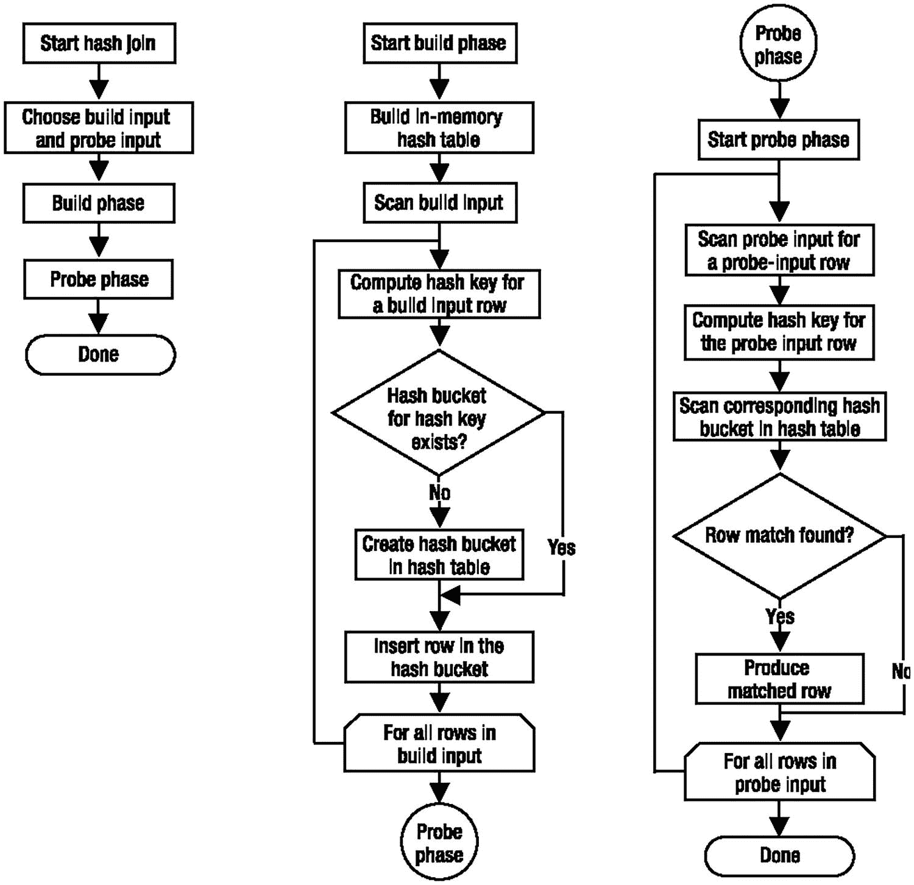
图 7-8
内存中哈希连接的工作流程

查询优化器使用哈希连接来高效处理大型、未排序、无索引的输入。现在让我们看看下一种连接类型：合并连接。

#### 合并连接

在前面的情况下，来自 `Product` 表的输入更大，并且该表在连接列（`ProductCategorylD`）上没有索引。使用以下简单查询，您可以看到不同的行为：

```sql
SELECT pm.Name AS ProductModelName,
pmpd.CultureID
FROM Production.ProductModel pm
JOIN Production.ProductModelProductDescriptionCulture pmpd
ON pm.ProductModelID = pmpd.ProductModelID;
```

图 7-9 显示了此查询的最终执行计划。


图 7-9
包含合并连接的执行计划

对于此查询，优化器在两个表之间使用了合并连接。合并连接要求两个连接输入都按连接准则定义的合并列进行排序。如果两个连接列上都有索引，则连接输入由索引排序。由于每个连接输入都是有序的，合并连接从每个输入获取一行并比较它们是否相等。如果相等，则生成一个匹配行。此过程重复，直到处理完所有行。

在数据通过索引排序的情况下，合并连接可能是最快的连接操作之一，但如果数据未排序而优化器仍选择执行合并连接，则数据必须通过一个额外的操作（排序）进行排序。这会使合并连接更慢，并在内存和 I/O 资源方面成本更高。如果内存分配不准确，并且排序溢出到 tempdb 的磁盘上，情况可能会更糟。

在这种情况下，查询优化器发现连接输入在其连接列上都是已排序（或已索引）的。您可以在 `索引扫描` 操作符的属性中看到这一点，如图 7-10 所示。

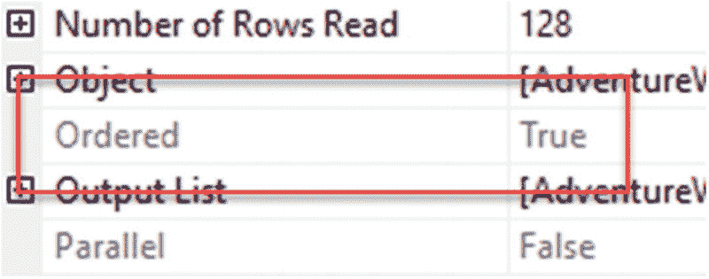
图 7-10
显示数据已排序的聚集索引扫描属性

由于数据由正在使用的索引排序，合并连接被选为此情况下比其他任何连接都更快的连接策略。


# 嵌套循环连接

接下来我要介绍的连接类型是嵌套循环连接。为了获得更好的性能，你应当始终致力于从各个表中访问有限数量的行。要理解使用较小结果集的效果，可以按如下方式减少查询中的连接输入：

```sql
SELECT pm.Name AS ProductName,
pmpd.CultureID
FROM Production.ProductModel pm
JOIN Production.ProductModelProductDescriptionCulture pmpd
ON pm.ProductModelID = pmpd.ProductModelID
WHERE pm.Name = 'HL Mountain Front Wheel';
```

图 7-11 展示了新查询的执行计划结果。


图 7-11

使用嵌套循环连接的执行计划

如你所见，优化器在两个表之间使用了嵌套循环连接。

嵌套循环连接将一个连接输入作为外部输入表，另一个作为内部输入表。外部输入表在执行计划中显示为顶部输入，内部输入表显示为底部输入表。外部循环逐行消耗外部输入表。内部循环则针对每一行外部数据，在内部输入表中搜索匹配的行。

如果外部输入非常小，而内部输入较大但已建立索引，嵌套循环连接会非常高效。在许多影响少量行的简单查询中，嵌套循环连接远优于哈希连接和合并连接。连接操作通过其他方面的牺牲来换取速度。循环连接之所以快，是因为它使用内存来获取一小部分数据并快速与第二部分数据进行比较。合并连接同样使用内存和一些 `tempdb` 来进行有序比较。哈希连接则使用内存和 `tempdb` 来构建连接的哈希表。虽然循环连接在小数据集上可能更快，但随着数据集变大或没有索引支持数据检索，它可能会变慢。这就是 SQL Server 提供不同连接机制的原因。

即使对于小的连接输入，如前面的查询，在连接列上建立索引也很重要。正如你在前面的执行计划中所看到的，对于少量行，连接列上的索引使查询优化器能够考虑采用嵌套循环连接策略。如果输入表的连接列缺少索引，将迫使查询优化器改用哈希连接。

表 7-2 总结了这三种连接类型的使用场景。

表 7-2

三种连接类型的特性

| 连接类型 | 连接列上的索引 | 连接表通常大小 | 预排序 | 连接子句 |
| --- | --- | --- | --- | --- |
| 哈希 | 内部表：无索引<br>外部表：可选<br>最佳条件：外部表小，内部表大 | 任意 | 否 | 等值连接 |
| 合并 | 两个表：必须<br>最佳条件：两者都有聚集或覆盖索引 | 大 | 是 | 等值连接 |
| 嵌套循环 | 内部表：必须<br>外部表：最好有 | 小 | 可选 | 所有 |

## 注意

在哈希连接和循环连接中，外部表通常是两个连接表中较小的那个。

我将在第 8 章介绍索引类型，包括聚集索引和覆盖索引。

# 自适应连接

自适应连接是在 Azure SQL Database 和 SQL Server 2017 中引入的。它是一种新的连接类型，可以在运行时动态选择嵌套循环连接或哈希连接。截至撰写本文时，它仅适用于列存储索引，但未来可能会改变。为了演示其效果，我将创建一个带有聚集列存储索引的表。

```sql
SELECT *
INTO dbo.TransactionHistory
FROM Production.TransactionHistory AS th;
CREATE CLUSTERED COLUMNSTORE INDEX ClusteredColumnStoreTest
ON dbo.TransactionHistory;
```

有了这个表和索引，并且我们的兼容性模式设置正确，我们就可以运行一个利用聚集列存储索引的简单查询。

```sql
SELECT p.Name,
th.Quantity
FROM dbo.TransactionHistory AS th
JOIN Production.Product AS p
ON p.ProductID = th.ProductID
WHERE th.Quantity > 550;
```

从查询中捕获实际的执行计划后，我们将看到图 7-12。

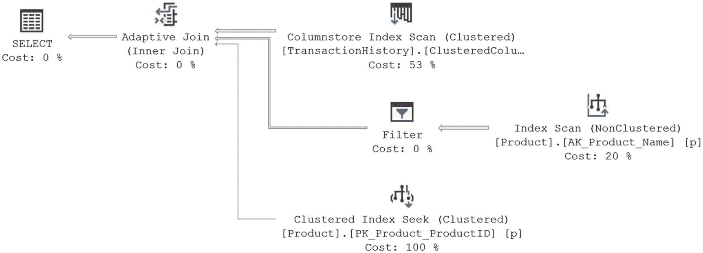

图 7-12

使用自适应连接的执行计划

自适应连接使用的哈希连接或嵌套循环连接的工作原理与前面定义的完全相同。区别在于，自适应连接可以判断在给定情况下哪种连接类型效率更高。它的工作方式是：首先构建一个隐藏的自适应缓冲区。如果超过行数阈值，行就会流入常规哈希表。剩余的行被加载到哈希表中，准备进行探测过程，正如之前描述的那样。如果所有行都加载到自适应缓冲区中，并且该数量低于行阈值，则该缓冲区将用作嵌套循环连接的外部引用。

如图 7-12 所示，每个连接在 `Adaptive Join` 算子下方显示为单独的分支。`Adaptive Join` 下方的第一个分支用于哈希连接。在本例中，`Index Scan` 算子和 `Filter` 算子满足了在需要使用哈希连接时查询的需求。`adaptive join` 下方的第二个分支用于嵌套循环连接。这里对应的是 `Clustered Index Seek` 操作。

计划被生成并存储在缓存中，包含两个可能的分支。然后，查询引擎将根据所讨论的结果集决定沿哪个分支执行。你可以通过查看 `Adaptive Join` 算子的属性来了解所做的选择，如图 7-13 所示。

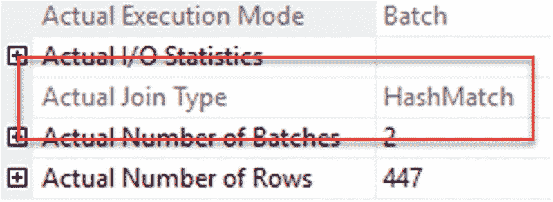

图 7-13

显示实际连接类型的自适应连接算子属性

此连接在哈希匹配和嵌套循环之间切换的阈值是在计划编译时计算的。该阈值作为 `AdaptiveThresholdRows` 与计划一起存储在属性中。当查询执行时，一旦确定满足、超过或未达到阈值，处理就会沿着自适应连接的正确分支继续进行。这个过程不需要重新编译计划。重新编译将在第 16 章进一步讨论。

当数据集的情况使得嵌套循环的性能远优于哈希匹配时，自适应连接可以显著提升性能。虽然构建哈希匹配然后不使用它会有一定的开销，但这被嵌套循环连接在小数据集上增强的性能所抵消。当数据集很大时，这个过程不会以任何方式对哈希连接操作产生负面影响。

虽然从技术上讲，这并不代表一种根本性的新型连接，但我认为，其在核心连接类型（嵌套循环和哈希匹配）之间动态切换的行为，实际上使其成为一种新的连接类型。再加上你现在有了一个新的算子，即 `Adaptive Join` 算子，并且既看不到嵌套循环也看不到哈希匹配，这确实看起来像是一种新的连接类型。


### 实际执行计划与估计执行计划

存在估计执行计划和实际执行计划。在某种程度上，它们可以互换。但是，实际执行计划则包含查询执行时的信息，特别是受影响的行数以及其他一些信息，这些信息在估计执行计划中是不可用的。这类信息可能极其有用，尤其是在试图理解统计信息估计时。因此，在优化查询时，实际执行计划是首选。

不幸的是，你并非总能访问到它们。你可能无法执行某个查询，例如在生产环境中。你可能只能访问来自缓存的计划，其中不包含运行时信息。因此，在某些情况下，你将不得不使用估计执行计划。然而，由于其中收集了运行时指标，通常更可取的做法是获取实际计划。

在其他一些情况下，估计执行计划根本无法工作。考虑以下存储过程：

```
CREATE OR ALTER PROC p1
AS
CREATE TABLE t1 (c1 INT);
INSERT INTO t1
SELECT ProductID
FROM Production.Product;
SELECT *
FROM t1;
DROP TABLE t1;
GO
```

你可以尝试使用 `SHOWPLAN_XML` 来获取查询的估计 XML 执行计划，如下所示：

```
SET SHOWPLAN_XML ON;
GO
EXEC p1 ;
GO
SET SHOWPLAN_XML OFF;
GO
```

但这会失败，并显示以下错误：

```
Msg 208, Level 16, State 1, Procedure p1, Line 249
Invalid object name 't1'.
```

由于 `SHOWPLAN_XML` 并不实际执行查询，查询优化器无法为表 (`t1`) 上的 `INSERT` 和 `SELECT` 语句生成执行计划，因为该表在查询执行前并不存在。相反，你可以使用 `STATISTICS XML`，如下所示：

```
SET STATISTICS XML ON;
GO
EXEC p1;
GO
SET STATISTICS XML OFF;
GO
```

由于 `STATISTICS XML` 会执行查询，表在查询期间被创建和访问，这一切都被执行计划捕获。图 7-14 显示了查询结果以及由 `STATISTICS XML` 提供的存储过程内两条语句的两种计划。


图 7-14

STATISTICS PROFILE 输出

### 提示

请记住在 Management Studio 中关闭 "查询" ➤ "显示估计的执行计划"，否则你将看到图形化的，而非文本化的执行计划。

### 计划缓存

访问执行计划的另一个地方是直接从它们存储的内存空间——计划缓存中读取。SQL Server 提供了动态管理视图和函数来访问此数据。缓存中存储的所有计划都是估计计划。要查看缓存中执行计划的列表，请运行以下查询：

```
SELECT p.query_plan,
t.text
FROM sys.dm_exec_cached_plans r
CROSS APPLY sys.dm_exec_query_plan(r.plan_handle) p
CROSS APPLY sys.dm_exec_sql_text(r.plan_handle) t;
```

该查询返回一个 XML 执行计划链接列表。打开其中任何一个都会显示执行计划。这些执行计划是已编译的计划，但不包含任何执行指标。利用动态管理视图提供的列进行进一步操作，将允许你搜索特定的存储过程或执行计划。

虽然缺乏运行时数据有一定局限性，但能够访问执行计划（即使是在查询执行时）对于从事性能调优工作的人来说是无价的资源。如前所述，你可能无法在生产环境中执行查询，因此能获取到任何计划都是有用的。

如第 11 章所述，你也可以从查询存储中检索计划。与存储在缓存中的计划类似，这些都是估计计划。

### 执行计划工具

虽然你刚刚开始看到执行计划的实际应用，但你只看到了理解这些计划如何工作所需工具的一部分。除了 SSMS 中以图形化计划形式呈现的 XML 信息及其固有属性外，Management Studio 还提供了一些额外的计划功能，在你探究任何特定执行计划所揭示的查询性能信息时，值得了解。

#### 查找节点

首先，你实际上可以在计划的运算符内搜索特定属性值。让我们以本章开头使用的原始查询为例，为其生成一个计划。查询如下：

```
SELECT soh.AccountNumber,
sod.LineTotal,
sod.OrderQty,
sod.UnitPrice,
p.Name
FROM Sales.SalesOrderHeader soh
JOIN Sales.SalesOrderDetail sod
ON soh.SalesOrderID = sod.SalesOrderID
JOIN Production.Product p
ON sod.ProductID = p.ProductID
WHERE sod.LineTotal > 20000;
```

生成执行计划后（使用你喜欢的任何方式），在执行计划内右键单击。会弹出一个上下文菜单，其中包含许多用于控制计划的有用资源，如图 7-15 所示。

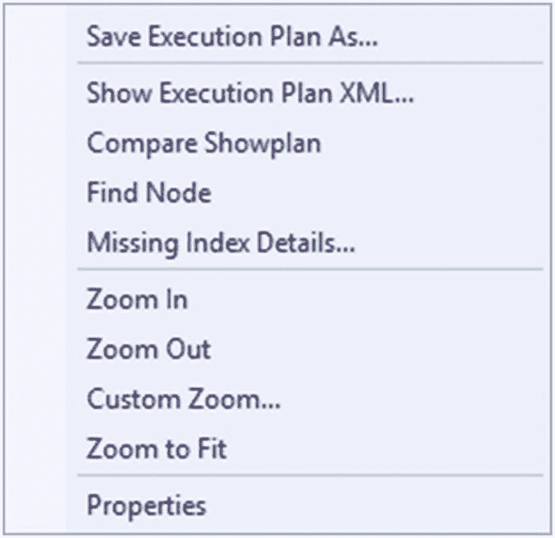

图 7-15

执行计划上下文菜单

如果我们选择 "查找节点" 菜单项，执行计划的右上角会出现一个新界面，类似于图 7-16。


图 7-16

查找节点界面

左侧是所有运算符的所有属性。你可以选择要搜索的任何属性。然后，你可以选择一个运算符。图 7-16 中显示的默认值是等于运算符。还有一个 `Contains` 运算符。最后你输入一个值。单击左箭头或右箭头将找到符合你条件的运算符。再次单击将移动到下一个（如果有的）运算符，使你能够处理庞大而复杂的执行计划，而无需自己目视搜索每个运算符的属性。

例如，我们可以查找引用了 `Product` 架构的任何运算符，如图 7-17 所示。


图 7-17

查找任何 Schema 值包含 Product 的运算符

单击右箭头将带你到第一个引用 `Product` 架构的运算符。在示例中，它将首先转到 `SELECT` 运算符，然后是 `Adaptive Join` 运算符、`Filter` 运算符，接着是 `Index Scan` 和 `Index Seek` 运算符。它唯一不会选择的运算符是 `Columnstore Index Scan`，因为它位于 `Tra``nsactionHistory` 架构中。


#### 比较计划

有时，当两个执行计划在图形化计划中不易区分时，你可能会想知道它们之间的区别是什么。如果我们运行以下查询，得到的计划看起来基本完全一样：

```sql
SELECT p.Name,
th.Quantity
FROM dbo.TransactionHistory AS th
JOIN Production.Product AS p
ON p.ProductID = th.ProductID
WHERE th.Quantity > 550;
SELECT p.Name,
th.Quantity
FROM dbo.TransactionHistory AS th
JOIN Production.Product AS p
ON p.ProductID = th.ProductID
WHERE th.Quantity > 35000;
```

这些计划实际上存在一些明显的差异，但它们看起来也很相似。仅仅通过肉眼比较来精确找出差异所在，可能会导致很多错误。相反，我们应该在一个计划中右键单击，从如图 7-15 所示的上下文菜单中选择。使用最上面的选项将其中一个计划保存到文件中。这是必要的步骤。然后，在另一个计划中再次右键单击以调出上下文菜单。选择`比较显示计划`选项。这将在`SSMS`中打开一个新窗口，其外观与图 7-18 非常相似。

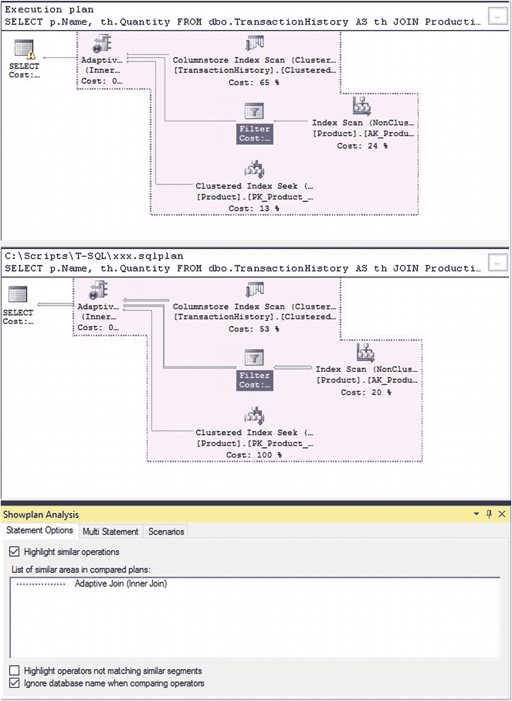

图 7-18
`SSMS`中的执行计划比较

你看到的是相似但具有明显差异的计划。以粉红色高亮显示的区域是相同的部分。计划中未高亮显示的区域（本例中是`SELECT`运算符）是较大的差异部分。你可以使用屏幕底部的`语句`选项来控制高亮显示。

此外，你可以探索运算符的属性。右键单击某个运算符并选择`属性`菜单选项，将打开一个类似于图 7-19 的窗口。

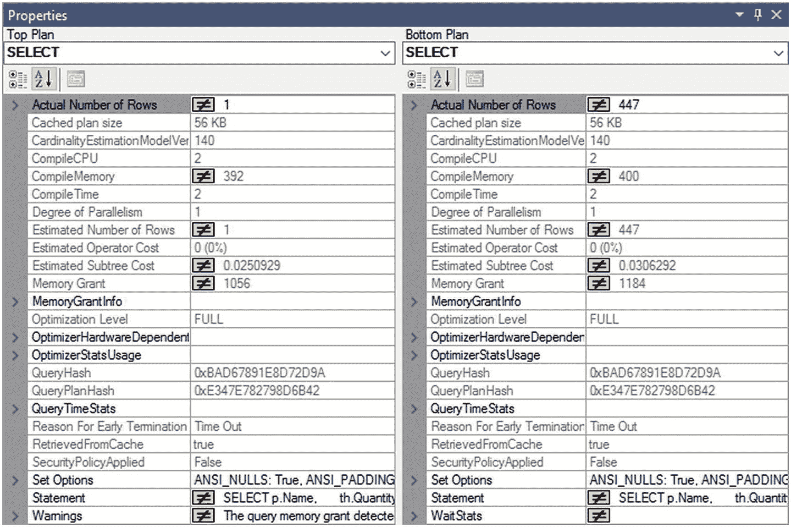

图 7-19
两个计划之间`SELECT`运算符属性的差异

你可以看到，不匹配的属性上标有醒目的黄色“不等于”符号。这使你能够轻松地找出并查看两个执行计划之间的差异。

#### 场景分析

最后，另一个新增的工具是 Management Studio 能够分析你的执行计划，并指出计划中可能存在的问题。这些被称为`场景`，列在图 7-18 所示屏幕的底部。要查看此功能的实际应用，图 7-20 展示了选中该选项卡并选中其中一个运算符的状态。


图 7-20
`显示计划分析`窗口中的“不同估算行数”场景

目前 Microsoft 仅提供一种场景，但当你阅读本书时，可能会有更多场景可用。我当前高亮显示的场景是`不同估算行数`。这与列和索引上的统计信息缺失、不正确或过时等常见问题直接相关。这是一个常见问题，我们将在本书的多个章节中解决，尤其是第 13 章。简单来说，当估算行数与实际行数存在差异时，可能会导致性能问题，因为生成的计划可能不适合实际数据。

屏幕左侧是那些估算行数与实际行数可能存在差异的运算符。右侧是关于为何突出显示此差异的说明。我们将在本书后续部分更详细地探讨这一点。

当你使用`XML STATISTICS`捕获计划，或者简单地打开包含计划的文件时，也可以进入`分析`屏幕。目前，你无法在`SSMS`中捕获计划后直接进入`显示计划分析`屏幕。


#### 实时执行计划

其官方名称为"实时查询统计信息"，但实际看到的是"实时执行计划"。自 SQL Server 2014 引入的 DMV `sys.dm_exec_query_profiles` 让你能实时查看执行计划操作，观察每个操作处理的行数。但在 SQL Server 2014 中，默认情况下其他版本也是如此，你必须捕获实际执行计划才能使用此功能。此外，查询需要运行较长时间才能看到效果。下面是一个没有 JOIN 条件、会产生笛卡尔积的查询，它需要一些时间才能完成：

```sql
SELECT *
FROM sys.columns AS c,
sys.syscolumns AS s;
```

将此查询放入一个查询窗口，并在捕获实际执行计划的同时执行它。执行过程中，在第二个查询窗口中运行此查询：

```sql
SELECT deqp.physical_operator_name,
deqp.node_id,
deqp.thread_id,
deqp.row_count,
deqp.rewind_count,
deqp.rebind_count
FROM sys.dm_exec_query_profiles AS deqp;
```

你会看到类似图 7-21 的数据。


在问题查询执行期间，反复运行对 `sys.dm_exec_query_profiles` 的查询。你会看到各个行计数持续增加。通过这种方法，你可以收集关于主动执行查询的指标。

从 SQL Server Management Studio 2016 开始，有一种更简单的方法。无需查询 DMV，你只需在包含问题查询的查询窗口中单击 **包含实时查询统计信息** 按钮。然后，当你执行查询时，视图将变为执行计划视图，但它会实时显示行计数在操作符之间的移动情况。图 7-22 显示了计划的一部分。

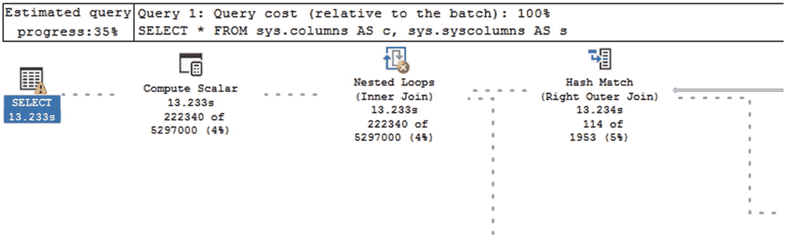

不是常见的显示数据流的箭头，你会看到移动的虚线（显然在书中看不到动态效果）。当操作完成时，虚线会变为实线，就像在常规执行计划中一样。

这是理解长时间运行查询情况的一个有用工具，但如果查询已经在执行中（例如在生产服务器上），捕获实时执行计划的要求并不方便。此外，捕获实时执行计划虽然有用，但并非没有成本。因此，SQL Server 2016 SP1 引入并适用于所有其他版本的新跟踪标志 7412。启用该跟踪标志提供了一种按需查看实时查询统计信息（即实时执行计划）的方法。你还可以创建扩展事件会话并使用 `query_thread_profile` 事件（更多内容见下一节）。当该事件会话正在运行或跟踪标志已启用时，你可以随时从 `sys.dm_exec_query_profiles` 获取信息或查看任何查询的实时执行计划。为了实际查看效果，让我们首先在系统上启用该跟踪标志。

```sql
DBCC TRACEON(7412);
```

启用后，我们将再次运行问题查询。一个我不常用但因为这个功能变得更有吸引力的工具是活动监视器。它是一种查看系统上活动的方式。通过右键单击对象资源管理器窗口中的服务器并从上下文菜单中选择 **活动监视器** 来访问它。启用跟踪标志并执行问题查询后，我系统上的活动监视器如图 7-23 所示。

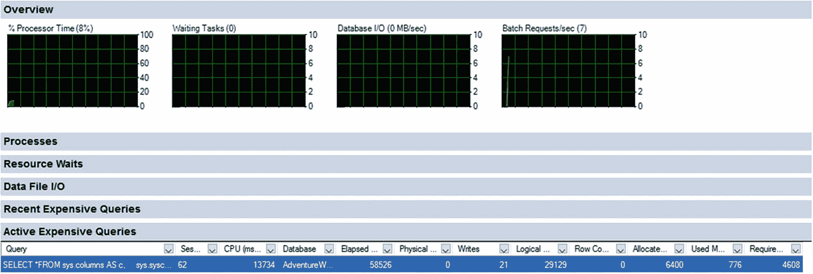

你需要单击 **活动的高代价查询** 才能看到正在运行的查询。然后，如果查询正在主动执行，你可以右键单击该查询，并选择 **显示实时执行计划**。

不幸的是，所有这些命名有些不一致。原始的 DMV 称为查询配置文件，而 SSMS 中的查询窗口使用查询统计信息，DMV 使用线程配置文件，而活动监视器则谈论实时执行计划。它们基本上意思相同：一种观察主动执行查询内操作行为的方法。有了无需首先主动捕获执行计划即可立即访问此信息的新能力，原本有点新奇的东西已经变成了一个极其有用的工具。你可以精确地看到是哪些操作拖慢了长时间运行的查询。

#### 查询线程配置文件

前面提到过，新的扩展事件 `query_thread_profile` 为系统增添了新功能。此事件是一个调试事件。如第 6 章所述，调试事件应谨慎使用。不过，微软确实提倡使用此事件。运行它将允许你查看长时间运行查询的实时执行计划。然而，它的功能不止于此。它还会在计划执行结束时捕获执行计划内所有操作符的行数和线程数。这是捕获这些指标的一种低成本且简便的方法，特别是对于运行速度快的查询，在其实时执行计划中你根本无法看到其活动行计数。这是你随执行计划一起获得的数据，但其成本远低于捕获一个计划。以下是创建会话以捕获查询线程配置文件以及核心查询指标的脚本：

```sql
CREATE EVENT SESSION QueryThreadProfile
ON SERVER
ADD EVENT sqlserver.query_thread_profile
(WHERE (sqlserver.database_name = N'AdventureWorks2017')),
ADD EVENT sqlserver.sql_batch_completed
(WHERE (sqlserver.database_name = N'AdventureWorks2017'))
WITH (TRACK_CAUSALITY = ON)
GO
```

在此会话运行期间，如果你运行一个小查询，例如我们在"执行计划工具"部分开头使用的那个，输出如图 7-24 所示。

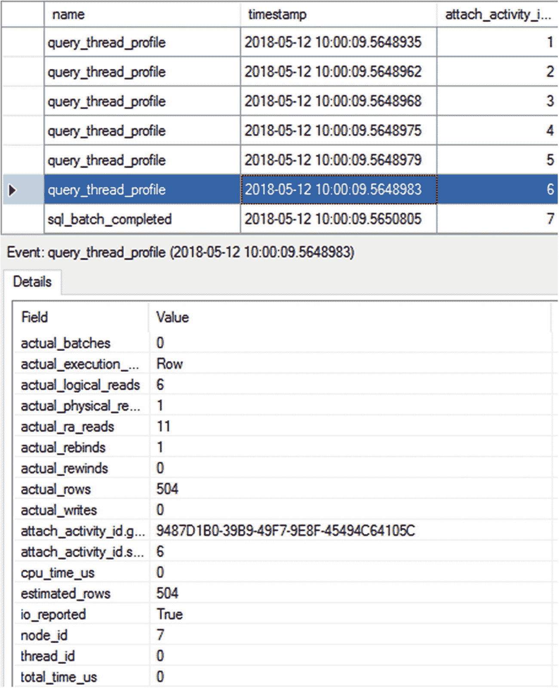

你可以看到事件的详细信息，包括估计行数、实际行数，以及许多我们经常从执行计划中获取的其他信息，用于评估统计信息和索引使用情况等。现在，你可以在查询运行时动态捕获此信息，而无需经历成本高得多的捕获执行计划的过程。请记住，这并非零成本操作，只是成本较低的操作。它也不会取代执行计划的所有用途，因为计划显示的信息远不止线程、持续时间和行数。


## 查询资源成本

即使查询的执行计划提供了详细的处理策略和各个步骤的估计相对成本，但如果这是一个估计计划，它并不会提供查询在 CPU 使用率、磁盘读/写或查询持续时间方面的实际成本。在优化查询时，你可能会添加索引来降低某个步骤的相对成本。这可能会对执行计划中的依赖步骤产生不利影响，有时甚至可能直接修改执行计划本身。因此，如果你只查看估计的执行计划，就无法确定你的查询优化是否对查询整体有益，而不仅仅是对执行计划中的某一个步骤有益。你可以通过不同的方式来分析查询的总体成本。

在优化查询时，你应该监控其总体成本。如前所述，你可以使用扩展事件来监控查询的 `duration`、`cpu`、`reads` 和 `writes` 信息。扩展事件是一种极其高效的指标收集机制。你应该充分利用这一特性，使用该机制来收集你的查询性能指标。只是要明白，收集这些信息会产生大量数据，你需要在系统中为其找到存储位置。

还有其他收集性能数据的方法，它们比扩展事件更直接且易于访问。除了我接下来详述的方法外，别忘了我们还有 DMO（动态管理对象），例如 `sys.dm_exec_query_stats` 和 `sys.dm_exec_procedure_stats`，以及查询存储系统视图和报告，即 `sys.query_store_runtime_stats` 和 `sys.query_store_wait_stats`。

### 客户端统计信息

客户端统计信息从你的机器作为服务器客户端的角度捕获执行信息。这意味着记录的任何时间都包括了数据通过网络传输所需的时间，而不仅仅是 SQL Server 机器上的处理时间。要使用它们，只需选择“查询”➤“包含客户端统计信息”。这样，每次运行查询时，都会收集一组有限的数据，包括执行时间、受影响的行数、与服务器的往返次数等。此外，查询的每次执行都会在“客户端统计信息”选项卡上单独显示，并且有一个列会对多次执行进行聚合，显示所收集数据的平均值。统计信息还会显示某个时间或计数是否在连续运行之间发生变化，以箭头的形式展示，如图 7-13 所示。例如，考虑以下查询：

```sql
SELECT TOP 100
p.Name,
p.ProductNumber
FROM Production.Product p;
```

该查询的客户端统计信息应类似于图 7-25 所示。


图 7-25

客户端统计信息

尽管捕获客户端统计信息可能是收集数据的一种有用方式，但它是一组有限的数据，并且无法显示一次执行与另一次执行有何不同。你甚至可以运行一个完全不同的查询，其数据也会与其他查询的数据混合在一起，使得平均值变得毫无用处。如果需要，你可以重置客户端统计信息。选择“查询”菜单，然后选择“重置客户端统计信息”菜单项。

### 执行时间

`Duration`（持续时间）和 `CPU` 都代表了查询的时间因素。要获取关于解析、编译和执行查询所需时间（以毫秒为单位）的详细信息，请使用 `SET STATISTICS TIME`，如下所示：

```sql
SET STATISTICS TIME ON;
GO
SELECT soh.AccountNumber,
sod.LineTotal,
sod.OrderQty,
sod.UnitPrice,
p.Name
FROM Sales.SalesOrderHeader soh
JOIN Sales.SalesOrderDetail sod
ON soh.SalesOrderID = sod.SalesOrderID
JOIN Production.Product p
ON sod.ProductID = p.ProductID
WHERE sod.LineTotal > 1000;
GO
SET STATISTICS TIME OFF;
GO
```

前面的 `SELECT` 语句的 `STATISTICS TIME` 输出如下所示：

```sql
SQL Server parse and compile time:
CPU time = 0 ms, elapsed time = 9 ms.
(32101 row(s) affected)
SQL Server Execution Times:
CPU time = 156 ms,  elapsed time = 400 ms.
SQL Server parse and compile time:
CPU time = 0 ms, elapsed time = 0 ms.
```

执行时间中的 `CPU time = 156 ms` 部分代表了扩展事件提供的 CPU 值。类似地，对应的 `Elapsed time = 400 ms` 代表了其他机制提供的 Duration（持续时间）值。

0 毫秒的解析时间和 9 毫秒的编译时间意味着优化器必须先解析查询语法，然后编译它以生成执行计划。

## STATISTICS IO

正如本章前文“识别高成本查询”一节所讨论的，在 `持续时间`、`CPU`、`读取` 和 `写入` 这些指标中，`读取` 列中的读取次数通常是最重要的成本因素。一个查询执行的总读取次数等于该查询涉及的所有表上执行的读取次数之和。单个表上执行的读取次数可能差异很大，具体取决于从单个表请求的结果集大小以及可用的索引。

要减少总读取次数，找出查询中访问的所有表及其对应的读取次数会很有帮助。这些详细信息有助于你集中精力优化那些读取次数较多的表的数据访问。每个表的读取次数也有助于你评估针对一个表实施的优化步骤对查询中引用的其他表的影响。

在一个简单查询中，你可以通过仔细查看查询来确定访问了哪些单个表。随着查询变得越来越复杂，这会变得越来越困难。对于存储过程、数据库视图或函数，识别优化器实际访问的所有表就变得更加困难。你可以使用 `STATISTICS IO` 来获取此信息，而不管查询复杂度如何。

要在 Management Studio 中启用 `STATISTICS IO`，请导航到“查询” ➤ “查询选项” ➤ “高级” ➤ “设置 STATISTICS IO”。你也可以通过以下编程方式获取此信息：

```
SET STATISTICS IO ON;
GO
SELECT soh.AccountNumber,
sod.LineTotal,
sod.OrderQty,
sod.UnitPrice,
p.Name
FROM Sales.SalesOrderHeader soh
JOIN Sales.SalesOrderDetail sod
ON soh.SalesOrderID = sod.SalesOrderID
JOIN Production.Product p
ON sod.ProductID = p.ProductID
WHERE sod.SalesOrderID = 71856;
GO
SET STATISTICS IO OFF;
GO
```

如果你运行此查询并查看其执行计划，它包含三个聚集索引查找和两个循环连接。如果移除 `WHERE` 子句并再次运行查询，你会得到一组扫描和一些哈希连接。这是一个有趣的事实——但你不知道它如何影响查询的 I/O 使用情况！你可以使用前面所示的 `SET STATISTICS IO` 来比较优化器采用的两种处理策略下查询（在逻辑读取方面）的成本。

当查询使用哈希连接时，你会得到以下 `STATISTICS IO` 输出：

```
(121317 行受影响)
表 'Workfile'。扫描计数 0，逻辑读取 0...
表 'Worktable'。扫描计数 0，逻辑读取 0...
表 'SalesOrderDetail'。扫描计数 1，逻辑读取 1248...
表 'SalesOrderHeader'。扫描计数 1，逻辑读取 689...
表 'Product'。扫描计数 1，逻辑读取 6...
(1 行受影响)
```

现在当你重新添加 `WHERE` 子句以适当过滤数据时，最终的 `STATISTICS IO` 输出变为：

```
(2 行受影响)
表 'Product'。扫描计数 0，逻辑读取 4...
表 'SalesOrderDetail'。扫描计数 1，逻辑读取 3...
表 'SalesOrderHeader'。扫描计数 0，逻辑读取 3...
(1 行受影响)
```

由于索引查找和循环连接，`SalesOrderDetail` 表的逻辑读取次数从 1,248 次减少到了 3 次。这也并未显著影响 `Product` 表的数据检索成本。

在解读 `STATISTICS IO` 的输出时，你主要参考逻辑读取的次数。当数据未在内存中找到时，物理读取和预读读取的次数会是非零值；但一旦数据被加载到内存中，物理读取和预读读取的次数往往为零。

了解查询使用的所有表及其对应的读取次数还有另一个优势。即使表架构（包括索引）或数据没有变化，重新执行相同的查询时，`持续时间` 和 `CPU` 值也可能大幅波动，这是因为运行 SQL Server 计算机的基本服务和后台应用程序会影响被观察查询的处理时间。但是，不要忘记逻辑读取并不总是最准确的衡量标准。持续时间和 CPU 绝对有用，并且是任何查询调优的重要组成部分。

在优化步骤中，你需要一个不波动的成本数值作为参考。在固定表架构和数据的多次查询执行中，读取次数（或逻辑读取次数）不会变化。例如，如果你执行前面的 `SELECT` 语句十次，你可能会得到十个不同的 `持续时间` 和 `CPU` 数值，但每次的 `Reads` 都将保持不变。因此，在优化过程中，你可以参考单个表的读取次数，以确保你确实降低了该表的数据访问成本。但切勿认为这是你唯一的衡量标准，甚至不是主要标准。它只是一个恒定的衡量标准，因此很有用。

尽管逻辑读取次数也可以从扩展事件中获得，但使用 `STATISTICS IO` 还有另一个好处。Profiler 或服务器跟踪选项显示的查询逻辑读取次数会随着你在查询中使用不同的 `SET` 语句（如前所述）而增加。但 `STATISTICS IO` 显示的逻辑读取次数不包括因使用 `SET` 语句而访问的额外页面。因此，`STATISTICS IO` 提供了一致的逻辑读取次数。

## 实际执行计划

正如本章前面提到的，实际执行计划现在会在执行计划本身中捕获并显示一些查询性能指标，以及传统的指标。如果我们打开前一个查询（没有 `WHERE` 子句的那个）的 `SELECT` 运算符及其计划，图 7-26 显示了 `QueryTimeStats` 和 `WaitStats` 的值。

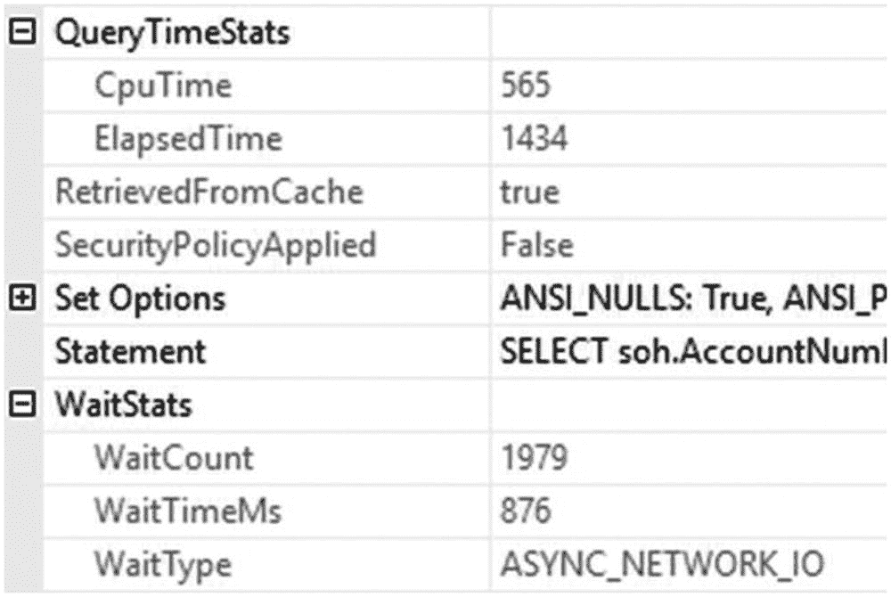

图 7-26

*实际执行计划内的 QueryTimeStats 和 WaitStats*

只要你在捕获实际执行计划，你现在就可以直接在执行计划中看到查询的 `CpuTime` 和 `ElapsedTime`。这些值以毫秒为单位测量。你还可以看到查询的首要等待或等待情况。在图 7-26 的例子中，它是 `ASYNC_NETWORK_IO`，可能的原因是我们正在通过网络返回 121,000 行数据。只有当等待时间超过 1 毫秒时，等待统计数据才会显示。这确实导致执行计划内显示的等待不如捕获等待的其他机制准确。然而，这是一个方便的工具，有助于在执行计划内评估查询的行为。

这为你提供了另一种快速简便地查看查询性能的方法。如果你查看其他某个运算符，你还可以看到该运算符的 I/O，以页为单位测量。


## 本章小结

在本章中，您了解到可以使用扩展事件来识别 SQL 工作负载中对系统资源造成高压力的查询。收集会话数据可以并且应该使用系统存储过程来自动完成。若要即时访问关于正在运行的查询的统计信息，可以使用动态管理视图 `sys.dm_exec_query_stats`。您可以使用 Management Studio 进一步分析这些查询，以找出查询处理策略中的高开销步骤。为了获得更好的性能，在分析查询时，考虑执行计划中使用的索引和连接机制非常重要。`SET STATISTICS IO` 提供的单个表的数据检索（或读取）次数有助于重点关注读取次数最多表的数据访问机制。您还应该关注开销最大的查询的 CPU 成本和总时间。

一旦您识别出一个开销大的查询并完成初步分析，下一步应该是针对性能优化该查询。因为索引是最常用的性能调优技术之一，所以将在下一章中深入讨论 SQL Server 中可用的各种索引机制。

### 第 8 章：索引架构与行为

在正确的列（或列集）上建立正确的索引，是查询调优的起点。缺失索引或在错误列（或列集）上建立的索引，可能是所有性能问题的基础，这些问题始于基本的数据访问，贯穿连接操作，最终体现在过滤子句中。因此，对于每个人——而不仅仅是数据库管理员——来说，理解可用于优化数据库设计的不同索引技术都极其重要。

在本章中，我将涵盖以下主题：

*   什么是索引
*   索引的收益与开销
*   索引设计的一般建议
*   聚集索引和非聚集索引的行为与比较
*   聚集索引和非聚集索引的建议

## 什么是索引？

减少磁盘 I/O 的最佳方法之一是使用索引。索引允许 SQL Server 在不扫描整个表的情况下查找表中的数据。数据库中的索引类似于书籍中的索引。例如，假设您想在本书中查找 `table scan` 这个短语。在纸质版本中，如果没有书后的索引，您将不得不翻阅整本书才能找到所需的文本。有了索引，您就能准确知道所需信息存储的位置。

在针对性能调优数据库时，您会在查询中使用的不同列上创建索引，以帮助 SQL Server 快速查找数据。例如，以下针对 `Production.Product` 表的查询会产生如图 8-1 所示的数据（500 多行中的前 10 行）：


图 8-1: Production.Product 表示例

```sql
SELECT TOP 10
p.ProductID,
p.[Name],
p.StandardCost,
p.[Weight],
ROW_NUMBER() OVER (ORDER BY p.Name DESC) AS RowNumber
FROM Production.Product p
ORDER BY p.Name DESC;
```

前面的查询由于没有 `WHERE` 子句，扫描了整个表。如果您需要通过 `WHERE` 子句添加过滤条件来检索 `StandardCost` 大于 150 的所有产品，在没有索引的情况下，仍然需要扫描整个表，检查每一行的 `StandardCost` 值以确定哪些行的值大于 150。在 `StandardCost` 列上建立索引可以通过提供一种结构化搜索数据的机制（而非逐行检查）来加速此过程。创建此索引有两种不同且基本的方法。

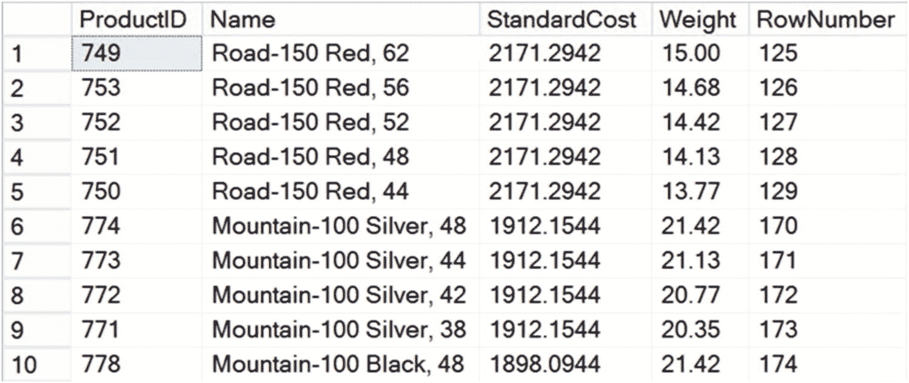
图 8-2: 按 StandardCost 排序的产品表

*   *类似于字典*：字典是按字母顺序排列的单词的独立列表。索引可以以类似方式存储。数据是有序的，尽管仍然会有重复项。前 10 行按 `StandardCost DESC` 而不是按 `Name` 排序，将看起来像图 8-2 中所示的数据。请注意，`RowNumber` 列显示了按 `Name` 排序时行的原始位置。

因此，现在如果您想查找 `StandardCost` 大于 150 的所有行数据，索引将允许您通过直接定位到第一个大于 150 的值来立即找到它们。基于索引键顺序对存储的数据应用排序的索引称为 `聚集索引`。由于 SQL Server 存储数据的方式，这是数据库设计中最重要的索引之一。我将在本章后面详细解释这一点。

表 8-1: Manufacturer 索引的结构

| StandardCost | RowNumber |
| --- | --- |
| 2171.2942 | 125 |
| 2171.2942 | 126 |
| 2171.2942 | 127 |
| 2171.2942 | 128 |
| 2171.2942 | 129 |
| 1912.1544 | 170 |

*   *类似于书籍索引的架构*：可以在不改变表布局的情况下创建一个有序列表，类似于书籍索引的创建方式。就像书籍的关键词索引将关键词列在单独的部分并带有页码指向书籍的主体内容一样，`StandardCost` 值的列表被创建为一个独立的结构，并通过指针指向 `Product` 表中的对应行。在本例中，我将使用 `RowNumber` 作为指针。表 8-1 显示了 manufacturer 索引的结构。

SQL Server 可以扫描 manufacturer 索引来查找 `StandardCost` 大于 150 的行。由于 `StandardCost` 值按排序顺序排列，SQL Server 一旦遇到值小于或等于 150 的行就可以停止扫描。这种类型的索引称为 `非聚集索引`，我将在本章后面详细解释。

在任何一种情况下，在大多数情况下，SQL Server 都能够比没有索引时更快地找到所有 `StandardCost` 大于 150 的产品。

您可以在单个列（如前所述）或表中的列组合上创建索引。SQL Server 还会自动为某些类型的约束（例如，`PRIMARY KEY` 和 `UNIQUE` 约束）创建索引。


### 索引的优势

即使表上没有索引，SQL Server 也必须能够找到数据。当没有聚簇索引来确定数据的存储顺序时，存储引擎将简单地读取整个表来查找所需内容。没有聚簇索引的表称为 `堆表`。堆就是一个无序的数据堆栈，包含一个指向存储位置的行标识符。除了通过逐行遍历数据（这个过程称为 `扫描`）外，这些数据既不能排序也无法搜索。当在表上创建聚簇索引时，索引的键值会为数据建立一个顺序。此外，有了聚簇索引，数据与索引一起存储，因此数据本身现在是有序的。当存在聚簇索引时，非聚簇索引上的指针由定义聚簇索引键的值组成。这是聚簇索引如此重要的一个主要原因。

SQL Server 中的数据存储在大小为 8KB 的页面上。页面是磁盘到内存移动的最小信息单位，因此一个页面上能存储多少数据变得至关重要。由于页面空间有限，如果行包含的列数较少或列的尺寸较小，它就能存储更多的行。非聚簇索引通常不（也不应该）包含表的所有列；它通常只包含有限数量的列。因此，一个页面能够存储的非聚簇索引行数将多于表本身的行数（表包含所有列）。因此，对于代表列上非聚簇索引的页面，SQL Server 能够从中读取的该列值，将多于从包含该列的表代表的页面中读取的值。

非聚簇索引的另一个优势是，由于它与数据表是分开的结构，因此可以将其放在不同的文件组中，使用不同的 I/O 路径（如第 3 章所述）。这意味着 SQL Server 可以并发访问索引和表，从而使搜索速度更快。

索引将其信息存储在平衡树（称为 `B 树`）结构中，因此查找特定行所需的读取次数被最小化。以下示例展示了 B 树结构的优势。

考虑一个包含 27 行的单列表，这些行随机排列，且每个叶级页面只有 3 行。假设页面中行的布局如图 8-3 所示。

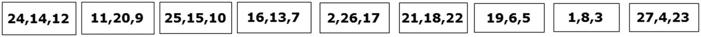
*图 8-3 27 行的初始布局*

要搜索列值为 5 的行（或行），SQL Server 必须扫描所有行和页面，因为即使是最后一页中的最后一行也可能具有值 5。由于读取次数取决于访问的页面数，在没有索引的情况下，必须执行九次读取操作（从磁盘检索页面并将其传输到内存）。可以通过在该列上创建索引来对内容进行排序，结果行和页面布局如图 8-4 所示。

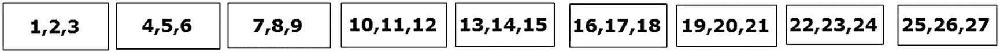
*图 8-4 27 行的有序布局*

对列进行索引会以排序方式排列内容。这使得 SQL Server 能够确定列中一个行位置相对于列中另一个行位置的值的可能取值。例如，在图 8-4 中，当 SQL Server 找到第一个列值为 6 的行时，它可以确定不再有列值为 5 的行。因此，当内容被索引时，只需两次读取操作即可获取值为 5 的行。但是，如果要搜索列值 25 会怎样？这将需要九次读取操作！这个问题通过使用 B 树结构实现索引来解决（如图 8-5 所示）。

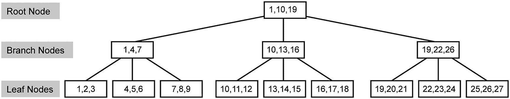
*图 8-5 27 行的 B 树布局*

B 树由一个起始节点（或页面）组成，称为 `根节点`，从中生长出（或链接到）`分支节点`（或页面）。所有键都存储在叶子节点中。每个内部节点（叶节点之上）包含指向其分支节点的指针以及表示在分支节点中找到的最小值的值。键在每个节点内保持排序顺序。B 树使用平衡树结构进行高效的记录检索——当所有叶节点距离根节点的层级都相同时，B 树是平衡的。例如，在前面的内容上创建索引将生成如图 8-5 所示的平衡 B 树结构。在底层，所有叶节点通过双向链表相互连接，意味着每个页面指向其后的页面，其后的页面又指向前一个页面。这避免了在遍历页面超出中间页面的定义时，需要回溯链。

B 算法最小化了定位所需键要访问的页面数，从而加快了数据访问过程。例如，在图 8-5 中，搜索键值 5 从顶部的根节点开始。由于键值在 1 和 10 之间，搜索过程沿着左分支进入下一个节点。由于键值 5 落在值 4 和 7 之间，搜索过程沿着中间分支进入下一个起始键值为 4 的节点。搜索过程从这个叶页面检索到键值 5。如果键值 5 不存在于此页面，由于这是叶页面，搜索过程将停止。类似地，键值 25 也可以使用相同的读取次数进行搜索。


### 索引开销

索引带来的性能提升确实伴随着一定的成本。带有索引的表除了表本身的数据页之外，还需要额外的存储空间和内存空间来存放索引页。数据操作查询（`INSERT`、`UPDATE` 和 `DELETE` 语句，或增删改查 [CRUD] 中的增、改、删部分）可能会耗时更长，并且需要更多的处理时间来维护不断变化的表的索引。这是因为，与 `SELECT` 语句不同，数据操作查询会修改表的数据内容。如果 `INSERT` 语句向表中添加一行，那么它也必须在索引结构中添加一行。如果索引是聚集索引，开销会更大，因为该行必须按照正确的顺序添加到数据页本身，这可能需要将其他数据行重新定位到新行条目位置的下方。`UPDATE` 和 `DELETE` 数据操作查询以类似的方式更改索引页。

在设计索引时，你将从两个不同的角度进行操作：一是已投入生产的现有系统，此时你需要衡量索引的整体影响；二是战术性方法，通常是在初始设计系统时，你只关注索引的即时好处。当你必须处理现有系统时，应确保索引的性能优势超过其在处理资源上的额外开销。你可以通过使用扩展事件（在第 3 章中解释）进行整体工作负载优化（在第 27 章中解释）来实现这一点。当你完全专注于索引的即时好处时，SQL Server 提供了一系列动态管理视图来提供有关索引性能的详细信息，例如 `sys.dm_db_index_operational_stats` 或 `sys.dm_db_index_usage_stats`。视图 `sys.dm_db_index_operational_stats` 显示正在使用的索引的低级活动，如锁和 I/O。视图 `sys.dm_db_index_usage_stats` 返回随时间推移发生的针对索引的各种索引操作的统计计数。在第 21 章讨论阻塞时，将更广泛地使用这两个视图。

## 注意

在本书的某些部分，我使用 `STATISTICS IO` 和 `STATISTICS TIME` 来测量我运行的查询。你可以将 `SET` 命令添加到代码中，也可以更改查询窗口的连接设置。我建议只更改连接设置。但是，这里也应提出一个警告。同时使用 `STATISTICS IO` 和 `STATISTICS TIME` 有时可能会导致问题。检索 I/O 信息所花费的时间会被计入 `STATISTICS TIME` 信息中，从而扭曲结果。如果你不需要表级 I/O，最好使用扩展事件捕获执行指标。如果你正在捕获查询的实际执行计划，也可以从中获取 `CpuTime` 和 `ElapsedTime`。

为了理解索引对数据操作查询的开销成本，请考虑以下示例。首先，创建一个包含 10,000 行的测试表。

```
DROP TABLE IF EXISTS dbo.Test1;
GO
CREATE TABLE dbo.Test1
(
C1 INT,
C2 INT,
C3 VARCHAR(50)
);
WITH Nums
AS (SELECT TOP (10000)
ROW_NUMBER() OVER (ORDER BY (SELECT 1)) AS n
FROM master.sys.all_columns ac1
CROSS JOIN master.sys.all_columns ac2
)
INSERT INTO dbo.Test1
(
C1,
C2,
C3
)
SELECT n,
n,
'C3'
FROM Nums;
```

运行一个 `UPDATE` 语句，如下所示：

```
UPDATE dbo.Test1
SET C1 = 1,
C2 = 1
WHERE C2 = 1;
```

然后，`SET STATISTICS IO` 报告的逻辑读取次数如下：

```
Table 'Test1'. Scan count 1, logical reads 29
```

在列 `C1` 上添加一个索引，如下所示：

```
CREATE CLUSTERED INDEX iTest
ON dbo.Test1(C1);
```

然后，对于相同的 `UPDATE` 语句，逻辑读取次数从 29 增加到 38，并且还增加了一个工作表，额外增加了 5 次读取，总计 43 次。

```
Table 'Test1'. Scan count 1, logical reads 38
Table 'Worktable'. Scan count 1, logical reads 5
```

读取次数增加是因为需要重新排列数据，以便在聚集索引中以正确的顺序存储，这比将数据简单地追加到堆表现有存储的末尾所需的读取次数要多。

## 注意

`worktable`（工作表）是 SQL Server 内部用于处理查询中间结果的临时表。工作表在 tempdb 数据库中创建，并在查询执行后自动删除。

尽管维护索引所需的确实在数据操作查询中会增加开销，但需要注意的是，SQL Server 必须先找到一行，然后才能更新或删除它；因此，对于带有必要 `WHERE` 子句的 `UPDATE` 和 `DELETE` 语句，索引仍然可以提供帮助。使用索引定位行所提高的效率通常可以抵消更新索引所需的额外开销，除非表有很多索引或大量的更新操作。此外，绝大多数系统是读取密集型的，这意味着被检索的数据远多于被插入或修改的数据。

为了理解索引如何使数据修改查询受益，让我们在示例的基础上继续。在表 `Test1` 上创建另一个索引。这次，索引创建在 `UPDATE` 语句的 `WHERE` 子句中引用的列 `C2` 上。

```
CREATE NONCLUSTERED INDEX iTest2
ON dbo.Test1(C2);
```

添加此新索引后，再次运行 `UPDATE` 命令。

```
UPDATE  dbo.Test1
SET     C1 = 1,
C2 = 1
WHERE   C2 = 1;
```

此 `UPDATE` 语句的总逻辑读取次数从 43 减少到 20（= 15 + 5）。

```
Table 'Test1'. Scan count 1, logical reads 15
Table 'Worktable'. Scan count 1, logical reads 5
```

本节中的示例表明，尽管拥有索引会给操作查询带来一些开销成本，但由于索引对搜索的有益影响，即使在更新期间，总体结果也可能是成本的降低。

## 索引设计建议

索引设计的主要建议如下：

*   检查 `WHERE` 子句和 `JOIN` 条件列。
*   使用窄索引。
*   检查列的唯一性和选择性。
*   检查列的数据类型。
*   考虑列的顺序。
*   考虑索引类型（聚集索引与非聚集索引）。

让我们依次考虑这些建议。

### 检查 WHERE 子句和 JOIN 条件列

当查询提交给 SQL Server 时，查询优化器会尝试为查询中引用的每个表找到最佳的数据访问机制。以下是其实现方式：

1.  优化器识别包含在 `WHERE` 子句和 `JOIN` 条件中的列。谓词是评估为真、假或未知的逻辑条件。它们包括诸如 `IN` 或 `BETWEEN` 之类的内容。
2.  然后，优化器检查这些列上的索引。
3.  优化器通过确定从索引维护的统计信息中得出的子句的选择性（即，将返回多少行）来评估每个索引的有用性。
4.  约束（如主键和外键）也会被优化器评估和使用，以确定查询中使用的对象的选择性。
5.  最后，优化器根据前面步骤中收集的信息，估算出检索符合条件行的成本最低的方法。


## 注意

第 13 章更深入地涵盖了统计信息。

为了理解查询中 `WHERE` 子句列的重要性，让我们考虑一个例子。我们回到最初帮助你理解索是什么的代码清单；该查询由一个没有 `WHERE` 子句的 `SELECT` 语句组成，如下所示：

```
SELECT p.ProductID,
       p.Name,
       p.StandardCost,
       p.Weight
FROM Production.Product p;
```

查询优化器执行聚集索引扫描，这相当于在拥有聚集索引的表上对堆进行表扫描，以读取行，如图 8-6 所示（在查询窗口中按 `Ctrl+M` 启用“包括实际执行计划”选项，并通过右键单击、选择“查询选项”，然后在“高级”选项卡上勾选相应的复选框来启用“设置统计 I/O”选项）。

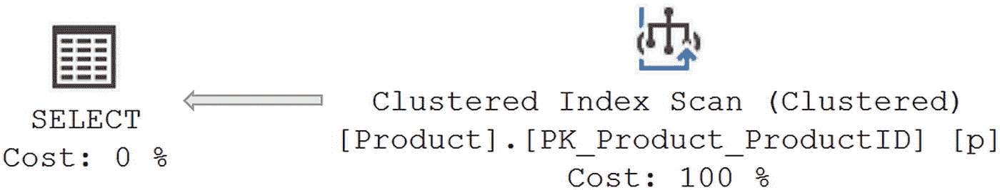

图 8-6

无 `WHERE` 子句的执行计划

`SET STATISTICS I0` 为 `SELECT` 语句报告的逻辑读取数如下：

```
Table  'Product'.  Scan count 1,  logical reads 15
```

## 注意

捕获执行计划会影响你使用几乎任何方法收集的时间指标。因此，在真正需要测量时间时，请记得关闭执行计划捕获。

为了理解 `WHERE` 子句列对查询优化器决策的影响，让我们添加一个 `WHERE` 子句来检索单行数据。

```
SELECT p.ProductID,
       p.Name,
       p.StandardCost,
       p.Weight
FROM Production.Product AS p
WHERE p.ProductID = 738;
```

有了 `WHERE` 子句后，查询优化器会检查 `WHERE` 子句列 `ProductID`，识别在 `Productld` 列上存在可用的索引 `PK_Product_ProductId`，根据索引 `PK_Product_Productld` 的统计信息评估 `WHERE` 子句的高选择性（即只会返回一行），并决定使用该索引来检索数据，如图 8-7 所示。


图 8-7

带有 `WHERE` 子句的执行计划

产生的逻辑读取数如下：

```
Table 'Product'. Scan count 0, logical reads 2
```

查询优化器的行为表明，`WHERE` 子句列有助于优化器为查询选择最优的索引操作。这也适用于在两个表之间的 `JOIN` 条件中使用的列。优化器会查找 `WHERE` 子句列或 `JOIN` 条件列上的索引，如果可用，则考虑使用该索引从表中检索行。查询优化器在执行查询时会考虑 `WHERE` 子句列和 `JOIN` 条件列上的索引。因此，在 SQL 查询的 `WHERE` 子句、`HAVING` 子句和 `JOIN` 条件中常用的列上建立索引，有助于优化器避免扫描基表。

当表内的数据量非常小，以至于可以容纳在单个页面（8KB）中时，表扫描可能比索引查找效果更好。如果你有一个好的索引，但仍然得到了扫描，请考虑这种影响。

### 使用窄索引

为获得最佳性能，在创建索引时，应使用尽可能窄（即尽可能小）的数据类型。这里的“窄”是指在实际可行的情况下使用最小的数据类型。你还应该避免在索引中使用非常宽的数据类型列。具有字符串数据类型（`CHAR`、`VARCHAR`、`NCHAR` 和 `NVARCHAR`）的列有时可能相当宽，二进制类型和全局唯一标识符（GUID）也是如此。除非绝对必要，否则应尽量减少在索引中使用具有大尺寸的宽数据类型列。你可以在表中的列组合上创建索引。为获得最佳性能，应在索引中使用尽可能少的列。但是，需要使用必要的列来为索引定义一个有用的键。

窄索引可以在一个 8KB 的索引页面中容纳比宽索引更多的行。这有以下效果：

*   减少 I/O（因为需要读取的 8KB 页面更少）
*   使数据库缓存更有效，因为 SQL Server 可以缓存更少的索引页面，从而减少内存中索引页面所需的逻辑读取
*   减少数据库的存储空间

为了理解窄索引如何减少逻辑读取的数量，创建一个包含 20 行和一个索引的测试表。

```
DROP TABLE IF EXISTS dbo.Test1;
GO
CREATE TABLE dbo.Test1 (C1 INT, C2 INT);
WITH    Nums
        AS (SELECT    1 AS n
            UNION ALL
            SELECT    n + 1
            FROM      Nums
            WHERE     n < 20
           )
INSERT  INTO dbo.Test1
        (C1, C2)
        SELECT  n, n
        FROM    Nums;
CREATE INDEX iTest ON dbo.Test1(C1);
```

由于索引列很窄（`INT` 数据类型为 4 字节），所有索引行都可以容纳在一个 8KB 的索引页面中。如图 8-8 所示，你可以在与索引相关的动态管理视图中确认这一点。如果你的数据库 ID 解析为 `NULL`，可能会出错。

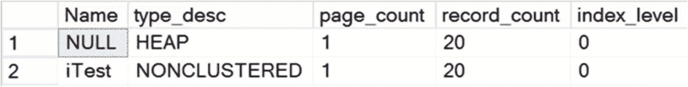

图 8-8

窄的非聚集索引的页面数

```
SELECT i.name,
       i.type_desc,
       ddips.page_count,
       ddips.record_count,
       ddips.index_level
FROM sys.indexes i
JOIN sys.dm_db_index_physical_stats(   DB_ID(N'AdventureWorks2017'),
                                        OBJECT_ID(N'dbo.Test1'),
                                        NULL,
                                        NULL,
                                        'DETAILED'
                                      ) AS ddips
  ON i.index_id = ddips.index_id
WHERE i.object_id = OBJECT_ID(N'dbo.Test1');
```

`sys.indexes` 系统表存储在每个数据库中，包含数据库中每个索引的基本信息。动态管理函数 `sys.dm_db_index_physical_stats` 包含关于索引统计信息的更详细信息（你将在第 14 章中了解更多关于这个 DMV 的内容）。为了理解宽索引键的缺点，将索引列 `c1` 的数据类型从 `INT` 修改为 `CHAR(500)`（下载中的 `narrow_alter.sql`）。

```
DROP INDEX dbo.Test1.iTest;
ALTER TABLE dbo.Test1 ALTER COLUMN C1 CHAR(500);
CREATE INDEX iTest ON dbo.Test1(C1);
```

`INT` 数据类型列的宽度为 4 字节，`CHAR(500)` 数据类型列的宽度为 500 字节。由于索引列宽度很大，需要两个索引页面来容纳所有 20 个索引行。你可以通过再次对其运行查询，在 `sys.dm_db_index_physical_stats` 动态管理函数中确认这一点（参见图 8-9）。


图 8-9

宽的非聚集索引的页面数

大的索引键大小会增加索引页面的数量，从而增加索引所需的内存量和磁盘活动。始终建议将索引键大小设置得尽可能窄。

在继续之前，请删除测试表。

```
DROP TABLE dbo.Test1;
```

### 检查列唯一性

在具有极低唯一值范围的列（例如 `MaritalStatus`）上创建索引不会对性能产生益处，因为查询优化器将无法使用该索引来有效缩小要返回的行范围。考虑一个只有两个唯一值的 `MaritalStatus` 列：`M` 和 `S`。当你在 `WHERE` 子句中包含 `MaritalStatus` 列执行查询时，最终会从表中获取大量行（假设 `M` 和 `S` 的分布相对均匀），导致代价高昂的表或聚集索引扫描。通常，最好让 `WHERE` 子句中的列具有大量唯一行（或 `高选择性`），以限制访问的行数。你应该在这些列上创建索引，以帮助优化器访问较小的结果集。

此外，在创建多列索引（也称为 `复合索引`）时，列的顺序很重要。在许多情况下，首先使用最具选择性的列将有助于更高效地过滤索引行。

## 注意

复合索引中列顺序的重要性将在本章后面的“考虑列顺序”一节中解释。

由此可以看出，在列上创建索引之前了解其选择性非常重要。你可以通过执行如下查询来找到这个信息；只需替换表名和列名：

```sql
SELECT COUNT(DISTINCT e.MaritalStatus) AS DistinctColValues,
COUNT(e.MaritalStatus) AS NumberOfRows,
(CAST(COUNT(DISTINCT e.MaritalStatus) AS DECIMAL)
/ CAST(COUNT(e.MaritalStatus) AS DECIMAL)) AS Selectivity,
(1.0 / (COUNT(DISTINCT e.MaritalStatus))) AS Density
FROM HumanResources.Employee AS e;
```

当然，你不需要对每个列或每个索引都运行这种查询。此查询展示了 SQL Server 使用的一些统计信息是如何组合在一起的。你可以直接使用 `DBCC SHOW_STATISTICS` 或通过查询 DMF（动态管理函数）`sys.dm_db_stats_histogram` 和 `sys.dm_db_stats_properties` 来查看这些统计信息。我们将在第 13 章详细介绍所有这些内容。

在 `WHERE` 子句或连接条件中引用时，具有最多唯一值（或选择性）的列可能是索引的最佳候选。你也可能遇到特殊情况，即拥有数百行常见数据，但只有少数几行是唯一的。少数唯一行也会从索引中受益。你可以通过使用筛选索引（在第 9 章有更详细的讨论）使其更加有益。

要理解索引键列的选择性如何影响索引的使用，请查看 `HumanResources.Employee` 表中的 `MaritalStatus` 列。如果你运行前面的查询，你会看到在 290 行中，它只包含两个不同的值，选择性为 .0069，密度为 .5。一个查找 `MaritalStatus` 为 `M` 以及特定 `BirthDate` 值的查询可能如下所示：

```sql
SELECT e.MaritalStatus,
e.BirthDate
FROM HumanResources.Employee AS e
WHERE e.MaritalStatus = 'M'
AND e.BirthDate = '1982-02-11';
```

这会产生如图 8-10 所示的执行计划以及以下 I/O 和耗时：


图 8-10
无索引时的执行计划

```
Table 'Employee'. Scan count 1, logical reads 9
CPU time = 0 ms,  elapsed time = 2 ms.
```

数据是通过扫描聚集索引（数据存储的位置）来查找 `MaritalStatus = 'M'` 的适当值而返回的。如果你在该列上放置一个索引，像这样，并再次运行查询，执行计划保持不变：

```sql
CREATE INDEX IX_Employee_Test ON HumanResources.Employee (MaritalStatus);
```

数据的选择性不足以使用该索引，更不用说有用了。如果你使用一个像这样的复合索引：

```sql
CREATE INDEX IX_Employee_Test
ON HumanResources.Employee
(
BirthDate,
MaritalStatus
)
WITH (DROP_EXISTING = ON);
```

那么，当你重新运行查询时，会生成一个完全不同的执行计划。你可以在图 8-11 中看到它以及性能结果。


图 8-11
使用复合索引时的执行计划

```
Table 'Employee'. Scan count 1, logical reads 2
CPU time = 0 ms,  elapsed time = 2 ms.
```

现在你比使用聚集索引扫描时表现得更好。一个干净利落的 `Index Seek` 操作花费不到一半的时间来收集数据。

尽管这些列中可能没有哪一个单独具有足够的选择性来创建一个不错的索引（`BirthDate` 列可能除外），但它们一起提供了足够的选择性，使优化器能够利用所提供的索引。

可以尝试强制查询使用你创建的第一个测试索引。如果你删除复合索引，重新创建原始索引，然后通过使用查询提示强制使用原始索引架构来修改查询，如下所示：

```sql
CREATE INDEX IX_Employee_Test
ON HumanResources.Employee
(
MaritalStatus
)
WITH (DROP_EXISTING = ON);
SELECT e.MaritalStatus,
e.BirthDate
FROM HumanResources.Employee AS e WITH (INDEX(IX_Employee_Test))
WHERE e.MaritalStatus = 'M'
AND e.BirthDate = '1982-02-11';
```

那么，如图 8-12 所示的结果和执行计划虽然相似，但并不相同。


图 8-12
使用查询提示选择索引时的执行计划

```
Table 'Employee'. Scan count 1, logical reads 294
CPU time = 0 ms,  elapsed time = 47 ms.
```

你看到了相同的 `Index Seek`，但读取次数急剧增加，执行计划本身也发生了变化。你现在多了一个 `Nested Loops` 连接和一个 `Key Lookup` 操作符被添加到计划中。尽管强制优化器选择索引是可能的，但这显然并不总是最优的方法。查询提示剥夺了优化器的选择权，并迫使它走上通常次优的路径。提示不考虑结构的变化，例如优化器本可以更有效使用的新索引。提示也迫使优化器忽略可能产生更佳执行计划的数据变化。

## 注意

你将在第 12 章学习有关键查找的内容。

自 SQL Server 2012 以来，强制不同行为的另一种方式是 `FORCESEEK` 查询提示。`FORCESEEK` 使得优化器将仅选择 `Index Seek` 操作。如果查询像这样重写：

```sql
SELECT e.MaritalStatus,
e.BirthDate
FROM HumanResources.Employee AS e WITH (FORCESEEK)
WHERE e.MaritalStatus = 'M'
AND e.BirthDate = '1982-02-11';
```

此查询产生与图 8-12 相同的执行计划，性能同样糟糕。

限制优化器的选项并强制行为在某些情况下可能有帮助，但通常，如这里的显示的结果所示，执行时间和读取次数的增加并无裨益。

在继续之前，请确保从表中删除测试索引。

```sql
DROP INDEX HumanResources.Employee.IX_Employee_Test;
```


### 检查列数据类型

索引的数据类型至关重要。例如，在整数键上进行索引搜索速度很快，这是因为 `INTEGER`（或 `INT`）数据类型尺寸小且易于进行算术运算。你也可以使用其他整数数据类型变体（`BIGINT`、`SMALLINT` 和 `TINYINT`）作为索引列，而字符串数据类型（`CHAR`、`VARCHAR`、`NCHAR` 和 `NVARCHAR`）则需要进行字符串匹配操作，这通常比整数匹配操作开销更大。

假设你想在某一列上创建索引，并且有两列候选列——一列是 `INTEGER` 数据类型，另一列是 `CHAR(4)` 数据类型。即使在 SQL Server 2017 和 Azure SQL Database 中，这两种数据类型的大小都是 4 字节，你仍然应该优先选择 `INTEGER` 数据类型的索引。以算术操作为例，`CHAR(4)` 数据类型中的值 `1` 实际上存储为 `1` 后跟三个空格，由以下四个字节组合而成：`0x35`、`0x20`、`0x20` 和 `0x20`。CPU 不知道如何在此数据上执行算术操作，因此需要在进行算术操作之前将其转换为 `integer` 数据类型，而 `integer` 数据类型中的值 `1` 则保存为 `0x00000001`。CPU 可以轻松地在此数据上执行算术操作。

当然，大多数时候，你不会遇到在大小完全相同的数据类型之间做简单选择的情况，从而允许你选择更优的类型。在设计和构建索引时请牢记这一点。

### 考虑索引列顺序

索引键首先根据索引的第一列排序，然后在每个前一列的值内，根据下一列进行子排序。复合索引中的第一列通常被称为索引的 *前导列*。例如，考虑表 8-2。

表 8-2

示例表

| **c1** | **c2** |
| --- | --- |
| 1 | 1 |
| 2 | 1 |
| 3 | 1 |
| 1 | 2 |
| 2 | 2 |
| 3 | 2 |

如果在列 (`c1`, `c2`) 上创建一个复合索引，那么该索引将按表 8-3 所示的顺序排列。

表 8-3

列 (c1, c2) 上的复合索引

| c1 | c2 |
| --- | --- |
| 1 | 1 |
| 1 | 2 |
| 2 | 1 |
| 2 | 2 |
| 3 | 1 |
| 3 | 2 |

如表 8-3 所示，数据首先根据复合索引中的第一列 (`c1`) 排序。在每个第一列的值内，数据会进一步根据第二列 (`c2`) 排序。

因此，复合索引中的列顺序是影响索引有效性的重要因素。通过考虑以下几点可以看出这一点：

*   列的唯一性

*   列宽度

*   列数据类型

例如，假设你对表 `t1` 的大多数查询都类似于以下内容：

```sql
SELECT p.ProductID FROM Production.Product AS p
WHERE p.ProductSubcategoryID = 1;
SELECT p.ProductID FROM Production.Product AS p
WHERE p.ProductSubcategoryID = 1
AND p.ProductModelID = 19;
```

在 (`ProductSubcategoryID`, `ProductModelID`) 上创建的索引将使这两个查询受益。但在 (`ProductModelID`, `ProductSubCategoryID`) 上创建的索引则不会对两个查询都有帮助，因为它会首先根据 `ProductModelID` 列排序数据，而第一个 `SELECT` 语句需要数据根据 `ProductSubCategoryID` 列排序。

为了理解索引中列顺序的重要性，请考虑以下示例。在 `Person.Address` 表中，有一个 `City` 列和另一个 `PostalCode` 列。像这样在表上创建一个索引：

```sql
CREATE INDEX IX_Test ON Person.Address (City, PostalCode);
```

一个使用此新索引的针对该表的简单 `SELECT` 语句大致如下所示：

```sql
SELECT a.City,
a.PostalCode
FROM Person.Address AS a
WHERE a.City = 'Dresden';
```

该查询的 I/O 和执行时间如下：

```
Table 'Address'. Scan count 1, logical reads 2
CPU time = 0 ms,  elapsed time = 0 ms. (或 Extended Events 中的 164 微秒)
```

图 8-13 中的执行计划显示了索引的使用情况。


图 8-13

针对索引前导列的查询执行计划

因此，此查询正在利用索引的前导列来执行 `Seek` 操作以检索数据。如果，不使用前导列进行查询，而是使用索引中的另一列，如下面的查询：

```sql
SELECT a.City,
a.PostalCode
FROM Person.Address AS a
WHERE a.PostalCode = ' 01071';
```

结果如下：

```
Table 'Address'. Scan count 1, logical reads 108
CPU time = 0 ms,  elapsed time = 2 ms.
```

执行计划明显不同，如图 8-14 所示。

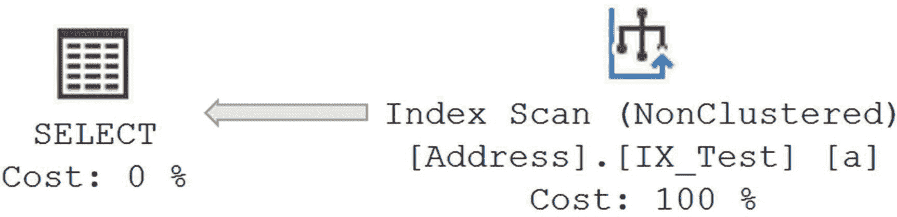

图 8-14

针对内部列的查询执行计划

两个查询都从同一张表返回 31 行数据，但读取次数从 2 跳到了 108。你开始看到图 8-13 中的 `Index Seek` 操作和图 8-14 中的 `Index Scan` 操作之间的差异。I/O 和时间的剧烈变化体现了复合索引（覆盖索引）的另一个优势。这将在第 9 章中详细讨论。

完成后，删除索引。

```sql
DROP INDEX Person.Address.IX_Test;
```

### 考虑索引类型

在 SQL Server 中，从所有可用的不同类型索引中，大多数时候你将使用两种主要的索引类型：*聚集* 索引和 *非聚集* 索引。两种类型都具有 B 树结构。两者之间的主要区别在于，聚集索引的叶子页就是表的数据页，因此它们与它们指向的数据具有相同的顺序。这意味着聚集索引就是表。随着学习的深入，你会发现当确定要使用的索引类型时，两种索引类型在叶子级别的差异变得很重要。

还有许多其他索引类型，我们将在第 9 章中更详细地介绍它们。

## 聚集索引

聚集索引的叶子页和其所基于的表的数据页是同一个东西。因此，表行根据聚集索引列进行物理排序，并且由于表数据只能有一种物理顺序，所以一个表只能有一个聚集索引。

### 提示

当你创建主键约束时，如果尚未存在聚集索引，并且未明确指定索引应为唯一非聚集索引，SQL Server 会自动将其在主键上创建为唯一聚集索引。这不是必需的；这只是默认行为。你可以在表上创建主键之前更改其定义。

## 堆表

如本章前面所述，没有聚集索引的表称为 *堆表*。堆表的数据行不以任何特定顺序存储，也不与表中的相邻页链接。与访问大型非堆表（具有聚集索引的表）相比，堆表的这种无组织结构通常会增加访问大型堆表的开销。


## 与非聚集索引的关系

在 SQL Server 中，聚集索引与非聚集索引之间存在一种有趣的关系。非聚集索引的索引行包含一个指向表中相应数据行的指针。这个指针被称为*行定位器*。行定位器的值取决于数据页是存储在堆中还是聚集索引上。对于非聚集索引，如果数据在堆中，行定位器是指向该数据行在堆中的行标识符（`RID`）的指针。如果表有聚集索引，则行定位器就是聚集索引键值。

### 堆表示例

例如，假设你有一个没有聚集索引的堆表，如表 8-4 所示。

表 8-4

示例表的数据页

| RowID (非真实列) | c1 | c2 | c3 |
| --- | --- | --- | --- |
| 1 | A1 | A2 | A3 |
| 2 | B1 | B2 | B3 |

在堆表的 `c1` 列上创建的非聚集索引，将导致其索引行的行定位器包含一个指向数据库表中对应数据行的指针，如表 8-5 所示。

表 8-5

无聚集索引时的非聚集索引页

| c1 | 行定位器 |
| --- | --- |
| A1 | 指向 `RID = 1` 的指针 |
| B1 | 指向 `RID = 2` 的指针 |

### 聚集索引示例

在 `c2` 列上创建聚集索引后，非聚集索引行的行定位器值会发生变化。新的行定位器值将包含聚集索引键值，如表 8-6 所示。

表 8-6

在 `c2` 上有聚集索引时的非聚集索引页

| c1 | 行定位器 |
| --- | --- |
| A1 | A2 |
| B1 | B2 |

### 验证依赖关系

为了验证聚集索引和非聚集索引之间的这种依赖关系，让我们看一个例子。在 `AdventureWorks2017` 数据库中，`dbo.DatabaseLog` 表没有聚集索引，只有一个非聚集主键。如果运行如下查询，执行计划将如图 8-15 所示：

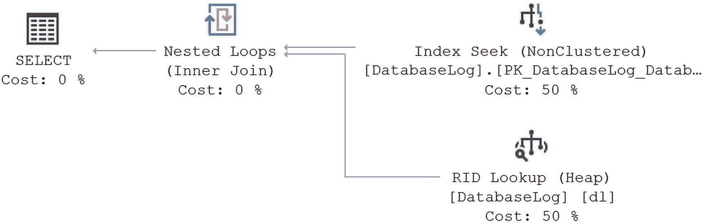

图 8-15

针对堆的执行计划

```sql
SELECT dl.DatabaseLogID,
dl.PostTime
FROM dbo.DatabaseLog AS dl
WHERE dl.DatabaseLogID = 115;
```

如你所见，索引在 `Seek` 操作中被使用。但由于数据是与非聚集索引分开存储的，并且该索引不包含满足查询所需的所有列，因此需要一个额外的操作，即 `RID Lookup` 操作，来检索数据。来自堆和非聚集索引这两个来源的数据，然后通过一个 `Nested Loop` 操作进行连接。这是一个经典的所谓*查找*示例，在本例中是 `RID` 查找，更多细节将在“定义查找”一节中解释。针对一个已有聚集索引的表运行类似的查询，看起来会像这样：

```sql
SELECT d.DepartmentID,
d.ModifiedDate
FROM HumanResources.Department AS d
WHERE d.DepartmentID = 10;
```

图 8-16 显示了返回的执行计划。


图 8-16

带有聚集索引的执行计划

尽管主键的使用方式与前一个查询相同，但这次它是针对聚集索引的。这意味着数据与索引一起存储，因此额外的列不需要通过查找操作来获取数据。所有内容都通过简单的 `Clustered Index Seek` 操作返回。

### 对导航和维护的影响

要从非聚集索引行导航到数据行，这两种索引类型之间的关系要求在遍历聚集索引的 B 树结构时增加一次间接寻址。如果没有聚集索引，非聚集索引的行定位器将能够直接从非聚集索引行导航到基表中的数据行。聚集索引的存在使得从非聚集索引行到数据行的导航需要经过聚集索引的 B 树结构，因为新的行定位器值指向的是聚集索引键。

另一方面，考虑在聚集索引键顺序中插入一个中间行或扩展一个中间行的内容。例如，想象一个聚集索引表，每页包含四行，聚集索引列值为 `1`、`2`、`4` 和 `5`。在表中添加一个聚集索引值为 `3` 的新行，将需要在值 `2` 和 `4` 之间的页面位置中有空间。如果该位置没有足够的空间，数据页（或聚集索引叶子页）将发生页面拆分。尽管数据页拆分会导致数据行重新定位，但非聚集索引的行定位器值无需更新。这些行定位器继续指向相同的聚集索引键逻辑键值，即使数据行在物理上已移动到不同的位置。在发生数据页拆分的情况下，非聚集索引的行定位器无需更新。这一点很重要，因为表通常有大量的非聚集索引。

堆表的工作方式不同。堆中的页面拆分并不常见，而且当堆确实发生拆分时，它们不会像聚集索引那样重新排列位置。然而，堆中的行可能会移动，通常是由于更新导致堆无法容纳在当前页面中。任何导致堆中行位置移动的操作都会导致在原始位置放置一个指向新位置的转接记录，从而需要更多的 I/O 活动。

## 注意

页面拆分及其对性能的影响在第 14 章中有更详细的解释。

## 聚集索引建议

聚集索引和非聚集索引之间的关系对聚集索引提出了一些考虑因素，这些将在接下来的章节中解释。

### 首先创建聚集索引

由于所有非聚集索引都在其索引行中保存聚集索引键，因此非聚集索引和聚集索引的创建顺序很重要。例如，如果在创建聚集索引之前构建了非聚集索引，那么非聚集索引的行定位器将包含一个指向表中相应 `RID` 的指针。稍后创建聚集索引将修改所有非聚集索引，将聚集索引键作为新的行定位器值。这实际上重建了所有非聚集索引。

为了获得最佳性能，我建议在创建任何非聚集索引*之前*创建聚集索引。这使得非聚集索引在创建时，其行定位器就被设置为聚集索引键。这对最终性能没有任何影响，但重建索引可能是一项相当大的工作。

作为首先创建聚集索引的一部分，我还建议你围绕聚集索引来设计 OLTP 数据库中的表。它应该是第一个创建的索引，因为你应该默认将数据存储为聚集索引。

对于分析和仓库数据，还有另一种数据存储选项可用，即聚集列存储索引。我们将在第 9 章讨论该索引。


### 保持聚集索引的窄小

由于所有非聚集索引都将聚集键作为其行定位器，为了获得最佳性能，应尽可能保持聚集索引的整体字节大小最小。如果你创建了一个宽的聚集索引，比如 `CHAR(500)`，除了聚集中每页容纳的行数会减少外，这还会为每个非聚集索引增加 500 字节。因此，应将聚集索引中的列数保持在最低限度，并仔细考虑要包含在聚集索引中的每一列的字节大小。`integer` 数据类型的列通常是聚集索引的良好候选者，而字符串数据类型的列则是一个次优选择。反过来，也要为聚集索引选择正确的键值，即使这意味着键会更宽。宽键可能会损害性能，但错误的聚集键可能损害更大。

要理解宽聚集索引对非聚集索引的影响，请看这个例子。创建一个带有聚集索引和非聚集索引的小型测试表。

```sql
DROP TABLE IF EXISTS dbo.Test1;
GO
CREATE TABLE dbo.Test1 (
C1 INT,
C2 INT);
WITH Nums
AS (SELECT TOP (20)
ROW_NUMBER() OVER (ORDER BY (SELECT 1)) AS n
FROM master.sys.all_columns ac1
CROSS JOIN master.sys.all_columns ac2)
INSERT INTO dbo.Test1 (
C1,
C2)
SELECT n,
n + 1
FROM Nums;
CREATE CLUSTERED INDEX iClustered ON dbo.Test1 (C2);
CREATE NONCLUSTERED INDEX iNonClustered ON dbo.Test1 (C1);
```

由于该表有一个聚集索引，非聚集索引的行定位器包含聚集索引键值。因此：

*   非聚集索引行的宽度 = 非聚集索引列的宽度 + 聚集索引列的宽度 = `INT` 数据类型的大小 + `INT` 数据类型的大小
`= 4 字节 + 4 字节 = 8 字节`

由于非聚集索引行的这种小尺寸，所有行都可以存储在一个索引页中。你可以通过查询索引统计信息来确认这一点，如图 8-17 所示。


图 8-17: 窄索引的索引页数量

```sql
SELECT i.name,
i.type_desc,
s.page_count,
s.record_count,
s.index_level
FROM sys.indexes i
JOIN sys.dm_db_index_physical_stats(DB_ID(N'AdventureWorks2017'),
OBJECT_ID(N'dbo.Test1'),
NULL,
NULL,
'DETAILED') AS s
ON i.index_id = s.index_id
WHERE i.object_id = OBJECT_ID(N'dbo.Test1');
```

要理解宽聚集索引对非聚集索引的影响，将聚集索引列 `C2` 的数据类型从 `INT` 修改为 `CHAR(500)`。

```sql
DROP INDEX dbo.Test1.iClustered;
ALTER TABLE dbo.Test1 ALTER COLUMN C2 CHAR(500);
CREATE CLUSTERED INDEX iClustered ON dbo.Test1(C2);
```

再次运行针对 `sys.dm_db_index_physical_stats` 的查询，返回图 8-18 中的结果。


图 8-18: 宽索引的索引页数量

你可以看到，宽聚集索引增加了非聚集索引行的大小。由于非聚集索引行的宽度很大，一个 8KB 的索引页无法容纳所有的索引行。相反，需要两个索引页来存储所有 20 个索引行。在大型表的情况下，由于聚集索引键大小过大而导致的非聚集索引大小的扩展，会显著增加非聚集索引的页数。

因此，大的聚集索引键大小不仅影响其自身的宽度，还会加宽表上的所有非聚集索引。这会增加表上所有索引的索引页数量，从而增加索引所需的逻辑读取和磁盘 I/O。

### 单步重建聚集索引

由于非聚集索引依赖于聚集索引，将聚集索引作为独立的 `DROP INDEX` 和 `CREATE INDEX` 语句重建，会导致所有非聚集索引被重建两次。为避免这种情况，请使用 `CREATE INDEX` 语句的 `DROP_EXISTING` 子句，以单个原子步骤重建聚集索引。类似地，你也可以对非聚集索引使用 `DROP_EXISTING` 子句。

值得注意的是，在 SQL Server 2005 及更新版本中，当你直接重建聚集索引时，不会看到非聚集索引也随之重建。

### 在可能的情况下，使聚集索引唯一

因为聚集索引用于存储数据，你必须能够找到每一行。虽然纯粹从其定义和存储角度来看，聚集索引不必是唯一的，但如果键值不是唯一的，除非有办法使聚集能够唯一标识每个离散数据行的位置，否则 SQL Server 将无法找到这些行。因此，SQL Server 会向非唯一的聚集索引添加一个值以使其唯一。这个值被称为 `uniquifier`（唯一值生成器）。如前所述，它会增加你的聚集索引以及所有非聚集索引的大小。这也意味着在插入每一行时，需要进行一点额外的处理来获取这个唯一值。基于所有这些原因，在可能的情况下使聚集索引唯一是有意义的。这也是主键默认行为是使其成为聚集索引的一个重要原因。

你并不 *必须* 使聚集索引唯一。但在定义存储和索引时，你确实需要考虑 `uniquifier`。此外，值得注意的是，由于 `uniquifier` 使用整数数据类型，它将任何一键（或组合键）值的重复键值数量限制为 21 亿个重复项。这应该永远不会成为问题，但确实是一种可能性。

### 何时使用聚集索引

在某些情况下，使用聚集索引是有益的。我将在接下来的部分中讨论这些情况。

#### 直接访问数据

由于所有数据都存储在聚集索引的叶页上，任何时候访问聚集，数据都是立即可用的。聚集索引的一个用途是支持最常用的数据访问路径。任何对聚集索引的访问都不需要额外的读取来检索数据，这意味着对聚集索引的查找或扫描不需要任何额外的读取来检索该数据。这可能是微软默认将主键设为聚集索引的另一个原因。由于主键通常是访问表中数据最可能的方式，它很适合作为聚集索引。

请记住，主键作为聚集索引是默认行为，但不一定是数据最常见的访问路径。这可能是通过外键约束、表中的备用键或其他列实现的。在规划和设计聚集时，考虑存储和访问，你应该就没问题。

聚集索引仅在你要访问表中相当一部分数据时，才作为数据的主要路径效果良好。另一方面，如果你访问的是数据的较小子集，使用非聚集覆盖索引可能更好。此外，你必须考虑定义数据访问路径的列数和类型。由于聚集索引的键成为非聚集索引的指针，过宽的聚集键会严重影响非聚集索引的性能和存储。

如前所述，如果你的大多数查询是分析类型的，包含大量聚合，那么使用聚集列存储来存储数据可能更好（详见第 9 章）。


#### 检索预排序数据

聚集索引在需要对数据进行排序检索时特别高效（非聚集索引对此也有用）。如果你在可能需要排序的列或列集上创建聚集索引，那么行将按该顺序物理存储，从而消除了检索后对数据排序的开销。

让我们看看实际效果。创建如下测试表：

```sql
DROP TABLE IF EXISTS dbo.od;
GO
SELECT pod.*
INTO dbo.od
FROM Purchasing.PurchaseOrderDetail AS pod;
```

新表 `od` 仅使用数据创建，不含任何索引。你可以通过执行以下命令来验证表上的索引，该命令不会返回任何结果：

```sql
EXEC sp_helpindex 'dbo.od';
```

要理解聚集索引的用途，可以获取按某一列排序的大范围行。

```sql
SELECT od.*
FROM dbo.od
WHERE od.ProductID
BETWEEN 500 AND 510
ORDER BY od.ProductID;
```

你可以从 `STATISTICS IO` 输出中获取执行此查询（无任何索引时）的成本。

```
Table 'od'. Scan count 1, logical reads 78
CPU time = 0 ms,  elapsed time = 173 ms.
```

为了提高此查询的性能，你应在 `WHERE` 子句的列上创建索引。此查询既需要一个行范围，也需要排序后的输出。该查询的结果集要求符合聚集索引的建议。因此，创建聚集索引如下，并重新检查查询成本：

```sql
CREATE CLUSTERED INDEX i1 ON od(ProductID);
```

当你再次运行查询时，带有聚集索引的查询结果成本如下：

```
Table  'od'.  Scan count 1,  logical reads 8
CPU time = 0 ms,  elapsed time = 121 ms.
```

创建聚集索引减少了逻辑读取次数，因此应有助于查询性能的提升。

另一方面，如果你在候选列上创建非聚集索引（而不是聚集索引），那么查询性能可能会受到不利影响。让我们验证一下非聚集索引在此情况下的效果。

```sql
DROP INDEX od.i1;
CREATE NONCLUSTERED INDEX i1 on dbo.od(ProductID);
```

带有非聚集索引的查询结果成本如下：

```
Table 'od'. Scan count 1, logical reads 87
CPU time = 0 ms,  elapsed time = 163 ms.
```

非聚集索引甚至没有在产生的执行计划中直接使用。相反，你得到了一个表扫描，但由于索引为优化器估计成本提供了额外的选择性，即使索引未被使用，这个新计划中排序数据的估计成本也与原始表扫描不同。完成后请删除测试表。

```sql
DROP TABLE dbo.od;
```

### 聚集索引的设计误区

在某些情况下，不使用聚集索引可能更好。我将在后续章节中讨论这些情况。

#### 频繁更新的列

如果聚集索引列经常更新，这将导致所有非聚集索引的行定位器相应地更新，显著增加相关操作查询的成本。这也通过在此期间阻塞引用同一表部分和非聚集索引的所有其他查询来影响数据库并发性。因此，避免在高度可更新的列上创建聚集索引。

> 注意
>
> 第 22 章更深入地介绍了阻塞。

为了理解仅修改聚集键列的 `UPDATE` 语句的成本如何因表上存在非聚集索引而增加，请考虑以下示例。`Sales.SpecialOfferProduct` 表在主键上有一个复合聚集索引，该主键也是来自两个不同表的外键；这是一个经典的多对多连接。在此示例中，我使用以下语句更新两列之一（注意使用事务以保持测试数据完整）：

```sql
BEGIN TRAN;
SET STATISTICS IO ON;
UPDATE Sales.SpecialOfferProduct
SET ProductID = 345
WHERE SpecialOfferID = 1
AND ProductID = 720;
SET STATISTICS IO OFF;
ROLLBACK TRAN;
```

`STATISTICS IO` 输出显示了所需的读取次数。

```
Table 'Product'. Scan count 0, logical reads 2
Table 'SalesOrderDetail'. Scan count 1, logical reads 1248
Table 'SpecialOfferProduct'. Scan count 0, logical reads 10
```

如果你在表上添加一个非聚集索引，你会看到读取次数增加，如下所示：

```sql
CREATE NONCLUSTERED INDEX ixTest
ON Sales.SpecialOfferProduct (ModifiedDate);
```

当你再次运行相同的查询时，`SpecialOfferProduct` 表的 `STATISTICS IO` 输出发生变化。

```
Table 'Product'. Scan count 0, logical reads 2
Table 'SalesOrderDetail'. Scan count 1, logical reads 1248
Table 'SpecialOfferProduct'. Scan count 0, logical reads 19
```

聚集索引更新导致的读取次数随着非聚集索引的增加而增加。请务必删除索引。

```sql
DROP INDEX Sales.SpecialOfferProduct.ixTest;
```

#### 宽键

由于所有非聚集索引都持有聚集键作为其行定位器，出于性能原因，你应避免在非常宽的列（或列集）上或在太多列上创建聚集索引。如前一节所述，聚集索引必须尽可能窄。

## 非聚集索引

非聚集索引不影响表页面中数据的顺序，因为非聚集索引的叶级页面与表的数据页面是分开的。需要一个指针（行定位器）来从非聚集索引中的索引行导航到数据行，无论数据行存储在聚集索引中还是堆中。正如你在前面的“聚集索引”部分所学到的，行定位器的结构取决于数据页面是存储在堆中还是聚集索引中。对于堆，行定位器是指向数据行的 RID 的指针；对于具有聚集索引的表，行定位器是聚集索引键；对于具有聚集列存储索引的表，行定位器是一个 8 字节的值，由列存储的 `row_group_id` 和 `tuple_id` 组成。

## 非聚集索引维护

即使聚集索引行被物理重定位，非聚集索引的行定位器值也保持相同的聚集索引值。

在作为堆的表中（没有聚集索引），为了优化此维护成本，SQL Server 在页面拆分后添加一个指针，从旧数据页面指向新数据页面，而不是更新所有相关非聚集索引的行定位器。虽然这降低了非聚集索引的维护成本，但它增加了从非聚集索引行导航到堆中数据行的成本，因为在旧数据页面和新数据页面之间添加了一个额外的链接。因此，使用聚集索引作为行定位器可以减少与非聚集索引相关的此开销。

当表是聚集列存储索引时，随着索引重建以及数据从增量存储移动到压缩存储，存储值的具体位置会发生变化。这会导致各种问题，除非聚集列存储索引中的新功能允许在非聚集索引认为值所在的位置和实际所在的位置之间进行映射。有趣的是，这被称为 *映射索引*。当数据位置在聚集列存储内发生变化时，值会添加到其中。当表数据包含在聚集列存储中时，它可能会稍微减慢非聚集索引的使用速度。


## 定义查找操作

当查询请求的列不属于优化器选择的非聚集索引时，就需要执行查找操作。这可能是在针对聚集索引（无论是否为列存储索引）执行时的键查找，或是在针对堆执行时的 RID 查找。过去，这类查找的通用术语来源于其旧定义名称，即*书签查找*。这个术语现在使用得越来越少，因为自 SQL Server 2000 以来，人们在执行计划中已看不到该短语。现在你只需将其称为“查找”，然后指明类型是键查找或 RID 查找即可。查找操作通过遵循索引行中的行定位器值，从表中获取对应的数据行，这需要在索引页的逻辑读取之外，再对数据页进行一次逻辑读取，并通过连接操作将数据组合到共同输出中。但是，如果查询所需的所有列在索引本身中都可用，则无需访问数据页。这被称为*覆盖索引*。

这些查找操作是大型结果集更适合使用聚集索引的原因。聚集索引不需要查找，因为聚集索引的叶级页和数据页是相同的。

## 注意

第 12 章将更详细地介绍查找操作。

## 非聚集索引建议

由于一个表只能有一个聚集索引，你可以利用多个非聚集索引的灵活性来帮助提高性能。我将在以下部分解释决定使用非聚集索引的因素。

#### 何时使用非聚集索引

当你要做的只是从大型表中检索少量行和列时，非聚集索引最有用。随着要检索的列数增加，拥有覆盖索引的可能性降低。然后，如果你还要检索大量行，任何查找的开销成本会成比例增加。要从表中检索单少量行，被索引列应具有高选择性。

此外，会有一些索引需求不适合聚集索引，正如在“聚集索引”部分所解释的。

*   经常需要更新的列
*   宽键

在这些情况下，你可以使用非聚集索引，因为与聚集索引不同，它不会影响表中的其他索引。在经常需要更新的列上创建非聚集索引，其成本不像在该列上创建聚集索引那样高。对非聚集索引的 `UPDATE` 操作仅限于基础表和该非聚集索引本身，不会影响表上的任何其他非聚集索引。同样，在宽列（或列集）上的非聚集索引不会增加任何其他索引的大小，这与聚集索引不同。然而，即使在高度可更新的列或宽列（或列集）上创建非聚集索引时，也要保持谨慎，因为正如本章前面所解释的，这可能会增加操作查询的成本。

### 提示

非聚集索引还有助于解决阻塞和死锁问题。我将在第 21 章和第 22 章中更深入地介绍这一点。

#### 何时不使用非聚集索引

非聚集索引不适用于检索大量行的查询，除非它们是覆盖索引。此类查询更适合使用聚集索引，后者不需要单独的查找来检索单数据行。因为除了在非聚集索引页上的逻辑读取外，查找还需要额外的逻辑读取来访问数据页，所以对于大量行（例如在需要逐个查找的循环连接中），使用非聚集索引的查询成本会显著增加。SQL Server 查询优化器会考虑这一成本，因此在检索大型结果集时可能会放弃使用非聚集索引。对于具有更多聚合的分析类查询，非聚集索引也不如列存储索引有用。

如果你的需求是从表中检索单大型结果集，那么在筛选条件（或连接条件）列上创建非聚集索引可能没有用，除非你使用一种特殊类型的非聚集索引，称为*覆盖索引*。我将在第 9 章详细描述这种索引类型。

## 聚集索引与非聚集索引

在聚集索引和非聚集索引之间做选择时的主要考虑因素如下：

*   要检索的行数
*   数据排序要求
*   索引键宽度
*   列更新频率
*   查找成本
*   任何磁盘热点


### 聚集索引相对于非聚集索引的优势

在决定为一个没有索引的表选择索引类型时，聚集索引通常是更优选的方案。因为索引页和数据页是相同的，聚集索引无需像非覆盖非聚集索引那样，从索引行跳转到基础行。

为了理解在这些情况下，即使检索少量行，聚集索引如何能优于非聚集索引，请创建一个对某一列具有高选择性的测试表。

```sql
DROP TABLE IF EXISTS dbo.Test1;
CREATE TABLE dbo.Test1 (
C1 INT,
C2 INT);
WITH Nums
AS (SELECT TOP (10000)
ROW_NUMBER() OVER (ORDER BY (SELECT 1)) AS n
FROM master.sys.all_columns AS ac1
CROSS JOIN master.sys.all_columns AS ac2)
INSERT INTO dbo.Test1 (
C1,
C2)
SELECT n,
n
FROM Nums;
```

以下的 `SELECT` 语句从表中仅获取 10,000 行中的 1 行：

```sql
SELECT t.C1,
t.C2
FROM dbo.Test1 AS t
WHERE C1 = 1000;
```

此查询产生如图 8-19 所示的图形化执行计划，以及 `SET STATISTICS IO` 和 `STATISTICS TIME` 的输出如下：

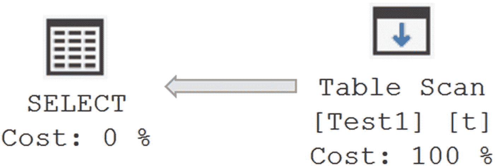

```
Table 'Test1'. Scan count 1, logical reads 22
CPU time = 0 ms,  elapsed time = 0 ms.
```

考虑到前面的 `SELECT` 语句检索的结果集很小，在 `c1` 列上创建非聚集索引可能是个不错的选择。

```sql
CREATE NONCLUSTERED INDEX incl ON dbo.Test1(C1);
```

你可以再次运行相同的 `SELECT` 命令。因为通过非聚集索引检索少量行比表扫描更经济，优化器使用了列 `c1` 上的非聚集索引，如图 8-20 所示。`STATISTICS IO` 报告的逻辑读取数如下：


```
Table 'Test1'. Scan count 1, logical reads 3
CPU time = 0 ms,  elapsed time = 0 ms.
```

尽管使用高选择性列检索小结果集是建议在该列上创建非聚集索引的良好指标，但在同一列上创建聚集索引可能同样有益甚至更好。为了评估聚集索引如何比非聚集索引更有益，请在同一列上创建聚集索引。

```sql
CREATE CLUSTERED INDEX icl ON dbo.Test1(C1);
```

再次运行相同的 `SELECT` 命令。从产生的执行计划（如后文图 8-22 所示）中，你可以看到即使对于小结果集，优化器也使用了聚集索引（而不是非聚集索引）。`SELECT` 语句的逻辑读取次数从三次减少到两次（图 8-21）。这种行为变化的发生是因为聚集索引本质上是一个覆盖索引，包含了表的所有列。


```
Table  'Test1'.  Scan count 1,  logical reads 2
CPU time = 0 ms,  elapsed time = 0 ms.
```

## 注意

因为一个表只能有一个聚集索引，并且该索引就是数据存储的地方，所以我通常会保留聚集索引用于最常用的数据访问路径。

### 非聚集索引相对于聚集索引的优势

正如你在前一节所学，在以下情况下，非聚集索引比聚集索引更受青睐：

-   当索引键大小较大时。
-   为了通过让数据库读取器在非聚集索引的页上工作，而数据库写入器修改数据页中的其他列（未包含在非聚集索引中），来帮助避免阻塞；在这种情况下，在数据页上工作的写入器不会阻塞能够从非聚集索引获取所有所需列值而无需访问基础表的读取器。我将在第 13 章详细解释这一点。
-   当查询引用的所有列（来自一个表）可以安全地包含在非聚集索引本身中时，如本节所述。
-   当你对聚集列存储索引执行点查询或有限范围查询时。聚集列存储索引能很好地支持分析式查询，但它根本不擅长点查找。这就是为什么你要专门为点查找添加一个非聚集索引。

正如已经确定的，使用非聚集索引时的数据检索性能通常比使用聚集索引时差，因为需要付出从非聚集索引行跳转到基础表中数据行的代价。在不需要跳转到数据行的情况下，非聚集索引的性能应该与聚集索引一样好，甚至更好。如果非聚集索引（键加上任何包含列）在页面级别包含了表所需的所有列，这是可能的。

为了理解非聚集索引可以优于聚集索引的情况，请考虑以下示例。假设在此情况下，你需要检查在 2008 年 6 月至 2008 年 9 月之间到期的信用卡。你可能有一个返回大量行的查询，如下所示：

```sql
SELECT cc.CreditCardID,
cc.CardNumber,
cc.ExpMonth,
cc.ExpYear
FROM Sales.CreditCard cc
WHERE cc.ExpMonth
BETWEEN 6 AND 9
AND cc.ExpYear = 2008
ORDER BY cc.ExpMonth;
```

以下是 I/O 和时间结果。图 8-22 显示了执行计划。

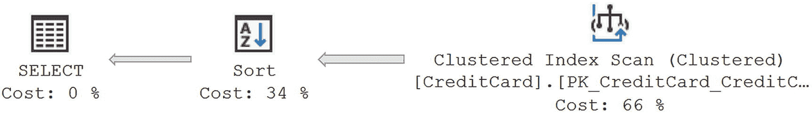

```
Table 'CreditCard'. Scan count 1, logical reads 189
CPU time = 0 ms,  elapsed time = 176 ms.
```

聚集索引建立在主键上，尽管对该表的大多数访问可能都通过该键，使得索引有用，但在此实例中，聚集索引的表现并不符合你的需求。虽然你可以扩展索引定义以包含查询中的所有其他列，但它们对于使聚集索引工作并非必需，并且会干扰主键的操作。相反，你可以使用 `INCLUDE` 操作将其中定义的列存储在索引的叶级别。它们不会以任何方式影响索引的键结构，但通过牺牲一些额外的磁盘空间，提供了使非聚集索引成为覆盖索引的能力（稍后将详细介绍）。在此实例中，创建一个不同的索引是合适的。

```sql
CREATE NONCLUSTERED INDEX ixTest
ON Sales.CreditCard
(
ExpYear,
ExpMonth)
INCLUDE
(
CardNumber);
```

现在再次运行查询，结果如下：

```
Table 'CreditCard'. Scan count 1, logical reads 12
CPU time = 0 ms,  elapsed time = 152 ms.
```

图 8-23 显示了相应的执行计划。

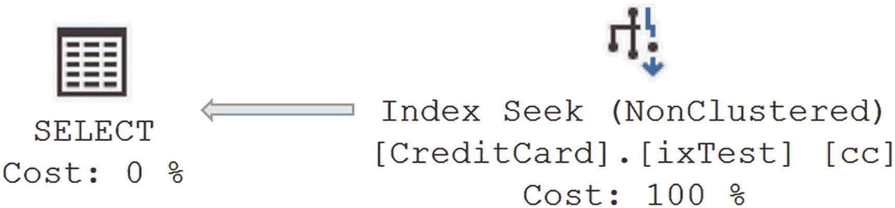


在这种情况下，`SELECT` 语句不包含任何需要从非聚集索引页跳转到表的数据页的列，而这通常就是对于大型结果集和/或排序输出而言，非聚集索引比聚集索引开销更大的原因。这种非聚集索引被称为 `覆盖索引`。

同样值得注意的是，我曾试验过将哪个列放在索引的前导边缘，`ExpMonth` 还是 `ExpYear`。在分别测试后，将 `ExpMonth` 放在前面的关联读取次数为 37 次，而将 `ExpYear` 放在前面则是 12 次。这是因为先按年份筛选比先按月份筛选需要浏览的页面更少。请记住，在创建索引时要通过彻底的测试来验证你的选择。

测试完成后清理索引。

```
DROP INDEX Sales.CreditCard.ixTest;
```

## 总结

在本章中，你学习了索引是一种有效减少查询逻辑读取次数和磁盘 I/O 的方法。尽管索引可能会给操作查询增加开销，但即使是 `UPDATE` 和 `DELETE` 这样的操作查询也能从索引中受益。

要为特定查询确定索引键列，需要评估查询的 `WHERE` 子句和连接条件。列的选择性、宽度、数据类型和列顺序等因素对于决定索引键中的列非常重要。由于索引主要用于检索少量行，因此索引列的选择性应该非常高。重要的是要注意，非聚集索引包含聚集索引键的值作为其行定位器，因为这种行为极大地影响了索引类型的选择。

在下一章中，你将学习更多关于可用以帮助调整查询的其他功能和其他类型的索引。

# 9. 索引分析

在上一章中，我介绍了围绕 B 树索引的概念。本章将基于这些信息，添加更多功能和更多索引类型。索引之间有许多有趣的交互可以为你所用。还有一些影响索引行为的设置，我在前一章中没有涉及。我将向你展示从系统中挤出更多性能的方法。最重要的是，我们将深入探讨列存储索引的细节，以及它们能为分析查询带来的巨大性能提升。

在本章中，我将涵盖以下主题：

*   高级索引技术
*   列存储索引
*   特殊索引类型
*   索引的其他特性

## 高级索引技术

这里有一些你可以考虑的更高级的索引技术：

*   `覆盖索引`：在第 8 章中已介绍。
*   `索引交叉`：使用多个非聚集索引来满足查询所需的所有（来自表的）列要求。
*   `索引连接`：利用索引交叉和覆盖索引技术来避免访问基础表。
*   `筛选索引`：为了能够对具有异常数据分布或稀疏列的字段进行索引，可以对索引应用筛选器，使其仅索引部分数据。
*   `索引视图`：这些视图将输出物化存储在磁盘上。
*   `索引压缩`：可以通过 SQL Server 压缩索引的存储，从而在页面上放置更多数据行，提高性能。

我将在以下小节中更详细地介绍这些主题。

### 覆盖索引

`覆盖索引` 是一个建立在所有满足 SQL 查询所需列上的非聚集索引，而无需访问堆或聚集索引。如果一个查询遇到索引并且根本不需要引用底层结构，那么该索引就可以被认为是一个覆盖索引。

例如，在以下 `SELECT` 语句中，无论列在语句中的何处使用，所有列（`StateProvinceID` 和 `PostalCode`）都应包含在非聚集索引中，以完全覆盖该查询：

```
SELECT  a.PostalCode
FROM    Person.Address AS a
WHERE   a.StateProvinceID = 42;
```

这样，查询所需的所有数据都可以从非聚集索引页获取，而无需访问数据页。这有助于 SQL Server 节省逻辑读取和物理读取。如果你运行该查询，你将获得如下所示的 I/O 和执行时间，以及图 9-1 中的执行计划：


图 9-1

没有覆盖索引的查询

```
Table 'Address'. Scan count 1, logical reads 19
CPU time = 0 ms,  elapsed time = 0 ms.
```

这里有一个经典的查找操作，`Key Lookup`（键查找）操作符从聚集索引中提取 `PostalCode` 数据，并将其与针对 `IX_Address_StateProvinceId` 索引的 `Index Seek`（索引查找）操作符的结果进行连接。

虽然你可以用两个键列重新创建索引，但另一种使索引成为覆盖索引的方法是使用新的 `INCLUDE` 操作符。这会在不改变索引结构的情况下将数据与索引一起存储。我稍后将详细说明为什么使用 `INCLUDE` 操作符。使用以下语句重新创建索引：

```
CREATE NONCLUSTERED INDEX IX_Address_StateProvinceID
ON Person.Address
(
StateProvinceID ASC
)
INCLUDE
(
PostalCode
)
WITH (DROP_EXISTING = ON);
```

如果你重新运行查询，执行计划（图 9-2）、I/O 和执行时间都会改变。（同样值得注意的是，0ms 不是正确的执行时间。使用以微秒 (μs) 记录执行时间的扩展事件会话，它是 177μs。）

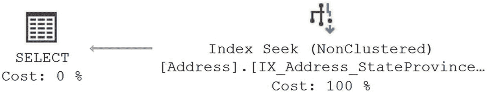

图 9-2

有覆盖索引的查询

```
Table 'Address'. Scan count 1, logical reads 2
CPU time = 0 ms,  elapsed time = 0 ms.
```

读取次数从 19 次下降到 2 次，执行计划也尽可能简单；它只是一个针对新的、改进后的索引的单一 `Index Seek`（索引查找）操作，该索引现在已是覆盖索引。覆盖索引是一种用于减少查询逻辑读取次数的有效技术。使用 `INCLUDE` 语句添加列使得实现此功能更加容易，而不会增加索引中的列数或索引键的大小，因为包含的列仅存储在索引的叶级。

`INCLUDE` 最适用于以下情况：

*   你不想增加索引键的大小，但仍希望使索引成为覆盖索引。
*   你有一个不能作为索引键列但可以通过 `INCLUDE` 命令添加到非聚集索引中的数据类型。
*   你已经超过了索引键列的最大数量（尽管这是一个最好避免的问题）。

在继续之前，请将索引恢复为其原始格式。

```
CREATE NONCLUSTERED INDEX IX_Address_StateProvinceID
ON Person.Address
(
StateProvinceID ASC
)
WITH (DROP_EXISTING = ON);
```


### 假簇集索引

覆盖索引在物理上按照顺序组织所有被索引列的数据。因此，从磁盘 I/O 的角度来看，一个不使用包含列的覆盖索引，对于完全由覆盖索引中的列满足的所有查询而言，就变成了一个簇集索引。如果查询的结果集需要排序输出，那么覆盖索引可以用来物理地维护列数据，使其顺序与结果集要求的顺序相同——然后它可以像簇集索引一样用于排序输出。如前面的示例所示，对于请求一定范围行和/或排序输出的查询，覆盖索引可以提供比簇集索引更好的性能。包含列不是键的一部分，因此不会像索引的键列那样提供相同的排序优势。

## 建议

为了利用覆盖索引的优势，在`SELECT`语句中要谨慎选择列列表，只移动你需要的数据（因此有标准禁止使用`SELECT *`的规定）。同样，使用尽可能少的列来保持覆盖索引的索引键尺寸较小也是一个好主意。在合适的地方使用`INCLUDE`语句添加列。由于覆盖索引包含了查询中使用的所有列，它往往变得非常宽，从而增加了覆盖索引的维护成本。你必须在覆盖索引带来的性能提升和维护成本之间取得平衡。如果索引中所有列的字节数与表中单个数据行的字节数相比很小，并且你确定利用该覆盖索引的查询会频繁执行，那么使用覆盖索引可能是有益的。

### 提示

覆盖索引也有助于解决阻塞和死锁问题，你将在第 20 章和第 21 章看到相关内容。

在构建大量覆盖索引之前，请考虑 SQL Server 如何能够通过索引交叉，有效地、自动地为查询动态创建覆盖索引。

### 索引交叉

如果一个表有多个索引，那么 SQL Server 可以使用多个索引来执行查询。SQL Server 可以利用多个索引，基于每个索引选择小子集数据，然后执行这两个子集的交集（即，只返回满足所有条件的行）。SQL Server 可以利用表上的多个索引，然后采用连接算法来获取两个子集之间的`索引交叉`。

在下面的`SELECT`语句中，对于`WHERE`子句中的列，表在`SalesPersonID`列上有一个非簇集索引，但在`OrderDate`列上没有索引：

```sql
--此查询故意使用 SELECT *
SELECT soh.*
FROM Sales.SalesOrderHeader AS soh
WHERE soh.SalesPersonID = 276
AND soh.OrderDate
BETWEEN '4/1/2005' AND '7/1/2005';
```

图 9-3 显示了此查询的执行计划。

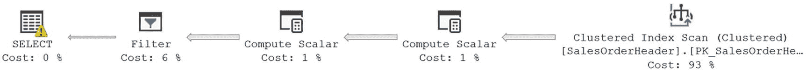

图 9-3
OrderDate 列上没有索引时的执行计划

如你所见，优化器没有使用`SalesPersonID`列上的非簇集索引。由于也需要`OrderDate`列的值，优化器选择了簇集索引来获取所有引用列的值。检索此数据的 I/O 和时间如下：

```text
Table 'SalesOrderHeader'. Scan count 1, logical reads 689
CPU time = 0 ms,  elapsed time = 3 ms.
```

为了提高查询性能，可以将`OrderDate`列添加到`SalesPersonId`列上的非簇集索引中，或者将其定义为同一索引的包含列。但在实际场景中，修改现有索引时你可能需要考虑以下几点：

*   出于各种原因，可能不允许修改现有索引。
*   现有的非簇集索引键可能已经很宽。
*   使用现有索引的其他查询的成本将受到修改的影响。

在这种情况下，你可以在`OrderDate`列上创建一个新的非簇集索引。

```sql
CREATE NONCLUSTERED INDEX IX_Test
ON Sales.SalesOrderHeader (OrderDate);
```

再次运行你的`SELECT`命令。

图 9-4 显示了`SELECT`语句的结果执行计划。


图 9-4
OrderDate 列上有索引时的执行计划

如你所见，SQL Server 利用了这两个非簇集索引作为索引查找（而不是扫描），然后采用交叉算法来获取两个子集的索引交叉。这由`哈希连接`表示。然后，它从结果数据集中执行`键查找`以检索索引中未包含的其余数据。但是，该计划的复杂性表明性能可能更差。检查统计信息 I/O 和时间，你可以看到实际上你确实获得了良好的性能提升：

```text
Table 'SalesOrderHeader'. Scan count 2, logical reads 10
Table 'Workfile'. Scan count 0, logical reads 0,
Table 'Worktable'. Scan count 0, logical reads 0
CPU time = 0 ms,  elapsed time = 2 ms.
```

即使该计划使用了表中的三个不同的访问点并且必须为处理`哈希连接`创建存储空间，读取次数也从 689 次下降到了 10 次。执行时间也减少了（在扩展事件中从 3,333μs 降至 2,279μs）。你还可以看到计划中发生了额外的操作，例如`键查找`，通过进一步调整索引你可能能够消除这些操作。然而，值得注意的是，由于你通过`SELECT *`命令返回所有列，因此无法通过使用`INCLUDE`列来有效地消除`键查找`，所以你可能还需要调整查询。


为了提高查询性能，SQL Server 可以使用表上的多个索引，尽管这种情况相对少见，因为它需要良好的统计信息和针对特定查询的精确索引。通常，我尝试在索引上使用更小、更窄的键，而不是宽键。SQL Server 经常可以一起使用索引，即使不这样做，使用窄索引的性能也更好。在创建覆盖索引时，识别包含覆盖索引所需大部分列的现有非聚集索引。您可能已经有两个现有的非聚集索引，它们共同服务于覆盖索引所需的所有列。如果可能，适当重新排列现有非聚集索引的列顺序，允许优化器考虑这两个非聚集索引之间的索引交集。

有时，您可能需要创建一个单独的非聚集索引，原因如下：

*   不允许重新排列现有索引中的列。

*   覆盖索引所需的一些列可能未包含在现有的非聚集索引中。

*   现有非聚集索引中的列总数可能多于覆盖索引所需的列数。

在这种情况下，您可以在剩余的列上创建一个非聚集索引。如果新索引和现有非聚集索引的组合列顺序满足覆盖索引的要求，优化器可能能够使用索引交集。在确定新索引的列及其顺序时，尝试通过同时关注其他查询来最大化其收益。

不要指望索引交集经常能工作。这取决于优化器内部做出的选择。然而，在创建索引时朝这个方向努力并没有什么问题。

删除为测试创建的索引。

```
DROP INDEX Sales.SalesOrderHeader.IX_Test;
```

## 索引连接

`索引连接`是索引交集的一种变体，其中覆盖索引技术应用于索引交集。如果没有单个索引能覆盖查询，但多个索引一起可以覆盖查询，SQL Server 可以使用索引连接来完全满足查询，而无需访问基表。

让我们看看这种索引技术在实际中的应用。对“索引交集”一节中的查询稍作修改，如下所示：

```
SELECT soh.SalesPersonID,
soh.OrderDate
FROM Sales.SalesOrderHeader AS soh
WHERE soh.SalesPersonID = 276
AND soh.OrderDate
BETWEEN '4/1/2013' AND '7/1/2013';
```

此查询的执行计划如图 9-5 所示，读取次数如下：

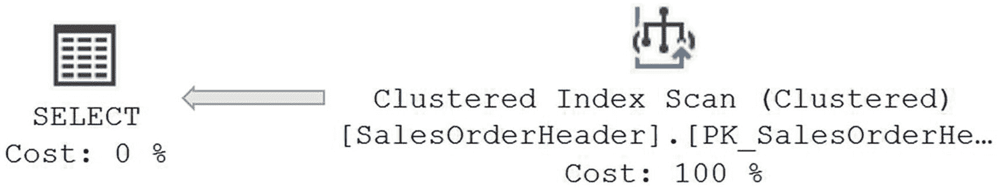

图 9-5

无索引连接时的执行计划

```
Table  'SalesOrderHeader'.  Scan count 1,  logical reads 689
CPU time = 0 ms,  elapsed time = 2 ms. (2345 us)
```

如图 9-5 所示，优化器没有使用现有的 `SalesPersonID` 列上的非聚集索引。由于查询还需要 `OrderDate` 列的值，优化器选择了聚集索引来检索查询中引用的所有列的值。如果在 `OrderDate` 列上创建一个索引，如下所示：

```
CREATE NONCLUSTERED INDEX IX_Test
ON Sales.SalesOrderHeader (OrderDate ASC);
```

并且重新运行查询，那么图 9-6 显示了结果，您可以在这里看到读取次数：

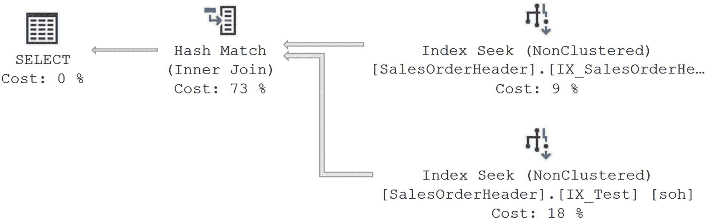

图 9-6

使用索引连接的执行计划

```
Table 'Workfile'. Scan count 0, logical reads 0
Table 'Worktable'. Scan count 0, logical reads 0
Table 'SalesOrderHeader'. Scan count 2, logical reads 10
CPU time = 0 ms,  elapsed time = 1 ms (1657 us).
```

两个索引的组合起到了覆盖索引的作用，将针对表的读取从 689 次减少到 10 次，因为它使用了两个连接的 `Index Seek` 操作，而不是聚集索引扫描。

但如果 `WHERE` 子句没有导致两个索引都被使用呢？相反，您知道两个索引都存在，并且对每个索引进行查找都可以像之前的查询一样工作，因此您选择使用索引提示。

```
SELECT soh.SalesPersonID,
soh.OrderDate
FROM Sales.SalesOrderHeader AS soh
WITH (INDEX(IX_Test, IX_SalesOrderHeader_SalesPersonID))
WHERE soh.OrderDate
BETWEEN '4/1/2013' AND '7/1/2013';
```

此新查询的结果如图 9-7 所示，I/O 如下：

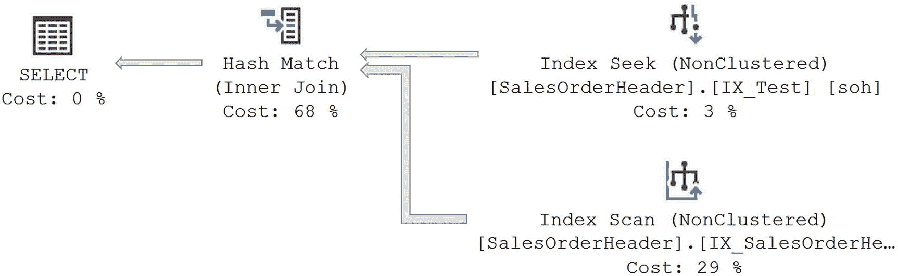

图 9-7

通过提示实现索引连接的执行计划

```
Table 'Workfile'. Scan count 0, logical reads 0
Table 'Worktable'. Scan count 0, logical reads 0
Table 'SalesOrderHeader'. Scan count 2, logical reads 64
CPU time = 0 ms,  elapsed time = 68 ms.
```

读取次数和执行时间明显增加。大多数情况下，优化器在索引和执行计划方面会做出良好的选择。尽管查询提示允许您从优化器手中夺过控制权，但这种控制可能带来的问题与它解决的一样多。试图强制使用索引连接以获得性能提升，反而因为强制选择索引而减慢了查询的执行速度。

在继续之前删除测试索引。

```
DROP INDEX Sales.SalesOrderHeader.IX_Test;
```

## 注意

在生成查询执行计划时，SQL Server 优化器会经历优化阶段，不仅用于确定要使用的索引和连接策略类型，还用于评估高级索引技术，如索引交集和索引连接。因此，在某些情况下，可以考虑创建多个窄索引，而不是创建宽覆盖索引。SQL Server 可以一起使用它们来充当覆盖索引，也可以在需要时分别使用它们。但您需要进行测试才能确定哪种方式在您的情况下效果更好——更宽的索引还是索引交集和连接。


### 过滤索引

过滤索引是一种非聚集索引，它使用一个过滤器（本质上是一个 `WHERE` 子句），旨在针对那些本身可能不具备良好选择性的列或多列，创建一组高度具有选择性的键。例如，一个包含大量 `NULL` 值的列可以存储为稀疏列，以减少这些 `NULL` 值带来的开销。使用该列添加一个过滤索引，将使你能够拥有一个仅针对非 `NULL` 数据的可用索引。理解这一点的最佳方式是看一个实际例子。

`Sales.SalesOrderHeader` 表包含超过 30,000 行。在这些行中，有超过 27,000 行在 `PurchaseOrderNumber` 列和 `SalesPersonId` 列中具有 `null` 值。如果你想要获取一个简单的采购订单号列表，查询可能如下所示：

```sql
SELECT soh.PurchaseOrderNumber,
soh.OrderDate,
soh.ShipDate,
soh.SalesPersonID
FROM Sales.SalesOrderHeader AS soh
WHERE PurchaseOrderNumber LIKE 'PO5%'
AND soh.SalesPersonID IS NOT NULL;
```

正如你所预料的，运行此查询会导致一个聚集索引扫描，以及如图 9-8 所示的 I/O 和执行时间：


*图 9-8：没有索引的执行计划*

```
Table 'SalesOrderHeader'. Scan count 1, logical reads 689
CPU time = 0 ms,  elapsed time = 52 ms.
```

为了解决这个问题，可以创建一个索引，并包含查询中的某些列，使其成为一个覆盖索引。

```sql
CREATE NONCLUSTERED INDEX IX_Test
ON Sales.SalesOrderHeader
(
PurchaseOrderNumber,
SalesPersonID
)
INCLUDE
(
OrderDate,
ShipDate
);
```

当你重新运行查询时，性能提升相当显著（参见图 9-9 以及以下结果中的 I/O 和时间）。


*图 9-9：带有覆盖索引的执行计划*

```
Table 'SalesOrderHeader'. Scan count 1, logical reads 5
CPU time = 0 ms,  elapsed time = 40 ms.
```

如你所见，覆盖索引将读取次数从 689 降至 5，时间从 52ms 降至 40ms。通常，这会被认为是一个不错的改进，可能足以满足系统需求。假设这个查询需要被频繁调用。现在，你能从中榨取的每一点速度都会带来回报。知道索引列中有如此多的数据是 `null`，你可以调整索引，使其过滤掉这些 `null` 值（反正索引也不会使用它们），从而减小索引树的大小，因此也减少了所需的搜索量。

```sql
CREATE NONCLUSTERED INDEX IX_Test
ON Sales.SalesOrderHeader
(
PurchaseOrderNumber,
SalesPersonID
)
INCLUDE
(
OrderDate,
ShipDate
)
WHERE PurchaseOrderNumber IS NOT NULL
AND SalesPersonID IS NOT NULL
WITH (DROP_EXISTING = ON);
```

最后一次运行查询得到了以下性能指标：

```
Table  'SalesOrderHeader'.  Scan count 1,  logical reads 4
CPU time = 0 ms,    elapsed time = 38 ms.
```

执行计划看起来是一样的，带有一个 `Index Seek`（索引搜索）。为了查看覆盖索引和过滤覆盖索引计划之间的差异，我们可以使用 SSMS 来比较计划。将第一个计划另存为文件（右键单击该计划并选择“将执行计划另存为”），然后，在第二个计划中，右键单击计划内部并选择“比较计划”。你将看到类似图 9-10 的内容。


*图 9-10：两个计划的比较*

执行计划中几乎没有直接的差异指示。在右侧的属性中，我强调了一个巨大的差异。虽然查询是相同的，但由于索引过滤掉了所有空值，谓词被更改以移除 `IS NOT NULL`，因为不再需要了。这是优化器内部称为 *简化* 的过程的一部分。

尽管在绝对数值上，将读取次数从 5 减少到 4 并不算多，但这是查询 I/O 成本 20% 的降低。如果这个查询像某些查询那样，在一分钟内运行数百甚至数千次，那么这 20% 的减少将确实会带来巨大的收益。另一个可见的收益证据是执行时间，它再次从 40ms 降至 38ms。

过滤索引在许多方面提高了性能。

*   通过减小索引大小来提高查询效率。
*   通过创建更小的索引来降低存储成本。
*   由于索引尺寸减小，从而降低了索引维护的成本。

但是，一切都有代价。你可能会遇到参数化查询与过滤索引不匹配的问题，从而阻止其使用。统计信息不是基于过滤条件更新的，而是像普通索引一样基于整个表更新。如同本书中的任何建议一样，请在你的环境中进行测试，以确保过滤索引是有帮助的。

建议使用它们的首要场景之一正是前面的例子：从索引中消除 `NULL` 值。你也可以用特殊的索引来隔离频繁访问的数据集，从而显著提高针对该数据的查询速度。你可以使用 `WHERE` 子句以类似于创建索引视图（在“索引视图”部分有更详细的介绍）的方式来过滤数据，而不会带来与索引视图相关的数据维护难题，方法是创建一个过滤索引，使其同时也是一个覆盖索引，就像前面的例子一样。

过滤索引在被访问或创建时需要一组特定的 ANSI 设置。

*   `ON`: `ANSI_NULLS`, `ANSI_PADDING`, `ANSI_WARNINGS`, `ARITHABORT`, `CONCAT_NULL_YIELDS_NULL`, `QUOTED_IDENTIFIER`
*   `OFF`: `NUMERIC_R0UNDAB0RT`

完成后，删除测试索引。

```sql
DROP INDEX Sales.SalesOrderHeader.IX_Test;
```

### 索引视图

SQL Server 中的数据库视图不存储任何数据。视图只是一个被存储的 `SELECT` 语句。你使用 `CREATE VIEW` 语句创建视图。你可以像对表一样对视图编写查询。当查询视图时，优化器会接收到 `SELECT` 语句的完整定义，并将其作为优化针对该视图查询的基础。通过优化过程，`SELECT` 语句的部分或全部定义可能会被用来满足对视图的查询。这里发生的简化程度取决于 `SELECT` 语句本身和针对该 `SELECT` 语句的查询的组合。

通过在视图上创建一个唯一的聚集索引，可以使数据库视图在磁盘上物化。这样的视图被称为 *索引视图* 或 *物化视图*。在视图上创建唯一的聚集索引后，视图的结果集会立即被物化，并持久化在数据库的物理存储中，从而节省了在查询执行期间执行昂贵操作的开销。在视图物化之后，可以在索引视图上创建多个非聚集索引。实际上，这将视图（再次强调，只是一个查询）变成了一个具有定义存储的真实表。

#### 益处

你可以使用索引视图通过以下方式提高查询性能：

*   聚合可以被预计算并存储在索引视图中，以最小化查询执行期间昂贵的计算。
*   表可以被预连接，产生的结果集可以被物化。
*   连接或聚合的组合可以被物化。

## 开销

索引视图可能会在 OLTP 数据库上产生显著的开销。索引视图的部分开销如下：

*   对基表的任何更改都必须通过执行视图的 `SELECT` 语句来反映到索引视图中。
*   对定义了索引视图的基表的任何更改，都可能引发索引视图的一个或多个非聚集索引的更改。如果更新了聚簇键，聚簇索引也必须随之更改。
*   索引视图增加了数据库的持续维护开销。
*   数据库需要额外的存储空间。

创建索引视图的限制包括：

*   视图上的第一个索引必须是唯一的聚集索引。
*   只有在创建了唯一的聚集索引之后，才能在索引视图上创建非聚集索引。
*   视图定义必须是*确定性*的——也就是说，对于给定的查询，它只能返回一种可能的结果。（SQL Server 联机丛书中提供了确定性和非确定性函数的列表。）
*   索引视图必须只引用同一数据库中的基表，不能引用其他视图。
*   索引视图可以包含 `float` 列。但是，此类列不能包含在聚集索引键中。
*   索引视图必须绑定到视图中引用的表的架构，以防止表架构的修改（这是一个常见问题）。
*   视图定义的语法有若干限制。（SQL Server 联机丛书中提供了视图定义的语法限制列表。）
*   必须固定的 `SET` 选项列表如下：
    *   `ON`：`ARITHABORT`、`CONCAT_NULL_YIELDS_NULL`、`QUOTED_IDENTIFIER`、`ANSI_NULLS`、`ANSI_PADDING` 和 `ANSI_WARNING`
    *   `OFF`：`NUMERIC_ROUNDABORT`

## 注意

如果查询连接设置与这些 ANSI 标准设置不匹配，您可能会在插入/更新/删除索引视图中使用的表时看到错误。

## 使用场景

报表系统从索引视图中获益最多。具有频繁写入操作的 OLTP 系统可能无法利用索引视图，因为在单个事务中更新视图和底层基表会增加维护成本。索引视图提供的净性能提升是视图提供的总查询执行节省与存储和维护视图的成本之间的差值。

如果您使用的是 SQL Server 企业版，查询优化器在查询执行期间使用索引视图时，无需在查询中显式引用该视图。这允许现有应用程序从新创建的索引视图中受益，而无需更改这些应用程序。否则，对于企业版以外的 SQL Server 版本，您需要在 T-SQL 代码中直接引用它。查询优化器仅考虑成本不小的查询的索引视图。您可能还会发现新的列存储索引比索引视图更适合您，尤其是当您对数据运行聚合或分析查询时。我将在本章后面介绍列存储索引。

让我们通过以下示例看看索引视图是如何工作的。考虑以下三个查询：

```sql
SELECT  p.[Name] AS ProductName,
        SUM(pod.OrderQty) AS OrderOty,
        SUM(pod.ReceivedQty) AS ReceivedOty,
        SUM(pod.RejectedQty) AS RejectedOty
FROM    Purchasing.PurchaseOrderDetail AS pod
JOIN    Production.Product AS p
        ON p.ProductID = pod.ProductID
GROUP BY p.[Name];

SELECT  p.[Name] AS ProductName,
        SUM(pod.OrderQty) AS OrderOty,
        SUM(pod.ReceivedQty) AS ReceivedOty,
        SUM(pod.RejectedQty) AS RejectedOty
FROM    Purchasing.PurchaseOrderDetail AS pod
JOIN    Production.Product AS p
        ON p.ProductID = pod.ProductID
GROUP BY p.[Name]
HAVING  (SUM(pod.RejectedQty) / SUM(pod.ReceivedQty)) > .08;

SELECT  p.[Name] AS ProductName,
        SUM(pod.OrderQty) AS OrderQty,
        SUM(pod.ReceivedQty) AS ReceivedQty,
        SUM(pod.RejectedQty) AS RejectedQty
FROM    Purchasing.PurchaseOrderDetail AS pod
JOIN    Production.Product AS p
        ON p.ProductID = pod.ProductID
WHERE   p.[Name] LIKE 'Chain%'
GROUP BY p.[Name];
```

所有三个查询都对 `PurchaseOrderDetail` 表的列使用了聚合函数 `SUM`。因此，您可以创建一个索引视图来预计算这些聚合，并在查询执行期间最小化这些复杂计算的成本。

以下是这些查询访问相应表时执行的逻辑读取次数：

```
Table 'Workfile'. Scan count 0, logical reads 0
Table 'Worktable'. Scan count 0, logical reads 0
Table 'Product'. Scan count 1, logical reads 6
Table 'PurchaseOrderDetail'. Scan count 1, logical reads 66
CPU time = 0 ms,  elapsed time = 31 ms.

Table 'Workfile'. Scan count 0, logical reads 0
Table 'Worktable'. Scan count 0, logical reads 0
Table 'Product'. Scan count 1, logical reads 6
Table 'PurchaseOrderDetail'. Scan count 1, logical reads 66
CPU time = 0 ms,  elapsed time = 16 ms.

Table 'PurchaseOrderDetail'. Scan count 5, logical reads 894
Table 'Product'. Scan count 1, logical reads 2
CPU time = 0 ms,  elapsed time = 1 ms.
```

我将使用以下脚本创建一个索引视图来预计算这些昂贵的计算并连接表：

```sql
CREATE OR ALTER VIEW Purchasing.IndexedView
WITH SCHEMABINDING
AS
SELECT pod.ProductID,
       SUM(pod.OrderQty) AS OrderQty,
       SUM(pod.ReceivedQty) AS ReceivedQty,
       SUM(pod.RejectedQty) AS RejectedQty,
       COUNT_BIG(*) AS Count
FROM Purchasing.PurchaseOrderDetail AS pod
GROUP BY pod.ProductID;
GO

CREATE UNIQUE CLUSTERED INDEX iv
ON Purchasing.IndexedView (ProductID);
GO
```

某些构造（如 `AVG`）是不允许的。（有关不允许的构造的完整列表，请参阅 SQL Server 联机丛书。）如果视图中包含聚合（如本例），则必须默认包含 `COUNT_BIG`。


索引视图会将聚合函数的输出**物化**到磁盘上。这样，在查询需要聚合结果时，就无需在查询执行期间再计算这些聚合函数。例如，第三个查询请求了`PurchaseOrderDetail`表中某些产品的`ReceivedQty`和`RejectedQty`的总和。由于索引视图中已经为`PurchaseOrderDetail`表中的每个产品物化了这些值，你可以使用以下针对该索引视图的`SELECT`语句来直接获取这些预聚合的值：

```sql
SELECT  iv.ProductID,
        iv.ReceivedQty,
        iv.RejectedQty
FROM    Purchasing.IndexedView AS iv;
```

如图 9-11 的执行计划所示，该`SELECT`语句直接从索引视图中检索值，而无需访问基表（`PurchaseOrderDetail`）。


图 9-11

使用索引视图的执行计划

索引视图不仅能使直接基于该视图的查询受益，也能使其他可能对物化数据感兴趣的查询受益。例如，有了索引视图后，针对`PurchaseOrderDetail`的三个查询无需重写即可受益（第一个查询的执行计划见图 9-12），并且逻辑读取次数减少，如下所示：


图 9-12

自动使用索引视图的执行计划

```
Table 'Product'. Scan count 1, logical reads 13
Table 'IndexedView'. Scan count 1, logical reads 4
CPU time = 0 ms,  elapsed time = 53 ms.
Table 'Product'. Scan count 1, logical reads 13
Table 'IndexedView'. Scan count 1, logical reads 4
CPU time = 0 ms,  elapsed time = 1 ms.
Table 'IndexedView'. Scan count 0, logical reads 10
Table 'Product'. Scan count 1, logical reads 2
CPU time = 0 ms,  elapsed time = 0 ms. (214 us)
```

即使查询并未修改为引用新的索引视图，优化器仍然会使用索引视图来提升性能。因此，即使是数据库应用程序中已有的查询，也能从新创建的索引视图中获益，而无需对查询本身进行任何修改。当然，如果你需要的聚合方式与索引视图所提供的不同，那你就没那么幸运了。这种情况下，列存储索引又能大显身手了。

最后，确保清理环境。

```sql
DROP VIEW Purchasing.IndexedView;
```

### 索引压缩

数据和索引压缩功能自 SQL Server 2008（最初在企业版和开发者版中可用，目前所有版本均支持）引入。`压缩`索引意味着将更多的键信息存储到单个数据页上。这可以带来显著的性能提升，因为存储索引所需的页数和索引层级更少。不过，由于索引中的键值在压缩和解压缩时会产生 CPU 开销，因此这可能并非适用于所有索引的解决方案。内存也会受益，因为压缩后的数据页在内存中也以压缩状态存储。

默认情况下，索引不会被压缩。你必须在创建索引时显式指定进行压缩。压缩有两种类型：行级压缩和页级压缩。`行级压缩`识别可以压缩的列（详见在线丛书），并压缩该列的存储，且对每一行都如此处理。`页级压缩`实际上先使用行级压缩，然后在此基础上增加额外的压缩，以减少数据页上存储的非行元素的存储空间。在页类型下，索引中的非叶页不会被压缩。要查看索引压缩的实际效果，请考虑以下索引：

```sql
CREATE NONCLUSTERED INDEX IX_Test
ON Person.Address
(
    City ASC,
    PostalCode ASC
);
```

此索引在本章前面已经创建过。如果你按照这里的定义重新创建它，就会在包含与第一个测试索引`IX_Test`相同两列的索引上创建行类型压缩。

```sql
CREATE NONCLUSTERED INDEX IX_Comp_Test
ON Person.Address
(
    City,
    PostalCode
)
WITH (DATA_COMPRESSION = ROW);
```

再创建一个索引。

```sql
CREATE NONCLUSTERED INDEX IX_Comp_Page_Test
ON Person.Address
(
    City,
    PostalCode
)
WITH (DATA_COMPRESSION = PAGE);
```

要检查索引的存储情况，修改针对`sys.dm_db_index_physical_stats`的原始查询，增加另一列`compressed_page_count`。

```sql
SELECT i.name,
       i.type_desc,
       s.page_count,
       s.record_count,
       s.index_level,
       s.compressed_page_count
FROM sys.indexes AS i
JOIN sys.dm_db_index_physical_stats(DB_ID(N'AdventureWorks2017'),
                                    OBJECT_ID(N'Person.Address'),
                                    NULL,
                                    NULL,
                                    'DETAILED') AS s
ON i.index_id = s.index_id
WHERE i.object_id = OBJECT_ID(N'Person.Address');
```

运行该查询，你会得到如图 9-13 所示的结果。


图 9-13

关于压缩索引的`sys.dm_db_index_physical_stats`输出

对于此索引，你可以看到页压缩成功地将索引从 106 页减少到 25 页，其中 25 页是压缩过的。在这个例子中，行类型压缩在索引的页数上产生了一定差异，但效果远不如页压缩那样显著。

要查看压缩在不修改代码的情况下为你带来的效果，请运行以下查询：

```sql
SELECT  a.City,
        a.PostalCode
FROM    Person.Address AS a
WHERE   a.City = 'Newton'
        AND a.PostalCode = 'V2M1N7';
```

在我的系统上，优化器选择使用`IX_Comp_Page_Test`索引。即使我通过如下方式强制它使用`IX_Test`索引，性能也是相同的，只是在第二次查询中多读取了一个页面：

```sql
SELECT  a.City,
        a.PostalCode
FROM    Person.Address AS a WITH (INDEX = IX_Test)
WHERE   a.City = 'Newton'
        AND a.PostalCode = 'V2M1N7';
```

因此，尽管一个索引占据的空间大幅减少，页数大约只有原来的四分之一，但这是以零性能代价实现的。

压缩对 SQL Server 内部的其他一系列进程有影响，因此在实施之前，应彻底探究其可能的影响和收益。在大多数情况下，CPU 的成本完全被其他地方带来的好处所抵消，但你应该测试并监控你的系统。

测试完成后，清理索引。

```sql
DROP INDEX Person.Address.IX_Test;
DROP INDEX Person.Address.IX_Comp_Test;
DROP INDEX Person.Address.IX_Comp_Page_Test;
```


## 列存储索引

列存储索引自 SQL Server 2012 版引入，用于按列而非按行来索引信息。这在数据仓库系统中尤其有用，因为这类系统需要快速聚合和访问大量数据。列存储索引中存储的信息按每个列进行分组，且这些分组是单独存储的。这使得对不同列集合的聚合操作变得极快，因为可以直接访问列存储索引，而无需访问大量行来聚合信息。此外，由于存储是面向列的，因此你只会触及你感兴趣的列对应的存储，而不是整行的所有列，从而获得更快的速度。最后，由于列式数据以压缩方式存储，你还会看到列存储带来的一些性能提升。列存储有两种类型，类似于常规索引：聚集列存储索引和非聚集列存储索引。在 SQL Server 2016 之前，非聚集列存储索引无法更新。你必须删除它然后重新创建（或者，如果你使用了分区功能，可以切换进和切换出不同的分区）。从 SQL Server 2016 开始，你可以在事务数据库中使用非聚集列存储索引，以支持实时分析查询。聚集列存储索引在 SQL Server 2014 中引入，并且在该版本及仅限生产机器的企业版中可用。在 SQL Server 2016 和 SQL Server 2017 中，列存储功能在所有版本中均可用。使用列存储索引存在许多限制。

### 使用限制

你无法使用某些数据类型，例如 `binary`、`text`、`varchar(max)`（在 SQL Server 2017 中受支持）、`uniqueidentifier`（在 SQL Server 2012 中，在 SQL Server 2014 及更高版本中可用）、`clr` 数据类型或 `xml`。

- 你无法在稀疏列上创建列存储索引。
- 你想要创建聚集列存储索引的表不能有任何约束，包括主键或外键约束。

有关限制的完整列表，请参阅 SQL Server 联机丛书。

### 使用场景

列存储索引主要设计用于数据仓库内部，因此在处理相关存储模式（如星型架构）时效果最佳。由于列存储索引中数据的存储方式，在处理分区数据时你会频繁看到列存储索引的使用。列存储索引的设计方式使其在处理至少 100,000 行的大型数据集时性能最优。在 AdventureWorks2017 数据库中，没有任何表按当前配置足够大，能够真正发挥列存储索引的作用。为了有足够的数据，我将使用 Adam Machanic 的脚本 `make_big_adventure.sql` 来创建几个大表：`dbo.bigTransactionHistory` 和 `dbo.bigProduct`。该脚本可从 [`http://bit.ly/2mNBIhg`](http://bit.ly/2mNBIhg) 下载。

### 列存储索引存储

列存储索引真正的优势在于，通过聚集列存储索引和非聚集列存储索引，你可以根据系统的目标来定制系统内部的存储行为，而不会牺牲其他查询性能。如果你的系统是一个拥有大型事实表的数据仓库，你可以使用聚集列存储索引来定义数据存储，因为绝大多数查询都将受益于该聚集列存储索引。但是，如果你有一个 OLTP 系统，偶尔需要运行分析类查询，你可以在常规的聚集和非聚集索引（也称为 *行存储索引*）之外，再使用非聚集列存储索引。

列存储索引有以下优点：

- 在数据仓库和分析工作负载中提升性能
- 出色的数据压缩
- 减少 I/O
- 更多数据可容纳在内存中

### 术语定义

为了更全面地理解列存储索引，我应该定义几个术语。

- *行组*：一组按列方式压缩和存储的行。
- *段*：也称为列段，是指压缩并存储在磁盘上的一个数据列。每个行组为表中的每一列都包含一个列段。
- *字典*：为某些数据类型定义的编码，用于定义段。这些字典可以是全局的（适用于所有段），也可以是局部的（仅用于一个段）。

### 存储机制与 Delta 存储

列存储数据不像行存储索引那样存储在 B 树中。相反，数据在表的每个列上进行透视和聚合。信息也被分解为称为 *行组* 的子集。每个行组最多包含 1,048,576 行。当数据以批处理方式加载到列存储中时，如果行数超过 100,000，它会自动分解为行组。当列存储索引中的数据被更新时，更改存储在所谓的 *deltastore* 中。这实际上是一个由 SQL Server 引擎在后台控制的 B 树索引。添加的行会累积在 deltastore 中，直到达到 102,400 行，然后它们将被透视并压缩到行组中。执行此过程的程序称为 *元组移动器*。从列存储中删除行取决于行所在的位置。deltastore 中的行会被直接移除。已经压缩到行组中的行则进行逻辑删除。另一个 B 树索引（同样在后台管理）维护着一个已删除行的标识符列表。更新操作的工作方式类似，包括一次删除（逻辑或实际删除，取决于位置）和一次插入到 deltastore 中。

如果你正在以小批量方式进行加载，并且有很多更新操作，你将需要处理 deltastore。如果你在行存储表上使用非聚集列存储索引，这种情况极有可能发生。大体上，deltastore 会自行管理。然而，在可能的情况下，重建列存储索引以清除逻辑删除的行并获得压缩的行组，这是一个不错的主意。你可以使用 `ALTER INDEX REORGANIZE` 命令来执行此操作。我们将在第 14 章中详细讨论。

列存储索引的分组、透视和压缩存储方式在处理分组数据时可带来极佳的性能提升。但是，在进行 OLTP 式查询所需的单行或范围查找时，它的速度要慢得多，问题也更多。

聚集和非聚集列存储索引的行为基本相同。区别在于，聚集列存储索引（就像聚集行存储索引一样）直接存储数据。而非聚集列存储索引则必须将数据存储并管理在其他地方（在行存储索引中）。


### 列存储索引行为

以下面这个查询为例：
```sql
SELECT bp.Name AS ProductName,
COUNT(bth.ProductID),
SUM(bth.Quantity),
AVG(bth.ActualCost)
FROM dbo.bigProduct AS bp
JOIN dbo.bigTransactionHistory AS bth
ON bth.ProductID = bp.ProductID
GROUP BY bp.Name;
```

如果你在当前配置的表上运行此查询，会看到一个类似于图 9-14 的执行计划。

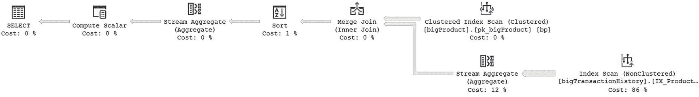
**图 9-14**: 针对 GROUP BY 查询的多个聚合操作

该查询的读取次数和执行时间如下：
```
Table 'Worktable'. Scan count 0, logical reads 0
Table 'bigTransactionHistory'. Scan count 1, logical reads 131819
Table 'bigProduct'. Scan count 1, logical reads 601
CPU time = 16 ms,  elapsed time = 13356 ms.
```

读取量非常大，此查询消耗了相当多的 CPU 资源，执行速度也不算快。我们有两种类型的列存储索引可供选择。如果你想只为现有表添加一个非聚集列存储索引，这也是可行的。我们也可以将此处的数据迁移到聚集列存储索引上，但查询的行为是相同的。为了示例的简洁性，我们将仅使用非聚集列存储索引。创建非聚集列存储索引时，你可以选择列，以避免包含任何可能不受列存储索引支持的列。

```sql
CREATE NONCLUSTERED COLUMNSTORE INDEX ix_csTest
ON dbo.bigTransactionHistory
(
ProductID,
Quantity,
ActualCost
);
```

有了非聚集列存储索引后，优化器现在可以选择使用该索引来满足之前的查询。就像优化器可用的所有其他索引一样，列存储索引也有相关的开销，因此对于针对该表的任何给定查询，它可能会也可能不会被选中来满足需求。在这种情况下，如果你重新运行原始的聚合查询，可以看到优化器判定使用列存储索引带来的开销对查询是有利的。执行计划现在如图 9-15 所示。


**图 9-15**: 列存储索引代替了聚集索引

如你所见，计划中有许多不同之处。这里有很多内容需要解析，但在我们开始之前，先看一下读取次数和执行时间。结果是相同的：在我的系统上是 24,975 行。真正的差异体现在查询的读取次数和执行时间上。
```
Table 'bigTransactionHistory'. Scan count 4, logical reads 0
Table 'bigTransactionHistory'. Segment reads 31, segment skipped 0.
Table 'bigProduct'. Scan count 3, logical reads 620
Table 'Worktable'. Scan count 0, logical reads 0
Table 'Worktable'. Scan count 0, logical reads 0
CPU time = 1922 ms,  elapsed time = 1554 ms.
```

检索数据所需读取量的急剧减少以及速度的些微提升，都是能够引用按列而非按行索引的信息所带来的结果。执行时间从 13.3 秒缩短到了 1.5 秒。这正是你可以期待的那种巨大的性能提升。

让我们稍微解析一下这个执行计划，因为这是我们看到的第一个真正复杂的计划。首先要注意的是，优化器选择将其设为并行计划。你可以在操作符上看到一个黄色的符号标志，例如图 9-16 中的 `Columnstore Index Scan` 操作符。

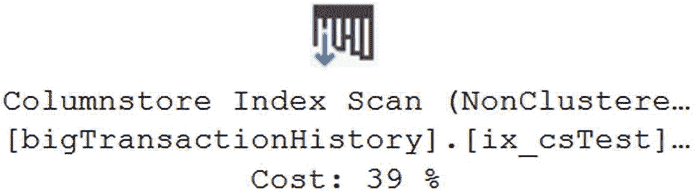
**图 9-16**: 并行执行中的列存储索引扫描操作符

有一种处理数据的新方法叫做 `批处理模式`。目前，只有包含列存储索引的查询才使用批处理模式处理，但微软已宣布这一情况将会改变。批处理模式在计划的操作中以批次方式处理行。这是一个巨大的优势。行处理模式意味着每行在计划的操作符之间移动时都要经历一个协商过程：10,000 行，10,000 次协商。这是非常密集的。批处理模式则以批次移动行，而不是单独移动。批次分布大致均匀，每批最多 1,000 行（尽管这会有所变化）。这意味着，移动 10,000 行只需要 10 次协商，而不是 10,000 次。这是一个巨大的性能优势。此外，批处理模式利用多处理器来帮助加速执行。要确定计划中操作符的执行模式，请查看该操作符的属性。图 9-17 显示了 `Columnstore Index Scan` 的相应属性。


**图 9-17**: 实际执行模式

批处理模式处理是处理列存储索引时的首选方法，因为它通常比替代方案——行处理模式——快得多。在 SQL Server 2017 之前，查询通常需要一个并行执行计划才能进入批处理模式处理。然而，SQL Server 2017 允许在非并行执行计划中进行批处理模式处理。

SQL Server 联机丛书中记录了一组有限的操作会导致批处理模式处理，但在具有足够处理器的系统上对这些操作进行操作时，你将看到另一个显著的性能提升。

与聚集和非聚集索引不同，列存储索引不要求列按特定顺序排列。同样，与其他索引不同，你应该在列存储索引中放置多个列，以便在这些列上获得好处。换句话说，如果你预计将来某个时候需要查询某个列，请主动将其添加到列存储索引定义中。但如果你从列存储索引中检回大量列，可能会看到一些性能下降。

列存储索引增强性能的另一个方面是段消除。每个段显示该段内的最小值和最大值（通过实际值或对字典的引用）。如果一个段不可能包含给定值，它就会被跳过。当你将分区与列存储索引结合使用时，这一点变得尤为重要。这样，即使你没有获得分区消除，如果某个分区中包含的段内的数据都不符合我们的筛选条件，段消除也会有效地跳过该分区。

在图 9-15 的执行计划中，还可见列存储索引的另一个行为。在 SQL Server 2017 和 Azure SQL Database 中引入的是 `批处理模式自适应联接`。让我们看一下图 9-18 中计划子集的展开视图。


**图 9-18**: 自适应联接及其伴随行为


由于选择错误的连接类型可能严重损害性能，因此新增了一种连接样式：自适应连接。自适应连接会为给定执行计划创建两个可能的分支。你可以在图 9-18 中看到这两个分支，分别是针对`pk_bigProduct`索引的`Clustered Index Scan`和`Clustered Index Seek`。自适应连接可以在执行时决定使用哈希连接或嵌套循环连接。其实现方式是将数据加载到一个内部管理的自适应缓冲区中（我们无法直接看到它）。如果未达到行阈值，该缓冲区将成为循环连接的外部行驱动程序。否则，将构建哈希表以进行常规哈希连接。不过，一旦表创建完成，它就可以根据行数确定哪种连接类型更优。在自适应连接选定其拟使用的连接类型后，它将沿两个分支之一继续执行。上方的分支用于哈希匹配连接，下方的分支用于循环连接。用于确定特定连接类型的信息存储在执行计划的属性中，如图 9-19 所示。


图 9-19：自适应连接属性的子集

在图 9-19 所示属性的中部附近，是`Adaptive Threshold Rows`属性。当哈希表中的行数等于或低于此值时，自适应连接将使用循环连接。高于此值时，自适应连接将使用哈希匹配连接。你还可以看到用于估计和实际使用的连接类型的属性，因此你可以观察到特定查询的行为如何随着其访问数据的变化而变化。

从这个连接中还可以看出，你可以随意混合查询列存储和行存储表。始终适用相同的基本规则。

你可以使用多种 DMO（动态管理对象）来查看列存储索引的状态。一个立即有用的视图是`sys.dm_db_column_store_row_group_physical_stats`。它显示了行组的状态，并且易于查询。

```sql
SELECT ddcsrgps.row_group_id,
ddcsrgps.state_desc,
ddcsrgps.total_rows,
ddcsrgps.trim_reason_desc,
ddcsrgps.transition_to_compressed_state_desc
FROM sys.dm_db_column_store_row_group_physical_stats AS ddcsrgps
WHERE ddcsrgps.object_id = OBJECT_ID('dbo.bigTransactionHistory')
ORDER BY ddcsrgps.row_group_id DESC;
```

来自`dbo.bigTransationHistory`的列存储索引输出如图 9-20 所示。

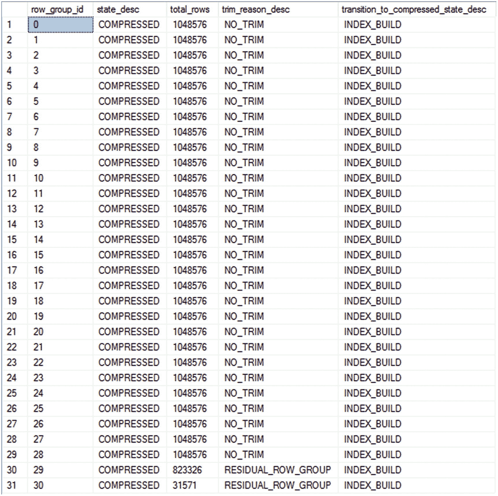

图 9-20：`sys.dm_db_column_store_row_group_physical_stats`的输出

现在，你可以通过查看`transition_to_compressed_state_desc`来了解行是如何加载和分组到索引中的，是否存在压缩，以及行是如何移动的。

我将保留这些表和列存储索引，供本书后续示例使用。

## 建议

首先，你应该始终专注于为相关数据选择正确的聚集索引。通常，OLTP 系统将从行存储、B-树索引中获益最多。同样通常地，数据仓库、报告或分析系统将从列存储索引中获益最多。两种情况都可能存在例外，但这应该是基本的指导原则。

因为你可以向聚集列存储添加行存储索引，也可以向行存储表添加非聚集列存储索引，所以你可以处理任一情况下的异常行为。列存储对于具有大量行的表是理想的。较小的表可能仍会获得一些好处，但也可能不会。在你的系统上进行测试以确定。

处理列存储索引时，通常应遵循以下规则：

*   将数据加载到列存储中时，如果可能，在单个事务中完成；如果不行，则以大于 102,400 行的批次加载，以利用压缩的行组。
*   尽量减少对聚集列存储中数据的小规模更新，以避免处理增量存储的开销。
*   根据数据移动情况，计划定期重建聚集和非聚集列存储的索引，以便从行组中完全消除已删除的数据，并将修改的数据从增量存储移动到行组中。
*   维护列存储索引上的统计信息，类似于你对行存储索引所做的维护。虽然它们不像行存储索引那样可见，但仍必须进行维护。

## 特殊索引类型

随着 Microsoft 向 SQL Server 引入特殊的数据类型和存储机制，也为这些特殊存储类型开发了索引方法。详细解释所有这些特殊索引类型的细节超出了本书的范围。在以下部分中，我将介绍每种索引类型的基本概念，以便在优化查询时可能使用它们。

### 全文索引

你可以使用 `VARCHAR`、`NVARCHAR`、`CHAR` 和 `NCHAR` 字段中的 `MAX` 值在 SQL Server 中存储大量文本。针对这些大字段的普通聚集或非聚集索引将难以支持，因为单个值可能远远超过索引内的页大小。因此，一种不同的文本索引机制是使用全文引擎，该引擎必须运行才能处理全文索引。你也可以在 `VARBINARY` 数据上构建全文索引。

你需要在表上有一个唯一的列。性能最佳的候选列是整数：`INT` 或 `BIGINT`。然后，该列与单词一起用于标识它属于表中的哪一行，以及它在字段中的位置。SQL Server 允许对全文索引进行增量更改（包括更改跟踪或基于时间的更改）以及完全重建。

SQL Server 2012 引入了另一种处理文本的方法，称为 *语义搜索*。它使用文档中的短语来识别存储在数据库中的不同文本集之间的关系。

### 空间索引

SQL Server 2008 引入了存储空间数据的功能。这些数据可以是 `geometry` 类型，也可以是非常复杂的地理 `geography` 类型，字面上标识地球上的一个点。至少可以说，为这种类型的数据建立索引是复杂的。SQL Server 将这些索引存储在扁平的 B-树中，类似于常规索引，但它是四个相互链接的网格的层次结构。每个网格可以被赋予低、中或高的密度，以概述每个网格的大小。存在一些机制来支持空间数据类型的索引，以便不同类型的查询（例如查找一个对象何时在另一个对象的边界内或附近）可以从索引固有的性能提升中受益。

只能针对 `geometry` 或 `geography` 类型的列创建空间索引。它必须位于基础表上，该表不能有索引视图，并且表必须具有主键。你可以在表的任何给定列上创建最多 249 个空间索引。不同的索引用于定义不同类型的索引行为。更多信息请参阅 Alastair Aitchison 所著的《Pro Spatial with SQL Server 2012》（Apress, 2012）一书。


### XML

作为 SQL Server 2005 中引入的数据类型，`XML` 可以作为格式良好的 `XML` 数据存储在 SQL Server 中，而非纯文本。这些数据可以使用 SQL Server 支持的 `XQuery` 语言进行查询。为了提升性能，还定义了一套特殊的索引。`XML` 列可以有一个主索引和多个辅助索引。主 `XML` 索引会解构 `XML` 数据的属性、特性和元素，并将其存储为一个内部表。表上必须有主键，并且该主键必须是聚集的，才能创建 `XML` 索引。创建 `XML` 索引后，就可以创建辅助索引。这些索引有 `Path`、`Value` 和 `Property` 类型，具体取决于查询 `XML` 的方式。更多细节，请查阅 Jason Strate 和 Grant Fritchey 所著的 *Expert Performance Indexing in SQL Server*（Apress, 2015）。

## 索引的其他特性

其他索引属性可能对性能产生积极或消极的影响。这里探讨其中一些行为。

### 不同的列排序顺序

SQL Server 支持为复合索引的不同列指定不同的排序顺序。假设你需要一个索引，其中第一列按升序排序，第二列按降序排序，以消除可能代价高昂的排序操作。你可以如下实现：

```
CREATE NONCLUSTERED INDEX i1 ON t1(c1 ASC, c2 DESC);
```

### 在计算列上创建索引

只要为计算列定义的表达式满足某些限制（例如仅引用包含该计算列的表中的列，且是确定性的），你就可以在计算列上创建索引。

### 在 `BIT` 数据类型的列上创建索引

SQL Server 允许你在具有 `BIT` 数据类型的列上创建索引。单独在 `BIT` 数据类型列上创建索引的能力优势不大，因为这样的列通常只有两个唯一值，除非极少数情况下绝大多数数据为一个值，而只有少数行为另一个值。如前所述，这种低选择性（唯一值数量少）的列通常不是索引的良好候选。然而，当你考虑覆盖索引时，这个特性就变得有价值了。因为覆盖索引需要包含索引中的所有列，将 `BIT` 数据类型列添加到索引键的能力允许覆盖索引在需要时包含这样的列（在 `INCLUDE` 子句所涵盖的列之外）。

### 将 `CREATE INDEX` 语句作为查询处理

`CREATE INDEX` 操作被集成到查询处理器中。优化器可以利用现有索引来减少扫描成本和排序开销。

例如，考虑 `Person.Address` 表。该表上存在一个包含多列的非聚集索引：`AddressLine1`、`AddressLine2`、`City`、`StateProvinceId` 和 `PostalCode`。如果你需要对 `City` 列运行查询，利用现有索引，你会得到对该索引的扫描。现在创建一个新索引如下：

```
CREATE NONCLUSTERED INDEX IX_Test
ON Person.Address(City);
```

在图 9-21 中可以看到，优化器选择扫描索引来创建新索引，而不是扫描表，因为新索引所需的列已包含在另一个非聚集索引中。


图 9-21

CREATE INDEX 的执行计划

完成后务必删除该索引。

```
DROP INDEX IX_Test ON Person.Address;
```

### 并行索引创建

SQL Server 支持 `CREATE INDEX` 语句的并行计划，如同其他 SQL 查询一样。在多处理器机器上，索引创建不会局限于单个处理器，而是会从多处理器中受益。你可以使用 SQL Server 的 `max degree of parallelism` 配置参数来控制 `CREATE INDEX` 语句中使用的处理器数量。通过执行 `sp_configure` 存储过程（在设置 `show advanced options` 后）可以看到此参数的默认值。

```
EXEC sp_configure
'max degree of parallelism';
```

默认值 `0` 意味着 SQL Server 可以使用系统中所有可用的 CPU 来并行执行 T-SQL 语句。在具有四个处理器的系统上，可以通过执行 `sp_configure` 将最大并行度设置为 `2`。

```
EXEC sp_configure
'max degree of parallelism',
2;
RECONFIGURE WITH OVERRIDE;
```

这允许 SQL Server 最多使用两个 CPU 来并行执行 T-SQL 语句。此配置设置立即生效，无需重启服务器。

查询提示 `MAXDOP` 可用于 `CREATE INDEX` 语句。另外，请注意并行 `CREATE INDEX` 功能仅在 SQL Server 企业版中可用。

### 在线索引创建

默认的索引创建是作为离线操作完成的。这意味着会在表上放置排他锁，在创建索引期间限制用户访问。可以以在线操作的方式创建索引。这允许用户在索引创建期间继续访问数据。代价是增加创建索引所需的时间和资源。从 SQL Server 2012 开始引入，包含 `varchar(MAX)`、`nvarchar(MAX)` 和 `varbinary(MAX)` 的索引实际上可以在线重建。在线索引操作仅在 SQL Server 企业版中可用。

### 考虑使用数据库引擎优化顾问

一种简单的索引方法是使用 SQL Server 提供的数据库引擎优化顾问工具。这个工具是基于使用情况的工具，它会查看特定的工作负载，并与查询优化器协作以确定各种索引组合的相关成本。基于该工具的分析，你可以适当地添加或删除索引。

### 备注

我将在第 10 章更深入地介绍数据库引擎优化顾问工具。

## 小结

在本章中，你学习了索引内外存在许多附加功能，这些功能扩展了前一章定义的行为。

在下一章，你将学习更多关于数据库引擎优化顾问的知识，这个由 SQL Server 提供的工具可以帮助你确定针对给定 SQL 工作负载的数据库中正确的索引。

# 10. 数据库引擎优化顾问

SQL Server 的性能通常取决于数据库表上是否有正确的索引。然而，随着工作负载和数据随时间变化，现有索引可能不完全合适，可能需要新的索引。决定正确索引的任务很复杂，因为有利于一组查询的索引更改可能对另一组查询有害。

为了帮助你完成这个过程，SQL Server 提供了一个名为数据库引擎优化顾问的工具。这个工具可以帮助为给定的工作负载识别最优的索引和统计信息集，而无需具备数据库架构、工作负载或 SQL Server 内部的专家知识。它还可以为少量有问题的查询推荐调优选项。除了该工具的优点外，本章还涵盖其局限性，因为它是一个如果不慎使用可能弊大于利的工具。

在本章中，我将涵盖以下主题：

*   数据库引擎优化顾问如何工作
*   如何在有问题的查询集上使用数据库引擎优化顾问获取索引建议，包括如何定义跟踪
*   数据库引擎优化顾问的局限性


## 数据库引擎调优顾问机制

你可以通过选择 **Microsoft SQL Server 2017 ➤ SQL Server 2017 Database Engine Tuning Advisor** 来直接运行数据库引擎调优顾问。你也可以从命令提示符 (`dta.exe`)、SQL Profiler（工具 ➤ 数据库引擎调优顾问）、 Management Studio 中的查询窗口（高亮显示所需查询并选择查询 ➤ 在数据库引擎调优顾问中分析查询）或直接从 Management Studio（选择工具 ➤ 数据库引擎调优顾问）来运行它。一旦工具打开并连接到服务器，你应该会看到一个类似图 10-1 的窗口。本节我将介绍定义和运行分析的选项，然后在下一节中提供一些详细的示例。


图 10-1

在数据库引擎调优顾问中选择服务器和数据库

数据库引擎调优顾问已经连接到一台服务器。从这里开始，你需要勾勒出工作负载和你想要调优的对象。创建会话名称是必要的，用于为文档记录标记会话。然后你需要选择一个工作负载。工作负载可以来自跟踪文件或表、计划缓存中存在的查询，或查询存储中的查询（查询存储将在第 11 章详细介绍）。最后，你需要浏览到适当的位置。工作负载的定义取决于你启动数据库引擎调优顾问的方式。如果你从查询窗口启动，你会看到一个 `查询` 单选按钮，并且 `文件` 和 `表` 单选按钮会被禁用。你还需要定义 `工作负载分析的数据库` 设置，并最终选择一个要调优的数据库。

当你选择一个数据库时，还可以通过点击屏幕右侧的下拉框来选择要调优的单个表；你会看到一个类似图 10-2 的表列表。


图 10-2

在数据库引擎调优顾问中点击复选框定义要调优的单个表

一旦定义了工作负载，你需要选择 `调优选项` 选项卡，如图 10-3 所示。


图 10-3

在数据库引擎调优顾问中定义选项

通过选择 `限制调优时间` 并定义调优停止的日期和时间，你可以定义希望数据库引擎调优顾问运行的时长。数据库引擎调优顾问运行的时间越长，它应该能提出更好的建议。你可以选择由数据库引擎调优顾问考虑创建的物理设计结构类型，还可以设置分区策略，以便调优顾问知道是否应考虑将表和索引分区作为分析的一部分。请记住，分区首先是一种数据管理工具，而不是性能调优机制。如果你的数据和结构不需要，分区可能不一定是理想的结果。最后，你可以定义数据库中你希望保持不变的物理设计结构。更改这些选项将会缩小或扩大数据库引擎调优顾问为提高性能而做出的选择范围。你可以选择是否包含筛选索引，并且数据库引擎调优顾问可以推荐列存储索引。

你可以点击 `高级选项` 按钮查看更多选项，如图 10-4 所示。


图 10-4

高级调优选项对话框

此对话框允许你限制建议的空间以及索引中可包含的列数。你可以决定是否要包含系统上每个数据库的计划缓存事件。最后，你可以定义新索引或索引更改是作为联机还是脱机索引操作执行。

一旦你适当定义了所有这些设置，就可以通过点击 `开始分析` 按钮来启动数据库引擎调优顾问。针对你运行数据库引擎调优顾问的任何服务器实例，所创建的会话都保存在 `msdb` 数据库中。它会显示正在分析的内容以及已取得的进度，如图 10-5 所示。

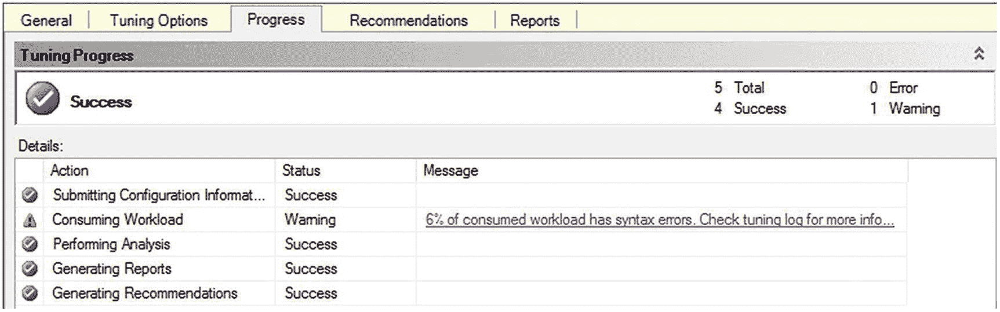

图 10-5

调优进度

在下一节的示例分析中，你会看到显示的进度的更详细示例。

分析完成后，你会得到一个建议列表（见图 10-6），并且有多个报告可用。表 10-1 描述了这些报告。

表 10-1

数据库引擎调优顾问报告

| 报告名称 | 报告描述 |
| --- | --- |
| `列访问` | 列出工作负载中引用的列和表 |
| `数据库访问` | 列出工作负载中引用的每个数据库以及每个数据库的工作负载语句百分比 |
| `事件频率` | 按发生频率列出工作负载中的所有事件 |
| `索引详细信息（当前）` | 定义工作负载引用的索引及其属性 |
| `索引详细信息（建议）` | 与 `索引详细信息（当前）` 报告相同，但显示数据库引擎调优顾问建议的索引信息 |
| `索引使用情况（当前）` | 列出工作负载引用的索引及其使用百分比 |
| `索引使用情况（建议）` | 与 `索引使用情况（当前）` 报告相同，但针对建议的索引 |
| `语句成本` | 列出如果实施建议，每条语句的性能改进 |
| `语句成本范围` | 按百分位数细分成本改进，以显示对于任何给定的更改集可以实现多少收益；这些成本是优化器提供的估计值 |
| `语句详细信息` | 列出工作负载中的语句、其成本以及如果实施建议后的降低后成本 |
| `语句到索引关系` | 列出单条语句引用的索引；当前和建议版本的报告均可用 |
| `表访问` | 列出工作负载引用的表 |
| `视图到表关系` | 列出物化视图引用的表 |
| `工作负载分析` | 提供有关工作负载的详细信息，包括语句数量、成本降低的语句数量以及成本保持不变的语句数量 |

## 数据库引擎调优顾问示例

学习如何使用数据库引擎调优顾问的最佳方法就是使用它。掌握它并非难事，因此我建议你打开它并开始使用。


## 调优查询

## 简介
你可以使用数据库引擎调优顾问，通过一个能合理代表所有 SQL 活动的工作负载，为整个数据库推荐索引。你也可以用它来为一组有问题的查询推荐索引。

要了解如何使用数据库引擎调优顾问为一组有问题的查询获取索引推荐，假设你有一个频繁执行的简单查询。由于执行频率高，你希望进行快速调优。这个查询如下：

```sql
SELECT soh.DueDate,
soh.CustomerID,
soh.Status
FROM Sales.SalesOrderHeader AS soh
WHERE soh.DueDate
BETWEEN '1/1/2008' AND '2/1/2008';
```

## 分析查询
要分析查询，请在查询窗口中右键单击它，然后在数据库引擎调优顾问中选择 `分析查询`。调优顾问会打开一个窗口，你可以在其中将会话名称更改为有意义的名称。在这个例子中，我选择了 `Report Query Round 1 – 1/16/2014`。数据库和表不需要编辑。完成后，第一个选项卡 `常规` 将如图 10-6 所示。


图 10-6. 查询调优常规设置

## 调整调优选项
由于此查询很重要，对其进行调优对业务极为关键，我将更改 `调优选项` 选项卡上的一些设置，以尝试最大化可能的建议。出于示例目的，我将让数据库引擎调优顾问运行默认的一小时，但对于更大的负载或更复杂的查询，你可能需要考虑给系统更多时间。我将勾选 `包括筛选索引` 复选框，这样如果筛选索引有帮助，它就会被考虑。我还会让它推荐列存储索引。最后，我将允许数据库引擎调优顾问进行结构更改——如果它能找到任何有帮助的更改——通过将设置从 `保留所有现有 PDS` 切换到 `不保留任何现有 PDS`。完成后，`调优选项` 选项卡将如图 10-7 所示。


图 10-7. 已调整的调优选项选项卡

请注意，随着你在上方所做选择中的定义发生改变，屏幕底部的描述也会变化。开始分析后，应该会出现进度屏幕。尽管设置是评估一小时，但 `DTA` 只用了大约一分钟就评估了此查询。

## 评估初始建议
初始建议并非一组好的选择。如图 10-8 所示，数据库引擎调优顾问建议删除数据库中大量的索引。运行该工具时，这不是你想要的那种建议。


图 10-8. 查询调优初始建议

数据库引擎调优顾问假设正在测试的负载是数据库的完整负载。每一次测试，都是如此。如果你运行的测试不是你的代表性工作负载，那么对于建议的更改可能会出现严重问题。

如果有索引未被使用，那么应该删除它们。这是最佳实践，应该在任何数据库上实施。然而，在这种情况下，这是一个单一查询，而非系统的完整负载。要查看调优顾问是否能提出一组更有意义的建议，你必须启动一个新的会话。

## 生成更好的建议
这次，我将调整选项，使数据库引擎调优顾问无法删除任何现有结构。这是在 `调优选项` 选项卡上设置的（如前面的图 10-7 所示）。在那里，我将 `要在数据库中保留的物理设计结构 (PDS)` 设置从 `不保留任何现有 PDS` 改为 `保留所有现有 PDS`。我将保持运行时间不变，因为评估在时间范围内运行良好。再次运行数据库引擎调优顾问后，它在不到一分钟内完成，并显示如图 10-9 所示的建议。


图 10-9. 查询调优建议

第一次运行时，数据库引擎调优顾问建议删除被测试表上的大部分索引以及一些相关表的索引。这次它建议在查询引用的列上创建覆盖索引。如第 9 章所述，覆盖索引可能是检索数据性能最佳的方法之一。数据库引擎调优顾问能够识别出，包含查询引用的所有列的索引——即覆盖索引——将具有最佳性能。

## 应用建议
一旦收到建议，你应该仔细检查拟议的 `T-SQL` 命令。这些建议并不总是有帮助，因此你需要评估并测试它们以确认。假设检查后的建议看起来不错，你会想要应用它。选择 `操作` ➤ `评估建议`。这将打开一个新的数据库引擎调优顾问会话，允许你使用最初提出建议的相同度量来评估这些建议是否有效。所有这些都是为了验证原始建议是否具有其声称的效果。新会话看起来就像一个常规的评估报告。如果你仍然对建议满意，请选择 `操作` ➤ `应用建议`。这将打开一个对话框，允许你立即应用建议或计划应用（见图 10-10）。

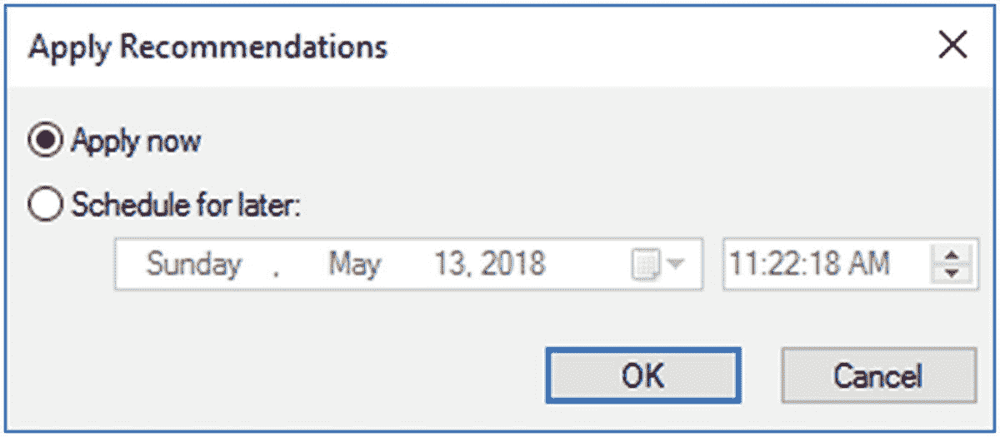

图 10-10. 应用建议对话框

如果单击 `确定` 按钮，数据库引擎调优顾问会将索引应用到你正在测试查询的数据库（见图 10-11）。


图 10-11. 成功应用的调优会话

## 最终考虑
生成建议后，你可能希望不立即应用它们，而是将 `T-SQL` 语句保存到文件中，并积累一系列更改，在计划的部署窗口期间发布到生产环境。此外，如果只是采用默认设置，最终会得到很多类似这样的索引名称：`_dta_index_SalesOrderHeader_5_1266103551__K4_6_11`。这不是很清晰，因此将更改保存到 `T-SQL` 也将允许你使更改更易于阅读。请记住，在表（尤其是大表）上应用索引，会在创建索引时对系统上正在运行的进程造成性能影响。

## 转向工作负载调优
虽然一次获取一个索引建议很好，但最好能够一次性检查数据库的大部分内容。这就是调优跟踪工作负载的用武之地。

## 调优跟踪工作负载

通过捕获从生产服务器上运行的真实查询跟踪，是向`数据库引擎优化顾问`提供有意义数据的一种方式。（捕获跟踪将在第 18 章中介绍。）为在`数据库引擎优化顾问`中使用而定义跟踪的最简单方法，是使用“优化”模板来实现跟踪。在你需要调优的系统上启动该跟踪。我通过从`PowerShell` `sqlps.exe`命令提示符下运行查询来生成了一个模拟负载。这是带有`SQL Server`配置设置的`PowerShell`命令提示符。它随`SQL Server`一起安装。

为了找到一些有趣的问题，我将创建一个具有明显调优问题的存储过程。

```sql
CREATE PROCEDURE dbo.uspProductSize
AS
SELECT  p.ProductID,
        p.Size
FROM    Production.Product AS p
WHERE   p.Size = '62';
```

以下是我使用的简单`PowerShell`脚本。你需要根据你的环境调整连接字符串。将文件下载到某个位置后，你只需通过命令提示符引用该文件及其完整路径即可运行它。由于这是一个未经签名、原始的脚本，你可能会遇到安全问题。如果需要，请遵循该错误消息中提供的帮助指南（`queryload.ps1`）。

```powershell
$SqlConnection = New-Object System.Data.SqlClient.SqlConnection
$SqlConnection.ConnectionString = 'Server=WIN-8A2LQANSO51;Database=AdventureWorks2017;trusted_connection=true'
