# Bad Query
$BadQuerycmd = New-Object System.Data.SqlClient.SqlCommand
$BadQuerycmd.CommandText = "dbo.uspProductSize"
$BadQuerycmd.Connection = $SqlConnection
while(1 -ne 0)
{
    $RefID = $row[0]
    $SqlConnection.Open()
    $BadQuerycmd.ExecuteNonQuery() | Out-Null
    $SqlConnection.Close()
    foreach($row in $ProdDataSet.Tables[0])
    {
        $SqlConnection.Open()
        $BomCmd.Parameters["@ProductID"].Value = $ProductId
        $BomCmd.ExecuteNonQuery() | Out-Null
        $SqlConnection.Close()
        $SqlConnection.Open()
        $ProductId = $row[0]
        $WhereCmd.Parameters["@ProductID"].Value = $ProductId
        $WhereCmd.ExecuteNonQuery() | Out-Null
        $SqlConnection.Close()
    }
}
```

## 注意

关于`PowerShell`的更多信息，请查看 Don Jones 和 Jeffrey Hicks 所著的*PowerShell in a Month of Lunches*（Manning 出版社，2016 年）。

创建好跟踪文件后，打开`数据库引擎优化顾问`。它默认在“工作负载”部分选择文件类型，因此你只需浏览到跟踪文件的位置即可。像之前一样，你需要从下拉列表中选择`AdventureWorks2017`数据库作为要分析的工作负载数据库。为了限制建议，也从屏幕底部的数据库列表中选择`AdventureWorks2012`。设置适当的调优选项并开始分析。这次，运行时间将超过一分钟（见图 10-12）。


图 10-12

数据库调优引擎正在运行中

在我的机器上，处理运行了大约 15 分钟。然后它生成了输出，如图 10-13 所示。


图 10-13

关于手动统计信息的建议

通过`数据库引擎优化顾问`运行所有查询后，顾问提出了一个针对`Product`表的新索引建议，这将提高该查询的性能。现在我只需要将其保存到`T-SQL`文件中，以便在应用到数据库之前编辑其名称。

## 从过程缓存调优

你可以利用存储在缓存中的查询计划作为调优建议的来源。过程很简单。在“常规”页面上有一个选项，允许你选择计划缓存作为调优工作的来源，如图 10-14 所示。

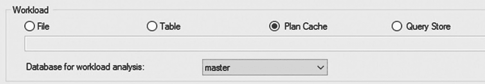

图 10-14

选择计划缓存作为 DTA 的来源

所有其他选项的行为与本章前面概述的完全相同。处理时间比顾问处理工作负载时大大减少。它只需要处理缓存中的查询，因此，根据你系统中的内存量，列表可能会很短。对我的缓存进行处理后得出的结果建议了多个索引和一些单独的统计信息，如图 10-15 所示。

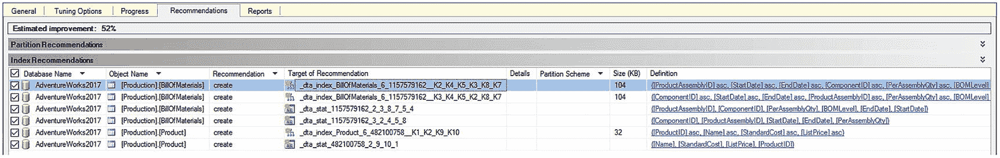

图 10-15

来自计划缓存的建议

这为你提供了另一种尝试以自动化方式调优系统的机制。但它仅限于当前在缓存中的查询。根据缓存的易变性（计划老化或被新计划替换的速度），这种方法可能有用，也可能没用。

## 从查询存储调优

我们将在第 11 章介绍`查询存储`。然而，我们可以利用`查询存储`收集的信息，尝试从`优化顾问`获得调优建议。你需要从图 10-14 所示的列表中选择`查询存储`工作负载。然后你必须选择一个数据库，因为`查询存储`仅针对单个数据库启用。但是，从那里开始，调优选项和行为是相同的。在我的系统上，得到的建议比从计划缓存中提取的还要多，如图 10-16 所示。

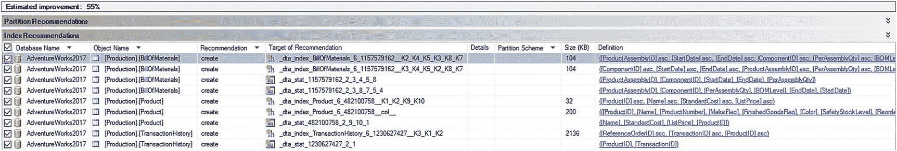

图 10-16

来自查询存储的建议

建议更多的原因是`查询存储`包含的计划比单纯在计划缓存中的或单个跟踪运行期间捕获的计划要多。这种改进的数据使得`查询存储`成为用于调优建议的极佳资源。


## 数据库引擎调优顾问的局限性

数据库引擎调优顾问的建议是基于输入的工作负载。如果输入的工作负载不能真实反映实际的工作负载，那么建议的索引有时可能会对工作负载中缺失的一些查询产生负面影响。但最重要的是，在许多情况下，数据库引擎调优顾问可能无法识别出可能的调优机会。它拥有一个复杂的测试引擎，但在某些场景下，其能力是有限的。

对于生产服务器，你应确保 SQL 跟踪包含对数据库工作负载的完整记录。对于大多数数据库应用程序，捕获一整天的跟踪通常包含了在数据库上执行的大部分查询，尽管也有例外情况，例如每周、每月或年终处理。请务必了解你的负载情况以及正确捕获它所需的方法。数据库引擎调优顾问的一些其他注意事项/局限性如下：

*   使用 `SQL:BatchCompleted` 事件的跟踪输入：如前所述，输入到数据库引擎调优顾问的 SQL 跟踪必须包含 `SQL:BatchCompleted` 事件；否则，该向导将无法识别工作负载中的查询。
*   工作负载中的查询分布：在工作负载中，一个查询可能会使用相同的参数值执行多次。即使是对最常见查询的微小性能改进，相比于对一个只执行一次的查询的巨大性能提升，也可能对整个工作负载的性能做出更大的贡献。
*   索引提示：SQL 查询中的索引提示可能会阻止数据库引擎调优顾问选择更好的执行计划。该向导会将 SQL 查询中使用的所有索引提示作为其建议的一部分。因为这些索引可能对该表并非最优，所以在向向导提交工作负载之前，请从查询中移除所有索引提示，同时记住你需要将它们添加回来以验证它们是否确实能提高性能。

请记住，调优顾问的建议仅仅是建议。它提供的建议可能不会如顾问所建议的那样奏效，并且你可能已经拥有与建议索引同样有效的现成索引。在实施之前，请测试并验证所有建议。

## 总结

正如你在本章所学，数据库引擎调优顾问可以是一个用于分析现有索引有效性并为 SQL 工作负载推荐新索引的有用工具。随着 SQL 工作负载随时间变化，你可以使用此工具来确定哪些现有索引已不再使用，以及需要哪些新索引来提高性能。偶尔运行此向导来检查你现有的索引是否真的最适合你当前的工作负载，可能是个好主意。这假设你没有自行捕获指标并进行评估。数据库引擎调优顾问还提供了许多有用的报告，用于分析 SQL 工作负载及其自身建议的有效性。只需记住，该工具的局限性使其无法发现所有调优机会。同时也要记住，DTA（数据库引擎调优顾问）提供的建议的好坏仅取决于你提供给它的输入。如果你的数据库状况不佳，此工具可以为你提供快速的帮助。如果你已经在定期监控和调优查询，你可能不会从数据库引擎调优顾问的建议中看到什么收益。

捕获查询指标和执行计划过去在自动化和维护方面需要大量工作。然而，捕获这些信息对于你的查询调优工作至关重要。从 SQL Server 2016 开始，查询存储提供了一个绝佳的机制来捕获查询指标以及更多内容。下一章将让你全面了解查询存储提供的所有功能。

## 11. 查询存储

查询存储最初于 2015 年在 Azure SQL Database 中引入，并于 2016 年首次引入 SQL Server。查询存储提供了三项你将希望利用的功能。首先，你将获得查询指标和执行计划，永久存储在易于访问的数据库结构中，从而获得关于系统上查询性能的良好、灵活的信息。其次，查询存储创建了一种直接控制执行计划行为的机制，这种方式是我们以前从未有过的。最后，查询存储充当了数据库升级的安全和报告机制，将使你能够以新的方式保护你的系统。

在本章中，我将涵盖以下主题：

*   查询存储的工作原理及其收集的信息
*   通过 Management Studio 暴露的针对查询存储行为的报告和机制
*   计划强制，一种控制 SQL Server 和 Azure SQL Database 使用哪些执行计划的方法
*   一种帮助你保护系统行为的升级方法

虽然扩展事件会话是你追求精确性的首选措施，但对于大多数系统而言，查询存储应该是监控查询性能的主要手段。

## 查询存储的功能与设计

就对系统的影响而言，查询存储可能是最轻量级的机制。它提供了你适当了解系统查询性能所需的核心内容。另外，因为围绕查询存储的所有工作都是通过系统视图完成的，你可以使用 `T-SQL` 来操作它，因此使用起来变得极其容易。使用 `DMO`（动态管理对象）、跟踪事件，甚至在某种程度上使用扩展事件作为监控查询指标的机制，随着查询存储的引入，确实可以被视为过时的做法了。


### 查询存储行为

查询存储收集两类信息。首先，它收集每个查询在系统上行为的聚合数据。其次，查询存储默认会捕获系统上创建的每个执行计划，直到达到每个查询的最大计划数（默认为 200）。你可以针对每个数据库单独开启或关闭查询存储。开启时，查询存储的运行机制如图 11-1 所示。

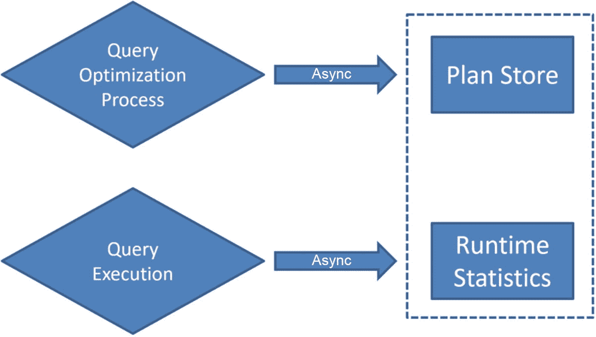

图 11-1
查询存储收集数据的行为

查询优化过程照常进行。当查询提交到系统时，会创建一个执行计划（详见第 15 章）并存储在计划缓存中（将在第 16 章解释）。这些过程完成后，查询存储的一个异步进程会运行，以从计划缓存中捕获执行计划。它最初将这些计划写入一块单独的内存进行临时存储。随后，另一个异步进程会将这些执行计划写入数据库中的查询存储。所有这些过程都是异步的，以确保对系统内其他进程的影响最小化（尽管不是零）。此流程的唯一例外是计划强制，我们将在本章后面介绍。

接着，查询的执行过程与其他查询完全一样。查询执行完成后，查询运行时指标（如读取次数、写入次数、查询持续时间和等待统计信息）会异步写入另一个单独的内存空间。稍后，另一个异步进程会将该信息写入磁盘。收集并写入磁盘的信息是经过聚合的。默认的聚合时间间隔为 60 分钟。

查询存储系统表中存储的所有信息都永久写入启用了查询存储的数据库。查询的指标和执行计划随数据库一起保存。它们会随数据库一起备份，也会随数据库一起恢复。在系统离线或发生故障转移的情况下，可能丢失部分仍驻留内存、尚未写入磁盘的查询存储信息。写入磁盘的默认时间间隔是 15 分钟。考虑到这是聚合数据，对于可能因某些查询存储数据丢失（这不应被视为生产级别数据）而产生的风险来说，这个时间间隔尚可接受。

当你从查询存储查询信息时，它会结合内存中的数据和已写入磁盘的数据。访问这些信息无需任何额外操作。

在继续本章其余内容之前，如果你想跟随一些代码和操作进行实践，你需要在一个数据库上启用查询存储。以下命令可以实现：

```sql
ALTER DATABASE AdventureWorks2017 SET QUERY_STORE = ON;
```

为确保你在操作过程中查询存储里有查询数据，让我们使用这个存储过程：

```sql
CREATE OR ALTER PROC dbo.ProductTransactionHistoryByReference (
@ReferenceOrderID int
)
AS
BEGIN
SELECT  p.Name,
p.ProductNumber,
th.ReferenceOrderID
FROM    Production.Product AS p
JOIN    Production.TransactionHistory AS th
ON th.ProductID = p.ProductID
WHERE   th.ReferenceOrderID = @ReferenceOrderID;
END
```

如果你使用这三个值执行该存储过程，并且每次都从缓存中移除它，你实际上会得到三个不同的执行计划。

```sql
DECLARE @Planhandle VARBINARY(64);
EXEC dbo.ProductTransactionHistoryByReference @ReferenceOrderID = 0;
SELECT @Planhandle = deps.plan_handle
FROM sys.dm_exec_procedure_stats AS deps
WHERE deps.object_id = OBJECT_ID('dbo.ProductTransactionHistoryByReference');
IF @Planhandle IS NOT NULL
BEGIN
DBCC FREEPROCCACHE(@Planhandle);
END
EXEC dbo.ProductTransactionHistoryByReference @ReferenceOrderID = 53465;
SELECT @Planhandle = deps.plan_handle
FROM sys.dm_exec_procedure_stats AS deps
WHERE deps.object_id = OBJECT_ID('dbo.ProductTransactionHistoryByReference');
IF @Planhandle IS NOT NULL
BEGIN
DBCC FREEPROCCACHE(@Planhandle);
END
EXEC dbo.ProductTransactionHistoryByReference @ReferenceOrderID = 3849;
```

通过这个操作，你可以确保查询存储中会有信息。

### 查询存储收集的信息

查询存储收集的数据范围相当窄，但极其丰富。图 11-2 展示了系统表及其关系。


图 11-2
查询存储的系统视图

查询存储中存储的信息分为两个基本集合。一个是关于查询本身的信息，包括查询文本、执行计划和查询上下文设置。然后是运行时信息，包括运行时间段、等待统计信息和查询运行时统计信息。我们将从查询信息开始，分别探讨每个部分的信息。


### 查询信息

查询存储的核心数据是查询本身。查询独立于存储过程或批处理，尽管它可能是其中的一部分。它归结为基本的查询文本和`query_hash`值（查询文本的哈希值），后者使你能够识别任何给定的查询。此数据随后与查询计划和实际查询文本相结合。图 11-3 展示了基本结构和一些数据。


图 11-3：存储在查询存储中的查询信息

这些是存储在启用了查询存储的任何数据库的主文件组中的系统表。虽然 Management Studio 界面内置了良好的报表，但你可以编写自己的查询来访问查询存储中的信息。例如，此查询可以检索给定存储过程的所有查询语句及其执行计划：

```sql
SELECT qsq.query_id,
qsq.object_id,
qsqt.query_sql_text,
CAST(qsp.query_plan AS XML) AS QueryPlan
FROM sys.query_store_query AS qsq
JOIN sys.query_store_query_text AS qsqt
ON qsq.query_text_id = qsqt.query_text_id
JOIN sys.query_store_plan AS qsp
ON qsp.query_id = qsq.query_id
WHERE qsq.object_id = OBJECT_ID('dbo.ProductTransactionHistoryByReference');
```

虽然每个单独的查询语句都存储在查询存储中，但你也获得了`object_id`，因此你可以使用像`OBJECT_ID()`这样的函数，就像我刚才做的那样来检索信息。请注意，我还必须对`query_plan`列使用`CAST`命令。这是因为查询存储正确地将该列存储为文本，而不是 XML。SQL Server 中的 XML 数据类型具有嵌套限制，这可能需要两个列：对于满足要求的 XML 列，以及对于不满足要求的`NVARCHAR(MAX)`列。在构建查询存储时，他们通过设计解决了这个问题。如果你希望能够点击结果（类似于图 11-4）来查看执行计划，你需要像我之前那样使用 CAST。

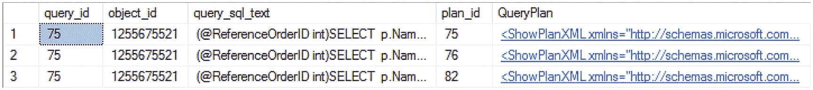

图 11-4：使用 T-SQL 从查询存储中检索的信息

在这个例子中，对于一个查询（`query_id` = 75，这是一个单语句存储过程），我有三个不同的执行计划，由三个不同的`plan_id`值标识。我们稍后会查看这些计划。

从查询存储的结果中需要注意的另一点是文本的存储方式。由于此语句是带参数的存储过程的一部分，因此定义了在 T-SQL 文本中使用的参数值。这就是查询存储中该语句的样子（格式保持原样）：

```sql
(@ReferenceOrderID int)SELECT  p.Name,              p.ProductNumber,              th.ReferenceOrderID      FROM    Production.Product AS p      JOIN    Production.TransactionHistory AS th              ON th.ProductID = p.ProductID      WHERE   th.ReferenceOrderID = @ReferenceOrderID
```

请注意语句开头的参数定义。提醒一下，实际的存储过程定义如下所示：

```sql
CREATE OR ALTER PROC dbo.ProductTransactionHistoryByReference (
@ReferenceOrderID int
)
AS
BEGIN
SELECT  p.Name,
p.ProductNumber,
th.ReferenceOrderID
FROM    Production.Product AS p
JOIN    Production.TransactionHistory AS th
ON th.ProductID = p.ProductID
WHERE   th.ReferenceOrderID = @ReferenceOrderID;
END
```

过程内的语句与存储在查询存储中的语句是不同的。这可能导致在查询存储中查找特定查询时出现问题。让我们看一个不同的例子：

```sql
SELECT a.AddressID,
a.AddressLine1
FROM Person.Address AS a
WHERE a.AddressID = 72;
```

这是一个批处理，而不是存储过程。首次执行它将按照前面概述的过程将其加载到查询存储中。如果我们运行一些 T-SQL 来检索有关此语句的信息，如下所示，则不会返回任何内容：

```sql
SELECT qsq.query_id,
qsq.query_hash,
qsqt.query_sql_text
FROM sys.query_store_query AS qsq
JOIN sys.query_store_query_text AS qsqt
ON qsqt.query_text_id = qsq.query_text_id
WHERE qsqt.query_sql_text = 'SELECT a.AddressID,
a.AddressLine1
FROM Person.Address AS a
WHERE a.AddressID = 72;';
```

因为这个语句很简单，优化器能够对其执行一个称为简单参数化的过程。幸运的是，查询存储有一个用于处理自动参数化的函数，`sys.fn_stmt_sql_handle_from_sql_stmt`。该函数允许你查找查询信息，如下所示：

```sql
SELECT qsq.query_id,
qsq.query_hash,
qsqt.query_sql_text,
qsq.query_parameterization_type
FROM sys.query_store_query_text AS qsqt
JOIN sys.query_store_query AS qsq
ON qsq.query_text_id = qsqt.query_text_id
JOIN sys.fn_stmt_sql_handle_from_sql_stmt(
'SELECT a.AddressID,
a.AddressLine1
FROM Person.Address AS a
WHERE a.AddressID = 72;',
2)  AS fsshfss
ON fsshfss.statement_sql_handle = qsqt.statement_sql_handle;
```

格式和空格都必须相同才能使此方法生效。硬编码的值可以更改，但其余所有内容必须相同。运行该查询的结果如图 11-5 所示。

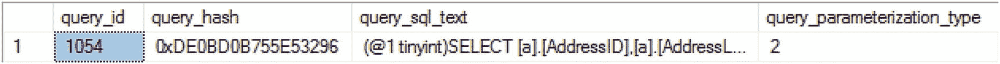

图 11-5：显示简单参数化结果的查询

你可以在`query_sql_text`列中看到，简单参数化的参数值已被添加到文本中，就像存储过程一样。坏消息是`sy.fn_stmt_sql_handl_from_sql_stmt`目前仅适用于自动参数化。它不会帮助你定位来自任何其他源的参数化语句。要检索该信息，你将被迫使用`LIKE`命令在文本中搜索，或者像我之前那样，对存储过程中的查询使用`object_id`。


### 查询运行时数据

在获取有关查询和计划的信息之后，接下来你想要查看的可能是运行时指标。理解运行时指标有两个关键点。首先，这些指标是回溯关联到**计划**，而不是回溯关联到**查询**。由于每个计划的行为可能不同，涉及不同的操作、不同的索引、不同的联接类型等等，因此捕获运行时数据和等待统计信息意味着要关联回计划。其次，运行时和等待统计信息是聚合的，但它们是按**运行时时间间隔**进行聚合的。运行时时间间隔的默认值为 60 分钟。这意味着每个计划在每个运行时时间间隔内都将有一组不同的指标。

所有这些信息如图 11-6 所示。


图 11-6: 包含运行时和等待统计信息的系统表

当你开始查询运行时指标时，可以轻松地将它们与查询本身的信息结合起来。你必须处理时间间隔，最好的处理方法可能是对它们进行分组和聚合，对平均值再取平均值，等等。这可能看起来很麻烦，但你需要理解信息被这样划分的原因。在查看查询性能时，你需要几个数字，例如当前性能、期望性能以及我们做出更改后的未来性能。没有这些数字进行比较，你无法知道某样东西是慢还是你已经改进了它。查询存储中的信息也是如此。通过将所有内容拆分成时间间隔，你可以将今天与昨天、一个时间点与另一个时间点进行比较。通过这种方式，你才能知道性能是否确实下降（或提升），它在昨天运行得更快/更慢等等。如果你只有平均值，而不是随时间变化的平均值，那么你将看不到行为如何随时间变化。借助时间间隔，你可以获得一些自行使用扩展事件捕获指标的粒度，同时兼具查询缓存的易用性。

一个检索给定时间点性能指标的查询可以这样编写：

```sql
DECLARE @CompareTime DATETIME = '2017-11-28 21:37';
SELECT CAST(qsp.query_plan AS XML),
       qsrs.count_executions,
       qsrs.avg_duration,
       qsrs.stdev_duration,
       qsws.wait_category_desc,
       qsws.avg_query_wait_time_ms,
       qsws.stdev_query_wait_time_ms
FROM sys.query_store_plan AS qsp
JOIN sys.query_store_runtime_stats AS qsrs
    ON qsrs.plan_id = qsp.plan_id
JOIN sys.query_store_runtime_stats_interval AS qsrsi
    ON qsrsi.runtime_stats_interval_id = qsrs.runtime_stats_interval_id
JOIN sys.query_store_wait_stats AS qsws
    ON qsws.plan_id = qsrs.plan_id
    AND qsws.execution_type = qsrs.execution_type
    AND qsws.runtime_stats_interval_id = qsrs.runtime_stats_interval_id
WHERE qsq.object_id = OBJECT_ID('dbo.ProductTransactionHistoryByReference')
  AND @CompareTime BETWEEN qsrsi.start_time
                       AND     qsrsi.end_time;
```

让我们分解一下这个查询。你可以看到，我们像前面的查询一样，从 `sys.query_store_plan` 开始获取查询计划。然后，我们将其与包含所有运行时指标（如平均持续时间和持续时间的标准差）的表 `sys.query_store_runtime_stats` 进行结合。因为我想根据特定时间进行筛选，所以需要确保连接到存储该数据的 `sys.query_store_runtime_stats_interval` 表。接着，我连接到 `sys.query_store_wait_stats`。在那里，我必须使用复合键来直接关联等待信息和运行时统计信息，即 `plan_id`、`execution_type` 和 `runtime_stats_interval_id`。我使用了本章前面提到的一个 `plan_id`，并设置数据返回特定的时间范围。图 11-7 显示了结果数据。


图 11-7: 一个查询在一个时间间隔内的运行时指标和等待统计信息

理解 `sys.query_store_wait_stats` 和 `sys.query_store_runtime_stats` 中的信息如何聚合非常重要。它不仅仅是按 `runtime_stats_interval_id` 和 `plan_id` 聚合。`execution_type` 也决定了聚合方式，因为一个给定的查询可能出错或被取消。这会影响查询的行为和数据收集方式，因此它被包含在性能指标中，以区分一组行为与另一组行为。让我们通过运行以下脚本来观察这一点：

```sql
SELECT *
FROM sys.columns AS c,
     sys.syscolumns AS s;
```

该脚本会产生一个笛卡尔积连接，在我的系统上大约需要两分钟运行。如果我们让查询运行一次然后取消它一次，再让它完成一次，我们就可以看到查询存储中的内容。

```sql
SELECT qsqt.query_sql_text,
       qsrs.execution_type,
       qsrs.avg_duration
FROM sys.query_store_query AS qsq
JOIN sys.query_store_query_text AS qsqt
    ON qsqt.query_text_id = qsq.query_text_id
JOIN sys.query_store_plan AS qsp
    ON qsp.query_id = qsq.query_id
JOIN sys.query_store_runtime_stats AS qsrs
    ON qsrs.plan_id = qsp.plan_id
WHERE qsqt.query_sql_text like '%FROM sys.columns AS c%';
```

你可以在图 11-8 中看到结果。


图 11-8: 中止的执行显示为不同的执行类型

你会看到已中止的查询和发生错误的查询显示出不同的类型。此外，它们在运行时指标中的持续时间、等待时间等信息是分开存储的。为了从这两个相应的表中获得正确的等待和持续时间度量集合，你必须包含 `execution_type`。

如果你对某个给定查询的所有查询指标感兴趣，可以使用类似下面的代码从查询存储中检索信息：

```sql
WITH QSAggregate
AS (SELECT qsrs.plan_id,
           SUM(qsrs.count_executions) AS CountExecutions,
           AVG(qsrs.avg_duration) AS AvgDuration,
           AVG(qsrs.stdev_duration) AS StdDevDuration,
           qsws.wait_category_desc,
           AVG(qsws.avg_query_wait_time_ms) AS AvgWaitTime,
           AVG(qsws.stdev_query_wait_time_ms) AS StDevWaitTime
    FROM sys.query_store_runtime_stats AS qsrs
    JOIN sys.query_store_wait_stats AS qsws
        ON qsws.plan_id = qsrs.plan_id
        AND qsws.runtime_stats_interval_id = qsrs.runtime_stats_interval_id
    GROUP BY qsrs.plan_id,
             qsws.wait_category_desc)
SELECT CAST(qsp.query_plan AS XML),
       qsa.*
FROM sys.query_store_plan AS qsp
JOIN QSAggregate AS qsa
    ON qsa.plan_id = qsp.plan_id
WHERE qsq.object_id = OBJECT_ID('dbo.ProductTransactionHistoryByReference');
```

该查询的结果将是当前查询存储中包含的、指定 `plan_id` 的所有信息。今后，你可以根据需要以任何方式组合查询存储中的信息。接下来，让我们来掌控查询存储。


### 控制查询存储

您已经了解了如何为数据库启用查询存储。要禁用查询存储，可以采用类似的操作。

```sql
ALTER DATABASE AdventureWorks2017 SET QUERY_STORE = OFF;
```

此命令将禁用查询存储，但不会移除查询存储信息。查询存储收集和管理的那部分数据将在重启、故障转移、备份以及数据库离线期间持续存在。它甚至在禁用查询存储后也会保留。要移除查询存储数据，您必须像这样直接进行控制：

```sql
ALTER DATABASE AdventureWorks2017 SET QUERY_STORE CLEAR;
```

这将清除查询存储中的所有数据。如果您愿意，可以更有选择性地操作。您可以简单地移除一个给定的查询。

```sql
EXEC sys.sp_query_store_remove_query
@query_id = @queryid;
```

您可以移除一个查询计划。

```sql
EXEC sys.sp_query_store_remove_plan @plan_id = @PlanID;
```

您还可以重置性能指标。

```sql
EXEC sys.sp_query_store_reset_exec_stats
@plan_id = @PlanID;
```

所有这些操作只需要您追踪到想要控制的计划或查询，然后就可以执行操作。您可能还会发现，您希望保留那些已写入缓存但尚未写入磁盘的查询存储数据。您可以强制刷新缓存。

```sql
EXEC sys.sp_query_store_flush_db;
```

最后，您可以更改查询存储内的默认设置。首先，了解去哪里获取这些信息是个好主意。您可以通过运行以下命令来按数据库检索查询存储的当前设置：

```sql
SELECT * FROM sys.database_query_store_options AS dqso;
```

与查询存储的许多其他方面一样，这些设置也是在数据库级别控制的。这使您能够，例如，更改一个数据库的统计信息聚合时间间隔而不影响另一个数据库。控制查询存储设置的各种方面，只需运行如下查询即可：

```sql
ALTER DATABASE AdventureWorks2017 SET QUERY_STORE (MAX_STORAGE_SIZE_MB = 200);
```

该命令将查询存储的默认存储大小从 100MB 更改为 200MB，为被修改的数据库提供了更多空间。进行这些更改时，无需重启服务器。您也不会影响您正在修改的数据库中计划缓存中的计划行为或查询处理的任何其他部分。在大多数情况下的大多数人看来，默认设置应该是足够的。根据您的具体情况，您可能希望修改查询存储的行为方式。请务必在进行这些更改时监控您的服务器，以确保没有对服务器产生负面影响。

开箱即用，我建议您考虑更改的唯一设置是查询存储捕获模式。默认情况下，它会捕获所有查询和所有查询计划，无论它们被调用的频率、运行时间长短或其他任何设置如何。对于我们许多人来说，这种行为是足够的。但是，如果您已将系统设置更改为使用 `Optimize for Ad Hoc`，您这样做是因为您收到大量即席查询，并且正在尝试管理内存使用（更多内容见第 16 章）。该设置意味着您对捕获每一个计划不太感兴趣。您可能还处于这样一种情况：由于事务量巨大，您根本不想捕获每一个查询或计划。这些情况可能促使您更改查询存储捕获模式设置。其他选项是 `None` 和 `Auto`。`None` 将停止查询存储捕获查询和指标，但仍然允许对您设置的任何查询执行计划强制（您将在本章后面找到有关计划强制的详细信息）。`Auto` 将只捕获那些运行一定时长、消耗一定资源量或被调用一定次数的查询。这些值都可能由 Microsoft 更改，并由查询存储内部控制。您无法控制这里的具体数值，只能控制是否使用它们。在大多数系统上，仅仅为了帮助减少噪音和开销，我建议从 `All` 更改为 `Auto`。然而，这绝对是一个个人决定，您的情况可能要求采取其他做法。

您也可以使用 SQL Server Management Studio 图形用户界面来控制查询存储。在对象资源管理器窗口中右键单击任何数据库，然后从上下文菜单中选择“属性”。当属性窗口打开时，您可以单击“查询存储”选项卡，应该会看到类似于图 11-9 的内容。


*图 11-9*
用于控制查询存储的 SSMS 图形用户界面

您可以立即看到我们在本章探索查询存储时已经涵盖的一些设置。您还可以看到查询存储正在使用多少数据以及分配的空间还剩多少容量。与前面显示的 T-SQL 命令一样，此处所做的任何更改都会立即反映在查询存储行为中，并且不需要系统进行任何形式的重启。


## 查询存储报告

对于您的部分工作，使用 T-SQL 直接控制查询存储并利用系统表来检索有关查询存储的数据将是首选方法。然而，对于大部分常规工作，我们可以利用内置报告及其在配合查询存储工作时的行为。

要查看这些报告，您只需在 Management Studio 的 `Object Explorer` 窗口中展开数据库。对于任何启用了查询存储的数据库，都会有一个包含可见报告的新文件夹，如图 11-10 所示。

`../images/323849_5_En_11_Chapter/323849_5_En_11_Fig10_HTML.jpg`
图 11-10
AdventureWorks2017 数据库中的查询存储报告

报告如下：

### 性能下降的查询 (Regressed Queries)
您将看到那些性能随时间推移而发生负面变化的查询。

### 总体资源消耗 (Overall Resource Consumption)
此报告展示了在定义的时间框架内（默认为上个月）各种查询的资源消耗情况。

### 资源消耗最高的查询 (Top Resource Consuming Queries)
在这里，您可以找到使用资源最多的查询，而不考虑时间范围。

### 具有强制计划的查询 (Query With Forced Plans)
任何您定义为具有强制执行计划的查询都将在此报告中可见。

### 高变动性查询 (Queries With High Variation)
此报告显示那些运行时统计信息具有高度变异性的查询，通常带有多个执行计划。

### 已跟踪的查询 (Tracked Queries)
使用查询存储，您可以将一个查询定义为感兴趣的对象，而无需尝试在其他报告中追踪它，您可以标记该查询并在此处找到它。

这些报告中的每一个都是独特的，并且各自适用于不同的目的，但我们没有足够的时间和空间来详细探讨所有报告。相反，我将重点关注其中一个报告——“资源消耗最高的查询”的行为，因为它通常代表了所有其他报告的行为，并且是您可能会经常使用的一个。打开该报告，您会看到类似于图 11-11 的内容。

`../images/323849_5_En_11_Chapter/323849_5_En_11_Fig11_HTML.jpg`
图 11-11
查询存储的前 25 个资源消耗者报告

报告中有三个窗口。左上角的第一个窗口显示按 `query_id` 值聚合的查询。右侧的第二个窗口显示了这些查询随时间的各种行为以及它们的不同计划。您可以看到，在第一个窗格中突出显示的排名第一的查询具有三个不同的执行计划。单击其中任何一个计划都会在屏幕底部的第三个窗口中打开该计划。

您并不局限于默认行为。第一个窗口默认按“持续时间”显示聚合查询，它驱动着其他两个窗口。屏幕顶部有一个下拉菜单，当前提供 13 种选择，如图 11-12 所示。

`../images/323849_5_En_11_Chapter/323849_5_En_11_Fig12_HTML.jpg`
图 11-12
前 25 个资源消耗者报告的不同聚合方式

选择其中任何一个都会更改报告中聚合的值。您还可以使用另一个下拉菜单更改报告的聚合方式，该列表包括平均值、最小值、最大值、总计和标准差。第一个窗口的附加功能包括更改为网格格式、标记查询以便稍后跟踪（在“已跟踪的查询”报告中）、刷新报告以及查看查询文本。当您致力于确定性能问题时，所有这些功能对于尝试识别需要花时间研究的查询都很有用。

下一个窗口显示从第一个窗口中选择的查询的性能指标。每个点既代表一个时间点，也代表一个特定的执行计划。图 11-13 中的信息说明了查询性能如何从上午 8:45 到 9:45 发生变化，以及查询的性能和执行计划如何在该时间段内发生变化。

`../images/323849_5_En_11_Chapter/323849_5_En_11_Fig13_HTML.jpg`
图 11-13
一个查询的不同性能行为和不同执行计划

每个点的大小对应于给定计划在给定时间段内的执行次数。如果您将鼠标悬停在任何给定点上，它将显示有关该时间点的附加信息。图 11-14 显示了位于屏幕顶部、`plan_id` = 76、时间点在上午 9:45 的那个点的信息。

`../images/323849_5_En_11_Chapter/323849_5_En_11_Fig14_HTML.jpg`
图 11-14
给定计划显示信息的详细信息

您可以看到该查询中该特定计划的执行次数和其他指标。无论您点击哪个点，您都将在最后一个窗口中看到该点的执行计划。显示的执行计划其功能与 `Management Studio` 中的任何其他图形计划类似，因此我不会在此详细描述其行为。此处展示的一个附加功能是强制计划的能力。您会在执行计划窗口的右上角看到两个按钮，如图 11-15 所示。

`../images/323849_5_En_11_Chapter/323849_5_En_11_Fig15_HTML.jpg`
图 11-15
在报告中强制和取消强制计划

您有能力直接从报告中强制或取消强制一个计划。我将在下一节中详细讨论计划强制。


## 计划强制

尽管查询存储的大部分功能都围绕收集和观察查询及其执行计划的行为，但有一项功能彻底改变了这一切，那就是**计划强制**。`计划强制`是指你将某个特定执行计划标记为你希望 SQL Server 使用的计划。由于查询存储中的所有内容都写入数据库，因此能经受重启、备份等操作的影响，这意味着你可以确保某个给定计划始终会被使用。这个过程确实在一定程度上改变了查询存储与优化过程及计划缓存的交互方式，如图 11-16 所示。


图 11-16

添加了计划强制后的查询优化过程

现在发生的情况是，如果一个计划被标记为强制执行，那么当优化器完成其过程后，在将计划存储到缓存以供查询使用之前，它会首先检查查询存储中的计划。如果此查询有一个强制计划，则将始终使用该计划来替代。唯一的例外是系统内部发生了某些变化，导致该计划对于查询而言变成了无效计划。

计划强制的功能实际上相当简单。你只需提供 `plan_id` 和 `query_id`，即可强制使用某个计划。例如，我的系统中有一个查询，其语法、查询哈希和查询设置与 `query_id` 值为 75 相匹配，该查询有三种可能的执行计划。请注意，虽然我使用 `query_id` 来标记查询，但那是一个人造键。查询的识别因素是文本、哈希和上下文设置。强制计划的查询则极其简单。

```sql
EXEC sys.sp_query_store_force_plan 75,82;
```

这就是所需的全部操作。从今往后，无论查询是重新编译还是从缓存中移除，当优化过程完成后，将始终使用对应于 `plan_id` 为 82 的计划。有了这个设置，我们就可以查看“带有强制计划的查询”报告，看看显示了什么内容，如图 11-17 所示。


图 11-17

“带有强制计划的查询”报告

你可以看到，虽然该报告总体上与“资源消耗最多的查询”报告相同，但仍存在差异。第一个窗口中的查询列表就是查询列表。第二个窗口几乎与之前图 11-11 和 11-13 中显示的窗口完全对应。然而，不同之处在于，被标记为强制的计划旁边有一个复选标记。最后一个窗口也基本相同，只有一个细微差别。在顶部，不是启用 `强制计划`，而是启用了 `取消强制计划`。你可以通过单击该按钮轻松地从此处取消强制计划。你也可以通过一个命令取消强制计划。

```sql
EXEC sys.sp_query_store_unforce_plan 214,248;
```

就像单击按钮一样，这将停止计划强制。从现在开始，优化过程将恢复正常。我打算把计划强制的完整演示留到第 17 章讨论参数嗅探时再讲。简而言之，在处理不良的参数嗅探问题时，计划强制变得极其有用。它在处理**性能回退**（即 SQL Server 的更改导致之前表现良好的查询突然生成性能低下的执行计划的情况）时也很方便。这种情况最常发生在升级期间，且兼容性模式被更改而未经测试。

## 用于升级的查询存储

虽然一般的查询性能监控和调优可能是查询存储的日常常见用途，但该工具最强大的目的之一是将其用作升级 SQL Server 的安全网。

假设你正计划从 SQL Server 2012 迁移到 SQL Server 2017。传统上，你会在某个测试实例上升级你的数据库，然后运行一系列测试以确保一切运行良好。如果你捕获并记录了所有问题，那很好。不幸的是，由于优化器或基数估算器的一些更改，可能需要重写一些代码。这可能导致升级延迟，或者业务方甚至可能决定完全避免升级（这是一个常见但糟糕的选择）。这还是在你捕获了问题的前提下。完全有可能因为估计行数或其他方面的变化，而遗漏了某个特定查询突然开始表现不佳的问题。

这正是查询存储成为你升级安全网的地方。首先，你应该进行所有测试，并尝试使用标准方法解决问题。这不应改变。然而，查询存储为标准方法增加了额外的功能。以下是应遵循的步骤：

1.  将数据库还原到新的 SQL Server 实例，或升级你的实例。这里假设是生产机器，但你也可以在测试机器上执行此操作。
2.  将数据库保留在旧的兼容性模式中。不要将其更改为新模式，因为这样会在你捕获数据之前启用新的优化器和新的基数估算器。
3.  启用查询存储。它可以收集在旧兼容性模式下运行的指标。
4.  运行你的测试，或者运行你的系统一段时间，以确保覆盖了系统中的大部分查询。这段时间会根据你的需求而变化。
5.  更改兼容性模式。
6.  运行 `性能回退查询` 报告。此报告将查找那些突然开始比之前运行得慢的查询。
7.  调查这些查询。如果明显是执行计划发生了更改并导致性能变化，那么请选择更改前的一个计划，并使用计划强制使其成为 SQL Server 将使用的计划。
8.  在必要时，花时间重写查询或重构系统，以确保查询本身能够编译出在系统上运行良好的计划。

这种方法不能预防所有问题。你仍然必须测试你的系统。然而，使用查询存储将为你提供处理 SQL Server 内部更改（这些更改会影响你的查询计划并进而影响你的性能）的机制。你也可以对应用累积更新或服务包使用类似的过程。你还可以通过使用 SQL Server 2016 SP1 及以上版本中提供的“数据库作用域配置”设置来启用 `LEGACY_CARDINALITY_ESTIMATION`，或者你可以添加该提示，从而处理性能回退问题。这些是除使用计划强制之外，或代替使用计划强制的选项。你也可以直接恢复到旧的兼容性模式，但这会丧失很多功能。


# 12. 键查找与解决方案

## 摘要

查询存储（Query Store）增强了你识别性能不佳查询的能力。尽管查询存储的功能非常出色，但它不会完全取代大多数人已经习惯使用的任何工具。它的粒度不如扩展事件（Extended Events）。它不像直接查询计划缓存那样具有即时性。话虽如此，查询存储通过包含额外的信息（例如值的标准差）以及保存所有执行计划（即使是那些已从缓存中移除或替换的计划），对上述两种方法进行了补充。此外，查询存储增加了执行极其简单的计划强制（plan forcing）的能力，这不仅有助于解决参数或其他行为相关的问题，还能应对因 Microsoft 产品升级导致的计划回退（regressions）。所有这些结合起来，使得查询存储成为查询调优工具集中一个极其有用的补充。

你经常会依赖非聚集索引来提升 SQL 工作负载的性能。这假设你已经为表分配了聚集索引。由于非聚集索引的性能在很大程度上取决于与之关联的书签查找（bookmark lookup）的成本，你将在下一章中看到如何分析和解决一个查找操作。

为了最大化非聚集索引的收益，你必须尽可能最小化数据检索的成本。与非聚集索引相关的一个主要开销是过度查找的成本，以前称为*书签查找*，这是一种从非聚集索引行导航到聚集索引或堆中对应数据行的机制。因此，审视查找的原因并评估如何避免这一成本是明智的。

本章涵盖以下主题：

*   查找的目的
*   使用查找的弊端
*   查找原因的分析
*   解决查找的技术

## 12.1 查找的目的

当应用程序通过查询请求信息时，优化器可以使用`WHERE`、`JOIN`或`HAVING`子句中列上（如果可用）的非聚集索引来导航到数据。当然，它也可以扫描堆或聚集索引，但我们这里假设谓词值和非聚集索引的键值是对齐的。如果查询引用了不属于用于检索数据的非聚集索引（无论是键列还是`INCLUDE`列表）的列，则需要从索引行导航到表中对应的数据行以访问这些剩余的列。

例如，在下面的`SELECT`语句中，如果优化器使用的非聚集索引不包含所有列，则需要从非聚集索引行导航到聚集索引或堆中的数据行以检索这些列的值。

```sql
SELECT p.Name,
AVG(sod.LineTotal)
FROM Sales.SalesOrderDetail AS sod
JOIN Production.Product AS p
ON sod.ProductID = p.ProductID
WHERE sod.ProductID = 776
GROUP BY sod.CarrierTrackingNumber,
p.Name
HAVING MAX(sod.OrderQty) > 1
ORDER BY MIN(sod.LineTotal);
```

`SalesOrderDetail`表在`ProductID`列上有一个非聚集索引。优化器可以使用该索引来过滤表中的行。该表在`SalesOrderID`和`SalesOrderDetailID`上有一个聚集索引，因此它们会被包含在非聚集索引中。但由于查询中没有引用它们，它们对查询没有任何帮助。查询引用的其他列（`LineTotal`、`CarrierTrackingNumber`、`OrderQty`和`LineTotal`）在非聚集索引中不可用。为了获取这些列的值，需要通过聚集索引从非聚集索引行导航到对应的数据行，而这个操作就是一个键查找（key lookup）。你可以在图 12-1 中看到这一过程的实际应用。

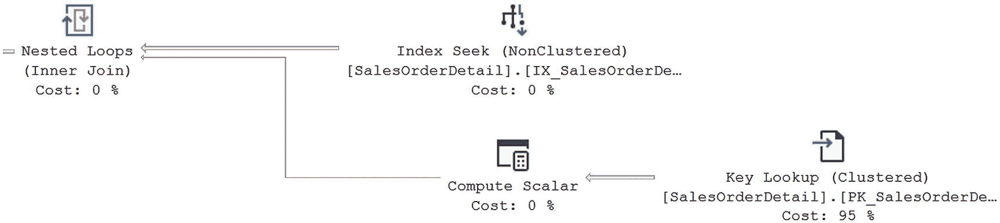

图 12-1
作为更复杂执行计划一部分的键查找

为了更好地理解非聚集索引如何导致查找，请考虑以下`SELECT`语句，该语句使用列`ProductID`上的筛选条件，从`SalesOrderDetail`表中仅请求少量行，但由于通配符`*`，它请求了所有列：

```sql
SELECT  *
FROM Sales.SalesOrderDetail AS sod
WHERE sod.ProductID = 776 ;
```

优化器评估`WHERE`子句，并发现`WHERE`子句中包含的`ProductID`列上有一个非聚集索引，可以过滤行数。由于只请求了少量行（228 行），通过非聚集索引检索数据将比扫描聚集索引（包含超过 120,000 行）来识别匹配行成本更低。`ProductID`列上的非聚集索引将有助于快速识别匹配行。非聚集索引包含`ProductID`列和聚集索引列`SalesOrderID`及`SalesOrderDetailID`；请求的所有其他列均未包含。因此，正如你可能猜到的，在使用非聚集索引的同时检索剩余的列，你需要一个查找操作。

这在下面的扩展事件（Extended Events）指标和图 12-2 中的执行计划中显示。请查找`Key Lookup (Clustered)`运算符。那就是实际执行的查找操作。


图 12-2
包含书签查找的执行计划

```
Duration: 176ms
Reads: 755
```


## 查找操作的缺点

一次查找操作除了需要访问索引页，还需要访问数据页。访问两组页面会增加查询的逻辑读取次数。此外，如果所需页面不在内存中，查找操作很可能还需要在磁盘上执行一次随机（或非连续）的 I/O 操作，以便从索引页跳转到数据页，同时还需要消耗必要的 CPU 能力来整理数据并执行所需操作。这是因为在大型表中，索引页与对应的数据页通常在磁盘上并非直接相邻。

增加的逻辑读取以及可能发生的昂贵物理读取，使得查找操作的数据检索成本相当高。此外，你还需要处理将从索引检索的数据与通过查找操作检索的数据进行合并的过程，这通常通过某个 `JOIN` 运算符完成。查找操作的成本因素是非聚集索引更适用于返回表中少量行的查询的原因。随着查询检索的行数增加，查找操作的开销成本会变得无法接受。同样，如果优化器的统计信息不准确，低估了返回的行数，查找操作的成本会迅速变得比全表扫描昂贵得多。

为了理解随着检索行数增加，查找操作如何使非聚集索引失效，让我们看一个不同的例子。产生图 12-2 执行计划的查询仅从 `SalesOrderDetail` 表返回了少量行。保持查询不变但更改过滤器值，当然会改变返回的行数。如果你将参数值更改为如下所示：

```sql
SELECT  *
FROM    Sales.SalesOrderDetail AS sod
WHERE   sod.ProductID = 793;
```

那么运行查询将返回超过 700 行，其性能指标不同，执行计划也完全不同（图 12-3）。

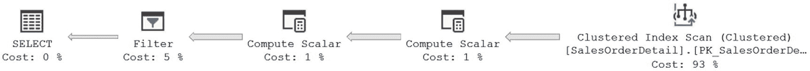

图 12-3

返回更多行的查询的不同执行计划

```
Duration: 195ms
Reads: 1,262
```

要确定使用非聚集索引的成本，考虑查询在表扫描期间执行的逻辑读取次数 (`1,262`)。如果你通过使用索引提示强制优化器使用非聚集索引，像这样：

```sql
SELECT  *
FROM    Sales.SalesOrderDetail AS sod WITH (INDEX (IX_SalesOrderDetail_ProductID))
WHERE   sod.ProductID = 793 ;
```

那么逻辑读取次数会从 `1,262` 增加到 `2,292`。

```
Duration: 1,114ms
Reads: 2,292
```

图 12-4 显示了相应的执行计划。

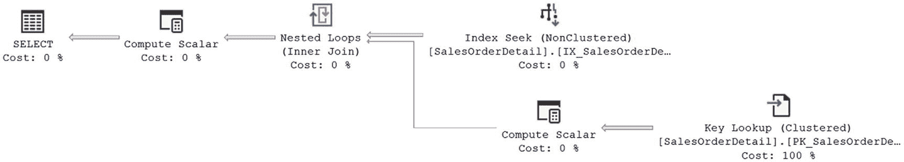

图 12-4

使用索引提示获取更多行的执行计划

要从非聚集索引中获益，查询应请求一个相对明确的数据集。应用程序设计在处理大型结果集的需求中扮演着重要角色。例如，网络上的搜索引擎大多一次只返回有限数量的文章，即使搜索条件匹配了数千篇文章。如果查询请求大量行，那么查找操作增加的开销成本会使非聚集索引变得不适用；因此，你必须考虑避免查找操作的可能性。

## 分析查找操作的原因

既然查找操作可能成本高昂，你应该分析是什么原因导致查询计划在执行计划中选择了查找步骤。你可能会发现，通过将缺失的列包含在非聚集索引键中，或者作为索引页级别的 `INCLUDE` 列，可以避免查找操作，从而避免与之相关的开销成本。

为了学习如何识别未包含在非聚集索引中的列，考虑以下查询，该查询基于 `NationalIDNumber` 从 `HumanResources.Employee` 表中提取信息：

```sql
SELECT NationalIDNumber,
       JobTitle,
       HireDate
FROM   HumanResources.Employee AS e
WHERE  e.NationalIDNumber = '693168613';
```

这产生了以下性能指标和执行计划（见图 12-5）：

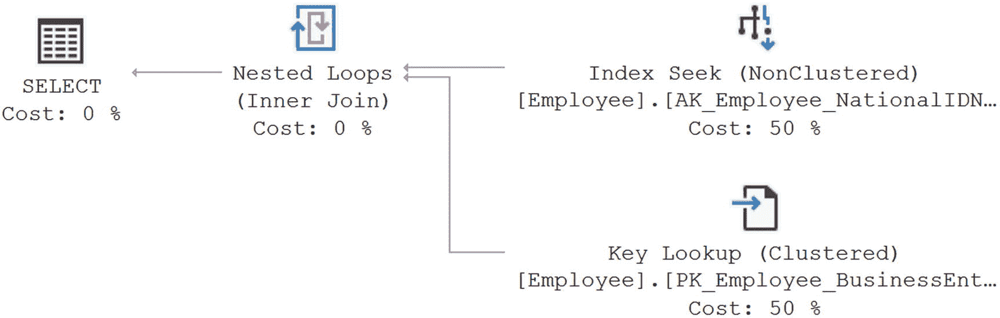

图 12-5

包含查找操作的执行计划

```
Duration: 169 mc
Reads: 4
```

如执行计划所示，这里有一个键查找操作。`SELECT` 语句引用了 `NationalIDNumber`、`JobTitle` 和 `HireDate` 列。`NationalIDNumber` 列上的非聚集索引不提供 `JobTitle` 和 `HireDate` 列的值，因此需要一个查找操作来从数据存储位置检索这些列。它之所以是 `Key Lookup`（键查找），是因为它通过存储在非聚集索引中的聚集键来检索数据。如果表是堆表，则会是 `RID` 查找。然而，在现实世界中，识别查询使用的所有列通常不会这么容易。请记住，如果查询任何部分（不仅仅是选择列表）中引用的所有列不属于所使用的非聚集索引的一部分，就会导致查找操作。

对于基于视图和用户定义函数的复杂查询，可能很难找出查询引用的所有列。因此，你需要一个标准机制来找出查找操作返回的、但未包含在非聚集索引中的列。

如果你查看 `Key Lookup (Clustered)` 操作的属性，可以看到该操作的输出列表。这显示了查找操作输出的列。要快速轻松地获取输出列列表并能够复制它们，请右键单击该运算符（本例中是 `Key Lookup (Clustered)`）。然后选择“属性”菜单项。在打开的属性窗口中向下滚动到“输出列表”属性（图 12-6）。该属性有一个展开箭头，可以展开列列表，并且每个列旁边还有进一步的展开箭头，可以展开列的属性。


图 12-6

键查找属性窗口

要直接从属性窗口获取列列表，请单击“输出列表”属性右侧的省略号。这将在文本窗口中打开输出列表，你可以从中复制数据以供修改索引时使用（图 12-7）。

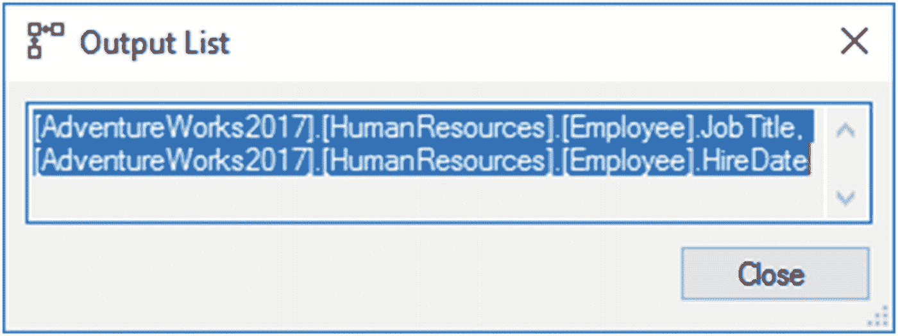

图 12-7

非聚集索引中不可用的所需列

使用该方法确实可以检索数据，但如你比较图 12-6 和 12-7 之间的信息时所见，如果深入查看属性，会发现有更多可用信息。

## 解决查找操作

由于查找操作的相对成本可能很高，你应该尽可能尝试消除查找操作。在上一节中，你需要在不从索引行导航到数据行的情况下获取 `JobTitle` 和 `HireDate` 列的值。你可以通过三种不同的方式来实现，如下节所述。

## 使用聚集索引

对于聚集索引，索引的叶子页与表的数据页是相同的。因此，当读取聚集索引键列的值时，数据库引擎也可以读取其他列的值，而无需从索引行进行任何导航。在之前的例子中，如果将某个特定行的非聚集索引转换为聚集索引，`SQL Server`可以从同一页中检索所有列的值。

简单地说，你想将非聚集索引转换为聚集索引很容易做到。然而，在这种情况下，以及你可能遇到的大多数情况下，这是不可能的，因为表上已经存在一个聚集索引。该表上的聚集索引恰好也是主键。你将不得不删除所有外键约束，删除主键并将其重建为非聚集索引，然后针对 `NationallDNumber` 重新创建索引。你不仅需要考虑所涉及的工作量，还可能严重影响依赖于现有聚集索引的其他查询。

## 注意

请记住，一个表只能有一个聚集索引。

## 使用覆盖索引

在第 8 章中，你了解到覆盖索引对于查询来说就像*伪聚集索引*，因为它可以无需借助表数据而返回结果。因此，你也可以使用覆盖索引来避免查找操作。

要理解如何使用覆盖索引来避免查找，请再次检查针对 `HumanResources.Employee` 表的查询。

```sql
SELECT  NationalIDNumber,
        JobTitle,
        HireDate
FROM    HumanResources.Employee AS e
WHERE   e.NationalIDNumber = '693168613';
```

要避免此书签查找，你可以将查询中引用的列 `JobTitle` 和 `HireDate` 直接添加到非聚集索引键中。这将使该非聚集索引成为此查询的覆盖索引，因为所有列都可以从索引中检索，而无需访问堆或聚集索引。

```sql
CREATE UNIQUE NONCLUSTERED INDEX AK_Employee_NationalIDNumber
ON HumanResources.Employee
(
    NationalIDNumber ASC,
    JobTitle ASC,
    HireDate ASC
)
WITH DROP_EXISTING;
```

现在，当查询运行时，你将看到以下指标和不同的执行计划（图 12-8）：

```text
../images/323849_5_En_12_Chapter/323849_5_En_12_Fig8_HTML.jpg
```

图 12-8
使用覆盖索引的执行计划

```text
Duration: 164mc
Reads: 2
```

然而，通过更改键来创建覆盖索引有几个注意事项。如果你向非聚集索引添加太多列，它会变宽。与操作查询相关的索引维护成本可能会增加，如第 8 章所述。因此，需要仔细评估添加键值是否会对索引的一般使用带来好处。如果某个键值不会用于索引内的搜索，那么将其添加到键中就没有意义。还要评估要添加到非聚集索引键中的列的数量（考虑大小和数据类型）。如果额外列的总宽度不是太大（最好通过测试和测量结果索引大小来确定），那么这些列可以添加到非聚集索引键中用作覆盖索引。此外，如果你向索引键添加列，当然，这取决于索引，你可能会对其他查询产生负面影响。它们可能期望看到特定顺序的索引键列，或者可能不引用键中的某些列，导致优化器不使用该索引。只有在基于这些评估有意义的情况下才通过添加键来修改索引，尤其因为你有一个替代方案，即不修改键。

另一种实现覆盖索引的方法是使用 `INCLUDE` 列，无需通过添加键列来重塑索引。将索引更改为如下形式：

```sql
CREATE UNIQUE NONCLUSTERED INDEX AK_Employee_NationalIDNumber
ON HumanResources.Employee
(
    NationalIDNumber ASC
)
INCLUDE
(
    JobTitle,
    HireDate
)
WITH DROP_EXISTING;
```

现在，当查询运行时，你将得到以下指标和执行计划（图 12-9）：

```text
../images/323849_5_En_12_Chapter/323849_5_En_12_Fig9_HTML.jpg
```

图 12-9
使用 INCLUDE 列的执行计划

```text
Duration: 152mc
Reads: 2
```

在这种情况下，索引的大小会小一点，这是因为 `INCLUDE` 只将数据存储在叶子页上，而不是每一页上。该索引仍然是覆盖索引，与图 12-8 中显示的执行计划一样。因为数据存储在索引的叶子级，当使用索引检索键值时，`INCLUDE` 语句中的其余列可供使用，几乎就像它们是键的一部分一样。参考图 12-10。


**图 12-10** 使用 INCLUDE 关键字实现的索引存储

获取覆盖索引的另一种方法是利用 SQL Server 内部的结构。如果对之前的查询稍作修改，以检索一组不同的数据，而不是特定的 `NationalIDNumber` 及其关联的 `JobTitle` 和 `HireDate`，那么这次查询将检索 `NationalIDNumber` 作为备用键，以及表的主键 `BusinessEntityID`，并且是在一个值范围内进行检索。

```sql
SELECT  NationalIDNumber,
        BusinessEntityID
FROM    HumanResources.Employee AS e
WHERE   e.NationalIDNumber BETWEEN '693168613'
                          AND     '7000000000';
```

表上原始的索引（我们现在将重新创建它）并未以任何方式引用 `BusinessEntityID` 列。

```sql
CREATE UNIQUE NONCLUSTERED INDEX AK_Employee_NationalIDNumber
ON HumanResources.Employee
(
    NationalIDNumber ASC
)
WITH DROP_EXISTING;
```

当针对该表运行查询时，可以看到图 12-11 所示的结果。


**图 12-11** 意外的覆盖索引

优化器是如何基于提供的索引为这个查询推导出覆盖索引的呢？它知道，在具有聚集索引的表上，聚集索引键（本例中是 `BusinessEntityID` 列）作为指向数据的指针与非聚集索引一起存储。这意味着任何在查询的过滤机制（`WHERE` 子句）或连接条件中结合使用了聚集索引和非聚集索引中的一组列的查询，都可以利用覆盖索引。

要了解这三种不同索引在存储中是如何体现的，你可以使用 `DBCC SHOWSTATISTICS` 查看索引本身的统计信息。当你对索引运行以下查询时，可以在图 12-12 中看到输出：

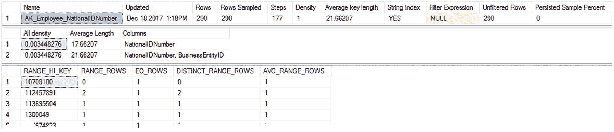

**图 12-12** 原始索引的 DBCC SHOW_STATISTICS 输出

```sql
DBCC SHOW_STATISTICS('HumanResources.Employee', AK_Employee_NationalIDNumber);
```

正如你从统计信息的密度图中所看到的，`NationalIDNumber` 列在首位。表的主键作为索引的一部分被包含，因此第二行包含 `BusinessEntityID` 列也是密度图的一部分。这使得键的平均长度约为 22 字节。这就是引用了主键值以及索引键值的索引能够作为覆盖索引发挥作用的方式。

如果你对第一次尝试的那个备用索引运行相同的 `DBCC SHOW_STATISTICS`，该索引的所有三个列都包含在键中，如下所示，你将会看到一组不同的统计信息（图 12-13）：

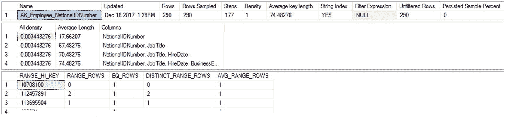

**图 12-13** 宽键覆盖索引的 DBCC SHOW_STATISTICS 输出

```sql
CREATE UNIQUE NONCLUSTERED INDEX AK_Employee_NationalIDNumber
ON HumanResources.Employee
(
    NationalIDNumber ASC,
    JobTitle ASC,
    HireDate ASC
)
WITH DROP_EXISTING;
```

现在你看到所有三个索引键列相加，最后加上主键。宽度从 22 字节增长到了 74 字节。这反映了 `JobTitle` 列（一个 `VARCHAR(50)`）以及 6 字节宽的 datetime 字段的加入。

最后，查看第二个备用索引的统计信息，该索引使用包含列，你将在图 12-14 中看到输出。

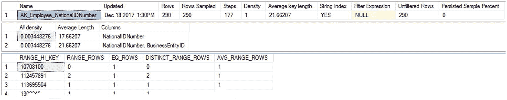

**图 12-14** 使用 INCLUDE 实现的覆盖索引的 DBCC SHOW_STATISTICS 输出

```sql
CREATE UNIQUE NONCLUSTERED INDEX AK_Employee_NationalIDNumber
ON HumanResources.Employee
(
    NationalIDNumber ASC
)
INCLUDE
(
    JobTitle,
    HireDate
)
WITH DROP_EXISTING;
```

现在，键的宽度又回到了原始大小，因为 `INCLUDE` 语句中的列不是与键一起存储，而是存储在索引的叶子级别。

从存储的统计信息数据中还可以搜集到更多有趣的信息，但我将在第 13 章中介绍。

### 使用索引连接

如果覆盖索引变得非常宽，那么你可能会考虑使用更窄的索引。正如第 9 章所解释的，如果情况恰好合适，优化器可以使用两个或多个索引之间的索引交集来完全覆盖查询。由于索引连接需要访问多个索引，因此它必须对索引连接中使用的所有索引执行逻辑读取。因此，它比覆盖索引需要更多的逻辑读取次数。但是，由于用于索引连接的多个窄索引可以比宽的覆盖索引服务于更多的查询（如第 9 章所述），你当然可以使用多个窄索引来测试你的查询，看看是否能通过索引连接避免查找操作。


## 注意

虽然可以获得索引连接（index join），但让优化器识别到它们可能有些困难。你确实需要准确的统计信息来帮助优化器做出这一选择。

为了更好地理解如何使用索引连接来避免查找（lookup），请针对 `PurchaseOrderHeader` 表运行以下查询，以检索特定供应商在特定日期的 `PurchaseOrderID`：

```sql
SELECT poh.PurchaseOrderID,
poh.VendorID,
poh.OrderDate
FROM Purchasing.PurchaseOrderHeader AS poh
WHERE VendorID = 1636
AND poh.OrderDate = '2014/6/24';
```

运行时，此查询会产生一个 `Key Lookup`（键查找）操作（参见图 12-15）以及以下 I/O：

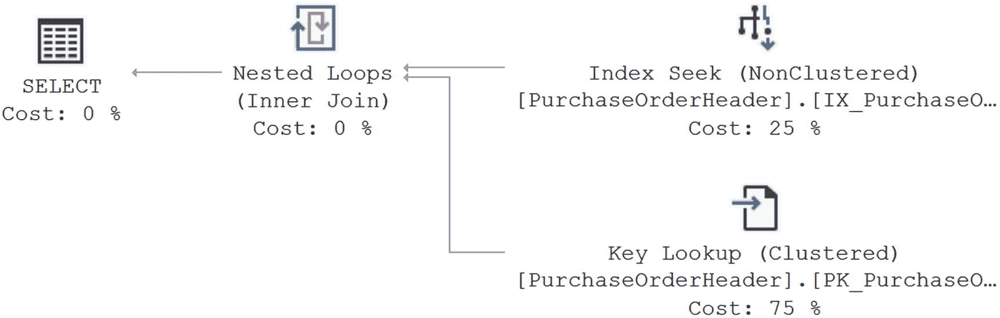

图 12-15：`Key Lookup`（键查找）操作

```text
Duration: 251 mc
Reads: 10
```

之所以会发生查找，是因为 `SELECT` 语句和 `WHERE` 子句引用的所有列并未全部包含在 `VendorID` 列上的非聚集索引中。尽管如此，使用非聚集索引仍然比不使用它要好，因为不使用它将导致对表进行扫描（在本例中是聚集索引扫描），从而产生更多的逻辑读取。

为了避免查找，你可以考虑如前一节所述，在 `OrderDate` 列上创建一个覆盖索引（covering index）。但除了覆盖索引方案，你还可以考虑索引连接。如你所知，索引连接所需的索引比覆盖索引更窄，从而提供以下两个好处：

-   多个窄索引可以比宽的覆盖索引服务于更多的查询。
-   窄索引比宽的覆盖索引所需的维护开销更少。

要使用索引连接来避免查找，请在 `OrderDate` 列上创建一个窄的非聚集索引，该索引不包含在现有的非聚集索引中。

```sql
CREATE NONCLUSTERED INDEX IX_TEST
ON Purchasing.PurchaseOrderHeader
(
OrderDate
);
```

如果再次运行 `SELECT` 语句，则会返回以下输出以及图 12-16 所示的执行计划：


图 12-16：无查找操作的执行计划

```text
Duration: 219 mc
Reads: 4
```

从上面的执行计划中可以看出，优化器使用了 `VendorlD` 列上的非聚集索引 `IX_PurchaseOrder_VendorID` 和 `OrderlD` 列上的新非聚集索引 `IX_TEST` 来完全满足查询，而无需访问其余数据的存储位置。此索引连接操作避免了查找，从而将逻辑读取次数从 10 次减少到 4 次。

诚然，在 `VendorlD` 和 `OrderlD` 列上创建覆盖索引可以进一步减少逻辑读取次数。但使用覆盖索引并不总是可行，因为它们可能很宽并且有其相关的开销。在这种情况下，索引连接可以是一个很好的替代方案。

## 总结

如本章所示，与非聚集索引相关的查找步骤可能使得通过非聚集索引检索数据成本非常高。SQL Server 优化器在生成执行计划时会考虑这一点，如果它发现使用非聚集索引的开销成本过高，就会丢弃该索引并执行表扫描（如果表存储为聚集索引，则执行聚集索引扫描）。因此，为了提高非聚集索引的有效性，分析查找的原因并考虑是否可以通过向索引键或 `INCLUDE` 列（或索引连接）添加字段并创建覆盖索引来完全避免查找，是很有意义的。

到目前为止，你一直专注于索引技术，并假设 SQL Server 优化器能够确定索引对查询的有效性。在下一章中，你将看到统计信息在帮助优化器确定索引有效性方面的重要性。

# 13. 统计信息、数据分布与基数

至此，你应该已经很好地理解了索引的重要性。但是，优化器并非仅凭索引来决定如何访问数据。它还利用强制的引用约束和其他表结构。最后，可能也是最重要的，优化器必须拥有定义索引或列的数据的相关信息。该信息被称为 `statistic`（统计信息）。统计信息定义了数据的分布以及数据的唯一性或选择性（selectivity）。系统会在索引和列上维护统计信息。你甚至可以自己手动定义统计信息。

在本章中，你将学习统计信息在查询优化中的重要性。具体来说，我将涵盖以下主题：

-   统计信息在查询优化中的作用
-   带索引列上统计信息的重要性
-   在连接和过滤条件中使用的非索引列上统计信息的重要性
-   单列和多列统计信息的分析，包括计算用于索引的列的选择性
-   统计信息维护
-   有效评估查询执行中使用的统计信息

## 统计信息在查询优化中的作用

SQL Server 的查询优化器是一个基于成本的优化器；它通过识别选择性（数据有多唯一）以及哪些列用于过滤数据（即通过 `WHERE`、`HAVING` 或 `JOIN` 子句）来决定最佳的数据访问机制和连接策略。统计信息随索引自动创建，但也存在于用作谓词的一部分但未加索引的列上。正如你在第 7 章所学，非聚集索引是检索索引覆盖数据的绝佳方式，而对于需要索引键之外列的查询，聚集索引可能效果更好。对于大型结果集，直接访问聚集索引或表通常更有益。

有关谓词引用的列中数据分布的最新信息有助于优化器确定要使用的查询策略。在 SQL Server 中，此信息以统计信息的形式维护，对于基于成本的优化器创建有效的查询执行计划至关重要。通过统计信息，优化器可以相对准确地估计返回结果集或中间结果集所需的时间，从而确定最有效的操作来执行 T-SQL 语句定义的数据检索或修改。只要你确保设置了数据库的默认统计信息设置，优化器就能尽力动态确定有效的处理策略。此外，作为故障排除性能时的安全措施，你应确保自动统计信息维护例程按预期工作。在必要时，你甚至可能需要手动控制统计信息的创建和/或维护。（我将在“手动维护”一节中介绍这一点，并在“分析统计信息”一节中介绍统计信息的确切性质和形态。）在下一节中，我将向你展示为什么统计信息对于作为谓词的索引列和非索引列都很重要。


### 索引列上的统计信息

索引的实用性很大程度上取决于被索引列的统计信息；没有统计信息，SQL Server 基于成本的查询优化器就无法决定使用索引的最有效方式。为了满足这一要求，SQL Server 在创建索引时会自动创建索引键的统计信息。无法关闭此功能。这对于行存储索引和列存储索引都会发生。

随着数据的变化，为保持查询成本较低所需的数据检索机制也可能发生变化。例如，如果某个表对于特定的列值只有一行匹配，那么通过该列上的非聚集索引去检索匹配行是合理的。但如果表中的数据发生变化，添加了大量具有相同列值的行，那么使用非聚集索引可能就不再合理。为了使 SQL Server 能够随着数据的长期变化决定处理策略的这种变更，拥有最新的统计信息至关重要。

当索引列的内容被修改时，SQL Server 可以保持索引上的统计信息更新。默认情况下，此功能是开启的，并且可以通过数据库的“属性” ➤ “选项” ➤ “自动更新统计信息”设置进行配置。更新统计信息会消耗额外的 CPU 周期和相关的 I/O。为了优化更新过程，SQL Server 使用了一种在“自动维护”部分详述的高效算法。

这种内置的智能特性使每个进程的 CPU 利用率保持在较低水平。也可以异步更新统计信息。这意味着当某个查询通常会触发统计信息更新时，该查询会继续使用旧的统计信息执行，而统计信息则在后台异步更新。这可以加快某些查询的响应时间，例如在数据库很大或超时时间设置较短的情况下。如果统计信息的变化足以导致执行计划发生根本性改变，这也可能拖慢性能。

你可以使用 `ALTER DATABASE` 命令手动禁用（或启用）“自动更新统计信息”和“异步自动更新统计信息”功能。默认情况下，“自动更新统计信息”功能和“自动创建”功能是启用的，强烈建议保持启用。“异步自动更新统计信息”功能默认是禁用的。仅当你确定它有助于解决由统计信息更新引起的超时或等待问题时，才开启此功能。

## 注意

我将在本章后面的“手动维护”部分解释 `ALTER DATABASE`。

### 更新统计信息的好处

对于大多数系统而言，执行自动更新的好处通常大于其对系统资源造成的开销。如果你拥有大型表（我指的是单表数百 GB），你可能处于一种情况，即让统计信息自动更新益处不大。在这种情况下，你可以尝试使用通过跟踪标志 2371 提供的滑动尺度，或者你可能处于自动统计信息维护效果不佳的情况。然而，这是一个极端的边缘情况，即使在这里，你可能也会发现自动更新统计信息并不会对你的系统产生负面影响。

为了更直接地控制数据行为，本组示例将不使用 AdventureWorks2017 中的表，而是手动创建一个。具体来说，创建一个仅有三行和一个非聚集索引的测试表。

```sql
DROP TABLE IF EXISTS dbo.Test1;
GO
CREATE TABLE dbo.Test1 (C1 INT,
C2 INT IDENTITY);
SELECT TOP 1500
IDENTITY(INT, 1, 1) AS n
INTO #Nums
FROM master.dbo.syscolumns AS sC1,
master.dbo.syscolumns AS sC2;
INSERT INTO dbo.Test1 (C1)
SELECT n
FROM #Nums;
DROP TABLE #Nums;
CREATE NONCLUSTERED INDEX i1 ON dbo.Test1 (C1);
```

如果你在索引列上使用具有选择性过滤条件的 `SELECT` 语句来仅检索一行，如下列代码所示，那么优化器将使用非聚集索引查找，如图 13-1 所示的执行计划：


*图 13-1：小结果集的执行计划*

```sql
SELECT *
FROM dbo.Test1
WHERE C1 = 2;
```

为了理解小型数据修改对统计信息更新的影响，使用 Extended Events 创建一个会话。在该会话中，添加捕获统计信息更新和创建事件的 `auto_stats` 事件，并添加 `sql_batch_completed` 事件。以下是创建并启动 Extended Events 会话的脚本：

```sql
CREATE EVENT SESSION [Statistics]
ON SERVER
ADD EVENT sqlserver.auto_stats
(ACTION (sqlserver.sql_text)
WHERE (sqlserver.database_name = N'AdventureWorks2017')),
ADD EVENT sqlserver.sql_batch_completed
(WHERE (sqlserver.database_name = N'AdventureWorks2017'));
GO
ALTER EVENT SESSION [Statistics] ON SERVER STATE = START;
GO
```

仅向表中添加一行。

```sql
INSERT  INTO dbo.Test1
(C1)
VALUES  (2);
```

当你重新执行前面的 `SELECT` 语句时，会得到与图 13-1 所示相同的执行计划。图 13-2 显示了由该 `SELECT` 查询生成的事件。


*图 13-2：添加少量行后的会话输出*

会话输出不包含任何表示统计信息更新的活动，因为变更数量低于阈值——对于超过 500 行的表，必须有 20% 的行被添加、修改或删除，或者，使用较新的行为，则未反映出足够的比例变化。

为了理解大型数据修改对统计信息更新的影响，向表中添加 1500 行。

```sql
SELECT TOP 1500
IDENTITY(INT, 1, 1) AS n
INTO #Nums
FROM master.dbo.syscolumns AS scl,
master.dbo.syscolumns AS sC2;
INSERT INTO dbo.Test1 (C1)
SELECT 2
FROM #Nums;
DROP TABLE #Nums;
```

现在，如果你重新执行 `SELECT` 语句，如下所示，将检索到一个大结果集（3001 行中的 1502 行）：

```sql
SELECT  *
FROM    dbo.Test1
WHERE   C1 = 2;
```


由于请求的是大结果集，直接扫描基础表比通过非聚集索引进行 1,502 次书签查找更可取。直接访问基础表可以避免与非聚集索引相关的书签查找开销。这体现在最终的执行计划中（参见图 13-3）。


图 13-3
大结果集的执行计划

图 13-4 显示了最终的会话输出。

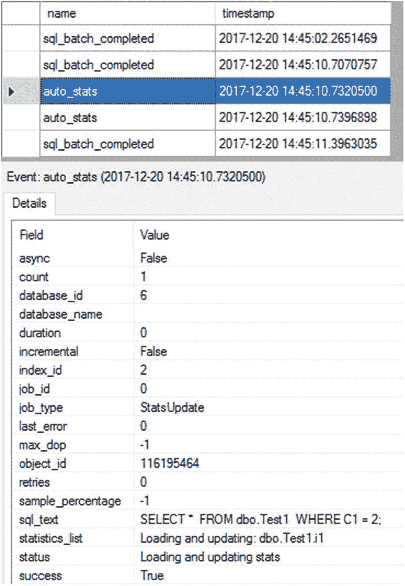

图 13-4
添加大量行后的会话输出

本次会话输出包含多个`auto_stats`事件，因为大规模更新再次超过了统计信息自动更新的阈值。通过查看详细信息，你可以判断每个事件在做什么。图 13-4 显示了`job_type`值，在本例中为`StatsUpdate`。你还会在`statistics_list`列中看到正在更新的统计信息列表。另一个值得注意的是`Status`列，它可以告诉你统计信息更新过程的更多细节，在本例中是“Loading and update stats”。图 13-4 中可见的第二个`auto_stats`事件显示`statistics_list`值为“Updated: dbo.Test1.i1”，表明更新过程已完成。紧接着该`auto_stats`事件之后，你可以看到查询本身的`sql_batch_completed`事件。这些活动消耗了一些额外的 CPU 周期来使统计信息保持最新。然而，通过这样做，优化器可以确定更好的数据处理策略，并保持查询的总体成本较低。最终变更到更高效的执行计划，即图 13-3 中的`Table Scan`操作，正是自动更新统计信息如此可取的原因。这也说明了异步更新统计信息可能带来的潜在问题，因为查询本会在旧的、效率较低的执行计划下执行。

### 过时统计信息的缺点

如前一节所述，自动更新统计信息功能允许优化器随着数据的变化为查询决定高效的处理策略。然而，如果统计信息变得过时，那么优化器决定的处理策略可能不适用于当前的数据集，从而降低性能。

要理解拥有过时统计信息的不利影响，请按照以下步骤操作：

1.  仅使用 1,500 行重新创建前面的测试表及相应的非聚集索引。
2.  阻止 SQL Server 随着数据变化自动更新统计信息。为此，通过执行以下 SQL 语句禁用自动更新统计信息功能：
    ```
    ALTER DATABASE AdventureWorks2017 SET AUTO_UPDATE_STATISTICS OFF;
    ```
3.  像之前一样向表中添加 1,500 行。

现在，重新执行`SELECT`语句以理解过时统计信息对查询优化器的影响。为了清晰起见，查询在此重复：

```
SELECT *
FROM dbo.Test1
WHERE C1 = 2;
```

图 13-5 和图 13-6 分别显示了此查询的最终执行计划和会话输出。


图 13-6
`AUTO_UPDATE_STATISTICS OFF`时的会话输出详情

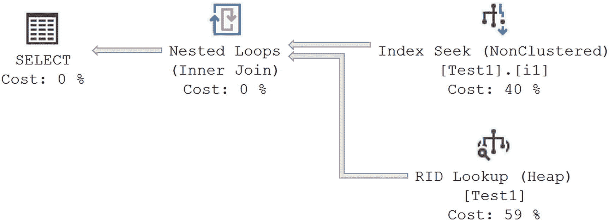

图 13-5
`AUTO_UPDATE_STATISTICS OFF`时的执行计划

当自动更新统计信息功能关闭时，查询优化器选择了一个与此功能开启时不同的执行计划。基于过时的统计信息（过滤条件`C1 = 2`只有一行），优化器决定使用非聚集索引查找。优化器无法根据列中当前的数据分布做出决策。出于性能考虑，由于请求的是大结果集（3,000 行中的 1,501 行），直接访问基础表会比通过非聚集索引更合适。

通过比较有更新统计信息和无更新统计信息两种情况下此查询的成本，你可以看到关闭自动更新统计信息功能对性能产生了负面影响。表 13-1 显示了此查询成本的差异。

表 13-1
有更新统计信息和无更新统计信息时的查询成本

| 统计信息更新状态 | 图例 | 成本 |   |
| --- | --- | --- | --- |
|   |   | 持续时间（毫秒） | 读取次数 |
| 已更新 | 图 13-4 | 171 | 9 |
| 未更新 | 图 13-6 | 678 | 1510 |

即使返回的数据完全相同且查询完全一致，当统计信息过时时，读取次数和持续时间也显著更高。因此，建议你保持自动更新统计信息功能开启。保持统计信息更新的好处通常超过执行更新的成本。在离开本节之前，请将`AUTO_UPDATE_STATISTICS`重新打开（尽管你也可以选择手动更新统计信息）。

```
ALTER DATABASE AdventureWorks2017 SET AUTO_UPDATE_STATISTICS ON;
```

### 非索引列上的统计信息

有时你可能在连接或过滤条件中使用没有任何索引的列。即使对于此类非索引列，如果查询优化器知道这些列的基数和数据分布（即*统计信息*），它也更有可能做出更好的选择。基数是集合中对象的数量，在此情况下是行数。数据分布指的是我们正在处理的整个数据集的唯一性程度。

除了索引上的统计信息外，SQL Server 还可以在没有索引的列上构建统计信息。关于数据分布的信息，或者非索引列中特定值出现的可能性，可以帮助查询优化器确定最优的处理策略。即使优化器不能使用索引来实际定位值，这也对查询优化器有益。如果 SQL Server 认为这些信息对于创建更好的计划有价值（通常在列用于谓词时），它会自动在非索引列上构建统计信息。默认情况下，此功能是开启的，并且可以通过数据库的“属性” ➤ “选项” ➤ “自动创建统计信息”设置进行配置。你可以使用`ALTER DATABASE`命令以编程方式覆盖此设置。但是，为了获得更好的性能，强烈建议你保持此功能开启。

你可能考虑禁用此功能的场景之一是执行一系列你永远不会再执行的临时 T-SQL 活动。另一个场景是当你确定静态、稳定但可能不充分的统计信息集合比可能的最佳统计信息集合效果更好，但它们可能由于变化的数据分布而导致性能不均匀。即使在这种情况下，你也应该测试一下，与影响其他 SQL Server 活动的性能相比，在此次情况下支付自动创建统计信息的成本以获得更好的计划是否更划算。对于大多数系统，你应该保持此功能开启，除非你看到明确的证据表明统计信息创建导致了性能问题，否则无需担心它。


### 非索引列统计信息的优势

要理解在没有索引的列上拥有统计信息的好处，请创建两个数据分布不均衡的测试表，如下列代码所示。两个表都包含 10,001 行。表 `Test1` 在第二列 (`Test1_C2`) 值等于 1 时仅包含一行，而剩余的 10,000 行中该列的值为 2。表 `Test2` 则包含完全相反的数据分布。

```sql
IF (SELECT OBJECT_ID('dbo.Test1')) IS NOT NULL
DROP TABLE dbo.Test1;
GO
CREATE TABLE dbo.Test1 (Test1_C1 INT IDENTITY,
Test1_C2 INT);
INSERT INTO dbo.Test1 (Test1_C2)
VALUES (1);
SELECT TOP 10000
IDENTITY(INT, 1, 1) AS n
INTO #Nums
FROM master.dbo.syscolumns AS scl,
master.dbo.syscolumns AS sC2;
INSERT INTO dbo.Test1 (Test1_C2)
SELECT 2
FROM #Nums
GO
CREATE CLUSTERED INDEX i1 ON dbo.Test1 (Test1_C1)
--Create second table with 10001 rows, -- but opposite data distribution
IF (SELECT OBJECT_ID('dbo.Test2')) IS NOT NULL
DROP TABLE dbo.Test2;
GO
CREATE TABLE dbo.Test2 (Test2_C1 INT IDENTITY,
Test2_C2 INT);
INSERT INTO dbo.Test2 (Test2_C2)
VALUES (2);
INSERT INTO dbo.Test2 (Test2_C2)
SELECT 1
FROM #Nums;
DROP TABLE #Nums;
GO
CREATE CLUSTERED INDEX il ON dbo.Test2 (Test2_C1);
```

表 13-2 说明了这些表的结构。

#### 表 13-2 示例表

| | 表 Test1 | | 表 Test2 | |
| :--- | :--- | :--- | :--- | :--- |
| **列** | `Test1_C1` | `Test1_C2` | `Test2_C1` | `Test2_C2` |
| `Row1` | 1 | 1 | 1 | 2 |
| `Row2` | 2 | 2 | 2 | 1 |
| `RowN` | N | 2 | N | 1 |
| `Row10001` | 10001 | 2 | 10001 | 1 |

要理解在非索引列上维护统计信息的重要性，请使用自动创建统计信息功能的默认设置。默认情况下，此功能是开启的。你可以使用 `DATABASEPROPERTYEX` 函数进行验证（尽管你也可以查询 `sys.databases` 视图）。

```sql
SELECT DATABASEPROPERTYEX('AdventureWorks2017',
'IsAutoCreateStatistics');
```

## 注意
本章稍后将详细描述如何配置自动创建统计信息功能。

使用以下 `SELECT` 语句从表 `Test1` 访问一个大型结果集，并从表 `Test2` 访问一个小型结果集。表 `Test1` 有 10,000 行的列值 `Test1_C2 = 2`，而表 `Test2` 只有 1 行的 `Test2_C2 = 2`。请注意，这些用于连接和筛选条件的列在任一表上均没有索引。

```sql
SELECT t1.Test1_C2,
t2.Test2_C2
FROM dbo.Test1 AS t1
JOIN dbo.Test2 AS t2
ON t1.Test1_C2 = t2.Test2_C2
WHERE t1.Test1_C2 = 2;
```

#### 图 13-7 AUTO_CREATE_STATISTICS 开启时的执行计划


#### 图 13-8 AUTO_CREATE_STATISTICS 开启时的扩展事件会话输出
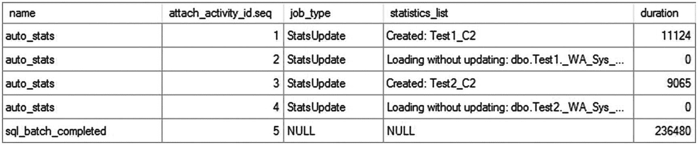

图 13-8 所示的会话输出包含了四个 `auto_stats` 事件，它们为 `JOIN` 和 `WHERE` 子句中引用的非索引列 `Test2_C2` 和 `Test1_C2` 创建统计信息，然后加载这些统计信息以供优化器内部使用。此活动消耗了少量额外的 CPU 周期（因为未检测到统计信息），并花费了大约 20,000 微秒 (mc)，即 20 毫秒。然而，通过消耗这些额外的 CPU 周期，优化器决定采用更好的处理策略，以保持查询的总体成本较低。

要验证 SQL Server 在每个表的非索引列上自动创建的统计信息，请针对 `sys.stats` 表运行此 `SELECT` 语句。

```sql
SELECT s.name,
s.auto_created,
s.user_created
FROM sys.stats AS s
WHERE object_id = OBJECT_ID('Test1');
```

#### 图 13-9 表 Test1 的自动统计信息


名为 `_WA_SYS*` 的统计信息是系统生成的列统计信息。你可以通过统计信息的名称以及 `auto_created` 的值（在本例中等于 1）来识别，而索引 `i1` 的该值则为 0。这很有趣，因为为索引创建的统计信息也是自动创建的，但它们不被视为 `AUTO_CREATE_STATISTICS` 过程的一部分，因为索引上的统计信息将始终被创建。

要验证来自两个表的不同结果集大小如何影响查询优化器的决策，请修改查询的筛选条件，以从两个表访问相反大小的结果集（`Test1` 为小，`Test2` 为大）。不筛选 `Test1.Test1_C2 = 2`，改为筛选值为 1。

```sql
SELECT t1.Test1_C2,
t2.Test2_C2
FROM dbo.Test1 AS t1
JOIN dbo.Test2 AS t2
ON t1.Test1_C2 = t2.Test2_C2
WHERE t1.Test1_C2 = 1;
```

#### 图 13-10 不同结果集的执行计划
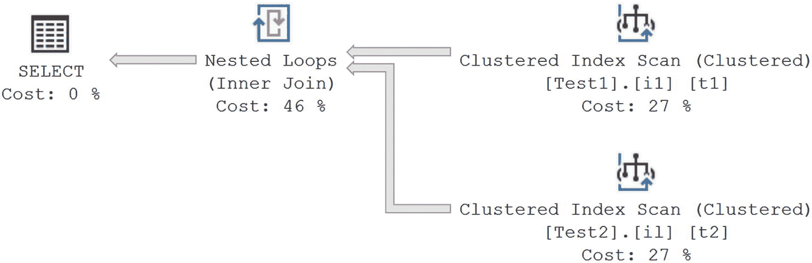

#### 图 13-11 不同结果集的扩展事件输出
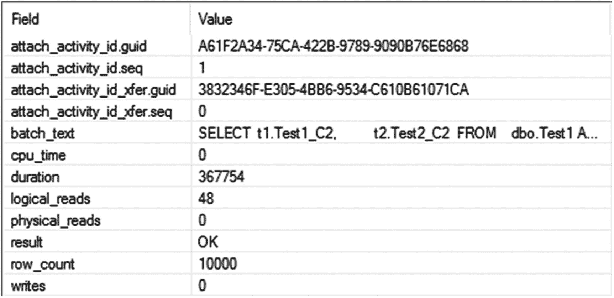


生成的会话输出没有执行任何额外的 SQL 活动来管理统计信息。非索引列（`Test1.Test1_C2` 和 `Test2.Test2_C2`）上的统计信息在索引本身创建时就已经生成，并随着数据的变化而更新。

为了实现有效的成本优化，在每种情况下，查询优化器都根据非索引列（`Test1.Test1_C2` 和 `Test2.Test2_C2`）上的统计信息选择了不同的处理策略。你可以从之前的两个执行计划中看出这一点。在第一个计划中，表 `Test1Test1` 是嵌套循环联接的外部表，而在最新的计划中，表 `Test2` 是外部表。通过拥有非索引列（`Test1.Test1_C2` 和 `Test2.Test2_C2`）上的统计信息，查询优化器可以为每种情况创建具有成本效益的计划。

一个更好的解决方案是在列上创建索引。这不仅会创建列上的统计信息，还允许在检索较小结果集时通过 `Index Seek`（索引查找）操作快速检索数据。然而，对于在 `WHERE` 子句中引用非索引列的数据库应用程序，保持自动创建统计信息功能开启仍然允许优化器根据列中现有的数据分布确定最佳处理策略。

如果你需要知道某个统计信息可能涵盖了哪个或哪些列，你需要查看 `sys.stats_columns` 系统表。你可以像查询 `sys.stats` 表一样查询它。

```sql
SELECT  *
FROM    sys.stats_columns
WHERE   object_id = OBJECT_ID('Test1');
```

这将显示由自动创建的统计信息所引用的列。如果你决定需要创建索引来替代统计信息，可以使用此信息来帮助你，因为你需要知道要在哪些列上创建索引。此处列出的列是表中列的序号位置。要查看列名，你需要修改查询。

```sql
SELECT c.name,
sc.object_id,
sc.stats_column_id,
sc.stats_id
FROM sys.stats_columns AS sc
JOIN sys.columns AS c
ON c.object_id = sc.object_id
AND c.column_id = sc.column_id
WHERE sc.object_id = OBJECT_ID('Test1');
```

### 非索引列缺失统计信息的缺点

要了解非索引列上没有统计信息的有害影响，请删除 SQL Server 自动创建的统计信息，并通过以下步骤阻止 SQL Server 自动在无索引的列上创建统计信息：

1.  使用以下 SQL 命令删除在列 `Test1.Test1_C2` 上自动创建的统计信息，将系统自动为统计信息指定的名称替换 `StatisticsName`：

```sql
DROP STATISTICS [Test1].StatisticsName;
```

2.  类似地，删除列 `Test2.Test2_C2` 上相应的统计信息。

3.  通过取消选中相应数据库的“自动创建统计信息”复选框，或执行以下 SQL 命令来禁用自动创建统计信息功能：

```sql
ALTER DATABASE AdventureWorks2017 SET AUTO_CREATE_STATISTICS OFF;
```

现在重新执行 `SELECT` 语句 `--nonindexed_select`。

```sql
SELECT  Test1.Test1_C2,
        Test2.Test2_C2
FROM    dbo.Test1
JOIN    dbo.Test2
        ON Test1.Test1_C2 = Test2.Test2_C2
WHERE   Test1.Test1_C2 = 2;
```

图 13-12 和图 13-13 分别显示了由此产生的执行计划和扩展事件输出。


图 13-13: `AUTO_CREATE_STATISTICS OFF` 时的跟踪输出

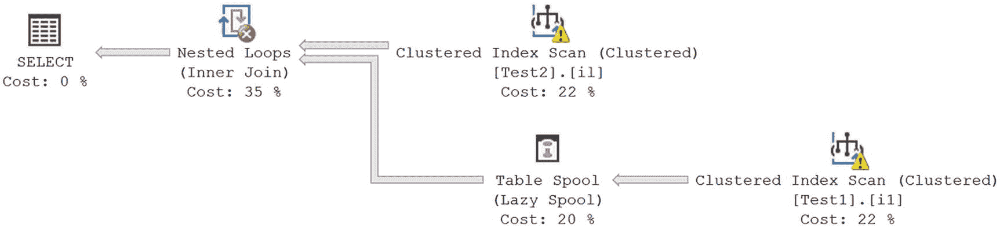

图 13-12: `AUTO_CREATE_STATISTICS OFF` 时的执行计划

在自动创建统计信息功能关闭的情况下，查询优化器选择了一个与其在功能开启时选择的不同的执行计划。由于没有在相关列上找到统计信息，优化器选择了 `FROM` 子句中的第一个表（`Test1`）作为嵌套循环联接操作的外部表。优化器无法基于列中的实际数据分布做出决策。你可以在执行计划中看到警告（一个感叹号），它出现在数据访问操作符（聚集索引扫描）上，指示缺少统计信息。如果你修改查询，使表 `Test2` 成为 `FROM` 子句中的第一个表，那么优化器会选择表 `Test2` 作为嵌套循环联接操作的外部表。图 13-14 显示了执行计划。

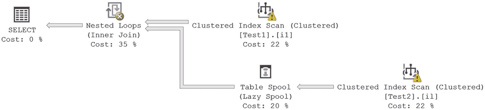

图 13-14: `AUTO_CREATE_STATISTICS OFF` 时的执行计划（一个变体）

```sql
SELECT  Test1.Test1_C2,
        Test2.Test2_C2
FROM    dbo.Test2
JOIN    dbo.Test1
        ON Test1.Test1_C2 = Test2.Test2_C2
WHERE   Test1.Test1_C2 = 2;
```

通过比较此查询在有统计信息和无非索引列统计信息时的成本，你可以看到关闭自动创建统计信息功能对性能有负面影响。表 13-3 显示了此查询在成本上的差异。

表 13-3: 有统计信息与无非索引列统计信息的查询成本对比

| 非索引列上的统计信息 | 图示 | 成本 | |
| :--- | :--- | :--- | :--- |
| | | 平均持续时间 (毫秒) | 读取次数 |
| 有统计信息 | 图 13-11 | 98 | 48 |
| 无统计信息 | 图 13-13 | 262 | 20273 |

在非索引列上没有统计信息时，逻辑读取次数和 CPU 利用率更高。没有这些统计信息，优化器无法创建具有成本效益的计划，因为它实际上必须通过一组内置的启发式计算来猜测选择性。

查询执行计划通过会在本应使用统计信息的操作符上放置一个感叹号来突出显示缺失的统计信息。你可以在之前的执行计划（图 13-12 和 13-14）的聚集索引扫描操作符中看到这一点，也可以在图形执行计划节点属性的“警告”部分的详细描述中看到，如图 13-15 中针对表 `Test1` 所示。

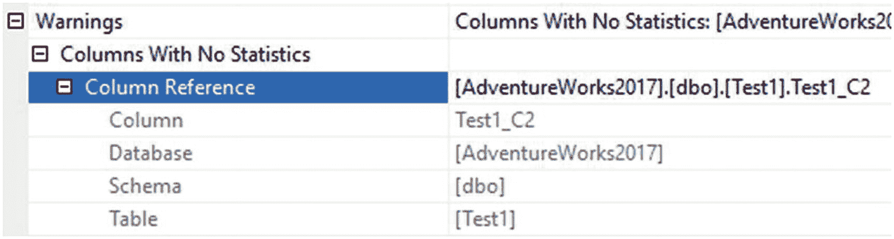

图 13-15: 图形计划中的缺失统计信息指示


## 注意

在数据库应用程序中，查询使用未建立索引的列的可能性总是存在的。因此，在大多数系统中，出于性能原因，**强烈建议**保持 SQL Server 数据库的自动创建统计信息功能处于开启状态。

你可以查询缓存中的执行计划，以识别那些可能缺少统计信息的计划。

```sql
SELECT dest.text AS query,
deqs.execution_count,
deqp.query_plan
FROM sys.dm_exec_query_stats AS deqs
CROSS APPLY sys.dm_exec_text_query_plan(deqs.plan_handle,
deqs.statement_start_offset,
deqs.statement_end_offset) AS detqp
CROSS APPLY sys.dm_exec_query_plan(deqs.plan_handle) AS deqp
CROSS APPLY sys.dm_exec_sql_text(deqs.sql_handle) AS dest
WHERE detqp.query_plan LIKE '%ColumnsWithNoStatistics%';
```

这个查询**取了一点巧**。我在 `LIKE` 操作符的变量两边都使用了通配符，这实际上是一个常见的代码问题（在第 20 章中有更详细的讨论），但在这种情况下，另一种选择是运行 XQuery，这需要加载 XML 解析器。根据系统可用内存量的不同，这种通配符搜索方法可能比直接查询执行计划的 XML 快得多。查询调优不仅仅是使用单一方法，而是要理解如何将它们结合起来。

如果你处于需要禁用统计信息自动创建的情况，你可能仍然希望追踪统计信息在哪些地方可能对你的查询有用。你可以使用扩展事件 `missing_column_statistics` 事件来捕获这些信息。对于前面的例子，你可以在图 13-16 中看到此事件的输出示例。


*图 13-16. missing_column_statistics 扩展事件的输出*

`column_list` 将显示哪些列没有统计信息。然后你可以决定是否创建自己的统计信息以使相关查询受益。

在继续之前，请务必将统计信息自动创建功能重新打开。

```sql
ALTER DATABASE AdventureWorks2017 SET AUTO_CREATE_STATISTICS ON;
```

## 分析统计信息

统计信息是在三组数据内定义的信息集合：标头、密度图和直方图。其中最常用的数据集之一是直方图。*直方图*是一种统计结构，显示数据落入称为*步骤*的不同类别的频率。SQL Server 存储的直方图由针对列或索引键（或多列索引键的第一列）数据分布的抽样组成，最多包含 200 行。两个连续抽样之间的索引键值范围的信息就是一个步骤。这些步骤由存储的 200 个值之间大小不一的区间组成。一个步骤提供以下信息：

*   给定步骤的最高值 (`RANGE_HI_KEY`)
*   等于 `RANGE_HI_KEY` 的行数 (`EQ_ROWS`)
*   在前一个最高值和当前最高值之间（不计算这两个边界点）的行数 (`RANGE_ROWS`)
*   范围内的不同值数量 (`DISTINCT_RANGE_ROWS`)；如果范围内的所有值都是唯一的，则 `RANGE_ROWS` 等于 `DISTINCT_RANGE_ROWS`
*   范围内任何潜在键值等于该值的平均行数 (`AVG_RANGE_ROWS`)

例如，在引用索引时，直方图中步骤内键值的 `AVG_RANGE_ROWS` 值有助于优化器决定在 `WHERE` 子句中引用索引列时如何（以及是否）使用该索引。因为优化器可以执行 `SEEK`（查找）或 `SCAN`（扫描）操作来从表中检索行，所以优化器可以根据索引键值的潜在匹配行数来决定执行哪个操作。在引用 `RANGE_HI_KEY` 时，这甚至可以更加精确，因为优化器可以知道它应该从该值找到相当精确的行数（假设统计信息是最新的）。

为了理解优化器的数据检索策略如何依赖于匹配行数，请在一个索引列上创建具有不同数据分布的测试表。

```sql
IF (SELECT  OBJECT_ID('dbo.Test1')
) IS NOT NULL
DROP TABLE dbo.Test1 ;
GO
CREATE TABLE dbo.Test1 (C1 INT, C2 INT IDENTITY) ;
INSERT  INTO dbo.Test1
(C1)
VALUES  (1) ;
SELECT TOP 10000
IDENTITY( INT,1,1 ) AS n
INTO    #Nums
FROM    Master.dbo.SysColumns sc1,
Master.dbo.SysColumns sc2 ;
INSERT  INTO dbo.Test1
(C1)
SELECT  2
FROM    #Nums ;
DROP TABLE #Nums;
CREATE NONCLUSTERED INDEX FirstIndex ON dbo.Test1 (C1) ;
```

当创建上述非聚集索引时，SQL Server 会自动在索引键上创建统计信息。你可以通过执行 `DBCC SHOW_STATISTICS` 命令来获取此非聚集索引 (`FirstIndex`) 的统计信息。

```sql
DBCC SHOW_STATISTICS(Test1, FirstIndex);
```

图 13-17 显示了统计信息输出。

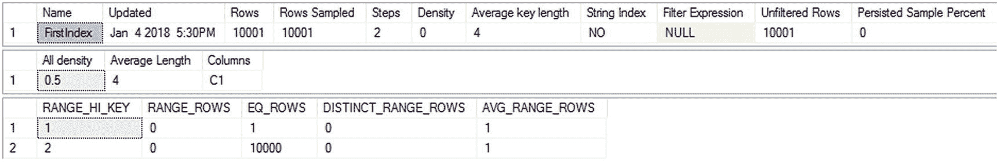

*图 13-17. 索引 FirstIndex 上的统计信息*

现在，为了理解优化器如何根据统计信息有效地决定不同的数据检索策略，请执行以下两个请求不同行数的查询：

```sql
--检索 1 行
SELECT  *
FROM    dbo.Test1
WHERE   C1 = 1;
--检索 10000 行
SELECT  *
FROM    dbo.Test1
WHERE   C1 = 2;
```

图 13-18 显示了这些查询的执行计划。


*图 13-18. 小型和大型结果集查询的执行计划*

从统计信息中，优化器可以找到上述两个查询所需的行数。了解到第一个查询只需检索一行，优化器选择了 `Index Seek`（索引查找）操作，然后执行必要的 `RID Lookup`（行标识符查找）以检索未与聚集索引存储在一起的数据。对于第二个查询，优化器知道将影响大量行（10,000 行），因此避免使用索引以试图提高性能。（第 8 章详细解释了索引策略。）

除了直方图中包含的信息外，标头还有其他有用的信息，包括：

*   统计信息最后更新的时间
*   表中的行数
*   平均索引键长度
*   为直方图抽样的行数
*   列组合的密度

关于最后更新时间的信息可以帮助你决定是否应手动更新统计信息。平均键长代表索引键列中数据的平均大小。它有助于你理解索引键的宽度，这是衡量索引有效性的一个重要指标。如第 6 章所述，宽索引可能维护成本高，需要更多磁盘空间和内存页，但如下一节所述，它可以使索引具有极高的选择性。


### 密度

在创建执行计划时，查询优化器会分析筛选条件和 `JOIN` 子句中所用列的统计信息。具有高选择性的筛选条件能将表中的行数限制在一个较小的结果集内，并帮助优化器保持较低的查询成本。具有唯一索引的列将具有高选择性，因为它能将匹配行数限制为一。

另一方面，具有低选择性的筛选条件将从表中返回一个大的结果集。低选择性的筛选条件可能导致该列上的非聚集索引失效。为获取一个大结果集而通过非聚集索引导航到基础表，通常比直接扫描基础表（或聚集索引）的成本更高，这是由于与非聚集索引关联的查找操作带来的额外开销。你可以在图 13-18 的第一个执行计划中观察到此行为。

统计信息以密度比率的形式跟踪列的选择性。具有高选择性（或唯一性）的列将具有低密度。具有低密度（即高选择性）的列适合作为筛选条件，因为它可以帮助优化器非常快地检索少量行。这也是筛选索引的工作原理，因为筛选的目标是增加索引的选择性或密度。

密度可表示如下：

```
Density = 1 / 列的唯一值数量
```

密度的计算结果将始终是介于 0 和 1 之间的某个数字。列的密度越低，越适合作为索引键。你可以自行计算以确定自己索引和统计信息中列的密度。例如，要计算由前一个脚本构建的测试表中列 `C1` 的密度，请使用以下语句（结果如图 13-19 所示）：


图 13-19

列 `C1` 的密度计算结果

```
SELECT 1.0 / COUNT(DISTINCT C1)
FROM dbo.Test1;
```

在 `DBCC SHOW_STATISTICS` 输出的 `All density` 列中，你可以看到此值的实际数据。该列的高密度值使其成为不太适合的索引候选，即使是筛选索引也是如此。然而，索引键值统计信息在步骤中维护的方式有助于查询优化器将该索引用于谓词 `C1 = 1`，如前面的执行计划所示。

### 多列索引上的统计信息

对于单列索引，统计信息由该列的一个直方图和一个密度值组成。对于包含多列的复合索引，统计信息仅包含第一个列的一个直方图和多个密度值。这就是为什么在构建复合索引或复合统计信息时，通常将选择性更高（即密度最低）的列放在首位是一个好的实践。密度值包括第一列的密度以及索引键列的每种额外组合的密度。多个密度值有助于优化器在 `WHERE`、`HAVING` 和 `JOIN` 子句中的谓词引用多列时，找到复合索引的选择性。虽然第一列有助于确定直方图，但列本身的最终权重密度将与列顺序无关。

多列密度图可以来自索引键中的多列，也可以来自手动创建的统计信息。但是，你永远不会看到由自动统计信息创建过程创建的多列统计信息，以及随之而来的密度图。让我们看一个简单的例子。以下是一个查询，它很容易从包含两列的一组统计信息中受益：

```
SELECT  p.Name,
        p.Class
FROM    Production.Product AS p
WHERE   p.Color = 'Red' AND
        p.DaysToManufacture > 15;
```

在列 `p.Color` 和 `p.DaysToManufacture` 上创建的索引将具有多列密度值。在运行此查询之前，这里有一个查询可以让你查看给定表上统计信息的基本结构：

```
SELECT s.name,
       s.auto_created,
       s.user_created,
       s.filter_definition,
       sc.column_id,
       c.name AS ColumnName
FROM   sys.stats AS s
       JOIN sys.stats_columns AS sc
            ON  sc.stats_id = s.stats_id
            AND sc.object_id = s.object_id
       JOIN sys.columns AS c
            ON  c.column_id = sc.column_id
            AND c.object_id = s.object_id
WHERE  s.object_id = OBJECT_ID('Production.Product');
```

在 `Production.Product` 表上运行此查询的结果如图 13-20 所示。

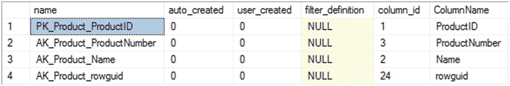

图 13-20

`Product` 表的统计信息列表

你可以看到表上的索引，每个索引都由单列组成。现在我将运行可能从多列密度图中受益的查询。但是，我不打算通过 `SHOWSTATISTICS` 来追踪统计信息，而是再次查询系统表。结果如图 13-21 所示。

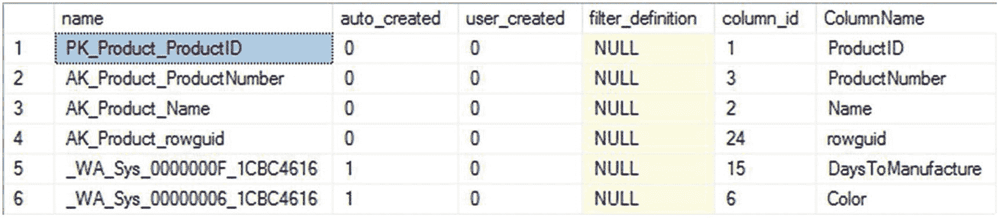

图 13-21

已向 `Product` 表添加了两个新的统计信息

如你所见，系统没有添加一个包含多列的统计信息，而是创建了两个新的统计信息。只有在多列索引键中，或者通过手动创建统计信息时，你才会获得多列统计信息。

为了更好地理解为多列索引维护的密度值，你可以修改之前使用的非聚集索引以包含两列。

```
CREATE NONCLUSTERED INDEX FirstIndex
ON dbo.Test1
(
    C1,
    C2
)
WITH (DROP_EXISTING = ON);
```

图 13-22 显示了由 `DBCC SHOWSTATISTICS` 提供的结果统计信息。


图 13-22

多列索引 `FirstIndex` 上的统计信息

如你所见，在 `All density` 列下有两个密度值。

*   第一列的密度
*   （第一列 + 第二列）组合的密度

对于包含三列的多列索引，索引的统计信息还将包含（第一列 + 第二列 + 第三列）组合的密度值。直方图不会包含任何其他列组合的选择性值。因此，此索引（`FirstIndex`）对于仅基于第二列（`C2`）进行筛选行不太有用，因为第二列（`C2`）单独的值未在直方图中维护，并且它本身也不是密度图的一部分。

你可以通过以下步骤计算图 13-19 中显示的第二个密度值 (0.000099990000)。这是列组合 (`C1`, `C2`) 的唯一值数量。

```
SELECT 1.0 / COUNT(*)
FROM
    (SELECT DISTINCT C1, C2 FROM dbo.Test1) AS DistinctRows;
```


### 过滤索引上的统计信息

过滤索引的目的是限制构成索引的数据，从而改变密度和直方图，以使索引性能更佳。本例将使用 `AdventureWorks2017` 数据库中的一个表，而非测试表。在 `Sales.PurchaseOrderHeader` 表的 `PurchaseOrderNumber` 列上创建一个索引。

```
CREATE INDEX IX_Test ON Sales.SalesOrderHeader (PurchaseOrderNumber);
```

图 `13-23` 显示了针对此新索引运行 `DBCC SHOWSTATISTICS` 输出的信息头和密度。


图 13-23

未过滤索引的统计信息头

```
DBCC SHOW_STATISTICS ('Sales.SalesOrderHeader',IX_Test);
```

如果重新创建同一个索引以处理该列不为 `null` 的值，它可能如下所示：

```
CREATE INDEX IX_Test
ON Sales.SalesOrderHeader
(
PurchaseOrderNumber
)
WHERE PurchaseOrderNumber IS NOT NULL
WITH (DROP_EXISTING = ON);
```

现在，在图 `13-24` 中，查看一下统计信息。

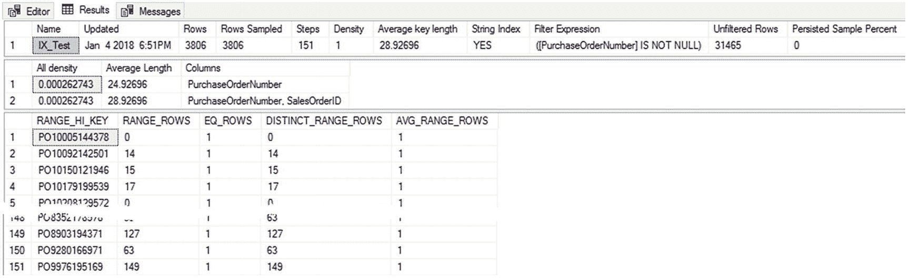

图 13-24

过滤索引的统计信息头

首先，你可以看到，由于应用了过滤器，构成统计信息的行数在过滤索引中急剧下降，从 31465 降至 3806。同时请注意，由于不再处理零长度字符串，平均键长增加了。这里定义了一个过滤表达式，而不是图 `13-23` 中可见的 `NULL` 值。但是，两组数据的未过滤行是相同的。

密度测量值很有趣。注意，两者的密度值相近，但过滤后的密度略低，这意味着唯一值更少。这是因为过滤后的数据虽然选择性略低，但实际上更精确，消除了所有不会对搜索做出贡献的空值。而第二个值的密度（代表聚集索引指针）与单独 `PurchaseOrderNumber` 的密度值完全相同，因为两者都代表相同数量的唯一数据。前一列中额外聚集索引的密度是一个小得多的数字，这是由于所有 `SalesOrderId` 的唯一值因消除了 `NULL` 值而未被包含在过滤数据中。你还可以在图 `13-23` 中看到直方图的第一列显示了一个 `NULL` 值，而在图 `13-24` 中则有了一个值。

你还可以选择创建过滤统计信息。这允许你创建更加精细调整的直方图。这对于分区表尤其有用。这样做是必要的，因为统计信息不会在分区表上自动创建，而你也无法使用 `CREATE STATISTICS` 创建自己的统计信息。你可以按分区创建过滤索引并获取统计信息，或专门按分区创建过滤统计信息。

继续之前，清理已创建的索引（如果有）。

```
DROP INDEX Sales.SalesOrderHeader.IX_Test;
```

### 基数

统计信息（包括直方图和密度）被查询优化器用来计算在查询执行过程中每个操作预计会产生多少行。这种用于确定返回行数的计算被称为 `基数估计`。基数表示一组数据中的行数，这意味着它与 SQL Server 中的密度度量直接相关。从 SQL Server 2014 开始，使用了不同的基数估计器。这是自 SQL Server 7.0 以来对核心基数估计过程的首次更改。对估计器某些领域的更改意味着优化器以与之前相同的方式读取统计信息，但根据已修改的基数计算，优化器会进行不同类型的计算，以确定执行计划中每个操作将处理的行数。

在讨论细节之前，让我们看看实际效果。首先，我们将更改数据库的基数估计，以使用旧的估计器。

```
ALTER DATABASE SCOPED CONFIGURATION SET LEGACY_CARDINALITY_ESTIMATION = ON;
```

设置好后，我想运行一个简单的查询。

```
SELECT a.AddressID,
a.AddressLine1,
a.AddressLine2
FROM Person.Address AS a
WHERE a.AddressLine1 = '5980 Icicle Circle'
AND AddressLine2 = 'Unit H';
```

这里无需探讨整个执行计划。相反，我想查看 `SELECT` 操作符上的 `估计行数` 值，如图 `13-25` 所示。


图 13-25

使用旧基数估计引擎时的行数

你可以看到 `估计行数` 等于 1。现在，让我们将传统基数估计重新关闭。

```
ALTER DATABASE SCOPED CONFIGURATION SET LEGACY_CARDINALITY_ESTIMATION = OFF;
```

如果我们重新运行查询并再次查看 `SELECT` 操作符，情况已经改变（见图 `13-26`）。

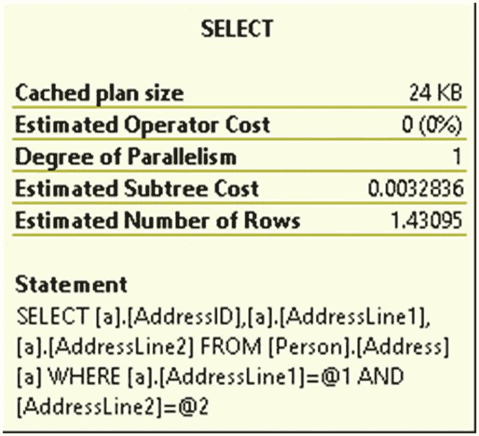

图 13-26

使用现代基数估计引擎时的行数

你可以看到 `估计行数` 已从 1 变为 1.43095。这直接反映了更新的基数估计器。

大多数情况下，用于驱动执行计划的数据来自直方图。对于单个谓词，值仅使用直方图定义的选择性。但是，当使用多个列进行过滤时，基数计算必须考虑每个列的潜在选择性。在 SQL Server 2014 之前，使用几个简单的计算来确定基数。对于 `AND` 组合，计算基于将第一列的选择性乘以第二列的选择性，类似于这样：

```
Selectivity1 * Selectivity2 * Selectivity3 ...
```

两个列之间的 `OR` 计算则更为复杂。新的 `AND` 计算如下所示：

```
Selectivity1 * Power(Selectivity2,1/2) * Power(Selectivity3,1/4) ...
```


简而言之，该方法并非简单地将各列的选择性相乘以使整体选择性越来越高，而是采用了不同的计算方式：从选择性最低的数据到选择性最高的数据，通过取选择性的二分之一、四分之一、八分之一……（具体取决于涉及的数据列数量）的幂次，最终得到一个更温和、偏斜程度更低的估计值。其基本假设是数据并非一系列互不相关的列集合；相反，数据之间存在相关性，使得一定程度的重复成为可能。这种新计算方法不会改变所有生成的执行计划，但可能更准确的估计值可能会在某些位置改变计划。当使用 `OR` 子句时，计算方式再次改变，以提示列之间可能存在相关性。

在之前的示例中，我们确实看到了这一点。返回了三行，而 1.4 的行估计值比 1 的行估计值更接近实际值 3。

### SQL Server 2014 及更高版本的基数估计

从兼容级别为 120 的 SQL Server 2014 开始，引入了更多新的计算方法。这意味着对于大多数查询，平均而言，如果您的统计信息是最新的，您可能会看到性能提升，因为更准确的基数计算意味着优化器能做出更好的选择。但是，由于基数计算方式的变化，某些查询的性能也可能下降。这是可以预期的，因为您可能会遇到各种各样的负载、架构和数据分布情况。

SQL Server 2014 中改变了另一个新的基数估计假设。在 SQL Server 2012 及更早版本中，当索引中由递增或递减增量（例如标识列或 datetime 值）组成的列引入了一个超出当前直方图范围的新行时，优化器会回退到其针对无统计信息的数据的默认估计值（即一行）。这可能导致严重不准确的查询计划，从而引发性能问题。现在，所有计算都已更新。

首先，如果您使用 `FULLSCAN`（详见“统计信息维护”部分）创建了统计信息，并且数据没有被修改，那么基数估计的工作方式与之前相同。但是，如果统计信息是使用默认抽样创建的，或者数据已被修改，那么基数估计器将基于该统计信息集内返回的平均行数进行计算，并假定该值，而不是单一行。这可以带来更准确的执行计划，但前提是数据分布相当均匀。不均匀的分布（称为偏斜数据）可能导致糟糕的基数估计，进而产生类似于糟糕的参数嗅探（详见第 18 章）的行为。

现在，您可以使用 Extended Events 中的 `query_optimizer_estimate_cardinality` 事件来观察基数估计的运作情况。我不会详细介绍该事件所有可能的输出，但我想展示如何观察优化器的行为，并将其在执行计划和基数估计之间关联起来。对于绝大多数查询调优而言，这可能帮助不大，但如果您不确定优化器是如何进行估计的，或者这些估计似乎不准确，您可以使用此方法来进一步调查相关信息。

## 注意

`query_optimizer_estimate_cardinality` 事件位于 Extended Events 的 `Debug` 包中。调试事件主要供 Microsoft 内部使用。`Debug` 包中的事件（包括 `query_optimizer_estimate_cardinality`）可能会在不通知的情况下更改或移除。

首先，您应该设置一个包含 `query_optimizer_estimate_cardinality` 事件的 Extended Events 会话。我创建了一个包含 `auto_stats` 和 `sql_batch_complete` 事件的示例。然后，我运行了一个查询。

```sql
SELECT  so.Description,
        p.Name AS ProductName,
        p.ListPrice,
        p.Size,
        pv.AverageLeadTime,
        pv.MaxOrderQty,
        v.Name AS VendorName
FROM    Sales.SpecialOffer AS so
JOIN    Sales.SpecialOfferProduct AS sop
ON      sop.SpecialOfferID = so.SpecialOfferID
JOIN    Production.Product AS p
ON      p.ProductID = sop.ProductID
JOIN    Purchasing.ProductVendor AS pv
ON      pv.ProductID = p.ProductID
JOIN    Purchasing.Vendor AS v
ON      v.BusinessEntityID = pv.BusinessEntityID
WHERE   so.DiscountPct > .15;
```

我选择了一个稍微复杂一点的查询，这样执行计划中会有很多运算符。运行查询后，我就可以看到 Extended Events 会话的输出，如图 13-27 所示。

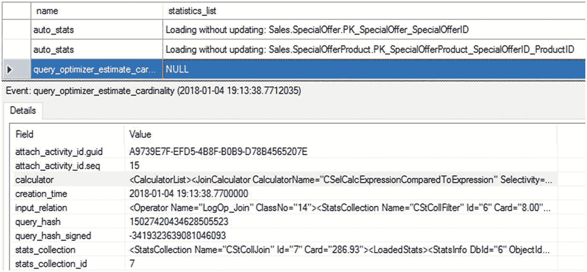

**图 13-27** 显示 `query_optimizer_estimate_cardinality` 事件输出的会话

图 13-27 中可见的前两个事件显示了 `auto_stats` 事件触发，它加载了两个列的统计信息：`Sales.SpecialOffer.PK_SpecailOffer_SpecialOfferID` 和 `Sales.SpecialOfferProduct.PK_SpecialOfferProduct_SpecialOfferID_ProductID`。这意味着在基数估计计算触发之前，统计信息已经准备就绪。“详细信息”选项卡上的信息是基数估计计算的输出。详细信息以 JSON 格式包含在 `calculator`、`input_relation` 和 `stats_collection` 字段中。这些字段将显示计算类型以及这些计算中使用的值。例如，以下是图 13-27 中 `calculator` 字段的输出：

虽然计算本身并不总是清晰，但您可以看到计算使用的值及其来源。在这个例子中，计算比较了两个值，并根据该计算得出一个新的选择性。

在图 13-27 的底部，您可以看到 `stats_collection_id` 值，在本例中是 7。您可以使用此值来追踪执行计划中的某些计算，以理解计算的内容及其使用方式。

我们首先需要捕获执行计划。即使您是从查询存储或其他来源检索计划，`stats_collection_id` 值也会与计划一起存储。获得计划后，我们可以利用 SSMS 2017 中的新功能。在图形化计划中右键单击将打开一个上下文菜单，如图 13-28 所示。


**图 13-28** 执行计划上下文菜单，显示“查找节点”菜单选项

我们要做的是使用“查找节点”命令来搜索执行计划。点击该菜单选项将在执行计划顶部打开一个小窗口，我在图 13-29 中已填写完毕。


**图 13-29** 图形执行计划中的“查找节点”界面


我已选择了感兴趣的执行计划属性 `StatsCollectionId`，并提供了图 13-27 中所示扩展事件的值。当我点击箭头时，系统将直接带我跳转到具有此属性匹配值的节点并选中它。借此，我可以将扩展事件收集的信息与执行计划内部的信息结合起来，从而更好地理解优化器是如何使用统计信息的。

最后，在 SQL Server Management Studio 2017 中，你还可以获取优化器为了构建执行计划而专门使用的统计信息列表。在第一个运算符（本例中为 `SELECT` 运算符）的属性中，你可以获得所有统计信息的完整列表，类似于你在图 13-30 中看到的那样。


图 13-30

为查询生成的执行计划中正在使用的统计信息

### 启用和禁用基数估算器

如果你在 SQL Server 2014 或更高版本中创建数据库，其兼容性级别将自动设置为 120 或更高，这是适用于最新 SQL Server 的正确版本。但是，如果你从早期版本的 SQL Server 还原或附加数据库，兼容性级别将设置为该版本，即 110 或更早。该数据库随后将使用 SQL Server 7 的基数估算器。你可以通过查看执行计划中第一个运算符（`SELECT`/`INSERT`/`UPDATE`/`DELETE`）的 `CardinalityEstimationModelVersion` 属性来判断这一点，如图 13-31 所示。


图 13-31

显示所使用基数估算器的第一个运算符中的属性

对于 SQL Server 2014-2017，显示的值将对应于版本号 120、130、140。这就是你判断正在使用哪个版本基数估算器的方法。这一点很重要，因为估算值的改变可能导致执行计划的变化，因此，了解如何在性能因新的基数估算而下降时进行故障排查至关重要。

如果你怀疑遇到的问题是由升级引起的，你绝对应该比较执行计划中各个操作实际返回的行数与估算返回的行数。这始终是确定统计信息或基数估算是否导致问题的绝佳方法。你应该将查询存储用于测试升级以及作为升级过程的一部分（如第 11 章所述）。查询存储是捕获基数估算引擎变更前后情况以及处理可能出现问题的个别查询的最佳方式。

你可以通过将兼容性级别设置为 110 来选择禁用新的基数估算功能，但这同时也会禁用其他较新的 SQL Server 功能，因此这可能不是一个好的选择。你可以对数据库的还原使用 `OPTION` (`QUERYTRACEON` 9481) 运行跟踪标志；这将仅针对该数据库的基数估算器。如果你确定某个特定查询在使用新的基数估算器时存在问题，你可以以相同方式利用查询中的跟踪标志。

```sql
SELECT p.Name,
p.Class
FROM Production.Product AS p
WHERE p.Color = 'Red'
AND p.DaysToManufacture > 15
OPTION (QUERYTRACEON 9481);
```

反过来，如果你已经使用跟踪标志或兼容性级别关闭了基数估算器，你可以使用相同的功能，但将跟踪标志值替换为 2312，从而为给定查询选择性地将其打开。

最后，SQL Server 2016 引入了一个新功能：数据库作用域配置。在其他设置中（我们将在本书适当地方讨论），你可以仅禁用基数估算引擎，而无需禁用所有现代功能。新语法如下所示：

```sql
ALTER DATABASE SCOPED CONFIGURATION SET LEGACY_CARDINALITY_ESTIMATION = ON;
```

使用此命令，你可以在不改变所有其他行为的情况下更改数据库的行为。你也可以使用相同命令关闭旧版基数估算器。你还可以选择对个别查询使用 `USE` 提示。在查询提示中设置 `FORCE_LEGACY_CARDINALITY_ESTIMATION` 将使该查询（且仅该查询）使用旧的基数估算。这可能是最安全的选择，尽管它确实涉及代码更改。

### 统计信息 DMO

在 SQL Server 2016 之前，获取统计信息的唯一方法是使用 `DBCC SHOW_STATISTICS`。然而，现在引入了几个新的 DMF，它们可能很有用。`sys.dm_db_stats_properties` 函数返回一组统计信息的头部信息。这意味着你可以快速提取头部信息。例如，使用以下查询来检索统计信息最后更新的时间：

```sql
SELECT ddsp.object_id,
ddsp.stats_id,
ddsp.last_updated
FROM sys.dm_db_stats_properties(OBJECT_ID('HumanResources.Employee'),
2) AS ddsp;
```

该函数要求你传递感兴趣的 `object_id` 以及该对象的 `statistics_id`。在此示例中，我们查看 `HumanResources.Employee` 表上的列统计信息。

另一个函数是 `sys.dm_db_stats_histogram`。它的工作方式非常相似，允许我们将统计信息的直方图视为可查询的对象。例如，假设我们想在直方图中查找一组特定的值。通常，你会查找 `range_hi_key` 值，然后查看你要找的值是否小于某个 `range_high_key` 但大于另一个。现在完全可以自动化这个过程。

```sql
WITH histo
AS (SELECT ddsh.step_number,
ddsh.range_high_key,
ddsh.range_rows,
ddsh.equal_rows,
ddsh.average_range_rows
FROM sys.dm_db_stats_histogram(OBJECT_ID('HumanResources.Employee'),
1) AS ddsh ),
histojoin
AS (SELECT h1.step_number,
h1.range_high_key,
h2.range_high_key AS range_high_key_step1,
h1.range_rows,
h1.equal_rows,
h1.average_range_rows
FROM histo AS h1
LEFT JOIN histo AS h2
ON h1.step_number = h2.step_number + 1)
SELECT hj.range_high_key,
hj.equal_rows,
hj.average_range_rows
FROM histojoin AS hj
WHERE hj.range_high_key >= 17
AND (   hj.range_high_key_step1 < 17
OR hj.range_high_key_step1 IS NULL);
```

此查询将遍历 `HumanResources.Employee` 表上的相关统计信息，并找出直方图中哪一行将包含值 17。

## 统计信息维护

SQL Server 允许用户在单个数据库中手动覆盖统计信息的维护。控制 SQL Server 自动统计信息维护行为的四个主要配置如下：

*   在没有索引的列上创建新统计信息（自动创建统计信息）
*   更新现有统计信息（自动更新统计信息）
*   用于生成统计信息的抽样程度
*   异步更新现有统计信息（自动异步更新统计信息）

你可以在数据库级别（所有表上的所有索引和统计信息）或逐个处理地在单个索引或统计信息上控制上述配置。“自动创建统计信息”设置仅适用于非索引列，因为 SQL Server 在创建索引时总是为索引键创建统计信息。“自动更新统计信息”设置及其异步版本适用于索引上的统计信息以及没有索引的列上的统计信息。


## 自动维护

默认情况下，SQL Server 会自动处理统计信息。`自动创建统计信息`和`自动更新统计信息`设置默认都是开启的。如前所述，通常最好保持这些设置为开启状态。而`异步自动更新统计信息`设置默认是关闭的。

当你重建索引时（如果你选择重建索引），它会基于对数据的完全扫描，为该索引创建所有新的统计信息（稍后会详细介绍）。这意味着重建过程会生成一套非常高质量的统计信息，这是微软帮助你自动维护统计信息的又一种方式。

然而，有时手动创建和维护统计信息效果会更好。对于我们许多人来说，确保我们的统计信息比自动化流程更新得更及时，意味着更高程度的可预测性。我们知道何时以及如何维护统计信息，因为它们在我们的掌控之中。你还可以阻止统计信息维护随机发生，精确控制它们发生的时间，以及控制它们引发的重新编译。这有助于将生产系统上的负载集中到非高峰时段。

## 自动创建统计信息

`自动创建统计信息`功能会在查询的 `WHERE` 子句中引用非索引列时，自动为该列创建统计信息。例如，当针对 `Sales.SalesOrderHeader` 表上没有索引的列运行以下 `SELECT` 语句时：

```sql
SELECT  cc.CardNumber,
        cc.ExpMonth,
        cc.ExpYear
FROM    Sales.CreditCard AS cc
WHERE   cc.CardType = 'Vista';
```

接着，`自动创建统计信息`功能（如果你之前关闭了它，请确保重新打开）会自动为 `CardType` 列创建统计信息。你可以在扩展事件会话输出中看到这一点，如图 13-32 所示。


*图 13-32 AUTO_CREATE_STATISTICS 开启时的会话输出*

`auto_stats` 事件触发以创建新的统计信息集。你可以在 `statistics_list` 字段的 `Created: CardType` 中看到发生情况的详细信息。随后是新列统计信息的加载过程、表中某个索引上的统计信息加载过程，最后是查询的执行。

## 自动更新统计信息

`自动更新统计信息`功能会在永久表在查询中被引用时，自动更新该表索引和列上的现有统计信息，前提是统计信息已被标记为过时。导致统计信息过时的操作语句类型包括 `INSERT`、`UPDATE` 和 `DELETE`。默认的更改次数阈值取决于表中的行数。这是一个相当简单的计算。

```text
Sqrt(1000*NumberOfRows)
```

这意味着，如果你的表中有 500,000 行，代入计算结果为 22,360.68。你需要在这个包含 50 万行的表中添加、编辑或删除那么多行，才会触发自动统计信息更新。

对于 SQL Server 2014 及更早版本，在未启用跟踪标志 2371 的情况下，统计信息的维护如表 13-4 所示。

*表 13-4 更改次数的统计信息更新阈值*

| 行数 | 更改次数阈值 |
| --- | --- |
| 0 | > 1 次插入 |
| <500 | > 500 次更改 |
| >500 | 行更改的 20% |

行更改次数计为表中插入、更新或删除的次数。

使用阈值可以降低自动更新统计信息的频率。例如，考虑以下表：

```sql
IF (SELECT OBJECT_ID('dbo.Test1')) IS NOT NULL
    DROP TABLE dbo.Test1;
CREATE TABLE dbo.Test1 (C1 INT);
CREATE INDEX ixl ON dbo.Test1 (C1);
INSERT INTO dbo.Test1 (C1)
VALUES (0);
```

在非聚集索引创建后，向表中添加了一行。这会使非聚集索引上的现有统计信息过时。如果执行以下 `SELECT` 语句，并在 `WHERE` 子句中引用了索引列，如下所示，那么`自动更新统计信息`功能会自动更新非聚集索引上的统计信息，如图 13-33 的会话输出所示：


*图 13-33 AUTO_UPDATE_STATISTICS 开启时的会话输出*

```sql
SELECT  C1
FROM    dbo.Test1
WHERE   C1 = 0;
```

一旦统计信息更新完毕，对应表的更改跟踪机制就会被重置为 0。这样，SQL Server 就能跟踪表的更改次数，并管理自动更新统计信息的频率。

SQL Server 2016 及更高版本的新功能意味着对于更大的表，你会获得更频繁的统计信息更新。在旧版本的 SQL Server 上，你需要利用跟踪标志 2371 才能实现相同的功能。如果自动更新不够频繁，你可以采取直接控制，这将在本章后面的“手动维护”部分讨论。

## 异步自动更新统计信息

如果`异步自动更新统计信息`设置为开启，SQL Server 中统计信息的基本行为不会发生根本性改变。当一组统计信息被标记为过时，然后针对这些统计信息运行查询时，统计信息更新不会像通常那样中断查询的执行。相反，查询会使用较旧的统计信息集完成执行。查询完成后，统计信息才会被更新。这样做的吸引力在于，当统计信息更新时，过程缓存中的查询计划会被移除，正在运行的查询必须重新编译。这会导致查询执行出现延迟。因此，与其让查询同时等待统计信息更新和过程重新编译，不如让查询完成其运行。下次调用相同的查询时，它将拥有已更新的统计信息，并且只需重新编译即可。

尽管此功能确实使更新统计信息和重新编译过程所需的步骤更快一些，但它也可能导致本可立即从更新后的统计信息和新执行计划中受益的查询，继续使用旧的执行计划。在启用此功能之前，需要进行仔细测试，以确保其弊大于利。

## 注意

如果你尝试异步更新统计信息，还必须将 `AUTO_UPDATE_STATISTICS` 设置为 `ON`。


## 手动维护

在以下情况下，你需要干预或协助统计信息的自动维护：

*   **当试验统计信息时**：只是一个友好的建议——请让你的生产服务器远离本书中正在进行的这类实验。

*   **从早期版本升级到 SQL Server 2017 之后**：在本书的早期版本中，我建议在升级到新版本的 SQL Server 后立即更新统计信息。这是因为 SQL Server 2014 中引入了统计信息的更改。立即更新统计信息是有意义的，这样你就能看到新的基数估算器的效果。随着查询存储的加入，我不能再以同样的方式提出这个建议了。相反，我会建议你考虑，如果是从 SQL Server 2014 升级到更新的版本，但即便如此，我也不建议默认手动更新统计信息。我会先进行测试，以了解特定升级后的行为表现。

*   **当执行一系列不会再执行的临时 SQL 活动时**：在这种情况下，你必须决定是否要承担自动统计信息维护的成本，只为这一次情况获得更好的执行计划，同时可能影响其他 SQL Server 活动的性能。因此，一般来说，你可能不需要关注这类单一事件。这主要适用于大型数据库，但如果你认为可能适用，可以在你的环境中进行测试。

*   **当遇到自动统计信息维护的问题，且目前唯一的解决方法是关闭该功能时**：即便在这些情况下，你也可以只关闭遇到问题的特定表的该功能，而不是为整个数据库禁用它。此类问题可能出现在数据更新频繁但不足以触发阈值更新的大型数据集中。此外，当自动更新的采样级别对于某些数据分布不够充分时，也可能用到这种方法。

*   **在分析查询性能时，发现查询引用的少数数据库对象缺失统计信息**：这可以从图形和 XML 执行计划中进行评估，如本章前面所述。

*   **在分析统计信息的有效性时，发现它们不准确**：当本应良好的统计信息集却生成了糟糕的执行计划时，就可以确定这一点。

SQL Server 允许用户控制其许多自动统计信息维护功能。你可以使用 `auto create statistics` 和 `auto update statistics` 设置来启用（或禁用）自动创建和更新统计信息的功能，然后你就可以开始动手操作了。

## 管理统计信息设置

你可以在数据库级别控制 `auto create statistics` 设置。要禁用此设置，请使用 `ALTER DATABASE` 命令。

```sql
ALTER DATABASE AdventureWorks2017 SET AUTO_CREATE_STATISTICS OFF;
```

你可以在数据库的不同级别控制 `auto update statistics` 设置，包括表上的所有索引和统计信息，或者在单个索引或统计信息级别。要在数据库级别禁用 `auto update statistics`，请使用 `ALTER DATABASE` 命令。

```sql
ALTER DATABASE AdventureWorks2017 SET AUTO_UPDATE_STATISTICS OFF;
```

在数据库级别禁用此设置会覆盖较低级别的各个设置。`Auto update statistics asynchronously` 要求首先开启 `auto update statistics`。然后你才能启用异步更新。

```sql
ALTER DATABASE AdventureWorks2017 SET AUTO_UPDATE_STATISTICS_ASYNC ON;
```

要为当前数据库中某个表的所有索引和统计信息配置 `auto update statistics`，请使用 `sp_autostats` 系统存储过程。

```sql
USE AdventureWorks2017;
EXEC sp_autostats
'HumanResources.Department',
'OFF';
```

你也可以使用相同的存储过程为单个索引或统计信息配置此设置。要为 `AdventureWorks2017.HumanResources.Department` 上的 `AK_Department_Name` 索引禁用此设置，请执行以下语句：

```sql
EXEC sp_autostats
'HumanResources.Department',
'OFF',
AK_Department_Name;
```

你还可以使用 `UPDATE STATISTICS` 命令的 `WITH NORECOMPUTE` 选项，为当前数据库中某个表的所有或单个索引和统计信息禁用此设置。`sp_createstats` 存储过程也有 `NORECOMPUTE` 选项。`NORECOMPUTE` 选项不会禁用数据库的统计信息自动更新，但会禁用给定统计信息集的自动更新。

除非你已通过测试确认这能带来性能优势，否则请避免禁用自动统计信息功能。如果自动统计信息功能被禁用，那么你将负责手动识别并在未索引的列上创建缺失的统计信息，然后保持现有统计信息为最新状态。一般来说，你只会想要为非常大的表禁用自动统计信息功能，并且只有在仔细测量了阻塞和锁之后，确信更改统计信息行为会有所帮助的情况下。

如果你想检查某个表是否关闭了自动统计信息，可以使用此命令：

```sql
EXEC sp_autostats 'HumanResources.Department';
```

重置索引的自动维护，将其设为开启状态（如果之前被关闭）。

```sql
EXEC sp_autostats
'HumanResources.Department',
'ON';
EXEC sp_autostats
'HumanResources.Department',
'ON',
AK_Department_Name;
```


## 统计信息管理

### 生成统计信息

若要手动创建统计信息，请使用以下选项之一：

*   `CREATE STATISTICS`：你可以使用此选项在表或索引视图的单列或多列上创建统计信息。与 `CREATE INDEX` 命令不同，`CREATE STATISTICS` 默认使用抽样。
*   `sys.sp_createstats`：使用此存储过程为当前数据库中所有用户表的所有符合条件的列创建单列统计信息。这包括除计算列、数据类型为 `NTEXT`、`TEXT`、`GEOMETRY`、`GEOGRAPHY` 或 `IMAGE` 的列、稀疏列以及已存在统计信息或是索引首列的列之外的所有列。此函数旨在实现向后兼容，我不建议使用它。

在为列存储索引创建统计信息对象时，该索引内部的值是 `null`。列存储索引上的各个列可以创建常规的系统生成统计信息。在处理列存储索引时，如果你发现自己仍在引用各个列，你可能会发现，在某些情况下，创建多列统计信息是有用的。示例如下：

```
CREATE STATISTICS MultiColumnExample
ON dbo.bigProduct (ProductNumber,
Name);
```

除了各个列的统计信息和你自行创建的统计信息外，无需担心列存储索引上自动创建的索引统计信息。

如果你对列存储索引进行了分区（分区不是性能增强工具，而是数据管理工具），你需要使用以下命令将统计信息更改为增量式，以确保统计信息更新仅按分区进行：

```
UPDATE STATISTICS dbo.bigProduct WITH RESAMPLE, INCREMENTAL=ON;
```

若要手动更新统计信息，请使用以下选项之一：

*   `UPDATE STATISTICS`：你可以使用此选项更新表或索引视图的单个或所有索引键列和非索引列的统计信息。
*   `sys.sp_updatestats`：使用此存储过程更新当前数据库中所有用户表的统计信息。但是请注意，它只能对统计信息进行抽样，不能使用 `FULLSCAN`，并且仅当对某个统计信息执行了单个操作时才会更新它。简而言之，这是维护统计信息的一个相当粗略的工具。

你可能会发现，允许自动更新统计信息对于你的系统来说并不完全足够。在非高峰时段安排对数据库执行 `UPDATE STATISTICS` 是处理此问题的一种可接受的方法。`UPDATE STATISTICS` 是首选机制，因为它提供了更高程度的灵活性和控制力。由于插入的数据类型，用于收集统计信息的抽样方法（因其速度更快而被采用）可能无法收集到适当的数据。在这些情况下，你可以强制使用 `FULLSCAN`，以便使用所有数据来更新统计信息，就像统计信息最初创建时那样。这可能是一个成本高昂的操作，因此最好对哪些索引接受这种处理以及何时运行它进行选择性设置。此外，如果你确实为统计信息重建设置了抽样率（包括 `FULLSCAN`），则应使用 `PERSIST_SAMPLE_PERCENT` 以确保任何触发的自动化过程都使用相同的抽样率。

## 注意

通常，你应始终使用自动统计信息的默认设置。只有在确定默认设置似乎会降低性能后，才考虑修改这些设置。

## 统计信息维护状态

你可以使用以下方式验证 `autostats` 功能的当前设置：

*   `sys.databases`
*   `DATABASEPROPERTYEX`
*   `sp_autostats`

### 自动创建统计信息的状态

你可以通过对 `sys.databases` 系统表运行查询来验证自动创建统计信息的当前设置。

```
SELECT  is_auto_create_stats_on
FROM    sys.databases
WHERE   [name] = 'AdventureWorks2017';
```

返回值 1 表示已启用，值 0 表示已禁用。

你也可以使用 `sp_autostats` 系统存储过程验证特定索引的状态，如以下代码所示。向存储过程提供任何表名，将在全局统计信息设置的 `Output` 部分提供当前数据库的自动创建统计信息配置值。

```
USE AdventureWorks2017;
EXEC sys.sp_autostats 'HumanResources.Department';
```

图 13-34 展示了前述 `sp_autostats` 语句输出的摘录。


图 13-34

`sp_autostats` 输出

返回值为 `ON` 表示已启用，`OFF` 表示已禁用。如本章前面所述，此存储过程在验证自动更新统计信息的状态时更有用。

你也可以以类似于自动创建统计信息的方式，验证自动更新统计信息以及异步自动更新统计信息的当前设置。以下是使用函数 `DATABASEPROPERTYEX` 的方法：

```
SELECT  DATABASEPROPERTYEX('AdventureWorks2017', 'IsAutoUpdateStatistics');
```

以下是使用 `sp_autostats` 的方法：

```
USE AdventureWorks2017;
EXEC sp_autostats
'Sales.SalesOrderDetail';
```

## 分析统计信息对查询的有效性

出于性能原因，在数据库对象上维护适当的统计信息极其重要。统计信息问题可能相当常见。在分析查询性能时，你需要时刻留意统计信息出现问题的可能性。如果确实出现统计信息问题，那真的会让你大费周章。事实上，在查询调优会话开始时检查统计信息是否是最新的，可以消除一个容易解决的问题。在本节中，你将看到当你发现统计信息缺失或过时时可以采取的措施。

在分析查询的执行计划时，请注意以下几点，以确保采用成本效益高的处理策略：

*   在筛选和联接条件中引用的列上存在索引。
*   在缺少索引的情况下，对于没有索引的列，统计信息应该是可用的。可能更倾向于直接创建索引本身。
*   由于过时的统计信息毫无用处甚至可能产生误导，因此优化器从统计信息中获取的估算值保持最新非常重要。

你已经在第 9 章分析了适当索引的使用。在本节中，你将分析统计信息对查询的有效性。


## 解决统计信息缺失问题

为了展示如何识别并解决统计信息缺失问题，请看下面的例子。为了更直接地控制数据，我将使用一个测试表，而不是 `AdventureWorks2017` 中的任何表。首先，使用 `ALTER DATABASE` 命令禁用 `AUTO_CREATE_STATISTICS` 和 `AUTO_UPDATE_STATISTICS`。

```sql
ALTER DATABASE AdventureWorks2017 SET AUTO_CREATE_STATISTICS OFF;
ALTER DATABASE AdventureWorks2017 SET AUTO_UPDATE_STATISTICS OFF;
```

创建一个包含大量行和一个非聚集索引的测试表。

```sql
IF EXISTS (   SELECT *
FROM sys.objects
WHERE object_id = OBJECT_ID(N'dbo.Test1'))
DROP TABLE dbo.Test1;
GO
CREATE TABLE dbo.Test1 (C1 INT,
C2 INT,
C3 CHAR(50));
INSERT INTO dbo.Test1 (C1,
C2,
C3)
VALUES (51, 1, 'C3'),
(52, 1, 'C3');
CREATE NONCLUSTERED INDEX iFirstIndex ON dbo.Test1 (C1, C2);
SELECT TOP 10000
IDENTITY(INT, 1, 1) AS n
INTO #Nums
FROM master.dbo.syscolumns AS scl,
master.dbo.syscolumns AS sC2;
INSERT INTO dbo.Test1 (C1,
C2,
C3)
SELECT n % 50,
n,
'C3'
FROM #Nums;
DROP TABLE #Nums;
```

由于索引建立在 (`C1`, `C2`) 上，该索引的统计信息包含第一个列 `C1` 的直方图，以及前缀列组合 (`C1` 和 `C1` * `C2`) 的密度值。对于 `C2` 列本身，则没有直方图或密度值。

为了理解如何识别没有索引的列上缺失的统计信息，请执行以下 `SELECT` 语句。因为 `AUTO_CREATE_STATISTICS` 功能已关闭，优化器将无法找到 `WHERE` 子句中使用的 `C2` 列的数据分布情况。在执行查询前，请确保通过点击查询工具栏或按下 `Ctrl+M` 已启用 `Include Actual Execution Plan`。

```sql
SELECT  *
FROM    dbo.Test1
WHERE   C2 = 1;
```

缺失统计信息的信息也由图形化执行计划提供，如图 13-35 所示。

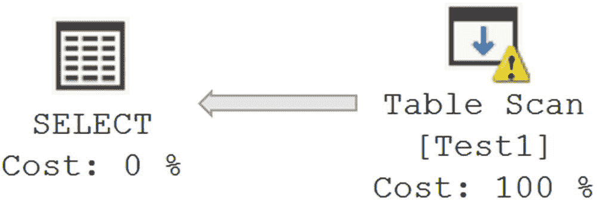

图 13-35
图形化计划中的缺失统计信息指示

图形化执行计划显示了一个带有黄色感叹号的运算符。这表明所讨论的运算符存在某些问题。你可以通过右键单击 `Table Scan` 运算符，然后从上下文菜单中选择 `Properties` 来获取警告的详细描述。属性页面中有一个 `Warning` 部分可供你深入查看，如图 13-36 所示。

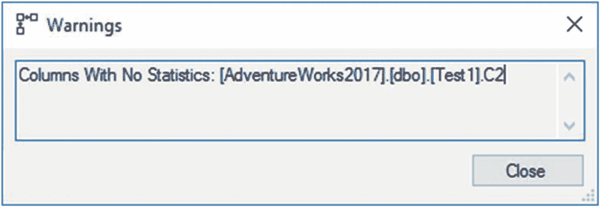

图 13-36
Index Scan 运算符中警告的属性值

图 13-36 显示该列的统计信息缺失。这可能妨碍优化器选择最佳的处理策略。根据 `Extended Events` 的记录，此查询当前的开销平均为 100 次读取和 850 微秒。

要解决此统计信息缺失问题，你可以使用 `CREATE STATISTICS` 语句在 `Test1.C2` 列上创建统计信息。

```sql
CREATE STATISTICS Stats1 ON Test1(C2);
```

在重新运行查询之前，请务必清理过程缓存，因为此查询将受益于简单参数化。

```sql
DECLARE @Planhandle VARBINARY(64);
SELECT @Planhandle = deqs.plan_handle
FROM sys.dm_exec_query_stats AS deqs
CROSS APPLY sys.dm_exec_sql_text(deqs.sql_handle) AS dest
WHERE dest.text LIKE '%SELECT  *
FROM    dbo.Test1
WHERE   C2 = 1;%'
IF @Planhandle IS NOT NULL
BEGIN
DBCC FREEPROCCACHE(@Planhandle);
END
GO
```

## 注意

在生产系统上运行前面的查询时，使用 `LIKE '%...%'` 通配符可能效率低下。查找特定字符串可能是从计划缓存中移除单个查询的更准确方式。

图 13-37 显示了在 `C2` 列上创建统计信息后的最终执行计划。

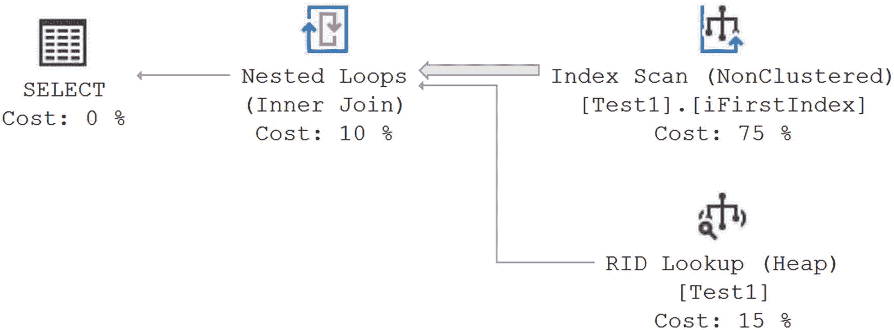

图 13-37
包含统计信息的执行计划

```
读取次数: 34
持续时间: 4.3 毫秒。
```

查询优化器使用复合索引中非起始列上的统计信息来判断，扫描复合索引的叶级以获取 `RID` 查找信息，是否比扫描整张表是更高效的处理策略。在这种情况下，在 `C2` 列上创建统计信息使得优化器能够确定，扫描 (`C1`, `C2`) 上的复合索引，然后为少数匹配行书签查找回基表，其成本低于扫描基表。因此，逻辑读取次数从 100 减少到 34，但由于连接来自两个不同运算符的数据所需的额外处理，耗时显著增加。


## 解决过时的统计信息问题

有时，过时或不正确的统计信息比缺失的统计信息危害更大。基于旧的统计信息或对已更改数据的部分扫描，优化器可能会决定采用特定的索引策略，而这种策略对于当前的数据分布可能非常不合适。不幸的是，执行计划不会像显示缺失统计信息的明显警告那样，为过时或不正确的统计信息提供相同的警告。但是，有一个名为 `inaccurate_cardinality_estimate` 的扩展事件。这是一个调试事件，这意味着在生产系统上使用它可能存在问题。我强烈建议您谨慎使用，仅在经过适当筛选且仅在短时间内使用，但我仍想指出它的存在。相反，请利用第 7 章中详述的 Showplan 分析功能。

识别过时统计信息更传统、更安全的方法是检查优化器估计的受影响行数与实际受影响行数的接近程度。

以下示例展示了如何识别和解决过时的统计信息问题。图 13-38 显示了由 `DBCC SHOW_STATISTICS` 提供的在列 `C1` 上的非聚集索引键的统计信息。


**图 13-38**
索引 FirstIndex 上的统计信息

```
DBCC SHOW_STATISTICS (Test1, iFirstIndex);
```

这些结果表明列 `C1` 的密度值为 0.5。现在考虑以下 `SELECT` 语句：

```
SELECT  *
FROM    dbo.Test1
WHERE   C1 = 51;
```

由于表中的总行数目前是 10,002，因此对于筛选条件 `C1 = 51` 的匹配行数可以估计为 5,001 (= 0.5 × 10,002)。这个估计行数 (5,001) 与该列值的实际匹配行数相差甚远。表中实际上只有一行对应 `C1 = 51`。

您可以从执行计划中获取估计和实际行数的信息。估计的执行计划仅引用和使用统计信息，而非实际数据。这意味着它可能与实际数据大相径庭，正如您现在所见。另一方面，实际的执行计划则同时包含估计行数和实际行数。

执行查询后得到如图 13-39 所示的执行计划及以下性能指标：

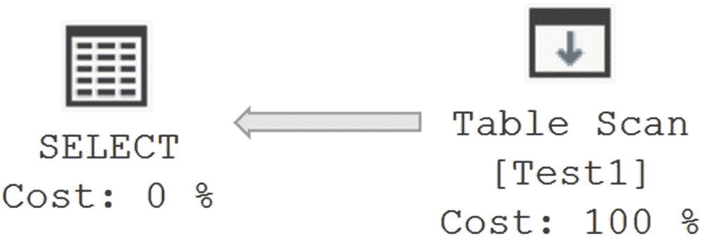
**图 13-39**
使用过时统计信息的执行计划

```
读取次数: 100
持续时间: 681 微秒
```

要查看估计行数和实际行数，您可以查看 `Table Scan` 操作符的属性（图 13-40）。


**图 13-40**
显示行数差异的属性

从估计行数与实际行数的对比可以清楚地看出，优化器基于过时的统计信息做出了错误的估计。如果估计行数与实际行数之间的差异超过 10 倍，那么所选择的执行策略对于当前的数据分布很可能不是非常高效的。不准确的估计可能会误导优化器决定处理策略。统计信息不准确可能有多种原因。表变量和多语句用户定义函数根本没有统计信息，因此对这些对象的所有估计都假设为单行，而不考虑对象实际涉及的行数。

我们还可以使用 Showplan 分析功能来查看“基数估计不准确”报告。右键单击一个实际的执行计划，然后从上下文菜单中选择“分析实际执行计划”。当分析窗口打开后，选择“方案”选项卡。对于之前的计划，您会看到类似图 13-41 的内容。


**图 13-41**
显示实际值与估计值之间差异的“基数估计不准确”报告

为了帮助优化器做出准确的估计，您应该更新列 `C1` 上非聚集索引键的统计信息（当然，您也可以选择保持自动更新统计信息功能开启）。

```
UPDATE STATISTICS Test1 iFirstIndex WITH FULLSCAN;
```

这里可能不需要 `FULLSCAN`。使用采样方法创建的统计信息通常相当准确，并且速度快得多。但是，在系统负载不高或非高峰时段，由于精确度更高，我倾向于使用 `FULLSCAN`。只要您能获得所需的统计信息，两种方法都是有效的。

如果您再次运行该查询，您将得到更新后的统计信息，其输出结果如图 13-42 所示：


**图 13-42**
使用最新统计信息的实际行数和估计行数

```
读取次数: 4
持续时间: 184 微秒
```

优化器使用更新后的统计信息准确地估计了行数，因此能够生成更高效的计划。由于估计行数为 1，通过 `C1` 上的非聚集索引而不是扫描基表来检索该行是合理的。

在索引键列上更新、准确的统计信息有助于优化器做出更好的处理策略决策，从而将逻辑读取次数从 84 次减少到 4 次，并将执行时间从 16 毫秒减少到约 0 毫秒（存在约 4 毫秒的延迟时间）。

在继续之前，请重新为数据库启用统计信息。

```
ALTER DATABASE AdventureWorks2017 SET AUTO_CREATE_STATISTICS ON;
ALTER DATABASE AdventureWorks2017 SET AUTO_UPDATE_STATISTICS ON;
```

## 建议

在本章中，我介绍了关于统计信息的各种建议。为便于参考，我在接下来的章节中整合并扩展了这些建议。

### 统计信息的向后兼容性

SQL Server 2014 及更高版本中的统计信息生成方式可能与早期版本的 SQL Server 不同。SQL Server 在升级过程中会传输统计信息，并且默认情况下，随着数据的变化，它会自动更新这些统计信息。最好的方法是遵循第 10 章关于查询存储的指导，让统计信息随着时间的推移而更新。

### 自动创建统计信息

此功能通常应保持开启。在默认设置下，在创建执行计划期间，SQL Server 会确定对非索引列的统计信息是否有用。如果认为有益，SQL Server 将在该非索引列上创建统计信息。但是，如果您计划手动在非索引列上创建统计信息，那么您必须准确识别哪些非索引列上的统计信息会是有益的。


# 自动更新统计信息

此功能通常应保持开启状态，让 SQL Server 能够根据数据分布随时间变化的情况来决定合适的执行计划。通常，此功能带来的性能收益会超过其开销成本。你很少需要干预统计信息的自动维护，此类要求通常在故障排除或性能分析时才会被识别出来。为确保不会因自动统计信息功能而遇到意外情况，在诊断 SQL Server 问题时，分析统计信息的有效性至关重要。

不幸的是，如果你遇到自动更新统计信息功能的问题并不得不将其关闭，请务必创建一个 SQL Server 作业来更新统计信息，并将其安排为定期运行。出于性能考虑，在可能的情况下，请确保将该 SQL 作业安排在非高峰时段运行。

维护统计信息的最佳方法之一是运行由 Ola Holengren 开发和维护的脚本（ [`http://bit.ly/JijaNI`](http://bit.ly/JijaNI) ）。

## 异步自动更新统计信息

等待统计信息更新后再生成执行计划（这是默认行为）在大多数情况下是没问题的。在极少数情况下，如果统计信息更新或由该更新导致的执行计划重新编译成本高昂（比过时统计信息的成本还要高），那么你可以开启统计信息的异步更新。只需理解，这可能意味着那些本可从最新统计信息中受益的存储过程，在下次运行之前性能会受到影响。别忘了——你确实需要先启用自动更新统计信息功能，才能启用异步更新。

## 采集统计信息的采样量

通常建议使用默认的采样率。此比率由一个高效算法根据数据大小和修改数量决定。虽然默认采样率在大多数情况下被证明是最佳的，但如果对于某个特定查询，你发现统计信息不够准确或缺失了关键的数据分布，那么你可以使用 `FULLSCAN` 手动更新它们。你也可以选择使用 `SAMPLE` number 来设置特定的采样百分比。这个数字可以是百分比，也可以是一组固定的行数。

如果这种情况需要反复处理，那么你可以添加一个 SQL Server 作业来处理它。出于性能考虑，请确保将 SQL 作业安排在非高峰时段运行。为了识别默认采样率并非最佳的情况，在排查数据库性能问题时，请分析代价高昂的查询的统计信息有效性。请记住，`FULLSCAN` 是昂贵的，因此你应该只在那些你确定能真正从中受益的表或索引上运行它。

## 总结

正如本章所讨论的，SQL Server 的基于成本的优化器需要在用于筛选和联接条件的列上有准确的统计信息，以确定高效的处理策略。索引键上的统计信息总是在创建索引时生成，并且默认情况下，SQL Server 还会随着数据的变化保持对索引列和非索引列统计信息的更新。这使得它能够确定适用于当前数据分布的最佳处理策略。

尽管你可以禁用自动创建统计信息和自动更新统计信息功能，但建议你保持这些功能开启，因为它们对优化器的好处几乎总是超过其开销成本。对于代价高昂的查询，分析统计信息以确保自动统计信息维护能兑现其承诺。最好的消息是，只要稍加留心，你就可以高枕无忧，因为自动统计信息在大多数情况下都能很好地完成工作。如果使用手动统计信息维护过程，则可以使用 SQL Server 作业来自动化这些过程。

即使拥有适当的索引和统计信息，高度碎片化的数据库也可能导致数据检索成本增加。在下一章中，你将了解索引中的碎片如何影响查询性能，并学习如何在需要时分析和解决碎片问题。

# 14. 索引碎片

如第 8 章所述，行存储索引列值存储在索引 B 树结构的叶级页中。列存储索引也存储在页中，但不在 B 树结构内。当你在表上创建索引（聚集或非聚集）时，通过正确排序索引的叶级页以及叶级页内的行来降低数据检索成本，而列存储则是将数据透视成列然后进行压缩，目的同样在于辅助数据检索。在 OLTP 数据库中，数据持续变化，导致索引产生碎片。结果，返回相同数量行所需的读取次数会随时间增加。当数据从增量存储区移动到分段存储区时，列存储也会发生类似情况。这两种情况都可能导致性能下降。

在本章中，我将涵盖以下主题：

*   索引碎片的成因，包括分析由 `INSERT` 和 `UPDATE` 语句引起的页拆分

*   列存储索引碎片的成因

*   与碎片相关的开销成本

*   如何分析行存储和列存储索引的碎片量

*   用于解决碎片的技术

*   填充因子在帮助控制行存储索引碎片方面的重要性

*   如何自动化碎片分析过程


## 关于碎片化的讨论

目前，数据平台社区存在大量讨论，探讨碎片化在多大程度上算是一种问题。在我们深入探讨碎片化是什么、它可能如何影响你的查询以及如果发生影响你该如何应对之前，我们应该立即回答这个问题：你应该对索引进行碎片整理吗？我决定将这个讨论放在所有关于碎片化如何工作的细节之前，所以如果那仍然还是个谜，请跳过本节，直接阅读“碎片化的原因”。

当你的索引和表发生碎片化时，它们确实会占用更多空间，意味着需要更多的页。根据索引类型的不同，这会以不同的方式将它们分布在磁盘上。在处理碎片化的索引和点查找或非常有限的范围扫描时，碎片化根本不会影响性能。在处理碎片化的索引和大型扫描时，不得不在磁盘上移动更多的页肯定会影响性能。从这一点来看，你可能认为只有在你有很多扫描和大量数据移动时才需要简单地进行索引碎片整理。

然而，事情远不止于此。碎片整理本身会给系统带来负载，导致阻塞和额外的工作，从而影响系统的性能。然后，你的索引又会开始重新碎片化的过程，包括页拆分和行重排，再次导致性能问题。一个强有力的论据是，允许系统找到一个平衡点，在这个点上页足够空闲，使得拆分停止（或显著减少），将实现更好的整体性能。这是因为与其通过重建索引来给系统增加压力，然后又在索引再次移动时经历所有的页拆分，你只需减少页拆分即可。你仍然在处理较慢的扫描，但对于现代磁盘子系统来说，这已经不那么令人头疼了。

考虑到所有这些，我强烈倾向于“停止对索引进行碎片整理”这一派。只要你设置了适当的填充因子，你应该会看到页拆分活动急剧减少。然而，你最好的选择是使用本章概述的工具来监控你的系统。很可能我们所有人都处于混合模式中，即一些表和索引需要碎片整理，而另一些则应该保持原样。这完全取决于你系统的行为。

## 碎片化的原因

当表中的数据被修改时，就会发生碎片化。这对于行存储索引和列存储索引都是如此。当你在表中添加或删除数据（通过 `INSERT` 或 `DELETE`）时，表对应的聚集索引和受影响的非聚集索引都会被修改。行存储和列存储这两种索引类型，从这一点开始略有不同。我们将从行存储开始，逐一解决它们。

### 数据修改与行存储索引

通过 `INSERT`、`UPDATE` 或 `MERGE` 修改数据，如果索引的修改无法在同一页面内容纳，可能会导致索引叶级页拆分。通过 `DELETE` 删除数据只会留下现有页面中的空隙。当发生页拆分时，一个新的叶级页将被添加，其中包含原始页的一部分数据，并维护索引键中行的逻辑顺序。尽管新的叶级页维护了原始页中数据行的 `逻辑顺序`，但这个新页通常在磁盘上不会与原始页 `物理上相邻`。说得稍微不同一点，索引的逻辑键顺序与文件内的物理顺序不匹配。

例如，假设一个索引有九个键值（或索引行），并且索引行的平均大小允许一个叶级页最多容纳四个索引行。如第[9]章所解释的，8KB 的叶级页与前一个和后一个叶级页相连接，以维护索引的逻辑顺序。图[14-1]说明了该索引叶级页的布局。


图 14-1
叶级页布局

由于叶级页中的索引键值始终是排序的，一个键值为 25 的新索引行必须占据现有键值 20 和 30 之间的位置。因为包含这些现有索引键值的叶级页已满（有四行索引行），新的索引行将导致相应的叶级页拆分。将为索引分配一个新的叶级页，并将第一个叶级页的一部分移动到这个新的叶级页，以便新的索引键可以按正确的逻辑顺序插入。索引页之间的链接也将被更新，以便页面按照索引的顺序逻辑连接。如图[14-2]所示，新的叶级页即使以正确的逻辑顺序链接到其他页面，在物理上也可能无序。

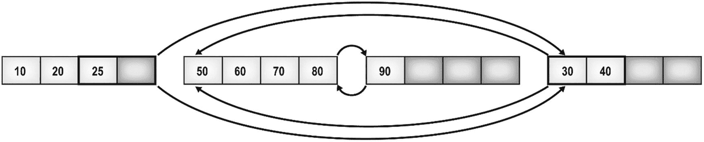

图 14-2
无序的叶级页

这些页面被分组到更大的单元中，称为 `区` ，一个区可以包含八个页面。SQL Server 使用区作为磁盘上的物理分配单位。理想情况下，包含索引叶级页的区的物理顺序应该与索引的逻辑顺序相同。这减少了在检索一段索引行时所需的区切换次数。然而，页拆分可能在物理上打乱区内的页面顺序，也可能打乱区本身的顺序。例如，假设索引的前两个叶级页在区 1 中，第三个叶级页在区 2 中。如果区 2 有空闲空间，那么由于页拆分而分配给索引的新叶级页将在区 2 中，如图[14-3]所示。

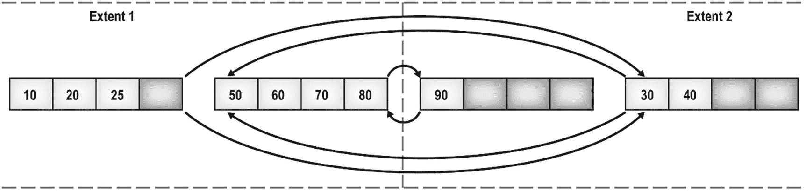

图 14-3
分布在不同区上的无序叶级页

叶级页分布在两个区之间，理想情况下，你期望读取一段索引行时最多只需要在两个区之间切换一次。然而，区之间页面的无组织状态可能导致在检索一段索引行时发生不止一次的区切换。例如，要检索 25 到 90 之间的索引行范围，你将需要在两个区之间进行三次区切换，如下所示：

*   第一次区切换：在键值 25 之后检索键值 30
*   第二次区切换：在键值 40 之后检索键值 50
*   第三次区切换：在键值 80 之后检索键值 90

这种类型的碎片化被称为 `外部碎片化` *.* 外部碎片化可能是不希望出现的。

碎片化也可能发生在一个索引页内部。如果一个 `INSERT` 或 `UPDATE` 操作导致了页拆分，那么原始叶级页中将会留下空闲空间。`DELETE` 操作也可能导致空闲空间。最终结果是减少了叶级页中包含的行数。例如，在图[14-3]中，由 `INSERT` 操作引起的页拆分在第一个叶级页内造成了空闲空间。这被称为 `内部碎片化` *.*

对于高度事务性的数据库，最好特意在你的叶级页中保留一些空闲空间，以便在添加新行或更改现有行大小时不会引起页拆分。在图[14-3]中，第一个叶级页内的空闲空间允许将一个键值为 26 的索引键添加到该叶级页而不会引起页拆分。


## 注意

请注意，此索引碎片与磁盘碎片不同。索引碎片无法通过简单运行磁盘碎片整理工具来修复，因为 SQL Server 文件中页面的顺序仅由 SQL Server 理解，操作系统并不理解。

堆表页面也可能以相同方式变得碎片化。不幸的是，由于堆的存储方式以及任何非聚集索引如何使用物理数据位置从堆中检索数据，整理堆碎片是相当有问题的。您可以使用 `ALTER TABLE` 的 `REBUILD` 命令来执行堆重建，但需要理解，这会强制重新生成与该表关联的所有非聚集索引。

SQL Server 2017 通过一个名为 `sys.dm_db_index_physical_stats` 的动态管理视图公开叶子和非叶子页面及其他数据。它存储索引大小和碎片信息。我将在下一节更详细地介绍它。这个 DMV 比旧的 `DBCC SHOWCONTIG` 更容易使用。

现在让我们看看碎片化的机制。

#### UPDATE 语句导致的页面拆分

为了展示由 `UPDATE` 语句导致的页面拆分时发生的情况，我将使用一个构造的表。这个小测试表将有一个聚集索引，该索引在一个叶子（或数据）页内对行进行排序，如下所示：

```
USE AdventureWorks2017;
GO
DROP TABLE IF EXISTS dbo.Test1;
GO
CREATE TABLE dbo.Test1 (C1 INT,
C2 CHAR(999),
C3 VARCHAR(10))
INSERT INTO dbo.Test1
VALUES (100, 'C2', "),
(200, 'C2', "),
(300, 'C2', "),
(400, 'C2', "),
(500, 'C2', "),
(600, 'C2', "),
(700, 'C2', "),
(800, 'C2', ");
CREATE CLUSTERED INDEX iClust ON dbo.Test1 (C1);
```

聚集索引叶子页中行的平均大小（不包括内部开销）不仅仅是聚集索引列的平均大小之和；它是表中所有列的平均大小之和，因为聚集索引的叶子页和表的数据页是相同的。因此，基于前面的示例数据，聚集索引中行的平均大小如下：

```
= (Average size of [C1]) + (Average size of [C2]) + (Average size of [C3]) bytes = (Size of INT) + (Size of CHAR(999)) + (Average size of data in [C3]) bytes
= 4 + 999 + 0 = 1,003 bytes
```

SQL Server 中一行的最大大小为 8,060 字节。因此，如果内部开销不是很高，所有八行都可以容纳在一个 8KB 页面中。

要确定分配给 `iClust` 聚集索引的叶子页数量，请针对 `sys.dm_db_index_physical_stats` 执行 `SELECT` 语句。

```
SELECT ddips.avg_fragmentation_in_percent,
ddips.fragment_count,
ddips.page_count,
ddips.avg_page_space_used_in_percent,
ddips.record_count,
ddips.avg_record_size_in_bytes
FROM sys.dm_db_index_physical_stats(DB_ID('AdventureWorks2017'),
OBJECT_ID(N'dbo.Test1'),
NULL,
NULL,
'Sampled') AS ddips;
```

您可以在图 14-4 中看到此查询的结果。


图 14-4

索引 iClust 的物理布局

从此输出的 `page_count` 列中，您可以看到分配给聚集索引的页数是 1。您还可以在 `avg_page_space_used_in_percent` 列中看到平均使用空间为 100。由此您可以推断，该页面没有剩余的空闲空间来扩展 `C3` 的内容，`C3` 的类型是 `VARCHAR(10)` 且当前为空。

## 注意

我将在本章后面的“分析碎片量”一节中分析 `sys.dm_db_index_physical_stats` 提供的更多信息。

因此，如果您尝试按如下方式扩展其中一行的 `C3` 列内容，应该会导致页面拆分：

```
UPDATE dbo.Test1
SET C3 = 'Add data'
WHERE C1 = 200;
```

从 `sys.dm_db_index_physical_stats` 中选择数据会得到图 14-5 中的信息。


图 14-5

数据更新后的 i1 索引

从图 14-5 的输出中，您可以看到 SQL Server 向索引添加了一个新页面。在页面拆分时，SQL Server 通常将原始页面中的总行数的一半移动到新页面。因此，两个页面中的行分布如图 14-6 所示。

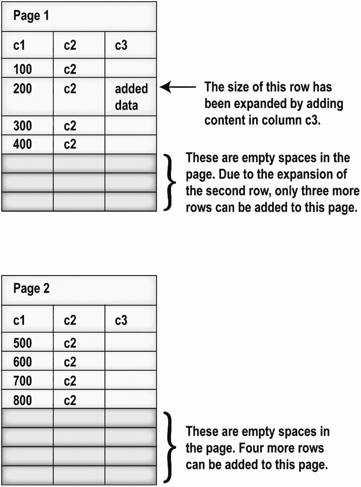

图 14-6

由 UPDATE 语句导致的页面拆分

从前面的表中，您可以看到由 `UPDATE` 语句引起的页面拆分导致了叶子页中数据的内部碎片。如果新的叶子页无法物理写入在原始叶子页旁边，还将存在外部碎片。对于具有大量碎片的大型表，将需要更多的叶子页来容纳所有索引行。

查看页面分布的另一种方法是使用一些较少被完整记录的 `DBCC` 命令。首先，您可以使用 `DBCC IND` 查看表中的页面。

```
DBCC IND(AdventureWorks2017, 'dbo.Test1', -1);
```

此命令列出构成表的页面。您会得到类似图 14-7 的输出。


图 14-7

显示两个页面的 DBCC IND 输出

如果您关注 `PageType`，可以看到现在有两个 `PageType = 1` 的页面，这是一个数据页。输出中还有其他列也显示了页面如何链接在一起。

要查看前面页面中行的结果分布，您可以向每个页面添加一个尾随行。

```
INSERT INTO dbo.Test1
VALUES (410, 'C4', "),
(900, 'C4', ");
```

这些新行在没有引起页面拆分的情况下被容纳在现有的两个叶子页中。您可以通过查询查看页面信息的另一种机制 `DBCC PAGE` 来确认这一点。要调用此命令，您需要从 `DBCC IND` 的输出中获取 `PagePID`。这将使您能够获取页面上所有内容的完整转储。

```
DBCC TRACEON(3604);
DBCC PAGE('AdventureWorks2017',1,24256,3);
```

此输出的解释较为复杂，但如果您向下滚动到底部，可以看到输出，如图 14-8 所示。


图 14-8

添加更多行后的页面

在屏幕右侧，您可以看到内存转储的输出，一个值 `C4`。这是由前面的数据添加的。在我的测试中，两行都添加到了一个页面中。详细解释这两个 `DBCC` 调用的所有可能排列组合远远超出了本章的范围。但您要知道，对于任何给定的表，都可以确定数据存储在哪个页面上。


#### 由 INSERT 语句引发的页拆分

要理解 `INSERT` 语句如何引发页拆分，请像之前一样创建包含初始八行数据和聚集索引的测试表。由于单个索引叶级页已完全填满，尝试如下添加一个中间行，将导致叶级页发生页拆分：

```sql
INSERT INTO Test1
VALUES (110, 'C2', '');
```

你可以通过查看 `sys.dm_db_index_physical_stats` 的输出（图 14-9）来验证这一点。


图 14-9：插入后的页

如前所述，原始叶级页中的半数行被移动到新的页中。一旦原始叶级页中腾出空间，新行就会按照适当的顺序添加到原始叶级页中。请注意，一行只与一个页关联；它不能跨越多个页。图 14-10 显示了两个页中行的最终分布情况。

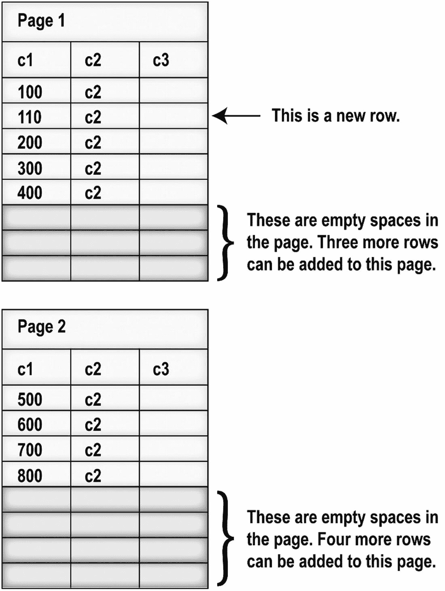

图 14-10：由 INSERT 语句引发的页拆分

从之前的索引页中可以看出，由 `INSERT` 语句引发的页拆分导致行稀疏地分布在叶级页上，从而产生了内部碎片。它通常也会导致外部碎片，因为新的叶级页在物理位置上可能不与原始页相邻。对于具有大量碎片的大型表，`INSERT` 语句引发的页拆分将需要更多的叶级页来容纳所有索引行。

为了演示索引页中显示的行分布，你可以再次运行创建 `dbo.Test1` 的脚本，向页中添加更多行。

```sql
INSERT  INTO dbo.Test1
VALUES  (410, 'C4', ''),
(900, 'C4', '');
```

结果与前一个示例相同：这些新行可以容纳在现有的两个叶级页中，而不会引发任何页拆分。你可以通过调用 `DBCC IND` 和 `DBCC PAGE` 来验证这一点。注意，在第一页中，新行被添加到该页中其他行之间。由于页中有可用空间，这不会导致页拆分。

那么，当你需要在索引的末尾添加行时，情况又如何呢？在这种情况下，即使需要一个新页，它也不会拆分任何现有页。例如，添加一个 `C1` 等于 1300 的新行将需要一个新页，但这不会引发页拆分，因为该行不是添加到中间位置。因此，如果新行是按照聚集索引的顺序添加的，那么索引行将始终添加到索引的末尾，从而避免原本由 `INSERT` 语句引发的页拆分。但是，在这种情况下，你也会遇到所谓的 `热页` 问题。热页是指所有插入操作都试图写入数据库中的单个页，从而导致阻塞。根据你的系统及其负载情况，这可能比页拆分更麻烦，因此请务必监控你的等待统计信息，以了解系统的运行状况。

### 数据修改与列存储索引

与行存储索引类似，列存储索引也可能受到碎片的影响。当首次加载列存储索引时（假设至少有 102,400 行），数据会存储到构成列存储索引的压缩列段中。少于 102,400 行的数据则存储在 `deltastore`（增量存储）中，如果你还记得第 9 章，它只是一个常规的 B 树索引。存储在压缩列段中的数据没有碎片。为了防止随时间推移产生碎片，在可能的情况下，所有更改都存储在增量存储中，正是为了避免碎片化压缩列段。所有更改、更新和删除，直到索引被重组或重建之前，都作为逻辑更改存储在增量存储中。我所说的逻辑更改是指，对于删除操作，数据被标记为已删除，但并未移除；对于更新操作，旧值被标记为已删除，新值被添加。虽然列存储不会以页拆分的方式产生碎片，但这些逻辑删除代表了列存储索引的碎片。这些逻辑删除越多，索引的逻辑碎片就越多。最终，你将需要修复它。

为了查看碎片情况，我将使用在第 9 章中创建的大型列存储表。在这里，我将修改其中一个表，将其转换为聚集列存储索引：

```sql
ALTER TABLE dbo.bigTransactionHistory
DROP CONSTRAINT pk_bigTransactionHistory
CREATE CLUSTERED COLUMNSTORE INDEX cci_bigTransactionHistory
ON dbo.bigTransactionHistory;
```

要查看聚集列存储索引内的逻辑碎片，我们将查看系统视图 `sys.column_store_row_groups`，查询如下：

```sql
SELECT OBJECT_NAME(i.object_id) AS TableName,
i.name AS IndexName,
i.type_desc,
csrg.partition_number,
csrg.row_group_id,
csrg.delta_store_hobt_id,
csrg.state_description,
csrg.total_rows,
csrg.deleted_rows,
100 * (total_rows - ISNULL(deleted_rows,
0)) / total_rows AS PercentFull
FROM sys.indexes AS i
JOIN sys.column_store_row_groups AS csrg
ON i.object_id = csrg.object_id
AND i.index_id = csrg.index_id
WHERE name = 'cci_bigTransactionHistory'
ORDER BY OBJECT_NAME(i.object_id),
i.name,
row_group_id;
```

由于在 `dbo.bigTransactionHistory` 上创建了新索引，我们可以预期没有因删除行引起的逻辑碎片。如果你运行前面的查询，可以看到这一点。它将显示 31 个行组，其中任何行组的删除行数都为零。你会看到一些行组的行数少于最大值。这不是问题；它只是数据加载的产物。现在，让我们删除几行数据。

```sql
DELETE dbo.bigTransactionHistory
WHERE Quantity = 13;
```

现在，当我们运行前面的查询时，可以看到列存储索引的逻辑碎片，如图 14-11 所示。


图 14-11：聚集列存储索引的碎片

你可以看到，所有的行组都受到了 `DELETE` 操作的影响，现在碎片率在 98% 到 99% 之间。

### 碎片开销

碎片开销主要包括因从磁盘读取更多页而产生的额外开销。从磁盘读取更多页意味着将更多页读入内存。这两者都会给系统带来压力，因为你使用越来越多的资源来处理索引的碎片化存储。正如我在开头关于碎片的讨论中所述，对于某些系统来说，这可能不是问题。但对于另一些系统而言，它确实是问题。我们将在后面详细讨论行存储和列存储索引中负载的具体来源。


### 行存储开销

内部和外部碎片都会对数据检索性能产生不利影响。外部碎片导致磁盘上索引页的非连续序列，新的叶页远离原始叶页，且其物理顺序与逻辑顺序不同。因此，索引上的范围扫描将需要比理想情况下更多的在相应扩展区之间的切换，正如本章前面所解释的那样。此外，索引上的范围扫描将无法受益于磁盘上执行的预读操作。如果页面是连续排列的，那么预读操作可以提前读取页面而无需太多磁头移动。

为了获得更好的性能，最好使用顺序 I/O，因为它可以在单个磁盘 I/O 操作中读取整个扩展区（八个 8KB 页面）。相比之下，页面的非连续布局需要非顺序或随机 I/O 操作来从磁盘检索索引页，而随机 I/O 操作在单个磁盘操作中只能读取 8KB 数据（然而，如果你只检索单行数据，这可能是可以接受的）。硬盘驱动器，特别是 SSD 速度的不断提高，已经降低了此问题的影响，但在某些情况下它仍然存在。

在内部碎片的情况下，行稀疏地分布在大量页面上，增加了将索引页读入内存所需的磁盘 I/O 操作数量，并增加了从内存中检索单个索引行所需的逻辑读取数量。如前所述，尽管它增加了数据检索的成本，但少量的内部碎片可能是有益的，因为它允许你执行`INSERT`和`UPDATE`查询而不会导致页拆分。对于不必遍历一系列页面来检索数据的查询，碎片可能影响最小。换句话说，从索引中检索单个值不会受到碎片的影响；或者，最多，它可能需要在 B-tree 中多下降一个层级。

为了理解碎片如何影响查询的性能，创建一个带有聚集索引的测试表，并将高度碎片化的数据集插入表中。由于在有序数据集之间执行`INSERT`操作可能导致页拆分，你可以通过按以下顺序添加行来轻松创建碎片化数据集：

```sql
DROP TABLE IF EXISTS dbo.Test1;
GO
CREATE TABLE dbo.Test1 (C1 INT,
C2 INT,
C3 INT,
c4 CHAR(2000));
CREATE CLUSTERED INDEX i1 ON dbo.Test1 (C1);
WITH Nums
AS (SELECT TOP (10000)
ROW_NUMBER() OVER (ORDER BY (SELECT 1)) AS n
FROM master.sys.all_columns AS ac1
CROSS JOIN master.sys.all_columns AS ac2)
INSERT INTO dbo.Test1 (C1,
C2,
C3,
c4)
SELECT n,
n,
n,
'a'
FROM Nums;
WITH Nums
AS (SELECT 1 AS n
UNION ALL
SELECT n + 1
FROM Nums
WHERE n < 10000)
INSERT INTO dbo.Test1 (C1,
C2,
C3,
c4)
SELECT 10000 - n,
n,
n,
'a'
FROM Nums
OPTION (MAXRECURSION 10000);
```

为了确定从这个碎片化表中检索单个小结果集和大结果集所需的逻辑读取数量，执行以下两个`SELECT`语句并使用扩展事件会话（在本例中，`sql_batch_completed`就足够了）来监控查询性能：

```sql
--Reads 6 rows
SELECT *
FROM dbo.Test1
WHERE C1 BETWEEN 21
AND     23;
--Reads all rows
SELECT *
FROM dbo.Test1
WHERE C1 BETWEEN 1
AND     10000;
```

各个查询执行的逻辑读取数量分别如下：

```
6 rows
Reads:8
Duration:2.6ms
All rows
Reads:2542
Duration:475ms
```

为了评估碎片化数据集如何影响逻辑读取数量，通过重建聚集索引来物理重新排列索引叶页。

```sql
ALTER INDEX i1 ON dbo.Test1 REBUILD;
```

在索引叶页按正确顺序重新排列后，重新运行查询。前面两个`SELECT`语句所需的逻辑读取数量分别减少到 5 和 13。

```
6 rows
Reads:6
Duration:1ms
All rows
Reads:2536
Duration:497ms
```

较小数据集的性能有所改善，但较大数据集的性能变化不大，因为仅仅减少几个页面不太可能产生太大影响。由于碎片造成的开销通常随着检索行数的增加而增加，因为这涉及到读取更多乱序的页面。对于*点查询*（仅检索单行的查询），碎片通常无关紧要，因为该行仅从一个叶页检索，但这并不总是如此。由于索引的内部结构，即使是一个点查询，碎片也可能增加其成本。

## 注意

本节的教训是，为了获得更好的查询性能，分析索引中的碎片量并在需要时重新排列它非常重要。

### 列存储开销

虽然你不需要处理列存储索引逻辑碎片导致的磁盘上页面重排，但你仍然会看到性能影响。被删除的值存储在与行组关联的 B-tree 索引中。任何数据检索都必须针对此数据执行额外的外部联接。你无法在执行计划中看到这一点，因为它是一个内部过程。但是，你可以在针对碎片化列存储索引的查询性能中看到它。

为了演示这一点，我们从一个利用列存储索引的查询开始，如下所示：

```sql
SELECT bth.Quantity,
AVG(bth.ActualCost)
FROM dbo.bigTransactionHistory AS bth
WHERE bth.Quantity BETWEEN 8
AND     15
GROUP BY bth.Quantity;
```

如果你运行这个查询，平均会得到如下性能指标：

```
Reads:20932
Duration:70ms
```

如果我们如下所示地碎片化索引，特别是针对我们查询的信息范围内：

```sql
DELETE dbo.bigTransactionHistory
WHERE Quantity BETWEEN 9
AND     12;
```

那么性能指标就会改变，如下所示：

```
Reads:20390
Duration:79ms
```

请注意，读取量已经下降，因为总共要处理的数据量变小了。然而，性能从 70ms 下降到了 79ms。这是因为索引碎片，我们可以看到它在图 14-12 中变得更糟。


图 14-12
聚集列存储索引的碎片增加

## 分析碎片量

你已经了解了如何确定列存储索引的碎片情况。对于行存储索引，我们可以采用同样的方法。你可以使用 `sys.dm_db_index_physical_stats` 动态管理函数来分析索引的碎片率。对于具有聚集索引的表，聚集索引的碎片与数据页的碎片是一致的，因为聚集索引的叶级页和数据页是相同的。`sys.dm_db_index_physical_stats` 也会指出堆表（或没有聚集索引的表）的碎片量。由于堆表不要求任何行排序，因此页的逻辑顺序对于堆表来说并不相关。

`sys.dm_db_index_physical_stats` 的输出显示了索引（或表）的页和区的信息。对于索引中的 B 树的每一层都会返回一行。对于堆中的每个分配单元都会返回一行。如前所述，在 SQL Server 中，八个连续的 8KB 页组合在一起形成一个大小为 64KB 的区。对于小表（远小于 64KB），一个区中的页可以属于多个索引或表——这些被称为 `混合区`。如果数据库中有很多小表，`混合区` 可以帮助 SQL Server 节省磁盘空间。

随着表（或索引）增长并请求超过八个页，SQL Server 会创建一个专用于该表（或索引）的区，并分配来自此区的页。这样的区称为 `统一区`，它为同一个表（或索引）最多提供八个页请求服务。`统一区` 帮助 SQL Server 连续地布局表（或索引）的页。它们还将页创建请求数量减少了八分之一，因为一组八个页以区的形式创建。存储在 `统一区` 中的信息仍然可能碎片化，但访问分配的页将会高效得多。如果你有 `混合区`、多个对象之间共享的页以及这些区内部的碎片，访问信息将变得更加成问题。但是，不对 `混合区` 进行碎片整理。

为了分析索引的碎片，让我们使用“碎片开销”部分中使用的碎片化数据集重新创建表。你可以通过对之前使用的 `sys.dm_db_index_physical_stats` 动态视图执行查询来获取聚集索引的碎片详细信息（图 14-13）。


图 14-13

碎片化统计信息

```sql
SELECT ddips.avg_fragmentation_in_percent,
ddips.fragment_count,
ddips.page_count,
ddips.avg_page_space_used_in_percent,
ddips.record_count,
ddips.avg_record_size_in_bytes
FROM sys.dm_db_index_physical_stats(DB_ID('AdventureWorks2017'),
OBJECT_ID(N'dbo.Test1'),
NULL,
NULL,
'Sampled') AS ddips;
```

动态管理函数 `sys.dm_db_index_physical_stats` 扫描索引的页以返回数据。你可以控制扫描的级别，这会影响扫描的速度和准确性。要快速检查索引的碎片，请使用 `Limited` 选项。使用如前面示例中的 `Sample` 选项，扫描 1% 的页，可以在速度仅适度降低的情况下获得更高的准确性。为了获得最准确的结果，请使用 `Detailed` 扫描，它会访问索引中的所有页。只需了解，`Detailed` 扫描可能会对性能产生重大影响，具体取决于相关表和索引的大小。如果索引少于 10,000 个页，并且你选择了 `Sample` 模式，则系统会改为使用 `Detailed` 模式。这意味着，尽管在之前的查询中做出了选择，但实际上使用了 `Detailed` 扫描模式。默认模式是 `Limited`。

通过定义不同的参数，你可以获取不同数据集的碎片信息。如果移除之前查询中的 `OBJECT_ID` 函数并提供 `NULL` 值，该查询将返回数据库中所有索引的信息。不要为此感到惊讶，并意外地在所有索引上运行 `Detailed` 扫描。你还可以指定要获取信息的索引，甚至是分区索引中的特定分区。

`sys.dm_db_index_physical_stats` 的输出包含 24 个不同的列。我选择了用于确定索引碎片和大小的基本列集。此输出表示以下内容：

*   `avg_fragmentation_in_percent`：此数字表示索引和堆的逻辑平均碎片百分比。如果表是堆且模式是 `Sampled`，则此值将为 `NULL`。如果平均碎片率低于 10% 到 20%，并且表不是很大，则碎片不太可能成为问题。如果索引在 20% 到 40% 之间，碎片可能是个问题，但通常可以通过索引重组（有关索引重组和索引重建的更多信息，请参见“碎片解决方案”部分）来帮助改善。大规模碎片，通常大于 40%，可能需要索引重建。你的系统可能有与这些通用数字不同的要求。

*   `fragment_count`：此数字表示构成索引的碎片数量，或分离的页组。这是理解索引分布情况的一个有用数字，特别是与 `page_count` 值进行比较时。当采样模式为 `Sampled` 时，`fragment_count` 为 `NULL`。大的碎片计数是存储碎片的额外迹象。

*   `page_count`：这个数字是构成统计信息的索引或数据页数量的字面计数。这个数字是大小的度量，但也可以帮助指示碎片。如果你知道数据或索引的大小，你可以计算有多少行可以放在一个页上。如果你将此与表中的行数关联起来，你应该得到一个接近 `page_count` 值的数字。如果 `page_count` 值明显更高，你可能正在处理碎片问题。请参考 `avg_fragmentation_in_percent` 值以获取精确的度量。

*   `avg_page_space_used_in_percent`：要了解索引页内分配空间的大小，请使用此数字。当采样模式为 `Limited` 时，此值为 `NULL`。

*   `record_count`：简单来说，这是统计信息所代表的记录数量。对于索引，这是扫描模式所表示的 B 树当前级别内的记录数。（`Detailed` 扫描将显示 B 树的所有级别，而不仅仅是叶级。）对于堆，这个数字表示存在的记录，但这个数字可能不完全与表中的行数相关，因为堆在更新和页拆分后可能有两个记录。

*   `avg_record_size_in_bytes`：这个数字简单地表示索引或堆记录中存储数据量的有用度量。

使用 `Detailed` 扫描运行 `sys.dm_db_index_physical_stats` 将为给定索引返回多行。也就是说，如果该索引跨越多个级别，则会显示多行。当索引跨越多个页时，索引中存在多个级别。要查看其外观并观察动态管理函数中存在的其他数据列，请按以下方式运行查询：

```sql
SELECT ddips.*
FROM sys.dm_db_index_physical_stats(DB_ID('AdventureWorks2017'),
OBJECT_ID(N'dbo.Test1'),
NULL,
NULL,
'Detailed') AS ddips;
```

为了使数据可读，我将结果数据表分解为三部分并放在一个图中；参见图 14-14。


**图 14-14** 碎片化索引的详细扫描

如你所见，返回了三行，分别代表索引的叶级别 (`index_level = 0`) 和 B 树的第一级 (`index_level = 1`)，即第二行，以及 B 树的第二级 (`index_level` = 2)。你可以看到 `sys.dm_db_index_physical_stats` 提供的附加信息，这些信息可以对索引进行更详细的分析。例如，你可以看到最小和最大的记录大小，以及索引深度（B 树中的级别数）和每个级别上的记录数量。这些信息中的大部分对于基本的碎片分析用处不大，这就是为什么我在示例中选择了限制列数并使用 Sampled 扫描模式。你看到的列存储信息主要是非聚集列存储内部结构。`sys.dm_db_index_physical_stats` 不会返回有关聚集列存储的信息。相反，如前面所示，你应该使用 `sys.dm_db_column_store_row_group_physical_stats`。

## 分析小表的碎片

对于小表，不必过分关注 `sys.dm_db_index_physical_stats` 的输出。对于页面少于八个的小表或索引，SQL Server 对页面使用混合区。例如，如果一个表 (`SmallTable1` 或其聚集索引) 只包含两个页面，那么 SQL Server 会从混合区分配这两个页面，而不是为表分配一个专属的区。这个混合区可能还包含其他小表/索引的页面，如图 14-15 所示。


**图 14-15** 混合区

页面分布在多个混合区上，这可能让你认为表或索引中存在大量外部碎片，但实际上这是 SQL Server 的设计使然，因此是完全可以接受的。

为了理解小表或索引的碎片信息可能是什么样子，创建一个带有聚集索引的小表。

```
DROP TABLE IF EXISTS dbo.Test1;
GO
CREATE TABLE dbo.Test1 (C1 INT,
C2 INT,
C3 INT,
C4 CHAR(2000));
DECLARE @n INT = 1;
WHILE @n <= 28
BEGIN
INSERT INTO dbo.Test1
VALUES (@n, @n, @n, 'a');
SET @n = @n + 1;
END
CREATE CLUSTERED INDEX FirstIndex ON dbo.Test1 (C1);
```

在前面的表中，每个 `INT` 占用 4 字节，平均行大小为 2,012 (=4 + 4 + 4 + 2,000) 字节。因此，默认的 8KB 页面最多可以容纳四行。将所有 28 行添加到表中后，创建一个聚集索引以物理排列行并将碎片降至最低。内部碎片最小的情况下，聚集索引（或基表）需要七个 (= 28 / 4) 页面。由于页面数量不超过八个，SQL Server 对聚集索引（或基表）使用混合区中的页面。如果用于聚集索引的混合区不是相邻的，那么 `sys.dm_db_index_physical_stats` 的输出可能会显示大量的外部碎片。但作为 SQL 用户，你无法减少由此产生的外部碎片。图 14-16 显示了 `sys.dm_db_index_physical_stats` 的输出。


**图 14-16** 小型聚集索引的碎片

从 `sys.dm_db_index_physical_stats` 的输出中，你可以分析小聚集索引（或表）的碎片如下：

*   `avg_fragmentation_in_percent`：尽管此索引可能跨越多个区，但此处显示的碎片并不表示外部碎片，因为此索引存储在混合区上。

*   `Avg_page_space_used_in_percent`：这显示所有或大部分数据都很好地存储在 `pagecount` 字段显示的七个页面中。这排除了逻辑碎片的可能性。

*   `Fragment_count`：这显示数据是分散的，存储在多个区上，但由于其长度少于八个页面，SQL Server 在存储数据的位置上没有太多选择。

尽管有前面的误导性数值，但页面少于八个小表（或索引）不太可能从移除碎片的努力中受益，因为它将存储在混合区上。

一旦确定需要处理索引（或表）中的碎片，就需要决定使用哪种碎片整理技术。影响此决策的因素以及不同的技术将在以下部分中解释。

## 碎片解决方案

你可以通过重新排列索引行和页面，使它们的物理顺序和逻辑顺序匹配，来解决索引中的碎片。为了减少外部碎片，你可以物理地重新排序索引的叶页面，使其遵循索引的逻辑顺序。在列存储索引上，你调用 Tuple Mover，它会关闭 deltastore 并将它们放入压缩段中，或者你在做这件事的同时强制重新组织数据以实现最佳压缩。你可以通过以下技术实现所有这些：

*   删除并重新创建索引

*   使用 `DROP_EXISTING = ON` 子句重新创建索引

*   在索引上执行 `ALTER INDEX REBUILD` 语句

*   在索引上执行 `ALTER INDEX REORGANIZE` 语句

### 删除并重新创建索引

删除索引然后重新创建，是消除索引碎片的一种表面看来最简单的方法之一。删除并重新创建索引可以最大程度地减少碎片，因为它允许 SQL Server 为索引使用全新的页面，并用现有数据适当地填充它们。这避免了内部和外部碎片。不幸的是，这种方法有许多严重的缺点。

*   *阻塞*：这种碎片整理技术会给系统增加大量开销，并导致阻塞。删除并重新创建索引会阻塞对该表（或表上任何其他索引）的所有其他请求。它也可能被其他针对该表的请求阻塞。

*   *索引缺失*：索引被删除，并且可能被阻塞并等待重新创建，针对该表的查询将无法使用该索引。这可能导致索引原本旨在解决的性能问题。

*   *非聚集索引*：如果要删除的索引是聚集索引，那么删除聚集索引后，表上的所有非聚集索引都必须重建。在重新创建聚集索引后，它们还必须再次重建。这会导致进一步的阻塞和其他问题，例如语句重新编译（详见第 19 章）。

*   *唯一约束*：用于定义主键或唯一约束的索引不能使用 `DROP INDEX` 语句删除。此外，唯一约束和主键都可能被外键约束引用。在删除主键之前，必须首先删除所有引用该主键的外键。虽然这是可能的，但对于整理索引碎片来说，这是一种有风险且耗时的方法。

可以使用 `ONLINE` 选项来删除聚集索引，这意味着在删除索引时索引仍然可读，但这只能让你避免前面的阻塞问题。由于所有这些原因，删除并重新创建索引不建议用于生产数据库，尤其是在非高峰时段之外。


# 使用 DROP_EXISTING 子句重新创建索引

## 使用 DROP_EXISTING 子句重新创建索引

为避免在重建聚集索引时两次重建非聚集索引所产生的开销，请使用 `CREATE INDEX` 语句的 `DROP_EXISTING` 子句。这能在**一个原子操作**中重新创建聚集索引，避免了重新创建非聚集索引，因为行定位器使用的聚集索引键值保持不变。要使用 `DROP_EXISTING` 子句在一个原子操作中重建聚集索引键，请执行如下 `CREATE INDEX` 语句：

```sql
CREATE UNIQUE CLUSTERED INDEX FirstIndex
ON dbo.Test1
(
C1
)
WITH (DROP_EXISTING = ON);
```

你可以对聚集索引和非聚集索引都使用 `DROP_EXISTING` 子句，甚至可以将非聚集索引转换为聚集索引。但是，不能使用它将聚集索引转换为非聚集索引。

## DROP_EXISTING 方法的缺点

这种碎片整理技术的缺点如下：

*   `阻塞`：与 `DROP` 和 `CREATE` 方法类似，此技术也会导致并面临来自访问该表（或表上任何索引）的其他查询的阻塞。

*   `带有约束的索引`：与第一种方法不同，带有 `DROP_EXISTING` 的 `CREATE INDEX` 语句可用于重新创建带约束的索引。如果约束是主键，或者唯一约束与外键关联，那么在 `CREATE` 语句中未包含 `UNIQUE` 关键字将导致类似以下的错误：
    ```
    Msg 1907, Level 16, State 1, Line 1
    Cannot recreate index 'PK_Name'. The new index definition does not match the constraint being enforced by the existing index.
    ```

*   `具有多个碎片化索引的表`：随着表数据碎片化，索引通常也会变得碎片化。如果使用这种碎片整理技术，则必须识别表上的所有索引并分别重建它们。

你可以通过使用 `ALTER INDEX REBUILD` 来避免与此技术相关的最后两个限制，如下一节所述。

## 执行 ALTER INDEX REBUILD 语句

`ALTER INDEX REBUILD` 在一个原子操作中重建索引，就像使用 `DROP_EXISTING` 子句的 `CREATE INDEX` 一样。由于 `ALTER INDEX REBUILD` 也物理地重建索引，它允许 SQL Server 分配全新的页，从而将内部和外部碎片降至最低。但与使用 `DROP_EXISTING` 子句的 `CREATE INDEX` 不同，它允许动态重建一个索引（支持 `PRIMARY KEY` 或 `UNIQUE` 约束），而无需删除和重新创建约束。

在列存储索引中，`REBUILD` 语句将以离线方式完全重建列存储索引，调用元组移动器 (Tuple Mover) 删除 delta 存储，同时还会重新排列数据以确保最大的有效压缩。对于行存储索引，处理索引碎片的首选机制是 `REBUILD`。对于列存储索引，首选方法是 `REORGANIZE` 语句，下一节将详细介绍。

## 使用 ALTER INDEX REBUILD 整理行存储索引的碎片

为了理解使用 `ALTER INDEX REBUILD` 来整理行存储索引碎片的方法，可以参考“碎片开销”和“分析碎片量”部分中使用的碎片化表。该表在此处重复：

```sql
DROP TABLE IF EXISTS dbo.Test1;
GO
CREATE TABLE dbo.Test1 (C1 INT,
C2 INT,
C3 INT,
c4 CHAR(2000));
CREATE CLUSTERED INDEX i1 ON dbo.Test1 (C1);
WITH Nums
AS (SELECT TOP (10000)
ROW_NUMBER() OVER (ORDER BY (SELECT 1)) AS n
FROM master.sys.all_columns AS ac1
CROSS JOIN master.sys.all_columns AS ac2)
INSERT INTO dbo.Test1 (C1,
C2,
C3,
c4)
SELECT n,
n,
n,
'a'
FROM Nums;
WITH Nums
AS (SELECT 1 AS n
UNION ALL
SELECT n + 1
FROM Nums
WHERE n < 10000)
INSERT INTO dbo.Test1 (C1,
C2,
C3,
c4)
SELECT 10000 - n,
n,
n,
'a'
FROM Nums
OPTION (MAXRECURSION 10000);
```

如果你查看当前的碎片情况，可以看到它既有内部碎片也有外部碎片（图 14-17）。

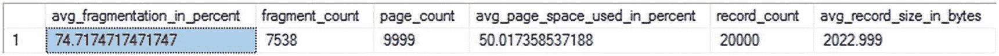

**图 14-17** 内部和外部碎片

## 重建索引

你可以使用 `ALTER INDEX REBUILD` 语句来整理聚集索引（或表）的碎片。

```sql
ALTER INDEX i1 ON dbo.Test1 REBUILD;
```

图 14-18 显示了针对 `sys.dm_db_index_physical_stats` 执行标准 `SELECT` 语句的结果输出。


**图 14-18** 通过 ALTER INDEX REBUILD 解决的碎片问题

## 分析结果

将图 14-18 中前述查询的结果与图 14-18 中更早的结果进行比较。你可以看到内部和外部碎片都已有效减少。以下是输出分析：

*   `内部碎片`：该表有 20,000 行，平均行大小（2,022.999 字节）允许每页最多存放四行。如果行被高度整理以将内部碎片降至最低，那么表中应大约有 6,000 个数据页（或聚集索引中的叶级页）。你可以在上述输出中观察到：
    *   叶级（或数据）页数：`pagecount` = 6667
    *   页中的信息量：`avg_page_space_used_in_percent` = 75.02 percent

*   `外部碎片`：需要大量的区 (extents) 来存放这 6,667 个页。为了使外部碎片最小化，区之间不应有任何间隙，并且所有页都应按照索引的逻辑顺序在物理上排列。上述输出显示了乱序页数 = `avg_fragmentation_in_percent` = 0 percent。这表明该索引得到了有效的碎片整理。由于排列一致的区更少，访问速度将会更快。


## SQL Server 索引维护技术详解

在 SQL Server 2005 及更高版本中，重建索引还会压缩大型对象 (LOB) 页。你可以通过设置 `LOB_COMPACTION = OFF` 来选择不压缩。如果你不担心存储空间，但关心索引重组操作耗时较长，关闭此选项可能是可取的。

在创建索引时使用 `PAD_INDEX` 设置，它决定了索引中间页上要保留多少可用空间，这有助于你处理页拆分。此设置在索引重建时会被考虑在内，除非你另有指定，否则新页面将被设置回你在索引创建时确定的原始值。我几乎从未看到这对大多数系统产生重大影响。你需要在你的系统上进行测试，以确定它是否有帮助。

如果你没有另行指定，默认行为是对所有分区上的所有索引进行碎片整理。如果你想控制此过程，只需指定要在何时重建哪个分区。

如前所述，`ALTER INDEX REBUILD` 技术能有效减少碎片。你也可以使用它在一条语句中重建表的**所有**索引。

```
ALTER INDEX ALL ON dbo.Test1 REBUILD;
```

尽管这是最有效的碎片整理技术，但它确实存在一些开销和限制。

- **阻塞**：与前两种索引重建技术类似，`ALTER INDEX REBUILD` 会在系统中引入阻塞。它会阻塞所有尝试访问该表（或表上任何索引）的其他查询。它也可能被那些查询阻塞。你可以使用 `ONLINE INDEX REBUILD` 来减少这种情况。
- **事务回滚**：由于 `ALTER INDEX REBUILD` 在操作上是完全原子的，如果它在完成前被停止，那么到那时为止执行的所有碎片整理操作都将丢失。你可以使用 `ONLINE` 关键字运行 `ALTER INDEX REBUILD`，这将减少锁定机制，但会增加重建索引所需的时间。

在 Azure SQL Database 中引入并在 SQL Server 2017 中可用的功能是，你现在有能力重新启动索引重建操作。你可以重新启动失败的索引重建，也可以暂停重建操作稍后重新启动。要实现这一点，你还必须使用 `ONLINE` 重建选项。`ONLINE` 选项极大地减少了与重建操作相关的阻塞。要重建一个既是 `ONLINE` 又是 `RESUMABLE` 的索引，你必须在命令中指定所有这些。

```
ALTER INDEX i1 ON dbo.Test1 REBUILD WITH (ONLINE=ON, RESUMABLE=ON);
```

这将运行索引重建操作，直到完成或直到你发出以下命令：

```
ALTER INDEX i1 ON dbo.Test1 PAUSE;
```

这将暂停 `ONLINE` 重建操作，相关的表和索引将保持可访问且无任何阻塞。要重新启动操作，请使用以下命令：

```
ALTER INDEX i1 ON dbo.Test1 RESUME;
```

## 执行 ALTER INDEX REORGANIZE 语句

对于行存储索引，`ALTER INDEX REORGANIZE` 通过重组索引而不重建索引来减少碎片。它通过按索引键的逻辑顺序重新排列索引的现有叶页来减少外部碎片。它压缩页面内的行，减少内部碎片，并丢弃产生的空页。此技术不使用任何新页面进行碎片整理。

对于列存储索引，`ALTER INDEX REORGANIZE` 将确保列存储索引内的增量存储 (deltastore) 被清理，并且所有逻辑删除都被处理。它在执行此操作时保持索引在线且可访问。这将确保索引被碎片整理。此外，你可以选择强制压缩所有行组。此功能类似于运行 `ALTER INDEX REBUILD`，但与 `REBUILD` 过程不同，它在操作期间继续保持索引在线。因此，对于列存储索引，更推荐使用 `ALTER INDEX REORGANIZE`。

为了避免与 `ALTER INDEX REBUILD` 相关的阻塞开销，此技术使用了一种非原子的在线方法。当它逐步执行时，会请求少量锁并保持很短时间。一旦每个步骤完成，它就释放锁并进入下一步。在尝试访问页面时，如果发现页面正在被使用，它会跳过该页面并不再返回。这允许其他查询与 `ALTER INDEX REORGANIZE` 操作同时在表上运行。此外，如果此操作被中途停止，那么到那时为止执行的所有碎片整理步骤都会被保留。

对于行存储索引，由于 `ALTER INDEX REORGANIZE` 不使用任何新页面来重新排序索引，并且它会跳过被锁定的页面，因此此方法提供的碎片整理量通常少于 `ALTER INDEX REBUILD`。要观察 `ALTER INDEX REORGANIZE` 与 `ALTER INDEX REBUILD` 相比的相对效果，请使用上一节关于 `ALTER INDEX REBUILD` 的测试表进行重建。

使用之前的脚本重建碎片化的行存储表。要减少聚簇行存储索引的碎片，请按如下方式使用 `ALTER INDEX REORGANIZE`：

```
ALTER INDEX i1 ON dbo.Test1 REORGANIZE;
```

图 14-19 显示了 `sys.dm_db_index_physical_stats` 的输出结果。

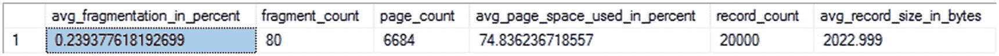
*图 14-19：ALTER INDEX REORGANIZE 的结果*

从输出中你可以看到，与上一节所示的 `ALTER INDEX REBUILD` 相比，`ALTER INDEX REORGANIZE` 降低碎片的效果不佳。对于高度碎片化的索引，`ALTER INDEX REORGANIZE` 操作可能比重建索引花费更长的时间。此外，如果一个索引跨多个文件，`ALTER INDEX REORGANIZE` 不会在文件之间迁移页面。然而，使用 `ALTER INDEX REORGANIZE` 的主要好处是它允许其他查询同时访问表（或索引）。

要查看列存储索引碎片整理的结果，让我们使用本章前面"列存储开销"一节中已经碎片化的列存储索引。

```
ALTER INDEX ClusteredColumnStoreTest ON dbo.bigTransactionHistory REORGANIZE;
```

`REORGANIZE` 语句的结果如图 14-20 所示。

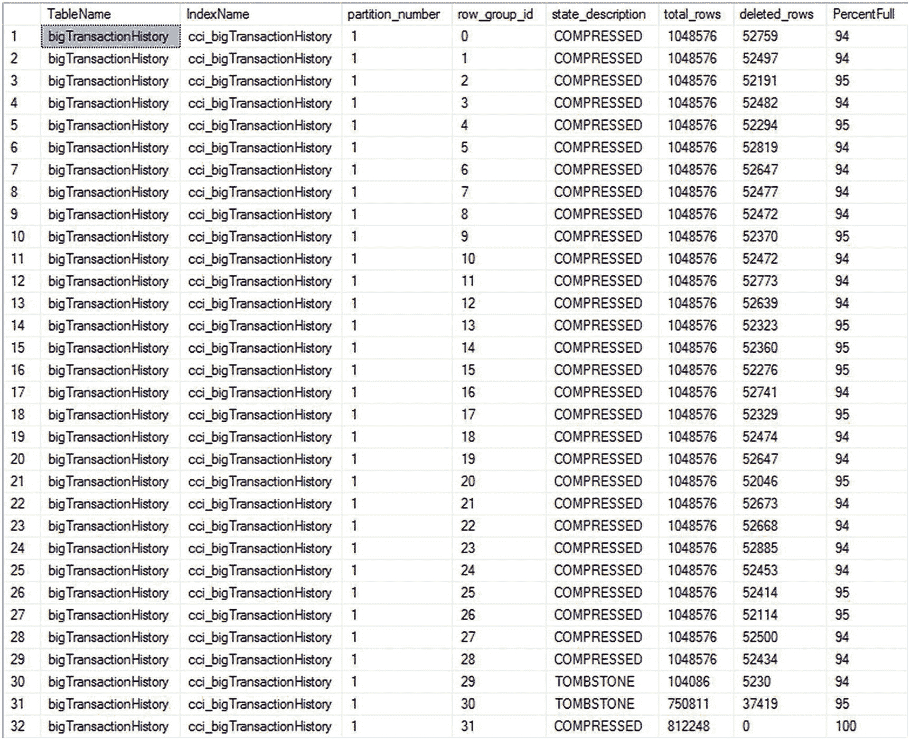
*图 14-20：在未压缩的列存储索引上执行 REORGANIZE 的结果*


你会注意到，大多数行组仍然有些分散。其中两个行组（29 和 30）的状态尚未从 `COMPRESSED` 更改为 `TOMBSTONE`。这意味着这些行组将在稍后的某个时间点被后台移除。简而言之，只有少数行组被合并了，而几乎没有任何已删除的行得到处理。这是因为 `REORGANIZE` 命令仅在某个行组中超过 10% 的数据被删除时，才会清理已删除的数据。让我们从表中删除更多数据，以使一些行组的删除比例超过 10%。

```sql
DELETE dbo.bigTransactionHistory
WHERE Quantity BETWEEN 8
AND     17;
```

现在，当我们查看碎片化结果时，会看到更多的活动，如图 14-21 所示。

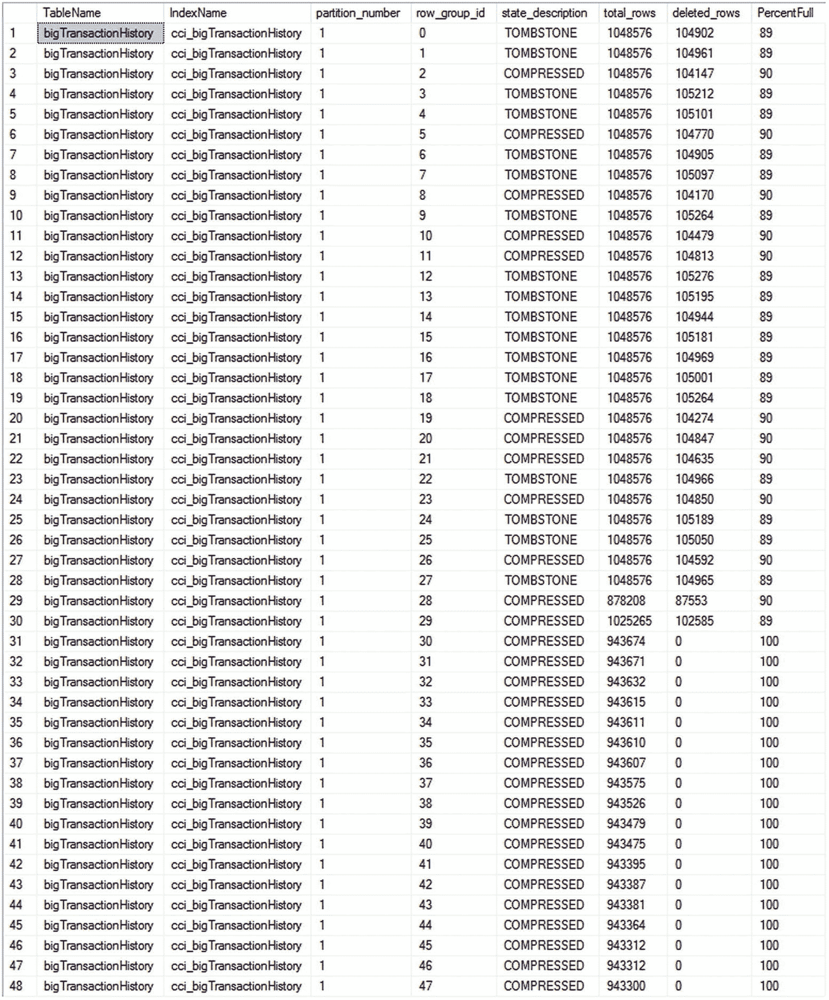

图 14-21

对更加碎片化的索引执行不带压缩的 `REORGANIZE`

你可以看到，更多的行组已被标记为 `TOMBSTONE`，并且所有新页面中的已删除行数为零。你会注意到，对于已压缩的行组，系统已为其生成了新的 `row_group_id` 值。旧的 `row_group_id` 不会被重用。如果在清理完成后查看该表，你将只看到 `COMPRESSED` 行组，由于数据被移除，总数会降至 30，但你会看到一些间隔（gap）。

如果我们重新运行 `REORGANIZE` 命令但同时包含压缩行组的操作，该命令将如下所示：

```sql
ALTER INDEX cci_bigTransactionHistory
ON dbo.bigTransactionHistory
REORGANIZE
WITH (COMPRESS_ALL_ROW_GROUPS = ON);
```

命令 `COMPRESS_ALL_ROW_GROUPS` 将确保增量存储中任何 `OPEN` 或 `CLOSED` 状态的行组都会经过压缩及列存储索引相关的其他处理，然后被移入列存储中。

不过，在运行此命令之前，让我们再删除一些数据，将那些碎片化程度刚达到 10% 的行组推过阈值。

```sql
DELETE dbo.bigTransactionHistory
WHERE Quantity BETWEEN 6
AND     8;
```

图 14-22 所示的结果包括移除 `TOMBSTONE` 以及完全重组索引。

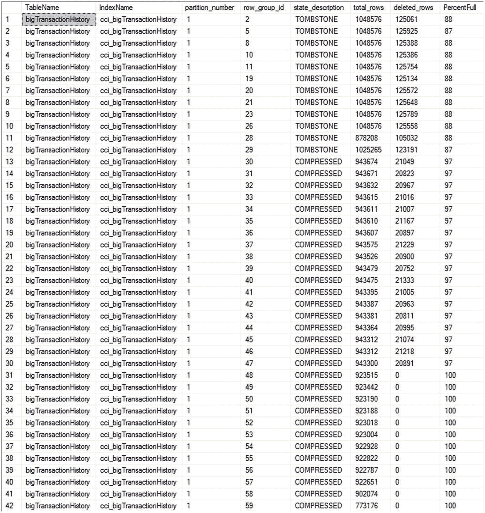

图 14-22

列存储索引的压缩与碎片整理

实际上，行组的顺序并不真正重要。当它们被整理碎片时，会从索引中的原始位置移动到后面的新位置。

如果你不想处理 10% 的限制，可以对列存储索引使用 `REBUILD` 选项，但你必须面对在此过程中索引会脱机的事实。

表 14-1 总结了在行存储索引上这四种碎片整理技术的特性。

表 14-1

行存储碎片整理技术的特性

| 特性/问题 | 删除并创建索引 | 使用 `DROP_EXISTING` 创建索引 | `ALTER INDEX REBUILD` | `ALTER INDEX REORGANIZE` |
| --- | --- | --- | --- | --- |
| 重新构建非聚集索引（因聚集索引碎片化而需） | 两次 | 否 | 否 | 否 |
| 是否会导致索引缺失 | 是 | 否 | 否 | 否 |
| 对含约束的索引进行碎片整理 | 高度复杂 | 中度复杂 | 简单 | 简单 |
| 能否一起整理多个索引 | 否 | 否 | 是 | 是 |
| 与其他操作的并发性 | 低 | 低 | 中等（取决于并发用户活动） | 高 |
| 中途中断的后果 | 危险（无事务保护） | 进度丢失 | 进度丢失 | 进度得以保留 |
| 碎片整理程度 | 高 | 高 | 高 | 中等至低 |
| 是否可应用新的填充因子 | 是 | 是 | 是 | 否 |
| 是否更新统计信息 | 是 | 是 | 是 | 否 |

你还可以通过压缩页面内更多的行来减少内部碎片，从而减少页面内的空闲空间。在索引的叶级页面内可以进行的最大压缩程度由填充因子控制，接下来你将看到。

处理大型数据库及其关联的索引时，可能需要使用分区将表和索引分散到多个磁盘上。分区上的索引也可能随着分区内数据的变化而变得碎片化。处理分区索引时，你需要决定是作为 `ALTER INDEX` 命令的一部分，重组或重建（分别使用 `REORGANIZE` 或 `REBUILD`）一个、部分还是所有分区。分区索引无法在线重建。请记住，对所有分区进行任何操作都可能是一项开销巨大的操作。

如果在索引（即使是分区索引）上指定了压缩，则必须确保在执行 `ALTER INDEX` 操作时，将其压缩设置恢复为之前的值；否则，压缩设置将会丢失，你必须重建索引。这对于非聚集索引尤其重要，因为它们不会继承表的压缩设置。

### 碎片整理与分区

如果你拥有海量数据库，有效管理数据的一个标准机制是将其拆分为分区。虽然分区在极少数情况下可能有助于性能，但它们主要用于管理数据。然而，索引和分区的一个问题是，如果你重建索引，在重建期间它将不可用。这意味着对于大型索引上的分区，你可以预期在重建过程中有大部分数据处于离线状态。SQL Server 2012 引入了在线重建的能力。如果你有一个分区索引，它将如下所示：

```sql
ALTER INDEX i1 ON dbo.Test1
REBUILD PARTITION = ALL
WITH (ONLINE = ON);
```

这可以重建整个分区，并作为在线操作执行，意味着它在重建过程中基本保持索引可用。但是，对于某些分区来说，这是一项巨大的任务，可能导致服务器负载过高以及需要更多的 tempdb 存储。SQL Server 2014 引入了新功能，允许你指定单个分区进行操作。

```sql
ALTER INDEX i1 ON dbo.Test1
REBUILD PARTITION = 1
WITH (ONLINE = ON);
```

这减少了重建操作的开销，同时在重建过程中仍保持索引大部分可用。我强调“大部分”在线，是因为在此过程中仍然会发生一定程度的锁定和争用。这不是一个完全免费的操作，但相比替代方案已有根本性的改进。

谈到分区索引重建操作涉及的锁定，SQL Server 2014 还引入了另一项新功能。你可以通过调整 `REBUILD` 命令来修改重建操作期间使用的锁优先级。

```sql
ALTER INDEX i1
ON dbo.Test1
REBUILD PARTITION = 1
WITH (ONLINE = ON (WAIT_AT_LOW_PRIORITY (MAX_DURATION = 20,
ABORT_AFTER_WAIT = SELF)));
```

这将设置重建操作愿意等待的持续时间（以分钟为单位）。然后，它允许你决定中止哪些进程以便为索引重建清理系统。你可以让它停止自身或阻塞进程。最有趣的是，等待进程被设置为低优先级，因此它不会占用大量系统资源，并且任何进入的事务都不会被此进程阻塞。


## 填充因子的重要性

### 索引碎片与性能

在行存储索引上，通过让索引的每个叶级页容纳更多行来减少索引的内部碎片。在叶级页中获取更多行会减少索引所需的总页数，进而降低检索一段索引行所需的磁盘 I/O 和逻辑读取次数。另一方面，如果索引键值高度易变（事务频繁），那么完全填满的索引页将导致页拆分。因此，对于事务型表，需要在最大化每页行数和避免页拆分之间取得良好平衡。

### 使用填充因子

SQL Server 允许你通过使用 `填充因子` 来控制索引叶级页内的空闲空间量。如果你知道表上会有大量的 `INSERT` 查询或对索引键列进行 `UPDATE` 查询，那么你可以使用填充因子预先在索引叶级页中添加空闲空间，以最大程度减少页拆分。如果表是只读的，你可以创建具有高填充因子的索引来减少索引页数。不过，在处理针对 `IDENTITY` 列（或任何包含有序数据、容易形成热点页的索引键）的插入操作时，保留一些空闲空间是个好主意。

### 默认行为与限制

默认的填充因子为 0，这意味着叶级页被填充到 100%，尽管 B 树结构的分支节点中会保留一些空闲空间。索引的填充因子仅在创建索引时应用。随着键的插入和更新，索引中的行密度最终会在一个狭窄的范围内稳定下来。正如你在前一章关于 `UPDATE` 和 `INSERT` 导致的页拆分的章节中所见，当发生页拆分时，通常原始页的一半行会被移动到一个新页，无论创建索引时使用了何种填充因子，此过程都会发生。

### 演示

为了理解填充因子的重要性，让我们使用一个包含 24 行的小型测试表。

```
DROP TABLE IF EXISTS dbo.Test1;
GO
CREATE TABLE dbo.Test1 (C1 INT,
C2 CHAR(999));
WITH Nums
AS (SELECT 1 AS n
UNION ALL
SELECT n + 1
FROM Nums
WHERE n < 24)
INSERT INTO dbo.Test1 (C1,
C2)
SELECT n * 100,
'a'
FROM Nums;
```

#### 使用默认填充因子进行测试

通过使用默认填充因子创建聚集索引来增加叶级（或数据）页中的最大行数。

```
CREATE CLUSTERED INDEX FillIndex ON Test1(C1);
```

由于平均行大小为 1,010 字节，一个聚集索引叶级页（或表数据页）最多可以容纳八行。因此，24 行至少需要三个叶级页。你可以在图 14-23 所示的 `sys.dm_db_index_physical_stats` 输出中确认这一点。

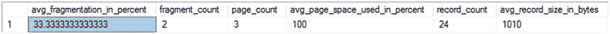

*图 14-23 填充因子设置为默认值 0*

请注意，`avg_page_space_used_in_percent` 为 100%，因为默认填充因子允许在每页中压缩最大行数。由于一页无法包含部分行来完全填满页面，即使使用默认填充因子，`avg_page_space_used_in_percent` 也常常会略低于 100%。

#### 使用自定义填充因子进行测试

为了减少由 `INSERT` 和 `UPDATE` 操作引起的页拆分的初始频率，通过使用如下填充因子重建聚集索引，在叶级（或数据）页中创建一些空闲空间：

```
ALTER INDEX FillIndex ON dbo.Test1 REBUILD
WITH  (FILLFACTOR= 75);
```

因为每页总空间可容纳八行，75% 的填充因子将允许每页容纳六行。因此，对于 24 行，叶级页的数量应增加到四个，如 `sys.dm_db_index_physical_stats` 输出所示，见图 14-24。

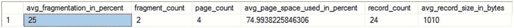

*图 14-24 填充因子设置为 75*

请注意，`avg_page_space_used_in_percent` 约为 75%，与设置的填充因子一致。这允许在不引起页拆分的情况下，在每个页面中再插入两行。你可以通过向第一组六行（包含在第一个页面中，`C1` = 100 – 600）添加两行来确认这一点。

```
INSERT  INTO dbo.Test1
VALUES  (110, 'a'),  --第 25 行
(120, 'a') ;  --第 26 行
```

图 14-25 显示了当前的碎片情况。

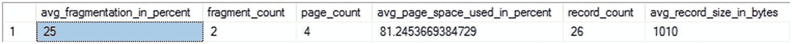

*图 14-25 添加新记录后的碎片*

从输出中可以看出，添加这两行并没有为索引增加任何页面。相应地，`avg_page_space_used_in_percent` 从 74.99% 增加到 81.25%。随着在第一组六行中添加两行，第一页应该完全填满（八行）。在前八行的范围内进一步添加任何行都应该会导致页拆分，从而使索引页数增加到五个。

```
INSERT  INTO dbo.Test1
VALUES  (130, 'a') ;  --第 27 行
```

现在 `sys.dm_db_index_physical_stats` 显示了差异，如图 14-26 所示。

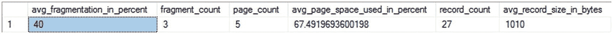

*图 14-26 页数增加*

请注意，即使索引的填充因子为 75%，`平均页密度（满）` (`Avg. Page Density (full)`) 已降至 67.49%，计算如下：

```
平均页密度（满）
= 每页平均行数 / 每页最大行数
= (27 / 5) / 8
= 67.5%
```

### 结论与维护

从前面的示例中，你可以看到填充因子在创建索引时被应用。但后来，随着数据的修改，它就不再具有意义。无论填充因子如何，每当发生页拆分时，原始页的行都会分布在两个页面之间，`avg_page_space_used_in_percent` 也会相应地稳定下来。因此，如果你使用非默认的填充因子，应确保定期重新应用填充因子以维持其效果。

你可以通过重新创建索引，或如前所示使用 `ALTER INDEX REORGANIZE` 或 `ALTER INDEX REBUILD` 来重新应用填充因子。`ALTER INDEX REORGANIZE` 会考虑索引创建时指定的填充因子。`ALTER INDEX REBUILD` 也会考虑原始填充因子，但如果需要，它允许指定新的填充因子。

如果没有定期的填充因子维护（无论是默认还是非默认设置），索引（或表）的 `avg_page_space_used_in_percent` 最终都会稳定在一个狭窄的范围内。

### 实际考量

可以提出这样的论点：与其反复尝试碎片整理索引（并承担其带来的所有开销），不如选择一个允许在索引页面中实现相当标准分布集的填充因子，这样可能更有利。有些人确实使用这种方法，牺牲部分读取性能和磁盘空间来避免页拆分及其导致的关联问题。你需要在自己的系统上进行测试，以找到合适的填充因子，并确定该方法是否有效。


## 自动维护

在拥有大量事务的数据库中，表和索引会随时间推移而碎片化（假设你没有使用前面提到的填充因子方法）。因此，为了提高性能，你应该定期检查表和索引的碎片情况，并对碎片化程度高的进行碎片整理。你可能还需要考虑工作负载，并根据负载以及索引的碎片化级别来整理索引。你可以按照以下步骤对数据库执行此分析：

1.  识别当前数据库中所有需要分析碎片的用户表。
2.  确定每个用户表和索引的碎片。
3.  考虑以下因素，确定需要碎片整理的用户表和索引：
    *   碎片化程度高，即 `avg_fragmentation_in_percent` 大于 20%
    *   不是非常小的表/索引，即 `pagecount` 大于 8
4.  对碎片化程度高的表和索引进行碎片整理。

对于功能完备的脚本，我强烈建议使用位于 [`http://bit.ly/2EGsmYU`](http://bit.ly/2EGsmYU) 的 Minion Reindex 应用程序或 Ola Hollengren 的脚本 [`http://bit.ly/JijaNI`](http://bit.ly/JijaNI)。

除了这些脚本，你也可以使用 SQL Server 内置的维护计划。但是，我不推荐它们，因为为了这点易用性，你放弃了很多控制权。使用前面推荐的一套脚本，你会对结果更加满意。

## 总结

如本章所述，在高度事务性的数据库中，由 `INSERT` 和 `UPDATE` 语句引起的页拆分可能会导致表和索引碎片化，从而增加数据检索的成本。你可以通过使用填充因子在页面内保持可用空间来避免这些页拆分。由于填充因子仅在创建索引时应用，因此你需要定期重新应用它以保持其有效性。列存储索引的数据操作也会导致碎片化和性能下降。你可以使用 `sys.dm_db_index_physical_stats` 来确定行存储索引的碎片量，或使用 `sys.column_store_row_groups` 来确定列存储索引的碎片量。在确定碎片量很高后，你可以根据所需的碎片整理量、数据库并发性以及你处理的是行存储还是列存储索引来选择使用 `ALTER INDEX REBUILD` 或 `ALTER INDEX REORGANIZE`。

碎片整理会重新排列数据，使其在磁盘上的物理顺序与表/索引中的逻辑顺序相匹配，从而提高查询性能。但是，除非优化器为查询决定一个有效的执行计划，否则即使在碎片整理后，查询性能也可能仍然不佳。因此，让优化器使用高效的技术来生成成本效益高的执行计划非常重要。

在下一章中，我将解释执行计划的生成以及优化器用来决定有效执行计划的技术。

# 15. 执行计划生成

正如你在前面章节中学到的，任何查询的性能都取决于优化器决定的执行计划的有效性。由于执行查询所需的总时间等于生成执行计划所需的时间加上基于此执行计划执行查询所需的时间之和，因此确保生成执行计划本身的成本很低，或者从缓存中重用计划以完全避免该成本，是非常重要的。生成执行计划时产生的成本取决于生成执行计划的过程、缓存计划的过程以及从计划缓存中重用计划的可行性。在本章中，你将学习执行计划是如何生成的。

本章涵盖以下主题：

*   执行计划的生成和缓存
*   用于生成执行计划的 SQL Server 组件
*   优化执行计划生成成本的策略
*   影响并行计划生成的因素

## 执行计划生成

SQL Server 使用基于成本的优化技术来确定查询的处理策略。优化器在决定使用哪个索引和连接策略时，会同时考虑数据库对象的元数据（如唯一约束或索引大小）以及查询中引用列的当前分布统计信息。

基于成本的优化使数据库开发人员可以专注于实现业务规则，而不是查询的确切语法。与此同时，确定查询处理策略的过程仍然相当复杂，并且可能消耗大量资源。 SQL Server 使用多种技术来优化资源消耗。

*   查询的基于语法的优化
*   针对简单查询的平凡计划匹配，以避免深入查询优化
*   基于当前分布统计信息的索引和连接策略
*   分阶段进行查询优化以控制优化成本
*   执行计划缓存以避免不必要的查询计划重新生成

以下技术按顺序执行，如图 15-1 所示。

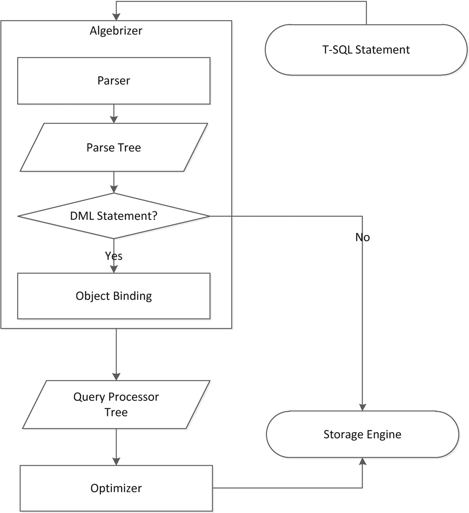

图 15-1

用于优化查询执行的 SQL Server 技术

1.  解析
2.  绑定
3.  查询优化
4.  执行计划生成、缓存和哈希计划生成
5.  查询执行

让我们更详细地了解这些步骤。

### 解析器

当提交查询时， SQL Server 将其传递给*关系引擎*内的代数器。（此关系引擎是 SQL Server 数据检索和操作的两个主要部分之一，另一个是*存储引擎*，负责数据访问、修改和缓存。）关系引擎负责解析、名称和类型解析以及优化。它还根据查询执行计划执行查询，并向存储引擎请求数据。

代数器处理的第一部分是解析器。解析器检查传入的查询，验证其语法是否正确。如果检测到语法错误，则终止查询。如果多个查询作为批处理一起提交（注意语法错误），则解析器会一起检查整个批处理的语法，并在检测到语法错误时取消整个批处理。（注意，一个批处理中可能出现多个语法错误，但解析器不会检查到第一个错误之后。）

```
CREATE TABLE dbo.Test1 (c1 INT);
INSERT  INTO dbo.Test1
VALUES  (1);
CEILEKT * FROM dbo.t1; --错误：我的意思是， SELECT * FROM t1
```

在验证查询语法正确后，解析器会为代数器生成一个称为*解析树*的内部数据结构。解析器和代数器合在一起被称为*查询编译*。


### 绑定

解析器生成的解析树会被传递给代数化器的下一部分进行处理。代数化器现在会解析所有不同对象的名称，即在 T-SQL 中被引用的表、列等，这个过程称为 `绑定`。它还会识别正在处理的各种数据类型，甚至检查聚合函数（如 `GROUP BY` 和 `MAX`）的位置。所有这些验证和解析的输出是一组二进制数据，称为 `查询处理器树`。

为了演示代数化器的这一部分，如果提交了以下批处理查询，则 `error` 语句之前的前三条语句会被执行，而错误语句及其后的语句则会被取消。
```
IF (SELECT OBJECT_ID('dbo.Test1')) IS NOT NULL
DROP TABLE dbo.Test1;
GO
CREATE TABLE dbo.Test1 (C1 INT);
INSERT INTO dbo.Test1
VALUES (1);
SELECT 'Before Error',
C1
FROM dbo.Test1 AS t;
SELECT 'error',
c1
FROM dbo.no_Test1;
--错误： 表不存在
SELECT 'after error' AS c1
FROM dbo.Test1 AS t;
```

如果查询包含隐式数据转换，规范化过程会向查询树添加适当的步骤。该过程还会执行一些基于语法的转换。例如，如果提交以下查询，基于语法的优化会转换查询的语法，如图 15-2 所示，该图取自执行计划中 `SELECT` 运算符的属性，其中 `BETWEEN` 变成了 `>=` 和 `<=`。


图 15-2
基于语法的优化
```
SELECT soh.AccountNumber,
soh.OrderDate,
soh.PurchaseOrderNumber,
soh.SalesOrderNumber
FROM Sales.SalesOrderHeader AS soh
WHERE soh.SalesOrderID BETWEEN 62500
AND     62550;
```

你还可以看到一些参数化的证据，本章后面会更详细地讨论。由该查询生成的执行计划如图 15-3 所示。


图 15-3
带有警告的执行计划

你还应注意 `SELECT` 运算符上的警告指示器。查看此运算符的属性，你可以看到 `SalesOrderID` 实际上在此过程中被进行了转换，优化器正在警告你。
```
表达式中的类型转换 (CONVERT(nvarchar(23),[soh].[SalesOrderID],0)) 可能会影响查询计划选择中的 "CardinalityEstimate"
```

我保留了这个带有警告的例子，是为了说明几点。首先，警告可能不明确。在这个案例中，警告来自计算列 `SalesOrderNumber`。它正在将 `SalesOrderID` 转换为字符串并为其添加一个值。以它所做的方式，优化器识别到这可能存在问题，因此给出了警告。但是，你并没有以任何过滤方式（如 `WHERE` 子句、`JOIN` 或 `HAVING`）引用该列。因此，你可以安全地忽略此警告。我也保留了它，因为它很好地说明了 AdventureWorks 是一个很好的示例数据库，因为它包含了现实世界数据库中有时也会出现的同样类型的不良选择。

对于大多数数据定义语言语句（如 `CREATE TABLE`、`CREATE PROC` 等），经过代数化器后，查询会直接编译以供执行，因为优化器无需在多个处理策略之间进行选择。对于一条特定的 DDL 语句 `CREATE INDEX`，优化器可以根据表上其他现有索引确定高效的处理策略，如第 8 章所述。

因此，你永远不会在执行计划中看到对 `CREATE TABLE` 的引用，但你会看到对 `CREATE INDEX` 的引用。如果规范化后的查询是数据操作语言语句（如 `SELECT`、`INSERT`、`UPDATE` 或 `DELETE`），则查询处理器树会被传递给优化器，以决定查询的处理策略。

### 优化

根据查询的复杂性（包括涉及的表数量和可用的索引），可能存在多种执行查询处理器树中所包含查询的方式。详尽比较所有执行查询方式的成本可能耗时相当长，有时可能会超过找到最优化查询带来的好处。图 15-4 显示，为了避免相对于查询实际执行成本而言较高的优化开销，优化器采用了不同的技术，即以下几种：

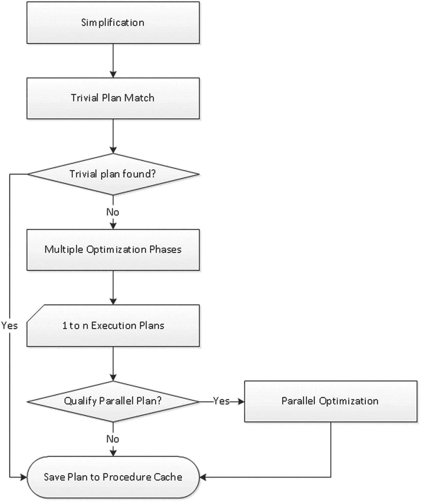
图 15-4
查询优化步骤

*   简化
*   简单计划匹配
*   多阶段优化
*   并行计划优化

#### 简化

在优化器开始处理你的查询之前，逻辑引擎已经识别了数据库中引用的所有对象。当优化器开始构建执行计划时，它首先确保所有被引用的对象都是实际使用的，并且是准确返回你数据所必需的。如果你编写了一个涉及三表连接的查询，但只有两个表实际被 `SELECT` 标准或 `WHERE` 子句引用，优化器可能会选择将另一个表排除在处理之外。这被称为 `简化` 步骤。它实际上是一组更大型处理的一部分，这些处理收集统计数据并开始估算查询中所涉及数据的基数。优化器还收集关于约束的必要信息，特别是外键约束，这将有助于它以后做出关于连接顺序的决策，它可以重新排列顺序以获得足够好的计划。此外，在简化过程中，子查询会被转换为连接。其他简化过程包括移除冗余连接。

#### 简单计划匹配

有时可能只有一种执行查询的方式。例如，没有索引的堆表只能通过一种方式访问：表扫描。为了避免优化此类查询的运行时开销，SQL Server 维护一个定义简单计划的模式列表。如果优化器找到匹配项，则会为查询生成一个类似的计划，而无需任何优化。生成的计划随后存储在过程缓存中。消除优化阶段意味着生成简单计划的成本非常低。这并不意味着简单计划是理想的或比更复杂的计划更可取。简单计划仅适用于极其简单的查询。一旦查询的复杂性上升，它必须经过优化。

### 多个优化阶段

对于一个复杂的查询，需要分析的替代处理策略数量可能很多，评估每个选项可能需要很长时间。因此，优化器会经历三个不同级别的优化。这些级别被称为搜索 0、搜索 1 和搜索 2。但更容易理解的方式是将它们视为`transaction`、`quick plan`和`full optimization`。根据查询的规模和复杂性，可能会逐一尝试这些不同的优化，或者优化器可能直接进行完全优化。每一种优化都会考虑使用不同的连接技术以及通过扫描、seek 和其他操作访问数据的不同方式。

索引变体考虑不同的索引方面，例如单列索引、复合索引、索引列顺序、列密度等。类似地，连接变体考虑 SQL Server 中可用的不同连接技术：`nested loop join`、`merge join`和`hash join`。（第 4 章将详细介绍这些连接技术。）诸如唯一值和外键约束等约束也是优化决策过程的一部分。

优化器会考虑`WHERE`、`JOIN`和`HAVING`子句中引用的列的统计信息，以评估索引和连接策略的有效性。基于当前的统计信息，它在多个优化阶段评估不同配置的成本。成本包括许多因素，包括但不限于执行查询所需的 CPU、内存和磁盘 I/O（包括随机与顺序 I/O 估算）的使用情况。在每个优化阶段之后，优化器会评估处理策略的成本。这个成本只是一个估算值，并非实际的行为测量或预测；它是一个基于所考虑的统计信息和流程的数学构造。

## 注意

成本估算仅仅就是估算。此外，一组估算值所代表的执行计划，在实际上可能比另一组估算值（即不同的执行计划）成本更高，也可能不会。比较计划之间的成本可能是一种危险的方法。

如果发现成本足够低，那么优化器就会停止在优化阶段的进一步迭代并退出优化过程。否则，它会持续迭代通过优化阶段，以确定一种经济高效的处理策略。

有时，一个查询可能非常复杂，以至于优化器需要大量地推进优化阶段。在优化查询时，如果发现处理策略的成本超过了并行度成本阈值，那么它会评估使用多个 CPU 处理查询的成本。否则，优化器将继续使用串行计划。你也可能会看到，在优化器选择了一个并行计划后，该计划的成本实际上可能低于并行度成本阈值，也低于串行计划的成本。

你可以通过两个来源了解在多个优化阶段中发生的一些细节。以这个查询为例：

```sql
SELECT soh.SalesOrderNumber,
sod.OrderQty,
sod.LineTotal,
sod.UnitPrice,
sod.UnitPriceDiscount,
p.Name AS ProductName,
p.ProductNumber,
ps.Name AS ProductSubCategoryName,
pc.Name AS ProductCategoryName
FROM Sales.SalesOrderHeader AS soh
JOIN Sales.SalesOrderDetail AS sod
ON soh.SalesOrderID = sod.SalesOrderID
JOIN Production.Product AS p
ON sod.ProductID = p.ProductID
JOIN Production.ProductModel AS pm
ON p.ProductModelID = pm.ProductModelID
JOIN Production.ProductSubcategory AS ps
ON p.ProductSubcategoryID = ps.ProductSubcategoryID
JOIN Production.ProductCategory AS pc
ON ps.ProductCategoryID = pc.ProductCategoryID
WHERE soh.CustomerID = 29658;
```

当运行此查询时，会返回如图 15-5 所示的执行计划，这无疑是一个复杂的计划。


图 15-5

复杂的执行计划

我意识到这个执行计划很难阅读。这里的目的不是要读懂这个计划。重要的是，它涉及相当多的表，每个表都有索引和统计信息，所有这些都必须被考虑到才能得出这个执行计划。你可以查找关于优化器在此执行计划上所做工作的第一个地方是第一个操作符的属性窗口，在本例中是执行计划最左侧的 T-SQL `SELECT`操作符。图 15-6 显示了该属性窗口。

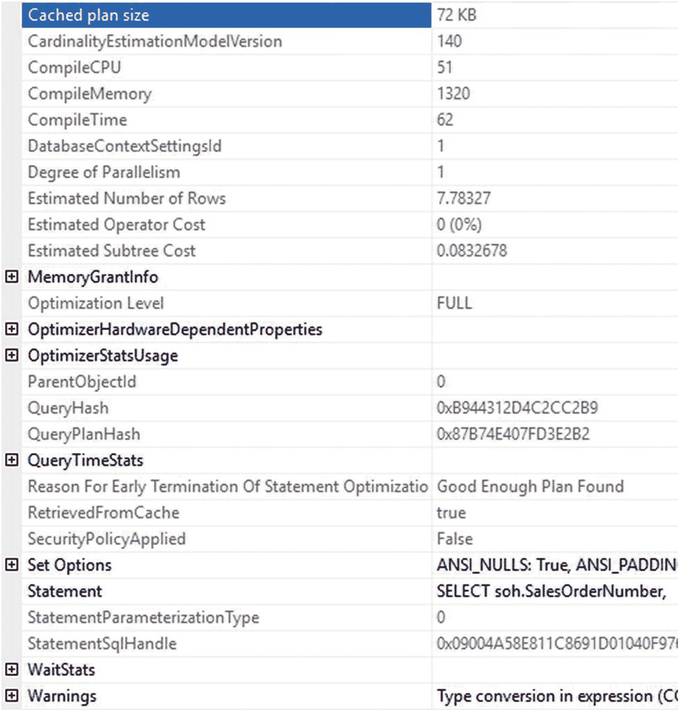

图 15-6

SELECT 操作符属性窗口

从顶部开始，你可以看到直接与创建和优化此执行计划相关的信息。

*   缓存的计划大小为 72KB
*   编译计划使用的 CPU 周期数为 51ms
*   使用的内存量为 1329KB
*   编译时间为 62ms

优化级别属性（在 XML 计划中为`StatementOptmLevel`）显示了优化器内部发生的处理类型。在本例中，`FULL`表示优化器进行了完全优化。这在“语句提前终止原因”属性中进一步显示为“找到足够好的计划”。因此，优化器花费了 62ms 来找到一个它认为在此情况下足够好的计划。你还可以看到执行计划的`QueryPlanHash`值，也称为`指纹`（关于此的更多详细信息，请参阅“查询计划哈希和查询哈希”部分）。`SELECT`（以及`INSERT`、`UPDATE`和`DELETE`）操作符的属性是评估任何执行计划时第一个重要的停靠点，正是因为这些信息。

在 SQL Server 2017 中新增的功能是，你还可以看到捕获的任何实际执行计划的`QueryTimeStats`和`WaitStats`。这可以作为一种捕获查询指标的有用方法。

优化器信息的第二个来源是动态管理视图`sys.dm_exec_query_optimizer_info`。这个 DMV 是随时间推移的优化事件的聚合。它不会显示给定查询的单独优化，但会跟踪已执行的优化。这对于调整个别查询并不那么直接方便，但如果你致力于降低一段时间内工作负载的成本，能够跟踪这些信息可以帮助你确定你的查询调整是否正在产生积极的差异，至少在优化时间方面如此。返回的一些数据仅供 SQL Server 内部使用。图 15-7 显示了以下查询返回结果中有用数据的截断示例：

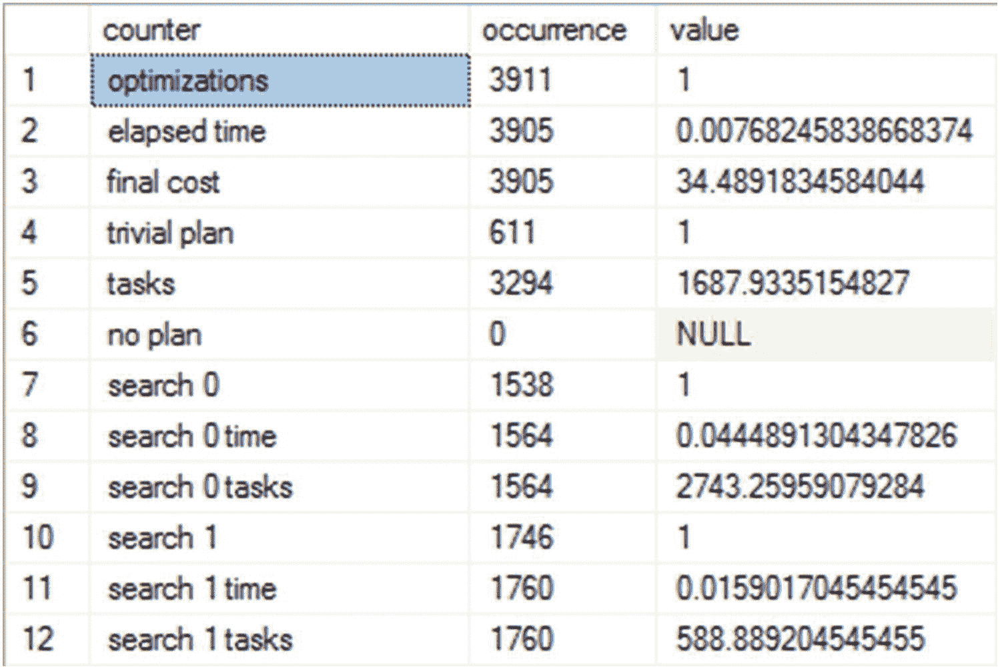

图 15-7

来自 sys.dm_exec_query_optimizer_info 的输出

```sql
SELECT deqoi.counter,
deqoi.occurrence,
deqoi.value
FROM sys.dm_exec_query_optimizer_info AS deqoi;
```

在另一个查询前后运行此查询可以显示已完成的优化数量和类型发生的变化。但是，如果你能在测试环境中隔离你的查询，你就可以更有把握地获得仅与你要测量的查询直接相关的前后差异。

# 并行计划优化

优化器在评估使用并行计划处理查询的成本时，会考虑多种因素。其中一些因素如下：
*   SQL Server 可用的 CPU 数量
*   SQL Server 版本
*   可用内存
*   并行成本阈值
*   正在执行的查询类型
*   给定流中要处理的行数
*   活动并发连接数

如果 SQL Server 仅有一个可用 CPU，那么优化器将不会考虑并行计划。SQL Server 可用的 CPU 数量可以通过 SQL Server 配置的 `关联性` 设置来限制。关联性值可以设置为特定的 CPU 或特定的 NUMA 节点。您也可以将其设置为范围。例如，要允许 SQL Server 在一个八路服务器上仅使用 `CPU0` 到 `CPU3`，请执行以下语句：
```
USE master;
EXEC sp_configure 'show advanced option','1';
RECONFIGURE;
ALTER SERVER CONFIGURATION SET PROCESS AFFINITY CPU = 0 TO 3;
GO
```
此配置立即生效。`关联性` 是一项特殊设置，我建议您仅在从 SQL Server 手中收回控制权有意义的情况下使用它，例如当您在同一台机器上运行多个 SQL Server 实例并且希望将它们彼此隔离时。

即使 SQL Server 有多个可用 CPU，如果单个查询不允许使用超过一个 CPU 来执行，那么优化器也会放弃并行计划选项。并行查询可以使用的最大 CPU 数量由 SQL Server 配置的 `最大并行度` 设置决定。默认值为 0，这允许所有 CPU（通过 `关联性掩码` 设置启用）用于并行查询。您也可以通过资源调控器来控制并行度。如果您希望允许并行查询在由前述 `关联性掩码` 设置限定的 `CPU0` 到 `CPU3` 中使用不超过两个 CPU，请执行以下语句：
```
USE master;
EXEC sp_configure 'show advanced option','1';
RECONFIGURE;
EXEC sp_configure 'max degree of parallelism',2;
RECONFIGURE;
```
此更改立即生效，无需任何重启。`最大并行度` 设置也可以在查询级别使用 `MAXDOP` 查询提示进行控制。
```
SELECT  *
FROM    dbo.t1
WHERE   C1 = 1
OPTION  (MAXDOP 2);
```
更改 `最大并行度` 设置最好根据您的应用程序及其上的工作负载需求来确定。我通常会将最大并行度保留为默认值，除非有迹象表明需要更改。然而，我通常会立即将并行成本阈值从其默认值 5 向上调整。但是，真正重要的是要理解，成本阈值是为服务器设置的。为服务器上的所有数据库挑选一个最优的单一值可能有些棘手。

由于并行查询需要更多内存，优化器在选择并行计划之前会确定可用内存量。所需内存量随着并行度的增加而增加。如果对于给定的并行度，并行计划的内存需求无法满足，那么 SQL Server 会自动降低并行度，或者在给定的工作负载上下文中完全放弃该查询的并行计划。您可以在图 15-6 的 `SELECT` 属性中看到这部分评估。

具有非常高 CPU 开销的查询是并行计划的最佳候选者。示例包括连接大表、执行大量聚合以及对大型结果集进行排序，这些都是报表系统（在 OLTP 系统中较少见）上的常见操作。对于事务处理应用程序中通常出现的简单查询，并行计划所需的额外协调（初始化、同步和终止）超过了潜在的性能优势。

查询是否简单是通过比较查询的估计执行成本与成本阈值来确定的。该成本阈值由 SQL Server 配置的 `并行成本阈值` 设置控制。默认情况下，此设置的值为 5，这意味着如果串行计划的估计执行成本（CPU 和 IO）超过 5，则优化器会考虑为该查询使用并行计划。例如，要将成本阈值修改为 35，请执行以下语句：
```
USE master;
EXEC sp_configure 'show advanced option','1';
RECONFIGURE;
EXEC sp_configure 'cost threshold for parallelism',35;
RECONFIGURE;
```
此更改立即生效，无需任何重启。如果 SQL Server 仅有一个可用 CPU，则忽略此设置。我发现当并行成本阈值设置得这么低时，OLTP 系统会受到影响。通常将该值增加到 30 到 50 之间会是有益的。对于分析查询，较低的值可能更好。请务必根据您的系统测试此建议，以确保它适合您。

另一种选择是简单地查看缓存中的计划，然后根据其中的查询及其所代表的工作负载类型进行估算，从而得出一个特定的数字。您可以将 OLTP 查询与报表查询分开，然后重点关注最可能从并行执行中受益的报表查询。取这些成本的平均值，并将您的成本阈值设置为该数字。

DML 操作查询（`INSERT`、`UPDATE` 和 `DELETE`）是串行执行的。但是，`INSERT` 语句的 `SELECT` 部分以及 `UPDATE` 或 `DELETE` 语句的 `WHERE` 子句可以并行执行。实际的数据更改是串行应用到数据库的。此外，如果优化器确定估计成本过低，则不会引入并行运算符。

请注意，即使在执行时，SQL Server 也会确定当前系统工作负载和配置信息是否允许并行查询执行。如果允许并行查询执行，SQL Server 会确定最佳线程数，并将查询的执行分布到这些线程上。当查询开始并行执行时，它将使用相同数量的线程直到完成。SQL Server 在下次执行并行查询之前会重新检查最佳线程数。

一旦通过使用串行计划或并行计划确定了处理策略，优化器就会生成查询的执行计划。执行计划包含优化器为执行查询而决定的详细处理策略。这包括诸如数据检索、结果集连接、结果集排序等步骤。关于如何分析执行计划中包含的处理步骤的详细说明在第 4 章中介绍。为查询生成的执行计划会保存在计划缓存中，以供将来重用。

综上所述，我们可以总结这个过程。优化器首先简化并规范化输入树。从那里开始，它生成与该简化树等效的可能逻辑树。然后优化器将逻辑树转换为可能的物理树，对它们进行成本评估，并选择成本最低的树。简而言之，这就是优化过程。


# 16. 执行计划缓存行为

## 执行计划缓存

查询优化器生成的执行计划被保存在 SQL Server 内存池的一个特殊区域，称为 `plan cache`。将计划保存在缓存中，使得 SQL Server 在重新提交相同查询时，能够避免再次运行整个查询优化过程。SQL Server 支持不同的技术，例如 `plan cache aging` 和 `plan cache types`，以提高缓存计划的可重用性。它还存储两个二进制值，分别称为 `query hash` 和 `query plan hash`。

## 注意

在本章中，我将讨论 SQL Server 为提高执行计划重用效果所支持的技术 15。

## 执行计划的组成部分

优化器生成的执行计划包含两个组件。

*   `Query plan`：这代表指定了执行查询所需的所有物理操作的命令。
*   `Execution context`：这在给定用户的上下文中维护查询的可变部分。

我将在接下来的章节中更详细地介绍这些组件。

### 查询计划

查询计划是一个可重入、只读的数据结构，其命令指定了执行查询所需的所有物理操作。可重入特性允许多个连接并发访问查询计划。物理操作包括指定要访问哪些表和索引、如何以及按何种顺序访问它们、要在多个表之间执行哪种类型的连接操作等。查询计划中不存储任何用户上下文。

### 执行上下文

执行上下文是另一个维护查询可变部分的数据结构。尽管服务器在过程缓存中跟踪执行计划，但这些计划是上下文无关的。因此，每个执行查询的用户都将拥有一个单独的执行上下文，其中保存着特定于其执行的数据，例如参数值和连接详细信息。

## 执行计划的老化

计划缓存是 SQL Server 缓冲区缓存的一部分，后者同时也保存着数据页。随着新的执行计划添加到计划缓存中，计划缓存的大小不断增长，这会影响内存中有用数据页的保留。为避免这种情况，SQL Server 动态控制计划缓存中执行计划的保留，保留频繁使用的执行计划，并丢弃在一定时间内未使用的计划。

SQL Server 通过给执行计划关联一个年龄字段来跟踪其重用频率。当执行计划生成时，年龄字段会被填充为生成该计划的成本。需要大量优化的复杂查询，其年龄字段值将高于较简单查询的值。

每隔一定时间，SQL Server 的 `lazy writer` 进程（负责管理 SQL Server 中的大多数后台进程）会检查计划缓存中所有执行计划的当前成本。如果一个执行计划长时间未被重用，那么其当前成本最终将降至 0。生成执行计划的成本越低，其成本降至 0 的速度就越快。一旦执行计划的成本达到 0，该计划就成为了从内存中移除的候选对象。当内存压力增加到没有足够空闲内存来满足新请求的程度时，SQL Server 会从计划缓存中移除所有成本为 0 的计划。但是，如果系统有足够的内存，并且有可用的空闲内存页来满足新请求，成本为 0 的执行计划可以在计划缓存中保留很长时间，以便日后需要时可以重用。

除了成本向下变化外，执行计划每次被重用时，其成本也可能增加到生成计划的最大成本（或者对于即席计划，增加到计划的当前成本）。例如，假设你有两个生成成本分别为 100 和 10 的执行计划。因此，它们的起始成本值将分别为 100 和 10。如果两个执行计划立即被重用，它们的年龄字段将被重置回最大成本。在这些成本值下，除非第二个计划被更频繁地重用，否则 `lazy writer` 会将第二个计划的成本降至 0 的时间比第一个计划早得多。因此，即使一个高成本计划比一个低成本计划重用频率低，由于初始成本的影响，高成本计划可以在非零成本值上保持更长时间。

## 总结

SQL Server 基于成本的查询优化器决定一个有效的执行计划，其依据不是查询的确切语法，而是通过评估使用不同处理策略执行查询的成本。使用不同处理策略的成本评估在多个优化阶段完成，以避免在优化查询上花费过多时间。然后，执行计划被缓存起来，以便在重新执行相同查询时节省执行计划生成的成本。

在下一章中，我将讨论这些计划如何根据其调用方式以不同方式从缓存中被重用。

## 执行计划缓存行为

一旦生成执行计划所需的所有处理都已完成，如果 SQL Server 在每次查询被调用时都丢弃已完成的工作并重新执行所有步骤，这种做法显然不合理。相反，它将创建的计划保存在服务器上一个称为 `plan cache` 的内存空间中。本章将逐步介绍如何监控计划缓存，以了解 SQL Server 如何重用执行计划。

在本章中，我将涵盖以下主题：

*   如何分析执行计划缓存
*   查询计划哈希和查询哈希作为识别需要优化查询的机制
*   提高执行计划缓存可重用性的方法
*   查询存储与计划缓存之间的交互


## 分析执行计划缓存

通过访问各种动态管理对象，你可以获取计划缓存中大量关于执行计划的信息。处理执行计划的初始动态管理对象是 `sys.dm_exec_cached_plans`。

```sql
SELECT decp.refcounts,
decp.usecounts,
decp.size_in_bytes,
decp.cacheobjtype,
decp.objtype,
decp.plan_handle
FROM sys.dm_exec_cached_plans AS decp;
```

**表 16-1** 显示了 `sys.dm_exec_cached_plans` 提供的一些有用信息。

**表 16-1** `sys.dm_exec_cached_plans`

| **列名** | **描述** |
| --- | --- |
| `refcounts` | 表示缓存中引用此计划的其他对象的数量。 |
| `usecounts` | 表示自该对象添加到缓存以来被使用的次数。 |
| `size_in_bytes` | 表示存储在缓存中的计划的大小。 |
| `cacheobjtype` | 指定此计划的类型；有几种，但特别值得关注的是这些：<br>• 已编译计划：一个完整的执行计划<br>• 已编译计划存根：用于即席查询的标记（你可以在本章的“即席工作负载”部分找到更多细节）<br>• 解析树：为访问视图而存储的计划 |
| `objtype` | 表示生成该计划的对象类型。同样有几种，但特别值得关注的是：<br>• Proc（存储过程）<br>• Prepared（预编译语句）<br>• Adhoc（即席查询）<br>• View（视图） |

单独使用动态管理视图 `sys.dm_exec_cached_plans` 只能让你获得一小部分信息。动态管理对象最好与其他动态管理对象和其他系统视图结合使用。

例如，结合使用动态管理函数 `sys.dm_exec_query_plan(plan_handle)` 和 `sys.dm_exec_cached_plans` 还将返回 XML 执行计划本身，这样你就可以显示它并进行操作。如果你再引入 `sys.dm_exec_sql_text(plan_handle)`，你还可以检索原始的查询文本。在你运行示例中的已知查询时，这可能看起来没什么用，但当你进入生产系统并开始从缓存中提取执行计划时，拥有原始查询可能会很方便。

要获取有关缓存计划的聚合性能指标，你可以使用 `sys.dm_exec_query_stats` 查看批处理的信息，使用 `sys.dm_exec_procedure_stats` 查看存储过程和内联函数的信息，以及使用 `sys.dm_exec_trigger_stats` 返回触发器的相同数据。除了其他数据片段，查询哈希和查询计划哈希也存储在这个动态管理函数中。最后，要找到当前正在执行的查询的执行计划，你可以使用 `sys.dm_exec_requests`。

在接下来的章节中，我将通过实际查询这些动态管理对象来探讨计划缓存的工作原理。

## 执行计划重用

当提交一个查询时，SQL Server 会检查计划缓存中是否有匹配的执行计划。如果没有找到，那么 SQL Server 会执行查询编译和优化以生成新的执行计划。然而，如果计划存在于计划缓存中，它将被重用，并使用私有的执行上下文。这节省了原本会花费在计划生成上的 CPU 周期。如果计划不在缓存中，但该计划在查询存储中被标记为强制执行，则优化会照常进行，但会使用强制计划，前提是它仍然是一个有效的计划。

查询通常带有筛选条件提交给 SQL Server，以限制结果集的大小。相同的查询经常使用不同的筛选条件值重新提交。例如，考虑以下查询：

```sql
SELECT soh.SalesOrderNumber,
soh.OrderDate,
sod.OrderQty,
sod.LineTotal
FROM Sales.SalesOrderHeader AS soh
JOIN Sales.SalesOrderDetail AS sod
ON soh.SalesOrderID = sod.SalesOrderID
WHERE soh.CustomerID = 29690
AND sod.ProductID = 711;
```

当这个查询被提交时，优化器会创建一个执行计划并将其保存在计划缓存中以供将来重用。如果这个查询使用不同的筛选条件值重新提交——例如，`soh.CustomerID = 29500`——重用先前提供的筛选条件值所创建的执行计划将是有益的（除非这是一个不良的参数探测场景）。为一个筛选条件值创建的执行计划是否可以重用于另一个筛选条件值，取决于查询提交给 SQL Server 的方式。

提交给 SQL Server 的查询（或工作负载）可以大致分为两类，这两类决定了当查询的可变部分的值发生变化时，执行计划是否可重用。

*   即席查询
*   预编译语句

### 提示

要测试本章中 `sys.dm_exec_cached_plans` 的输出，有时需要通过执行 `DBCC FREEPROCCACHE` 来清除缓存中的计划。除非你使用此处概述的方法传递计划句柄，否则不要在生产服务器上运行此命令。否则，你将刷新缓存，并且需要在执行时重建所有执行计划，这会给你的生产系统带来不必要的严重压力。

你可以使用 `DBCC FREEPROCCACHE(plan_handle)` 来针对特定计划。使用我已经讨论过并在后面演示的动态管理对象来检索 `plan_handle`。

你还可以使用 `ALTER DATABASE SCOPED CONFIGURATION CLEAR PROCEDURE CACHE` 来清除单个数据库的缓存。然而，同样地，除非你打算清除该数据库的所有计划，否则我不建议在生产服务器上运行此命令。

## 即席工作负载

查询可以在没有显式地将变量与查询本身分离的情况下提交给 SQL Server。这些没有显式地将查询的可变部分转换为参数而执行的查询被称为 `即席工作负载`（或查询）。到目前为止，本书中的大多数示例都是即席查询，如前面的列表所示。

如果查询按原样提交，没有显式地将任何一个硬编码值转换为参数（可以在执行时提供给查询），那么该查询就是即席查询。使用 `DECLARE` 语句将值设置为局部变量与参数不同。

在这个查询中，筛选条件值嵌入在查询本身中，没有显式地参数化以将其与查询隔离。这意味着你无法重用此查询的执行计划，除非你使用相同的值，并且所有的空格和回车符都完全相同。

然而，查询中使用值的地方可以通过三种不同的方式进行显式参数化，这些方式共同归类为预编译工作负载。


## 预准备的工作负载

`预准备的工作负载`（或 `查询`）显式地参数化了查询的可变部分，因此查询计划不会绑定到可变部分的值。在 SQL Server 中，可以使用以下三种方法提交预准备的工作负载：

-   `存储过程`：允许保存一组可以接受和返回用户提供参数的 SQL 语句。
-   `sp_executesql`：允许执行可能包含用户提供参数的 SQL 语句或 SQL 批处理，而无需保存该 SQL 语句或批处理。
-   `准备/执行模型`：允许 SQL 客户端请求生成查询计划，该计划可以在后续使用不同参数值执行查询时重复使用，而无需在 SQL Server 中保存 SQL 语句。这是像 Entity Framework 这样的 ORM 工具最常见的做法。

例如，前面显示的 `SELECT` 语句可以使用存储过程进行显式参数化，如下所示：

```
CREATE OR ALTER PROC dbo.BasicSalesInfo
@ProductID INT,
@CustomerID INT
AS
SELECT soh.SalesOrderNumber,
soh.OrderDate,
sod.OrderQty,
sod.LineTotal
FROM Sales.SalesOrderHeader AS soh
JOIN Sales.SalesOrderDetail AS sod
ON soh.SalesOrderID = sod.SalesOrderID
WHERE soh.CustomerID = @CustomerID
AND sod.ProductID = @ProductID;
```

存储过程内包含的 `SELECT` 语句的计划将嵌入参数 (`@ProductID` 和 `@Customerld`)，而不是可变值。我很快会更详细地介绍这些方法。

## 即席工作负载的计划可重用性

当查询作为即席工作负载提交时，SQL Server 会生成一个执行计划并将该计划存储在缓存中，如果相同的即席查询被重新提交，则可以重用该计划。由于没有参数，硬编码的值作为计划的一部分存储。为了从缓存中重用计划，T-SQL 必须完全匹配。这包括所有空格、回车符以及随计划提供的任何值。如果其中任何一项发生变化，计划就无法被重用。

为了理解这一点，考虑之前使用过的即席查询，如下所示：

```
SELECT  soh.SalesOrderNumber,
soh.OrderDate,
sod.OrderQty,
sod.LineTotal
FROM    Sales.SalesOrderHeader AS soh
JOIN    Sales.SalesOrderDetail AS sod
ON soh.SalesOrderID = sod.SalesOrderID
WHERE   soh.CustomerID = 29690
AND sod.ProductID = 711;
```

为此即席查询生成的执行计划基于查询的确切文本，其中包括注释、大小写、尾随空格和硬回车。你必须使用确切的文本才能从 `sys.dm_exec_cached_plans` 中提取信息。

```
SELECT    c.usecounts
,c.cacheobjtype
,c.objtype
FROM       sys.dm_exec_cached_plans c
CROSS APPLY sys.dm_exec_sql_text(c.plan_handle) t
WHERE      t.text =  'SELECT  soh.SalesOrderNumber,
soh.OrderDate,
sod.OrderQty,
sod.LineTotal
FROM    Sales.SalesOrderHeader AS soh
JOIN    Sales.SalesOrderDetail AS sod
ON soh.SalesOrderID = sod.SalesOrderID
WHERE   soh.CustomerID = 29690
AND sod.ProductID = 711;';
```

图 16-1 显示了 `sys.dm_exec_cached_plans` 的输出。


图 16-1 sys.dm_exec_cached_plans 输出

从图 16-1 可以看到，为前面的即席查询生成并保存了一个编译计划。为了找到特定查询，我在 `WHERE` 子句中使用了查询本身。可以看到，到目前为止，这个计划已被使用过一次 (`usecounts = 1`)。如果重新执行此即席查询，SQL Server 会从计划缓存中重用现有的可执行计划，如图 16-2 所示。


图 16-2 从计划缓存中重用可执行计划

在图 16-2 中，你可以看到前面查询的可执行计划的 `usecounts` 值已增加到 2，这证实了该查询的现有计划已被重用。如果重复执行此查询，将每次都重用现有计划。

由于为前面查询生成的计划包含了筛选条件值，因此该计划的可重用性仅限于使用相同的筛选条件值。重新执行查询，但将 `son.CustomerlD` 改为 `29500`。

```
SELECT soh.SalesOrderNumber,
soh.OrderDate,
sod.OrderQty,
sod.LineTotal
FROM Sales.SalesOrderHeader AS soh
JOIN Sales.SalesOrderDetail AS sod
ON soh.SalesOrderID = sod.SalesOrderID
WHERE soh.CustomerID = 29500
AND sod.ProductID = 711;
```

无法重用现有计划，并且如果按原样重新运行 `sys.dm_exec_cached_plans`，你会看到执行计数没有增加（图 16-3）。


图 16-3 sys.dm_exec_cached_plans 显示现有计划未被重用

相反，我将调整对 `sys.dm_exec_cached_plans` 的查询。

```
SELECT  c.usecounts,
c.cacheobjtype,
c.objtype,
t.text,
c.plan_handle
FROM    sys.dm_exec_cached_plans c
CROSS APPLY sys.dm_exec_sql_text(c.plan_handle) t
WHERE   t.text LIKE 'SELECT  soh.SalesOrderNumber,
soh.OrderDate,
sod.OrderQty,
sod.LineTotal
FROM    Sales.SalesOrderHeader AS soh
JOIN    Sales.SalesOrderDetail AS sod
ON soh.SalesOrderID = sod.SalesOrderID%';
```

你可以在图 16-4 中看到此查询的输出。

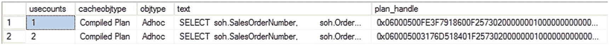

图 16-4 sys.dm_exec_cached_plans 显示现有计划无法重用

从图 16-4 的 `sys.dm_exec_cached_plans` 输出中，你可以看到该查询的先前计划未被重用；相应的 `usecounts` 值保持在旧值 2。计划没有重用现有计划，而是为查询生成了一个新计划，并以新的 `plan_handle` 保存在计划缓存中。如果使用不同的筛选条件值重复执行此即席查询，则每次都会生成一个新的执行计划。这种对即席查询执行计划的低效重用，通过消耗额外的 CPU 周期来重新生成计划，增加了 CPU 的负载。

总而言之，即席计划缓存使用语句级缓存，并且仅限于精确的文本匹配。如果即席查询不复杂，SQL Server 可以通过一个称为 `简单参数化` 的功能隐式地参数化查询以增加计划可重用性。简单参数化的查询定义仅限于相当基本的情况，例如只涉及一个表的即席查询。如前面的示例所示，大多数需要连接操作的查询无法自动参数化。

## 针对即席工作负载进行优化

如果您的服务器主要支持即席查询，则可以实现一定程度的性能提升。其中一项服务器选项称为 `optimize for ad hoc workloads`（针对即席工作负载进行优化）。在服务器上启用此选项会改变引擎处理即席查询的方式。首次调用查询时，系统不会保存完整的已编译计划，而是存储一个已编译计划存根。该存根没有关联完整的执行计划，从而节省了为其分配的存储空间以及保存到缓存的时间。此选项的启用无需重启服务器。

```
EXEC sp_configure 'show advanced option', '1';
GO
RECONFIGURE
GO
EXEC sp_configure 'optimize for ad hoc workloads', 1;
GO
RECONFIGURE;
```

更改选项后，请清空缓存，然后重新运行即席查询。修改针对 `sys.dm_exec_cached_plans` 的查询，使其包含 `size_in_bytes` 列；然后运行它以查看图 16-5 中的结果。


*图 16-5：显示已编译计划存根的 sys.dm_exec_cached_plans*

图 16-5 中的 `cacheobjtype` 列显示，缓存中的新对象是一个已编译计划存根。与完整的已编译计划相比，系统可以为更多查询创建存根，且对服务器的影响更小。但是，下一次执行即席查询时，将会创建一个完全编译的计划。要查看这一过程，请再次运行查询并检查 `sys.dm_exec_cached_plans` 中的结果，如图 16-6 所示。


*图 16-6：已编译计划存根已变为已编译计划*

检查 `cacheobjtype` 的值。它已从 "Compiled Plan Stub"（已编译计划存根）变为 "Compiled Plan"（已编译计划）。最后，要查看存根和完整计划之间的实际差异，请对比图 16-5 和图 16-6 中的 `sizeinbytes` 列。大小从存根中的 424 字节变为完整计划中的 73728 字节。这精确地展示了在处理大量即席查询时可节省的资源。在继续之前，请务必禁用 `optimize for ad hoc workloads`。

```
EXEC sp_configure 'optimize for ad hoc workloads', 0;
GO
RECONFIGURE;
GO
EXEC sp_configure 'show advanced option', '0';
GO
RECONFIGURE;
```

就个人而言，我认为在几乎所有系统上实施此选项都几乎没有什么缺点。与所有建议一样，您应该进行测试，以确保您的系统没有例外情况。然而，与因不存储那些可能只使用一次的计划而带来的整体内存节省相比，在第二次调用时将计划写入内存的成本是微不足道的。在我所有的测试和经验中，这是一个纯粹的优势，几乎没有缺点。您现在还可以使用数据库作用域配置设置在 Azure SQL Database 中启用此功能：

```
ALTER DATABASE SCOPED CONFIGURATION SET OPTIMIZE_FOR_AD_HOC_WORKLOADS = ON;
```

## 简单参数化

提交即席查询时，SQL Server 会分析查询以确定传入文本的哪些部分可能是参数。它会查看即席查询的可变部分，以确定自动将它们参数化是否安全，并在查询中使用参数（而不是可变部分），从而使查询计划能够独立于变量值。这种将查询的可变部分自动转换为参数的功能，即使没有显式参数化（使用预处理工作负载技术），也称为*简单参数化*。

在简单参数化过程中，SQL Server 会确保如果即席查询被转换为参数化模板，参数值的变化不会广泛改变计划需求。在确定简单参数化安全后，SQL Server 会为即席查询创建一个参数化模板，并将参数化计划保存在计划缓存中。

要理解 SQL Server 的简单参数化功能，请考虑以下查询：

```
SELECT *
FROM Person.Address AS a
WHERE a.AddressID = 42;
```

当此即席查询提交时，SQL Server 可以照原样处理此查询以创建计划。但是，在执行查询之前，SQL Server 会尝试确定是否可以安全地对其进行参数化。在确定查询的可变部分可以在不影响查询基本结构的情况下进行参数化后，SQL Server 会对查询进行参数化，并为参数化查询生成计划。您可以从图 16-7 所示的 `sys.dm_exec_cached_plans` 输出中观察到这一点。


*图 16-7：sys.dm_exec_cached_plans 输出显示自动参数化计划*

参数化查询的可执行计划的 `usecounts`（使用计数）恰当地将重用次数显示为 1。另外请注意，自动参数化可执行计划的 `objtype`（对象类型）不再是 `Adhoc`（即席）；它反映了该计划是用于参数化查询的，因此为 `Prepared`（已准备）。

原始的即席查询，即使未被执行，也会被编译以创建简单参数化所需的查询树。该即席查询的已编译计划将保存在计划缓存中。但在为即席查询创建可执行计划之前，SQL Server 已确定自动参数化是安全的，因此自动对该查询进行了参数化以进行进一步处理。

参数值基于即席查询的值。让我们编辑上一个查询，使用不同的 `AddressID` 值。

```
SELECT *
FROM Person.Address AS a
WHERE a.AddressID = 42000;
```

如果我们再次查询 `sys.dm_exec_cached_plans`，会看到添加了一个额外的计划，如图 16-8 所示。


*图 16-8：通过简单参数化添加的计划*

如图 16-8 所示，已创建了一个数据类型为 `int` 的新参数化计划。您还可以看到 `smallint` 和 `bigint` 的计划。这确实给缓存增加了一些开销，但远不及因各种不同值而必须添加的大量额外计划所带来的开销。以下是来自简单参数化的完整查询文本：

```
(@1 int)SELECT * FROM [Person].[Address] [a] WHERE [a].[AddressID]=@1
```

由于此即席查询已被自动参数化，如果您使用可变部分的不同值重新执行该查询，SQL Server 将重用现有的执行计划。

```
SELECT *
FROM Person.Address AS a
WHERE a.AddressID = 52;
```

图 16-9 显示了 `sys.dm_exec_cached_plans` 的输出。


图 16-9

`sys.dm_exec_cached_plans` 输出，显示自动参数化计划的重用

从图 16-9 可以看出，尽管为这个即席查询生成了一个新计划（即使用 `AddressID` 值为 52 的那个即席查询），但已有的预编译计划被重用了，这由相应的 `usecounts` 值增加到 2 所表明。即席查询可以使用不同的筛选条件值反复执行，重用现有的执行计划——所有这些都尽管两个查询的原始文本并不匹配。因为它们的参数化查询将是相同的，所以被重用了。

对于缓存了执行计划的参数化查询，还有另一个方面需要注意。在图 16-7 中，观察到参数化查询的主体与提交的即席查询并不完全匹配。例如，在即席查询中，任何对象上都没有方括号。

SQL Server 在意识到即席查询可以安全地自动参数化时，会选取一个模板来替代查询的确切文本。

要理解这一点的重要性，请考虑以下查询：

```
SELECT  a.*
FROM    Person.Address AS a
WHERE   a.AddressID BETWEEN 40 AND 60;
```

图 16-10 显示了 `sys.dm_exec_cached_plans` 的输出。


图 16-10

`sys.dm_exec_cached_plans` 输出，显示使用模板的简单参数化计划

从图 16-10 可以看出，SQL Server 对查询进行了简化处理，并用一对 `>=` 和 `<=` 操作符（它们等效于 `BETWEEN` 操作符）进行了替换。然后参数化步骤再次修改了查询。这意味着，如果提交的是使用一对 `>=` 和 `<=` 的类似查询，而不是前面使用 `BETWEEN` 子句的即席查询，SQL Server 也能够重用现有的执行计划。为了确认此行为，让我们修改即席查询如下：

```
SELECT  a.*
FROM    Person.Address AS a
WHERE   a.AddressID >= 40
AND a.AddressID <= 60;
```

图 16-11 显示了 `sys.dm_exec_cached_plans` 的输出。


图 16-11

`sys.dm_exec_cached_plans` 输出，显示自动参数化计划的重用

从图 16-11 可以看出，现有的计划被重用了，即使该查询在语法上与之前执行的查询不同。SQL Server 生成的自动参数化计划不仅允许在使用不同变量值重新提交查询时重用现有计划，也适用于具有相同模板形式的查询。

#### 简单参数化的限制

SQL Server 在简单参数化过程中非常保守，因为一个糟糕计划的成本可能远远超过生成新计划的成本。这种保守方法可以防止 SQL Server 创建不安全的自动参数化计划。因此，简单参数化仅限于相当简单的情况，例如仅涉及单个表的即席查询。涉及两个（或更多）表之间连接操作的即席查询（如“即席工作负载的计划可重用性”小节开头所示）不被认为是适合简单参数化的安全场景。

在可扩展的系统中，不要依赖简单参数化来实现计划可重用性。SQL Server 的简单参数化功能只是对哪些变量和常量可以参数化进行有根据的猜测。你不应依赖 SQL Server 进行简单参数化，而应在构建应用程序时以编程方式明确指定参数化。


#### 强制参数化

如果您正在处理的系统主要由即席查询构成，您可能需要尝试增加可接受参数化的查询数量。您可以修改数据库，尝试在特定限制下强制所有查询都像简单参数化那样被参数化。
为此，您需要使用 `ALTER DATABASE` 将数据库选项 `PARAMETERIZATION` 更改为 `FORCED`，如下所示：

```sql
ALTER DATABASE AdventureWorks2017 SET PARAMETERIZATION FORCED;
```

但是，如果您的查询有任何复杂之处，您将不会获得简单参数化。

```sql
SELECT ea.EmailAddress,
       e.BirthDate,
       a.City
FROM   Person.Person AS p
JOIN   HumanResources.Employee AS e
       ON p.BusinessEntityID = e.BusinessEntityID
JOIN   Person.BusinessEntityAddress AS bea
       ON e.BusinessEntityID = bea.BusinessEntityID
JOIN   Person.Address AS a
       ON bea.AddressID = a.AddressID
JOIN   Person.StateProvince AS sp
       ON a.StateProvinceID = sp.StateProvinceID
JOIN   Person.EmailAddress AS ea
       ON p.BusinessEntityID = ea.BusinessEntityID
WHERE  ea.EmailAddress LIKE 'david%'
       AND sp.StateProvinceCode = 'WA';
```

当您运行此查询时，如您在图 16-12 中所见，简单参数化并未被应用。


图 16-12
更复杂的查询不会被参数化

在 `sys.dm_exec_cached_plans` 的输出中看不到预定义计划。但如果我们使用之前的脚本将 `PARAMETERIZATION` 设置为 `FORCED`，则可以在清除缓存后重新运行查询。

```sql
ALTER DATABASE SCOPED CONFIGURATION CLEAR PROCEDURE_CACHE;
```

`sys.dm_exec_cached_plans` 的输出发生变化，使得输出看起来不同，如图 16-13 所示。

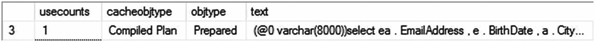

图 16-13
强制参数化改变了计划

现在在第三行可以看到一个预定义计划。但是，只提供了一个参数 `@0 varchar(8000)`。如果您从 `sys.dm_exec_querytext` 获取预定义计划的全文并进行格式化，它看起来像这样：

```sql
(@0 varchar(8000))
SELECT  ea.EmailAddress,
        e.BirthDate,
        a.City
FROM    Person.Person AS p
JOIN    HumanResources.Employee AS e
        ON p.BusinessEntityID = e.BusinessEntityID
JOIN    Person.BusinessEntityAddress AS bea
        ON e.BusinessEntityID = bea.BusinessEntityID
JOIN    Person.Address AS a
        ON bea.AddressID = a.AddressID
JOIN    Person.StateProvince AS sp
        ON a.StateProvinceID = sp.StateProvinceID
JOIN    Person.EmailAddress AS ea
        ON p.BusinessEntityID = ea.BusinessEntityID
WHERE   ea.EmailAddress LIKE 'david%'
        AND sp.StateProvinceCode = @0
```

由于其限制，强制参数化无法为字符串 `'david%'` 替换任何内容，但能够为字符串 `'WA'` 替换。值得注意的是，该变量被声明为完整的 8,000 长度的 `VARCHAR`，而不是 `Person.StateProvince` 表中实际列的三字符 `NCHAR`。即使这里的参数值可能与数据库中的实际列值不同，这也不会导致索引使用的丢失。字符串长度的隐式数据转换，例如从 `VARCHAR(8000)` 到 `VARCHAR(8)`，不会引起问题。

在开始使用强制参数化之前，以下限制列表可能会提供信息，帮助您决定强制参数化是否适用于您的数据库。（这是部分列表；完整列表请查阅在线手册。）

*   `INSERT ... EXECUTE` 查询
*   存储过程、触发器和用户定义函数内部的语句，因为它们已经有执行计划
*   客户端预定义语句（本章后面会有更详细的介绍）
*   使用查询提示 `RECOMPILE` 的查询
*   在 `LIKE` 语句中使用的模式和转义子句参数（如前所示）

这使您了解强制参数化所受到的限制类型。只有当您因为即席查询而遭受大量编译和重编译时，强制参数化才可能带来潜在帮助。任何其他负载都不会从使用强制参数化中受益。

在继续之前，请将数据库更改回 `SIMPLE PARAMETERIZATION`。

```sql
ALTER DATABASE AdventureWorks2017 SET PARAMETERIZATION SIMPLE;
```

关于参数化，另一个值得一提的主题是 Azure SQL Database 如何处理此问题。如果一个查询被定期重新编译但总是获得相同的执行计划，您可能会在 Azure 中看到一个调优建议，建议您开启 `FORCED PARAMETERIZATION`。这是我将在第 25 章详细介绍的自动调优建议的一个方面。

## 预定义工作负载的计划可重用性

将查询定义为预定义工作负载允许显式地参数化查询的可变部分。这使得 SQL Server 能够生成一个不绑定于查询可变部分的查询计划，并将可变部分保留在执行上下文中单独存放。如您在上一节所见，SQL Server 支持三种技术来提交预定义工作负载。

*   存储过程
*   `sp_executesql
*   预定义/执行模型

在接下来的章节中，我将更深入地介绍这些技术中的每一种，并指出参数化执行计划可能在何处引发问题。


## 存储过程

使用存储过程是提高计划缓存有效性的标准技术。当存储过程在执行时编译（这与本机编译过程不同，后者将在第 24 章中介绍），会为存储过程中的每个 SQL 语句生成一个执行计划。为存储过程生成的执行计划可以在使用不同参数值重新执行该存储过程时重复使用。

除了检查 `sys.dm_exec_cached_plans`，您还可以使用扩展事件工具跟踪存储过程的执行计划缓存。扩展事件提供了表 16-2 中列出的事件来跟踪存储过程的计划缓存。

**表 16-2**
用于分析存储过程计划缓存的事件类

| 事件 | 描述 |
| --- | --- |
| `sp_cache_hit` | 在缓存中找到该计划。 |
| `sp_cache_miss` | 未在缓存中找到该计划。 |
| `sp_cache_insert` | 当计划添加到缓存时触发该事件。 |
| `sp_cache_remove` | 当计划从缓存中移除时触发该事件。 |

要使用跟踪事件跟踪存储过程计划缓存，您可以结合使用这些事件与其他存储过程事件。为了理解存储过程如何改善计划缓存，我们重新检查之前创建的名为 `BasicSalesInfo` 的过程。为清晰起见，该过程重复如下：

```sql
CREATE OR ALTER PROC dbo.BasicSalesInfo
@ProductID INT,
@CustomerID INT
AS
SELECT soh.SalesOrderNumber,
soh.OrderDate,
sod.OrderQty,
sod.LineTotal
FROM Sales.SalesOrderHeader AS soh
JOIN Sales.SalesOrderDetail AS sod
ON soh.SalesOrderID = sod.SalesOrderID
WHERE soh.CustomerID = @CustomerID
AND sod.ProductID = @ProductID;
```

要获取 `soh.CustomerId = 29690` 和 `sod.ProductId=711` 的结果集，您可以像这样执行存储过程：

```sql
EXEC dbo.BasicSalesInfo @CustomerID = 29690, @ProductID = 711;
```

图 16-14 显示了 `sys.dm_exec_cached_plans` 的输出。

图 16-14
显示存储过程计划缓存的 `sys.dm_exec_cached_plans` 输出

从图 16-14 中，您可以看到为存储过程生成并缓存了一个类型为 `Proc` 的已编译计划。由于存储过程只执行了一次，可执行计划的 `usecounts` 值为 1。

图 16-15 显示了此存储过程执行的扩展事件输出。

图 16-15
显示存储过程计划不易在缓存中找到的扩展事件输出

从扩展事件输出中，您可以看到存储过程的计划未在缓存中找到。当存储过程第一次执行时，SQL Server 在计划缓存中查找，未能找到过程 `BasicSalesInfo` 的任何缓存条目，从而引发 `sp_cache_miss` 事件。由于未找到缓存计划，SQL Server 安排编译存储过程。随后，SQL Server 生成并保存计划，然后继续执行存储过程。您可以在 `sp_cache_insert` 事件中看到这一点。

如果重新执行此存储过程以获取 `@ProductId = 777` 的结果集，则将重用现有计划，如图 16-16 中 `sys.dm_exec_cached_plans` 输出所示。

图 16-16
显示存储过程计划重用的 `sys.dm_exec_cached_plans` 输出

```sql
EXEC dbo.BasicSalesInfo @CustomerID = 29690, @ProductID = 777;
```

您也可以从扩展事件输出中确认执行计划的重用，如图 16-17 所示。

图 16-17
显示存储过程计划重用的探查器跟踪输出

从扩展事件输出中，您可以看到在计划缓存中找到了现有计划。在搜索缓存时，SQL Server 找到了存储过程 `BasicSalesInfo` 的可执行计划，从而引发 `sp_cache_hit` 事件。一旦找到现有的执行计划，SQL 就会重用该计划来执行存储过程。一个值得注意的有趣现象是，在 `sp_cache_hit` 事件之前有一个 `sp_cache_miss` 事件，这是针对调用该过程的 SQL 批处理发生的。由于参数值发生了变化，该语句未在缓存中找到，但过程的执行计划找到了。这个看似“额外”的缓存未命中事件可能会引起混淆。

存储过程的其他这些方面也值得考虑：

*   存储过程在首次执行时编译。
*   存储过程具有其他性能优势，例如减少网络流量。
*   存储过程具有额外优势，例如数据的隔离性。

### 存储过程在首次执行时编译

存储过程的执行计划是在它第一次执行时生成的。当创建存储过程时，它只被解析并保存在数据库中。在创建存储过程期间不执行规范化和优化过程。这允许在创建存储过程所访问的所有对象之前创建该存储过程。例如，即使存储过程中引用的表 `NotHere` 不存在，您也可以创建以下存储过程：

```sql
CREATE OR ALTER PROCEDURE dbo.MyNewProc
AS
SELECT MyID
FROM dbo.NotHere; --表 dbo.NotHere 不存在
```

存储过程将成功创建，因为在存储过程创建期间不会执行将引用的对象绑定到查询树（在存储过程执行期间由命令解析器生成）的规范化过程。如果到那时表 `NotHere` 尚未创建，存储过程将在首次执行时报告错误，因为存储过程是在第一次执行时编译的。

##### 存储过程的其他性能优势

除了通过执行计划可重用性来提升性能外，存储过程还提供以下性能优势：

*   *业务逻辑靠近数据*：那些需要对存储在数据库中的数据执行大量操作的业务逻辑部分，应置于存储过程中，因为 SQL Server 引擎在处理关系和集合理论操作方面极其强大。

*   *减少网络流量*：数据库应用程序只需通过网络发送存储过程的名称和参数值。只有处理后的结果集才会返回给应用程序。中间数据不需要在应用程序和数据库之间来回传递。

*   *应用程序与数据结构变更隔离*：如果所有关键的数据访问都通过存储过程进行，那么当数据库模式发生变化时，可以重新创建存储过程，而不会影响通过这些存储过程访问数据的应用程序代码。事实上，访问数据库的应用程序甚至无需停止。

*   *存在单一管理点*：所有在存储过程中实现的业务逻辑都作为数据库的一部分进行维护，并可在数据库本身进行集中管理。当然，这个优势具有高度相对性，取决于你问的是谁。要获取不同意见，请问问非 DBA 人员！

*   *可以提高安全性*：可以限制用户对数据库表的权限，并且只允许通过存储过程中实现的标准业务逻辑进行访问。例如，如果你希望限制用户 `UserOne` 从表 `RestrictedAccess` 中物理删除行，而只允许通过存储过程 `MarkDeleted` 将行状态设置为 `'Deleted'` 来进行逻辑删除，那么你可以执行如下 `DENY` 和 `GRANT` 命令：

```sql
DROP TABLE IF EXISTS dbo.RestrictedAccess;
GO
CREATE TABLE dbo.RestrictedAccess (ID INT,
Status VARCHAR(7));
INSERT INTO dbo.RestrictedAccess
VALUES (1, 'New');
GO
IF (SELECT OBJECT_ID('dbo.MarkDeleted')) IS NOT NULL
DROP PROCEDURE dbo.MarkDeleted;
GO
CREATE PROCEDURE dbo.MarkDeleted @ID INT
AS
UPDATE dbo.RestrictedAccess
SET Status = 'Deleted'
WHERE ID = @ID;
GO
--Prevent user u1 from deleting rows
DENY DELETE ON dbo.RestrictedAccess TO  UserOne;
--Allow user u1 to mark a row as 'deleted'
GRANT EXECUTE ON dbo.MarkDeleted TO UserOne;
```

这假设了用户 `UserOne` 的存在。请注意，如果存储过程 `MarkDeleted` 中的查询是如下动态构建为字符串（`@sql`），那么授予存储过程的权限将不会授予该查询任何权限，因为动态查询不被视为存储过程的一部分：

```sql
CREATE OR ALTER PROCEDURE dbo.MarkDeleted @ID INT
AS
DECLARE @SQL NVARCHAR(MAX);
SET @SQL = 'UPDATE  dbo.RestrictedAccess
SET     Status = "Deleted"
WHERE   ID = ' + @ID;
EXEC sys.sp_executesql @SQL;
GO
GRANT EXECUTE ON dbo.MarkDeleted TO UserOne;
```

因此，用户 `UserOne` 将无法使用存储过程 `MarkDeleted` 将行标记为 `'Deleted'`。（我将在下一章介绍在存储过程中使用动态查询的各个方面。）但是，如果该用户拥有授予该执行权限的显式权限或角色成员身份，这种方法就行不通了。

由于存储过程是作为数据库对象保存的，它们给数据库管理增加了部署和管理开销。很多时候，你可能只需要从应用程序执行一个或几个查询。如果这些单例查询频繁执行，你应该致力于重用它们的执行计划以提高性能。但是为这些单独的单例查询创建存储过程，会向数据库添加大量的存储过程，从而显著增加数据库管理开销。为避免使用存储过程带来的维护开销，同时又能获得计划重用的好处，请使用系统存储过程 `sp_executesql` 以预处理工作负载的形式提交这些单例查询。

## `sp_executesql`

`sp_executesql` 是一个系统存储过程，它提供了一种将一个或多个查询作为预编译工作负载提交的机制。它允许查询的可变部分被显式参数化，因此可以提供与存储过程一样有效的执行计划重用性。来自 `BasicSalesInfo` 的 `SELECT` 语句可以通过 `sp_executesql` 提交，如下所示：

```sql
DECLARE @query NVARCHAR(MAX),
@paramlist NVARCHAR(MAX);
SET @query
= N'SELECT soh.SalesOrderNumber,
soh.OrderDate,
sod.OrderQty,
sod.LineTotal
FROM Sales.SalesOrderHeader AS soh
JOIN Sales.SalesOrderDetail AS sod
ON soh.SalesOrderID = sod.SalesOrderID
WHERE soh.CustomerID = @CustomerID
AND sod.ProductID = @ProductID';
SET @paramlist = N'@CustomerID INT, @ProductID INT';
EXEC sp_executesql @query,
@paramlist,
@CustomerID = 29690,
@ProductID = 711;
```

注意传递给 `sp_executesql` 存储过程的字符串被声明为 `NVARCHAR`，并且它们是以 `N` 为前缀构建的。这是必需的，因为 `sp_executesql` 使用 Unicode 字符串作为输入参数。

接下来显示了 `sys.dm_exec_cached_plans` 的输出（参见图 16-18）：


图 16-18
显示使用 `sp_executesql` 生成的参数化计划的 `sys.dm_exec_cached_plans` 输出

```sql
SELECT c.usecounts,
c.cacheobjtype,
c.objtype,
t.text
FROM sys.dm_exec_cached_plans AS c
CROSS APPLY sys.dm_exec_sql_text(c.plan_handle) AS t
WHERE text LIKE '(@CustomerID%';
```

在图 16-18 中，你可以看到计划是为通过 `sp_executesql` 提交的查询的参数化部分生成的。由于该计划不绑定于查询的可变部分，因此如果使用不同的参数值重新提交此查询（例如 `d.ProductID=777`），可以重用现有的执行计划，如下所示：

```sql
EXEC sp_executesql @query,@paramlist,@CustomerID = 29690,@ProductID = 777;
```

图 16-19 显示了 `sys.dm_exec_cached_plans` 的输出。


图 16-19
显示使用 `sp_executesql` 生成的参数化计划重用的 `sys.dm_exec_cached_plans` 输出

从图 16-19 可以看到，当使用不同的变量值重新提交查询时，重用了现有计划（第 2 行的计划中 `usecounts` 为 2）。如果此查询使用变量的不同值多次重新提交，则可以重用现有的执行计划，而无需重新生成新的执行计划。

为之创建计划的查询（`text` 列）与通过 `sp_executesql` 提交的参数化查询的文本字符串完全匹配。因此，如果相同的查询从应用程序的不同部分提交，请确保在所有地方使用相同的文本字符串。例如，如果相同的查询以查询字符串的微小修改（例如小写字母代替大写字母）重新提交，则不会重用现有计划，而是创建新计划，如图 16-20 的 `sys.dm_exec_cached_plans` 输出所示。

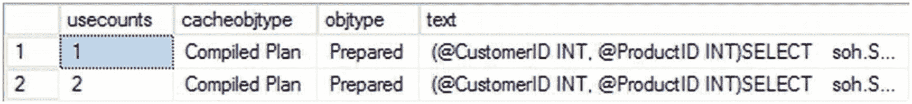

图 16-20
显示使用 `sp_executesql` 生成的计划敏感性的 `sys.dm_exec_cached_plans` 输出

```sql
SET @query = N'SELECT    soh.SalesOrderNumber ,soh.OrderDate ,sod.OrderQty ,sod.LineTotal FROM       Sales.SalesOrderHeader AS soh JOIN Sales.SalesOrderDetail AS sod ON soh.SalesOrderID = sod.SalesOrderID where      soh.CustomerID = @CustomerID AND sod.ProductID = @ProductID' ;
```

另一种查看缓存中创建了两个不同计划的方法是使用其他动态管理对象来查看缓存中计划的属性。

```sql
SELECT  decp.usecounts,
decp.cacheobjtype,
decp.objtype,
dest.text,
deqs.creation_time,
deqs.execution_count,
deqs.query_hash,
deqs.query_plan_hash
FROM    sys.dm_exec_cached_plans AS decp
CROSS APPLY sys.dm_exec_sql_text(decp.plan_handle) AS dest
JOIN    sys.dm_exec_query_stats AS deqs
ON decp.plan_handle = deqs.plan_handle
WHERE   dest.text LIKE '(@CustomerID INT, @ProductID INT)%' ;
```

图 16-21 显示了此查询的结果。


图 16-21
来自 `sys.dm_exec_query_stats` 的附加输出

`sys.dm_exec_query_stats` 的输出显示查询的两个版本具有不同的 `creation_time` 值。更有趣的是，它们具有相同的 `query_hash` 值但不同的 `query_plan_hash` 值（关于哈希值将在该部分稍后详述）。所有这些都表明，更改大小写导致存储在缓存中的执行计划不同。

一般来说，使用 `sp_executesql` 来显式参数化查询，以便在使用变量的不同值重新提交查询时，其执行计划可以重用。这提供了可重用计划的性能优势，而无需像存储过程那样管理任何持久对象的开销。此功能通过 ODBC 和 OLEDB 分别通过 `SQLExecDirect` 和 `ICommandWithParameters` 暴露。对于 .NET 开发人员或 [ADO.​NET](http://ado.net)（ADO 2.7 或更新版本）的用户，你可以使用 ADO `Command` 和 `Parameters` 提交前面的 `SELECT` 语句。如果你将 ADO `Command Prepared` 属性设置为 `FALSE` 并使用 ADO `Command ('SELECT * FROM "Order Details" d, Orders o WHERE d.OrderID=o.OrderID and d.ProductID=?')` 与 ADO `Parameters`，[ADO.​NET](http://ado.net) 将使用 `sp_executesql` 发送 `SELECT` 语句。大多数对象关系映射工具，如 nHibernate 或 Entity Framework，也具有允许准备语句和使用参数的机制。

最后，如果你确实必须像前面那样通过字符串构建查询，请务必使用参数。当你传入参数时，使用任何方法，确保使用强类型参数，并在 T-SQL 语句中将这些参数作为参数使用。所有这些都将有助于避免 SQL 注入攻击。

除了参数之外，`sp_executesql` 每次重新执行查询时都会通过网络发送整个查询字符串。你可以通过使用 ODBC 和 OLEDB（或 OLEDB .NET）的准备/执行模型来避免这一点。

## Prepare/Execute Model

ODBC 和 OLEDB 提供了一个准备/执行模型，用于将查询作为预编译工作负载提交。与 `sp_executesql` 类似，此模型允许显式参数化查询的可变部分。准备阶段允许 SQL Server 为查询生成执行计划，并将执行计划的句柄返回给应用程序。此执行计划句柄由执行阶段用于使用不同的参数值执行查询。此模型只能用于通过 ODBC 或 OLEDB 提交查询，不能在 SQL Server 内部使用——存储过程内的查询不能使用此模型执行。

SQL Server ODBC 驱动程序提供 `SQLPrepare` 和 `SQLExecute` API 来支持准备/执行模型。SQL Server OLEDB 提供程序通过 `ICommandPrepare` 接口暴露此模型。[ADO.​NET](http://ado.net) 的 OLEDB .NET 提供程序的行为类似。

### Note

有关如何在数据库应用程序中使用准备/执行模型的详细说明，请参阅 MSDN 文章 “SqlCommand.Prepare Method” ( [`http://bit.ly/2DBzN4b`](http://bit.ly/2DBzN4b) )。


## 查询计划哈希与查询哈希

自 SQL Server 2008 起，引入了围绕执行计划和缓存的新功能，称为 `查询计划哈希` 和 `查询哈希`。这些是二进制对象，通过对查询或查询计划使用特定算法来生成二进制哈希值。它们对于开发中一种常见实践——*复制粘贴*——非常有用。你会发现常见的模式和做法会在你的代码中反复出现。在最好的情况下，这是一件好事，因为你会看到最佳类型的查询、联接、基于集合的操作等，根据需要从一个存储过程复制到另一个。但有时，你也会看到最糟糕的做法在你的代码中一遍又一遍地重复。这正是 `查询哈希` 和 `查询计划哈希` 发挥作用、助你一臂之力的地方。

你可以从 `sys.dm_exec_query_stats` 或 `sys.dm_exec_requests` 中检索 `查询计划哈希` 和 `查询哈希`。你也可以从查询存储中获取这些哈希值。虽然这是一种识别查询及其计划的机制，但哈希值并非唯一。不同的计划可能得到相同的哈希值，因此你不能依赖它作为替代主键。

要查看哈希值的实际效果，请创建两个查询。

```sql
SELECT *
FROM Production.Product AS p
JOIN Production.ProductSubcategory AS ps
ON p.ProductSubcategoryID = ps.ProductSubcategoryID
JOIN Production.ProductCategory AS pc
ON ps.ProductCategoryID = pc.ProductCategoryID
WHERE pc.Name = 'Bikes'
AND ps.Name = 'Touring Bikes';
SELECT *
FROM Production.Product AS p
JOIN Production.ProductSubcategory AS ps
ON p.ProductSubcategoryID = ps.ProductSubcategoryID
JOIN Production.ProductCategory AS pc
ON ps.ProductCategoryID = pc.ProductCategoryID
where pc.Name = 'Bikes'
and ps.Name = 'Road Bikes';
```

请注意，这两个查询之间唯一的实质性区别是 `ProductSubcategory.Name` 的值不同，一个是 `Touring Bikes`，另一个是 `Road Bikes`。然而，还要注意第二个查询中的 `WHERE` 和 `AND` 关键字是小写的。执行每个查询后，你可以通过以下查询从 `sys.dm_exec_query_stats` 中看到这些格式变化的结果，如图 16-22 所示：


图 16-22

`sys.dm_exec_query_stats` 显示计划哈希值

```sql
SELECT deqs.execution_count,
deqs.query_hash,
deqs.query_plan_hash,
dest.text
FROM sys.dm_exec_query_stats AS deqs
CROSS APPLY sys.dm_exec_sql_text(deqs.plan_handle) AS dest
WHERE dest.text LIKE 'SELECT *
FROM Production.Product AS p%';
```

创建了两个不同的计划，因为这些不是参数化查询；它们过于复杂，无法被简单参数化考虑，且强制参数化是关闭的。这两个计划具有相同的哈希值，因为它们仅在传递的值上有所不同。大小写的差异对 `查询哈希` 或 `查询计划哈希` 值没有影响。但是，如果你更改了 `SELECT` 条件，那么从 `sys.dm_exec_query_stats` 检索到的值将如图 16-23 所示，并且查询将发生变化。

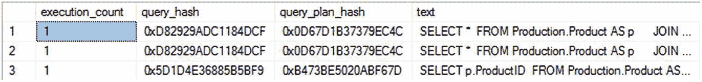

图 16-23

`sys.dm_exec_query_stats` 显示不同的哈希值

```sql
SELECT  p.ProductID
FROM    Production.Product AS p
JOIN    Production.ProductSubcategory AS ps
ON p.ProductSubcategoryID = ps.ProductSubcategoryID
JOIN    Production.ProductCategory AS pc
ON ps.ProductCategoryID = pc.ProductCategoryID
WHERE   pc.[Name] = 'Bikes'
AND ps.[Name] = 'Touring Bikes';
```

尽管查询的基本结构相同，但返回列的改变足以改变 `查询哈希` 值和 `查询计划哈希` 值。

由于数据分布和索引的差异可能导致同一查询生成两个不同的计划，`查询哈希` 可以相同，而 `查询计划哈希` 却可能不同。为了说明这一点，执行两个新的查询。

```sql
SELECT p.Name,
tha.TransactionDate,
tha.TransactionType,
tha.Quantity,
tha.ActualCost
FROM Production.TransactionHistoryArchive AS tha
JOIN Production.Product AS p
ON tha.ProductID = p.ProductID
WHERE p.ProductID = 461;
SELECT p.Name,
tha.TransactionDate,
tha.TransactionType,
tha.Quantity,
tha.ActualCost
FROM Production.TransactionHistoryArchive AS tha
JOIN Production.Product AS p
ON tha.ProductID = p.ProductID
WHERE p.ProductID = 712;
```

与之前使用的原始查询类似，这些查询仅在传递给 `ProductID` 列的值上有所不同。当两个查询都运行时，你可以从 `sys.dm_exec_query_stats` 中选择数据以查看哈希值（图 16-24）。


图 16-24

`查询计划哈希` 的差异

你可以看到 `查询哈希` 值是相同的，但 `查询计划哈希` 值是不同的。这是因为基于传入值的统计信息创建的执行计划截然不同，如图 16-25 所示。


图 16-25

不同的参数导致截然不同的计划

`查询计划哈希` 和 `查询哈希` 值可以是追踪不同查询间常见问题的有用工具，但正如你所看到的，它们并非在所有情况下都能检索到准确的信息集合。它们确实为识别其他可能存在查询性能问题的位置增添了又一实用工具。它们还可用于随时间跟踪执行计划。你可以在将查询部署到生产环境后捕获其 `查询计划哈希`，然后观察它是否因数据变化而随时间改变。借此，你还可以通过计划跟踪聚合的查询统计信息，参考 `sys.dm_exec_querystats`，但请记住，聚合数据会在服务器重启或以任何方式清除计划缓存时被重置。然而，查询存储中的相同信息会通过备份、服务器重启、清除计划缓存等方式持久保存。在调优查询时请牢记这些工具。

## 执行计划缓存建议

计划缓存的基本目的是通过重用执行计划来提高性能。因此，确保你的执行计划确实可重用非常重要。由于即席查询的计划重用效率低下，通常建议你尽可能依赖预处理工作负载技术。为确保高效利用计划缓存，请遵循以下建议：

*   显式参数化查询的可变部分。
*   使用存储过程来实现业务功能。
*   使用 `sp_executesql` 以避免存储过程维护。
*   使用准备/执行模型以避免重新发送查询字符串。
*   避免即席查询。
*   对于动态查询，使用 `sp_executesql` 而非 `EXECUTE`。
*   谨慎参数化查询的可变部分。
*   避免在连接之间修改环境设置。
*   避免在查询中隐式解析对象。

让我们更详细地看看这些要点。


### 显式参数化查询的可变部分

一个查询通常会被多次执行，各次执行之间的唯一区别仅在于其可变部分的取值不同。然而，如果能将查询的静态部分与可变部分分离开来，它们的执行计划就可以被复用。尽管 SQL Server 提供了简单参数化功能和强制参数化功能，但它们都有严重的局限性。应始终使用标准的预处理工作负载技术来显式执行参数化。

### 创建存储过程以实现业务功能

如果你已经对查询进行了显式参数化，那么将其放入存储过程可以实现最佳的可复用性。因为只需随存储过程名称一起发送参数，从而减少了网络流量。并且由于存储过程是从缓存中被复用的，它们的运行速度可以比临时查询更快。

如同其他事物一样，好事也可能过头。有些业务流程属于数据库范畴，但也有些业务流程绝不应该放在数据库内。例如，在存储过程中格式化数据通常由应用程序来完成会更好。基本上，你的数据库及其相关查询应专注于直接的数据检索和存储。任何其他处理都应在别处完成。

### 使用 `sp_executesql` 编写代码以避免存储过程部署

如果存储过程所需的对象部署成为一个考虑因素，或者你正在使用在客户端生成的查询，那么请使用 `sp_executesql` 以预处理工作负载的形式提交查询。与存储过程模型不同，`sp_executesql` 不会在数据库中创建任何持久性对象。`sp_executesql` 适合执行单例查询或小型批处理查询。

在存储过程中实现的完整业务逻辑，也可以通过 `sp_executesql` 作为一个大的查询字符串提交。然而，随着业务逻辑复杂性的增加，为完整逻辑创建和维护一个查询字符串会变得困难。

此外，使用 `sp_executesql` 和带有适当参数的存储过程可以防止对服务器的 SQL 注入攻击。

尽管如此，我仍然强烈建议在可能的情况下，在数据库中使用存储过程。

### 实现“准备/执行”模型以避免重发查询字符串

`sp_executesql` 要求每次重新执行查询时，都通过网络发送查询字符串。它还需要在服务器端进行查询字符串匹配的开销，以在计划缓存中识别相应的执行计划。对于 ODBC 或 OLEDB（或 OLEDB .NET）应用程序，你可以使用“准备/执行”模型来避免在多次执行期间重发查询字符串，因为只需提交计划句柄和参数。在“准备/执行”模型中，由于计划句柄会返回给应用程序，该计划可以被其他用户连接复用；它不仅限于创建该计划的用户。

### 避免临时查询

不要设计使用临时查询的新应用程序！为临时查询创建的执行计划在查询以可变部分的不同值重新提交时无法被复用。尽管 SQL Server 具有简单参数化和强制参数化功能来隔离查询的可变部分，但由于 SQL Server 在参数化方面过于保守，该功能仅限于简单的查询。为了获得更好的计划可复用性，请以预处理工作负载的形式提交查询。

有些系统的构建完全基于临时查询的概念。这在功能上可行，也可以在 SQL Server 中运行，但正如你所见，它带来了大量额外的开销，你需要为此做好计划。此外，临时查询通常是 SQL 注入被引入系统的方式。

### 对于动态查询，优先使用 `sp_executesql` 而非 `EXECUTE`

在存储过程或数据库应用程序内动态生成的 SQL 查询字符串，应使用 `sp_executesql` 而非 `EXECUTE` 命令来执行。`EXECUTE` 命令不允许显式地参数化查询的可变部分。

为了理解前面关于 `sp_executesql` 和 `EXECUTE` 的比较，考虑一下在 `adhocsproc` 中用于执行 `SELECT` 语句的动态 SQL 查询字符串。

```sql
DECLARE @n VARCHAR(3) = '776',
    @sql VARCHAR(MAX);
SET @sql
= 'SELECT * FROM Sales.SalesOrderDetail sod  ' + 'JOIN Sales.SalesOrderHeader soh  '
+ 'ON sod.SalesOrderID=soh.SalesOrderID ' + 'WHERE    sod.ProductID="' + @n + "";
--Execute the dynamic query using EXECUTE statement
EXECUTE (@sql);
```

`EXECUTE` 语句连同 `d.ProductID` 的值一起，将查询作为一个临时查询提交，因此可能（也可能不会）导致简单参数化。请自行通过查看缓存来检查输出。

```sql
SELECT deqs.execution_count,
    deqs.query_hash,
    deqs.query_plan_hash,
    dest.text,
    deqp.query_plan
FROM sys.dm_exec_query_stats AS deqs
CROSS APPLY sys.dm_exec_sql_text(deqs.plan_handle) AS dest
CROSS APPLY sys.dm_exec_query_plan(deqs.plan_handle) AS deqp
WHERE dest.text LIKE 'SELECT * FROM Sales.SalesOrderDetail sod%';
```

为了改进执行计划缓存的可复用性，请使用 `sp_executesql` 以参数化查询的形式执行动态 SQL 字符串。

```sql
DECLARE @n NVARCHAR(3) = '776',
    @sql NVARCHAR(MAX),
    @paramdef NVARCHAR(6);
SET @sql
= 'SELECT * FROM Sales.SalesOrderDetail sod  ' + 'JOIN Sales.SalesOrderHeader soh  '
+ 'ON sod.SalesOrderID=soh.SalesOrderID ' + 'WHERE    sod.ProductID=@1';
SET @paramdef = N'@1 INT';
--Execute the dynamic query using sp_executesql system stored procedure
EXECUTE sp_executesql @sql, @paramdef, @1 = @n;
```

使用 `sp_executesql` 将查询作为显式参数化查询执行，会为该查询生成一个参数化计划，从而增加了执行计划的可复用性。

### 谨慎地参数化查询的可变部分

在将查询的可变部分转换为参数时要小心。某些变量的取值范围可能变化极大，以至于针对某一范围值的执行计划可能不适用于其他值。这可能导致糟糕的参数嗅探（将在第 17 章介绍）。

### 不允许在查询中隐式解析对象

SQL Server 允许在不同架构下创建具有相同名称的多个数据库对象。例如，可以在各自的所属关系下使用两个不同的架构（`u1` 和 `u2`）来创建表 `t1`。大多数系统中的默认所有者是 `dbo`（数据库所有者）。如果用户 `u1` 执行以下查询，则 SQL Server 首先尝试查找表 `t1` 是否存在于用户 `u1` 的默认架构中。

```sql
SELECT *
FROM t1
WHERE c1 = 1;
```

如果没有找到，则尝试查找表 `t1` 是否存在于 `dbo` 用户下。这种隐式解析允许用户 `u1` 在另一个架构下创建另一个表 `t1` 实例，并临时访问它（使用相同的应用程序代码），而不影响其他用户。

在生产数据库上，我建议使用架构所有者限定名称并避免隐式解析。如果不这样做，在生产服务器上使用隐式解析会增加以下开销：

*   需要更多时间来识别对象。
*   降低了执行计划缓存可复用性的有效性。


# 17. 参数嗅探

## 概要

SQL Server 基于成本的查询优化器不仅根据查询的确切语法，还会根据使用不同处理策略执行查询的成本，来决定有效的执行计划。对使用不同处理策略的成本评估会在多个优化阶段中进行，以避免在优化查询上花费过多时间。随后，执行计划会被缓存，以便在重新执行相同查询时节省生成执行计划的成本。为了提高缓存计划的可重用性，SQL Server 支持在变量部分的值不同时重新运行查询的多种执行计划重用技术。

使用存储过程通常是提高执行计划可重用性的最佳技术。SQL Server 为存储过程生成参数化的执行计划，以便在使用相同或不同参数值重新运行存储过程时可以重用现有计划。然而，如果存储过程的现有执行计划失效，则该计划无法在不重新编译的情况下重用，从而降低了计划缓存可重用性的有效性。

在下一章中，我将讨论如何排查和解决不良的参数嗅探问题。

当参数化查询被发送到优化器，并且缓存中没有现有计划时，优化器将执行其功能，为 T-SQL 语句请求的操作数据创建执行计划。当调用此参数化查询时，参数的值会被设置，无论是通过你的程序还是通过参数定义中的默认值。无论哪种方式，那里都有一个值。优化器知道这一点。因此，它利用这一事实并读取参数的值。这就是被称为*参数嗅探*的过程中“嗅探”的方面。有了这些可用的值，优化器将使用这些特定值来查看参数所引用数据的统计信息。有了具体的值和一组准确的统计信息，你将得到更好的执行计划。这种有益的参数嗅探过程会自动持续运行，假设默认值没有更改，适用于所有参数化查询，无论它们来自哪里。

你也可以获得对局部变量的嗅探。不过在此之前，让我们先区分一下局部变量和参数，因为在 T-SQL 语句中它们看起来可能一样。此示例展示了局部变量和参数：

```sql
CREATE PROCEDURE dbo.ProductDetails (@ProductID INT)
AS
DECLARE @CurrentDate DATETIME = GETDATE();
SELECT p.Name,
       p.Color,
       p.DaysToManufacture,
       pm.CatalogDescription
FROM Production.Product AS p
JOIN Production.ProductModel AS pm
    ON pm.ProductModelID = p.ProductModelID
WHERE p.ProductID = @ProductID
  AND pm.ModifiedDate < @CurrentDate;
GO
```

前一个查询中的参数是`@ProductID`。局部变量是`@CurrentDate`。参数是与存储过程（或在那种情况下的预处理语句）一起定义的。局部变量是代码的一部分。区分它们很重要，因为当涉及到`WHERE`子句时，它们看起来完全一样。

如果你对任何使用局部变量的语句进行重新编译，这些变量可以被优化器嗅探，就像它嗅探参数一样。只需意识到这一点。除了重新编译的这种特殊情况外，当优化器去编译计划时，局部变量对它来说是未知量。通常只有参数可以被嗅探。

为了查看参数嗅探的实际效果并展示其有用性，让我们从一个不同的存储过程开始。

```sql
CREATE OR ALTER PROC dbo.AddressByCity @City NVARCHAR(30)
AS
SELECT a.AddressID,
       a.AddressLine1,
       AddressLine2,
       a.City,
       sp.Name AS StateProvinceName,
       a.PostalCode
FROM Person.Address AS a
JOIN Person.StateProvince AS sp
    ON a.StateProvinceID = sp.StateProvinceID
WHERE a.City = @City;
GO
```

创建存储过程后，使用此参数运行它：

```sql
EXEC dbo.AddressByCity @City = N'London';
```

这将产生以下 I/O 和执行时间，以及图 17-1 中的查询计划：


图 17-1 AddressByCity 的执行计划

```
Reads: 219
Duration: 97.1ms
```

优化器嗅探了值 `London`，并基于 `Address` 表统计信息中城市 `London` 所代表的数据分布，得出了一个计划。该查询或表上的索引可能还有其他调优机会，但该计划对于值 `London` 和现有数据结构是最优的。你可以像这样使用局部变量编写一个相同的查询：

```sql
DECLARE @City NVARCHAR(30) = N'London';
SELECT  a.AddressID,
        a.AddressLine1,
        AddressLine2,
        a.City,
        sp.[Name] AS StateProvinceName,
        a.PostalCode
FROM    Person.Address AS a
JOIN    Person.StateProvince AS sp
        ON a.StateProvinceID = sp.StateProvinceID
WHERE   a.City = @City;
```

当执行此查询时，I/O 和执行时间的结果会不同。

```
Reads: 1084
Duration: 127.5ms
```

执行时间增加了，并且你从总共 219 次读取增加到了 1084 次。通过查看图 17-2 所示的新执行计划，可以在一定程度上解释这一点。

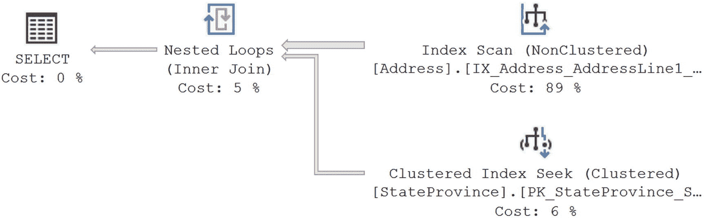
图 17-2 使用局部变量创建的执行计划

发生的情况是，优化器无法采样或嗅探局部变量的值，因此必须使用统计信息中的平均行数。你可以通过查看 `Index Scan` 运算符属性中的估计行数来看到这一点。它显示 34.113。然而，如果你查看返回的数据，实际上有 434 行对应值 `London`。简而言之，如果优化器认为它需要检索 434 行，它会创建一个使用合并连接的计划，只需 219 次读取。但是，如果它认为只返回大约 34 行，它会使用带有嵌套循环连接的计划，根据嵌套循环的性质（为上层数据中的每个值在下层值中执行一次查找），导致 1084 次读取和较慢的性能。

这就是参数嗅探的实际作用，它带来了性能提升。现在，让我们看看当参数嗅探变糟时会发生什么。


## 糟糕的参数嗅探

当统计信息存在问题时，参数嗅探会产生问题。传入的参数值可能代表你的数据以及统计信息中的数据分布。在这种情况下，你会看到一个良好的执行计划。但是，当传入的参数不能代表表中其余数据时会发生什么？这种情况可能出现，因为你的数据分布本身就不平均。例如，统计信息中的大多数值只会返回很少的行，比如六行，但有些值会返回数百行。反之亦然，常见的情况是大量数据的分布，而小值集合则不常见。在这种情况下，基于非代表性数据创建了一个执行计划，但它对大多数查询并无用处。这种情况最常表现为性能突然、有时是相当剧烈的下降。它甚至可能在重新编译事件允许一个更好的代表性数据值作为参数传入时，看似随机地自行修复。

当统计信息过时、由于是抽样而非全扫描导致不准确（关于统计信息的更多细节，请参见第 13 章），甚至统计信息本身非常完善但数据分布非常不规则（奇怪的数据分布）时，你也会看到这种情况发生。无论如何，这种情况会生成一个不太有用的计划，并将其存储在缓存中。例如，看下面的存储过程：

```sql
CREATE OR ALTER PROC dbo.AddressByCity @City NVARCHAR(30)
AS
SELECT a.AddressID,
a.AddressLine1,
AddressLine2,
a.City,
sp.Name AS StateProvinceName,
a.PostalCode
FROM Person.Address AS a
JOIN Person.StateProvince AS sp
ON a.StateProvinceID = sp.StateProvinceID
WHERE a.City = @City;
GO
```

如果之前创建的存储过程 `dbo.AddressByCity` 再次运行，但这次使用不同的参数，它会返回不同的 I/O 和执行时间集，但因为是从缓存中重用的，所以执行计划是相同的。

```sql
EXEC dbo.AddressByCity @City = N'Mentor';
Reads: 218
Duration: 2.8ms
```

I/O 几乎相同，因为重用了相同的执行计划。执行时间更快是因为返回的行数更少。你可以通过查看 `sys.dm_exec_query_stats` 的输出（如图 17-3）来验证计划被重用了。


图 17-3
`sys.dm_exec_query_stats` 的输出验证了过程重用

```sql
SELECT  dest.text,
deqs.execution_count,
deqs.creation_time
FROM    sys.dm_exec_query_stats AS deqs
CROSS APPLY sys.dm_exec_sql_text(deqs.sql_handle) AS dest
WHERE   dest.text LIKE 'CREATE PROC dbo.AddressByCity%';
```

为了展示糟糕的参数嗅探是如何发生的，你可以反转存储过程的执行顺序。首先通过运行 `DBCC FREEPROCCACHE` 来清除缓冲区缓存，除非你小心地按照我这里展示的做（这只会从缓存中移除单个执行计划），否则不应在生产机器上运行此命令：

```sql
DECLARE @PlanHandle VARBINARY(64);
SELECT @PlanHandle = deps.plan_handle
FROM sys.dm_exec_procedure_stats AS deps
WHERE deps.object_id = OBJECT_ID('dbo.AddressByCity');
IF @PlanHandle IS NOT NULL
BEGIN
DBCC FREEPROCCACHE(@PlanHandle);
END
GO
```

这里的另一个选项是仅通过 `ALTER DATABASE SCOPED CONFIGURATION CLEAR PROCEDURE CACHE;` 清除给定数据库的计划。

现在，以相反的顺序重新运行查询。第一个查询使用参数值 `Mentor`，产生以下 I/O 和执行计划（图 17-4）：


图 17-4
执行计划发生了变化

```sql
Reads: 218
Duration: 1.8ms
```

图 17-4 与图 17-2 中所示的执行计划不同。读取次数略有下降，但执行时间大致相同。第二次执行使用 `London` 作为参数的值，产生以下 I/O 和执行时间：

```sql
Reads:1084
Duration:97.7ms
```

这次读取次数急剧上升，达到了使用局部变量时的水平，并且执行时间增加了。第一次使用参数 `London` 执行过程时创建的计划，最适合检索数据库中匹配该条件的 434 行。然后，下一次使用参数值 `Mentor` 执行该过程时，使用第一次执行生成的相同计划表现尚可。当顺序反转后，为 `Mentor` 值创建了一个新的执行计划，这个计划对于 `London` 值来说效果非常差。

在这些例子中，我实际上稍微作了一点弊。如果你查看相关统计信息中的数据分布，你会发现返回的平均行数大约是 34 行，而 `London` 的 434 行是一个异常值。当过程为 `London` 编译时看到的略微更好的性能，反映了需要不同计划这一事实。然而，对于像 `Mentor` 这样的值，使用 `London` 的计划时性能略有下降。但是，为 `Mentor` 改进的计划对于像 `London` 这样的值来说绝对是灾难性的。现在到了困难的部分。

你必须确定哪个计划适合你系统的负载。一个计划对平均值来说稍差，而另一个计划对平均值更好，但严重损害了异常值。问题是，是让所有可能的数据集性能稍慢以支持异常值的更好性能更好，还是为了让更大部分的数据受益（因为它可能被更频繁地调用）而让异常值受苦？你必须在你自己的系统上解决这个问题。


## 识别不良参数嗅探

不良参数嗅探通常是一个间歇性问题。有时你会得到一个足够好的执行计划，没人抱怨；有时则会得到另一个，突然之间投诉系统速度慢的电话就响个不停。因此，这个问题很难追踪。关键在于识别出某个参数化查询正在生成两个（或有时更多）执行计划。当你开始遇到这种性能间歇性变化时，必须捕获相关的查询计划。一种方法是使用 `sys.dm_exec_query_plan` DMO 直接从缓存中提取估计的计划，如下所示：

```sql
SELECT deps.execution_count,
deps.total_elapsed_time,
deps.total_logical_reads,
deps.total_logical_writes,
deqp.query_plan
FROM sys.dm_exec_procedure_stats AS deps
CROSS APPLY sys.dm_exec_query_plan(deps.plan_handle) AS deqp
WHERE deps.object_id = OBJECT_ID('AdventureWorks2012.dbo.AddressByCity');
```

这个查询使用 `sys.dm_exec_procedure_stats` DMO 来检索缓存中关于该存储过程及其查询计划的信息。

如果你启用了查询存储，则可以从那里检索计划：

```sql
SELECT SUM(qsrs.count_executions) AS ExecutionCount,
AVG(qsrs.avg_duration) AS AvgDuration,
AVG(qsrs.avg_logical_io_reads) AS AvgReads,
AVG(qsrs.avg_logical_io_writes) AS AvgWrites,
CAST(qsp.query_plan AS XML) AS Query_Plan,
qsp.query_id,
qsp.plan_id
FROM sys.query_store_query AS qsq
JOIN sys.query_store_plan AS qsp
ON qsp.query_id = qsq.query_id
JOIN sys.query_store_runtime_stats AS qsrs
ON qsrs.plan_id = qsp.plan_id
WHERE qsq.object_id = OBJECT_ID('dbo.AddressByCity')
GROUP BY qsp.query_plan,
qsp.query_id,
qsp.plan_id;
```

与上一个查询不同，这个查询可以返回多个执行计划。

在 SSMS 中运行这两个查询时，结果都会包含一个可点击的 `query_plan` 列。点击它将打开图形化的执行计划，尽管检索到的是 XML。如果你处理的是来自缓存的单个计划，可以在计划本身上右键单击，然后从上下文菜单中选择“将执行计划另存为”。这样你就可以保存该计划，以便与稍后的计划进行比较。如果你使用的是查询存储，在不良参数嗅探的情况下，你会有多个计划可用。

你需要查看的是第一个运算符的属性，在本例中是 `SELECT` 运算符。在那里你会找到“参数列表”项，它将显示优化器编译计划时使用的值，如图 17-5 所示。


图 17-5：用于编译查询计划的参数值

然后，你可以使用这个值来查看统计信息，以了解为什么看到的计划与你预期的不同。在这个例子中，如果我运行以下查询，就可以检查直方图，看看类似 `London` 的值可能存储在哪里，以及可以预期多少行：

```sql
DBCC SHOW_STATISTICS('Person.Address','_WA_Sys_00000004_164452B1');
```

图 17-6 显示了直方图的相关部分。


图 17-6：显示预期行数的直方图部分

你可以看到，`London` 的值返回的行数比 `AVG_RANGE_ROWS` 中显示的平均行数多得多，并且高于存储在 `EQ_ROWS` 中的许多其他步骤的 `RANG_HI_KEY` 计数。简而言之，`London` 的值与其余数据相比是偏斜的。这就是为什么该计划与其他计划不同的原因。

你必须对统计信息和编译时参数值进行同样的评估，才能理解不良参数嗅探的根源。

但是，如果你有一个遭受不良参数嗅探之苦的参数化查询，你可以通过几种不同的方式来尝试控制并减少这个问题。

## 缓解不良参数嗅探

一旦你确定某个案例中出现了不良参数嗅探，你不必默默忍受。你可以采取一些措施，但需要做出决定。你有多种选择来缓解不良参数嗅探的行为。

*   你可以在执行时强制重新编译计划，方法是在执行前对存储过程运行 `sp_recompile`。
*   另一种强制重新编译的方法是使用 `EXEC <过程名> WITH RECOMPILE`。
*   另一种在每次执行时强制重新编译的机制是在创建存储过程时，在其定义中包含 `WITH RECOMPILE`。
*   你也可以在单个语句上使用 `OPTION` (`RECOMPILE`)，以便仅重新编译那些语句，而不是整个过程。如果你打算强制重新编译，这通常是最佳方法。但要明白这是执行时间和编译时间之间的权衡。如果此查询被频繁调用并且每次都重新编译，你可能会看到严重的问题。
*   你可以将输入参数重新分配给局部变量。这个流行的修复方法迫使优化器通过查看所引用数据的统计信息来猜测可能使用的值，这可以也确实消除了将实际值考虑在内的情况。这是一种老方法，已被使用 `OPTIMIZE FOR UNKNOWN` 所取代。这种方法在重新编译时也可能遭受变量嗅探的影响。
*   你可以在创建存储过程时使用查询提示 `OPTIMIZE FOR`，并为其提供已知能为大多数查询生成良好计划的参数。你可以指定一个生成特定计划的值，也可以指定 `UNKNOWN` 以获得基于统计信息平均值的通用计划。
*   你可以使用计划指南，这是一种在不修改存储过程的情况下使查询以特定方式运行的机制。这将在 `第 18 章` 中详细介绍。
*   如果你启用了查询存储，可以使用计划强制来选择首选计划。这是一个优雅的解决方案，因为它不需要任何代码更改即可实施。
*   你可以通过设置跟踪标志 4136 为 on 来在服务器级别禁用参数嗅探。要明白，这种有益的行为将被关闭，不仅针对问题查询，而是针对整个服务器。这对你的系统来说可能是一个极其危险的选择。
*   你现在可以使用 `DATABASE SCOPED CONFIGURATION` 在数据库级别禁用参数嗅探。这比使用前面提到的跟踪标志安全得多。但它仍然可能存在问题，因为大多数数据库都能从参数嗅探中受益。
*   如果你有特定的查询模式导致不良参数嗅探，你可以通过设置两个或更多不同的存储过程，并使用包装过程来确定调用哪一个，从而将功能隔离。这可以帮助你同时使用多种不同的方法。你也可以使用动态字符串执行来解决这个问题；只是要小心 SQL 注入。

每一种可能的解决方案都伴随着必须考虑的权衡。如果你决定每次调用查询时都重新编译，你将不得不为重新编译查询所需的额外 CPU 付出代价。这与通过使用参数化查询来实现计划重用的理念背道而驰，但在你的情况下，它可能是最佳解决方案。将参数重新分配给局部变量是一种老派的做法；代码看起来可能相当愚蠢。

采用这种方法，优化器会基于相关列的密度而非直方图进行基数估计。但这看起来在查询中显得奇怪。实际上，如果你采用这种方法，我强烈建议在变量声明前添加注释，以清楚地说明你为何这样做。下面是一个例子：

```
-- This allows the query to bypass bad parameter sniffing
```

但是，采用这种方法后，你现在可能会受到“变量嗅探”可能性的影响，因此并不真正推荐，除非你使用的 SQL Server 实例早于 2008 版本。从 SQL Server 2008 及以后版本开始，你最好使用 `OPTIMIZE FOR UNKOWN` 查询提示来达到相同结果，而不会引入变量嗅探可能带来的问题。

你可以使用 `OPTIMIZE FOR` 查询提示并传递一个特定值。例如，如果你希望确保始终使用由值 `Mentor` 生成的计划，你可以对查询执行以下操作：

```
CREATE OR ALTER PROC dbo.AddressByCity @City NVARCHAR(30)
AS
SELECT a.AddressID,
a.AddressLine1,
AddressLine2,
a.City,
sp.Name AS StateProvinceName,
a.PostalCode
FROM Person.Address AS a
JOIN Person.StateProvince AS sp
ON a.StateProvinceID = sp.StateProvinceID
WHERE a.City = @City
OPTION (OPTIMIZE FOR (@City = 'Mentor'));
```

现在，优化器将忽略传递给 `@City` 的任何值，并始终使用值 `Mentor`。你甚至可以通过修改查询（如下所示，这将从缓存中移除查询），然后使用参数值 `London` 执行它，来亲眼看到这一过程。这将在缓存中生成一个新计划。如果你打开该计划并查看 `SELECT` 属性，你将在图 17-7 中看到提示的证据。

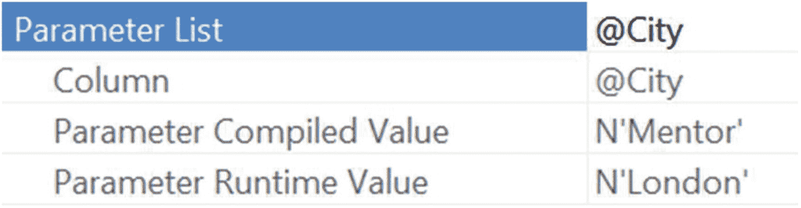

图 17-7

运行时值与编译时值不同

如你所见，优化器完全按照你的指定操作，使用值 `Mentor` 来编译计划，尽管你也可以看到你使用值 `London` 执行了查询。这种方法的问题在于数据会随时间变化，而对你数据在某个时间点最优的计划可能不再最优。如果你选择使用 `OPTIMIZE FOR` 提示，则需要计划定期重新评估它。

如果你选择通过使用跟踪标志或 `DATABASE SCOPED CONFIGURATION` 完全禁用参数嗅探，请理解这会在整个服务器或数据库上将其关闭。由于大多数情况下，参数嗅探绝对对你有帮助，你最好确定你没有从中获得任何益处，并且处理它的唯一希望是关闭嗅探。这甚至不需要重启服务器，因此是立即生效的。生成的计划将基于可用统计信息的平均值，因此根据你的数据，计划可能严重次优。在执行此操作之前，请探索在你最有问题的查询上使用 `RECOMPILE` 提示的可能性。即使你无法获得计划重用，这种方法也更可能为你提供更好的计划。

处理参数嗅探最简单的方法，假设你处于某个特定计划最有用的情况下，就是通过查询存储强制执行计划。你可以使用 GUI 中的报告，也可以直接从系统视图中检索信息。

```
SELECT CAST(qsp.query_plan AS XML) AS query_plan,
qsp.plan_id,
qsq.query_id
FROM sys.query_store_plan AS qsp
JOIN sys.query_store_query AS qsq
ON qsq.query_id = qsp.query_id
WHERE qsq.object_id = OBJECT_ID('dbo.AddressByCity');
```

你拥有了确定哪个执行计划最适合系统需求所需的一切。一旦确定，强制优化器选择该计划就很简单了。为了实际观察这一点，让我们强制对值 `Mentor` 更合适的那个计划。假设你一直运行着启用了查询存储的实例，你应该能够使用之前的查询检索数据并选择该计划。如果没有，请启用查询存储（详见第 11 章），然后运行两个查询，并在执行之间使用之前的脚本花时间从缓存中清除计划。

完成这些之后，你需要使用 `query_id` 和 `plan_id` 的值以及 `sys.sp_query_store_force_plan` 函数。

```
EXEC sys.sp_query_store_force_plan 1545, 1602;
```

结果不会立即显现。然而，如果我们重新运行存储过程并传递值 `London`，我们将看到图 17-8 中的计划。

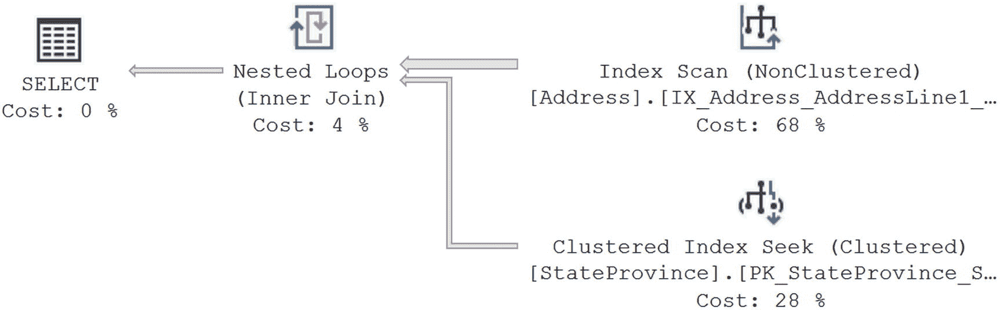

图 17-8

一个被强制的执行计划

你可以尝试从缓存中移除该计划，并为值 `London` 重新运行。然而，你在此时所做的一切都无法带回该执行计划，因为优化器现在强制执行该计划。你可以使用扩展事件监控计划强制。你也可以查询查询存储视图以查看哪些计划被强制。最后，计划本身存储了一点信息来让你知道它是一个被强制的计划。查看第一个操作符，在本例中是 `SELECT` 操作符，你可以在图 17-9 中看到其属性。


图 17-9

显示强制执行计划的 Use plan 属性

这是你可以在执行计划中看到它已被强制的唯一迹象。没有来源的指示，因此你必须查看 SSMS 中的报告或自己查询表以追踪信息。有一个专门的报告，如图 17-10 所示。


图 17-10

具有强制计划的查询报告

你可以看到该查询有两个不同的计划。你甚至可以在图 17-10 中的计划 1602 上看到复选标记，表明它是一个强制计划。

在继续之前，请使用 GUI 或以下命令移除计划强制：

```
EXEC sys.sp_query_store_unforce_plan 1545, 1602;
```

面对所有这些可能的缓解方法，在决定采用某种方法之前，请在你的系统上仔细测试。这些方法都有效，但它们的作用方式可能在某一种情况下比另一种更好，因此了解不同的方法是好的，并且你可以根据你的情况尝试所有这些方法。

最后，请记住，这受统计信息驱动，因此如果你的统计信息不准确或过时，你更有可能遇到糟糕的参数嗅探。重新检查你的统计信息维护例程以确保其有效性，通常是最佳的解决方案。

## 摘要

在本章中，我详细阐述了**参数嗅探**究竟是什么，以及在大多数情况下它如何使所有参数化查询受益。这一点非常重要，因为当你遇到**不良参数嗅探**时，可能会觉得参数嗅探弊大于利。我讨论了统计信息和数据分布如何创建执行计划，这些计划对于数据集的某些部分是最优的，但对于其他部分却可能是次优的。这便是不良参数嗅探在起作用。有几种方法可以缓解不良参数嗅探，但每种方法都是一种权衡，因此需要仔细评估，以确保你为系统做出最佳选择。

在下一章中，我将讨论导致查询重新编译的原因以及相应的处理方法。

# 18. 查询重编译

存储过程和参数化查询通过显式地将查询的可变部分转换为参数，提高了执行计划的可重用性。这使得当使用相同或不同的值重新提交查询时，执行计划可以被重用。由于存储过程主要用于实现复杂的业务规则，一个典型的存储过程包含一组复杂的 SQL 语句，这使得生成其中查询的执行计划代价有些高昂。因此，通常重用存储过程现有的执行计划比生成新计划更有益。然而，有时现有计划可能并非最优，或者在重用期间无法提供最佳处理策略。SQL Server 通过重新编译存储过程中的语句来生成新的执行计划，以解决这种情况。本章涵盖以下主题：

*   重编译的益处和弊端
*   如何识别导致重编译的语句
*   如何分析重编译的原因
*   必要时避免重编译的方法

## 重编译的益处和弊端

查询重编译既可能有益，也可能有害。有时，特别是当表中的数据分布及相应的统计信息发生变化后，考虑采用新的处理策略可能比重用现有计划更有益。新增索引、约束或对表内现有结构的修改也可能导致重编译后的查询执行得更好。SQL Server 和 Azure SQL Database 中的重编译发生在语句级别。这增加了存储过程中可能发生的总重编译次数，但总体上减少了重编译的影响和开销。语句级重编译降低了开销，因为它只重新编译单个语句，而不是存储过程中的所有语句；相比之下，SQL Server 2000 中的重编译会导致整个存储过程被反复重编。尽管重编译的影响范围较小，但在实际情况下，通常认为应尽可能减少和控制重编译。

标准重编译过程的一个例外是启用了**查询存储**中的计划强制。在这种情况下，仍然会发生重编译。但是，生成的新计划只有在查询存储中被标记为强制计划的现有计划无效时才会被使用。如果该标记计划无效，则将使用新生成的计划。

为了理解有时重编译现有计划如何有益，假设你需要从 `Production.WorkOrder` 表中检索一些信息。存储过程可能如下所示：

```
CREATE OR ALTER PROCEDURE dbo.WorkOrder
AS
SELECT wo.WorkOrderID,
       wo.ProductID,
       wo.StockedQty
FROM   Production.WorkOrder AS wo
WHERE  wo.StockedQty BETWEEN 500
                       AND     700;
```

在当前索引下，该存储过程执行计划中 `SELECT` 语句的执行计划会扫描索引 `PK_WorkOrder_WorkOrderID`，如图 18-1 所示。

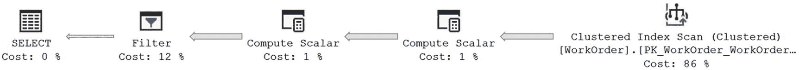

图 18-1：存储过程的执行计划

此计划保存在过程缓存中，以便在重新执行存储过程时可以重用。但是，如果如下所示在表上新增了一个索引，那么现有计划将不再是执行该查询最高效的处理策略。

```
CREATE INDEX IX_Test ON Production.WorkOrder(StockedQty,ProductID);
```

在这种情况下，花费额外的 CPU 周期来重新编译存储过程以生成更好的执行计划是有益的。

由于索引 `IX_Test` 可以作为 `SELECT` 语句的覆盖索引，使用索引 `IX_Test` 代替扫描 `PK_WorkOrder_WorkOrderID` 可以避免书签查找的开销。SQL Server 自动检测到新计划的创建，并重新编译现有计划以考虑使用新索引的优势。这导致了存储过程（执行时）的一个新执行计划，如图 18-2 所示。

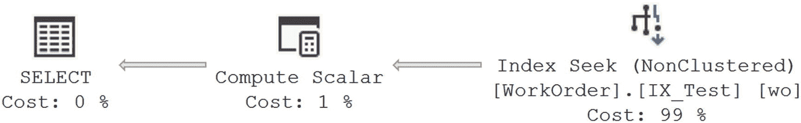

图 18-2：存储过程的新执行计划


SQL Server 会自动检测需要重新编译现有执行计划的条件。SQL Server 遵循特定规则来判断现有计划何时需要重新编译。如果某个查询的具体实现符合重编译规则（例如执行计划过期、`SET` 选项更改等），那么该语句每次满足重编译要求时都会重新编译，而 SQL Server 可能生成也可能不生成更好的执行计划。要观察这一现象，你需要一个不同的存储过程。以下存储过程返回 `WorkOrder` 表中的所有行：

```
CREATE OR ALTER PROCEDURE dbo.WorkOrderAll
AS
SELECT *
FROM Production.WorkOrder AS wo;
```

在执行此过程之前，请先删除索引 `IX_Test`。

```
DROP INDEX Production.WorkOrder.IX_Test;
```

当你执行此过程时，`SELECT` 语句会返回表中的完整数据集（所有行和列），因此通过对表 `WorkOrder` 进行表扫描来执行是最佳方式。如果我们有一个 `SELECT` 列表受限的更合适的查询，扫描非聚集索引可能是一种选择。如第 4 章所述，该 `SELECT` 语句的处理不会从任何列上的非聚集索引中获益。因此，理想情况下，在存储过程执行前创建非聚集索引（如下所示）不应该有影响。

```
EXEC dbo.WorkOrderAll;
GO
CREATE INDEX IX_Test ON Production.WorkOrder(StockedQty,ProductID);
GO
EXEC dbo.WorkOrderAll; -- 在创建索引 IX_Test 之后
```

但在索引创建后执行存储过程时，会面临重编译，如图 18-3 中相应的扩展事件输出所示。


*图 18-3 存储过程无益的重编译*

使用了 `sql_statement_recompile` 事件来跟踪语句重编译。旧式跟踪事件中已没有单独的存储过程重编译事件。

在此情况下，重编译对存储过程并无实际好处。但不幸的是，它符合导致 SQL Server 在架构发生更改后每次执行存储过程都进行重编译的条件。这会使存储过程的计划缓存失效，并在此次执行中浪费 CPU 周期来重新生成相同的计划。因此，了解导致查询重编译的条件至关重要，并且在实现旨在重用计划的存储过程和参数化查询时，应尽一切努力避免这些条件。在确定了在各种情况下导致 SQL Server 重编译语句的具体语句后，我接下来将讨论这些条件。

## 识别导致重编译的语句

SQL Server 可以重编译过程中的单个语句或整个过程。因此，要找到重编译的原因，识别出无法重用现有计划的 SQL 语句非常重要。

你可以使用扩展事件会话来跟踪语句重编译。你还可以使用相同的事件来识别导致重编译的存储过程语句。以下是你可以使用的相关事件：

*   `sql_batch_completed` 和/或 `rpc_completed`
*   `sql_statement_recompile`
*   `sql_batch_starting` 和/或 `rpc_starting`
*   `sql_statement_completed` 和/或 `sp_statement_completed` *(可选)*
*   `sql_statement_starting` 和/或 `sp_statement_completed` *(可选)*

## 注意

SQL Server 2008 支持扩展事件，但 `rpc_completed` 和 `rpc_starting` 事件当时并未返回正确的信息。对于较旧的查询，你可能需要改用 `module_end` 和 `module_starting`。

考虑以下简单的存储过程：

```
CREATE OR ALTER PROC dbo.TestProc
AS
CREATE TABLE #TempTable (C1 INT);
INSERT INTO #TempTable (C1)
VALUES (42);
-- 数据更改导致重编译
GO
```

首次执行此存储过程时，你会得到如图 18-4 所示的扩展事件输出。

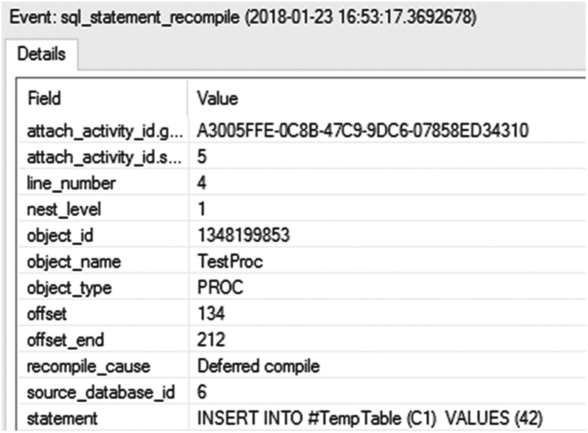
*图 18-4 显示来自重编译的 `sql_statement_recompile` 事件的扩展事件输出*

```
EXEC dbo.TestProc;
```

在图 18-4 中，你可以看到一个重编译事件 (`sql_statement_recompile`)，表明存储过程内部的一条语句经历了重编译。正如前一章所述，当首次执行存储过程时，SQL Server 会编译该存储过程并为其内部所有语句生成执行计划。

顺便说一句，如果你正在使用扩展事件跟踪，可能会看到其他语句。只需按数据库 ID 进行筛选或分组，以便更容易看到你感兴趣的事件。在扩展事件会话上设置筛选器总是一个好主意。

由于执行计划仅保存在易失性内存中，因此当 SQL Server 重启时它们会被丢弃。在服务器重启后下一次执行存储过程时，SQL Server 会再次编译存储过程并生成执行计划。这些编译不被视为存储过程重编译，因为缓存中原本没有可供重用的计划。而 `sql_statement_recompile` 事件表明已存在一个计划但无法重用。

## 注意

我将在“分析重编译原因”一节中讨论 `recompile_cause` 数据列的重要性。

要查看是哪条语句导致了重编译，请查看 `sql_statement_recompile` 事件内的 `statement` 列。它具体显示了正在被重编译的语句。你也可以通过结合使用各种语句启动事件与重编译事件，来识别导致重编译的存储过程语句。如果在扩展事件会话中启用了因果跟踪，你将获得事件开始的标识符，以及同一事件链中其他事件的序列号。`Id` 和序列号是图 18-4 中的前两列。

请注意，在语句重编译之后，导致重编译的存储过程语句会重新启动以使用新计划执行。你可以通过事件捕获该语句，使用时间戳按序列关联事件，或者最好的方法是使用扩展事件上的因果跟踪。这些方法中的任何一种都可用于追踪具体是哪条语句导致了重编译。


## 分析重编译的原因

为了提升性能，分析重编译的原因至关重要。通常，重编译并非必要，你可以避免它以改善性能。例如，每次经历编译或重编译过程时，你都在使用 CPU 让优化器完成工作。在编译过程中，你也在将执行计划移入和移出内存。当查询重编译时，在该重编译过程运行期间，该查询会被阻塞，这意味着频繁调用的查询如果也必须经历重编译，就可能成为主要的性能瓶颈。了解导致重编译的不同条件有助于你评估重编译的原因，并确定如何在不必要时避免重编译。语句重编译发生的原因如下：

*   存储过程语句中引用的常规表、临时表或视图的架构已发生更改。架构更改包括表的元数据或表上的索引的更改。
*   与常规表或临时表列的绑定（例如默认值）已更改。
*   表索引或列上的统计信息已更改，无论是自动还是手动更改，且更改程度超出了第 13 章讨论的阈值。
*   存储过程编译时某个对象不存在，但在执行期间被创建。这称为**延迟对象解析**，它是前述重编译的原因。
*   `SET` 选项已更改。
*   执行计划因老化而被释放。
*   显式调用了 `sp_recompile` 系统存储过程。
*   显式使用了 `RECOMPILE` 提示。

你可以在扩展事件中看到这些原因。`sql_statement_recompile` 事件的 `recompile_cause` 数据列值指明了原因。让我们更详细地查看上面列出的一些重编译原因，并讨论你可以采取哪些措施来避免它们。

### 架构或绑定更改

当视图、常规表或临时表的架构或绑定发生更改时，现有查询的执行计划即失效。在执行任何引用了已修改对象的语句之前，必须重新编译该查询。SQL Server 会自动检测这种情况并重新编译存储过程。

**注意：** 我将在“重编译的优点和缺点”一节中更详细地讨论因架构更改导致的重编译。

### 统计信息更改

SQL Server 会跟踪表的更改次数。如果更改次数超过了重编译阈值 (RT) 值，那么当语句中引用该表时，SQL Server 会自动更新统计信息，正如你在第 13 章所见。当检测到自动更新统计信息的条件时，SQL Server 会自动将该语句标记为重编译，同时进行统计信息更新。

RT 由一个公式决定，该公式取决于表是永久表还是临时表（不是表变量），以及表中的行数。表 18-1 显示了基本公式，以便你能确定何时会因数据更改而看到语句重编译。

**表 18-1** 确定数据更改的公式

| 表类型 | 公式 |
| :--- | :--- |
| 永久表 | 如果行数 (`n`) <= 500，则 `RT = 500`。 |
|  | 如果 `n > 500`，则 `RT = .2 * n` 或 `Sqrt(1000*NumberOfRows)`。 |
| 临时表 | 如果 `n < 6`，则 `RT = 6`。 |
|  | 如果 `6 <= n <= 500`，则 `RT = 500`。 |
|  | 如果 `n > 500`，则 `RT = .2 * n` 或 `Sqrt(1000*NumberOfRows)`。 |

要理解统计信息更改如何导致重编译，请考虑以下示例。存储过程在第一次执行时表中只有一行。在第二次执行存储过程之前，向表中添加了大量行。

**注意：** 请确保数据库的 `AUTO_UPDATE_STATISTICS` 设置为 `ON`。你可以通过执行以下查询来确定 `AUTO_UPDATE_STATISTICS` 设置：

`SELECT DATABASEPROPERTYEX('AdventureWorks2017', 'IsAutoUpdateStatistics');`

```sql
IF EXISTS (   SELECT *
              FROM sys.objects AS o
              WHERE o.object_id = OBJECT_ID(N'dbo.NewOrderDetail')
                AND o.type IN ( N'U' ))
    DROP TABLE dbo.NewOrderDetail;
GO
SELECT *
INTO dbo.NewOrderDetail
FROM Sales.SalesOrderDetail;
GO
CREATE INDEX IX_NewOrders_ProductID ON dbo.NewOrderDetail (ProductID);
GO
CREATE OR ALTER PROCEDURE dbo.NewOrders
AS
    SELECT nod.OrderQty,
           nod.CarrierTrackingNumber
    FROM dbo.NewOrderDetail AS nod
    WHERE nod.ProductID = 897;
GO
SET STATISTICS XML ON;
EXEC dbo.NewOrders;
SET STATISTICS XML OFF;
GO
```

接下来，你需要在重新执行存储过程之前修改一定数量的行。

```sql
UPDATE dbo.NewOrderDetail
SET    ProductID = 897
WHERE  ProductID BETWEEN 800
                 AND     900;
GO
SET STATISTICS XML ON;
EXEC dbo.NewOrders;
SET STATISTICS XML OFF;
GO
```

第一次，SQL Server 使用 `Index Seek` 操作执行存储过程的 `SELECT` 语句，如图 18-5 所示。

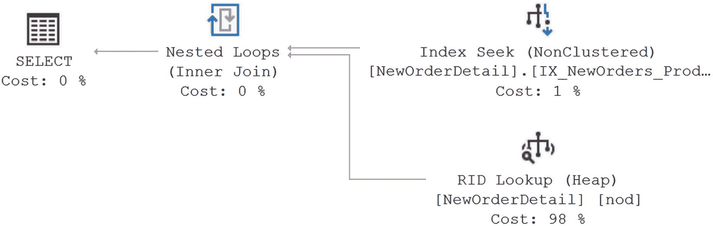

**图 18-5** 数据更改前的执行计划

**注意：** 请确保图形执行计划的设置为 `OFF`；否则，`STATISTICS XML` 的输出将不会显示。

在重新执行存储过程时，SQL Server 自动检测到索引上的统计信息已更改。这导致存储过程内的 `SELECT` 语句重编译，优化器在执行存储过程内的 `SELECT` 语句之前确定了更好的处理策略，如图 18-6 所示。

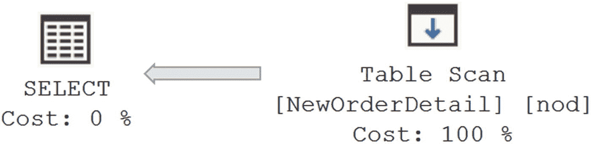

**图 18-6** 统计信息更改对执行计划的影响

图 18-7 显示了相应的扩展事件输出。


**图 18-7** 统计信息更改对存储过程重编译的影响

在图 18-7 中，你可以看到在第二次执行存储过程期间，为了执行 `SELECT` 语句，需要一次重编译。从 `recompile_cause` 的值 (`Statistics Changed`) 可以理解，重编译是由于统计信息更改引起的。作为创建新计划的一部分，统计信息会自动更新，如发生在语句重编译调用之后的 `Auto Stats` 事件所示。你还可以使用 `DBCC SHOW_STATISTICS` 语句或 `sys.dm_db_stats_properties` 验证统计信息的自动更新，如第 13 章所述。


### 延迟对象解析

查询通常会动态创建并随后访问数据库对象。当首次执行此类查询时，初始执行计划不会包含有关将在运行时创建的对象的信息。因此，在第一个执行计划中，对这些对象的处理策略被延迟到查询运行时才确定。当引用这些对象之一的 DML 语句（在查询内）被执行时，查询会被重新编译，以生成一个包含该对象处理策略的新计划。

普通表和本地临时表都可以在存储过程中创建，用于保存中间结果集。由于延迟对象解析而导致的语句重新编译，对于普通表和本地临时表的行为有所不同，如下节所述。

#### 因普通表导致的重编译

要理解在存储过程中创建普通表所引起的查询重新编译问题，请考虑以下示例：

```
CREATE OR ALTER PROC dbo.TestProc
AS
CREATE TABLE dbo.ProcTest1 (C1 INT); --确保表不存在
SELECT *
FROM dbo.ProcTest1; --导致重新编译
DROP TABLE dbo.ProcTest1;
GO
EXEC dbo.TestProc; --首次执行
EXEC dbo.TestProc; --第二次执行
```

当存储过程首次执行时，在存储过程实际执行之前会生成一个执行计划。如果在创建存储过程之前，存储过程中创建的表不存在（如前面代码中预期），则该计划不会包含引用该表的 `SELECT` 语句的处理策略。因此，为了执行 `SELECT` 语句，该语句需要重新编译，如图 18-8 所示。

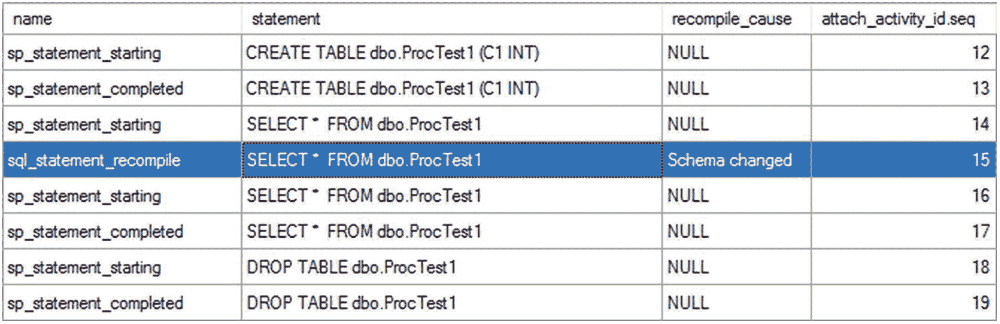

图 18-8
显示因普通表而导致存储过程重新编译的扩展事件输出

可以看到 `SELECT` 语句在第二次执行时被重新编译。在第一次执行期间删除表并不会删除保存在计划缓存中的查询计划。在随后执行存储过程时，现有计划包含了对应该表的处理策略。然而，由于存储过程内部的表被重新创建，SQL Server 将其视为对表架构的更改。因此，在随后执行存储过程的剩余部分、执行 `SELECT` 语句之前，SQL Server 会重新编译存储过程中的该语句。相应 `sql_statement_recompile` 事件的 `recompile_clause` 值反映了重新编译的原因。

#### 因本地临时表导致的重编译

在存储过程中，大多数时候你创建的是本地临时表而非普通表。要了解本地临时表如何以不同的方式影响存储过程的重新编译，只需将前面示例中的普通表替换为本地临时表。

```
CREATE OR ALTER PROC dbo.TestProc
AS
CREATE TABLE #ProcTest1 (C1 INT); --确保表不存在
SELECT *
FROM #ProcTest1; --导致重新编译
DROP TABLE #ProcTest1;
GO
EXEC dbo.TestProc; --首次执行
EXEC dbo.TestProc; --第二次执行
```

由于本地临时表在存储过程执行结束时会自动删除，因此无需显式删除该临时表。但是，遵循良好的编程实践，你可以在其工作完成后立即删除本地临时表。图 18-9 显示了前面示例的扩展事件输出。


图 18-9
显示因本地临时表而导致存储过程重新编译的扩展事件输出

可以看到查询在首次执行时被重新编译。根据相应的 `recompile_cause` 值指示，重新编译的原因与普通表的情况相同。但是请注意，当重新执行存储过程时，它不会像普通表那样被重新编译。

在随后执行存储过程期间，本地临时表的架构与之前执行时保持相同。本地临时表在存储过程的作用域之外不可用，因此其架构无法在多次执行之间以任何方式被更改。因此，SQL Server 在随后的存储过程执行期间安全地重用现有计划（基于本地临时表的先前实例），从而避免了重新编译。

## 注意

为了避免重新编译，在存储过程中使用本地临时表来保存中间结果集，而不是使用临时创建的普通表，这是有道理的。但是，这仅在你可以避免数据偏斜的情况下才有意义，数据偏斜可能导致其他糟糕的执行计划。在那种情况下，重新编译可能没那么痛苦。

### SET 选项更改

存储过程的执行计划依赖于环境设置。如果在存储过程中更改了环境设置，那么 SQL Server 会在每次执行时重新编译查询。例如，考虑以下代码：

```
CREATE OR ALTER PROC dbo.TestProc
AS
SELECT  'a' + NULL + 'b'; --第 1 个
SET CONCAT_NULL_YIELDS_NULL OFF;
SELECT  'a' + NULL + 'b'; --第 2 个
SET ANSI_NULLS OFF;
SELECT  'a' + NULL + 'b';
--第 3 个
GO
EXEC dbo.TestProc; --首次执行
EXEC dbo.TestProc; --第二次执行
```

在存储过程中更改 `SET` 选项会导致 SQL Server 在执行 `SET` 语句之后的语句之前重新编译存储过程。因此，该存储过程被重新编译两次：一次在执行第二个 `SELECT` 语句之前，一次在执行第三个 `SELECT` 语句之前。图 18-10 中的扩展事件输出展示了这一点。


图 18-10
显示因 SET 选项更改而导致存储过程重新编译的扩展事件输出

如果重新执行该过程，你不会看到重新编译，因为这些现在已成为执行计划的一部分。

由于 `SET NOCOUNT` 不会更改环境设置，不像前面所示用于更改 ANSI 设置的 `SET` 语句，`SET NOCOUNT` 不会导致存储过程重新编译。我在第 19 章详细解释了如何使用 `SET NOCOUNT`。

### 执行计划老化

正如你在第 16 章中所见，SQL Server 通过维护缓存中执行计划的“年龄”来管理过程缓存的大小。如果一个存储过程很长时间没有被重新执行，其执行计划的年龄字段可能会降至 0，并且由于内存压力，该计划可能会从缓存中被移除。当这种情况发生且存储过程被重新执行时，将生成一个新计划并缓存在过程缓存中。但是，如果系统中有足够的内存，未使用的计划在内存压力增加之前不会从缓存中移除。


### 显式调用 `sp_recompile`

当架构发生更改或统计信息发生足够大的变化时，SQL Server 会自动重新编译查询。它还提供了 `sp_recompile` 系统存储过程，用于手动将整个存储过程标记为需要重新编译。此存储过程可以在表、视图、存储过程或触发器上调用。如果在存储过程或触发器上调用，则该存储过程或触发器将在下次执行时重新编译。在表或视图上调用 `sp_recompile` 会标记所有引用该表/视图的存储过程和触发器，以便它们在下次执行时重新编译。

例如，如果在表 `Test1` 上调用 `sp_recompile`，则所有引用表 `Test1` 的存储过程和触发器都会被标记为需要重新编译，并在下次执行时重新编译，如下所示：
```sql
sp_recompile  'Test1';
```
你可以使用 `sp_recompile` 来取消在使用 `sp_executesql` 执行动态查询时对现有执行计划的重用。如前一章所述，你不应该对查询的可变部分进行参数化，特别是当该部分的值范围可能需要查询采用不同的处理策略时。例如，回顾相应的示例，你知道查询的第二次执行重用了为第一次执行生成的计划。此处重复该示例以便参考：
```sql
--clear the procedure cache
DECLARE @planhandle VARBINARY(64)
SELECT @planhandle = deqs.plan_handle
FROM sys.dm_exec_query_stats AS deqs
CROSS APPLY sys.dm_exec_sql_text(deqs.sql_handle) AS dest
WHERE dest.text LIKE '%SELECT soh.SalesOrderNumber,%'
IF @planhandle IS NOT NULL
DBCC FREEPROCCACHE(@planhandle);
GO
DECLARE @query NVARCHAR(MAX);
DECLARE @param NVARCHAR(MAX);
SET @query
= N'SELECT soh.SalesOrderNumber,
soh.OrderDate,
sod.OrderQty,
sod.LineTotal
FROM Sales.SalesOrderHeader AS soh
JOIN Sales.SalesOrderDetail AS sod
ON soh.SalesOrderID = sod.SalesOrderID
WHERE soh.CustomerID >= @CustomerId;'
SET @param = N'@CustomerId INT';
EXEC sp_executesql @query, @param, @CustomerId = 1;
EXEC sp_executesql @query, @param, @CustomerId = 30118;
```
查询的第二次执行在 `SalesOrderHeader` 表上执行了 `Index Scan`（索引扫描）操作来检索数据。如第 8 章所述，对于第二次执行，本应更倾向于在 `SalesOrderHeader` 表上执行 `Index Seek`（索引查找）操作。你可以通过如下方式在 `SalesOrderHeader` 表上执行 `sp_recompile` 系统存储过程来实现这一点：
```sql
EXEC sp_recompile  'Sales.SalesOrderHeader'
```
现在，如果使用第二个参数值重新执行该查询，查询计划将按照前面 `sp_recompile` 语句的标记进行重新编译。这使得 SQL Server 能够为第二次执行生成一个最优计划。

嗯，这里有个小问题：你很可能需要再次执行第一条语句。由于计划已存在于缓存中，即使对于第一条语句而言，使用索引过滤条件列 `soh.CustomerID` 上的索引进行 `Index Seek` 操作本会是最优的，SQL Server 仍会重用该计划（即对 `SalesOrderHeader` 表的 `Index Scan` 操作）。避免此问题的一种方法是为查询创建一个存储过程，并在该语句上使用 `OPTION` (`RECOMPILE`) 子句。接下来我将介绍控制重新编译的各种方法。

### 显式使用 RECOMPILE

SQL Server 允许通过三种方式使用 `RECOMPILE` 命令来显式重新编译存储过程和查询：在 `CREATE PROCEDURE` 语句中、作为 `EXECUTE` 语句的一部分，以及在查询提示中。这些方法会降低执行计划的可重用性，并可能导致 CPU 的大量使用，因此你应仅在以下各节所述的具体情况下考虑使用它们。

#### 在 CREATE PROCEDURE 语句中使用 RECOMPILE 子句

有时，存储过程的执行计划会随着传递给它的参数值的变化而变化。在这种情况下，重用具有不同参数值的执行计划可能会降低存储过程的性能。你可以通过将 `RECOMPILE` 子句与 `CREATE PROCEDURE` 语句结合使用来避免此问题。例如，对于上一节中的查询，你可以使用 `RECOMPILE` 子句创建一个存储过程。
```sql
CREATE OR ALTER PROCEDURE dbo.CustomerList @CustomerId INT
WITH RECOMPILE
AS
SELECT soh.SalesOrderNumber,
soh.OrderDate,
sod.OrderQty,
sod.LineTotal
FROM Sales.SalesOrderHeader AS soh
JOIN Sales.SalesOrderDetail AS sod
ON soh.SalesOrderID = sod.SalesOrderID
WHERE soh.CustomerID >= @CustomerId;
GO
```
`RECOMPILE` 子句会阻止对存储过程中每个语句的计划进行缓存。每次执行该存储过程时，都会生成新的计划。因此，如果使用 `soh.CustomerID` 值为 30118 或 1 执行该存储过程，
```sql
EXEC CustomerList
@CustomerId = 1;
EXEC CustomerList
@CustomerId = 30118;
```
则在每次单独执行时都会生成一个新计划，如图 18-11 所示。


*图 18-11: 在创建存储过程时使用 RECOMPILE 子句的效果*

#### 在 EXECUTE 语句中使用 RECOMPILE 子句

如前所示，存储过程中特定的参数值根据其性质可能需要不同的执行计划。你可以将 `RECOMPILE` 子句从存储过程定义中移出，在执行存储过程时根据具体情况使用，如下所示：
```sql
EXEC dbo.CustomerList
@CustomerId = 1
WITH RECOMPILE;
```
当使用 `RECOMPILE` 子句执行存储过程时，会临时生成一个新计划。这个新计划不会被缓存，也不会影响现有的计划。当不使用 `RECOMPILE` 子句执行存储过程时，计划照常被缓存。这提供了一些对现有计划缓存重用性的控制，而不是在 `CREATE PROCEDURE` 语句中使用 `RECOMPILE` 子句。

由于使用 `RECOMPILE` 子句执行的存储过程的计划不会被缓存，因此每次使用 `RECOMPILE` 子句执行存储过程时都会重新生成计划。然而，为了获得更好的性能，你应该考虑创建单独的存储过程（每组需要不同计划的参数值对应一个），前提是这些参数组容易识别，并且你只处理少量可能的执行计划，而不是使用 `RECOMPILE`。

## 使用 RECOMPILE 提示来控制单个语句

虽然你可以使用前面介绍的任意一种方法来重新编译整个存储过程，但如果过程包含多个命令，这种方法可能会带来问题。使用前面的任意一种方法，过程内的所有语句都将被重新编译。查询的编译时间可能是执行某些查询时最耗时的部分，因此应尽量避免重编译。鉴于此，一种更精细的方法是将重编译操作隔离到仅需要它的那条语句上。这可以通过使用 `RECOMPILE` 查询提示来实现，如下所示：

```sql
CREATE OR ALTER PROCEDURE dbo.CustomerList @CustomerId INT
AS
SELECT a.AddressLine1,
a.AddressLine2,
a.City,
a.PostalCode
FROM Person.Address AS a
JOIN Sales.SalesOrderHeader AS soh
ON soh.ShipToAddressID = a.AddressID
WHERE soh.CustomerID = @CustomerId;
SELECT soh.SalesOrderNumber,
soh.OrderDate,
sod.OrderQty,
sod.LineTotal
FROM Sales.SalesOrderHeader AS soh
JOIN Sales.SalesOrderDetail AS sod
ON soh.SalesOrderID = sod.SalesOrderID
WHERE soh.CustomerID >= @CustomerId
OPTION (RECOMPILE);
SELECT bom.BillOfMaterialsID,
p.Name,
sod.OrderQty
FROM Production.BillOfMaterials AS bom
JOIN Production.Product AS p
ON p.ProductID = bom.ProductAssemblyID
JOIN Sales.SalesOrderDetail AS sod
ON sod.ProductID = p.ProductID
JOIN Sales.SalesOrderHeader AS soh
ON soh.SalesOrderID = sod.SalesOrderID
WHERE soh.CustomerID = @CustomerId;
GO
```

在此存储过程中的中间查询，其表现看起来与将 `RECOMPILE` 应用于整个过程的查询相同。但是，如果你向此查询添加多条语句，那么只有带有 `OPTION (RECOMPILE)` 查询提示的语句才会在过程的每次执行时被编译。

## 避免重编译

有时重编译是有益的，但有时则值得避免。如果在查询的 `WHERE` 或 `JOIN` 子句引用的列上创建了新索引，那么重新生成引用该表的存储过程的执行计划是合理的，这样它们才能从使用索引中受益。但是，如果认为重编译对性能有害（例如，它导致阻塞或耗尽 CPU 等资源），你可以通过遵循以下实现实践来避免它：

*   不要交错使用 DDL 和 DML 语句。
*   避免由统计信息更改引起的重编译。
*   使用 `KEEPFIXED PLAN` 选项。
*   在表上禁用自动更新统计信息功能。
*   使用表变量。
*   避免在存储过程中更改 `SET` 选项。
*   使用 `OPTIMIZE FOR` 查询提示。
*   使用计划指南。

### 不要交错使用 DDL 和 DML 语句

在存储过程中，DDL 语句常用于创建局部临时表并更改其架构（包括添加索引）。这样做会影响现有计划的有效性，并可能在执行引用这些表的存储过程语句时导致重编译。要理解对局部临时表使用 DDL 语句如何导致存储过程重复重编译，请考虑以下示例：

```sql
IF (SELECT OBJECT_ID('dbo.TempTable')) IS NOT NULL
DROP PROC dbo.TempTable
GO
CREATE PROC dbo.TempTable
AS
CREATE TABLE #MyTempTable (ID INT,
Dsc NVARCHAR(50))
INSERT INTO #MyTempTable (ID,
Dsc)
SELECT pm.ProductModelID,
pm.Name
FROM Production.ProductModel AS pm; --需要第 1 次重编译
SELECT *
FROM #MyTempTable AS mtt;
CREATE CLUSTERED INDEX iTest ON #MyTempTable (ID);
SELECT *
FROM #MyTempTable AS mtt; --需要第 2 次重编译
CREATE TABLE #t2 (c1 INT);
SELECT *
FROM #t2;
--需要第 3 次重编译
GO
EXEC dbo.TempTable; --首次执行
```

该存储过程交错使用了 DDL 和 DML 语句。图 18-12 展示了此代码的扩展事件输出。


图 18-12：显示因 DDL 和 DML 交错导致重编译的扩展事件输出。

这些语句被重编译了四次。

*   查询首次执行时生成的执行计划不包含任何关于局部临时表的信息。因此，首次生成的计划永远无法用于通过 DML 语句访问临时表。
*   第二次重编译来自于表在加载数据时遇到的数据内容变化。
*   第三次重编译是由于第一个临时表 (`#MyTempTable`) 的架构发生更改。在 `#MyTempTable` 上创建索引会使现有计划无效，导致再次访问该表时发生重编译。如果此索引是在第一次重编译之前创建的，那么现有计划对于第二个 `SELECT` 语句也仍然有效。因此，你可以通过将 `CREATE INDEX` DDL 语句放在所有引用该表的 DML 语句之前来避免此次重编译。
*   第四次重编译生成了一个包含对 `#t2` 处理策略的计划。现有计划没有关于 `#t2` 的信息，因此无法用于通过第三个 `SELECT` 语句访问 `#t2`。如果用于 `#t2` 的 `CREATE TABLE` DDL 语句被放置在所有可能导致重编译的 DML 语句之前，那么第一次重编译本身就会包含关于 `#t2` 的信息，从而避免第三次重编译。

### 避免由统计信息更改引起的重编译

在“分析重编译原因”部分，你看到统计信息的更改是导致重编译的原因之一。在数据分布均匀的简单表上，由于统计信息更改而进行的重编译可能会生成与之前相同的计划。在这种情况下，重编译可能是不必要的，如果成本太高则应避免。但是，大多数情况下，统计信息的更改需要反映在执行计划中。我这里谈论的是那些重编译时间长或过度重编译影响 CPU 的情况。

你有两种技术可以避免由统计信息更改引起的重编译。

*   使用 `KEEPFIXED PLAN` 选项。
*   在表上禁用自动更新统计信息功能。


### 使用 `KEEPFIXED PLAN` 选项

SQL Server 提供了 `KEEPFIXED PLAN` 选项来避免因统计信息更改而导致的重编译。要理解如何使用 `KEEPFIXED PLAN`，请参考 `statschanges.sql` 文件，其中包含使用 `KEEPFIXED PLAN` 选项的适当修改。

```sql
IF (SELECT OBJECT_ID('dbo.Test1')) IS NOT NULL
DROP TABLE dbo.Test1;
GO
CREATE TABLE dbo.Test1 (C1 INT,
C2 CHAR(50));
INSERT INTO dbo.Test1
VALUES (1, '2');
CREATE NONCLUSTERED INDEX IndexOne ON dbo.Test1 (C1);
GO
--Create a stored procedure referencing the previous table
CREATE OR ALTER PROC dbo.TestProc
AS
SELECT *
FROM dbo.Test1 AS t
WHERE t.C1 = 1
OPTION (KEEPFIXED PLAN);
GO
--First execution of stored procedure with 1 row in the table
EXEC dbo.TestProc;
--First execution
--Add many rows to the table to cause statistics change
WITH Nums
AS (SELECT 1 AS n
UNION ALL
SELECT n + 1
FROM Nums
WHERE n < 1000)
INSERT INTO dbo.Test1 (C1,
C2)
SELECT 1,
n
FROM Nums
OPTION (MAXRECURSION 1000);
GO
--Reexecute the stored procedure with a change in statistics
EXEC dbo.TestProc; --With change in data distribution
```

图 18-13 显示了扩展事件输出。


图 18-13：扩展事件输出，展示了 `KEEPFIXED PLAN` 选项在减少重编译中的作用

可以看到，与之前数据变化的示例不同，这里没有 `auto_stats` 事件（见图 18-7）。因此，没有发生额外的重编译。所以，通过使用 `KEEPFIXED PLAN` 选项，可以避免因统计信息更改而导致的重编译。

在图 18-13 中可以看到一个重编译事件，但它是数据修改查询的结果，而不是存储过程执行的结果。如果没有 `KEEPFIXED PLAN` 选项，你会看到因存储过程执行而产生的重编译。

> **注意**
>
> 这是一个潜在危险的选择。在考虑使用此选项之前，请确保本应生成的新计划并不优于现有计划，并且您已经尝试了所有其他可能的解决方案。在大多数情况下，重编译查询是更可取的，尽管成本可能较高。

### 在表上禁用自动更新统计信息

您也可以通过禁用相关表上的自动统计信息更新来避免因统计信息更新导致的重编译。例如，您可以按如下方式在表 `Test1` 上禁用自动更新统计信息功能：

```sql
EXEC sp_autostats
'dbo.Test1',
'OFF' ;
```

如果您在插入大量导致统计信息更改的行之前在表上禁用此功能，则可以避免因统计信息更改而导致的重编译。

但是，请谨慎使用此技术，因为过时的统计信息会对基于成本的优化器的有效性产生不利影响，如第 13 章所述。同样，如第 13 章所述，如果禁用统计信息的自动更新，您应该有一个 SQL 作业来手动定期更新统计信息。

### 使用表变量

SQL Server 2014 支持的变量类型之一是表变量。您可以像使用其他数据类型一样，使用 `DECLARE` 语句创建表变量数据类型。它的行为类似于局部变量，您可以在存储过程内部使用它来保存中间结果集，就像使用临时表一样。

如果使用表变量，可以避免由临时表引起的重编译。由于未为表变量创建统计信息，因此与临时表相关的不同重编译问题不适用于它。例如，考虑第 “表” 一节中使用的脚本（原文此处表述不清，但上下文表明它指向一个导致重编译的示例）：

```sql
CREATE OR ALTER PROC dbo.TestProc
AS
CREATE TABLE #TempTable (C1 INT);
INSERT INTO #TempTable (C1)
VALUES (42);
-- data change causes recompile
GO
EXEC dbo.TestProc; --First execution
```

由于延迟的对象解析，存储过程在第一次执行期间会重编译。您可以通过使用表变量来避免这种由临时表引起的重编译，如下所示：

```sql
CREATE OR ALTER PROC dbo.TestProc
AS
DECLARE @TempTable TABLE (C1 INT);
INSERT INTO @TempTable (C1)
VALUES (42);
--Recompilation not needed
GO
EXEC dbo.TestProc; --First execution
```

图 18-14 显示了存储过程第一次执行的扩展事件输出。通过使用表变量，避免了由临时表引起的重编译。


图 18-14：扩展事件输出，展示了表变量在解决重编译问题中的作用

然而，表变量有其局限性。主要局限如下：

*   一旦创建表变量，就不能在其上执行 DDL 语句，这意味着以后无法向表变量添加索引或约束。约束只能作为表变量的 `DECLARE` 语句的一部分指定。因此，只能使用 `PRIMARY KEY` 或 `UNIQUE` 约束在表变量上创建一个索引。
*   未为表变量创建统计信息，这意味着它们在执行计划中被解析为单行表。当表实际只包含少量数据时（大约少于 100 行），这不是问题。当表变量包含更多数据时，它会成为一个主要的性能问题，因为执行计划中关于正确操作类型的适当决策完全依赖于统计信息。

### 避免在存储过程中更改 SET 选项

通常建议您不要在存储过程中更改环境设置，从而避免因 `SET` 选项更改而导致的重编译。为了 ANSI 兼容性，建议将以下 `SET` 选项保持为 `ON`：

*   `ARITHABORT`
*   `CONCAT_NULL_YIELDS_NULL`
*   `QUOTED_IDENTIFIER`
*   `ANSI_NULLS`
*   `ANSI_PADDING`
*   `ANSI_WARNINGS`
*   而 `NUMERIC_ROUNDABORT` 应设置为 `OFF`。

前面的示例说明了当您选择在过程中修改 `SET` 选项时会发生什么。


### 使用 OPTIMIZE FOR 查询提示

尽管您可能并不总是能够减少或消除重新编译，但使用 `OPTIMIZE FOR` 查询提示可以在重新编译确实发生时，帮助您获得所需的执行计划。`OPTIMIZE FOR` 查询提示使用您提供的参数值来编译执行计划，而不管调用应用程序传递的参数值是什么。

以本章前面的 `CustomerList` 为例。您知道，如果此过程接收到某些特定值，它将需要创建一个新的计划。根据您对数据的了解，您还知道另外两个重要事实：此查询返回小型数据集的频率极低，并且当此查询使用了错误的计划时，性能会受到影响。与其让它反复重新编译，不如修改它，使其创建在大多数情况下效果最佳的计划。

```sql
CREATE OR ALTER PROCEDURE dbo.CustomerList @CustomerID INT
AS
SELECT soh.SalesOrderNumber,
soh.OrderDate,
sod.OrderQty,
sod.LineTotal
FROM Sales.SalesOrderHeader AS soh
JOIN Sales.SalesOrderDetail AS sod
ON soh.SalesOrderID = sod.SalesOrderID
WHERE soh.CustomerID >= @CustomerID
OPTION (OPTIMIZE FOR (@CustomerID = 1));
GO
```

当此查询第一次执行或因任何原因重新编译时，它总是会根据传入值的统计数据获得相同的执行计划。要测试这一点，请按以下方式执行该过程：

```sql
EXEC dbo.CustomerList
@CustomerID = 7920
WITH RECOMPILE;
EXEC dbo.CustomerList
@CustomerID = 30118
WITH RECOMPILE;
```

正如本章前面所述，这将强制该过程在每次执行时都重新编译。图 18-15 显示了由此产生的执行计划。


图 18-15

`WITH RECOMPILE` 不会改变相同的执行计划。

与本章前面的情况不同，现在重新编译该过程并不会产生新的执行计划。相反，无论输入是什么，都会生成相同的计划，因为查询优化器在优化查询时已接到指令，要使用所供应的值 `@Customerld = 1`。

这并没有真正减少重新编译的次数，但它确实帮助您控制了生成的执行计划。这要求您非常了解自己的数据。如果您的数据随时间而变化，您可能需要重新检查使用了 `OPTIMIZE FOR` 查询提示的地方。

要在执行计划中查看该提示，只需查看 `SELECT` 运算符的属性，如图 18-16 所示。


图 18-16

参数编译值与查询提示提供的值匹配。

您可以看到，尽管查询被重新编译并且被赋予了值 30118，但由于提示的存在，所使用的编译值是由提示提供的 1。

### OPTIMIZE FOR UNKNOWN

您可以指定使用 `OPTIMIZE FOR UNKOWN` 来优化查询。这几乎与 `OPTIMIZE FOR` 提示相反。`OPTIMIZE FOR` 提示将尝试使用直方图，而 `OPTIMIZE FOR UNKNOWN` 提示将使用统计信息的密度向量。您是在指示处理器始终基于统计信息的平均值来执行优化，并忽略查询优化时传入的实际值。您可以将其与 `OPTIMIZE FOR <value>` 结合使用。它将针对该参数上提供的值进行优化，但会使用所有其他参数的统计信息。正如前一章所讨论的，这两种机制都是为了处理不良的 **参数探测**。

### 使用计划指南

计划指南允许您使用查询提示或其他优化技术，而无需修改查询或过程文本。这在您拥有需要调整但无法修改的第三方产品中性能不佳的过程时尤其有用。作为优化过程的一部分，如果在编译或重新编译过程时存在计划指南，它将使用该指南来创建执行计划。

在上一节中，我向您展示了使用 `OPTIMIZE FOR` 如何影响为过程创建的执行计划。以下是原始过程中的查询，没有任何提示：

```sql
CREATE OR ALTER PROCEDURE dbo.CustomerList @CustomerID INT
AS
SELECT soh.SalesOrderNumber,
soh.OrderDate,
sod.OrderQty,
sod.LineTotal
FROM Sales.SalesOrderHeader AS soh
JOIN Sales.SalesOrderDetail AS sod
ON soh.SalesOrderID = sod.SalesOrderID
WHERE soh.CustomerID >= @CustomerID;
GO
```

现在，假设此查询是某个第三方应用程序的一部分，您无法修改它来包含 `OPTION` (`OPTIMIZE FOR`)。要为其提供 `OPTIMIZE FOR` 查询提示，请按如下方式创建计划指南：

```sql
sp_create_plan_guide @name = N'MyGuide',
@stmt = N'SELECT soh.SalesOrderNumber,
soh.OrderDate,
sod.OrderQty,
sod.LineTotal
FROM Sales.SalesOrderHeader AS soh
JOIN Sales.SalesOrderDetail AS sod
ON soh.SalesOrderID = sod.SalesOrderID
WHERE soh.CustomerID >= @CustomerID;',
@type = N'OBJECT',
@module_or_batch = N'dbo.CustomerList',
@params = NULL,
@hints = N'OPTION (OPTIMIZE FOR (@CustomerID = 1))';
```

现在，当使用不同的参数执行该过程时，即使如下所示强制使用 `RECOMPILE`，`OPTIMIZE FOR` 提示也会被应用。图 18-17 显示了由此产生的执行计划。

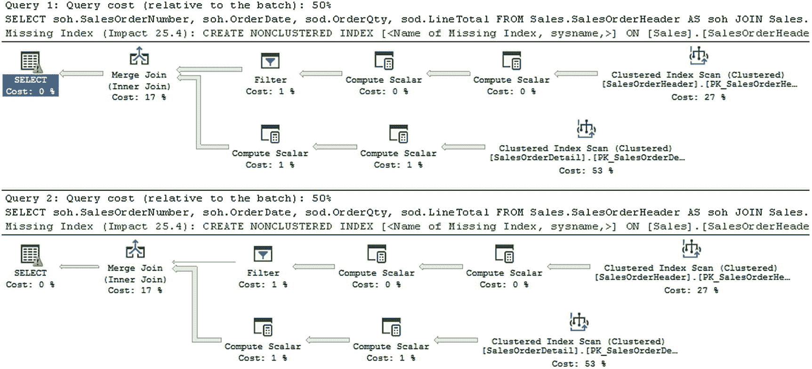

图 18-17

使用计划指南应用 `OPTIMIZE FOR` 查询提示。

```sql
EXEC dbo.CustomerList
@CustomerID = 7920
WITH RECOMPILE;
EXEC dbo.CustomerList
@CustomerID = 30118
WITH RECOMPILE;
```

结果与修改过程时相同，但在这种情况下，无需进行修改。通过再次查看 `SELECT` 属性（图 18-18），您可以看到执行计划中应用了计划指南。

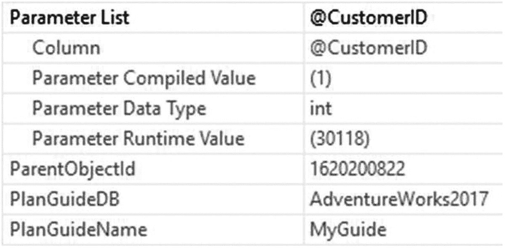

图 18-18

`SELECT` 运算符属性显示了计划指南。

### 计划指南类型

存在各种类型的计划指南。前面的示例是一个 *对象* 计划指南，它是一个与数据库中特定对象（本例中为 `CustomerList`）匹配的指南。您还可以为重复进入系统即席查询创建计划指南，通过创建一个 SQL 计划指南来查找特定的 SQL 语句。假设以下查询（而不是过程）被传递到您的系统，并且需要一个 `OPTIMIZE FOR` 查询提示：

```sql
SELECT soh.SalesOrderNumber,
soh.OrderDate,
sod.OrderQty,
sod.LineTotal
FROM Sales.SalesOrderHeader AS soh
JOIN Sales.SalesOrderDetail AS sod
ON soh.SalesOrderID = sod.SalesOrderID
WHERE soh.CustomerID >= 1;
```

运行此查询会导致您在图 18-19 中看到的执行计划。

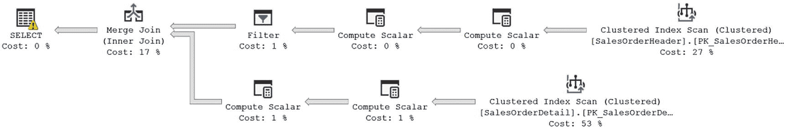

图 18-19

该查询使用了与期望不同的执行计划。

要获得查询计划指南，您首先需要知道查询使用的精确格式，以防强制或简单的参数化更改了查询文本。文本必须精确。如果您第一次尝试创建查询计划指南如下：


### 第 18 章 查询重新编译

执行 `sp_create_plan_guide` `@name = N'MyBadSQLGuide'`,
`@stmt = N'SELECT soh.SalesOrderNumber,
soh.OrderDate,
sod.OrderQty,
sod.LineTotal
FROM Sales.SalesOrderHeader AS soh
join Sales.SalesOrderDetail AS sod
ON soh.SalesOrderID = sod.SalesOrderID
WHERE soh.CustomerID >= @CustomerID'`,
`@type = N'SQL'`,
`@module_or_batch = NULL`,
`@params = N'@CustomerID int'`,
`@hints = N'OPTION  (TABLE HINT(soh,  FORCESEEK))'`;

当运行该 SELECT 查询时，您仍然会得到相同的执行计划。这是因为查询的文本看起来不像为计划指南输入的内容。有几处不同，例如空格和 `JOIN` 语句的大小写。您可以使用以下 T-SQL 语句删除这个不良的计划指南。

```sql
EXECUTE `sp_control_plan_guide` `@operation = 'Drop'`,
`@name = N'MyBadSQLGuide'`;
```

输入正确的语法将创建一个新的计划指南。

```sql
EXECUTE `sp_create_plan_guide` `@name = N'MyGoodSQLGuide'`,
`@stmt = N'SELECT soh.SalesOrderNumber,
soh.OrderDate,
sod.OrderQty,
sod.LineTotal
FROM Sales.SalesOrderHeader AS soh
JOIN Sales.SalesOrderDetail AS sod
ON soh.SalesOrderID = sod.SalesOrderID
WHERE soh.CustomerID >= 1;'`,
`@type = N'SQL'`,
`@module_or_batch = NULL`,
`@params = NULL`,
`@hints = N'OPTION  (TABLE HINT(soh,  FORCESEEK))'`;
```

现在运行查询时，会创建一个完全不同的执行计划，如图 18-20 所示。

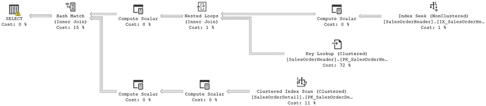

图 18-20

计划指南强制同一个查询使用新的执行计划

当您认为缓存中存在一个符合您期望的计划时，还有一种选择。您可以将该计划捕获到计划指南中，以确保下次运行查询时执行相同的计划。这可以通过运行 `sp_create_plan_guide_from_handle` 来实现。

为了进行测试，首先清空过程缓存（假设我们不是在生产实例上运行），以便精确控制使用哪个查询计划。

```sql
ALTER DATABASE SCOPED CONFIGURATION CLEAR PROCEDURE_CACHE
```

在清空过程缓存并且现有的计划指南 `MyGoodSOQLGuide` 就位后，重新运行查询。它将使用计划指南来获得如图 18-18 所示的执行计划。要查看是否能保留此计划，首先删除强制 `Index Seek` 操作的计划指南。

```sql
EXECUTE `sp_control_plan_guide` `@operation = 'Drop'`,
`@name = N'MyGoodSQLGuide'`;
```

如果您现在重新运行查询，它将恢复到其原始计划。然而，当前在计划缓存中，您有如图 18-18 所示的计划。要保留它，请运行以下脚本：

```sql
DECLARE `@plan_handle` VARBINARY(64),
`@start_offset` INT;
SELECT `@plan_handle` = deqs.plan_handle,
`@start_offset` = deqs.statement_start_offset
FROM sys.dm_exec_query_stats AS deqs
CROSS APPLY sys.dm_exec_sql_text(sql_handle)
CROSS APPLY sys.dm_exec_text_query_plan(deqs.plan_handle,
deqs.statement_start_offset,
deqs.statement_end_offset) AS qp
WHERE text LIKE N'SELECT soh.SalesOrderNumber%'
EXECUTE `sp_create_plan_guide_from_handle` `@name = N'ForcedPlanGuide'`,
`@plan_handle = @plan_handle`,
`@statement_start_offset = @start_offset`;
GO
```

这将基于当前缓存中存在的执行计划创建一个计划指南。为了确保其有效，请再次清空缓存。这样，查询必须生成一个新计划。重新运行查询，并观察执行计划。由于使用了 `sp_create_plan_guide_from_handle` 创建的计划指南，它将与图 18-19 所示的计划相同。

计划指南是控制 SQL 查询和存储过程行为的有用机制，但您只应在对执行计划、数据和系统结构有透彻理解时才使用它们。

## 使用查询存储强制计划

就像使用 `OPTIMIZE FOR` 和计划指南一样，通过查询存储强制计划实际上并不会减少系统上的重新编译次数。然而，它将允许您更好地控制这些重新编译的结果。与计划指南的工作方式类似，随着数据随时间变化，您可能需要重新评估已强制的计划（参见第 11 章）。

## 总结

正如您在本章所学，查询重新编译既可能有益也可能损害性能。生成更好计划的重新编译可以提高存储过程的性能。然而，重新生成相同计划的重新编译会消耗额外的 CPU 周期，而不会改善处理策略。因此，您应该仔细检查重新编译以确定其用处。您可以使用扩展事件来确定是哪个存储过程语句导致了重新编译，并且可以从扩展事件输出中的 `recompile_clause` 数据列值确定原因。一旦确定了重新编译的原因，就可以应用不同的技术来避免不必要的重新编译。

到目前为止，您已经了解了如何从正确的索引和计划缓存中获益。然而，这些技术的性能收益取决于查询的设计方式。SQL Server 的基于成本的优化器处理了许多查询设计问题。但是，在设计查询时，您应采用一些最佳实践。在下一章中，我将介绍一些影响性能的常见查询设计问题。

# 19 章 查询设计分析

数据库架构可能包含许多性能增强特性，如索引、统计信息和存储过程。但如果您的查询一开始就写得很糟糕，这些特性都不能保证良好的性能。SQL 查询可能无法有效地使用可用的索引。SQL 查询的结构可能会给查询成本增加可避免的开销。查询可能试图以逐行的方式处理数据（或者引用 Jeff Moden 的说法，Row By Agonizing Row，缩写为 RBAR，读作“reebar”），而不是使用逻辑集合。为了提高数据库应用程序的性能，理解以不同方式编写查询所关联的成本非常重要。

在本章中，我将涵盖以下主题：

*   影响性能的查询设计方面
*   如何有效地使用索引来设计查询
*   优化器提示对查询性能的作用
*   数据库约束对查询性能的作用

## 查询设计建议

当您需要运行查询时，通常可以使用许多不同的方法来获取相同的数据。在许多情况下，无论查询结构如何，优化器都会生成相同的计划。然而，在某些情况下，查询结构将不允许优化器选择最佳的可能处理策略。重要的是您要意识到这种情况可能发生，并且如果发生，您可以做些什么来避免它。

一般来说，请牢记以下建议以确保最佳性能：

*   操作小型结果集。
*   有效地使用索引。
*   尽量减少优化器提示的使用。
*   使用域完整性和引用完整性。
*   避免资源密集型查询。
*   减少网络往返次数。
*   降低事务成本。（我将在下一章讨论最后三点。）

仔细测试对于识别在特定数据库环境中提供最佳性能的查询形式至关重要。您应该熟悉编写和比较不同的 SQL 查询形式，以便评估在给定环境中提供最佳性能的查询形式。您还需要能够自动化您的测试。


## 操作小型结果集

为了提升查询性能，应限制其操作的数据量，包括列和行。操作小型结果集可以减少查询消耗的资源，并提高索引的有效性。为限制数据集的大小，您应遵循以下两条规则：

*   限制选择列表中的列数，仅包含实际需要的列。
*   使用高选择性的 `WHERE` 子句来限制返回的行数。

需要特别注意的是，您可能会被要求向 OLTP 系统返回数万行数据。仅仅因为有人声称这是业务需求，并不意味着这种要求是合理的。人类无法处理数万行的数据。很少有人能处理数千行的数据。您需要准备好驳回此类请求，并能够说明理由。此外，您经常听到且必须准备好反驳的一个理由是“以防将来我们需要它”。

### 限制 `select_list` 中的列数

在 `SELECT` 语句的选择列表中，使用最精简的列集合。不要使用输出结果集中不需要的列。例如，不要使用 `SELECT *` 来返回所有列。`SELECT *` 语句会使覆盖索引失效，因为将所有列都包含在索引中通常是不切实际的。例如，考虑以下查询：

```sql
SELECT Name,
TerritoryID
FROM Sales.SalesTerritory AS st
WHERE st.Name = 'Australia';
```

在 `Name` 列（并通过聚集键 `ProductID`）上的覆盖索引可以快速地通过索引本身服务该查询，而无需访问聚集索引。当您开启 Extended Events 会话时，会得到以下逻辑读次数和执行时间，以及相应的执行计划（如图 19-1 所示）：


图 19-1：展示引用有限列数所带来的好处的执行计划

```
Reads: 2
Duration: 920 mcs
```

如果将此查询修改为在选择列表中包含所有列，如下所示，则之前的覆盖索引将失效，因为该查询所需的所有列并未全部包含在该索引中：

```sql
SELECT *
FROM Sales.SalesTerritory AS st
WHERE st.Name = 'Australia';
```

随后，必须访问包含所有列的基础表（或聚集索引），如下所示。逻辑读次数和执行时间都增加了。

```
Table 'SalesTerritory'. Scan count 0, logical reads 4
CPU time = 0 ms,   elapsed time = 6.4 ms
```

选择列表中的列越少，提升查询性能的潜力就越大。请记住，我们一直在研究的这个查询是一个简单的查询，只返回一行少量数据，但它的读次数翻了一番，执行时间增加了六倍。选择比严格需要更多的列还会增加网络上的数据传输，进一步降低性能。图 19-2 显示了执行计划。

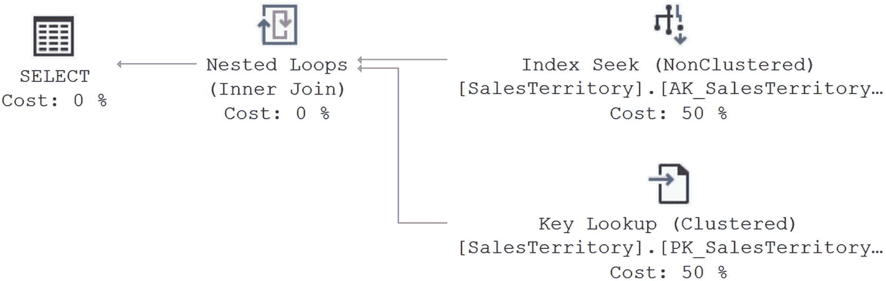

图 19-2：说明引用过多列所带来的额外开销的执行计划

### 使用高选择性的 `WHERE` 子句

如第 8 章所述，`WHERE`、`ON` 和 `HAVING` 子句中引用的列的选择性决定了该列上索引的使用。从表中请求大量行可能无法从使用索引中受益，或者因为根本无法使用索引，或者（对于非聚集索引而言）因为查找操作的额外开销。为确保使用索引，`WHERE` 子句中引用的列应具有高选择性。

大多数情况下，最终用户一次只关注有限数量的行。因此，您应该设计数据库应用程序，使其在用户浏览数据时以增量方式请求数据。对于依赖大量数据进行数据分析或报告的应用程序，考虑使用 Analysis Services 或 PowerPivot 等数据分析解决方案。如果分析是围绕聚合进行的并且涉及大量数据，请使用列存储索引。请记住，返回巨大的结果集代价高昂，而且这些数据不太可能被完整使用。唯一的常见例外是与数据科学家合作时，他们经常需要检索给定数据集的所有数据作为其操作的第一步。仅在这种情况下，您可能需要寻找其他方法来提高性能，例如使用辅助服务器、升级硬件或其他机制。但是，请与他们合作以确保数据只传输一次，而不是重复传输。

## 有效使用索引

在数据库表上拥有有效的索引对于提高性能极为重要。然而，确保查询设计得当以有效使用这些索引同样重要。以下是一些您应遵循的查询设计规则，以改进索引的使用：

*   避免不可参数化的搜索条件。
*   避免在 `WHERE` 子句列上使用算术运算符。
*   避免在 `WHERE` 子句列上使用函数。

我将在以下各节中详细说明这些规则。

### 避免不可参数化的搜索条件

查询中的 *可参数化* 谓词是指可以使用索引的谓词。这个词是“Search ARGument ABLE”的缩写。优化器从索引中受益的能力取决于搜索条件的选择性，而这又取决于 `WHERE`、`ON` 和 `HAVING` 子句中引用的列的选择性，所有这些都依赖于索引上的统计信息。应用于 `WHERE` 子句中列的搜索谓词决定了是否可以对该列执行索引操作。


## 注意事项

关于筛选子句周边的索引及其他功能的使用，主要涉及 `WHERE`、`ON` 和 `HAVING`。为了使内容更易读（和编写），在很多本应包含 `ON` 和 `HAVING` 的情况下，我将仅使用 `WHERE`。除非特别注明，如果你没有看到它们，请在心里默认包含。

表 19-1 列出的可搜索条件通常允许优化器使用 `WHERE` 子句中引用的列上的索引。可搜索条件通常允许 SQL Server 在索引中查找特定行并检索该行（或者在搜索条件保持为真的情况下检索相邻的行范围）。

**表 19-1**

**常见的可搜索与不可搜索的搜索条件**

| 类型 | 搜索条件 |
| --- | --- |
| 可搜索 | 包含条件 `=`、`>`、`>=`、`<`、`<=`、`BETWEEN`，以及某些 `LIKE` 条件，例如 `LIKE '<literal>%'` |
| 不可搜索 | 排除条件 `<>`、`!=`、`!>`、`!<`、`NOT EXISTS`、`NOT IN`、`NOT LIKE`、`IN`、`OR`，以及某些 `LIKE` 条件，例如 `LIKE '%<literal>'` |

另一方面，表 19-1 列出的不可搜索条件通常会阻止优化器使用 `WHERE` 子句中引用的列上的索引。排除搜索条件通常不允许 SQL Server 执行可搜索条件所支持的 `Index Seek` 操作。例如，`!=` 条件需要扫描所有行来识别匹配的行。

请尝试为这些不可搜索条件实现变通方法以提升性能。在某些情况下，可能可以重写查询以避免不可搜索的搜索条件。例如，在某些情况下，`OR` 条件可以被两个（或更多）`UNION ALL` 查询替代，多次查找操作的性能可能优于单次扫描。你也可以考虑用 `BETWEEN` 条件替代 `IN`/`OR` 搜索条件，如下一节所述。关键在于尝试不同的机制，看哪种在给定情况下比另一种更有效。SQL Server 中没有哪一种方法是绝对糟糕的，也没有哪一种方法是完美的。每种方法都有其适用的场景。在尝试提升性能时，请保持灵活并勇于实验。

#### BETWEEN 与 IN/OR 对比

考虑以下使用 `IN` 搜索条件的查询：

```sql
SELECT sod.*
FROM Sales.SalesOrderDetail AS sod
WHERE sod.SalesOrderID IN ( 51825, 51826, 51827, 51828 );
```

编写相同查询的另一种方式是使用 `OR` 命令。

```sql
SELECT sod.*
FROM Sales.SalesOrderDetail AS sod
WHERE sod.SalesOrderID = 51825
   OR sod.SalesOrderID = 51826
   OR sod.SalesOrderID = 51827
   OR sod.SalesOrderID = 51828;
```

你可以用以下 `BETWEEN` 子句替换此查询中的任一搜索条件：

```sql
SELECT sod.*
FROM Sales.SalesOrderDetail AS sod
WHERE sod.SalesOrderID BETWEEN 51825
                       AND     51828;
```

所有三个查询返回相同的结果。表面上看，所有三个查询的执行计划似乎相同，如图 19-3 所示。

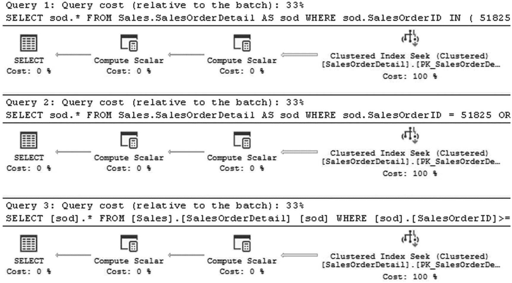

**图 19-3**

使用 BETWEEN 子句的简单 SELECT 语句的执行计划

然而，仔细观察执行计划会发现它们在数据检索机制上的差异，如图 19-4 所示。

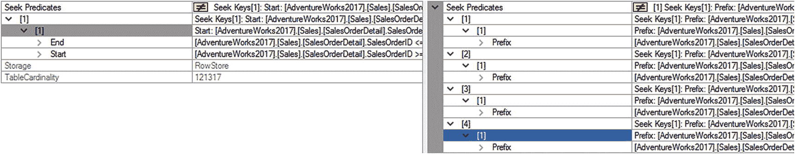

**图 19-4**

BETWEEN 条件（左）和 IN 条件（右）的执行计划详情

如图 19-4 所示，SQL Server 将包含四个值的 `IN` 条件解析为四个 `OR` 条件。因此，为了检索四个 `IN` 和 `OR` 条件对应的行，聚簇索引 (`PK_SalesOrderDetail_SalesOrderID`) 被访问了四次（`扫描次数 4`），如下方的 `STATISTICS IO` 输出所示。另一方面，`BETWEEN` 条件被解析为一对 `>=` 和 `<=` 条件，如图 19-4 所示。SQL Server 只访问聚簇索引一次（`扫描次数 1`），从第一个匹配行开始，直到匹配条件不再成立，如下方的 `STATISTICS IO` 和 `QUERY TIME` 输出所示。

*   使用 `IN` 条件时：

*   使用 `BETWEEN` 条件时：

```text
Table 'SalesOrderDetail'. Scan count 4, logical reads 18
CPU time = 0 ms, elapsed time = 140 ms.
```

```text
Table 'SalesOrderDetail'. Scan count 1, logical reads 6
CPU time = 0 ms, elapsed time = 72 ms.
```

将搜索条件从 `IN` 替换为 `BETWEEN`，将此查询的逻辑读取次数从 18 次减少到了 6 次。如上所示，尽管所有三个查询都使用了基于 `OrderID` 的聚簇索引查找，但优化器使用 `BETWEEN` 子句定位行范围的速度比使用 `IN` 子句快得多。在 `BETWEEN` 条件和 `OR` 子句之间进行比较时，也会发生同样的情况。因此，如果在 `IN`/`OR` 和 `BETWEEN` 搜索条件之间进行选择，请始终选择 `BETWEEN` 条件，因为它通常比 `IN`/`OR` 条件高效得多。事实上，你应该更进一步，使用 `>=` 和 `<=` 的组合来代替 `BETWEEN` 子句，因为这样可以让优化器少做一点工作。

同样值得注意的是，此查询违反了早先关于仅返回有限列集而非使用 `SELECT *` 的建议。如果你查看 `BETWEEN` 操作的属性，它还被更改为带有简单参数化的参数化查询。这可能导致执行计划的重用，如第 18 章所述。

并非每个使用排除搜索条件的 `WHERE` 子句都会阻止优化器使用搜索条件中引用的列上的索引。在许多情况下，SQL Server 优化器在将排除搜索条件转换为可搜索条件方面做得非常出色。为了理解这一点，请考虑以下两个搜索条件，我将在后续章节中讨论：

*   `LIKE` 条件

*   `!<` 条件与 `>=` 条件

## LIKE 条件

在使用 `LIKE` 搜索条件时，如果可能，尽量在 `WHERE` 子句中使用一个或多个前导字符。在 `LIKE` 子句中使用前导字符允许优化器将 `LIKE` 条件转换为对索引友好的搜索条件。`LIKE` 条件中的前导字符数量越多，优化器就越能确定有效的索引。请注意，使用通配符作为 `LIKE` 条件的首字符会**阻止**优化器在索引上执行 `SEEK`（或窄范围扫描）；它依赖于扫描整个表。

要理解 SQL Server 优化器的这个能力，请看下面使用带前导字符的 `LIKE` 条件的 `SELECT` 语句：

```sql
SELECT c.CurrencyCode
FROM Sales.Currency AS c
WHERE c.Name LIKE 'Ice%';
```

SQL Server 优化器会自动进行此转换，如图 19-5 所示。


图 19-5

执行计划显示，带有尾部 % 号的 LIKE 子句会自动转换为可索引的搜索条件

如图所示，优化器自动将 `LIKE` 条件转换为等效的 `>=` 和 `<` 条件对。因此，你可以重写这个 `SELECT` 语句，用可索引的搜索条件替换 LIKE 条件，如下所示：

```sql
SELECT c.CurrencyCode
FROM Sales.Currency AS c
WHERE c.Name >= N'Ice'
AND c.Name < N'IcF';
```

请注意，在这两种情况下，使用 `LIKE` 条件的查询和手动转换的可搜索条件的逻辑读取次数和执行时间都是相同的。因此，如果你在 `LIKE` 子句中包含前导字符，SQL Server 优化器会优化搜索条件以允许使用列上的索引。

## !< 条件与 >= 条件

尽管 `!<` 和 `>=` 搜索条件检索的结果集相同，但它们内部执行的操作可能不同。`>=` 比较运算符允许优化器使用搜索参数中引用的列上的索引，因为该运算符的 `=` 部分允许优化器在索引中搜索到一个起点，并从那里访问所有后续的索引行。另一方面，`!<` 运算符没有 `=` 元素，需要访问每一行的列值。

但真的如此吗？正如第 15 章所解释的，SQL Server 优化器在执行查询前会执行基于语法的优化以提高性能。这使得 SQL Server 能够通过将 `!<` 运算符转换为 `>=` 来解决其性能问题，如图 19-6 所示的两个 `SELECT` 语句的执行计划：

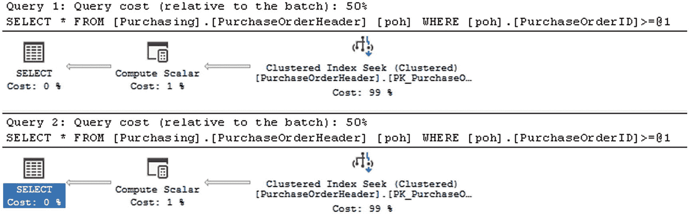

图 19-6

执行计划显示，不可索引的 !< 运算符会自动转换为可索引的 >= 运算符

```sql
SELECT *
FROM Purchasing.PurchaseOrderHeader AS poh
WHERE poh.PurchaseOrderID >= 2975;
SELECT *
FROM Purchasing.PurchaseOrderHeader AS poh
WHERE poh.PurchaseOrderID !< 2975;
```

如你所见，优化器通常为你提供了灵活性，让你可以用首选的 T-SQL 语法编写查询，而不会牺牲性能。

尽管 SQL Server 优化器在许多情况下可以自动优化查询语法以提高性能，但你不应依赖它这样做。一开始就编写高效的查询是一个好习惯。

## 避免在 WHERE 子句列上使用算术运算符

在 `WHERE` 子句中的列上使用算术运算符会阻止优化器使用该列上的统计信息或索引。例如，考虑以下 `SELECT` 语句：

```sql
SELECT *
FROM Purchasing.PurchaseOrderHeader AS poh
WHERE poh.PurchaseOrderID * 2 = 3400;
```

在 `WHERE` 子句中的列上应用了一个乘法运算符 `*`。你可以通过重写 `SELECT` 语句来避免在列上使用它，如下所示：

```sql
SELECT *
FROM Purchasing.PurchaseOrderHeader AS poh
WHERE poh.PurchaseOrderID = 3400 / 2;
```

该表在 `PurchaseOrderID` 列上有一个聚集索引。如第 4 章所述，对此索引执行 `Index Seek` 操作适用于此查询，因为它只返回一行。即使两个查询返回相同的结果集，在第一个查询中对 `PurchaseOrderID` 列使用乘法运算符也会阻止优化器使用该列上的索引，如图 19-7 所示。


图 19-7

执行计划显示，在 WHERE 子句列上使用算术运算符的有害影响

以下是相应的性能指标：

*   在 `PurchaseOrderID` 列上使用 `*` 运算符：
    读取次数: 11
    持续时间: 210mcs

*   在 `PurchaseOrderID` 列上不使用运算符：
    读取次数: 2
    持续时间: 105mcs

因此，为了有效使用索引并提高查询性能，当表达式预期与索引配合使用时，应避免在 `WHERE` 子句或 `JOIN` 条件中的列上使用算术运算符。

值得注意的是，在图 19-7 所示的查询中，两个查询都足够简单，符合参数化条件，如查询中的 `@1` 和 `@2` 所示，而不是提供的实际值。

## 注意

对于小结果集，尽管索引查找通常比表扫描（或完整的聚集索引扫描）是更好的数据检索策略，但对于小表（所有数据行都适合一页），表扫描可能成本更低。我在第 8 章中对此有更详细的解释。

## 避免在 WHERE 子句列上使用函数

与算术运算符类似，在 `WHERE` 子句列上使用函数也会损害查询性能——原因相同。尽量避免在 `WHERE` 子句列上使用函数，如下面的三个示例所示：

*   `SUBSTRING` 与 `LIKE`
*   日期部分比较
*   自定义标量用户定义函数

### SUBSTRING 与 LIKE

在以下 `SELECT` 语句中，使用 `SUBSTRING` 函数阻止了使用 `ShipPostalCode` 列上的索引：

```sql
SELECT d.Name
FROM HumanResources.Department AS d
WHERE SUBSTRING(d.Name,
1,
1) = 'F';
```

图 19-8 说明了这一点。


图 19-8

执行计划显示，在 WHERE 子句列上使用 SUBSTRING 函数的有害影响

如你所见，使用 `SUBSTRING` 函数阻止了优化器使用 `[Name]` 列上的索引。在此列上使用此函数导致优化器使用聚集索引扫描。如果 `DepartmentID` 列上没有聚集索引，则将执行表扫描。

你可以重新设计此 `SELECT` 语句以避免在列上使用函数，如下所示：

```sql
SELECT d.Name
FROM HumanResources.Department AS d
WHERE d.Name LIKE 'F%';
```

此查询允许优化器选择 `[Name]` 列上的索引，如图 19-9 所示。

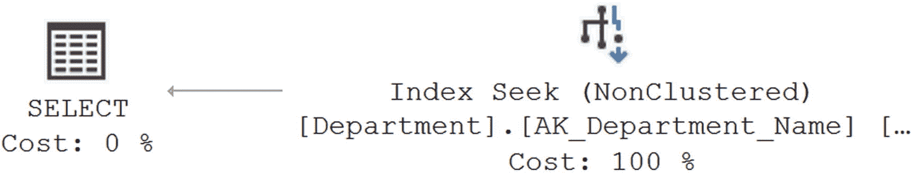

图 19-9

执行计划显示，不在 WHERE 子句列上使用 SUBSTRING 函数的好处


#### 日期部分比较

SQL Server 可以将日期和时间数据存储为独立的字段或组合的 `DATETIME` 字段。虽然您可能需要将日期和时间数据保存在一个字段中，但有时您只需要日期部分，这通常意味着您必须应用转换函数从 `DATETIME` 数据类型中提取日期部分。这样做会阻止优化器选择该列上的索引，如下例所示。

首先，需要在一个表的 `DATETIME` 列上创建一个好的索引。使用 `Sales.SalesOrderHeader` 并创建以下索引：

```
IF EXISTS (   SELECT *
              FROM sys.indexes
              WHERE object_id = OBJECT_ID(N'[Sales].[SalesOrderHeader]')
                AND name = N'IndexTest')
    DROP INDEX IndexTest ON Sales.SalesOrderHeader;
GO
CREATE INDEX IndexTest ON Sales.SalesOrderHeader (OrderDate);
```

要从 `Sales.SalesOrderHeader` 中检索 2008 年 4 月 `OrderDate` 的所有行，您可以执行以下 `SELECT` 语句：

```
SELECT  soh.SalesOrderID,
        soh.OrderDate
FROM    Sales.SalesOrderHeader AS soh
JOIN    Sales.SalesOrderDetail AS sod
    ON soh.SalesOrderID = sod.SalesOrderID
WHERE   DATEPART(yy, soh.OrderDate) = 2008
    AND DATEPART(mm, soh.OrderDate) = 4;
```

在 `OrderDate` 列上使用 `DATEPART` 函数会阻止优化器正确使用该列上的索引 `IndexTest`，转而执行扫描，如图 19-10 所示。


图 19-10：执行计划显示了在 WHERE 子句列上使用 DATEPART 函数的不利影响

性能指标如下：

```
读取次数: 73
持续时间: 2.5ms
```

可以在不将函数应用于 `DATETIME` 列的情况下完成日期部分的比较。

```
SELECT  soh.SalesOrderID,
        soh.OrderDate
FROM    Sales.SalesOrderHeader AS soh
JOIN    Sales.SalesOrderDetail AS sod
    ON soh.SalesOrderID = sod.SalesOrderID
WHERE   soh.OrderDate >= '2008-04-01'
    AND soh.OrderDate < '2008-05-01';
```

这允许优化器正确引用在 `DATETIME` 列上创建的索引 `IndexTest`，如图 19-11 所示。

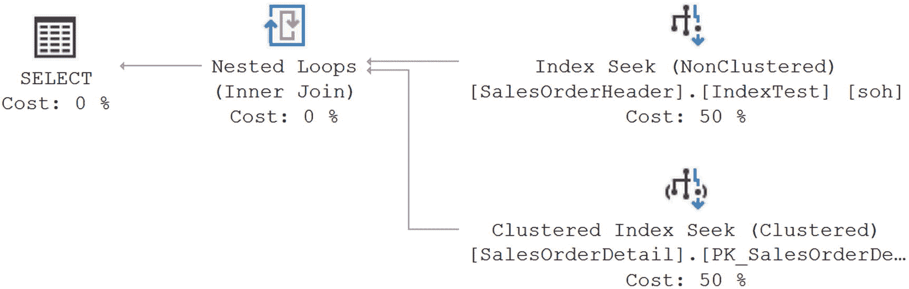

图 19-11：执行计划显示了不在 WHERE 子句列上使用 CONVERT 函数的好处

性能指标如下：

```
读取次数: 2
持续时间: 104mcs
```

因此，为了使优化器能够考虑在 `WHERE` 子句中引用的列上的索引，应始终避免在该索引列上使用函数。这提高了索引的有效性，从而可以改善查询性能。不过，在这个例子中值得注意的是，性能差异很小，因为仍然对 `SalesOrderDetail` 表进行了扫描。

请务必删除之前创建的索引。

```
DROP INDEX Sales.SalesOrderHeader.IndexTest;
```

#### 自定义标量 UDF

标量函数是一种有吸引力的代码重用手段，特别是当您只需要单个值时。但是，虽然您可以将它们用于数据检索，但这并非它们的强项。事实上，根据所讨论的 UDF 以及为满足其结果集而需要进行的数据操作量，您可能会看到一些显著的性能问题。为了实际观察这一点，让我们从一个检索产品成本的标量函数开始。

```
CREATE OR ALTER FUNCTION dbo.ProductCost (@ProductID INT)
RETURNS MONEY
AS
BEGIN
    DECLARE @Cost MONEY
    SELECT TOP 1
        @Cost = pch.StandardCost
    FROM Production.ProductCostHistory AS pch
    WHERE pch.ProductID = @ProductID
    ORDER BY pch.StartDate DESC;
    IF @Cost IS NULL
        SET @Cost = 0
    RETURN @Cost
END
```

调用该函数只需在查询中使用它。

```
SELECT p.Name,
       dbo.ProductCost(p.ProductID)
FROM Production.Product AS p
WHERE p.ProductNumber LIKE 'HL%';
```

此查询的性能平均约为 413 微秒和 16 次读取。对于这样一个结果集很小的简单查询，这可能是可以接受的。图 19-12 显示了此查询的执行计划。

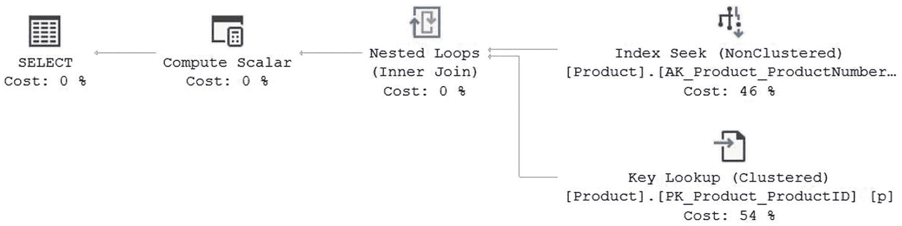

图 19-12：使用标量 UDF 的执行计划

数据是通过使用索引 `AK_Product_ProductNumber` 进行 `Seek` 操作来检索的。由于该索引不是覆盖索引，因此使用了 `Key Lookup` 操作来检索必要的附加数据 `p.Name`。`Compute Scalar` 运算符就是标量 UDF。我们可以通过查看“定义值”对话框中 `Compute Scalar` 运算符的属性来验证这一点，如图 19-13 所示。

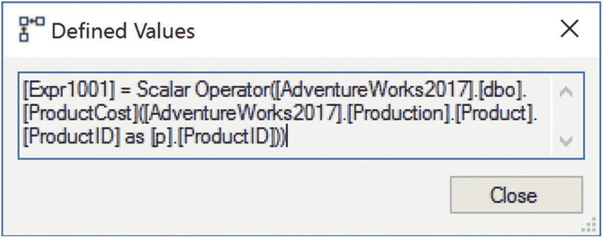

图 19-13：Compute Scalar 运算符属性显示标量 UDF 正在工作

问题在于，您无法看到该函数的内部数据访问。该信息是隐藏的。您可以使用估计计划捕获它，或者可以查询查询存储区以查看通常无法立即看到的 UDF 等对象的计划：

```
SELECT CAST(qsp.query_plan AS XML)
FROM sys.query_store_query AS qsq
JOIN sys.query_store_plan AS qsp
    ON qsp.query_id = qsq.query_id
WHERE qsq.object_id = OBJECT_ID('dbo.ProductCost');
```

生成的执行计划如图 19-14 所示。


图 19-14：标量函数的执行计划

虽然您无法看到具体的工作，但从执行计划可以看出，它实际上做了更多的工作。如果我们如下重写此查询以消除函数的使用，性能也会发生变化：

```
SELECT p.Name,
       pc.StandardCost
FROM Production.Product AS p
CROSS APPLY
(   SELECT TOP 1
        pch.StandardCost
    FROM Production.ProductCostHistory AS pch
    WHERE pch.ProductID = p.ProductID
    ORDER BY pch.StartDate DESC) AS pc
WHERE p.ProductNumber LIKE 'HL%';
```

进行此更改后，性能略有提升，从 413 微秒提高到约 295 微秒，读取次数从 16 次减少到 14 次。虽然执行计划更复杂，如图 19-15 所示，但整体性能得到了改善。


图 19-15：使用标量函数和不使用标量函数的执行计划比较

虽然优化器建议带标量函数的计划估计成本低于不带标量函数的计划，但实际性能指标几乎相反。这是因为标量函数的成本是固定的每行成本，并未考虑支持它的过程的复杂性，在本例中，即对表的访问。这最终导致带有计算标量的查询不仅更慢，而且资源消耗更大。


## 最小化优化器提示

SQL Server 的基于成本的优化器会根据当前的表/索引结构和统计信息，动态确定查询的处理策略。这种动态行为可以通过优化器提示来覆盖，从而通过指示优化器使用某种处理策略来接管部分决策。这会使优化器的行为变得静态，不允许它在表/索引结构或统计信息发生变化时动态更新处理策略。

由于通常很难比优化器更聪明，一般的建议是避免使用优化器提示。有些提示可能极其有益（例如 `OPTIMIZE FOR`），但另一些提示仅在非常特定的情况下才有益。通常，让优化器根据数据分布统计信息、索引和其他因素来确定一种经济高效的处理策略是有益的。强制优化器（通过提示）使用特定的处理策略往往反而会损害性能，如下列关于这些提示的示例所示：

*   `JOIN` 提示
*   `INDEX` 提示

## JOIN 提示

如第 6 章所述，优化器会根据表/索引结构和数据，在两个数据集之间动态确定一种经济高效的 `JOIN` 策略。表 19-2 总结了 SQL Server 2017 支持的 `JOIN` 类型，以供参考。

**表 19-2**
SQL Server 2017 支持的 JOIN 类型

| JOIN 类型 | 连接列上的索引 | 连接表的通常大小 | 预排序的 JOIN 子句 |
| --- | --- | --- | --- |
| 嵌套循环 | 内表**必须**有索引<br>外表最好有索引 | 小 | 可选 |
| 合并 | 两个表都**必须**有索引<br>最优条件：两个表都有聚集索引或覆盖索引 | 大 | 是 |
| 哈希 | 内表**没有**索引<br>最优条件：内表大，外表小 | 任意 | 否 |
| 自适应 | 根据查询返回的数据动态选择哈希或循环连接 | 可变，但通常非常大，因为目前仅与列存储索引配合工作 | 取决于连接类型 |

SQL Server 2017 引入了一种新的连接类型，即自适应连接。它实际上只是对嵌套循环或哈希连接的一种动态确定，但这种自适应处理方法实际上构成了一种新的连接类型，这就是我将其列在这里的原因。

## 注意

外表通常是两个连接表中较小的一个。

你可以通过使用表 19-3 中的 `JOIN` 提示来指示 SQL Server 使用特定的 `JOIN` 类型。

**表 19-3**
JOIN 提示

| JOIN 类型 | JOIN 提示 |
| --- | --- |
| 嵌套循环 | `LOOP` |
| 合并 | `MERGE` |
| 哈希 | `HASH` |
|  | `REMOTE` |

自适应连接没有对应的提示。有一个用于 `REMOTE` 连接的提示。当连接中的一个表位于当前数据库的远程服务器时使用此提示。它允许你根据输入大小，指示 `JOIN` 的哪一侧应该执行工作。

要理解使用 `JOIN` 提示如何影响性能，请考虑以下 `SELECT` 语句：

```sql
SELECT s.Name AS StoreName,
p.LastName + ', ' + p.FirstName
FROM Sales.Store AS s
JOIN Sales.SalesPerson AS sp
ON s.SalesPersonID = sp.BusinessEntityID
JOIN HumanResources.Employee AS e
ON sp.BusinessEntityID = e.BusinessEntityID
JOIN Person.Person AS p
ON e.BusinessEntityID = p.BusinessEntityID;
```

图 19-16 显示了执行计划。


**图 19-16**
显示优化器所做选择的执行计划

如你所见，SQL Server 动态决定使用 `LOOP JOIN` 来添加来自 `Person.Person` 表的数据，并对 `Sales.Salesperson` 和 `Sales.Store` 表使用 `HASH JOIN`。正如第 6 章所演示的，对于影响小结果集的简单查询，`LOOP JOIN` 通常比 `HASH JOIN` 或 `MERGE JOIN` 提供更好的性能。由于来自 `Sales.Salesperson` 表的行数相对较少，你可能会觉得可以像这样强制 `JOIN` 为 `LOOP`：

```sql
SELECT s.Name AS StoreName,
p.LastName + ',   ' + p.FirstName
FROM Sales.Store AS s
JOIN Sales.SalesPerson AS sp
ON s.SalesPersonID = sp.BusinessEntityID
JOIN HumanResources.Employee AS e
ON sp.BusinessEntityID = e.BusinessEntityID
JOIN Person.Person AS p
ON e.BusinessEntityID = p.BusinessEntityID
OPTION (LOOP JOIN);
```

当运行此查询时，执行计划会发生变化，如图 19-17 所示。


**图 19-17**
使用 JOIN 查询提示所做的更改

以下是每个查询对应的 `性能` 输出：

*   无 `JOIN` 提示时：

    ```text
    读取次数: 2364
    持续时间: 84ms
    ```

*   有 `JOIN` 提示时：

    ```text
    读取次数: 3740
    持续时间: 97ms
    ```

你可以看到，带有 `JOIN` 提示的查询比没有提示的查询运行时间更长。它还增加了读取次数。你甚至可以使情况变得更糟。不是告诉查询中使用的所有提示都采用 `LOOP` 连接，而是可以仅针对你感兴趣的那个连接，如下所示：

```sql
SELECT s.Name AS StoreName,
p.LastName + ',   ' + p.FirstName
FROM Sales.Store AS s
INNER LOOP JOIN Sales.SalesPerson AS sp
ON s.SalesPersonID = sp.BusinessEntityID
JOIN HumanResources.Employee AS e
ON sp.BusinessEntityID = e.BusinessEntityID
JOIN Person.Person AS p
ON e.BusinessEntityID = p.BusinessEntityID;
```

运行此查询会产生如图 19-18 所示的执行计划。


**图 19-18**
使用 LOOP 连接提示带来的更多变化

如你所见，查询计划中现在引用了四个表。在之前的所有执行中都引用了四个表，但优化器能够通过优化的简化过程（在第 8 章中提到）从查询中消除一个表。现在，这个提示强制优化器做出了与它原本可能做出的不同选择，并从过程中移除了简化步骤。尽管执行时间比前一个查询略有改善，但读取性能下降了。

```text
读取次数: 3749
持续时间: 86ms
```

`JOIN` 提示强制优化器忽略其自身的优化策略，而改用查询指定的策略。`JOIN` 提示可能因以下因素损害查询性能：

*   提示会阻止自动参数化。
*   优化器被阻止动态决定表的连接顺序。

因此，不使用 `JOIN` 提示而让优化器动态确定一种经济高效的处理策略是有意义的。当然也有例外，但这些例外必须通过彻底的测试来验证。


### 索引提示

如前所述，在 `WHERE` 子句列上使用算术运算符会阻止优化器选择该列上的索引。为了提高性能，您可以重写查询，避免在 `WHERE` 子句列上使用算术运算符，如相应示例所示。或者，您甚至可能考虑使用 `INDEX` 提示（一种优化器提示）来强制优化器使用该列上的索引。然而，在大多数情况下，最好避免使用 `INDEX` 提示，让优化器动态地行为。

要理解 `INDEX` 提示对查询性能的影响，请考虑“避免在 WHERE 子句列上使用算术运算符”一节中给出的例子。`PurchaseOrderID` 列上的乘法运算符阻止了优化器选择该列上的索引。您可以使用 `INDEX` 提示来强制优化器使用 `OrderID` 列上的索引，如下所示：

```sql
SELECT *
FROM Purchasing.PurchaseOrderHeader AS poh WITH (INDEX(PK_PurchaseOrderHeader_PurchaseOrderID))
WHERE poh.PurchaseOrderID * 2 = 3400;
```

请注意使用 `INDEX` 提示与不使用 `INDEX` 提示时的相对成本对比，如图 19-18 所示。同时，请注意以下性能指标中显示的逻辑读次数的差异：

*   无提示（在 `WHERE` 子句列上使用算术运算符）：

    ```
    Reads: 11
    Duration: 210mcs
    ```

*   无提示（不在 `WHERE` 子句列上使用算术运算符）：

    ```
    Reads: 2
    Duration: 105mcs
    ```

*   使用 `INDEX` 提示：

    ```
    Reads: 44
    Duration: 380mcs
    ```

从执行计划的相对成本和逻辑读次数来看，很明显，使用 `INDEX` 提示的查询实际上损害了查询性能。尽管它允许优化器使用 `PurchaseOrderID` 列上的索引，但它没有允许优化器确定合适的索引访问机制。因此，优化器使用了索引扫描来访问仅仅一行数据。相比之下，避免在 `WHERE` 子句列上使用算术运算符并且不使用 `INDEX` 提示，不仅允许优化器使用 `PurchaseOrderID` 列上的索引，还允许其确定合适的索引访问机制：`INDEX SEEK`（索引查找）。

因此，一般来说，让优化器为查询选择最佳的索引策略，不要使用 `INDEX` 提示来覆盖优化器的行为。此外，不使用 `INDEX` 提示允许优化器随着数据随时间的变化，动态地决定最佳索引策略。图 19-19 展示了指定索引提示与不指定索引提示之间的差异。

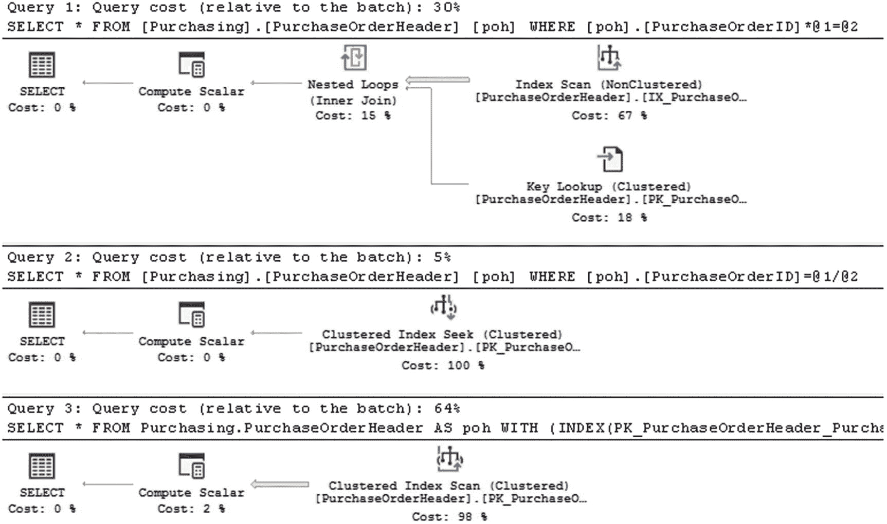
*图 19-19: 使用与不使用不同 INDEX 提示的查询成本*

## 使用域完整性和引用完整性

域完整性和引用完整性有助于为列定义和强制有效值，从而维护数据库的完整性。这是通过列/表约束实现的。

由于数据访问通常是查询执行中最耗时的操作之一，避免冗余的数据访问有助于优化器减少查询执行时间。域完整性和引用完整性帮助 SQL Server 优化器在不实际访问数据的情况下分析有效的数据值，从而减少查询时间。

要理解这是如何发生的，请考虑以下示例：

*   `NOT NULL` 约束
*   声明性引用完整性

### NOT NULL 约束

`NOT NULL` 列约束用于实现域完整性，它定义了不能在特定列中输入 `NULL` 值这一事实。SQL Server 在运行时自动强制执行此约束，以维护该列的域完整性。此外，定义 `NOT NULL` 列约束有助于优化器在查询中对该列使用 `ISNULL` 函数时生成高效的处理策略。

要理解 `NOT NULL` 列约束带来的性能优势，请考虑以下示例。这两个查询旨在返回所有不等于 `'B'` 的值。这两个查询针对大小相似的列运行，每个查询都需要执行表扫描来返回数据：

```sql
SELECT p.FirstName
FROM Person.Person AS p
WHERE p.FirstName = 'C';
SELECT p.MiddleName
FROM Person.Person AS p
WHERE p.MiddleName = 'C';
```

这两个查询使用了相似的执行计划，如图 19-20 所示。


*图 19-20: 由于缺少索引而导致的表扫描*

差异主要源于预估的返回行数。虽然两个查询都针对同一个索引并扫描它，但每个查询都有不同的谓词和预估行数，如图 19-21 所示。


*图 19-21: 由于 WHERE 子句不同导致的预估行数差异*

由于 `Person.MiddleName` 列可以包含 `NULL` 值，因此返回的数据是不完整的。这是因为，根据定义，尽管 `NULL` 值满足不等于 `'B'` 的必要条件，但您无法以这种方式返回 `NULL` 值。需要添加一个 `OR` 子句。这意味着要像下面这样修改第二个查询：

```sql
SELECT p.FirstName
FROM Person.Person AS p
WHERE p.FirstName = 'C';
SELECT p.MiddleName
FROM Person.Person AS p
WHERE p.MiddleName = 'C'
OR p.MiddleName IS NULL;
```

另外，如图 19-19 执行计划中的缺失索引语句所示，这两个查询都可以从在其表上创建索引中受益。创建如下所示的测试索引应该可以满足要求：

```sql
CREATE INDEX TestIndex1 ON Person.Person (MiddleName);
CREATE INDEX TestIndex2 ON Person.Person (FirstName);
```

当重新执行查询时，图 19-22 显示了两个 `SELECT` 语句的最终执行计划。

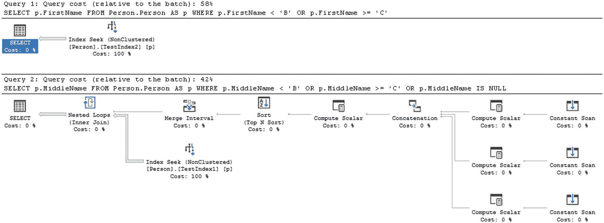
*图 19-22: 使用 IS NULL 选项的效果*

如图 19-22 所示，优化器能够利用 `Person.FirstName` 列上的索引 `TestIndex2` 来获得 `Index Seek`（索引查找）操作。不幸的是，处理 `NULL` 列的要求则大不相同。索引 `TestIndex1` 的使用方式不同。相反，为查询中定义的三个条件中的每一个创建了三个常量。然后通过 `Concatenation`（串联）操作将它们连接在一起，在通过 `Nested Loop`（嵌套循环）操作符三次查找索引之前进行排序和合并，以得到结果集。尽管从执行计划中的预估成本来看，这个查询似乎是成本较低的那个（42% 对比 58%），但性能指标却讲述了一个不同的故事。

```
Reads: 43
Duration: 143ms
```

对比

```
Reads: 68
Duration: 168ms
```

务必删除创建的测试索引。

```sql
DROP INDEX TestIndex1 ON Person.Person;
DROP INDEX TestIndex2 ON Person.Person;
```


## 声明式引用完整性

应尽可能避免在数据库中使用 `NULL` 值。然而，当数据未知时，默认值可能不可行。这时 `NULL` 值就会重新出现在设计中。我发现 `NULL` 值是不可避免的，但应尽可能将其最小化。

当不可避免地需要处理 `NULL` 值时，请记住可以使用一个筛选索引来从索引中移除 `NULL` 值，从而提高该索引的性能。这在第 7 章中有详细说明。稀疏列提供了另一种处理 `NULL` 值的选择。稀疏列的主要目的是更高效地存储 `NULL` 值，从而减少空间占用——代价是性能有所降低。此选项专门针对商业智能（BI）数据库，而非 OLTP 数据库，因为在事实表中存在大量 `NULL` 值是 BI 数据库设计的常态。

声明式引用完整性用于定义父表和子表之间的引用完整性。它确保子表中的记录仅在其对应的父表记录存在时才存在。此规则的唯一例外是，子表中用于链接到父表行的标识符列可以包含 `NULL` 值。对于子表中该标识符的所有其他值，父表中必须存在相应的值。在 SQL Server 中，DRI 是通过在父表上使用 `PRIMARY KEY` 约束并在子表上使用 `FOREIGN KEY` 约束来实现的。

如果在两个表之间建立了 DRI，并且子表的外键列设置为 `NOT NULL`，那么 SQL Server 优化器就能确信，子表中的每条记录在父表中都有对应的记录。有时这有助于优化器提高性能，因为无需访问父表来验证子表记录是否存在对应的父记录。

为了理解实现声明式引用完整性带来的性能优势，让我们考虑一个示例。首先，使用以下脚本消除两个表 `Person.Address` 和 `Person.StateProvince` 之间的引用完整性：
```
IF EXISTS (   SELECT *
FROM sys.foreign_keys
WHERE object_id = OBJECT_ID(N'[Person].[FK_Address_StateProvince_StateProvinceID]')
AND parent_object_id = OBJECT_ID(N'[Person].[Address]'))
ALTER TABLE Person.Address
DROP CONSTRAINT FK_Address_StateProvince_StateProvinceID;
```

考虑以下 `SELECT` 语句：
```
SELECT a.AddressID,
sp.StateProvinceID
FROM Person.Address AS a
JOIN Person.StateProvince AS sp
ON a.StateProvinceID = sp.StateProvinceID
WHERE a.AddressID = 27234;
```

请注意，此 `SELECT` 语句是从父表（`Person.StateProvince`）获取 `StateProvinceID` 列的值。如果数据性质要求子表（`Person.StateProvince`）中的每个产品（由 `StateProvinceId` 标识）在父表（`Person.Address`）中都有对应的产品，那么你可以重写前面的 `SELECT` 语句，改为引用 `Address` 表而非 `StateProvince` 表来获取 `StateProvinceID` 列：
```
SELECT a.AddressID,
a.StateProvinceID
FROM Person.Address AS a
JOIN Person.StateProvince AS sp
ON a.StateProvinceID = sp.StateProvinceID
WHERE a.AddressID = 27234;
```

两个 `SELECT` 语句应返回相同的结果集。删除外键约束后，优化器为两个 `SELECT` 语句生成相同的执行计划，如图 19-23 所示。

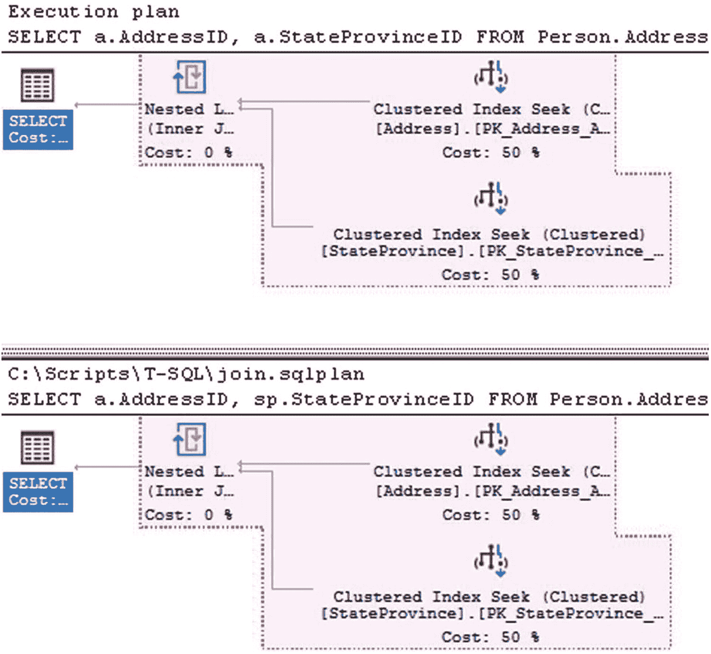

图 19-23. 两个表之间未定义 DRI 时的执行计划

为了理解声明式引用完整性如何影响查询性能，请替换之前删除的 `FOREIGN KEY` 约束。
```
ALTER TABLE Person.Address WITH CHECK
ADD CONSTRAINT FK_Address_StateProvince_StateProvinceID
FOREIGN KEY
(
StateProvinceID
)
REFERENCES Person.StateProvince
(
StateProvinceID
);
```

## 注意

现在两个表之间建立了引用完整性。

图 19-24 显示了两个 `SELECT` 语句的结果执行计划。


图 19-24. 展示定义 DRI 优势的执行计划

如你所见，第二个 `SELECT` 语句的执行计划得到了高度优化：不再访问 `Person.StateProvince` 表。由于声明式引用完整性已就位（并且 `Address.StateProvince` 设置为 `NOT NULL`），优化器确信子表中的每条记录在父表中都有对应的记录。因此，第二个 `SELECT` 语句中父表和子表之间的 `JOIN` 子句是冗余的，因为没有从父表请求其他数据。

你可能已经知道域完整性和引用完整性是好事，但你可以看到它们不仅确保数据完整性，还提高了性能。正如刚才所演示的，域完整性和引用完整性为优化器提供了更多选择，以生成成本效益高的执行计划并提升性能。

如前所述，为了获得 DRI 的性能优势，子表中的外键列应设置为 `NOT NULL`。否则，子表中可能存在（外键列值为 `NULL` 的）行，这些行在父表中没有对应表示。这不会阻止优化器在之前的查询中访问主表（`Prod`）。默认情况下——即如果没有为列指定 `NOT NULL` 属性——该列可以包含 `NULL` 值。考虑到 `NOT NULL` 属性的好处以及本节中解释的其他优势，如果 `NULL` 对于某个列不是有效值，请务必将该列的属性标记为 `NOT NULL`。

你还需要确保在构建外键约束时使用了 `WITH CHECK` 选项。如果使用了 `NOCHECK` 选项，优化器会认为这些是不可信的约束，你将无法实现它们可能带来的性能优势。

## 总结

如本章所讨论的，要提高数据库应用程序的性能，重要的是确保 SQL 查询设计得当，以受益于索引、存储过程、数据库约束等性能增强技术。确保查询不会妨碍索引的使用。在许多情况下，优化器有能力生成成本效益高的执行计划，无论查询结构如何，但首先正确设计查询仍然是一个良好的实践。即使你为单个查询设计了出色的性能，数据库应用程序的整体性能也可能不尽如人意。不仅要提高单个查询的性能，还要确保它们不会耗尽系统上的可用资源，这一点很重要。下一章将介绍如何在查询中减少资源使用。

# 20. 减少查询资源使用

在上一章中，您专注于以适当使用索引和统计信息的方式编写查询。在本章中，您将确保以不会不当消耗资源的方式编写查询。编写查询有多种方法可以避免使用内存、CPU 和 I/O，也有些写法会比实际需要消耗更多这些资源。我将介绍一系列机制，以确保您控制的查询能最优地使用您的资源。

本章涵盖以下主题：

*   资源消耗较低的查询设计
*   有效利用过程缓存的查询设计
*   减少网络开销的查询设计
*   降低查询事务成本的技术

## 避免资源密集型查询

许多数据库功能可以通过多种查询技术实现。您应采取的方法是使用资源友好且基于集合的查询技术。以下是一些可用于减少查询资源占用的技术：

*   避免数据类型转换。
*   使用 `EXISTS` 而非 `COUNT(*)` 来验证数据存在。
*   使用 `UNION ALL` 而非 `UNION`。
*   为聚合和排序操作使用索引。
*   在批处理查询中谨慎使用局部变量。
*   在命名存储过程时小心谨慎。

我将在后续章节中更详细地介绍这些要点。

### 避免数据类型转换

在某些情况下（定义可在联机丛书中查到的大型数据转换表中），SQL Server 允许将不同但兼容数据类型的值/常量与列的数据进行比较。SQL Server 会自动将数据从一种数据类型转换为另一种。此过程称为*隐式数据类型转换*。虽然有用，但隐式转换会给查询优化器增加开销。为了提高性能，请使用与比较列相同数据类型的值/常量。

要理解隐式数据类型转换如何影响性能，请考虑以下示例：

```sql
IF EXISTS (   SELECT *
              FROM sys.objects
              WHERE object_id = OBJECT_ID(N'dbo.Test1'))
    DROP TABLE dbo.Test1;
CREATE TABLE dbo.Test1 (Id INT IDENTITY(1, 1),
                        MyKey VARCHAR(50),
                        MyValue VARCHAR(50));
CREATE UNIQUE CLUSTERED INDEX Test1PrimaryKey ON dbo.Test1 (Id ASC);
CREATE UNIQUE NONCLUSTERED INDEX TestIndex ON dbo.Test1 (MyKey);
GO
SELECT TOP 10000
       IDENTITY(INT, 1, 1) AS n
INTO #Tally
FROM master.dbo.syscolumns AS scl,
     master.dbo.syscolumns AS sc2;
INSERT INTO dbo.Test1 (MyKey,
                       MyValue)
SELECT TOP 10000
       'UniqueKey' + CAST(n AS VARCHAR),
       'Description'
FROM #Tally;
DROP TABLE #Tally;
SELECT t.MyValue
FROM dbo.Test1 AS t
WHERE t.MyKey = 'UniqueKey333';
SELECT t.MyValue
FROM dbo.Test1 AS t
WHERE t.MyKey = N'UniqueKey333';
```

在创建表 `Test1`、为其创建几个索引并插入一些数据后，定义了两条查询。两条查询返回相同的结果集。如您所见，除了与 `MyKey` 列等值比较的变量数据类型不同外，两条查询完全相同。由于此列是 `VARCHAR`，第一条查询不需要隐式数据类型转换。第二条查询使用了与 `MyKey` 列不同的数据类型，因此需要隐式数据类型转换，从而增加了查询性能的开销。图 20-1 展示了两条查询的执行计划。


图 20-1
包含和不包含隐式数据类型转换的查询计划

隐式数据类型转换的复杂性取决于比较中所涉及数据类型的优先级。SQL Server 的数据类型优先级规则规定了哪种数据类型会转换为另一种。通常，优先级较低的数据类型会转换为优先级较高的数据类型。例如，`TINYINT` 数据类型的优先级低于 `INT` 数据类型。有关 SQL Server 中数据类型优先级的完整列表，请参阅 MSDN 文章“数据类型优先级”( [`http://bit.ly/1cN7AYc`](http://bit.ly/1cN7AYc) )。有关哪种数据类型可以隐式转换为哪种数据类型的更多信息，请参阅 MSDN 文章“数据类型转换”( [`http://bit.ly/1j7kIJf`](http://bit.ly/1j7kIJf) )。

请注意 `SELECT` 运算符上的警告图标。它在提示您此查询中存在可疑之处。在此情况下，问题在于存在数据类型转换操作。优化器提示您这可能会对查找和使用索引来辅助查询性能的能力产生负面影响。这也可能是个误报。如果转换发生在未用于任何谓词的列上，那么发生隐式甚至显式转换实际上完全无关紧要。

要查看具体的处理过程，请查看 `Clustered Index Scan` 运算符的属性和 `Predicate` 值。我的列出如下：

```sql
CONVERT_IMPLICIT(nvarchar(50),[AdventureWorks2017].[dbo].[Test1].[MyKey] as [t].[MyKey],0)=[@1]
```

持续时间从平均约 110 微秒增加到 1,400 微秒，读取次数从 4 增加到 56。

当 SQL Server 比较具有某种数据类型的列值与具有不同数据类型的变量（或常量）时，变量（或常量）的数据类型总是被转换为列的数据类型。这样做是因为列值是基于变量（或常量）的隐式转换值来访问的。因此，在这种情况下，隐式转换总是应用于变量（或常量）。

如您所见，隐式数据类型转换既会因执行计划不佳，也会因增加转换所需的 CPU 成本，从而给查询性能增加开销。因此，为了提高性能，请始终对两个表达式使用相同的数据类型。

### 使用 EXISTS 而非 COUNT(*) 来验证数据存在

一个常见的数据库需求是验证某组数据是否存在。通常您会看到使用一批 SQL 查询来实现此功能，如下所示：

```sql
DECLARE @n INT;
SELECT @n = COUNT(*)
FROM Sales.SalesOrderDetail AS sod
WHERE sod.OrderQty = 1;
IF @n > 0
    PRINT 'Record Exists';
```

使用 `COUNT(*)` 验证数据存在是高度资源密集型的，因为 `COUNT(*)` 必须扫描表中的所有行。而 `EXISTS` 只需扫描并在找到第一条符合 `EXISTS` 标准的记录后立即停止。为了提高性能，请使用 `EXISTS` 而非 `COUNT(*)` 方法。

```sql
IF EXISTS (   SELECT sod.*
              FROM Sales.SalesOrderDetail AS sod
              WHERE sod.OrderQty = 1)
    PRINT 'Record Exists';
```

`EXISTS` 技术相对于 `COUNT(*)` 技术的性能优势可以通过查询性能指标以及图 20-2 中的执行计划进行比较，您从运行这些查询的输出中可以看出。


图 20-2
COUNT 与 EXISTS 的区别

```text
COUNT Duration: 8.9ms
Reads: 1248
EXISTS Duration: 1.7ms
Reads: 17
```

如您所见，`EXISTS` 技术仅使用了 17 次逻辑读取，而 `COUNT(*)` 技术使用了 1,246 次，执行时间从 8.9ms 降至 1.7ms。因此，要确定数据是否存在，请使用 `EXISTS` 技术。


### 使用 `UNION ALL` 替代 `UNION`

你可以使用 `UNION` 子句来拼接多个 `SELECT` 语句的结果集，如下所示，如图 20-3 所示：


图 20-3

使用 `UNION` 子句的查询执行计划

```sql
SELECT sod.ProductID,
sod.SalesOrderID
FROM Sales.SalesOrderDetail AS sod
WHERE sod.ProductID = 934
UNION
SELECT sod.ProductID,
sod.SalesOrderID
FROM Sales.SalesOrderDetail AS sod
WHERE sod.ProductID = 932
UNION
SELECT sod.ProductID,
sod.SalesOrderID
FROM Sales.SalesOrderDetail AS sod
WHERE sod.ProductID = 708;
```

`UNION` 子句处理来自三个 `SELECT` 语句的结果集，从最终结果集中删除重复项，相当于对每个查询执行了 `DISTINCT`，并使用 `Stream Aggregate` 操作符执行聚合。如果参与 `UNION` 子句的 `SELECT` 语句的结果集彼此互斥，或者你允许最终结果集中包含重复行，那么请使用 `UNION ALL` 代替 `UNION`。这样可以避免检测和删除重复项的开销，从而提高性能，如图 20-4 所示。


图 20-4

使用 `UNION ALL` 的查询执行计划

可以看出，在第一种情况（使用 `UNION`）下，优化器聚合记录以消除重复项，同时使用 `MERGE` 操作符合并三个 `SELECT` 语句的结果集。由于结果集彼此互斥，你可以使用 `UNION ALL` 代替 `UNION` 子句。使用 `UNION ALL` 子句避免了检测重复项和连接数据的开销，从而提升了性能。

查询性能指标也说明了类似的情况：`UNION` 查询耗时 `125ms`，而 `UNION ALL` 查询耗时 `95ms`。有趣的是，两者的逻辑读次数相同，都是 `20`。在这种情况下，正是其中一个查询比另一个查询需要额外的不同处理，导致了性能上的差异。

### 为聚合和排序条件使用索引

通常，像 `MIN` 和 `MAX` 这样的聚合函数会受益于对应列上的索引。如前面章节所演示的，它们从列存储索引中获益更多。然而，即使是标准索引也能辅助一些聚合查询。如果这些列上没有任何类型的索引，优化器就必须扫描基表（或行存储聚集索引），检索所有行，并对包含所有行的分组执行流聚合以识别 `MIN`/`MAX` 值，如下例所示（参见图 20-5)：


图 20-5

对整表进行扫描并筛选为单行

```sql
SELECT  MIN(sod.UnitPrice)
FROM    Sales.SalesOrderDetail AS sod;
```

使用 `MIN` 聚合函数的 `SELECT` 语句的性能指标如下：

```
Duration: 15.8ms
Reads: 1248
```

该查询仅仅为了检索包含 `UnitPrice` 列最小值的行，就执行了超过 1200 次逻辑读。你可以在图 20-5 中的执行计划中看到这一点。一个巨大的数据行从 `Clustered Index Scan` 操作符流出，然后被 `Stream Aggregate` 操作符筛选为单行。如果你在 `UnitPrice` 列上创建索引，那么 `UnitPrice` 值将会在索引的叶级页面中预先排序。

```sql
CREATE INDEX TestIndex ON Sales.SalesOrderDetail (UnitPrice ASC);
```

`UnitPrice` 列上的索引显著提升了 `MIN` 聚合函数的性能。优化器可以通过 seek（查找）到索引中最顶部的行来检索最小的 `UnitPrice` 值。这减少了查询的逻辑读次数，如相应的指标和执行计划所示（参见图 20-6)。


图 20-6

索引极大地提升了性能

```
Duration: 97 mcs
Reads: 3
```

类似地，在 `ORDER BY` 子句引用的列上创建索引有助于优化器快速组织结果集，因为列值在索引中已预先排列好。`GROUP BY` 子句的内部实现也会首先对列值进行排序，因为排序后的列值允许快速对相邻的匹配值进行分组。因此，与 `ORDER BY` 子句类似，`GROUP BY` 子句也会受益于其引用列的值预先排序。

重申一下，对于大多数聚合查询，列存储索引可能会比常规的行存储索引带来更好的性能。然而，在某些情况下，列存储索引可能是资源的浪费，因此了解存在其他选项是好的，这取决于你的查询和表结构。


### 在批处理查询中谨慎使用本地变量

通常，多个查询会作为一个批处理一起提交，以避免多次网络往返。在查询批处理中使用本地变量在单个查询之间传递值是很常见的。然而，在批处理查询的 `WHERE` 子句中使用本地变量，并非在所有情况下都允许优化器生成高效的执行计划。

要理解在批处理查询的 `WHERE` 子句中使用本地变量如何影响性能，请考虑以下批处理查询：

```
DECLARE @Id INT = 67260;
SELECT  p.Name,
        p.ProductNumber,
        th.ReferenceOrderID
FROM    Production.Product AS p
JOIN    Production.TransactionHistory AS th
        ON th.ProductID = p.ProductID
WHERE   th.ReferenceOrderID = @Id;
```

图 20-7 显示了此 `SELECT` 语句的执行计划。


图 20-7
显示批处理查询中本地变量影响的执行计划

如您所见，执行了 `Index Seek` 操作来访问 `Production.TransactionHistory` 主键中的行。通过循环连接，必须对聚集索引进行 `Key Lookup`。最后，通过对 `Product` 表的 `Clustered Index Seek` 通过另一个循环连接添加到结果集中。如果 `SELECT` 语句在不使用本地变量的情况下执行，即用以下查询中适当的常量值替换本地变量值，优化器会做出不同的选择：

```
SELECT  p.Name,
        p.ProductNumber,
        th.ReferenceOrderID
FROM    Production.Product AS p
JOIN    Production.TransactionHistory AS th
        ON th.ProductID = p.ProductID
WHERE   th.ReferenceOrderID = 67260;
```

图 20-8 显示了结果。

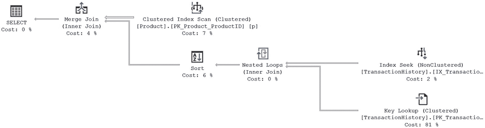

图 20-8
未使用本地变量时查询的执行计划

您得到了一个完全不同的执行计划。部分相似。您有相同的 `Index Seek` 和 `Key Lookup` 算子，但它们的数据是与 `Clustered Index Scan` 和 `Merge Join` 连接的。在考虑性能时，快速比较计划会变得有问题，因此让我们查看性能指标，看看是否存在差异。首先，以下是使用本地变量的初始查询的信息：

```
Duration: 696ms
Reads: 242
```

然后是第二个查询，不使用本地变量：

```
Duration: 817ms
Reads: 197
```

使用本地变量的计划执行速度稍快，696 毫秒对 817 毫秒，但是读取次数却多得多，242 次对 197 次。是什么导致了计划之间的差异以及性能上的不同？这一切都归结于一个事实：除非发生语句级重编译，否则算子无法知晓本地变量的值。因此，优化器不是根据统计信息中的具体值来确定行数，而是基于密度图进行估算。

那么，`TransactionHistory` 表中有 113,443 行。密度值为 2.694111E-05。将它们相乘，我们得到值 3.05628。现在，让我们看一下第一个执行计划（即图 20-8 中的计划）的估计行数。

估计行数，在图 20-9 的底部，是 3.05628。这与计算结果完全相同。但请注意，顶部的实际行数是 48。这变得很重要。如果我们查看第二个计划（即图 20-8 中的计划）中同一算子的相同属性，我们会看到估计行数和实际行数相同，都是 48。在这种情况下，优化器认为返回 48 行太多，无法通过 `Index Seek` 对 `Product` 表进行高效查询。因此，它选择使用有序扫描（您可以通过 `Index Scan` 算子的属性验证）和合并连接。


图 20-9
估计行数与实际行数

实际上，第一个计划更快；然而，它确实导致了更高的 I/O 输出。这就是我们需要谨慎的地方。在这个案例中，性能稍好一些，但如果系统负载很高，尤其是在 I/O 压力下，那么第二个计划可能会执行得更快，资源争用更少，因为它的总体读取次数更低。谨慎之处在于识别在特定情况下哪个计划更好。

为避免这种潜在的性能问题，请使用以下方法。不要在批处理中对这样的查询将本地变量用作筛选条件。本地变量与参数值不同，如第 17 章所述。为批处理创建一个存储过程，并按如下方式执行：

```
CREATE OR ALTER PROCEDURE ProductDetails (@id INT)
AS
SELECT p.Name,
       p.ProductNumber,
       th.ReferenceOrderID
FROM Production.Product AS p
JOIN Production.TransactionHistory AS th
  ON th.ProductID = p.ProductID
WHERE th.ReferenceOrderID = @id;
GO
EXEC ProductDetails @id = 1;
```

这种方法可能适得其反。使用传递给参数的值的过程称为参数嗅探。参数嗅探会自动发生在所有存储过程和参数化查询中。根据统计信息的准确性和传递给参数的值，使用特定值可能会得到一个糟糕的计划，而使用本地变量时发生的抽样值则可能得到一个好计划。测试是确定在任何给定情况下哪种方法效果最好的唯一途径。然而，在大多数情况下，拥有准确的值比抽样值更好。有关参数嗅探的更多详细信息，请参见第 17 章。

作为一般准则，最好避免硬编码值。如果值必须更改，您可能需要在很多代码中更改它们。如果您确实需要在查询中编写值，本地变量可以让您在批处理顶部的一个位置控制它们，使代码管理更容易。然而，正如我们刚才所见，当本地变量用于数据检索时，它们会影响计划的选择。在这种情况下，参数值更受青睐。您甚至可以设置参数值并为其提供默认值。这些值仍会作为常规参数被嗅探。


### 小心存储过程的命名

存储过程的名称很重要。你不应该用`sp_`前缀来命名你的存储过程。开发者常常用`sp_`前缀命名存储过程，以便轻松识别它们。然而，SQL Server 会假定任何带有此前缀的存储过程很可能是一个系统存储过程，其归属地是`master`数据库。当提交一个带有`sp_`前缀的存储过程执行时，SQL Server 会按以下顺序在以下位置查找该存储过程：

*   在`master`数据库中
*   在当前数据库中，根据提供的任何限定符（数据库名或所有者）
*   在当前数据库中使用`dbo`作为架构，如果未指定架构

因此，尽管用户创建的、以`sp_`为前缀的存储过程存在于当前数据库中，但`master`数据库会首先被检查。即使存储过程已用数据库名限定，这种情况也会发生。

为了理解给存储过程名称加`sp_`前缀的影响，请考虑以下存储过程：

```sql
IF EXISTS ( SELECT  *
FROM    sys.objects
WHERE   object_id = OBJECT_ID(N'[dbo].[sp_Dont]')
AND type IN (N'P', N'PC') )
DROP PROCEDURE  [dbo].[sp_Dont]
GO
CREATE PROC [sp_Dont]
AS
PRINT 'Done!'
GO
--将 sp_Dont 的执行计划添加到过程缓存
EXEC AdventureWorks2017.dbo.[sp_Dont] ;
GO
--使用上面 sp_Dont 的缓存计划
EXEC AdventureWorks2012.dbo.[sp_Dont] ;
GO
```

该存储过程的首次执行将其执行计划添加到过程缓存中。后续的执行会重用过程缓存中的现有计划，除非需要重新编译计划（存储过程重新编译的原因在第 10 章中说明）。因此，如图 20-10 所示的存储过程`spDont`的第二次执行应该能在过程缓存中找到一个计划。这通过相应的扩展事件输出中的一个`SP:CacheMiss`事件来指示。


图 20-10

显示`sp_`前缀对存储过程名称影响的扩展事件输出

请注意，在 SQL Server 尝试在过程缓存中定位存储过程的计划之前，会触发一个`SP:CacheMiss`事件。该`SP:CacheMiss`事件是由于 SQL Server 在`master`数据库中查找存储过程引起的，即使存储过程的执行已正确地限定了用户数据库名称。

当你创建一个与现有系统存储过程同名的存储过程时，`sp_`前缀的这个特性会变得更加有趣。

```sql
CREATE OR ALTER PROC sp_addmessage @param1 NVARCHAR(25)
AS
PRINT  '@param1 =  '  + @param1 ;
GO
EXEC AdventureWorks2017.dbo.[sp_addmessage]   'AdventureWorks';
```

这个用户定义存储过程的执行，导致的是执行来自`master`数据库的系统存储过程`sp_addmessage`，如图 20-11 所示。

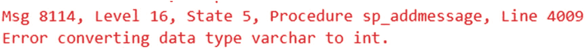

图 20-11

显示`sp_`前缀对存储过程名称影响的执行结果

不幸的是，这个用户定义的存储过程无法被执行。现在你可以明白为什么不应该给用户定义的存储过程名称加`sp_`前缀了。请使用其他命名约定。从纯粹的性能角度来看，这是一个微小的改进。但是，如果你有高吞吐量要求且响应时间很关键，那么避免使用`sp_`命名标准就是对你有利的又一个加分项。

## 减少网络往返次数

数据库应用程序通常执行多个查询来实现一个数据库操作。除了优化单个查询的性能外，优化批处理的性能也很重要。为了减少多次网络往返的开销，请考虑以下技术：

*   一起执行多个查询。
*   使用`SET NOCOUNT`。

让我们更深入地看看这些技术。

### 一起执行多个查询

最好将一组查询作为一个批处理或存储过程一起提交。除了减少数据库应用程序和服务器之间的网络往返次数外，存储过程还提供多种性能和管理上的好处，如第 16 章所述。这意味着应用程序中的代码需要能够处理多个结果集。这也意味着你的 T-SQL 代码可能需要处理 XML 数据或其他大型数据集，而不是单行插入或更新。

### 使用 SET NOCOUNT

在执行批处理或存储过程时，你还需要考虑另一个因素。在批处理或存储过程中的每个查询执行后，服务器都会报告受影响的行数。

```sql
(行受影响)
```

此信息返回给数据库应用程序，并增加了网络开销。使用 T-SQL 语句`SET NOCOUNT`来避免此开销。

```sql
SET NOCOUNT ON
SET NOCOUNT OFF
```

请注意，与某些`SET`语句不同，`SET NOCOUNT`语句不会导致存储过程的任何重新编译问题，如第 18 章所述。

## 降低事务成本

SQL Server 中的每个操作查询都作为一个*原子*操作执行，使得数据库表的状态从一个*一致*状态移动到另一个一致状态。SQL Server 会自动完成此操作，且无法禁用。如果从一个一致状态到另一个一致状态的转换需要多个数据库查询，则应使用显式定义的数据库事务来维护这些查询间的原子性。每个原子操作的旧状态和新状态都保存在事务日志（磁盘上）中，以确保*持久性*，这保证了原子操作一旦成功完成，其结果就不会丢失。原子操作在执行期间通过数据库锁与其他数据库操作*隔离*。

基于事务的特性，以下是降低事务成本的两个主要建议：

*   减少日志记录开销。
*   减少锁开销。

### 降低日志开销

一个数据库查询可能包含多个数据操作查询。如果为每个查询单独维持原子性，则会在事务日志上执行大量磁盘写入。由于磁盘活动相比内存或 CPU 活动极其缓慢，过度的磁盘活动会增加数据库功能的执行时间。例如，考虑以下批处理查询：

```sql
--创建测试表
IF (SELECT  OBJECT_ID('dbo.Test1')
) IS NOT NULL
DROP TABLE dbo.Test1;
GO
CREATE TABLE dbo.Test1 (C1 TINYINT);
GO
--插入 10000 行
DECLARE @Count INT = 1;
WHILE @Count <= 10000
BEGIN
INSERT  INTO dbo.Test1
(C1)
VALUES  (@Count % 256);
SET @Count = @Count + 1;
END
```

由于每次执行`INSERT`语句本身都是原子性的，SQL Server 将为每次执行`INSERT`语句写入事务日志。

减少日志磁盘写入次数的一个简单方法是将操作查询包含在一个显式事务中。

```sql
DECLARE @Count INT = 1;
DBCC SQLPERF(LOGSPACE);
BEGIN TRANSACTION
WHILE @Count <= 10000
BEGIN
INSERT  INTO dbo.Test1
(C1)
VALUES  (@Count % 256) ;
SET @Count = @Count + 1 ;
END
COMMIT
DBCC SQLPERF(LOGSPACE);
```

定义的事务范围（位于`BEGIN TRANSACTION`和`COMMIT`命令对之间）将原子性范围扩展到事务内包含的多个`INSERT`语句。这减少了日志磁盘写入次数，并提升了数据库功能的性能。要验证此理论，请在每个`WHILE`循环前后运行以下 T-SQL 命令：

```sql
DBCC SQLPERF(LOGSPACE);
```

这将显示已使用的日志空间百分比。在我的数据库上运行第一组插入时，日志使用率从 3.2%上升到 3.3%。运行第二组插入时，日志增长了约 6%。

最佳方式是处理数据集而非单个行。`WHILE`循环本身可能成本高昂，类似于游标（关于游标的更多详细信息见第 23 章）。因此，运行一个避免`WHILE`循环而改用基于集方法的查询效果更佳。

```sql
SELECT TOP 10000
IDENTITY(INT, 1, 1) AS n
INTO #Tally
FROM master.dbo.syscolumns AS scl,
master.dbo.syscolumns AS sc2;
DBCC SQLPERF(LOGSPACE);
BEGIN TRANSACTION
INSERT INTO dbo.Test1 (C1)
SELECT TOP 1000
(n % 256)
FROM #Tally AS t
COMMIT
```

在运行此查询前后使用`DBCC SQLPERF()`函数显示，日志内已用空间的增长不到 0.01%，且运行时间为 41 毫秒，而`WHILE`循环则需要 2 秒以上。

然而，需要注意的一个问题是，在一个事务中包含过多数据操作查询会增加事务持续时间。在此期间，所有其他试图访问事务中涉及资源的查询都会被阻塞。由于长事务，回滚持续时间和恢复期间的恢复时间也会增加。

### 降低锁开销

默认情况下，所有四个 SQL 语句（`SELECT`、`INSERT`、`UPDATE`和`DELETE`）都使用数据库锁将其工作与其他 SQL 语句的工作隔离。这种锁管理会给查询增加性能开销。通过减少请求的锁数量可以提高查询的性能。进而，其他查询的性能也会得到改善，因为它们等待获取自身锁的时间更短。

默认情况下，SQL Server 可以提供行级锁。对于处理大量行的查询，为所有单个行请求行锁会给锁管理过程增加显著的开销。您可以通过降低锁粒度（例如降低到页级或表级）来减少此锁开销。SQL Server 会根据锁开销动态执行锁升级。因此，通常不需要手动升级锁级别。但如果需要，您可以使用锁提示以编程方式控制查询的并发性，如下所示：

```sql
SELECT * FROM <TableName> WITH(PAGLOCK)  --使用页级锁
```

类似地，默认情况下，SQL Server 除了对`INSERT`、`UPDATE`和`DELETE`语句使用锁外，也对`SELECT`语句使用锁。这允许`SELECT`语句读取未被修改的数据。在某些情况下，数据可能相当静态，不会经历太多修改。在这种情况下，您可以通过以下方式之一减少`SELECT`语句的锁开销：

*   将数据库标记为`READONLY`（只读）。

```sql
ALTER DATABASE <DatabaseName> SET READ_ONLY
```

这允许用户从数据库检索数据，但阻止他们修改数据。此设置立即生效。如果需要偶尔修改数据库，则可以临时将其转换回`READWRITE`（读写）模式。

*   使用某种快照隔离级别。

    SQL Server 提供了一种机制，在更新发生时将数据版本放入 tempdb，从而显著减少读取操作的锁开销和阻塞。您可以使用`ALTER`语句更改数据库的隔离级别。

```sql
ALTER DATABASE <DatabaseName> SET READ_WRITE

ALTER DATABASE <DatabaseName> SET READONLY
```

*   阻止`SELECT`语句请求任何锁。

```sql
ALTER DATABASE AdventureWorks2017 SET READ_COMMITTED_SNAPSHOT ON;
```

```sql
SELECT * FROM <TableName> WITH(NOLOCK)
```

这可以阻止`SELECT`语句请求任何锁，并且仅适用于`SELECT`语句。虽然`NOLOCK`提示不能直接在操作查询（`INSERT`、`UPDATE`和`DELETE`）中引用的表上使用，但它可以用于操作查询的数据检索部分，如下所示：

```sql
DELETE Sales.SalesOrderDetail
FROM Sales.SalesOrderDetail AS sod WITH (NOLOCK)
JOIN Production.Product AS p WITH (NOLOCK)
ON sod.ProductID = p.ProductID
AND p.ProductID = 0;
```

需要知道的是，这会导致脏读，可能引起行重复或行丢失，因此被认为是控制锁的最后手段。事实上，这被认为相当危险，会导致不正确的结果。最佳方法是将数据库标记为只读或使用某种快照隔离级别。

这是一个很大的话题，还有很多内容可以讨论。我将在下一章讨论不同类型的锁请求以及如何管理锁开销。如果您根据本节对数据库进行了任何建议的更改，我建议从备份中恢复。

## 总结

正如本章所讨论的，要提高数据库应用程序的性能，重要的是确保 SQL 查询设计得当，以利用索引、存储过程、数据库约束等性能增强技术。确保查询对资源友好，并且不会妨碍索引的使用。在许多情况下，优化器无论查询结构如何都能生成具有成本效益的执行计划，但首先正确设计查询仍然是良好的实践。即使您为每个查询设计了出色的性能，数据库应用程序的整体性能也可能不尽如人意。不仅提高单个查询的性能很重要，还要确保它们与其他查询良好协作，不会引起严重的阻塞问题。在下一章中，您将了解数据库应用程序的不同阻塞方面。

# 21. 阻塞与被阻塞进程

理想情况下，您会希望数据库应用程序能够随着数据库用户数量和数据量的增长而线性扩展。然而，常见的情况是，随着用户数量的增加和数据量的增长，性能会逐渐下降。一个导致性能下降的原因，尤其是在规模不断扩大的情况下，就是阻塞。实际上，数据库阻塞通常是数据库应用程序可扩展性的最大敌人之一。

在本章中，我将涵盖以下主题：

*   SQL Server 中阻塞的基础知识
*   事务性数据库的 ACID 属性
*   数据库锁的粒度、升级、模式和兼容性
*   ANSI 隔离级别
*   索引对锁定的影响
*   分析阻塞所需的信息
*   用于收集阻塞信息的 SQL 脚本
*   避免阻塞的解决方案和建议
*   自动化阻塞检测和信息收集过程的技术

## 阻塞基础

在理想世界中，每个 SQL 查询都能够并发执行，而不会被其他查询阻塞。然而，在现实世界中，查询*确实*会相互阻塞，类似于在十字路口，一辆汽车通过绿色交通信号灯时，会阻挡其他等待通过十字路口的汽车。在 SQL Server 中，这种交通管理以*锁管理器*的形式实现，它控制对数据库资源的并发访问以维护数据一致性。对数据库资源的并发访问是在多个数据库连接之间进行控制的。

在继续之前，我想确保概念清晰。数据库中使用的三个术语听起来相同且相互关联，但含义不同。这些术语经常被混淆，人们经常不正确地互换使用它们。这些术语是*锁定*、*阻塞*和*死锁*。锁定是 SQL Server 管理多个会话过程的一个组成部分。当一个会话需要访问某段数据时，会在其上放置某种类型的锁。这与阻塞不同，阻塞是指一个会话或线程需要访问某段数据，但必须等待另一个会话的锁释放。最后，死锁是指两个会话或线程形成了有时被称为*致命拥抱*的状态。它们互相等待对方释放锁。死锁也可以被称为永久阻塞情况，但这种阻塞无论等待多久都不会自行解决。死锁将在第 22 章中更详细地介绍。因此，锁可能导致阻塞，而锁和阻塞都在死锁中起作用，但这是三个截然不同的概念。请理解这些术语之间的区别并正确使用它们。这将有助于您理解系统、提升故障排除能力，以及与其他数据库管理员和开发人员进行沟通。

在 SQL Server 中，数据库连接由会话 ID 标识。连接可能来自一个或多个应用程序，以及这些应用程序上的一个或多个用户；对于 SQL Server 而言，每个连接都被视为一个单独的会话。两个会话同时访问同一数据时发生的阻塞，是 SQL Server 中的一种自然现象。每当两个会话试图以冲突的方式访问同一数据库资源时，锁管理器会确保第二个会话等待，直到第一个会话完成其工作，并配合系统内的事务管理。例如，一个会话可能正在修改表记录，而另一个会话试图删除该记录。由于这两个数据访问请求不兼容，第二个会话将被阻塞，直到第一个会话完成其任务。

另一方面，如果两个会话试图同时读取一个表，两个请求都会被允许执行而不会阻塞，因为这些数据访问请求是相互兼容的。

通常，阻塞对会话的影响很小，不会显著影响其性能。然而，有时由于糟糕的查询和/或事务设计（或者运气不佳），阻塞可能显著影响查询性能。在数据库应用程序中，应尽一切努力最小化阻塞，从而能够增加可以使用数据库的并发用户数量。

随着 SQL Server 2014 中引入内存中表，锁定，至少对于这些表来说，呈现出全新的维度。我将在第 24 章中单独介绍它们的行为。

## 理解阻塞

在 SQL Server 中，数据库查询可以作为一个独立的工作逻辑单元执行，也可以参与一个更大的工作逻辑单元。更大的工作逻辑单元可以使用 `BEGIN TRANSACTION` 语句以及 `COMMIT` 和/或 `ROLLBACK` 语句来定义。每个工作逻辑单元都必须符合一组称为 *ACID* 属性的四个特性：

*   原子性
*   一致性
*   隔离性
*   持久性

我将在接下来的章节中介绍这些属性，因为理解事务的工作方式是理解阻塞的基础。


### 原子性

一个逻辑工作单元必须是`原子的`。也就是说，逻辑工作单元中的所有操作要么全部完成，要么都不保留任何效果。要理解逻辑工作单元的原子性，请考虑以下示例：

```
USE AdventureWorks2017;
GO
DROP TABLE IF EXISTS dbo.ProductTest;
GO
CREATE TABLE dbo.ProductTest (ProductID INT
CONSTRAINT ValueEqualsOne CHECK (ProductID = 1));
GO
--所有 ProductID 作为一个逻辑工作单元被添加到 ProductTest 中
INSERT INTO dbo.ProductTest
SELECT p.ProductID
FROM Production.Product AS p;
GO
SELECT pt.ProductID
FROM dbo.ProductTest AS pt; --返回 0 行
```

SQL Server 将前面的 `INSERT` 语句视为一个逻辑工作单元。`dbo.ProductTest` 表中 `ProductID` 列上的 `CHECK` 约束只允许值为 `1`。尽管 `Production.Product` 表中的 `ProductID` 列以值 `1` 开头，但它也包含其他值。因此，`INSERT` 语句根本不会向 `dbo.ProductTest` 表添加任何记录，并且由于 `CHECK` 约束而引发错误。这样，SQL Server 自动确保了原子性。

到目前为止，一切顺利。但在更大的逻辑工作单元情况下，你应该注意 SQL Server 的一个有趣行为。假设前面的插入任务由多个 `INSERT` 语句组成。这些语句可以组合起来形成一个更大的逻辑工作单元，如下所示：

```
BEGIN TRAN
--开始： 逻辑工作单元
--第一个：
INSERT  INTO dbo.ProductTest
SELECT  p.ProductID
FROM    Production.Product AS p;
--第二个：
INSERT  INTO dbo.ProductTest
VALUES  (1);
COMMIT --结束：   逻辑工作单元
GO
```

在上述脚本中已经创建了 `dbo.ProductTest` 表的情况下，`BEGIN TRAN` 和 `COMMIT` 这对语句定义了一个逻辑工作单元，意味着事务内的所有语句本质上都应该是原子的。然而，默认情况下，SQL Server 并不确保用户定义事务范围内的某个语句失败会撤销之前语句的效果。在上述事务中，第一个 `INSERT` 语句会如前所述失败，而第二个 `INSERT` 语句则完全正常。SQL Server 的默认行为允许第二个 `INSERT` 语句执行，即使第一个 `INSERT` 语句失败。如下面的代码所示，一条 `SELECT` 语句将返回由第二个 `INSERT` 语句插入的行：

```
SELECT  *
FROM    dbo.ProductTest; --返回一行，其中 t1.c1 = 1
```

用户定义事务的原子性可以通过以下两种方式确保：

*   `SET XACT_ABORT ON`
*   显式回滚

让我们简要地看一下这两者。

#### SET XACT_ABORT ON

你可以使用 `SET XACT_ABORT ON` 语句来修改前面部分中 `INSERT` 任务的原子性。

```
SET XACT_ABORT ON;
GO
BEGIN TRAN
--开始： 逻辑工作单元
--第一个：
INSERT  INTO dbo.ProductTest
SELECT  p.ProductID
FROM    Production.Product AS p;
--第二个：
INSERT  INTO dbo.ProductTest
VALUES  (1);
COMMIT
--结束：   逻辑工作单元 GO
SET XACT_ABORT OFF;
GO
```

`SET XACT_ABORT` 语句指定当事务中的某个语句失败时，SQL Server 是否应自动回滚并终止整个事务。第一个 `INSERT` 语句的失败将自动挂起整个事务，因此第二个 `INSERT` 语句将不会被执行。`SET XACT_ABORT` 的效果是在连接级别上，并且在重新配置或关闭连接之前一直有效。默认情况下，`SET XACT_ABORT` 为 `OFF`。

#### 显式回滚

你还可以使用 SQL Server 中的 `TRY/CATCH` 错误捕获机制来管理用户定义事务的原子性。如果 `TRY` 代码块内的语句生成错误，则 `CATCH` 代码块将处理该错误。如果发生错误并且激活了 `CATCH` 块，则可以回滚用户定义事务的全部工作，并阻止后续语句执行，如下所示：

```
BEGIN TRY
BEGIN TRAN
--开始： 逻辑工作单元
--第一个：
INSERT INTO dbo.ProductTest
SELECT p.ProductID
FROM Production.Product AS p
第二个：
INSERT INTO dbo.ProductTest (ProductID)
VALUES (1)
COMMIT --结束： 逻辑工作单元
END TRY
BEGIN CATCH
ROLLBACK
PRINT '发生错误'
RETURN
END CATCH
```

`ROLLBACK` 语句回滚事务中到该点为止执行的所有操作。有关如何在基于 SQL Server 的应用程序中实现错误处理的详细说明，请参阅 MSDN Library 文章“在 Transact SQL 中使用 TRY...CATCH” ([`http://bit.ly/PNlAHF`](http://bit.ly/PNlAHF))。

由于原子性特性要求逻辑工作单元的所有操作要么全部完成，要么都不保留任何效果，SQL Server 通过授予事务对受影响资源的独占访问权，将其工作与其他事务*隔离*。这意味着事务在需要时可以安全地回滚其所有操作的效果。授予事务对受影响资源的独占访问权会阻止在此期间所有其他试图访问这些资源的事务（或数据库请求）。因此，虽然原子性是维护数据完整性所必需的，但它也引入了阻塞的不良副作用。

### 一致性

一个工作单元应使数据库状态从一个*一致*状态转换到另一个一致状态。在事务结束时，数据库的状态应完全一致。SQL Server 总是通过自动应用作为事务一部分的受影响数据库资源的所有约束，来确保数据库的内部状态正确且有效。SQL Server 确保在事务之后，内部结构（如数据和索引布局）的状态是正确的。例如，当修改表中的数据时，SQL Server 会自动识别表上的所有索引、约束和其他相关对象，并作为事务的一部分对所有相关的数据库对象应用必要的修改。这意味着 SQL Server 将维护数据和对象的物理一致性。

数据的逻辑一致性由业务规则定义，应由数据库开发人员制定。业务规则可能要求对多个表进行更改、限制某些类型的数据或任何数量的其他要求。数据库开发人员应相应地定义一个逻辑工作单元，以确保业务规则的所有标准都得到满足。此外，开发人员将确保建立适当的结构来支持已定义的业务规则。SQL Server 提供了不同的事务管理功能，数据库开发人员可以使用这些功能来确保数据的逻辑一致性。

因此，SQL Server 与逻辑的、业务定义的约束（这些约束确保面向业务的数据一致性）协同工作，在底层结构上创建物理一致性。逻辑工作单元的一致性特性会阻止在此期间所有其他试图访问受影响对象的事务（或数据库请求）。因此，尽管一致性是维护数据库有效逻辑和物理状态所必需的，但它也引入了相同的阻塞副作用。


### 隔离

在多用户环境中，可以同时执行多个事务。这些并发事务应彼此隔离，以确保一个事务所做的中间更改不会影响其他事务的数据一致性。事务所需的*隔离*程度可能有所不同。SQL Server 提供了不同的事务隔离功能，以实现事务所需的隔离级别。

## 注意

事务隔离级别将在本章后面的“隔离级别”部分进行说明。

对数据库资源进行操作的事务的隔离要求可能会阻止其他尝试访问该资源的事务。在多用户数据库环境中，通常会同时执行多个事务。至关重要的是，必须保护正在进行的事务所做的数据修改，使其免受其他事务修改的影响。例如，假设一个事务正在修改表中的几行。在此期间，为了维护数据库一致性，必须确保其他事务不会修改或删除相同的行。SQL Server 通过适当地阻止它们，在逻辑上将事务的活动与其他事务的活动隔离开来，这允许多个事务同时执行而不会破坏彼此的工作。

过度的隔离阻止会对数据库应用程序的可扩展性产生不利影响。一个事务可能会无意中长时间阻止其他事务，从而损害数据库并发性。由于 SQL Server 使用锁来管理隔离，因此理解 SQL Server 的锁架构非常重要。这有助于您分析阻止场景并实施解决方案。

## 注意

数据库锁的基础知识将在本章后面的“捕获阻止信息”部分进行说明。

### 持久性

一旦事务完成，事务所做的更改应该是*持久的*。即使在事务完成后立即切断机器的电源，事务内所有操作的效果也应保留。SQL Server 通过在事务日志中跟踪事务中正在修改的数据的所有更改前和更改后映像来确保持久性。事务完成后，SQL Server 立即确保事务所做的所有更改都得以保留——即使 SQL Server、操作系统或硬件发生故障（日志磁盘除外）。在重新启动期间，SQL Server 运行其数据库恢复功能，该功能从事务日志中识别已完成事务的未决更改，并将它们应用于数据库资源。此数据库功能称为*前滚*。

恢复间隔时间取决于在重新启动期间需要应用于数据库资源的未决更改数量。为了缩短恢复间隔时间，SQL Server 会根据配置的恢复间隔选项，间歇性地应用正在运行的事务所做的中间更改。恢复间隔选项可以使用 `sp_configure` 语句进行配置。间歇性应用中间更改的过程称为*检查点*过程。在重新启动期间，恢复过程会识别所有未提交的更改，并使用事务日志中数据的更改前映像将它们从数据库资源中移除。

从 SQL Server 2016 开始，`TARGET_RECOVERY_TIME` 的默认值已从 0（意味着数据库将执行所有自动检查点）更改为一分钟。自动检查点的默认间隔也是一分钟，但现在默认通过 `TARGET_RECOVERY_TIME` 值来设置控制。如果需要更改检查点操作的频率，请使用 `sp_configure` 更改恢复间隔值。设置此值意味着数据库使用的是间接检查点。您可以使用间接检查点，而不是依赖自动检查点。这是一种基本上使检查点持续发生以满足恢复间隔的方法。对于数据修改量极大的系统，您可能会因为间接检查点而看到高 I/O。从 SQL Server 2016 开始，所有新创建的数据库都自动使用间接检查点，因为 `TARGET_RECOVERY_TIME` 已被设置。从早期版本迁移的任何数据库将使用它们在早期版本中使用的任何检查点方法。您可能也想更改它们的行为。对于大多数系统，使用间接检查点可以带来更一致的检查点行为和更快的恢复速度。

持久性属性并不是大多数阻止的直接原因，因为它不需要将事务的操作与其他事务的操作隔离开来。但从间接角度看，它增加了阻止的持续时间。由于持久性属性要求将正在修改的数据的更改前和更改后映像保存到磁盘上的事务日志，因此它增加了事务的持续时间，从而增加了阻止的可能性。

SQL Server 2014 引入了通过修改给定数据库的持久性行为来减少延迟（等待查询提交并写入日志的时间）的功能。现在您可以使用延迟持久性。这意味着当事务完成时，它会立即向应用程序报告为成功事务，从而减少延迟。但日志的写入尚未发生。这也可能允许在系统仍在等待将所有输出写入事务日志的同时完成更多事务。虽然这可能会提高系统内的表观速度，并可能减少事务日志 I/O 上的争用，但这本质上是一个危险的选择。这是一个难以提出的建议。微软提出了三种可能使其具有吸引力的情况。

*   *您不在乎可能丢失部分数据*：由于您可能处于需要从日志备份恢复到某个时间点的情况，通过选择将数据库置于延迟持久性，当您必须进行恢复时可能会丢失一些数据。
*   *您在日志写入期间有高度争用*：如果您在事务写入日志时看到大量等待，延迟持久性可能是一个可行的解决方案。但是，如前所述，您还需要能够容忍数据丢失。
*   *您正在经历高度的整体资源争用*：服务器上的大量资源争用归根结底是由于锁持有时间过长。如果您看到大量争用，并且看到长时间的日志写入或日志争用，并且您对数据丢失有很高的容忍度，这可能是帮助减少系统争用的一种可行方式。

换句话说，我建议仅当您满足所有这些标准时才使用延迟持久性，其中第一个标准最为重要。另外，不要忘记前面提到的检查点行为的更改。如果您处于数据更改量大的高容量系统中，您可能还需要调整恢复间隔以协助系统行为。

## 注意

在四个 ACID 属性中，`isolation` 属性是 SQL Server 数据库中阻止的主要原因，该属性也用于确保原子性和一致性。在 SQL Server 中，隔离是使用锁实现的，如下一节所述。


## 锁

当会话执行查询时，SQL Server 会确定需要访问的数据库资源；如果需要，锁管理器会授予会话不同类型的锁。如果另一个会话已经获得了锁，则该查询将被阻塞；然而，为了同时提供事务隔离和并发性，SQL Server 使用不同的锁粒度，这将在后续章节中解释。

### 锁粒度

SQL Server 数据库作为物理磁盘上的文件进行维护。对于传统非数据库文件（例如桌面上的 Excel 文件），一次只能由一个用户写入文件。其他用户的任何写入尝试都会失败。然而，与非数据库文件上有限的并发性不同，SQL Server 允许多个用户同时修改（或访问）内容，只要他们不影响彼此的数据一致性即可。这减少了阻塞并提高了事务间的并发性。

为了提高并发性，SQL Server 在以下资源级别并按此顺序实现锁粒度：

*   行 (`RID`)
*   键 (`KEY`)
*   页 (`PAG`)
*   区 (`EXT`)
*   堆或 B 树 (`HoBT`)
*   表 (`TAB`)
*   文件 (`FIL`)
*   应用程序 (`APP`)
*   元数据 (`MDT`)
*   分配单元 (`AU`)
*   数据库 (`DB`)

让我们更详细地看看这些锁级别。

### 行级锁

此锁在表中的单个行上维护，是数据库表上的最低级别锁。当查询修改表中的一行时，会授予该查询对该行的 `RID` 锁。例如，考虑以下测试表上的事务：

```sql
DROP TABLE IF EXISTS dbo.Test1;
CREATE TABLE dbo.Test1 (C1 INT);
INSERT INTO dbo.Test1
VALUES (1);
GO
BEGIN TRAN
DELETE dbo.Test1
WHERE C1 = 1;
SELECT dtl.request_session_id,
dtl.resource_database_id,
dtl.resource_associated_entity_id,
dtl.resource_type,
dtl.resource_description,
dtl.request_mode,
dtl.request_status
FROM sys.dm_tran_locks AS dtl
WHERE dtl.request_session_id = @@SPID;
ROLLBACK
```

动态管理视图 `sys.dm_tran_locks` 可用于显示锁状态。对 `sys.dm_tran_locks` 的查询（如图 21-1 所示）表明 `DELETE` 语句获取了（除其他锁外）一个排他 `RID` 锁，锁定在要删除的行上。

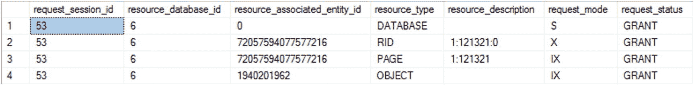

图 21-1：`sys.dm_tran_locks` 的输出，显示授予 `DELETE` 语句的行级锁

## 注意
我将在本章后面的“锁模式”一节中解释锁模式。

授予 `DELETE` 语句一个 `RID` 锁可以防止其他事务访问该行。

`RID` 锁锁定的资源可以在 `resource_description` 列中以下列格式表示：

```text
文件 ID:页 ID:槽(行)
```

在图 21-1 中对 `sys.dm_tran_locks` 的查询输出中，`DatabaseID` 在 `resource_database_id` 列下单独显示。`RID` 类型的 `resource_description` 列值将 `RID` 资源的其余部分表示为 `1:121321:0`。在此情况下，`文件 ID` `1` 是主数据文件，`页 ID` `121321` 是属于 `dbo.Test1` 表的一页（由 `C1` 列标识），`槽 (行)` `0` 代表该行在页内的位置。你可以通过执行以下 SQL 语句获取表名和数据库名：

```sql
SELECT OBJECT_NAME(1940201962),
DB_NAME(6);
```

行级锁提供了非常高的并发性，因为阻塞仅限于受影响的行。

### 键级锁

这是索引内的行锁，被标识为 `KEY` 锁。如你所知，对于具有聚集索引的表，表的数据页和聚集索引的叶页是相同的。由于对于具有聚集索引的表，行是相同的，因此在访问表（或聚集索引）中的行时，仅对聚集索引行或有限范围的行获取 `KEY` 锁。例如，考虑在 `Test1` 表上有一个聚集索引。

```sql
CREATE CLUSTERED INDEX TestIndex ON dbo.Test1(C1);
```

接下来，重新运行以下代码：

```sql
BEGIN TRAN
DELETE  dbo.Test1
WHERE   C1 = 1 ;
SELECT  dtl.request_session_id,
dtl.resource_database_id,
dtl.resource_associated_entity_id,
dtl.resource_type,
dtl.resource_description,
dtl.request_mode,
dtl.request_status
FROM    sys.dm_tran_locks AS dtl
WHERE   dtl.request_session_id = @@SPID ;
ROLLBACK
```

来自 `sys.dm_tran_locks` 的相应输出显示的是 `KEY` 锁而不是 `RID` 锁，如图 21-2 所示。

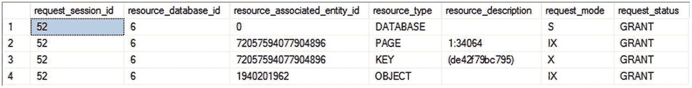

图 21-2：`sys.dm_tran_locks` 的输出，显示授予 `DELETE` 语句的键级锁

当你查询 `sys.dm_tran_locks` 时，你将能够检索数据库标识符 `resource_database_id`。你也可以从 `resource_associated_entity_id` 获取有关被锁定对象的信息；然而，要获取特定资源（在此情况下，是键所在的页），你必须查看 `resource_description` 列的值，即 `1:34064`。在此情况下，索引 ID `1` 是 `dbo.Test1` 表上的聚集索引。你还会看到发出的请求类型：S、IX、X 等。我将在即将到来的“锁模式”一节中更详细地介绍这些。

## 注意
你将在本章的“索引对锁定的影响”一节中了解 `IndId` 列的不同值以及如何确定相应的索引名称。

与行级锁一样，键级锁提供了非常高的并发性。

### 页级锁

页级锁在表或索引内的单个页上维护，并被标识为 `PAG` 锁。当查询请求一个页内的多行时，通过获取各个行的 `RID/KEY` 锁或在整个页上获取 `PAG` 锁，都可以维护所有请求行的一致性。锁管理器根据查询计划确定获取多个 `RID/KEY` 锁的资源压力，如果发现压力很高，则锁管理器会请求一个 `PAG` 锁。

`PAG` 锁锁定的资源在 `sys.dm_tran_locks` 的 `resource_description` 列中可能表示为以下格式：

```text
文件 ID:页 ID
```

页级锁可以通过减少其锁开销来提高单个查询的性能，但它会阻塞对页中所有行的访问，从而损害数据库的并发性。

### 区级锁

区级锁在区（一组八个连续的数据页或索引页）上维护，并被标识为 `EXT` 锁。例如，当在表上执行 `ALTER INDEX REBUILD` 命令，并且表的页可能从现有区移动到新区时，就会使用此锁。在此期间，使用 `EXT` 锁来保护区的完整性。

### 堆或 B 树锁

堆或 B 树锁用于描述何时可能对这两种类型的对象加锁。目标对象可以是无序堆表（即没有聚集索引的表）或 B 树对象（通常指分区）。`ALTER TABLE` 函数中的一个设置允许你控制如何影响分区的锁升级（在“锁升级”一节中介绍）。因为分区可以跨多个文件组，所以每个分区都必须有自己的数据分配定义。这就是 `HoBT` 锁发挥作用的地方。它的作用类似于表级锁，但作用在分区上，而不是表本身。


### 表级锁

这是表上最高级别的锁，被标识为 `TAB` 锁。表上的表级锁会保留对整个表及其所有索引的访问权。

当执行查询时，锁管理器会自动确定在较低级别获取多个锁的锁开销。如果确定在行级或页级获取锁的资源压力很高，锁管理器会直接为查询获取一个表级锁。

`OBJECT` 锁锁定的资源将在 `resource_description` 中以下列格式表示：

```text
ObjectID
```

与其他锁相比，表级锁所需的开销最小，因此可以提高单个查询的性能。另一方面，由于表级锁会阻塞对整个表（包括索引）的所有写请求，它会显著损害数据库的并发性。

有时，应用程序功能可能受益于为查询中引用的表使用特定的锁级别。例如，如果在非高峰时段执行管理查询，那么表级锁可能不会对系统用户造成太大影响；但是，它可以减少查询的锁开销，从而提高其性能。在这种情况下，查询开发人员可以通过使用锁提示来覆盖锁管理器对查询中引用表的锁级别选择。

```sql
SELECT * FROM  WITH(TABLOCK)
```

但是，在像这样从 SQL Server 手中夺取控制权时要谨慎。在实施之前要进行彻底的测试。

### 数据库级锁

数据库级锁在数据库上维护，并被标识为 `DB` 锁。当应用程序建立数据库连接时，锁管理器会为对应的 `session_id` 分配一个数据库级共享锁。这可以防止用户在其他用户连接到数据库时意外地删除或还原数据库。

SQL Server 确保在一个级别请求的锁会遵守在其他级别授予的锁。例如，一旦用户获取了表中某一行的行级锁，另一个用户就无法获取可能影响该行完整性的任何其他级别的锁。第二个用户可以获取其他行的行级锁或其他页的页级锁，但包含该行的页级或表级锁（与现有锁不兼容的）不会被授予其他用户。

用户或数据库管理员无需指定应应用锁的级别；锁管理器会自动确定。在访问少量行时，它通常倾向于使用行级和键级锁以辅助并发性。但是，如果多个低级别锁的锁开销结果非常高，锁管理器会自动选择一个合适的高级别锁。

### 锁操作和模式

由于 SQL Server 需要执行各种各样的操作，因此维护着一套同样庞大且复杂的锁定机制。除了不同类型的锁之外，还存在一个升级路径，用于将一种类型的锁更改为另一种。以下部分将描述这些模式和过程，以及它们的用途。

#### 锁升级

当执行查询时，SQL Server 会确定查询中引用的数据库对象所需的锁级别，并在获取所需的锁后开始执行查询。在查询执行期间，锁管理器会跟踪查询请求的锁的数量，以确定是否需要将锁级别从当前级别升级到更高级别。

锁升级阈值由 SQL Server 在事务过程中确定。当事务超过其阈值时，行锁和页锁会自动升级为表锁。锁级别升级到表级锁后，表上所有较低级别的锁都会自动释放。锁管理器的这种动态锁升级功能优化了查询的锁开销。

可以对给定表上的锁定机制建立一定级别的控制。例如，你可以控制是否发生锁升级。以下是进行此更改的 T-SQL 语法：

```sql
ALTER TABLE schema.table
SET (LOCK_ESCALATION = DISABLE);
```

此语法将完全禁用表上的锁升级（除了少数特殊情况）。你也可以将其设置为 `TABLE`，这将导致每次都升级为表锁。你还可以将表上的锁升级设置为 `AUTO`，这将允许 SQL Server 确定锁定模式和任何必要的升级。如果该表是分区的，你可能会看到升级变为分区级别。再次强调，对标准 SQL Server 行为使用此类修改时要谨慎。

你还可以选择使用跟踪标志 `1224` 在更大范围内禁用锁升级。这会基于锁的数量禁用锁升级，但保留基于内存压力的锁升级。你也可以使用跟踪标志 `1211` 同时禁用内存压力锁升级和基于锁数量的升级，但这是一个危险的选择，可能导致系统错误。我强烈建议在使用这两个选项之前进行彻底测试。

#### 锁模式

不同事务所需的隔离程度可能不同。例如，如果两个事务同时读取数据，数据的一致性不会受到影响；但是，如果允许两个事务同时修改数据，则会影响一致性。根据请求的访问类型，SQL Server 在锁定资源时使用不同的锁模式。

*   共享 (`S`)
*   更新 (`U`)
*   排他 (`X`)
*   意向
    *   意向共享 (`IS`)
    *   意向排他 (`IX`)
    *   共享意向排他 (`SIX`)
*   架构
    *   架构修改 (`Sch-M`)
    *   架构稳定性 (`Sch-S`)
*   批量更新 (`BU`)
*   键范围

##### 共享 (S) 模式

共享模式用于只读查询，例如 `SELECT` 语句。它不会阻止其他只读查询同时访问数据，因为并发读取不会损害数据的完整性。但是，为了保持数据完整性，会阻止对数据的并发数据修改查询。`（S）` 锁会一直保持在数据上，直到数据被读取。默认情况下，`SELECT` 语句获取的 `（S）` 锁在数据被读取后会立即释放。例如，考虑以下事务：

```sql
BEGIN TRAN
SELECT  *
FROM    Production.Product AS p
WHERE   p.ProductID = 1;
--其他查询
COMMIT
```

`SELECT` 语句获取的 `（S）` 锁不会一直保持到事务结束；相反，在默认隔离级别 `read_committed` 下，它会在 `SELECT` 语句读取数据后立即释放。`（S）` 锁的这种行为可以通过使用更高的隔离级别或锁提示来改变。


### 更新(U)模式

更新模式可能被认为与共享(S)锁类似，但它也包含在同一查询中修改数据的目标。与共享(S)锁不同，更新(U)锁表明数据是为修改而读取的。由于数据是出于修改目的而被读取的，SQL Server 不允许多个更新(U)锁同时作用于数据。此规则有助于维护数据完整性。请注意，允许对数据并发持有共享(S)锁。更新(U)锁与 `UPDATE` 语句相关联，而 `UPDATE` 语句的操作实际上涉及两个中间步骤：首先读取要修改的数据，然后修改数据。

在两个中间步骤中使用不同的锁模式以最大化并发性。在读取数据时，第一步不是获取排他权，而是在数据上获取一个更新(U)锁。在第二步中，更新(U)锁转换为用于修改的排他锁。如果不需要修改，则释放更新(U)锁；换句话说，它不会一直保持到事务结束。考虑以下脚本，该脚本将导致阻塞，直到 `UPDATE` 语句完成：

```
UPDATE Sales.Currency
SET Name = 'Euro'
WHERE CurrencyCode = 'EUR';
```

要理解 `UPDATE` 语句中间步骤的锁行为，您需要在查询运行时从 `sys.dm_tran_locks` 获取数据。您可以按照下面概述的步骤，在 `UPDATE` 语句的每一步之后获取锁状态。您需要打开三个连接，我将其称为连接 1、连接 2 和连接 3。这将需要在 Management Studio 中使用三个不同的查询窗口。您将按照我指定的顺序，在列出的连接中运行查询，以达到阻塞情况。这样做的目的是在阻塞发生时观察它们。表 21-1 显示了不同 T-SQL 查询窗口中的不同连接以及其中要运行的查询顺序。

表 21-1
用于显示 UPDATE 阻塞的脚本顺序

| 脚本顺序 | T-SQL 窗口 1 (连接 1) | T-SQL 窗口 2 (连接 2) | T-SQL 窗口 3 (连接 3) |
| --- | --- | --- | --- |
| **1** | `BEGIN TRANSACTION LockTran2` `--在资源上保留(S)锁` `SELECT *` `FROM Sales.Currency AS c WITH (REPEATABLEREAD)` `WHERE c.CurrencyCode = 'EUR' ;` `--在事务 LockTran1 执行 UPDATE 语句的第二步之前` `--允许执行 DMV` `WAITFOR DELAY '00:00:10';` `COMMIT` |   |   |
| **2** |   | `BEGIN TRANSACTION LockTran1` `UPDATE Sales.Currency` `SET Name = 'Euro'` `WHERE CurrencyCode = 'EUR';` `--注意：我们尚未提交` |   |
| **3** |   |   | `SELECT dtl.request_session_id,` `dtl.resource_database_id,` `dtl.resource_associated_entity_id,` `dtl.resource_type,` `dtl.resource_description,` `dtl.request_mode,` `dtl.request_status` `FROM sys.dm_tran_locks AS dtl` `ORDER BY dtl.request_session_id;` |
| **4) 等待 10 秒** |   |   |   |
| **5** |   |   | `SELECT dtl.request_session_id,` `dtl.resource_database_id,` `dtl.resource_associated_entity_id,` `dtl.resource_type,` `dtl.resource_description,` `dtl.request_mode,` `dtl.request_status` `FROM sys.dm_tran_locks AS dtl` `ORDER BY dtl.request_session_id;` |
| **6** |   | `COMMIT` |   |

在连接 2 中运行的 `REPEATABLEREAD` 锁定提示允许 `SELECT` 语句在资源上保留共享(S)锁。连接 3 中 `sys.dm_tran_locks` 的输出将提供 `UPDATE` 语句第一步之后的锁状态，因为 `UPDATE` 语句向排他(X)锁的转换被 `SELECT` 语句阻塞了。接下来，让我们看看在您执行 `UPDATE` 语句的各个步骤时，由 `sys.dm_tran_locks` 提供的锁状态。

图 21-3 显示了 `UPDATE` 语句第一步之后的锁状态（如前面所述，从在第三个连接（连接 3）上执行的 `sys.dm_tran_locks` 输出中获取）。

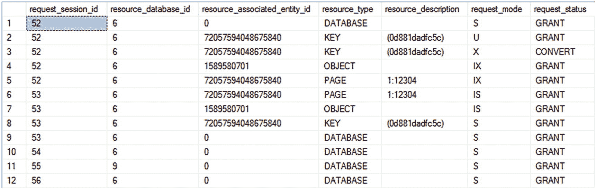

图 21-3
`sys.dm_tran_locks` 的输出，显示 UPDATE 语句的锁转换状态

## 注意
这些行的顺序并不那么重要。我按 `session_id` 排序是为了将每个查询的锁分组。

图 21-4 显示了 `UPDATE` 语句第二步之后的锁状态。


图 21-4
`sys.dm_tran_locks` 的输出，显示 UPDATE 语句持有的最终锁状态

从 `UPDATE` 语句第一步之后的 `sys.dm_tran_locks` 输出中，您可以注意到以下几点：

*   数据行上的更新(U)锁已授予 SPID。
*   请求在数据行上转换为排他(X)锁。

从 `UPDATE` 语句第二步之后的 `sys.dm_tran_locks` 输出中，您可以看到 `UPDATE` 语句仅在数据行上持有排他(X)锁。本质上，数据行上的更新(U)锁被转换为了排他(X)锁。

这一点很重要，通过不在第一步获取排他锁，`UPDATE` 语句允许其他事务在该期间使用 `SELECT` 语句读取数据。这是可能的，因为更新(U)锁和共享(S)锁彼此兼容。这提高了数据库的并发性。

## 注意
我将在本章后面讨论不同锁模式之间的锁兼容性。

您可能好奇为什么在 `UPDATE` 语句的第一步中使用更新(U)锁而不是共享(S)锁。要理解在 `UPDATE` 语句第一步中使用共享(S)锁代替更新(U)锁的缺点，让我们将 `UPDATE` 语句分解为两个步骤。

1.  使用共享(S)锁而不是更新(U)锁读取要修改的数据。
2.  通过获取排他(X)锁来修改数据。

考虑以下代码：

```
BEGIN TRAN
--1.使用共享(S)锁而不是更新(U)锁读取要修改的数据。
--    使用 REPEATABLEREAD 锁定提示保留共享(S)锁，因为
--    原始的更新(U)锁会保留直到转换为排他(X)锁。
SELECT *
FROM Sales.Currency AS c WITH (REPEATABLEREAD)
WHERE c.CurrencyCode = 'EUR' ;
--允许另一个等效的更新操作并发启动
WAITFOR DELAY '00:00:10' ;
--2. 通过获取排他(X)锁修改数据
UPDATE Sales.Currency WITH (XLOCK)
SET Name = 'EURO'
WHERE CurrencyCode = 'EUR' ;
COMMIT
```

如果此事务同时从两个连接执行，则在延迟后会导致死锁，如下所示：

```
Msg 1205, Level 13, State 51, Line 13
Transaction (Process ID 58) was deadlocked on lock resources with another process and has been chosen as the deadlock victim. Rerun the transaction.
```

两个事务都使用共享(S)锁读取要修改的数据，然后请求排他(X)锁进行修改。当第一个事务尝试转换为排他(X)锁时，它被第二个事务持有的共享(S)锁阻塞。类似地，当第二个事务尝试从共享(S)锁转换为排他(X)锁时，它被第一个事务持有的共享(S)锁阻塞，而第一个事务又被第二个事务阻塞。这导致了循环阻塞——因此，发生了死锁。

## 注意
死锁将在第 22 章中更详细地介绍。

为了避免这种典型的死锁，`UPDATE` 语句在其第一个中间步骤中使用更新(U)锁而不是共享(S)锁。与共享(S)锁不同，更新(U)锁不允许同时在同一个资源上存在另一个更新(U)锁。这迫使第二个并发的 `UPDATE` 语句等待，直到第一个 `UPDATE` 语句完成。


# SQL Server 锁模式

### 排他 (X) 模式

排他模式为数据操作查询（如 `INSERT`、`UPDATE` 和 `DELETE`）提供对数据库资源的独占修改权。它会阻止其他并发事务访问正在修改的资源。`INSERT` 和 `DELETE` 语句都会在其执行的最开始阶段获取 (X) 锁。如前所述，`UPDATE` 语句在读取待修改数据后会转换为 (X) 锁。在一个事务中授予的 (X) 锁会一直保持到事务结束。

(X) 锁有两个目的：

*   它防止其他事务访问正在修改的资源，这样它们看到的值要么是修改前的，要么是修改后的，而不是一个正在修改中的值。
*   它允许修改资源的事务在需要时安全地回滚到修改前的原始值，因为此时不允许其他事务同时修改该资源。

### 意向共享 (IS)、意向排他 (IX) 和共享意向排他 (SIX) 模式

意向共享、意向排他和共享意向排他锁表示查询意图在较低的锁层级上获取相应的 (S) 或 (X) 锁。例如，考虑在 `Sales.Currency` 表上的以下事务：

```
BEGIN TRAN
DELETE  Sales.Currency
WHERE   CurrencyCode = 'ALL';
SELECT  tl.request_session_id,
        tl.resource_database_id,
        tl.resource_associated_entity_id,
        tl.resource_type,
        tl.resource_description,
        tl.request_mode,
        tl.request_status
FROM    sys.dm_tran_locks tl;
ROLLBACK TRAN
```

图 21-5 显示了 `sys.dm_tran_locks` 的输出。

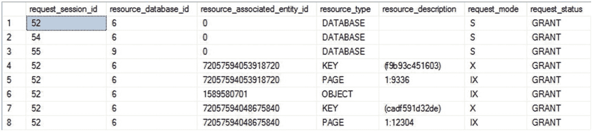

图 21-5

显示在较高层级授予的意向锁的 sys.dm_tran_locks 输出

表级（原文为`PAGE`，疑为`TABLE`）的 (IX) 锁表明 `DELETE` 语句意图在页、行或键级别获取 (X) 锁。同样，页级（`PAGE`）的 (IX) 锁表明查询意图在页中的行上获取 (X) 锁。较高层级的 (IX) 锁防止另一个事务在表或包含该行的页上获取不兼容的锁。

一个事务在持有较低级别锁的同时，在相应的较高层级标记意向锁——(IS) 或 (IX)——可以防止其他事务在该较高层级获取不兼容的锁。如果不使用意向锁，那么尝试在较高层级获取锁的事务将不得不扫描较低层级以检测是否存在较低级别的锁。虽然较高层级的意向锁表明了较低层级锁的存在，但获取较高层级锁的开销得到了优化。授予事务的意向锁会一直保持到事务结束。

在给定资源上一次只能放置一个 (SIX) 锁。这可以防止其他事务进行更新。在 (SIX) 锁保持期间，其他事务可以在较低级别的资源上放置 (IS) 锁。

此外，在某个层级上请求（或获取）的锁与意图在较低层级拥有一个（或多个）锁可以组合。例如，可以有 (SIU) 和 (UIX) 锁组合，表示在相应层级已获取 (S) 或 (U) 锁，并意图在较低层级获取 (U) 或 (X) 锁。

### 架构修改 (Sch-M) 和架构稳定性 (Sch-S) 模式

依赖于表架构的 SQL 语句会在表上获取架构修改和架构稳定性锁。处理表架构的 DDL 语句会在表上获取 (Sch-M) 锁，并阻止其他事务访问该表。(Sch-S) 锁是为依赖于架构但不修改架构的数据库活动获取的，例如查询编译。它阻止在表上获取 (Sch-M) 锁，但允许在表上授予其他锁。

由于在生产数据库中，架构修改并不常见，(Sch-M) 锁通常不会成为阻塞问题。并且因为 (Sch-S) 锁除了 (Sch-M) 锁外不会阻塞其他锁，所以并发性通常也不会受到 (Sch-S) 锁的影响。

### 批量更新 (BU) 模式

批量更新锁模式是批量加载操作特有的。这些操作包括旧式的 `bcp`（批量复制）、`BULK INSERT` 语句以及使用 `BULK` 选项的 `OPENROWSET` 插入。作为加速这些过程的机制，您可以提供 `TABLOCK` 提示或在表上设置选项以使其在批量加载时锁定。(BU) 锁模式的关键在于，它允许多个针对被锁定表的批量操作，但在批量进程运行时阻止其他操作。

### 键范围模式

键范围模式仅在隔离级别设置为可序列化时适用（您将在后面的“隔离级别”部分了解更多关于事务隔离级别的内容）。键范围锁应用于在事务打开期间将被重复使用的一系列或范围的键值。在可序列化事务期间锁定一个范围，可以确保其他行不会插入到该范围内，从而可能改变事务内的结果集。该范围可以使用其他锁模式锁定，这使得它更像是一种组合锁模式，而不是一种独特的单独锁模式。要使键范围锁模式工作，必须使用索引来定义范围内的值。

### 锁兼容性

SQL Server 通过阻止其他事务以不兼容的方式访问同一资源，为事务提供隔离。但是，如果一个事务尝试对同一资源执行兼容的操作，那么为了提高并发性，它不会被第一个事务阻塞。SQL Server 通过阻止事务在另一个事务持有的资源上获取不兼容的锁来确保这种选择性阻塞。例如，一个事务在资源上获取的 (S) 锁允许其他事务在同一资源上获取 (S) 锁。然而，一个事务在资源上获取的 (Sch-M) 锁会阻止其他事务在该资源上获取任何锁。


## 隔离级别

上一节介绍的锁模式有助于事务保护其数据一致性免受其他并发事务的影响。事务获得的数据保护或隔离程度不仅取决于锁模式，还取决于事务的隔离级别。这个级别会影响锁模式的行为。例如，默认情况下，(S) 锁在数据被读取后会立即释放，而不是一直持有到事务结束。这种行为可能不适用于某些应用程序功能。在这种情况下，你可以配置事务的隔离级别，以达到所需的隔离程度。

SQL Server 实现了六种隔离级别，其中四种由 ISO 定义：

*   读未提交
*   读已提交
*   可重复读
*   可序列化

另外两种隔离级别提供行版本控制，这是一种在数据操作查询中创建行版本的机制。这个额外的行版本允许读取查询访问数据，而无需对其获取锁。这两个额外的隔离级别如下：

*   快照读已提交（实际上是读已提交隔离的一部分）
*   快照

这四个 ISO 隔离级别按隔离程度递增的顺序列出。你可以使用 `SET TRANSACTION ISOLATION LEVEL` 语句在连接级别配置它们，或使用锁定提示在查询级别配置。连接级别的隔离级别配置在重新使用 `SET` 语句配置或连接关闭之前一直有效。所有隔离级别将在接下来的章节中解释。

### 读未提交

读未提交是四种隔离级别中最低的一种，它允许 `SELECT` 语句在不请求 (S) 锁的情况下读取数据。由于 `SELECT` 语句不请求 (S) 锁，它既不会阻塞，也不会被 (X) 锁阻塞。它允许 `SELECT` 语句在数据被修改时读取数据。这种数据读取被称为 `脏读`。

假设你有一个应用程序，其中数据修改量极少，并且你的应用程序不要求其发出的 `SELECT` 语句读取的数据具有很高的准确性。在这种情况下，你可以使用读未提交隔离级别，以避免某些其他数据修改活动阻塞 `SELECT` 语句。

你可以使用以下 `SET` 语句将数据库连接的隔离级别配置为读未提交：

```sql
SET TRANSACTION ISOLATION LEVEL READ UNCOMMITTED
```

你也可以使用 `NOLOCK` 锁定提示在查询基础上实现这种隔离程度。

```sql
SELECT  *
FROM    Production.Product AS p WITH (NOLOCK);
```

锁定提示的效果仅适用于该查询，不会更改连接的隔离级别。

读未提交隔离级别避免了由 `SELECT` 语句引起的阻塞，但如果事务依赖于 `SELECT` 语句读取数据的准确性，或者事务无法承受另一个事务并发更改数据，则不应使用它。

重要的是要理解脏读的含义。很多人认为这意味着，当一个字段的值从 `Tusa` 更新为 `Tulsa` 时，查询仍然可以读取之前的值，甚至是提交前更新的值。虽然这是正确的，但可能会发生更严重的数据问题。因为在读取数据时不放置锁，索引可能会被拆分。这可能导致查询返回额外或缺失的数据行。需要明确的是，在任何同时发生数据操作和数据读取的环境中使用读未提交，都可能导致意外的行为。此隔离级别的设计意图是用于主要关注报告和商业智能的系统，而非联机事务处理系统。由于使用未提交的数据，你可能会看到完全错误的数据。这一事实无论怎样强调都不为过。

### 读已提交

读已提交隔离级别阻止了由读未提交隔离级别引起的脏读。这意味着在此隔离级别下，`SELECT` 语句会请求 (S) 锁。这是 SQL Server 的默认隔离级别。如果需要，你可以使用以下 `SET` 语句将连接的隔离级别更改为读已提交：

```sql
SET TRANSACTION ISOLATION LEVEL READ COMMITTED
```

读已提交隔离级别适用于大多数情况，但由于 `SELECT` 语句获取的 (S) 锁不会一直持有到事务结束，它可能会导致不可重复读或幻读问题，如下文所述。

读已提交隔离级别的行为可以通过 `READ_COMMITTED_SNAPSHOT` 数据库选项更改。当此选项设置为 `ON` 时，数据操作事务使用行版本控制。这会增加 `tempdb` 的负载，因为事务未提交时，正在更改的行的先前版本存储在那里。这允许其他事务无需在数据上放置锁即可访问数据进行读取，这可以提高系统中所有查询的速度和效率，同时避免了使用 `NOLOCK` 或 `READ UNCOMMITTED` 时因页面拆分引起的问题。在 Azure SQL 数据库中，默认设置为 `READ_COMMITTED_SNAPSHOT`。

接下来，修改 `AdventureWorks2017` 数据库，打开 `READ_COMMITTED_SNAPSHOT`。

```sql
ALTER DATABASE AdventureWorks2017 SET READ_COMMITTED_SNAPSHOT ON;
```

现在想象一个业务场景。第一个连接和事务将从 `Production.Product` 表中提取数据，获取特定项目的颜色。

```sql
BEGIN TRANSACTION;
SELECT  p.Color
FROM    Production.Product AS p
WHERE   p.ProductID = 711;
```

第二个连接建立一个新事务，将修改同一项目的颜色。

```sql
BEGIN TRANSACTION ;
UPDATE  Production.Product
SET     Color = 'Coyote'
WHERE   ProductID = 711;
SELECT  p.Color
FROM    Production.Product AS p
WHERE   p.ProductID = 711;
```

在更新颜色后运行 `SELECT` 语句，你可以看到颜色已被更新。但如果你切换回第一个连接并重新运行原始的 `SELECT` 语句（不要再次运行 `BEGIN TRAN` 语句），你仍会看到颜色为 `Blue`。切换回第二个连接并完成事务。

```sql
COMMIT TRANSACTION;
```

再次切换到第一个事务，提交该事务，然后重新运行原始的 `SELECT` 语句。你将看到该项目的颜色已更新为 `Coyote`。在继续之前，你可以重置 `AdventureWorks2017` 上的隔离级别。

```sql
ALTER DATABASE AdventureWorks2017 SET READ_COMMITTED_SNAPSHOT OFF;
```

**注意：** 如果 `tempdb` 已满，使用行版本控制的数据修改将继续成功，但读取操作可能会失败，因为版本化的行将不可用。如果你在数据库中启用了任何类型的行版本控制隔离，必须格外注意在 `tempdb` 中保持可用空间。


# 可重复读

可重复读隔离级别允许 `SELECT` 语句将其（S）锁保留到事务结束，从而防止其他事务在此期间修改数据。数据库功能可能在事务内部，根据该事务内 `SELECT` 语句读取的数据做出逻辑决策。如果决策结果依赖于 `SELECT` 语句读取的数据，那么你应该考虑防止其他并发事务修改数据。例如，考虑以下两个事务：

*   **将 `ProductID` *= 1* 的价格标准化**：对于 `ProductID = 1`，如果 `Price > 10`，则价格减少 `10`。
*   **应用折扣**：对于 `Price > 10` 的产品，应用 `40 percent` 的折扣。

现在考虑下面的测试表：

```sql
DROP TABLE IF EXISTS dbo.MyProduct;
GO
CREATE TABLE dbo.MyProduct (ProductID INT,
Price MONEY);
INSERT INTO dbo.MyProduct
VALUES (1, 15.0);
```

你可以这样编写这两个事务：

```sql
DECLARE @Price INT ;
BEGIN TRAN NormailizePrice
SELECT  @Price = mp.Price
FROM    dbo.MyProduct AS mp
WHERE   mp.ProductID = 1 ;
/*Allow transaction 2 to execute*/
WAITFOR DELAY '00:00:10' ;
IF @Price > 10
UPDATE  dbo.MyProduct
SET     Price = Price - 10
WHERE   ProductID = 1 ;
COMMIT
--Transaction 2 from Connection 2
BEGIN TRAN ApplyDiscount
UPDATE  dbo.MyProduct
SET     Price = Price * 0.6 --Discount = 40%
WHERE   Price > 10 ;
COMMIT
```

表面上看，前面的事务可能看起来没问题，是的，它们在单用户环境中确实可以工作。但在多用户环境中，多个事务可以并发执行时，这里就有问题了！

要找出问题，让我们按以下顺序从不同连接执行这两个事务：

1.  首先启动事务 1。
2.  在事务 1 启动后的十秒内启动事务 2。

正如你可能猜到的那样，事务结束时，产品（`ProductID = 1`）的新价格将是 `-1.0`。哎呀——看起来你准备关门大吉了！

问题发生的原因是，在事务 1 读取完数据并即将根据数据做出决策时，事务 2 被允许修改数据。事务 1 需要比默认隔离级别（读已提交）提供的更高的隔离度。

作为解决方案，你希望防止事务 2 在事务 1 处理数据期间修改数据。换句话说，为事务 1 提供在事务后期再次读取数据而不被他人修改的能力。此功能称为**可重复读**。考虑到上下文，解决方案的实现可能是显而易见的。重新创建示例表后，你可以这样写：

```sql
SET TRANSACTION ISOLATION LEVEL REPEATABLE READ ;
GO
--Transaction 1 from Connection 1
DECLARE @Price INT ;
BEGIN TRAN NormalizePrice
SELECT  @Price = Price
FROM    dbo.MyProduct AS mp
WHERE   mp.ProductID = 1 ;
/*Allow transaction 2 to execute*/
WAITFOR DELAY  '00:00:10' ;
IF @Price > 10
UPDATE  dbo.MyProduct
SET     Price = Price - 10
WHERE   ProductID = 1 ;
COMMIT
GO
SET TRANSACTION ISOLATION LEVEL READ COMMITTED --Back to default
GO
```

将事务 1 的隔离级别提高到可重复读将防止事务 2 在事务 1 执行期间修改数据。因此，产品的价格不会出现不一致。由于意图是在事务结束前不释放 `SELECT` 语句获取的（S）锁，因此将隔离级别设置为可重复读的效果也可以在查询级别使用锁提示来实现。

```sql
DECLARE @Price INT ;
BEGIN TRAN NormalizePrice
SELECT  @Price = Price
FROM    dbo.MyProduct AS mp WITH (REPEATABLEREAD)
WHERE   mp.ProductID = 1 ;
/*Allow transaction 2 to execute*/
WAITFOR DELAY  '00:00:10'
IF @Price > 10
UPDATE  dbo.MyProduct
SET     Price = Price - 10
WHERE   ProductID = 1 ;
COMMIT
```

这个解决方案防止了 `MyProduct.Price` 的数据不一致，但它给这个场景引入了另一个问题。观察事务 2 的结果，你会意识到它可能导致死锁。因此，尽管前面的解决方案防止了数据不一致，但它不是一个完整的解决方案。仔细观察可重复读隔离级别对事务的影响，你会发现它引入了之前解释过的 `UPDATE` 语句内部实现所避免的典型死锁问题。`SELECT` 语句获取并保留了（S）锁而不是（U）锁，尽管它打算在事务后期修改数据。（S）锁允许事务 2 获取（U）锁，但它阻止了（U）锁转换为（X）锁。事务 1 在后期尝试获取数据的（U）锁导致了循环阻塞，从而引发死锁。

为了防止死锁并仍然避免数据损坏，你可以采用与 `UPDATE` 语句内部实现相同的策略。因此，事务 1 可以不在执行 `SELECT` 语句时请求（S）锁，而是通过使用 `UPDLOCK` 锁提示来请求（U）锁。

```sql
DECLARE @Price INT ;
BEGIN TRAN NormalizePrice
SELECT  @Price = Price
FROM    dbo.MyProduct AS mp WITH (UPDLOCK)
WHERE   mp.ProductID = 1 ;
/*Allow transaction 2 to execute*/
WAITFOR DELAY  '00:00:10'
IF @Price > 10
UPDATE  dbo.MyProduct
SET     Price = Price - 10
WHERE   ProductID = 1 ;
COMMIT
```

这个解决方案同时防止了数据不一致和死锁的可能性。如果将隔离级别提高到可重复读没有引入典型的死锁，那么它本来是可以完成任务的。由于因为将（S）锁保留到事务结束而存在发生死锁的可能，所以通常更倾向于获取（U）锁而不是持有（S）锁，如上所示。


# 可序列化

可序列化是六种隔离级别中最高的。它不是只在要访问的行上获取锁，而是在数据集中请求顺序的当前行和下一行上获取范围锁。例如，在可序列化隔离级别执行的 `SELECT` 语句会在要访问的行及其顺序的下一行上获取一个 (RangeS-S) 锁。这可以防止其他事务在第一个事务操作的数据集中添加行，并保护第一个事务在其事务范围内不会在其数据集中发现新行。在事务内的数据集中发现新行也被称为*幻读*。

为了理解为什么需要可序列化隔离级别，让我们考虑一个例子。假设公司中某个组（`GroupID = 10`）有 100 美元的奖金基金，需要分配给该组的员工。奖金支付后的基金余额应为 $0。考虑以下测试表：

```sql
DROP TABLE IF EXISTS dbo.MyEmployees;
GO
CREATE TABLE dbo.MyEmployees (EmployeeID INT,
GroupID INT,
Salary MONEY);
CREATE CLUSTERED INDEX i1 ON dbo.MyEmployees (GroupID);
--Employee 1 in group 10
INSERT INTO dbo.MyEmployees
VALUES (1, 10, 1000),
--Employee 2 in group 10
(2, 10, 1000),
--Employees 3 & 4 in different groups
(3, 20, 1000),
(4, 9, 1000);
```

所述的业务功能可以如下实现：

```sql
DECLARE @Fund MONEY = 100,
@Bonus MONEY,
@NumberOfEmployees INT;
BEGIN TRAN PayBonus
SELECT  @NumberOfEmployees = COUNT(*)
FROM    dbo.MyEmployees
WHERE   GroupID = 10;
/*Allow transaction 2 to execute*/
WAITFOR DELAY  '00:00:10';
IF @NumberOfEmployees > 0
BEGIN
SET @Bonus = @Fund / @NumberOfEmployees;
UPDATE  dbo.MyEmployees
SET     Salary = Salary + @Bonus
WHERE   GroupID = 10;
PRINT 'Fund balance =
' + CAST((@Fund - (@@ROWCOUNT * @Bonus)) AS VARCHAR(6)) + '   $';
END
COMMIT
```

你将看到返回的值为基金余额 `$0`，因为更新成功完成。`PayBonus` 事务在单用户环境中运行良好。然而，在多用户环境中，存在问题。

考虑另一个事务，它向 `GroupID = 10` 添加一个新员工，如下所示，并且在第二个连接中并发执行（在 `PayBonus` 事务开始后立即执行）：

```sql
BEGIN TRAN NewEmployee
INSERT  INTO MyEmployees
VALUES  (5, 10, 1000);
COMMIT
```

`PayBonus` 事务之后的基金余额将是 `-$50`！虽然新员工可能喜欢这样，但小组基金将出现赤字。这会导致数据逻辑状态的不一致。

为了防止这种数据不一致，应该阻止正在操作的数据集（或组）中添加新员工。在讨论的五种隔离级别中，只有快照隔离能提供类似的功能，因为事务不仅需要保护现有数据，还需要防止新数据进入数据集。可序列化隔离级别可以通过在受影响的行及其顺序的下一行（由 `GroupID` 列上的 `MyEmployees.i1` 索引确定的顺序）上获取范围锁来提供这种隔离。因此，通过将事务隔离级别设置为可序列化，可以防止 `PayBonus` 事务的数据不一致。

请记住先重新创建表。

```sql
SET TRANSACTION ISOLATION LEVEL SERIALIZABLE;
GO
DECLARE @Fund MONEY = 100,
@Bonus MONEY,
@NumberOfEmployees INT;
BEGIN TRAN PayBonus
SELECT  @NumberOfEmployees = COUNT(*)
FROM    dbo.MyEmployees
WHERE   GroupID = 10;
/*Allow transaction 2 to execute*/
WAITFOR DELAY  '00:00:10';
IF @NumberOfEmployees > 0
BEGIN
SET @Bonus = @Fund / @NumberOfEmployees;
UPDATE  dbo.MyEmployees
SET     Salary = Salary + @Bonus
WHERE   GroupID = 10;
PRINT 'Fund balance =
' + CAST((@Fund - (@@ROWCOUNT * @Bonus)) AS VARCHAR(6)) + '   $';
END
COMMIT
GO
--Back to default
SET TRANSACTION ISOLATION LEVEL READ COMMITTED ;
GO
```

可序列化隔离级别的效果也可以在查询级别通过在 `SELECT` 语句上使用 `HOLDLOCK` 锁定提示来实现，如下所示：

```sql
DECLARE @Fund MONEY = 100,
@Bonus MONEY,
@NumberOfEmployees INT ;
BEGIN TRAN PayBonus
SELECT  @NumberOfEmployees = COUNT(*)
FROM    dbo.MyEmployees WITH (HOLDLOCK)
WHERE   GroupID = 10 ;
/*Allow transaction 2 to execute*/
WAITFOR DELAY  '00:00:10' ;
IF @NumberOfEmployees > 0
BEGIN
SET @Bonus = @Fund / @NumberOfEmployees
UPDATE  dbo.MyEmployees
SET     Salary = Salary + @Bonus
WHERE   GroupID = 10 ;
PRINT 'Fund balance =
' + CAST((@Fund - (@@ROWCOUNT * @Bonus)) AS VARCHAR(6)) + '   $' ;
END
COMMIT
```

你可以通过在 `PayBonus` 事务执行期间从另一个连接查询 `sys.dm_tran_locks` 来观察 `PayBonus` 事务获取的范围锁，如图 21-6 所示。

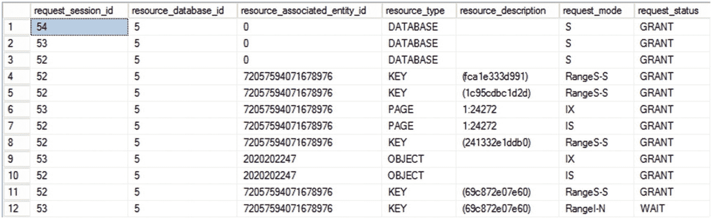

**图 21-6** 显示授予可序列化事务的范围锁的 sys.dm_tran_locks 输出

`sys.dm_tran_locks` 的输出显示，在三个索引行上获取了共享范围 (RangeS-S) 锁：`GroupID = 10` 的第一个员工，`GroupID = 10` 的第二个员工，以及 `GroupID = 20` 的第三个员工。这些范围锁阻止了任何新员工进入 `GroupID = 10`。

刚刚展示的范围锁引入了一些有趣的副作用。

*   在此期间，无法添加 `GroupID` 介于 10 和 20 之间的新员工。例如，尝试添加 `GroupID` 为 15 的新员工将被 `PayBonus` 事务阻塞。

    ```sql
    BEGIN TRAN NewEmployee
    INSERT  INTO dbo.MyEmployees
    VALUES  (6, 15, 1000);
    COMMIT
    ```

*   如果 `PayBonus` 事务的数据集最终是现有数据中按索引排序的最后一组，那么对数据集中最后一行之后的那行所需的范围锁，将获取在表中最后一个可能的数据值上。

为了理解此行为，让我们删除 `GroupID > 10` 的员工，使 `GroupID = 10` 数据集成为聚簇索引（或表）中的最后一个数据集。

```sql
DELETE  dbo.MyEmployees
WHERE   GroupID > 10;
```

再次运行更新后的奖金和 `newemployee` 事务。图 21-7 显示了 `PayBonus` 事务的 `sys.dm_tran_locks` 的结果输出。


**图 21-7** 显示授予可序列化事务的扩展范围锁的 sys.dm_tran_locks 输出

如图 21-7 所示，聚簇索引中最后一行 (`KEY = ffffffffffff`) 上的范围锁将阻止所有 `GroupID` 大于或等于 10 的新员工的添加。你知道锁是在最后一行上，不是因为它在 `sys.dm_tran_locks` 的输出中以可见方式显示，而是因为你之前已经清理了该行之前的所有内容。例如，尝试添加 `GroupID = 999` 的新员工将被 `PayBonus` 事务阻塞。

```sql
BEGIN TRAN NewEmployee
INSERT  INTO dbo.MyEmployees
VALUES  (7, 999, 1000);
COMMIT
```


# 猜猜如果 `GroupID` 列（换句话说，就是 `WHERE` 子句中的列）上没有索引会发生什么？

在你思考的时候，我将在另一列上重新创建带有聚集索引的表。

```sql
DROP TABLE IF EXISTS dbo.MyEmployees;
GO
CREATE TABLE dbo.MyEmployees (EmployeeID INT,
GroupID INT,
Salary MONEY);
CREATE CLUSTERED INDEX i1 ON dbo.MyEmployees (EmployeeID);
--Employee 1 in group 10
INSERT INTO dbo.MyEmployees
VALUES (1, 10, 1000),
--Employee 2 in group 10
(2, 10, 1000),
--Employees 3 & 4 in different groups
(3, 20, 1000),
(4, 9, 1000);
```

现在重新运行更新后的奖金查询和新员工查询。图 21-8 显示了 `PayBonus` 事务的 `sys.dm_tran_locks` 的输出结果。

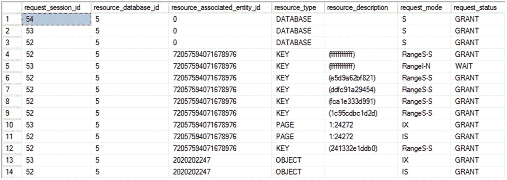

**图 21-8** `sys.dm_tran_locks` 的输出，显示了在 `WHERE` 子句列上没有索引时，授予可序列化事务的范围锁

如图 21-8 所示，新聚集索引中最后一行可能的行（`KEY = ffffffffffff`）上的范围锁，将再次阻止向表中添加任何新行。我将在本章后面的“索引对可序列化隔离级别的影响”一节中讨论这种广泛锁定的原因。

正如你所见，可序列化隔离级别不仅像可重复读隔离级别一样，将共享锁保持到事务结束，而且还通过持有范围锁来防止任何新行出现在数据集中。由于这种增加的阻塞可能会损害数据库并发性，因此你应该避免使用可序列化隔离级别。如果你必须使用可序列化，那么请确保有良好的索引和查询来优化性能，以最小化事务的大小和持续时间。

## 快照

快照隔离是自 SQL Server 2005 以来可用的第二种基于行版本控制的隔离级别。与已提交读快照隔离不同，快照隔离需要在事务开始时显式调用 `SET TRANSACTION ISOLATION LEVEL`。它还需要在数据库上设置隔离级别。快照隔离旨在成为比已提交读快照隔离更严格的隔离级别。快照隔离将尝试对其打算修改的数据放置排他锁。如果该数据上已经存在锁，则快照事务将失败。它提供事务级读取一致性，这使得它比已提交读快照更适用于金融类系统。

## 索引对锁定的影响

索引会影响表上的锁定行为。在没有索引的表上，锁的粒度是 `RID`、`PAG`（包含 `RID` 的页面）和 `TAB`。向表添加索引会影响要锁定的资源。例如，考虑以下没有索引的测试表：

```sql
DROP TABLE IF EXISTS dbo.Test1;
GO
CREATE TABLE dbo.Test1 (C1 INT,
C2 DATETIME);
INSERT INTO dbo.Test1
VALUES (1, GETDATE());
```

接下来，观察该表上事务的锁定行为：

```sql
BEGIN TRAN LockBehavior
UPDATE  dbo.Test1 WITH (REPEATABLEREAD)  --Hold all acquired locks
SET     C2 = GETDATE()
WHERE   C1 = 1 ;
--Observe lock behavior from another connection
WAITFOR DELAY  '00:00:10' ;
COMMIT
```

图 21-9 显示了适用于测试表的 `sys.dm_tran_locks` 的输出。

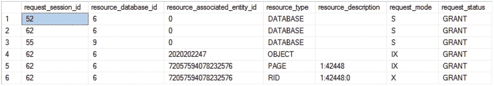

**图 21-9** `sys.dm_tran_locks` 的输出，显示了在没有索引的表上授予的锁

事务获取了以下锁：

*   表上的 (`IX`) 锁
*   包含数据行的页面上的 (`IX`) 锁
*   表中数据行上的 (`X`) 锁

当 `resource_type` 是对象时，`sys.dm_tran_locks` 中的 `resource_associated_entity_id` 列值指示放置锁的对象的 `objectid`。你可以从 `sys.object` 系统表中获取获取锁的具体对象名称，如下所示：

```sql
SELECT OBJECT_NAME();
```

索引对表锁定行为的影响因 `WHERE` 子句列上的索引类型而异。这种差异源于非聚集索引和聚集索引的叶级页与表的数据页有不同的关系。让我们深入研究这些索引对表锁定行为的影响。

### 非聚集索引的影响

由于非聚集索引的叶级页与表的数据页是分离的，因此与非聚集索引关联的资源也受到保护以防止损坏。SQL Server 自动确保这一点。要查看实际效果，请在测试表上创建一个非聚集索引。

```sql
CREATE NONCLUSTERED INDEX iTest ON dbo.Test1(C1);
```

再次运行 `LockBehavior` 事务，并从另一个连接查询 `sys.dm_tran_locks`，你将得到如图 21-10 所示的结果。


**图 21-10** `sys.dm_tran_locks` 的输出，显示了非聚集索引对锁定行为的影响

事务获取了以下锁：

*   包含非聚集索引行的页面上的 (`IU`) 锁
*   索引页中非聚集索引行上的 (`U`) 锁
*   表上的 (`IX`) 锁
*   包含数据行的页面上的 (`IX`) 锁
*   数据页中数据行上的 (`X`) 锁

请注意，只有行级和页级锁直接与非聚集索引关联。非聚集索引的下一个更高的锁粒度级别是相应表上的表级锁。

因此，非聚集索引在表上引入了额外的锁定开销。你可以通过在 `ALTER INDEX` 中使用 `ALLOW_ROW_LOCKS` 和 `ALLOW_PAGE_LOCKS` 选项来避免索引上的锁定开销。但要明白，这是一种权衡，可能涉及性能损失，并且需要仔细测试以确保它不会对你的系统产生负面影响。

```sql
ALTER INDEX iTest ON dbo.Test1
SET (ALLOW_ROW_LOCKS = OFF ,ALLOW_PAGE_LOCKS= OFF);
BEGIN TRAN LockBehavior
UPDATE  dbo.Test1 WITH (REPEATABLEREAD)  --Hold all acquired locks
SET     C2 = GETDATE()
WHERE   C1 = 1;
--Observe lock behavior using sys.dm_tran_locks
--from another connection
WAITFOR DELAY  '00:00:10';
COMMIT
ALTER INDEX iTest ON dbo.Test1
SET (ALLOW_ROW_LOCKS = ON ,ALLOW_PAGE_LOCKS= ON);
```

在处理索引时，可以使用这些选项来启用/禁用索引上的 `KEY` 锁和 `PAG` 锁。仅禁用 `KEY` 锁会导致索引上的最低锁粒度为 `PAG` 锁。在索引上配置的锁粒度配置将一直有效，直到重新配置为止。


## 注意

修改锁（如上所述）应是在尝试过许多其他选项之后的最后手段。这可能导致显著的锁开销，从而严重影响系统性能。

图 21-11 展示了从另一个连接执行`sys.dm_tran_locks`的输出结果。


**图 21-11**
`sys.dm_tran_locks`的输出，显示了`sp_index`选项对锁粒度的影响

事务在测试表上获取的唯一锁是一个表级别的排他锁（X）。

从新的锁行为可以看出，禁用`KEY`锁会将锁粒度升级到表级别。这将阻塞对该表或其索引的所有并发访问；因此，它会严重损害数据库并发性。然而，如果在阻塞场景中非聚集索引成为一个争用点，那么禁用索引上的`PAG`锁（从而只允许索引上的`KEY`锁）可能是有益的。

**注意：**
使用此选项可能会产生严重的副作用。你应仅将其作为最后手段使用。

### 聚集索引的效果

对于聚集索引，索引的叶级页与表的数据页是相同的，因此聚集索引可用于避免非聚集索引引入的锁定额外页（叶级页）和行的开销。为了理解与聚集索引相关的锁开销，请将前面的非聚集索引转换为聚集索引。

```
CREATE CLUSTERED INDEX iTest ON dbo.Test1(C1) WITH DROP_EXISTING;
```

如果你再次运行锁定脚本并在另一个连接中查询`sys.dm_tran_locks`，你应该会看到`LockBehavior`事务在`iTest`上的结果输出，如图 21-12 所示。


**图 21-12**
`sys.dm_tran_locks`的输出，显示了聚集索引对锁行为的影响

事务获取了以下锁：
*   表上的意向排他锁（IX）
*   包含聚集索引行的页上的意向排他锁（IX）
*   表或聚集索引中的聚集索引行上的排他锁（X）

聚集索引行和叶级页上的锁实际上也是数据行和数据页上的锁，因为数据页和叶级页是相同的。因此，与非聚集索引相比，聚集索引减少了表上的锁开销。

聚集索引减少的锁开销是使用聚集索引而非堆表的另一个好处。

### 索引对可序列化隔离级别效果的影响

索引在决定可序列化隔离级别引起的阻塞量方面起着重要作用。`WHERE`子句列（导致数据集被锁定）上索引的可用性允许 SQL Server 确定要锁定的行的顺序。例如，考虑在可序列化隔离级别部分中使用的例子。`SELECT`语句使用`GroupID`列上的过滤器来形成其数据集，如下所示：

```
DECLARE @NumberOfEmployees INT;
SELECT  @NumberOfEmployees = COUNT(*)
FROM    dbo.MyEmployees WITH (HOLDLOCK)
WHERE   GroupID = 10;
```

`GroupID`列上有一个聚集索引，允许 SQL Server 在要访问的行和下一个正确顺序的行上获取（RangeS-S）锁。

如果移除`GroupID`列上的索引，则 SQL Server 无法确定应在哪些行上获取范围锁，因为行的顺序不再得到保证。因此，`SELECT`语句在表级别获取一个意向共享锁（IS），而不是在行级别获取更小粒度的锁，如图 21-13 所示。

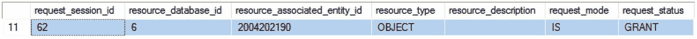

**图 21-13**
`sys.dm_tran_locks`的输出，显示了在`WHERE`子句列上没有索引时授予`SELECT`语句的锁

通过在过滤列上没有索引，你显著增加了可序列化隔离级别引起的阻塞程度。这是在`WHERE`子句列上拥有索引的另一个充分理由。

## 捕获阻塞信息

尽管阻塞对于将事务与其他并发事务隔离是必要的，但有时它可能会上升到过高的水平，对数据库并发性产生不利影响。在最简单的阻塞场景中，会话在资源上获取的锁会阻塞另一个请求在同一资源上获取不兼容锁的会话。为了提高并发性，分析阻塞原因并应用适当的解决方案非常重要。

在阻塞场景中，你需要以下信息来清楚地了解阻塞原因：
*   **阻塞和被阻塞会话的连接信息**：你可以从`sys.dm_os_waiting_tasks`动态管理视图中获取此信息。
*   **阻塞和被阻塞会话的锁信息**：你可以从`sys.dm_tran_locks` DMO（动态管理对象）中获取此信息。
*   **阻塞和被阻塞会话最后执行的 SQL 语句**：你可以使用`sys.dm_exec_requests` DMV（动态管理视图）结合`sys.dm_exec_sql_text`和`sys.dm_exec_queryplan`或扩展事件来获取此信息。

你也可以通过运行活动监视器从 SQL Server Management Studio 获取以下信息。“进程”页面提供了所有 SPID（系统进程标识）的连接信息。它显示了被阻塞的 SPID、阻塞它们的进程以及任何阻塞链的头部，并提供了有关进程已运行时长、其 SPID 等详细信息。可以利用扩展事件和阻塞报告来收集大量相同的信息。对于即时的锁检查，请使用 DMO；对于扩展的监控和历史跟踪，你将需要使用扩展事件。你可以在“扩展事件和 blocked_process_report 事件”部分找到更多相关信息。

为了为收集阻塞信息的过程提供更强大的功能和灵活性，SQL Server 管理员可以使用 SQL 脚本来提供此处列出的相关信息。


# 使用 SQL 捕获阻塞信息

要获取足够多关于被阻塞进程和阻塞进程的信息，你可以借助多个动态管理视图。这个查询将显示基于等待进程来识别被阻塞进程所需的信息。你可以轻松地添加筛选条件，例如仅访问被阻塞超过特定时间的进程，或仅查看特定数据库中的进程，等等。

```sql
SELECT  dtl.request_session_id AS WaitingSessionID,
        der.blocking_session_id AS BlockingSessionID,
        dowt.resource_description,
        der.wait_type,
        dowt.wait_duration_ms,
        DB_NAME(dtl.resource_database_id) AS DatabaseName,
        dtl.resource_associated_entity_id AS WaitingAssociatedEntity,
        dtl.resource_type AS WaitingResourceType,
        dtl.request_type AS WaitingRequestType,
        dest.[text] AS WaitingTSql,
        dtlbl.request_type BlockingRequestType,
        destbl.[text] AS BlockingTsql
FROM    sys.dm_tran_locks AS dtl
JOIN    sys.dm_os_waiting_tasks AS dowt
        ON dtl.lock_owner_address = dowt.resource_address
JOIN    sys.dm_exec_requests AS der
        ON der.session_id = dtl.request_session_id
CROSS APPLY sys.dm_exec_sql_text(der.sql_handle) AS dest
LEFT JOIN sys.dm_exec_requests derbl
        ON derbl.session_id = dowt.blocking_session_id
OUTER APPLY sys.dm_exec_sql_text(derbl.sql_handle) AS destbl
LEFT JOIN sys.dm_tran_locks AS dtlbl
        ON derbl.session_id = dtlbl.request_session_id;
```

为了理解如何分析阻塞场景以及阻塞脚本提供的相关信息，请考虑以下示例。首先，创建一个测试表。

```sql
DROP TABLE IF EXISTS dbo.BlockTest;
GO
CREATE TABLE dbo.BlockTest (C1 INT,
                            C2 INT,
                            C3 DATETIME);
INSERT INTO dbo.BlockTest
VALUES (11, 12, GETDATE()),
       (21, 22, GETDATE());
```

现在打开三个连接，并发运行以下两个查询。运行它们后，在第三个连接中使用阻塞脚本。在一个连接中执行以下代码：

```sql
BEGIN TRAN User1
UPDATE  dbo.BlockTest
SET     C3 = GETDATE();
```

接下来，在 `User1` 事务正在执行时，执行此代码：

```sql
BEGIN TRAN User2
SELECT  C2
FROM    dbo.BlockTest
WHERE   C1 = 11;
COMMIT
```

这就创建了一个简单的阻塞场景，其中 `User1` 事务阻塞了 `User2` 事务。

阻塞脚本的输出立即提供了开始解决阻塞问题的有用信息。首先，你可以识别特定的会话信息，包括阻塞会话和等待会话的会话 ID。你立即从等待资源获得了资源描述、等待类型以及进程已等待的毫秒数。正是这个值让你能够提供筛选条件以排除作为正常处理一部分的短期阻塞。

数据库名称会被提供，因为阻塞可能发生在系统中的任何地方，而不仅仅是 AdventureWorks2017。你需要确定它发生在哪里。对于等待进程，检索了来自基本锁定信息的资源和类型。

会显示阻塞请求类型，并且如果可用，会同时显示等待的 T-SQL 和阻塞的 T-SQL。一旦你获得了发生阻塞的对象，拥有 T-SQL 以便你确切理解进程是在哪里以及如何阻塞或被阻塞的，是消除或减少阻塞量过程中的关键部分。所有这些信息都可以从一个简单的查询中获得。图 21-14 显示了先前被阻塞进程的示例输出。


图 21-14 阻塞脚本的输出

务必返回到连接 1 并提交或回滚事务。

# 扩展事件和 `blocked_process_report` 事件

扩展事件提供了一个名为 `blocked_process_report` 的事件。该事件基于你需要提供给系统配置的阻塞进程阈值工作。此脚本将阈值设置为五秒：

```sql
EXEC sp_configure 'show advanced option', '1';
RECONFIGURE;
EXEC sp_configure
'blocked process threshold',
5;
RECONFIGURE;
```

在大多数系统中，这通常是一个非常低的值。如果你有已建立的性能服务级别协议（SLA），你可以将其用作阈值。一旦设置了值，你就可以配置警报，以便在任何进程被阻塞的时间超过你设定的值时发送电子邮件、推文或即时消息。它也充当扩展事件的触发器。`blocked process threshold` 的默认值为零，意味着它实际上永远不会触发。如果你打算使用扩展事件来跟踪被阻塞进程，你需要将此值从默认值进行调整。

要设置捕获 `blocked_process_report` 的会话，首先打开扩展事件会话属性窗口。（尽管在生产环境中应该使用脚本来设置此事件，但我将展示如何使用 GUI。）为会话提供一个名称，然后导航到“事件”页面。在“事件库”文本框中键入 `block`，这将找到 `blocked_process_report` 事件。通过单击右箭头选择该事件。你应该看到类似于图 21-15 的内容。

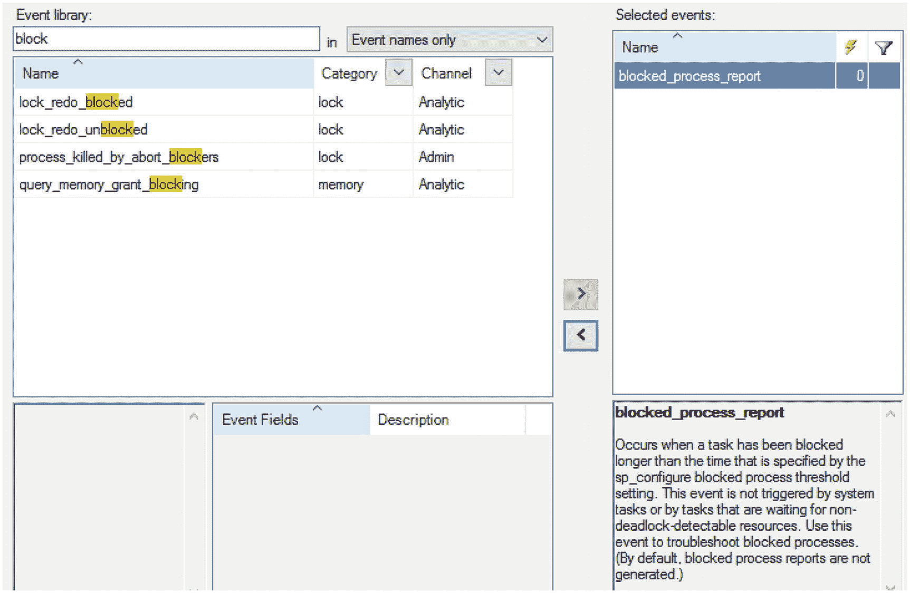

图 21-15 在扩展事件窗口中选择的阻塞进程报告事件

事件字段都已为你预选。如果你仍然运行着上一节中创建阻塞的查询，你现在只需单击“运行”按钮即可捕获事件。否则，返回到我们在上一节中用于生成阻塞进程报告的查询，并在两个不同的连接中运行它们。超过阻塞进程阈值后，你会看到事件触发……并且持续触发。如果你配置如此并且让连接保持运行，它将每五秒触发一次。实时数据流中的输出如图 21-16 所示。


图 21-16 `blocked_process_report` 事件的输出

有些信息是不言自明的；要深入了解细节，你需要查看在 `blocked_process` 字段中生成的 XML。

```xml
BEGIN TRAN User2
SELECT  C2
FROM    dbo.BlockTest
WHERE   C1 = 11;
COMMIT   

BEGIN TRAN User1
UPDATE  dbo.BlockTest
SET     C3 = GETDATE();   
```

如果你浏览这个 XML，元素就很清楚了。`<blocked-process>` 显示了被阻塞进程的信息，包括熟悉的信息，例如会话 ID（这里标记为旧式的 SPID）、数据库 ID 等。你可以在 `<inputbuf>` 元素中看到查询。诸如 `lockMode` 之类的细节可在 `<process>` 元素中找到。请注意，该 XML 不包括一些你可以轻松地从 T-SQL 查询中获取的其他信息，例如被阻塞和等待进程的查询字符串。但有了可用的 SPID，如果缓存中有的话，你可以从中获取它们，或者你可以将阻塞进程报告与其他事件（如 `rpc_starting`）结合使用以显示查询信息。但是，这样做会增加在数据库中长期使用这些事件的开销。如果你知道存在阻塞问题，这可以作为短期监控项目的一部分来捕获必要的阻塞信息。


## 阻塞解决方案

一旦分析了阻塞的原因，下一步就是确定任何可能的解决方案。以下是一些可用于实现此目的的技术：

*   优化由阻塞和被阻塞的`SPIDs`执行的查询。
*   降低隔离级别。
*   对争用的数据进行分区。
*   在争用的数据上使用覆盖索引。

## 注意

有关避免阻塞的详细建议列表将在本章后面的“减少阻塞的建议”部分中出现。

要理解这些解决方案技术，让我们将它们依次应用到前面的阻塞场景中。

### 优化查询

优化由阻塞和被阻塞的进程执行的查询有助于减少阻塞持续时间。在阻塞场景中，参与阻塞的进程执行的查询如下：

*   阻塞进程：

```sql
BEGIN TRAN User1
UPDATE  dbo.BlockTest
SET     C3 = GETDATE();
```

*   被阻塞进程：

```sql
BEGIN TRAN User2
SELECT  C2
FROM    dbo.BlockTest
WHERE   C1 = 11;
COMMIT
```

请注意，除了第一个查询缺少`COMMIT`之外，在没有`WHERE`子句的情况下运行`UPDATE`无疑是有问题的，并且性能会不佳。随着数据规模的扩大，情况会变得更糟。然而，这只是一个用于演示目的的测试。

接下来，让我们分析由阻塞和被阻塞的`SPIDs`执行的各个 SQL 语句以优化其性能。

*   阻塞`SPID`的`UPDATE`语句在没有`WHERE`子句的情况下访问数据。这使得该查询在大型表上固有地成本高昂。如果可能，请使用适当的`WHERE`子句将`UPDATE`语句的操作分解为多个批处理。记住要尝试使用基于集合的操作（例如`TOP`语句）来限制行数。如果在单独的事务中执行批处理的各个`UPDATE`语句，那么在一个事务中持有资源的锁会更少，持有时间也更短。这也有助于减少或避免锁升级。

*   被阻塞`SPID`执行的`SELECT`语句有一个在`C1`列上的`WHERE`子句。从测试表的索引结构中，您可以看到该列上没有索引。为了优化`SELECT`语句，您可以在`C1`列上创建一个聚集索引。

```sql
CREATE CLUSTERED INDEX i1 ON dbo.BlockTest(C1);
```

## 注意

由于`example`表适合放在一个页面内，添加聚集索引对查询性能不会有太大影响。但是，随着表中行数的增加，索引的有益效果将变得更加明显。

优化查询减少了进程持有锁的时间。查询优化降低了阻塞的影响，但它并不能完全阻止阻塞。然而，只要优化后的查询在可接受的性能限制内执行，少量的阻塞可能可以忽略。

### 降低隔离级别

另一种解决阻塞的方法是，如果可能，使用较低的隔离级别。`User2`事务的`SELECT`语句在请求数据行的共享(S)锁时被阻塞。可以通过利用`SNAPSHOT`隔离级别（`Read Committed Snapshot`）来减轻此事务的隔离级别，这样`SELECT`语句就不会请求(S)锁。可以使用`SET`语句为连接配置`Read Committed Snapshot`隔离级别。

```sql
SET TRANSACTION ISOLATION LEVEL SNAPSHOT;
GO
BEGIN TRAN User2
SELECT  C2
FROM    dbo.BlockTest
WHERE   C1 = 11;
COMMIT
GO
--Back to default
SET TRANSACTION ISOLATION LEVEL READ COMMITTED;
GO
```

此示例展示了降低隔离级别的实用性。与使用任何可能导致脏读（从而可能引发不正确的数据或丢失/额外行）的方法相比，使用此`SNAPSHOT`隔离级别是首选方案。

### 对争用的数据进行分区

在处理大型数据集或可以离散存储的数据时，可以对数据应用表分区。分区数据是水平拆分的，即根据某些值进行拆分（例如，按月拆分销售数据）。这允许事务在各个分区上并发执行，而不会相互阻塞。这些独立的分区被视为查询、更新和插入的单个单元；只有存储和访问由 SQL Server 分开处理。应注意，分区仅在 SQL Server 的开发人员版和企业版中可用。

在前面的阻塞场景中，可以按日期分离数据。如果您关心性能（或者如果担心管理，就将所有内容放在`PRIMARY`上），这需要设置多个文件组，并根据定义的规则拆分数据。一旦`UPDATE`语句获得`WHERE`子句，那么它和原始的`SELECT`语句就能够在两个独立的分区上并发执行。这确实要求`WHERE`子句仅在分区键列上进行筛选。一旦混合了其他条件，您就不太可能从分区消除中受益，这意味着性能可能会更差，而不是更好。

## 注意

如果操作得当，分区可以提高大型数据集的性能和并发性。但是，分区几乎完全是一种数据管理解决方案，而不是性能调优选项。

### 使用覆盖索引

在阻塞场景中，您应该分析被阻塞或阻塞进程的查询是否可以通过覆盖索引得到完全满足。如果其中一个进程的查询可以通过覆盖索引得到满足，那么它将阻止该进程请求争用资源上的锁。此外，如果另一个进程不需要在覆盖索引上加锁（以维护数据完整性），那么这两个进程就能够并发执行而不会相互阻塞。

例如，在前面的阻塞场景中，被阻塞进程的`SELECT`语句可以通过`C1`和`C2`列上的覆盖索引得到完全满足。

```sql
CREATE NONCLUSTERED INDEX iAvoidBlocking ON dbo.BlockTest(C1,  C2) ;
```

阻塞进程的事务无需在覆盖索引上获取锁，因为它只访问表的`C3`列。覆盖索引将允许`SELECT`语句获取`C1`和`C2`列的值，而无需访问基表。因此，被阻塞进程的`SELECT`语句可以在覆盖索引行上获取共享(S)锁，而不会被阻塞进程在数据行上获取的排他(X)锁所阻塞。这允许两个事务并发执行，没有任何阻塞。

将覆盖索引视为一种在 SQL Server 自动维护一致性的情况下“复制”部分表数据的机制。如果该覆盖索引主要是只读的，则可以允许某些事务从“复制”数据中提供服务，而基表（和其他索引）可以继续为其他事务提供服务。这种方法的权衡之处在于需要额外的存储空间以及在数据修改期间可能存在额外的开销。


## 减少阻塞的建议

对于数据库应用程序而言，单用户性能和随用户数增加而扩展的能力都至关重要。在多用户环境中，确保数据库操作不会长时间占用数据库资源非常重要。这使得数据库能够支持大量操作（或数据库用户）并发执行，而不会出现严重的性能下降。以下是减少/避免数据库阻塞的一系列技巧：

*   保持事务简短。
    *   在事务内执行最少的步骤/逻辑。
    *   不要在事务内执行耗时的外部活动，例如发送确认电子邮件或执行由最终用户驱动的活动。
    *   优化查询。
    *   根据需要创建索引，以确保系统内查询的最佳性能。
    *   避免在频繁更新的列上创建聚集索引。更新聚集索引键列需要对聚集索引和所有非聚集索引加锁（因为它们的行定位器包含聚集索引键）。
    *   考虑使用覆盖索引来为被阻塞的 `SELECT` 语句服务。

*   使用查询超时或资源调控器来控制失控的查询。有关资源调控器的更多信息，请查阅联机丛书：[`http://bit.ly/1jiPhfS`](http://bit.ly/1jiPhfS)。
    *   避免因错误处理例程或应用程序逻辑不佳而失去对事务范围的控制。
    *   使用 `SET XACT_ABORT ON` 以避免在事务内发生错误条件时事务保持打开状态。
    *   在执行包含事务的 SQL 批处理或存储过程后，从客户端错误处理程序 (`TRY/CATCH`) 执行以下 SQL 语句。
        ```
        IF @@TRANCOUNT > 0 ROLLBACK
        ```

*   使用所需的最低隔离级别。
    *   考虑使用行版本控制，即 `SNAPSHOT` 隔离级别之一，来帮助减少争用。

## 自动化检测与收集阻塞信息

除了使用扩展事件捕获信息外，您还可以使用 SQL Server Agent 自动化检测阻塞条件和收集相关信息的过程。SQL Server 提供了性能监视器计数器（如表 21-2 所示）来跟踪等待时间量。

表 21-2：性能监视器计数器

| **对象** | **计数器** | **实例** | **描述** |
| --- | --- | --- | --- |
| `SQLServer:Locks` (对于 SQL Server 命名实例 `MSSQL$<实例名>:Locks`) | `Average Wait Time(ms)` | `_Total` | 每次导致等待的锁的平均等待时间 |
|   | `Lock Wait Time (ms)` | `_Total` | 上一秒内锁的总等待时间 |

您可以创建 SQL Server 警报和作业的组合来自动化以下过程：

1.  使用 `Average Wait Time (ms)` 计数器确定平均等待时间何时超过可接受的阻塞量。根据您的偏好，您也可以使用 `Lock Wait Time (ms)` 计数器。
2.  一旦确定了最小等待时间，就设置 `Blocked Process Threshold`。当平均等待时间超过限制时，通过电子邮件通知 SQL Server DBA 阻塞情况。
3.  使用阻塞脚本或依赖于阻塞进程报告的跟踪，在一段时间内自动收集阻塞信息。

要设置阻塞进程报告自动运行，首先创建名为“阻塞分析”的 SQL Server 作业，以便稍后由您创建的 SQL Server 警报使用。您可以按照以下步骤在 SQL Server Management Studio 中创建此 SQL Server 作业以收集阻塞信息：


*图 21-17：输入运行阻塞脚本的命令*

1.  使用 `blocked_process_report` 事件生成一个扩展事件脚本（如第 6 章详述）。
2.  运行该脚本在服务器上创建会话，但先不要启动它。
3.  在 Management Studio 中，展开服务器：选择 *<服务器名>* ➤ SQL Server Agent ➤ Jobs。最后，右键单击并选择 New Job。
4.  在 New Job 对话框的 General 页面上，输入作业名称和其他详细信息。
5.  在 Steps 页面上，单击 New 并输入通过 T-SQL 启动和停止会话的命令，如图 21-17 所示。

您可以使用以下命令来完成此操作：
```
ALTER EVENT SESSION Blocking
ON SERVER
STATE = START;
WAITFOR DELAY '00:10';
ALTER EVENT SESSION Blocking
ON SERVER
STATE = STOP;
```

会话的输出取决于您创建目标时如何定义它。

1.  单击 OK 返回到 New Job 对话框。
2.  单击 OK 创建 SQL Server 作业。将创建一个处于启用和可运行状态的 SQL Server 作业，使用跟踪脚本收集十分钟的阻塞信息。

您可以创建一个 SQL Server 警报来自动化以下任务：

*   通过电子邮件、短信或寻呼机通知 DBA。
*   执行“阻塞分析”作业以收集十分钟的阻塞信息。

您可以按照以下步骤在 SQL Server 企业管理器中创建 SQL Server 警报：

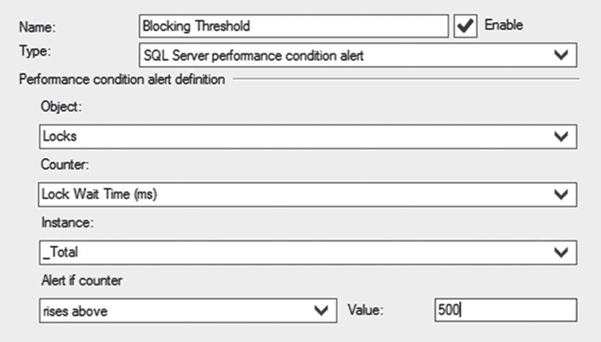
*图 21-18：输入警报名称和其他详细信息*

1.  在 Management Studio 中，仍然在对象资源管理器的 SQL Agent 区域，右键单击 Alerts 并选择 New Alert。
2.  在新警报的 Properties 对话框的 General 页面上，输入警报名称和其他详细信息，如图 21-18 所示。您需要为其捕获信息的特定对象是 `Locks`（图 21-18 中的 `MSSQL$GF2008:Locks`）。我选择了 `500ms` 作为一个严格的 SLA 示例，用于了解查询何时超过该值。
3.  在 Response 页面上，定义您认为合适的响应，例如通知操作员。
4.  单击 OK 返回到新警报的 Properties 对话框。
5.  在 Response 页面上，输入图 21-19 中显示的剩余信息。

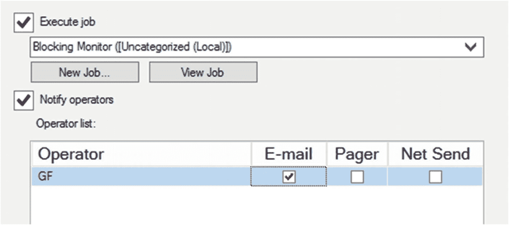
*图 21-19：输入警报触发时要执行的操作*

6.  选择“阻塞分析”作业以自动收集阻塞信息。
7.  输入完所有信息后，单击 OK 创建 SQL Server 警报。将创建一个处于启用状态的 SQL Server 警报来执行预期任务。
8.  确保 SQL Server Agent 正在运行。

SQL Server 警报和作业一起将实现阻塞检测和信息收集过程的自动化。这种阻塞信息的自动收集将确保在系统进入大规模阻塞状态时，能够获得大量有用的阻塞信息。

## 摘要

尽管阻塞是不可避免的，且对于维护事务间的隔离性确实至关重要，但它有时会对数据库并发性产生不利影响。在多用户数据库应用中，你必须将并发事务间的阻塞最小化。

SQL Server 提供了不同的技术来避免/减少阻塞，数据库应用应该利用这些技术，以便随着数据库用户的增加能够线性扩展。当应用面临高度阻塞时，你可以使用各种工具收集相关的阻塞信息，以了解阻塞的根本原因。下一步就是采用适当的技术来避免或减少阻塞。

阻塞不仅会损害并发性，在进程之间甚至单个进程内部发生相互阻塞的情况下，还可能导致数据库请求的突然终止。我们将在下一章介绍这一被称为“死锁”的事件。

# 22. 死锁的原因与解决方案

在上一章中，我讨论了阻塞的工作原理。阻塞是导致性能低下的主要原因之一。阻塞可能导致一种被称为死锁的特殊情况，这意味着死锁从根本上说是一个性能问题。当两个或多个事务之间发生死锁时，SQL Server 会允许一个事务完成，并终止另一个事务，回滚该事务。然后 SQL Server 会向相应的应用返回一个错误，通知用户其已被选为死锁牺牲品。这使应用只剩下两个选择：重新提交事务或向最终用户致歉。为了成功完成事务并避免道歉，理解可能导致死锁的原因以及处理死锁的方法至关重要。

在本章中，我将涵盖以下主题：

*   死锁基础
*   捕获死锁的错误处理
*   分析死锁原因的方法
*   解决死锁的技术

## 死锁基础

死锁是一种特殊的阻塞场景，其中两个进程互相阻塞。每个进程在持有自己资源的同时，试图访问被另一个进程锁定的资源。这将导致一种被称为“致命拥抱”的阻塞场景，如图 22-1 所示。

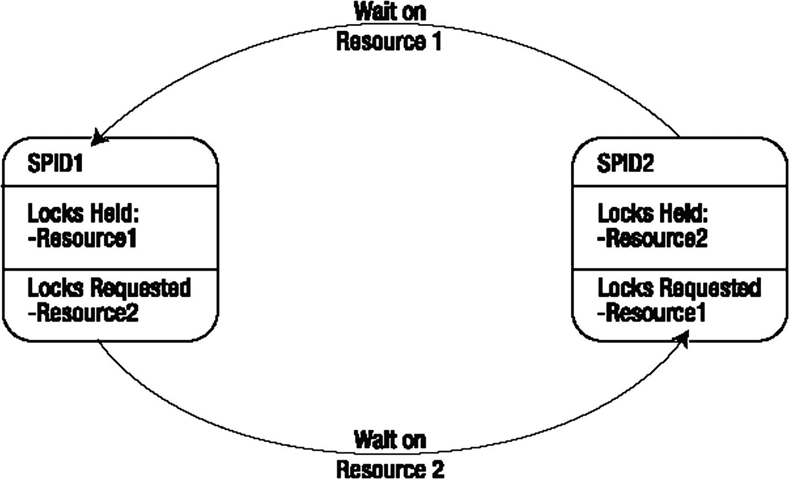

图 22-1. 一个死锁场景

当两个进程试图在同一个资源上升级其锁机制时，死锁也经常发生。在这种情况下，两个进程中的每一个都对某个资源（如一个 `RID`）持有共享锁，并且每个进程都试图将锁从共享锁提升为排他锁；然而，在对方释放其共享锁之前，任何一方都无法做到这一点。这同样会导致其中一个进程被选为死锁牺牲品。

最后，单个进程在并行操作期间也有可能陷入死锁。在并行操作期间，一个线程可能持有一个资源 A 的锁，同时等待另一个资源 B；与此同时，另一个线程可能持有 B 的锁，同时等待 A。这与涉及多个进程的情况一样，都属于死锁场景，只不过这里涉及的是来自一个进程的多个线程。这是一个罕见事件，但确实可能发生，并且通常被认为是一个可能已在累积更新中修复的错误。

死锁是一种特别棘手的阻塞类型，因为即使给予无限的时间，死锁也无法自行解决。死锁需要一个外部进程来打破循环阻塞。

SQL Server 有一个称为锁监视器的死锁检测例程，它会定期检查 SQL Server 中是否存在死锁。一旦检测到死锁条件，SQL Server 会选择参与死锁的会话之一作为牺牲品，以打破循环阻塞。牺牲品通常是估算成本最低的进程，因为这意味着 SQL Server 回滚该进程最容易。此操作涉及撤销牺牲品会话持有的所有资源。SQL Server 通过回滚被选为牺牲品的会话的未提交事务来实现这一点。

死锁是一个性能问题，并且像任何性能问题一样，需要处理。与其他性能问题一样，存在一个普遍的痛苦阈值。偶尔发生的罕见死锁并不值得警觉。然而，频繁且持续的死锁绝对是问题。正如你可能偶尔遇到一个运行时间稍长而不需要大量调优关注的查询一样，你也可能遇到一些不需要你特别关注的死锁情况。请确保你正处理系统中最痛苦的部分。

### 选择死锁牺牲品

SQL Server 通过评估撤销参与会话事务的成本来确定将哪个会话作为死锁牺牲品，并选择估算成本最低的那个。你可以通过将会话连接的死锁优先级设置为 `LOW` 来施加一些控制。

```
SET DEADLOCK_PRIORITY LOW;
```

这会引导 SQL Server 在发生死锁时选择此特定会话作为牺牲品。你可以通过执行以下 `SET` 语句将连接的死锁优先级重置为其正常值：

```
SET DEADLOCK_PRIORITY NORMAL;
```

`SET` 语句也允许你将会话标记为 `HIGH` 死锁优先级。这不会阻止给定会话上发生死锁，但会降低该会话被选为牺牲品的可能性。你甚至可以将优先级级别设置为数值，从 -10（最低优先级）到 10（最高优先级）。

## 注意

设置死锁优先级不应随意应用。你可能会意外地在某个报表上设置优先级，导致关键任务进程被选为牺牲品。使用此设置必须进行仔细测试。

在平局情况下，其中一个进程会被选为牺牲品并回滚，就好像它的成本最低一样。有些进程对被选为死锁牺牲品是免疫的。这些进程在死锁图中被标记为如此，永远不会被选为死锁牺牲品。我见过的最常见例子是，当进程已经处于回滚过程中时。

### 使用错误处理捕获死锁

当 SQL Server 选择某个会话作为牺牲品时，它会引发一个带有错误号的错误。你可以在 T-SQL 中使用 `TRY/CATCH` 结构来处理该错误。SQL Server 通过自动回滚牺牲品会话的事务来确保数据库的一致性。回滚操作确保该会话返回到其事务开始前的相同状态。在错误处理程序中确定死锁情况后，可以在将错误返回给应用程序之前，尝试在 T-SQL 中多次重启事务。

以下 T-SQL 语句展示了一种处理死锁错误的方法示例：

```sql
DECLARE @retry AS TINYINT = 1,
@retrymax AS TINYINT = 2,
@retrycount AS TINYINT = 0;
WHILE @retry = 1 AND @retrycount <= @retrymax
BEGIN
SET @retry = 0;
BEGIN TRY
UPDATE HumanResources.Employee
SET LoginID = '54321'
WHERE BusinessEntityID = 100;
END TRY
BEGIN CATCH
IF (ERROR_NUMBER() = 1205)
BEGIN
SET @retrycount = @retrycount + 1;
SET @retry = 1;
END
END CATCH
END
```

`TRY/CATCH` 方法允许你捕获错误。然后，你可以使用 `ERROR_NUMBER()` 函数检查错误号，以确定是否发生了死锁。一旦确定为死锁，就可以尝试按设定的次数（本例中为两次）重启事务。使用错误捕获将有助于你的应用程序处理间歇性或偶尔发生的死锁，但最佳方法是分析死锁的原因，并在可能的情况下解决它。

## 死锁分析

有时，通过分析原因，你可以防止死锁发生。你需要以下信息来做到这一点：

*   参与死锁的会话
*   死锁涉及的资源
*   会话执行的查询

### 收集死锁信息

你有四种方法来收集死锁信息。

*   使用扩展事件。
*   设置跟踪标志 1222。
*   设置跟踪标志 1204。
*   使用跟踪事件。

跟踪标志用于自定义某些 SQL Server 行为，例如在此情况下生成死锁信息。但它们是一种较旧的捕获此信息的方式。在 SQL Server 中，自 2008 年起，每个实例都有一个名为 `system_health` 的扩展事件会话。此会话自动运行，它默认收集的事件之一就是死锁图。这是无需以任何方式修改服务器即可立即获取死锁信息的最简单方法。`system_health` 会话也是你从 Azure SQL Database 获取死锁信息的方式。

`system_health` 会话默认写入磁盘。文件的大小和数量是有限制的，因此根据你系统上的活动情况，如果你调查的死锁发生在过去一段时间，你可能会发现死锁信息丢失了。如果你需要收集更长时间的信息并确保捕获尽可能多的事件，扩展事件提供了多种收集死锁信息的方法。这可能是你可以在服务器上应用的收集死锁信息的最佳方法。你可以使用以下选项：

*   `lock_deadlock`：显示有关死锁发生的基本信息。
*   `lock_deadlock_chain`：捕获死锁中每个参与者的信息。
*   `xml:deadlock_report`：显示带有死锁原因的 XML 死锁图。

死锁图生成 XML 输出。在扩展事件捕获死锁事件后，你可以通过使用事件查看器，或者如果你将事件结果输出到文件则通过打开 XML 文件，在 SSMS 中查看死锁图。虽然所有三个事件显示的信息类似，但对于基本的死锁信息，最容易理解的是 `xml:deadlock_report`。当专门监控死锁，尤其是在你试图处理某个特定死锁的情况下，我还建议同时捕获 `lock_deadlock_chain`，以便如果你需要的话，可以获取有关死锁中涉及的各个会话的更详细信息。对于大多数情况，死锁图应提供你需要的信息。

要直接从 `system_health` 会话检索死锁图，你可以像这样查询输出：

```sql
DECLARE @path NVARCHAR(260)
--to retrieve the local path of system_health files
SELECT @path = dosdlc.path
FROM sys.dm_os_server_diagnostics_log_configurations AS dosdlc;
SELECT @path = @path + N'system_health_*';
WITH fxd
AS (SELECT CAST(fx.event_data AS XML) AS Event_Data
FROM sys.fn_xe_file_target_read_file(@path,
NULL,
NULL,
NULL) AS fx )
SELECT dl.deadlockgraph
FROM
(   SELECT dl.query('.') AS deadlockgraph
FROM fxd
CROSS APPLY event_data.nodes('(/event/data/value/deadlock)') AS d(dl) ) AS dl;
```

你可以在 Management Studio 中打开死锁图。你可以搜索 XML，但从 XML 生成的死锁图的工作原理几乎就像死锁的执行计划一样，如图 22-2 所示。


**图 22-2：在 Profiler 中显示的死锁图**

我将在本章后面的“分析死锁”一节中向你展示如何使用此图。

两个生成死锁信息的跟踪标志可以单独使用，也可以一起使用，以生成不同的信息集。通常人们更喜欢运行其中一个，因为它们会向 SQL Server 的错误日志中写入大量信息。这些跟踪标志将收集到的信息写入到发生死锁事件的服务器上的日志文件中。跟踪标志 1222 提供了关于死锁的最详细信息。

## 使用跟踪标志

跟踪标志 `1204` 提供了有助于分析死锁原因的死锁信息。它按涉及死锁的每个节点对信息进行排序。跟踪标志 `1222` 提供了详细的死锁信息，但它的信息分解方式不同。`1222` 跟踪标志按资源和进程对信息进行排序，并提供更多信息。这两组数据都将在“分析死锁”部分讨论。

`DBCC TRACEON` 语句用于开启（或启用）跟踪标志。跟踪标志将保持启用状态，直到使用 `DBCC TRACEOFF` 语句将其禁用。如果服务器重启，此跟踪标志将被清除。您可以使用 `DBCC TRACESTATUS` 语句来确定跟踪标志的状态。同时设置这两个死锁跟踪标志如下所示：
```
DBCC TRACEON (1222, -1);
DBCC TRACEON (1204, -1);
```

为确保跟踪标志始终设置，可以通过以下步骤在 SQL Server 配置管理器中将它们设为 SQL Server 启动的一部分：

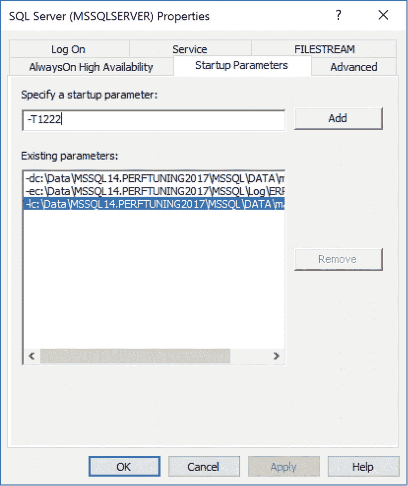

图 22-3

SQL Server 实例的属性对话框，显示“启动参数”选项卡

1.  打开 SQL Server 实例的“属性”对话框。
2.  切换到“属性”对话框的“启动参数”选项卡，如图 22-3 所示。
3.  在“指定启动参数”文本框中输入 `-T1222`，然后单击“添加”以添加跟踪标志 `1222`。
4.  单击“确定”按钮关闭所有对话框。

在您重启 SQL Server 实例后，这些跟踪标志设置将生效。

对于大多数系统，使用 `system_health` 会话是更简单、更高效的机制。它默认安装并启用。您无需执行任何操作即可使其运行。`system_health` 会话不会向服务器的错误日志中添加噪音，使其更干净、更易于处理。跟踪标志仍然可用，旧系统可能会发现它们是必要的。然而，更新的系统根本不需要它们。

### 分析死锁

为了分析死锁的原因，让我们考虑一个简单直接的小例子。我将使用 `system_health` 会话来显示死锁信息。

在一个连接中，执行此脚本：
```
BEGIN TRAN
UPDATE Purchasing.PurchaseOrderHeader
SET Freight = Freight * 0.9 -- 10% discount on shipping
WHERE PurchaseOrderID = 1255;
```

在第二个连接中，执行此脚本：
```
BEGIN TRANSACTION
UPDATE Purchasing.PurchaseOrderDetail
SET OrderQty = 4
WHERE ProductID = 448
AND PurchaseOrderID = 1255;
```

这些脚本中的每一个都打开一个事务并操作数据，但既不提交也不回滚事务。切换回第一个事务并运行这个附加查询：
```
UPDATE  Purchasing.PurchaseOrderDetail
SET     OrderQty = 2
WHERE   ProductID = 448
AND PurchaseOrderID = 1255;
```

不幸的是，可能几秒钟后，第一个连接就会遇到死锁。
```
Msg 1205, Level 13, State 51, Line 1
Transaction (Process ID 52) was deadlocked on lock resources with another process and has been chosen as the deadlock victim. Rerun the transaction.
```

知道问题出在哪里了吗？

让我们通过检查通过跟踪事件收集的死锁图来分析死锁。在事件资源管理器窗口中有一个单独的选项卡用于 `xml:deadlock_report` 事件。打开该选项卡将显示死锁图（见图 22-4）。

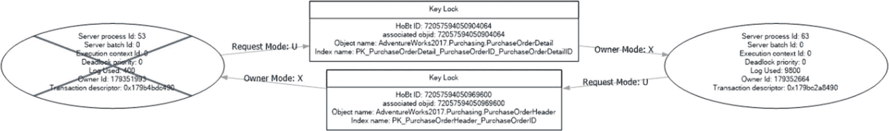

图 22-4

在分析器工具中显示的死锁图

从图 22-4 中显示的死锁图可以清楚地看到，涉及两个进程：左侧的会话 `53` 和右侧的会话 `63`。会话 `53`（在死锁图屏幕上带有蓝色大 *X* 交叉划掉的那个）被选为死锁牺牲品。涉及到两个不同的键。顶部的键由会话 `53` 拥有，由指向会话对象的箭头指示，名为 `Owner Mode`，并标记为 `X` 表示独占。会话 `63` 正在尝试请求相同的键进行更新。另一个键由会话 `63` 拥有，会话 `53` 请求更新，由 `U` 指示。您可以看到死锁中涉及的对象的确切 HoBt ID、对象 ID、对象名称和索引名称。对于像这样经典、简单的死锁，您已经获得了所需的大部分信息。最后一部分将是来自每个进程的运行查询。如果您将鼠标悬停在每个会话上（如图 22-5 所示），这些信息是可用的。


图 22-5

死锁牺牲品对应的 T-SQL 语句

可以这样读取死锁每一方的 T-SQL 语句，以便您可以准确关注信息所在的位置。

这种死锁的可视化表示可以完成这项工作。但是，您可能需要深入研究底层 XML 来检查死锁的一些细节，例如所涉及进程的隔离级别。如果您直接从扩展事件值打开该 XML 文件，您可以找到比图形化死锁图中为您显示的简单集合多得多的信息。看一下图 22-6。


图 22-6

定义死锁图的 XML 信息

如果您仔细查看，可以看到死锁图中显示的部分信息，但您也会看到更多信息。例如，此死锁的一部分实际上涉及我未编写或未作为示例一部分执行的代码。表上有一个名为 `uPurchaseOrderDetail` 的触发器。您还可以看到我用于生成死锁的代码。所有这些信息都可以帮助您准确识别导致死锁的代码片段。您还会获得诸如 `sqlhandle` 之类的信息，然后可以将其与 DMO 结合使用，从缓存或查询存储中提取语句和执行计划。因为计划是在查询运行之前创建的，所以即使对于被选为死锁牺牲品的查询，它也将对您可用。

值得花一些时间更详细地探索此 XML。表 22-1 显示了扩展事件中的一些元素及其代表的信息。

表 22-1

XML 死锁图数据


| 日志条目 | 描述 |
| --- | --- |
| ``<deadlock>`` ``<victim-list>`` | 死锁信息的开始。它开始列出牺牲品进程。 |
| ``<victimProcess id="process179b3f3b468" />`` | 被选为死锁牺牲品的进程的物理内存地址。 |
| ``<process-list>`` | 定义死锁牺牲品的进程。可能不止一个。 |
| ``<process179b3f3b468" />`` ``</victim-list>`` ``<process-list>`` &nbsp;&nbsp;``<process id="process179b3f3b468" taskpriority="0" logused="400" waitresource="KEY: 6:72057594050904064 (4ab5f0d47ad5)" waittime="3703" ownerId="179351993" transactionname="user_transaction" lasttranstarted="2018-03-25T11:28:18.140" XDES="0x179b4bdc490" lockMode="U" schedulerid="1" kpid="2168" status="suspended" spid="53" sbid="0" ecid="0" priority="0" trancount="2" lastbatchstarted="2018-03-25T11:29:05.377" lastbatchcompleted="2018-03-25T11:29:05.363" lastattention="1900-01-01T00:00:00.363" clientapp="Microsoft SQL Server Management Studio - Query" hostname="WIN-8A2LQANSO51" hostpid="7028" loginname="WIN-8A2LQANSO51\Administrator"`` ``isolationlevel="read committed (2)"`` ``xactid="179351993" currentdb="6" lockTimeout="4294967295" clientoption1="671090784" clientoption2="390200">`` | 关于被选为死锁牺牲品的会话的所有信息。请注意高亮的隔离级别，这是帮助确定死锁根本原因的关键。 |
| &nbsp;&nbsp;&nbsp;``<executionStack>`` &nbsp;&nbsp;&nbsp;&nbsp;&nbsp;``<frame procname="adhoc" line="1" stmtend="240" sqlhandle="0x02000000d0c7f31a30fb1ad425c34357fe8ef6326793e7aa0000000000000000000000000000000000000000">`` ``unknown`` &nbsp;&nbsp;&nbsp;&nbsp;&nbsp;</frame> &nbsp;&nbsp;&nbsp;&nbsp;&nbsp;``<frame procname="adhoc" line="1" stmtend="240" sqlhandle="0x02000000e7794d32ae3080d4a3217fdd3d1499f2e322d46e0000000000000000000000000000000000000000">`` ``unknown`` &nbsp;&nbsp;&nbsp;&nbsp;&nbsp;</frame> &nbsp;&nbsp;&nbsp;</executionStack> &nbsp;&nbsp;&nbsp;``<inputbuf>`` ```UPDATE  Purchasing.PurchaseOrderDetail SET     OrderQty = 2 WHERE   ProductID = 448        AND PurchaseOrderID = 1255;``` &nbsp;&nbsp;&nbsp;</inputbuf> &nbsp;&nbsp;</process> | |
| ``<process id="process179b7b63468" taskpriority="0" logused="9800" waitresource="KEY: 6:72057594050969600 (4bc08edebc6b)" waittime="44833" ownerId="179352664" transactionname="user_transaction" lasttranstarted="2018-03-25T11:28:24.163" XDES="0x179bc2a8490" lockMode="U" schedulerid="1" kpid="3784" status="suspended" spid="63" sbid="0" ecid="0" priority="0" trancount="2" lastbatchstarted="2018-03-25T11:28:23.960" lastbatchcompleted="2018-03-25T11:28:23.920" lastattention="1900-01-01T00:00:00.920" clientapp="Microsoft SQL Server Management Studio - Query" hostname="WIN-8A2LQANSO51" hostpid="7028" loginname="WIN-8A2LQANSO51\Administrator"`` ``isolationlevel="read committed (2)"`` ``xactid="179352664" currentdb="6" lockTimeout="4294967295" clientoption1="673319008" clientoption2="390200">`` | 定义的第二个进程。 |
| ``<frame procname="AdventureWorks2017.Purchasing.uPurchaseOrderDetail" line="39" stmtstart="2732" stmtend="3830"`` ``sqlhandle="0x0300060025999f1142d8ef0019a8000000000000000000000000000000000000000000000000000000000000">`` ```UPDATE [Purchasing].[PurchaseOrderHeader]            SET [Purchasing].[PurchaseOrderHeader].[SubTotal] =                (SELECT SUM([Purchasing].[PurchaseOrderDetail].[LineTotal])                    FROM [Purchasing].[PurchaseOrderDetail]                    WHERE [Purchasing].[PurchaseOrderHeader].[PurchaseOrderID]                        = [Purchasing].[PurchaseOrderDetail].[PurchaseOrderID])            WHERE [Purchasing].[PurchaseOrderHeader].[PurchaseOrderID]                IN (SELECT inserted.[PurchaseOrderID] FROM inserted``` &nbsp;&nbsp;&nbsp;&nbsp;&nbsp;</frame> | 你可以看到这是一个触发器，称为 `procname`，``uPurchaseOrderDetail``。它具有高亮的 `sqlhandle`，因此你可以从缓存或查询存储中检索它。它还显示了触发器的代码。 |
| ``<frame procname="adhoc" line="2" stmtstart="38" stmtend="278" sqlhandle="0x02000000352f5b347ab7d87fc940e4f04e534f1c825a28b40000000000000000000000000000000000000000">`` ``unknown`` &nbsp;&nbsp;&nbsp;&nbsp;&nbsp;</frame> &nbsp;&nbsp;&nbsp;</executionStack> &nbsp;&nbsp;&nbsp;``<inputbuf>`` ```BEGIN TRANSACTION UPDATE  Purchasing.PurchaseOrderDetail SET     OrderQty = 4 WHERE   ProductID = 448        AND PurchaseOrderID = 1255;``` &nbsp;&nbsp;&nbsp;</inputbuf> | 批处理中的下一个语句以及被调用的代码。 |
| ``<resource-list>`` &nbsp;&nbsp;``<keylock hobtid="72057594050904064" dbid="6" objectname="AdventureWorks2017.Purchasing.PurchaseOrderDetail" indexname="PK_PurchaseOrderDetail_PurchaseOrderID_PurchaseOrderDetailID" id="lock17992a41a00" mode="X" associatedObjectId="72057594050904064">`` &nbsp;&nbsp;&nbsp;&nbsp;&nbsp;``<owner-list>`` &nbsp;&nbsp;&nbsp;&nbsp;&nbsp;&nbsp;&nbsp;``<owner id="process179b7b63468" mode="X" />`` &nbsp;&nbsp;&nbsp;&nbsp;&nbsp;</owner-list> &nbsp;&nbsp;&nbsp;&nbsp;&nbsp;``<waiter-list>`` &nbsp;&nbsp;&nbsp;&nbsp;&nbsp;&nbsp;&nbsp;``<waiter id="process179b3f3b468" mode="U" requestType="wait" />`` &nbsp;&nbsp;&nbsp;&nbsp;&nbsp;</waiter-list> &nbsp;&nbsp;</keylock> &nbsp;&nbsp;``<keylock hobtid="72057594050969600" dbid="6" objectname="AdventureWorks2017.Purchasing.PurchaseOrderHeader" indexname="PK_PurchaseOrderHeader_PurchaseOrderID" id="lock179b7a1a880" mode="X" associatedObjectId="72057594050969600">`` &nbsp;&nbsp;&nbsp;&nbsp;&nbsp;``<owner-list>`` &nbsp;&nbsp;&nbsp;&nbsp;&nbsp;&nbsp;&nbsp;``<owner id="process179b3f3b468" mode="X" />`` &nbsp;&nbsp;&nbsp;&nbsp;&nbsp;</owner-list> &nbsp;&nbsp;&nbsp;&nbsp;&nbsp;``<waiter-list>`` &nbsp;&nbsp;&nbsp;&nbsp;&nbsp;&nbsp;&nbsp;``<waiter id="process179b7b63468" mode="U" requestType="wait" />`` &nbsp;&nbsp;&nbsp;&nbsp;&nbsp;</waiter-list> &nbsp;&nbsp;</keylock> &nbsp;</resource-list> | 导致冲突的对象。其中包含了 ``Purchasing.PurchaseOrderDetail`` 表的主键定义。你可以看到前面代码中哪个进程拥有哪个资源。你还可以看到定义正在等待的进程的信息。这就是你辨别问题所在所需的一切。 |


此信息比图形化死锁图提供的那组干净数据要稍微难读一些。然而，它们的信息集合是相似的，只是更详细。你可以看到，在底部附近用粗体高亮显示的是与死锁相关的其中一个键的定义。你还可以看到，在它之前，执行计划文本可以通过扩展事件工具的 XML 输出获得，就像死锁图一样。无论采用哪种方式，你都能获得隔离死锁原因所需的一切信息。

跟踪标志 1222 收集的信息在几乎所有方面都与 XML 数据几乎相同。主要区别在于格式和位置。1222 的输出位于 SQL Server 错误日志中，并且是文本格式，而不是整洁的 XML。跟踪标志 1204 收集的信息则与其他两组数据完全不同，并且提供的细节要少得多。跟踪标志 1204 也更难以解读。基于所有这些原因，我建议你如果可能，坚持使用扩展事件——如果不行，就使用跟踪标志 1222——来捕获死锁数据。你还有一个默认捕获多种事件的 `system_health` 会话，其中包括死锁。如果你没有准备好捕获此类信息，这是一个很好的资源。但请记住，它只在线保留四个 5MB 的文件。当这些文件写满时，最旧文件中的数据就会丢失。根据你系统中的事务数量以及可能填满这些文件的死锁或其他事件数量，你可能只有最近的数据可用。此外，如前所述，由于 `system_health` 会话使用环形缓冲区来捕获事件，你可以预期会丢失一些事件，因此你的死锁事件可能会丢失。

此示例展示了一个经典的循环引用。虽然不是立即显而易见，但死锁是由 `Purchasing.PurchaseOrderDetail` 表上的触发器引起的。当更新 `Purchasing.PurchaseOrderDetail` 表上的 `Quantity` 时，它会尝试更新 `Purchasing.PurchaseOrderHeader` 表。当运行前两个查询（每个都在一个打开的事务中）时，这只是一个阻塞情况。第二个查询正在等待第一个查询完成，以便它也可以更新 `Purchasing.PurchaseOrderHeader` 表。但当引入第三个查询（即第一个事务中的第二个查询）时，就创建了一个循环引用。解决它的唯一方法是终止其中一个进程。

在继续之前，请务必回滚任何打开的事务。

现阶段一个显而易见的问题是：你能避免这个死锁吗？如果答案是“能”，那么如何避免？

## 避免死锁

避免死锁场景的方法取决于死锁的性质。以下是一些可用于避免死锁的技术：

*   以相同的物理顺序访问资源。

*   减少访问的资源数量。

*   最小化锁争用。

*   优化查询。

### 以相同的物理顺序访问资源

避免死锁最常用的技术之一是确保每个事务都以相同的物理顺序访问资源。例如，假设两个事务需要访问两个资源。如果每个事务都以相同的物理顺序访问资源，那么第一个事务将成功获取资源上的锁，而不会被第二个事务阻塞。第二个事务在尝试获取第一个资源上的锁时将被第一个事务阻塞。这将导致典型的阻塞场景，而不会导致循环阻塞和死锁。

如果资源没有以相同的物理顺序访问（如前面的死锁分析示例所示），这可能导致两个事务之间的循环阻塞。

*   事务 1:
    *   访问资源 1

    *   访问资源 2

*   事务 2:
    *   访问资源 2

    *   访问资源 1

在当前的死锁场景中，涉及以下资源：

*   资源 1, `hobtid=72057594046578688`：这是 `Purchasing.PurchaseOrderDetail` 表上索引 `PK_PurchaseOrderDetail_PurchaseOrderId_PurchaseOrderDetailId` 中的一个索引行。

*   资源 2, `hobtid=72057594046644224`：这是 `Purchasing.PurchaseOrderHeader` 表上聚集索引 `PK_PurchaseOrderHeader_PurchaseOrderId` 中的一个行。

两个会话都试图访问该资源；不幸的是，它们访问键的顺序不同。

使用诸如 `nHibernate` 和 `Entity Framework` 等工具生成的代码时，常见到对象在不同查询中以不同顺序被引用。你必须与你的开发团队合作，在生成的代码中消除此类问题。

### 减少访问的资源数量

死锁至少涉及两个资源。一个会话持有第一个资源，然后请求第二个资源。另一个会话持有第二个资源并请求第一个资源。如果你能阻止会话（或至少其中一个）访问参与死锁的其中一个资源，那么你就可以阻止死锁。你可以通过重新设计应用程序来实现这一点，但在项目后期这是开发人员强烈抵制的解决方案。不过，你可以在不改变应用程序设计的情况下考虑使用 SQL Server 的以下功能：

*   将非聚集索引转换为聚集索引。

*   为 `SELECT` 语句使用覆盖索引。

#### 将非聚集索引转换为聚集索引

如你所知，非聚集索引的叶级页与堆或聚集索引的数据页是分开的。因此，非聚集索引需要两个锁：一个用于基表（堆或聚集索引），另一个用于非聚集索引本身。然而，在聚集索引的情况下，索引的叶级页与表的数据页是相同的；它只需要一个锁，并且这一个锁同时保护聚集索引和表，因为叶级页和数据页是相同的。与使用非聚集索引相比，这减少了同一查询需要访问的资源数量。但这完全取决于这是否是一个合适的聚集索引。聚集索引本身并没有什么神奇之处，并非将其应用于任何列都会有所帮助。你仍然需要评估它是否合适。

#### 为 SELECT 语句使用覆盖索引

你也可以使用覆盖索引来减少 `SELECT` 语句访问的资源数量。由于 `SELECT` 语句可以直接从覆盖索引本身获取所有内容，因此它不需要访问基表。否则，`SELECT` 语句需要同时访问索引和基表才能检索所有需要的列值。使用覆盖索引可以阻止 `SELECT` 语句访问基表，使得基表可以自由地被另一个会话锁定。

### 最小化锁争用

你也可以通过避免对其中一个争用资源的锁请求来解决死锁。当资源仅用于读取数据时，可以这样做。修改资源总是会在资源上获取排他锁以维护资源的一致性；因此，在死锁情况下，识别那些只读访问的资源，并尽可能使用脏读功能来避免它们相应的锁请求。你可以使用以下技术来避免对争用资源的锁请求：

*   实现行版本控制。

*   降低隔离级别。

*   使用锁提示。


### 实现行版本控制

与其尝试使用更严格的锁定方案来防止对资源的访问，不如通过 `READ_COMMITTED_SNAPSHOT` 隔离级别或 `SNAPSHOT` 隔离级别来实现行版本控制。行版本控制隔离级别用于减少阻塞，如第 21 章所述。由于它们减少了阻塞（这是死锁的根本原因），因此也有助于解决死锁问题。通过以下 T-SQL 引入 `READ_COMMITTED_SNAPSHOT`，可以在 `tempdb` 中提供行的版本，从而可能消除前述死锁场景中由锁引起的争用：

```sql
ALTER DATABASE AdventureWorks2017
SET READ_COMMITTED_SNAPSHOT ON;
```

这将允许任何必要的读取操作而不会引起锁争用，因为读取的是数据的不同版本。行版本控制存在开销，特别是在 `tempdb` 中，以及当需要从多个资源（而不仅仅是查询中使用的表或索引）封送数据时。但是，与减少死锁和增加并发性所带来的好处相比，增加的 `tempdb` 开销这种权衡可能是值得的。

### 降低隔离级别

有时，`SELECT` 语句请求的共享（S）锁会导致形成循环阻塞。你可以通过将包含 `SELECT` 语句的事务的隔离级别降低为 `READ COMMITTED SNAPSHOT` 来避免这种类型的循环阻塞。这将允许 `SELECT` 语句在不请求（S）锁的情况下读取数据，从而避免循环阻塞。你可能还会在游标周围看到这类问题，因为它们往往具有悲观并发性。

另外，请检查连接是否将自己设置为 `SERIALIZABLE`。有时，在线连接字符串生成器会包含此选项，开发人员可能会在完全不知情的情况下使用它。`MSDTC` 默认使用可序列化级别，但可以更改。

### 使用锁定提示

我绝对不推荐这种方法。但是，你可以使用以下锁定提示来解决前面技术中呈现的死锁：

*   `NOLOCK`
*   `READUNCOMMITTED`

与 `READ UNCOMMITTED` 隔离级别类似，`NOLOCK` 或 `READUNCOMMITTED` 锁定提示将避免给定会话请求的（S）锁，从而防止形成循环阻塞。

锁定提示的效果作用于查询级别，并且仅限于应用它的表（及其索引）。`NOLOCK` 和 `READUNCOMMITTED` 锁定提示仅允许在 `SELECT` 语句以及 `INSERT`、`DELETE` 和 `UPDATE` 语句的数据选择部分中使用。

最小化锁争用的解决技术会引入脏读的副作用，这在每个事务中可能都是不可接受的。脏读可能涉及丢失行或额外行，这是由于页面拆分和页面重排造成的。因此，仅在数据质量要求不高的情况下使用这些解决技术。

### 优化查询

从根本上讲，死锁是性能问题。如果所有查询在资源争用可能发生之前就完成执行，那么你就可以完全避免这个问题。

## 总结

正如你在本章所学，死锁是进程间冲突阻塞的结果，并以错误号 `1205` 报告给应用程序。你可以通过使用各种资源收集死锁信息来分析死锁的原因，但扩展事件 `xml:deadlock_report` 可能是最好的。

你可以使用多种技术来避免死锁；哪种技术适用取决于参与会话执行的查询类型、在相关资源上持有和请求的锁，以及控制所需隔离级别的业务规则。通常，你可以通过重新配置索引和事务隔离级别来解决死锁。然而，有时你可能需要重新设计应用程序或在发生死锁时自动重新执行事务。请记住，死锁的核心是一个性能问题，任何能让查询运行更快的方法都有助于缓解（即使不能消除）查询中的死锁。

在下一章中，我将介绍游标的性能方面以及如何优化使用游标的成本开销。

