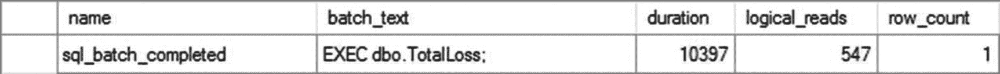

# 23. 逐行处理

发现使用游标一次处理一行的数据库应用程序是很常见的。开发人员倾向于以逐行方式处理数据。Oracle 甚至使用一种称为游标的东西作为高速数据访问机制。SQL Server 中的游标则不同。因为在 SQL Server 中通过游标进行数据操作会产生显著的额外开销，所以数据库应用程序应避免使用游标。T-SQL 和 SQL Server 的设计初衷是处理数据集，而不是一次处理一行。Jeff Moden 著名地将这种类型的处理称为 `RBAR`（发音为 “ree-bar”），意思是“逐行痛苦处理”。但是，如果必须使用游标，则应使用成本最低的游标。

在本章中，我将涵盖以下主题：

*   游标的基础知识
*   游标不同特性的成本分析
*   默认结果集相对于游标的优势和缺点
*   最小化游标成本开销的建议


## 游标基础

当应用程序执行一个查询时，SQL Server 会返回一个由多行组成的数据集。通常，应用程序无法同时处理多行数据；相反，它们会通过遍历 SQL Server 返回的结果集，一次处理一行。这项功能由一个*游标*提供，它是一种从多行结果集中一次处理一行的机制。

T-SQL 游标处理通常涉及以下步骤：

1.  声明游标，将其与一个 `SELECT` 语句关联，并定义游标的特征。
2.  打开游标以访问 `SELECT` 语句返回的结果集。
3.  从游标中检索一行。可选择通过游标修改该行。
4.  移动到结果集中的其他行。
5.  处理完结果集中的所有行后，关闭游标并释放分配给该游标的资源。

你可以使用 T-SQL 语句或用于连接到 SQL Server 的数据访问层来创建游标。使用数据访问层创建的游标通常被称为 `客户端` 游标。用 T-SQL 编写的游标被称为 `服务器` 游标。以下是一个服务器游标处理表中查询结果的示例：

```sql
--将 SELECT 语句与游标关联并定义游标的特性
USE AdventureWorks2017;
GO
SET NOCOUNT ON
DECLARE MyCursor CURSOR /**/
FOR
SELECT adt.AddressTypeID,
adt.Name,
adt.ModifiedDate
FROM Person.AddressType AS adt;
--打开游标以访问 SELECT 语句返回的结果集
OPEN MyCursor;
--从 SELECT 语句返回的结果集中一次检索一行
DECLARE @AddressTypeId INT,
@Name VARCHAR(50),
@ModifiedDate DATETIME;
FETCH NEXT FROM MyCursor
INTO @AddressTypeId,
@Name,
@ModifiedDate;
WHILE @@FETCH_STATUS = 0
BEGIN
PRINT 'NAME =   ' + @Name;
--可选择通过游标修改该行
UPDATE Person.AddressType
SET Name = Name + 'z'
WHERE CURRENT OF MyCursor;
--在数据集中移动到其他行
FETCH NEXT FROM MyCursor
INTO @AddressTypeId,
@Name,
@ModifiedDate;
END
--关闭游标并释放分配给该游标的所有资源
CLOSE MyCursor;
DEALLOCATE MyCursor;
```

游标的部分开销取决于其特性。SQL Server 和数据访问层提供的游标特性可以大致分为三类。

*   `游标位置`：定义游标创建的位置。
*   `游标并发性`：定义游标与底层内容的隔离和同步程度。
*   `游标类型`：定义游标的具体特性。

在讨论游标的成本之前，我将用几页篇幅介绍游标的各项特性。你可以使用以下查询撤销对 `Person.AddressType` 表的更改：

```sql
UPDATE Person.AddressType
SET Name = LEFT(Name, LEN(Name) - 1);
```

### 游标位置

根据其创建位置，游标可分为两类。

*   客户端游标
*   服务器端游标

T-SQL 游标总是在 SQL Server 上创建。然而，数据库 API 游标可以在客户端或服务器端创建。

#### 客户端游标

顾名思义，`客户端游标`是在运行应用程序的机器上创建的，无论该应用程序是服务、数据访问层还是用户前端。它具有以下特点：

*   它在客户端机器上创建。
*   游标元数据维护在客户端机器上。
*   它是使用数据访问层创建的。
*   它适用于大多数数据访问层（OLEDB 提供程序和 ODBC 驱动程序）。
*   它可以是仅向前游标或静态游标。

## 注意
游标类型，包括仅向前和静态类型，将在本章后面的“游标类型”部分进行介绍。

#### 服务器端游标

`服务器端游标`是在 SQL Server 机器上创建的。它具有以下特点：

*   它在服务器机器上创建。
*   游标元数据维护在服务器机器上。
*   它可以使用数据访问层或 T-SQL 语句创建。
*   使用 T-SQL 语句创建的服务器端游标与 SQL Server 紧密集成。
*   它可以是任何类型的游标。（游标类型将在本章后面解释。）

## 注意
客户端和服务器端游标之间的成本比较将在本章后面的“游标类型成本比较”部分介绍。

### 游标并发性

根据与底层内容所需的隔离和同步程度，游标可分为以下并发模型：

*   `只读`：不可更新的游标。
*   `乐观`：使用乐观并发模型的可更新游标（不对底层数据行保留锁）。
*   `滚动锁`：对任何要更新的数据行都持有锁的可更新游标。

#### 只读

只读游标不可更新；不对基表持有锁。在获取游标行时，是否会在底层行上获取（S）锁取决于连接的隔离级别以及游标 `SELECT` 语句中使用的任何锁提示。但是，一旦行被获取，默认情况下锁就会被释放。以下 T-SQL 语句创建了一个只读 T-SQL 游标：

```sql
DECLARE MyCursor CURSOR READ_ONLY FOR
SELECT adt.Name
FROM Person.AddressType AS adt
WHERE adt.AddressTypeID = 1;
```

使用尽可能少的锁开销使得只读类型的游标更快、更安全。只需记住，你无法通过只读游标操作数据，这是你为提高性能所做的牺牲。


## 乐观并发模型

乐观并发模型使游标可更新。它不会在基础数据上持有锁。决定是否在基础行上获取（S）锁的因素与只读游标相同。

乐观并发模型使用行版本控制来确定自读入游标以来行是否已被修改，而不是在读入游标时锁定该行。基于版本的乐观并发要求在创建游标的基础用户表中包含一个 `ROWVERSION` 列。`ROWVERSION` 数据类型是一个二进制数字，表示行的修改的相对顺序。每次修改带有 `ROWVERSION` 列的行时，SQL Server 都会将全局 `ROWVERSION` 值 `@@DBTS` 的当前值存储在 `ROWVERSION` 列中；然后递增 `@@DBTS` 值。

在通过乐观游标应用修改之前，SQL Server 会确定行的当前 `ROWVERSION` 列值与读入游标时该行的 `ROWVERSION` 列值是否匹配。仅当 `ROWVERSION` 值匹配时，才修改基础行，这表明该行在此期间未被其他用户修改。否则，将引发错误。如果发生错误，请使用更新后的数据刷新游标。

如果基础表不包含 `ROWVERSION` 列，则游标默认为基于值的乐观并发，这需要将行的当前值与读入游标时的值进行匹配。基于版本的并发控制比基于值的并发控制更高效，因为它需要更少的处理来确定基础行的修改。因此，为了使乐观并发模型的游标获得最佳性能，请确保基础表具有 `ROWVERSION` 列。

以下 T-SQL 语句创建了一个乐观的 T-SQL 游标：

```sql
DECLARE MyCursor CURSOR OPTIMISTIC FOR
SELECT adt.Name
FROM Person.AddressType AS adt
WHERE adt.AddressTypeID = 1;
```

具有滚动锁并发的游标在基础行上持有（U）锁，直到获取另一个游标行或关闭游标。这可以防止其他用户在游标获取行时修改基础行。滚动锁并发模型使游标可更新。

以下 T-SQL 语句创建了一个具有滚动锁并发模型的 T-SQL 游标：

```sql
DECLARE MyCursor CURSOR SCROLL_LOCKS FOR
SELECT adt.Name
FROM Person.AddressType AS adt
WHERE adt.AddressTypeID = 1;
```

由于锁在引用的行上持有（直到获取另一个游标行或关闭游标），它会阻止所有其他用户在此期间尝试修改该行。这会损害数据库并发性，但确保在通过游标修改数据时不会出错。

### 游标类型

游标可以分为以下四种类型：

*   仅前向游标
*   静态游标
*   键集驱动游标
*   动态游标

让我们在接下来的章节中更详细地了解这四种类型。

#### 仅前向游标

仅前向游标具有以下特点：

*   它们直接在基表上操作。
*   通常，基础表中的行直到使用游标 `FETCH` 操作获取游标行时才会检索。但是，数据库 API 仅前向游标类型（具有以下附加特性）会先检索基础表中的所有行：
    *   客户端游标位置
    *   服务器端游标位置和只读游标并发
*   它们仅支持通过游标向前滚动（`FETCH NEXT`）。
*   它们允许通过游标进行所有更改（`INSERT`、`UPDATE` 和 `DELETE`）。此外，这些游标会反映对基础表所做的所有更改。

仅前向特性在数据库 API 游标和 T-SQL 游标中的实现方式不同。数据访问层将仅前向游标特性实现为前面列出的四种游标类型之一。但 T-SQL 游标不是将仅前向游标特性实现为游标类型；而是将其实现为定义游标可滚动行为的属性。因此，对于 T-SQL 游标，仅前向特性可用于定义其余三种游标类型之一的可滚动行为。

T-SQL 语法提供了一个特定的游标类型选项 `FAST_FORWARD` 来创建快速仅前向游标。`FAST_FORWARD` 游标的别名是 *fire hose*，因为它是通过游标移动数据最快的方式，并且所有信息都是单向流动的。但是，如果“firehose”仍然不如传统的基于集合的操作快，请不要惊讶。以下 T-SQL 语句创建了一个快速仅前向的 T-SQL 游标：

```sql
DECLARE MyCursor CURSOR FAST_FORWARD FOR
SELECT adt.Name
FROM Person.AddressType AS adt
WHERE adt.AddressTypeID = 1;
```

`FAST_FORWARD` 属性指定一个仅前向、只读的游标，并启用了性能优化。

#### 静态游标

静态游标具有以下特点：

*   它们在打开游标时在 `tempdb` 数据库中创建游标结果的快照。此后，静态游标在 `tempdb` 数据库中的快照上操作。
*   数据在打开游标时从基础表中检索。
*   静态游标支持所有滚动选项：`FETCH FIRST`、`FETCH NEXT`、`FETCH PRIOR`、`FETCH LAST`、`FETCH ABSOLUTE n` 和 `FETCH RELATIVE n`。
*   静态游标始终是只读的；不允许通过静态游标修改数据。此外，对基础表所做的更改（`INSERT`、`UPDATE` 和 `DELETE`）不会反映在游标中。

以下 T-SQL 语句创建了一个静态的 T-SQL 游标：

```sql
DECLARE MyCursor CURSOR STATIC FOR
SELECT adt.Name
FROM Person.AddressType AS adt
WHERE adt.AddressTypeID = 1;
```

一些测试表明，静态游标的性能可以与仅前向游标一样好——有时甚至更快。在您必须使用游标的情况下，请务必在您自己的系统上测试此行为。

#### 键集驱动游标

键集驱动游标具有以下特点：

*   键集游标由一组称为 *keyset* 的唯一标识符（或键）控制。键集由唯一标识结果集中行的列集构建。
*   这些游标在打开游标时在 `tempdb` 数据库中创建行的键集。
*   游标中行的成员资格仅限于在打开游标时在 `tempdb` 数据库中创建的行的键集。
*   在获取游标行时，数据库引擎首先查看 `tempdb` 中的行的键集，然后导航到基础表中相应的数据行以检索剩余的列。
*   它们支持所有滚动选项。
*   键集游标允许通过游标进行所有更改。在游标外部执行的 `INSERT` 不会反映在游标中，因为游标中行的成员资格仅限于在打开游标时在 `tempdb` 数据库中创建的行的键集。通过游标执行的 `INSERT` 出现在游标的末尾。对基础表执行的 `DELETE` 在游标导航到被删除的行时会引发错误。对基础表的非键集列的 `UPDATE` 会反映在游标中。对键集列的 `UPDATE` 被视为对旧键值的 `DELETE` 和对新键值的 `INSERT`。如果更改使某行不符合成员资格或影响了行的顺序，则该行不会消失或移动，除非关闭并重新打开游标。

以下 T-SQL 语句创建了一个键集驱动的 T-SQL 游标：

```sql
DECLARE MyCursor CURSOR KEYSET FOR
SELECT adt.Name
FROM Person.AddressType AS adt
WHERE adt.AddressTypeID = 1;
```


#### 动态游标

动态游标具有以下特性：

*   动态游标直接在基础表上操作。
*   由于直接在基础表上操作，游标中的行成员资格不是固定的。
*   与只进游标类似，直到使用游标 `FETCH` 操作获取游标行时，才会检索底层表的行。
*   动态游标支持除 `FETCH ABSOLUTE n` 以外的所有滚动选项，因为游标中的行成员资格不固定。
*   这些游标允许通过游标进行所有更改。同样，对底层表所做的所有更改都会反映在游标中。
*   动态游标不支持数据库 API 游标实现的所有属性和方法。诸如 `AbsolutePosition`、`Bookmark` 和 `RecordCount` 等属性，以及 `clone` 和 `Resync` 等方法，都不受动态游标支持。相反，它们由键集驱动游标支持。

以下 `T-SQL` 语句创建了一个动态 `T-SQL` 游标：
```sql
DECLARE MyCursor CURSOR DYNAMIC FOR
SELECT adt.Name
FROM Person.AddressType AS adt
WHERE adt.AddressTypeID = 1;
```

在任何情况下，动态游标绝对是最慢的游标。它获取更多锁并持有更长时间，这极大地增加了其糟糕的性能。在设计系统时请考虑到这一点。

## 游标成本比较

现在你已经了解了不同的游标类型，让我们来看看它们的成本。如果你必须使用游标，应始终使用满足应用程序要求的最轻量级游标。接下来将详细介绍不同游标特性之间的成本比较。

### 游标位置的成本比较

客户端游标和服务器端游标各有其成本效益和开销，如下文所述。

#### 客户端游标

与服务器端游标相比，客户端游标具有以下成本效益：

*   *更高的可伸缩性*：由于游标元数据维护在连接到服务器的各个客户端机器上，维护游标元数据的开销由客户端机器承担。因此，为更多用户提供服务的能力不受服务器资源的限制。
*   *更少的网络往返*：由于 `SELECT` 语句返回的结果集被传递到维护游标的客户端，因此在从游标检索行时不需要额外的网络往返服务器。
*   *更快的滚动*：由于游标在客户端机器上本地维护，遍历游标行的速度可能更快。
*   *高度可移植*：由于游标使用数据访问层实现，它可以在多种数据库上工作：`SQL Server`、`Oracle`、`Sybase` 等等。

客户端游标具有以下成本开销或缺点：

*   *对客户端资源压力更大*：由于游标在客户端管理，它增加了客户端资源的压力。但这可能没那么糟糕，因为大多数情况下客户端应用程序是 Web 应用程序，并且使用标准负载均衡解决方案横向扩展 Web 应用程序（或 Web 服务器）相当容易。另一方面，横向扩展事务性 `SQL Server` 数据库仍然是一门艺术！
*   *支持的游标类型有限*：不支持动态和键集驱动游标。
*   *一个连接上只能有一个活动的基于游标的语句*：结果集中尽可能多的行（客户端网络可以缓冲的行数）以网络数据包的形式安排并发送到客户端应用程序。因此，直到应用程序获取了游标的所有行，数据库连接都保持忙碌状态，向客户端推送行。在此期间，其他基于游标的语句不能使用该连接。通过利用多个活动结果集 (MARS) 可以解决这个问题，它允许一个连接有第二个活动游标。

#### 服务器端游标

服务器端游标具有以下成本效益：

*   *一个连接上支持多个活动的基于游标的语句*：使用服务器端游标时，在游标操作之间，连接上不会留下未处理的结果。这释放了连接，允许在同一时间在一个连接上使用多个基于游标的语句。对于客户端游标，如前所述，连接在应用程序获取所有游标行之前保持忙碌。这意味着它们不能同时被多个基于游标的语句使用。
*   *靠近数据进行行处理*：如果行处理涉及与其他表的联接和大量的集合操作，那么使用服务器端游标靠近数据进行行处理是有利的。
*   *对客户端资源压力更小*：它减轻了客户端资源的压力。但这可能不那么理想，因为如果服务器资源达到上限（而不是客户端资源），那么将需要横向扩展数据库，这是一个困难的命题。
*   *支持所有游标类型*：客户端游标在可支持的游标类型方面有限制。服务器端游标没有限制。

服务器端游标具有以下成本开销或缺点：

*   *可伸缩性较低*：由于消耗服务器资源来管理游标，它们使服务器的可伸缩性降低。
*   *更多的网络往返*：如果游标行处理在客户端应用程序中完成，它们会增加网络往返次数。可以通过在存储过程中处理游标行或使用数据访问层的缓存大小特性来优化网络往返次数。
*   *可移植性较差*：使用 `T-SQL` 游标实现的服务器端游标不容易移植到其他数据库，因为管理游标的数据库代码语法在不同数据库之间是不同的。

### 游标并发性的成本比较

正如预期的那样，并发模型更高的游标在数据库中产生的阻塞最少，并支持更高的可伸缩性，如下文所述。

#### 只读

只读并发模型提供以下成本效益：

*   *最低的锁定开销*：只读并发模型对数据库引入的锁定和同步开销最少。由于在获取游标行后不保持底层行的 (S) 锁，因此其他用户不会被阻止访问该行。此外，如果不在乎因脏读而返回何种数据，可以通过在游标的 `SELECT` 语句中使用 `NO_LOCK` 锁定提示来避免在获取游标行时获取底层行的 (S) 锁。
*   *最高的并发性*：由于不在底层行上保持额外的锁，只读游标不会阻止其他用户访问底层表。仍然会获取共享锁。

只读游标的主要缺点如下：

*   *不可更新*：无法通过游标修改底层表的内容。


#### 乐观并发模型

乐观并发模型提供以下优点：

*   *锁定开销低*：类似于只读模型，乐观并发模型在获取行后不会在游标行上持有 (S) 锁。为了进一步提高并发性，也可以使用 `NOLOCK` 锁定提示，如同只读并发模型中的情况。但请注意，`NOLOCK` 绝对可能导致数据不正确或行丢失/重复，因此其使用需要仔细规划。通过游标对基础行进行修改需要操作查询所要求的该行的独占权限。

*   *并发性高*：因为仅对基础行使用共享锁，游标不会阻止其他用户访问基础表。但通过游标对基础行进行的修改将在修改期间阻止其他用户访问该行。

以下示例详述了乐观并发模型的成本开销：

*   *行版本控制*：由于乐观并发模型允许游标可更新，会产生额外成本以确保在通过游标应用修改之前，首先将当前基础行（使用基于版本或基于值的并发控制）与最初获取的游标行进行比较。这可以防止通过游标进行的修改意外覆盖在游标行被获取后由另一用户所做的修改。

*   *无 ROWVERSION 列的并发控制*：如前所述，基础表中的 `ROWVERSION` 列允许游标执行高效的基于版本的并发控制。如果基础表不包含 `ROWVERSION` 列，则游标将采用基于值的并发控制，这需要将行的当前值与读取到游标时的值进行匹配。这增加了并发控制的成本。这两种形式的并发控制都会在 `tempdb` 中引起额外开销。

#### 滚动锁并发模型

滚动锁并发模型的主要优点如下：

*   *简单的并发控制*：通过对游标最后获取的行对应的基础行加锁，游标确保该基础行不能被另一用户修改。这消除了乐观锁的版本控制开销。此外，由于该行不能被另一用户修改，应用程序无需检查行不匹配错误。

滚动锁并发模型会产生以下成本开销：

*   *最高的锁定开销*：滚动锁并发模型引入了悲观锁特性。对最后获取的游标行持有 (U) 锁，直到获取另一游标行或关闭游标。

*   *最低的并发性*：由于在基础行上持有 (U) 锁，所有其他请求在该基础行上持有 (U) 或 (X) 锁的用户将被阻塞。这会显著损害并发性。因此，除非绝对必要，请避免使用此游标并发模型。

### 游标类型的成本比较

本章前面“游标基础”部分提到的四种基本游标类型中的每一种都会对服务器产生不同的成本开销。选择不正确的游标类型会损害数据库性能。除了四种基本游标类型外，还提供了一种快速只进游标（只进游标的一种变体）以增强性能。这些游标类型的成本开销将在后续章节中解释。

#### 只进游标

只进游标的成本优点如下：

*   *游标打开成本低于静态和键集驱动游标*：由于在打开游标时，游标行不是从基础表中检索，也不复制到 `tempdb` 数据库中，因此 T-SQL 只进游标打开速度快。类似地，具有乐观/滚动锁并发的服务器端 API 只进游标也打开快速，因为它们在打开游标时不检索行。

*   *滚动开销较低*：因为只能在此游标类型上执行 `FETCH NEXT`，支持不同滚动操作所需的开销较少。

*   *对 tempdb 数据库的影响小于静态和键集驱动游标*：由于 T-SQL 只进游标不将行从基础表复制到 `tempdb` 数据库，因此不会对该数据库产生额外压力。

只进游标类型有以下缺点：

*   *并发性较低*：每次获取游标行时，会根据游标并发模型（如前面并发性讨论中所述）对相应的基础行进行锁请求。这可能会阻止其他用户访问该资源。

*   *不支持向后滚动*：需要双向滚动的应用程序不能使用此游标类型。但如果应用程序设计得当，不使用向后滚动也并非难事。

#### 快速只进游标

快速只进游标是最快且开销最小的游标类型。这种只进、只读游标经过特别优化以提高性能。因此，您应始终优先选择它而非其他 SQL Server 游标类型。

此外，数据访问层在客户端提供了快速只进游标。该类型的游标使用所谓的*默认结果集*，使游标开销几乎消失。

## 注意

默认结果集将在本章后面的“默认结果集”部分进行解释。

#### 静态游标

静态游标的成本优点如下：

*   *获取成本低于其他游标类型*：由于在打开游标时，从基础行在 `tempdb` 数据库中创建了一个快照，游标行的获取是针对该快照而非基础行进行的。这避免了原本获取游标行所需的锁定开销。

*   *不会阻塞基础行*：由于快照是在 `tempdb` 数据库中创建的，尝试访问基础行的其他用户不会被阻塞。

在缺点方面，静态游标有以下成本开销：

*   *打开成本高于其他游标类型*：静态游标的游标打开操作比其他游标类型慢，因为在游标打开期间，必须从基础表中检索结果集的所有行，并且必须在 `tempdb` 数据库中创建快照。

*   *对 tempdb 的影响大于其他游标类型*：在 `tempdb` 数据库中创建、填充和清理快照可能对服务器资源产生显著影响。


#### 键集驱动游标

键集驱动游标具有以下成本优势：

*   比静态游标更低的打开成本：由于在 `tempdb` 数据库中仅创建键集而非完整快照，键集驱动游标的打开速度比静态游标更快。SQL Server 会异步填充大型键集驱动游标的键集，这缩短了游标打开到获取第一行游标数据之间的时间。
*   比静态游标对 `tempdb` 的影响更小：由于键集驱动游标更小，它在 `tempdb` 中占用的空间更少。

键集驱动游标的成本开销如下：

*   比只进和动态游标更高的打开成本：在 `tempdb` 数据库中填充键集使得键集驱动游标的打开操作比只进游标（除前面提到的例外情况）和动态游标的成本更高。
*   比其他游标类型更高的获取成本：对于每一行游标数据的获取，必须先访问键集中的键，然后才能访问用户数据库中对应的底层行。每次获取游标行都需要访问 `tempdb` 和用户数据库，这使得获取操作比其他游标类型的成本更高。
*   比只进和动态游标对 `tempdb` 的影响更大：在 `tempdb` 中创建、填充和清理键集会影响服务器资源。
*   比静态游标更高的锁开销和阻塞：由于从游标获取行是从底层表中检索行，因此在行获取操作期间会对底层行获取一个 (S) 锁（除非使用了 `NOLOCK` 锁定提示）。

#### 动态游标

动态游标具有以下成本优势：

*   比静态和键集驱动游标更低的打开成本：由于游标是直接在底层行上打开，而无需将任何内容复制到 `tempdb` 数据库，因此动态游标的打开速度比静态和键集驱动游标更快。
*   比静态和键集驱动游标对 `tempdb` 的影响更小：由于没有内容被复制到 `tempdb`，动态游标对 `tempdb` 造成的压力远小于其他游标类型。

动态游标具有以下成本开销：

*   比静态游标更高的锁开销和阻塞：动态游标中的每一次游标行获取都会重新查询游标 `SELECT` 语句所涉及的底层表。动态获取通常成本高昂，因为可能需要重新执行原始的查询条件。

关于不同游标的总结及其优缺点，请参阅表 23-1。

表 23-1：游标比较

| 游标类型 | 优点 | 缺点 |
| :--- | :--- | :--- |
| `只进` | 成本更低，滚动开销更小，对 `tempdb` 的影响更小 | 并发性较低，不支持向后滚动 |
| `快速只进` | 速度最快，成本最低，影响最小 | 不支持向后滚动，无并发性 |
| `静态` | 获取成本更低，无阻塞，支持向前和向后滚动 | 打开成本更高，对 `tempdb` 的影响更大，无并发性 |
| `键集驱动` | 打开成本更低，对 `tempdb` 的影响更小，支持向前和向后滚动，并发性 | 打开成本更高，获取成本最高，对 `tempdb` 的影响最大，锁定成本更高 |
| `动态` | 打开成本更低，对 `tempdb` 的影响更小，支持向前和向后滚动，并发性 | 锁定成本最高 |

#### 默认结果集

数据访问层（`ADO`、`OLEDB` 和 `ODBC`）的默认游标类型是只进且只读的。数据访问层创建的默认游标并非真正的游标，而是从服务器到客户端的数据流，通常称为默认结果集或 `快速只进` 游标（由数据访问层创建）。在 `ADO.NET` 中，`DataReader` 控件具有只进和只读属性，它可以被视为 `ADO.NET` 环境中的默认结果集。SQL Server 在以下条件下使用此类结果集处理：

*   使用数据访问层（`ADO`、`OLEDB`、`ODBC`）的应用程序将所有游标特性保留为默认设置，这请求的是一个只进且只读的游标。
*   应用程序执行的是 `SELECT` 语句，而不是 `DECLARE CURSOR` 语句。

## 注意

由于 SQL Server 设计用于处理数据集，而非逐条遍历记录，因此默认结果集总是比任何其他类型的游标更快。

从客户端发送到 SQL Server 的唯一请求是与默认游标关联的 SQL 语句。SQL Server 执行查询，将结果集的行组织到网络数据包中（尽可能填充数据包），然后将数据包发送到客户端。这些网络数据包缓存在客户端的网络缓冲区中。SQL Server 将尽可能多的结果集行发送到客户端，只要客户端网络缓冲区可以缓存。随着客户端应用程序一次请求一行，客户端计算机上的数据访问层从客户端网络缓冲区中拉取该行并将其传输到客户端应用程序。

以下部分概述了默认结果集的优缺点。

##### 优点

默认结果集通常是从 SQL Server 返回行的最佳和最有效的方式，原因如下：

*   客户端与 SQL Server 之间的网络往返次数最少：由于 SQL Server 返回的结果集缓存在客户端网络缓冲区中，因此客户端无需通过网络请求来获取单个行。SQL Server 将尽可能多的行放入网络缓冲区，并发送客户端网络缓冲区能够缓存的数据量。
*   服务器开销最小：由于 SQL Server 无需在服务器上存储数据，这降低了服务器资源的利用率。

##### 多活动结果集

SQL Server 2005 引入了多活动结果集的概念，其中一个连接在任意时刻可以运行多个批处理。在之前的版本中，必须在处理完或关闭单个结果集后才能提交下一个请求。MARS 允许通过同一连接同时提交多个请求。MARS 在 SQL Server 上始终启用。除非连接明确调用它，否则该连接不会启用 MARS。事务必须在客户端级别处理，并且必须显式声明和提交或回滚。在 MARS 运行时，如果某个语句的事务未提交且连接关闭，则属于该单一连接的所有其他事务都将回滚。MARS 通过应用程序连接属性启用。


## 缺点

虽然默认结果集有优点，但也存在缺点。要使用默认结果集并获得最佳性能，需要满足一些特殊条件：

*   它不支持所有属性和方法：不支持 `AbsolutePosition`、`Bookmark` 和 `RecordCount` 等属性，也不支持 `Clone`、`MoveLast`、`MovePrevious` 和 `Resync` 等方法。

*   可能锁定底层资源：SQL Server 会将尽可能多的结果集行发送到客户端网络缓冲区可以缓存的行。如果结果集的大小很大，客户端网络缓冲区可能无法接收所有行。此时，SQL Server 会持有尚未发送到客户端的底层表下一页上的锁。

为了说明这些概念，请考虑以下测试表：

```sql
USE AdventureWorks2017;
GO
DROP TABLE IF EXISTS dbo.Test1;
GO
CREATE TABLE dbo.Test1 (C1 INT,
C2 CHAR(996));
CREATE CLUSTERED INDEX Test1Index ON dbo.Test1 (C1);
INSERT INTO dbo.Test1
VALUES (1, '1'),
(2, '2');
GO
```

现在考虑这个 PowerShell 脚本，它使用带有 OLEDB 的 ADO 和数据库 API 游标的默认游标类型（`ADODB.Recordset` 对象）来访问测试表的行，如下所示：

```powershell
$AdoConn = New-Object -comobject ADODB.Connection
$AdoRecordset = New-Object -comobject ADODB.Recordset
##将数据源更改为你自己的服务器
$AdoConn.Open("Provider= SQLOLEDB; Data Source=DOJO\RANDORI; Initial Catalog=AdventureWorks2017; Integrated Security=SSPI")
$AdoRecordset.Open("SELECT * FROM dbo.Test1", $AdoConn)
do {
$C1 = $AdoRecordset.Fields.Item("C1").Value
$C2 = $AdoRecordset.Fields.Item("C2").Value
Write-Output "C1 = $C1 and C2 = $C2"
$AdoRecordset.MoveNext()
} until     ($AdoRecordset.EOF -eq $True)
$AdoRecordset.Close()
$AdoConn.Close()
```

这不是通常从 PowerShell 访问数据库的方式，但它展示了客户端游标是如何操作的。请注意，该表有两行，每行大小等于 1,000 字节（`INT` 占 4 字节 + `CHAR(996)` 占 996 字节），不考虑内部开销。因此，`SELECT` 语句返回的完整结果集的大小约为 2,000 字节（2 × 1,000 字节）。

执行游标打开语句（`$AdoRecordset.Open()`）时，会在运行代码的客户端计算机上创建一个默认结果集。默认结果集会缓存客户端网络缓冲区所能容纳的尽可能多的行。

由于结果集的大小足够小，可以被客户端网络缓冲区缓存，因此所有游标行在游标打开语句期间都缓存在客户端计算机上，而不会在 `dbo.Test1` 表上保留任何锁。你可以使用 `sys.dm_tran_locks` 动态管理视图来验证连接的锁定状态。在整个游标操作期间，客户端到 SQL Server 的唯一请求是与游标关联的 `SELECT` 语句，如扩展事件输出中的图 23-1 所示。


图 23-1

Profiler 跟踪输出，显示默认结果集发出的数据库请求

要了解大结果集对默认结果集处理的影响，让我们向测试表中添加更多行。

```sql
SELECT TOP 100000
IDENTITY(INT, 1, 1) AS n
INTO #Tally
FROM master.dbo.syscolumns AS scl,
master.dbo.syscolumns AS sc2;
INSERT INTO dbo.Test1 (C1,
C2)
SELECT n,
n
FROM #Tally AS t;
GO
```

此示例生成的额外行大大增加了结果集的大小。根据客户端网络缓冲区的大小，只能缓存部分结果集。执行 `Ado.Recordset.Open` 语句时，客户端计算机上的默认结果集将获取部分结果集，而 SQL Server 则在网络另一端等待发送剩余的行。

在此期间，在我的机器上，底层 `Test1` 表上持有如图 23-2 所示的锁，这些信息是从 `sys.dm_tran_locks` 的输出中获得的。


图 23-2

`sys.dm_tran_locks` 的输出，显示在处理大结果集时默认结果集持有的锁

表上的 `(IS)` 锁将阻止其他用户尝试获取 `(X)` 锁。为了最小化阻塞问题，请遵循以下建议：

*   立即处理默认结果集的所有行。

*   保持结果集较小。如示例所示，如果结果集的大小很小，默认结果集将能够在游标打开操作期间读取所有行。

## 游标开销

在应用程序中实现以游标为中心的功能时，你有两种选择。你可以使用 T-SQL 游标或数据库 API 游标。由于 T-SQL 游标和数据库 API 游标的内部实现不同，这些游标在 SQL Server 上产生的负载也不同。这些游标对数据库的影响还取决于游标的不同特性，例如位置、并发性和类型。你可以使用扩展事件来分析 T-SQL 和数据库 API 游标产生的负载。当然，用于监视查询的标准事件会很有用。在游标类别下还有许多其他事件。这些事件中最有用的包括：

*   `cursor_open`

*   `cursor_close`

*   `cursor_execute`

*   `cursor_prepare`

其他事件也很有用，但只有在尝试排查特定问题时才需要它们。甚至这些游标的优化选项也不同。让我们逐一分析这些游标的开销。

### 使用 T-SQL 游标分析开销

通过 T-SQL 语句实现的 T-SQL 游标总是在 SQL Server 上执行，因为它们需要 SQL Server 引擎来处理其 T-SQL 语句。您可以结合先前解释的游标特性来降低这些游标的开销。如前所述，最轻量级的 T-SQL 游标不是使用默认设置创建的，而是通过调整设置来生成仅向前只读游标。即便如此，实现游标操作的 T-SQL 语句仍然需要由 SQL Server 处理。游标的完整负载由 SQL Server 承担，客户端计算机不提供任何帮助。假设一个应用程序需求导致必须支持以下任务列表：

*   识别所有已报废的产品（来自 `Production.WorkOrder` 表）。
*   对于每个报废的产品，确定损失的金额，其中每个产品损失的金额等于库存数量 *乘以* 产品的单价。
*   计算总损失。
*   根据总损失，确定业务状态。

第二点中的 `FOR EACH` 短语表明，这些应用程序任务可以通过游标来完成。然而，在 SQL Server 中使用 `FOR`、`WHILE`、游标或任何其他此类处理方式可能是危险的。尽管这种方法很有吸引力，但它不是基于集合的，也不应该是处理此类请求的方式。不过，让我们看看它如何通过游标工作。您可以使用 T-SQL 游标实现此应用程序需求，如下所示：

```sql
CREATE OR ALTER PROC dbo.TotalLoss_CursorBased
AS --使用默认设置（即快速仅向前）声明一个 T-SQL 游标来检索已废弃的产品
DECLARE ScrappedProducts CURSOR FOR
SELECT p.ProductID,
wo.ScrappedQty,
p.ListPrice
FROM Production.WorkOrder AS wo
JOIN Production.ScrapReason AS sr
ON wo.ScrapReasonID = sr.ScrapReasonID
JOIN Production.Product AS p
ON wo.ProductID = p.ProductID;
--打开游标以一次处理一个产品
OPEN ScrappedProducts;
DECLARE @MoneyLostPerProduct MONEY = 0,
@TotalLoss MONEY = 0;
--通过一次处理一个产品来计算每个产品损失的金额
DECLARE @ProductId INT,
@UnitsScrapped SMALLINT,
@ListPrice MONEY;
FETCH NEXT FROM ScrappedProducts
INTO @ProductId,
@UnitsScrapped,
@ListPrice;
WHILE @@FETCH_STATUS = 0
BEGIN
SET @MoneyLostPerProduct = @UnitsScrapped * @ListPrice; --计算总损失
SET @TotalLoss = @TotalLoss + @MoneyLostPerProduct;
FETCH NEXT FROM ScrappedProducts
INTO @ProductId,
@UnitsScrapped,
@ListPrice;
END
--确定状态
IF (@TotalLoss > 5000)
SELECT 'We are bankrupt!' AS Status;
ELSE
SELECT 'We are safe!' AS Status;
--关闭游标并释放分配给游标的所有资源
CLOSE ScrappedProducts;
DEALLOCATE ScrappedProducts;
GO
```

可以如下执行该存储过程，但您应该执行两次以利用计划缓存（图 23-3）：


图 23-3
扩展事件输出，显示使用 T-SQL 游标进行数据处理的总成本的一部分

```sql
EXEC dbo.TotalLoss_CursorBased;
```

该存储过程执行的逻辑读总数为 8,786（由图 23-3 中的 `sql_batch_completed` 事件指示）。那么，这个数字是高还是低？考虑到 `Production.Products` 表只有 6,196 页，而 `Production.WorkOrder` 表只有 926 页，这肯定不低。您可以通过查询动态管理视图 `sys.dm_db_index_physical_stats` 来确定分配给这些表的页数。

```sql
SELECT  SUM(page_count)
FROM    sys.dm_db_index_physical_stats(DB_ID(N'AdventureWorks2017'),
OBJECT_ID('Production.WorkOrder'),
DEFAULT, DEFAULT, DEFAULT);
```

## 注意

`sys.dm_db_index_physical_stats` DMV 在第 13 章有详细解释。

在大多数情况下，您可以通过使用 SQL 查询重写功能来避免游标操作，专注于基于集合的数据访问方法。例如，您可以使用 SQL 查询（而不是游标操作）重写前面的存储过程，如下所示：

```sql
CREATE OR ALTER PROC dbo.TotalLoss
AS
SELECT CASE --基于以下计算确定状态
WHEN SUM(MoneyLostPerProduct) > 5000 THEN
'We are bankrupt!'
ELSE
'We are safe!'
END AS Status
FROM
( --计算所有废弃产品的总损失金额
SELECT SUM(wo.ScrappedQty * p.ListPrice) AS MoneyLostPerProduct
FROM Production.WorkOrder AS wo
JOIN Production.ScrapReason AS sr
ON wo.ScrapReasonID = sr.ScrapReasonID
JOIN Production.Product AS p
ON wo.ProductID = p.ProductID
GROUP BY p.ProductID) AS DiscardedProducts;
GO
```

在此存储过程中，使用 SQL Server 的聚合函数计算每个产品的损失金额和总损失。`CASE` 语句用于根据产生的总损失确定业务状态。可以如下执行该存储过程；但同样，您应该执行两次，以便看到计划缓存的结果：

```sql
EXEC dbo.TotalLoss;
```

图 23-4 显示了相应的扩展事件输出。



图 23-4
扩展事件输出，显示使用等效 SELECT 语句进行数据处理的总成本

在图 23-4 中，您可以看到该存储过程的第二次执行（重用现有计划）总共使用了 547 次逻辑读。然而，您可以看到一个比读取次数更重要的结果：执行时间从 32.7 毫秒下降到 10.3 毫秒。使用 SQL 查询代替游标操作使执行速度提高了三倍。

因此，为了获得更好的性能，几乎总是建议您在 SQL 查询中使用基于集合的操作，而不是 T-SQL 游标。


### 游标使用建议

低效的游标使用会引入额外的网络往返次数和服务器资源负载，从而降低应用程序性能。为尽量降低游标开销，请尝试遵循以下建议：

*   优先使用基于集合的 SQL 语句而非 T-SQL 游标，因为 SQL Server 本身是为处理数据集而设计的。
*   使用开销最低的游标。
    *   使用 SQL Server 游标时，请采用 `FAST FORWARD`（只进快速）游标类型。
    *   使用由 ADO、OLEDB 或 ODBC 实现的 API 游标时，请使用默认游标类型，通常称为 `default result set`（默认结果集）。
    *   使用 ADO.NET 时，请使用 `DataReader` 对象。
*   最小化对服务器资源的影响。
    *   对 API 游标使用客户端游标。
    *   不要通过游标对底层表执行操作。
    *   尽快释放游标。这有助于释放资源，尤其是在 `tempdb` 中。
    *   重新设计游标的 `SELECT` 语句（或应用程序），使其仅返回最小必要的行和列集。
    *   将游标逻辑重写为基于集合的语句，从而完全避免使用 T-SQL 游标，因为基于集合的操作通常比游标更高效。
    *   对动态游标使用 `ROWVERSION` 列，以利用高效、基于版本的并发控制机制，而非依赖基于值的锁定技术。
*   最小化对 `tempdb` 的影响。
    *   避免使用静态游标和键集驱动游标，以减少 `tempdb` 中的资源争用。
    *   静态游标和键集游标会给 `tempdb` 增加额外负载，因此若必须使用，请将此因素考虑在内；或者如果您的 `tempdb` 压力较大，请避免使用它们。
*   最小化阻塞。
    *   使用默认结果集、只进快速游标或静态游标。
    *   尽快处理所有游标行。
    *   避免使用滚动锁或悲观锁。
*   使用 API 游标时最小化网络往返次数。
    *   利用 ADO 的 `CacheSize` 属性在一次往返中获取多行数据。
    *   使用客户端游标。
    *   使用断开连接的记录集。

## 总结

正如您在本章所学，游标是 SQL Server 返回的结果集的自然扩展，它使调用应用程序能够逐行处理数据。游标会给应用程序性能带来额外开销，并影响服务器资源。

您应始终寻求避免使用游标的方法。在几乎所有情况下，基于集合的解决方案都表现更佳。然而，如果必须使用游标操作，则应选择最佳的游标位置、并发模型、类型和缓存大小组合，以最小化游标的开销。

在下一章中，我们将探讨内存中表、本机编译存储过程以及内存优化对象的其他方面所带来的特殊功能。

