# 24. 内存优化 OLTP 表与存储过程

在线事务处理（OLTP）系统的主要需求之一是尽可能提升系统速度。有鉴于此，微软推出了内存中 OLTP 增强功能。这些功能在后续版本中得到了改进，并被添加到 Azure SQL Database 中。内存优化技术包括内存中表和本机编译存储过程。这套特性专为高端、事务密集型、以 OLTP 为核心的系统设计。在 SQL Server 2014 中，内存中 OLTP 功能仅在企业版中可用。自 SQL Server 2016 起，所有版本均支持此增强功能。内存优化技术是查询调优工具箱中的另一件工具，但它是一个高度专业化的工具，仅适用于特定应用程序。采用此技术时需谨慎。话虽如此，在具备充足内存的合适系统上，内存中表和本机存储过程能带来极快的速度。

在本章中，我将涵盖以下主题：
*   内存中表工作原理的基础知识
*   通过本机编译存储过程提升性能
*   本机编译过程和内存 OLTP 表的优缺点
*   何时使用内存 OLTP 表的建议

## 内存 OLTP 基础

究其核心，您可以调整查询使其运行得异常快速。但是，无论您让它们运行得多快，在某种程度上您都会受到现代计算机内部某些架构问题以及 SQL Server 行为基础的限制。通常，您硬件的头号瓶颈是存储系统。无论您仍在使用旋转磁盘，还是已转向某种类型的 SSD 或类似技术，磁盘仍然是系统中最慢的环节。这意味着无论是读取还是写入，您都必须等待。但内存速度快，而且有了 64 位操作系统，内存可以非常充裕。因此，如果您有可以完全移入内存的表，您就可以从根本上提高速度。这正是内存中 OLTP 表的部分意义所在：将数据访问（包括读取和写入）移入内存，脱离磁盘。

然而，微软所做的不仅仅是简单地将表移入内存。它认识到磁盘速度慢，但系统变慢的另一个方面是数据如何通过事务系统进行访问和管理。因此，微软也在此处做出了一系列改变。最主要的是移除了事务处理的悲观方法。现有产品强制所有事务在允许数据更改刷新到磁盘之前写入事务日志。这在事务处理中造成了瓶颈。因此，微软不再对事务能否成功完成持悲观态度，而是采取了一种乐观的方式，认为大多数情况下事务会完成。此外，微软没有采用阻塞情况（即一个事务必须在下一个事务访问或更新数据之前完成更新），而是对数据进行了版本控制。它现在消除了系统内的一个主要争用点，并消除了锁，再加上所有这些都在内存中，因此速度更快。

微软随后将所有这些又推进了一步。对于防止多个进程访问页面进行写入的内存闩锁，微软没有采用悲观方法，而是将乐观方法扩展到内存管理。现在，借助版本控制，内存中表采用“最终”一致性的模型，并具有冲突解决过程，该过程将回滚事务，但绝不会让一个事务阻塞另一个事务。这有可能导致一些数据丢失，但它使数据访问层中的所有操作都变得快速。

数据确实会被写入磁盘以在重启或类似情况下保持持久性。但是，除了在服务器启动（或数据库联机）时，不会从磁盘读取任何数据。然后，内存中表的所有数据都会加载到内存中，对于这些数据不会再发生磁盘读取。但是，如果您处理的是临时数据，您甚至可以通过将数据定义为根本不持久化到磁盘来绕过此功能，从而进一步减少启动时间。

最后，正如您在本书其他部分所见，查询调优的一个主要部分是弄清楚如何与查询优化器协作以获得良好的执行计划，然后多次重用该计划。这也可能是一个密集且缓慢的过程。SQL Server 2014 引入了本机编译存储过程的概念。这些实际上是编译为 DLL 并成为 SQL Server 操作系统一部分的 T-SQL 代码。这个编译过程成本高昂，不应随便用于任何查询。其主要思想是花费时间和精力将过程编译为本机代码，然后以极大提升的速度使用该过程数百万次。


所有这些技术结合在一起，创造出新的功能，你可以单独使用，也可以将其与现有的表结构和标准 T-SQL 结合使用。事实上，你可以将内存中表（in-memory tables）当作普通的 SQL Server 表一样对待，仍然能获得一些性能提升。但是，你不能随时随地就这样做。利用内存 OLTP（On-Line Transaction Processing）表和存储过程有一些相当具体的要求。

## 系统要求

在考虑内存优化表是否可行之前，你必须满足几个标准要求。

*   一款现代的 64 位处理器
*   你打算放入内存的数据所需磁盘存储空间的两倍空间
*   大量的内存

显然，对于大多数系统而言，关键在于拥有大量的内存。你需要有足够的内存来保证操作系统和 SQL Server 的正常运行。然后，你还需要为系统中所有非内存优化的需求（包括数据缓存）准备内存。最后，在所有这些基础之上，你还需要为你的内存优化表分配内存。如果你考虑的不是一个相当庞大的系统（至少配备 64GB 内存），我甚至不建议你考虑这个选项。较小的系统无法在内存中提供足够的存储空间来使这项技术值得投入时间和精力。

**仅限于** SQL Server 2014，你必须运行 SQL Server 的企业版。当然，在 SQL Server 2014 中你也可以使用开发者版，但你不能在该版本上运行生产负载。对于高于 SQL Server 2014 的版本，微软根据版本不同规定了内存限制。

## 基本设置

除了硬件要求之外，你还必须对数据库进行额外的工作来启用内存表。我将从一个新数据库开始进行演示。

```
CREATE DATABASE InMemoryTest
ON PRIMARY (NAME = N'InMemoryTest_Data',
FILENAME = N'D:\Data\InMemoryTest_Data.mdf',
SIZE = 5GB)
LOG ON (NAME = N'InMemoryTest_Log',
FILENAME = N'L:\Log\InMemoryTest_Log.ldf');
```

为了使内存表能够保持持久性，它们必须像写入内存一样也写入磁盘，因为断电后内存中的数据会丢失。持久性（关系型数据集的 ACID 属性之一）意味着一旦事务提交，它就会保持已提交的状态。你可以拥有一个持久的内存表，也可以是一个非持久的表。对于非持久表，你可能已经提交了事务，但仍然可能丢失该数据，这与 SQL Server 中标准表的工作方式不同。最广为人知的非持久数据用途包括会话状态或时间敏感的信息，如电子购物车。总之，内存存储与你标准关系表中通常的存储方式不同。因此，必须创建一个单独的文件组和文件。为此，你可以直接修改数据库，如下所示：

```
ALTER DATABASE InMemoryTest
ADD FILEGROUP InMemoryTest_InMemoryData
CONTAINS MEMORY_OPTIMIZED_DATA;
ALTER DATABASE InMemoryTest
ADD FILE (NAME = 'InMemoryTest_InMemoryData',
FILENAME = 'D:\Data\InMemoryTest_InMemoryData.ndf')
TO FILEGROUP InMemoryTest_InMemoryData;
```

我本来可以直接修改你一直在试验的 AdventureWorks2017 数据库，但另一个关于内存优化表的考虑是，一旦创建了特殊的文件组，就无法将其移除。你只能删除整个数据库。这就是为什么我要用一个单独的数据库进行试验。这样更安全。这也是促使你在实施内存技术时需要谨慎考虑方式和地点的原因之一。你根本无法在不永久性修改生产服务器的情况下在其上进行尝试。

使用内存 OLTP 的数据库在功能上有一些限制。

*   `DBCC CHECKDB`：你可以运行一致性检查，但内存优化表将被跳过。如果你试图运行`DBCC CHECKTABLE`，会得到一个错误。
*   `AUTO_CLOSE`：此功能不受支持。
*   `DATABASE SNAPSHOT`：此功能不受支持。
*   `ATTACH_REBUILD_LOG`：此功能也不受支持。
*   数据库镜像：你无法镜像包含`MEMORY_OPTIMIZED_DATA`文件组的数据库。但是，可用性组提供了无缝体验，故障转移群集也支持内存表（但这会影响恢复时间）。

一旦这些修改完成，你就可以开始在系统中创建内存表了。


## 创建表

### 基本语法与示例

一旦数据库设置完成，你就可以创建如前所述的内存优化表。实际的语法非常简单。我将尽可能复制 AdventureWorks2017 中的 `Person.Address` 表。

```sql
USE InMemoryTest;
GO
CREATE TABLE dbo.Address
(AddressID INT IDENTITY(1, 1) NOT NULL PRIMARY KEY NONCLUSTERED HASH
WITH (BUCKET_COUNT = 50000),
AddressLine1 NVARCHAR(60) NOT NULL,
AddressLine2 NVARCHAR(60) NULL,
City NVARCHAR(30) NOT NULL,
StateProvinceID INT NOT NULL,
PostalCode NVARCHAR(15) NOT NULL,
--SpatialLocation geography NULL,
--rowguid uniqueidentifier ROWGUIDCOL  NOT NULL CONSTRAINT DF_Address_rowguid  DEFAULT (newid()),
ModifiedDate DATETIME NOT NULL
CONSTRAINT DF_Address_ModifiedDate
DEFAULT (GETDATE()))
WITH (MEMORY_OPTIMIZED = ON, DURABILITY = SCHEMA_AND_DATA);
```

这将在系统内存中创建一个持久表，使用你定义的磁盘空间来保留数据的持久副本，确保在断电情况下不会丢失数据。它有一个像常规 SQL Server 表一样的 `IDENTITY` 值作为主键（但是，在此版本的 SQL Server 中，若要使用 `IDENTITY` 而不是 `SEQUENCE`，你将无法将定义设置为除 `(1,1)` 以外的任何值）。你会注意到索引定义不是聚集的，而是 `NONCLUSTERED HASH`。我将在下一节讨论索引和像 `BUCKET_COUNT` 这样的内容。你还会注意到我不得不注释掉两个列：`SpatialLocation` 和 `rowguid`。它们使用的数据类型在内存优化表中不可用。最后，`WITH` 语句通过定义 `MEMORY_OPTIMIZED=ON` 来让 SQL Server 知道将此表放置在哪里。你可以通过将 `WITH` 子句修改为使用 `DURABILITY=SCHEMA_ONLY` 来创建一个更快的表。这允许数据丢失，但使表更快，因为没有任何内容会写入磁盘。

### 不支持的

有许多不支持的数据类型可能会阻止你利用内存优化表。

*   `XML`
*   `ROWVERSION`
*   `SQL_VARIANT`
*   `HIERARCHYID`
*   `DATETIMEOFFSET`
*   `GEOGRAPHY/GEOMETRY`
*   用户定义的数据类型

除了数据类型之外，你还会遇到其他限制。我将在“内存索引”部分讨论索引要求。从 SQL Server 2016 开始，增加了对外键、检查约束和唯一约束的支持。

### 查询与数据加载

一旦表在内存中创建，你就可以像访问常规表一样访问它。如果我现在针对它运行一个查询，它不会返回任何行，但它会正常运行。

```sql
SELECT a.AddressID
FROM dbo.Address AS a
WHERE a.AddressID = 42;
```

因此，为了在数据库中试验一些实际数据，请继续将 AdventureWorks2017 中 `Person.Address` 存储的信息加载到这个新数据库中存储在内存中的新表中。

```sql
CREATE TABLE dbo.AddressStaging (AddressLine1 NVARCHAR(60) NOT NULL,
AddressLine2 NVARCHAR(60) NULL,
City NVARCHAR(30) NOT NULL,
StateProvinceID INT NOT NULL,
PostalCode NVARCHAR(15) NOT NULL);
INSERT dbo.AddressStaging (AddressLine1,
AddressLine2,
City,
StateProvinceID,
PostalCode)
SELECT a.AddressLine1,
a.AddressLine2,
a.City,
a.StateProvinceID,
a.PostalCode
FROM AdventureWorks2017.Person.Address AS a;
INSERT dbo.Address (AddressLine1,
AddressLine2,
City,
StateProvinceID,
PostalCode)
SELECT a.AddressLine1,
a.AddressLine2,
a.City,
a.StateProvinceID,
a.PostalCode
FROM dbo.AddressStaging AS a;
DROP TABLE dbo.AddressStaging;
```

你不能在跨数据库查询中组合内存优化表，因此我不得不将大约 19,000 行加载到一个暂存表中，然后再将它们加载到内存优化表中。这并不是性能示例的一部分，但值得注意的是，在我的系统上，将数据插入标准表花了近 850 毫秒，而将相同数据加载到内存优化表只花了 2 毫秒。

但是，有了数据之后，我可以重新运行查询并实际看到结果，如图 24-1 所示。

![../images/323849_5_En_24_Chapter/323849_5_En_24_Fig1_HTML.jpg 图 24-1　来自内存优化表的第一个查询结果诚然，这并不十分令人兴奋。因此，为了有一些有意义的东西可以操作，我将再创建几个表，以便你可以看到更多的查询行为。```sqlCREATE TABLE dbo.StateProvince (StateProvinceID INT IDENTITY(1, 1) NOT NULL PRIMARY KEY NONCLUSTERED HASHWITH (BUCKET_COUNT = 10000),StateProvinceCode NCHAR(3) COLLATE Latin1_General_100_BIN2 NOT NULL,CountryRegionCode NVARCHAR(3) NOT NULL,Name VARCHAR(50) NOT NULL,TerritoryID INT NOT NULL,ModifiedDate DATETIME NOT NULLCONSTRAINT DF_StateProvince_ModifiedDateDEFAULT (GETDATE()))WITH (MEMORY_OPTIMIZED = ON);CREATE TABLE dbo.CountryRegion (CountryRegionCode NVARCHAR(3) NOT NULL,Name VARCHAR(50) NOT NULL,ModifiedDate DATETIME NOT NULLCONSTRAINT DF_CountryRegion_ModifiedDateDEFAULT (GETDATE()),CONSTRAINT PK_CountryRegion_CountryRegionCodePRIMARY KEY CLUSTERED(CountryRegionCode ASC));```这是一个额外的内存优化表和一个标准表。我也会将数据加载到这些表中，以便你可以进行更有趣的查询。```sqlSELECT sp.StateProvinceCode,sp.CountryRegionCode,sp.Name,sp.TerritoryIDINTO dbo.StateProvinceStagingFROM AdventureWorks2017.Person.StateProvince AS sp;INSERT dbo.StateProvince (StateProvinceCode,CountryRegionCode,Name,TerritoryID)SELECT StateProvinceCode,CountryRegionCode,Name,TerritoryIDFROM dbo.StateProvinceStaging;DROP TABLE dbo.StateProvinceStaging;INSERT dbo.CountryRegion (CountryRegionCode,Name)SELECT cr.CountryRegionCode,cr.NameFROM AdventureWorks2017.Person.CountryRegion AS cr;```### 执行计划与性能数据加载后，以下查询返回单行，其执行计划如图 24-2 所示：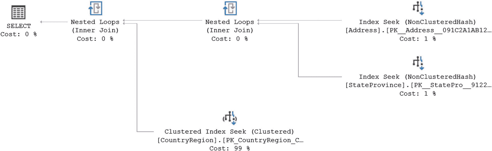

图 24-2　显示内存优化表和标准表的执行计划

```sql
SELECT a.AddressLine1,
a.City,
a.PostalCode,
sp.Name AS StateProvinceName,
cr.Name AS CountryName
FROM dbo.Address AS a
JOIN dbo.StateProvince AS sp
ON sp.StateProvinceID = a.StateProvinceID
JOIN dbo.CountryRegion AS cr
ON cr.CountryRegionCode = sp.CountryRegionCode
WHERE a.AddressID = 42;
```

如你所见，即使在使用内存优化表时，也完全有可能获得正常的执行计划。操作符甚至是相同的。在这个案例中，你有三个不同的索引查找操作。其中两个是针对你使用内存优化表创建的非聚集哈希索引，另一个是针对标准表的标准聚集索引查找。你可能还会注意到，此计划上的估计成本加起来是 101%。在处理内存优化表时，你偶尔会看到这种异常，因为优化器为它们计算的成本与常规表截然不同。

主要的性能提升来自于缺乏锁定和闩锁，允许大规模插入和更新，同时允许查询。但是，查询运行得也更快。上一个查询产生的执行时间和读取次数如图 24-3 所示。

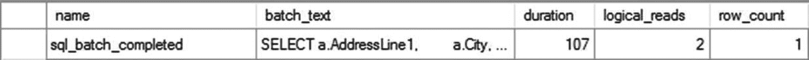

图 24-3　内存优化表的查询指标

针对 AdventureWorks2017 数据库运行类似的查询，会产生如图 24-4 所示的行为。


图 24-4　常规表的查询指标


尽管使用内存表时执行时间明显更优，但读取操作的处理方式尚不明确。不过，由于我讨论的是从内存存储读取，而非内存中的页面或磁盘上的页面，而是针对哈希索引，因此在性能度量方面情况完全不同。你无需使用与之前完全相同的度量标准，而是应依赖执行时间。这种情况下，读取操作是系统活动的度量指标，因此可以预见，数值越高意味着数据访问越频繁，数值越低则访问越少。

在表就位且已证明插入和选择操作性能提升后，接下来让我们讨论可用于内存表的索引及其与标准索引的区别。

## 内存索引

一个内存表最多可同时创建八个索引。但每个内存优化表必须至少有一个索引。由主键定义的索引符合此要求。持久化表必须有一个主键。你可以创建三种索引类型：之前使用的非聚集哈希索引、非聚集索引和列存储索引。这些索引并非使用标准表创建的索引类型。首先，它们以内存中的方式维护，与内存表相同。其次，索引的持久性规则与内存表相同。内存索引也没有固定的页大小，因此不会产生碎片。让我们更详细地讨论每种索引类型。

### 哈希索引

哈希索引并非仅仅是存储在内存中的平衡树索引。相反，哈希索引使用预定义的哈希桶（或表）以及键的哈希值，为检索表数据提供一种机制。SQL Server 具有一个哈希函数，对于给定的输入，该函数始终会生成一个恒定的哈希值。这意味着对于给定的键值，你将始终获得相同的哈希值。你可以在哈希桶中存储同一哈希值的多个副本。拥有哈希值来检索点查找（即单行）使得操作效率极高——前提是你不会遇到大量哈希冲突。哈希冲突是指多个值存储在同一位置的情况。

这意味着正确使用哈希索引的关键在于确保值在各个桶中分布合理。你可以通过为索引定义桶数来实现这一点。对于我创建的第一个表 `dbo.Address`，我将桶数设置为 50,000。当前该表中有 19,000 行数据。因此，通过将桶数设置为 50,000，我确保有足够的存储空间容纳现有的值集，并提供了充足的扩展余地。你需要设置合适的桶数，使其足够大但又不至于过大。如果桶数过小，你将在一个桶内存储大量数据，从而严重影响系统高效检索数据的能力。简而言之，最好让桶的容量偏大。如果你查看图 24-5，可以从另一个角度理解这一点。

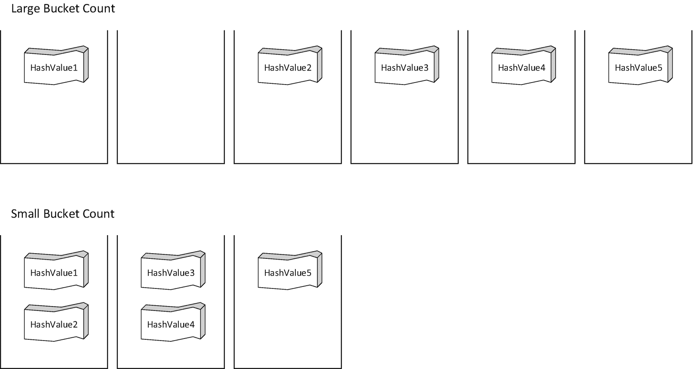
*图 24-5：大量桶与少量桶中的哈希值*

第一组桶呈现的是所谓的“浅分布”，即少量哈希值分布在大量桶中。这是一种更优的存储方案。正如你所见，有些桶可能是空的，但由于每个桶只包含一个值，因此查找速度很快。第二组桶显示了较小的桶数，即“深分布”。这意味着给定桶中的哈希值更多，需要在桶内进行扫描才能识别出各个哈希值。

微软关于桶数的建议是设置为表中行数的 1 到 2 倍。但是，由于无法修改内存表，你还需要考虑预期的增长。如果你认为内存表在未来三到六个月内很可能增长到三倍大小，你可能需要扩大桶数。桶数过大唯一可能遇到的问题是扫描操作耗时更长，因此会分配更多内存。但是，如果你的查询很可能导致扫描，那么你实在不应该使用非聚集哈希索引，而应改用非聚集索引。目前的建议是，在设置桶数时，不要超过你可能处理的唯一值数量的十倍。

你还需要关注一个哈希值可能返回多少个值。唯一索引和主键是使用哈希索引的首选，因为它们始终是唯一的。微软的建议是，如果平均而言，任何一个哈希值对应超过五个值，你就应该放弃使用非聚集哈希索引，转而使用非聚集索引。这是因为哈希桶仅充当指向存储在该桶中第一行的指针。然后，如果桶中存储了重复值或附加值，第一行会指向第二行，随后的每一行都指向下一行。这会将点查找操作转变为扫描操作，再次严重损害性能。这就是为什么重复值较少（少于五个）或唯一值最适合与哈希索引配合使用。

要查看哈希表中索引的分布情况，可以使用 `sys.dm_db_xtp_hash_index_stats`。

```sql
SELECT i.name AS [index name],
hs.total_bucket_count,
hs.empty_bucket_count,
hs.avg_chain_length,
hs.max_chain_length
FROM sys.dm_db_xtp_hash_index_stats AS hs
JOIN sys.indexes AS i
ON hs.object_id = i.object_id
AND hs.index_id = i.index_id
WHERE OBJECT_NAME(hs.object_id) = 'Address';
```

图 24-6 显示了此查询的结果。


*图 24-6：查询 sys.dm_db_xtp_hash_index_stats 的结果*

由此，你可以看到关于哈希索引创建和维护方式的一些有趣事实。你会注意到总桶数并非我设置的值 50,000。桶数向上取整到最接近的 2 的幂次方，在本例中是 65,536。有 48,652 个空桶。平均链长度（由于这是一个唯一索引）为 1，因为值是唯一的。存在一些链值，这是因为当行被修改或更新时，会存储数据的版本，直到所有操作解决完毕。


## 非聚集索引

非聚集索引基本上就像常规索引一样，只是它们与数据一起存储在内存中，以协助数据检索。它们也有指向数据存储位置的指针，类似于非聚集索引在堆表上的行为。内存中非聚集索引与标准非聚集索引之间一个有趣的区别是，SQL Server 无法从内存中的索引中以相反顺序检索数据。其他行为似乎与标准索引大致相同。

为了演示非聚集索引的实际应用，让我们看这个查询：

```sql
SELECT  a.AddressLine1,
        a.City,
        a.PostalCode,
        sp.Name AS StateProvinceName,
        cr.Name AS CountryName
FROM    dbo.Address AS a
JOIN    dbo.StateProvince AS sp
        ON sp.StateProvinceID = a.StateProvinceID
JOIN    dbo.CountryRegion AS cr
        ON cr.CountryRegionCode = sp.CountryRegionCode
WHERE   a.City = 'Walla Walla';
```

当前的性能如图 24-7 所示。


图 24-7  查询未使用索引时的指标

图 24-8 显示了执行计划。


图 24-8  导致执行计划包含表扫描的查询

虽然内存中的表扫描肯定比磁盘上存储的表的相同扫描要快，但这仍然不是一个好的情况。此外，考虑到优化器认为需要满足`Merge Join`而额外进行的`Filter`操作和`Sort`操作，这是一个有问题的查询。因此，你应该向表中添加一个索引以加速它。

但是，你不能直接在`dbo.Address`表上运行`CREATE INDEX`。相反，你有两个选择：重新创建表或修改表。你需要测试你的系统以确定哪种方法效果更好。为内存中表添加索引的`ALTER TABLE`命令可能代价高昂。如果你想删除表并重新创建它，表创建脚本现在看起来像这样：

```sql
CREATE TABLE dbo.Address (
    AddressID INT IDENTITY(1, 1) NOT NULL PRIMARY KEY NONCLUSTERED HASH
        WITH (BUCKET_COUNT = 50000),
    AddressLine1 NVARCHAR(60) NOT NULL,
    AddressLine2 NVARCHAR(60) NULL,
    City NVARCHAR(30) NOT NULL,
    StateProvinceID INT NOT NULL,
    PostalCode NVARCHAR(15) NOT NULL,
    ModifiedDate DATETIME NOT NULL
        CONSTRAINT DF_Address_ModifiedDate
        DEFAULT (GETDATE()),
    INDEX nci NONCLUSTERED (City))
WITH (MEMORY_OPTIMIZED = ON);
```

使用`ALTER TABLE`命令创建相同的索引如下所示：

```sql
ALTER TABLE dbo.Address ADD INDEX nci (City);
```

将数据重新加载到新创建的表中后，你可以再次尝试查询。这次在我的系统上运行时间为 800 微秒，比之前的 3.7 毫秒快得多。读取次数保持不变。图 24-9 显示了执行计划。

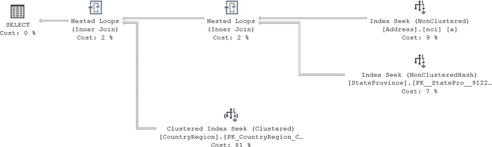

图 24-9  利用非聚集索引改进的执行计划

如你所见，非聚集索引被用来代替表扫描以提高性能，正如你对标准表上的索引所期望的那样。然而，与标准表不同，虽然这个查询拉取了不属于非聚集索引的列，但不需要键查找来从内存中的表检索数据，因为每个索引直接指向内存中所需数据的存储位置。这是相对于标准表行为的另一个虽小但重要的改进。

## 列存储索引

关于向内存中的表添加列存储索引，实际上没有太多可说的。由于列存储索引在具有 100,000 行或更多的表上效果最佳，因此你需要大量内存来支持在内存中的表上实现它们。你仅限于聚集列存储索引。你也无法将筛选的列存储索引应用于内存中的表。除了这些限制之外，创建内存中的列存储索引与我们已经看到的索引相同：

```sql
ALTER TABLE dbo.Address ADD INDEX ccs CLUSTERED COLUMNSTORE;
```

## 统计信息维护

内存中的表与标准表在索引创建方式上存在许多根本差异。索引维护（即碎片整理索引）不是你需要考虑的事情。然而，你确实需要关注内存中表的统计信息。内存中的索引维护的统计信息将需要更新。你还会希望获得有关内存中索引的信息，例如它们是通过扫描还是查找访问的。虽然跟踪所有这些信息的愿望是相同的，但实现的机制却不同。

实际上，你无法看到哈希索引上的统计信息。你可以针对索引运行`DBCC SHOW_STATISTICS`，但输出看起来像图 24-10。

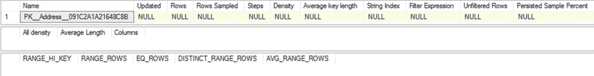

图 24-10  内存中索引统计信息的空输出

这意味着没有办法查看内存中索引的统计信息。你可以检查任何非聚集索引的统计信息。无论你是否能看到这些统计信息，随着数据的变化，它们仍然会过时。在 SQL Server 2016 及更高版本中，内存中的表和索引的统计信息是自动维护的。规则与基于磁盘的统计信息相同。SQL Server 2014 没有自动统计信息维护，因此你必须使用手动方法。

你可以使用`sp_updatestats`。该过程的当前版本完全了解内存中的索引及其差异。你也可以使用`UPDATE STATISTICS`，但在 SQL Server 2014 中，你必须将`FULLSCAN`或`RESAMPLE`与`NORECOMPUTE`一起使用，如下所示：

```sql
UPDATE STATISTICS dbo.Address WITH FULLSCAN, NORECOMPUTE;
```

如果不使用此语法，看起来你正在尝试更改内存中表的统计信息，而你无法做到这一点。你会看到一个相当明确的错误。

```
Msg 41346, Level 16, State 2, Line 1
CREATE and UPDATE STATISTICS for memory optimized tables requires the WITH FULLSCAN or RESAMPLE and the NORECOMPUTE options. The WHERE clause is not supported.
```

将采样定义为`FULLSCAN`或`RESAMPLE`，然后通过使用`NORECOMPUTE`告知它你并非试图开启自动更新，统计信息将被更新。

在 SQL Server 2016 及更高版本中，你可以像控制其他统计信息一样控制采样方法。


## 本地编译存储过程

仅仅将表加载到内存并利用乐观方法大幅减少锁争用，就能带来显著的性能提升。而要让速度真正快起来，你还可以实现一项新特性：将存储过程编译成 DLL，在 SQL Server 可执行文件内部运行。这能让性能**飞起**。语法非常直接。以下是你如何将之前的查询拿来进行编译：

```
CREATE PROC dbo.AddressDetails @City NVARCHAR(30)
WITH NATIVE_COMPILATION,
SCHEMABINDING,
EXECUTE AS OWNER
AS
BEGIN ATOMIC WITH (TRANSACTION ISOLATION LEVEL = SNAPSHOT, LANGUAGE = N'us_english')
SELECT a.AddressLine1,
a.City,
a.PostalCode,
sp.Name AS StateProvinceName,
cr.Name AS CountryName
FROM dbo.Address AS a
JOIN dbo.StateProvince AS sp
ON sp.StateProvinceID = a.StateProvinceID
JOIN dbo.CountryRegion AS cr
ON cr.CountryRegionCode = sp.CountryRegionCode
WHERE a.City = @City;
END
```

不幸的是，如果你尝试按当前定义运行此查询定义，会收到以下错误：

```
Msg 10775, Level 16, State 1, Procedure AddressDetails, Line 7 [Batch Start Line 5013]
Object 'dbo.CountryRegion' is not a memory optimized table or a natively compiled inline table-valued function and cannot be accessed from a natively compiled module.
```

虽然你可以查询内存表与标准表的混合体，但你只能针对内存表创建本地编译存储过程。我将使用前面展示的相同方法，将 `dbo.CountryRegion` 表加载到内存，然后再次运行脚本。这次它将编译成功。如果你再像之前那样使用 `@City = 'Walla Walla'` 执行查询，执行时间甚至不会在 SSMS 里显示出来。你必须通过扩展事件捕获该事件，如图 24-11 所示。


图 24-11
扩展事件显示本地编译过程的执行时间

那里的执行时间单位不是毫秒，而是微秒。因此，查询执行时间从原生的 3.7 毫秒，降到内存中的 800 微秒，最终降到 451 微秒。这是一个相当可观的性能提升。

但是，存在限制。如前所述，你必须只引用内存表。分配给过程的参数值不能接受 `NULL` 值。如果你选择将参数设为 `NOT NULL`，还必须提供初始值。否则，所有参数都是必需的。你必须对底层表强制实施架构绑定。最后，过程必须存在于一个 `ATOMIC BLOCK`（原子块）中。原子块要求事务中的所有语句要么全部成功，要么事务中的所有语句都会回滚。

关于本地编译过程，还有几个有趣的点。你只能检索估计的执行计划，而不是实际的执行计划。如果你在 SSMS 中开启实际计划然后执行查询，什么都不会出现。但是，如果你请求估计计划，是可以检索到的。图 24-12 显示了之前创建过程的估计计划。


图 24-12
本地编译过程的估计执行计划

你会注意到它看起来与常规执行计划大体相似，但幕后存在很多差异。如果你点击 `SELECT` 运算符，它的属性要少得多。比较一下前面显示的编译存储过程的数据和之前图 24-13 中运行的常规查询的属性。

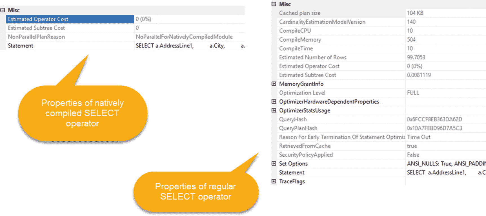

图 24-13
来自两个不同执行计划的 SELECT 运算符属性

你期望看到的许多信息都消失了，因为本地编译过程的操作方式与其他查询不同。使用执行计划来确定这些查询的行为在这里与在标准查询中一样有价值，但内部机制会有所不同。

## 建议

虽然内存表和本地编译存储过程能在 SQL Server 内带来性能的**飞跃式**提升，你仍然需要评估它们在你的场景下是否适用。施加于这些对象行为上的限制意味着它们并非在所有情况下都有用。此外，由于对硬件的要求以及需要企业级 SQL Server 安装，许多人将无法实现这些新对象及其行为。要确定你的工作负载是否是使用这些新对象的良好候选，你可以做几件事。

### 基线

你应该已经计划通过使用性能监视器、动态管理对象、扩展事件以及你掌握的所有其他工具来收集各种指标，从而为系统建立性能基线。一旦有了基线，你就可以判断你的工作负载是否可能从内存表减少的锁定和增加的速度中受益。

### 合适的工作负载

这项技术被称为内存 OLTP 表是有原因的。如果你处理的系统主要以读取为主，仅进行每晚或间歇性加载，或者在线事务处理工作负载非常低，那么内存表和本地编译过程不太可能为你带来重大好处。如果你遇到系统延迟很高的问题，内存表可能是个不错的解决方案。微软已经概述了几种其他可能受益的工作负载，你可以考虑使用内存表和本地编译过程；参见在线文档 ( [`http://bit.ly/1r6dmKY`](http://bit.ly/1r6dmKY) )。


### 内存优化顾问

要快速简便地判断某个表是否适合移至内存中存储，微软在 SSMS 中提供了一个工具。如果你使用 `对象资源管理器` 导航到某个特定的表，你可以右键单击该表，然后从上下文菜单中选择 `内存优化顾问`。这将打开一个向导。如果我选择之前手动迁移的 `Person.Address` 表，初始检查将找出所有在内存中表不受支持的列。这将导致向导停止，并且没有其他选项可用。输出结果如图 24-14 所示。

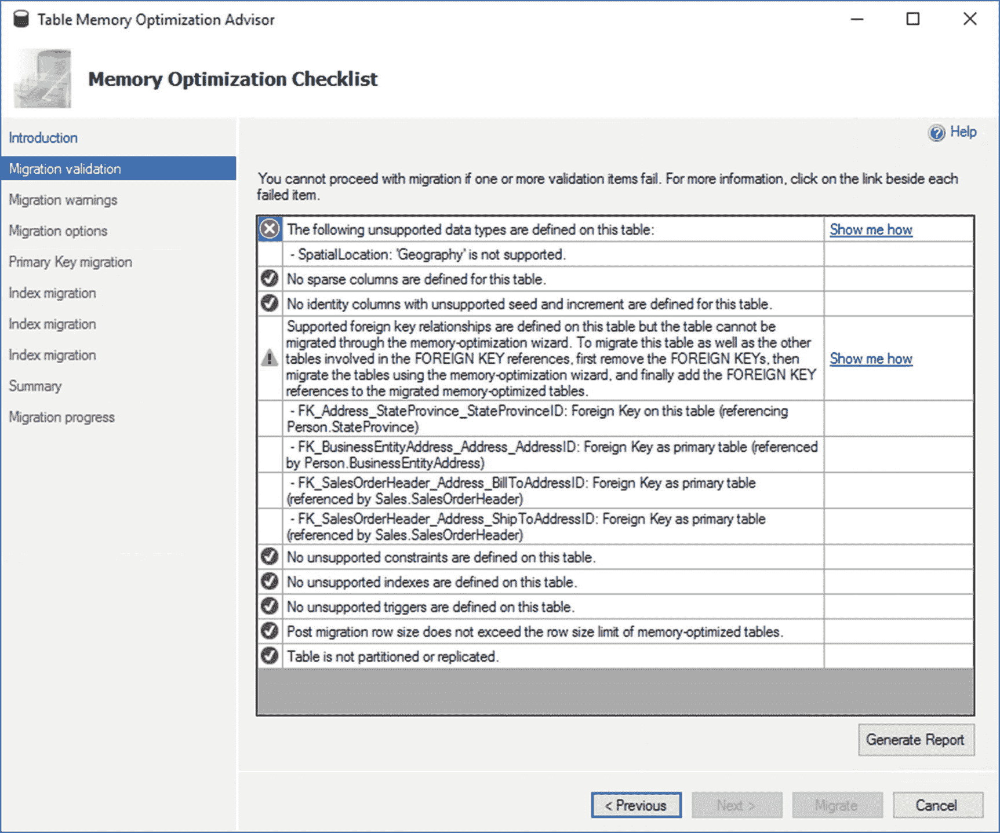

图 24-14：显示所有不支持数据类型的表内存优化顾问

这意味着，按当前结构，此表不是移至内存中存储的候选对象。为了让你能清晰地看到该工具的运行过程，我将在之前创建的 `InMemoryTest` 数据库中创建该表的干净副本，如下所示：

```
USE InMemoryTest;
GO
CREATE TABLE dbo.AddressStaging
(
    AddressID      INT           NOT NULL IDENTITY(1, 1) PRIMARY KEY,
    AddressLine1   NVARCHAR(60)  NOT NULL,
    AddressLine2   NVARCHAR(60)  NULL,
    City           NVARCHAR(30)  NOT NULL,
    StateProvinceID INT          NOT NULL,
    PostalCode     NVARCHAR(15)  NOT NULL
);
```

现在，运行 `内存优化顾问` 在第一步会得到完全不同的结果，如图 24-15 所示。


图 24-15：内存优化顾问的首次检查成功

向导的下一步显示了一组关于使用内存中表将在你的 T-SQL 中引发的差异的标准警告，以及指向有关这些限制的进一步阅读资料的链接。这是一个有用的提醒，表明如果你选择将此表迁移到内存中存储，可能需要调整你的代码。你可以在图 24-16 中看到。


图 24-16：数据迁移警告

你可以在此处停止，并单击 `报告` 按钮以生成针对你的表运行的检查报告。或者，你可以使用向导实际将表移入内存。从警告页面单击 `下一步` 将打开一个选项页面，你可以在其中确定表将如何迁移到内存中。你可以选择旧表的名称。它假设你将为内存中表保留相同的表名。还有其他几个选项可用，如图 24-17 所示。


图 24-17：设置将标准表迁移到内存中的选项

单击 `下一步`，你需要确定如何创建表的主键。你可以为其提供一个名称。然后你必须选择是使用非聚集哈希索引还是非聚集索引。如果选择非聚集哈希索引，则必须提供存储桶计数。图 24-18 展示了我如何以与之前使用 T-SQL 大致相同的方式配置键。


图 24-18：选择新的内存中表主键的配置

单击 `下一步` 将显示你所做选择的摘要，并启用屏幕底部的按钮以立即迁移表。它将迁移表，按照指示重命名旧表，如果你选择了该选项，还将迁移数据。成功迁移的输出如图 24-19 所示。

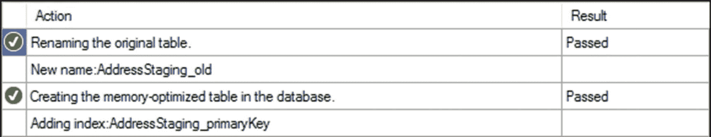

图 24-19：使用向导成功迁移内存中表

`内存优化顾问` 可以识别哪些表可以实际移入内存，并可以为你完成这项工作。但是，它没有判断哪些表应该移入内存的智能。你仍然需要自己思考这个问题。

### 本地编译顾问

与 `内存优化顾问` 功能类似，`本地编译顾问` 可以针对现有的存储过程运行，以确定它是否可以本地编译。然而，它的功能比之前的向导要简单得多。为了展示其实际操作，我将创建两个不同的过程，如下所示：

```
CREATE OR ALTER PROCEDURE dbo.FailWizard (@City NVARCHAR(30))
AS
SELECT a.AddressLine1,
       a.City,
       a.PostalCode,
       sp.Name AS StateProvinceName,
       cr.Name AS CountryName
FROM dbo.Address AS a
JOIN dbo.StateProvince AS sp
    ON sp.StateProvinceID = a.StateProvinceID
JOIN dbo.CountryRegion AS cr WITH (NOLOCK)
    ON cr.CountryRegionCode = sp.CountryRegionCode
WHERE a.City = @City;
GO
CREATE OR ALTER PROCEDURE dbo.PassWizard (@City NVARCHAR(30))
AS
SELECT a.AddressLine1,
       a.City,
       a.PostalCode,
       sp.Name AS StateProvinceName,
       cr.Name AS CountryName
FROM dbo.Address AS a
JOIN dbo.StateProvince AS sp
    ON sp.StateProvinceID = a.StateProvinceID
JOIN dbo.CountryRegion AS cr
    ON cr.CountryRegionCode = sp.CountryRegionCode
WHERE a.City = @City;
GO
```

第一个过程包含一个 `NOLOCK` 提示，该提示不能在内存中表上运行。第二个过程只是本章一直在使用的那个过程的重复。执行脚本创建两个过程后，我可以通过右键单击存储过程 `dbo.FailWizard` 并从上下文菜单中选择 `本地编译顾问` 来访问它。跳过向导开始屏幕后，第一步识别出了该过程的一个问题，如图 24-20 所示。


图 24-20：本地编译顾问已识别出不适当的 T-SQL 语法

请特别注意图 24-20 顶部的注释。它指出，所有表都必须是内存优化表才能本地编译该过程。但是，该检查不是 `本地编译顾问` 检查的一部分。

按照提示单击 `下一步`，然后你可以看到向导识别出的问题，如图 24-21 所示。


图 24-21：本地编译顾问识别出代码中的问题

向导显示了有问题的 T-SQL，并显示了该 T-SQL 出现的行号。这就是此向导提供的全部信息。如果我对另一个过程 `dbo.WizardPass` 运行相同的检查，它只会报告没有任何不适当的 T-SQL 语句。没有额外的操作来为我编译该过程。要使该过程能够编译，需要添加本章前面定义的附加功能。除了此语法检查之外，没有其他帮助来本地编译存储过程。


## 概要

本章介绍了**内存优化表**和**本机编译存储过程**的概念。这些是实现潜在巨大性能提升的高端方法。然而，大规模实施这些新对象存在许多限制。你需要一台拥有足够内存来支持额外负载的机器。在生产环境中采用此方法之前，你还需要仔细测试你的数据和负载。但是，如果你确实需要让你的 OLTP 系统运行得比以往任何时候都快，这是一项可行的技术。它也在 Azure SQL Database 中得到支持。

下一章概述了查询和索引优化如何在 SQL Server 2017 和 Azure SQL Database 中实现部分自动化。

# 25. Azure SQL Database 和 SQL Server 中的自动调优

虽然许多查询性能调优涉及本书中提出的关于系统、查询、统计信息、索引等的详细知识，但查询调优的某些方面本质上是相当机械的。注意到缺失索引建议，然后测试该索引是帮助还是损害了某个查询，以及是否损害了其他查询，这个过程可以被自动化。对于某些明显的执行计划优于另一种的不良参数探测问题也是如此。微软已经开始自动化这些查询调优方面的进程。此外，它正在向 Azure SQL Database 和 SQL Server 中引入其他形式的自动化机制，这些机制将通过即时调优查询的各个方面来帮助你。别担心，本书的其余部分仍然非常有用，因为这些方法只能解决相当狭窄范围的问题。你仍然需要做大量具有挑战性的工作。

在本章中，我将涵盖以下内容：

```
*   自动计划修正
*   Azure SQL Database 自动索引管理
*   自适应查询处理
```

## 自动计划修正

SQL Server 2017 和 Azure SQL Database 能够自动修正执行计划的机制最好这样总结：微软利用了现在可用的数据（这要归功于`Query Store`，有关`Query Store`的更多详细信息，请参见第 11 章），并将其武器化以完成一些惊人的事情。随着数据的变化，你的统计信息可能会改变。你可能有一个编写良好的查询和适当的索引，但随着时间的推移，随着统计信息的变化，你可能会看到一个新的执行计划被引入，从而损害性能，基本上就是第 17 章中概述的不良参数探测问题。其他因素也可能导致良好的查询性能变差，例如累积更新改变了引擎行为。无论原因是什么，如果你能让正确的计划到位，你的代码和结构仍然支持良好的性能。显然，你可以自己使用通过`Query Store`提供的工具来识别性能下降的查询以及哪些计划提供了更好的性能，然后强制使用这些计划。然而，请注意上面概述的整个过程非常直接。

```
1.  监控查询性能，并注意一个过去未更改的查询突然出现性能变化。
2.  确定该查询的执行计划是否已更改。
3.  如果计划已更改且性能下降，则强制使用之前的计划。
4.  测量性能以查看其是下降、改善还是保持不变。
5.  如果性能下降，则撤销更改。
```

简而言之，这就是在 SQL Server 内部发生的事情。SQL Server 内部的一个进程观察`Query Store`中的查询性能。如果它看到查询保持不变，但在执行计划更改时性能下降，它会将其记录为建议的计划回归。如果你启用了自动查询调优，当识别出回归时，它将自动强制使用最后一个良好的计划。然后，自动进程将观察行为，以查看强制计划是否是一个糟糕的选择。如果是，它会纠正问题并记录该事实供你稍后查看。简而言之，微软通过利用`Query Store`中可用的数据，实现了自动化修复不良参数探测等问题。

## 调优建议

## 了解 SQL Server 调优建议

首先，让我们看看 SQL Server 如何识别调优建议。由于这个过程完全依赖于**查询存储**，因此只能在启用了查询存储的数据库上启用此功能（参见第 11 章）。启用查询存储后，无论是 SQL Server 2017 还是 Azure SQL Database，都会自动开始监控性能回退的执行计划。一旦启用了查询存储，您无需再启用其他任何设置。

Microsoft 并未精确定义一个执行计划在何种程度上会变为回退状态并被标记。因此，为保险起见，我们将使用 Adam Machanic 的脚本 (`make_big_adventure.sql`) 在 AdventureWorks 数据库中创建一些非常大的表。该脚本可从 [`http://bit.ly/2mNBIhg`](http://bit.ly/2mNBIhg) 下载。我们在第 9 章处理列存储索引时也用过它。如果您仍在使用同一个数据库，请先删除那些表再重新创建。这将为我们提供一个非常大的数据集，从中可以创建一个查询，该查询会根据传递给它的数据值表现出两种不同的行为。要查看一个回退的执行计划，让我们看看以下脚本：

```sql
CREATE INDEX ix_ActualCost ON dbo.bigTransactionHistory (ActualCost);
GO
--a simple query for the experiment
CREATE OR ALTER PROCEDURE dbo.ProductByCost (@ActualCost MONEY)
AS
SELECT bth.ActualCost
FROM dbo.bigTransactionHistory AS bth
JOIN dbo.bigProduct AS p
ON p.ProductID = bth.ProductID
WHERE bth.ActualCost = @ActualCost;
GO
--ensuring that Query Store is on and has a clean data set
ALTER DATABASE AdventureWorks2017 SET QUERY_STORE = ON;
ALTER DATABASE AdventureWorks2017 SET QUERY_STORE CLEAR;
GO
```

这段代码创建了一个我们将在 `dbo.bigTransactionHistory` 表上使用的索引。它还创建了一个我们将要测试的简单存储过程。最后，该脚本确保查询存储设置为 `ON` 并且清空了所有数据。准备好这些之后，我们可以如下运行我们的测试脚本：

```sql
--establish a history of query performance
EXEC dbo.ProductByCost @ActualCost = 8.2205;
GO 30
--remove the plan from cache
DECLARE @PlanHandle VARBINARY(64);
SELECT  @PlanHandle = deps.plan_handle
FROM    sys.dm_exec_procedure_stats AS deps
WHERE   deps.object_id = OBJECT_ID('dbo.ProductByCost');
IF @PlanHandle IS NOT NULL
BEGIN
DBCC FREEPROCCACHE(@PlanHandle);
END
GO
--execute a query that will result in a different plan
EXEC dbo.ProductByCost @ActualCost = 0.0;
GO
--establish a new history of poor performance
EXEC dbo.ProductByCost @ActualCost = 8.2205;
GO 15
```

这需要执行一段时间。完成后，我们的数据库中应该会有一条调优建议。参考上面的代码清单，我们通过至少执行查询 30 次来建立特定的查询行为。当使用值 8.2205 时，查询本身只返回单行数据。所使用的执行计划如图 25-1 所示。


*图 25-1 返回小数据集时查询的初始执行计划*

虽然图 25-1 中显示的执行计划可能有一些调优机会，特别是包含了 `Key Lookup` 操作，但它对于小数据集效果很好。多次运行查询会在查询存储中积累历史记录。接下来，我们从缓存中移除该计划，当我们使用值 0.0 时，会生成一个新计划，如图 25-2 所示。

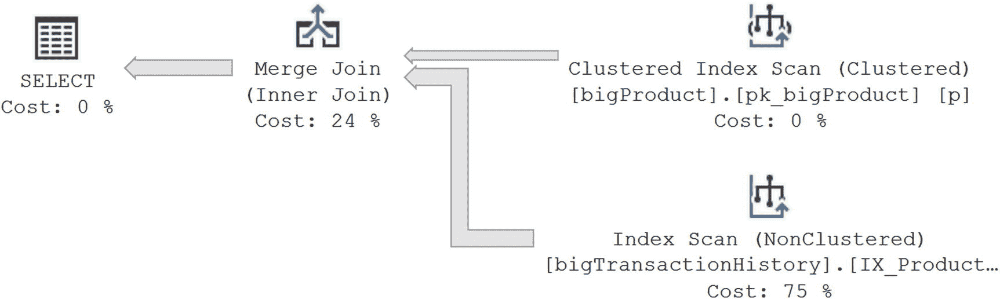

*图 25-2 大得多的数据集的执行计划*

生成该计划后，我们再执行几次该过程（15 次似乎有效），以便清楚地表明我们看到的并非简单异常，而是确凿的计划回退正在进行。这将提示一条调优建议。

## 查看调优建议

我们可以通过查看名为 `sys.dm_db_tuning_recommendations` 的新 DMV 来验证这一系列查询是否产生了调优建议。以下是一个返回有限结果集的示例查询：

```sql
SELECT ddtr.type,
ddtr.reason,
ddtr.last_refresh,
ddtr.state,
ddtr.score,
ddtr.details
FROM sys.dm_db_tuning_recommendations AS ddtr;
```

`sys.dm_db_tuning_recommendations` 提供的信息远不止这些，但让我们先基于之前的计划回退来逐步解析当前看到的内容。您可以在图 25-3 中看到此查询的结果。


*图 25-3 来自 sys.dm_db_tuning_recommendations DMV 的第一条调优建议*

这里呈现的信息既直观又有些令人困惑。首先，`TYPE` 值很容易理解。这里的建议是，我们需要为此查询使用 `FORCE_LAST_GOOD_PLAN`。在出版时，这是目前唯一可用的选项，但随着额外自动调优机制的实现，这一点将会改变。`reason` 值才是有趣之处。在本例中，需要恢复到先前计划的解释如下：

```
Average query CPU time changed from 0.12ms to 2180.37ms
```

我们的 CPU 为每次查询执行时间从不到 1 毫秒变为超过 2.2 秒。这是一个容易识别的问题。`last_refresh` 值告诉我们建议中任何数据上次更改的时间。我们获得状态值，这是一个由两个字段组成的小型 JSON 文档：`currentValue` 和 `reason`。以下是先前结果集中的文档：

```
{"currentValue":"Active","reason":"AutomaticTuningOptionNotEnabled"}
```

它显示此建议是 `Active` 状态，但由于我们尚未启用自动调优，因此未被实施。`Status` 字段有多种可能的值。我们将在下一节“启用自动调优”中介绍它们以及 `reason` 字段的值。得分是一个估计的影响值，范围在 0 到 100 之间。数值越高，表示建议进程的影响越大。最后，您会看到 `details`，这是另一个包含更多信息的 JSON 文档，如下所示：

```json
{"planForceDetails":{"queryId":2,"regressedPlanId":4,"regressedPlanExecutionCount":15,"regressedPlanErrorCount":0,"regressedPlanCpuTimeAverage":2.180373266666667e+006,"regressedPlanCpuTimeStddev":1.680328201712986e+006,"recommendedPlanId":2,"recommendedPlanExecutionCount":30,"recommendedPlanErrorCount":0,"recommendedPlanCpuTimeAverage":1.176333333333333e+002,"recommendedPlanCpuTimeStddev":6.079253426385694e+001},"implementationDetails":{"method":"TSql","script":"exec sp_query_store_force_plan @query_id = 2, @plan_id = 2"}}
```

这些信息以数据块的形式呈现，内容很多，所以让我们更直接地将其分解为网格：


## 调优建议详情

| `planForceDetails` |   |   |
| --- | --- | --- |
|   | `queryID` | 2: 来自查询存储的 `query_id` 值 |
|   | `regressedPlanID` | 4: 问题计划来自查询存储的 `plan_id` 值 |
|   | `regressedPlanExecutionCount` | 15: 已使用退化计划的次数 |
|   | `regressedPlanErrorCount` | 0: 有值时表示执行期间的错误数 |
|   | `regressedPlanCpuTimeAverage` | 2.18037326666667e+006: 计划的平均 CPU 时间 |
|   | `regressedPlanCpuTimeStddev` | 1.60328201712986e+006: 该值的标准差 |
|   | `recommendedPlanID` | 2: 调优建议所建议的 `plan_id` |
|   | `recommendedPlanExecutionCount` | 30: 已使用推荐计划的次数 |
|   | `recommendedPlanErrorCount` | 0: 有值时表示执行期间的错误数 |
|   | `recommendedPlanCpuTimeAverage` | 1.176333333333333e+002: 计划的平均 CPU 时间 |
|   | `recommendedPlanCpuTimeStddev` | 6.079253426385694e+001: 该值的标准差 |
| `implementationDetails` |   |   |
|   | Method | `TSql`: 值将始终为 T-SQL |
|   | `script` | `exec sp_query_store_force_plan @query_id = 2, @plan_id = 2` |

这代表了调优建议的完整细节。无需启用自动调优，您就可以看到有关计划退化的建议以及提出这些建议的完整详细信息。您甚至可以获得脚本，使您能够在不启用自动计划修正的情况下执行建议的修复。

有了这些信息，您可以编写一个更复杂的查询来检索所有信息，以便充分调查这些建议，包括查看执行计划。您所需要做的就是直接查询 JSON 数据，然后将其与从查询存储中获得的其它信息连接起来，就像此脚本所做的那样：

```sql
WITH DbTuneRec
AS (SELECT ddtr.reason,
ddtr.score,
pfd.query_id,
pfd.regressedPlanId,
pfd.recommendedPlanId,
JSON_VALUE(ddtr.state,
'$.currentValue') AS CurrentState,
JSON_VALUE(ddtr.state,
'$.reason') AS CurrentStateReason,
JSON_VALUE(ddtr.details,
'$.implementationDetails.script') AS ImplementationScript
FROM sys.dm_db_tuning_recommendations AS ddtr
CROSS APPLY
OPENJSON(ddtr.details,
'$.planForceDetails')
WITH (query_id INT '$.queryId',
regressedPlanId INT '$.regressedPlanId',
recommendedPlanId INT '$.recommendedPlanId') AS pfd)
SELECT qsq.query_id,
dtr.reason,
dtr.score,
dtr.CurrentState,
dtr.CurrentStateReason,
qsqt.query_sql_text,
CAST(rp.query_plan AS XML) AS RegressedPlan,
CAST(sp.query_plan AS XML) AS SuggestedPlan,
dtr.ImplementationScript
FROM DbTuneRec AS dtr
JOIN sys.query_store_plan AS rp
ON rp.query_id = dtr.query_id
AND rp.plan_id = dtr.regressedPlanId
JOIN sys.query_store_plan AS sp
ON sp.query_id = dtr.query_id
AND sp.plan_id = dtr.recommendedPlanId
JOIN sys.query_store_query AS qsq
ON qsq.query_id = rp.query_id
JOIN sys.query_store_query_text AS qsqt
ON qsqt.query_text_id = qsq.query_text_id;
```

在观察了调优建议是如何得出之后，下一步是调查它们、实施它们，然后观察它们随时间的行为，或者您可以启用自动调优，这样就不必全程监控。

您需要知道，`sys.dm_db_tuning_recommendations` 中的信息不会持久化。如果数据库或服务器因任何原因离线，此信息将丢失。如果您发现自己定期使用此功能，应计划将其导出到更永久的位置。

## 启用自动调优

启用自动调优的过程完全取决于您是在使用 Azure SQL Database 还是 SQL Server 2017。由于自动调优依赖于查询存储，因此开启它也是一项逐个数据库进行的操作。Azure 提供了两种方法：使用 Azure 门户或使用 T-SQL 命令。SQL Server 2017 仅支持 T-SQL。我们将从 Azure 门户开始。

> 注意：Azure 门户会频繁更新。本书中的屏幕截图可能已过时，当您自己操作时可能会看到不同的图形。

### Azure 门户

我假设您已经拥有 Azure 帐户，并且知道如何创建 Azure SQL Database 并能导航到它。我们将从数据库的主边栏窗格开始。您可以在左侧看到各种标准设置。页面顶部将显示数据库的常规设置。页面中央将显示性能指标。最后，页面右下方是数据库功能。您可以在图 25-4 中看到所有这些。


图 25-4

Azure 门户上的数据库边栏窗格

我们将重点关注屏幕右下角的详细信息，并单击自动调优功能。这将打开一个新边栏窗格，其中包含 Azure 内自动调优的设置，如图 25-5 所示。

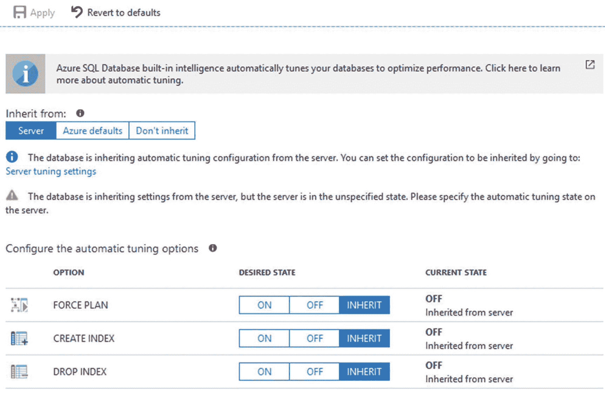

图 25-5

Azure SQL Database 的自动调优功能

要在此数据库中启用自动调优，我们需要将 FORCE PLAN 的设置从默认为 OFF 的 INHERIT 更改为 ON。然后，您必须单击页面顶部的“应用”按钮。此过程完成后，您的选项应如图 25-6 所示。

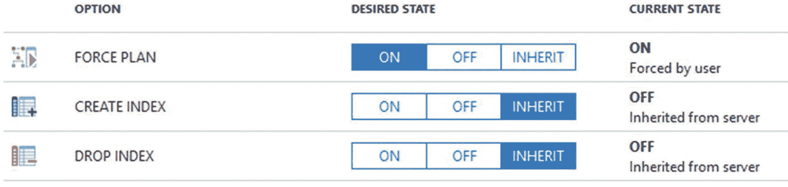

图 25-6

自动调优选项更改为 FORCE PLAN 为 ON

您可以为服务器更改这些设置，然后每个数据库可以自动继承它们。打开或关闭它们不会重置连接或以任何方式使数据库离线。其他选项将在本章后面的“Azure SQL Database 自动索引管理”一节中讨论。

完成此操作后，Azure SQL Database 将在查询退化时强制使用最后一个好计划，如您之前在“调优建议”部分所见。与之前一样，您可以查询 DMV 来检索信息。您也可以使用门户查看此信息。在 SQL Database 边栏窗格的左侧是功能列表。在“支持 + 疑难解答”标题下，您会看到“性能建议”。单击该选项将打开一个类似于图 25-7 的屏幕。

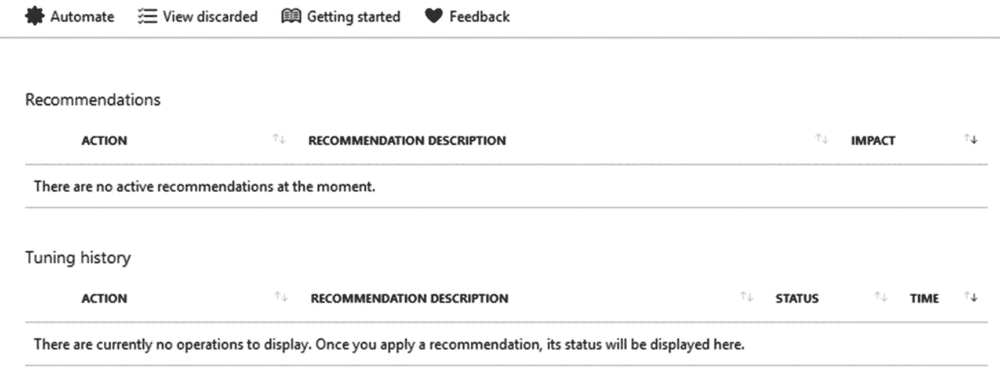

图 25-7

门户上的性能建议页面

图 25-7 中显示的信息应该看起来部分熟悉。您已经从之前“调优建议”部分查询的 DMV 中看到了操作、建议和影响。从这里您可以手动应用建议，也可以查看已丢弃的建议。您还可以通过单击“自动化”按钮返回到设置屏幕。所有这些都利用了查询存储，它在所有新数据库中默认启用。

这就是在 Azure 中启用自动调优所需的全部操作。让我们看看如何在 SQL Server 2017 中操作。


### SQL Server 2017

在 SQL Server 2017 中，目前没有图形界面来启用自动查询调优。相反，你必须使用一个 T-SQL 命令。你也可以在 Azure SQL 数据库中使用相同的命令。命令如下：

```sql
ALTER DATABASE current SET AUTOMATIC_TUNING (FORCE_LAST_GOOD_PLAN = ON);
```

当然，你可以用适当的数据库名称替换我在这里使用的默认值 `current`。这个命令一次只能在一个数据库上运行。如果你想要为实例上的所有数据库启用自动调优，你必须在那些其他数据库创建之前，在 `model` 数据库中启用它，或者你需要为服务器上的每个数据库单独开启它。

目前 `automatic_tuning` 的唯一选项就是像我们这样做，启用强制使用最后一个良好执行计划。你可以使用以下命令禁用此功能：

```sql
ALTER DATABASE current SET AUTOMATIC_TUNING (FORCE_LAST_GOOD_PLAN = OFF);
```

如果你运行了此脚本，请记得再次使用 `ON` 运行它，以保持执行计划的自动调优功能。

### 实际应用中的自动调优

启用自动调优后，我们可以重新运行生成退化计划的脚本。然而，为了验证自动调优是否正在运行，让我们使用一个新的系统视图 `sys.database_automatic_tuning_options` 来进行验证。

```sql
SELECT name,
desired_state,
desired_state_desc,
actual_state,
actual_state_desc,
reason,
reason_desc
FROM sys.database_automatic_tuning_options;
```

结果显示 `desired_state` 值为 `1`，`desired_state_desc` 值为 `On`。

我在进行测试时会首先清除缓存，如下所示：

```sql
ALTER DATABASE SCOPED CONFIGURATION CLEAR PROCEDURE_CACHE;
GO
EXEC dbo.ProductByCost @ActualCost = 8.2205;
GO 30
--remove the plan from cache
DECLARE @PlanHandle VARBINARY(64);
SELECT  @PlanHandle = deps.plan_handle
FROM    sys.dm_exec_procedure_stats AS deps
WHERE   deps.object_id = OBJECT_ID('dbo.ProductByCost');
IF @PlanHandle IS NOT NULL
BEGIN
DBCC FREEPROCCACHE(@PlanHandle);
END
GO
--execute a query that will result in a different plan
EXEC dbo.ProductByCost @ActualCost = 0.0;
GO
--establish a new history of poor performance
EXEC dbo.ProductByCost @ActualCost = 8.2205;
GO 15
```

现在，当我们使用我之前的示例脚本查询 DMV 时，结果是不同的，如图 25-8 所示。

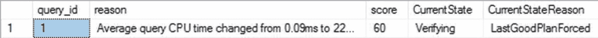

图 25-8 退化的查询已被强制执行

`CurrentState` 值已更改为 `Verifying`。它将在多次执行中衡量性能，就像之前一样。如果性能下降，它将取消强制执行计划。此外，如果出现超时或执行中止等错误，计划也将被取消强制。在这个事件中，你还会看到 `sys.dm_db_tuning_recommendations` 中的 `error_prone` 列变为 `Yes`。

如果你重启服务器，`sys.dm_db_tuning_recommendations` 中的信息将被删除。同时，任何已被强制的计划也将被移除。一旦查询再次退化，假设查询存储历史记录存在，任何计划强制将自动重新启用。如果这是个问题，你总是可以手动强制执行计划。

如果一个查询被强制执行后性能下降，它将被取消强制，如前所述。如果该查询再次出现性能下降，计划强制将被移除，并且该查询将被标记，至少在服务器重启（信息被移除）之前，它不会被再次强制执行。

如果我们查看查询存储报告，也可以看到强制的计划。图 25-9 显示了自动调优导致计划强制执行的结果。

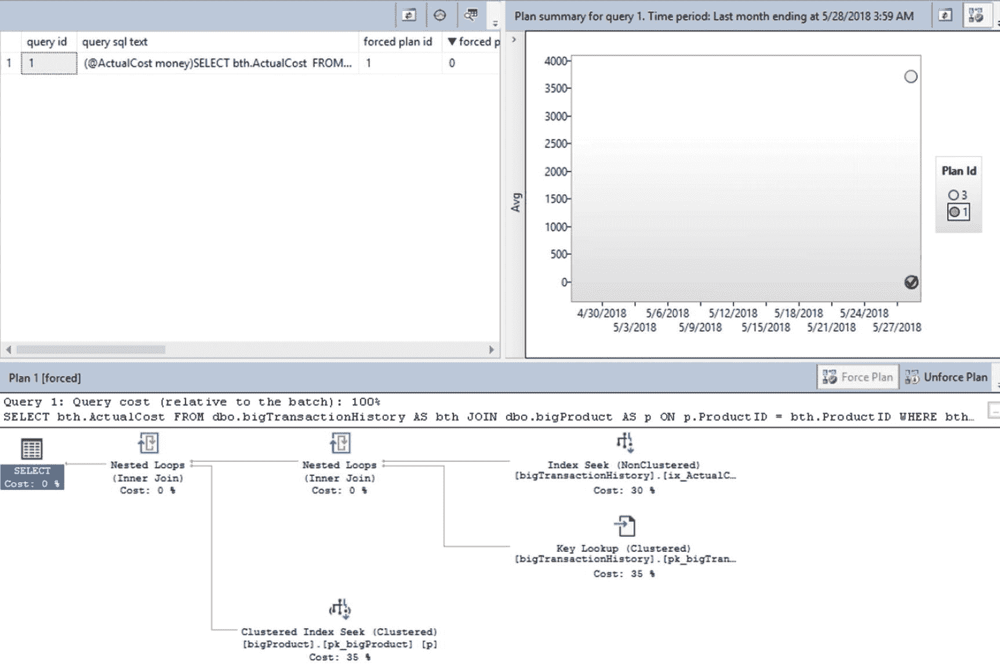

图 25-9 “具有强制计划的查询”报告显示自动调优的结果

这些报告不会告诉你为什么计划被强制。但是，如果需要，你总是可以去 DMV 查找该信息。

### Azure SQL 数据库自动索引管理

自动索引管理的核心概念是将 Azure SQL 数据库定位为平台即服务。大量功能，如打补丁、备份、损坏测试，以及高可用性和许多其他功能，都在微软云中为你管理。因此，将他们的知识和系统管理能力应用于索引工作是顺理成章的。此外，由于 Azure SQL 数据库的所有处理都在微软位于 Azure 的服务器场中进行，他们可以在监控你的系统时运用机器学习算法。

请注意，微软不会从你的查询、数据或任何存储在那里的信息中收集私人信息。它只是使用查询指标来衡量行为。提前说明这一点很重要，因为关于这些功能的错误信息已经传播开来。

然而，在我们启用索引管理之前，让我们先生成一些糟糕的查询行为。我正在针对 Azure 中的示例数据库 `AdventureWorksLT` 使用两个脚本。当你在 Azure 中配置数据库时，示例数据库（门户中的选项之一）简单且易于立即实施。这就是我喜欢在示例中使用它的原因。首先，这是一个生成一些存储过程的 T-SQL 脚本：

```sql
CREATE OR ALTER PROCEDURE dbo.CustomerInfo
(@Firstname NVARCHAR(50))
AS
SELECT c.FirstName,
c.LastName,
c.Title,
a.City
FROM SalesLT.Customer AS c
JOIN SalesLT.CustomerAddress AS ca
ON ca.CustomerID = c.CustomerID
JOIN SalesLT.Address AS a
ON a.AddressID = ca.AddressID
WHERE c.FirstName = @Firstname;
GO
CREATE OR ALTER PROCEDURE dbo.EmailInfo (@EmailAddress nvarchar(50))
AS
SELECT c.EmailAddress,
c.Title,
soh.OrderDate
FROM SalesLT.Customer AS c
JOIN SalesLT.SalesOrderHeader AS soh
ON soh.CustomerID = c.CustomerID
WHERE c.EmailAddress = @EmailAddress;
GO
CREATE OR ALTER PROCEDURE dbo.SalesInfo (@firstName NVARCHAR(50))
AS
SELECT c.FirstName,
c.LastName,
c.Title,
soh.OrderDate
FROM SalesLT.Customer AS c
JOIN SalesLT.SalesOrderHeader AS soh
ON soh.CustomerID = c.CustomerID
WHERE c.FirstName = @firstName
GO
CREATE OR ALTER PROCEDURE dbo.OddName (@FirstName NVARCHAR(50))
AS
SELECT c.FirstName
FROM SalesLT.Customer AS c
WHERE c.FirstName BETWEEN 'Brian'
AND     @FirstName
GO
```

接下来，这是一个 PowerShell 脚本，用于多次调用这些过程：


## Azure SQL Database 自动索引管理

这些脚本将使我们能够生成必要的负载，以触发自动索引管理功能。该 PowerShell 脚本必须运行大约 12 到 18 小时，才能在 Azure 中收集到足够的数据。但是，您必须首先更改一些要求设置。

要使自动索引管理正常工作，必须在 Azure SQL 数据库上启用查询存储。查询存储在 Azure 中默认是启用的，因此如果您将其关闭了，只需要将其重新打开。为确保其已启用，您可以运行以下脚本：

```powershell
ALTER DATABASE CURRENT SET QUERY_STORE = ON;
```

启用查询存储后，您现在需要导航到数据库的“概述”屏幕。图 25-2 显示了完整的屏幕。作为提醒，屏幕底部有许多选项，其中之一是“自动调优”，如图 25-10 所示。

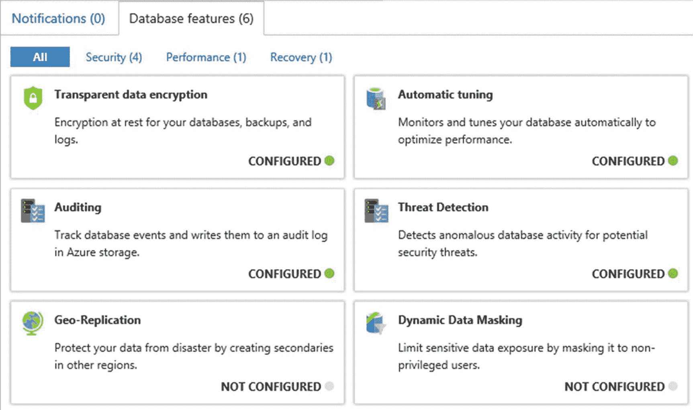
*图 25-10 Azure SQL 数据库中的数据库功能，包括“自动调优”*

自动调优是右上角的选项。请记住，Azure 可能会发生变化，因此您的屏幕可能看起来与我的不同。单击“自动调优”按钮将打开如图 25-11 所示的屏幕。

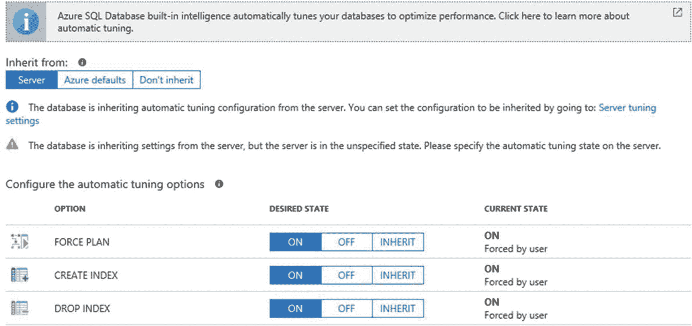
*图 25-11 在 Azure SQL 数据库中启用“自动调优”*

在这种情况下，我启用了所有三个选项，因此我不仅可以获得前面章节描述的通过自动调优获得的“最后一个好计划”，还同时开启了自动索引管理。

启用这些功能后，我们现在可以运行 PowerShell 脚本至少 12 小时。您可以通过查询 `sys.dm_db_tuning_recommendations`（如我们之前所做）来验证是否已收到索引。这里我使用一个简单的脚本，仅从 DMV 中检索核心信息：

```sql
SELECT ddtr.type,
ddtr.reason,
ddtr.last_refresh,
ddtr.state,
ddtr.score,
ddtr.details
FROM sys.dm_db_tuning_recommendations AS ddtr;
```

在我的 Azure SQL 数据库上的结果如图 25-12 所示。

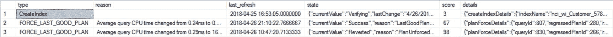
*图 25-12 Azure SQL 数据库中的自动调优结果*

如您所见，我的系统上发生了多个调优事件。第一个是我们在此示例中感兴趣的 `CreateIndex` 类型。您也可以查看 Azure 门户以获取自动调优的运行情况。在门户屏幕的左侧，靠近底部，您应该看到一个标记为“性能建议”的“支持 + 疑难解答”选项。选择该选项将打开一个类似图 25-13 的窗口。

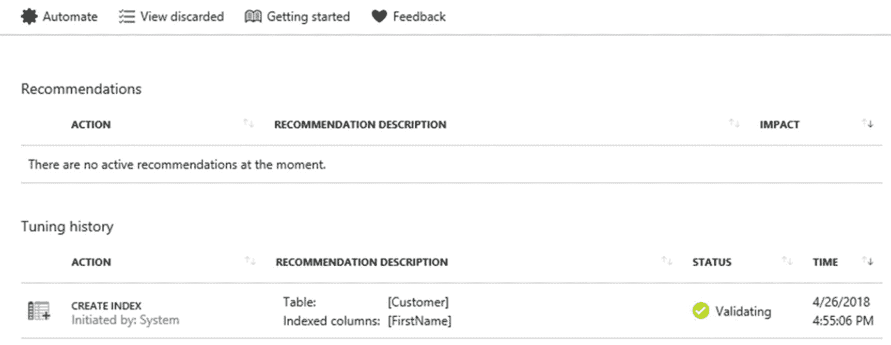
*图 25-13 性能建议和调优历史记录*

由于我们已经启用了所有自动调优，因此目前没有建议。自动调优已经生效。但是，我们仍然可以深入挖掘并收集更多信息。单击 `CREATE INDEX` 选项以打开一个新窗口。当自动调优尚未经过验证时，窗口将默认在“估计影响”视图中打开，如图 25-14 所示。

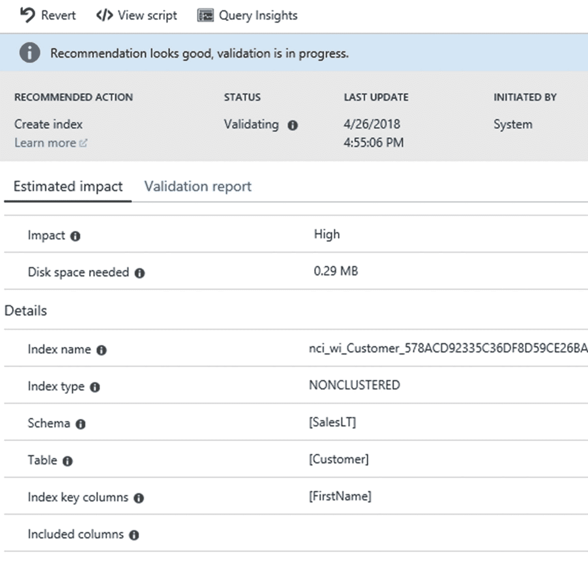
*图 25-14 推荐索引的估计影响视图*

在我的例子中，索引已经创建，并且正在验证该索引是否正确支持查询。您可以很好地了解该建议，并且它看起来应该很熟悉，因为其信息与前面自动计划调优中包含的信息类似。不同之处在于细节，这里我们有的是一个建议的索引、索引类型、架构、表、索引列以及任何包含列，而不是一个建议的计划。

您可以通过查看屏幕顶部的按钮来控制这些自动更改。您可以单击“撤消”手动删除更改。您可以查看用于生成更改的脚本，也可以查看收集的查询指标。

我的系统默认打开“验证报告”视图，如图 25-15 所示。

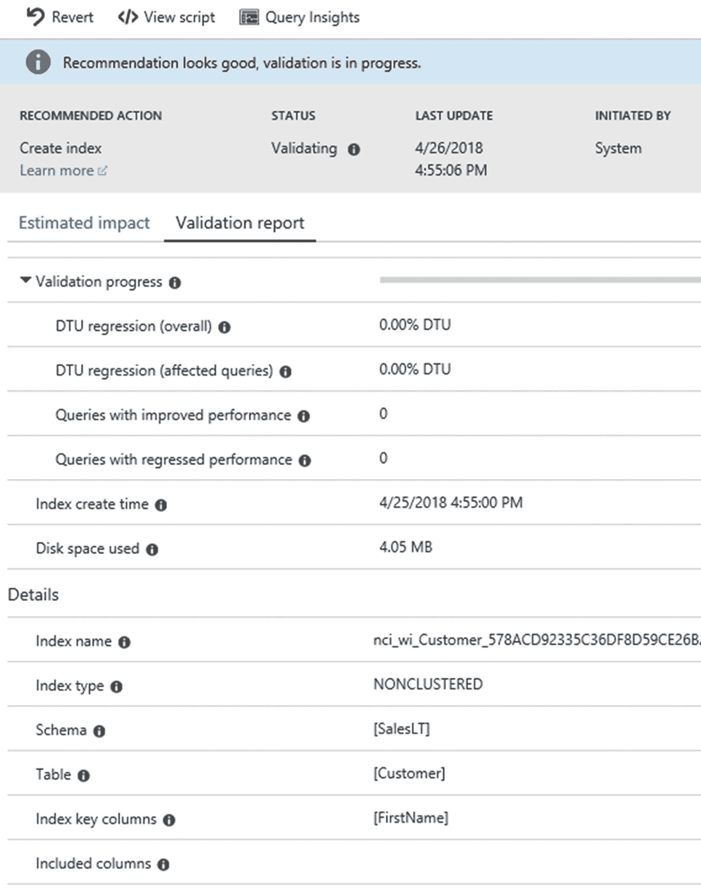
*图 25-15 自动索引管理过程中的验证*

从这份报告中，您可以看到新索引已就位，但它目前正处于评估期。目前尚不清楚评估期的确切时长，但可以合理地假设它可能是系统上另外 12 到 18 小时的负载，在此期间将测量索引的任何负面影响，并用于决定是否保留该索引。评估的确切时间不是已发布的信息，因此即使我在这里的估计也可能发生变化。

---

```powershell
$SqlConnection = New-Object System.Data.SqlClient.SqlConnection
$SqlConnection.ConnectionString = 'Server=qpf.database.windows.net;Database=QueryPerformanceTuning;trusted_connection=false;user=UserName;password=YourPassword'
## load customer names
$DatCmd = New-Object System.Data.SqlClient.SqlCommand
$DatCmd.CommandText = "SELECT c.FirstName, c.EmailAddress
FROM SalesLT.Customer AS c;"
$DatCmd.Connection = $SqlConnection
$DatDataSet = New-Object System.Data.DataSet
$SqlAdapter = New-Object System.Data.SqlClient.SqlDataAdapter
$SqlAdapter.SelectCommand = $DatCmd
$SqlAdapter.Fill($DatDataSet)
$Proccmd = New-Object System.Data.SqlClient.SqlCommand
$Proccmd.CommandType = [System.Data.CommandType]'StoredProcedure'
$Proccmd.CommandText = "dbo.CustomerInfo"
$Proccmd.Parameters.Add("@FirstName",[System.Data.SqlDbType]"nvarchar")
$Proccmd.Connection = $SqlConnection
$EmailCmd = New-Object System.Data.SqlClient.SqlCommand
$EmailCmd.CommandType = [System.Data.CommandType]'StoredProcedure'
$EmailCmd.CommandText = "dbo.EmailInfo"
$EmailCmd.Parameters.Add("@EmailAddress",[System.Data.SqlDbType]"nvarchar")
$EmailCmd.Connection = $SqlConnection
$SalesCmd = New-Object System.Data.SqlClient.SqlCommand
$SalesCmd.CommandType = [System.Data.CommandType]'StoredProcedure'
$SalesCmd.CommandText = "dbo.SalesInfo"
$SalesCmd.Parameters.Add("@FirstName",[System.Data.SqlDbType]"nvarchar")
$SalesCmd.Connection = $SqlConnection
$OddCmd = New-Object System.Data.SqlClient.SqlCommand
$OddCmd.CommandType = [System.Data.CommandType]'StoredProcedure'
$OddCmd.CommandText = "dbo.OddName"
$OddCmd.Parameters.Add("@FirstName",[System.Data.SqlDbType]"nvarchar")
$OddCmd.Connection = $SqlConnection
while(1 -ne 0)
{
foreach($row in $DatDataSet.Tables[0])
{
$name = $row[0]
$email = $row[1]
$SqlConnection.Open()
$Proccmd.Parameters["@FirstName"].Value = $name
$Proccmd.ExecuteNonQuery() | Out-Null
$EmailCmd.Parameters["@EmailAddress"].Value = $email
$EmailCmd.ExecuteNonQuery() | Out-Null
$SalesCmd.Parameters["@FirstName"].Value = $name
$SalesCmd.ExecuteNonQuery() | Out-Null
$OddCmd.Parameters["@FirstName"].Value = $name
$OddCmd.ExecuteNonQuery() | Out-Null
$SqlConnection.Close()
}
}
```


作为演示行为的一部分，我在验证期间停止了对数据库的查询运行。这意味着系统测量到的任何查询都不太可能从新索引中获得任何类型的优势。因此，两天后，该索引被回退，意味着它已从系统中移除。我们可以在调优历史中看到这一点，如图 25-16 所示。

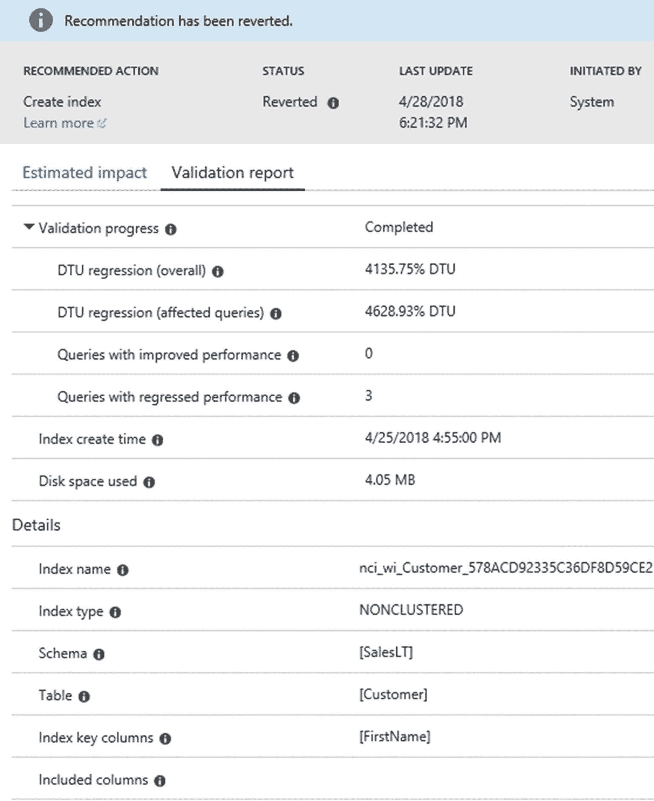

图 25-16

负载变更后，索引已被移除

然而，假设负载保持不变，该索引将被验证为对正在调用的查询显示出性能改进。

## 自适应查询处理

调优查询是本书的目的，因此谈论那些能让你不必调优那么多查询的机制，似乎有些违反直觉，但理解 SQL Server 将在哪些地方自动帮助你，是值得的。自适应查询处理概述的新机制从根本上关乎在查询执行时改变查询的行为。这有助于处理与错误估计的行计数和内存分配相关的一些基本问题。目前有三种类型的自适应查询处理，我们将在本章中演示全部三种：

*   批处理模式内存授予反馈
*   批处理模式自适应连接
*   交错执行

我们已经在第 9 章介绍过自适应连接。我们将按顺序处理自适应查询处理的另外两种机制，首先从批处理模式内存授予反馈开始。

### 批处理模式内存授予反馈

在撰写本文时，批处理模式仅支持涉及 `columnstore`（列存储）索引（`clustered`（聚集）或 `nonclustered`（非聚集））的查询。`Batch mode`（批处理模式）本身值得简短解释。在执行计划内的 `row mode`（行模式）执行期间，每对运算符必须协商它们之间传输的每一行。如果有十行，就有十次协商。如果有千万行，就有千万次协商。可以想象，这成本相当高。因此，在 `batch mode`（批处理模式）操作中，处理不是一次一行地进行，而是以批处理方式进行，通常每批最多分配 900 行，但存在相当大的变化。这意味着，移动千万行不再需要千万次协商，而只需要这么多次：

10000000 行 / ~ 900 行每批 = 11,111 批

从千万次协商减少到大约 11,000 次，这是一个巨大的改进。此外，由于处理时间被释放出来，并且因为更好的行估计成为可能，你可以在查询执行过程中获得不同的行为。

我们将探讨的第一种行为是 `batch mode memory grant feedback`（批处理模式内存授予反馈）。在这种情况下，当查询以 `batch mode`（批处理模式）执行时，会计算查询是否拥有过剩或不足的内存。内存不足尤其是一个问题，因为它导致必须分配并使用磁盘来管理过剩部分，这被称为 `spill`（溢出）。更好的内存分配可以提高性能。让我们看一个例子。

首先，为了使其工作，请确保你仍然在 `bigTransactionHistory` 表上有一个 `columnstore`（列存储）索引，并且数据库的兼容性模式设置为 140。

在我们开始之前，我们还可以通过使用 `Extended Events`（扩展事件）来捕获与内存授予反馈过程直接相关的事件，以确保我们能观察到行为。以下是一个执行此操作的脚本：

```
CREATE EVENT SESSION MemoryGrant
ON SERVER
ADD EVENT sqlserver.memory_grant_feedback_loop_disabled
(WHERE (sqlserver.database_name = N'AdventureWorks2017')),
ADD EVENT sqlserver.memory_grant_updated_by_feedback
(WHERE (sqlserver.database_name = N'AdventureWorks2017')),
ADD EVENT sqlserver.sql_batch_completed
(WHERE (sqlserver.database_name = N'AdventureWorks2017'))
WITH (TRACK_CAUSALITY = ON);
```

第一个事件 `memory_grant_feedback_loop_disabled` 在相关查询受到参数值过度影响时发生。查询引擎不会让内存授予剧烈波动，而是会禁用某些计划的反馈。当这种情况发生在某个计划上时，此事件将在执行期间触发。第二个事件 `memory_grant_updated_by_feedback` 在反馈被处理时发生。让我们看看实际效果。

这是一个包含查询的存储过程，该查询聚合了来自 `bigTransactionHistory` 表的一些信息：

```
CREATE OR ALTER PROCEDURE dbo.CostCheck (@Cost MONEY)
AS
SELECT p.Name,
AVG(th.Quantity),
AVG(th.ActualCost)
FROM dbo.bigTransactionHistory AS th
JOIN dbo.bigProduct AS p
ON p.ProductID = th.ProductID
WHERE th.ActualCost = @Cost
GROUP BY p.Name;
GO
```

如果我们执行此查询，传递值 0，并捕获实际执行计划，它看起来如图 25-17 所示。


图 25-17

`SELECT` 运算符上带有警告的执行计划

这个查询中应该立即吸引你眼球的是 `SELECT` 运算符上的警告。我们可以打开属性窗口以查看计划的所有警告。请注意，工具提示只显示第一个警告，如图 25-18 所示。

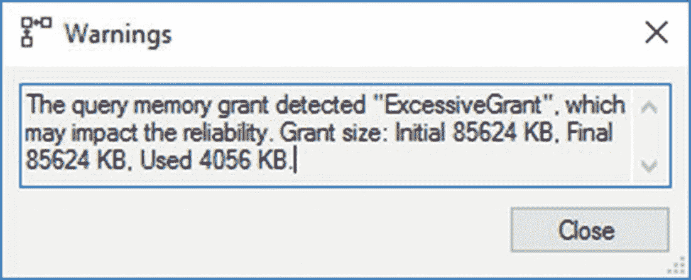

图 25-18

来自执行计划的内存授予过度警告


# 内存授予反馈与交错执行

此处的定义相当明确。根据存储在列存储索引中的数据统计信息，SQL Server 估计处理此查询需要 **85,624KB** 内存。实际使用的内存为 **4,056KB**。差异超过了 **81,000KB**。如果频繁运行类似查询且差异如此之大，我们将面临严重的内存压力，而收益甚微。我们还可以通过扩展事件（Extended Events）查看反馈过程的实际运行情况。图 25-19 显示了在执行查询时触发的 `memory_grant_updated_by_feedback` 事件。

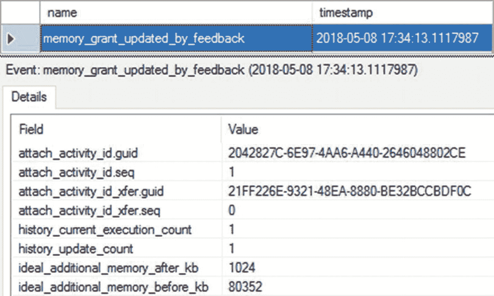

图 25-19：memory_grant_updated_by_feedback 事件的扩展事件属性

你可以在图 25-19 中看到一些重要信息。`activity_id` 值显示此事件发生在扩展事件会话中的其他事件之前，因为 `seq` 值为 1。如果你正在运行代码，会发现你的 `sql_batch_completed` 的 `seq` 值为 2。这意味着内存授予调整发生在查询完成执行之前，尽管你仍然会在执行计划中看到警告。这些调整是针对该查询的后续执行。实际上，让我们再次执行查询，并查看扩展事件中的查询执行结果，如图 25-20 所示。


图 25-20：显示内存授予反馈仅发生一次的扩展事件

另一个值得注意的有趣现象是，如果你再次捕获执行计划，如图 25-21 所示，你将不再看到该警告。

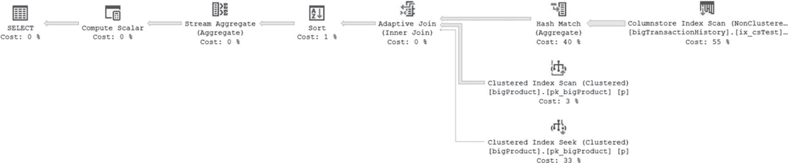

图 25-21：相同的执行计划但没有警告

如果我们继续使用这些参数值运行此过程，将不会看到任何其他变化。但是，如果我们按如下方式修改参数值：

```
EXEC dbo.CostCheck @Cost = 15.035;
```

我们根本看不到任何变化。这是因为虽然结果集差异很大（1 行对 9000 行），但内存需求并不像第一次执行第一个查询时那样差异巨大。但是，如果我们清除内存缓存，然后使用这些值执行该过程，你将再次看到 `memory_grant_updated_by_feedback` 触发。

如果你正在经历由更改内存授予引起的一定程度的颠簸，可以使用 `DATABASE SCOPED CONFIGURATION` 在数据库级别禁用它，如下所示：

```
ALTER DATABASE SCOPED CONFIGURATION SET DISABLE_BATCH_MODE_MEMORY_GRANT_FEEDBACK = ON;
```

要重新启用它，只需使用相同的命令将其设置为 `OFF`。还有一个查询提示（query hint）可用于为单个查询禁用内存反馈。只需将 `DISABLE_BATCH_MODE_MEMORY_GRANT_FEEDBACK` 添加到查询提示的 `USE` 部分即可。

## 交错执行

虽然我关于避免使用多语句表值函数的建议保持不变，但你可能会发现自己被迫处理它们。在 SQL Server 2017 之前，使这些函数运行更快的唯一真正选择是重写代码以完全不使用它们。然而，SQL Server 2017 现在为这些对象提供了交错执行（interleaved execution）。其工作方式是，优化器会识别出正在处理的是一个多语句函数。它将暂停优化过程。处理表值函数的那部分计划将被执行，并返回准确的行数。这些行数随后将在优化过程的剩余部分中使用。如果你有多个多语句函数，你将获得多次执行，直到所有此类对象都返回了更准确的行数。

为了实际观察这一点，我想创建以下多语句函数：

```
CREATE OR ALTER FUNCTION dbo.SalesInfo ()
RETURNS @return_variable TABLE (SalesOrderID INT,
OrderDate DATETIME,
SalesPersonID INT,
PurchaseOrderNumber dbo.OrderNumber,
AccountNumber dbo.AccountNumber,
ShippingCity NVARCHAR(30))
AS
BEGIN;
INSERT INTO @return_variable (SalesOrderID,
OrderDate,
SalesPersonID,
PurchaseOrderNumber,
AccountNumber,
ShippingCity)
SELECT soh.SalesOrderID,
soh.OrderDate,
soh.SalesPersonID,
soh.PurchaseOrderNumber,
soh.AccountNumber,
a.City
FROM Sales.SalesOrderHeader AS soh
JOIN Person.Address AS a
ON soh.ShipToAddressID = a.AddressID;
RETURN;
END;
GO
CREATE OR ALTER FUNCTION dbo.SalesDetails ()
RETURNS @return_variable TABLE (SalesOrderID INT,
SalesOrderDetailID INT,
OrderQty SMALLINT,
UnitPrice MONEY)
AS
BEGIN;
INSERT INTO @return_variable (SalesOrderID,
SalesOrderDetailID,
OrderQty,
UnitPrice)
SELECT sod.SalesOrderID,
sod.SalesOrderDetailID,
sod.OrderQty,
sod.UnitPrice
FROM Sales.SalesOrderDetail AS sod;
RETURN;
END;
GO
CREATE OR ALTER FUNCTION dbo.CombinedSalesInfo ()
RETURNS @return_variable TABLE (SalesPersonID INT,
ShippingCity NVARCHAR(30),
OrderDate DATETIME,
PurchaseOrderNumber dbo.OrderNumber,
AccountNumber dbo.AccountNumber,
OrderQty SMALLINT,
UnitPrice MONEY)
AS
BEGIN;
INSERT INTO @return_variable (SalesPersonID,
ShippingCity,
OrderDate,
PurchaseOrderNumber,
AccountNumber,
OrderQty,
UnitPrice)
SELECT si.SalesPersonID,
si.ShippingCity,
si.OrderDate,
si.PurchaseOrderNumber,
si.AccountNumber,
sd.OrderQty,
sd.UnitPrice
FROM dbo.SalesInfo() AS si
JOIN dbo.SalesDetails() AS sd
ON si.SalesOrderID = sd.SalesOrderID;
RETURN;
END;
GO
```

这些是我处理多语句函数时经常看到的反模式（或代码异味）类型。一个函数调用另一个函数，后者又与第三个函数连接，依此类推。由于优化器对这些函数的处理方式取决于所使用的基数估计引擎的版本，你实际上没有太多选择。在 SQL Server 2014 之前，优化器为这些对象假设为一行。SQL Server 2014 及更高版本有不同的假设，为 100 行。因此，如果兼容级别设置为 140 或更高，你将看到 100 行的假设，除非启用了交错执行。

我们可以针对这些函数运行一个查询。但是，首先我们需要在禁用交错执行的情况下运行它。然后我们将重新启用它，清除缓存，并再次执行查询，如下所示：


## 执行计划比较与交错执行优化

```sql
ALTER DATABASE SCOPED CONFIGURATION SET DISABLE_INTERLEAVED_EXECUTION_TVF = ON;
GO
SELECT csi.OrderDate,
csi.PurchaseOrderNumber,
csi.AccountNumber,
csi.OrderQty,
csi.UnitPrice,
sp.SalesQuota
FROM dbo.CombinedSalesInfo() AS csi
JOIN Sales.SalesPerson AS sp
ON csi.SalesPersonID = sp.BusinessEntityID
WHERE csi.SalesPersonID = 277
AND csi.ShippingCity = 'Odessa';
GO
ALTER DATABASE SCOPED CONFIGURATION SET DISABLE_INTERLEAVED_EXECUTION_TVF = OFF;
GO
ALTER DATABASE SCOPED CONFIGURATION CLEAR PROCEDURE_CACHE;
GO
SELECT csi.OrderDate,
csi.PurchaseOrderNumber,
csi.AccountNumber,
csi.OrderQty,
csi.UnitPrice,
sp.SalesQuota
FROM dbo.CombinedSalesInfo() AS csi
JOIN Sales.SalesPerson AS sp
ON csi.SalesPersonID = sp.BusinessEntityID
WHERE csi.SalesPersonID = 277
AND csi.ShippingCity = 'Odessa';
GO
```

得到的执行计划是不同的，但差异很细微，如图 25-22 所示。

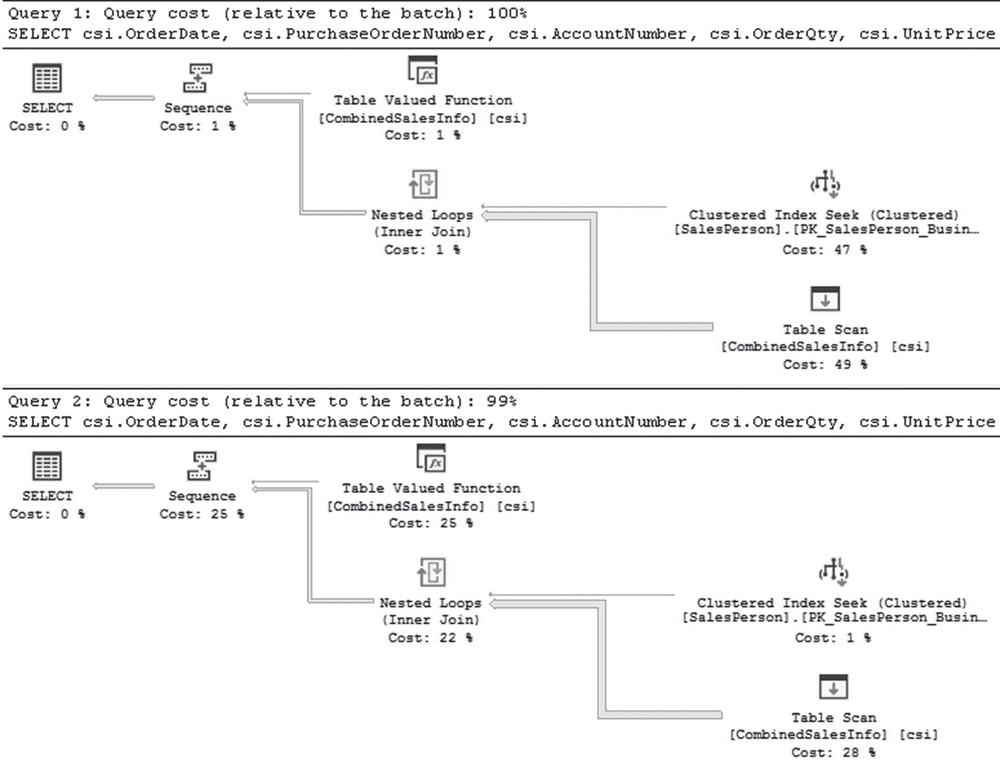

图 25-22 两个执行计划，一个使用了交错执行

观察这些计划，实际上很难看出差异，因为所有的操作符都是相同的。然而，差异在于估算的成本值。在第一个计划（旧方式）的顶部，表值函数估算成本为 1%，这表明与 `Clustered Index Seek` 和 `Table Scan` 操作相比，它几乎是免费的。然而，在第二个计划中，`Clustered Index Seek` 操作（估计返回一行）的估算成本突然只占总成本的 1%，其余的成本被合理地重新分配到了其他操作。正是这种行数估计上的差异在某些情况下可能导致性能提升。然而，让我们看看这些值以实际验证。

`Sequence` 操作符强制附加到它的每个子树按顺序执行。在这个例子中，第一个执行的是表值函数。它为两个计划底部的 `Table Scan` 操作符提供数据。图 25-23 显示了顶部计划（以旧方式执行的计划）的属性。


图 25-23 旧式计划的属性

在图 25-23 捕获的图像底部，您可以看到该操作符预计读取的行数为 100。其中，预计匹配的行数为 3.16228。实际行数在顶部，为 148。这种差异是导致多语句函数执行时间如此之差的主要原因。

现在，让我们看看以交错方式执行的函数的相同属性，如图 25-24 所示。


图 25-24 交错执行的属性

返回的实际行数是相同的，因为这些是对相同结果集的相同查询。但是，请注意 `Estimated Number of Rows to be Read` 的值。现在它变成了 121317，而不是硬编码的 100（无论涉及什么数据）。这是一个更准确的估计。它导致预计返回 18.663 行。这仍然不是实际值 148，但它正朝着更准确的估计迈进。

由于这些计划相似，执行时间和读取次数出现很大差异的可能性不大。但是，让我们从扩展事件中获取度量值。平均而言，非交错执行耗时 1.48 秒，读取次数为 341,000。交错执行平均耗时 1.45 秒，读取次数为 340,000。有小幅改进。

现在，我们实际上可以显著提高性能，并且仍然使用多语句函数。与其将函数连接在一起，如果我们重写代码，像这样：

```sql
CREATE OR ALTER FUNCTION dbo.AllSalesInfo (@SalesPersonID INT,
@ShippingCity VARCHAR(50))
RETURNS @return_variable TABLE (SalesPersonID INT,
ShippingCity NVARCHAR(30),
OrderDate DATETIME,
PurchaseOrderNumber dbo.OrderNumber,
AccountNumber dbo.AccountNumber,
OrderQty SMALLINT,
UnitPrice MONEY)
AS
BEGIN;
INSERT INTO @return_variable (SalesPersonID,
ShippingCity,
OrderDate,
PurchaseOrderNumber,
AccountNumber,
OrderQty,
UnitPrice)
SELECT soh.SalesPersonID,
a.City,
soh.OrderDate,
soh.PurchaseOrderNumber,
soh.AccountNumber,
sod.OrderQty,
sod.UnitPrice
FROM Sales.SalesOrderHeader AS soh
JOIN Person.Address AS a
ON a.AddressID = soh.ShipToAddressID
JOIN Sales.SalesOrderDetail AS sod
ON sod.SalesOrderID = soh.SalesOrderID
WHERE soh.SalesPersonID = @SalesPersonID
AND a.City = @ShippingCity;
RETURN;
END;
GO
```

我们不再使用 `WHERE` 子句来执行最终查询，而是像这样执行它：

```sql
SELECT asi.OrderDate,
asi.PurchaseOrderNumber,
asi.AccountNumber,
asi.OrderQty,
asi.UnitPrice,
sp.SalesQuota
FROM dbo.AllSalesInfo(277,'Odessa') AS asi
JOIN Sales.SalesPerson AS sp
ON asi.SalesPersonID = sp.BusinessEntityID;
```

通过将参数传递给函数，我们允许交错执行有值可以衡量。这样做返回的数据完全相同，但性能下降到 65 毫秒，仅 1,135 次读取。对于多语句函数来说，这非常惊人。然而，以非交错方式运行此函数也将执行时间降低到 69 毫秒和 1,428 次读取。虽然我们讨论的是不需要代码或结构更改的改进，但这些改进非常微小。

另一个可能因交错执行而产生的问题是，特别是如果您像我在第二个查询中那样传递值。它将根据手头的值创建一个计划。这实际上就像是参数嗅探。它使用这些硬编码值来创建执行计划，并直接使用这些值对照统计信息作为行数估计。如果您的统计信息差异很大，您可能会遇到类似于我们在第 15 章讨论的性能问题。

您还可以使用查询提示来禁用交错执行。只需通过提示向查询提供 `DISABLE_INTERLEAVED_EXECUTION_TVF`，它将仅为正在执行的查询禁用它。

## 总结

随着 SQL Server 2017 中调优建议的加入，以及 Azure SQL Database 中的索引自动化，您现在在 SQL Server 自动化方面获得了更多帮助。您仍然需要利用本书其余部分学到的信息来理解哪些建议是有帮助的，哪些仅仅是您自己做出选择的线索。然而，事情变得更容易了，因为 SQL Server 可以通过自适应查询处理进行自动调整，而无需您做任何工作。请记住，所有这些都有帮助，但都不是完整的解决方案。这只意味着您的工具箱中有更多工具来帮助处理性能不佳的查询。

下一章将讨论您可以通过分布式重放使用来自动化测试查询的方法。


# 26. 数据库性能测试

懂得如何识别性能问题并知道如何修复它们，是非常棒的技能。然而，问题在于你需要能够证明你所做的改进是真正有效的改进。虽然你能够并且应该在调整查询或添加索引前后捕获性能指标，但要确保你看到的是可衡量的改进，最好的方法是让你所做的更改投入工作。测试不仅仅意味着简单地运行几次查询，然后将其投入生产系统并祈求好运。你需要有一种系统化的方法，以现实的方式使用针对你的系统运行的全套查询来验证性能改进。从 2012 版开始，`SQL Server`通过其`分布式重放`工具提供了这样一种机制。

`分布式重放`利用由`SQL Profiler`及其创建的跟踪事件所生成的信息进行工作。跟踪事件捕获信息的方式与`扩展事件`工具有些相似，但跟踪事件是一种较旧（且功能较弱）的系统内事件捕获机制。在`SQL Server` 2012 发布之前，你可以使用`SQL Server`的`Profiler`工具通过`服务器端跟踪`来回放捕获的事件。这虽然可行，但该过程极为有限。例如，该工具只能在单台机器上运行，并且回放机制——一个以串行方式运行的单线程过程，而非现实中发生的情况。微软已将并行方式从多台机器运行的功能添加到了`SQL Server`中。在微软提供通过`扩展事件`输出使用`分布式重放`的机制之前，你仍需使用跟踪事件来进行性能测试的这一方面。

`分布式重放`并不是一个被广泛采用的工具。大多数人完全跳过了实施可重复测试的想法。其他人可能会选择一些提供更多功能的第三方工具。我强烈建议你进行某种形式的测试，以确保你的调优工作对系统产生了可准确衡量的积极影响。

本章涵盖以下主题：

*   数据库测试的概念
*   如何创建`服务器端跟踪`
*   使用`分布式重放`进行数据库测试

## 数据库性能测试

数据库性能和负载测试的一般方法相当简单。你需要捕获在正常负载下对生产系统的调用，然后能够针对测试系统一遍又一遍地重放该负载。这使你能够直接测量由代码或结构更改引起的性能变化。不幸的是，在现实世界中实现这一点并不像听起来那么简单。

首先，你不能简单地捕获查询的记录。相反，你必须首先确保能够将生产数据库还原到测试系统上的某个时间点。具体来说，你需要能够还原到你开始在系统上记录事务的确切时刻，因为如果你还原到任何其他时间点，可能会有不同的数据甚至不同的结构。这将导致回放机制生成错误而不是有用的信息。这意味着，首先，你必须有一个处于`完整恢复`模式的数据库，以便你可以进行定期的完整备份以及日志备份，从而在测试开始时还原到特定时间点。

一旦你建立了还原到适当时间的能力，你将需要配置你的查询捕获机制——在本例中是由`Profiler`生成的`服务器端跟踪`定义。回放机制将准确定义你需要捕获哪些事件。你需要设置捕获过程，使其对系统的影响尽可能小。

接下来，你必须处理跟踪捕获的大量数据。根据你的系统规模大小，你可能在短时间内有大量事务。所有这些数据都必须存储和管理，而且会产生很多文件。

你可以在单台机器上设置此过程；然而，要真正看到好处，你会需要设置多台机器来支持`分布式重放`工具的回放能力。这意味着你需要让这些机器作为测试过程的一部分为你所用。不幸的是，除了 Enterprise 版之外的所有版本都只允许一个客户端，因此在设置测试环境时需要考虑到这一点。

此外，你不能忽视一个事实，即最好的数据、数据库和代码都存在于你的生产系统中。然而，根据你对本地和国际法律合规性的需求，你可能必须选择一种完全不同的机制来记录你的`服务器端跟踪`。你不希望危及组织内管理数据的隐私和保护。如果是这种情况，你可能不得不从用于其他类型自动化测试的`QA`服务器或预生产服务器捕获你的负载。这些可能是难以克服的问题。

当你把所有这些不同的部分都准备就绪后，就可以开始测试了。当然，这引出了一个新问题：你究竟要用数据库测试做什么？

### 一个可重复的过程

如第[1]章所解释的，系统性能调优是一个迭代过程，你可能需要多次进行，才能将性能调整到你需要的水平并保持在那里。由于业务会随时间变化，你的数据分布、应用程序、数据结构以及所有支持它的代码也会随之变化。正因为如此，你能为测试做的最重要的事情之一就是创建一个可以反复运行的过程。

你需要创建一个可重复的测试过程，主要原因是你不能总是确保本书前面章节中概述的方法在所有情况下都有效。这无疑意味着你需要能够验证你所做的更改是否带来了性能上的积极改进。如果没有，你需要能够撤销你所做的任何更改，进行一组新的更改，然后重复测试，迭代地重复这个过程。你可能会发现你需要重复整个调优周期，直到你达到本轮的目标。

由于这个过程的迭代性质，你绝对需要专注于尽可能实现自动化。这正是`分布式重放`工具的用武之地。


## 分布式重放

分布式重放工具由三部分架构组成。

*   `分布式重放控制器`：此服务管理分布式重放系统的进程。
*   `分布式重放管理器`：这是一个允许你控制分布式重放控制器和分布式重放进程的界面。
*   `分布式重放客户端`：这是一个在一台或多台机器（最多 16 台）上运行的界面，用于对你的数据库服务器发起所有调用。

你可以将所有三个组件安装到一台机器上；然而，理想的方法是将控制器放在一台机器上，然后让一个或多个客户端机器与控制器完全分离，这样每台机器只处理你将对测试机器发起的部分事务。仅为演示目的，我将所有组件运行在一个实例上。

首先，将 `分布式重放控制器` 服务安装到一台机器上。`分布式重放` 实用程序没有界面。相反，你将使用 XML 配置文件来控制 `分布式重放` 架构的不同部分。你可以将分布式重放用于各种任务，例如基本查询重放、服务器端游标或预处理服务器语句。由于我主要涵盖查询调优，我将专注于查询和预处理服务器语句（也称为参数化查询）。这定义了一个必须捕获的特定事件集。我将在下一节介绍如何做到这一点。

一旦信息被捕获到跟踪文件中，你将需要使用 `分布式重放控制器` 通过预处理事件运行该文件。这会将基本跟踪数据修改为不同的格式，以便分发给各个 `分布式重放客户端` 机器。然后，你可以启动重放进程。重新格式化的数据被发送到客户端，客户端继而会创建查询以针对目标服务器运行。你可以从客户端机器捕获另一个跟踪输出，以确切查看它们进行了哪些调用，以及这些调用的 I/O 和 CPU 情况。假设你还会在目标服务器上设置标准监控，以查看你生成的负载如何影响该服务器。

当你准备针对你的服务器运行系统时，你可以选择两种重放类型之一：同步模式或压力模式。在同步模式下，你将获得与原始重放完全相同的副本，尽管你可以影响系统上的空闲时间量。这对于精确的性能调优很有用，因为它有助于你了解系统的工作方式，特别是如果你正在对结构、索引或 T-SQL 代码进行更改时。压力模式不按任何特定顺序运行，但在单个连接内除外，其中查询将按正确的顺序流式传输。在这种情况下，调用会以客户端机器能够发出的最快速度进行——以任何顺序——以服务器能够接收的最快速度进行。简而言之，它执行压力测试。这对于测试数据库设计或硬件安装非常有用。

一个重要的注意事项是，一般来说，当你使用最新版本的 SQL Server 进行重放时，最安全的情况是仅使用最新版本的跟踪数据。但是，你可以在 SQL Server 2017 上重放 SQL Server 2005 数据。此外，`分布式重放` 或跟踪事件不支持 Azure SQL Database，因此你将无法对 Azure 数据库使用此功能。

## 使用服务器端跟踪捕获数据

使用跟踪事件捕获数据与使用扩展事件捕获查询执行类似。为了支持 `分布式重放` 过程，你需要捕获一些特定事件和这些事件的特定列。如果你想构建自己的跟踪事件，你需要关注表 26-1 中列出的事件。

**表 26-1：要捕获的事件**

| 事件 | 列 |
| --- | --- |
| `准备 SQL`<br>`执行预处理 SQL`<br>`SQL:BatchStarting`<br>`SQL:BatchCompleted`<br>`RPC:Starting`<br>`RPC:Completed`<br>`RPC 输出参数`<br>`审核登录`<br>`审核注销`<br>`现有连接`<br>`服务器端游标`<br>`服务器端预处理 SQL` | `事件类`<br>`事件序列`<br>`文本数据`<br>`应用程序名称`<br>`登录名`<br>`数据库名称`<br>`数据库 ID`<br>`主机名`<br>`二进制数据`<br>`SPID`<br>`开始时间`<br>`结束时间`<br>`是否系统` |

你有两种设置这些事件的选项。首先，你可以使用 T-SQL 设置服务器端跟踪。其次，你可以使用一个名为 `Profiler` 的外部工具。虽然 `Profiler` 可以直接连接到你的 SQL Server 实例，但我强烈建议不要使用此工具来捕获数据。`Profiler` 最好用作提供执行捕获的模板。你应该使用 T-SQL 来生成实际的服务器端跟踪。

在测试或开发机器上，打开 `Profiler` 并从模板列表中选择 `TSQL_Replay`，如图 26-1 所示。

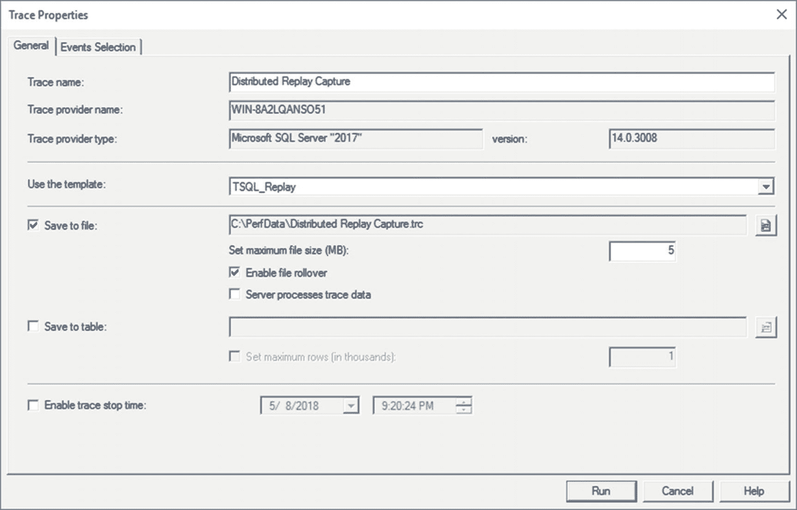

**图 26-1：分布式重放跟踪模板**

由于你需要一个用于 `分布式重放` 的文件，你希望将跟踪的输出保存到文件。无论如何，这是设置服务器端跟踪的最佳方式，因此这样很合适。你希望输出到一个有足够空间的位置。根据你的系统需要支持的事务数量，跟踪文件可能会非常大。此外，最好对文件大小设置限制，并允许它们循环覆盖，根据需要创建新文件。你将需要处理更多文件，但实际上，操作系统处理大量较小文件的写入比处理单个大文件更好。我发现这一点是真的，原因有二。首先，文件较小，循环覆盖更快，这意味着如果你需要将其加载到表中或复制到另一台服务器，前一个文件可供处理。其次，根据我的经验，对于简单的日志文件，写入通常需要更长时间，因为此类文件的大小会变得非常大。我还建议为跟踪过程定义停止时间；这同样有助于确保你不会填满指定用于存储跟踪数据的驱动器。

由于这是一个模板，事件和列已经为你选择好了。你可以通过单击“事件选择”选项卡来验证事件和列，以确保你获得的正是你需要的。图 26-2 显示了一些事件和列，所有这些都已为你预定义。


**图 26-2：TSQL_Replay 模板事件和列**

此模板是通用的，因此它包含完整的事件列表，包括所有游标事件。你可以通过单击框来取消选择事件进行编辑；但是，我建议除了游标事件外，不要删除任何其他内容（如果你要删除的话）。


## 开始跟踪与保存定义

我从连接测试服务器而非生产机器开始使用这个模板，因为一旦设置妥当，你必须通过点击**Run**来启动跟踪。我不会在生产系统上这么做。然而，在测试系统上，你可以观察屏幕以确保获取到预期的事件。它会显示事件，同时将其捕获到文件中。当你确认无误后，可以暂停跟踪。接着，点击**File**菜单，然后选择**Export ➤ Script Trace Definition**。最后，选择**For SQL Server 2005 – 2014**（参见图 26-3）。


图 26-3
用于输出跟踪定义的菜单选择

这个模板允许你将刚刚创建的跟踪保存为一个 T-SQL 文件。一旦你拥有了 T-SQL，就可以将其配置为在任何你喜欢的服务器上运行。文件路径需要被替换，并且你可以通过脚本内的参数重置停止时间。下面的脚本展示了用于设置服务器端跟踪事件的 T-SQL 过程的开头部分：

```sql
/****************************************************/
/* Created by: SQL Server 2017 Profiler          */
/* Date: 05/08/2018  08:27:40 PM         */
/****************************************************/
-- Create a Queue
declare @rc int
declare @TraceID int
declare @maxfilesize bigint
set @maxfilesize = 5
-- Please replace the text InsertFileNameHere, with an appropriate
-- filename prefixed by a path, e.g., c:\MyFolder\MyTrace. The .trc extension
-- will be appended to the filename automatically. If you are writing from
-- remote server to local drive, please use UNC path and make sure server has
-- write access to your network share
exec @rc = sp_trace_create @TraceID output, 0, N'InsertFileNameHere', @maxfilesize, NULL
if (@rc != 0) goto error
```

你可以编辑它显示 `InsertFileNameHere` 的地方来提供路径，并为 `@DateTime` 提供不同的值。此时，你的脚本就可以在任何 SQL Server 2017 服务器上运行了。你可能可以将相同的脚本一直回溯到 SQL Server 2008R2 上运行；自那时以来，跟踪事件的变化如此之少，以至于它现在已成为一个固定的标准。然而，为了安全起见，务必进行测试。

你收集的信息量实际上取决于你想运行何种测试。对于标准的性能测试，至少收集一个小时的信息可能是个好主意；然而，在大多数情况下，你不想捕获超过两到三小时的数据。此外，必须强调的是，跟踪事件不如扩展事件轻量级，因此你捕获数据的时间越长，对生产服务器的负面影响就越大。捕获更多数据将意味着需要管理更多的数据，也意味着你计划运行测试很长时间。这完全取决于你打算在测试中处理的业务和应用程序行为。

在捕获数据之前，你确实需要考虑将在哪里运行测试。假设你不担心磁盘空间，并且不需要保护法律上审计的数据（如果你有这些问题，需要单独解决）。如果你的数据库不在**Full Recovery**模式下，那么你就不能使用日志备份将其恢复到某个时间点。如果是这种情况，我强烈建议将数据库备份作为启动跟踪数据收集的一部分。原因是你需要数据库在开始记录事务时处于相同的状态。如果不是，你可能会遇到大量错误，这可能会严重影响你的性能测试运行方式。例如，尝试选择或修改不存在的数据会影响测试中测量的 I/O 和 CPU。如果你的数据库在或接近跟踪开始时保持相同的状态，那么你应该很少（如果有的话）遇到错误。

有了准备就绪的数据库副本和一组跟踪数据，你就可以运行分布式重放工具了。

## 用于数据库测试的分布式重放

假设你使用了分布式重放模板来捕获跟踪信息，你应该准备好开始处理文件了。如前所述，第一步是将跟踪文件转换为不同的格式，以便可以分配到多台客户端机器上进行重放。但这不仅仅是简单地对你的文件运行可执行文件。你还需要就希望分布式重放如何运行做出一些决定；这些决定是在你预处理跟踪文件时做出的。

这些决定相当直接。首先，你需要决定是随用户进程一起重放系统进程，还是不重放。除非你正在处理特定的系统问题，否则我建议将此值设置为 `No`。这也是默认值。其次，你需要决定如何处理空闲时间。你可以使用实际的调用数据库的频率值；或者，你可以输入一个以秒为单位的值，以将等待时间限制在不超过该值。这实际上取决于你将运行的重放类型。假设你使用**Synchronization**模式重放（最适合直接性能测量的模式），通过将值设置得较低（例如三到五秒）来消除空闲时间是个好主意。

如果你选择使用默认值，则无需修改配置文件。但如果你选择了包含系统调用或更改了空闲时间，那么你将需要更改配置文件 `DReplay.Exe.Preprocess.config`。这是一个简单的 XML 配置文件。我正在使用的那个看起来像这样：

```xml
<Preprocess>
  <ReplaySystemOptions>
    <CaptureSystemProcesses>No</CaptureSystemProcesses>
    <MaxIdleTime>5</MaxIdleTime>
  </ReplaySystemOptions>
</Preprocess>
```

我只做了一处更改，调整了 `MaxIdleTime` 以限制重放期间的任何停顿时间。

在运行预处理之前，请确保你已安装 `DRController` 并且 `DReplay` 服务正在你的系统上运行。如果是这样，你只需调用 `DReplay.exe` 来执行预处理。

```
dreplay preprocess –i c:\perfdata\dr.trc –d c:\DRProcess
```

在前面的代码中，你可以看到 `DReplay` 运行了预处理事件。输入文件由 `–i` 参数提供，用于保存输出的文件夹通过 `–d` 参数提供。跟踪文件将被处理，输出将进入指定的文件夹。输出将类似于图 26-4。

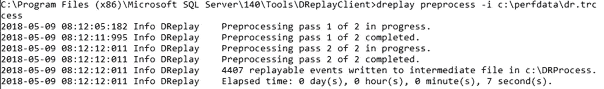

图 26-4
分布式重放预处理步骤的输出

预处理完成后，你就可以继续运行分布式重放过程了。但在这样做之前，你需要确保你已准备好一台或多台客户端系统。


### 配置客户端

客户端机器需要配置为与分布式重放控制器协同工作。首先将你的客户端安装到不同的机器上。仅为演示目的，我是在单台机器上运行所有组件；不过，如果你使用多台机器，设置过程也并无不同。你需要配置客户端使其与控制器协作，并且一个客户端一次只能与一个控制器工作。你还需要在系统上为两个项目预留空间。首先，需要一个位置存放每次重放时会被覆盖的工作文件。其次，如果你想从该客户端收集执行数据，还需要为客户端的跟踪文件输出预留空间。你还需要决定客户端进程的日志记录级别。所有这些都在另一个名为 `DReplayClient.config` 的 XML 配置文件中设置。以下是我的配置：

```
PerfTune
C:\DRClientWork\
C:\DRClientOutput\
CRITICAL
```

目录和日志记录级别很清晰。我还必须将客户端指向运行分布式重放服务的服务器。对于多个客户端工作，不需要其他设置；你只需要确保它们指向正确的控制器系统即可。

### 运行分布式测试

到目前为止，你已经配置好了一切并捕获了数据。接下来，你需要回到命令行，使用 `Dreplay.exe` 可执行文件来运行。大部分控制是通过配置文件完成的，因此可执行文件本身需要的输入很少。你使用以下命令调用测试：

```
Dreplay replay –d c:\data –w DOJO
```

你需要输入预处理输出的位置，这意味着你需要以逗号分隔的列表列出参与其中的客户端机器。执行的输出将类似于图 26-5。

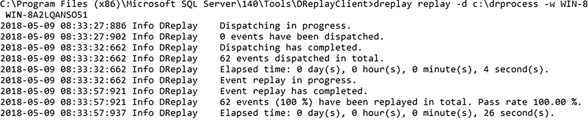

图 26-5：运行 `DReplay.exe` 的输出

如你所见，捕获了 62 个事件，并且全部 62 个事件都成功重放。另一方面，如果出现错误或事件失败，你可能需要查明关于失败原因可能存在的信息。此信息可在日志中找到。然后，只需重新配置测试并再次运行即可。拥有可重复测试过程的整个理念就在于你可以一遍又一遍地运行它。前面的例子代表了对我本地 AdventureWorks2017 副本进行的轻负载运行，捕获过程大约持续了五分钟。然而，我配置了空闲时间的限制，因此重放仅在 26 秒内完成。

从这里开始，你可以根据需要重新配置测试、重置数据库并反复运行测试。请注意，更改配置文件将需要重启相关服务，以确保更改在下一组测试中生效。处理测试的最佳方法之一是启用查询存储。你可以捕获一组结果，重置测试，对系统进行任何计划的更改，然后从第二次测试中捕获另一组结果。然后，你可以轻松查看回归查询、消耗资源最多的查询等的报告。

## 结论

通过包含分布式重放实用工具，SQL Server 现在使你能够对数据库进行负载和功能测试。你通过使用服务器端跟踪以简单的方式捕获代码来完成此操作。然而，如果你计划利用此功能，请务必验证你根据本书提出的原则对查询所做的更改是否确实有效，并将有助于改善系统的性能。你还应确保重置数据库，以尽可能避免错误。

# 27. 数据库工作负载优化

到目前为止，你已经了解了许多可能影响查询性能的方面、可用于分析查询性能的工具，以及可用于提高查询性能的优化技术。接下来，你将学习如何应用这些信息来分析、排查和优化数据库工作负载的性能。我将引导你完成一个调优过程，包括可能走过一两个弯路，所以请耐心跟随我们探索这个过程。

在本章中，我将涵盖以下主题：

*   数据库工作负载的特征
*   数据库工作负载优化涉及的步骤
*   如何识别工作负载中代价高昂的查询
*   如何测量代价高昂查询的基线资源使用和性能
*   如何分析影响代价高昂查询性能的因素
*   如何应用技术来优化代价高昂的查询
*   如何分析查询优化对整体工作负载的影响

## 工作负载优化基础

优化数据库工作负载通常符合 80/20 法则：80% 的工作负载消耗了大约 20% 的服务器资源。尝试优化大部分工作负载的性能通常效率不高。因此，工作负载优化的第一步是找到消耗 80% 服务器资源的那 20% 的工作负载。

优化工作负载需要一套工具来衡量工作负载不同部分的资源消耗和响应时间。正如你在第 4 章和第 5 章中所见，SQL Server 提供了一套工具和实用程序来分析数据库工作负载和单个查询的性能。

除了使用这些工具外，了解如何使用不同技术来优化工作负载也很重要。关于工作负载优化，需要记住的最重要一点是，并非每项优化技术都能保证解决每个性能问题。许多优化技术是针对特定的数据库应用程序设计和数据库环境的。因此，对于每项优化技术，你都需要在应用该技术之前和之后测量工作负载的每个部分（即每个单独查询）的性能。你可以使用第 26 章讨论的技术来实现这一点。

发现一项优化技术对工作负载的其他部分影响很小，甚至产生负面影响，从而损害工作负载的整体性能，这种情况并不少见。例如，为优化 `SELECT` 语句而添加的非聚集索引可能会损害修改索引列值的 `UPDATE` 语句的性能。`UPDATE` 语句除了更新数据行外，还必须更新索引行。然而，正如第 6 章所演示的，有时索引也能提高操作查询的性能。因此，提高特定查询的性能可能有益于或损害整体工作负载的性能。一如既往，你最好的行动方案是通过测试来验证任何假设。


## 工作负载优化步骤

优化数据库工作负载的过程遵循一系列特定的步骤。作为此过程的一部分，你将使用前面章节介绍的一组优化技术。由于每个性能问题都是新的挑战，你可以使用不同的优化技术组合来排查不同的性能问题。请记住，第一步始终是确保服务器配置良好并在可接受的限度内运行，这些限度在章节 2 和 3 中定义。

为了理解查询优化过程，你将使用一组查询来模拟一个示例工作负载。

查询调优的核心可以归结为几个步骤。

1.  确定要调优的查询。
2.  查看执行计划，了解资源使用情况和行为。
3.  修改查询或修改结构以提高性能。

大多数情况下，答案就是修改查询。简而言之，这就是进行查询调优所需的全部工作。然而，这假设了你对系统有很多了解，并且你已经查看了诸如统计信息之类的东西。当你第一次进行查询调优或在一个新系统上时，这个过程要详细得多。关于调优查询所需步骤的完整定义，以下是你需要做的。这些是你在优化示例工作负载时将遵循的优化步骤：

1.  捕获工作负载。
2.  分析工作负载。
3.  识别代价最高/调用最频繁/运行时间最长的查询。
4.  量化代价最高查询的基线资源使用情况。
5.  确定整体资源使用情况。
6.  汇编有关资源使用的详细信息。
7.  分析并优化外部因素。
8.  分析索引的使用情况。
9.  分析应用程序使用的批处理级别选项。
10. 分析统计信息的有效性。
11. 评估碎片整理的必要性。
12. 分析代价最高查询的内部行为。
13. 分析查询执行计划。
14. 识别执行计划中代价高昂的操作符。
15. 分析处理策略的有效性。
16. 优化代价最高的查询。
17. 分析更改对数据库工作负载的影响。
18. 迭代多个优化阶段。

如章节 1 所述，性能调优是一个迭代过程。因此，你应该多次迭代执行性能优化步骤，直到达到期望的应用程序性能目标。经过一段时间后，你将需要重复此过程，以解决数据和数据库更改对工作负载造成的影响。此外，随着时间的推移，当你发现自己在服务器上工作时，你可能会跳过许多之前的步骤，因为你已经验证了事务方法或统计信息维护或其他步骤。你不必严格遵循这个流程。它旨在作为一个指南。关于调优查询所需步骤的图形化表示，我建议你参考章节 1。

## 示例工作负载

为了排查 SQL Server 性能问题，你需要了解在服务器上执行的 SQL 工作负载。然后，你可以分析该工作负载以识别性能不佳的原因和适用的优化步骤。理想情况下，你应该捕获面临性能问题的 SQL Server 上的工作负载。在本章中，你将使用一组查询来模拟一个示例工作负载，以便你可以遵循上一节列出的优化步骤。你将使用的示例工作负载由良好和不良查询的组合构成。

## 注意

我建议你恢复 `AdventureWorks2017` 数据库的干净副本，以便完全删除先前章节遗留的任何工件。

简单的测试工作负载由以下一组示例存储过程模拟；你在 `AdventureWorks2017` 数据库上使用第二个脚本来执行它们：

```sql
USE AdventureWorks2017;
GO
CREATE OR ALTER PROCEDURE dbo.ShoppingCart @ShoppingCartId VARCHAR(50)
AS
--provides the output from the shopping cart including the line total
SELECT sci.Quantity,
p.ListPrice,
p.ListPrice * sci.Quantity AS LineTotal,
p.Name
FROM Sales.ShoppingCartItem AS sci
JOIN Production.Product AS p
ON sci.ProductID = p.ProductID
WHERE sci.ShoppingCartID = @ShoppingCartId;
GO
CREATE OR ALTER PROCEDURE dbo.ProductBySalesOrder @SalesOrderID INT
AS
/*provides a list of products from a particular sales order,
and provides line ordering by modified date but ordered
by product name*/
SELECT ROW_NUMBER() OVER (ORDER BY sod.ModifiedDate) AS LineNumber,
p.Name,
sod.LineTotal
FROM Sales.SalesOrderHeader AS soh
JOIN Sales.SalesOrderDetail AS sod
ON soh.SalesOrderID = sod.SalesOrderID
JOIN Production.Product AS p
ON sod.ProductID = p.ProductID
WHERE soh.SalesOrderID = @SalesOrderID
ORDER BY p.Name ASC;
GO
CREATE OR ALTER PROCEDURE dbo.PersonByFirstName @FirstName NVARCHAR(50)
AS
--gets anyone by first name from the Person table
SELECT p.BusinessEntityID,
p.Title,
p.LastName,
p.FirstName,
p.PersonType
FROM Person.Person AS p
WHERE p.FirstName = @FirstName;
GO
CREATE OR ALTER PROCEDURE dbo.ProductTransactionsSinceDate
@LatestDate DATETIME,
@ProductName NVARCHAR(50)
AS
--Gets the latest transaction against
--all products that have a transaction
SELECT p.Name,
th.ReferenceOrderID,
th.ReferenceOrderLineID,
th.TransactionType,
th.Quantity
FROM Production.Product AS p
JOIN Production.TransactionHistory AS th
ON p.ProductID = th.ProductID
AND th.TransactionID = (   SELECT TOP (1)
th2.TransactionID
FROM Production.TransactionHistory AS th2
WHERE th2.ProductID = p.ProductID
ORDER BY th2.TransactionID DESC)
WHERE th.TransactionDate > @LatestDate
AND p.Name LIKE @ProductName;
GO
CREATE OR ALTER PROCEDURE dbo.PurchaseOrderBySalesPersonName
@LastName NVARCHAR(50),
@VendorID INT = NULL
AS
SELECT poh.PurchaseOrderID,
poh.OrderDate,
pod.LineTotal,
p.Name AS ProductName,
e.JobTitle,
per.LastName + ', ' + per.FirstName AS SalesPerson,
poh.VendorID
FROM Purchasing.PurchaseOrderHeader AS poh
JOIN Purchasing.PurchaseOrderDetail AS pod
ON poh.PurchaseOrderID = pod.PurchaseOrderID
JOIN Production.Product AS p
ON pod.ProductID = p.ProductID
JOIN HumanResources.Employee AS e
ON poh.EmployeeID = e.BusinessEntityID
JOIN Person.Person AS per
ON e.BusinessEntityID = per.BusinessEntityID
WHERE per.LastName LIKE @LastName
AND poh.VendorID = COALESCE(@VendorID,
poh.VendorID)
ORDER BY per.LastName,
per.FirstName;
GO
CREATE OR ALTER PROCEDURE dbo.TotalSalesByProduct @ProductID INT
AS
--retrieve aggregation of sales based on a productid
SELECT SUM((isnull((sod.UnitPrice*((1.0)-sod.UnitPriceDiscount))*sod.OrderQty,(0.0)))) AS TotalSales,
AVG(sod.OrderQty) AS AverageQty,
AVG(sod.UnitPrice) AS AverageUnitPrice,
SUM(sod.LineTotal)
FROM Sales.SalesOrderDetail AS sod
WHERE sod.ProductID = @ProductID
GROUP BY sod.ProductID;
GO
```

请记住，这只是一个说明性示例，而不是字面上放置在服务器上的真实负载。实际的存储过程通常要复杂得多，但我们在设置模拟生产负载方面能投入的篇幅有限。有了这些存储过程，你可以使用以下脚本来执行它们：


```
EXEC dbo.PurchaseOrderBySalesPersonName @LastName = 'Hill%';
GO
EXEC dbo.ShoppingCart @ShoppingCartId = '20621';
GO
EXEC dbo.ProductBySalesOrder @SalesOrderID = 43867;
GO
EXEC dbo.PersonByFirstName @FirstName = 'Gretchen';
GO
EXEC dbo.ProductTransactionsSinceDate @LatestDate = '9/1/2004',
@ProductName = 'Hex Nut%';
GO
EXEC dbo.PurchaseOrderBySalesPersonName @LastName = 'Hill%',
@VendorID = 1496;
GO
EXEC dbo.TotalSalesByProduct @ProductID = 707;
GO
```

我知道我有点重复，但我想说清楚。这是一个极其简单的负载，只是用来演示这个过程。在一个典型的系统中，你会看到针对更广泛的存储过程集和即席查询的成百上千个额外调用。尽管如此简单，但这个示例负载包含了通常在 SQL Server 上执行的不同类型的查询。

*   使用聚合函数的查询
*   仅检索一行或少数几行的点查询
*   连接多个表的查询
*   检索狭窄行范围的查询
*   执行额外结果集处理的查询，例如提供排序输出

第一个优化步骤是捕获负载，意思是观察这些查询的执行情况，如下一节所述。

## 捕获负载

作为诊断数据收集步骤的一部分，您必须定义一个 Extended Events 会话来捕获数据库服务器上的负载。您可以使用第 6 章推荐的工具和方法来执行此操作。表 27-1 列出了可用于测量查询资源消耗情况的具体事件。

表 27-1 捕获有关高成本查询信息的事件

| 类别 | 事件 |
| --- | --- |
| 执行 | `rpc_completed` `sql_batch_completed` |

如第 6 章所述，对于生产数据库，建议将 Extended Events 会话的输出捕获到文件中。将输出捕获到文件有几个显著优势：

*   由于您打算在负载捕获后分析 SQL 查询，因此在捕获时无需显示 SQL 查询。
*   通过 SSMS 运行会话无法为跟踪过程提供灵活的时间控制。

让我们更详细地看看时间控制。假设您想在晚上 11 点开始捕获事件，并记录 24 小时的 SQL 负载。您可以使用 GUI 或 T-SQL 定义 Extended Events 会话。但是，您不必在准备好之前启动该过程。这意味着您可以使用 SQL Agent 或其他调度工具创建命令，通过 `ALTER EVENT SESSION` 命令来启动和停止该过程。

```sql
ALTER EVENT SESSION 
ON SERVER
STATE = ;
```

对于此示例，我在会话上设置了一个筛选器，以便仅捕获来自 AdventureWorks2017 数据库的事件。该文件将仅捕获针对该数据库的查询，从而减少我需要处理的信息量。这对于您的系统可能也是一个不错的选择。虽然 Extended Events 会话的成本可能非常低（特别是与较旧的跟踪事件相比），但它们并非免费。应始终应用良好的筛选以确保影响最小。

## 分析负载

一旦负载被捕获到文件中，您就可以通过使用 SSMS 浏览数据或将输出文件的内容导入数据库表来分析负载。

SSMS 提供了以下两种分析文件内容的方法，两者都相对简单：

*   *通过右键单击选择排序顺序或按特定列对数据列进行排序来对输出进行排序*：您可能希望从“详细信息”选项卡中选择列，并使用“在表中显示列”命令将其上移。之后，您就可以在该列上发出分组和排序命令。
*   *将输出重新排列为选择性列和事件列表*：您可以通过右键单击表格并从上下文菜单中选择“选择列”来更改 SSMS 显示的输出。这使您不仅可以挑选和选择列；还可以将它们组合成新列。

正如我在本书中展示的那样，当与 Extended Events 一起使用时，SSMS 中的实时数据资源管理器可用于构建基本的聚合。例如，如果您想按查询文本或对象 ID 分组，然后获取平均持续时间或执行次数计数，您是可以做到的。事实上，SSMS 是一种进行此类更简单聚合的方法。

另一方面，如果您想对负载进行深入分析，则必须将跟踪文件的内容导入数据库表。然后您可以创建更复杂的查询。会话的输出将大多数重要数据放入 XML 字段中，因此您需要在加载数据时查询它，如下所示：

```sql
DROP TABLE IF EXISTS dbo.ExEvents;
GO
WITH xEvents
AS (SELECT object_name AS xEventName,
CAST(event_data AS XML) AS xEventData
FROM sys.fn_xe_file_target_read_file('C:\PerfData\QueryPerfTuning2017*.xel',
NULL,
NULL,
NULL) )
SELECT xEventName,
xEventData.value('(/event/data[@name="duration"]/value)[1]',
'bigint') AS Duration,
xEventData.value('(/event/data[@name="physical_reads"]/value)[1]',
'bigint') AS PhysicalReads,
xEventData.value('(/event/data[@name="logical_reads"]/value)[1]',
'bigint') AS LogicalReads,
xEventData.value('(/event/data[@name="cpu_time"]/value)[1]',
'bigint') AS CpuTime,
CASE xEventName
WHEN 'sql_batch_completed' THEN
xEventData.value('(/event/data[@name="batch_text"]/value)[1]',
'varchar(max)')
WHEN 'rpc_completed' THEN
xEventData.value('(/event/data[@name="statement"]/value)[1]',
'varchar(max)')
END AS SQLText,
xEventData.value('(/event/data[@name="query_plan_hash"]/value)[1]',
'binary(8)') AS QueryPlanHash
INTO dbo.ExEvents
FROM xEvents;
```

您需要用您自己的路径和文件名替换 `<ExEventsFileName>`。一旦将内容放入表中，就可以使用 SQL 查询来分析负载。例如，要查找最慢的查询，您可以执行以下 SQL 查询：

```sql
SELECT  *
FROM    dbo.ExEvents AS ee
ORDER BY ee.Duration DESC;
```

前面的查询将显示成本最高的单个查询，这对于本章中运行的测试来说已经足够了。您可能也想在生产系统上运行类似的查询；但是，更可能的情况是您希望基于数据的聚合进行工作，如本例所示：

```sql
SELECT  ee.SQLText,
SUM(Duration) AS SumDuration,
AVG(Duration) AS AvgDuration,
COUNT(Duration) AS CountDuration
FROM    dbo.ExEvents AS ee
GROUP BY ee.SQLText;
```

执行此查询可以让您按您最感兴趣的字段排序——例如，按 `CountDuration` 排序以获取最常调用的存储过程，或按 `SumDuration` 排序以获取累计运行时间最长的存储过程。您需要一种方法来移除或替换参数和参数值。这对于仅基于存储过程名称或仅基于不带参数或参数值的查询文本进行聚合是必要的（因为这些会不断变化）。


## SQL 查询性能分析与优化

另一种机制是直接查询缓存，以查看其中代价最高的查询。这比设置扩展事件（Extended Events）更简单。此外，大多数时候你可能已经捕获到了大部分有问题的查询。因此，如果你是第一次开始对系统进行查询调优，你可能想跳过设置扩展事件来识别代价最高的查询。然而，我发现随着时间的推移，当你开始量化系统行为时，你将会需要扩展事件提供的那种详细数据。

我们已经在书中探讨过的另一种方法是使用查询存储（Query Store）来收集系统中查询行为的指标。它的优势是设置极其简单且易于查询，不涉及 XML。唯一的缺点是，如果你需要关于单个查询和存储过程调用的细粒度详细性能指标，那么你将再次发现自己需要调用扩展事件来满足对此类数据的需求。

简而言之，在如何整合这些信息方面，你有很多选择和灵活性。对于 SQL Server 2016 和 SQL Server 2017，你甚至可以开始使用 R 或 Python 进行数据分析，以增强呈现的信息。不过，就我们的目的而言，我将坚持使用我概述的第一种方法，即在 SSMS 中使用“实时数据”（Live Data）。

分析工作负载的目标是识别代价最高的查询（或通常意义上的高代价查询）；下一节将介绍如何做到这一点。

## 识别代价最高的查询

如前所述，你可以使用 SSMS 或查询技术，根据不同的标准识别高代价查询。可以按照`CPU`、`读取`或`写入`列对工作负载中的查询进行排序，以识别代价最高的查询，如第[3]章所述。你也可以使用聚合函数来得出累计成本以及单个成本。在生产系统中，了解累计运行时间最长、CPU 使用率最高或读写次数最多的存储过程，通常比仅仅识别单次数字最高的查询更有用。

因为即使是最繁忙的 OLTP 数据库，总读取次数通常也至少是总写入次数的七到八倍，所以按`读取`列排序查询通常比按`写入`列排序能识别出更多有问题的查询（但你应该总是在自己的系统上测试这一点）。同样值得查看的是那些执行时间最长的查询。如第[5]章所述，你可以使用性能监视器（Performance Monitor）捕获等待状态，并将其与特定查询一起查看，以帮助确定为什么某个查询运行时间长。你还可以使用扩展事件捕获特定查询的特定等待，并将其添加到你的计算中。每个系统都是不同的。通常，我首先处理调用最频繁的存储过程，然后是运行时间最长的，最后是读取次数最多的那些。当然，性能调优是一个迭代过程，因此你需要定期重新检查每个类别。

为了分析样本工作负载中性能最差的查询，你需要知道查询在持续时间或读取方面的代价有多高。由于这些值只有在查询执行完成后才能得知，因此你主要关注的是已完成的事件。（使用已完成事件进行性能分析的基本原理在第[6]章中有详细解释。）

为了展示目的，在 SSMS 中打开跟踪文件。图[27-1]显示了将几列移动到网格中，然后通过单击该列（单击两次以使排序从升序变为降序）选择按持续时间排序后捕获的跟踪输出。

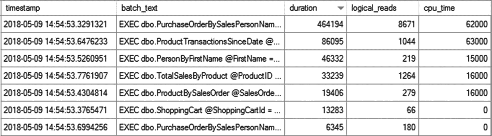

图 27-1

显示 SQL 工作负载的扩展事件会话输出

在持续时间方面性能最差的查询，在 CPU 使用率和读取方面也是最差的之一。该存储过程`dbo.PurchaseOrderBySalesPersonName`位于图[27-1]的顶部（你可能有不同的值，但此查询很可能是性能最差的查询，或者至少是示例查询中最差的之一）。

一旦你识别出性能最差的查询，下一个优化步骤是确定该查询消耗的资源。

### 确定代价最高查询的基线资源使用情况

在应用任何优化技术之前，性能最差查询的当前资源使用情况可以被视为一个基线数值。你可能会对该查询应用不同的优化技术，并可以将查询优化后的资源使用情况与基线数值进行比较，以确定给定优化技术的有效性。查询的资源使用情况可以从两个类别呈现。

*   整体资源使用情况

*   详细资源使用情况

### 整体资源使用情况

查询的整体资源使用情况提供了性能最差查询所消耗硬件资源的概要数据。你可以将优化后查询的资源使用情况与未优化查询的整体资源使用情况相比较，以确保你所应用的性能技术整体有效。

你可以从工作负载跟踪中确定查询的整体资源使用情况。你将使用该存储过程的第一次调用，因为它表现出最差的行为。表[27-2]显示了来自图[27-1]跟踪中该查询的整体使用情况。需要注意的一点是，表中的持续时间单位是毫秒，而图[27-1]中的值单位是微秒。在使用扩展事件时请记住这一点。

表 27-2

表示查询所用资源数量的数据列

| 数据列 | 值 | 描述 |
| --- | --- | --- |
| `LogicalReads` | 8671 | 查询执行的逻辑读取次数。如果在内存中找不到数据页，则对该页的逻辑读取将需要先从磁盘进行物理读取，以将该页获取到内存中。 |
|    `Writes` | 0 | 查询修改的页数。 |
|    `CPU` | 62ms | 查询使用 CPU 的时间长度。 |
|    `Duration` | 464.1ms | SQL Server 从编译到返回结果集处理此查询所花费的时间。 |

## 注意

在你的环境中，你可能有不同的前述数据列的数值。无论数据列的绝对值如何，跟踪这些值都很重要，以便你以后可以将它们与相应的值进行比较。

## 详细的资源使用分析

你可以分解查询的整体资源使用情况，以定位查询所访问的不同数据库对象上的瓶颈。这种详细的资源使用分析有助于你确定哪些操作是最有问题的。理解系统中的等待状态将帮助你识别需要重点关注的优化方向。一个粗略的经验法则可能是简单地查看执行时长；然而，执行时长可能受到许多因素（尤其是阻塞）的影响，因此它充其量只是一个不完美的衡量标准。在这种情况下，我将花费时间分析以下三个方面：CPU 使用率、读取次数和执行时长。读取次数是一个常用的性能衡量指标，但如同执行时长一样，孤立地看待它也可能存在问题。这就是为什么我更倾向于捕获多个值，并能够在查询的不同执行迭代之间进行比较。

正如你在第 6 章中所见，你可以从给定查询的 `STATISTICS IO` 输出中，获取该查询访问的各个表上执行的读取次数。你还可以设置 `STATISTICS TIME` 选项来获取查询的基本执行时间和 CPU 时间，包括其编译时间。你可以通过重新执行查询并使用以下 `SET` 语句（或在查询窗口中选中“设置统计信息 IO”复选框）来获取此输出：

```sql
ALTER DATABASE SCOPED CONFIGURATION CLEAR PROCEDURE_CACHE;
DBCC DROPCLEANBUFFERS;
GO
SET STATISTICS TIME ON;
GO
SET STATISTICS IO ON;
GO
EXEC dbo.PurchaseOrderBySalesPersonName @LastName = 'Hill%';
GO
SET STATISTICS TIME OFF;
GO
SET STATISTICS IO OFF;
GO
```

为了模拟图 27-1 中所示的首次运行情况，请使用 `DBCC DROPCLEANBUFFERS` 清除内存中存储的数据（**切勿**在生产系统上运行），并使用数据库作用域配置命令 `CLEAR PROCEDURE_CACHE` 从指定数据库的缓存中移除查询（**同样切勿**在生产系统上运行）。

性能最差查询的 `STATISTICS` 输出如下所示：

```text
DBCC execution completed. If DBCC printed error messages, contact your system administrator.
SQL Server parse and compile time:
CPU time = 0 ms, elapsed time = 0 ms.
SQL Server Execution Times:
CPU time = 0 ms,  elapsed time = 0 ms.
SQL Server parse and compile time:
CPU time = 0 ms, elapsed time = 0 ms.
SQL Server parse and compile time:
CPU time = 31 ms, elapsed time = 40 ms.
(1496 rows affected)
Table 'Employee'. Scan count 0, logical reads 2992, physical reads 2, read-ahead reads 0, lob logical reads 0, lob physical reads 0, lob read-ahead reads 0.
Table 'Product'. Scan count 0, logical reads 2992, physical reads 4, read-ahead reads 0, lob logical reads 0, lob physical reads 0, lob read-ahead reads 0.
Table 'PurchaseOrderDetail'. Scan count 763, logical reads 1539, physical reads 9, read-ahead reads 0, lob logical reads 0, lob physical reads 0, lob read-ahead reads 0.
Table 'Worktable'. Scan count 0, logical reads 0, physical reads 0, read-ahead reads 0, lob logical reads 0, lob physical reads 0, lob read-ahead reads 0.
Table 'Workfile'. Scan count 0, logical reads 0, physical reads 0, read-ahead reads 0, lob logical reads 0, lob physical reads 0, lob read-ahead reads 0.
Table 'PurchaseOrderHeader'. Scan count 1, logical reads 44, physical reads 1, read-ahead reads 42, lob logical reads 0, lob physical reads 0, lob read-ahead reads 0.
Table 'Person'. Scan count 1, logical reads 4, physical reads 1, read-ahead reads 2, lob logical reads 0, lob physical reads 0, lob read-ahead reads 0.
SQL Server Execution Times:
CPU time = 15 ms,  elapsed time = 93 ms.
SQL Server Execution Times:
CPU time = 46 ms,  elapsed time = 133 ms.
SQL Server parse and compile time:
CPU time = 0 ms, elapsed time = 0 ms.
```

值得一提的一个警告是，返回这些信息连同数据本身会带来一些开销，并且会影响一些性能指标，包括查询的执行时长衡量。对于我们大多数人来说，大多数情况下这不是问题，但有时它会明显引起问题。需要注意的是，通过这种方式捕获信息，你是在做出一个选择。

表 27-3 总结了 `STATISTICS IO` 的输出。

**表 27-3** 分解 STATISTICS IO 的输出

| 表 (Table) | 逻辑读取 (Logical Reads) |
| :--------- | :----------------------- |
| `Person.Employee` | 2,992 |
| `Production.Product` | 2,992 |
| `Purchasing.PurchaseOrderDetail` | 1,539 |
| `Purchasing.PurchaseOrderHeader` | 44 |
| `Person.Person` | 4 |

通常，查询中引用的各个表的读取次数总和，会小于该查询执行的总读取次数。这是因为需要读取额外的页来访问内部数据库对象，例如 `sysobjects`、`syscolumns` 和 `sysindexes`。

表 27-4 总结了 `STATISTICS TIME` 的输出。

**表 27-4** 分解 STATISTICS TIME 的输出

| 事件 (Event) | 时长 (Duration) | CPU 时间 |
| :----------- | :-------------- | :------- |
| `编译 (Compile)` | 40 ms | 31 ms |
| `执行 (Execution)` | 93 ms | 15 ms |
| `完成 (Completion)` | 133 ms | 46 ms |

不要将逻辑读取与执行时间孤立地使用。在确定性能不佳的查询时，你需要综合考虑所有衡量指标。反之，也不要假设执行时间是完美的衡量标准。资源争用对执行时间有很大影响，因此你会看到这个指标存在一些波动。同时使用这两个值，但要充分理解，孤立地看任何一个都可能无法准确反映现实情况。

你还可以为这些详细信息添加额外的指标。正如我在第 2-4 章概述的，等待统计信息是理解系统状况的重要衡量标准。这对查询同样适用。在 SQL Server 2016 及更新版本中，当你捕获实际执行计划时，可以看到超过 1 毫秒的等待。该信息位于查询执行计划中 `SELECT` 操作符的属性里。你还可以使用扩展事件来捕获给定查询的等待统计信息，这将显示所有的等待，而不仅仅是那些超过 1 毫秒的等待。这些对于衡量查询性能的详细指标来说，是有用的补充。

一旦识别出性能最差的查询并测量了其资源使用情况，下一个优化步骤就是确定影响查询性能的因素。然而，在此之前，你应该检查是否存在查询外部的因素可能导致了这种不佳的性能。

## 分析和优化外部因素

除了查询设计和索引等因素外，外部因素也会影响查询性能。因此，在深入研究查询的执行计划之前，你应该分析并优化可能影响查询性能的主要外部因素。以下是一些外部因素：

*   应用程序使用的连接选项
*   查询所访问的数据库对象的统计信息
*   查询所访问的数据库对象的碎片情况


### 分析应用程序使用的连接选项

在与 SQL Server 建立连接时，各种选项（如 `ANSI_NULL` 或 `CONCAT_NULL_YIELDS_NULL`）可以设置为与服务器或数据库默认值不同的值。但是，按连接更改这些设置可能导致存储过程重新编译，从而引起性能下降。此外，某些选项（例如 `ARITHABORT`）在处理索引视图和某些其他特殊索引时必须设置为 `ON`。如果未这样设置，可能会导致性能低下，甚至代码出错。例如，将 `ANSI_WARNINGS` 设置为 `OFF` 会导致优化器在生成执行计划时忽略索引视图和索引计算列。您可以再次查看执行计划的属性以获取此信息。创建执行计划时，ANSI 设置会随计划一起存储。因此，如果您查询缓存以查看计划，并从查询存储、扩展事件或 SSMS 捕获的计划中检索它，您将看到计划编译时的 ANSI 设置。此外，如果调用相同的查询而 ANSI 设置与当前缓存中的不同，则将编译一个新计划（并与另一个计划一起存储在查询存储中）。这些属性位于 `SELECT` 运算符中，如图 27-2 所示。

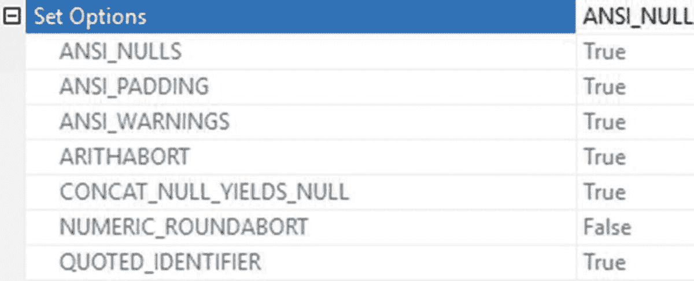

图 27-2

显示“设置选项”属性的执行计划属性

我建议使用 ANSI 标准设置，即将以下选项设置为 `TRUE`：`ANSI_NULLS`、`ANSI_NULL_DFLT_ON`、`ANSI_PADDING`、`ANSI_WARNINGS`、`CURS0R_CLOSE_ON_COMMIT`、`IMPLICIT_TRANSACTIONS` 和 `QUOTED_IDENTIFIER`。您可以使用单个命令 `SET ANSI_DEFAULTS ON` 将它们全部同时设置为 `TRUE`。查询 `sys.query_context_settings` 也是查看跨工作负载所用设置历史记录的有效方法。

### 分析统计信息的有效性

查询中引用的数据库对象的统计信息是查询优化器用于决定特定执行计划的关键信息之一。如第 13 章所述，优化器基于查询中引用对象的统计信息来生成查询的执行计划。统计信息所建议的行数是驱动优化器的成本估算过程的主要部分。通过这种方式，它确定了查询的处理策略。如果数据库对象的统计信息不准确，则优化器可能会为查询生成低效的执行计划。可能会出现几个问题：可能完全缺乏统计信息（因为禁用了 `auto_create` 统计信息）、统计信息过时（因为未启用自动更新）、统计信息陈旧（因为统计信息已超过时限），或者由于数据分布或采样大小问题导致统计信息不准确。

如第 13 章所述，您可以使用 `DBCC SHOW_STATISTICS` 或 `sys.dm_db_stats_properties` 和 `sys.dm_db_stats_histogram` 来检查表及其索引的统计信息。此查询中引用了五个表：`Purchasing.PurchaseOrderHeader`、`Purchasing.PurchaseOrderDetail`、`Person.Employee`、`Person.Person` 和 `Production.Product`。您必须知道查询使用了哪些索引，才能获取有关它们的统计信息。您可以在查看执行计划时确定这一点。具体来说，您现在可以查看执行计划，以获取优化器在构建执行计划时使用的具体统计信息。与许多其他有趣的信息一样，这些信息存储在 `SELECT` 运算符中，如图 27-3 所示。

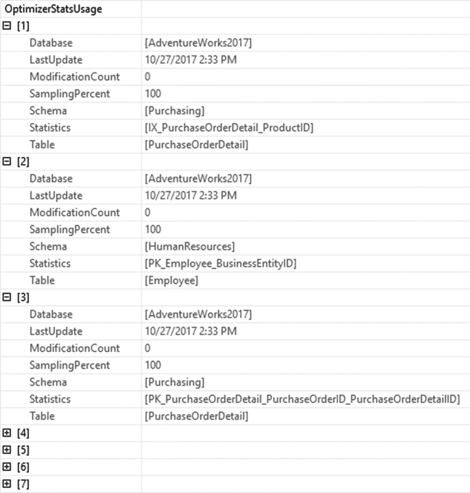

图 27-3

优化器为正在探索的查询创建执行计划时所使用的统计信息

虽然只有五个表，但您可以看到生成计划时使用了七个统计信息对象。如您所见，`PurchaseOrderDetail` 表中使用了多个对象。您可能会看到来自任何给定表的几个不同的统计信息在使用中。这是轻松识别您需要确定其效率的统计信息的好方法。

现在，我将检查 `HumanResources`.`Employee` 表主键上的统计信息，因为它的读取次数最多。现在运行以下查询：

```
DBCC SHOW_STATISTICS('HumanResources.Employee', 'PK_Employee_BusinessEntityID');
```

当上述查询完成后，您将看到如图 27-4 所示的输出。

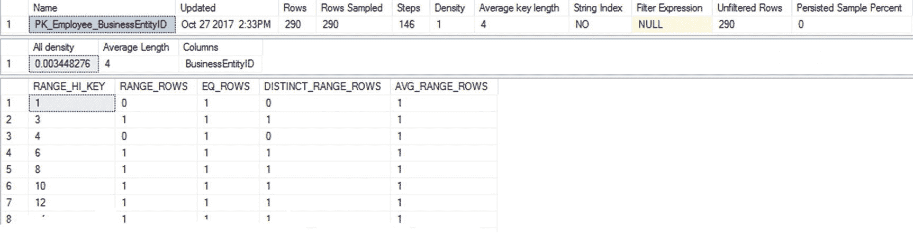

图 27-4

HumanResources.Employee 的 SHOW_STATISTICS 输出

您可以看到索引的选择性非常高，因为密度相当低，如 `All density` 列所示。您可以看到这些统计信息扫描了所有行，并且分布在 146 个步骤中。在这种情况下，统计信息不太可能是导致此查询性能不佳的原因。在可能的情况下，查看实际执行计划并比较估计行数与实际行数可能是个好主意。您还可以检查 `Updated` 列以确定上次更新此组统计信息的时间。如果统计信息已超过几天未更新，那么您需要检查统计信息维护计划，并且应该手动更新这些统计信息。当然，这取决于您数据库中数据更改的频率。在本例中，考虑到提供的数据，这些统计信息可能已经严重过时（然而，由于这是一个未更新的示例数据库，实际上并未过时）。


### 分析碎片整理的必要性

正如第 14 章所解释的，碎片化的表会增加执行扫描的查询需要访问的页面数量，从而对性能产生不利影响。然而，对于点查询来说，碎片通常不是问题。如果你看到大量扫描操作，你应该确保查询中引用的数据库对象没有过度碎片化。

你可以通过查询 `sys.dm_db_index_physical_stats` 来确定性能最差的查询所访问的五张表的碎片情况。首先，对 `HumanResources.Employee` 表运行查询。

```sql
SELECT s.avg_fragmentation_in_percent,
s.fragment_count,
s.page_count,
s.avg_page_space_used_in_percent,
s.record_count,
s.avg_record_size_in_bytes,
s.index_id
FROM sys.dm_db_index_physical_stats(DB_ID('AdventureWorks2017'),
OBJECT_ID(N'HumanResources.Employee'),
NULL,
NULL,
'Sampled') AS s
WHERE s.record_count > 0
ORDER BY s.index_id;
```

图 27-5 显示了此查询的输出。

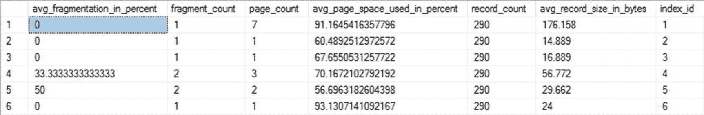

图 27-5
HumanResources.Employee 表的索引碎片情况

如果你对其余四张表运行相同的查询（顺序为 `Purchasing.PurchaseOrderHeader`、`Purchasing.PurchaseOrderDetail`、`Production.Product` 和 `Person.Person`），输出将如图 27-6 所示。


图 27-6
问题查询中四张表的索引碎片情况

所有索引的碎片都非常低，并且它们使用的空间都非常高。这意味着它们中的任何一个都不太可能对性能产生负面影响。如果你再考虑到这里的大多数索引都少于 100 个页面，这使得它们成为非常小的索引，即使它们有碎片，其影响查询的程度也必定是微乎其微的。事实上，碎片化太经常被当作一种拐杖，试图在不费力识别系统中实际问题（通常是查询的内部行为）的情况下去改善性能。

值得注意的是，有一个索引有 301,696 行，而其他索引只有 19,972 行。如果你查一下，会发现它是一个 XML 索引，所以差异在于 XML 树。它在这些查询中未被使用，因此我们在此忽略它。

一旦你分析了可能影响查询性能的外部因素并解决了非最优的部分，你就应该分析内部因素，例如不当的索引和查询设计。

## 分析代价最高查询的内部行为

现在你需要分析优化器为查询选择的执行策略，以确定影响查询性能的内部因素。分析可能影响查询性能的内部因素涉及以下步骤：

- 分析查询执行计划
- 识别执行计划中代价最高的步骤
- 分析处理策略的有效性

### 分析查询执行计划

要查看执行计划，请单击“显示实际执行计划”按钮将其启用，然后运行存储过程。确保你在非生产系统上进行此类测试，同时，尽可能让它像生产环境一样，以便那里的行为能反映你在生产环境中看到的情况。我们在第 16 章介绍了执行计划。关于阅读执行计划的更多细节，请查阅我的书《SQL Server 执行计划》（Red Gate Publishing, 2018）。图 27-7 显示了性能最差的查询的图形化执行计划。


图 27-7
性能最差查询的实际执行计划

这个计划的图形有点难以阅读。如果你没有跟着代码走，我会分解一些有趣的细节。你可以从这个执行计划中观察到以下内容：

- `SELECT` 属性
    - `Optimization Level: Full`
    - `Reason for Early Termination: Good enough plan found`
    - 查询时间统计：30ms CPU 时间 和 244 ms 已用时间
    - 等待统计：WaitCount 4, WaitTimeMs 214, WaitType `ASYNC_NETWORK_IO`
- 数据访问
    - 在非聚集索引 `Person.IX_Person_LastName_FirstName_MiddleName` 上进行索引查找
    - 在 `PurchaseOrderHeader.PK_PruchaseOrderHeader_PurchaseOrderID` 上进行聚集索引扫描
    - 在 `PurchaseOrderDetail.PK_PurchaseOrderDetail_PurchaseOrderDetailID` 上进行聚集索引查找
    - 在 `Product.PK_Product_ProductID` 上进行聚集索引查找
    - 在 `Employee.PK_Employee_BusinessEntityID` 上进行聚集索引查找
- 连接策略
    - 在常量扫描和 `Person.Person` 表之间进行嵌套循环连接，其中 `Person.Person` 表作为外部表
    - 在上一个连接的输出和 `Purchasing.PurchaseOrderHeader` 之间进行嵌套循环连接，其中 `Purchasing.PurchaseOrderHeader` 表作为外部表
    - 在上一个连接的输出和 `Purchasing.PurchaseOrderDetail` 表之间进行嵌套循环连接，`Purchasing.PurchaseOrderDetail` 表也是外部表
    - 在上一个连接的输出和 `Production.Product` 表之间进行嵌套循环连接，其中 `Production.Product` 作为外部表
    - 在上一个连接和 `HumanResources.Employee` 表之间进行嵌套循环连接，其中 `HumanResource.Employee` 表作为外部表
- 附加处理
    - 常量扫描，为 `@LastName` 变量的 `LIKE` 操作提供占位符
    - 计算标量，定义了 `@LastName` 变量 `LIKE` 操作的结构，显示范围的上限和下限以及要检查的值
    - 计算标量，将 `FirstName` 和 `LastName` 列组合成一个新列
    - 计算标量，从 `Purchasing.PurchaseOrderDetail` 表计算 `LineTotal` 列
    - 计算标量，获取计算出的 `LineTotal` 并将其作为永久值存储在结果集中以供进一步处理

所有这些信息都可以通过浏览图形化执行计划属性表中公开的操作符的详细信息获得。

### 识别执行计划中代价最高的步骤

一旦你理解了查询的执行计划，下一步就是识别执行计划中估计为代价最高的步骤。尽管这些成本是估计值，并且无论如何都不能反映现实，但它们是你将收到的用于衡量计划功能的唯一数字，因此识别、理解并可能解决代价最高的操作可以带来巨大的性能收益。你可以看到以下是两个代价最高的步骤：

- `Costly step 1`：在 `Purchasing.PurchaseOrderHeader` 表上的聚集索引扫描占 36%。
- `Costly step 2`：哈希匹配连接操作占 32%。

接下来的优化步骤是分析这些代价最高的步骤，以确定是否可以通过重新设计查询或索引等技术来优化这些步骤。


## 分析处理策略

虽然优化器已经完成了计划的优化（这一点你可以通过优化过程提前终止的原因是"找到足够好的计划"得知，或者因为它显示了`FULL`优化而没有提前终止的原因），但这并不意味着查询和结构中没有优化空间。你可以按照传统步骤开始对其进行评估。

高成本步骤 1 是聚集索引扫描。扫描不一定是个问题。它们只是表明，对相关对象（本例中是整个表）进行全表扫描，比检索查询所需信息的替代方案成本更低。

高成本步骤 2 是查询的哈希匹配连接操作。这同样不一定是个问题。但是，有时哈希匹配是索引缺失或索引设计不良的迹象，或者是无法利用现有索引的查询的迹象，因此它们通常是一个需要处理的区域。至少，在 OLTP 系统中经常是这种情况。对于大型数据仓库系统，哈希匹配可能是处理你在其中会看到的查询类型的理想选择。

### 提示

有时你可能会发现无法对处理策略中成本最高的步骤进行任何改进。在这种情况下，请专注于下一个成本最高的步骤以识别问题。如果没有任何步骤显示出优化的迹象，那么你可能需要考虑更改数据库设计或查询结构。

## 优化成本最高的查询

一旦你诊断出具有高成本步骤的查询，下一个阶段就是实施必要的修正以降低这些步骤的成本。

对于有问题的步骤，纠正措施可能有一种或多种替代解决方案。例如，是创建一个新索引还是以不同的方式构造查询？在这种情况下，你应该根据预期效果和所需工作量对解决方案进行优先级排序。例如，如果一个窄索引或多或少能完成工作，那么通常应优先选择它，而不是可能导致业务测试的代码更改。更改代码也可能是侵入性较小的方法。你需要根据所处理的业务和应用情况评估每种情况。

按预期收益的顺序单独应用解决方案，并衡量它们各自对查询性能的影响。最后，你可以应用能带来最大性能提升的解决方案（或多个解决方案）来纠正有问题的步骤。有时，很明显最佳解决方案会损害工作负载中的其他查询。例如，在大量列上创建新索引可能会损害操作查询的性能。然而，由于这并非总是问题，最好通过测试来确定此类优化技术对完整工作负载的影响。如果某个特定解决方案损害了工作负载的整体性能，请选择次优解决方案，同时密切关注工作负载的整体性能。

### 修改代码

查询中成本最高的操作是对`PurchaseOrderHeader`表的聚集索引扫描。你需要做的第一件事是理解聚集索引扫描对于查询和返回的数据是否是必要的，或者它是否可能由于代码引起，甚至是由于另一个索引或不同的索引结构可以更好地工作。要开始理解为什么会发生聚集索引扫描，你应该查看扫描操作的属性。既然发生了扫描，你还需要查看代码以确保它是可使用索引搜索参数（sargable）的。具体来说，你关注的是`Predicate`属性，如图 27-8 所示。


图 27-8 聚集索引扫描的谓词

这是一个计算。`PurchaseOrderTable`表的`VendorID`列上有一个现有索引，可能对这个查询有用，但是因为你使用了`COALESCE`语句来筛选值，所以必须扫描整个表才能检索到信息。`COALESCE`运算符基本上是一种考虑给定值可能为`NULL`的方法，如果为`NULL`，则提供一个替代值，甚至可能是多个替代值。然而，它是一个函数，在`WHERE`子句、`JOIN`条件或`HAVING`子句中对列使用函数可能会导致扫描，因此你需要移除这个函数。因为这个函数，你不能简单地添加或修改索引，因为你最终仍然会得到扫描。你可以尝试使用`OR`子句重写查询，像这样：

```sql
...WHERE   per.LastName LIKE @LastName AND
poh.VendorID = @VendorID
OR poh.VendorID = poh.VendorID…
```

但从逻辑上讲，这与`COALESCE`操作并不相同。相反，它是用`WHERE`子句的另一部分替代一部分，而不仅仅是使用`OR`结构。因此，你可以像这样重写整个存储过程定义：

```sql
CREATE OR ALTER PROCEDURE dbo.PurchaseOrderBySalesPersonName
@LastName NVARCHAR(50),
@VendorID INT = NULL
AS
IF @VendorID IS NULL
BEGIN
SELECT poh.PurchaseOrderID,
poh.OrderDate,
pod.LineTotal,
p.Name AS ProductName,
e.JobTitle,
per.LastName + ', ' + per.FirstName AS SalesPerson,
poh.VendorID
FROM Purchasing.PurchaseOrderHeader AS poh
JOIN Purchasing.PurchaseOrderDetail AS pod
ON poh.PurchaseOrderID = pod.PurchaseOrderID
JOIN Production.Product AS p
ON pod.ProductID = p.ProductID
JOIN HumanResources.Employee AS e
ON poh.EmployeeID = e.BusinessEntityID
JOIN Person.Person AS per
ON e.BusinessEntityID = per.BusinessEntityID
WHERE per.LastName LIKE @LastName
ORDER BY per.LastName,
per.FirstName;
END
ELSE
BEGIN
SELECT poh.PurchaseOrderID,
poh.OrderDate,
pod.LineTotal,
p.Name AS ProductName,
e.JobTitle,
per.LastName + ', ' + per.FirstName AS SalesPerson,
poh.VendorID
FROM Purchasing.PurchaseOrderHeader AS poh
JOIN Purchasing.PurchaseOrderDetail AS pod
ON poh.PurchaseOrderID = pod.PurchaseOrderID
JOIN Production.Product AS p
ON pod.ProductID = p.ProductID
JOIN HumanResources.Employee AS e
ON poh.EmployeeID = e.BusinessEntityID
JOIN Person.Person AS per
ON e.BusinessEntityID = per.BusinessEntityID
WHERE per.LastName LIKE @LastName
AND poh.VendorID = @VendorID
ORDER BY per.LastName,
per.FirstName;
END
GO
```

使用`IF`结构将查询一分为二。使用相同的参数集运行，执行时间从 434 毫秒变为 128 毫秒（在扩展事件中测量），这是一个相当显著的改进。读取次数从 8,671 次增加到 9,243 次。虽然执行时间大幅下降，但读取次数略有增加。执行计划当然不同了，如图 27-9 所示。

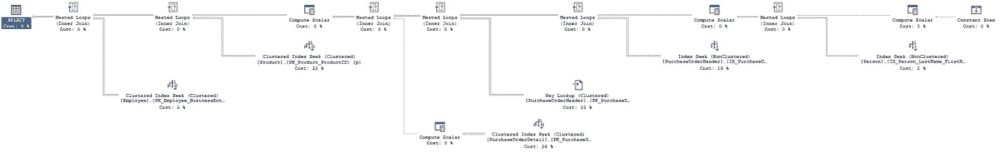

图 27-9 拆分查询后的新执行计划

现在，两个成本最高的运算符不同了。不再有扫描操作，所有的连接操作现在都是循环连接。但是，添加了一个新的数据访问操作。你现在看到了一个`Key Lookup`（键查找）操作，如第 12 章所述，因此你还有更多的调优机会。


### 修复键查找操作

既然你已经确定存在键查找操作，就需要判断是否能够应用第 12 章中建议的任何解决方法。首先，你需要知道该操作中检索了哪些列。这意味着需要访问 `Key Lookup` 算子的属性。属性显示了 `VendorID` 和 `OrderDate` 列。这意味着你只需通过非聚集索引的 `INCLUDE` 部分，将这些列添加到索引的叶级页面中即可。你可以如下修改该索引：

```sql
CREATE NONCLUSTERED INDEX IX_PurchaseOrderHeader_EmployeeID
ON Purchasing.PurchaseOrderHeader
(
EmployeeID ASC
)
INCLUDE
(
VendorID,
OrderDate
)
WITH DROP_EXISTING;
```

应用此索引后，执行计划发生了变化，性能也得到了修改。之前的结构和代码导致耗时 `128ms`。使用这个新索引后，查询执行时间下降到 `110ms`，读取次数也下降到 `7748`。现在的执行计划完全不同，如图 27-10 所示。


图 27-10
修改索引后的新执行计划

此时，执行计划中只剩下嵌套循环连接和索引查找操作。尽管查询中有 `ORDER BY` 语句，但甚至不再有排序操作。这是因为对 `Person` 表的索引查找输出是 `有序` 的，其余操作都维持了该顺序。简而言之，对于这个查询，你的状况已经相当好了，但现在存储过程中有两个查询。

### 调整第二个查询

消除 `COALESCE` 使你能够使用现有的索引，但这样做实际上为你的查询创建了两条路径。因为你只使用了单个参数，所以目前只探索了第一条路径，一直忽略了第二个查询。现在我们来修改测试脚本，看看查询的第二条路径将如何工作。

```sql
EXEC dbo.PurchaseOrderBySalesPersonName @LastName = 'Hill%',
@VendorID = 1496;
```

运行此查询会产生一个完全不同的执行计划。你可以在图 27-11 中看到最有趣的部分。

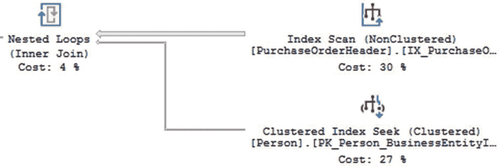

图 27-11
存储过程中另一个查询的执行计划

这个新查询由于查询条件的不同而表现出不同的行为。这里的主要问题是对 `PurchaseOrderHeader` 表的聚集索引扫描。尽管 `VendorID` 上有索引，但你看到的仍然是扫描操作。同样，你可以查看该算子的输出包含哪些内容。这次不止两列：`OrderDate`、`EmployeeID`、`PurchaseOrderID`。这些列虽然不算很大，但会增加索引的大小。你需要评估，索引大小的增加是否值得以换取消除索引扫描带来的性能收益。我打算通过如下修改索引来尝试一下：

```sql
CREATE NONCLUSTERED INDEX IX_PurchaseOrderHeader_VendorID
ON Purchasing.PurchaseOrderHeader
(
VendorID ASC
)
INCLUDE
(
OrderDate,
EmployeeID,
PurchaseOrderID
)
WITH DROP_EXISTING;
GO
```

应用索引前，执行时间约为 `4.3ms`，读取次数为 `273`。应用索引后，执行时间下降到 `2.3ms`，读取次数为 `263`。现在的执行计划如图 27-12 所示。


图 27-12
修改索引后的第二个执行计划

新的执行计划由索引查找和嵌套循环连接组成。其中有一个排序算子（计划中代价第二高的操作），按 `LastName` 和 `FirstName` 对数据进行排序。让检索过程来处理排序可能有助于提高性能，但到目前为止，我已经取得了相当成功的优化效果，因此暂时保持原样。

对于拆分查询，还有一点需要考虑。当查询优化器处理此类查询时，两条语句都将针对传入的参数值进行优化。因此，你可能会看到糟糕的执行计划，特别是对于使用 `VendorID` 进行过滤的第二个查询，这可能是由于不良的参数探测造成的。为避免这种情况，应进行一次额外的优化工作。

### 创建包装存储过程

因为你在存储过程中创建了两条路径以适应不同的数据查询机制，所以有可能遇到不良的参数探测问题，因为无论传入什么参数，两条路径都会被编译。解决此问题的一种机制是将你现有的存储过程包装进一个包装过程中。但首先，你需要创建两个新的存储过程，每个查询一个，如下所示：

```sql
CREATE OR ALTER PROCEDURE dbo.PurchaseOrderByLastName
@LastName NVARCHAR(50)
AS
SELECT poh.PurchaseOrderID,
       poh.OrderDate,
       pod.LineTotal,
       p.Name AS ProductName,
       e.JobTitle,
       per.LastName + ', ' + per.FirstName AS SalesPerson,
       poh.VendorID
FROM   Purchasing.PurchaseOrderHeader AS poh
       JOIN Purchasing.PurchaseOrderDetail AS pod
            ON  poh.PurchaseOrderID = pod.PurchaseOrderID
       JOIN Production.Product AS p
            ON  pod.ProductID = p.ProductID
       JOIN HumanResources.Employee AS e
            ON  poh.EmployeeID = e.BusinessEntityID
       JOIN Person.Person AS per
            ON  e.BusinessEntityID = per.BusinessEntityID
WHERE  per.LastName LIKE @LastName
ORDER BY per.LastName,
         per.FirstName;
GO

CREATE OR ALTER PROCEDURE dbo.PurchaseOrderByLastNameVendor
@LastName NVARCHAR(50),
@VendorID INT
AS
SELECT poh.PurchaseOrderID,
       poh.OrderDate,
       pod.LineTotal,
       p.Name AS ProductName,
       e.JobTitle,
       per.LastName + ', ' + per.FirstName AS SalesPerson,
       poh.VendorID
FROM   Purchasing.PurchaseOrderHeader AS poh
       JOIN Purchasing.PurchaseOrderDetail AS pod
            ON  poh.PurchaseOrderID = pod.PurchaseOrderID
       JOIN Production.Product AS p
            ON  pod.ProductID = p.ProductID
       JOIN HumanResources.Employee AS e
            ON  poh.EmployeeID = e.BusinessEntityID
       JOIN Person.Person AS per
            ON  e.BusinessEntityID = per.BusinessEntityID
WHERE  per.LastName LIKE @LastName
       AND poh.VendorID = @VendorID
ORDER BY per.LastName,
         per.FirstName;
GO
```

然后，你需要修改现有的存储过程，使其如下所示：

```sql
CREATE OR ALTER PROCEDURE dbo.PurchaseOrderBySalesPersonName
@LastName NVARCHAR(50),
@VendorID INT = NULL
AS
IF @VendorID IS NULL
BEGIN
    EXEC dbo.PurchaseOrderByLastName @LastName;
END
ELSE
BEGIN
    EXEC dbo.PurchaseOrderByLastNameVendor @LastName, @VendorID;
END
GO
```

这样设置后，无论选择哪条代码路径，每次首次调用这些查询时，每个存储过程都将获得自己唯一的执行计划，从而避免了不良的参数探测。而且，这不会对执行时间产生负面影响。如果我现在运行这两个查询，结果大致相同。这种模式对于路径数量较少的情况非常有效。如果你的路径数量非常庞大，比如超过 10 条左右，这种模式就会失效，你可能需要考虑动态执行方法。

根据新的查询，执行时间从 `434ms` 降低到 `110ms` 或 `2.3ms`，这是一个相当不错的缩减，我们在读取次数方面也取得了同样大的收益。如果这个查询每分钟被调用数百次，那么这种程度的缩减将非常显著。但是，你应该始终回头评估对整体数据库工作负载的影响。


## 分析对数据库工作负载的影响

一旦优化了性能最差的查询，你必须确保它不会损害其他查询的性能；否则，你的工作将徒劳无功。

要分析整体工作负载的最终性能，你需要使用第 15 章概述的技术。出于这个小型测试的目的，请重新执行完整的工作负载并捕获扩展事件以记录整体性能。

### 提示

为了与原始的扩展事件进行正确比较，请确保图形执行计划已关闭。

图 27-13 显示了捕获到的相应扩展事件输出。

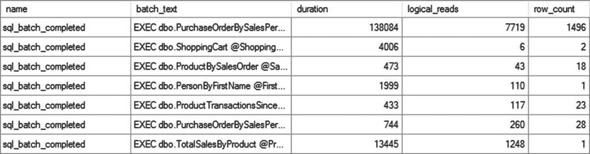

图 27-13

扩展事件输出显示了优化开销最大的查询对完整工作负载的影响

优化性能最差的查询可能会损害工作负载中其他某些查询的性能。但是，只要工作负载的整体性能得到提升，你就可以保留对该查询所做的优化。在本例中，其他查询未受影响。但现在，有一个查询比其他查询花费的时间更长。它也可能需要优化，整个过程又重新开始。这也是 `查询存储` 发挥重要作用的地方，通过它可以轻松查找性能回归或行为变更，成为一个极好的资源。

## 在优化阶段中迭代

需要记住的一个重要点是，你需要多次迭代优化步骤。在每次迭代中，你可以识别一个或多个性能不佳的查询，并对其进行优化以提高工作负载的整体性能。你必须持续迭代优化步骤，直到获得足够的性能或达到服务级别协议 (`SLA`)。

除了分析工作负载中的资源密集型查询外，你还必须分析工作负载中的错误条件。例如，如果你尝试向受唯一约束保护的表中插入重复行，`SQL Server` 将拒绝新行并向应用程序报告错误条件。尽管数据未被输入表中且未执行任何有用工作，但宝贵的资源被用于确定数据无效并必须被拒绝。

为了识别由数据库请求引起的错误条件，你需要在你的 `扩展事件` 会话中包含以下内容（或者，你可以创建一个新会话，在 `错误` 或 `警告` 类别中查找这些事件）：

*   `error_reported`
*   `execution_warning`
*   `hash_warning`
*   `missing_column_statistics`
*   `missing_join_predicate`
*   `sort_warning`
*   `hash_spill_details`

例如，考虑以下 `SQL` 查询：

```sql
INSERT  INTO Purchasing.PurchaseOrderDetail
(PurchaseOrderID,
DueDate,
OrderQty,
ProductID,
UnitPrice,
ReceivedQty,
RejectedQty,
ModifiedDate
)
VALUES  (1066,
'1/1/2009',
1,
42,
98.6,
5,
4,
'1/1/2009'
) ;
GO
SELECT  p.[Name],
psc.[Name]
FROM    Production.Product AS p,
Production.ProductSubCategory AS psc ;
GO
```

图 27-14 显示了相应的会话输出。

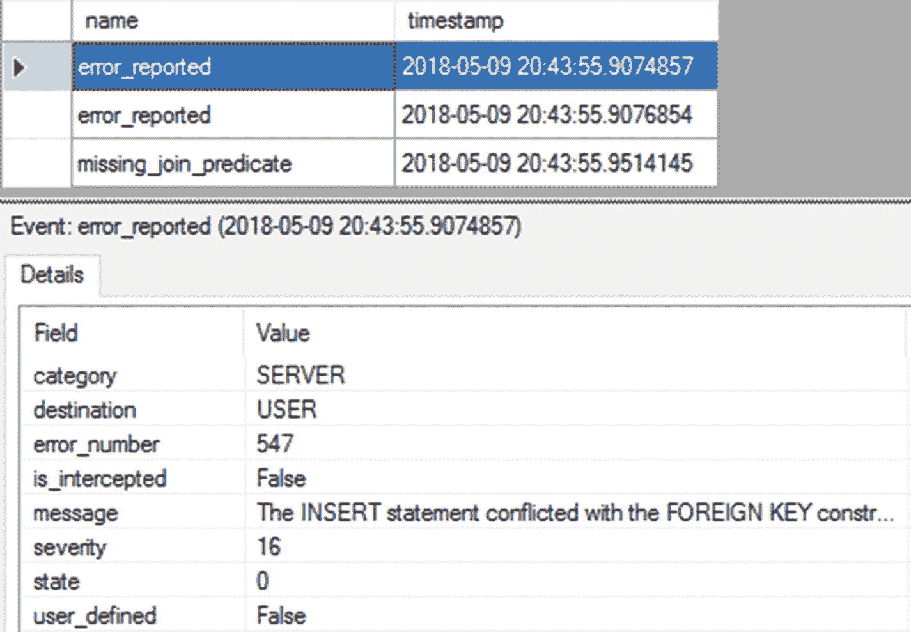

图 27-14

扩展事件输出显示了由 SQL 工作负载引发的错误

从图 27-14 中的 `扩展事件` 输出中，你可以看到我故意生成的两个错误发生了。

*   `error_reported`
*   `missing_join_predicate`

`error_reported` 错误是由 `INSERT` 语句引起的，该语句试图插入未通过引用完整性检查的数据；即，它试图插入 `Productld = 42`，但 `Production.Product` 表中没有该值。从 `error_number` 列中，你可以看到错误编号是 547。`message` 列显示了错误的完整描述。不过值得注意的是，`error_reported` 可能非常啰嗦，会返回大量数据，而且并非所有数据都有用。

第二种错误类型 `missing_join_predicate` 是由 `SELECT` 语句引起的。

```sql
SELECT p.Name,
c.Name
FROM Production.Product AS p,
Production.ProductSubcategory AS c;
```

如果你仔细查看 `SELECT` 语句，会发现该查询未在两个表之间指定 `JOIN` 子句。表之间缺少连接谓词通常会导致结果集不准确和查询计划成本高昂。这就是所谓的 *笛卡尔连接* ，它会导致 *笛卡尔积* ，其中一个表的每一行与另一个表的每一行组合。你必须在 `错误和警告` 部分中识别引起此类事件的查询，并实施必要的修复。例如，在上面的 `SELECT` 语句中，你不应该将 `Production.ProductCategory` 表中的每一行都连接到 `Production.Product` 表中的每一行——你必须只连接 `ProductCategorylD` 匹配的行，如下所示：

```sql
SELECT p.Name,
c.Name
FROM Production.Product AS p
JOIN Production.ProductSubcategory AS c
ON p.ProductSubcategoryID = c.ProductSubcategoryID;
```

即使你彻底分析并优化了工作负载，你也必须记住，工作负载优化并非一劳永逸的过程。数据库上的工作负载或数据分布会随时间变化，因此你应该定期检查你的查询是否针对当前情况进行了优化。你也有可能发现数据库本身设计上的缺陷。过度规范化导致的太多连接，或不适当反规范化导致的太多列，都可能导致查询性能不佳，且没有真正的优化机会。在这种情况下，你需要考虑重新设计数据库以获得更优化的结构。

## 总结

正如你在本章中学到的，优化数据库工作负载需要一系列工具、实用程序和命令来分析工作负载中涉及查询的不同方面。你可以使用 `扩展事件` 来分析工作负载的大局并识别开销大的查询。一旦识别出开销大的查询，你就可以使用执行计划和各种 `SQL` 命令来排查与这些查询相关的问题。根据检测到的开销查询问题，你可以应用一组或多组优化技术来提高查询性能。对开销查询的优化应该能提高工作负载的整体性能；如果未能实现，你应该回滚所做的更改。

在下一章中，我将简明扼要地总结与性能相关的最佳实践。你将能够把这些信息用作快速易读的参考。


# 28. SQL Server 优化检查清单

如果你已经阅读了本书前 27 章，那么你应该理解了性能优化的主要方面。你也明白这是一项具有挑战性且持续进行的工作。

我希望在本章中提供一个性能监控检查清单，可以在现场工作中为数据库开发人员和 DBA 提供快速参考。其理念类似于可撕下的*最佳实践*卡片。本章并未涵盖所有内容，但确实汇总了一些主要的调整活动，这些活动可以快速且显著地影响 SQL Server 系统的性能。我将这些检查清单项目分为以下几个部分：

*   数据库设计
*   配置设置
*   数据库管理
*   数据库备份
*   查询设计

每个部分都包含若干优化建议和技术。在适当的情况下，每个部分也交叉引用了本书中提供更详细信息的具体章节。

## 数据库设计

数据库设计是一个广泛的主题，在这本查询调优书的一个小节中无法给予其应有的重视；尽管如此，我建议你关注以下设计方面，以确保在早期阶段就注意到数据库性能：

*   使用实体完整性约束。
*   维护域和引用完整性约束。
*   采用索引设计最佳实践。
*   避免为存储过程名称使用 `sp_` 前缀。
*   尽量减少触发器的使用。
*   将表放入内存存储。
*   使用列存储索引。

### 使用实体完整性约束

*数据完整性*对于确保数据库中的数据质量至关重要。数据完整性的一个基本组成部分是*实体完整性*，它将一行定义为特定表的唯一实体；也就是说，表中的每一行都必须是唯一可标识的。表中用作唯一行标识符的列或列集必须表示为表的主键。

有时，一个表可能包含一个额外的列（或列），该列也可以用于唯一标识表中的行。例如，`Employee` 表可能有 `EmployeeID` 和 `SocialSecurityNumber` 列。`EmployeeID` 列用作唯一行标识符，它可以被定义为*主键*。同样，`SocialSecurityNumber` 列可以被定义为*替代键*。在 SQL Server 中，替代键可以使用唯一约束来定义，唯一约束本质上是主键的“小兄弟”。事实上，唯一约束和主键约束在后台都使用唯一索引。

值得注意的是，关于使用自然键（例如，前面示例中的 `SocialSecurityNumber` 列）还是人工键（例如，`EmployeeID` 列）存在真正的分歧。我见过两种设计都成功了，但每种方法都有优点和缺点。与其建议一种而不是另一种，我将为你提供使用两者的几个原因以及每种方法的一些成本，从而避免无谓的争论。标识列通常是 `INT` 或 `BIGINT`，这使得它窄小且易于索引，从而提高性能。此外，将主键值与任何业务知识分离在某些圈子里被认为是良好的设计。有时全局唯一标识符（`GUIDs`）可能被用作主键。它们工作良好，但难以阅读，因此会影响故障排除，并且可能导致更大的索引碎片。键的宽度也可能对性能产生负面影响。人工键的一个缺点是，这些数字有时会获得业务含义，这绝对不应该发生。另一件需要记住的事情是，你必须为替代键创建唯一约束，以防止在不应存在的情况下创建多个行。这增加了你必须存储和维护的信息量。自然键提供了一个清晰、人类可读的、具有真正业务含义的主键。它们往往是较宽的字段——有时非常宽——使得它们在索引内部效率较低。此外，有时数据可能会发生变化，这会在你的数据库中产生深远的连锁反应，因为你将必须更新该键值使用的每一个地方，而不是像使用人工键那样只更新一处。随着欧盟《通用数据保护条例》（GDPR）等合规性的引入，在担心无需删除即可修改数据的能力时，自然键变得更加成问题。

让我重申一下，两种方法都可以很好地工作，并且每种方法都提供了大量的调优机会。任何一种方法，只要应用和维护得当，都能保护数据的完整性。


## SQL Server 数据完整性约束的性能优势

除了维护数据完整性外，唯一索引（作为实体完整性约束的主要载体）还有助于优化器生成高效的执行计划。SQL Server 通常可以比搜索非唯一索引更快地搜索唯一索引。这是因为唯一索引中的每一行都是唯一的；一旦找到一行，SQL Server 就无需进一步查找其他匹配行（优化器知晓此事实）。如果某列用于排序（或 `GROUP BY` 或 `DISTINCT`) 操作，请考虑在该列上定义唯一约束（使用唯一索引），因为具有唯一约束的列通常比没有唯一约束的列排序更快。此外，唯一约束为优化器的基数估计提供了额外信息。即使是一个“未使用”或“弃用”的索引，也可能由于对基数估计的影响而仍然有助于优化。

为了理解实体完整性或唯一约束的性能优势，请考虑以下示例。假设您想要修改 `Production.Product` 表上现有的唯一索引。

```sql
CREATE NONCLUSTERED INDEX AK_Product_Name
ON Production.Product
(
Name ASC
)
WITH (DROP_EXISTING = ON)
ON [PRIMARY];
GO
```

该非聚集索引不包含 `UNIQUE` 约束。因此，尽管 `[Name]` 列包含唯一值，但非聚集索引中缺少 `UNIQUE` 约束，无法预先将此信息提供给优化器。现在，让我们考虑 `UNIQUE` 约束（或缺失的 `UNIQUE` 约束）对以下 `SELECT` 语句的性能影响：

```sql
SELECT DISTINCT
(p.Name)
FROM Production.Product AS p;
```

图 28-1 显示了此 `SELECT` 语句的执行计划。


*图 28-1：Name 列上没有 UNIQUE 约束的执行计划*

从执行计划中可以看出，使用了非聚集 `AK_ProductName` 索引来检索数据，然后对数据执行 `Stream Aggregate` 操作，以便按 `[Name]` 列对数据进行分组，从而可以从最终结果集中删除重复的 `[Name]` 值。请注意，如果优化器事先被告知 `[Name]` 列的唯一性，则不需要 `Stream Aggregate` 操作。您可以通过定义带有 `UNIQUE` 约束的非聚集索引来实现这一点，如下所示：

```sql
CREATE UNIQUE NONCLUSTERED INDEX [AK_Product_Name]
ON [Production].Product
WITH (
DROP_EXISTING = ON)
ON    [PRIMARY];
GO
```

图 28-2 显示了该 `SELECT` 语句新的执行计划。


*图 28-2：Name 列上有 UNIQUE 约束的执行计划*

一般来说，实体完整性约束（即主键和唯一约束）为优化器提供了有关预期结果的有用信息，协助优化器生成高效的执行计划。值得注意的是，`sys.dm_db_index_usage_stats` 不会显示何时针对定义唯一约束的索引运行了约束检查。

## 维护域和引用完整性约束

数据完整性的另外两个重要组成部分是**域完整性**和**引用完整性**。列的域完整性可以通过限制列的数据类型、定义输入数据的格式以及限制列的可接受值范围来强制实施。引用完整性则通过使用表之间定义的外键约束来强制实施。SQL Server 提供以下功能来实现域和引用完整性：数据类型、`FOREIGN KEY` 约束、`CHECK` 约束、`DEFAULT` 定义和 `NOT NULL` 定义。如果应用程序要求将数据列的值限制在某个值范围内，则此业务规则可以在应用程序代码中实现，也可以在数据库架构中实现。在数据库中使用域约束（例如 `CHECK` 约束）来实现此类业务规则，可以帮助优化器生成高效的执行计划。

为了理解域完整性的性能优势，请考虑以下示例：

```sql
DROP TABLE IF EXISTS dbo.Test1;
GO
CREATE TABLE dbo.Test1 (
C1 INT,
C2 INT CHECK (C2 BETWEEN 10 AND 20)
) ;
INSERT  INTO dbo.Test1
VALUES  (11, 12);
GO
DROP TABLE IF EXISTS dbo.Test2;
GO
CREATE TABLE dbo.Test2 (C1 INT, C2 INT);
INSERT  INTO dbo.Test2
VALUES  (101, 102);
```

现在执行以下两个 `SELECT` 语句：

```sql
SELECT T1.C1,
T1.C2,
T2.C2
FROM dbo.Test1 AS T1
JOIN dbo.Test2 AS T2
ON T1.C1 = T2.C2
AND T1.C2 = 20;
GO
SELECT T1.C1,
T1.C2,
T2.C2
FROM dbo.Test1 AS T1
JOIN dbo.Test2 AS T2
ON T1.C1 = T2.C2
AND T1.C2 = 30;
```

这两个 `SELECT` 语句看起来相同，除了谓词值不同（第一个语句中是 `20`，第二个语句中是 `30`）。尽管这两个 `SELECT` 语句形式相同，但由于 `CHECK` 约束作用于 `Tl.C2` 列，优化器对它们的处理方式不同，如图 28-3 中的执行计划所示。

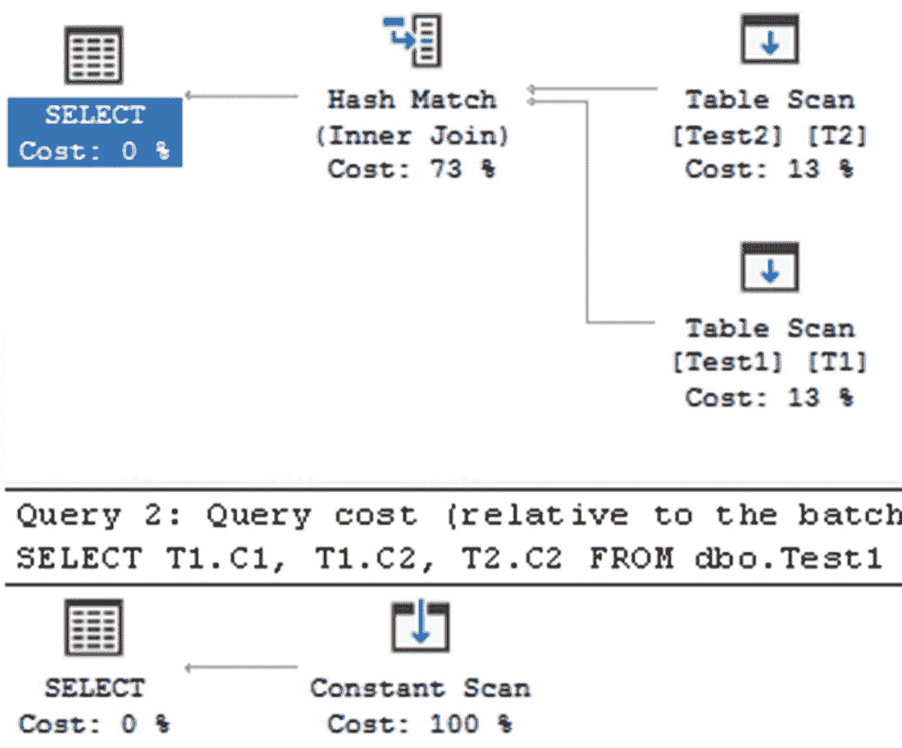

*图 28-3：谓词值在 CHECK 约束边界内外的执行计划*

从执行计划中可以看出，对于第一个查询（`T1.C2` = `20`），优化器访问了两个表的数据。对于第二个查询（`Tl.C2` = `30`），优化器根据列 `Tl.C2` 上对应的 `CHECK` 约束了解到该列不能包含 `10` 到 `20` 范围之外的任何值。因此，优化器甚至不访问任何一个表的数据。因此，第二个查询的相对估计成本以及几乎不执行任何操作的实际性能测量结果为 0%。

我在第 19 章的“声明式引用完整性”一节中详细解释了引用完整性的性能优势。

因此，您应该使用域和引用约束，不仅是为了实现数据完整性，也是为了协助优化器生成高效的查询计划。确保使用 `WITH CHECK` 选项创建外键约束，否则优化器将忽略它们。要了解域和引用完整性的其他性能优势，请参阅第 19 章的“使用域和引用完整性”一节。


### 遵循索引设计最佳实践

最常见的优化建议——也通常是提升良好性能的最大贡献因素之一——就是为数据库工作负载实施正确的索引。索引与表不同，表用于存储数据，即使不深入了解查询也可以进行设计（只要表能正确表示业务实体）。相反，索引必须通过仔细审查数据库查询来设计。除了常见且显而易见的情况（如主键和唯一索引）外，请避免陷入不了解查询就设计索引的陷阱。即使对于主键和唯一索引，我也建议你在开始设计数据库查询时，验证这些索引的适用性。考虑到索引对数据库性能的重要性，设计索引时必须谨慎。

尽管索引的性能方面在第 8、9、12 和 13 章中有详细解释，但为了便于参考，我将在此重申一个简短的建议列表：

*   为索引键选择较窄的列。
*   确保候选列中数据的选择性非常高（即，该列返回的候选值数量必须很少）。
*   优先选择整数数据类型（或其变体）的列。同时，避免在`VARCHAR`等字符串数据类型的列上创建索引。
*   在多列索引中，考虑将选择性更高的列列在前面。
*   使用索引中的`INCLUDE`列表，作为一种在不改变索引键结构的情况下使索引覆盖该结构的方法。通过向键添加列来实现这一点，这可以避免昂贵的查找操作。
*   在决定对哪些列进行索引时，要特别注意查询的`WHERE`子句、`JOIN`条件列和`HAVING`子句。这些可以作为进入表的入口点，特别是当`WHERE`子句条件对某个列使用高度选择性的值或常量进行数据过滤时。这样的子句可以使该列成为索引的主要候选。
*   在选择索引类型（聚集或非聚集、列存储或行存储）时，请牢记各种索引类型的优缺点。

设计聚集索引时要格外小心，因为表上的每个非聚集索引都依赖于聚集索引。因此，设计和实现聚集索引时请遵循以下建议：

*   尽可能保持聚集索引狭窄。你不希望因为有一个宽的聚集索引而加宽所有非聚集索引。
*   首先创建聚集索引，然后在表上创建非聚集索引。
*   如果需要，使用`CREATE INDEX`命令中的`DROP_EXISTING = {ON|OFF}`命令在单一步骤中重建聚集索引。你不希望重建表上的所有非聚集索引两次：一次是在删除聚集索引时，另一次是在重新创建聚集索引时。
*   不要在频繁更新的列上创建聚集索引。如果这样做，表上的非聚集索引将通过与聚集索引键值保持同步而产生额外的负载。

为了跟踪你已创建的索引并确定需要创建的其他索引，你应该利用 SQL Server 2017 和 Azure SQL Database 为你提供的动态管理视图。通过定期（例如每周一次左右）检查`sys.dm_db_index_usage_stats`中的数据，你可以确定哪些索引实际在使用，哪些是冗余的。那些没有为你的查询做出贡献以帮助你提高性能的索引，只是系统的负担。当表中的数据发生变化时，它们不仅需要更多的磁盘空间，还需要额外的 I/O 来维护索引内的数据。另一方面，查询`sys.dm_db_missing_indexes_details`将显示系统认为缺失的潜在索引，甚至建议`INCLUDE`列。你可以访问 DMV `sys.dm_db_missing_indexes_groups_stats`来查看有关可能受益于特定索引组的查询被调用次数的汇总信息。记住要彻底测试这些建议，不要假设它们一定是正确的。所有这些建议都只是建议。结合所有这些技巧，可以为你提供一种长期维护系统中索引的最佳方法。

### 避免在存储过程名称中使用 sp_ 前缀

作为规则，不要为用户存储过程使用`sp_`前缀，因为 SQL Server 会假定带有`sp_`前缀的存储过程是系统存储过程，并且这些过程应该位于 master 数据库中。使用`sp`或`usp`作为用户存储过程的前缀非常普遍。这既不是主要的性能影响，也不是主要问题，但何必自找麻烦呢？`sp_`前缀的性能影响在第 20 章的“小心命名存储过程”一节中有详细解释。完全去掉前缀是一个不错的方法。你有足够的空间用于描述性的对象名称。没有必要使用那些对查询的功能定义没有帮助的奇怪缩写。

### 最小化触发器的使用

触发器为在数据库内自动化行为提供了一种有吸引力的方法。由于它们在数据被其他进程（无论何种进程）操作时触发，因此可用于确保在数据更改时运行某些功能。同样的功能使它们变得危险，因为它们对于正在处理系统的开发人员或 DBA 来说并非立即可见。在设计查询和排查性能问题时，必须考虑到它们。因为它们带有某种隐性成本，所以应仔细考虑触发器。在使用触发器之前，请确保解决所呈现问题的唯一方法是使用触发器。如果你确实使用了触发器，请在尽可能多的地方记录这一事实，以确保其他开发人员和 DBA 在工作中考虑到触发器的存在。

### 将表放入内存存储

虽然内存存储机制存在大量限制，但其性能收益很高。如果你有一个高吞吐量的 OLTP 系统，并且看到大量 I/O 争用，尤其是在闩锁方面，那么内存存储是一个可行的选择。你可能还想探索将内存存储用于表变量以帮助提升其性能。如果你有不需要持久化的数据，你甚至可以使用`SCHEMA_ONLY`持久性选项在内存中创建表。通用的方法是使用内存中对象来帮助处理高吞吐量的 OLTP（在这些场景下你可能会遇到并发问题），而不是数据仓库场景中经历的更大量的扫描等情况。所有这些方法都能带来显著的性能收益。但请记住，你必须有足够的内存来支持这些选项。这里没有什么神奇之处。你是通过投入大量的内存（也就是金钱）来解决问题，从而提升性能。


### 使用列存储索引

如果您正在设计和构建数据仓库，使用列存储索几乎是顺理成章的事。您的大多数查询很可能涉及跨大数据集的聚合操作，因此列存储索引是一种天然的性能增强器。不过，别忘了在您的 **OLTP** 系统中也启用非聚集列存储索引，特别是当系统中存在频繁的分析型查询时。这会带来额外的维护开销，并增加数据库的大小，但其带来的好处是巨大的。您可以创建一个由聚集索引定义的 **行存储表**，并让其使用列存储索引。您也可以创建一个由聚集索引定义的 **列存储表**，并让其使用行存储索引。通过这两种机制，您可以确保满足最常见的查询风格（分析型或 **OLTP**），同时仍然支持另一种风格。

## 配置设置

以下是服务器和数据库配置设置的检查清单，这些设置对数据库性能有重大影响：

*   内存配置选项
*   并行运算的成本阈值
*   最大并行度
*   针对即席工作负荷进行优化
*   被阻止进程阈值
*   数据库文件布局
*   数据库压缩

我将在后续章节中更详细地介绍这些设置。

### 内存配置选项

如第 2 章“SQL Server 内存管理”一节所述，强烈建议将 `max server memory`（最大服务器内存）设置配置为一个由系统配置决定的非默认值。SQL Server 的这些内存配置在第 2 章的“内存瓶颈分析”和“内存瓶颈解决方案”两节中有详细解释。

### 并行运算的成本阈值

在具有多处理器的系统上，可以并行执行查询。并行的默认值为 5。这代表优化器估计查询执行成本为五秒。在大多数情况下，我发现这个值被设得太低；换句话说，提高并行阈值能带来更好的性能。在您的系统上进行测试将帮助您确定合适的值。为这个阈值建议一个具体的数值可能有些冒进，但我还是要提一下。我建议从测试值 35 开始，然后观察效果。更好的方法是，使用查询存储中的数据来确定所有查询的平均成本，然后将 `Cost Threshold for Parallelism`（并行运算的成本阈值）的值设置为高于该平均值两到三个标准差。这样，大约 95% 到 98% 的查询将不会进入并行处理，而那些真正需要并行的查询则会受益。最后，请记住您运行的是哪种类型的系统。**OLTP** 系统更可能从大量使用少量 CPU 的查询中获益，而分析型系统则更可能从更多使用更多 CPU 的查询中获益。

### 最大并行度

当系统有多个可用处理器时，默认情况下 SQL Server 会在并行执行期间使用所有处理器。为了更好地控制机器负载，您可能会发现限制并行执行使用的处理器数量是有用的。此外，您可能需要设置处理器关联性，以便为操作系统以及与 SQL Server 一起运行的其他服务保留某些处理器。**OLTP** 系统可能会从完全禁用并行中获益，尽管这是一个有争议的选择。首先尝试提高并行运算的成本阈值，因为即使在 **OLTP** 系统中，也有一些查询（尤其是维护作业）会从并行执行中受益。您也可以探索使用资源调控器来控制某些工作负荷的可能性。

### 针对即席工作负荷进行优化

如果对系统的主要调用是以即席或动态 **T-SQL** 的形式发起，而不是通过定义良好的存储过程或参数化查询（例如在某些对象关系映射 (**ORM**) 软件的实现中可能见到的那样），那么启用 `optimize for ad hoc workloads`（针对即席工作负荷进行优化）设置将减少过程缓存的消耗，因为系统会为初始查询调用创建计划存根，而不是完整的执行计划。这在第 18 章中有详细说明。

### 被阻止进程阈值

`blocked process threshold`（被阻止进程阈值）设置以秒为单位定义何时触发被阻止进程报告。当查询运行并超过该阈值时，报告会被触发。同时也会触发一个警报，可用于发送电子邮件或短信。测试单个系统以确定此设置的值。您可以使用扩展事件 (**Extended Events**) 中的事件来监视此阈值。

### 数据库文件布局

为便于参考，以下是规划数据库文件布局时应考虑的最佳实践：

*   将用户数据库的数据文件和事务日志文件放在不同的 **I/O** 路径上。这允许事务日志磁头顺序推进，而不会被数据文件常用的非顺序 **I/O** 随机移动。
*   将事务日志放在专用磁盘上也能增强数据保护。如果数据库磁盘发生故障，您将能够通过对事务日志执行备份来保存故障点之前所有已完成的事务。在恢复过程中使用此最后一个事务日志备份，您将能够将数据库恢复到故障发生点。这被称为 *时间点恢复*。
*   避免为事务日志使用 **RAID 5**，因为对于每个写入请求，与 **RAID 1** 或 **10** 相比，**RAID 5** 磁盘阵列会产生两倍的磁盘 **I/O**。
*   您可以为数据文件选择 **RAID 5**，因为即使在繁重的 **OLTP** 系统中，读取请求数量通常是写入请求数量的七到八倍。此外，对于读取请求，**RAID 5** 的性能与总磁盘数相同的 **RAID 1** 和 **RAID 10** 相似。
*   考虑转向更现代的磁盘子系统，如 **SSD** 或 **FusionIO**。
*   为 `tempdb` 创建多个文件。一般规则是文件数量为逻辑处理器核心数的一半或四分之一。现在 `tempdb` 中的所有分配都使用均匀区。您还会看到文件现在会自动增长到相同大小。

要详细了解数据库文件布局和 **RAID** 子系统，请参阅第 3 章的“磁盘瓶颈解决方案”一节。

### 数据库压缩

自 2008 年起，SQL Server 的企业版和开发者版就提供了数据压缩功能。随着更多数据存储在一个页面上，这可以在占用空间和性能方面带来巨大好处。这些好处是以系统 **CPU** 和内存的额外开销为代价的；然而，好处通常远远大于成本。在实施压缩时请考虑到这一点。

## 数据库管理

供您参考，以下是与性能相关的数据库管理活动的简短清单，您应将其作为管理数据库服务器过程的一部分定期执行：

*   保持统计信息为最新。
*   将索引碎片保持在最低水平。
*   避免使用诸如 `AUTOCLOSE`（自动关闭）或 `AUTOSHRINK`（自动收缩）之类的自动数据库功能。

在以下部分中，我将更详细地介绍上述活动。

## 注意

有关 SQL Server 2017 管理需求和方法的详细说明，请参阅 Microsoft SQL Server 联机丛书文章“数据库引擎功能和任务”（[`http://bit.ly/SIlz8d`](http://bit.ly/SIlz8d))。


### 保持统计信息最新

数据库统计信息对性能的影响在第 13 章（以及本书多处）有详细解释；不过，以下这份简要清单可作为保持统计信息最新的快速参考：

*   允许 SQL Server 使用配置参数 `AUTO_CREATE_STATISTICS` 和 `AUTO_UPDATE_STATISTICS` 的默认设置，自动维护表中数据分布的统计信息。

*   作为一项主动措施，您可以根据需要并在系统支持的前提下，以编程方式定期更新每个数据库对象的统计信息。这种做法能在自动更新统计信息功能未能提供满意结果时，部分保护您的数据库免受统计信息过时的影响。在第 13 章中，我将说明如何设置 SQL Server 作业以按计划定期更新统计信息。

*   请记住，您还可以以异步方式更新统计信息。这减少了在更新统计信息时对其的争用；因此，如果您的系统访问量相当持续，可以使用此方法更频繁地更新统计信息。如果您观察到统计信息更新引起的等待，异步方式可能更有帮助。

## 注意

请确保在索引碎片整理作业完成之前安排统计信息更新作业，如本章后面所述。

### 将索引碎片控制在最低限度

以下最佳实践将帮助您将索引碎片控制在最低水平：

*   定期在非高峰时段对数据库进行碎片整理。

*   定期确定索引的碎片级别；然后，根据该碎片情况，选择重建索引或通过执行第 14 章中概述的碎片整理查询来整理索引碎片。

*   请记住，非常小的表根本不需要进行碎片整理。

*   在涉及非常大的数据库时，对于索引碎片整理可能适用不同的规则。

*   如果您有仅用于单次查找操作的索引，那么碎片不会影响性能。

*   在 Azure SQL Database 中，仅在真正需要时才重建索引更为重要。重建索引会消耗大量 I/O 带宽，并可能导致节流。

另请记住，索引碎片问题远没有大多数人想象的那么严重。一些专家甚至认为整理索引碎片是在浪费时间。虽然我仍然认为它有好处，但这取决于具体情况，因此请务必仔细监控和衡量您的性能指标，以便判断碎片整理是否有益。

### 避免使用如 AUTO_CLOSE 或 AUTO_SHRINK 之类的数据库功能

`AUTO_CLOSE` 会在最后一个用户连接关闭时，干净地关闭数据库并释放其所有资源。这意味着缓存中的所有数据和查询都会自动清空。当下一个连接进来时，不仅数据库必须重新启动，而且所有数据都必须重新加载到缓存中。此外，存储过程和其他查询也必须重新编译。这对大多数数据库系统来说是一项极其昂贵的操作。请将 `AUTO_CLOSE` 保留为其默认值 `OFF`。

`AUTO_SHRINK` 会定期收缩数据库大小。它可以收缩数据文件，在简单恢复模式下，也可以收缩日志文件。在执行此操作时，它可能会阻塞其他进程，严重减慢您的系统。通常，在启用了 `AUTO_SHRINK` 的系统上，文件增长也会被设置为自动发生，因此当数据或日志文件需要增长时，您的系统会再次被拖慢。此外，您会看到物理文件存储在操作系统级别变得碎片化，严重影响性能。请将数据库大小设置为适当的大小，并监控其增长需求。如果必须自动增长，请按固定增量增长，而不是按百分比增长。

### 数据库备份

数据库备份是一个广泛的主题，无法在本查询优化书中得到充分阐述。尽管如此，我建议在涉及数据库性能时，请关注数据库备份过程的以下方面：

*   差异备份和事务日志备份的频率

*   备份的分布

*   备份压缩

接下来的章节将对这些建议进行更详细的说明。

### 差异备份和事务日志备份频率

对于 OLTP 数据库，必须定期备份数据库，以便在发生故障时，可以将数据库还原到不同的服务器。对于大型数据库，完整数据库备份通常需要很长时间，因此无法频繁执行。因此，完整备份在较长的时间间隔进行，而在两个连续完整备份之间安排更频繁的差异备份和事务日志备份。通过设置频繁的差异备份和事务日志备份，如果数据库完全故障，可以将数据库恢复到某个时间点。

差异备份可用于减少完整备份的开销，因为它只备份自上次完整备份以来更改的数据。因为这可能快得多，所以对生产系统造成的减速也会更小。每种情况都是独特的，因此您需要找到最适合您的方法。作为一般规则，我建议每周进行一次完整备份，然后每天进行差异备份。之后，您可以确定事务日志备份的需求。

频繁备份事务日志会给服务器增加少量开销，尤其是在高峰时段。

对于大多数企业来说，可接受的数据丢失量（就时间而言）通常优先于节省日志磁盘空间或提供理想的数据库性能。因此，在安排事务日志备份时，必须考虑可接受的数据丢失量，而不是随意将备份计划设置为较短的时间间隔。


## 备份调度分布

当需要备份多个数据库时，必须确保所有全备份不被安排在同一时间执行，以避免硬件资源同时受到冲击。如果备份过程涉及将数据库备份到中央 SAN 磁盘阵列，那么所有数据库服务器的全备份必须分散安排在备份时间窗口内，这样中央备份基础设施就不会因同时收到过多备份请求而不堪重负。同时用大量备份请求淹没中央基础设施，会迫使基础设施的组件将大量资源仅用于管理过多的请求。这种资源使用不当会显著增加备份时长，导致全备份在高峰时段仍在继续，从而影响用户请求的性能。

为了最小化全备份过程对数据库性能的影响，您首先必须确定可以安排全备份的非高峰时段，然后将全备份分散安排在该非高峰时间窗口内，具体步骤如下：

1.  确定必须备份的数据库数量。
2.  根据数据库对业务的重要性进行优先级排序。
3.  确定可以安排全数据库备份的非高峰时段。
4.  计算两个连续全备份之间的时间间隔，公式如下：时间间隔 = (总备份时间窗口) / (全备份次数)。
5.  按照数据库优先级顺序安排全备份，第一次备份在备份窗口开始时启动，后续备份按上述公式计算的时间间隔均匀分布执行。

这种全备份的均匀分布将确保备份基础设施不会同时被过多的备份请求淹没，从而降低全备份对数据库性能的影响。

## 备份压缩

对于相对较大的数据库，备份时长和备份文件大小通常会成为问题。过长的备份时长使得在管理时间窗口内完成备份变得困难，进而开始影响最终用户的体验。备份文件的大尺寸使得备份文件的空间管理颇具挑战性，并且在通过网络将备份执行到中央备份基础设施时，会增加网络压力。压缩还有助于加快备份过程，因为需要写入磁盘的数据量减少了。

优化备份时长、备份文件大小及由此产生的网络压力的推荐方法是使用 `备份压缩`。

## 查询设计

在设计数据库查询时，您应遵循以下与性能相关的最佳实践列表：

*   使用命令 `SET NOCOUNT ON`。
*   显式定义对象的所有者。
*   避免使用 `非可搜索` 条件。
*   避免在 `WHERE` 子句的列上使用算术运算符和函数。
*   避免使用优化器提示。
*   远离嵌套视图。
*   确保没有隐式数据类型转换。
*   最小化日志记录开销。
*   采用重用执行计划的最佳实践。
*   采用数据库事务的最佳实践。
*   消除或减少数据库游标的开销。
*   使用本机编译存储过程。
*   利用列存储索引进行分析查询。

我将在以下各节中详细阐述每一项最佳实践。

### 使用命令 `SET NOCOUNT ON`

作为规则，始终在存储过程、触发器和其他批处理查询中将命令 `SET NOCOUNT ON` 作为首条语句使用。这使您能够避免与每次执行 SQL 语句后返回受影响行数相关的网络开销。命令 `SET NOCOUNT` 在第 20 章的 “使用 SET NOCOUNT” 一节中有详细解释。

### 显式定义对象的所有者

作为一项性能最佳实践，始终使用其所有者名称限定数据库对象，以避免验证对象所有者所需的运行时开销。显式限定数据库对象所有者的性能优势在第 16 章的 “不允许在查询中隐式解析对象” 一节中有详细解释。

### 避免非可搜索条件

在定义查询中的搜索条件时要保持警惕。如果 `WHERE` 子句中使用的列上的搜索条件阻止优化器有效使用该列上的索引，那么即使存在正确的索引，查询的执行成本也会很高。非可搜索条件对性能的影响在第 19 章的相应章节中有详细解释。

此外，请注意在搜索功能上不要提供过多的灵活性。如果您定义了一个应用程序功能，例如“检索产品名称以‘caps’结尾的所有产品”，那么您将得到需要扫描完整表（或聚集索引）的查询。如您所知，扫描一个包含数百万行的表会损害您的数据库性能。除非使用索引提示，否则您将无法从该列上的索引中受益。然而，使用索引提示会覆盖查询优化器的决策，因此通常也不建议使用索引提示（更多信息请参见第 19 章）。要理解此类业务规则对性能的影响，请考虑以下 `SELECT` 语句：

```sql
SELECT p.*
FROM Production.Product AS p
WHERE p.Name LIKE '%Caps';
```

在图 28-4 中，您可以看到执行计划使用了 `[Name]` 列上的索引，但它执行的是扫描而非查找。由于字符数据类型（如 `CHAR` 和 `VARCHAR`）列上的索引会根据列的前导字符对数据值进行排序，因此在 `LIKE` 条件中使用前导 `%` 不允许对索引执行查找操作。匹配的行可能分布在整个索引行中，使得索引对搜索条件无效，从而损害查询性能。

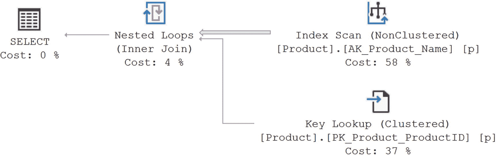

图 28-4：一个执行计划，显示由非可搜索 `LIKE` 子句引起的聚集索引扫描。

### 避免在 WHERE 子句的列上使用算术表达式

应始终避免在 `WHERE` 和 `JOIN` 子句中的列上使用算术运算符和函数。在列上使用运算符和函数会阻止对这些列使用索引。在 `WHERE` 子句列上使用算术运算符对性能的影响在第 18 章的“避免在 WHERE 子句列上使用算术运算符”一节中有详细解释，而使用函数的影响在同一章的“避免在 WHERE 子句列上使用函数”一节中也有详细说明。

为了直观理解，请考虑以下查询：

```sql
SELECT  soh.SalesOrderNumber
FROM    Sales.SalesOrderHeader AS soh
WHERE   'SO5' = LEFT(SalesOrderNumber, 3);

SELECT  soh.SalesOrderNumber
FROM    Sales.SalesOrderHeader AS soh
WHERE   SalesOrderNumber LIKE 'SO5%';
```

这些查询基本实现了相同的逻辑：它们检查 `SalesOrderNumber` 是否等于 `S05`。然而，第一个查询在 `SalesOrderNumber` 列上执行了一个函数，而第二个查询使用 `LIKE` 子句来检查相同的数据。图 28-5 展示了由此产生的执行计划。

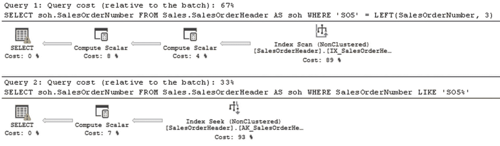

图 28-5
显示函数阻止索引使用的执行计划

如图 28-5 所示，第一个查询强制执行了 `索引扫描` 操作，而第二个查询则能够执行一个干净利落的 `索引 Seek`。这些示例清楚地说明了为什么应该避免在 `WHERE` 子句的列上使用函数和运算符。

你在执行计划中看到的警告与 `SalesOrderHeader` 表中计算列内发生的隐式转换有关。

### 避免优化器提示

作为一项规则，应避免使用优化器提示，例如索引提示和连接提示，因为它们会推翻优化器的决策过程。在大多数情况下，优化器足够智能，能够生成高效的执行计划，并且在没有对其施加任何优化器提示时，它的工作效果最佳。关于优化器提示对性能影响的详细理解，请参阅第 19 章的“避免优化器提示”一节。

### 远离嵌套视图

当一个视图调用另一个视图，而后者又调用更多视图，如此层层嵌套时，就存在嵌套视图。这可能导致代码混乱，原因有二。首先，视图掩盖了正在执行的操作。其次，查询本身可能很简单，但 SQL 引擎的执行计划和后续操作可能复杂且开销巨大。这是因为优化器没有时间来简化查询，消除不需要的表和列；相反，优化器会假定所有表和列都是必需的。同样的规则也适用于嵌套用户定义函数。

### 确保没有隐式数据类型转换

在查询中创建变量时，请确保这些变量的数据类型与它们将要比较的列的数据类型相同。尽管 SQL Server 可以并且将会进行转换，例如将 `VARCHAR` 转换为 `DATE`，但这种隐式转换可能会阻止索引的使用。在表连接等情况下，你也必须同样小心，确保一个表的主键数据类型与被连接表的外键相匹配。你偶尔可能会在执行计划中看到警告来帮助你解决这个问题，但你不能依赖于此。

### 最小化日志记录开销

SQL Server 在事务日志中维护每个原子操作（或事务）的新旧状态，以确保数据库的一致性和持久性。这可能会给日志磁盘带来巨大压力，常常使日志磁盘成为争用点。因此，为了提高数据库性能，必须尝试优化事务日志开销。除了本章后面讨论的硬件解决方案外，还应采用以下查询设计最佳实践：

*   对于小于 20 到 50 行的小型结果集，尽可能选择表变量而不是临时表。请记住，如果结果集不小，你可能会遇到严重问题。表变量的性能优势在第 18 章的“使用表变量”一节中有详细解释。
*   将多个操作查询批处理到单个事务中。使用此选项时必须小心，因为如果在单个事务中影响的行数过多，相应的数据库对象将被长时间锁定，从而阻塞所有其他试图访问这些对象的用户。
*   通过使用大容量日志恢复模型来减少某些操作的日志记录量。此规则主要适用于处理大规模数据操作时。当启用大容量日志恢复模型时，你还会在使用 `UPDATE` 语句的 `WRITE` 子句或删除或创建索引时使用最小日志记录。

### 采用重用执行计划的最佳实践

优化计划生成成本的最佳实践可大致分为以下两类：

*   有效缓存执行计划
*   最小化执行计划的重新编译

#### 有效缓存执行计划

你必须确保查询的执行计划不仅被缓存，而且要经常重用。通过采用以下最佳实践来实现：

*   避免以非参数化、即席查询的方式执行查询。相反，将查询的可变部分参数化，并使用存储过程或 `sp_executesql` 系统存储过程提交参数化查询。
*   如果必须使用大量即席查询，请启用“针对即席工作负载进行优化”选项，该选项将在第一次调用查询时创建一个计划存根，而不是一个完整的计划。这极大地减少了使用的过程缓存量。
*   在执行相同参数化查询的每个连接中使用相同的环境设置（如 `ANSI NULLS`）。这很重要，因为查询的执行计划取决于连接的环境设置。
*   如前面“显式定义对象的所有者”一节所述，在查询中访问对象时，显式限定对象的所有者。

整个想法是确保缓存中只有你需要的计划，并且你重复使用这些计划，而不是总是编译新的计划。关于计划缓存的上述方面在第 17 章中有详细解释。

#### 最小化执行计划的重新编译

为了最小化查询执行计划的不必要生成，你必须确保缓存中的计划不会因你能控制的原因而失效或重新编译。以下推荐的最佳实践可以最小化存储过程计划的重新编译：

*   不要在存储过程中交错使用 DDL 和 DML 语句。应将所有 DDL 语句放在存储过程的顶部。
*   在存储过程中，避免使用在存储过程外部创建的临时表。
*   对于小型数据集，优先使用表变量而不是临时表。
*   不要在存储过程中更改 `ANSI SET` 选项。
*   如果确实无法避免重新编译，那么识别导致重新编译的存储过程语句，并通过 `sp_executesql` 系统存储过程执行它。

存储过程重新编译的原因和推荐的解决方案在第 18 章中有详细解释。

### 采用数据库事务最佳实践

你设计的并发查询效率越高，查询完成的速度就越快，彼此之间不会相互阻塞。在设计查询中的事务时，请考虑以下建议：

*   尽可能缩短事务的作用域。事务中只应包含那些为保持数据一致性而必须一起提交的语句。
*   避免因错误处理例程或应用程序逻辑不佳而导致事务保持打开状态。可使用以下技术来实现：
    *   使用 `SET XACTABORT ON` 来确保在事务内发生错误条件时，事务会被中止或回滚。
    *   从客户端代码执行包含事务的存储过程或一批查询后，始终检查是否有打开的事务，然后使用以下 SQL 语句回滚任何打开的事务：

        ```
        IF @@TRANC0UNT > 0 ROLLBACK
        ```

*   使用为保持数据一致性所需的最低级别事务隔离级别，具体由你的应用程序需求决定。默认的“已提交读”隔离级别提供的隔离程度在大多数情况下是足够的。如果发生过度锁等待，可考虑使用“快照隔离”级别。

事务对数据库性能的影响详见第 20 章。

### 消除或减少数据库游标的开销

由于 SQL Server 设计为处理数据集，因此使用 DML 语句处理多行数据通常比使用数据库游标逐行处理要快得多。如果你发现自己大量使用游标，请重新检查逻辑，看看是否有办法消除游标。如果必须使用数据库游标，请使用开销最小的游标类型：`FAST_FORWARD` 游标（通常称为“只进游标”）。你也可以使用 [在 ADO.NET 中](http://inado.net) 等效的 `DataReader` 对象。

数据库游标的性能开销详见第 23 章。

### 使用本机编译的存储过程

在你只访问内存中表的情况下，还有一种额外的性能提升方法，就是将你的存储过程编译成在 SQL Server 可执行文件内运行的 DLL。正如第 24 章所展示的，这对性能有相当显著的影响。只需确保你以正确的方式调用过程，按序号位置传递参数，而不是按参数名称传递。尽管这感觉像是违反了最佳实践，但它能带来编译后过程更好的性能。

### 利用查询存储处理分析查询

大多数使用关系型数据库存储信息的应用程序都有一定程度的分析查询。要么你有一个包含少量分析查询的 OLTP 系统，要么你有一个包含大量分析查询的数据仓库或报告系统。对于执行大量聚合和分析的查询，利用列存储索引来提供支持。当大多数查询是分析型时，聚集列存储索引效果最佳，但对于 OLTP 点查询样式则效果不佳。当大多数查询以 OLTP 为主，但其中一些需要进行分析时，非聚集列存储索引可以增加分析能力。在这种情况下，关键是选择合适的工具来做合适的工作。

## 总结

性能优化是一个持续的过程。它需要持续关注影响性能的数据库和查询特性。本章的目标是为你提供一份这些特性的检查清单，作为在数据库应用程序开发和维护阶段快速便捷的参考。

## 索引

### A

活动服务器页面 (`ASP`) 自适应查询处理 交错执行 反模式 聚簇索引查找与表扫描 估计行数 执行计划 执行时间 多语句函数 参数嗅探 属性 运行查询 `WHERE` 子句 机制 内存授予反馈 `bigTransactionHistory` 表 `DATABASE SCOPED CONFIGURATION` `DISABLE_BATCH_MODE_MEMORY_GRANT_FEEDBACK` 执行计划 扩展事件 内存不足 `memory_grant_feedback_loop_disabled` `memory_grant_updated_by_feedback` 事件 行模式执行类型 即席工作负载 定义 强制参数化 优化 计划可重用性 现有计划的不可重用性 不重用过程缓存中的现有计划 `sys.dm_exec_cached_plans` 输出 预准备的工作负载 简单参数化 自动参数化计划限制 使用模板 `ALTER DATABASE` 命令 原子性、一致性、隔离性和持久性 (`ACID`) 自动索引管理 `AdventureWorksLT` 自动调整 数据库功能 启用 结果 预估影响 视图 评估期 `PaaS` 性能建议和调整历史 PowerShell 脚本 查询存储 `sys.dm_db_tuning_recommendations` `T-SQL` 脚本 调整历史 验证报告 自动计划修正 启用自动调整 Azure 门户 缓存，测试 `CurrentState` 值 `desired_state` 值 强制计划 `SQL Server 2017` `sys.database_automatic_tuning_options` `sys.dm_db_tuning_recommendations` 查询存储 调整建议 `AdventureWorks` `CPU` 时间 `dbo.bigTransactionHistory` 表 执行计划，数据集 `FORCE_LAST_GOOD_PLAN` `JSON` 文档 `planForceDetails` 查询存储 `sys.dm_db_tuning_recommendations`

### B

基线创建 Azure `SQL` 数据库 计数器日志 数据收集器集 数据日志 性能监视器 计划窗格 计数器数量 监视 虚拟机和托管机 性能监视器图表 更喜欢计数器日志 可重用列表 `.htm` 文件 互联网浏览器 性能监视器计数器 `SQL Server` 采样间隔 保存计数器日志 系统行为分析 数据库服务器日志分析 性能数据 性能监视器工具 阻塞 原子性 `dbo.ProductTest` 表 显式回滚 `INSERT` 语句 逻辑工作单元 `SET XACT_ABORT_ON` 一致性 数据访问请求 数据库连接 死锁 死锁 持久性 信息 原因 扩展事件 和 `blocked_process_report SQL` 隔离 锁 锁管理器 性能监视器计数器 减少/避免，建议 解决方案 覆盖索引，争用数据 隔离级别 优化查询 分区，争用数据 `SQL Server` 警报 被阻塞的进程报告和作业 `SQL Server` 企业管理器 书签查找


## C

`因果跟踪` `CHECK 约束` `检查点进程` `客户端游标` `客户端游标` 特性 `成本效益` `成本开销/缺点` `聚集索引` 创建 `数据访问` `数据检索` 频繁更新的列 `堆表` 窄且非聚集 `B-树` 结构 `数据页` `dbo.DatabaseLog` `执行计划` `堆表` 嵌套循环操作 `RID 查找操作` 行定位器重建 `唯一标识符` `宽键` `聚集索引扫描` `聚集索引查找` `列存储索引` 自适应连接及伴随行为 `自适应阈值行` 属性 `GROUP BY` 查询的聚合 `ALTER INDEX REORGANIZE` 命令 批处理模式优势 聚集的 `聚集索引扫描` `聚集索引查找` `列存储索引扫描` 运算符 数据类型 `数据仓库` `dbo.bigTransationHistory` `增量存储` `字典` `make_big_adventure.sql` 非聚集 性能增强 `读取` 和 `执行时间` 建议 限制 `行组` `行存储索引` 示例查询 `段` `段消除` `行组` 的状态 `sys.dm_db_column_store_row_group_physical_stats` `元组移动器` 类型 `列存储索引扫描` 运算符 `公共表表达式 (CTE)` `复合索引` `成本分析` 客户端游标 `动态游标` `仅向前只读游标` `只读游标` `键集驱动游标` `乐观并发模型` `只读并发模型` `滚动锁` 并发模型 服务器端游标 `静态游标` `基于成本的优化` `覆盖索引` 定义 `HumanResources.Employee` 表 `BusinessEntityID` `DBCC SHOWSTATISTICS` `INCLUDE` 列 索引存储，`INCLUDE` 关键字 `JobTitle` 和 `HireDate` 维护成本 指标和 `执行计划` `NationalIDNumber` 统计信息 `INCLUDE` 运算符 `索引查找` 操作 `I/O` 和 `执行时间` `键查找` 运算符，`PostalCode` 数据 `伪聚集索引` 建议 `SELECT` 语句 `CPU` 性能分析 消除过多的 `编译/重编译` `Linux` 网络分析 应用程序工作负载 `Bytes Total/sec` 计数器 `% Net Utilization` 计数器 `性能监视器` 计数器 优化应用程序工作负载 处理器分析 `批处理请求/秒` `上下文切换/秒` `性能监视器` 计数器 `% 特权时间` `处理器队列长度` `% 处理器时间` 解决方案 `SQL 编译/秒` `SQL 重编译/秒` `查询存储` `SQL 服务器` 分析 `批处理请求/秒` `数据库并发性` `死锁/秒` 计数器 `动态管理对象` 过多的 `数据扫描` `执行计划可重用性` `全扫描/秒` 传入请求 `锁超时/秒` `锁等待时间 (毫秒)` 缺失索引 `性能监视器` 计数器 `总锁等待时间` `用户连接` `Sys.dm_os_wait_stats` `Sys.dm_os_workers` 和 `Sys.dm_os_schedulers` `游标` 类别 并发 乐观 只读 滚动锁 `成本分析 ( *参见* 成本分析)` `数据操作` `默认结果集 ( *参见* 默认结果集)` `动态事件` `只读` `键集驱动` 位置 客户端游标 服务器端游标 `Person.AddressType` 表 优点和缺点 建议 服务器 `静态 T-SQL`

## D

`数据库管理` `AUTO_CLOSE` `AUTO_SHRINK` 最低限度 索引碎片整理 最新的统计信息 `数据库 API 游标` `数据库设计` 采用 索引设计 配置 设置 域和参照完整性约束 `实体完整性约束` `数据完整性` `自然键` `UNIQUE 约束` `内存中存储` `sp_prefix` `触发器` 列存储索引的使用 `数据库引擎优化顾问` 高级 `优化选项` 对话框 `应用建议` 命令提示符 (`dta.exe`) 覆盖索引 描述 下拉框 限制 `限制优化时间` 分区 `计划缓存` `查询存储` 查询优化 常规设置 查询优化 初始建议 查询优化 建议 报告 服务器和数据库 简单查询 测试查询 工具 跟踪 工作负载 `T-SQL` 语句 `优化选项` 选项卡 工作负载 `数据库级锁` `数据库性能测试` `分布式重放` 架构 客户端配置 `执行预处理` `XML 配置文件` `完全恢复` 模式 负载测试 回放机制 查询捕获机制 可重复过程 服务器端跟踪 `@DateTime` `分布式重放` 事件和列 探查器 `SQL Server 2005–2014` 标准 性能测试 `TSQL` 文件 `SQL 探查器` `SQL 服务器 2012` `DATABASEPROPERTYEX` 函数 `数据库事务单元 (DTU)` `数据库工作负载优化` `AdventureWorks2012` 数据库 `ALTER EVENT SESSION` 命令 笛卡尔连接 成本最高的查询 识别 基线 资源 详细的资源使用 `OLTP` 数据库 总体资源使用 `SQL 工作负载` `SSMS/查询` 技术 性能最差的查询 `CountDuration` 数据库 应用程序设计 和 数据库环境 错误/警告 `扩展事件` 外部因素分析 代码修改 连接选项 成本降低 碎片整理 ( *见* 碎片整理) 执行计划 内部行为 查找操作 处理策略 查询执行计划 统计信息有效性 调优，第二个查询 包装过程 深入分析 `INSERT` 语句 `实时数据` 资源管理器 优化效果 查询优化过程 查询类型 `SELECT` 语句 服务器资源 `SLA` `SQL 查询` `SQL Server` 性能 `SumDuration` `UPDATE` 语句 `XML` 字段数据 `数据定义语言 (DDL)` `数据操作语言 (DML)` `数据检索机制` `数据存储` `DBCC SHOW_STATISTICS` 命令 `死锁` 访问资源，物理顺序 覆盖索引，`SELECT` 语句 死锁 错误处理 图形信息 `DBCC TRACEON` 语句 `DBCC TRACESTATUS` 语句 执行计划 `扩展事件` `SQL Server 配置管理器` `system_health` 会话 跟踪标志 `锁争用` 隔离级别 锁定提示 行版本控制 锁监视器 非聚集到聚集索引 并行操作 `Purchasing.PurchaseOrderDetail` 表 场景 共享锁 `T-SQL` 语句 受害者 `xml:deadlock_report` 事件 `XML` 信息 `死锁` `声明式参照完整性 (DRI)` `默认结果集` 优点 客户端网络缓冲区 条件 数据访问层 (`ADO`, `OLEDB`, 和 `ODBC`) 数据库请求 缺点 `MARS` `PowerShell` 脚本 `sys.dm_tran_locks` 测试表 `延迟对象解析` 执行计划 本地临时表 `扩展事件` 输出 架构 存储过程 重编译 `SELECT` 语句 `sql_statement_recompile` 事件 表创建 `碎片整理` `ALTER INDEX REBUILD` 语句 特性 `DROP_EXISTING` 子句 `HumanResources.Employee` 表 `Purchasing.PurchaseOrderHeader` 表 `直接附加存储 (DAS)` `磁盘性能分析` 对齐 `平均磁盘秒数/读` 和 `平均磁盘秒数/写` 缓冲区管理器 页面 数据文件 配置 磁盘瓶颈分析 `磁盘字节/秒` 计数器 磁盘计数器 `磁盘传输/秒` 监视器 更快的 I/O 路径 文件组 配置 `I/O` 监控工具 日志文件 监控 `Linux` I/O 新磁盘子系统 优化应用程序工作负载 `物理磁盘` 和 `逻辑磁盘` 计数器 `RAID` 阵列配置 `RAID 0` `RAID 1` `RAID 1+0 (RAID 10)` `RAID 5` `RAID 6` `SAN` 系统 固态硬盘 `sys.dm_io_virtual_file_stats` 函数 `sys.dm_os_wait_stats` 函数 系统内存 表分区 `分布式重放` 管理员 `分布式重放客户端` `分布式重放控制器` `域完整性` `DReplayClient.config` 文件 `Dreplay.exe` 命令 `DReplay.Exe.Preprocess.config` 文件 `DROP_EXISTING` 子句 `动态游标` 特性 成本效益 成本开销 `动态管理函数 (DMF)` `动态管理对象 (DMO)` `sys.dm_db_xtp_table_memory_stats` `sys.dm_os_memory_brokers` `sys.dm_os_memory_clerks` `sys.dm_os_ring_buffers` `sys.dm_xtp_system_memory_consumers` `动态管理视图 (DMV)`


## E

实体完整性约束 数据完整性 自然键

`SQL Server` 流聚合操作

`UNIQUE` 执行计划缓存

即席工作负载 (参见 `Ad hoc workloads`)

建议 避免即席查询 避免隐式解析

参数化可变部分

准备/执行模型 查询

`sp_executesql` 编码步骤

存储过程 创建 重用

`sys.dm_exec_cached_plans`

执行计划生成 老化 绑定错误

语句 查询处理器树 基于语法的优化

警告指示器 基于代价的优化

执行上下文 解析树 查询编译 查询计划

关系引擎 `SQL Server` 技术

查询执行 资源消耗 存储引擎

扩展事件会话 高级 页面 自动化 GUI

`T-SQL` 因果跟踪 数据存储 日期和时间

描述 事件字段 操作 命令

配置 显示 事件库 事件页

筛选器 常规页 全局字段 实时输出 向导

Management Studio GUI 监视 查询完成

`query_hash` 查询性能 查询存储

建议 谨慎使用调试事件

`No_Event_Loss` 设置最大文件大小 资源压力

RPC 机制 `system_health` 模板 `T-SQL` 批处理

`XE Profiler` 区段级锁

外部碎片

## F

只进快速游标

筛选索引 `ANSI` 设置 覆盖索引 定义

执行计划 `Index Seek` I/O 和执行时间

空值 性能 `Sales.SalesOrderHeader` 表 简化

强制参数化

只进游标 特性 代价 优点 缺点

`FULLSCAN` 全文索引

## G

通用数据保护条例 (`GDPR`)

4GB 调整 (`4GT`)

全局唯一标识符 (`GUIDs`)

## H

硬件资源瓶颈 识别 内存 解决方案

哈希索引 桶计数 深分布 描述 浅分布

`sys.dm_db_xtp_hash_index_stats` 唯一索引和主键

堆或 B 树 (`HoBT`) 锁

## I

隐式数据类型转换

`INDEX` 提示

索引压缩 代码修改 `CPU` 定义

`IX_Comp_Page_Test` `IX_Test` 页级 行级

`sys.dm_db_index_physical_stats`

索引视图 `AVG` 优点 计算 执行计划

逻辑读 物化视图 `OLTP` 数据库

`PurchaseOrderDetail` 表 查询执行

报告系统 限制 `SELECT` 语句 `T-SQL` 代码

索引 `BIT` 数据类型 列 `B-tree` 结构

分支节点 27 行的初始布局

27 行的有序布局 根节点 搜索过程

单列表 聚簇索引 (参见 `Clustered indexes`)

列数据类型 列顺序 复合索引

执行计划 前缘 `Seek` 操作 `SELECT` 语句

计算列 `CREATE INDEX` 操作

数据库引擎优化顾问工具

数据操作查询 `DELETE` 语句

`INSERT` 语句 测试表 `UPDATE` 语句 定义

不同的列排序顺序 堆表 锁的影响

聚簇索引 非聚簇索引 `resource_type`

`sys.dm_tran_locks` 测试表 制造商

`MaritalStatus` 列 复合索引

`DBCC SHOW_STATISTICS` 执行计划 `FORCESEEK`

`HumanResources.Employee` 表 `Nested Loops` 连接和 `Key Lookup` 操作符

唯一值 `WHERE` 子句/连接条件 窄非聚簇索引 (参见 `Nonclustered indexes`)

联机索引创建 并行索引创建

`Production.Product` 表 扫描过程 `Serializable` 隔离级别

`StandardCost`, 产品表 `WHERE` 子句和 `JOIN` 条件列

索引碎片 `ALTER INDEX REBUILD` 语句

`CREATE INDEX` 和 `DROP_EXISTING` 子句 碎片整理技术

内部和外部碎片

`PAD_INDEX` 设置 `sys.dm_db_index_physical_stats`

`ALTER INDEX REORGANIZE` 语句 分析 碎片量

自动维护, 数据库 分析 碎片原因

聚簇索引 列存储索引 数据修改 和

列存储索引 数据修改 和 行存储索引

碎片整理 和 分区 磁盘 和 随机 I/O 操作

区段 外部碎片 填充因子

`Avg. Page Density (full)` `avg_page_space_used_in_percent`

聚簇索引 默认填充因子 `INSERT` 和 `UPDATE` 操作

小型测试表 事务性表 `INSERT` 语句

`DBCC IND` 和 `DBCC PAGE` `dbo.Test1` 页拆分

`sys.dm_db_index_physical_stats` 输出 内部碎片

叶页 解决方案 `DROP_EXISTING` 子句

删除 和 重新创建 `SELECT` 语句 小型表 分析

`sys.dm_db_index_physical_stats` 聚簇索引 详细扫描

混合区段 输出 统一区段 `UPDATE` 语句 聚簇索引

`DBCC IND` 输出 `page_count` 列 页拆分 `PageType`

`SELECT` 语句 `sys.dm_db_index_physical_stats` 索引交集

覆盖索引 哈希连接 键查找 非聚簇索引

`OrderDate` 列 `SalesPersonID` 统计信息 I/O 和时间

索引连接 索引类型 全文 空间 存储机制

`XML` 内存中 OLTP 表 列存储索引 正确的工作负载

数据 数据库 持久性功能 哈希索引 局限性

内存优化顾问 (参见 `Memory Optimization Advisor`)

内存优化技术 原生编译顾问

原生编译存储过程 `dbo.CountryRegion` 表

估计计划 执行时间 参数 查询定义

`SELECT` 操作符 属性 语法 非聚簇索引

性能基线 `Person.Address` 表 编码 执行计划

`IDENTITY` 值 加载数据 查询指标 查询结果

运行查询 不支持的 数据类型 旋转磁盘

统计信息维护 系统要求 事务 `T-SQL` 代码

内部碎片

Internet 信息服务 (`IIS`)

Internet 小型计算机系统接口 (`iSCSI`)

隔离级别 `Read Committed` `Read Uncommitted` 可重复读

`Serializable` `Snapshot`

## J

`JOIN` 提示 执行计划 `LOOP` `SELECT` 语句

`SQL Server` 2017 类型

## K

`KEEPFIXED PLAN` 选项

键级锁

键集驱动游标 特性 代价 优点 代价开销

## L

`LIKE` 搜索条件

锁兼容性

锁升级

锁粒度 数据库 区段 `HoBT` `KEY` `PAG` 资源级别 `RID` `TAB`

锁管理器

锁模式 `BU` 排他 (`X`) `IS`, `IX`, 和 `SIX` `Key-Range` 资源

`Sch-M` 和 `Sch-S` 共享 (`S`) `UPDATE` 数据完整性 缺点

脚本顺序, `T-SQL` 查询窗口 `sys.dm_tran_locks` 事务

锁监视器

查找 书签 聚簇索引 覆盖索引 (参见 `Covering indexes`)

缺点 `HumanResources.Employee` 表 执行计划

键查找 `Properties` 窗口

`NationalIDNumber`, `JobTitle`, 和 `HireDate` `Output List` 属性

视图和用户定义函数 索引连接 (`PurchaseOrderHeader`)

覆盖索引 执行计划 `Key Lookup` 操作 窄索引

`OrderDate` `SELECT` 语句 `VendorID` 和 `OrderID` `WHERE` 子句

非聚簇索引 `SalesOrderDetail` 表 `LOOP` 连接提示

## M

映射索引

内存瓶颈分析

内存瓶颈解决方案

内存优化顾问 数据迁移 警告

`InMemoryTest` 数据库 选项 `Person.Address` 表 主键

结果 运行 成功迁移 不支持的 数据类型

内存性能分析 `DBCC MEMORYSTATUS` `DMO` 性能监视器工具

解决方案 地址碎片 32 位到 64 位处理器

数据压缩 流程图 内存中表 内存分配

优化 应用程序 工作负载 进程地址空间, 3GB 系统内存

`SQL Server` 管理 `Available Bytes` 计数器 缓冲区缓存命中率

缓冲池 `Checkpoint Pages/sec` 计数器 配置 动态内存

`Lazy writes/sec` 计数器 最大服务器内存 `Memory Grants Pending` 计数器

内存压力分析 最小服务器内存 操作系统和外部进程

`Page Faults/sec` `Page File %Usage` `Page Life Expectancy` `Pages/sec` 计数器

私有字节 `RECONFIGURE` 语句 `sp_configure` 系统

`Target` 和 `Total Server Memory`

微软开发者网络

多活动结果集 (`MARS`)

多优化阶段 配置 代价 `DMV` 索引 变体

非平凡计划 `QueryPlanHash` 大小和复杂性 `T-SQL` `SELECT` 操作符 `WHERE` 子句


## N

`Narrow indexes` `Native Compilation Advisor` `Nonclustered indexes` *vs* . `clustered indexes` `analytical style queries` `avoid blocking` `covering index` `credit cards` `data-retrieval performance` `execution plan` `INCLUDE operation` `index key size` `SELECT statement` `test table` `covering index` `frequently updatable columns` `lookups` `maintenance` `mapping index` `row locator` `UPDATE operation` `wide keys` `Nonsargable search conditions` `BETWEEN` *vs* . `IN/OR` `!< Condition` *vs* . `>= Condition` `LIKE condition` and `sargable conditions` `Nonuniform memory access (NUMA)` `NOT NULL constraint`

## O

`Old-school approach` `Online index creation` `Online transaction processing (OLTP)`, *see* `In-memory OLTP tables` `Optimistic concurrency model` `benefits` `cost overhead` `Optimizer hints` `INDEX hints` `JOIN hint` `execution plan` `LOOP join hint` `SELECT statement` `SQL Server 2017` `types`

## P

`Page-level compression` `Page-level lock` `Parallel index creation` `Parallel plan optimization` `affinity setting` `cost factors` `cost threshold` `DML action` `queries` `MAXDOP query hint` `memory requirement` `number of CPUs` `OLTP queries` `query execution` `Parameter sniffing` `AddressByCity` `bad parameter identification` `I/O and execution plan` `Mentor mitigating behavior` `old-school approach` `OPTIMIZE FOR hint` `runtime and compile time values` `SELECT properties` `definition` `local variable` `execution plan` `query maintenance` `reexamination` `stored procedure` `sys.dm_exec_query_stats output values` `Parse tree` `Partition elimination` `Performance Monitor counters` `Performance tuning process` `baseline performance` `data access layer` `database connection` `database design` `hardware and software factors` `high level database iteration process` `costliest query` `user activity` `low level database optimization` `performance killers` `cursors` `excessive blocking and deadlocks` `excessive fragmentation` `frequent recompilation` `inaccurate statistics` `inappropriate database design` `insufficient indexing` `nonreusable execution plans` `non-set-based operations` `parameter sniffing` `query design` `SQL Server` *vs* . `price` `query optimization` `root causes` `SQL Server configuration` `Physical Design Structure (PDS)` `Plan cache` `Plan forcing, Query Store` `Plan guides` `execution plan` `Index Seek operation` `OPTIMIZE FOR query hint` `SELECT operator property` `sp_create_plan_guide_from_handle` `T-SQL statement` `Platform as a Service (PaaS)` `Prepared workloads, plan reusability` `prepare/execute model` `sp_executesql` `additional output` `parameterized plan` `plan sensitivity` `SELECT statement` `stored procedures` `extended events output reuse` `Prepare/execute model` `Pseudoclustered index`

## Q

`Query analysis` `missing statistics issue` `ALTER DATABASE command` `CREATE STATISTICS statement` `execution plan` `graphical plan` `Index Scan operator` `SELECT statement` `test table creation` `outdated statistics issue` `Analyze Actual Execution Plan` `database` `DBCC SHOW_STATISTICS command` `estimated` *vs* . `actual rows value` `execution plan` `FULLSCAN` `iFirstIndex` `inaccurate_cardinality_estimate` `SELECT statement` `Table Scan operator` `Query compilation` `Query design` `advantage of query store` `aggregate functions, MIN and MAX` `arithmetic expressions` `compile stored procedure` `COUNT(*)` and `EXISTS` `database` `cursors` `database object owner` `database transactions` `implicit conversion` `implicit data type conversion` `local variables in batch query` `estimated number of rows` `execution plan` `index seek` and `Key Lookup operators` `I/O output` `parameter sniffing` `SELECT statement` `TransactionHistory table` `WHERE clause` `naming stored procedures` `nesting views` `network round-trips` `execute multiple queries` `SET NOCOUNT` `ORDER BY clause` `nonsargable search conditions` `optimizer hints` `reusing execution plans` `SET NOCOUNT ON command` `techniques` `transaction cost` `atomic action` `lock overhead` `logging overhead` `transaction log` `UNION ALL` `UNION clause` `Query design recommendations` `avoiding optimizer hints` ( *see* `Optimizer hints`) `domain and referential integrity` `DRI` `NOT NULL constraint` `effective indexes` `avoid arithmetic operators` `avoid nonsargable search conditions` ( *see* `Nonsargable search conditions`) `avoid WHERE clause column` ( *see* `WHERE clause columns`) `performance` `small result sets` `limited number of columns` `WHERE clause` `Query execution` `Query hash` `Query optimization` `multiple phases` ( *see* `Multiple optimization phases`) `parallel plan optimization` ( *see* `Parallel plan optimization`) `simplification` `statistics` ( *see* `Statistics`) `steps` `trivial plan match` `Query performance metrics` `Extended Events` ( *see* `Extended Events sessions`) `methods` `sys.dm_exec_query_stats` `DMO` `Query plan` `Query processor tree` `Query recompilation` `compile process` `deferred object resolution` ( *see* `Deferred object resolution`) `execution plan` `Extended Events implementation` `DDL/DML statements` `disabling automatic statistics update` `KEEPFIXED PLAN` `OPTIMIZE FOR query hint` `plan guides` ( *see* `Plan guides`) `SET options` `statistics change` `table variables` `index IX_Test` `nonbeneficial recompilation` `RECOMPILE clause` ( *see* `RECOMPILE clause`) `schema/binding changes` `SELECT statement` `SET options` `sp_recompile` `SQL Server rules` `sql_statement_recompile event` `statement recompilation` `statistics changes` `stored procedure` `Query Store behavior` `controlling` `monitoring, query performance` `plan forcing` `query information` `basic structure` `parameter definition` `primary file group` `query_hash value` `simple parameterization` `stored procedure, execution plan` `T-SQL reporting` `AdventureWorks2017 database` `details of information` `forcing and unforcing plans` `performance behaviors and execution plans` `Top 25 Resource Consumers report` `T-SQL runtime data and wait statistics` `safety and reporting mechanism` `system views` `upgrades`

## R

`Read Committed isolation level` `Read-only concurrency model` `cost benefits` `drawback` `Read Uncommitted isolation level` `Recompilation threshold (RT)` `RECOMPILE clause with CREATE PROCEDURE statement` `EXECUTE statement` `query hint` `Remote procedure call (RPC)` `Referential integrity` `Repeatable Read isolation level` `Row-level compression` `Row-level lock` `Rowstore indexes`

```
if (condVar > someVal) {console.log("xxx")}
```


### S

`Sargable search conditions`
`Scalar functions`
`Scroll locks` 并发模型 益处 成本 开销
`Serializable isolation level` 奖金支付 业务功能 聚集索引 `HOLDLOCK` 锁定 `PayBonus` 事务 幻读 `SELECT` 语句 副作用 `sys.dm_tran_locks`
Server-side cursors 特性 成本 益处 成本开销/缺点
`SET` 语句
`Simple parameterization` 自动参数化计划 定义 限制 使用模板
`Snapshot isolation`
固态硬盘 (SSDs)
固态硬盘 (SSDs)
`Spatial index`
`sp_executesql` 技术 额外输出 定义 和 `EXECUTE` 参数化计划 计划敏感性 `SELECT` 语句
SQL 查询性能 实际执行计划与估计执行计划 昂贵的查询 多次执行 查询执行计划 查询优化器 读取字段 单次执行 运行缓慢的查询 执行计划
Active Expensive Queries Activity Monitor 实际执行计划与估计执行计划
`Clustered Index Scan` 操作符 比较计划 具有成本效益的执行计划
动态管理视图和函数
`Find Node` 图形化执行计划 识别 索引有效性 索引扫描/seek
`Live Query Statistics` 操作符 选择 属性 物理和逻辑操作 查询优化器 查询窗口 场景
`SET SHOWPLAN_XML` 命令
Show Execution Plan XML
SQL Server Management Studio 2016 工具提示表 XML 执行计划
Extended Events 连接有效性 自适应哈希 合并 嵌套循环 参数 计划缓存 查询资源成本
客户端统计信息 执行时间
Extended Events `QueryTimeStats` 和 `WaitStats`
`STATISTICS IO`
查询线程概况
减少数据库阻塞和压力
SQL Server Management Studio 2016
SQL 服务器优化 配置设置
ad hoc workloads 阻塞进程阈值 成本阈值
数据库文件布局 数据压缩 最大并行度 内存配置
数据库管理 `AUTO_CLOSE` `AUTO_SHRINK` 最低 索引碎片整理 最新的统计信息
数据库备份 压缩 分发 事务日志 频率
数据库设计 （*参见* Database design）
查询设计 （*参见* Query design）
Statement recompilation
Static cursors 特性 成本 益处 成本开销
`Statistics`
`auto create statistics`
`auto update statistics`
向后兼容性
基数估算 `AND` 计算 启用和禁用
`Estimated Row Count` 值
`Find Node` 菜单选择 `FULLSCAN` 图形化执行计划
`query_optimizer_estimate_cardinality` 事件 `OR` 计算
`stats_collection_id` 值
数据检索策略 定义 密度
DMOs
筛选索引 直方图
`iFirstIndex`
维护行为 自动创建统计信息 自动维护 自动更新统计信息 管理设置 手动维护 维护状态
多列索引 非索引列
ad hoc T-SQL 活动
`ALTER DATABASE` 命令
`AUTO_CREATE_STATISTICS` 过程 成本比较 执行计划 `Index Seek` 操作 查询优化器 `SQL Server` `sys.stats` 表 非索引列
`AUTO_CREATE_STATISTICS OFF`
`AUTO_CREATE_STATISTICS ON`
`auto_stats` 事件
`DATABASEPROPERTYEX` 函数
数据分布 `FROM` 子句 图形化计划 缺失列统计 查询成本 示例表 `SELECT` 语句 `sys.columns` 系统表 `Test1.Test1_C2` 和 `Test2.Test2_C2`
查询分析 （*参见* Query analysis）
查询优化
`auto_stats` 事件 Extended Events 索引列 大数据量修改 非聚集索引 过时的统计信息 `SELECT` 语句 小数据量修改 系统资源 采样率 小结果集和大结果集查询
Storage area network (SAN)
`Stored procedures` 定义 extended events 首次执行 输出 性能益处 重用 `UserOne` 用户
Syntax-based optimization
`system_health` Extended Events 会话

### T

Table-level lock
T-SQL cursors

### U

`UNIQUE constraint`

### V

Virtual machine (VM)

### W, X, Y, Z

`WHERE` 子句 列 自定义标量 UDF 日期部分比较 `CONVERT` 函数 `DATEPART` 函数 `DATETIME` 列 `SUBSTRING` 与 `LIKE`
