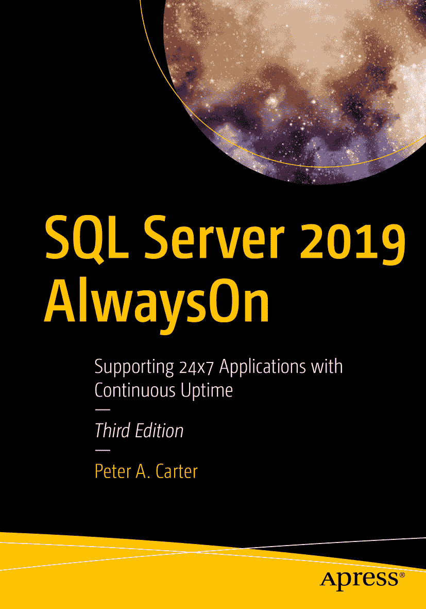

ISBN 978-1-4842-6478-2 电子版 ISBN 978-1-4842-6479-9 [`doi.org/10.1007/978-1-4842-6479-9`](https://doi.org/10.1007/978-1-4842-6479-9) © Peter A. Carter 2020
本作品受版权保护。出版者保留所有权利，无论涉及 material 的全部或部分，特别是翻译权、转载权、插图重用权、朗诵权、广播权、缩微胶片或其他任何物理方式的复制权，以及信息存储与检索、电子改编、计算机软件方面的传播权，或当前已知或未来开发的类似或相异方法。在本出版物中使用通用描述性名称、注册商标、服务标志等，即使未作特别声明，也不意味着这些名称可不受相关保护性法律法规的约束而可自由通用。出版者、作者和编辑均可安全地认为，本书中的建议和信息在出版时是真实准确的。出版者、作者或编辑均不就本书所含材料或其中可能存在的任何错误或遗漏提供任何明示或暗示的保证。对于出版地图中的管辖权主张及机构隶属关系，出版者保持中立。本书通过 Springer Science+Business Media LLC 在全球图书贸易中发行，地址：1 New York Plaza, Suite 4600, New York, NY 10004。电话 1-800-SPRINGER，传真 (201) 348-4505，电子邮箱 orders-ny@springer-sbm.com，或访问 www.springeronline.com。Apress Media, LLC 是一家加州有限责任公司，其唯一成员（所有者）是 Springer Science + Business Media Finance Inc (SSBM Finance Inc)。SSBM Finance Inc 是一家特拉华州公司。

## 引言

`SQL Server 2019 AlwaysOn` 旨在为需要为其 SQL Server 工作负载实施高可用性和灾难恢复的数据库管理员（DBA）提供一本快速入门指南。

本书首先讨论高可用性的概念和方法，然后对高可用性/灾难恢复技术进行概述。接着深入细节。我们将讨论如何创建 Windows 集群，然后再介绍如何创建 SQL Server `AlwaysOn 故障转移群集实例`。

然后，本书的重点转向 `AlwaysOn 可用性组`。在此部分，本书讨论了如何在 Windows 和 Linux 操作系统上创建和配置可用性组，以实现高可用性和灾难恢复。

接着，我们探讨了 `AlwaysOn 可用性组` 的非典型用例，例如无群集和独立于域的可用性组，以及在 Azure IaaS 上配置可用性组，和针对 SQL Server 标准版的“基本可用性组”。

最后，本书着眼于 AlwaysOn 的运维方面，包含涵盖该技术的管理、监控和故障排除的章节。

## 致谢

我要衷心感谢杰出的 Chris Dent，他再次为我提供了本书相关的网络配置帮助。

我还要感谢 Ian Stirk，他的技术评审总是能提升我书籍的质量，本书也不例外。

## 关于作者 关于技术评审者

## 1. 高可用性与灾难恢复概念

在当今运行关键业务应用的 24×7 环境中，企业严重依赖于其数据的可用性。虽然服务器及其软件通常很可靠，但始终存在硬件故障或软件错误的风险，其中任何一项都可能导致服务器宕机。为了减轻这些风险，关键业务应用通常依赖冗余硬件来提供容错能力。如果主系统发生故障，应用可以自动故障转移到冗余系统。这是 `高可用性（HA）` 的基本原则。

即使实施了 HA 技术，仍然存在导致应用不可用的小概率事件的风险。这可能是由于重大事件，例如自然灾害或恐怖行为导致的数据中心损毁。也可能是由于数据损坏或人为错误，导致应用数据丢失或损坏到无法修复的程度。

在这些情况下，一些应用可能依赖于恢复最新的备份以尽可能多地找回数据。然而，更关键的应用可能需要一个冗余服务器在次要位置保存数据的同步副本。这是 `灾难恢复（DR）` 的核心概念。本章将讨论 HA 和 DR 背后的概念。


## 可用性级别

一个解决方案可供最终用户使用的时间量被称为 `level of availability` 或 `uptime`。为了提供真实准确的正常运行时间视图，公司应该从用户的桌面测量解决方案的可用性。换句话说，即使你的 SQL Server 已经不间断运行了一个多月，用户仍可能因为其他因素而经历其解决方案的中断。这些因素可能包括网络中断或应用服务器故障。

然而，在某些情况下，你别无选择，只能在 SQL Server 级别测量可用性水平。这可能是因为你缺乏企业内的整体监控工具。但最常见的情况是，在实例级别测量可用性水平的要求是政治性的，而非技术性的。在 IT 行业，将数据中心管理外包给第三方提供商已成为一种趋势。在这种情况下，负责管理 SQL 服务器的提供商不一定就是负责网络或应用服务器的提供商。在这种场景下，你需要监控 SQL Server 级别的正常运行时间，以准确判断服务提供商的性能。

可用性水平是以应用或服务器可用时间的百分比来衡量的。公司通常努力实现 99%、99.9%、99.99% 或 99.999% 的可用性。因此，可用性水平通常以“9”的个数来指代。例如，“五个 9”的可用性意味着 99.999% 的正常运行时间，“三个 9”意味着 99.9% 的正常运行时间。

表 1-1 详细列出了每个可用性级别每周、每月和每年可接受的停机时间。

表 1-1
可用性级别

| 可用性级别 | 每周停机时间 | 每月停机时间 | 每年停机时间 |
| --- | --- | --- | --- |
| 99% | 1 小时, 40 分钟, 48 秒 | 7 小时, 18 分钟, 17 秒 | 3 天, 15 小时, 39 分钟, 28 秒 |
| 99.9% | 10 分钟, 4 秒 | 43 分钟, 49 秒 | 8 小时, 45 分钟, 56 秒 |
| 99.99% | 1 分钟 | 4 分钟, 23 秒 | 52 分钟, 35 秒 |
| 99.999% | 6 秒 | 26 秒 | 5 分钟, 15 秒 |

*所有值均向下取整到最近的秒。*

要计算其他可用性级别，你可以使用代码清单 1-1 中的脚本。在运行此脚本之前，请将 `@Uptime` 的值替换为你希望计算的正常运行时间级别。你还应该将 `@UptimeInterval` 的值替换为每周、每月或每年的正常运行时间。

```sql
DECLARE @Uptime    DECIMAL(5,3) ;
--指定要计算的可用性级别
SET @Uptime = 99.9 ;
DECLARE @UptimeInterval VARCHAR(5) ;
--指定 WEEK, MONTH, 或 YEAR
SET @UptimeInterval = 'YEAR' ;
DECLARE @SecondsPerInterval FLOAT ;
--计算每个时间间隔的秒数
SET @SecondsPerInterval =
(
SELECT CASE
WHEN @UptimeInterval = 'YEAR'
THEN 60*60*24*365.243
WHEN @UptimeInterval = 'MONTH'
THEN 60*60*24*30.437
WHEN @UptimeInterval = 'WEEK'
THEN 60*60*24*7
END
) ;
DECLARE @UptimeSeconds DECIMAL(12,4) ;
--计算正常运行时间
SET @UptimeSeconds = @SecondsPerInterval * (100-@Uptime) / 100 ;
--格式化结果
SELECT
CONVERT(VARCHAR(12), FLOOR(@UptimeSeconds /60/60/24))   + ' 天, '
+ CONVERT(VARCHAR(12), FLOOR(@UptimeSeconds /60/60 % 24)) + ' 小时, '
+ CONVERT(VARCHAR(12),  FLOOR(@UptimeSeconds /60 % 60))    + ' 分钟, '
+ CONVERT(VARCHAR(12),  FLOOR(@UptimeSeconds % 60))        + ' 秒.' ;
```

代码清单 1-1
计算可用性级别

### 实际可用性

现在我们了解了如何计算应用程序所需的可用性级别，我们还应该了解如何计算应用程序的实际可用性。我们可以通过获取 MTBF（平均故障间隔时间）和 MTTR（平均恢复时间）指标来实现。

`MTBF` 指标描述了故障之间的平均时间长度。例如，假设我们正在审查过去一周的服务日志，发现 `Foo` 应用程序遭受了三次中断。一周有 168 小时，并且发生了三次故障。我们只需要将时间段内的小时数除以故障次数。这将得出我们的 `MTBF`。在这个例子中，我们的 `MTBF` 是 56 小时。

`MTTR` 实际上可以有两种不同的含义：平均恢复时间或平均修复时间。当没有高可用性或灾难恢复计划时，`MTTR` 指标描述了修复损坏物品所需的平均时间长度。这可能是一个较长的时间，因为我们可能需要等待服务工程师来更换故障硬件。然而，当考虑到高可用性和灾难恢复时，我们使用 `MTTR` 指标来表示“平均恢复时间”，以记录中断的持续时间。例如，如果我们有一个三节点集群，其中一个节点发生硬件故障，我们当然需要修复这台服务器，但从应用程序停机的角度来看，我们只会有几秒钟或几分钟的中断，同时服务会故障转移，我们仍然具有弹性，这意味着应用程序的非功能性需求不会受到影响。因此，在这个例子中，我将假设 `MTTR` 指的是“平均恢复时间”。

我们可以通过将时间段内的总停机时间相加，然后除以故障次数来计算 `MTTR`。在这个例子中，在我们的 168 小时期间内，我们有三次故障，总停机时间为 12 分钟。因此，我们的 `Foo` 应用程序的 `MTTR` 是 4 分钟。

现在我们知道了应用程序的 `MTBF` 和 `MTTR`，我们可以使用这些指标来计算应用程序的实际可用性。公式是 `(MTBF/(MTBF+MTTR))*100`。因此，在这个例子中，我们首先需要将 `MTTR` 值转换为小时，以便单位一致。4 分钟是 0.06667 小时。因此，我们的计算将是 `(56/(56+0.06667))*100`。这使得我们应用程序的实际可用性为 99.8811%。

### 服务级别协议与服务级别目标

当第三方提供商负责管理服务器时，合同通常包括服务级别协议。这些 SLA 定义了许多参数，包括可接受的停机时间、故障发生时服务器可以宕机的最长时间，以及发生故障时可接受的数据丢失量。通常，如果未满足这些 SLA，提供商将面临经济处罚。

如果服务器是内部管理的，数据库管理员仍然有“客户”的概念。这些通常是应用程序的最终用户，主要联系人是业务负责人。应用程序的业务负责人是企业内委托该应用程序并负责签署资金增强等事项的利益相关者。

在内部场景中，仍然可以定义 SLA，在这种情况下，如果未能满足这些 SLA，IT 基础架构或平台部门可能会向业务团队承担费用。然而，在内部场景中，IT 部门与业务团队协商服务级别目标要比 SLA 常见得多。SLO 在性质上与 SLA 非常相似，但它们的使用意味着业务团队不会因未能满足目标而对 IT 部门实施经济处罚。

### 主动维护

重要的是要记住，停机不仅由故障引起，还可能源于主动维护。例如，如果您需要为操作系统或 SQL Server 本身打上最新的服务包，那么在安装过程中必然会有一段停机时间。

根据您所应用的升级类型，这种情况下的停机时间可能相当可观——对于一台独立服务器可能长达数小时。在这种情况下，高可用性对于许多业务关键型应用程序至关重要——不是为了防范计划外停机，而是为了避免在计划维护期间出现长时间的服务中断。

### 恢复点目标与恢复时间目标

应用程序的**恢复点目标** (`RPO`) 表明在发生故障时可接受的数据丢失量。例如，对于一个支持报表应用程序的数据仓库，鉴于它可能仅由 ETL 过程每天更新一次且所有其他活动都是只读报表，这个 `RPO` 可能是一个较长的周期，比如 24 小时。然而，对于高度事务性的系统，例如支持交易平台或 Web 应用程序的 OLTP 数据库，`RPO` 将为零。`RPO` 为零意味着不允许任何数据丢失。

应用程序针对高可用性和灾难恢复可能有不同的 `RPO`。例如，出于成本或应用程序性能的考虑，站点内的故障转移可能需要零 `RPO`。然而，如果同一应用程序故障转移到灾难恢复 (DR) 数据中心，五到十分钟的数据丢失可能是可以接受的。这是因为实现站点内可用性和站点间恢复所采用的技术存在差异。

应用程序的**恢复时间目标** (`RTO`) 指定了在恢复完成且用户可以重新连接之前，应用程序可以停机的最大时间。在计算可实现的 `RTO` 时，您需要考虑许多方面。例如，集群从一个节点故障转移到另一个节点以及 SQL Server 服务重新启动可能只需要不到一分钟；然而，数据库恢复可能需要更长的时间。数据库恢复所需的时间取决于许多因素，包括数据库的大小、实例中的数据库数量以及故障转移发生时正在进行中的事务数量。这是因为所有未提交的事务都需要回滚。

就像 `RPO` 一样，根据是站点内还是站点间故障转移，通常存在不同的 `RTO`。同样，这主要是由于技术差异，但也取决于如果主数据中心丢失，您需要在灾难恢复数据中心启动整个环境所需的时间。

在发生数据损坏的情况下，应用程序的 `RPO` 和 `RTO` 也可能有所不同。根据损坏的性质以及已实施的高可用性/灾难恢复 (HA/DR) 技术，数据损坏可能导致您需要从备份中还原数据库。

如果必须还原数据库，最坏的情况是可实现的恢复点可能是上次备份的时间。这意味着您必须将特定 `RPO` 的硬性业务要求纳入您的备份策略中。但是，如果只有部分数据库损坏，您或许可以从活动数据库中挽救一些数据，并且只从还原的数据库中还原损坏的数据。

数据损坏也可能对 `RTO` 产生影响。最大的影响因素之一是备份是本地存储在服务器上，还是需要从磁带中检索。从磁带，甚至从异地位置检索备份文件，可能会大大增加恢复过程的时间。

**注意**
直接从 SQL Server 备份到磁带已弃用。当本节提到从磁带检索备份时，是假设以磁带驱动器作为企业备份解决方案的目标，您的数据库备份已被卸载到该解决方案。

另一个影响因素是导致损坏的原因。如果是由有故障的 I/O 子系统引起的，那么您可能需要考虑让 Windows 管理员对卷运行磁盘检查命令 (`CHKDSK`) 的时间，以及可能更换磁盘所需的时间。但是，如果损坏是由用户意外截断表或删除数据文件引起的，则无需担心。

### 停机成本

如果您询问任何业务负责人，他们的应用程序可以接受多少停机时间和数据丢失，答案无一例外地分别是零和零。当然，永远无法保证零停机时间，而且一旦您开始解释与不同可用性级别相关的成本，就更容易协商出双方可接受的服务水平。

决定应争取达到几个 9 的关键因素是停机成本。停机相关的成本分为两类：有形成本和无形成本。有形成本通常比较容易计算。让我们以一个销售应用程序为例。在这种情况下，最明显的有形成本是因销售人员无法接受订单而导致的收入损失。无形成本更难量化，但可能昂贵得多。例如，如果客户无法向您的公司下订单，他们可能会将订单交给竞争对手公司，并且可能一去不复返。其他无形成本可能包括员工士气低落导致员工流动率上升，甚至公司声誉损失。由于无形成本的本质决定了它们只能估算，行业的经验法则是将有形成本乘以三，用这个数字来代表您的无形成本。

一旦您获得了应用程序每小时的总停机成本数字，就可以在整个应用程序的预测生命周期内按比例扩展这个数字，并比较实施不同可用性级别的成本。例如，假设您计算出总停机成本为每小时 2,000 美元，应用程序的预测生命周期为三年。表 **1-2** 说明了您的应用程序的停机成本，比较了您在考虑硬件、许可证、电力、布线、额外存储以及额外支持设备（如新机架）、管理成本等之后计算出的实施每个可用性级别的成本。这被称为解决方案的**总拥有成本** (`TCO`)。

**表 1-2**
停机成本

| 可用性级别 | 停机成本（三年） | 可用性解决方案成本 |
| --- | --- | --- |
| 99% | $525,600 | $108,000 |
| 99.9% | $52,560 | $224,000 |
| 99.99% | $5,256 | $462,000 |
| 99.999% | $526 | $910,000 |

在此表中，您可以看到，实施五个 9 的可用性比两个 9 的解决方案节省了 $525,074，但实施该解决方案的额外成本是 $802,000，这意味着它并不经济。四个 9 的可用性比两个 9 的解决方案节省了 $520,344，而实施成本仅增加了 $354,000。因此，对于此特定应用程序，四个 9 的解决方案是最适合设计的服务级别。


## 备用服务器的分类

备用解决方案分为三类。你可以使用不同的技术来实现每一类，尽管某些技术可用于实现多个类别的备用服务器。表 1-3 概述了可以实现的不同类别的备用方案。

表 1-3 备用方案分类

| 类别 | 描述 | 示例技术 |
| --- | --- | --- |
| 热 | 一种同步解决方案，可以自动或手动执行故障转移。通常用于高可用性。 | 故障转移群集、AlwaysOn 可用性组（同步） |
| 温 | 一种同步解决方案，只能手动执行故障转移。通常用于灾难恢复。 | 日志传送、AlwaysOn 可用性组（异步） |
| 冷 | 一种非同步解决方案，只能手动执行故障转移。仅适用于永不修改的只读数据。 | – |

注意
冷备用没有列出示例技术，因为它不需要同步，因此也不需要特定的技术实现。

## 总结

应用程序的可用性级别以应用程序可供用户使用的时间百分比来衡量。可用性级别通常用“几个九”来指代。例如，99.9% 的正常运行时间要求被称为三个九的可用性。正常运行时间要求越高，实施解决方案的成本就越高。因此，你力求达到的正常运行时间级别应由服务级别协议（SLA）和停机成本驱动。

恢复点目标是衡量在发生灾难时可以接受丢失多少数据的指标。例如，如果你的唯一灾难恢复解决方案是备份，并且备份计划每小时执行一次，那么你可以实现一小时的恢复点目标。恢复时间目标是衡量故障发生后恢复解决方案所需时间的指标。例如，如果你的恢复时间目标是 30 分钟，那么你必须在半小时内恢复服务。

确定应用程序的停机成本非常重要，因为这是决定可用性级别的主要驱动因素之一。停机成本包括有形成本和无形成本。有形成本可以计算，而无形成本需要估算。

冗余基础设施有助于维护应用程序和服务的可用性。冗余服务器将被分类为热、温或冷。热备用服务器是与活动服务器保持同步，并配置为允许自动故障转移的服务器。这适用于高可用性场景。温备用服务器是与活动服务器保持同步，但未配置为自动故障转移的服务器。相反，工程师必须手动执行故障转移。这适用于灾难恢复场景。冷备用服务器不与活动服务器保持同步，因此无法自动故障转移。冷备用服务器适用于所有数据为只读且永不修改的灾难恢复场景。

## 2. 理解高可用性和灾难恢复技术

SQL Server 提供了一套完整的技术来实现高可用性和灾难恢复。以下各节概述了这些技术并讨论了它们最合适的用途。

## AlwaysOn 故障转移群集

Windows 故障转移群集是一种提供高可用性的技术，其中一组最多 64 台服务器协同工作以提供冗余。一个 `AlwaysOn 故障转移群集实例 (FCI)` 是跨该组中的服务器的 SQL Server 实例。如果该组中的某台服务器发生故障，另一台服务器将接管该实例的所有权。其最适用的场景是数据库较大或写入量较高的高可用性场景。这是因为群集依赖于共享存储，意味着数据只写入磁盘一次。使用 SQL Server 级别的高可用性技术时，写入操作在主数据库上发生，然后在所有辅助数据库上再次发生，之后主数据库上的提交才完成。这可能导致性能问题。尽管可以将群集扩展到多个站点，但这涉及 SAN 复制，这意味着群集通常配置在单个站点内。

群集中的每台服务器称为一个 `节点`。因此，如果一个群集由三台服务器组成，则称为三节点群集。群集中的每个节点都安装了 SQL Server 二进制文件，但 SQL Server 服务仅在其中一个节点上启动，该节点称为 `活动节点`。群集中的每个节点还共享用于 SQL Server 数据和日志文件的相同存储。但是，存储仅连接到活动节点。

提示
在地理分散的群集中，每台服务器连接到不同的存储。卷通过 SAN 复制或 Windows 存储副本进行更新。群集将两个卷视为单个共享卷，一次只能连接到一个节点。

如果活动节点发生故障，则 SQL Server 服务停止，存储分离。然后，存储重新连接到群集中的另一个节点，并在该节点上启动 SQL Server 服务，该节点现在成为活动节点。该实例还被分配了自己的网络名称和 IP 地址，这些也绑定到活动节点。这意味着应用程序可以无缝连接到该实例，无论哪个节点拥有所有权。

图 2-1 中的示意图展示了一个双节点群集。它显示尽管数据库存储在共享存储阵列上，但每个节点仍然有一个专用的系统卷。此卷包含 SQL Server 二进制文件。它还说明了在发生故障转移时，共享存储、IP 地址和网络名称如何重新绑定到被动节点。

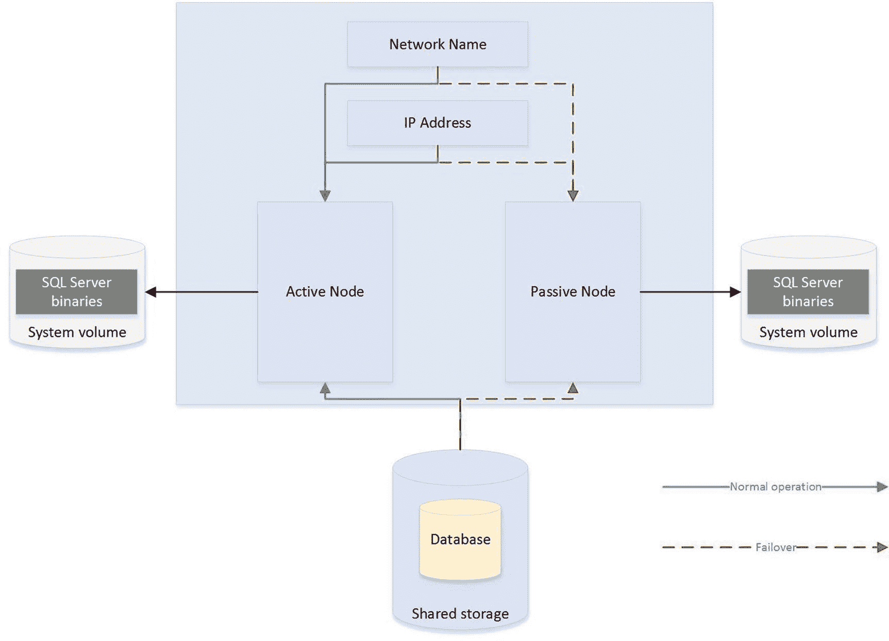
图 2-1 双节点群集

### 主动/被动配置

尽管图 2-1 中的示意图展示了一个 `主动/被动配置`，但也可以有 `主动/主动配置`。虽然一次不可能有一个以上的节点拥有单个实例，因此无法实现负载平衡，但是可以在群集上安装多个实例，并且不同的节点可以拥有每个实例。在此场景中，每个节点都有其唯一的网络名称和 IP 地址。每个实例的共享存储也由一组唯一的卷组成。

因此，在 `主动/主动配置` 中，在正常操作期间，`节点 1` 可能托管 `实例 1`，`节点 2` 可能托管 `实例 2`。如果 `节点 1` 发生故障，那么两个实例都将由 `节点 2` 托管，反之亦然。图 2-2 中的示意图展示了一个双节点 `主动/主动` 群集。

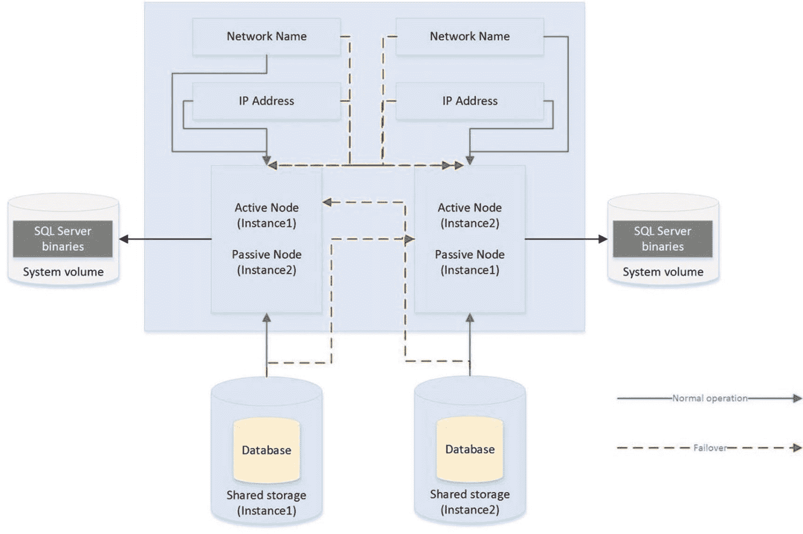
图 2-2 主动/主动群集

注意
在 `主动/主动` 群集中，必须考虑故障转移时的资源问题。例如，如果每个节点有 128GB RAM，且每个节点上托管的实例使用 96GB RAM 并在内存中锁定页面，那么当一个节点故障转移到另一个节点时，该节点也会因为没有足够的内存分配给两个实例而失败。请确保像规划单个服务器一样规划内存和处理器需求。因此，通常不建议将 `主动/主动` 群集用于 SQL Server。


## 三节点及以上的配置

如前所述，一个集群中最多可容纳 64 个节点。当拥有三个或更多节点时，考虑到相关成本，您可能不希望仅有一个活动节点和两个冗余节点。相反，您可以选择实施 N+1 或 N+M 配置。

在 N+1 配置中，您拥有多个活动节点和一个被动节点。如果任何一个活动节点发生故障，它们会故障转移到被动节点。图 2-3 中的示意图描绘了一个三节点的 N+1 集群。

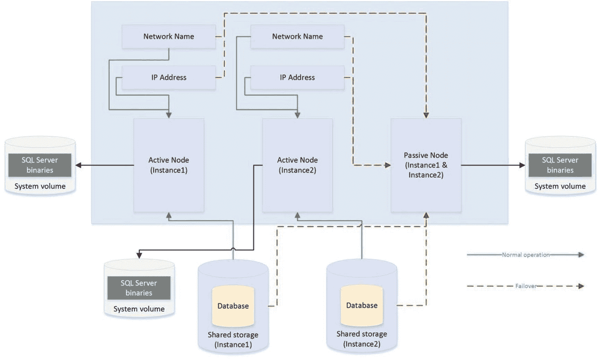

**图 2-3** 三节点 N+1 配置

在 N+1 配置中，发生多重故障的场景下，多个节点可能会故障转移到同一个被动节点。因此，在规划资源时必须非常谨慎，以确保被动节点能够支持多个实例。不过，您可以通过使用 N+M 配置来缓解此问题。

N+1 配置拥有多个活动节点和一个被动节点，而 N+M 集群则拥有多个活动节点和多个被动节点，尽管被动节点的数量通常少于活动节点。图 2-4 中的示意图展示了一个五节点的 N+M 配置。该图显示，实例 3 被配置为始终故障转移到其中一个被动节点，而实例 1 和实例 2 则被配置为始终故障转移到另一个被动节点。这使您可以灵活地控制被动节点上的资源，但您也可以将集群配置为允许任何活动节点故障转移到任一被动节点——如果这对您的环境来说是更合适的设计。

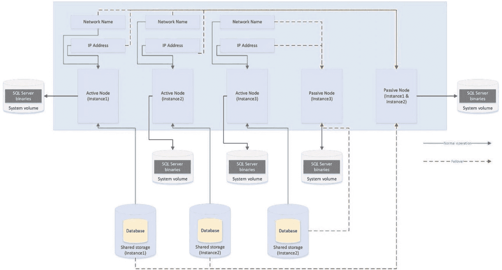

**图 2-4** 五节点 N+M 配置

## 仲裁

为了实现自动故障转移，集群服务需要知晓节点是否宕机。为此，您必须形成仲裁。仲裁的定义是“开展业务所需的最少成员数量”。在高可用性的语境下，这意味着集群内的每个节点，以及可选的见证设备（可以是集群磁盘、集群外部的文件共享或 Azure BLOB 存储），都会获得一票投票权。如果超过半数的投票成员无法与某个节点通信，集群服务便知道该节点已宕机，并将该服务器上任何集群感知的应用程序故障转移到另一个节点。之所以需要超过半数的投票成员无法与该节点通信，是为了避免一种称为 `脑裂` 的情况。

为解释脑裂场景，想象您在数据中心 1 有三个节点，在数据中心 2 也有三个节点。现在假设两个数据中心之间的网络连接中断，但所有六个节点仍保持在线。数据中心 1 的三个节点认为数据中心 2 的所有节点都不可用。反之，数据中心 2 的节点认为数据中心 1 的节点不可用。这导致集群的两侧（称为分区）都认为自己应该取得控制权。这对于成功连接到任一分区的任何应用程序都可能产生不可预测且不希望的后果。`仲裁 = (投票成员数 / 2) + 1` 这个公式正是为了防止这种场景。

**提示**
如果您的集群失去仲裁，可以通过使用 `/fq` 开关启动集群服务来强制一个分区联机。如果您使用的是 Windows Server 2012 R2 或更高版本，则您强制联机的分区将被视为 `权威分区`。这意味着当连接恢复时，其他分区可以自动重新加入集群。

有多种仲裁模型可用，最合适的模型取决于您的环境。表 2-1 列出了您可以使用的模型，并详述了其最适用的方式。

**表 2-1** 仲裁模型

| 仲裁模型 | 适用场景 |
| --- | --- |
| 节点多数 | 当集群中的节点数为奇数时 |
| 节点+磁盘见证多数 | 当集群中的节点数为偶数时 |
| 节点+文件共享见证多数 | 当节点分布在多个站点时，或当节点数为偶数且需要避免使用共享磁盘时* |

\* *由于虚拟化而需要避免共享磁盘的原因将在本章后面讨论。*

虽然默认选项是“一个节点，一票”，但可以通过将 `NodeWeight` 属性更改为零来手动移除节点的投票权。这在您拥有 `多子网集群`（节点分布在多个站点的集群）时非常有用。在此场景中，建议您在第三个站点使用文件共享见证。这有助于避免因数据中心之间的网络故障而导致集群中断。然而，如果您的仲裁节点数为奇数，那么添加文件共享见证会导致投票数为偶数，这是危险的。移除辅助数据中心中某个节点的投票权即可消除此问题。从 Windows Server 2019 开始，文件共享见证可以是任何支持 SMB（服务器消息块）2.0 或更高版本的文件共享。这包括连接到网络路由器的 USB 密钥、NAS（网络附加存储设备）以及加入工作组的 Windows 计算机。

**注意**
文件共享见证不存储完整的仲裁数据库副本。这意味着带有文件共享见证的双节点集群容易受到一种称为 `时间分区` 的场景影响。在此场景中，如果您在为第二个节点打补丁或更改集群服务的过程中有一个节点发生故障，那么将没有最新的仲裁数据库副本。这会使您处于需要销毁并重建集群的境地。

现代版本的 Windows Server 还支持动态仲裁和 50% 节点拆分裁决器的概念。启用动态仲裁后，集群服务会根据集群中的节点数量自动决定是否赋予仲裁见证投票权。如果您有偶数个节点，则会为其分配一票。如果您有奇数个节点，则不为其分配投票权。50% 节点拆分裁决器扩展了这个概念。如果您有偶数个节点和一个见证，而见证发生故障，那么集群服务会自动移除集群中某个随机节点的一票。这维持了仲裁中投票数为奇数，降低了因见证故障导致集群离线的风险。

**提示**
如果您的集群运行在 Windows Server 2016 或更高版本的数据中心版上，则支持存储空间直通。它允许使用本地连接的物理存储，并在其上构建软件定义的存储层来实现高可用性。关于存储空间直通的完整讨论超出了本书范围，但您可以在 [`docs.microsoft.com/en-us/windows-server/storage/storage-spaces/storage-spaces-direct-overview`](http://docs.microsoft.com/en-us/windows-server/storage/storage-spaces/storage-spaces-direct-overview) 找到更多详细信息。


## AlwaysOn 可用性组

AlwaysOn 可用性组 (AOAG) 取代了数据库镜像，本质上是数据库镜像和群集技术的合并。在群集的每个节点上，SQL Server 作为独立实例安装（与 AlwaysOn 故障转移群集实例相对）。然后，在群集上安装一个群集感知应用程序，称为 `可用性组侦听器`；它用于将流量定向到正确的节点。然而，AOAG 不依赖于共享磁盘，而是压缩日志流并将其发送到其他节点，其方式类似于数据库镜像。

AOAG 是处理数据库较小且写入负载较低场景中高可用性的最合适技术。这是因为，在同步使用时，它要求在数据提交到主数据库之前，所有同步副本都已提交该数据。你最多可以拥有八个副本，其中包括三个同步副本。AOAG 也可能是虚拟化环境中实现高可用性的最合适技术。这是因为群集所需的共享磁盘可能与虚拟化环境的某些功能不兼容。例如，当虚拟机 (VM) 使用通过 `光纤通道` 呈现的共享磁盘时，`VMware` 不支持使用 `vMotion`（用于在物理服务器之间手动移动虚拟机）和 `分布式资源调度器 (DRS)`（用于根据资源利用率在物理服务器之间自动移动虚拟机）。

提示

可以通过 `iSCSI` 连接将存储直接呈现给来宾操作系统来规避 VMware 功能对共享磁盘的限制，但代价是性能下降。

当你需要主动故障转移但不需要实现负载延迟时，AOAG 是灾难恢复 (DR) 的最合适技术。在你希望利用 DR 服务器卸载报表负载的场景中，AOAG 也可能适用于灾难恢复。这使得冗余服务器能够被利用。当用于灾难恢复时，AOAG 以异步模式工作。这意味着在发生故障转移时有可能丢失数据。恢复点目标 (`RPO`) 是不确定的，并且基于最后一个未提交事务的时间。

在过去数据库镜像的时代，辅助数据库始终处于脱机状态。这意味着你不能使用辅助数据库来卸载任何报表或其他只读活动。可以通过针对辅助数据库创建数据库快照并将只读活动指向该快照来解决这个问题。然而，这仍然很复杂，因为你必须配置你的应用程序针对不同的网络名称和 IP 地址发出只读语句。另一方面，可用性组允许你将一个或多个副本配置为可读。唯一的限制是，可读副本和自动故障转移不能配置在同一个辅助副本上。然而，通常的做法是将可读的辅助副本配置为异步提交模式，以免损害性能。

为了进一步简化这一点，`可用性组副本` 会检查应用程序的 `连接字符串` 中的 `只读` 或 `读意图` 属性，并将应用程序定向到适当的节点。这意味着你可以轻松地横向扩展报表和数据库维护例程，只需极少的开发工作，并且应用程序能够使用单个连接字符串。

因为 AOAG 允许你组合同步副本（带或不带自动故障转移）、异步副本和用于只读访问的副本，所以它允许你使用单一技术来满足高可用性、灾难恢复和报表横向扩展的需求。如果你的唯一需求是读取扩展，而不是高可用性或灾难恢复，那么实际上可以从 `SQL Server 2017` 开始配置不带群集的可用性组。在这种情况下，没有群集服务，因此也没有自动重定向。可用性组内的副本在相互通信时使用证书。如果你在没有 Active Directory 的情况下、在工作组中或跨域配置可用性组，也是如此。

当你使用 AOAG 时，故障转移既不发生在数据库级别，也不发生在实例级别。相反，故障转移发生在可用性组级别。可用性组是一个概念，允许你将相关的数据库分组在一起，以便它们可以作为一个原子单元进行故障转移。这在整合环境中特别有用，因为它允许你将映射到单个应用程序的数据库分组在一起。然后，出于灾难恢复测试等目的，你可以将此应用程序故障转移到另一个副本，而不会影响托管在同一实例上的其他数据层应用程序。

对于实例上可以配置的可用性组数量没有硬性限制，对于实例上可以参与 AOAG 的数据库数量也没有硬性限制。然而，微软已经测试并官方推荐每个实例最多 100 个数据库和 10 个可用性组。扩展数据库数量的主要限制因素是 AOAG 使用数据库镜像端点，并且每个实例只能有一个。这意味着所有数据修改的日志流都通过同一个端点发送。

图 2-5 描绘了如何将数据层应用程序映射到可用性组以实现独立故障转移。在此示例中，单个实例托管两个数据层应用程序。每个应用程序都已添加到单独的可用性组中。第一个可用性组已故障转移到 Node2。因此，可用性组侦听器将 Application1 的流量指向 Node2，将 Application2 的流量指向 Node1。因为每个可用性组都有自己的网络名称和 IP 地址，并且这些资源随 AOAG 一起故障转移，所以应用程序能够在故障转移后无缝地重新连接到数据库。

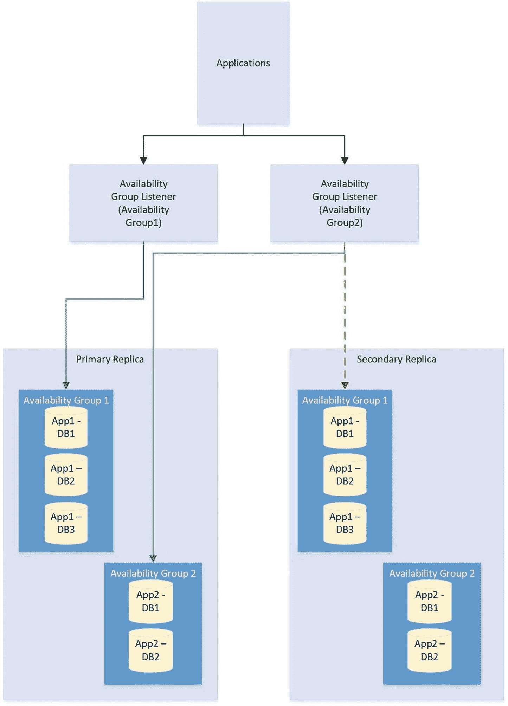

图 2-5

可用性组故障转移

图 2-6 中的图表描述了一个 AlwaysOn 可用性组拓扑。在此示例中，群集中有四个节点和一个磁盘见证。Node1 承载数据库的主副本，Node2 用于自动故障转移，Node3 用于卸载报表，Node4 用于灾难恢复。由于群集跨两个数据中心延伸，因此已实现多子网群集。然而，由于没有共享存储，因此站点之间不需要 `SAN` 复制。

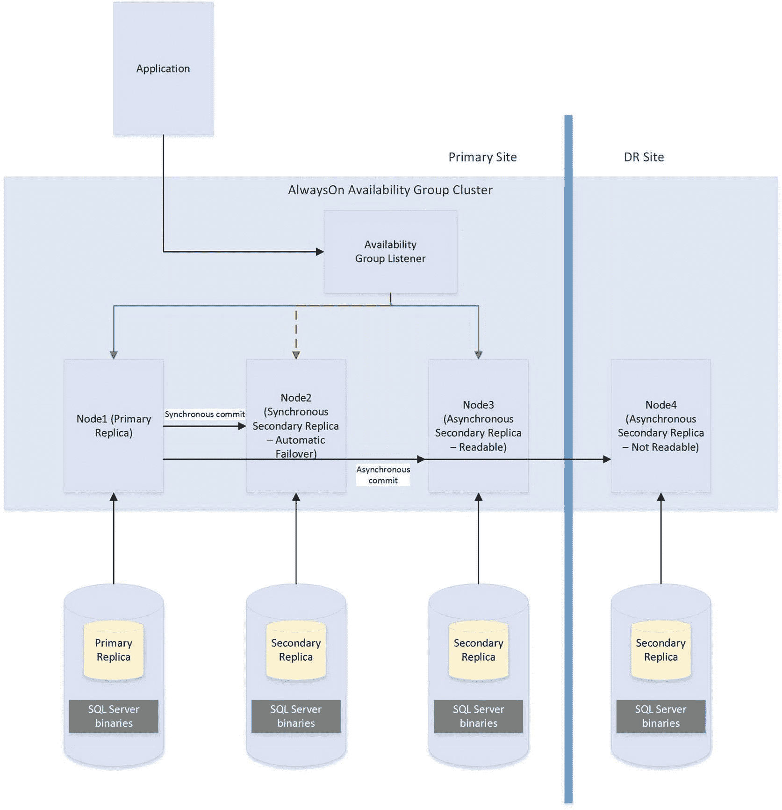

图 2-6

AlwaysOn 可用性组拓扑


### 自动页面修复

如果在一个配置为 **AlwaysOn 可用性组**拓扑结构中的副本的数据库中，某个页面损坏，那么 SQL Server 会尝试通过从某个辅助副本获取该页面的副本来修复损坏。这意味着逻辑损坏可以在无需你执行还原操作或运行带有修复选项的 `DBCC CHECKDB` 的情况下得到解决。但是，自动页面修复不适用于以下页面类型：

*   文件头页面
*   数据库引导页面
*   分配页面
    *   GAM（全局分配映射）
    *   SGAM（共享全局分配映射）
    *   PFS（页面可用空间）

如果主副本因为页面损坏而无法读取该页面，它会首先将该页面记录在 `MSDB.dbo.suspect_pages` 表中。然后，它会检查是否至少有一个副本处于 `SYNCHRONIZED` 状态，并且事务是否仍在发送到该副本。如果满足这些条件，主副本会向所有副本发送一个广播，指定已刷出日志末尾的 `PageID` 和 LSN（日志序列号）。然后，该页面被标记为“还原挂起”，这意味着任何访问它的尝试都将失败，并返回错误代码 829。

收到广播后，辅助副本会等待，直到它们已重做的事务达到广播消息中指定的 LSN。此时，它们尝试访问该页面。如果无法访问，则返回错误。如果它们 `可以` 访问该页面，它们会将该页面发送回主副本。主副本接受第一个响应的辅助副本发来的页面。

然后，主副本将用从辅助副本收到的版本替换损坏的页面副本。此过程完成后，它会更新 `MSDB.dbo.suspect_pages` 表中的页面记录，通过将 `event_type` 列设置为值 `5（已修复）` 来反映该页面已被修复。

如果辅助副本在重做日志时因为页面损坏而无法读取该页面，它会将该辅助副本置于 `SUSPENDED` 状态。然后，它会将该页面记录在 `MSDB.dbo.suspect_pages` 表中，并向主副本请求该页面的副本。主副本尝试访问该页面。如果无法访问，则返回错误，并且辅助副本保持 `SUSPENDED` 状态。

如果主副本可以访问该页面，则将其发送到发出请求的辅助副本。辅助副本用从主副本获取的版本替换损坏的页面。然后，它使用 `event_id` 为 `5` 更新 `MSDB.dbo.suspect_pages` 表。最后，它尝试恢复 AOAG 会话。

**注意**
可以手动恢复会话，但如果你这样做，在同步过程中会再次遇到损坏的页面。请确保首先在主副本上修复或还原该页面。

## 日志传送

日志传送是一种可用于实现灾难恢复的技术。它的工作原理是在主体服务器上备份事务日志，将其复制到辅助服务器，然后还原它。日志传送最适用于需要加载延迟的灾难恢复场景，因为这在 AOAG 中无法实现。例如，在用户意外删除表中所有数据的情况下，如果灾难恢复服务器上的数据库更新存在延迟，那么就有可能从该灾难恢复服务器恢复此表的数据，然后重新填充生产服务器。这意味着你无需还原备份来恢复数据。日志传送不适用于高可用性，因为它没有自动故障转移功能。图 2-7 中的图表展示了一个日志传送拓扑。

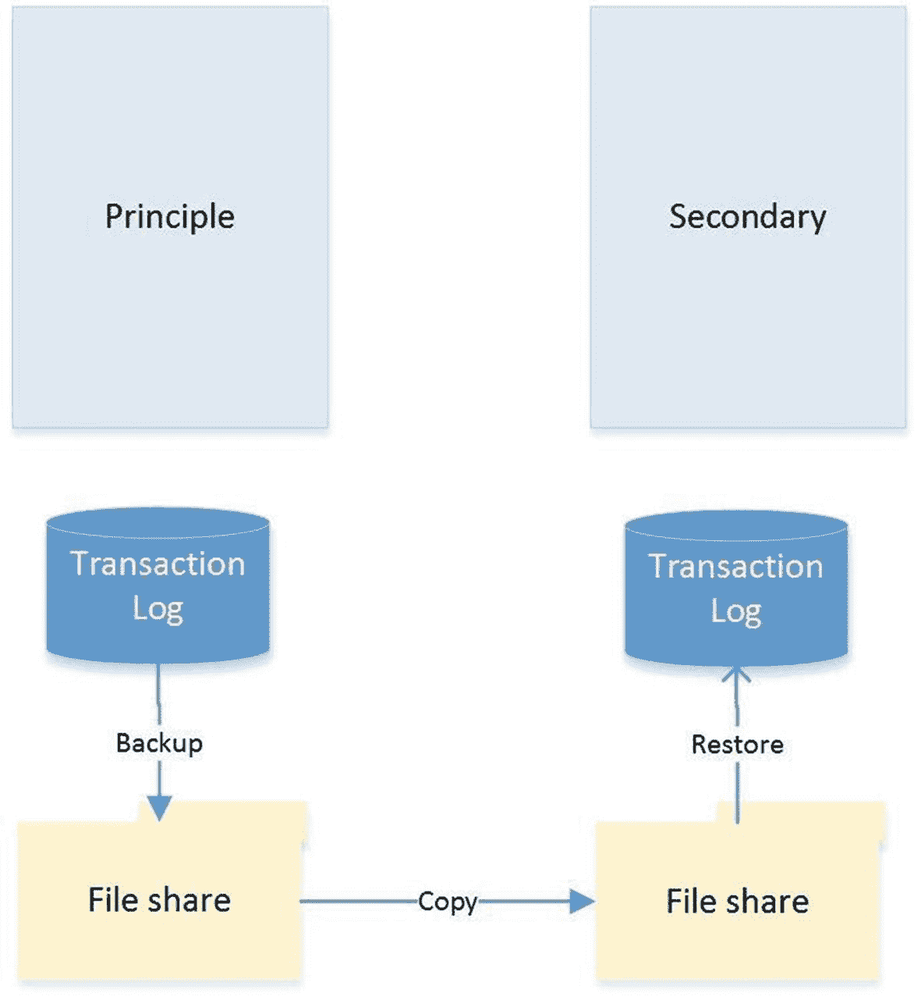

图 2-7 日志传送拓扑

### 恢复模式

在日志传送拓扑中，始终恰好有一个主体服务器，即生产服务器。但是，可以有多个辅助服务器，并且这些服务器可以是灾难恢复服务器和用于卸载报表负载的服务器的混合体。

还原事务日志时，可以指定三种恢复模式：`Recovery`（恢复）、`NoRecovery`（不恢复）和 `Standby`（待机）。`Recovery` 模式使数据库处于在线状态，这在日志传送中不受支持。`NoRecovery` 模式使数据库保持离线状态，以便可以还原更多备份。这是日志传送的常规配置，也是灾难恢复场景的合适选择。

`Standby` 选项使数据库处于在线状态，但为只读状态，以便可以还原更多备份。此功能通过维护一个 `TUF`（事务撤销文件）来实现。`TUF` 文件记录事务日志中任何未提交的事务。这意味着你可以回滚事务日志中的这些未提交事务，从而使数据库更易于访问（尽管是只读的）。下次需要应用还原时，你可以在下一个日志还原的重做阶段开始之前，将 `TUF` 文件中的未提交事务重新应用到日志中。

图 2-8 展示了一个同时使用灾难恢复服务器和报表服务器的日志传送拓扑。

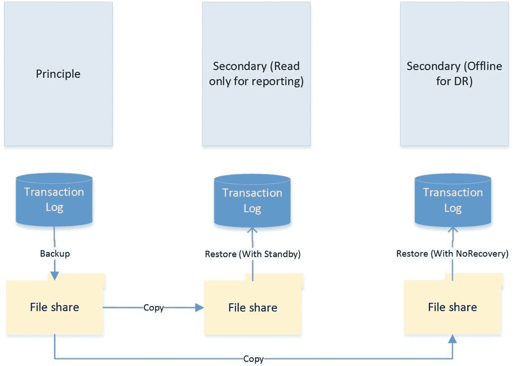

图 2-8 带有灾难恢复和报表服务器的日志传送

### 远程监视服务器

可选地，你可以在日志传送拓扑中配置一个监视服务器。这有助于集中监控和警报。当你实现监视服务器时，所有备份、复制和还原操作的历史和状态都存储在监视服务器上。监视服务器还允许你拥有单个警报作业，该作业配置为监控所有服务器上的备份、复制和还原操作，而无需在拓扑中的每个服务器上配置单独的警报。

**警告**
如果希望使用监视服务器，在设置日志传送时进行配置至关重要。日志传送配置完成后，添加监视服务器的唯一方法是拆除并重新配置日志传送。

### 故障转移

与其他高可用性和灾难恢复技术不同，日志传送的故障转移涉及一定量的管理操作。要对日志传送进行故障转移，你必须备份事务日志的尾部，并将其与任何其他未复制的备份文件一起复制到辅助服务器。

现在你需要按顺序将剩余的事务日志备份应用到辅助服务器，最后应用尾日志备份。除最后一次还原外，所有还原都使用 `WITH NORECOVERY` 选项应用；最后一次还原使用 `WITH RECOVERY` 选项应用，以使数据库以一致状态重新上线。如果不计划故障回复，你可以使用辅助服务器作为新的主服务器重新配置日志传送。


## 技术整合

为满足业务目标与非功能性需求（NFRs），您需要将多种高可用性与灾难恢复技术整合在一起，以构建可靠、可扩展的平台。一个经典的例子便是需要将`AlwaysOn 故障转移群集`与`AlwaysOn 可用性组`结合使用。

之所以需要整合这些技术，是因为当您使用同步模式的`AlwaysOn 可用性组`（这是实现自动故障转移所必需的）时，可能会引发性能瓶颈。正如本章前面所讨论的，性能问题源于事务在辅助服务器上提交后，才在主服务器上提交。然而，群集技术不会遇到此问题，因为它依赖于`共享磁盘资源`，因此事务仅被提交一次。

因此，通常的做法是先利用群集实现高可用性，再使用`AlwaysOn 可用性组`来执行`灾难恢复（DR）`和/或卸载报表负载。图 2-9 中的示意图展示了一种`HA/DR`拓扑结构，它结合了群集与`AOAG`，分别实现高可用性和灾难恢复。

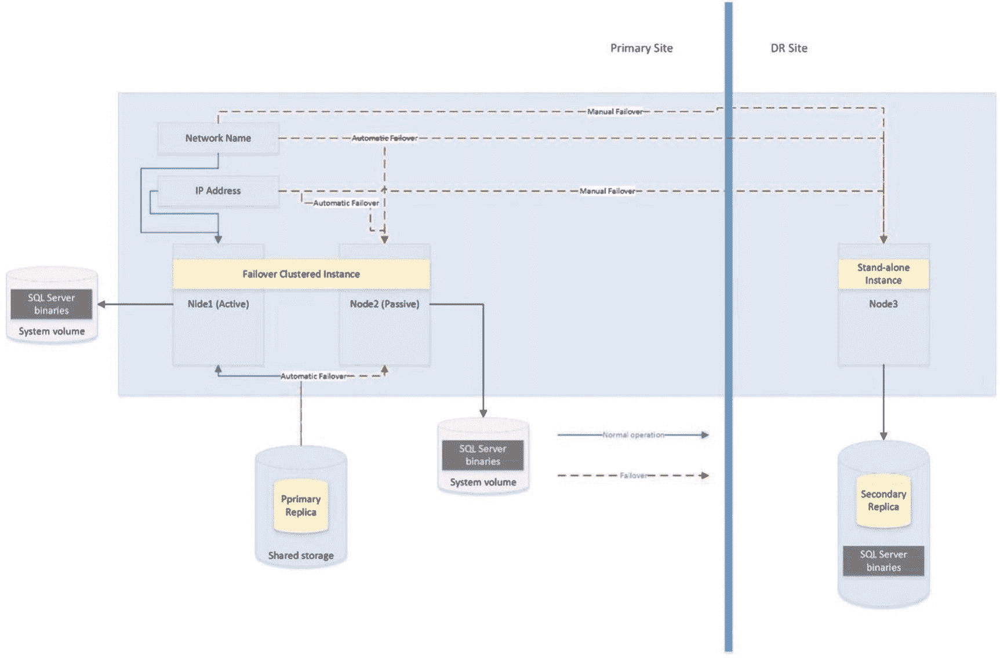
**图 2-9** 故障转移群集与 AlwaysOn 可用性组结合

图 2-9 的示意图显示，数据库的主副本托管在一个双节点主动/被动群集上。如果主动节点发生故障，则应用群集规则，`共享存储`、`网络名称`和`IP 地址`将重新附加到被动节点，使其成为新的主动节点。然而，如果两个节点均无法访问，可用性组侦听器会将流量指向群集的第三个节点，该节点位于`灾难恢复（DR）`站点，并通过日志流复制进行同步。当然，当使用异步模式时，数据库必须由`数据库管理员（DBA）`手动进行故障转移。

另一种常见场景是结合使用群集与`日志传送`来分别实现高可用性和灾难恢复。这种组合的工作方式与群集结合`AlwaysOn 可用性组`非常相似，如图 2-10 所示。

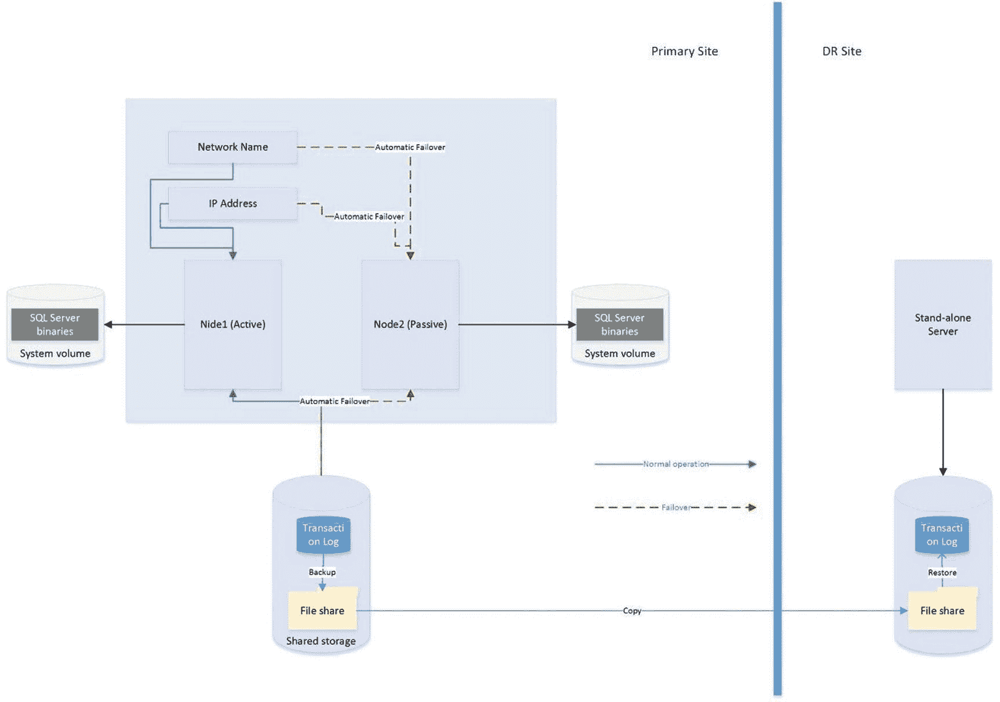
**图 2-10** 故障转移群集与日志传送给合

示意图显示，在主数据中心已配置了一个双节点主动/被动群集。托管在此实例上的数据库的`事务日志`随后被传送到`灾难恢复（DR）`数据中心的一台独立服务器。由于群集使用`共享存储`，您也应为`备份卷`使用`共享存储`，并将`备份卷`作为资源添加到角色中。这意味着当实例故障转移到另一个节点时，`备份共享`也会随之故障转移，`日志传送`得以继续同步，不会中断。

**注意**
如果在`日志传送备份`或`复制作业`正在进行时发生故障转移，`日志传送`可能会失去同步并需要手动干预。这意味着故障转移后，您应检查`日志传送`作业的运行状况。

## 总结

理解可用性的概念是为需要高可用性和灾难恢复的应用程序做出正确实现选择的关键。您应计算停机成本，并将其与实现不同`HA/DR`解决方案选择的成本进行比较，以帮助企业了解每个选项的成本/效益概况（如第 1 章所述）。在选择技术实现时，您还应注意`服务级别协议（SLAs）`，因为未能满足`SLAs`可能会带来财务处罚。

`SQL Server`提供了一套完整的高可用性和灾难恢复技术，使您能够灵活地实现最适合`数据层应用程序`需求的解决方案。对于高可用性，您可以选择实现故障转移群集或`AlwaysOn 可用性组（AOAG）`。故障转移群集使用`共享磁盘资源`，故障转移发生在`实例级别`。而`AOAG`则通过维护数据库的冗余副本及同步日志流，在`数据库级别`同步数据。

要实现灾难恢复，您可以选择实现`AOAG`或`日志传送`。`日志传送`的工作原理是对数据库的`事务日志`进行备份、复制和还原，而`AOAG`则使用异步日志流同步数据。

也可以将多种`高可用性（HA）`和`灾难恢复（DR）`技术组合在一起，以实现最合适的可用性策略。常见的例子包括将用于高可用性的故障转移群集与`AOAG`或`日志传送`结合，以提供`灾难恢复（DR）`功能。

