# 第 3 章 集群实施

工程师可能会觉得构建和配置集群的过程很复杂，并且他们可以实现该模式的许多变体。虽然数据库管理员（DBA）可能并不总是需要自己构建集群，但他们确实需要熟悉相关技术，并且经常需要在此过程中提供意见。他们可能还会参与解决集群中发现的问题。

基于这些原因，本章将讨论如何在 Windows 层面构建集群，并探讨一些可能的配置方案。本章的演示使用一个预构建的环境，该环境由两台服务器组成：`ClusterNode1` 和 `ClusterNode2`。这两台服务器都位于名为 `AlwaysOn.com` 的域中。一个存储区域网络（SAN）向这两个节点提供了五个卷，这些卷已在 `ClusterNode1` 上联机并格式化，具体配置详见表 `3-1`。

表 3-1 磁盘配置

| 驱动器号 | 卷标 | 大小 | 注释 |
| --- | --- | --- | --- |
| F | 数据 | 10GB | 托管 SQL Server 数据文件 |
| L | 日志 | 3GB | 托管 SQL Server 日志文件 |
| T | TempDB | 3GB | 托管 TempDB 数据和日志文件 |
| M | MSDTC | 1GB | 托管与 MSDTC 角色相关的文件 |
| H | 仲裁 | 1GB | 托管基于磁盘的仲裁见证 |

**提示**

您可能会惊讶于数据和日志文件只分配了一个卷，因为 DBA 的本能反应是将这些文件分开放置到不同的驱动器上。这里需要记住的重要一点是，我们使用的是 SAN，并且极有可能即使我们使用了不同的卷，这些卷也位于相同的物理磁盘轴上，这意味着这种分离仅仅是逻辑上的。此外，如果要使用 SAN 快照，某些 SAN 可能要求数据和日志文件存储在同一卷上以确保数据一致性。

本章的场景要求我们构建一个具有磁盘见证的双节点故障转移集群。在此之前，我们需要配置 Windows 集群服务（`WCS`）。我们还需要配置一个`MSDTC`（Microsoft 分布式事务处理协调器）集群角色，以为`SSIS`（SQL Server Integration Services）提供分布式事务协调。此外，我们还需要配置：

*   `MSDTC`角色在故障转移时具有高优先级（相对于同一集群上的其他角色）。
*   在任意 24 小时期内允许进行三次故障转移。
*   允许立即故障恢复。

因此，我们将执行的任务完整列表如下：

*   安装故障转移集群功能。
*   构建一个名为`ALWAYSON-C`的 Windows 集群。
*   正确配置仲裁。
*   创建一个名为`ALWAYSON-MSDTC-C`的`MSDTC`集群角色。
*   配置`MSDTC`角色的属性。
*   配置`MSDTC`角色的故障转移属性。

**提示**

如果您希望出于学习目的构建集群，但无法访问域或 SAN，那么集群的新功能允许您模拟一个非常相似的拓扑。可以使用两台虚拟机作为集群节点。第三台运行 Windows `iSCSI Target`功能的虚拟机可以用来向这两个节点呈现共享存储。更佳的选择是——Windows Server 2016 及更高版本允许在工作组上创建集群，这意味着无需额外创建一台虚拟机作为域控制器。但请注意，在工作组内创建集群仅在`PowerShell`中受支持，无法通过故障转移集群管理器完成。同样重要的是要意识到，从 SQL Server 的角度来看，可用性组在工作组集群上是受支持的，但故障转移集群实例则不受支持。

## 构建集群

在安装 SQL Server AlwaysOn 故障转移集群实例之前，您必须准备组成集群的服务器（称为节点），并在它们之上构建一个 Windows 集群。以下部分将演示如何执行这些活动。

### 安装故障转移集群功能

为了构建集群，我们首先需要在每个节点上安装故障转移集群功能。为此，我们需要在`服务器管理器`中选择`添加角色和功能`选项。这将打开`添加角色和功能向导`。该向导的第一页提供了先决条件指南，如图`3-1`所示。

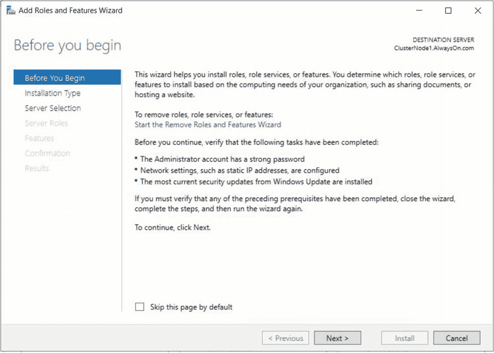

图 3-1 “开始之前”页面

在`安装类型`页面上，确保选中`基于角色或基于功能的安装`，如图`3-2`所示。

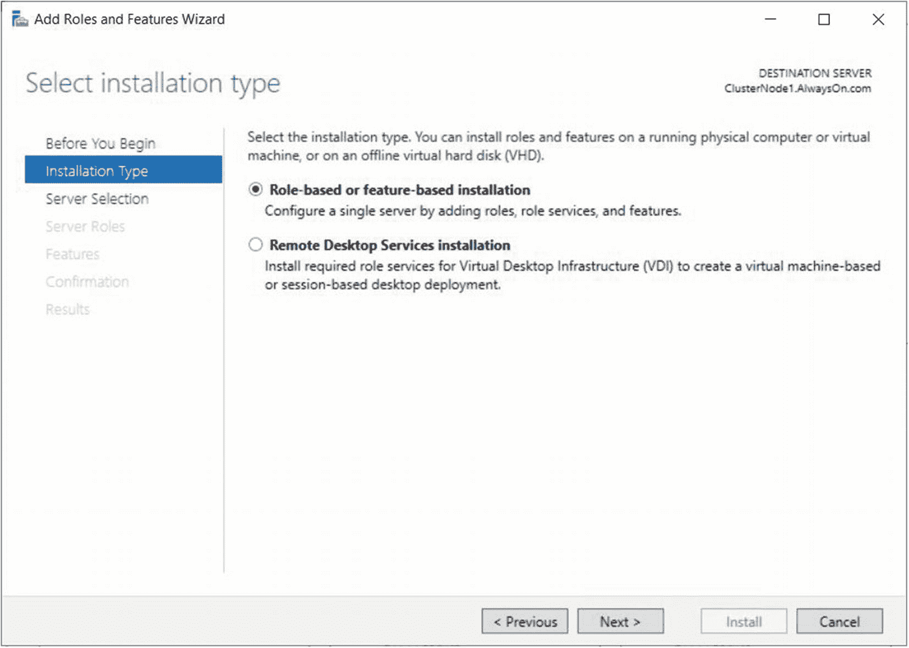

图 3-2 “安装类型”页面

在`服务器选择`页面上，确保选中了您当前正在配置的集群节点，如图`3-3`所示。

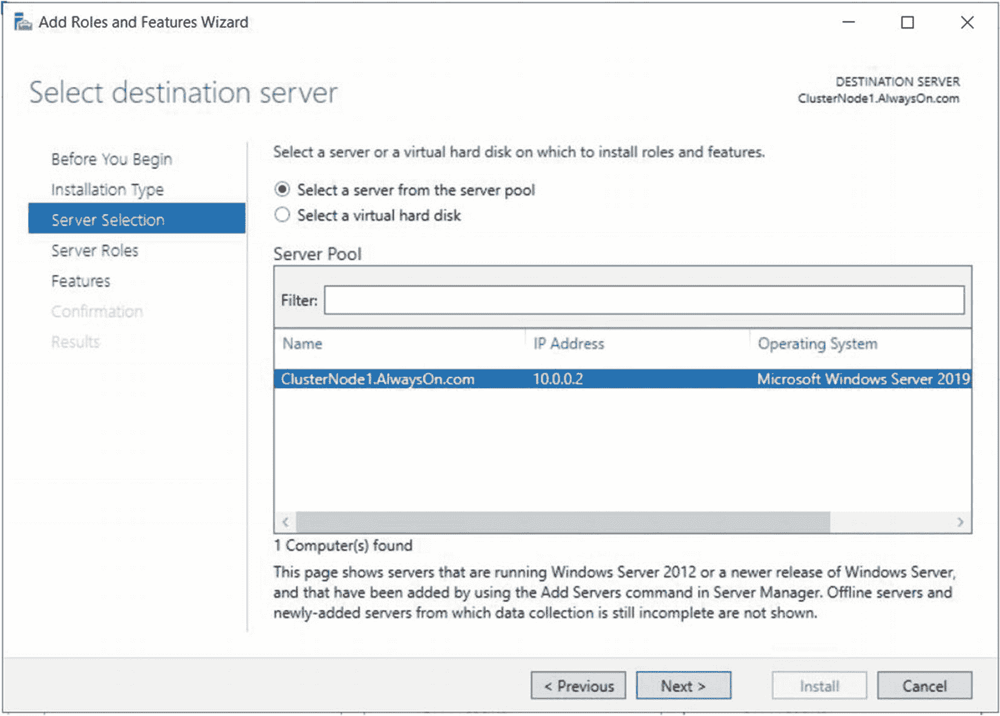

图 3-3 “服务器选择”页面

向导的`服务器角色`页面允许您选择任何想要配置的服务器角色。如图`3-4`所示，这可以包括`应用程序服务器`或`DNS 服务器`等角色，但在我们的情况下，这并不适用，因此我们直接转到下一个界面。

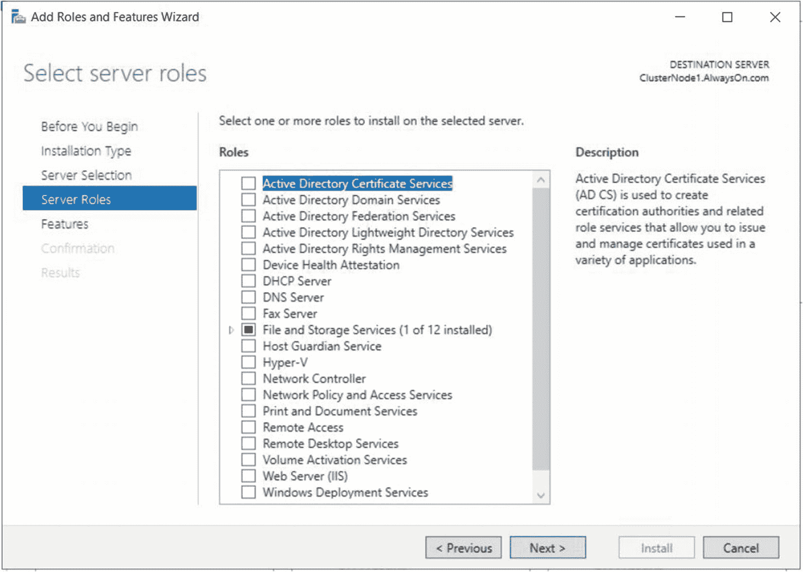

图 3-4 “服务器角色”页面

在向导的`功能`页面上，我们需要选择`故障转移集群`，如图`3-5`所示。这就满足了构建 Windows 集群的先决条件。

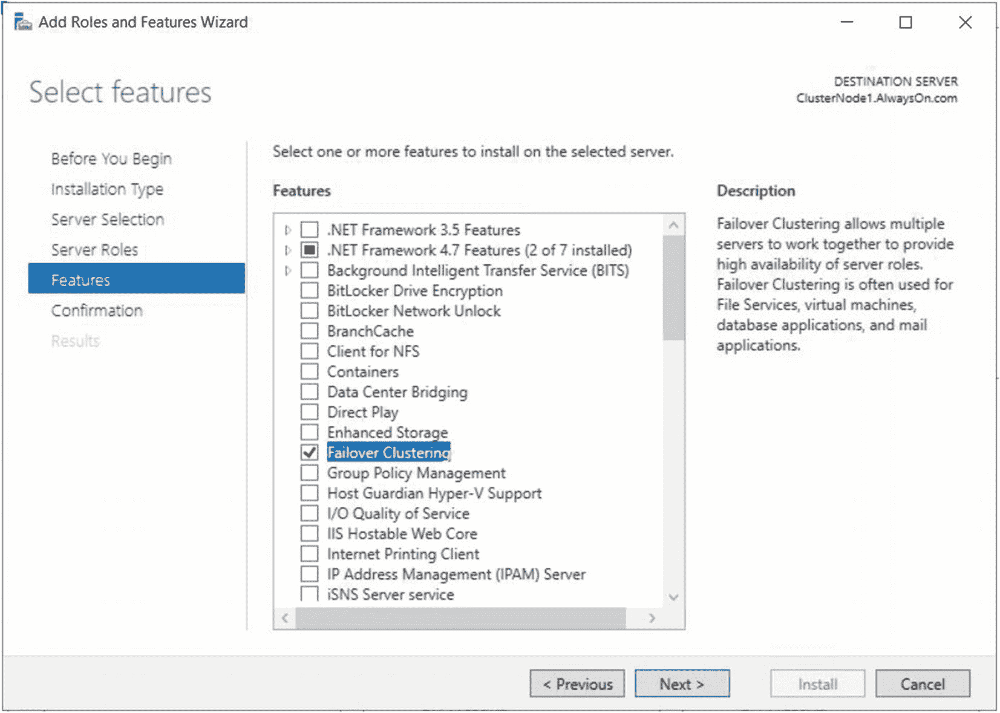

图 3-5 “功能”页面

当您选择`故障转移集群`时，向导会显示一个屏幕（图`3-6`），询问您是否要安装管理工具，表现为一个复选框。如果您计划直接从节点管理集群，请勾选此选项。

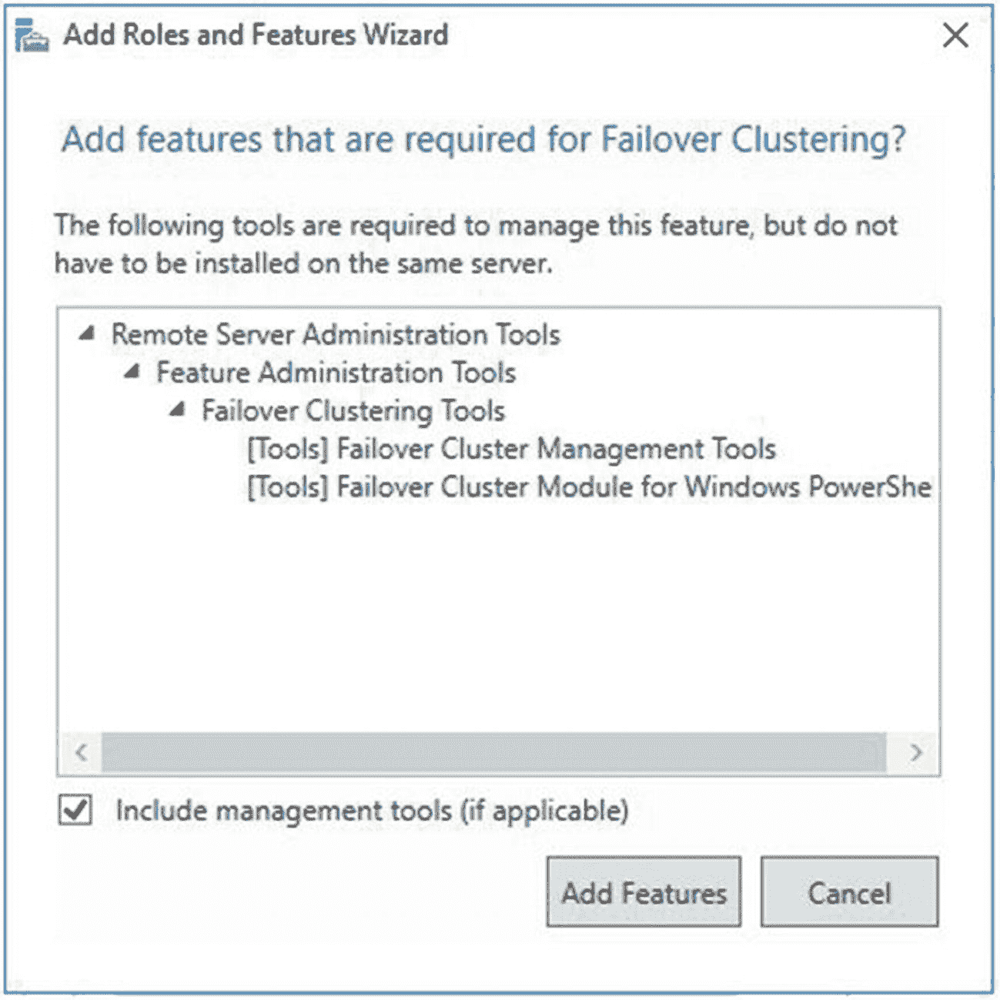

图 3-6 选择管理工具

在向导的最后一页，您可以看到将要安装的功能摘要，如图`3-7`所示。在这里，您可以根据需要指定 Windows 安装介质的位置。您还可以选择服务器是否应在需要时自动重启。如果您正在配置一台新服务器，勾选此框是合理的。但是，如果服务器已在生产环境中运行，当您添加此功能时，请确保考虑服务器上当前运行的内容，以及是否应该等待维护窗口再执行重启（如果需要的话）。

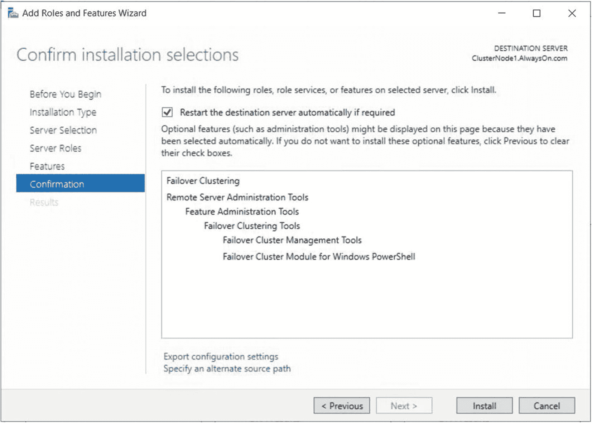

图 3-7 “确认”页面

除了通过`服务器管理器`安装，集群服务也可以通过`PowerShell`安装。清单`3-1`中的`PowerShell`命令可实现与上述步骤相同的结果。

```
Install-WindowsFeature -Name Failover-Clustering –IncludeManagementTools -Verbose
```

清单 3-1 安装集群服务


### 创建集群

一旦在两个节点上都安装了群集功能，就可以开始构建集群了。为此，请连接到你计划作为活动节点的服务器，并从管理工具中运行**故障转移群集管理器**。

创建集群向导的“开始之前”页面警告称，Microsoft 仅支持通过所有验证测试的集群，如图 3-8 所示。消息还警告，你必须是集群每个节点上的本地管理员。在 Windows Server 的早期版本中，这意味着你必须使用一个在将要参与集群的每个服务器上都具有本地管理员权限的域帐户。然而，从 Windows Server 2016 开始，已移除了对域身份验证的依赖，唯一的要求是在每个节点上存在一个具有*一致名称和密码*且拥有本地管理员权限的帐户。这允许在工作组中，或跨多个域创建集群。这些选项在 Windows Server 的早期版本中都不可用。

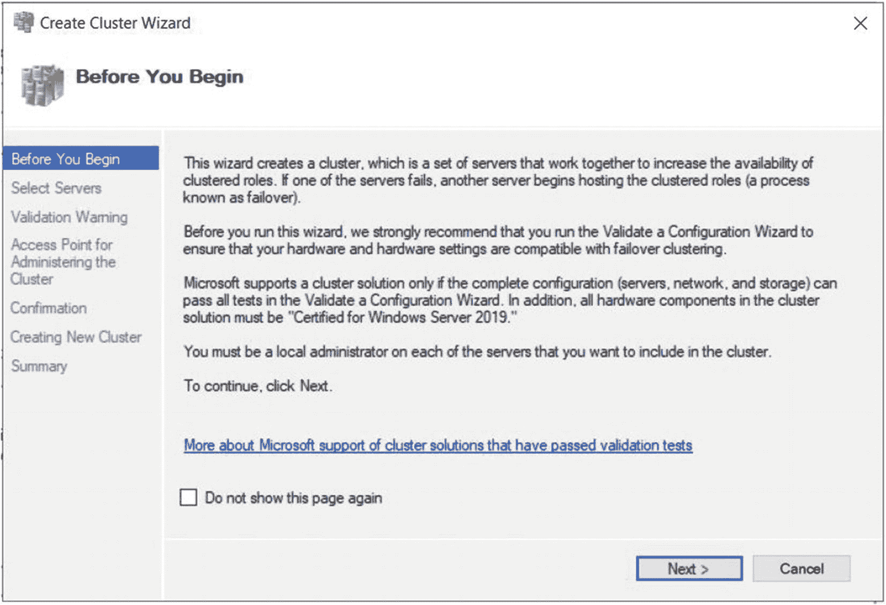
图 3-8
“开始之前”页面

在向导的“选择服务器”屏幕上，你需要输入集群节点的名称。如图 3-9 所示。在我们的例子中，集群节点分别命名为 `ClusterNode1` 和 `ClusterNode2`。但是，如果它们是域的一部分，那么域名和后缀将附加到服务器名称上。

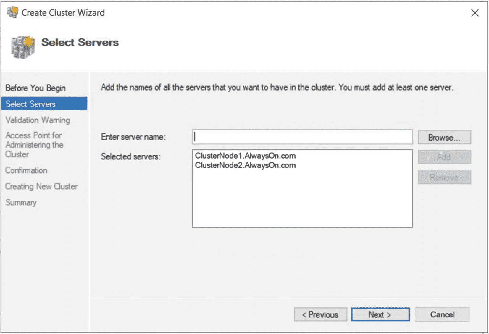
图 3-9
“选择服务器”页面

在“验证警告”页面上，系统会询问你是否希望针对集群运行验证测试。对于生产服务器，你应该始终选择运行此验证，因为 Microsoft 不会为未经验证的集群提供支持。选择运行验证测试将调用“验证配置向导”。你也可以从故障转移群集管理器的“管理”窗格独立运行此向导。“验证警告”页面如图 3-10 所示。

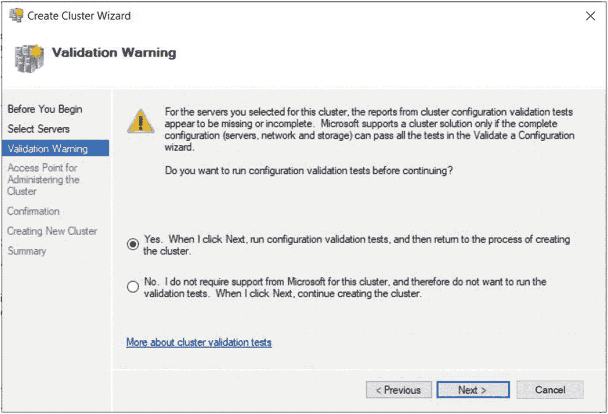
图 3-10
“验证警告”页面

**提示**
在某些情况下无法进行验证，在这些情况下，你需要选择“否，我不需要支持…”选项。例如，一些 DBA 选择安装单节点集群而不是独立实例，以便将来如果需要可以扩展为完整的集群。然而，这种方法可能会给 Windows 管理员带来操作上的挑战，因此请*极其谨慎地*使用。

在通过“验证配置向导”的“开始之前”页面后，你会看到“测试选项”页面。在这里，你可以选择运行所有验证测试，或选择运行一部分测试，如图 3-11 所示。通常，在安装新集群时，你需要运行所有验证测试，但在对集群进行配置更改后独立调用“验证配置向导”时，能够选择一部分测试是很有用的。

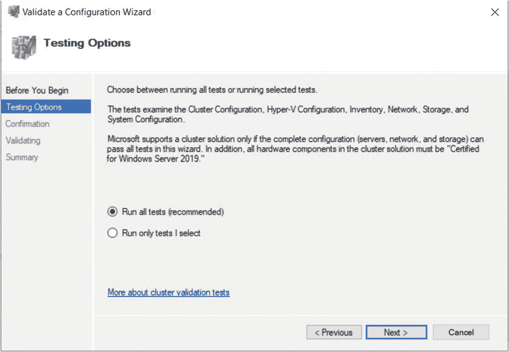
图 3-11
“测试选项”页面

在向导的“确认”页面上，如图 3-12 所示，系统会显示将运行的测试摘要及其针对的集群节点。测试列表非常全面，包括以下类别：

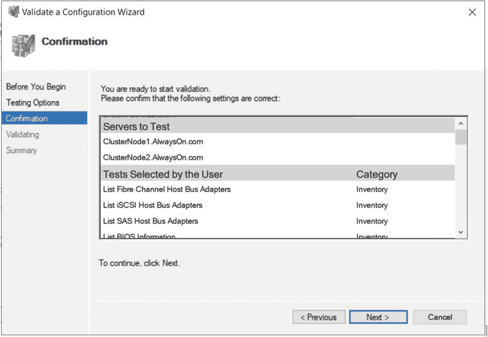
图 3-12
“确认”页面

*   清点（例如，识别任何未签名的驱动程序）
*   网络（例如，检查有效的 IP 配置）
*   存储（例如，验证在节点间故障转移磁盘的能力）
*   系统配置（例如，验证 Active Directory 的配置）

如图 3-13 所示的“摘要”页面提供了测试结果以及报告的 HTML 版本链接。务必检查结果是否有任何错误或警告。你应该始终在继续之前解决错误，但有些警告可能是可以接受的。例如，如果你构建集群是为了承载 **AlwaysOn 可用性组**，你可能没有任何共享存储。这将生成一个警告，但在此场景下不是问题。在 Windows 上配置 AlwaysOn 可用性组将在第 5 章中更详细地讨论。

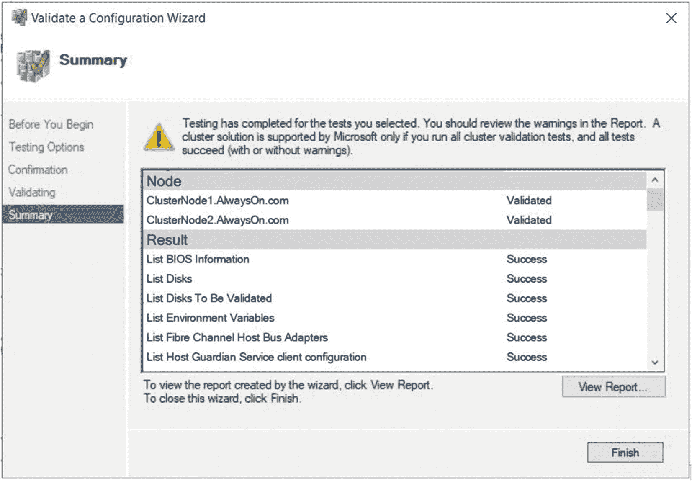
图 3-13
“摘要”页面

“查看报告”按钮显示验证报告的完整版本，如图 3-14 所示。超链接将你带到报告中的特定类别，其中每个测试还有进一步的超链接。这些链接允许你深入查看特定测试生成的消息，从而轻松识别错误。

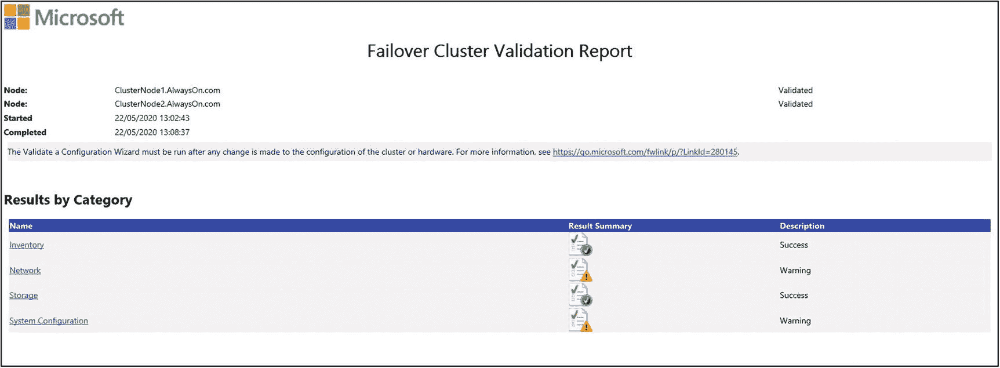
图 3-14
故障转移群集验证报告

在“摘要”页面上单击“完成”将返回到“创建集群向导”，此时你会看到“用于管理集群的访问点”页面。此屏幕如图 3-15 所示。在此页面上，你需要输入集群的虚拟名称。我们将我们的集群命名为 `ALWAYSON-C`。如果网卡配置为自动获取 IP 地址，则将使用 DHCP 分配一个 IP 地址。否则，你需要手动输入一个 IP 地址。这被称为静态 IP，因为它将保持不变，而通过 DHCP 分配的 IP 地址可能会改变。我强烈建议为集群访问点使用静态 IP，以避免动态路由问题，但这可以在集群创建后更改。

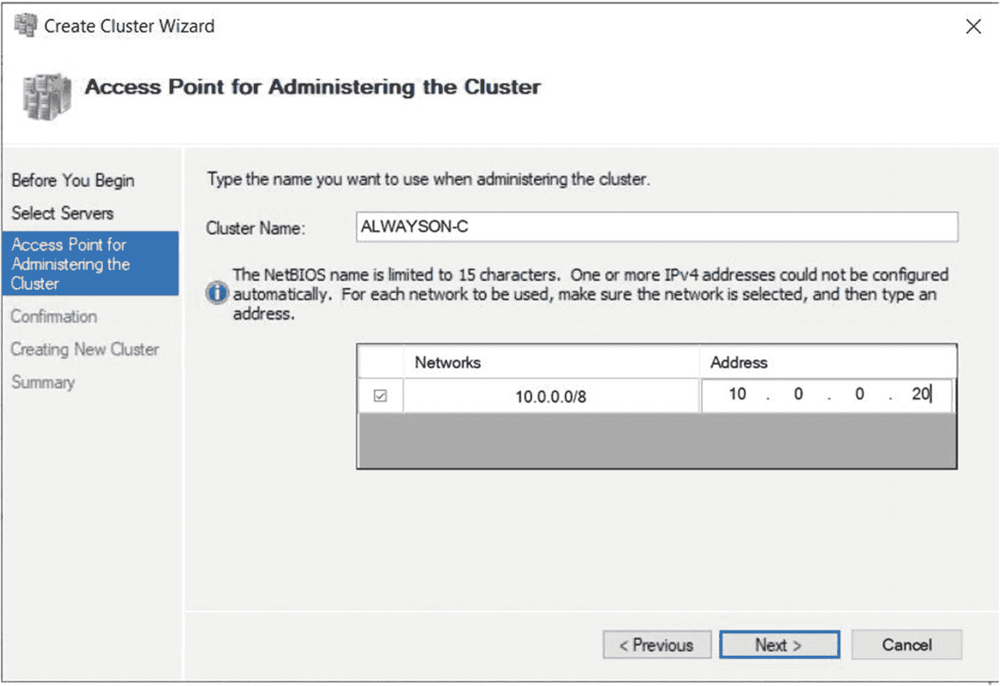
图 3-15
“用于管理集群的访问点”页面

**注意**
虚拟名称和 IP 地址绑定到活动的节点，这意味着在发生故障转移时集群始终可访问。

在我们的案例中，集群驻留在一个简单的域、单个站点和单个子网中。但是，如果你正在配置多子网集群，那么向导会检测到这一点，并将需要为每个子网分配 IP 地址。在此场景中，你需要为每个子网输入一个 IP 地址。

**注意**
节点内的两个 NIC 分别配置在不同的子网上，以便节点之间的*心跳*与公共网络隔离。然而，只有当集群节点的数据 NIC 位于不同的子网中时，集群才被视为多子网集群。

**提示**
如果你的集群将驻留在域中，并且你没有权限在包含集群的 OU（组织单位）中创建 AD（Active Directory）对象，那么集群的 VCO（虚拟计算机对象）必须已经存在，并且你必须被分配了“完全控制”权限。

“确认”页面显示已创建集群的摘要。你还可以使用此屏幕指定是否应将所有符合条件的存储添加到集群，这通常是一个有用的功能。此屏幕如图 3-16 所示。

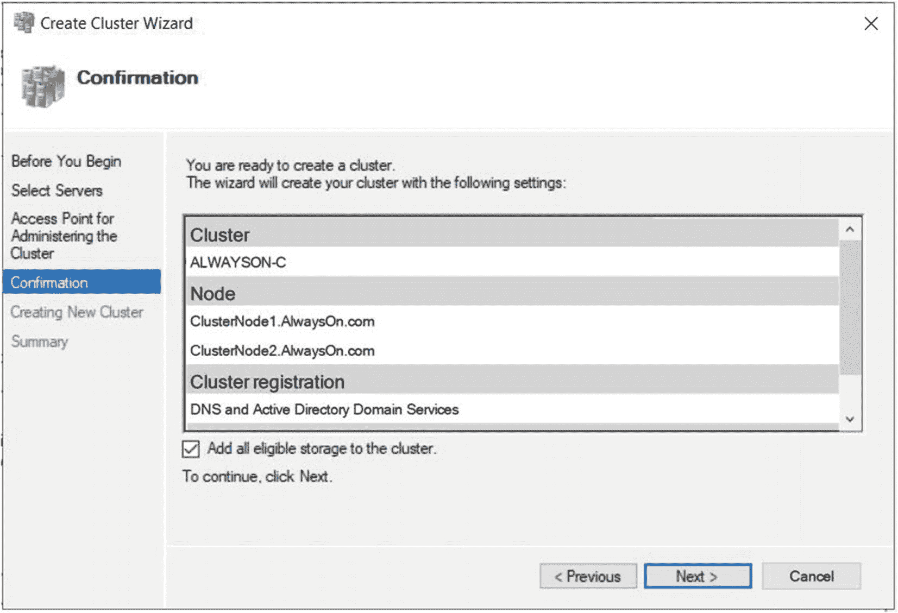
图 3-16
“确认”页面

构建集群后，将显示如图 3-17 所示的“摘要”页面。此屏幕汇总了集群名称、IP 地址、节点、已配置的仲裁模型，以及有关集群的任何警告的详细信息。它还提供了报告的 HTML（超文本标记语言）版本链接。

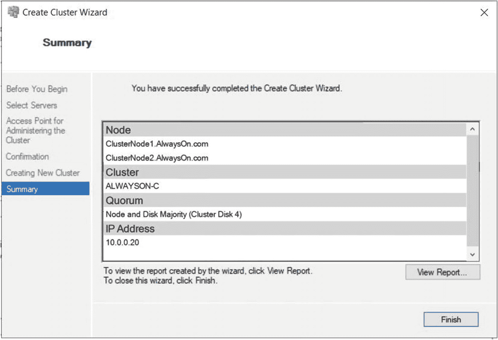
图 3-17
“摘要”页面

“创建集群”报告显示了在集群构建期间已完成的任务的完整列表。

我们也可以使用 PowerShell 来创建集群。清单 3-2 中的脚本使用 `Test-Cluster` cmdlet 运行集群验证测试，然后使用 `New-Cluster` cmdlet 配置集群。

```
#运行验证测试
Test-Cluster -Node Clusternode1,Clusternode2
#创建集群
New-Cluster -Node ClusterNode1,ClusterNode2 -Name ALWAYSON-C
清单 3-2
验证并创建集群
```


## 配置集群

根据环境需求，许多集群配置都可以更改。本节将演示如何更改一些较为常见的配置。

### 更改仲裁

如果我们通过故障转移集群管理器，依次展开 `ALWAYSON-C` ➤ `存储` ➤ `磁盘`，并选中分配给仲裁的磁盘，来检查集群存储，我们可以看到见证已正确配置为使用仲裁卷。如图 3-18 所示。

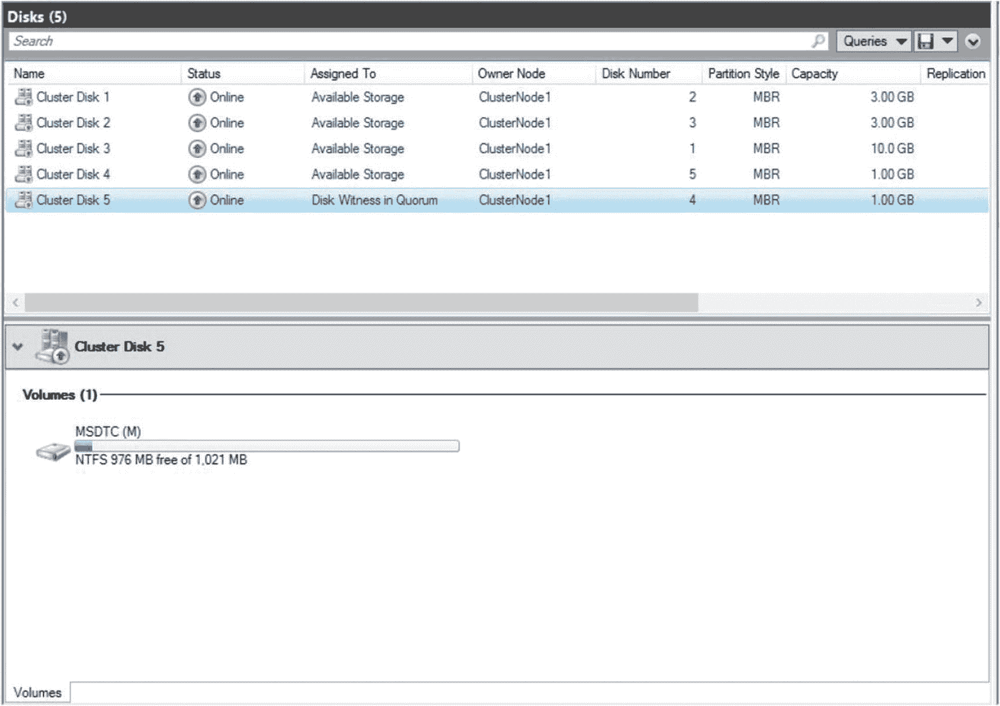

图 3-18 集群卷

我们可以通过进入集群的上下文菜单，选择 `更多操作` ➤ `配置集群仲裁设置` 来修改此配置，这将调用 `配置集群仲裁向导`。在 `选择仲裁配置选项` 页面（如图 3-19 所示）中，我们选择 `选择仲裁见证` 选项。

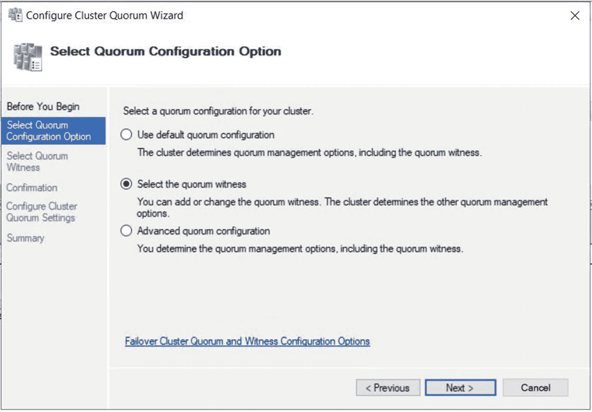

图 3-19 选择仲裁配置选项页面

在 `选择仲裁见证` 页面，我们选择要配置的仲裁类型。当集群中有偶数个节点且所有节点都位于同一数据中心时，或者当主数据中心中有偶数个节点而辅助数据中心中有另一个节点时，磁盘见证是最合适的选择。

当节点分布在两个数据中心，并且您可以访问第三个数据中心（其中有一个可用作仲裁的文件共享）时，文件共享见证是最合适的选择。Windows Server 2019 支持任何支持 `SMB 2.0` 或更高版本的设备上的文件共享。这包括可以连接到网络路由器的 `USB` 密钥。

当节点分布在两个数据中心且没有第三个数据中心可用于设置文件共享见证时，云见证是最合适的选择。要使用云见证，您必须拥有一个 `Azure` 存储帐户，因为见证将在 `Azure BLOB` 存储中创建。

在单个数据中心中有奇数个节点的情况下，最合适的可能是不配置见证。

对于我们的场景，我们将选择配置磁盘见证的选项。如图 3-20 所示。

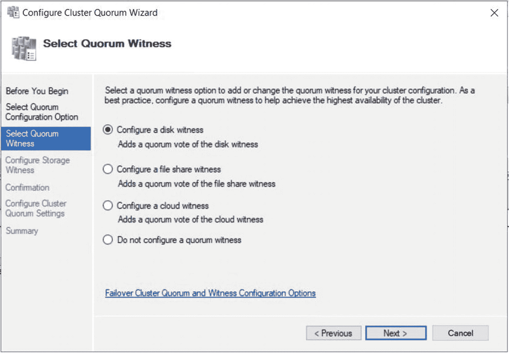

图 3-20 选择仲裁见证页面

在向导的 `配置存储见证` 页面上，我们可以选择正确的磁盘用作仲裁。在我们的例子中，这是 `磁盘 4`，如图 3-21 所示。

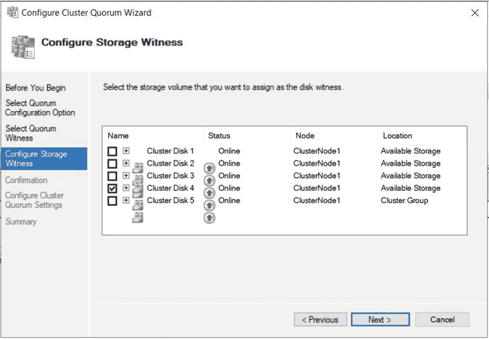

图 3-21 配置存储见证页面

向导的 `摘要` 页面详细说明了将对集群进行的配置更改。它还突出显示了已启用动态仲裁管理，并且所有节点以及仲裁磁盘在仲裁中都具有投票权。

我们也可以使用命令行通过清单 3-3 中的 `PowerShell` 命令执行此配置。这里，我们使用 `Set-ClusterQuorum` cmdlet，并传入集群名称，后跟我们希望配置的仲裁类型。因为此仲裁类型中包含 `disk`，所以我们还可以传入我们计划使用的集群磁盘的名称，正是这一方面允许我们更改仲裁磁盘。

提示

如果按照演示使用 `PowerShell`，请记住更改磁盘编号以匹配您自己的配置。

```
Set-ClusterQuorum -Cluster ALWAYSON-C -NodeAndDiskMajority "Cluster Disk 4"
清单 3-3 配置仲裁磁盘
```

### 高级仲裁配置

Windows Server 的最新版本允许您配置高级仲裁配置，例如投票权重和集群见证。在本节中，我们将探讨如何配置节点的投票权重。

节点权重通常在您拥有*多子网集群*时很有用。在此场景中，建议您在第三方站点使用文件共享见证。这有助于避免因数据中心之间的网络故障而导致集群停机。但是，如果您的仲裁中有奇数个节点，那么添加文件共享见证会使投票数变为偶数，这是危险的。从辅助数据中心的一个节点中移除投票可以消除此问题。

您还可以使用节点权重暂时从故障节点中移除投票，以避免其影响仲裁。我也见过一些人配置所有节点都没有投票权，只将投票权留给磁盘见证。这样做的想法是避免在不同的节点在不同时间发生故障时，需要动态更改投票配置。然而，我会避免采用这种方法，因为它将连接到仲裁磁盘引入为一个单点故障。如果您的仲裁磁盘失去与集群的连接，集群将变得不可用。

每个节点的投票权重可以通过使用 `配置集群仲裁向导` 并在 `选择仲裁配置选项` 页面上选择 `高级仲裁` 配置选项进行修改。这将显示 `选择投票配置` 页面，如图 3-22 所示。

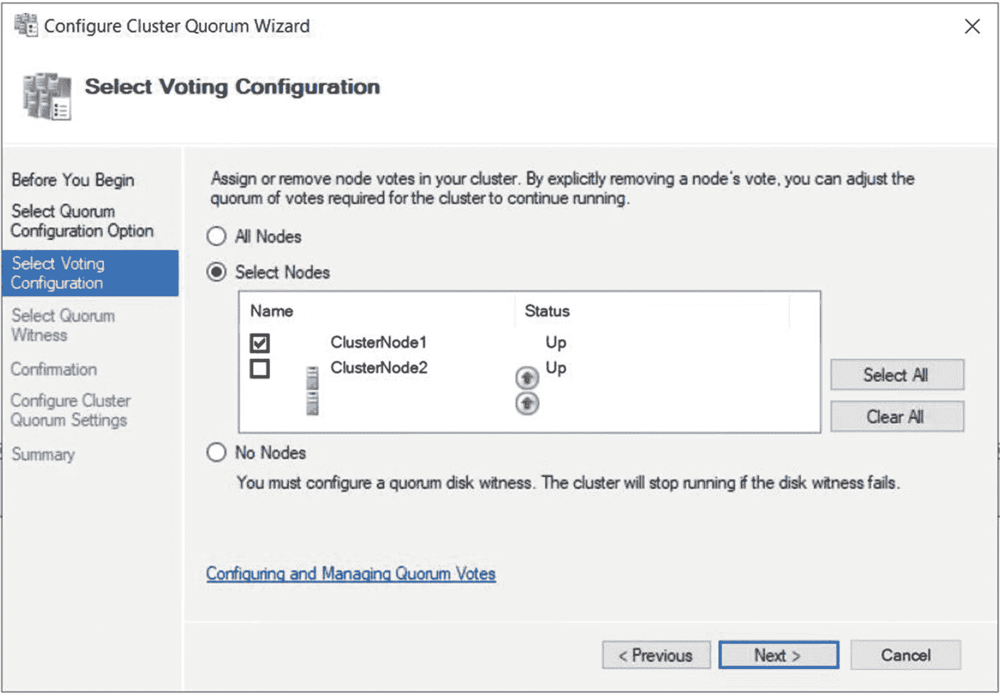

图 3-22 选择投票配置页面

在此示例中，我们假设 `ClusterNode2` 节点已发生故障，并且我们不希望它影响我们的仲裁，因此已从该节点移除投票。

注意

要遵循本示例的其余部分，您必须拥有一个 `Azure` 存储帐户。该帐户必须是“常规用途”类型，应配置为标准性能层，并具有本地冗余存储。

要将我们的磁盘见证更改为云见证，我们将在向导的 `配置集群仲裁` 页面中选择 `配置云见证` 选项，如图 3-23 所示。

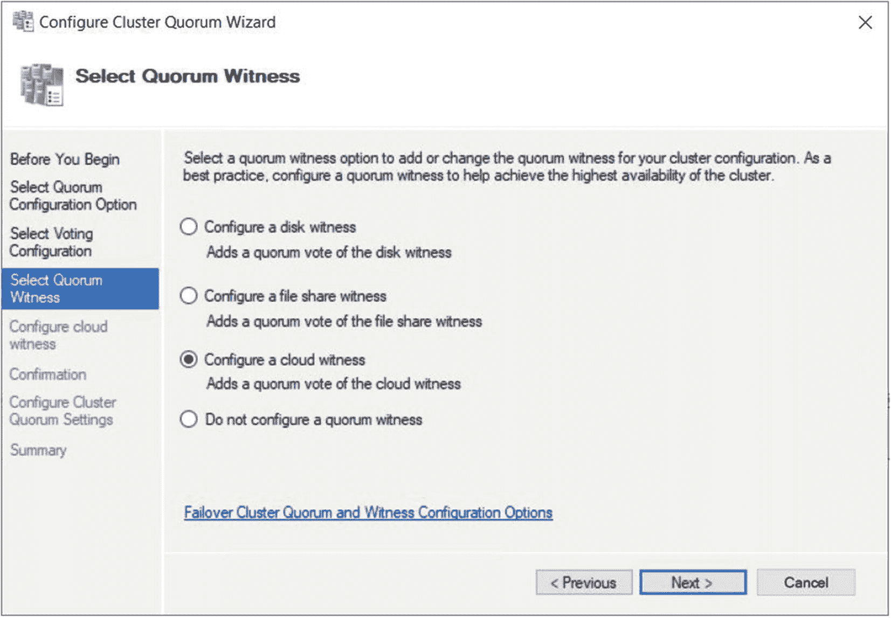

图 3-23 选择仲裁见证页面

由于我们的选择，接下来将显示向导的 `配置云见证` 页面，如图 3-24 所示。在这里，我们需要输入我们的 `Azure` 存储帐户名称和该存储帐户的主访问密钥。可以通过在 `Azure 门户` 中，依次展开 `存储帐户` ➤ `<存储帐户名称>` ➤ `访问密钥` 并复制 `密钥 1` 来定位访问密钥。通常，服务端点将保留默认值；但是，在某些情况下您可能需要更改它。例如，`中国` 的 `Azure` 存储帐户使用不同的端点。

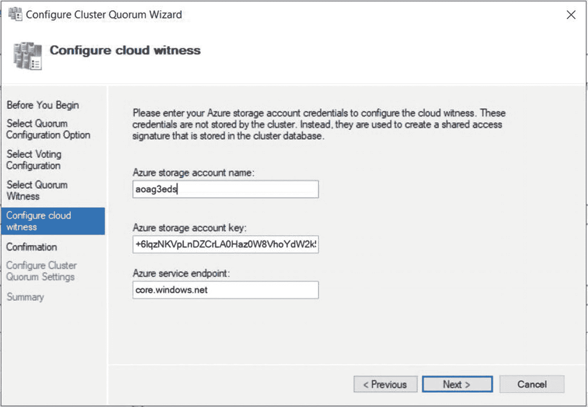

图 3-24 配置云见证页面

注意

访问密钥不保存在集群配置中。相反，会生成一个 `SAS`（共享访问签名）。

向导的最后一页（图 3-25）显示 `确认` 页面。在这里，您应在选择 `下一步` 应用设置之前检查详细信息。

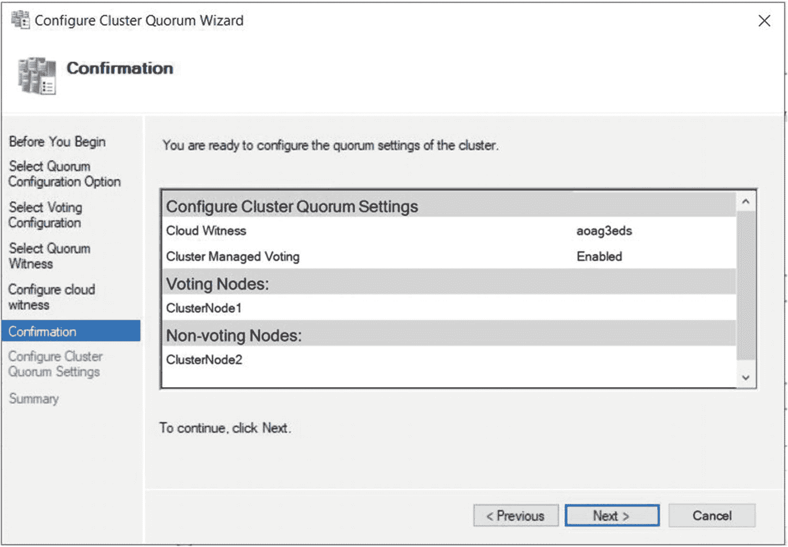

图 3-25 确认页面

提示


如果你遇到一个通用错误，要求你确认存储帐户详细信息以及通过 HTTPS 的连接性，根据我的经验，最常见的原因是连接性问题。云见证要求从所有群集节点到 Azure 存储帐户的 `Port 443` 端口必须开放。

要配置一个节点的节点权重，你可以使用清单 3-4 中的脚本。

```
Import-Module FailoverClusters
(Get-ClusterNode CLUSTERNODE2).NodeWeight = 0
清单 3-4
设置节点权重
```

要使用 PowerShell 配置云见证，请使用清单 3-5 中的脚本。

提示

请务必将帐户名称和访问密钥更改为与你自己的相匹配。

```
Import-Module FailoverClusters
Set-ClusterQuorum -CloudWitness -AccountName aoag3eds  -AccessKey +6lqzNKVpLnDZCrLA0Haz0W8VhoYdW2k==
清单 3-5
使用 PowerShell 配置云见证
注意

本书其余部分的示例均假设两个节点都拥有投票权，并且使用磁盘见证。

## 配置 MSDTC

如果你的 SQL Server 实例使用分布式事务，或者你正在安装 SQL Server Integration Services (SSIS)，那么它依赖于 `MSDTC`（Microsoft 分布式事务处理协调器）。如果你的实例将使用 `MSDTC`，那么你需要确保其配置正确。如果配置不当，安装将会成功，但依赖于它的事务可能会失败。

在群集上安装时，SQL Server 会自动使用安装在同一角色中的 `MSDTC` 实例（如果存在的话）。如果不存在，则使用已映射到的 `MSDTC` 实例（如果已执行此映射）。如果没有映射，则使用群集的默认 `MSDTC` 实例；如果连默认实例也没有，则使用本地计算机的 `MSDTC` 实例。

许多 DBA 选择在 SQL Server 所在的同一角色中安装 `MSDTC`；然而，这引入了一个问题。如果 `MSDTC` 故障，它也可能导致 SQL Server 实例宕机。当然，群集会尝试在另一个节点上启动这两个应用程序，但这仍然会涉及停机时间，包括在新节点上恢复数据库所需的时间，这个时间长度是不确定的。因此，我建议将 `MSDTC` 安装在一个单独的角色中。如果你这样做，SQL Server 实例仍然可以使用 `MSDTC`（因为它是群集的默认实例），并且消除了 `MSDTC` 导致 SQL Server 中断的可能性。这比使用映射实例或本地计算机实例更可取，因为它避免了不必要的配置，并且当群集化的 SQL Server 实例使用 `MSDTC` 时，该 `MSDTC` 实例也应进行群集化。

要创建 `MSDTC` 角色，首先在 **故障转移群集管理器** 的 **角色** 上下文菜单中选择 **配置角色** 选项。这将调用 **高可用性向导**。在向导的 **选择角色** 页面上，选择 **分布式事务处理协调器 (DTC)** 角色类型，如图 3-26 所示。

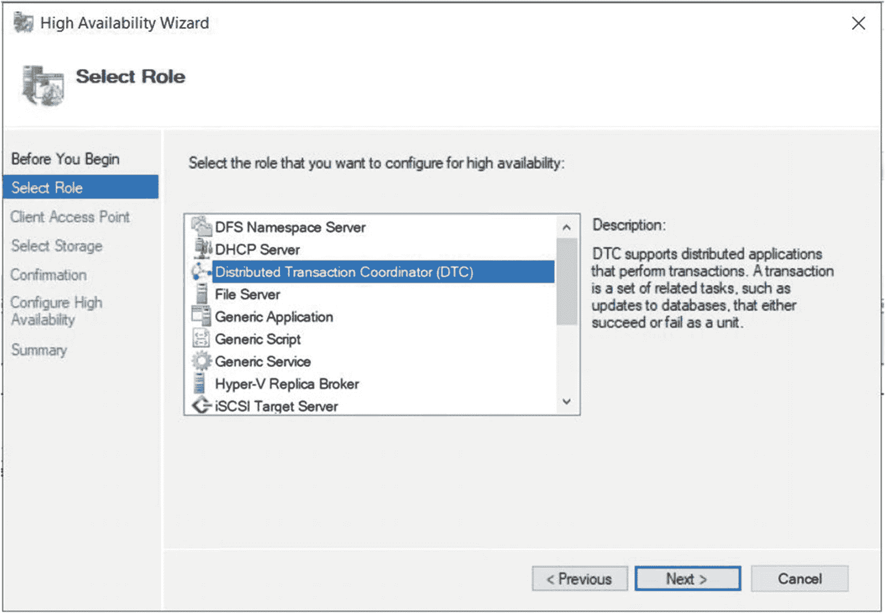

图 3-26

选择角色页面

在 **客户端访问点** 页面（如图 3-27 所示），你需要为 `MSDTC` 输入一个虚拟名称和 IP 地址。在我们的示例中，我们将其命名为 `` `ALWAYSON-MSDTC-C` ``，并将 `` `10.0.0.21` `` 分配为 IP 地址。在多子网群集上，你需要为每个网络提供一个 IP 地址。

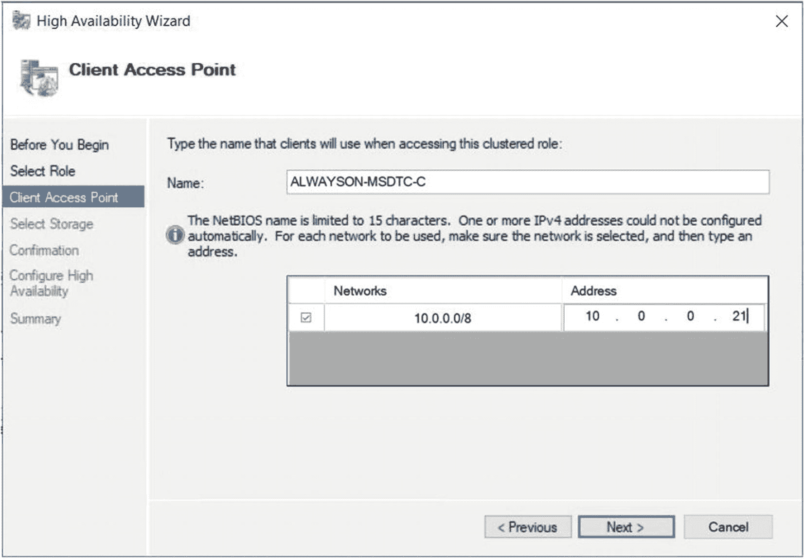

图 3-27

客户端访问点页面

在向导的 **选择存储** 页面上，选择你计划用于存储 `MSDTC` 文件的群集磁盘，如图 3-28 所示。在我们的示例中，这是磁盘 4。

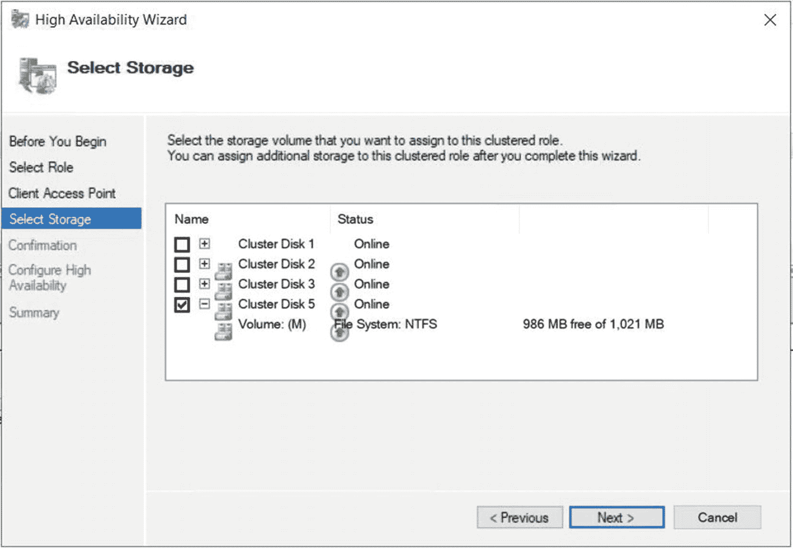

图 3-28

选择存储页面

**确认** 页面显示了即将创建的角色的概述。

或者，我们可以在 PowerShell 中创建此角色。清单 3-6 中的脚本首先使用 `` `Add-ClusterServerRole` `` cmdlet 来创建角色。我们将用于角色的虚拟名称传递给 `` `-Name` `` 参数，要使用的群集磁盘名称传递给 `` `-Storage` `` 参数，角色的 IP 地址传递给 `` `-StaticAddress` `` 参数。

然后，我们使用 `` `Add-ClusterResource` `` cmdlet 来添加 DTC 资源。`` `-Name` `` 参数为资源命名，`` `-ResourceType` `` 参数指定它是一个 DTC 资源。接着，我们需要创建角色内资源之间的依赖关系。使用 GUI 时我们不需要这样做，因为依赖关系是自动为我们创建的。资源依赖关系指定了其他资源所依赖的资源。一个资源失败会通过依赖链传播，并可能导致角色脱机。例如，在我们的 `` `ALWAYSON-MSDTC-C` `` 角色中，如果磁盘或虚拟名称中的任何一个变得不可用，DTC 资源就会脱机。Windows Server 支持具有 `` `AND` `` 和 `` `OR` `` 约束的多重依赖关系。正是 `` `OR` `` 约束使得多子网群集成为可能，因为一个资源可以依赖于 IP 地址 A `` `OR` `` IP 地址 B。最后，我们需要使用 `` `Start-ClusterGroup` `` cmdlet 使角色联机。

```
#创建角色
Add-ClusterServerRole -Name ALWAYSON-MSDTC-C -Storage "Cluster Disk 3" -StaticAddress 192.168.0.50
#创建 DTC 资源
Add-ClusterResource -Name MSDTC-ALWAYSON-MSDTC-C -ResourceType "Distributed Transaction Coordinator" -Group ALWAYSON-MSDTC-C
#创建依赖关系
Add-ClusterResourceDependency MSDTC-ALWAYSON-MSDTC-C ALWAYSON-MSDTC-C
Add-ClusterResourceDependency MSDTC-ALWAYSON-MSDTC-C "Cluster Disk 3"
#使角色联机
Start-ClusterGroup ALWAYSON-MSDTC-C
清单 3-6
创建 MSDTC 角色
```


### 配置角色

创建角色后，您可能需要对其进行配置，以更改故障转移策略或将节点配置为首选所有者。要配置角色，请从角色的上下文菜单中选择“属性”。在如图 3-29 所示的“属性”对话框的“常规”选项卡上，您可以将一个节点配置为角色的首选所有者。您还可以通过在“首选所有者”窗口中上下移动节点来更改节点优先级的顺序。

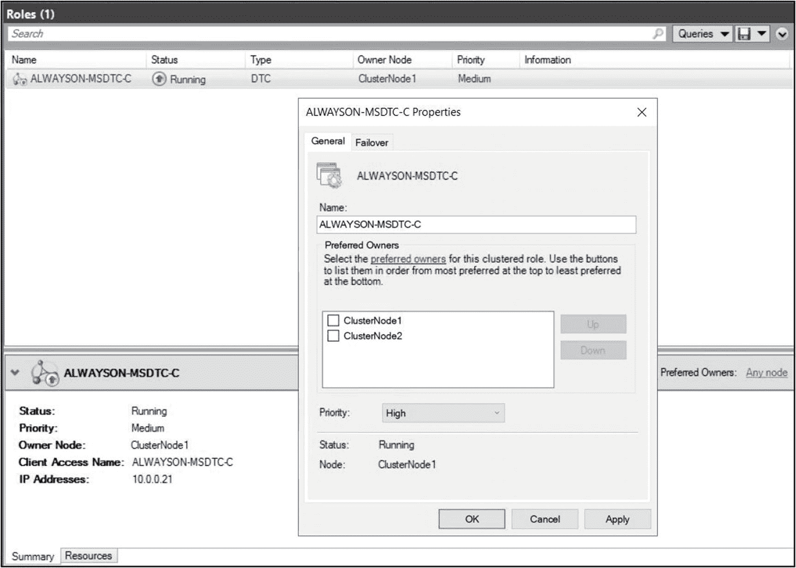
图 3-29 常规选项卡

您还可以为角色选择在发生多个角色同时故障转移到另一个节点时的优先级。此设置的选项如下：
*   高
*   中
*   低
*   不自动启动

我们将配置 `ALWAYSON-MSDTC-C` 角色以高优先级进行故障转移。

在“属性”对话框的“故障转移”选项卡上，您可以配置角色在给定时间段内可以故障转移的次数，超过此次数后角色将被置于脱机状态。此设置的默认值是 6 小时内允许 1 次故障。这样做的问题是，如果一个角色发生了故障转移，并且在您修复了原始节点上的问题之后，您又将该角色故障恢复，那么在 6 小时的时间窗口内将不再允许任何故障转移。这显然存在风险，我通常建议您更改此设置。在我们的案例中，我们已将角色配置为在 24 小时的时间窗口内最多允许三次故障转移，如图 3-30 所示。我们还配置了该角色，使其在首选所有者再次可用时故障恢复回去。请记住，设置自动故障恢复时，故障恢复也会像故障转移一样导致停机。如果您追求非常高的可用性级别，例如五个 9，那么此选项可能不合适。我们将配置 `ALWAYSON-MSDTC-C` 角色，允许在 24 小时期限内进行三次故障转移。我们还将配置该角色以允许立即故障恢复。

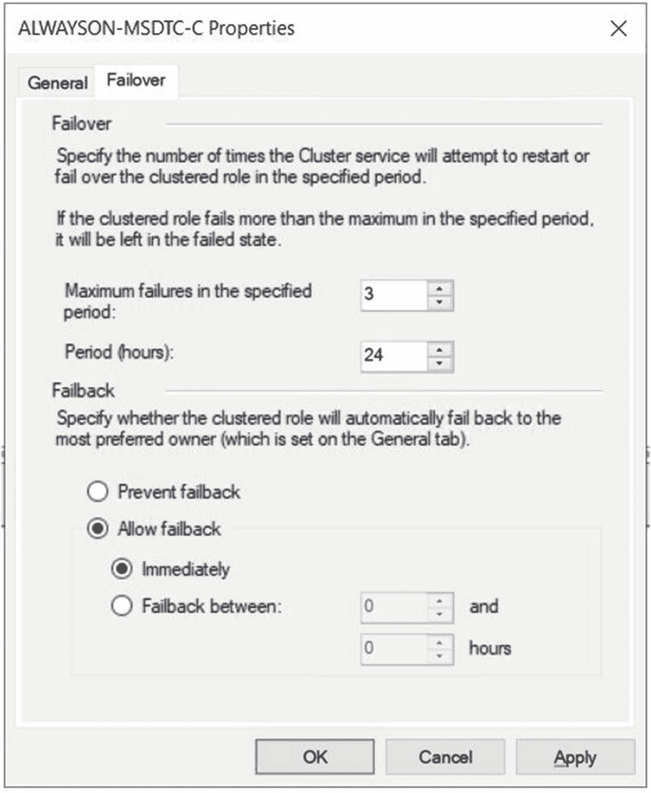
图 3-30 故障转移选项卡

## 总结

在创建集群之前，必须在所有节点上安装 Microsoft 集群服务 (`MCS`)。这可以通过使用“添加角色和功能向导”安装“故障转移群集”功能来实现。

安装集群功能后，可以使用“创建群集向导”在每个节点上配置群集。在构建群集之前，此向导将提示您运行“验证群集向导”。“验证群集向导”将验证环境是否满足群集要求。如果发现环境不符合要求，您可以继续构建群集，但安装将不受 Microsoft 支持。

构建群集后，还需要进行配置。这包括配置仲裁模式，也可能包括配置 `MSDTC`。在群集上创建角色后，您可能还希望使用故障转移策略或首选所有者来配置该角色。

# 4. 实现 AlwaysOn 故障转移群集实例

构建并配置群集后，就可以安装 SQL Server AlwaysOn 故障转移群集实例了。在我们的场景中，我们希望构建一个跨越我们在第 3 章中构建的 Windows 群集两个节点的群集实例。我们还将讨论如何使用 PowerShell 构建故障转移群集实例。为此，我们需要在群集的主节点上使用“安装 SQL Server 故障转移群集”向导。然后，我们需要运行“添加节点”向导，以允许被动节点在发生故障转移时承载该实例。因此，在本章中，我们将执行以下任务：
*   在活动群集节点上安装 SQL Server 故障转移群集实例。
*   配置向导的被动节点以支持故障转移群集实例。


## 构建实例

可以使用 `安装 SQL Server 故障转移集群` 向导来构建 AlwaysOn 故障转移集群实例。该向导可通过在承载集群核心资源的节点上打开 `SQL Server 安装中心`，并从 `安装` 选项中选择 `新建 SQL Server 故障转移集群安装` 来启动。`SQL Server 安装中心` 的 `安装` 选项卡如图 4-1 所示。

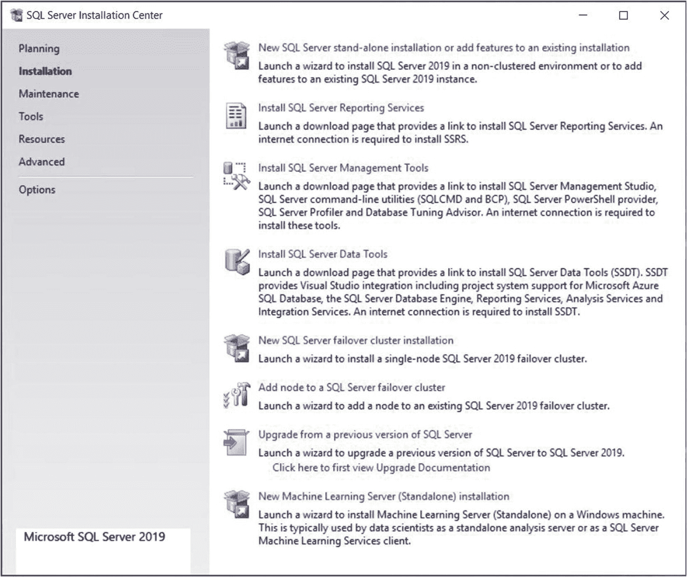

图 4-1：SQL Server 安装中心 - 安装选项卡

### 产品密钥页面

向导首先显示的是 `产品密钥` 页面，如图 4-2 所示。在此页面上，您将选择安装免费的 SQL Server 版本，或输入产品密钥（或批量许可密钥），这将自动确定要安装的正确 SQL Server 版本。

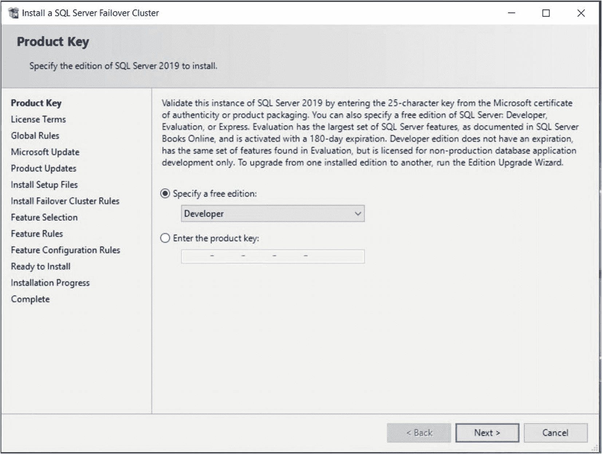

图 4-2：安装 SQL Server 故障转移集群向导 - 产品密钥页面

> **提示**
>
> 在 SQL Server 2019 中，功能上等同于企业版的开发者版是免费的。在 SQL Server 2016 之前，此非商业许可曾收取少量费用。

### 许可条款页面

在向导的 `许可条款` 页面（图 4-3），系统将通过一个复选框邀请您接受 Microsoft 的许可条款。不同意则无法继续安装。

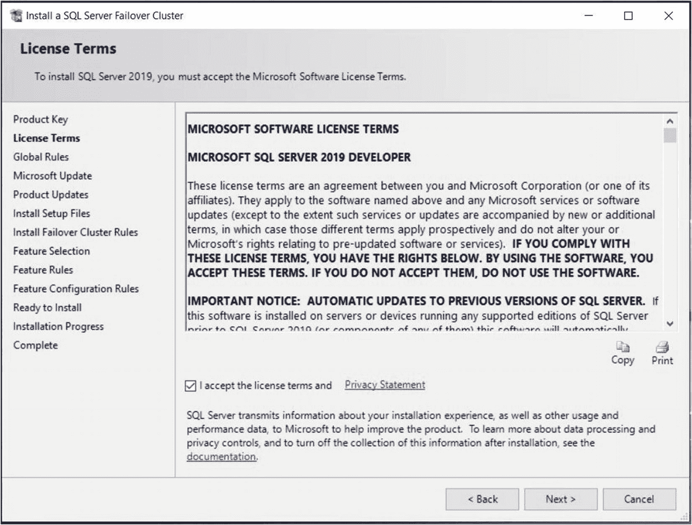

图 4-3：安装 SQL Server 故障转移集群向导 - 许可条款页面

### 全局规则和 Microsoft 更新

现在将检查 `全局规则` 以确保可以成功安装安装支持文件。当所有检查通过后，向导的 `Microsoft 更新` 页面（如图 4-4 所示）将提示您选择是否希望 Windows Update 检查 SQL Server 的补丁和修复程序。此处的选择取决于您组织的修补策略。一些组织对补丁的测试和接受实施严格的修补制度，然后是修补周期，这通常得到诸如 `WSUS (Windows Server Update Services)` 之类的软件支持。如果您的组织存在此类制度，则不应选择此选项。

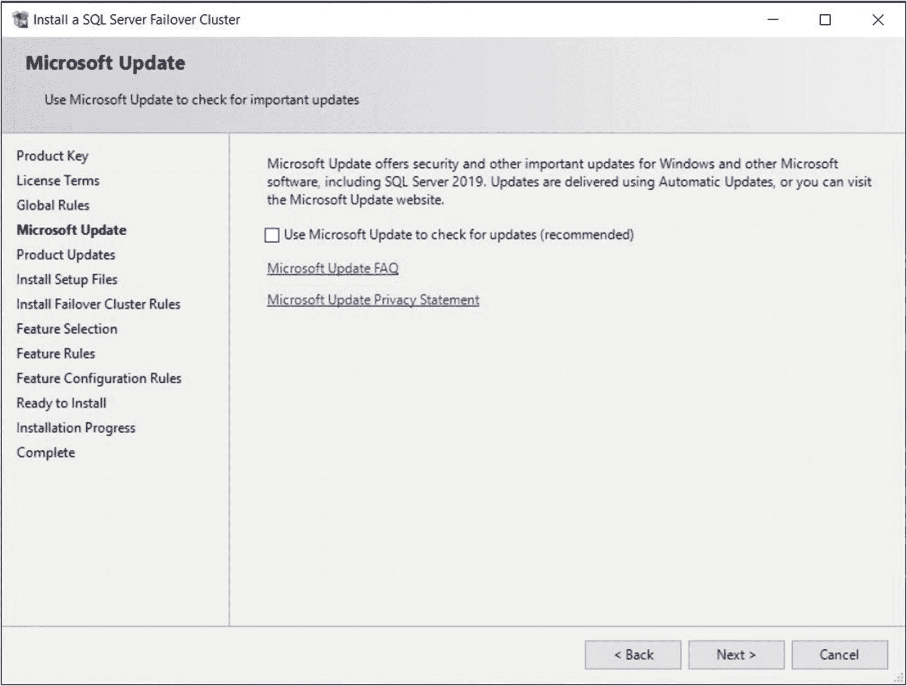

图 4-4：安装 SQL Server 故障转移集群向导 - Microsoft 更新页面

如果您选择检查更新，并且发现任何可用更新，则向导的 `产品更新` 页面将列出所有找到的可用更新。您需要使用复选框确认是否应安装它们。

在安装支持文件和任何产品更新（如适用）下载、解压并安装后，将检查用于安装故障转移集群实例的 `安装规则`，结果将显示在向导的 `安装故障转移集群规则` 页面上，如图 4-5 所示。

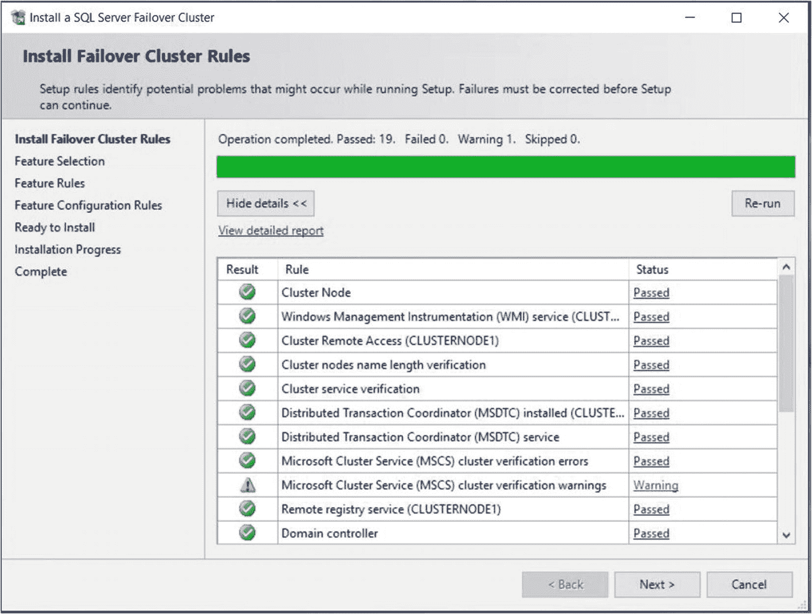

图 4-5：安装 SQL Server 故障转移集群向导 - 安装故障转移集群规则

如果您看到 `Windows 防火墙` 的警告，这可能仅仅是因为防火墙已开启。这并不表示所需端口未打开。有关为 SQL Server 配置防火墙的更多信息，我推荐 Apress 的书籍 *Securing SQL Server 2nd Edition: DBAs Defending the Database*，该书可从 [`www.apress.com/gb/book/9781484241608`](http://www.apress.com/gb/book/9781484241608) 获取。

在此实例中，我们看到一个关于 `集群验证` 的警告。当集群验证通过但带有警告时会出现此情况。在我们的案例中，这具体是因为集群节点上的补丁未更新到最新。理想情况下，应在继续之前解决此问题。

### 功能选择页面

在向导的 `功能选择` 页面（如图 4-6 所示），您将选择要安装的 SQL Server 2019 产品套件的功能。出于本书的目的，我们将选择安装 `数据库引擎` 和 `SQL Server Integration Services (SSIS)`。

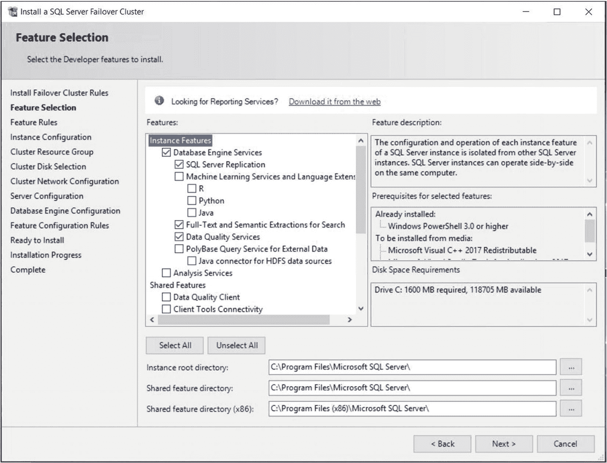

图 4-6：安装 SQL Server 故障转移集群向导 - 功能选择页面

值得注意的是，`SSIS` 不是集群感知的，也并非设计为集群服务。在某些情况下，您可能决定对 `Integration Services` 服务进行集群化，如果是这种情况，则可以通过创建类型为 `通用` 的集群角色，并将 `Integration Services` 服务添加为依赖项来绕过此限制。然而，在大多数场景中，在集群实例上管理 `SSIS` 的最合适方法是在集群的每个节点上将 `Integration Services` 服务作为独立服务安装。

此外，向导的 `功能选择` 页面要求您指定 `实例根目录` 和 `共享功能目录` 的文件夹位置。您可能希望将这些位置移动到不同的驱动器，以便将 `C:\` 驱动器留给操作系统。这可能是出于空间考虑，或者仅仅是为了将 SQL Server 二进制文件与其他应用程序隔离。

### 实例根目录结构

`实例根目录` 通常将包含服务器上创建的每个实例的一个文件夹，并且 `数据库引擎`、`SSAS` 和 `SSRS` 的安装会有单独的文件夹。与 `数据库引擎` 关联的文件夹将命名为 `MSSQL15.[InstanceName]`，其中实例名称是您的实例名称，对于默认实例则是 `MSSQLSERVER`。文件夹名称中的数字 15 对应于 SQL Server 的版本，SQL Server 2019 的版本号是 15。

此文件夹将包含一个名为 `MSSQL` 的子文件夹，该子文件夹又将包含存储与实例关联文件的文件夹，包括一个名为 `Binn` 的文件夹（用于存储与实例关联的应用程序文件、应用程序扩展和 XML 配置）、一个名为 `Backup` 的文件夹（作为数据库备份的默认位置）和一个名为 `Data` 的文件夹（作为系统数据库的默认位置）。

`TempDB`、用户数据库和备份的默认文件夹可以在安装过程的后期修改，将这些数据库拆分到单独的卷通常是一个好的做法，但如果您的数据将位于 `SAN` 上（如第 3 章所述），则可能不必要（甚至不可能）。这里还将创建其他文件夹，包括一个名为 `LOGS` 的文件夹，它将作为错误日志和默认扩展事件运行状况跟踪文件的默认位置。

如果您在 64 位环境中安装 SQL Server，系统将要求您同时输入 32 位和 64 位版本的 `共享功能目录` 文件夹。这是因为某些 SQL Server 组件始终作为 32 位进程安装。32 位和 64 位组件不能共享一个目录，因此为了继续安装，您必须为每个选项指定不同的文件夹。`共享功能` 目录成为所有 SQL Server 实例共享的功能（如 `SDK` 和管理工具）的根级目录。


安装所选功能的规则将被检查，如果所有规则都通过，系统将显示**实例配置**页面，如图 4-7 所示。在此向导页面中，您将为实例指定一个名称。由于实例将被集群化，此页面还会要求您指定实例的网络名称。在本场景中，我们将安装 SQL Server 的默认实例，这意味着我们无需指定实例名称。我们将分配 `ALWAYSON-SQL-C` 作为网络名称。

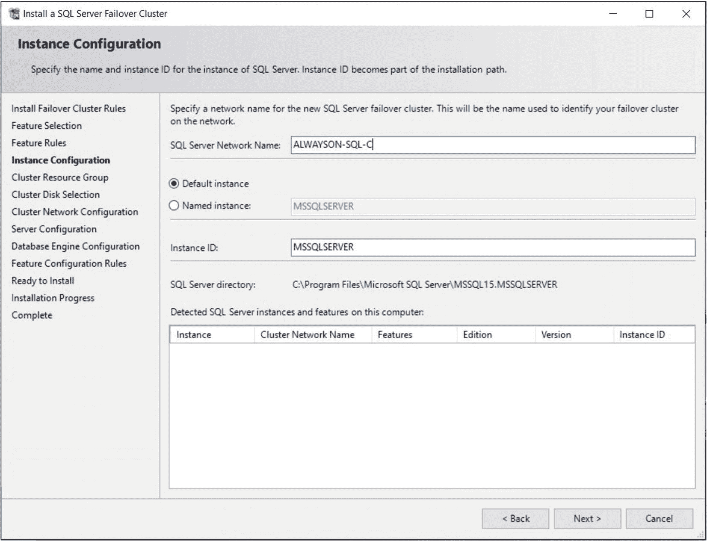

**图 4-7**  
安装 SQL Server 故障转移集群向导 – 实例配置页面

> **提示**  
> SQL Server 使用术语“集群资源组”来描述集群角色。“集群角色”是微软较新的术语，在本章中，这两个术语应视为同义。

在向导的**集群资源组**页面上，我们可以选择现有的集群资源组（这提供了由 Windows 管理员预先创建资源组的选项），或者输入新资源组的名称，该资源组将由安装程序创建。在我们的案例中，我们将指定 `ALWAYSON-SQL-C` 作为新资源组的名称。如图 4-8 所示。

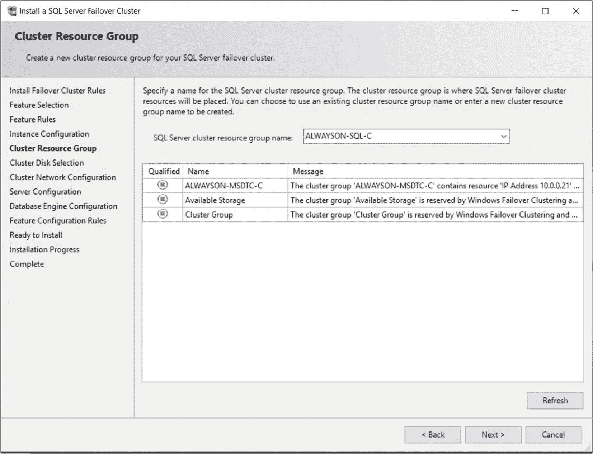

**图 4-8**  
安装 SQL Server 故障转移集群向导 – 集群资源组页面

> **提示**  
> 现有资源组将在 `合格` 列中标有红色或绿色指示器。如果指示器为红色，则表示无法将该资源组用于 SQL Server 实例。在这种情况下，`消息` 列将说明原因。

在**集群磁盘选择**页面（如图 4-9 所示）上，您可以选择应与资源组关联的磁盘资源。该页面将列出与集群关联的所有磁盘，并通过 `合格` 列中的红色或绿色指示器标明哪些磁盘可被选择。已与其他资源组关联的磁盘无法被选择，因为一个磁盘只能与一个资源组关联。我们将指定所有可用磁盘（数据、日志和 TempDB）都应与 `ALWAYSON-SQL-C` 资源组关联。

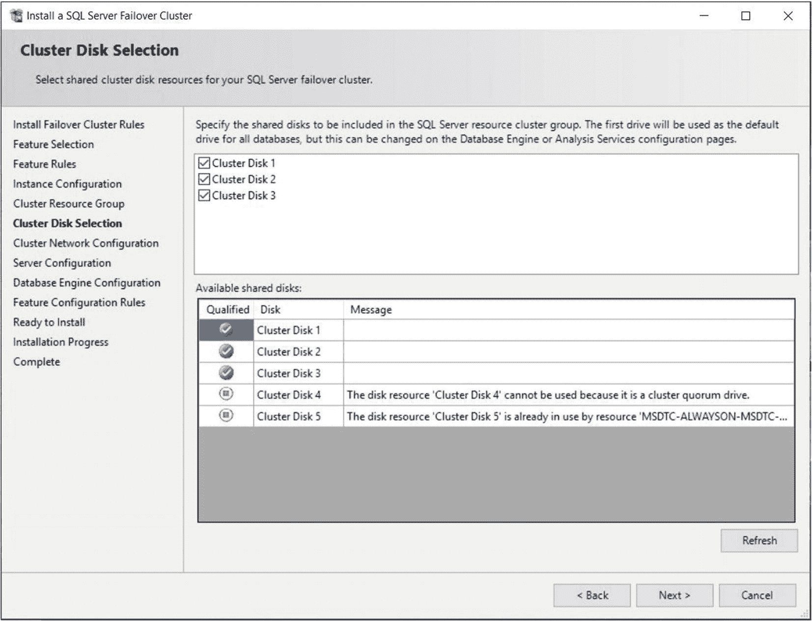

**图 4-9**  
安装 SQL Server 故障转移集群向导 – 集群磁盘选择页面

在**集群网络配置**页面（图 4-10）上，我们可以配置集群角色的 IP 地址。我们可以选择 `DHCP`（这意味着 IP 地址将自动获取），也可以指定一个静态 IP 地址。在我们的案例中，我们将指定一个静态 IP 地址。如果我们的集群是延伸集群（跨多个子网分布），则需要为每个子网指定一个 IP 地址。

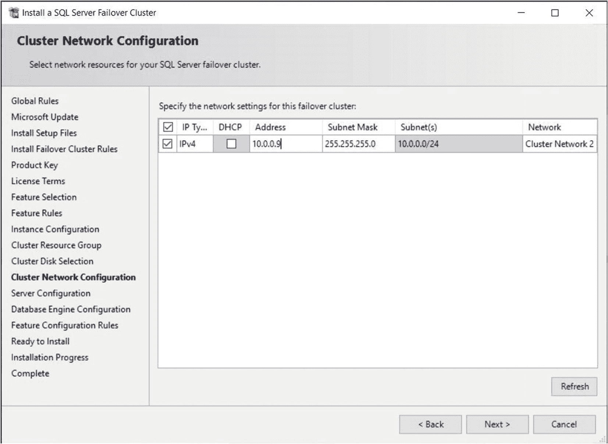

**图 4-10**  
安装 SQL Server 故障转移集群 – 集群网络配置页面

**服务器配置**页面有两个选项卡。第一个选项卡是 `服务账户`。在此选项卡上（如图 4-11 所示），我们将指定用作每个 SQL Server 服务安全上下文的服务账户，并指定每个服务的启动模式。这一点值得注意，因为在安装独立实例时，通常会将每个服务设置为自动启动。然而，在安装集群时，应将集群感知服务配置为手动启动。这是因为它们将由集群服务管理。


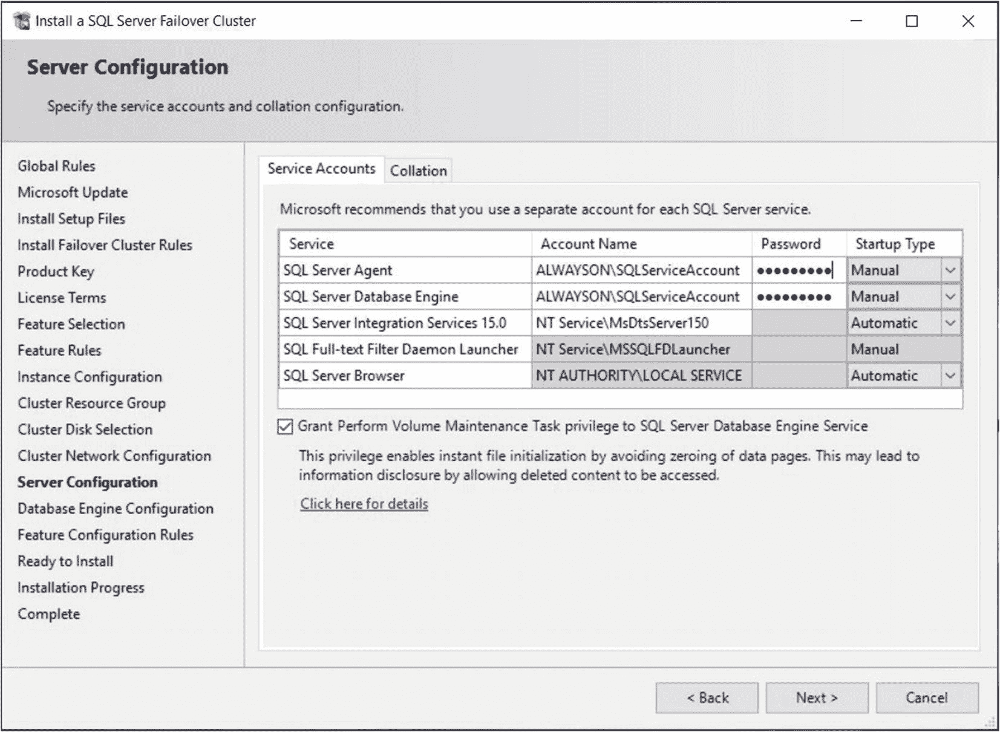
**图 4-11** 安装 SQL Server 故障转移群集 – 服务账户选项卡

## 服务账户选项卡

在最新版本的 SQL Server 中，可以在安装过程中启用 `执行卷维护任务`，这在“服务账户”选项卡上体现为一个简单的复选框。此处的考量是安全性与性能的权衡。如果您选择执行卷维护任务，则创建或扩展数据文件时将不会将其内容清零；然而，攻击者若拥有专用软件，有可能检索到先前存储在已分配磁盘块上的数据。`执行卷维护任务` 不适用于事务日志文件。

**提示**

关于 SQL Server 安全考量的完整讨论，我推荐 Apress 出版的 *《保护 SQL Server（第 2 版）：DBA 防护数据库》*，可从 [`www.apress.com/gb/book/9781484241608`](http://www.apress.com/gb/book/9781484241608) 购买。

## 排序规则选项卡

在“排序规则”选项卡（如图 4-12 所示）上，您可以指定为该实例配置的排序规则。在可能的情况下，最好在整个企业或构成数据层应用程序的实例中使用一致的排序规则。

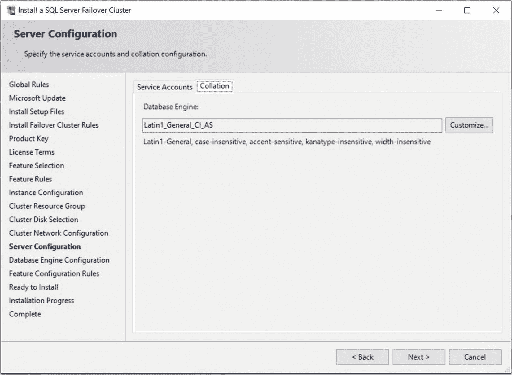
**图 4-12** 安装 SQL Server 故障转移群集 – 排序规则选项卡

## 服务器配置选项卡

数据库引擎配置页面包含六个选项卡。第一个是“服务器配置”选项卡，如图 4-13 所示。在这里，我们指定实例将使用的身份验证模式。

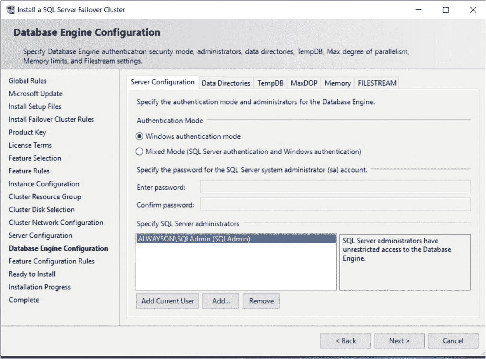
**图 4-13** 安装 SQL Server 故障转移群集 – 服务器配置选项卡

`Windows 身份验证模式` 意味着用户登录 Windows 时提供的凭据将传递给 SQL Server，用户无需任何额外凭据即可访问实例。使用 `混合模式`，虽然仍可使用 Windows 凭据访问实例，但也可以为用户创建二级凭据。如果选择此选项，则 SQL Server 将维护其自己的登录名和密码（用于在实例内部创建的登录名），即使用户的 Windows 身份没有权限，他们也可以提供这些凭据来访问。

出于安全最佳实践考虑，最好只允许 Windows 身份验证访问您的实例。这有两个原因。首先，仅使用 Windows 身份验证时，如果攻击者获得了网络访问权限，他们仍然无法访问 SQL Server，因为他们没有拥有正确权限的有效 Windows 帐户。然而，在混合模式身份验证下，一旦进入网络，攻击者就可以使用暴力攻击或其他黑客方法尝试通过二级 SQL Server 登录获得访问权限。其次，如果您指定了混合模式身份验证，则必须创建一个 `SA` 帐户。`SA` 帐户是一个 SQL Server 用户帐户，对实例拥有管理权限。如果此帐户的密码泄露，攻击者就可能获得对 SQL Server 的管理控制权。如果必须使用混合模式身份验证，最好禁用 `SA` 帐户。

然而，在某些情况下，混合模式身份验证是必需的。例如，您可能有一个不支持 Windows 身份验证的旧版应用程序，或者有一个使用二级身份验证的硬编码连接的第三方应用程序。这将是为什么可能需要混合模式身份验证的两个有效理由。另一个有效理由是，如果您的用户需要从未受信任的域访问实例。

此外，在“服务器配置”选项卡上，您可以指定将添加到 `sysadmin` 固定服务器角色中的 Windows 用户，授予他们对实例的无限制访问权限。在我们的场景中，我们将添加 `AlwaysOn\SQLAdmin` 用户作为实例管理员，并仅使用 Windows 身份验证。

## 数据目录选项卡

在“数据目录”选项卡（如图 4-14 所示）上，您可以更改数据根目录的默认位置。在此屏幕上，您还可以更改用户数据库及其日志文件的默认位置。最后，此选项卡允许您指定将要执行的数据库备份的默认位置。在我们的场景中，我们必须确保数据根目录指向 `Data` 卷，日志文件指向 `Logs` 卷。

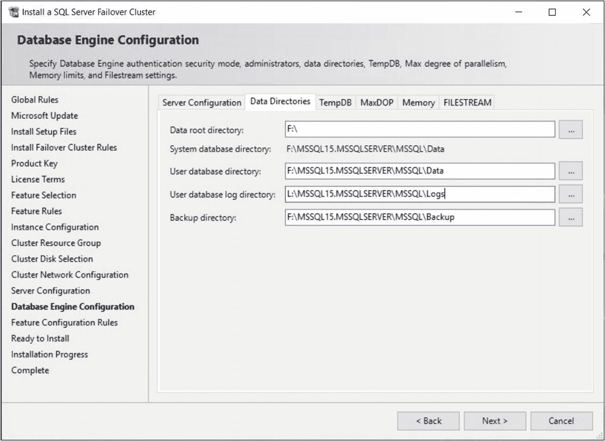
**图 4-14** 安装 SQL Server 故障转移群集 – 数据目录选项卡

## TempDB 选项卡

TempDB 选项卡如图 4-15 所示。此选项卡允许您配置 `TempDB` 数据库的属性。这很重要，因为 `TempDB` 需要正确的大小和处理器设置，以避免成为实例的瓶颈。设置将默认为推荐配置，即每个处理器核心一个文件，最多八个文件。这被认为是避免系统页面（如 `GAM`、`SGAM` 和 `PFS` 页面）争用的最佳文件数量。`TempDB` 的正确大小应通过容量规划练习来估算。我们将配置 `TempDB` 的每个文件初始大小为 60MB（总共 240MB）。我们还配置了 `TempDB` 驻留在 `TempDB` 卷上。在我们的场景中，我们还将设置文件位置指向我们的 `TempDB` 卷。

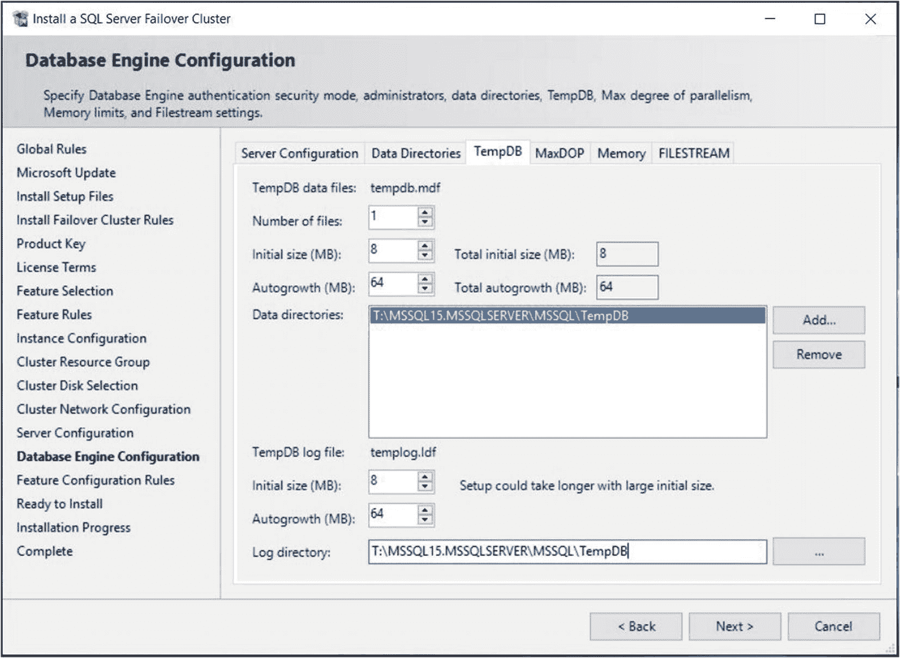
**图 4-15** 安装 SQL Server 故障转移群集 – TempDB 选项卡

## MaxDOP 选项卡

“最大并行度”选项卡（如图 4-16 所示）允许您配置实例内运行查询的默认 `最大并行度`。默认值是基于可用核心数计算的，最多为八个。但是，如果需要，可以覆盖此值。例如，对于托管具有 `OLTP`（联机事务处理）工作负载配置文件的小型数据库的实例，其中同时运行许多小型查询，有时降低 `MaxDOP` 值可能是更可取的。

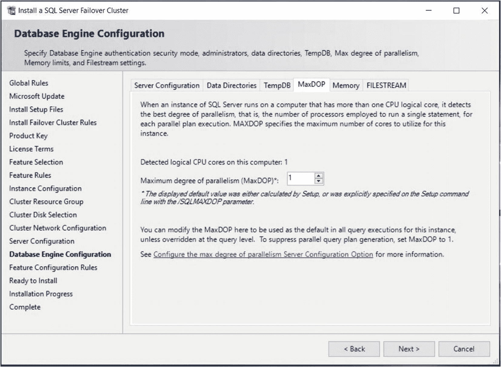
**图 4-16** 安装 SQL Server 故障转移群集 – MaxDOP 选项卡

**提示**

将 `MaxDOP` 设置为 `0` 允许使用所有可用处理器来处理使用并行查询计划的查询。

## 内存选项卡

图 4-17 展示了“内存”选项卡。在这里，您可以指定是使用默认配置（用于可分配给实例的最小和最大内存量），使用安装向导计算的推荐值，还是指定您自己的值。要指定您自己首选的值，请选择推荐选项，输入您的值，并选中 **单击此处以接受 SQL Server 数据库引擎的推荐内存配置** 复选框。如果您希望遵循安装程序的建议，也必须使用此复选框。

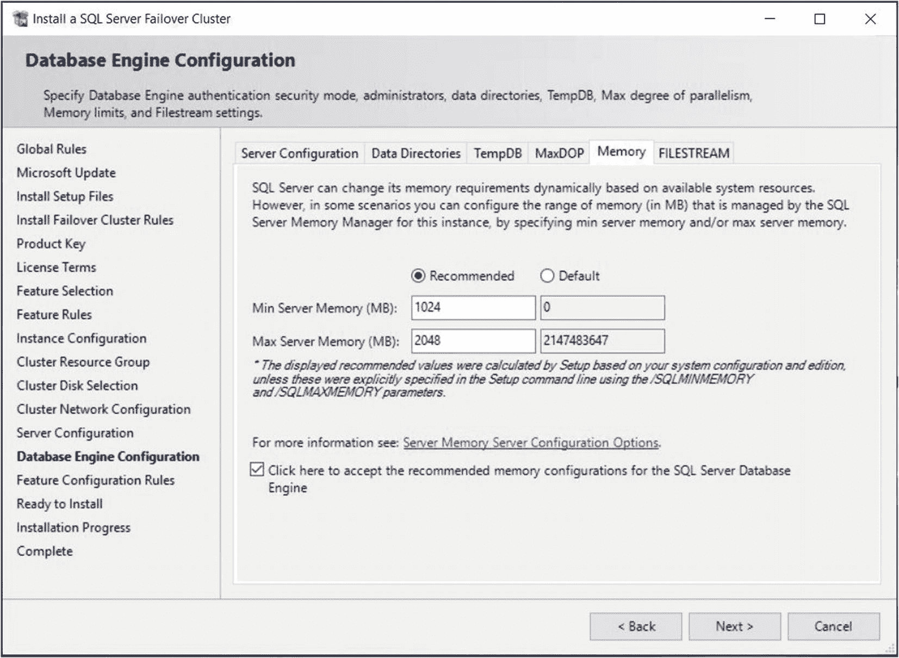
**图 4-17** 安装 SQL Server 故障转移群集 – 内存选项卡

**提示**


关于 `MaxDOP` 和 `Memory` 配置方法的完整讨论，可以参考 Apress 出版的书籍 *《SQL Server 2019 高级管理实战》*，该书可在 [`www.apress.com/gb/book/9781484250884#otherversion=9781484250891`](http://www.apress.com/gb/book/9781484250884%2523otherversion%253D9781484250891) 购买。

## 安装带有 FILESTREAM 的 SQL Server 故障转移集群实例

数据库引擎配置页面上的 `FILESTREAM` 选项卡允许您启用和配置 SQL Server `FILESTREAM` 功能的访问级别，如图 4-18 所示。如果您希望使用 SQL Server 的 `FileTable` 功能，则也必须启用 `FILESTREAM`。`FILESTREAM` 和 `FileTable` 提供了在 Windows 文件夹结构中以非结构化方式存储数据的能力，同时保留从 SQL Server 管理和查询此数据的功能。

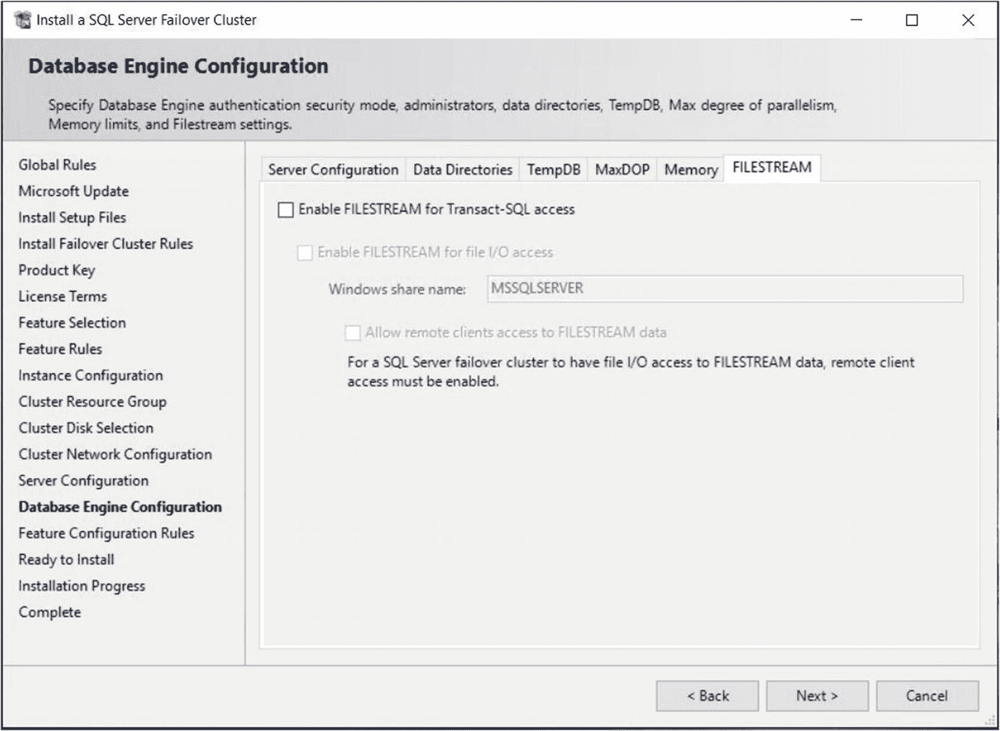

*图 4-18：安装 SQL Server 故障转移集群实例 - FILESTREAM 选项卡*

在检查完“功能配置规则”后，向导的“准备安装”页面将会显示。向导的此页面提供了安装程序将执行的操作摘要。在此页面上选择“安装”将开始实例的安装。安装完成后，应查看“完成”页面。

## 使用 PowerShell 安装实例

当然，我们可以使用 PowerShell 来安装 AlwaysOn 故障转移集群实例，而不是使用 GUI。要从 PowerShell 安装 AlwaysOn 故障转移集群实例，我们可以使用 SQL Server 的 `setup.exe` 应用程序并指定 `InstallFailoverCluster` 操作。

执行集群实例的命令行安装时，除了安装独立 SQL Server 实例时必需的参数外，还需要表 4-1 中的参数。

*表 4-1：安装集群实例所需的参数*

| 参数 | 用法 |
| --- | --- |
| `/FAILOVERCLUSTERIPADDRESSES` | 指定实例使用的 IP 地址，格式为 `<IP 类型>;<地址>;<网络名称>;<子网掩码>`。对于多子网集群，IP 地址以空格分隔。 |
| `/FAILOVERCLUSTERNETWORKNAME` | 集群实例的虚拟名称。 |
| `/INSTALLSQLDATADIR` | 放置 SQL Server 数据文件的文件夹。这必须是集群磁盘。 |

清单 4-1 中的脚本执行与刚才演示的相同安装，当您从安装介质的根目录运行它时。

```
.\SETUP.EXE /IACCEPTSQLSERVERLICENSETERMS /ACTION="InstallFailoverCluster" /FEATURES=SQL,IS  /INSTANCENAME="MSSQLSERVER" /SQLSVCACCOUNT="ALWAYSON\SQLServiceAccount" /SQLSVCPASSWORD="Pa$$w0rd" /AGTSVCACCOUNT="ALWAYSON\SQLServiceAccount" /AGTSVCPASSWORD="Pa$$w0rd" /SQLSYSADMINACCOUNTS="ALWAYSO\SQLAdmin" /SQLMAXDOP="1" /FAILOVERCLUSTERIPADDRESSES="IPv4;10.0.0.9;Cluster Network 2;255.255.255.0" /FAILOVERCLUSTERDISKS="Cluster Disk 1" "Cluster Disk 2" "Cluster Disk 3" /FAILOVERCLUSTERNETWORKNAME="ALWAYSON-SQL-C" /INSTALLSQLDATADIR="F:\" /SQLUSERDBLOGDIR="L:\MSSQL15.MSSQLSERVER\MSSQL\Logs" /SQLTEMPDBDIR="T:\MSSQL15.MSSQLSERVER\MSSQL\TempDB" /SQLTEMPDBLOGDIR="T:\MSSQL15.MSSQLSERVER\MSSQL\TempDB" /SQLMAXMEMORY="2048" /SQLMINMEMORY="1024" /qs
```
*清单 4-1：使用 PowerShell 安装 AlwaysOn 故障转移集群实例*

## 添加节点

安装集群时，您应该采取的下一步是添加第二个节点。未能添加第二个节点会导致实例保持在线，但没有高可用性，因为第二个节点无法接管角色所有权。要配置第二个节点，您需要登录到被动集群节点，并从 SQL Server 安装中心的“安装”选项卡中选择“将节点添加到 SQL Server 故障转移集群”选项。这将调用“添加故障转移集群节点向导”。此向导的第一页是“产品密钥”页面。就像安装实例时一样，您需要使用此屏幕提供 SQL Server 的产品密钥。不指定产品密钥将只让您选择安装“评估版”，而由于此版本在 180 天后过期，对于高可用性来说这可能不是最明智的选择。

向导的下一页“许可条款”要求您阅读并接受 SQL Server 的许可条款。此外，您需要指定是否希望参加 Microsoft 的“客户体验改善计划”。如果您选择此选项，则错误报告会被捕获并发送给 Microsoft。

接受许可条款后，将运行规则检查以确保满足所有条件，以便您可以继续安装。向导检查 Microsoft 更新并安装安装所需的文件后，将进行另一次规则检查，以确保满足将节点添加到集群的规则。

在“集群节点配置”页面（如图 4-19 所示），系统要求您确认要向其添加节点的实例名称。如果集群上有多个实例，则可以使用下拉框选择适当的实例。

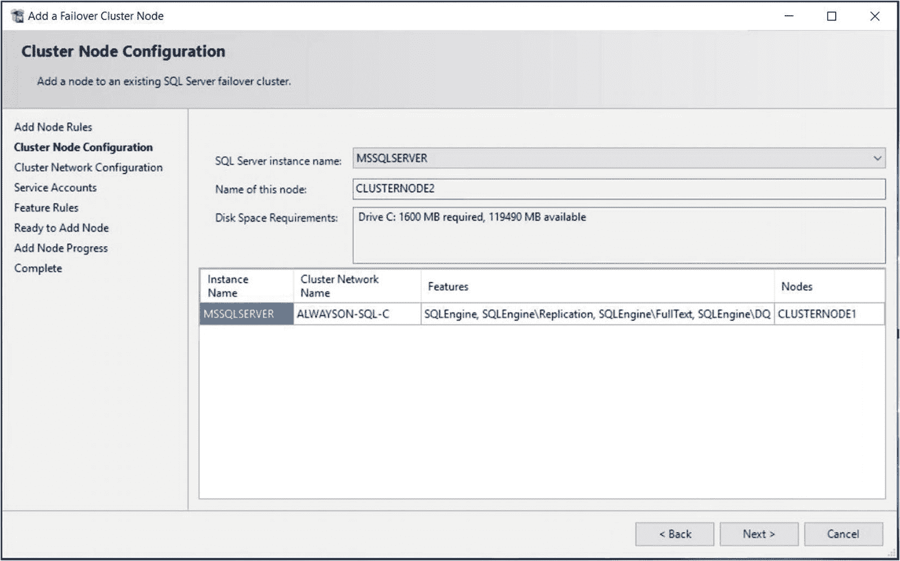

*图 4-19：添加故障转移集群节点向导 - 集群节点配置页面*

在“集群网络配置”页面（如图 4-20 所示），您确认网络详细信息。这些信息应与集群中的第一个节点相同，包括相同的 IP 地址，因为这当然是两个节点之间共享的。

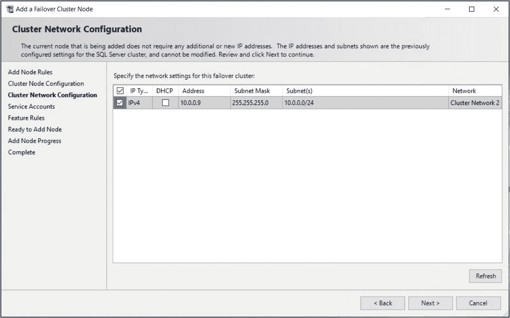

*图 4-20：集群网络配置页面*

在向导的“服务账户”页面上，大部分信息为只读模式，您无法修改。这是因为您使用的服务账户对于集群的每个节点必须是相同的。但是，您需要重新输入服务账户密码。此页面如图 4-21 所示。

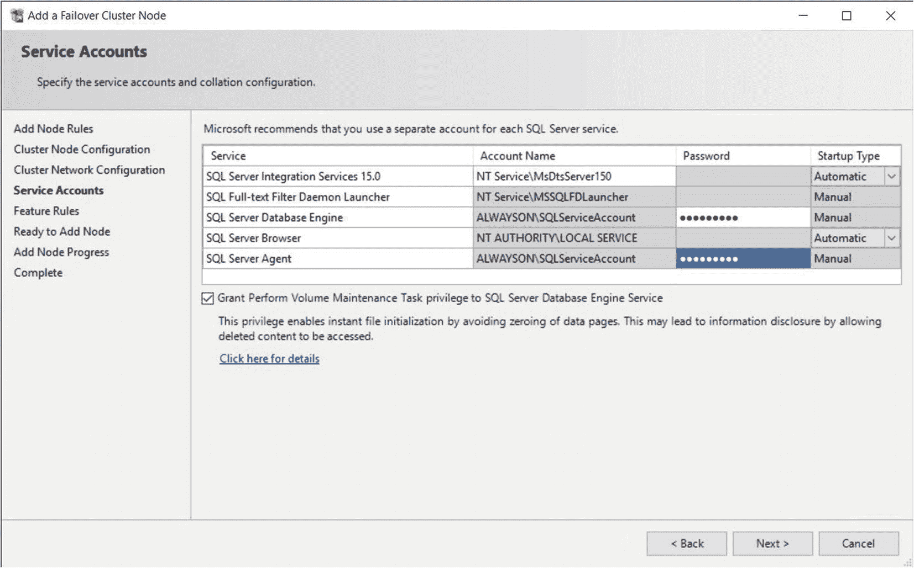

*图 4-21：服务账户页面*

现在向导已获得所有必需信息，在显示摘要页面之前会进行额外的规则检查。摘要页面（称为“准备添加节点”页面）提供了安装期间发生的活动摘要。


## 使用 PowerShell 添加节点

若要使用 PowerShell 而非 GUI 添加节点，可以运行 SQL Server 的 `setup.exe` 应用程序，并指定 `AddNode` 操作。通过命令行添加节点时，表 4-2 中详述的参数是必需的。

表 4-2
AddNode 操作的必需参数

| 参数 | 用法 |
| --- | --- |
| `/ACTION` | 必须设置为 `AddNode`。 |
| `/IACCEPTSQLSERVERLICENSETERMS` | 在 Windows Server Core 上安装时是必需的，因为 Windows Server Core 上必须指定 `/qs` 开关。 |
| `/INSTANCENAME` | 您要添加额外节点以支持的实例。 |
| `/CONFIRMIPDEPENDENCYCHANGE` | 允许为多子网群集指定多个 IP 地址。传入 `1` 表示 `True`，传入 `0` 表示 `False`。 |
| `/FAILOVERCLUSTERIPADDRESSES` | 指定要用于该实例的 IP 地址，格式为 *<IP 类型>;<地址>;<网络名称>;<子网掩码>*。对于多子网群集，IP 地址以空格分隔。 |
| `/FAILOVERCLUSTERNETWORKNAME` | 群集实例的虚拟名称。 |
| `/INSTALLSQLDATADIR` | 放置 SQL Server 数据文件的文件夹。这必须是一个群集磁盘。 |
| `/SQLSVCACCOUNT` | 用于运行数据库引擎的服务帐户。 |
| `/SQLSVCPASSWORD` | 用于运行数据库引擎的服务帐户的密码。 |
| `/AGTSVCACCOUNT` | 用于运行 SQL Server 代理的服务帐户。 |
| `/AGTSVCPASSWORD` | 用于运行 SQL Server 代理的服务帐户的密码。 |

清单 4-2 中的脚本在从安装介质的根文件夹运行时，会将 `ClusterNode2` 添加到该角色。

```
.\setup.exe /IACCEPTSQLSERVERLICENSETERMS /ACTION="AddNode" /INSTANCENAME="MSSQLSERVER" /SQLSVCACCOUNT="ALWAYSON\SQLServiceAccount" /SQLSVCPASSWORD="Pa$$w0rd" /AGTSVCACCOUNT="ALWAYSON\SQLServiceAccount" /AGTSVCPASSWORD="Pa$$w0rd" /FAILOVERCLUSTERIPADDRESSES="IPv4;10.0.0.9;Cluster Network 2;255.255.255.0" /CONFIRMIPDEPENDENCYCHANGE=0 /qs
```
清单 4-2
使用 PowerShell 添加节点

## 小结

AlwaysOn 故障转移群集实例可以使用 SQL Server 安装中心或通过 PowerShell 来安装。使用 SQL Server 安装中心时，该过程与独立实例的安装非常相似；但是，您需要指定其他详细信息，例如网络名称、IP 地址和资源组配置。

使用 PowerShell 安装实例时，将使用 `InstallFailoverCluster` 操作，除了独立实例构建所需的参数外，还需指定 `/FAILOVERCLUSTERIPADDRESSES`、`/FAILOVERCLUSTERNETWORKNAME` 和 `/INSTALLSQLDATADIR` 参数。

# 5. 在 Windows 上实现 AlwaysOn 可用性组

AlwaysOn 可用性组为实现高可用性、灾难恢复和扩展只读工作负载提供了一个灵活的选择。该技术在数据库级别同步数据，健康监控和仲裁通常由 Windows 群集提供，尽管 Windows 群集不是必需的。

AlwaysOn 可用性组有不同的变体。传统的类型基于 Windows 故障转移群集，但如果 SQL Server 安装在 Linux 上，则可以使用 Pacemaker。AlwaysOn 可用性组也可以在完全没有群集的情况下配置。这对于卸载报告工作负载是可以接受的，但不是有效的高可用性 (HA) 或灾难恢复 (DR) 配置。当使用 SQL Server 2019 和 Windows Server 2019 时，可用性组甚至可以配置为容器化的 SQL，与 Kubernetes 一起使用。

本章重点介绍如何在 Windows 故障转移群集上配置可用性组，以实现 HA 和 DR，并扩展只读工作负载。第 6 章将探讨 Linux 上的可用性组。

注意
在本章的演示中，我们将使用第 3 章中构建的群集，但已向该群集添加了两个额外的节点：`CLUSTERNODE3` 和 `CLUSTERNODE4`。我们将不使用在第 4 章中配置的故障转移群集实例。相反，在每个节点上都安装了 SQL Server 的独立实例，名称如下：`CLUSTERNODE1\PROD`、`CLUSTERNODE2\SYNCHA`、`CLUSTERNODE3\ASYNCDR` 和 `CLUSTERNODE4\READSCALE`。群集节点 1 和 2 位于名为 `Site1` 的子网中，群集节点 3 和 4 位于名为 `Site2` 的不同子网中。这些实例将数据库数据和日志文件存储在 C:\ 卷上。群集内的共享存储未用于这些实例。

在本章中，我们将执行以下活动：
*   创建 Sales、Customers、Accounts 和 HR 数据库。
*   在我们的实例上启用可用性组。
*   使用“新建可用性组”向导为 HR 数据库创建一个可用性组。此可用性组将仅配置为 HA。
*   使用“新建可用性组”对话框为 Sales 和 Customers 数据库创建一个可用性组。这将配置为 HA、DR 和读取扩展。
*   使用 T-SQL 为 Accounts 数据库创建一个可用性组。此可用性组将配置为 HA 和 DR，没有任何读取扩展。
*   我们还将讨论如何使用 PowerShell 创建可用性组。

## 准备实现 AlwaysOn 可用性组

在实现 AlwaysOn 可用性组之前，我们首先创建四个数据库，这些数据库将在本章的演示中使用。每个数据库包含一个表，其中填充了数据。每个数据库都配置为恢复模式设置为 `FULL`。这是数据库使用 AlwaysOn 可用性组的硬性要求，因为数据是通过日志流同步的。清单 5-1 中的脚本创建了这些数据库。


## 创建数据库

```sql
--创建销售数据库
CREATE DATABASE Sales ;
GO
USE Sales ;
GO
CREATE TABLE [dbo].Orders NOT NULL PRIMARY KEY CLUSTERED,
[OrderDate] [date]  NOT NULL,
[CustomerID] [int]  NOT NULL,
[ProductID] [int]   NOT NULL,
[Quantity] [int]    NOT NULL,
[NetAmount] [money] NOT NULL,
[TaxAmount] [money] NOT NULL,
[InvoiceAddressID] [int] NOT NULL,
[DeliveryAddressID] [int] NOT NULL,
[DeliveryDate] [date] NULL,
) ;
DECLARE @Numbers TABLE
(
Number        INT
)
--用数据填充 ExistingOrders
;WITH CTE(Number)
AS
(
SELECT 1 Number
UNION ALL
SELECT Number + 1
FROM CTE
WHERE Number < 100
)
INSERT INTO @Numbers
SELECT Number FROM CTE
INSERT INTO Orders
SELECT
(SELECT CAST(DATEADD(dd,(SELECT TOP 1 Number
FROM @Numbers
ORDER BY NEWID()),getdate())as DATE)),
(SELECT TOP 1 Number -10 FROM @Numbers ORDER BY NEWID()),
(SELECT TOP 1 Number FROM @Numbers ORDER BY NEWID()),
(SELECT TOP 1 Number FROM @Numbers ORDER BY NEWID()),
500,
100,
(SELECT TOP 1 Number FROM @Numbers ORDER BY NEWID()),
(SELECT TOP 1 Number FROM @Numbers ORDER BY NEWID()),
(SELECT CAST(DATEADD(dd,(SELECT TOP 1 Number - 10
FROM @Numbers
ORDER BY NEWID()),getdate()) as DATE))
FROM @Numbers a
CROSS JOIN @Numbers b ;
--为数据库设置完整恢复模式 - 可用性组所必需
ALTER DATABASE Sales SET RECOVERY FULL ;
GO
--创建客户数据库
CREATE DATABASE Customers ;
GO
USE Customers ;
GO
CREATE TABLE dbo.Customers
(
ID                INT                PRIMARY KEY        IDENTITY,
FirstName         NVARCHAR(30),
LastName          NVARCHAR(30),
CreditCardNumber  VARBINARY(8000)
) ;
GO
--填充表
DECLARE @Numbers TABLE
(
Number        INT
)
;WITH CTE(Number)
AS
(
SELECT 1 Number
UNION ALL
SELECT Number + 1
FROM CTE
WHERE Number < 100
)
INSERT INTO @Numbers
SELECT Number FROM CTE
DECLARE @Names TABLE
(
FirstName        VARCHAR(30),
LastName         VARCHAR(30)
) ;
INSERT INTO @Names
VALUES('Peter', 'Carter'),
('Michael', 'Smith'),
('Danielle', 'Mead'),
('Reuben', 'Roberts'),
('Iris', 'Jones'),
('Sylvia', 'Davies'),
('Finola', 'Wright'),
('Edward', 'James'),
('Marie', 'Andrews'),
('Jennifer', 'Abraham'),
('Margaret', 'Jones')
INSERT INTO Customers(Firstname, LastName, CreditCardNumber)
SELECT
FirstName
, LastName
, CreditCardNumber
FROM (
SELECT
(SELECT TOP 1 FirstName FROM @Names ORDER BY NEWID()) FirstName
, (SELECT TOP 1 LastName FROM @Names ORDER BY NEWID()) LastName
, (SELECT TOP 1 CONVERT(VARBINARY(8000), (
(SELECT TOP 1 CAST(Number * 100 AS CHAR(4))
FROM @Numbers
WHERE Number BETWEEN 10 AND 99
ORDER BY NEWID()
) + '-' +
(SELECT TOP 1 CAST(Number * 100 AS CHAR(4))
FROM @Numbers
WHERE Number BETWEEN 10 AND 99 ORDER BY NEWID()
) + '-' +
(SELECT TOP 1 CAST(Number * 100 AS CHAR(4))
FROM @Numbers
WHERE Number BETWEEN 10 AND 99 ORDER BY NEWID()
) + '-' +
(SELECT TOP 1 CAST(Number * 100 AS CHAR(4))
FROM @Numbers
WHERE Number BETWEEN 10 AND 99 ORDER BY NEWID())))
FROM @Numbers a
) CreditCardNumber) d
CROSS JOIN @Numbers b
CROSS JOIN @Numbers c;
--为数据库设置完整恢复模式 - 可用性组所必需
ALTER DATABASE Customers SET RECOVERY FULL ;
GO
--创建账户数据库
CREATE DATABASE Accounts ;
GO
USE Accounts ;
GO
CREATE TABLE [dbo].PurchaseOrders NOT NULL PRIMARY KEY CLUSTERED,
[OrderDate] [date]  NOT NULL,
[CustomerID] [int]  NOT NULL,
[ProductID] [int]   NOT NULL,
[Quantity] [int]    NOT NULL,
[NetAmount] [money] NOT NULL,
[TaxAmount] [money] NOT NULL,
[InvoiceAddressID] [int] NOT NULL,
[DeliveryAddressID] [int] NOT NULL,
[DeliveryDate] [date] NULL,
) ;
DECLARE @Numbers TABLE
(
Number        INT
)
--用数据填充 ExistingPurchaseOrders
;WITH CTE(Number)
AS
(
SELECT 1 Number
UNION ALL
SELECT Number + 1
FROM CTE
WHERE Number < 100
)
INSERT INTO @Numbers
SELECT Number FROM CTE
INSERT INTO PurchaseOrders
SELECT
(SELECT CAST(DATEADD(dd,(SELECT TOP 1 Number
FROM @Numbers
ORDER BY NEWID()),getdate())as DATE)),
(SELECT TOP 1 Number -10 FROM @Numbers ORDER BY NEWID()),
(SELECT TOP 1 Number FROM @Numbers ORDER BY NEWID()),
(SELECT TOP 1 Number FROM @Numbers ORDER BY NEWID()),
500,
100,
(SELECT TOP 1 Number FROM @Numbers ORDER BY NEWID()),
(SELECT TOP 1 Number FROM @Numbers ORDER BY NEWID()),
(SELECT CAST(DATEADD(dd,(SELECT TOP 1 Number - 10
FROM @Numbers
ORDER BY NEWID()),getdate()) as DATE))
FROM @Numbers a
CROSS JOIN @Numbers b ;
--为数据库设置完整恢复模式 - 可用性组所必需
ALTER DATABASE Accounts SET RECOVERY FULL ;
GO
CREATE DATABASE HR ;
GO
USE HR ;
GO
CREATE TABLE dbo.Employees
(
ID                INT                PRIMARY KEY        IDENTITY,
FirstName         NVARCHAR(30),
LastName          NVARCHAR(30),
EmployeeNumber    INT
) ;
GO
--填充表
DECLARE @Numbers TABLE
(
Number        INT
)
;WITH CTE(Number)
AS
(
SELECT 1 Number
UNION ALL
SELECT Number + 1
FROM CTE
WHERE Number < 100
)
INSERT INTO @Numbers
SELECT Number FROM CTE
DECLARE @Names TABLE
(
FirstName        VARCHAR(30),
LastName         VARCHAR(30)
) ;
INSERT INTO @Names
VALUES('Peter', 'Carter'),
('Michael', 'Smith'),
('Danielle', 'Mead'),
('Reuben', 'Roberts'),
('Iris', 'Jones'),
('Sylvia', 'Davies'),
('Finola', 'Wright'),
('Edward', 'James'),
('Marie', 'Andrews'),
('Jennifer', 'Abraham'),
('Margaret', 'Jones')
INSERT INTO Employees(Firstname, LastName, EmployeeNumber)
SELECT
(SELECT TOP 1 FirstName FROM @Names ORDER BY NEWID()) FirstName
, (SELECT TOP 1 LastName FROM @Names ORDER BY NEWID()) LastName
, a.Number EmployeeNumber
FROM @Numbers a ;
--为数据库设置完整恢复模式 - 可用性组所必需
ALTER DATABASE HR SET RECOVERY FULL ;
GO
```

清单 5-1：创建数据库

## 配置 SQL Server

配置 AlwaysOn 可用性组的第一步是在 SQL Server 服务上启用此功能。要从 GUI 启用此功能，我们打开 SQL Server 配置管理器，浏览到 `SQL Server 服务`，并从 SQL Server 服务的上下文菜单中选择 `属性`。当我们这样做时，会显示服务属性，我们导航到 `Always On 可用性组` 选项卡，如图 5-1 所示。

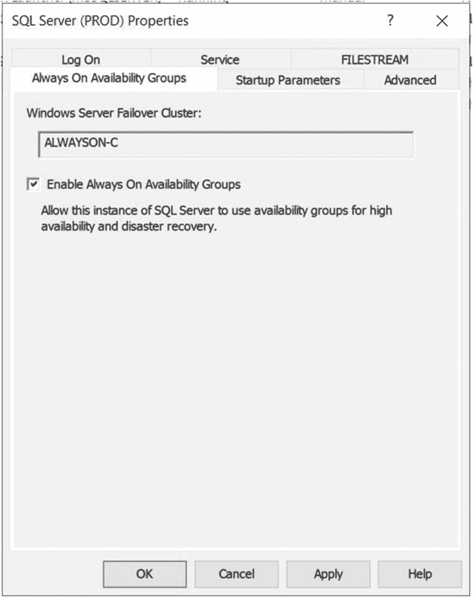

图 5-1：`Always On 可用性组` 选项卡

在此选项卡上，我们勾选 `启用 AlwaysOn 可用性组` 复选框，并确保 `Windows 故障转移群集名称` 框中显示的群集名称正确。然后我们需要重新启动 SQL Server 服务。因为 AlwaysOn 可用性组使用独立实例（这些实例本地安装在每个群集节点上），而不是跨越多个节点的故障转移群集实例，所以我们需要对群集上托管的每个独立实例重复这些步骤。

我们也可以使用 PowerShell 来启用 AlwaysOn 可用性组。为此，我们使用清单 5-2 中的 PowerShell 命令。该脚本假定 `CLUSTERNODE1` 是服务器名称，`PROD` 是 SQL Server 实例名称。

```powershell
Enable-SqlAlwaysOn -Path SQLSERVER:\SQL\CLUSTERNODE1\PROD
```

清单 5-2：启用 AlwaysOn 可用性组

下一步是对将成为可用性组一部分的所有数据库进行完整备份。在完成此操作之前，我们将无法将它们添加到可用性组。在本章中，我们将创建三个独立的可用性组。然而，在第一个例子中，我们将创建一个名为 `HR` 的可用性组，它将为 `HR` 数据库提供高可用性。因此，我们需要备份 `HR` 数据库。我们通过运行清单 5-3 中的脚本来实现这一点。

```sql
BACKUP DATABASE HR
TO  DISK = N'C:\Backups\HR.bak'
WITH NAME = N'HR-完整数据库备份' ;
GO
```

清单 5-3：备份数据库

## 使用新建可用性组向导

当备份成功完成后，我们通过 SSMS 中“对象资源管理器”里的“AlwaysOn 高可用性”进行导航，并从“可用性组”文件夹的上下文菜单中选择“新建可用性组向导”来启动该向导。向导的“简介”页面随即显示，为我们概述了需要执行的步骤。

在“指定名称”页面（参见图 5-2），系统会提示我们为可用性组输入一个名称。我们还需要选择“Windows Server 故障转移群集”作为“群集类型”。其他群集类型选项包括“外部”（支持 Linux 上的 Pacemaker）和“无”（用于无群集的可用性组）。“数据库级别运行状况检测”选项将导致可用性组在组内任何数据库脱机时发生故障转移。“每数据库 DTC 支持”选项将指定是否支持使用 MSDTC（Microsoft 分布式事务处理协调器）的跨数据库事务。完整讨论配置 DTC 超出了本书范围，但更多详细信息可在 [`https://docs.microsoft.com/en-us/previous-versions/windows/desktop/ms681291(v=vs.85)`](https://docs.microsoft.com/en-us/previous-versions/windows/desktop/ms681291%2528v%253Dvs.85%2529) 找到。

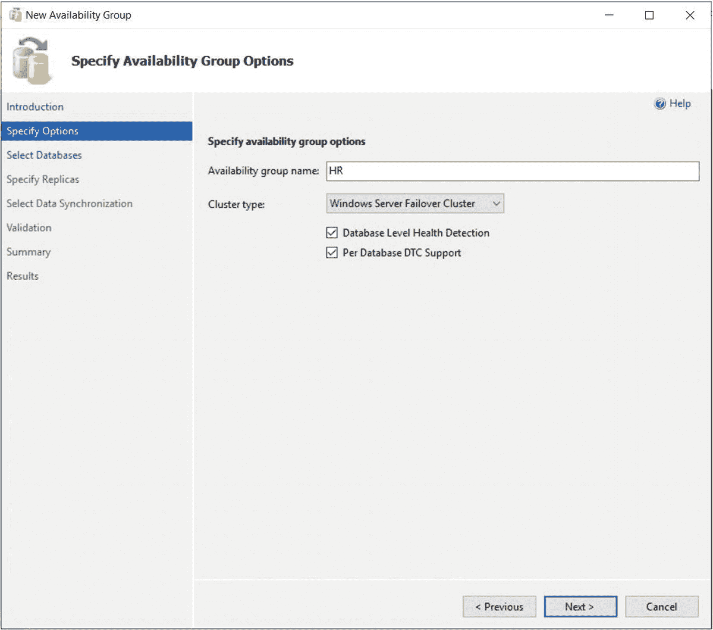

图 5-2：指定名称页面

在“选择数据库”页面，系统会提示我们选择希望参与可用性组的数据库，如图 5-3 所示。在此屏幕上，请注意我们无法选择 `Sales`、`Customers` 或 `Accounts` 数据库，因为我们尚未对这些数据库进行完整备份。

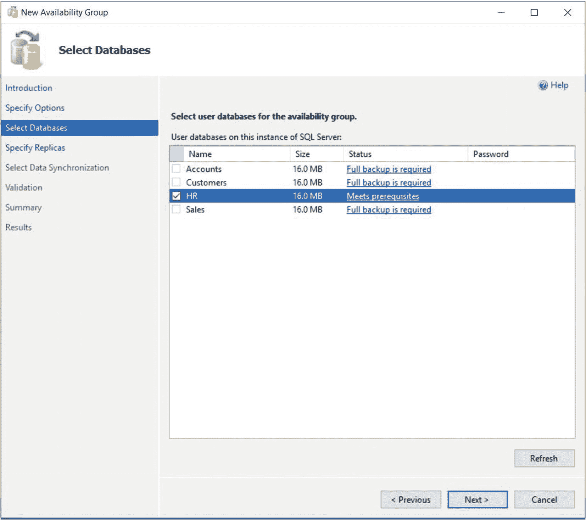

图 5-3：选择数据库页面

“指定副本”页面包含五个选项卡。我们使用第一个选项卡“副本”来向拓扑中添加辅助副本。选中“同步提交”选项会导致数据在提交到主副本之前先在辅助副本上提交。（这也被称为在辅助副本上先于主副本“固化日志”）。这意味着在发生故障转移时，不会发生数据丢失，即我们可以满足 SLA（服务级别协议）中 RPO（恢复点目标）为零的要求。然而，这也意味着性能会有所下降。如果选择“异步提交”，则副本将以异步提交模式运行。这意味着数据在提交到辅助副本之前先在主副本上提交。这避免了性能下降，但也意味着在发生故障转移时，RPO 是不确定的。

当我们选中“自动故障转移”选项时，如果我们尚未选择“同步提交”，它也会被自动选中。这是因为自动故障转移仅在同步提交模式下才可能实现。我们可以将“可读辅助副本”下拉菜单设置为“否”、“是”或“仅意向读”。当设置为“否”时，处于辅助角色的副本上的数据库不可访问。当设置为“仅意向读”时，可用性组侦听器可以将只读工作负载重定向到此辅助副本，但前提是应用程序在连接字符串中指定了 `Application Intent=Read-only`。将其设置为“是”则使侦听器能够重定向只读流量，无论应用程序的连接字符串中是否包含 `Application Intent` 参数。尽管我们可以同时通过 GUI 更改“可读辅助副本”的值并配置副本进行自动故障转移而不报错，但这只是向导的一个特性。实际上，该副本是不可访问的，因为在配置为自动故障转移时不支持活动辅助副本。“副本”选项卡如图 5-4 所示。为了满足我们为 HR 数据库实现高可用性的要求，我们将同一站点内的辅助服务器配置为同步副本。这意味着数据中心之间的延迟不会加剧与同步提交相关的性能下降。

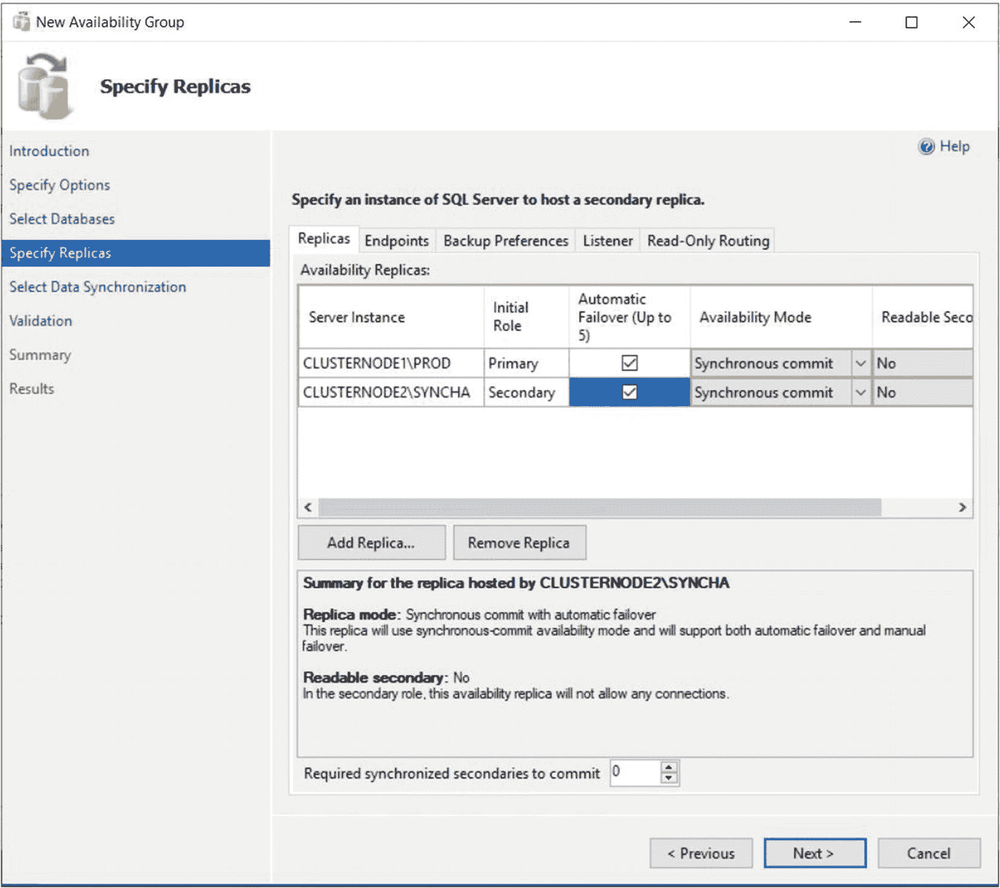

图 5-4：“副本”选项卡

在“指定副本”页面的“端点”选项卡上（如图 5-5 所示），我们为每个端点指定端口号。默认端口为 `5022`，但如果需要，我们可以指定不同的端口。在此选项卡上，我们还指定在端点之间发送数据时是否应进行加密。选中此选项通常是个好主意，如果选中，则使用 AES（高级加密标准）作为加密算法。

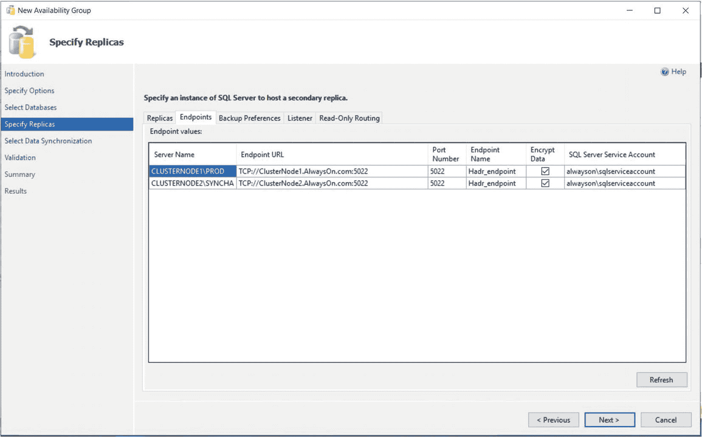

图 5-5：“端点”选项卡

（可选）您还可以更改所创建端点的名称。但是，由于每个实例只允许一个数据库镜像端点，而且默认名称具有相当的描述性，因此并不总是需要更改它。一些 DBA 选择重命名它以包含实例名称，因为这可以简化多服务器的管理。如果您的企业在同一群集的多个实例上拆分了多个可用性组，这是一个好主意。

每个实例使用的服务帐户出于信息目的而显示。如果您确保两个实例使用相同的服务帐户，则可以简化安全管理。如果未能做到这一点，您将需要为每个实例授予对每个服务帐户的权限。这意味着，您不是通过仅将一个服务帐户用于一个实例来减小其安全影响范围，而是将其影响范围简单地从操作系统级别提升到 SQL Server 级别。

端点 URL 指定了可用性组将用于通信的端点的 URL。URL 的格式为 `[传输协议]://[路径]:[端口]`。数据库镜像端点的传输协议始终是 TCP（传输控制协议）。路径可以是服务器的完全限定域名 (FQDN)、单独的服务器名称，或是网络中唯一的 IP 地址。我建议使用服务器的 FQDN，因为这始终保证可以工作。它也是默认填写的数值。端口应与您为端点指定的端口号匹配。

注意


### 可用性组概述

可用性组通过一个数据库镜像端点进行通信。尽管数据库镜像功能已被弃用，但这些端点本身并未被弃用。

### 备份首选项选项卡

在“备份首选项”选项卡（见图 5-6）上，我们可以指定将对哪个副本执行自动备份。`AlwaysOn 可用性组`的一大优势在于，使用时您可以将维护任务（如备份）扩展到辅助服务器。因此，自动备份可以无缝地定向到活动辅助副本。可能的选项包括`首选辅助副本`、`仅限辅助副本`、`首选主副本`或`任何副本`。还可以为每个副本设置优先级。当决定对哪个副本运行备份作业时，`SQL Server` 会评估每个节点的备份优先级，并更有可能选择优先级最高的副本。

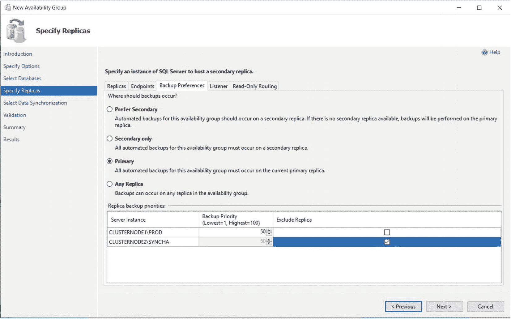

### 扩展自动备份的考虑因素

虽然减少主副本上的 `IO` 优势明显，但我有些争议性地建议在许多情况下不要将自动备份扩展到辅助副本。特别是当 `RTO`（恢复时间目标）因操作可支持性问题而成为应用程序的优先事项时。想象这样一个场景：备份正在辅助副本上执行，用户致电说他们不小心删除了一个关键表中的所有数据。您现在需要还原数据库副本并重新填充该表。然而，备份文件却存放在辅助副本上。因此，在开始还原数据库（或通过网络执行还原）之前，您需要先将备份文件复制到主副本。这立即使您的 `RTO` 增加。

此外，当配置为允许在多台服务器上执行备份时，`SQL Server` 仍然只在执行备份的实例上维护备份历史记录。这意味着您可能需要在服务器之间匆忙尝试检索所有备份文件，却不知道每个文件存放在哪里。如果其中一台服务器发生完全系统中断，情况会变得更糟。您可能会陷入日志链断裂的境地。

对于我刚提到的大多数问题，解决方法是使用文件服务器上的共享文件夹，并将每个实例配置为备份到同一共享位置。这可能带来中性、正面或负面的影响。负面影响在于，如果您使用的是本地连接存储。通过这种方式设置备份，您现在是将所有备份通过网络传输，而不是在本地备份。这可能会增加备份的持续时间并增加网络流量。正面影响则体现在您使用的是云 `IaaS`（基础设施即服务）环境时。通常，附加到您的 `VM`（虚拟机）的存储比用于创建文件共享的存储更昂贵。然而，在许多现代本地场景中，其影响是中性的。这是因为文件共享和服务器存储很可能位于同一个 `SAN`（存储区域网络）或 `NAS`（网络附加存储）设备上。这意味着，如果您以这种方式配置备份，网络流量或延迟没有区别。

### 监听器选项卡

在“监听器”选项卡（如图 5-7 所示）上，我们选择是创建可用性组侦听器，还是将此任务推迟到以后。如果选择创建侦听器，则需要指定侦听器的名称、其应监听的端口以及它应使用的 `IP` 地址。在多子网集群中，我们需要为每个子网指定一个地址。此处提供的详细信息用于在可用性组的集群角色中创建客户端访问点资源。您可能会注意到，我们为侦听器指定了端口 `1433`，而我们的实例也运行在端口 `1433` 上。这是一个有效的配置，因为侦听器配置在与 `SQL Server` 实例不同的 `IP` 地址上。使用相同的端口号并非强制要求，但如果您是在现有实例上实施 `AlwaysOn 可用性组`，这可能是有益的，因为指定端口号连接的应用程序可能需要更少的应用程序更改。请记住，服务器名称仍将不同，因为应用程序将连接到侦听器的虚拟名称，而不是物理服务器\实例的名称。在我们的示例中，应用程序连接到 `HR` 而不是 `CLUSTERNODE1\PROD`。尽管通过 `CLUSTERNODE1` 的连接仍然允许，但它们无法受益于高可用性或扩展我们的报表功能。

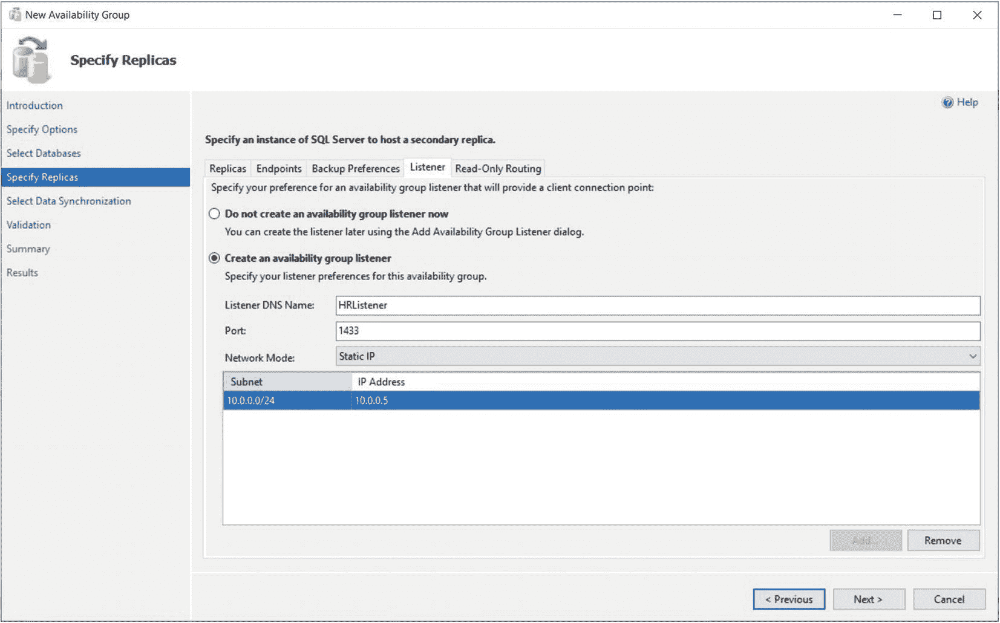

> **提示**：子网是网络的一个网段，包含来自更大网络的一部分 `IP` 地址。

因为我们的 `HR` 可用性组不跨越多个子网，所以我们的侦听器将只有一个 `IP` 地址。

> **提示**：如果您在组织单位（`OU`）内没有`创建计算机对象`权限，那么侦听器的 `VCO`（虚拟计算机对象）必须已存在于 `AD`（活动目录）中，并且您必须被分配对该对象的`完全控制`权限。

> **提示**：由于 `HR` 可用性组不会配置为可读辅助副本，因此我们不需要配置`只读路由`选项卡；但是，我们将在本章的“使用新建可用性组对话框”一节中探讨只读路由。

### 选择初始数据同步页面

在“选择初始数据同步”屏幕（如图 5-8 所示）上，我们选择如何执行副本的初始数据同步。如果选择`完全同步`，则参与可用性组的每个数据库都将执行完整备份，然后是日志备份。备份文件备份到您指定的共享位置，然后还原到辅助服务器。共享路径可以使用 Windows 或 Linux 格式指定，具体取决于您的要求。还原完成后，通过日志流的数据同步开始。

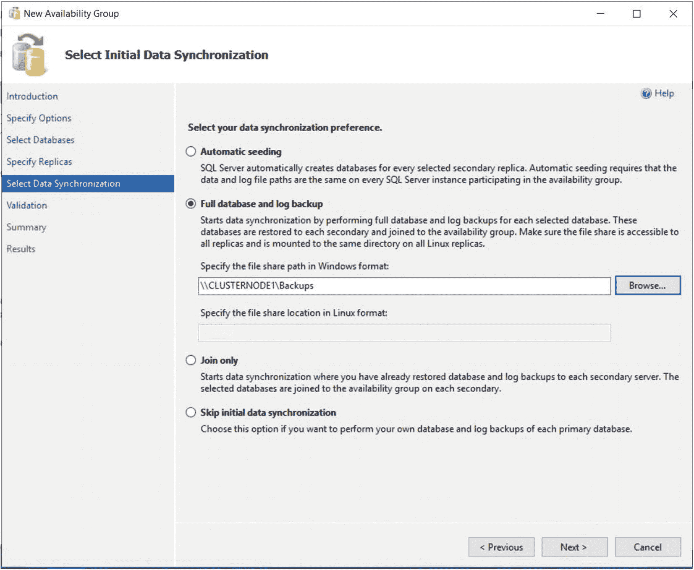

如果您已经备份了数据库并将其还原到辅助副本上，则可以选择`仅加入`选项。这将启动可用性组内数据库通过日志流的数据同步。选择`跳过初始数据同步`允许您在完成设置后自行备份和还原数据库。

如果您选择`自动种子设定`选项，则最初会在每个副本上创建一个空数据库。然后，数据通过日志流传输使用 `VDI`（虚拟设备接口）进行种子设定。此选项比使用备份初始化慢，但避免了在共享位置之间传输大型备份文件。

> **提示**：如果您的可用性组将包含许多数据库，那么最好自行执行备份/还原操作。这是因为内置工具将按顺序执行操作，因此可能需要很长时间才能完成。


### 验证与配置过程

在验证页面，将检查可能导致设置失败的规则。如果任何一项结果为失败，则需要在尝试继续之前解决它们。

**提示**
在验证过程中，一个常见的陷阱会在使用命名实例时被发现。可用性组的要求是数据库必须位于所有副本上相同的文件路径中。然而，SQL Server 数据文件的默认文件位置包含实例名称。这对于默认实例无关紧要，因为文件路径中的实例名称始终是`MSSQLSERVER`。但对于命名实例，请确保数据库文件存储在所有服务器上都存在的文件路径中。

验证测试完成后，我们会转到摘要页面，其中列出了在设置期间要执行的任务。

随着设置的进行，每个配置任务的结果会显示在结果页面上。如果在此页面上出现任何错误，请务必调查，但这不一定意味着需要重新配置整个可用性组。例如，如果创建可用性组侦听器失败是因为`VCO`未在`AD`中呈现，那么您可以重新创建侦听器，而无需重新创建整个可用性组。

作为使用新建可用性组向导的替代方法，您可以使用新建可用性组对话框，然后使用添加侦听器对话框来执行可用性组的配置。下一节将研究这种创建可用性组的方法。

## 使用新建可用性组对话框

既然我们已经成功创建了第一个可用性组，现在让我们为`Sales`创建第二个可用性组。此可用性组将包含`Sales`和`Customer`数据库。这次，我们使用新建可用性组和添加侦听器对话框。我们通过备份`两个数据库`来开始此过程。就像我们创建`HR`可用性组时一样，在执行备份之前，数据库是不可选择的。与使用向导不同，我们无法使用备份/恢复选项让 SQL Server 执行初始数据库同步。因此，我们必须要么将数据库备份到我们在先前演示中创建的共享，然后将该备份以及一个事务日志备份还原到辅助实例，要么使用自动暂存。在此示例中，我们将使用自动暂存，因此无需提前将数据库还原到辅助副本。清单 5-4 中的脚本将执行数据库的完整备份。

**提示**
要使自动暂存工作，必须授予可用性组在辅助服务器上的`CREATE ANY DATABASE`权限。

```
--Back Up Sales Database
BACKUP DATABASE Sales
TO  DISK = N'C:\Backups\Sales.bak'
WITH NAME = N'Sales-Full Database Backup' ;
GO
--Back Up Customers Database
BACKUP DATABASE Customers
TO  DISK = N'C:\Backups\Customers.bak'
WITH NAME = N'Customers-Full Database Backup' ;
GO
```
清单 5-4
备份和还原数据库

如果我们尚未创建可用性组，那么我们的下一步工作将是创建一个`TCP`端点，以便实例可以通信。然后，我们需要在每个实例上为服务帐户创建一个登录名，并授予其在端点上的连接权限。然而，由于每个实例只能有一个数据库镜像端点，因此我们不需要创建一个新的端点，而且显然我们也没有理由授予服务帐户额外的权限。因此，我们继续创建可用性组。为此，我们在对象资源管理器中浏览 **AlwaysOn 高可用性**，并从可用性组的上下文菜单中选择**新建可用性组**。

这将显示新建可用性组对话框的**常规**选项卡，如图 5-9 所示。在此屏幕上，我们在第一个字段中键入可用性组的名称。然后，我们在**可用性数据库**窗口下单击**添加**按钮，再键入要添加到组中的数据库的名称。然后，我们需要在**可用性副本**窗口下单击**添加**按钮，再在新行中键入辅助副本的服务器\实例名称。然而，我们将`Required Synchronized Secondaries to Commit`设置为`1`。此设置在 SQL Server 2017 中引入，它保证在主副本提交每个事务之前，指定数量的辅助副本将事务数据写入日志。在我们的场景中，我们只有一个同步辅助副本，如果主副本发生故障，故障转移将自动发生，但在原始主副本重新联机之前，辅助副本将不允许用户事务写入数据库。这绝对保证了在任何情况下都不会发生数据丢失。如果我们将其保留为`0`（正如我们在本章第一个示例中所做的那样），那么在主副本发生故障且用户在其他副本也发生故障之前将事务写入辅助副本的情况下，就可能发生数据丢失，因为其他副本配置为异步提交模式。

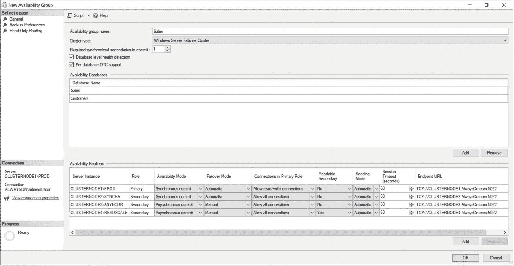

图 5-9
新建可用性组对话框

### 设置副本属性

现在可以开始设置副本属性了。我们在创建`HR`可用性组时已经讨论过角色、可用性模式、故障转移模式、可读辅助副本和终结点 URL 属性。“连接在主角色中”属性定义了当副本处于主角色时，可以建立哪些连接。可以将其配置为“允许所有连接”或“允许读写连接”。当指定为“允许读写连接”时，连接字符串中使用`Application Intent = Read only`参数的应用程序将无法连接到该副本。

“会话超时”属性设置了副本在多长时间内没有收到彼此的心跳后会进入`DISCONNECTED`状态并结束会话。虽然可以将此值设置为低至 5 秒，但通常建议将设置保持在 60 秒；否则，可能会遇到误报响应的风险，导致不必要的故障转移。如果副本超时，则需要重新同步，因为即使辅助副本运行在同步提交模式下，主副本上的事务也将不再等待它。

在对话框的“备份首选项”选项卡中，我们定义了用于自动备份作业的首选副本，如图 5-10 所示。就像使用向导时一样，我们可以指定“主副本”，也可以选择强制或偏好在辅助副本上进行备份。我们还可以为每个副本配置一个介于 0 到 100 之间的权重，并使用“排除副本”复选框来避免在特定节点上进行备份。

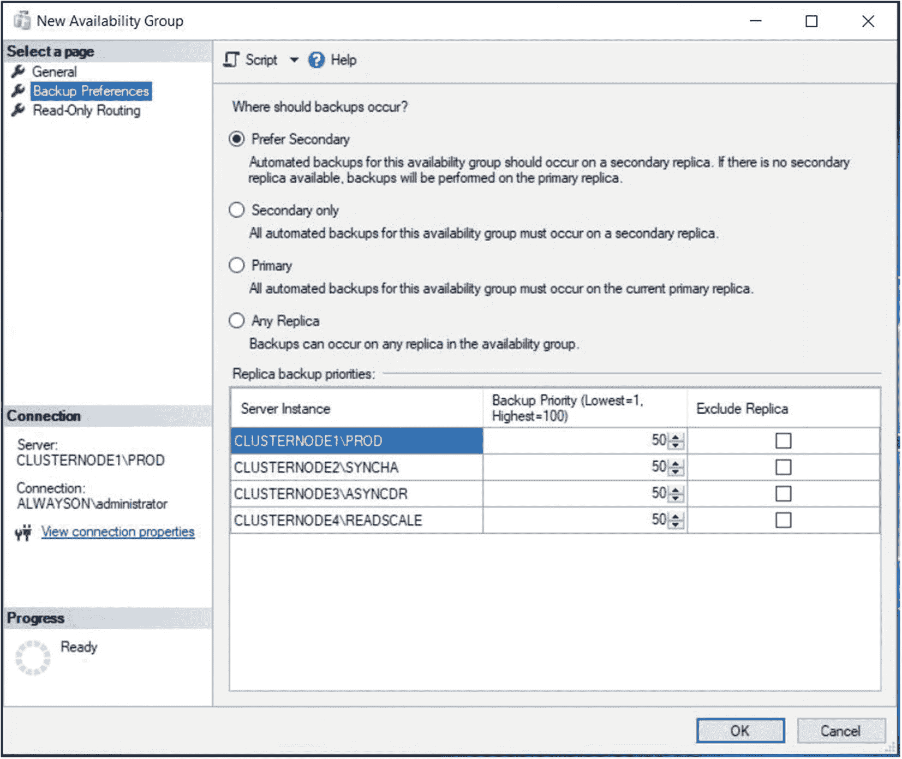

图 5-10

备份首选项选项卡

在“只读路由”选项卡上（如图 5-11 所示），我们将配置`CLUSTERNODE4\READSCALE`实例为可读辅助副本。发送到侦听器的只读请求将被重定向到此实例，而不是发送到主副本（主副本将驻留在其他三个实例之一上）。此配置的第一步是为可读辅助副本添加一个“只读路由 URL”。这类似于我们为每个节点配置的“终结点 URL”，不同之处在于它将服务于只读请求。只读 URL 可以是 IP 地址或 FQDN，并且必须包含实例正在侦听的端口。这意味着在进行此配置之前，必须确保实例正在静态端口上侦听。

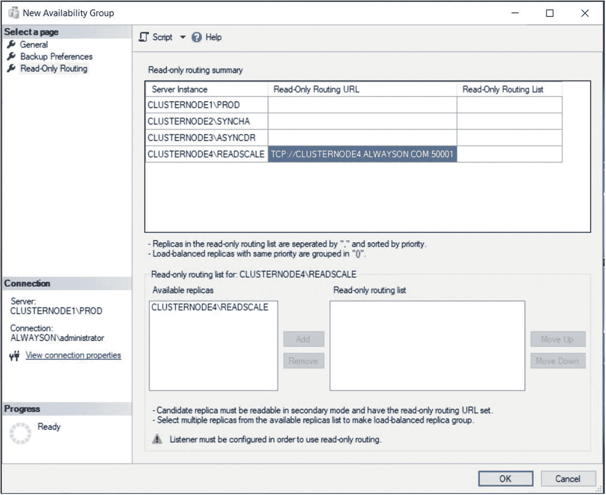

图 5-11

只读路由选项卡 – 配置只读路由 URL

一旦将只读路由 URL 添加到您计划配置的每个可读辅助副本，该可读辅助副本就会出现在选项卡下部的“可用副本”窗口中。现在，您可以为每个您希望能够路由到该可读辅助副本的副本选择“只读路由列表”单元格，然后单击选项卡下半部分的“添加”按钮，将其添加到“只读路由列表”中，如图 5-12 所示。

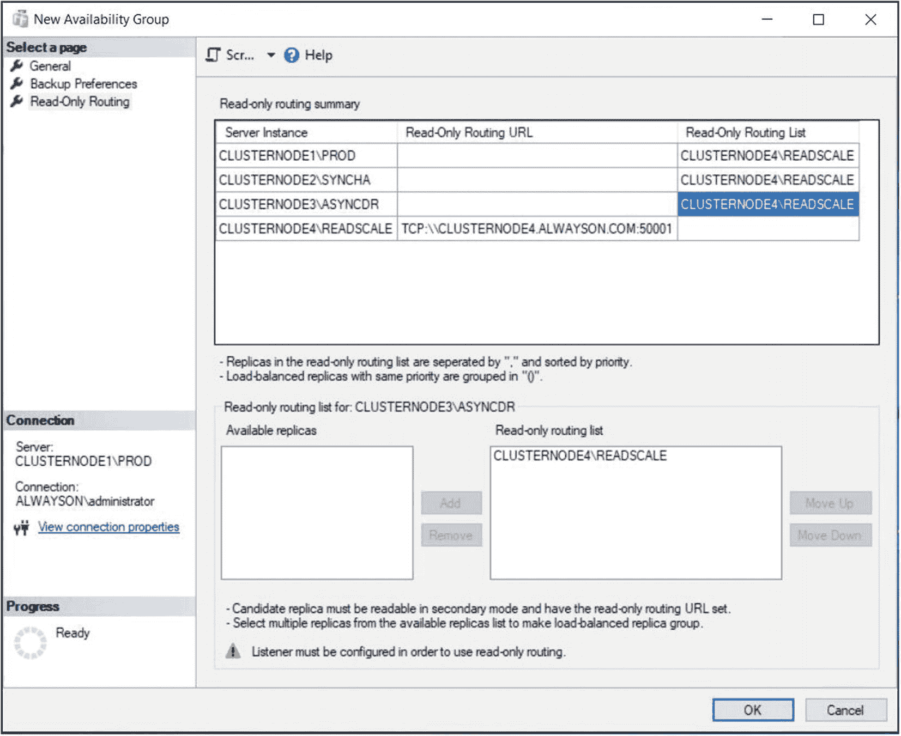

图 5-12

只读路由选项卡 – 配置只读路由列表

此示例展示了一个简单的配置，其中所有节点（当它们托管主副本时）都可以将读取请求卸载到单个可读辅助副本。然而，更复杂的排列也是可能的。例如，您可以将每个节点配置为路由到一个单独的可读辅助副本。如果您的可用性组分布在多个站点之间，并且您希望确保每个节点将只读请求路由到同一站点中的副本，以提高读取横向扩展的冗余性，这将非常有用。

或者，您可以允许每个节点将只读请求路由到多个可读辅助副本。在此场景中，您有两个选择。默认实现将始终将读取请求发送到第一个可用的副本，因此您只是为可读辅助副本增加了冗余。如果这是意图，那么路由列表中的每个可读辅助副本将用逗号分隔。更高级的实现是将可读辅助副本配置为负载平衡只读请求。在此场景中，只读请求将使用循环方式在负载平衡集内路由。负载平衡集内的节点将用逗号分隔，该集将用括号括起来。

您还可以在同一路由列表中配置多个负载平衡集。这里，请求将在第一个负载平衡集内循环路由，除非该集中的节点变得不可用，在这种情况下，请求将在下一个集内循环路由。

例如，假设您希望只读请求在 ServerA 和 ServerB 之间负载平衡，但如果这些服务器变得不可用，则希望请求在 ServerC 和 ServerD 之间负载平衡。您的只读路由列表将采用以下形式：`((ServerA,ServerB),(ServerC,ServerD))`。

创建可用性组后，我们需要创建可用性组侦听器。为此，我们在`Sales`可用性组的上下文菜单中选择“新建侦听器”，该组现在应该在对象资源管理器中可见。这将调用“新建可用性组侦听器”对话框，如图 5-13 所示。

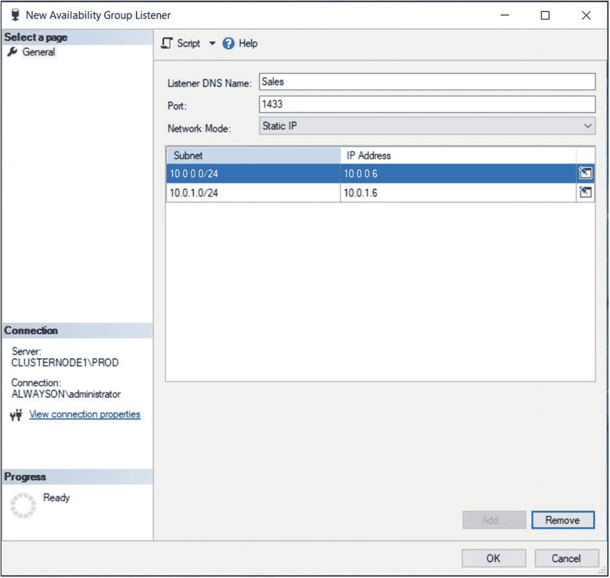

图 5-13

新建可用性组侦听器对话框

在此对话框中，我们首先输入侦听器的虚拟名称。然后，定义它将侦听的端口以及将分配给它的 IP 地址。

提示
我们能够为两个侦听器以及 SQL Server 实例使用相同的端口，因为三者使用不同的 IP 地址。


## 使用 T-SQL

既然我们已经通过 SSMS 中的 GUI 方法创建了可用性组，现在来看看如何使用 T-SQL 创建一个可用性组。在本节中，我们将创建一个名为 `Accounts` 的可用性组，它将为 `Accounts` 数据库提供高可用性（HA）和灾难恢复（DR）。和往常一样，我们需要做的第一件事是对数据库进行完整备份。我们可以使用清单 5-5 中的脚本来实现这一点。

```
BACKUP DATABASE HR
TO  DISK = N'C:\Backups\HR.bak'
WITH NAME = N'HR-Full Database Backup' ;
GO
```
**清单 5-5** 备份 Accounts 数据库

要创建可用性组，我们将使用 `CREATE AVAILABILITY GROUP` T-SQL 命令。此命令支持的 `WITH` 选项详见表 5-1。

**表 5-1** CREATE AVAILABILITY GROUP 及其选项

| 选项 | 描述 |
| --- | --- |
| `AUTOMATED_BACKUP_PREFERENCE` | 指定应使用哪个副本进行备份。可能的选项有 `PRIMARY`，表示始终使用主副本；`SECONDARY_ONLY`，表示绝不在主副本上执行备份；`SECONDARY`，表示不应在主副本上进行备份，除非主副本是唯一在线副本；以及 `NONE`，表示在选择从哪个副本进行备份时，将忽略每个副本的角色。 |
| `FAILURE_CONDITION_LEVEL` | 指定应导致可用性组自动故障转移的事件。可接受的级别为 1-5。 |
| `HEALTH_CHECK_TIMEOUT` | 以毫秒为单位指定持续时间，集群将在此时间内等待运行状况检查过程的响应，之后才认为节点无响应并进行故障转移。 |
| `DB_FAILOVER` | 当可用性组有多个数据库时，确定组内单个数据库脱离 `ONLINE` 状态是否触发故障转移。 |
| `DTC_SUPPORT` | 指定在可用性组内是否支持使用 DTC（分布式事务协调器）的跨数据库事务。可接受的值为 `PER_DB` 或 `NONE`。 |
| `BASIC` | 用于创建基本可用性组。基本可用性组在 第 7 章 中讨论。 |
| `DISTRIBUTED` | 用于创建分布式可用性组。这在 第 7 章 中讨论。 |
| `REQUIRED_SYNCHRONIZED_SECONDARIES_TO_COMMIT` | 可用于确保零 RPO，方法是在继续之前强制在辅助副本上提交。`0` 表示事务将被标记为 `NOT SYNCHRONIZED`，但副本将继续处理事务。 |
| `CLUSTER_TYPE` | 指定可用性组驻留的集群类型。可能的值有 `WSFC`，表示 Windows 故障转移集群；`EXTERNAL`，表示非 Windows 集群，如 Linux Pacemaker；或 `NONE`，表示无集群可用性组。 |

有关每个故障级别的详细信息，请参见表 5-2。

表 5-2 详细说明了将根据指定的故障条件级别触发自动故障转移的事件。

**表 5-2** 故障条件级别

| 级别 | 触发故障转移的事件 |
| --- | --- |
| 1 | • SQL Server 服务停止。<br>• 由于未收到确认，SQL Server 实例在集群中的租约已过期。 |
| 2 | • 任何级别 1 的条件。<br>• SQL 实例未连接到集群，且运行状况检查阈值超出。<br>• 可用性副本处于 `FAILED` 状态。 |
| 3 (默认) | • 任何级别 1-2 的条件。<br>• SQL Server 实例内部出现严重错误。 |
| 4 | • 任何级别 1-3 的条件。<br>• SQL Server 实例内部出现中等错误。 |
| 5 | • 任何级别 1-4 的条件。<br>• SQL Server 实例内部出现任何故障。 |

使用 `REPLICA ON` 子句添加副本时，还可以使用额外的 `WITH OPTIONS`。这些选项详见表 5-3。

**表 5-3** ON REPLICA WITH 选项

| 选项 | 描述 |
| --- | --- |
| `ENDPOINT_URL` | 托管副本的 SQL Server 实例上的终结点 URL。 |
| `FAILOVER_MODE` | 指定副本应支持自动还是手动故障转移。 |
| `AVAILABILITY_MODE` | 指定副本上的事务应同步还是异步提交。可用性模式也可以设置为 `CONFIGURATION_ONLY` 模式，以支持外部集群模式。这将在 第 6 章 中讨论。 |
| `SESSION_TIMEOUT` | 指定会话超时时间（以秒为单位）。 |
| `BACKUP_PRIORITY` | 为副本提供一个权重值，用于决定应从哪个副本进行备份。`0` 表示不能从该副本进行备份。 |
| `SEEDING_MODE` | 指定如何对副本进行播种。可接受的值为 `AUTOMATIC` 和 `MANUAL`。 |
| `PRIMARY_ROLE` | 用于指定 `ALLOW_CONNECTIONS` 设置并传递 `READ_ONLY_ROUTING_LIST`。 |
| `SECONDARY_ROLE` | 用于为 `ALLOW_CONNECTIONS` 指定一个值并传递 `READ_ONLY_ROUTING_URL`。 |

因此，清单 5-6 中的脚本将创建 `Accounts` 可用性组。请注意，我们选择手动播种副本。

```
CREATE AVAILABILITY GROUP Accounts
WITH (
AUTOMATED_BACKUP_PREFERENCE = PRIMARY,
DB_FAILOVER = OFF,
DTC_SUPPORT = NONE,
REQUIRED_SYNCHRONIZED_SECONDARIES_TO_COMMIT = 0
)
FOR
REPLICA ON
'CLUSTERNODE1\PROD' WITH (
ENDPOINT_URL = N'TCP://CLUSTERNODE1.AlwaysOn.com:5022',
FAILOVER_MODE = AUTOMATIC,
AVAILABILITY_MODE = SYNCHRONOUS_COMMIT,
SESSION_TIMEOUT = 10,
BACKUP_PRIORITY = 50,
SEEDING_MODE = MANUAL,
PRIMARY_ROLE(ALLOW_CONNECTIONS = ALL),
SECONDARY_ROLE(ALLOW_CONNECTIONS = NO)
),
'CLUSTERNODE2\SYNCHA' WITH (
ENDPOINT_URL = N'TCP://CLUSTERNODE2.AlwaysOn.com:5022',
FAILOVER_MODE = AUTOMATIC,
AVAILABILITY_MODE = SYNCHRONOUS_COMMIT,
SESSION_TIMEOUT = 10,
BACKUP_PRIORITY = 50,
SEEDING_MODE = MANUAL,
PRIMARY_ROLE(ALLOW_CONNECTIONS = ALL),
SECONDARY_ROLE(ALLOW_CONNECTIONS = NO)
),
'CLUSTERNODE3\ASYNCDR' WITH (
ENDPOINT_URL = N'TCP://CLUSTERNODE3.AlwaysOn.com:5022',
FAILOVER_MODE = MANUAL,
AVAILABILITY_MODE = ASYNCHRONOUS_COMMIT,
SESSION_TIMEOUT = 10,
BACKUP_PRIORITY = 50,
SEEDING_MODE = MANUAL,
PRIMARY_ROLE(ALLOW_CONNECTIONS = ALL),
SECONDARY_ROLE(ALLOW_CONNECTIONS = NO)
);
GO
```
**清单 5-6** 创建 Accounts 可用性组

现在我们已经创建了 `Accounts` 可用性组，我们需要创建一个可用性组侦听器，以便集群知道将请求定向到哪里。我们将使用带有 `ADD LISTENER` 子句的 `ALTER AVAILABILITY GROUP` 命令来完成此操作。`ADD LISTENER` 子句具有表 5-4 中指定的 `WITH` 选项。

**表 5-4** ADD LISTENER WITH 选项

| 选项 | 描述 |
| --- | --- |
| `IP` | 指定侦听器将侦听的 IP 地址，以及与每个 IP 地址相关的网络子网掩码。 |
| `PORT` | 侦听器将侦听的端口。 |

因为我们的 `CLUSTERNODE3\ASYNCDR` 实例与 `CLUSTERNODE1\PROD` 和 `CLUSTERNODE2\SYNCHA` 位于不同的子网中，我们需要指定两个 IP 地址，每个子网一个。因此，清单 5-7 中的脚本将为 `Accounts` 可用性组创建可用性组侦听器。

```
ALTER AVAILABILITY GROUP Accounts
ADD LISTENER 'Accounts' (
WITH IP
(
(N'10.0.0.8', N'255.255.255.0'),
(N'10.0.1.8', N'255.255.255.0')
),
PORT=1433
);
GO
```
**清单 5-7** 创建可用性组侦听器


## 使用 PowerShell 实现可用性组

正如您所料，Microsoft 提供了 PowerShell cmdlet，可用于创建和管理 SQL Server 可用性组和可用性组侦听器。这一点正变得越来越重要，因为世界正朝着 DevOps 文化迈进，而对于许多希望实现构建自动化的组织来说，PowerShell 是首选语言。

`sqlserver` PowerShell 模块随 SQL Server Management Studio 一起安装，但也可以通过使用清单 5-8 中的命令来安装。

```
Install-Module sqlserver
清单 5-8
安装 sqlserver PowerShell 模块
```

注意

如果这是您第一次在服务器上安装 PowerShell 模块，则系统会提示您安装 NuGet 提供程序。

一旦安装了 `sqlserver` 模块，您就可以访问允许您通过 PowerShell 创建和管理可用性组的 cmdlet。`New-AvailabilityReplica` cmdlet 允许您创建一个对象，该对象指定每个副本的属性。然后，这些对象可以传递给 `New-SqlAvailabilityGroup` cmdlet，由它来创建可用性组。

例如，假设我们想要创建一个名为 `Foo` 的可用性组，其中包含 `Foo` 数据库，`CLUSTERNODE1\PROD` 托管初始的主副本，`CLUSTERNODE2\SYNCHA` 托管一个辅助副本，以实现高可用性。我们可以使用清单 5-9 中的脚本来实现这一点。

```
#创建到 CLSUETERNODE1\PROD 的连接
$PrimaryServer = Get-Item "SQLSERVER:\SQL\CLUSTERNODE1\PROD" -Verbose
#创建到 CLUSTERNODE2\SYNCHA 的连接
$SecondaryServer = Get-Item "SQLSERVER:\SQL\CLUSTERNODE2\SYNCHA"
#设置主副本的属性
$PrimaryReplicaOptions = @{
Name             = "CLUSTERNODE1\PROD"
EndpointUrl      = "TCP://CLUSTERNODE1.ALWAYSON.COM:5022"
FailoverMode     = "Automatic"
AvailabilityMode = "SynchronousCommit"
Version          = ($PrimaryServer.Version)
}
#创建主副本对象
$PrimaryReplica = New-SqlAvailabilityReplica @PrimaryReplicaOptions  -AsTemplate
#设置辅助副本的属性
$SecondaryReplicaOptions = @{
Name             = "CLUSTERNODE2\SYNCHA"
EndpointUrl      = "TCP://CLUSTERNODE2.ALWAYSON.COM:5022"
FailoverMode     = "Automatic"
AvailabilityMode = "SynchronousCommit"
Version          = ($SecondaryServer.Version)
}
#创建辅助副本对象
$SecondaryReplica = New-SqlAvailabilityReplica @SecondaryReplicaOption -AsTemplate
$AvailabilityGroupOptions = @{
InputObject         = $PrimaryServer
Name =              = "Foo"
AvailabilityReplica = ($PrimaryReplica, $SecondaryReplica)
Database            = @("Foo")
}
New-SqlAvailabilityGroup @AvailabilityGroupOptions
清单 5-9
创建 Foo 可用性组
```

然后，我们可以使用 `New-SqlAvailabilityGroupListener` cmdlet 来创建一个可用性组侦听器。这在清单 5-10 中进行了演示。

```
#指定侦听器的选项
$ListenerOptions = @{
Name = "Foo"
StaticIp = "10.0.0.14/255.255.255.0"
Path = "SQLSERVER:\Sql\CLUSTERNODE1\PROD\AvailabilityGroups\Foo"
}
#创建侦听器
New-SqlAvailabilityGroupListener @ListenerOptions
清单 5-10
创建一个可用性组侦听器
```

## 总结

AlwaysOn 可用性组最多可以实现八个辅助副本，结合了同步和异步提交模式。在使用可用性组实现高可用性时，您总是使用同步提交模式，因为异步提交模式不支持自动故障转移。然而，在实施同步提交模式时，您必须意识到相关的性能损失，这是因为在事务提交到主副本之前，它必须先提交到辅助副本。对于灾难恢复，您通常会选择实施异步提交模式。

可用性组可以通过“新建可用性组”向导、对话框、T-SQL 甚至 PowerShell 来创建。如果您使用对话框创建可用性组，那么某些方面（例如端点及相关权限）必须使用 T-SQL 或 PowerShell 编写脚本。

如果您使用可用性组实现灾难恢复，则需要配置一个多子网故障转移群集。然而，这并不意味着您必须在站点之间拥有 SAN 复制，因为可用性组不依赖于共享存储。您需要做的是为管理群集访问点以及可用性组侦听器添加额外的 IP 地址。您还需要注意支持客户端重新连接的群集属性，以确保客户端不会遇到大量的超时。

# 6. 在 Linux 上实现 AlwaysOn 可用性组

自 SQL Server 2017 起，除了 Windows 外，也可以在 Linux 上安装 SQL Server。在 Linux 上配置 AlwaysOn 可用性组时，其功能与托管在 Windows 实例上时大部分相同。在 Linux 上安装和配置 SQL Server 超出了本书的范围，但可以在 Apress 图书 *Pro SQL Server 2019 Administration* 中找到完整详细信息，网址为 [`www.apress.com/gb/book/9781484250884#otherversion=9781484250891`](http://www.apress.com/gb/book/9781484250884%2523otherversion%253D9781484250891)。

本章重点介绍在 Linux 上配置可用性组，以提供高可用性 (HA)。我们将首先简要概述实现 Pacemaker 群集（Pacemaker 是一种基于 Linux 的群集技术）所涉及的技术，然后配置一个具有自动故障转移功能的双节点可用性组。

注意

对于本章的演示，我们将使用三台服务器，即 LinuxProd、LinuxSyncHA 和 LinuxConfig。每台服务器上都安装了 SQL Server 2019 的默认实例。服务器使用 Ubuntu 18.04 操作系统构建，并且未加入域。

在本章中，我们将执行以下活动：

*   创建销售数据库。

*   在我们的实例上启用可用性组，并准备实例以支持可用性组。

*   为销售数据库创建一个可用性组。

*   创建群集。

*   配置群集。

## Linux 群集技术

以下各节将提供用于在 Linux 中配置群集的技术的高级概述。但在开始之前，重要的是要理解，与在 Windows 群集上构建可用性组不同，在 Linux Pacemaker 群集上构建可用性组时，可用性组与群集的集成程度并不相同。具体来说，可用性组并不知晓群集的状态甚至存在。因此，故障转移操作必须在群集级别执行。此外，虽然仍然可以创建侦听器，但其功能有限。您需要手动在 DNS 中注册侦听器的名称，并且不支持只读路由。

### Pcs

当您安装 `pcs` 时，该软件包还会安装 Pacemaker 和 Corosync。然而，`pcs` 组件本身是一个命令行实用程序，用于管理 Pacemaker 群集。


### Pacemaker

Pacemaker 是集群的心脏。它负责管理集群维护事件，例如节点的添加和移除。它还负责管理集群事件，并在节点之间移动资源，以确保在节点发生故障后资源仍然可用。

Pacemaker 支持所有标准的集群配置，包括主动/主动、主动/被动、N+1 和 N+M。对高级 Pacemaker 配置的讨论超出了本书的范围；但是，可以在 Apress 的 *Pro Linux High Availability Clustering* 一书中找到更多详细信息，该书可在 [`www.apress.com/gp/book/9781484200803`](http://www.apress.com/gp/book/9781484200803) 找到。

### Corosync

Corosync 为集群提供消息传递层。它通过在节点之间发送消息来检查健康状态，从而实现仲裁系统，并在失去仲裁时通知 Pacemaker。

### STONITH

Pacemaker 集群的支持配置必须使用隔离，这有助于在节点或资源状态未知时，将集群带到已知的良好状态。隔离有两种类型：资源隔离和节点隔离。资源隔离用于防止资源在节点上启动。这可以避免在资源配置期间发生故障时导致数据损坏。节点隔离可防止节点运行任何资源。如果节点变得无响应，通常需要这样做。节点隔离需要一个隔离设备和一个隔离代理。隔离设备可能是一个不间断电源、一个配电单元，或一个管理接口，例如 lights-out 设备或刀片电源控制设备。与这些设备交互的代理是 STONITH（Shoot The Other Node In The Head）。由于 STONITH 的实现非常依赖于您使用的隔离设备，因此我们不会在本章中配置它。这对于开发或测试目的是可以的，但生产集群应始终配置 STONITH。

## 准备实施 AlwaysOn 可用性组

在创建可用性组之前，需要执行几项先决任务。即，我们在 SQL Server 实例上启用可用性组，创建并备份我们希望实现高可用性的数据库，并且由于 Linux 服务器无法相互验证，我们将需要创建可用于身份验证的证书。以下各节演示如何执行这些任务中的每一项。

### 启用可用性组

正如在 Windows 环境中所要求的那样，在 Linux 上配置可用性组的第一步是在服务级别启用该功能。清单 6-1 中的脚本演示了如何启用可用性组，然后重新启动服务。此脚本需要在将托管副本的每个服务器上执行。

提示

`sudo` 用于在运行命令时提升您的权限。

```
sudo /opt/mssql/bin/mssql-conf set hadr.hadrenabled  1
sudo systemctl restart mssql-server
```
清单 6-1
启用可用性组

### 创建 Sales 数据库

下一步是创建我们希望实现高可用性的数据库，并备份该数据库，该备份可用于初始化辅助副本。这可以通过清单 6-2 中的脚本来实现。

```
--Create Sales Database
CREATE DATABASE Sales ;
GO
USE Sales ;
GO
CREATE TABLE [dbo].Orders NOT NULL PRIMARY KEY CLUSTERED,
[OrderDate] [date]  NOT NULL,
[CustomerID] [int]  NOT NULL,
[ProductID] [int]   NOT NULL,
[Quantity] [int]    NOT NULL,
[NetAmount] [money] NOT NULL,
[TaxAmount] [money] NOT NULL,
[InvoiceAddressID] [int] NOT NULL,
[DeliveryAddressID] [int] NOT NULL,
[DeliveryDate] [date] NULL,
) ;
DECLARE @Numbers TABLE
(
Number        INT
)
--Populate ExistingOrders with data
;WITH CTE(Number)
AS
(
SELECT 1 Number
UNION ALL
SELECT Number + 1
FROM CTE
WHERE Number < 100
)
INSERT INTO @Numbers
SELECT Number FROM CTE
INSERT INTO Orders
SELECT
(SELECT CAST(DATEADD(dd,(SELECT TOP 1 Number
FROM @Numbers
ORDER BY NEWID()),getdate())as DATE)),
(SELECT TOP 1 Number -10 FROM @Numbers ORDER BY NEWID()),
(SELECT TOP 1 Number FROM @Numbers ORDER BY NEWID()),
(SELECT TOP 1 Number FROM @Numbers ORDER BY NEWID()),
500,
100,
(SELECT TOP 1 Number FROM @Numbers ORDER BY NEWID()),
(SELECT TOP 1 Number FROM @Numbers ORDER BY NEWID()),
(SELECT CAST(DATEADD(dd,(SELECT TOP 1 Number - 10
FROM @Numbers
ORDER BY NEWID()),getdate()) as DATE))
FROM @Numbers a
CROSS JOIN @Numbers b ;
--SET FULL recovery mode on the database - required for Availability Groups
ALTER DATABASE Sales SET RECOVERY FULL ;
GO
--Backup the Sales Database
BACKUP DATABASE Sales
TO  DISK = N'/var/opt/mssql/data/Sales.bak'
WITH NAME = N'Sales-Full Database Backup' ;
GO
```
清单 6-2
创建 Sales 数据库

### 创建证书

由于我们的 Linux 服务器不是域的一部分，并且无法使用 AD 身份验证相互进行身份验证，因此下一步是创建证书，这些证书可用于实例身份验证。您可以通过连接到主服务器并运行清单 6-3 中的脚本来创建证书。该脚本在 SQL Server 实例中创建证书，然后将其备份到操作系统，以便我们可以将其复制到辅助服务器。请记住，您可以使用 `sqlcmd` 或通过从 Windows 机器上安装的 `SSMS` 连接，来连接到在 Linux 上运行的 SQL Server 实例。

```
USE Master
GO
CREATE MASTER KEY
ENCRYPTION BY PASSWORD = 'Pa$$w0rd';
GO
CREATE CERTIFICATE aoag_certificate
WITH SUBJECT = 'AvailabilityGroups';
GO
BACKUP CERTIFICATE aoag_certificate
TO FILE = '/var/opt/mssql/data/aoag_certificate.cer'
WITH PRIVATE KEY (
FILE = '/var/opt/mssql/data/aoag_certificate.pvk',
ENCRYPTION BY PASSWORD = 'Pa$$w0rd'
);
GO
```
清单 6-3
创建证书

我们现在需要将密钥复制到辅助服务器。为此，我们首先需要授予用户对 `/var/opt/mssql/` 数据文件夹的权限。我们可以使用清单 6-4 中的命令来完成此操作，该命令需要在将参与可用性组的所有服务器上运行。

```
sudo chmod -R 777 /var/opt/mssql
```
清单 6-4
授予权限

如果在主服务器上运行清单 6-5 中的命令，将使用 `scp`（一个远程文件复制程序）将证书的公钥和私钥复制到辅助服务器。为了使此命令正常工作，应在每个服务器上安装和配置 SSH。SSH 提供对另一台机器的安全访问，但完整的讨论超出了本书的范围。但是，可以在 [`http://ubuntuhandbook.org/index.php/2014/09/enable-ssh-in-ubuntu-14-10-server-desktop/`](http://ubuntuhandbook.org/index.php/2014/09/enable-ssh-in-ubuntu-14-10-server-desktop/) 找到指南。

提示

您应更改用户和服务器名称以匹配您自己的配置。

```
scp /var/opt/mssql/data/aoag_certificate.* pete@linuxsyncha:/var/opt/mssql/data
scp /var/opt/mssql/data/aoag_certificate.* pete@linuxconfig:/var/opt/mssql/data
```
清单 6-5
复制密钥

提示

如果您没有配置名称服务器，则需要指定 IP 地址，而不是服务器名称。

我们现在需要通过从文件系统导入证书和密钥在辅助服务器上创建证书。这可以使用清单 6-6 中的脚本来实现。

```
CREATE MASTER KEY ENCRYPTION BY PASSWORD = 'Pa$$w0rd' ;
GO
CREATE CERTIFICATE aoag_certificate
FROM FILE = '/var/opt/mssql/data/aoag_certificate.cer'
WITH PRIVATE KEY (
FILE = '/var/opt/mssql/data/aoag_certificate.pvk',
DECRYPTION BY PASSWORD = 'Pa$$w0rd'
) ;
GO
```
清单 6-6
在辅助服务器上创建证书


## 配置可用性组

现在我们的证书已就位，接下来需要创建用于连接的端点。清单 6-7 中的脚本将创建一个名为 `AOAG_Endpoint` 的端点，该端点监听端口 `5022`，并使用我们的证书进行身份验证。此脚本应在所有将参与可用性组的实例上运行。

```
CREATE ENDPOINT AOAG_Endpoint
STATE = STARTED
AS TCP (LISTENER_PORT = 5022)
FOR DATABASE_MIRRORING (
    ROLE = ALL,
    AUTHENTICATION = CERTIFICATE aoag_certificate,
    ENCRYPTION = REQUIRED ALGORITHM AES
);
清单 6-7
创建端点
```

现在一切就绪，可以创建可用性组了。我们将在 `linuxprod` 服务器上执行这些操作。我们可以直接在服务器上使用 `sqlcmd`，或者从管理节点使用 SSMS 连接到服务器，以便使用 GUI 界面。图 6-1 展示了在管理节点上运行的“新建可用性组”对话框的“常规”页面。

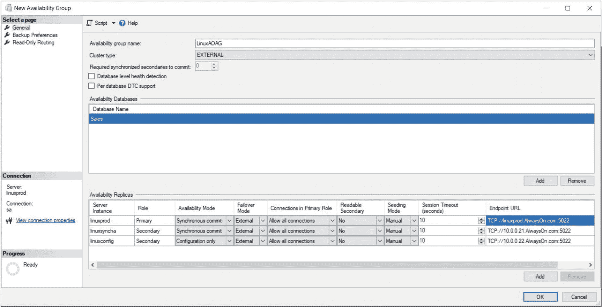

图 6-1

新建可用性组对话框 – 常规页面

与我们在第 5 章配置的可用性组相比，此配置中有两个主要区别需要注意。首先，集群类型和故障转移模式设置为 `EXTERNAL`。这表明该可用性组将驻留在非 Windows 故障转移集群的集群上。在此具体情况下，它将驻留在 Pacemaker 集群上。在 Linux 上构建可用性组时，我们可以选择将集群类型设置为 `EXTERNAL` 或 `NONE`。但是，如果我们选择 `NONE`，则该配置将不适用于高可用性。

第二个需要注意的点是 `linuxconfig` 节点被配置为仅配置节点。由于我们的可用性组不会运行在 Windows 故障转移集群上，因此故障转移需要由可用性组而非集群来仲裁。

如果我们有三个或更多节点，则不需要仅配置节点，因为主节点的故障仍然可以由两个（或多个）辅助节点仲裁。但是，由于我们只有两个节点的集群，因此需要第三个节点充当见证者，并在节点故障时维持仲裁。

仅配置节点不包含用户数据库的副本，但会使用同步提交模式同步可用性组元数据。仅配置节点可以使用任何版本的 SQL Server，包括 SQL Server Express 版，以避免额外成本。单个实例也可以充当多个可用性组的见证者。但是，一个可用性组只能有一个仅配置节点。

图 6-2 显示了“新建可用性组”对话框的“备份首选项”页面。在这里，我们配置了从主节点执行备份。

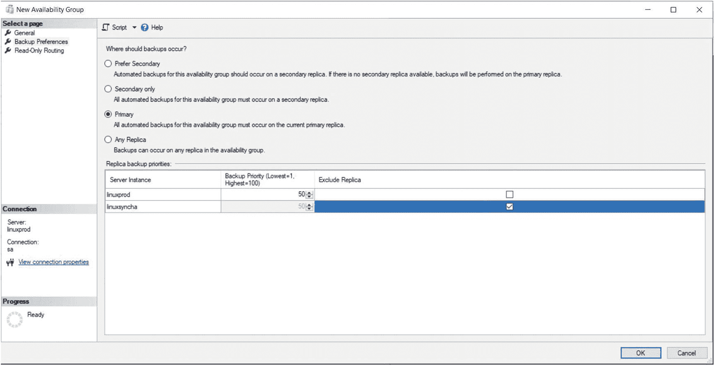

图 6-2

新建可用性组对话框 – 备份首选项选项卡

因为我们只配置高可用性，所以无需配置只读路由。但是，关于只读路由以及此处未讨论的其他配置选项的讨论，请参阅第 5 章。

或者，我们可以通过 T-SQL 使用清单 6-8 中的脚本来创建可用性组。

```
USE master
GO
CREATE AVAILABILITY GROUP LinuxAOAG WITH (
    AUTOMATED_BACKUP_PREFERENCE = PRIMARY,
    DB_FAILOVER = OFF,
    DTC_SUPPORT = NONE,
    CLUSTER_TYPE = EXTERNAL,
    REQUIRED_SYNCHRONIZED_SECONDARIES_TO_COMMIT = 0
)
FOR DATABASE Sales
REPLICA ON
    'linuxconfig' WITH (
        ENDPOINT_URL = 'TCP://linuxconfig.AlwaysOn.com:5022',
        AVAILABILITY_MODE = CONFIGURATION_ONLY
    ),
    'linuxprod' WITH (
        ENDPOINT_URL = 'TCP://linuxprod.AlwaysOn.com:5022',
        FAILOVER_MODE = EXTERNAL,
        AVAILABILITY_MODE = SYNCHRONOUS_COMMIT,
        SESSION_TIMEOUT = 10,
        BACKUP_PRIORITY = 50,
        SEEDING_MODE = MANUAL,
        PRIMARY_ROLE(ALLOW_CONNECTIONS = ALL),
        SECONDARY_ROLE(ALLOW_CONNECTIONS = NO)
    ),
    'linuxsyncha' WITH (
        ENDPOINT_URL = 'TCP://linuxsyncha.AlwaysOn.com:5022',
        FAILOVER_MODE = EXTERNAL,
        AVAILABILITY_MODE = SYNCHRONOUS_COMMIT,
        SESSION_TIMEOUT = 10,
        BACKUP_PRIORITY = 0,
        SEEDING_MODE = MANUAL,
        PRIMARY_ROLE(ALLOW_CONNECTIONS = ALL),
        SECONDARY_ROLE(ALLOW_CONNECTIONS = NO)
    ) ;
GO
清单 6-8
创建可用性组
```

要通过备份手动初始化 `Sales` 数据库，您可以从主服务器运行清单 6-9 中的命令，将备份文件复制到辅助服务器。

```
Scp /var/opt/mssql/data/sales.bak pete@linuxprod:/var/opt/mssql/data
清单 6-9
复制 Sales 数据库的备份
```

可以使用清单 6-10 中的命令还原数据库。

```
USE master
GO
RESTORE DATABASE Sales
FROM  DISK = '/var/opt/mssql/data/Sales.bak'
WITH
    FILE = 1,
    MOVE N'Sales' TO N'/var/opt/mssql/data/Sales.mdf',
    MOVE N'Sales_log' TO N'/var/opt/mssql/data/Sales_log.ldf',
    NORECOVERY ;
GO
清单 6-10
还原 Sales 数据库
```

运行清单 6-11 中的脚本会将我们的辅助副本加入可用性组，并确保其拥有适当的权限。此脚本需要针对所有将参与可用性组的实例运行。

```
ALTER AVAILABILITY GROUP LinuxAOAG JOIN WITH (CLUSTER_TYPE = EXTERNAL) ;
GO
ALTER AVAILABILITY GROUP LinuxAOAG GRANT CREATE ANY DATABASE ;
GO
清单 6-11
将辅助副本加入可用性组
```


## 配置集群

在创建集群之前，我们需要先创建一个登录名，供 Pacemaker 账户使用，并为其分配所需的权限。这个操作需要在所有将参与可用性组的 SQL Server 实例中执行。可以通过清单 6-12 中的脚本完成此操作。

```sql
CREATE LOGIN Pacemaker
WITH PASSWORD = 'Pa$$w0rd'
GO
GRANT ALTER, CONTROL, VIEW DEFINITION ON AVAILABILITY GROUP::LinuxAOAG
TO Pacemaker ;
GRANT VIEW SERVER STATE TO Pacemaker
```
清单 6-12：配置 Pacemaker 登录名

## 配置防火墙

接下来，我们需要配置防火墙。集群所需的端口详见表 6-1。

表 6-1：集群所需端口

| 端口 | 描述 |
| --- | --- |
| TCP 2224 | 所有节点都需要。`pcsd` Web UI 和节点间通信 |
| TCP 3121 | 如果 Pacemaker 有远程节点，则所有节点都需要。用于 `crmd` 和 `pacemaker_remoted` 守护进程之间的通信 |
| TCP 21064 | 所有节点都需要。由需要 DLM 的资源使用 |
| UDP 5405 | 所有节点都需要。由 Corosync 使用 |
| TCP 1433 | 所有节点都需要。本章示例中 SQL 实例监听 `1433` 端口；但是，您应根据自己的环境进行更改 |
| TCP 5022 | 所有节点都需要。本章示例中 AlwaysOn 端点位于 `5022` 端口；但是，您应根据自己的环境进行更改 |

清单 6-13 提供了如何在 Ubuntu 中配置防火墙规则的示例。

```bash
sudo ufw allow 2224/tcp
sudo ufw allow 3121/tcp
sudo ufw allow 21064/tcp
sudo ufw allow 5405/udp
sudo ufw allow 1433/tcp
sudo ufw allow 5022/tcp
sudo ufw reload
```
清单 6-13：配置防火墙规则

## 安装 Pacemaker 组件

接下来，我们将安装 Pacemaker 组件。我们可以使用清单 6-14 中的命令来完成此操作。此命令应在参与可用性组的所有服务器上运行。

```bash
sudo apt-get install pacemaker pcs resource-agents
```
清单 6-14：安装 Pacemaker 组件

**注意**
对于生产系统，请务必同时安装 `fence-agents` 以实现节点隔离。

在安装 `pcs` 组件期间，将创建一个 `hacluster` 用户。您应该使用 `passwd` 命令为该用户设置密码，如清单 6-15 所示。运行命令后，系统将提示您输入新密码并确认。

**注意**
重要的是，您需要在每个节点上设置相同的密码。

```bash
sudo passwd hacluster
```
清单 6-15：设置 `hacluster` 密码

## 启用集群服务

现在，我们可以使用清单 6-16 中的脚本启用 `pcsd` 和 `pacemaker` 服务。您会注意到，在启用 `pacemaker` 之前，我们执行了一个命令来销毁任何现有的集群。这是因为在安装 `pcs` 期间创建了一个名为 `/etc/cluster/corosync.conf` 的文件，然而启用 `pacemaker` 时会尝试创建此文件。使用 `cluster destroy` 命令删除此文件可以避免在启用 `pacemaker` 时出现失败。

```bash
sudo systemctl enable pcsd
sudo systemctl start pcsd
sudo pcs cluster destroy
sudo systemctl enable pacemaker
```
清单 6-16：启用 `pcsd` 和 `pacemaker`

## 构建集群

现在 `pacemaker` 已启用，我们可以构建集群了。此过程包括运行五个 `pcs cluster` 命令。

第一个是 `auth`。此命令用于向所有节点上的 `pcs` 守护进程验证 `pcs` 的身份。该命令需要一个节点列表，后跟安装期间创建的 `pcs` 用户的用户名和密码。清单 6-17 演示了在我们的场景中如何使用该命令。

```bash
sudo pcs cluster auth LinuxProd LinuxSyncHA LinuxConfig –u hacluster
```
清单 6-17：向 `pcs` 守护进程进行身份验证

由于我们在运行此命令时未指定 `–p` 参数，因此系统将提示您输入 `hacluster` 的密码。

第二个命令是 `set up`。此命令用于注册集群名称和集群中的每个节点。集群名称使用 `–name` 参数指定，后跟一个节点列表。清单 6-18 说明了在我们的场景中如何使用 `setup` 命令。

**提示**
也可以指定 `–start` 参数来启动集群服务，但我们选择使用单独的命令来启动集群，以帮助说明整个过程。

```bash
sudo pcs cluster setup --name LinuxCluster LinuxProd LinuxSyncHA LinuxConfig
```
清单 6-18：设置集群

下一个命令是 `start`。顾名思义，此命令用于启动集群服务。该命令可以接受 `–-all` 参数以在所有节点上启动服务（如清单 6-19 所示），或者接受一个节点列表，指定应在哪些节点上启动集群服务。

```bash
sudo pcs cluster start –-all
```
清单 6-19：启动集群服务

运行此命令后，服务启动前可能会有延迟。因此，在继续之前，您应该运行 `status` 命令以确保集群已启动，如清单 6-20 所示。

```bash
sudo pcs cluster status
```
清单 6-20：检查集群状态

最后，我们将为每个节点配置集群服务在启动时运行。这可以通过 `enable` 命令完成，如清单 6-21 所示。该命令接受 `–-all` 参数或节点列表。

```bash
sudo pcs cluster enable --all
```
清单 6-21：启用集群服务

## 安装资源代理

集群创建完成后，我们就可以安装 SQL Server 资源代理了。这允许 `pacemaker` 与可用性组进行松散集成。具体来说，每次发生配置更改（例如故障转移或添加新副本）时，它都会在 `sys.available_groups` 目录视图中递增一个序列号。然后，在故障转移前检查此序列号，以确定节点是否已更新。如果序列号不是最新的，则可以拒绝故障转移。清单 6-22 演示了如何安装资源代理。

```bash
sudo apt-get install mssql-server-ha
```
清单 6-22：安装资源代理

## 保存凭据并创建资源

接下来，我们需要授予 `pacemaker` 对可用性组的权限。我们在清单 6-12 中为 `pacemaker` 创建了一个登录名。现在我们需要通过在集群中的所有节点上运行清单 6-23 中的脚本，将凭据保存在操作系统中。

```bash
echo 'pacemakerLogin' >> ~/pacemaker-passwd
echo 'Pa$$w0rd' >> ~/pacemaker-passwd
sudo mv ~/pacemaker-passwd /var/opt/mssql/secrets/passwd
sudo chown root:root /var/opt/mssql/secrets/passwd
sudo chmod 400 /var/opt/mssql/secrets/passwd
```
清单 6-23：保存 Pacemaker 凭据

我们现在需要创建集群资源，包括可用性组资源和虚拟 IP 地址资源。这可以通过运行清单 6-24 中的脚本来完成。脚本中的第一个命令为 `LinuxAOAG` 可用性组创建一个可用性组资源。

脚本中的第二个命令为我们希望使用的 IP 地址创建一个资源。请注意，我们同时指定了 IP 地址和网络的子网掩码。子网掩码使用 CIDR 表示法指定。CIDR 表示法超出了本书的范围，但可以在 [`www.controltechnology.com/Files/common-documents/application_notes/CIDR-Notation-Tutorial`](http://www.controltechnology.com/Files/common-documents/application_notes/CIDR-Notation-Tutorial) 找到 CIDR 教程。


# 7. 非典型可用性组实现

到目前为止，我们已经讨论了 AlwaysOn 可用性组和 AlwaysOn 故障转移群集实例在典型的本地企业工作负载场景中的应用。然而，AlwaysOn 是一套非常灵活的技术，其中有许多组合可能值得您利用。因此，本章将概述您可能需要支持的一些不太典型的 AlwaysOn 场景。这包括基础可用性组、Azure 中的可用性组、分布式可用性组，以及在没有群集或域的情况下创建可用性组。

在本章中，我们将执行以下活动：

*   在 Azure IaaS 中创建可用性组。
*   创建无群集可用性组。
*   创建域独立可用性组。
*   创建分布式可用性组。

## 基础可用性组

到目前为止，本书中的所有可用性组演示都需要 SQL Server 企业版，但可用性组在 SQL Server 标准版中也可用。然而，在标准版中，可用性组的功能有限，因此它们被称为基础可用性组。

最明显的限制是基础可用性组仅支持两个副本。不过，副本可以配置为同步或异步提交模式。这意味着您仍然可以实现高可用性或灾难恢复。

> 注意：Linux 上的基础可用性组支持第三个仅配置副本，这是实现高可用性所必需的。更多详细信息请参见第 6 章。

辅助副本不支持只读连接。这意味着基础可用性组不仅不支持读取扩展，也不支持在辅助副本上进行备份或完整性检查。

另一个限制是基础可用性组只能包含一个数据库。这意味着无法一起故障转移多个数据库，这使得大型实例的管理变得困难得多。

其他高级可用性组功能，如分布式可用性组，也不受支持，并且一旦构建了基础可用性组，就无法将其升级为完整的可用性组。相反，必须将其销毁并重新创建。

要实现基础可用性组，您可以使用本书前面讨论的相同语法，明显区别在于无法实现不支持的功能。唯一专属于基础可用性组的语法是在 `WITH` 子句中添加 `BASIC` 标记，这会减少可用功能。例如，脚本清单 7-1 将在名为 `SQLStdProd` 和 `SQLStdSyncHA` 的两个服务器之间创建一个可用性组，并且这两个服务器都安装了 SQL Server 标准版的默认实例。

```sql
CREATE AVAILABILITY GROUP BasicAGAG
WITH (
AUTOMATED_BACKUP_PREFERENCE = PRIMARY,
BASIC,
REQUIRED_SYNCHRONIZED_SECONDARIES_TO_COMMIT = 0
)
FOR DATABASE Sales
REPLICA ON 'SQLSTDPROD' WITH (
ENDPOINT_URL = 'TCP://SQLSTDPROD.AlwaysOn.com:5022',
FAILOVER_MODE = AUTOMATIC,
AVAILABILITY_MODE = SYNCHRONOUS_COMMIT,
SEEDING_MODE = AUTOMATIC
),
'SQLSTDSYNCHA' WITH (
ENDPOINT_URL = N'TCP://SQLSTDSYNCHA.AlwaysOn.com:5022',
FAILOVER_MODE = AUTOMATIC,
AVAILABILITY_MODE = SYNCHRONOUS_COMMIT,
SEEDING_MODE = AUTOMATIC
);
GO
```
清单 7-1 创建基础可用性组

```
sudo pcs resource create LinuxAOAG ocf:mssql:ag ag_name=LinuxAOAG meta failure-timeout=60s master meta notify=true
sudo pcs resource create VirtualIP ocf:heartbeat:IPaddr2 ip=10.0.0.25 cidr_netmask=24
```
清单 6-24 创建群集资源

> 注意：由于 `pacemaker` 没有网络名称的概念，因此必须在 DNS 中手动注册 IP 地址和期望的名称。

资源应运行在哪个节点上的决策基于分数，这些分数是在资源级别计算的。这意味着虚拟 IP 地址有可能被移动到不同的节点，即可用性组资源所在的节点。为了减轻这种风险，我们需要添加一个位置约束，以确保资源始终位于同一节点上。约束也有分数，任何低于无限大的数字表示偏好，无限大表示绑定要求。清单 6-25 中的命令将创建所需的约束。

```
sudo pcs constraint colocation add VirtualIP LimuxAOAG INFINITY with-rsc-role=Master
```
清单 6-25 创建位置约束

因为此命令将虚拟 IP 地址资源列在可用性组资源之前，所以在资源移动时，虚拟 IP 地址将被移动并上线，然后可用性组资源才会被移动并上线。这意味着虚拟 IP 地址可能暂时指向错误的节点。可以通过添加一个排序约束来减轻这种风险，该约束强制可用性组资源在虚拟 IP 地址上线之前移动。清单 6-26 演示了如何配置此约束。

```
sudo pcs constraint order promote LinuxAOAG then start VirtualIP
```
清单 6-26 创建排序约束

最后，我们可以创建可用性组侦听器。侦听器将使用我们在 `pacemaker` 群集中创建的虚拟 IP 地址资源的 IP 地址。重要的是要记住，当在 `pacemaker` 群集上配置可用性组时，可用性组侦听器的唯一目的是提供一个抽象，作为副本的单一入口点。它不能掩盖中断，因为在故障转移期间，当虚拟 IP 地址资源在另一个群集节点上启动时，它将暂时变得不可用。我们可以使用清单 6-27 中的脚本来创建可用性组侦听器。

```sql
USE master
GO
ALTER AVAILABILITY GROUP LinuxAOAG
ADD LISTENER 'LinuxAOListener' (
WITH IP (
(N'10.0.0.25', N'255.255.255.0')
)
, PORT=1433
);
GO
```
清单 6-27 创建可用性组侦听器

## 总结

可以在基于 Linux 的实例上配置可用性组，其方式与在基于 Windows 的实例上配置可用性组类似。它们可以在没有底层群集的情况下配置，也可以利用基于 Linux 的群集技术。

如果需要高可用性或灾难恢复，则必须使用 Linux 群集技术，例如 `pacemaker`。`pacemaker` 群集由多个组件组成，包括 `pcs`（用于管理 `pacemaker` 群集的命令行实用程序）、`Corosync`（提供节点之间的心跳）、`STONITH`（用于隔离），以及 `Pacemaker`（核心群集管理器）。

可用性组侦听器在 `pacemaker` 群集中受支持，但其功能有限。IP 地址资源在移动到新节点时会暂时离线。因此，可用性组侦听器提供了一种抽象，但不能掩盖故障，因为它将在一段时间内变得无法访问。


## Azure IaaS 上的可用性组

当将数据库迁移到云端时，你有多种目标选项可供选择。Azure SQL 数据库和弹性数据库池提供的是数据库即服务，而 Azure 托管实例提供的是 SQL Server 即服务。这两种服务都基于可用性组提供高可用性。然而，如果你的应用程序需要访问操作系统，那么你就必须使用 Azure 虚拟机。使用此解决方案时，你必须像在本地环境中一样手动配置可用性组。在接下来的部分中，我们将探讨一些你在设计可用性组拓扑之前应该了解的 Azure 可用性选项，然后研究如何在 Azure 中配置可用性组。

### Azure 可用性概念

云的一个关键原则是为故障而设计应用程序。因此，在云中为 SQL Server 实现可用性组是一个非常重要的话题。在讨论实现之前，你应该熟悉可用性集、可用性区域和区域的概念。以下各节将概述这些主题。

#### 可用性集

`可用性集`是一种构造，它将虚拟机放置在同一个数据中心内不同的故障域和更新域上。故障域表示共享共同电源和网络交换机的硬件。一个`可用性集`可以配置为跨越三个故障域。因此，如果你将三台虚拟机放在同一个`可用性集`中，你就知道每台虚拟机与该`可用性集`中的其他虚拟机相比，都拥有唯一的电源和网络交换机。

更新域表示因计划内或计划外维护而重新启动的物理硬件。默认情况下，一个`可用性集`被划分为五个更新域，并且最多可以增加到 20 个。如果你将虚拟机放在同一个`可用性集`中，你就知道它们彼此位于不同的硬件上，并且不会同时重新启动。

**提示**
在使用`可用性集`时，你还应确保使用`托管磁盘`。使用`托管磁盘`时，物理磁盘会分配到与所连接虚拟机一致的故障域中，从而避免单点故障。

#### 可用性区域

虽然`可用性集`可以防护数据中心内的硬件问题和停机，但它并不能防护数据中心故障。为了防护数据中心故障，你必须将虚拟机放置在不同的`可用性区域`中。每个`可用性区域`位于不同的建筑内，拥有独立的电源、网络和冷却系统。

#### 区域

`区域`提供了一种地理上分散服务器的方法，以防范使整个`区域`离线的大规模灾难。Azure 中的`区域`在一个地理区域内配对，该地理区域是一个政治区域。例如，美国的`区域`与物理位置在美国境内的其他区域配对。这同样适用于其他地区，如欧洲和英国。这使你能够在防护灾难的同时维护数据主权。

虽然我知道一些公司采取的立场是，对于灾难恢复，他们只需要防范数据中心的丢失，因此决定避免在多个区域拥有基础设施所带来的复杂性和成本开销，但就云而言，只有当你的灾难恢复服务器与生产服务器位于不同的`区域`时，你才算拥有灾难恢复能力。

### 在 Azure 中实现可用性组

在本节中，我们将探讨如何在 Azure 虚拟机上配置可用性组。在本节中，我们将为 `Sales` 数据库构建一个跨两个`可用性区域`的可用性组，位于同一区域中，目的是提供高可用性。我们将在同一个虚拟网络中的不同子网上构建每台虚拟机。但在此之前，我们将简要讨论一下`可用性集`。

#### 创建可用性集

要从 `Azure 门户`创建`可用性集`，请导航到 `可用性集`边栏选项卡，并使用 `添加` 按钮启动 `创建可用性集` 页面，如图 7-1 所示。你会注意到我们已经选择了希望创建`可用性集`的`订阅`，并选择了应在其中创建它的`资源组`。我们还为其指定了名称，并选择了应在其中创建它的`区域`。因为我们计划在`可用性集`中放置两台服务器，所以`更新域`和`故障域`都被配置为两个。这两台服务器将分别驻留在不同的`故障域`和`更新域`中。如果我们向`可用性集`中添加更多服务器，它们将以轮循方式分配到`故障域`和`更新域`中。

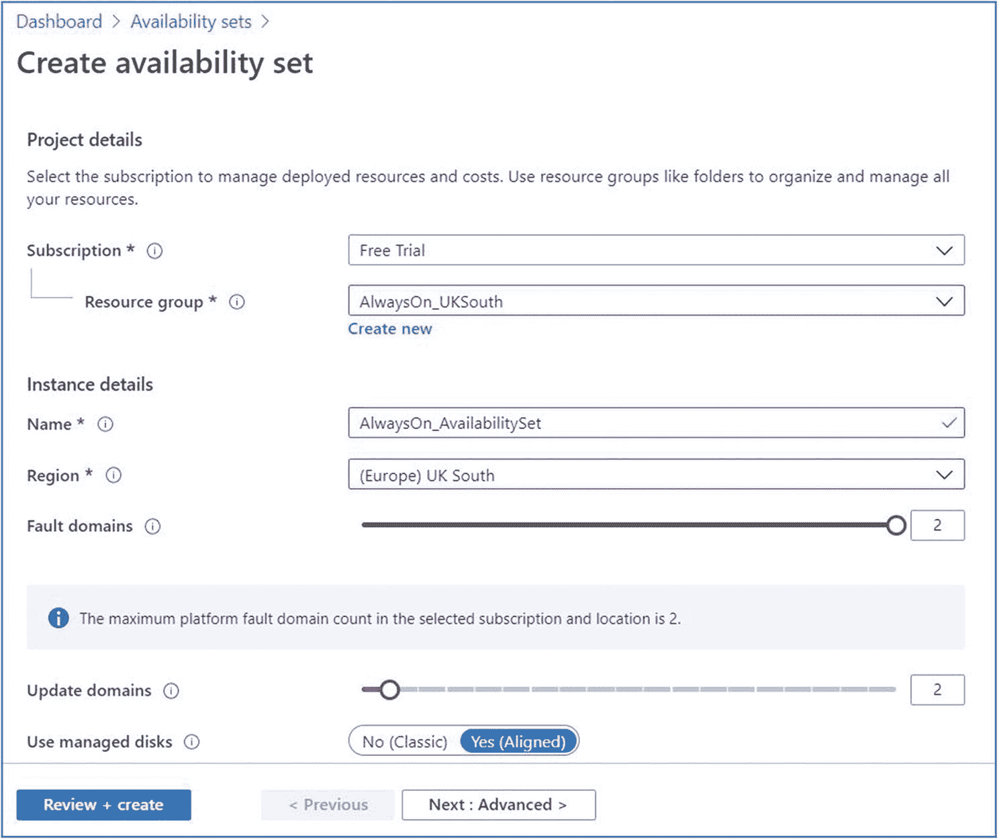

图 7-1：创建可用性集

在图 7-2 所示的 `高级` 页面上，我们可以选择为`可用性组`分配一个`邻近放置组`。`邻近放置组`通过使用数据中心内物理位置靠近的硬件，有助于确保尽可能低的延迟。要使用此选项，你必须在创建`可用性集`之前创建`邻近放置组`。

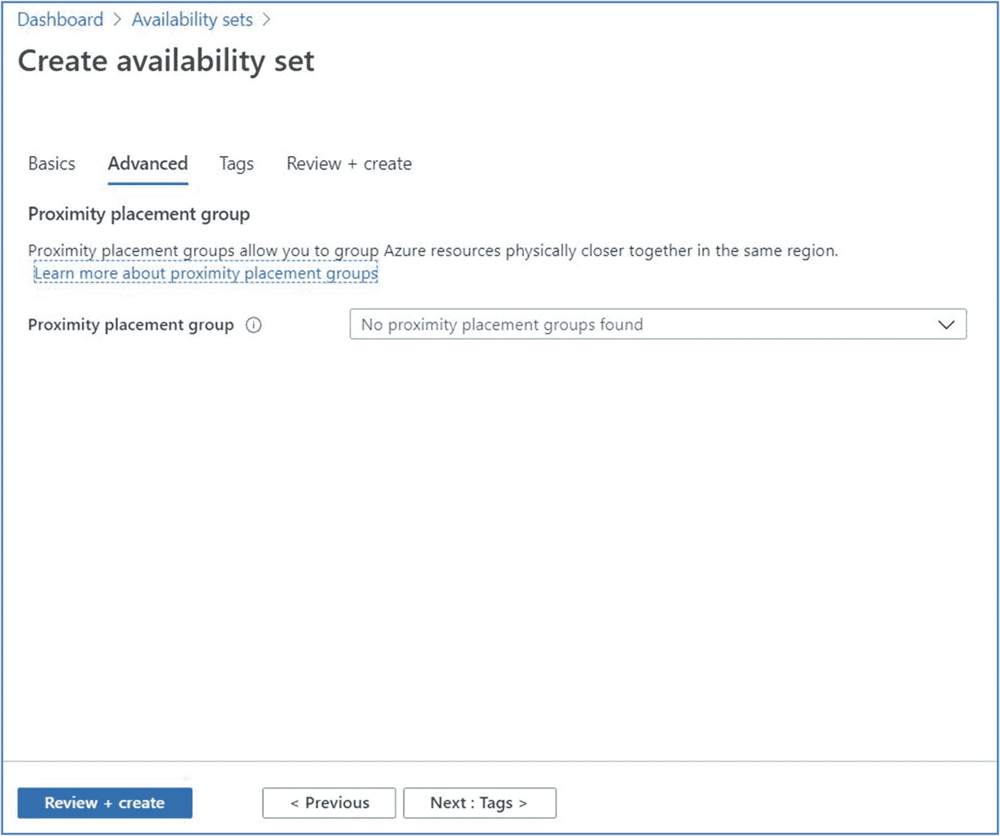

图 7-2：创建可用性集 - 高级页面

`标记`页面允许你分配键/值对形式的标签。使用标签在云中始终是一个好习惯，因为它不仅有助于资源管理，还有助于成本控制，例如为消耗云资源的业务部门生成成本展示或成本分摊机制。如图 7-3 所示，我们已经为 `环境` 和 `应用程序` 配置了标记。

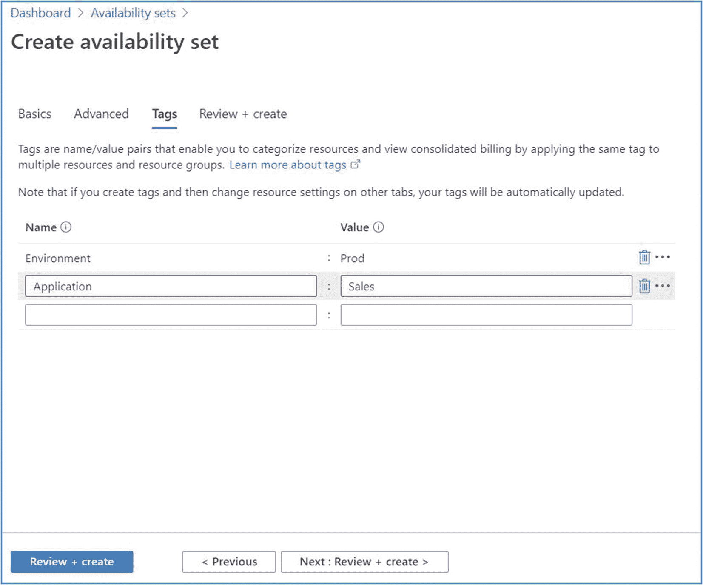

图 7-3：创建可用性集 - 标记页面

**提示**
你可以使用 `Azure 策略` 来强制在创建资源时使用特定的标记。

在 `查看` 页面上，你可以在创建资源之前，有机会查看已配置的设置。

#### 在 Azure 虚拟机上创建可用性组

在接下来的部分中，我们将讨论在 Azure 上构建和配置可用性组解决方案。

**注意**
要跟随以下部分的演示，你需要一个 Azure 订阅。这至少必须是一个即用即付订阅，因为免费试用订阅不会提供足够的核心数来构建这两台服务器。你还需要一个包含两个子网的虚拟网络。本章还假设该虚拟网络包含一个域控制器，或者你已配置了 `Azure 域服务`。


# 创建虚拟机

首先，我们需要三台虚拟机，用于安装 SQL Server。在 Azure 中，实现这一目标有多种方式，具体取决于你的需求。第一种选项是前往 Azure 市场，查找已安装 SQL Server 的虚拟机镜像。如果选择这种方式，则必须了解有两种不同的许可条款。第一种是 `SPLA`（服务提供商许可协议）。采用 `SPLA` 许可时，虚拟机的成本已包含 SQL Server 许可费用。这意味着你的许可基于 `按需付费` 模式，避免了前期采购许可的成本，但如果虚拟机需要长期运行，长期来看费用会更高。

第二种选项是 `BYOL`（自带许可）。采用此许可模式时，SQL Server 许可费用不包含在虚拟机成本中。相反，你必须使用已采购的现有许可。选择此选项后，必须在 10 天内向 Microsoft 报告你的许可使用情况。

当你构建已安装 SQL Server 的虚拟机时，它会附带完整的 SQL Server 安装，包括所有功能。（除非你选择标记为 `仅数据库引擎` 的镜像。）这在大多数使用场景中并不理想，因为与仅安装所需功能相比，它的安全影响面和资源占用更大。因此，如果你使用预装 SQL Server 的虚拟机镜像（无论许可模式如何），都应花时间自定义镜像以满足你的需求。

或者，你可以直接从纯净的 Windows Server 镜像构建虚拟机并自行安装 SQL Server。这是最灵活的选择，但采用此方式时，你必须 `自带许可`。不会有 `SPLA` 选项可用。

在本例中，我们将使用 `Windows Server 2019 上的 SQL Server 2019` 镜像，采用 `SPLA` 许可。图 7-4 显示了此虚拟机镜像在 Azure 市场中的图标。

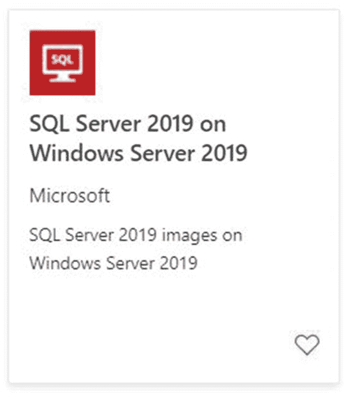

在 `创建虚拟机` 页面的第一部分（如图 7-5 所示），我们将指定虚拟机应创建在其中的 `订阅` 和 `资源组`，然后为服务器指定名称及其应创建在的 `区域`。

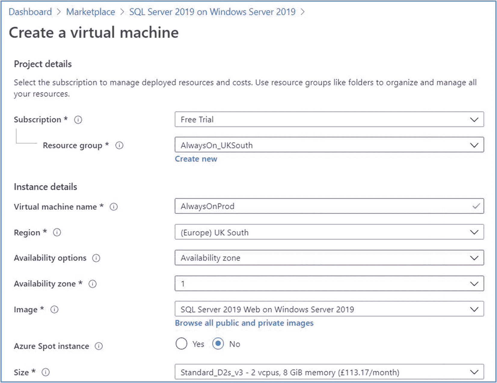

接着，我们继续指定虚拟机所需的 `可用性选项`。这在规划可用性组时至关重要。在 `可用性选项` 对话框中，我们可以选择 `无需基础结构冗余`、`可用性集` 或 `可用性区域`。如果我们选择了 `可用性集`，那么我们可以选择使用之前创建的 `可用性集` 或创建一个新的 `可用性集`。然而，我们选择了 `可用性区域`，因此可以指定服务器应创建在哪个 `可用性区域` 中。每个区域至少有三个 `可用性区域`。

> **注意**
>
> 但必须注意，创建虚拟机后无法更改 `可用性选项`。例如，你不能创建一个没有可用性选项的虚拟机，然后再将其添加到 `可用性集` 中。

接下来，我们可以选择更改构建所用的镜像，并指定是否要使用 `Spot 实例`。`Spot 实例` 通常不适用于 SQL Server，在生产环境中更是如此。`Spot 实例` 基于 Azure 中的闲置容量构建，成本效益很高。但是，如果 Azure 需要该容量，它们可能会在极短的通知内被终止。因此，`Spot 实例` 通常最适用于 `规模集` 内的无状态应用程序，或测试环境中的无状态应用程序。

我们还指定了要构建的虚拟机的大小。每月成本（基于服务器 24x7 运行）将显示在虚拟机规模配置文件的右侧。

我们现在可以继续填写表单的下半部分，如图 7-6 所示。在这里，我们指定虚拟机 `管理员` 用户的用户名和密码，以及是否应为服务器在公共 IP 地址上打开端口。如果需要，我们可以指定应打开哪些端口。

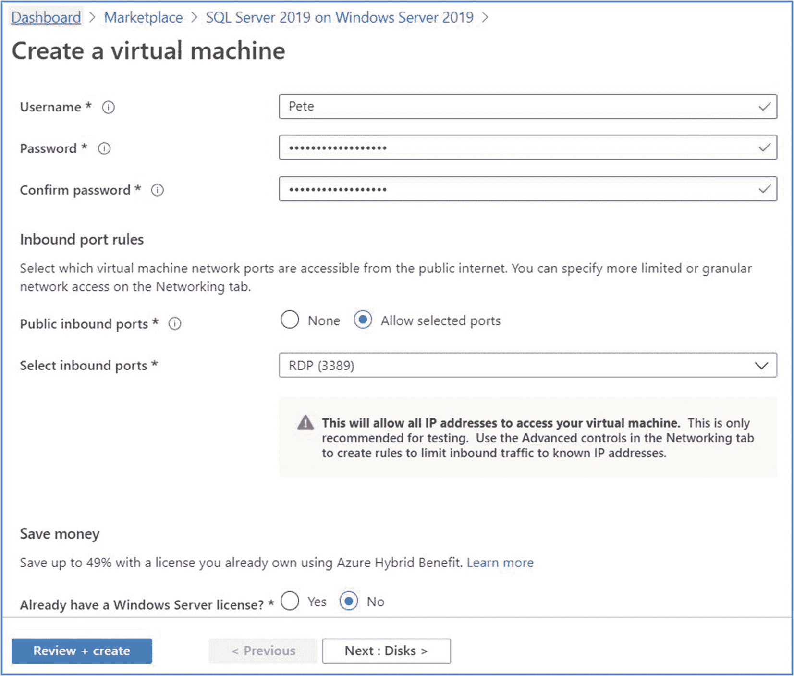

> **注意**
>
> 公共端口应仅出于开发/测试目的打开，即使如此，也强烈建议创建 VPN 或改用 `Bastion`。

最后，我们指定要使用的许可模式。请注意，这仅适用于操作系统，不适用于 SQL Server，但我们仍然有相同的两种选择。我们可以为 Windows 许可 `按需付费`，或者 `自带许可`。

在 `磁盘` 页面（如图 7-7 所示），我们可以配置虚拟机的存储选项。在页面的第一部分，我们可以从 `标准 HDD`、`标准 SSD` 或 `高级 SSD` 中选择想要使用的存储层。我建议为托管 SQL Server 的虚拟机使用 `高级 SSD`，这应该不足为奇，尽管你的选择可能受其他因素影响，例如公司政策或预算限制。

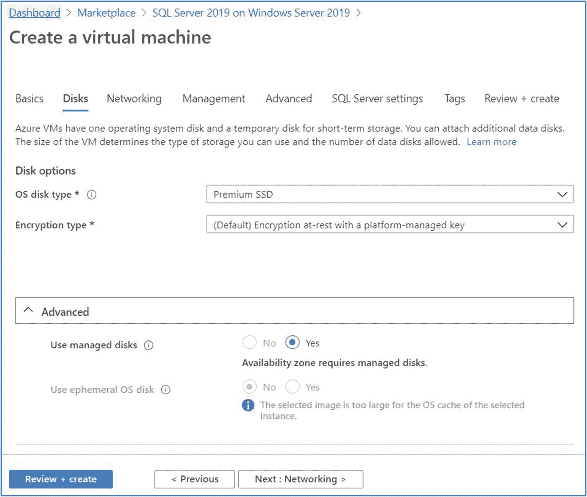

在页面的 `高级` 部分，我们可以指定是使用 `托管` 磁盘还是 `非托管` 磁盘，以及操作系统磁盘是否应为 `临时` 磁盘。通常推荐使用 `托管磁盘`，因为它们具有自动跨 `容错` 域和 `更新` 域分布等优势。如果你的虚拟机构建在 `可用性集` 上，这些域还可以与 `可用性集` 的域对齐。在我们的情况下，必须使用 `托管磁盘`，因为这是 `可用性选项` 配置为 `可用性区域` 时的唯一选项。

`临时磁盘` 使用速度非常快的存储，但不具备终止容错能力。因此，它们适用于无状态应用程序，但不适用于运行 SQL Server 的虚拟机。在我们的情况下，我们甚至没有为操作系统选择 `临时磁盘` 的选项，因为我们的镜像太大，无法支持它。

在 `网络` 页面（图 7-8），我们可以指定虚拟机应连接到的 `虚拟网络` 和 `子网`，以及配置应使用的公共 IP 地址和安全组。在此页面上，还有一些选项（未图示）允许你配置 `加速网络`，这是一项可实现虚拟机 `网卡`（网络接口卡）低延迟和高吞吐量的功能，但仅适用于较大的虚拟机，还可以让你将虚拟机置于预配置的 `负载均衡器` 后面。此选项不适用于 SQL Server。

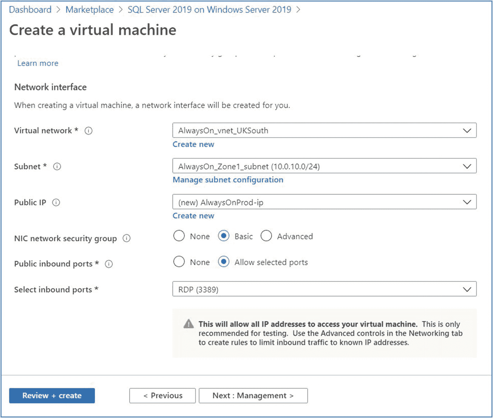

在 `管理` 页面（如图 7-9 所示），我们可以配置虚拟机的诊断设置。具体来说，我们可以选择是否捕获 `启动诊断` 和 `来自客户操作系统的诊断`，以及诊断数据应保存到哪个存储账户。

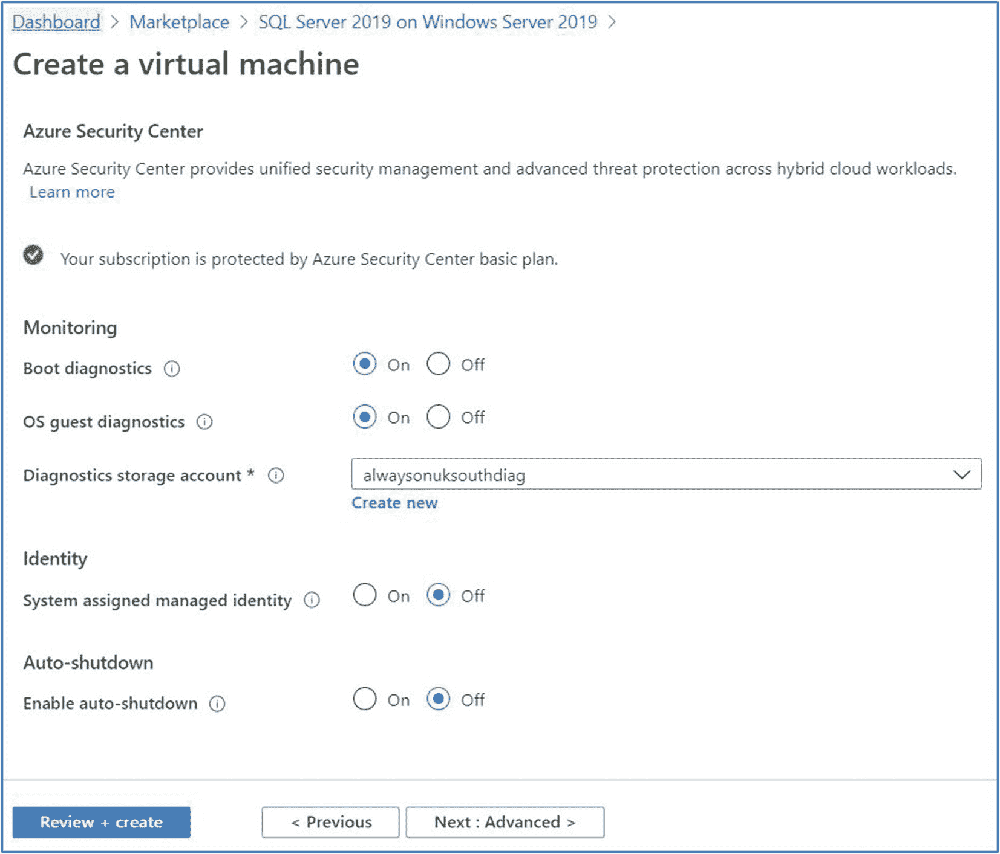


我们还可以指定是否要使用系统分配的托管标识。如果选择此选项，那么虚拟机便能够向原生 Azure 服务（如 `Key Vault`）进行身份验证，而无需在代码中存储服务凭据。最后，我们可以指定是否希望虚拟机在特定时间关闭。如果选择此选项，则会出现额外的对话框，允许我们指定关机计划以及是否希望在关机时收到通知。

**提示**

在创建虚拟机时，只能添加关机计划，没有选项用于创建开机计划。这可以通过使用 `Azure 自动化账户`来实现。

就我们的目的而言，在 **高级** 页面上无需配置任何内容。但是，此页面可用于将配置文件传递到虚拟机内的已知位置、安装虚拟机的扩展（例如 `Puppet Agent`），以实现虚拟机的配置管理。如果您希望将虚拟机放置在**邻近组**中，或者希望它驻留在现有的专用主机上，那么这些选项也可以在此页面上进行配置。

## SQL Server 设置

由于我们正在构建一个 `SQL Server` 虚拟机，因此有一个用于 `SQL Server` 设置的页面，如果使用标准的 `Windows Server` 映像构建虚拟机，此页面不会出现。在此页面的第一部分（图 7-10），我们可以配置 `SQL 连接`。这将为我们提供选项，使 `SQL Server` 实例仅在虚拟机内部可用、仅在我们的虚拟网络（`vnet`）内可用，或在 Internet 上公开访问。不言而喻，使实例对 Internet 可用通常是不可取的，即使在开发/测试场景中也是如此。

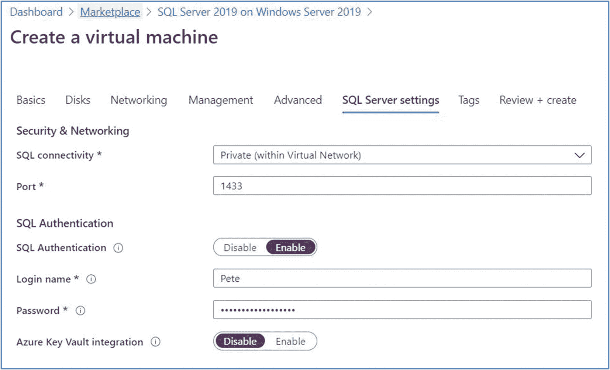

创建虚拟机 - `SQL Server` 设置（第 1 部分）

我们还可以指定实例应侦听的端口，以及是否希望启用 `SQL Server 身份验证`（而不仅仅是 `Windows 身份验证`）。如果选择此选项，我们就可以指定所需管理员账户的用户名和密码。

我们还可以选择是否希望将实例与 `Azure Key Vault` 集成。如果选择此选项，则必须提供 `Key Vault` 服务的 URL 和凭据信息。

在页面的下一部分，我们看到了 `SQL Server` 的默认存储选项。使用 **更改配置** 链接将调用 **配置存储** 页面，如图 7-11 所示。在此页面上，有针对 **常规**、**OLTP** 和 **数据仓库** 工作负荷配置文件的预设，可以对其进行自定义以满足您的要求。您可以指定 `TempDB` 和日志文件是否应使用同一驱动器或共享数据驱动器。还可以指定每个磁盘的大小和存储类型。

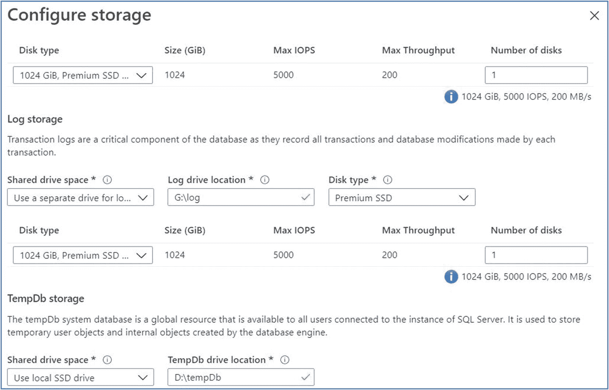

创建虚拟机 - `SQL Server` 设置（第 2 部分）

在页面的最后一部分（如图 7-12 所示），我们可以指定希望用于 `SQL Server` 的许可模型（`BYOL` 或 `SPLA`），以及指定修补窗口和选择是否希望进行自动备份。最后，我们可以指定是否希望安装 `R Services`，它提供了数据库内机器学习功能，这些功能自 `SQL Server 2017` 起已可用。

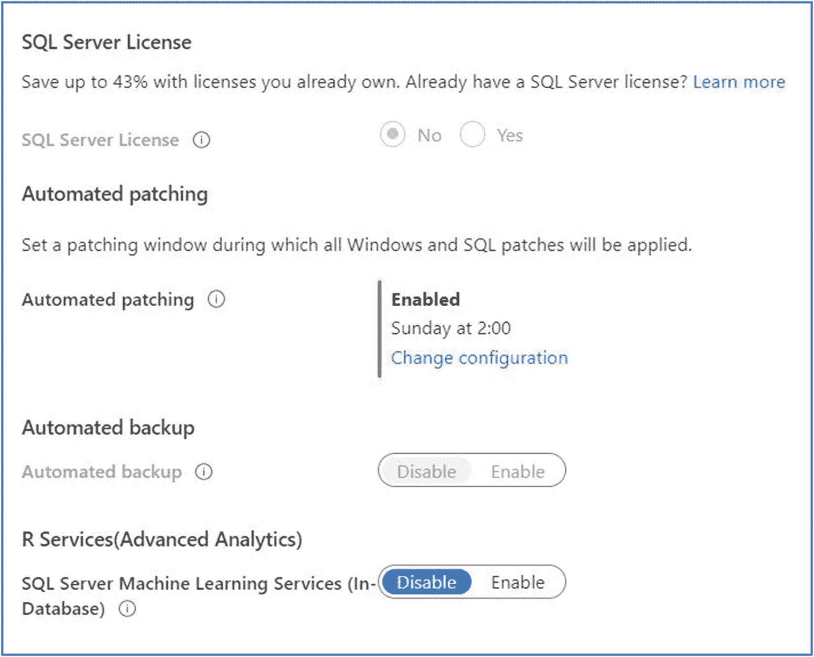

创建虚拟机 - `SQL Server` 设置（第 3 部分）

在 **标记** 页面上，我们可以按本章“创建可用性集”一节所述添加键/值对形式的标记。在 **查看** 页面上，我们可以在创建虚拟机之前查看所选的配置。

就我们的目的而言，我们应该重复此过程来创建第二个虚拟机，这次将其放在 `可用性区域 2` 中，并驻留在 `vnet` 内的另一个子网上。

## 配置可用性组

两台服务器构建完成后，您需要将服务器加入域并配置防火墙规则等设置。然后，可以使用本书第 3 章演示的方法创建故障转移群集。由于我们实施的是**可用性组**而不是**故障转移群集实例**，因此群集中不需要任何共享存储。

配置好群集后，我们可以通过创建 `Sales 数据库` 来构建可用性组，然后使用本书第 5 章讨论的方法配置**可用性组**。出于本练习的目的，节点应配置为同步复制和自动故障转移。请注意，此时不应创建**可用性组侦听器**。

在 Azure 中，**可用性组侦听器**将需要一个 `Azure 负载均衡器`来承载**可用性组侦听器**和**故障转移群集**的 IP 地址。我们应在创建**可用性组侦听器**之前创建**负载均衡器**。

## 创建 Azure 负载均衡器

`Azure 负载均衡器`有两个层级，功能不同。**基本**是较便宜的层级，功能更有限；**标准**是较高的层级。由于我们的服务器位于`可用性区域`中，我们必须使用**标准负载均衡器**。

要创建**负载均衡器**，请导航到 Azure 中的 **负载均衡器** 边栏选项卡并选择 **添加** 按钮，以创建新的**负载均衡器**。在**创建负载均衡器**页面的第一部分（如图 7-13 所示），我们指定要将**负载均衡器**创建到的**订阅**和**资源组**。这应与您的虚拟机所在的**资源组**相匹配。

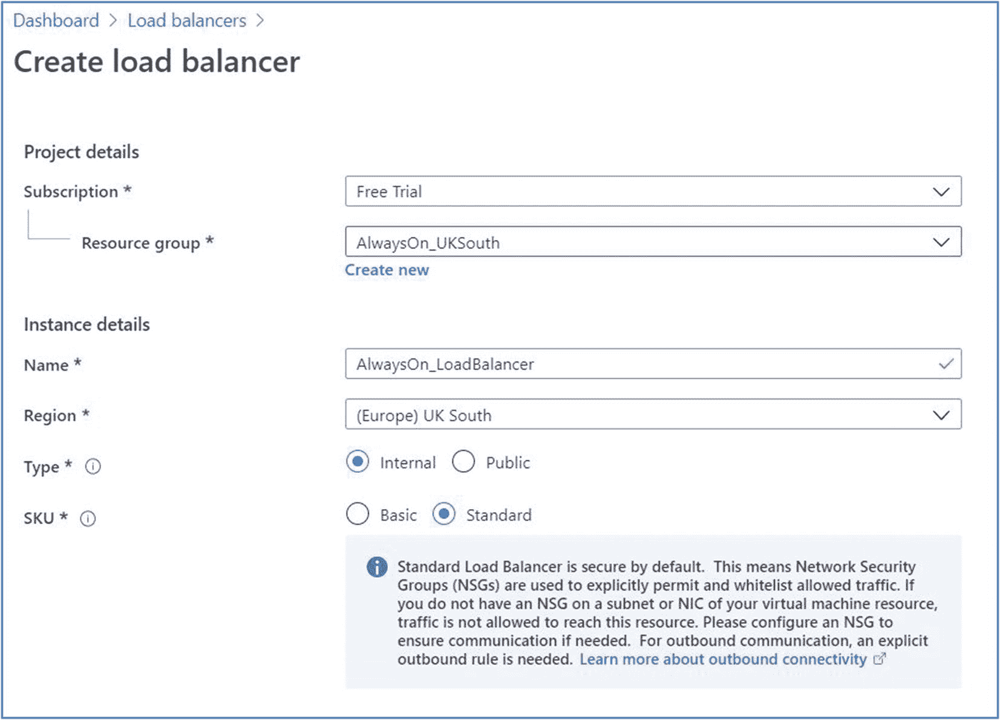

创建负载均衡器（第 1 部分）

然后，我们提供**负载均衡器**的名称并指定其应创建的区域。这应与您的虚拟机位置相匹配。我们还选择希望创建的**负载均衡器**层级。

在页面的下一部分（图 7-14），我们指定**负载均衡器**的网络详细信息。具体来说，我们指定它应驻留的虚拟网络（`vnet`），这应与您的虚拟机的虚拟网络（`vnet`）相匹配。我们还指定它应使用**静态**还是**动态** IP 地址。出于我们的目的，我们需要一个**静态** IP 地址，因此我们需要指定该地址应该是什么。最后，我们指定**负载均衡器**的公共 IP 地址是否应在 `可用性区域`中创建，或者它是否应使用**区域冗余**路径。

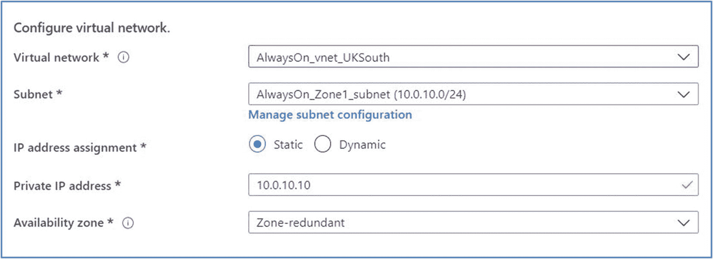

创建负载均衡器（第 2 部分）

在 **标记** 页面上，我们可以根据公司策略指定键/值对，然后在 **查看** 页面上检查我们的配置。

## 添加后端池

我们现在需要为**负载均衡器**创建一个**后端池**。这可以通过导航到 Azure 门户中**负载均衡器**边栏选项卡的 **后端池** 选项卡并使用 **添加** 按钮来调用**添加后端池**页面来实现，如图 7-15 所示。

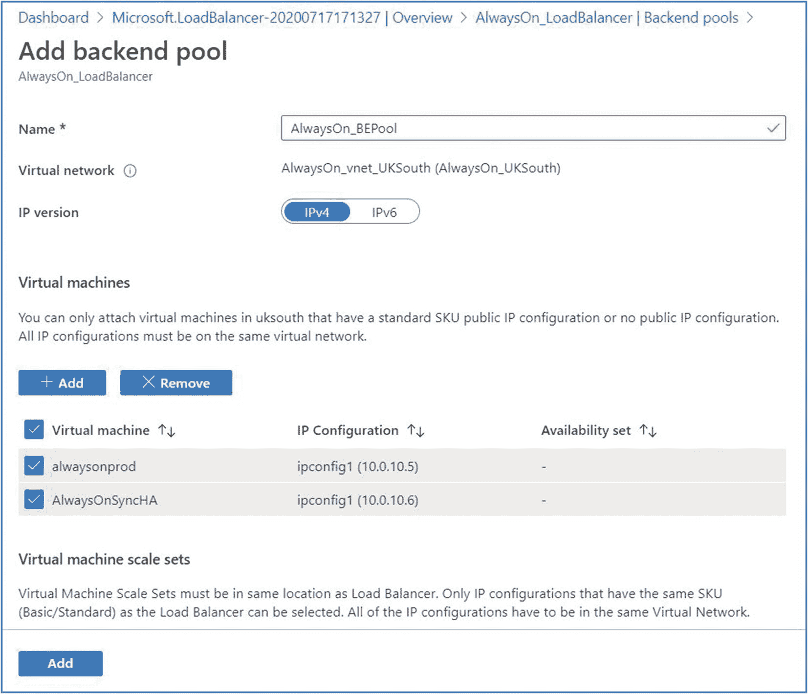

添加后端池


# 配置 Azure 负载均衡器与可用性组

## 创建运行状况探测

我们现在可以创建一个运行状况探测，它将执行到每个节点的连接性检查。导航到负载均衡器边栏选项卡中的“运行状况探测”选项卡（如图 7-16 所示），即可进行此操作。在这里，我们需要为探测指定名称，并提供运行状况检查将用于连接到节点的协议和未使用的端口。然后，我们指定运行状况检查应运行的频率，以及导致节点被标记为不正常的并发失败次数。如果节点被标记为不正常，负载均衡器将不会向其发送任何请求。

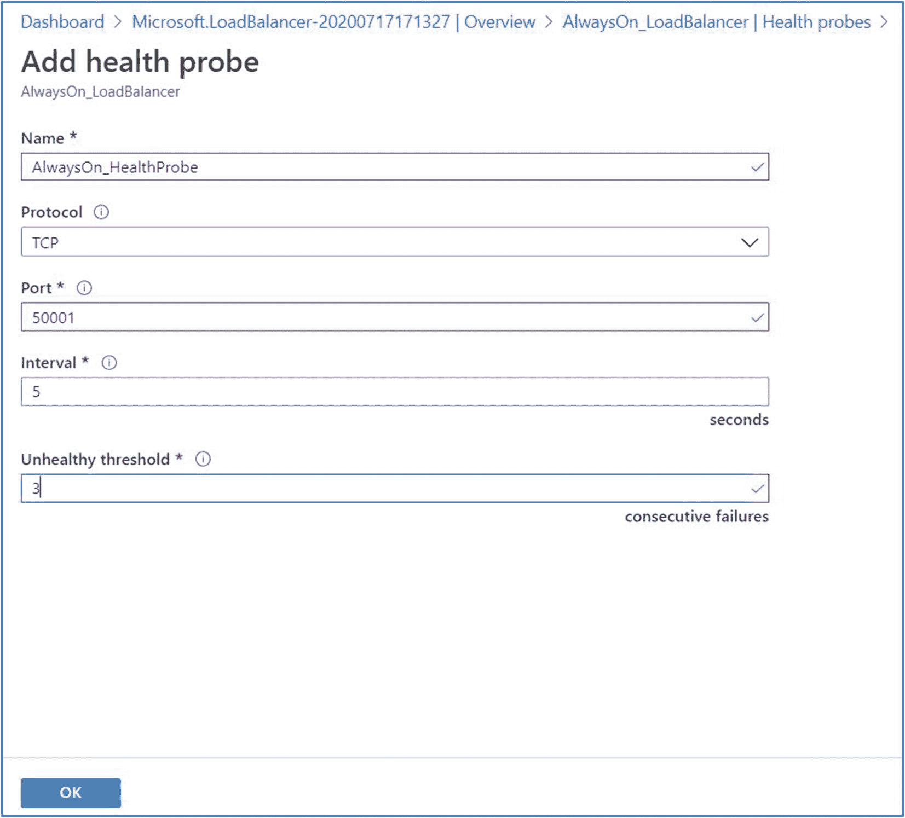

*图 7-16 添加运行状况探测*

## 配置负载均衡规则

接下来，我们将通过使用负载均衡器边栏选项卡的“负载均衡器规则”选项卡上的“添加”按钮来配置新的负载均衡规则。在此边栏选项卡的第一部分（图 7-17），我们将指定规则的名称、负载均衡器应使用 IPv4 还是 IPv6。前端 IP 地址是我们之前配置的负载均衡器的 IP 地址。HA 端口允许负载均衡后端池上的所有端口，但我们不想这样做，因此我们将保持该框未选中，并选择 `TCP` 作为协议。

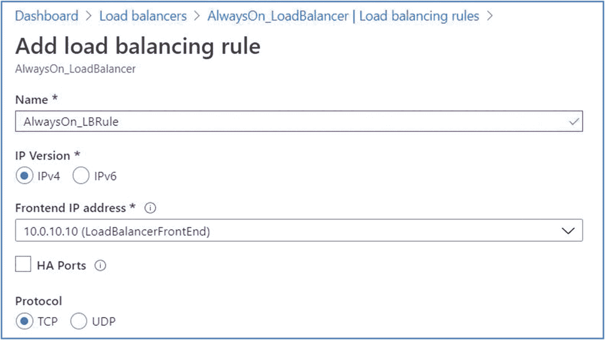

*图 7-17 配置负载均衡规则（第 1 部分）*

在此页面的第二部分，如图 7-18 所示，我们将配置负载均衡器将侦听的端口，然后是后端池中的服务器将侦听的端口。在我们的案例中，两者都将是端口 `1433`。我们将选择后端服务器池和刚刚创建的运行状况探测。

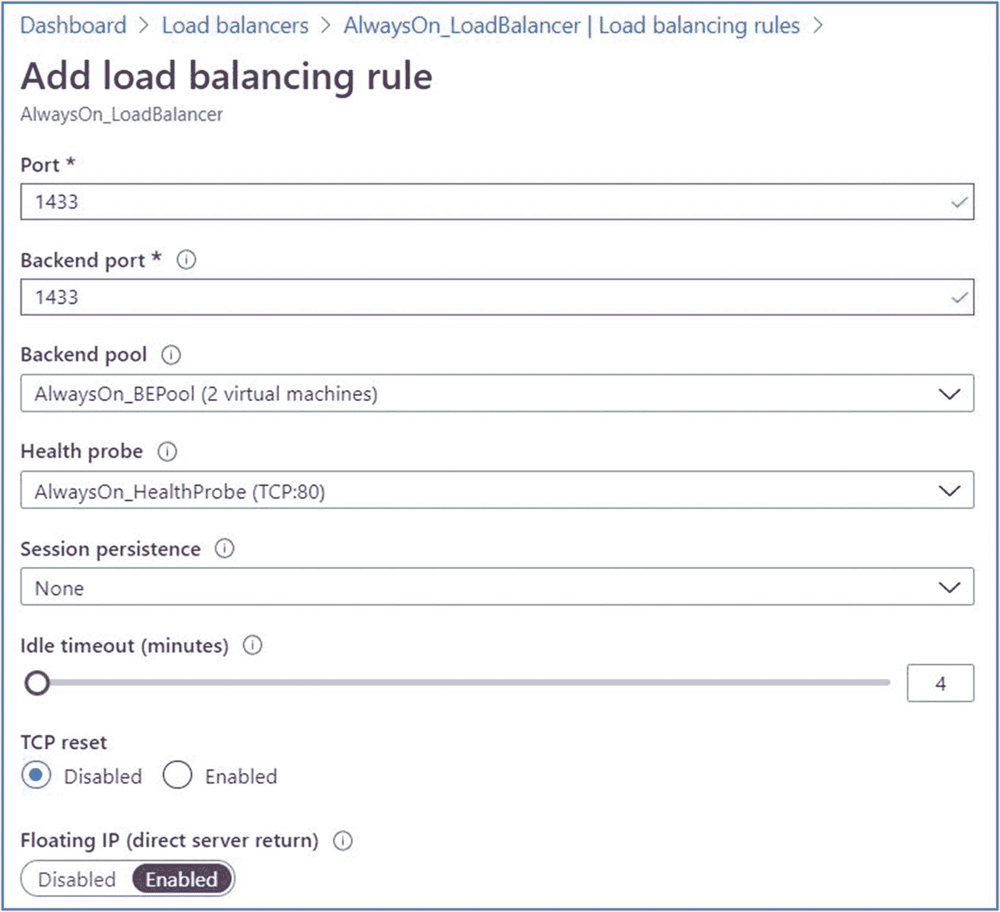

*图 7-18 配置负载均衡器规则（第 2 部分）*

会话持久性指定应如何处理来自客户端的连续请求。如果我们选择“客户端 IP”，则来自同一 IP 地址的连续请求将由同一服务器处理。如果我们选择“客户端 IP 和协议”，则来自同一客户端的连续请求将由同一服务器处理，但前提是使用相同的协议进行连接。然而，对于可用性组，不需要会话持久性，因此我们将选择“无”。这表示来自同一客户端的连续请求可以由后端池中的任何服务器处理。

空闲超时指示连接在没有客户端发送消息的情况下将保持打开状态的最短时间，我们将保持 `TCP` 重置为禁用状态。最后，我们将选择“浮动 IP”，它会更改 IP 地址映射模式，允许多个侦听器，这是可用性组侦听器所必需的。

您应重复此过程，为核心群集添加前端端口和负载均衡规则。

## 配置可用性组侦听器

然后，我们将能够配置可用性组侦听器。我们将从群集管理器中执行此操作。从“销售角色”的上下文菜单中，依次选择“添加资源”和“客户端访问点”。这将显示“新建资源客户端访问点”向导。在此向导的第一页，提供客户端访问点的名称，并分配一个 IP 地址。由于我们在不同的子网上创建了每个 VM，因此我们需要为每个子网提供一个 IP 地址，如图 7-19 所示。

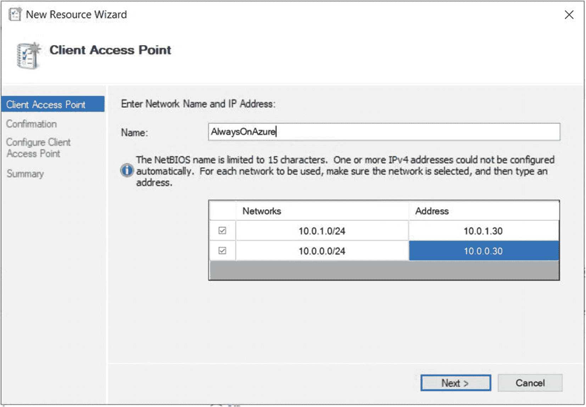

*图 7-19 创建新的客户端访问点 – 客户端访问点页面*

当我们转到向导的确认页面时，将验证我们的网络设置。确认页面显示了我们将要配置的内容摘要。

创建客户端访问点后，我们应使用“可用性组”资源的“属性”对话框的“依赖项”选项卡（在角色的“资源”选项卡下的“其他资源”中显示），添加对客户端访问点的依赖关系，如图 7-20 所示。

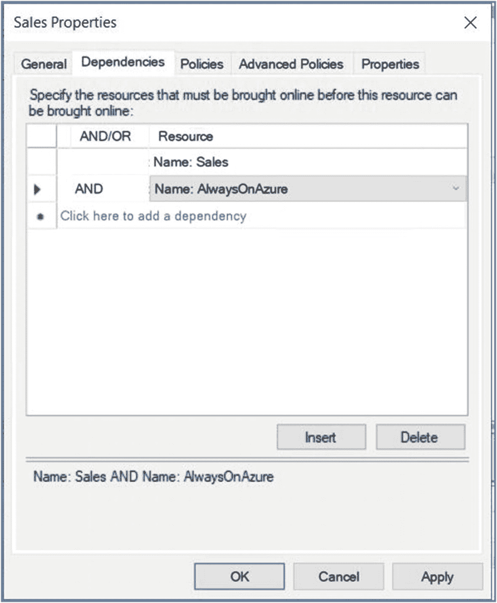

*图 7-20 添加依赖项*

您还应重复此过程，使客户端访问点依赖于 IP 地址资源。

## 使群集与 Azure 负载均衡器协同工作

接下来，我们需要配置群集以与 Azure 负载均衡器协同工作。我们可以使用清单 7-2 中的脚本来完成此操作。此脚本使用负载均衡器 IP 和运行状况探测端口更新每个 IP 地址资源。

> **注意**
>
> 在运行脚本之前，请务必更新脚本以匹配您自己的配置。

```
$ClusterNetworkName = 'AlwaysOnAzure'
$LoadBalancerIP = '10.0.10.10'
[int]$LoadBalancerProbePort = 50001
Get-ClusterResource 'IP Address 10.0.0.35' | Set-ClusterParameter -Multiple @{"Address"="$LoadBalancerIP";"ProbePort"=$LoadBalancerProbePort;"SubnetMask"="255.255.255.0";"Network"="$ClusterNetworkName";"EnableDhcp"=0}
Get-ClusterResource 'IP Address 10.0.0.35' | Set-ClusterParameter -Multiple @{"Address"="$LoadBalancerIP";"ProbePort"=$LoadBalancerProbePort;"SubnetMask"="255.255.255.0";"Network"="$ClusterNetworkName";"EnableDhcp"=0}
```

*清单 7-2 使群集与负载均衡器集成*

> **提示**
>
> 创建客户端访问点后，可用性组侦听器将被添加到可用性组中，默认端口为 `1433`。如果您计划使用不同的端口，可以在 `SQL Server Management Studio` 中的侦听器中更新此设置。


## 无集群可用性组

无集群可用性组首次出现于 SQL Server 2017，是支持 Linux 的副产品，但对于在 Windows 环境中支持实例的 SQL Server 数据库管理员也同样有价值。

无集群实现不适合高可用性场景。这有几个原因。首先，因为没有集群，所以没有运行状况检查。这意味着无法自动仲裁故障转移。其次，虽然可以在副本之间使用同步提交来实现无数据丢失的故障转移，但你需要通过在主副本上使可用性组脱机来准备故障转移。这意味着故障转移期间会出现停机。最后，因为没有集群，所以无法拥有监听器。这意味着连接到主副本的应用程序在故障转移时需要更改连接字符串以指向辅助副本。

**提示**
可以在 DNS 中创建一个指向主副本的 CNAME 记录。然后你可以在故障转移时更新该 CNAME 记录指向辅助副本。虽然这通常是一个手动过程，且可能需要 DBA 职能之外的团队参与，但可以避免客户端更改其连接字符串的需要。

无集群可用性组在读取扩展场景中最具价值。因此，它们也被称为读取扩展可用性组。想象这样一个场景：你有一个 SQL Server 工作负载，来自多个应用程序的读取吞吐量很高，但没有高可用性要求。你可以移除集群的复杂性，同时仍保持数据库同步。一些客户端应用程序可以配置为指向主副本，而其他客户端应用程序可以配置为指向辅助副本。

在本节中，我们将基于一个场景进行操作，其中有两个名为 `Prod` 和 `ReadScale` 的服务器。每个服务器都安装了 SQL Server 2019 Enterprise Edition 的默认实例。两台服务器都位于站点 1，并且都是 `AlwaysOn.com` 域的成员，但没有集群。我们将配置一个可用性组，为 `Customers` 数据库提供读取扩展功能，该数据库由两个应用程序访问，但其中一个应用程序只执行只读操作。

### 准备实例

与所有可用性组场景一样，在配置可用性组之前，我们需要完成一些准备任务。以下部分描述了如何准备实例。

#### 启用可用性组

一如既往，为实例准备可用性组的第一步是在数据库引擎服务上启用可用性组。我们可以使用 PowerShell 或 SQL Server 配置管理器来执行此任务，如第 5 章所示。在本例中，我们将使用配置管理器，如图 7-21 所示。你会注意到，因为没有底层集群，对话框会告知我们这一点，而不是显示底层集群名称。需要在所有将参与可用性组的实例上执行此任务。

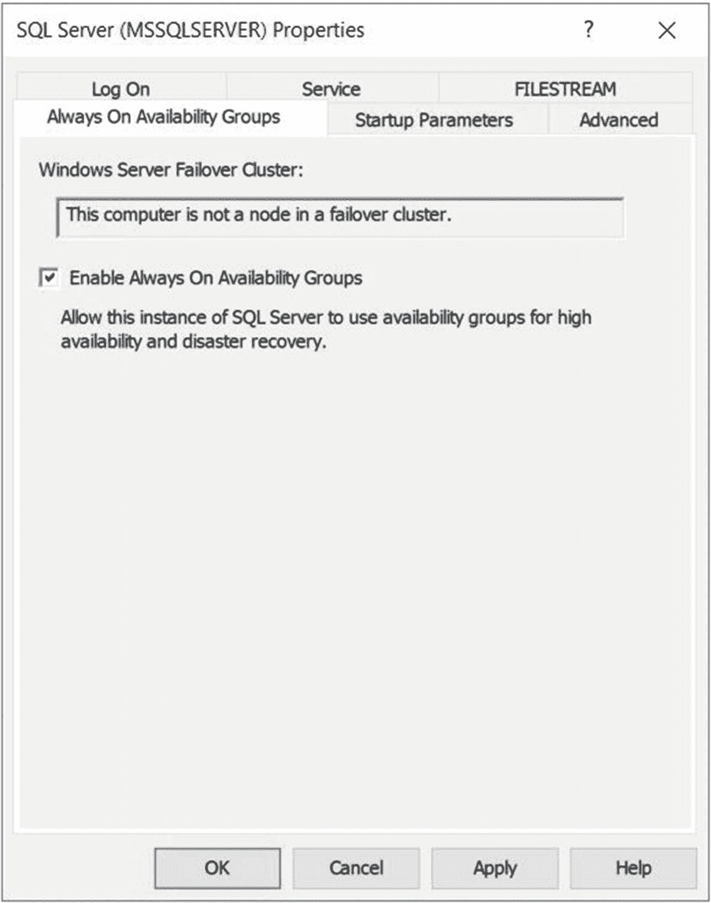

图 7-21

启用可用性组

启用可用性组后，需要重新启动服务才能使更改生效。

#### 创建 Customers 数据库

本场景的目标是为 `Customers` 数据库提供读取扩展功能。因此，我们可以使用清单 7-3 中的脚本创建 `Customers` 数据库。

```sql
--创建 Customers 数据库
CREATE DATABASE Customers ;
GO
USE Customers ;
GO
CREATE TABLE dbo.Customers
(
ID                INT                PRIMARY KEY        IDENTITY,
FirstName         NVARCHAR(30),
LastName          NVARCHAR(30),
CreditCardNumber  VARBINARY(8000)
) ;
GO
--填充表
DECLARE @Numbers TABLE
(
Number        INT
)
;WITH CTE(Number)
AS
(
SELECT 1 Number
UNION ALL
SELECT Number + 1
FROM CTE
WHERE Number < 100
)
INSERT INTO @Numbers
SELECT Number FROM CTE
DECLARE @Names TABLE
(
FirstName        VARCHAR(30),
LastName         VARCHAR(30)
) ;
INSERT INTO @Names
VALUES('Peter', 'Carter'),
('Michael', 'Smith'),
('Danielle', 'Mead'),
('Reuben', 'Roberts'),
('Iris', 'Jones'),
('Sylvia', 'Davies'),
('Finola', 'Wright'),
('Edward', 'James'),
('Marie', 'Andrews'),
('Jennifer', 'Abraham'),
('Margaret', 'Jones')
INSERT INTO Customers(Firstname, LastName, CreditCardNumber)
SELECT
FirstName
, LastName
, CreditCardNumber
FROM (
SELECT
(SELECT TOP 1 FirstName FROM @Names ORDER BY NEWID()) FirstName
, (SELECT TOP 1 LastName FROM @Names ORDER BY NEWID()) LastName
, (SELECT TOP 1 CONVERT(VARBINARY(8000), (
(SELECT TOP 1 CAST(Number * 100 AS CHAR(4))
FROM @Numbers
WHERE Number BETWEEN 10 AND 99
ORDER BY NEWID()
) + '-' +
(SELECT TOP 1 CAST(Number * 100 AS CHAR(4))
FROM @Numbers
WHERE Number BETWEEN 10 AND 99 ORDER BY NEWID()
) + '-' +
(SELECT TOP 1 CAST(Number * 100 AS CHAR(4))
FROM @Numbers
WHERE Number BETWEEN 10 AND 99 ORDER BY NEWID()
) + '-' +
(SELECT TOP 1 CAST(Number * 100 AS CHAR(4))
FROM @Numbers
WHERE Number BETWEEN 10 AND 99 ORDER BY NEWID())))
FROM @Numbers a
) CreditCardNumber) d
CROSS JOIN @Numbers b
CROSS JOIN @Numbers c;
--为数据库设置完整恢复模式 - 可用性组所需
ALTER DATABASE Customers SET RECOVERY FULL ;
GO
清单 7-3
创建 Customers 数据库
```

在将数据库添加到可用性组之前，我们还需要对数据库进行完整备份。我们可以使用清单 7-4 中的脚本来实现这一点。

```sql
--备份 Customers 数据库
BACKUP DATABASE Customers
TO  DISK = 'C:\Program Files\Microsoft SQL Server\MSSQL15.MSSQLSERVER\MSSQL\Backup\Customers.bak'
WITH NAME = 'Customers-完整数据库备份' ;
GO
清单 7-4
备份 Customers 数据库
```

#### 创建登录名

数据同步将由运行数据库引擎服务的服务帐户执行。因此，服务帐户需要在所有将成为可用性组中副本的实例上拥有登录名。在我们的场景中，两个实例都在 `ALWAYSON\SqlServiceAccount` 域帐户下运行。因此，在所有参与的实例上运行清单 7-5 中的脚本将创建所需的登录名。

```sql
CREATE LOGIN [ALWAYSON\SQLServiceAccount]
FROM WINDOWS ;
GO
清单 7-5
创建登录名
```

**提示**
如果服务器不是域成员，那么我们可以使用 SQL 登录名和证书配置身份验证。


#### 创建并配置可用性组

创建可用性组的第一步是创建端点，可用性组将使用该端点在副本之间发送消息。我们还需要授予服务账户连接到该端点的权限。这可以通过清单 7-6 中的脚本实现。

```
--Create the Endpoint
CREATE ENDPOINT ClusterlessEndpoint
AS TCP (LISTENER_PORT = 5022)
FOR DATA_MIRRORING (
ROLE = ALL,
ENCRYPTION = REQUIRED ALGORITHM AES
) ;
GO
--Start the Endpoint
ALTER ENDPOINT ClusterlessEndpoint STATE = STARTED ;
GO
--Grant Permissions to the Service Account
GRANT CONNECT ON ENDPOINT::ClusterlessEndpoint TO [ALWAYSON\SQLServiceAccount];
GO
清单 7-6
创建端点
```

端点就位后，我们现在就可以继续创建可用性组。和往常一样，我们可以选择使用 T-SQL、新建可用性组向导或新建可用性组对话框。在本例中，我们将通过运行清单 7-7 中的脚本来使用 T-SQL。请注意，`CLUSTER_TYPE` 选项被设置为 `NONE`。

```
USE master
GO
CREATE AVAILABILITY GROUP Customers_Clusterless
WITH (
AUTOMATED_BACKUP_PREFERENCE = SECONDARY,
CLUSTER_TYPE = NONE
)
FOR DATABASE Customers
REPLICA ON 'PROD' WITH (
ENDPOINT_URL = 'TCP://PROD.AlwaysOn.com:5022',
FAILOVER_MODE = MANUAL,
AVAILABILITY_MODE = ASYNCHRONOUS_COMMIT,
SEEDING_MODE = AUTOMATIC,
SECONDARY_ROLE(ALLOW_CONNECTIONS = ALL)
),
'READSCALE' WITH (
ENDPOINT_URL = 'TCP://READSCALE.AlwaysOn.com:5022',
FAILOVER_MODE = MANUAL,
AVAILABILITY_MODE = ASYNCHRONOUS_COMMIT,
SEEDING_MODE = AUTOMATIC,
SECONDARY_ROLE(ALLOW_CONNECTIONS = ALL)
) ;
GO
清单 7-7
创建可用性组
```

最后，我们可以通过在辅助副本实例上运行清单 7-8 中的脚本，将辅助副本加入可用性组。

```
ALTER AVAILABILITY GROUP Customers_Clusterless JOIN WITH (CLUSTER_TYPE = NONE) ;
GO
ALTER AVAILABILITY GROUP Customers_Clusterless GRANT CREATE ANY DATABASE ;
GO
清单 7-8
将辅助副本加入可用性组
```

无集群可用性组的另一个用例是迁移。如果你有一个需要迁移到新服务器的数据库，你可以轻松配置一个无集群可用性组来支持并排迁移。

一旦配置好可用性组，用户就可以在继续使用现有数据库的同时，通过对新实例的只读操作来检查他们的应用程序。当他们满意后，可以将可用性组进行故障转移，并淘汰旧实例。

### 域独立可用性组

表面上，域独立集群（也称为工作组集群和可用性组）可能看起来有点奇怪。如果一个公司规模足够大，需要运行 SQL Server 企业版（甚至标准版），那么它肯定也足够大并且很可能拥有一个域和创建标准集群的能力。但如果你深入思考，会发现有很多用例可以让企业从域独立的高可用性和灾难恢复中受益。例如，想象一下你有一个混合云环境。你的公司没有选择将现有域扩展到 Azure 或 AWS，而是决定在云中创建一个新域，并在两个域之间建立信任关系。然后你决定希望使用可用性组在本地和云之间同步数据库，以便支持在线销售应用程序的数据库位于云中以获得最低延迟，但同时也希望灾难恢复（DR）回本地。如果没有域独立集群或可用性组，这只能通过无集群可用性组来实现，这意味着你无法利用侦听器。

在本节中，我们将探讨如何创建一个域独立集群和可用性组。为了简化网络配置，我们将在 Site1 子网内的两个工作组服务器之间进行配置。在此场景中，将不存在域。然而值得注意的是，此方法也可用于在两个独立域之间，或在一个域与一个工作组之间创建集群（和可用性组）。

我们将跨两个节点（名为 `ClusterNode1` 和 `ClusterNode2`）构建集群和可用性组，这两个节点位于同一工作组中，目的是卸载只读报告负载。每个节点上都安装了 SQL Server 的默认实例。

#### 准备集群

要求集群中的所有节点都需要添加一个共同的主要 DNS 后缀。这可以通过导航到“控制面板” ➤ “系统和安全” ➤ “系统”，然后在“计算机名、域和工作组设置”区域中选择“更改设置”来调用“系统属性”对话框，在其中使用“更改”按钮调用“计算机名/域更改”对话框。现在你可以使用“其他”按钮调用“DNS 后缀和 NetBIOS 计算机名”对话框，如图 7-22 所示。在这里，我们将输入我们共同的 DNS 后缀。

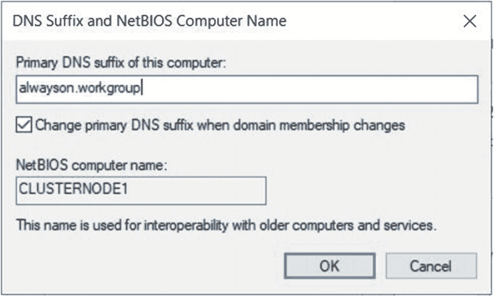
*图 7-22 DNS 后缀和 NetBIOS 计算机名*

我们还需要确保在所有集群节点上存在一个具有相同用户名和相同密码并且拥有本地管理员权限的账户。在我们的场景中，我们将使用内置的 Administrator 账户，但如果我们使用任何其他账户，那么我们还必须在注册表中将 `LocalAccountTokenFilterPolicy` 的值设置为 `1`。这可以通过使用清单 7-9 中的 PowerShell 命令实现。

```
New-ItemProperty -path HKLM:\SOFTWARE\Microsoft\Windows\CurrentVersion\Policies\System -Name LocalAccountTokenFilterPolicy -Value 1
清单 7-9
设置 LocalAccountTokenFilterPolicy
```

#### 创建集群

我们现在可以使用清单 7-10 中的脚本来创建集群。这里有两点值得注意。首先，我们使用了 `AdministrativeAccessPoint` 参数，其配置值为 `DNS`。这将创建集群名称对象（CNO），但不会尝试在 Active Directory 中创建计算机对象，这在域独立集群中当然是不受支持的。

第二个有趣的一点是，我们选择使用集群磁盘作为见证。这是因为在域独立集群中不支持文件共享见证。

```
New-Cluster -Name AOAGWorkGroupCluster -Node ClusterNode1,ClusterNode2 -StaticAddress 10.0.0.52 -AdministrativeAccessPoint DNS
Set-ClusterQuorum -DiskWitness "Cluster Disk 1"
清单 7-10
创建集群
```


# 准备可用性组

准备可用性组的第一步，是在所有将参与的节点上的 SQL Server 服务中启用可用性组。关于如何执行此操作的信息，可以在本章的“无集群可用性组”部分找到。

由于在此拓扑中无法进行 Active Directory 身份验证，`database_mirroring` 端点将需要证书来相互通信。我们还需要 SQL 登录名，这些登录名将被授予连接到端点的权限。因此，我们首先需要创建证书。这可以使用清单 7-11 中的脚本来完成。在此脚本中，我们首先在 `master` 数据库中创建一个数据库主密钥。然后，我们创建一个证书，并将该证书备份到操作系统。应在所有将参与可用性组的节点上重复此操作，为每个实例使用不同的证书名称。

```sql
USE master
GO
--创建数据库主密钥
CREATE MASTER KEY ENCRYPTION BY PASSWORD = 'Pa$$w0rd';
GO
-- 创建证书
CREATE CERTIFICATE Node1Cert
WITH SUBJECT = 'ClusterNode1 Certificate';
GO
--备份证书
BACKUP CERTIFICATE Node1Cert
TO FILE = 'c:\Certificates\Node1Cert.cer';
GO
```

**清单 7-11** 创建证书

我们现在需要为每个节点创建一个登录名，该登录名将被授予连接到端点的权限。我们可以使用清单 7-12 中的脚本来实现这一点。这些登录名应在所有将参与可用性组的实例上创建。因此，应对所有实例运行该脚本。

```sql
CREATE LOGIN ClusterNode1_AOAG
WITH PASSWORD = 'Pa$$w0rd';
GO
CREATE USER ClusterNode1_AOAG
FOR LOGIN ClusterNode1_AOAG;
GO
CREATE LOGIN ClusterNode2_AOAG
WITH PASSWORD = 'Pa$$w0rd';
GO
CREATE USER ClusterNode2_AOAG
FOR LOGIN ClusterNode2_AOAG;
GO
```

**清单 7-12** 创建登录名

我们现在可以将每个实例的证书复制到所有其他实例，并使用清单 7-13 中的命令还原它们。对于每个实例，您应相应地更改证书和用户名。此清单显示了在我们的拓扑中，应在 `CLUSTERNODE1` 上运行的命令。

```sql
CREATE CERTIFICATE Node2Cert
AUTHORIZATION ClusterNode2_AOAG
FROM FILE = 'C:\Certificates\Node2Cert.cer'
```

**清单 7-13** 还原证书

最后，既然证书已存在于每个节点上，我们就可以继续在每个节点上创建 `database_mirroring` 端点。这可以使用清单 7-14 中的脚本来完成。此脚本需要在每个节点上运行，并更改证书以匹配该节点。

```sql
--创建端点
CREATE ENDPOINT AOAG_Endpoint
STATE = STARTED
AS TCP (
LISTENER_PORT = 5022,
LISTENER_IP = ALL
)
FOR DATABASE_MIRRORING (
AUTHENTICATION = CERTIFICATE Node1Cert,
ROLE = ALL
)
--授予每个用户连接到端点的权限
GRANT CONNECT ON ENDPOINT::AOAG_Endpoint TO ClusterNode1_AOAG;
GO
GRANT CONNECT ON ENDPOINT::AOAG_Endpoint TO ClusterNode2_AOAG;
GO
```

**清单 7-14** 创建端点

您现在可以使用本书第 5 章讨论的技术来创建可用性组。

## 分布式可用性组

分布式可用性组是可用性组的扩展，允许在两个独立的可用性组之间同步数据。这是一项令人兴奋的技术，具有许多不同的用例。例如，它允许在基于 Windows 和基于 Linux 的可用性组之间进行数据同步；它允许将可读的辅助副本数量扩展到 8 个以上（这是标准可用性组的限制）；并且它允许跨站点复制，而无需复杂延伸集群。分布式可用性组还可以通过在无法进行就地升级而需要并行迁移时提供数据同步来帮助进行服务器迁移。当您有位于不同域中的服务器时，它们也可以用作域独立可用性组的替代方案。

虽然分布式可用性组的每一侧都可以是 Windows 故障转移集群，但这并不是必需的，因为重点主要在于维护数据库，不会发生集群配置。

在本节中，我们将通过为我们第 5 章创建的 HR 可用性组配置分布式可用性组来说明该技术，配置在我们的 ALWAYSON-C 集群和一个名为 `Linux_AOAG` 的基于 Linux 的可用性组之间，该可用性组托管在两台参与 Pacemaker 集群的 Linux 服务器上。

第一步是在 Linux 集群上创建分布式可用性组。这可以通过使用清单 7-15 中的脚本来完成。注意 `WITH (DISTRIBUTED)` 语法，后跟每个可用性组的规范。

> 注意
> 在开始之前，您应该从 HR 可用性组中移除现有数据库；否则，它将无法加入分布式可用性组，因为辅助可用性组必须为空。

```sql
CREATE AVAILABILITY GROUP DistributedAG
WITH (DISTRIBUTED)
AVAILABILITY GROUP ON
'HR' WITH
(
LISTENER_URL = 'tcp://HRListener.alwayson.com:1433',
AVAILABILITY_MODE = ASYNCHRONOUS_COMMIT,
FAILOVER_MODE = MANUAL,
SEEDING_MODE = AUTOMATIC
),
'Linux_AOAG' WITH
(
LISTENER_URL = 'tcp://LinuxListener:5022',
AVAILABILITY_MODE = ASYNCHRONOUS_COMMIT,
FAILOVER_MODE = MANUAL,
SEEDING_MODE = AUTOMATIC
);
GO
```

**清单 7-15** 创建分布式可用性组

我们现在可以针对 PROSQLADMIN-C 集群运行清单 7-16 中的命令，以将其加入到分布式可用性组中。

```sql
ALTER AVAILABILITY GROUP DistributedAG
JOIN
AVAILABILITY GROUP ON
'HR' WITH
(
LISTENER_URL = 'tcp://HRListener.alwayson.com:1433',
AVAILABILITY_MODE = ASYNCHRONOUS_COMMIT,
FAILOVER_MODE = MANUAL,
SEEDING_MODE = AUTOMATIC
),
'Linux_AOAG' WITH
(
LISTENER_URL = 'tcp://LinuxListener:5022',
AVAILABILITY_MODE = ASYNCHRONOUS_COMMIT,
FAILOVER_MODE = MANUAL,
SEEDING_MODE = AUTOMATIC
) ;
GO
```

**清单 7-16** 加入第二个可用性组

> 提示
> 数据库需要手动加入到辅助可用性组内的辅助副本中。


## 摘要

可用性组提供了极大的灵活性，使数据库管理员几乎能在任何情况下配置高可用性、灾难恢复或读取扩展。典型的可用性组拓扑示例包括跨 Azure VM 配置可用性组、在没有底层集群的情况下配置可用性组，以及跨域或完全没有域配置可用性组。

在 Azure VM 中创建可用性组时，通过将虚拟机分散在可用性集和可用性区域中可以实现最佳的高可用性，而通过将灾难恢复节点放置在不同的 Azure 区域则可以实现最佳的灾难恢复。在此场景中，使用 Azure 配对区域可以维护数据主权，这些区域位于同一政治地理区域内，同时仍然实现了地理分散的解决方案。

无集群可用性组不能用于实现高可用性。这是因为没有集群来执行节点健康状况检查。然而，它们非常适合读取扩展场景，因为可以避免集群组件的复杂性。

独立于域的可用性组（也称为工作组可用性组）允许跨多个域或在完全没有域的情况下配置可用性组。它们特别适合混合云场景，即您的组织选择在云中创建一个单独的域，而不是扩展其本地域。

分布式可用性组可以作为混合云场景中独立于域可用性组的替代方案。此外，它们提供了跨平台分布数据的灵活性。例如，可以在基于 Windows 的可用性组和基于 Linux 的可用性组之间复制数据。

基本可用性组提供了在运行 SQL Server 标准版的实例上配置可用性组的选项。但是，如果选择使用此功能，则功能是有限的。仅支持两个副本，并且每个可用性组只能有一个数据库。此外，没有使用只读路由的选项。

# 8. 管理 AlwaysOn

本章将讨论如何管理 AlwaysOn 功能。我们将首先了解集群维护，包括滚动补丁升级和移除实例。然后我们将讨论管理可用性组，包括如何进行同步和异步故障转移。我们还将探讨如何对分布式可用性组进行故障转移。

还将讨论其他维护任务，例如同步实例级对象、使应用程序安全停止以及向可用性组添加多个`Listeners`。本章最后将讨论如何暂停数据移动以及如何从可用性组中移除数据库。

## 管理集群

从管理角度来看，安装集群并不是终点。您仍然需要定期执行维护任务。以下各节描述了一些最常见的维护任务。

#### 在节点间移动实例

除了防止计划外中断之外，实施高可用性技术的好处之一是，它显著减少了维护任务（例如打补丁）的停机时间。这可以在操作系统级别或 SQL Server 级别进行。

如果您有一个双节点集群，请先将补丁应用到被动节点。确认更新成功后，对实例进行故障转移，然后将补丁应用到另一个节点。此时，根据环境的需求，您可能希望也可能不希望故障转移回原始节点。例如，如果首要优先级是实例的可用性级别，那么您可能不希望故障转移回去，因为这将导致另一次短暂的停机。

要使用故障转移集群管理器将实例移动到不同的节点，请从包含该实例的角色的上下文菜单中选择“移动”➤“选择节点”。这将显示“移动集群角色”对话框。在这里，您可以选择要将角色移动到的节点，如图 8-1 所示。

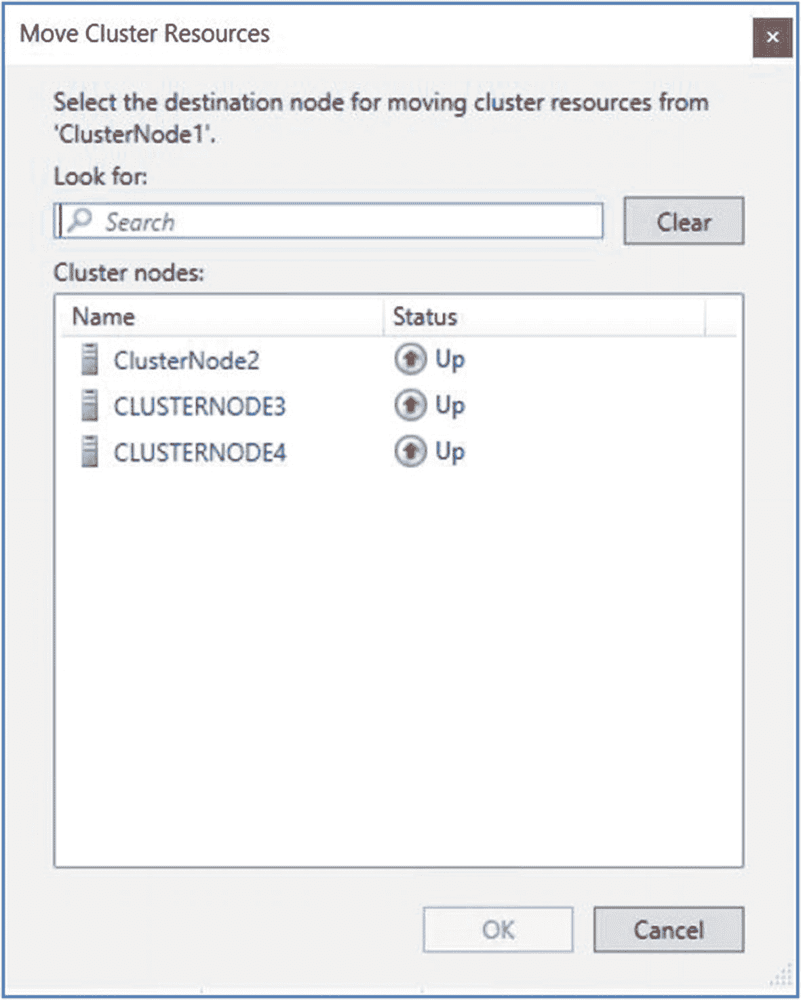

**图 8-1** 移动集群角色对话框

然后角色被移动到新节点。如果您在`Failover Cluster Manager`中观察角色的资源窗口，您会看到每个资源依次经历“联机”➤“正在挂起脱机”➤“脱机”的状态。在资源依次移动到“脱机”➤“正在挂起联机”➤“联机”的状态之前，新节点会显示为所有者。资源按其依赖关系顺序脱机并重新联机。

我们也可以使用 PowerShell 对角色进行故障转移。为此，我们需要使用 `Move-ClusterGroup` cmdlet。清单 8-1 通过使用该 cmdlet 将 MSDTC 集群角色故障转移到 `ClusterNode2` 来演示此操作。我们使用 `-Name` 参数指定要移动的角色，并使用 `-Node` 参数指定要移动到的节点。

```
Move-ClusterGroup -Name ALWAYSON-MSDTC-C -Node ClusterNode2
清单 8-1 在节点间移动角色
```

#### 滚动补丁升级

如果您有一个超过两个节点的集群，那么在应用 SQL Server 更新时，请考虑执行滚动补丁升级。在此场景中，您可以降低运行不同版本或补丁级别的 SQL Server 的不同节点（这些节点可能是角色的所有者）的风险。

您应该做的第一件事是制作角色可能所有者的所有节点列表。然后，选择其中 50% 的节点，并从“可能的所有者”列表中移除它们。您可以通过从“名称”资源的上下文菜单中选择“属性”，然后在“高级策略”选项卡中取消选中可能所有者列表中的节点来完成此操作，如图 8-2 所示。

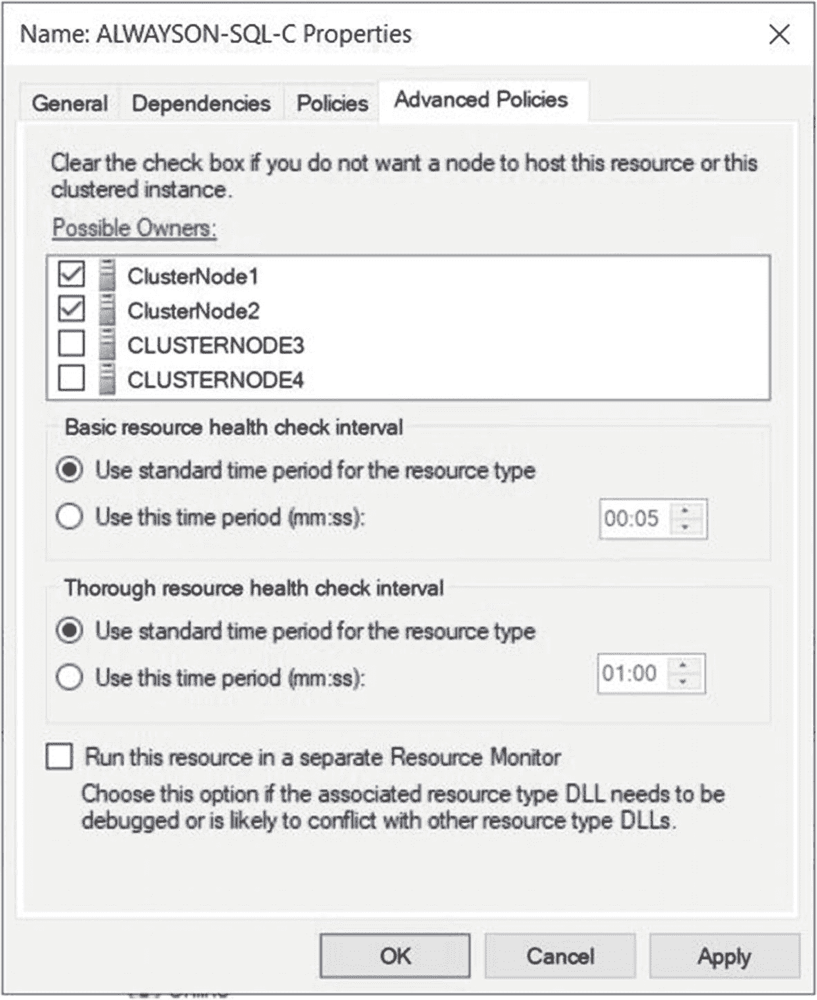

**图 8-2** 移除可能的所有者

要使用 PowerShell 实现相同的结果，我们可以使用 `Get-Resource` cmdlet 导航到名称资源，然后通过管道传递 `Set-ClusterOwnerNode` 来配置可能的所有者列表。清单 8-2 演示了这一点。如果配置了多个可能的所有者，则可能所有者列表以逗号分隔。

```
Get-ClusterResource "SQL Network Name (ALWAYSON-SQL-C)" | Set-ClusterOwnerNode -Owners clusternode1
清单 8-2 配置可能的所有者
```

一旦 50% 的节点被移除作为可能的所有者，您应该将更新应用到这些节点。在此半数节点上验证更新后，您应重新配置它们以再次允许它们成为可能的所有者。

下一步是将角色移动到您已升级的节点之一。故障转移成功完成后，在将更新应用到其他半数节点之前，将它们从可能的所有者列表中移除。在此半数节点上验证更新后，您可以将它们放回可能的所有者列表。

> **提示**
>
> 可能的所有者只能在资源上设置。如果您对角色运行 `Set-ClusterOwnerNode` 并使用 `-Group` 参数，那么您正在配置的是首选所有者，而不是可能的所有者。


## 从集群中移除节点

> **注意**
>
> 如果您希望遵循本书后续的演示操作，请勿按照本节中的演示进行操作。

如果您希望卸载一个 AlwaysOn 故障转移群集实例，您无法像处理独立实例那样从控制面板执行此操作。相反，您必须在集群的每个节点上运行“移除节点向导”。您可以通过在 SQL Server 安装中心的“维护”选项卡中选择 **从 SQL Server 故障转移群集中移除节点** 选项来调用此向导。

该向导首先运行全局规则检查，然后是移除节点的规则检查。接着，在如图 8-3 所示的“群集节点配置”页面上，系统会要求您确认要从中移除节点的实例。如果群集承载多个实例，您可以从下拉框中选择适当的实例。

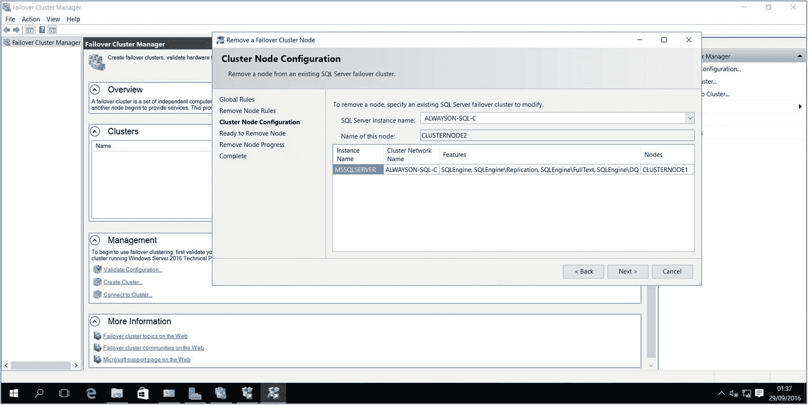
*图 8-3. 群集节点配置页面*

在“准备移除节点”页面上，系统会提供将要执行的任务摘要。确认详情后，实例将被移除。此过程应在所有被动节点上重复，最后在活动节点上执行。当实例从最后一个节点移除时，群集角色也会被移除。

要使用 PowerShell 移除节点，我们需要运行 SQL Server 的 `setup.exe` 应用程序，并将操作参数配置为 `RemoveNode`。当您使用 PowerShell 移除节点时，表 8-1 中的参数是必需的。

*表 8-1. 从集群中移除节点时的必需参数*

| 参数 | 用法 |
| :--- | :--- |
| `/ACTION` | 必须配置为 `RemoveNode`。 |
| `/INSTANCENAME` | 您正在添加额外节点以支持的实例。 |
| `/CONFIRMIPDEPENDENCYCHANGE` | 允许为多子网群集指定多个 IP 地址。传入值 `1` 表示 `True`，`0` 表示 `False`。 |

清单 8-3 中的脚本在从 SQL Server 安装介质的根目录运行时，会从我们的集群中移除一个节点。

```
.\setup.exe /ACTION="RemoveNode" /INSTANCENAME="ALWAYSON-SQL-C" /CONFIRMIPDEPENDENCYCHANGE=0 /qs
```
*清单 8-3. 移除节点*

## 管理 AlwaysOn 可用性组

一旦您的可用性组初始设置完成，您仍然需要执行管理任务。这些任务包括故障转移可用性组、进行监控，以及在极少数情况下添加额外的监听器。以下各节将讨论这些主题。

### 故障转移

如果一个副本处于同步提交模式并配置为自动故障转移，那么当满足主副本上的错误条件时，可用性组会自动转移到冗余副本。然而，有些时候您可能希望手动故障转移可用性组。这可能是因为灾难恢复测试、主动维护，或者由于主副本或主数据中心发生故障后需要启动异步副本。

#### 同步故障转移

如果您希望故障转移一个处于同步提交模式的副本，请通过在对象资源管理器中右键单击可用性组并选择 **故障转移** 来启动“故障转移可用性组向导”。在跳过“简介”页面后，您将找到“选择新的主副本”页面（参见图 8-4）。在此页面上，勾选您希望故障转移到的副本对应的复选框。但在执行此操作之前，请检查“故障转移就绪”列，以确保副本已同步且不会发生数据丢失。

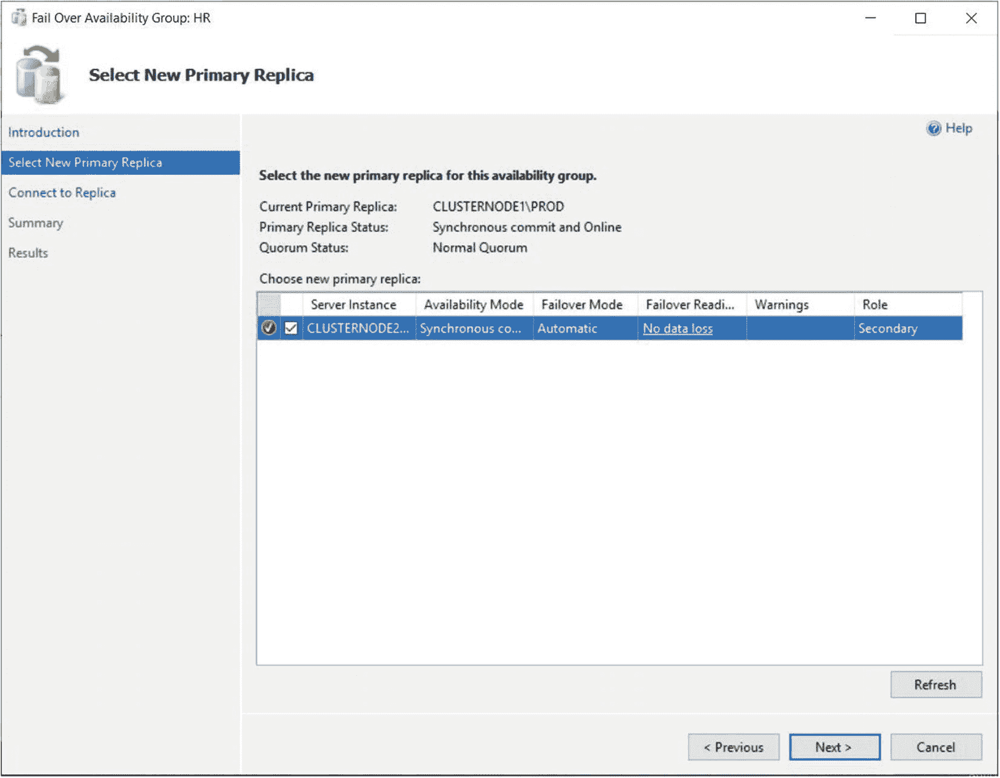
*图 8-4. 选择新的主副本页面*

在如图 8-5 所示的“连接到副本”页面上，使用 **连接** 按钮建立到新主副本的连接。

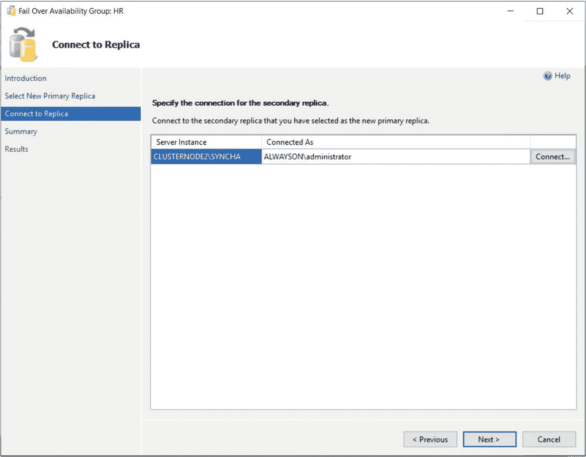
*图 8-5. 连接到副本页面*

在“摘要”页面上，系统会提供将要执行的任务详情，随后在“结果”页面上显示进度指示器。故障转移完成后，请检查所有任务是否成功，并调查收到的任何错误或警告。

我们也可以使用 T-SQL 来故障转移可用性组。清单 8-4 中的命令可以达到相同的效果。请确保从将成为新主副本的副本运行此脚本。如果您从当前主副本运行，请使用 SQLCMD 模式并在脚本内连接到新的主副本。

```
ALTER AVAILABILITY GROUP HR FAILOVER ;
GO
```
*清单 8-4. 故障转移可用性组*


### 异步故障转移

如果您的可用性组处于异步提交模式，那么从技术角度来看，您可以按照与同步提交模式副本类似的方式进行故障转移，区别在于您需要强制故障转移，从而承担数据丢失的风险。您可以使用清单 8-5 中的命令强制进行故障转移。您应该在将成为新主副本的实例上运行此脚本。要使其工作，集群必须具有仲裁。如果没有，则需要在强制可用性组联机之前强制集群联机。

```sql
ALTER AVAILABILITY GROUP HR FORCE_FAILOVER_ALLOW_DATA_LOSS ;
```
清单 8-5
强制故障转移

从流程角度来看，仅当您的主站点完全不可用时才应执行此操作。如果不是这种情况，首先应将应用程序置于安全状态。这避免了任何数据丢失的可能性。我在生产环境中通常通过执行以下步骤来实现：

1.  禁用登录。
2.  将副本的模式更改为同步提交模式。
3.  进行故障转移。
4.  将副本更改回异步提交模式。
5.  启用登录。

您可以使用清单 8-6 中的脚本执行这些步骤。当从 DR 实例运行时，此脚本在故障转移前将 `HR` 中的数据库置于安全状态，然后重新配置应用程序以在正常操作下工作。

```sql
--DISABLE LOGINS
DECLARE @AOAGDBs TABLE
(
DBName NVARCHAR(128)
) ;
INSERT INTO @AOAGDBs
SELECT database_name
FROM sys.availability_groups AG
INNER JOIN sys.availability_databases_cluster ADC
ON AG.group_id = ADC.group_id
WHERE AG.name = 'HR' ;
DECLARE @Mappings TABLE
(
LoginName NVARCHAR(128),
DBname NVARCHAR(128),
UserName NVARCHAR(128),
AliasName NVARCHAR(128)
) ;
INSERT INTO @Mappings
EXEC sp_msloginmappings ;
DECLARE @SQL NVARCHAR(MAX)
SELECT DISTINCT @SQL =
(
SELECT 'ALTER LOGIN [' + LoginName + '] DISABLE; ' AS [data()]
FROM @Mappings M
INNER JOIN @AOAGDBs A
ON M.DBname = A.DBName
WHERE LoginName <> SUSER_NAME()
FOR XML PATH ('')
)
EXEC(@SQL)
GO
--SWITCH TO SYNCHRONOUS COMMIT MODE
ALTER AVAILABILITY GROUP HR
MODIFY REPLICA ON N'CLUSTERNODE3\ASYNCDR' WITH (AVAILABILITY_MODE = SYNCHRONOUS_COMMIT) ;
GO
--FAIL OVER
ALTER AVAILABILITY GROUP HR FAILOVER
GO
--SWITCH BACK TO ASYNCHRONOUS COMMIT MODE
ALTER AVAILABILITY GROUP HR
MODIFY REPLICA ON N'CLUSTERNODE3\ASYNCDR' WITH (AVAILABILITY_MODE = ASYNCHRONOUS_COMMIT) ;
GO
--ENABLE LOGINS
DECLARE @AOAGDBs TABLE
(
DBName NVARCHAR(128)
) ;
INSERT INTO @AOAGDBs
SELECT database_name
FROM sys.availability_groups AG
INNER JOIN sys.availability_databases_cluster ADC
ON AG.group_id = ADC.group_id
WHERE AG.name = 'HR' ;
DECLARE @Mappings TABLE
(
LoginName NVARCHAR(128),
DBname NVARCHAR(128),
Username NVARCHAR(128),
AliasName NVARCHAR(128)
) ;
INSERT INTO @Mappings
EXEC sp_msloginmappings
DECLARE @SQL NVARCHAR(MAX)
SELECT DISTINCT @SQL =
(
SELECT 'ALTER LOGIN [' + LoginName + '] ENABLE; ' AS [data()]
FROM @Mappings M
INNER JOIN @AOAGDBs A
ON M.DBname = A.DBName
WHERE LoginName <> SUSER_NAME()
FOR XML PATH ('')
) ;
EXEC(@SQL)
```
清单 8-6
将应用程序置于安全状态并进行故障转移

### 故障转移分布式可用性组

分布式可用性组不支持自动故障转移；仅支持手动故障转移。当您需要在分布式可用性组内故障转移到辅助可用性组时，应执行以下步骤：

*   将同步模式设置为同步提交。
*   等待辅助可用性组变为同步状态。
*   将主可用性组设置为承担辅助角色。
*   强制故障转移。

清单 8-7 中的脚本将强制故障转移第 6 章讨论的分布式可用性组。

```sql
--Set the secondary Availability Group to synchronous commit mode
ALTER AVAILABILITY GROUP DistributedAG
MODIFY
AVAILABILITY GROUP ON
'HR' WITH
(
LISTENER_URL = 'tcp://HRListener.alwayson.com:1433',
AVAILABILITY_MODE = ASYNCHRONOUS_COMMIT,
FAILOVER_MODE = MANUAL,
SEEDING_MODE = MANUAL
),
'Linux_AOAG' WITH
(
LISTENER_URL = 'tcp://LinuxListener:5022',
AVAILABILITY_MODE = SYNCHRONOUS_COMMIT,
FAILOVER_MODE = MANUAL,
SEEDING_MODE = MANUAL
);
--Wait until the Availability Groups are synchronized
WHILE (SELECT COUNT(DISTINCT synchronization_state_desc)
FROM (
SELECT
ag.name
, drs.database_id
, drs.group_id
, drs.replica_id
, drs.synchronization_state_desc
, drs.end_of_log_lsn
FROM sys.dm_hadr_database_replica_states drs
INNER JOIN sys.availability_groups ag
ON drs.group_id = ag.group_id
WHERE ag.name = 'HR'
AND synchronization_state_desc = 'synchronized'
) a
) > 1
BEGIN
WAITFOR DELAY'00:00:05' ;
END
--Assign the primary Availability Group, the secondary role
ALTER AVAILABILITY GROUP DistributedAG SET (ROLE = SECONDARY) ;
--Force the failover
ALTER AVAILABILITY GROUP DistributedAG FORCE_FAILOVER_ALLOW_DATA_LOSS ;
```
清单 8-7
故障转移分布式可用性组

### 同步未包含对象

无论您使用哪种方法进行故障转移，假设可用性组中的所有数据库都未包含，则需要确保实例级对象已同步。保持实例级对象同步的最直接方法是实现一个 SSIS 包，该包被调度为定期运行。

无论您选择调度 SSIS 包执行还是选择其他方法（例如在辅助服务器上编写脚本并重新创建对象的 SQL Server Agent 作业），这些都是您应考虑同步的对象：

*   登录名
*   凭据
*   SQL Server Agent 作业
*   自定义错误消息
*   链接服务器
*   服务器级事件通知
*   `master` 数据库中的存储过程
*   服务器级触发器
*   加密密钥和证书


### 添加多个侦听器

通常，每个可用性组只有一个可用性组侦听器，但在某些罕见情况下，您可能需要为同一个可用性组创建多个侦听器。一种可能需要此操作的场景是，如果您有使用硬编码连接字符串的旧版应用程序。此时，您可以创建一个额外的侦听器，其客户端访问点名称与硬编码的连接字符串名称相匹配。

如本章前面所述，无法通过 `SQL Server Management Studio`、`T-SQL` 甚至 `PowerShell` 创建第二个可用性组侦听器。相反，我们必须使用故障转移群集管理器。在这里，我们在 `HR` 角色中创建一个新的 `客户端访问点` 资源。为此，我们从 `HR` 角色的上下文菜单中选择 `添加资源`，然后选择 `客户端访问点`。这将调用 `新建资源向导`。该向导的 `客户端访问点` 页面如图 8-6 所示。您可以看到我们已输入了客户端访问点的 DNS 名称，并为每个子网指定了一个 IP 地址。

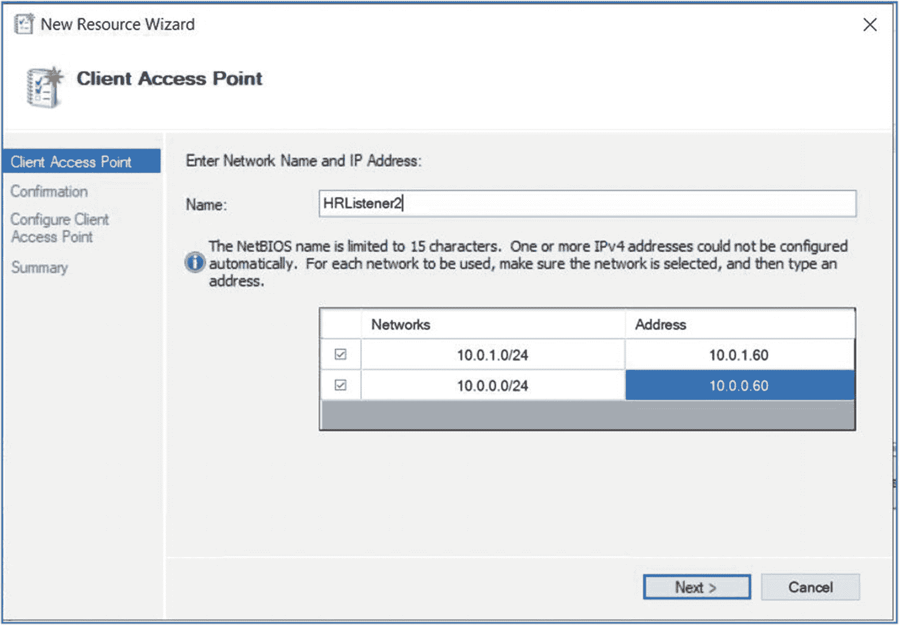

图 8-6：客户端访问点页面

在 `确认` 页面上，显示了将执行的配置摘要。在 `配置客户端访问点` 页面上，我们会看到一个进度指示器，最后在 `摘要` 页面上显示完成摘要，如图 8-7 所示。

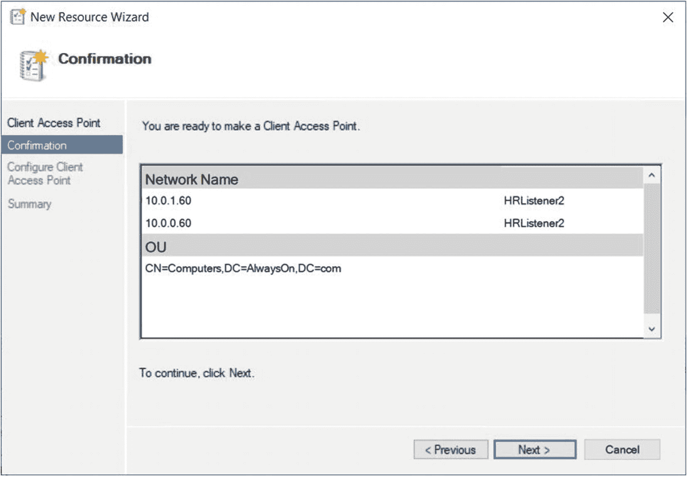

图 8-7：确认页面

现在，我们需要配置可用性组资源，使其依赖于新的客户端访问点。为此，我们从 `HR` 资源的上下文菜单中选择 `属性`，然后导航到 `依赖项` 选项卡。在这里，我们将新的客户端访问点添加为依赖项，并在两个侦听器之间配置一个 `OR` 约束，如图 8-8 所示。应用此更改后，客户端就能够使用这两个侦听器名称中的任何一个进行连接。

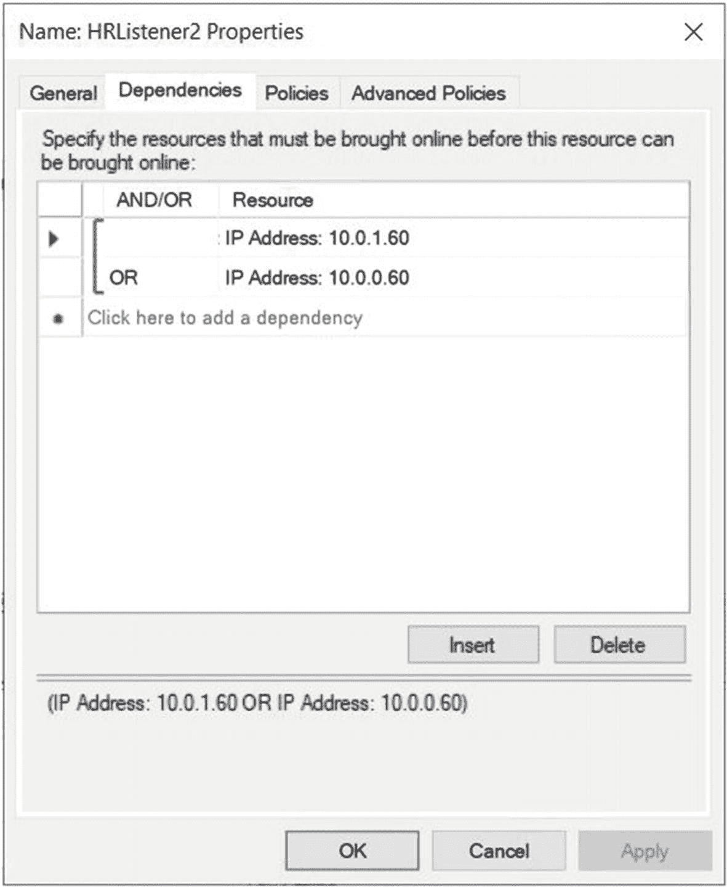

图 8-8：依赖项选项卡

### 其他管理注意事项

当使用 AlwaysOn 可用性组使数据库具有高可用性时，会施加一些限制。其中最严格的一个是，数据库不能被置于 `单用户` 模式或设为 `只读`。当您需要为了维护而使应用程序进入安全状态时，这可能会产生影响。这就是为什么在本章的“故障转移”部分，我们禁用了映射到这些数据库的用户的登录。如果您必须将数据库置于 `单用户` 模式，则必须首先将其从可用性组中移除。

可以通过运行清单 8-8 中的命令将数据库从可用性组中移除。此命令将 `Customers` 数据库从 `Sales` 可用性组中移除。

```
ALTER DATABASE Customers SET HADR OFF ;
```
清单 8-8：从可用性组中移除数据库

也可能有这样的情况：您希望数据库保留在可用性组中，但希望暂停到其他副本的数据移动。这通常是因为可用性组处于同步提交模式，并且您正处于高使用期，需要提升性能。您可以使用清单 8-9 中的命令暂停数据库的数据移动，该命令暂停然后恢复 `Sales` 数据库的数据移动。

> **注意**
>
> 如果暂停数据移动，主副本上的事务日志会继续增长，并且在数据移动恢复且数据库同步之前，您无法对其进行截断。

```
ALTER DATABASE Sales SET HADR SUSPEND ;
GO
ALTER DATABASE Sales SET HADR RESUME ;
GO
```
清单 8-9：暂停数据移动

另一个重要的注意事项是数据库和日志文件的位置。这些文件在每个副本上必须位于相同的位置。这意味着，如果您使用命名实例，那么更改数据和日志的默认文件位置是一个硬性的技术要求，因为默认位置包含实例名称。当然，这是假设您没有在每个节点上使用相同的实例名，否则将违背使用命名实例的许多优势。

## 小结

当主副本发生故障时，自动故障转移到同步副本。然而，有些情况下您也需要手动进行故障转移。这可能是由于需要故障转移到灾难恢复站点的灾难，或者是为了进行主动维护。虽然可以故障转移到异步副本并有可能丢失数据，但最佳实践是首先使数据库进入安全状态。因为如果数据库参与了可用性组，您就不能将其置于 `只读` 或 `单用户` 模式，所以安全状态通常包括禁用登录，然后在故障转移前切换到同步提交模式。

为了在整个企业中监控可用性组，您需要使用监控工具，例如系统操作中心。但是，如果您需要监控少量可用性组或排查特定问题，请使用 SQL Server 附带的工具之一，例如用于监控拓扑运行状况的仪表板，以及一个名为 `AlwaysOn 运行状况跟踪` 的扩展事件会话。

为 SQL Server 实现高可用性的一个好处是，它可以在计划维护期间最大限度地减少停机时间。在双节点集群上，您可以升级被动节点，进行故障转移，然后升级主动节点。对于更大的集群，您可以执行滚动修补升级，这包括将一半节点从可能所有者列表中移除并进行升级。然后将实例故障转移到其中一个已升级的节点，并对剩余节点重复此过程。这降低了跨可能所有者存在混合版本的风险。

# 9. 监控 AlwaysOn 可用性组

一旦实现了可用性组，您就需要监控它们，并对可能影响数据可用性的任何错误或警告做出响应。如果您在整个企业中实施了许多可用性组，那么有效且全面监控它们的唯一方法是使用企业监控工具，例如 `SOC（系统操作中心）`。但是，如果您只有少量可用性组，或者您正在排查特定问题，那么 SQL Server 提供了 `AlwaysOn 仪表板` 和 `AlwaysOn 运行状况跟踪`。您还可以创建自己的 `扩展事件` 会话来监控可用性组。本章将讨论这些监控可能性中的每一种。


## AlwaysOn 仪表板

AlwaysOn 仪表板是一个交互式报告，可用于查看 AlwaysOn 环境的运行状况，并对拓扑中的元素进行深入分析或汇总。您可以从对象资源管理器中“可用性组”文件夹的上下文菜单，或者从可用性组本身的上下文菜单调用此报告。图 9-1 显示了从 `HR` 可用性组的上下文菜单生成的报告。您可以看到当前同步状态是健康的。已使用“添加/删除列”按钮添加了“估计恢复时间”和“估计数据丢失”指标。“估计数据丢失”在有异步副本时很有帮助，以便在发生事件时评估影响。

数据库可能处于三种同步状态：`SYNCHRONIZED`、`SYNCHRONIZING` 和 `NOT SYNCHRONIZING`。同步副本应处于 `SYNCHRONIZED` 状态，任何其他状态都表示不健康。然而，异步副本永远不会处于 `SYNCHRONIZED` 状态，`SYNCHRONIZING` 状态被认为是健康的。无论采用何种模式，`NOT SYNCHRONIZING` 都表示副本未连接。

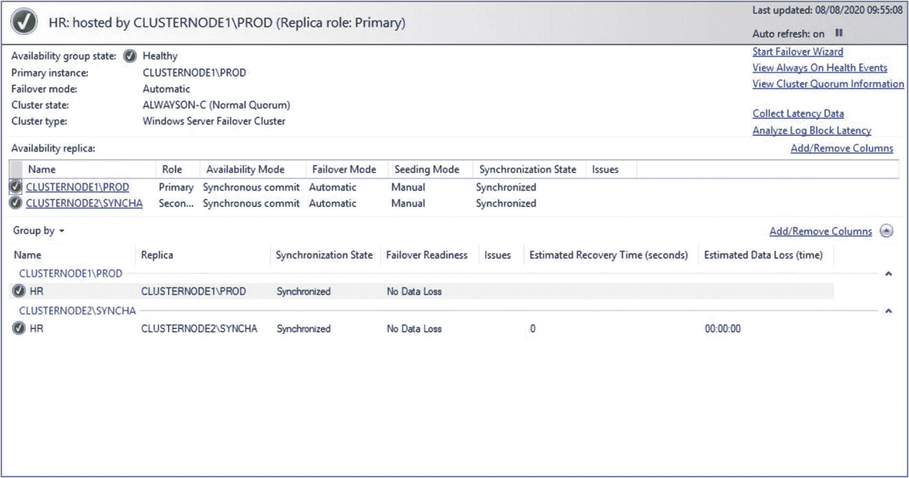

**图 9-1 可用性组仪表板**

注意：除了同步状态外，副本还具有以下操作状态之一：`PENDING_FAILOVER`、`PENDING`、`ONLINE`、`OFFLINE`、`FAILED`、`FAILED_NO_QUORUM` 和 `NULL`（当副本断开连接时）。可以使用 DMV `sys.dm_hadr_availability_replica_states` 查看副本的操作状态。

在报告的右上角，有指向故障转移向导（本章前面已讨论）、AlwaysOn 运行状况事件（下一节讨论）的链接，以及一个查看群集仲裁信息的链接。通过此链接调用的“群集仲裁信息”屏幕如图 9-2 所示。

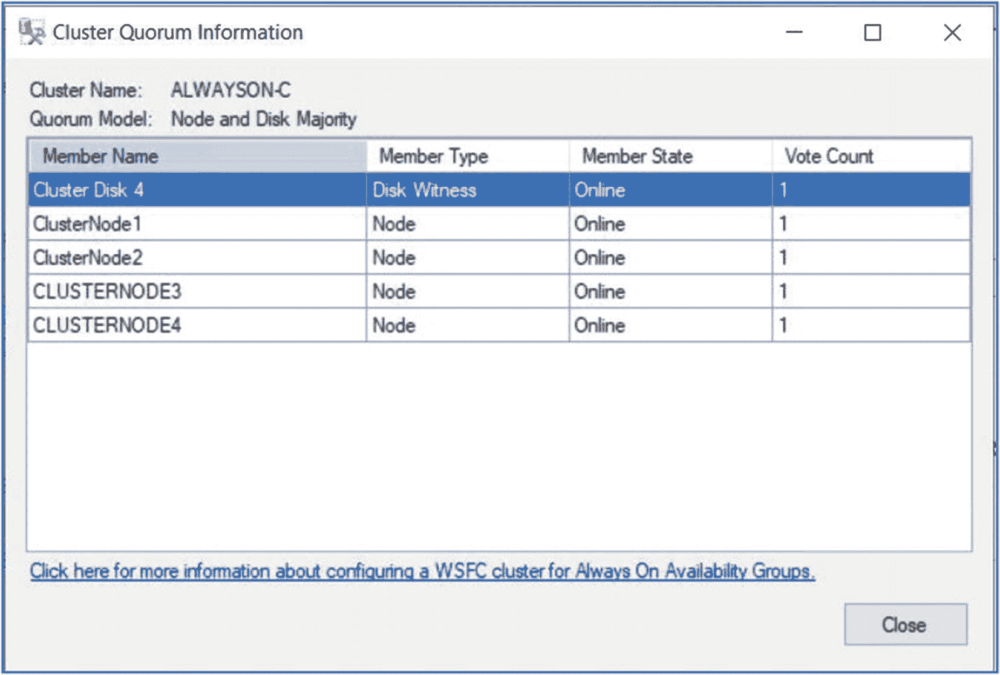

**图 9-2 群集仲裁信息屏幕**

“添加/删除列”链接将显示一个上下文菜单，您可以在其中动态地向显示中添加或删除列。图 9-3 显示已添加了“挂起”和“挂起原因”。

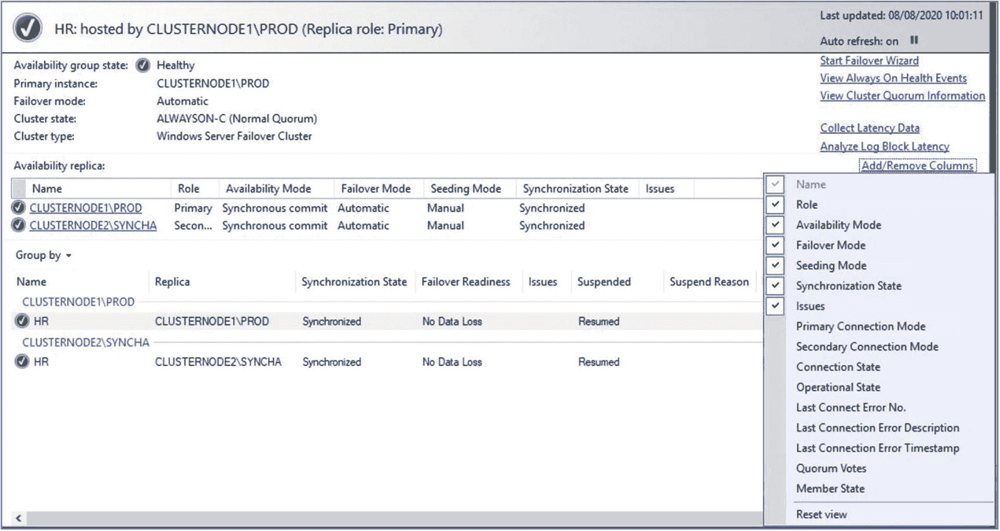

**图 9-3 添加/删除列**

您还可以在“可用性副本”窗口中深入查看每个副本，以查看特定于副本的详细信息。“分组依据”按钮允许您按副本、数据库、同步状态、故障转移准备情况或问题对可用性数据库进行分组。

## AlwaysOn 运行状况跟踪

AlwaysOn 运行状况跟踪是一个扩展事件会话，在您创建第一个可用性组时创建。它可以在 SQL Server Management Studio 中找到，位于“扩展事件”->“会话”下。通过其上下文菜单，您可以查看正在捕获的实时数据，也可以进入会话属性以更改捕获事件的配置。也可以通过 AlwaysOn 仪表板中的“查看 AlwaysOn 运行状况事件”链接访问。

深入查看该会话会显示会话包，从包的上下文菜单中，您可以查看先前捕获的事件。图 9-4 显示捕获的最新事件是数据库 5（在我们的例子中是 `HR`），它正在等待日志在同步副本上固化。

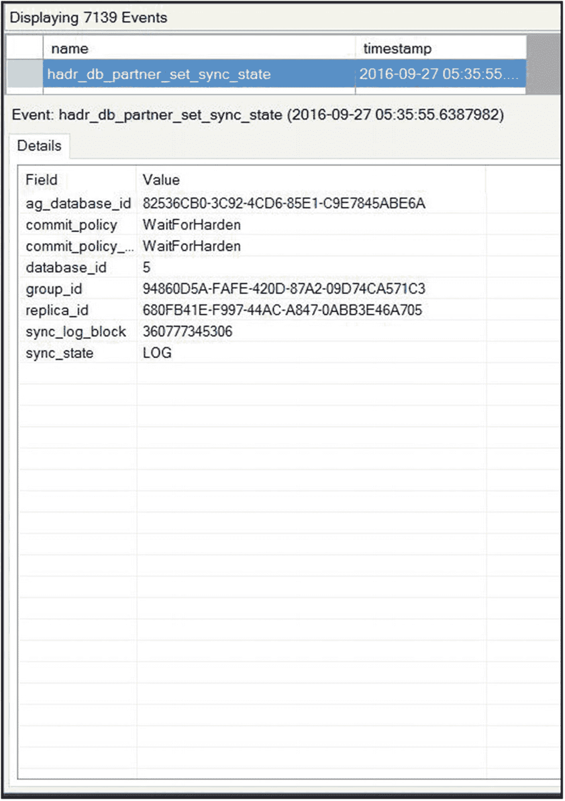

**图 9-4 目标数据**

在窗口顶部窗格中右键单击列标题将显示一个上下文菜单，该菜单允许您在特定列中搜索文本或值、按列中的值对结果集进行分组或按特定列对结果集进行排序。您还可以使用上下文菜单向结果集中添加或删除列。

## 使用扩展事件监控 AlwaysOn

扩展事件是 SQL Server 中的一个轻量级监控系统，它使用 WMI 捕获事件。由于其架构使用的系统资源非常少，因此扩展性很好，允许您在监控实例的同时对用户活动的影响最小。它们还具有高度可配置性，为您提供了从非常细粒度（例如页面拆分）到较粗粒度（例如 CPU 利用率）的捕获详细信息的广泛选项。您还可以将扩展事件与操作系统数据相关联，以便在排除问题时提供整体视图。扩展事件的前身是 SQL Trace 及其 GUI 工具 Profiler，该工具已弃用。

### 扩展事件概念

扩展事件具有丰富的架构，由事件、目标、操作、谓词、类型、映射和会话组成。这些对象存储在包内，而包又存储在模块中，该模块可以是 .dll 或可执行文件。我们将在以下部分讨论这些概念。

#### 包

包是扩展事件中使用的对象的容器。以下是 SQL Server 包的四种类型：

*   `Package0` – 默认包，用于扩展事件系统对象。
*   `Sqlserver` – 用于与 SQL Server 相关的对象。
*   `Sqlos` – 用于与 SQLOS 相关的对象。
*   `SecAudit` – 由 SQL 审核使用；但是，其对象未被公开。

#### 事件

事件是您感兴趣的发生现象，可以对其进行跟踪。它可能是一个 SQL 批处理完成、缓存未命中、页面拆分，或者根据您配置的跟踪性质，数据库引擎内可能发生的几乎任何其他事情。每个事件按通道和关键字（也称为类别）进行分类。通道是一个高级分类，SQL Server 2016 中的所有事件都属于表 9-1 中描述的通道之一。

**表 9-1 通道**

| 通道 | 描述 |
| --- | --- |
| Admin | 具有众所周知解决方案的众所周知的事件。例如，死锁、服务器启动、超过 CPU 阈值以及使用已弃用的功能。 |
| Operational | 用于排除问题。例如，检测到不良内存、AlwaysOn 可用性组副本更改其状态、检测到长时间 I/O，这些都是属于“操作”通道的事件。 |
| Analytic | 大量事件，您可用于排除性能等问题。例如，事务开始、获取锁、文件读取完成，这些都是属于“分析”通道的事件。 |
| Debug | 供开发人员通过返回内部数据来诊断问题。“调试”通道中的事件在 SQL Server 的未来版本中可能会更改，因此应尽可能避免使用它们。 |

关键字（或类别）则要细粒度得多。所有与 AlwaysOn 相关的事件都属于 `AlwaysOn` 和 `HADR` 类别。SQL Server 公开了 122 个与 AlwaysOn 相关的事件。这些事件列于表 9-2 中。

**表 9-2 AlwaysOn 事件**


### 始终启用事件列表

| 事件 | 描述 |
| --- | --- |
| `hadr_ddl_failover_execution_state` | 当 DDL 命令更改了可用性组故障转移状态时引发 |
| `hadr_transport_dump_message` | 在整个系统中跟踪 HADR 传输消息 |
| `hadr_transport_dump_config_message` | 跟踪 HADR 配置消息 |
| `hadr_transport_dump_failure_message` | 跟踪 HADR 故障消息 |
| `hadr_transport_dump_preconfig_message` | 跟踪 HADR 预配置消息 |
| `hadr_transport_dump_dropped_message` | 在整个系统中跟踪被丢弃的 HADR 传输消息 |
| `hadr_transport_session_state` | 当 HADR 传输会话状态改变时引发 |
| `hadr_transport_configuration_state` | 当会话状态改变时引发 |
| `hadr_transport_ucs_registration` | 当 UCS 注册状态改变时引发 |
| `hadr_transport_ucs_connection_info` | 当与始终启用传输副本关联的 USC 连接 ID 被注册或发生更改时引发 |
| `hadr_transport_flow_control_action` | 当特定副本发生流量控制操作时引发 |
| `hadr_database_flow_control_action` | 当特定副本发生流量控制操作时引发 |
| `hadr_db_manager_state` | 当 db_manager 的状态改变时引发 |
| `hadr_db_manager_lsn_sync_msg` | 跟踪日志序列号同步消息 |
| `hadr_db_manager_establish_db_msg` | 当建立数据库消息时引发 |
| `hadr_db_manager_status_change` | 跟踪 DBReplicaStatusChange 消息 |
| `hadr_db_manager_redo` | 跟踪辅助副本上的重做处理 |
| `hadr_db_manager_undo` | 跟踪辅助副本上的撤销处理 |
| `hadr_db_manager_db_queue_restart` | 为响应重启 hadron 数据库队列而触发 |
| `hadr_db_manager_db_startdb` | 为响应启动 hadron 数据库而触发 |
| `hadr_db_manager_db_shutdown` | 为响应关闭 hadron 数据库而触发 |
| `hadr_db_manager_user_control` | 为响应由始终启用控制的数据库用户状态更改而触发 |
| `hadr_db_manager_redo_control` | 跟踪由始终启用控制的数据库的日志扫描状态更改 |
| `hadr_db_manager_scan_control` | 跟踪由始终启用控制的数据库的日志扫描状态更改 |
| `hadr_db_manager_suspend_resume` | 为响应由始终启用控制的数据库的暂停/恢复状态更改而触发 |
| `hadr_db_manager_db_restart` | 为响应重新启动由始终启用控制的数据库而触发 |
| `hadr_worker_pool_thread` | 跟踪始终启用工作池线程操作 |
| `hadr_worker_pool_task` | 跟踪始终启用工作池任务操作 |
| `hadr_thread_pool_worker_start` | 跟踪始终启用线程池工作线程的启动操作 |
| `hadr_db_manager_page_request` | 跟踪服务器之间的页面请求/响应 |
| `hadr_db_commit_mgr_update_harden` | 为响应更新由始终启用控制的数据库的已固化日志序列号而触发 |
| `hadr_db_commit_mgr_harden_still_waiting` | 跟踪事务提交固化，仍在等待始终启用提交管理 |
| `hadr_db_commit_mgr_harden` | 跟踪来自始终启用提交管理的事务提交固化结果 |
| `hadr_db_commit_mgr_set_policy` | 为响应事务提交管理器策略更新而触发 |
| `hadr_db_partner_set_policy` | 为响应始终启用伙伴提交策略更新而触发 |
| `hadr_db_partner_set_sync_state` | 为响应始终启用伙伴的同步状态更改而触发 |
| `hadr_apr_added_corrupted_page` | 当自动页面修复添加了损坏的页面时触发 |
| `hadr_apr_repaired_page` | 当自动页面修复修复了损坏的页面时触发 |
| `hadr_apr_skipped_page_repair` | 当自动页面修复跳过页面修复时触发 |
| `hadr_apr_failed_page_repair` | 当自动页面修复添加了损坏的页面时触发 |
| `hadr_apr_sent_repair_request_for_page` | 当自动页面修复发送页面修复请求时触发 |
| `hadr_apr_received_page_repair_request` | 当自动页面修复收到页面修复请求时触发 |
| `hadr_apr_deffering_page_repair_request` | 当自动页面修复正在延迟页面修复请求时触发 |
| `hadr_apr_page_repair_failed` | 当自动页面修复未能修复页面时触发 |
| `hadr_undo_of_redo_log_scan` | 跟踪在重做的撤销过程中扫描的日志量，以及需要扫描的日志总量 |
| `hadr_db_manager_filemetadata_request` | 为响应服务器之间的文件元数据请求/响应而触发 |
| `hadr_capture_compressed_log_cache` | 跟踪压缩日志块缓存的命中/未命中率 |
| `hadr_db_manager_backup_sync_msg` | 为响应备份同步消息而触发 |
| `hadr_db_manager_backup_info_msg` | 为响应备份信息消息而触发 |
| `hadr_db_manager_primary_replica_file_list_msg` | 为响应主副本文件列表消息而触发 |
| `hadr_db_manager_seeding_request_msg` | 为响应种子设定请求消息而触发 |
| `hadr_physical_seeding_backup_state_change` | 为响应物理种子设定（在备份侧）的状态更改而触发 |
| `hadr_physical_seeding_restore_state_change` | 为响应物理种子设定（在还原侧）的状态更改而触发 |
| `hadr_physical_seeding_forwarder_state_change` | 为响应物理种子设定（在转发器侧）的状态更改而触发 |
| `hadr_physical_seeding_forwarder_target_state_change` | 为响应物理种子设定（在转发器目标侧）的状态更改而触发 |
| `hadr_physical_seeding_submit_callback` | 为响应物理种子设定提交回调而触发 |
| `hadr_physical_seeding_failure` | 为响应物理种子设定失败而触发 |
| `hadr_physical_seeding_progress` | 为响应物理种子设定进度而触发 |
| `hadr_physical_seeding_schedule_long_task_failure` | 为响应物理种子设定计划的长任务失败而触发 |
| `hadr_automatic_seeding_start` | 当自动种子设定操作提交时触发 |
| `hadr_automatic_seeding_state_transition` | 当自动种子设定操作状态改变时触发 |
| `hadr_automatic_seeding_success` | 当自动种子设定操作成功时触发 |
| `hadr_automatic_seeding_failure` | 当自动种子设定操作失败时触发 |
| `hadr_automatic_seeding_timeout` | 当自动种子设定操作超时时触发 |
| `hadr_filestream_file_open` | 当始终启用 FileStream 传输打开文件时触发 |
| `hadr_filestream_file_close` | 当始终启用 FileStream 传输关闭文件时触发 |
| `hadr_filestream_log_interpreter` | 当始终启用 FileStream 传输在解释日志时找到相关日志记录时触发 |
| `hadr_filestream_processed_block` | 当始终启用 FileStream 传输完成处理日志块时触发 |
| `hadr_filestream_directory_create` | 当始终启用 FileStream 传输创建目录时触发 |
| `hadr_filestream_corrupt_message` | 当始终启用 FileStream 传输检测到消息损坏时触发 |
| `hadr_filestream_message_block_end` | 当始终启用 FileStream 传输跟踪块结束消息时触发 |
| `hadr_filestream_message_dir_create` | 当始终启用 FileStream 传输跟踪目录创建消息时触发 |
| `hadr_filestream_message_file_write` | 当始终启用 FileStream 传输跟踪文件写入消息时触发 |
| `hadr_filestream_file_flush` | 当始终启用 FileStream 传输刷新文件时触发 |
| `hadr_filestream_file_set_eof` | 当始终启用 FileStream 传输设置文件结尾时触发 |
| `hadr_filestream_undo_inplace_update` | 当始终启用 FileStream 传输检测到需要撤销的就地更新时触发 |
| `hadr_filestream_message_file_request` | 当 HADR FileStream 传输跟踪文件写入消息时触发 |
| `hadr_wsfc_change_notifier_status` | 当 Windows Server 故障转移群集更改通知程序状态改变时触发 |
| `hadr_wsfc_change_notifier_start_ag_specific_notifications` | 当 Windows Server 故障转移群集更改通知程序开始接收可用性组特定通知时触发 |
| `hadr_wsfc_change_notifier_severe_error` | 当 Windows Server 故障转移群集更改通知程序遇到严重错误并将终止时触发 |
| `hadr_tds_synchronizer_payload_skip` | 当始终启用 TDS 监听器同步程序跳过一个侦听器有效负载时触发，因为自上一个有效负载以来没有更改 |
| `hadr_sql_instance_to_node_map_entry_deleted` | 在删除 SQL Server 实例到群集节点映射条目的 API 调用结束时触发 |
| `hadr_wsfc_change_notifier_node_not_online` | 当 Windows Server 故障转移群集更改通知程序检测到本地群集节点不在线时触发 |
| `hadr_online_availability_group_first_attempt_failure` | 如果首次尝试使始终启用可用性组资源联机失败则触发 |
| `hadr_online_availability_group_retry_end` | 当 SQL Server 已用尽所有重试尝试，或者 Windows Server 故障转移群集已接受使始终启用可用性组资源联机的命令时触发 |
| `hadr_ar_api_call` | 当对可用性副本进行 API 调用时触发 |
| `hadr_ar_manager_starting` | 当可用性组副本管理器正在启动时触发 |
| `hadr_ag_wsfc_resource_state` | 为响应 Windows Server 故障转移群集中可用性组的状态更改而触发 |
| `hadr_ag_database_api_call` | 为响应对可用性组数据库副本的 API 调用而触发 |
| `hadr_ag_lease_renewal` | 为响应可用性组租约续订而触发 |
| `hadr_ar_manager_mutex_acquisition_state` | 为响应用于同步可用性组管理器启动和关闭操作的可用性副本互斥锁获取状态而触发 |
| `hadr_ar_critical_section_entry_state` | 为响应可用性副本临界区条目状态而触发 |
| `hadr_ag_config_data_mutex_acquisition_state` | 为响应可用性组互斥锁获取状态而触发 |
| `hadr_database_replica_disjoin_completion` | 当数据库副本已完全从可用性组分离时触发 |
| `hadr_ar_controller_debug` | 当副本控制器输出调试消息时触发 |
| `hadr_apply_log_block` | 当辅助副本要将日志块追加到日志管理器时触发 |
| `hadr_capture_log_block` | 当主副本捕获了日志块时触发 |
| `hadr_capture_vlfheader` | 当主副本捕获了启动新虚拟文件的日志块时触发 |
| `hadr_apply_vlfheader` | 当辅助副本要应用虚拟日志文件头时触发 |
| `hadr_scan_state` | 当主或辅助数据库副本状态改变时触发 |
| `hadr_dump_log_block` | 当主副本发送或辅助副本接收日志块消息时触发 |
| `hadr_log_block_send_complete` | 在日志块消息发送完成后触发 |
| `hadr_dump_vlf_header` | 当主副本发送或辅助副本接收 vlfheader 消息时触发 |
| `hadr_dump_log_progress` | 当辅助副本发送进度消息时触发 |
| `hadr_dump_primary_progress` | 当主副本发送进度消息时触发 |
| `hadr_dump_sync_primary_progress` | 当同步辅助副本发送进度消息时触发 |
| `hadr_send_harden_lsn_message` | 不应使用此事件。它用于 Microsoft 内部测试 |
| `hadr_evaluate_readonly_routing_info` | 在本地主数据库副本上评估只读路由信息时触发 |
| `hadr_db_log_throttle` | 当数据库日志生成节流改变时触发 |
| `hadr_db_log_throttle_input` | 当 Fabric 日志管理组件更新日志节流时触发 |
| `hadr_db_marked_for_reseed` | 当辅助数据库落后主数据库太多并被标记为重新设定种子时触发 |
| `hadr_db_log_management_configuration_parameters` | 当读取自动日志管理配置时发生 |
| `hadr_db_long_running_xact_aborted` | 当系统强制终止长时间运行的事务以避免日志变满时触发 |
| `hadr_db_remote_harden_failure` | 当固化请求（属于提交或准备的一部分）由于远程故障而失败时触发 |
| `hadr_partner_log_send_transition` | 为响应日志写入器和日志捕获器之间的日志发送转换而触发 |
| `hadr_partner_restart_scan` | 当副本在重新启动时扫描其伙伴时触发 |
| `hadr_transport_sync_send_failure` | 当传输中的同步发送失败时触发 |
| `hadr_xrf_deleteAllXrf_beforeEntry` | 在删除所有扩展恢复分支之前立即触发 |
| `hadr_xrf_deleteRecLsn_beforeEntry` | 在从元数据中删除恢复日志序列号之前立即触发 |
| `hadr_xrf_updateXrf_partialUpdate` | 在更新辅助副本的恢复分支堆栈期间触发。具体来说，它在删除辅助堆栈中的多余条目之后，但在从主副本复制新条目之前触发 |
| `hadr_xrf_updateXrf_before_recoveryLsn_update` | 在更新辅助副本的恢复分支堆栈期间触发。具体来说，它在更新堆栈之后，但在保存恢复日志序列号到元数据之前触发 |
| `hadr_xrf_copyXrf_partialCopy` | 在删除辅助副本的堆栈条目之后，但在复制主副本的条目之前触发 |
| `alwayson_ddl_executed` | 当执行始终启用 DDL 语句时触发 |
| `availability_replica_state` | 当可用性副本正在启动或关闭时触发 |
| `availability_replica_state_change` | 当可用性副本的状态发生改变时触发 |
| `availability_replica_manager_state_change` | 当可用性副本管理器的状态发生改变时触发 |
| `availability_group_lease_expired` | 当群集与可用性组之间存在连接问题，导致无法续订租约时触发 |
| `availability_replica_automatic_failover_validation` | 当故障转移验证副本作为主副本的就绪状态时触发 |
| `availability_replica_database_fault_reporting` | 当数据库向可用性副本管理器报告故障时触发 |
| `before_redo_lsn_update` | 在更新 EOL 日志序列号之前立即触发 |
| `read_only_route_complete` | 当只读路由操作成功完成时触发 |
| `read_only_route_fail` | 当只读路由操作失败时触发 |


#### 目标

目标是事件的消费者；本质上，它是跟踪数据将被写入的设备。SQL Server 2016 中可用的目标详见表 9-3。

**表 9-3**
目标

| 目标 | 同步/异步 | 描述 |
| --- | --- | --- |
| 事件计数器 | 同步 | 统计会话期间发生的事件数量 |
| 事件文件 | 异步 | 将事件输出写入内存缓冲区，然后刷新到磁盘 |
| 事件配对 | 异步 | 确定一个配对事件是否在其匹配事件缺失的情况下发生，例如，一个语句开始但从未完成 |
| ETW (Windows 事件跟踪) | 同步 | 用于将扩展事件与操作系统数据关联 |
| 直方图 | 异步 | 根据操作或事件列，统计会话期间发生的事件数量 |
| 环形缓冲区 | 异步 | 使用先进先出（FIFO）方法将数据存储在内存缓冲区中 |

#### 操作

也称为全局字段，操作是当事件触发时允许捕获附加信息的命令。操作在事件发生时同步触发，且事件并不知晓操作的存在。共有 50 个可用操作，允许你捕获丰富的信息，包括导致事件触发的语句、语句运行的安全上下文、事务 ID、CPU ID 以及调用堆栈。

#### 谓词

谓词是系统在将事件发送到目标之前可以应用的过滤条件。可以创建简单的谓词，例如根据数据库 ID 过滤完成的语句，但也可以创建更复杂的谓词，例如仅捕获 AlwaysOn 可用性组副本的角色变更，且该变更发生超过两次的情况。

谓词还完全支持短路求值。这意味着如果你在一个谓词中使用多个条件，那么谓词的顺序很重要，因为如果第一个谓词的求值失败，第二个谓词将不会被求值。由于谓词是同步求值的，这可能会影响性能。因此，明智的做法是设计你的谓词，将最不可能求值为 true 的谓词放在非常可能求值为 true 的谓词之前。

例如，假设你计划基于特定数据库（数据库 ID 为 `6`）进行过滤，但该数据库在实例活动中占比很高。你还计划基于特定用户 ID（`UserA`）进行过滤，该用户负责的活动占比很低。在此场景中，你会使用以下谓词，首先过滤掉与 `UserA` 无关的活动，然后再过滤掉与数据库 ID `6` 无关的活动。

```
WHERE (([sqlserver].[username]='UserA') AND ([sqlserver].[database_id]=(6)))
```

#### 类型

包中的所有对象都被分配了一个类型。此类型用于解释存储在对象字节集合中的数据。对象被分配为以下类型之一：

*   操作
*   事件
*   谓词比较（从事件中检索数据）
*   谓词源（比较数据类型）
*   目标
*   类型

#### 映射

映射是一种字典，它将内部 ID 值映射为数据库管理员可以理解的字符串。映射键仅在其上下文中唯一，并在不同上下文之间重复。例如，在 `statement_recompile_cause` 上下文中，`map_key` 为 1 对应于 `map_value` 为 `Schema Changed`。然而，在 `database_sql_statement` 类型的上下文中，`map_key` 为 1 对应于 `map_value` 为 `CREATE DATABASE`。你可以使用 `sys.dm_xe_map_values` 动态管理视图查找完整的映射列表。

#### 会话

会话本质上是一个跟踪。它可以包含来自多个包、操作、目标和谓词的事件。当你启动或停止会话时，就是在打开或关闭跟踪。当会话启动时，事件被写入内存缓冲区，并在发送到目标之前应用谓词。因此，在创建会话时，你需要配置属性，例如会话可用于缓冲的内存量、在会话遇到内存压力时可以丢弃哪些事件，以及事件发送到目标之前的最大延迟。


### 创建事件会话以监控可用性组

你可以使用新建会话向导、新建会话对话框或通过 T-SQL 来创建事件会话。若要使用新建会话向导创建会话，请在对象资源管理器中依次展开 `Management` ➤ `Extended Events`，然后从 `Sessions` 的上下文菜单中选择 `新建会话向导`。这将显示新建会话向导的“简介”页面。

### 设置会话属性页面

通过“简介”页面后，你将看到“设置会话属性”页面，如图 9-5 所示。在此处，你可以配置会话的名称，并指定会话是否应在创建时自动启动。

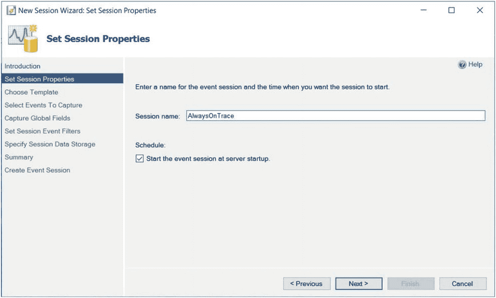

图 9-5：设置属性页面

### 选择模板页面

在向导的“选择模板”页面（如图 9-6 所示）上，你可以选择预定义的模板（这将为你提供常用会话的起点），也可以从空白画布开始手动定义整个会话。我们将选择后者。

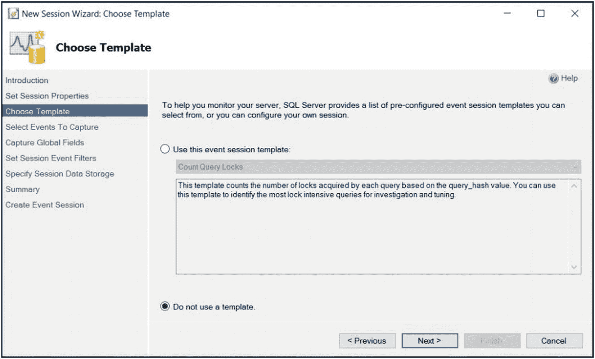

图 9-6：选择模板页面

### 选择要捕获的事件页面

图 9-7 展示了“选择要捕获的事件”页面。在这里，我们可以选择要包含在会话中的事件。为了本次演示的目的，假设我们经常看到辅助副本落后于主副本，并且我们正在尝试确定原因。具体来说，是否存在 I/O 瓶颈？由于我们试图回答一个非常具体的问题，因此要选择的事件就很明确了。我们需要 `hadr_db_marked_for_reseed` 事件来确定辅助副本何时落后，还需要 `long_io_detected` 事件，以便我们可以关联时间点，看看是否存在某种模式。

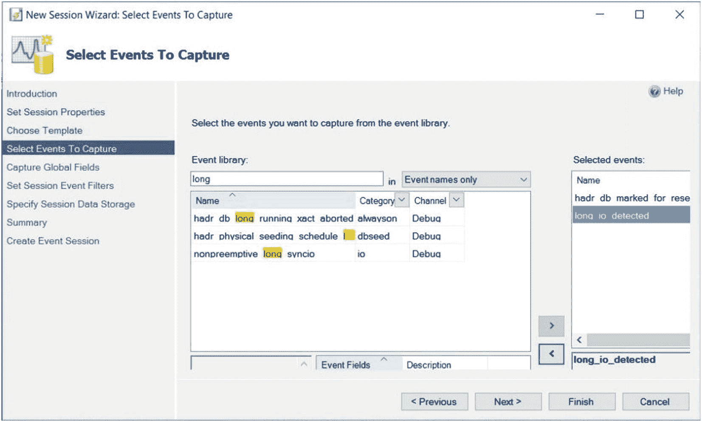

图 9-7：选择要捕获的事件页面

### 捕获全局字段页面

“捕获全局字段”页面允许我们指定希望捕获的任何操作。在我们的场景中，我们将捕获 `NT 用户名` 和 `SQL 文本` 操作。这将使我们能够追溯任何长时间的 I/O 操作，以查看它们是否由低效的查询引起。“捕获全局字段”页面如图 9-8 所示。

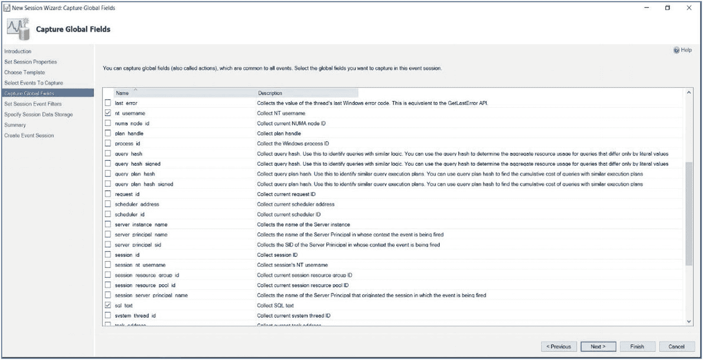

图 9-8：捕获全局字段页面

### 设置会话事件筛选器页面

“设置会话事件筛选器”页面（如图 9-9 所示）允许你为会话配置谓词。我们将配置一个筛选系统数据库上操作的谓词。

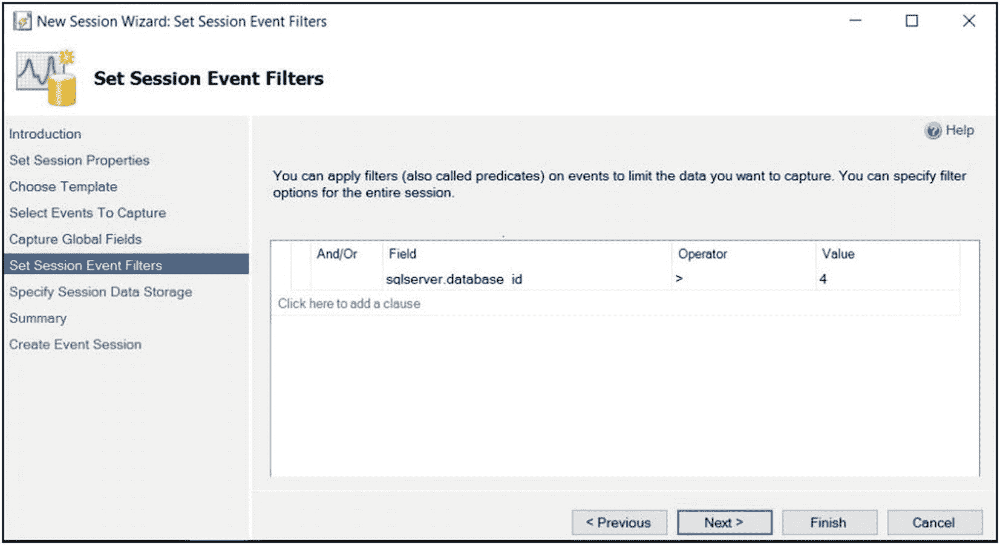

图 9-9：设置会话事件筛选器页面

### 指定会话数据存储页面

向导的“指定会话数据存储”页面是我们可以配置目标的位置。向导提供了 `文件` 或 `环形缓冲区` 目标的选项，以及指定大小和回滚选项。我们将配置 `文件` 目标，如图 9-10 所示。

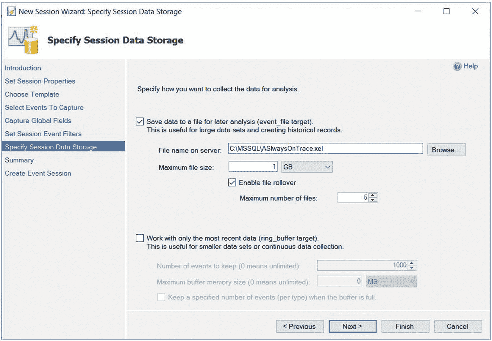

图 9-10：指定会话数据存储

### 摘要与完成

向导的“摘要”页面将确认向导将执行的操作。创建会话后，“完成”页面将提供退出时查看实时数据的选项。

### 通过 T-SQL 创建相同的会话

若要使用 T-SQL 创建相同的会话，你可以使用清单 9-1 中的脚本。

```
CREATE EVENT SESSION AlwaysOnTrace ON SERVER
ADD EVENT sqlserver.hadr_db_marked_for_reseed(
    ACTION(sqlserver.nt_username,sqlserver.sql_text)
    WHERE (sqlserver.database_id>(4))),
ADD EVENT sqlserver.long_io_detected(
    ACTION(sqlserver.nt_username,sqlserver.sql_text)
    WHERE (sqlserver.database_id>(4)))
ADD TARGET package0.event_file(SET filename='C:\MSSQL\ASlwaysOnTrace.xel')
WITH (MAX_MEMORY=4096 KB,EVENT_RETENTION_MODE=ALLOW_SINGLE_EVENT_LOSS,MAX_DISPATCH_LATENCY=30 SECONDS,MAX_EVENT_SIZE=0 KB,MEMORY_PARTITION_MODE=NONE,TRACK_CAUSALITY=OFF,STARTUP_STATE=ON) ;
```

清单 9-1：创建事件会话

### CREATE EVENT SESSION 参数

`CREATE EVENT SESSION` DDL 语句接受表 9-4 中详述的参数。

表 9-4：CREATE EVENT SESSION 参数

| 参数 | 描述 |
| --- | --- |
| `event_session_name` | 指定你正在创建的事件会话的名称 |
| `ADD EVENT` / `SET` | 为添加到会话的每个事件重复此操作，后跟事件名称，格式为 `package.event`。你可以使用 `SET` 语句设置事件特定的自定义，例如包含非强制性事件字段 |
| `ACTION` | 如果需要为该事件捕获全局字段，则在每个 `ADD EVENT` 参数后指定 |
| `WHERE` | 如果该事件应有关联的谓词，则在每个 `ADD EVENT` 参数后指定 |
| `ADD TARGET` / `SET` | 为将添加到会话的每个目标指定。你可以使用 `SET` 语句来填充目标特定的参数，例如 `event_file` 目标的 `filename` 参数 |

### CREATE EVENT SESSION WITH 选项

`CREATE EVENT SESSION` 语句还接受许多 `WITH` 选项，这些选项在表 9-5 中有详细说明。

表 9-5：CREATE EVENT SESSION WITH 选项

| WITH 选项 | 描述 |
| --- | --- |
| `MAX_MEMORY` | 指定事件会话在将事件分派到目标之前可用于缓冲事件的最大内存量 |
| `EVENT_RETENTION_MODE` | 指定缓冲区变满时的行为。可接受的值包括：`ALLOW_SINGLE_EVENT_LOSS`，表示如果所有缓冲区已满，则可能丢失单个事件；`ALLOW_MULTIPLE_EVENT_LOSS`，表示如果所有缓冲区已满，则可能丢失整个缓冲区；`NO_EVENT_LOSS`，表示导致事件触发的任务将等待，直到缓冲区中有空间 |
| `MAX_DISPATCH_LATENCY` | 指定事件在刷新到目标之前可以在会话缓冲区中驻留的最长时间，以秒为单位 |
| `MAX_EVENT_SIZE` | 指定来自任何单个事件的事件数据的最大可能大小。可以千字节或兆字节为单位指定，且应仅配置为允许大于 `MAX_MEMORY` 设置的事件 |
| `MEMORY_PARTITION_MODE` | 指定事件缓冲区的创建位置。可接受的值包括：`NONE` – 表示将在实例内创建缓冲区；`PER_NODE` – 表示将为每个 NUMA 节点创建缓冲区；`PER_CPU` – 表示将为每个 CPU 创建缓冲区 |
| `TRACK_CAUSALITY` | 指定将为每个事件存储一个额外的 GUID 和序列号，以便可以关联事件 |
| `STARTUP_STATE` | 指定会话是否在实例启动时自动启动。`ON` 表示启动；`OFF` 表示不启动 |

**提示**  
关于扩展事件的更深入讨论，我强烈推荐 Apress 出版的书籍《*Pro SQL Server 2019 Administration*》，可从 [`www.apress.com/gp/book/9781484250884`](http://www.apress.com/gp/book/9781484250884) 购买。


## 概述

SQL Server 为监控 AlwaysOn 可用性组的运行状况提供了丰富的工具。AlwaysOn 仪表板是 SQL Server Management Studio 中的一个交互式报告，它可以让您评估可用性组和副本的运行状况。它还提供了查看仲裁配置信息和实时运行状况数据的链接。

实时运行状况数据由扩展事件会话捕获，该会话在您在实例上创建第一个可用性组时创建，并在后台运行，捕获预先配置的事件。可以自定义此跟踪；如果您需要自定义捕获，我建议保留默认配置并创建一个新的事件会话。

创建事件会话允许您根据需求捕获非常细粒度的关注点，或者仅捕获较粗粒度的信息。扩展事件使用 WMI 实现，是一个非常轻量级的框架，这意味着您可以在不影响实例性能的情况下识别问题和趋势。

# 10. 故障排除 AlwaysOn

SQL Server 提供了大量与高可用性和灾难恢复对象相关的元数据，尤其是围绕 AlwaysOn 功能集。这些元数据可用于快速识别配置、查找问题的根本原因，或为可能发生的事件编写自动化响应脚本。以下部分将讨论可用的元数据，并提供如何使用它的示例。

## AlwaysOn 故障转移群集实例元数据

从数据库引擎内部，可以查看有关群集实例及其承载它的 Windows 群集的大量元数据。这些信息对 DBA 来说非常有价值。以下部分将介绍一些最有用和最有趣的元数据对象。

### 发现实例所在的节点

DBA 自然需要知道群集中哪个节点承载着故障转移群集实例，尤其是在尝试诊断连接或性能问题时。但是，如果贵组织有策略规定 DBA 不允许访问操作系统，则无法使用故障转移管理器。幸运的是，SQL Server 中有一个 DMV（动态管理视图）可以公开此信息。`sys.dm_os_cluster_nodes` DMV 将返回表 10-1 中详述的列。

表 10-1
`sys.dm_os_cluster_nodes` 的列

| 列 | 描述 |
| --- | --- |
| `NodeName` | 群集节点的名称 |
| `status` | 节点的当前状态。可能的值有：• 0 – 表示节点已启动• 1 – 表示节点已关闭• 2 – 表示节点已暂停• 3 – 表示节点当前正在加入群集• 4 – 表示状态未知 |
| `status_description` | 状态的文字描述。可能的值有：• 已启动• 已关闭• 已暂停• 正在加入• 未知 |
| `is_current_owner` | 指示实例当前是否由此节点承载。可能的值有：• 0 – 表示节点不拥有该实例• 1 – 表示节点拥有该实例 |

清单 10-1 中的查询将返回当前承载实例的群集节点的名称。

```sql
SELECT NodeName
FROM sys.dm_os_cluster_nodes
WHERE is_current_owner = 1 ;
```
清单 10-1
发现承载实例的节点

### 查看运行状况检查配置

如果 DBA 正在协助 Windows 管理团队处理群集实例的重复故障转移，他可能希望公开哪些条件可能导致故障转移的详细信息，以确保配置了适当的级别。这可以通过使用 `sys.dm_os_cluster_properties` DMV 实现，该 DMV 返回表 10-2 中详述的列。

表 10-2
`sys.dm_os_cluster_properties` 的列

| 列 | 描述 |
| --- | --- |
| `VerboseLogging` | 指示群集使用的日志记录级别。可能的值有：• 0 – 表示日志记录已关闭• 1 – 表示仅记录错误• 2 – 表示记录错误和警告 |
| `SQLDumperDumpFlags` | 指定 SQLDumper 将生成的转储文件类型。可能的值有：• 0x0120 – 表示小型转储• 0x0110 – 表示完整转储• 0x8100 – 表示筛选的转储 |
| `SQLDumperDumpPath` | 指定 SQLDumper 将输出转储文件的文件路径 |
| `SQLDumperDumpTimeOut` | SQLDumper 创建转储文件时的超时值。以毫秒为单位指定 |
| `FailureConditionLevel` | 将导致发生故障转移的故障级别。故障条件级别的完整说明可在表 10-3 中找到 |
| `HealthCheckTimeout` | 数据库引擎在判定实例无响应之前，等待返回运行状况信息的持续时间 |

`FailureConditionLevel` 列返回的可能的故障条件级别在表 10-3 中详述。

表 10-3
故障条件级别

| 条件级别 | 描述 |
| --- | --- |
| 0 | 不会发生自动故障转移 |
| 1 | 当 SQL Server 服务关闭时发生自动故障转移 |
| 2 | 当满足以下条件时将发生自动故障转移：• 满足级别 1 的条件• 超过 `HealthCheckTimeout` 值 |
| 3 | 当满足以下条件时将发生自动故障转移：• 满足级别 2 的条件• 运行状况检查返回系统错误 |
| 4 | 当满足以下条件时将发生自动故障转移：• 满足级别 3 的条件• 运行状况检查返回资源错误 |
| 5 | 当满足以下条件时将发生自动故障转移：• 满足级别 4 的条件• 运行状况检查返回查询处理错误 |

清单 10-2 中的查询将返回当前的故障转移条件级别和当前的运行状况检查超时值。

```sql
SELECT
FailureConditionLevel
, HealthCheckTimeout
FROM sys.dm_os_cluster_properties ;
```
清单 10-2
返回运行状况检查配置

可以使用 `sp_server_diagnostics` 系统存储过程手动确定实例的当前运行状况。该过程接受一个参数：`@repeat_interval`，它指定过程应返回结果的频率，以秒为单位。如果省略该参数，则结果将仅返回一次。如果为该参数传递了一个值，则该值必须大于 5。该过程返回表 10-4 中详述的结果集。

表 10-4
`sp_server_diagnostics` 返回的列


| 列 | 说明 |
| --- | --- |
| `creation_time` | 指示行创建的时间 |
| `component_type` | 指示组件的类型。可能的值为：• 实例 • AlwaysOn：可用性组 |
| `component_name` | 指示组件的名称。可能的值为：• system • resource • query_processing • io_subsystem • events • [可用性组名称] |
| `state` | 组件的运行状况状态。可能的值为：• 0 – 状态未知 • 1 – 状态为正常（意味着运行状况良好） • 2 – 存在警告 • 3 – 存在错误 |
| `state_desc` | 组件状态的文本描述。可能的值为：• Unknown • Clean • Warnings • Errors |
| `data` | 组件特定数据的 XML 表示形式。例如，资源组件包含指定可用物理内存和可用虚拟内存的元素。它还包括诸如内存不足异常计数之类的属性 |

清单 10-3 中的脚本将返回 `sp_server_diagnostics` 系统存储过程的完整结果集，以及从 XML 列中提取（Shredding）出来的值，以便快速查看服务器整体 CPU 利用率、实例的 CPU 利用率以及可能已发生的内存不足异常计数。

提示

关于 XML 提取（Shredding）的讨论超出了本书的范围。不过，我推荐 Apress 出版的 `《SQL Server DBA 高级脚本与自动化实战》`（Expert Scripting and Automation for SQL Server DBAs），其中可以找到关于为管理目的使用 XML 的讨论。该书可在 `www.apress.com/9781484219423` 购买。

```
CREATE TABLE #Server_Diagnostics
(
creation_time      DATETIME,
component_type     NVARCHAR(8),
component_name     NVARCHAR(128),
[state]            TINYINT,
state_desc         NVARCHAR(8),
[data]             XML
) ;
INSERT INTO #Server_Diagnostics
EXEC sp_server_diagnostics ;
SELECT *,
data.value('(/system/@systemCpuUtilization)[1]','int') AS SystemCPUUtilization
,data.value('(/system/@sqlCpuUtilization)[1]','int') AS SQLServerCPU
,data.value('(/resource/@outOfMemoryExceptions)[1]','int') AS OutOfMemoryExceptions
FROM ##Server_Diagnostics ;
DROP TABLE #Server_Diagnostics ;
```

清单 10-3 检索诊断信息

## AlwaysOn 可用性组元数据

元数据也可用于排查可用性组的问题。以下部分将讨论一些与可用性组相关且最有用和有趣的元数据对象。

### 确定上次故障转移的原因

如果一个可用性组发生了故障转移，您可能首先想回答的问题之一就是“何时以及为何发生？”。这个问题可以使用 `sys.dm_hadr_availability_replica_states` DMV 来回答。此对象返回表 10-5 中详述的列。

表 10-5 sys.dm_hadr_availability_replica_states

| 列 | 说明 |
| --- | --- |
| `replica_id` | 副本的 GUID |
| `group_id` | 可用性组的 GUID |
| `is_local` | 指示副本是本地还是远程。可能的值为：• 0 – 指示远程辅助副本 • 1 – 指示本地副本 |
| `role` | 指示当前分配给副本的角色。可能的值为：• 0 – 角色当前正在解析中 • 1 – 副本具有主角色 • 2 – 副本当前具有辅助角色 |
| `role_desc` | 副本当前角色的文本描述。可能的值为：• RESOLVING • PRIMARY • SECONDARY |
| `operational_state` | 指示副本的当前操作状态。可能的值为：• 0 – 故障转移挂起 • 1 – 状态挂起 • 2 – 联机 • 3 – 脱机 • 4 – 失败 • 5 – 失败，且无仲裁 • NULL – 副本不是本地 |
| `operational_state_desc` | 操作状态的文本描述。可能的值为：• PENDING_FAILOVER • PENDING • ONLINE • OFFLINE • FAILED • FAILED_NO_QUORUM • NULL |
| `connected_state` | 指示辅助副本当前是否已连接到主副本。可能的值为：• 0 – 副本与主副本断开连接 • 1 – 副本已连接到主副本 |
| `connected_state_desc` | 连接状态的文本描述。可能的值为：• DISCONNECTED • CONNECTED |
| `recovery_health` | 指示可用性组内的数据库是否联机。可能的值为：• 0 – 至少有一个数据库未联机 • 1 – 所有数据库都联机 • NULL – 可用性组不是本地 |
| `recovery_health_desc` | recovery_health 的文本描述。可能的值为：• ONLINE_IN_PROGRESS • ONLINE • NULL |
| `synchronization_health` | 指示可用性组数据库的同步状态。可能的值为：• 0 – 至少有一个数据库处于“未同步”状态。这称为“不健康” • 1 – 至少有一个数据库未处于理想同步状态。这称为“部分健康”。理想状态为： • SYNCHRONIZED – 对于同步提交副本 • SYNCHRONIZING – 对于异步提交副本 • 2 – 所有数据库都处于理想状态。这称为“健康” |
| `synchronization_health_desc` | 同步运行状况状态的文本描述。可能的值为：• NOT_HEALTHY • PARTIALLY_HEALTHY • HEALTHY |
| `last_connect_error_number` | 上次连接错误的错误号 |
| `last_connect_error_description` | 上次连接错误的描述 |
| `last_connect_error_timestamp` | 上次连接错误的日期和时间 |

清单 10-4 中的查询演示了如何返回上次连接错误的时间和原因。这将指示故障转移发生的时间和原因。每个副本和可用性组的组合将返回一行。您会注意到，我们将 `sys.dm_hadr_availability_replica_states` DMV 与 `sys.availability_replicas` 和 `sys.availability_groups` DMV 进行联接，以检索承载副本的节点名称和可用性组的名称。

```
SELECT
ar.replica_server_name
,ag.name
,ars.last_connect_error_description
,ars.last_connect_error_timestamp
FROM sys.dm_hadr_availability_replica_states ars
INNER JOIN sys.availability_replicas ar
ON ar.group_id = ars.group_id
AND ars.replica_id = ar.replica_id
INNER JOIN sys.availability_groups ag
ON ag.group_id = ar.group_id ;
```

清单 10-4 确定上次故障转移的时间和原因

### 评估可用性数据库的状态

您可能已经注意到，`sys.dm_hadr_availability_replica_states` DMV 会提供包含不健康数据库的可用性组的详细信息。然而，其结果不够细致，无法让您发现具体哪些数据库不健康。这些信息可以从 `sys.dm_hadr_database_replica_states` DMV 检索，该 DMV 返回表 10-6 中详述的列。

表 10-6 sys.dm_hadr_database_replica_states 列


# 数据库可用性状态参考

| 列名 | 描述 |
| --- | --- |
| `database_id` | 数据库的 ID |
| `group_id` | 可用性组 GUID |
| `replica_id` | 可用性副本 GUID |
| `group_database_id` | 数据库在可用性组内的 ID |
| `is_local` | 指示数据库是本地的还是远程的。可能的取值为：• 0 – 指示数据库不是此实例本地的• 1 – 指示数据库是此实例本地的 |
| `is_primary_replica` | 指示数据库副本当前的角色是主副本还是辅助副本。可能的取值为：• 0 – 指示辅助数据库副本• 1 – 指示主数据库副本 |
| `synchronization_state` | 指示数据库同步的状态。可能的取值为：• 0 – 指示未同步• 1 – 指示正在同步• 2 – 指示已同步• 3 – 指示状态正在还原。这意味着辅助副本正处于撤销阶段的一部分，正在从主副本检索页面• 4 – 指示状态正在初始化。这意味着辅助副本正处于撤销阶段的一部分，此时所需的日志记录正在传输和硬化 |
| `synchronization_state_desc` | 同步状态的文本描述。可能的取值为：• NOT SYNCHRONIZING• SYNCHRONIZING• SYNCHRONIZED• REVERTING• INITIALIZING |
| `is_commit_participant` | 指示事务提交是否同步。异步副本上的数据库将始终报告 0，并且该值仅对同步副本上的主数据库准确。可能的取值为：• 0 – 指示事务提交未同步• 1 – 指示事务提交已同步 |
| `synchronization_health` | 指示数据库的同步运行状况。可能的取值为：• 0 – 指示不正常。这意味着数据库未同步• 1 – 指示部分正常。这意味着数据库正在同步• 2 – 指示正常。这意味着数据库已同步 |
| `synchronization_health_desc` | 同步运行状况的文本描述。可能的取值为：• NOT_HEALTHY• PARTIALLY_HEALTHY• HEALTHY |
| `database_state` | 指示数据库的当前状态。该值反映 `sys.databases` 目录视图中的值。可能的取值为：• 0 – 指示数据库联机• 1 – 指示数据库正在还原• 2 – 指示数据库正在恢复• 3 – 指示数据库处于等待恢复的状态• 4 – 指示数据库疑似• 5 – 指示数据库处于紧急模式• 6 – 指示数据库脱机 |
| `database_state_desc` | 数据库状态的文本描述。可能的取值为：• ONLINE• RESTORING• RECOVERING• RECOVERY_PENDING• SUSPECT• EMERGENCY• OFFLINE |
| `is_suspended` | 指示数据库是否已挂起。可能的取值为：• 0 – 指示已恢复• 1 – 指示已挂起 |
| `suspend_reason` | 如果数据库已挂起，`suspend_reason` 列将指示原因。可能的取值为：• 0 – 指示用户手动挂起了数据移动• 1 – 指示在强制故障转移后挂起• 2 – 指示在重做阶段发生错误• 3 – 指示在日志捕获期间发生错误• 4 – 指示在写入日志时发生错误• 5 – 指示在重启前数据库已挂起• 6 – 指示在撤销阶段发生错误• 7 – 指示日志链不匹配错误• 8 – 指示在计算辅助副本的同步点时发生错误 |
| `suspend_reason_desc` | `suspend_reason` 列的文本描述。可能的取值为：• SUSPEND_FROM_USER• SUSPEND_FROM_PARTNER• SUSPEND_FROM_REDO• SUSPEND_FROM_CAPTURE• SUSPEND_FROM_APPLY• SUSPEND_FROM_RESTART• SUSPEND_FROM_UNDO• SUSPEND_FROM_REVALIDATION• SUSPEND_FROM_XRF_UPDATE |
| `recovery_lsn` | 在主副本上，`recovery_lsn` 指示事务日志的结尾（事务日志中用于时间点恢复的最终点）。在辅助副本上，此列指示需要重新同步的点。但是，如果该值大于或等于 `last_hardened_lsn`，则表示不需要重新同步 |
| `truncation_lsn` | 对于主副本，此列指示所有辅助副本中的最小日志截断 LSN。对于辅助副本，此列指示该特定数据库副本的日志截断点 |
| `last_sent_lsn` | 指示已发送的最后一个日志块的结尾 |
| `last_sent_time` | 发送最后一个日志块的日期和时间 |
| `last_recieved_lsn` | 指示已接收的最后一个日志块的结尾 |
| `last_hardened_lsn` | 指示已硬化的最后一个日志块的开始。对于异步提交副本，该值将为 `NULL` |
| `last_hardened_time` | 已硬化 LSN 的日期和时间 |
| `last_redone_lsn` | 在辅助副本上重做的最后一个日志记录的 LSN |
| `last_redone_time` | 在辅助副本上重做的最后一个 LSN 的时间戳 |
| `log_send_queue_size` | 尚未发送到辅助副本的日志记录的大小（以千字节为单位） |
| `log_send_rate` | 日志记录被发送到辅助副本的速度（以千字节/秒为单位） |
| `filestream_send_rate` | FILESTREAM 文件被发送到辅助副本的速度（以千字节/秒为单位） |
| `end_of_log_lsn` | 日志缓存中最终日志记录的 LSN |
| `last_commit_lsn` | 事务日志中最后一个已提交事务的 LSN |
| `last_commit_time` | 事务日志中最后一个已提交 LSN 的时间戳 |
| `low_water_mark_for_ghosts` | 幽灵清理任务（物理删除已逻辑删除的行）使用此列在所有数据库副本中的最小值来确定从何处开始清理记录 |
| `secondary_log_seconds` | 辅助副本落后于主副本的秒数 |

清单 10-5 中的脚本演示了如何评估 HR 可用性组内的可用性数据库运行状况。您会注意到，我们使用 `DB_NAME()` 函数返回数据库的名称，并将 `sys.dm_hadr_database_replica_states` DMV 与 `sys.availability_groups` 和 `sys.availability_replicas` 目录视图联接，以返回可用性组和副本的名称。

```sql
SELECT
DB_NAME(database_id)
,ag.name
,ar.replica_server_name
,is_primary_replica
,synchronization_state_desc
,synchronization_health_desc
,database_state_desc
FROM sys.dm_hadr_database_replica_states drs
INNER JOIN sys.availability_groups ag
ON drs.group_id = ag.group_id
INNER JOIN sys.availability_replicas ar
ON drs.replica_id = ar.replica_id
WHERE ag.name = 'HR';
清单 10-5
评估可用性数据库的状态
```


## 总结

SQL Server 提供了大量元数据，可帮助您进行故障排除并审核配置。虽然本章节讨论了一些最有用的元数据，但我强烈建议您进一步探索 `hadr` 相关的 DMV。

对于故障转移群集实例，`sys.dm_os_cluster_nodes` DMV 可显示群集中各节点的运行状况状态。更详细的故障排除信息可通过调用系统存储过程 `sp_server_diagnostics` 获取。

## 提示

系统存储过程 `sp_server_diagnostics` 也可用于故障排除 AlwaysOn 可用性组，并会为实例上承载的每个可用性组返回一行。

`sys.dm_hadr_availability_replica_states` DMV 提供承载 AlwaysOn 可用性组的副本的详细运行状况状态。若要深入查看参与可用性组的数据库的运行状况状态，可查询 `sys.dm_hadr_database_replica_states` DMV。

前面提到的两个 DMV 均可与 `sys.availability_groups` 和 `sys.availability_replicas` DMV 进行联接，以获取有关配置的文本信息（而非 GUID）。`sys.dm_hadr_database_replica_states` DMV 也可与 `sys.databases` 联接，以获取有关数据库配置的更多信息。


# 索引与术语

索引 A 访问密钥 帐户 可用性组，T-SQL 添加侦听器（`ADD LISTERNER`）选项 创建可用性组（`CREATE AVAILABILITY GROUP`）选项 创建数据库备份故障条件级别 在副本上（`ON REPLICA`）选项 主动/主动配置 活动节点 实际可用性 添加集群服务器角色（`Add-ClusterServerRole`）cmdlet 添加节点操作 管理访问点 高级仲裁配置 云见证 页面 确认页面 节点权重 选择投票配置页面 见证页面

# AlwaysOn 可用性组核心概念

**AlwaysOn 管理**
- 可用性组（参见 AlwaysOn 可用性组）
- 集群维护 在节点间移动实例 移除节点向导 滚动修补升级

**AlwaysOn 可用性组 (AOAG)**
- 异步故障转移 自动页面修复 集群 结合技术 数据库镜像与集群技术 数据库 创建 数据层应用程序 灾难恢复 启用故障转移 高可用性 (HA)（参见 高可用性 (HA)） 实例监控工具 AlwaysOn 仪表板 AlwaysOn 健康跟踪

**多个侦听器**
- 客户端访问页面 点 确认页面 依赖项选项卡 删除数据库 暂停数据移动 同步故障转移 副本页面 摘要页面 同步副本选项卡 技术 拓扑 非包含对象，同步

**AlwaysOn 仪表板**
- AlwaysOn 事件
- AlwaysOn 故障转移集群
- AlwaysOn 故障转移集群实例

**PowerShell 安装**
- SQL Server 故障转移集群向导
  - 集群磁盘选择页面
  - 集群网络配置页面
  - 集群资源组页面
  - 排序规则选项卡
  - 数据目录选项卡
  - 故障转移集群规则，安装
  - 功能选择页面
  - FILESTREAM 选项卡
  - 实例配置页面
  - 许可条款页面
  - MaxDOP 选项卡
  - 内存选项卡
  - Microsoft 更新页面
  - 产品密钥页面
  - 服务器配置选项卡
  - 服务帐户选项卡
  - TempDB 选项卡
- SQL Server 故障转移集群向导，安装
- SQL Server 安装中心

# 故障转移集群

**AlwaysOn 故障转移集群实例**
- 元数据 发现，节点 故障条件级别 健康检查配置 检索诊断信息 `sp_server_diagnostics`
- AlwaysOn 故障转移集群
  - 主动/主动配置
  - 仲裁 三节点以上配置
- AlwaysOn 健康跟踪
- 异步故障转移
- 自动页面修复
- 可用性组仪表板
- 可用性组对话框
  - 备份和还原数据库
  - 备份首选项选项卡
  - 常规选项卡
  - 只读路由选项卡
- 可用性组侦听器
- 可用性组副本
- 可用性组故障转移
- Azure IaaS 上的可用性组
  - 可用性集，创建
  - 高级页面 标签页面
  - 配置
    - 添加依赖项
    - 添加运行状况探测
    - 后端池
    - 客户端访问点页面
    - 创建负载均衡器
    - 负载均衡规则
    - 虚拟机创建
  - 诊断设置 磁盘页面
  - 许可模式
  - 管理页面
  - 网络 大小配置文件
  - Windows Server 2019 上的 SQL Server 2019
  - SQL 服务器设置
  - 标准 SSD

**集群创建**
- 管理访问点 开始页面 确认页面 PowerShell 服务器页面 摘要页面 测试选项页面 验证 验证报告 警告页面
- 安装，故障转移
  - 功能 开始页面 确认页面 功能页面 管理工具 服务器角色页面 服务器选择页面 类型页面
  - MSDTC 配置
    - 客户端访问点页面 创建
    - DTC 资源 角色页面 存储页面
  - 仲裁配置
    - 磁盘选项页面 存储 见证 见证页面
  - 角色配置
    - 故障转移选项卡 常规选项卡 选项
- 集群感知应用
- 无集群可用性组
  - 实例 准备 可用性组，创建 配置
  - 客户端 数据库，创建 启用 端点创建 登录创建 只读扩展场景

**集群仲裁信息屏幕**
- Corosync
- 停机成本

# Linux 上的 AlwaysOn 可用性组

**Linux AOAG**
- 集群技术 corosync pacemaker pcs STONITH

**证书创建**
- 集群配置 向 `pcsd` 守护进程验证
- 可用性组侦听器，创建
- 集群服务 集群状态
- 共置约束，创建
- 启用 pcs 和 pacemaker
- 防火墙规则
- `hacluster` 密码
- 排序约束
- Pacemaker 组件，安装
- Pacemaker 凭据 Pacemaker 登录
- 端口
- 资源代理
- 资源，创建

# 灾难恢复与高可用性

**配置**
- 备份首选项选项卡
- 创建
- 端点，创建
- 常规页面
- `sales` 数据库启用
- `sales` 数据库，创建
- 可用性组向导
  - 备份首选项选项卡
  - 数据同步页面
  - 端点选项卡
  - 介绍页面
  - 侦听器选项卡
  - 副本选项卡
  - 结果页面
  - 选择数据库页面

**可用性集**
- 可用性区域
- Azure Blob 存储
- Azure 负载均衡器
- 后端池
- 备份首选项选项卡
- 基本可用性组
- 自带许可证 (BYOL)
- 通道
- `CHKDSK` 命令
- 数据库引擎
- 数据库主密钥
- 数据库镜像
- 数据中心
- 数据损坏
- 灾难恢复 (DR)
- 磁盘配置
- 分布式可用性组 (DAG)
- 分布式资源调度器 (DRS)
- 独立于域的可用性组
  - 证书创建
  - 集群创建
  - 集群准备
  - 端点，创建
  - 登录创建
  - 还原证书
- 独立于域的集群
- 动态管理视图 (DMV)
- 动态仲裁
- 临时磁盘
- 错误日志
- 扩展事件
  - 动作 AlwaysOn 事件映射 包 谓词 会话 目标 类型
- 故障转移
  - 异步 分布式可用性组 同步
- 故障转移集群实例 (FCI)
  - 节点
  - 许可条款页面
  - 网络配置页面
  - 节点配置页面
  - 准备添加节点页面
  - 服务帐户页面
  - 使用 PowerShell PowerShell 安装
- 故障条件级别
- 五节点 N+M 配置
- `Foo` 可用性组
- 强制故障转移
- 完全限定域名 (FQDN)
- `Get-Resource` cmdlet
- 健康检查配置
- 高可用性 (HA)
  - 创建数据库页面 选择 数据同步页面 对话框 介绍页面 结果页面 指定名称页面 选项卡 验证页面
  - 数据库创建 SQL Server 配置
- 初始数据同步
- 可用性级别
  - 实际可用性 计算 停机 预防性维护 服务等级协议 (SLA) 服务等级目标 (SLO)
- 日志传送
  - 集群 组合灾难恢复 DR 和报告服务器 故障转移 恢复模式 远程监视服务器 拓扑
- 平均恢复时间 (MTTR)
- 元数据对象 `sys.dm_hadr_availability_replica_states` `sys.dm_hadr_database_replica_states` 列
- 微软集群服务 (MCS)
- 微软分布式事务协调器 (MSDTC)
- 监视可用性组事件会话，创建
  - 参数 捕获 全局字段页面 捕获页面 数据存储 过滤器页面 选项 属性页面 模板页面
- 多子网集群
- 网络附加存储 (NAS)
- 网络接口卡 (NIC)
- `New-SqlAvailabilityGroup` cmdlet
- 节点集群
- `NodeWeight` 属性
- 非功能性需求 (NFR)
- `NoRecovery` 模式
- Pacemaker 集群
- 包谓词
- 高级 SSD
- 主角色属性
- 预防性维护
- 公共端口
- Puppet 代理
- 仲裁
- 只读路由 URL
- 仅读扩展
- 仅读扩展可用性组
- 恢复模式
- 恢复点目标 (RPO)
- 恢复时间目标 (RTO)
- 冗余基础设施
- 冗余服务器
- 区域
- 远程监视服务器
- 副本
- 辅助数据库
- 辅助副本
- 服务器集成服务 (SSIS)
- 服务器消息块 (SMB)
- 服务等级协议 (SLA)
- 服务等级目标 (SLO)
- 服务提供商许可协议 (SPLA)
- 会话超时属性
- 共享磁盘
- 脑裂
- SQL Server
- SQL Server 企业版
- SQL Server 集成服务 (SSIS)
- `sqlserver` PowerShell 模块
- 标准 SSD
- 备用服务器
- 同步提交模式
- 同步提交选项
- 同步故障转移
- `sys.dm_hadr_availability_replica_states`
- `sys.dm_hadr_database_replica_states` 列
- `sys.dm_os_cluster_nodes` 列
- `sys.dm_os_cluster_properties` 列
- 系统运营中心 (SOC)
- 有形成本
- `TempDB`
- 三节点 N+1 配置
- 三节点以上配置
- 总体拥有成本 (TCO)
- 传输控制协议 (TCP)
- `TUF` 文件记录
- 两节点故障转移集群
- 非包含对象，同步
- 虚拟机 (VMs)
- Windows 集群服务 (WCS)
- 工作组可用性组
- 工作组集群