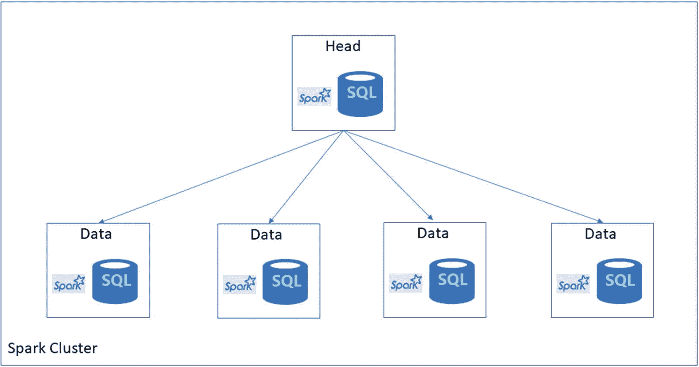

# 1. 为什么是 SQL Server 2019？

2017 年 7 月，作为 SQL Server 工程团队的一员，我像往常一样前往华盛顿州的雷德蒙德出差。我住在德克萨斯州的北里奇兰希尔市，现代科技让我能够远程完成大部分工作，与工程团队的大多数成员无需同城。但我骨子里仍有点“老派”，在某些情况下，没有什么比得上与人们面对面协作。到 2017 年 7 月，我已在 SQL 工程团队工作了一年多，主要专注于 SQL Server 2016（关于我在 SQL Server 2016 上的工作示例，可在网上查看：[`https://channel9.msdn.com/Events/Ignite/2016/BRK3043-TS`](https://channel9.msdn.com/Events/Ignite/2016/BRK3043-TS)）。

在此之前，我是著名的“Tiger Team”的一员，但在 2017 年这次出差期间，我被委以新任务，需要特别专注于即将发布的 SQL Server 2017。这包括 Linux 上的 SQL Server，而这项工作最终促使我撰写了第一本书——《`Pro SQL Server on Linux`》（[`www.apress.com/us/book/9781484241271`](https://www.apress.com/us/book/9781484241271)）。因此，在那次出差中，我开始与团队的各位成员见面交流，探讨 SQL Server 2017——性能增强、整体新功能集，以及 SQL Server 在 Linux 和容器上运行的细节。那一周，我交谈过的人之一就是 Slava Oks。Slava 是 SQL Server 的首席开发经理，也是 SQL Server on Linux 的发明者之一。他为《`Pro SQL Server on Linux`》撰写了前言，该书第一章讲述了他的参与该项目的历史。那时，Slava 喜欢早早来到办公室；我在雷德蒙德时，也尽量遵循“德克萨斯时间”——这意味着我也到得很早。所以我们常常在其他人上班之前，在 16 号楼（虽然我们团队现在在 43 号楼工作）一起喝咖啡。一天早上，当 Slava 和我聊起 SQL Server 2017 时，他对我说：“嘿，我跟你说过我们对下一个版本 SQL Server（SQL Server 2017 之后的版本）的计划了吗？”我当然假装知道——“当然，Slava，我听说过，但不太了解细节。”他随后邀请我参加第二天的一个会议，他会在会上向我们工程团队的许多人解释该项目的计划。我刚刚花了一年时间专注于 SQL Server 2016，现在又被指派深入钻研 SQL Server 2017 和 Linux，而 Slava 却想让我了解一个尚未发布版本之后的版本？当然，我不会拒绝他，因为，嗯，那可是 Slava Oks。这听起来好像 Slava 是个令人生畏的人，但他是我在微软认识的最好的人之一。因此，当我的大脑开始塞满 SQL Server 2017 的细节时，我也踏上了了解我们为未来版本 SQL Server（代号为 `Seattle` 项目）所做工作的道路。

## Project Seattle

在第二天与 Slava 的会议中，短短几小时内我就了解到，我们正在着手进行我职业生涯中见过最雄心勃勃的 SQL Server 增强项目之一。我说这话时已经知道，我们将 SQL Server on Linux 推向了市场，而这是此前没人认为可能实现的。

Slava 和团队选择“Seattle”作为代号，是因为团队此前为 SQL Server 2017 使用了“Helsinki”这个代号，并正在寻找一个新的“城市”名称。颇具讽刺意味的是，微软此前从未有人使用过“Seattle”这个名字，所以这个代号很快就定下来了。我问 Slava 他是什么时候开始规划 Project Seattle 的。得知他们早在 2017 年 1 月就开始规划时，我感到很惊讶。像 Slava、Conor Cunningham 和 Travis Wright 这样的人，在完成 SQL Server 2017 和 Linux 最后部分构建工作的同时，还在规划 Project Seattle，这既证明了他们对团队的奉献精神，也体现了他们希望 SQL Server 继续引领数据库行业创新的渴望。

很难相信，在 SQL Server 2016 和 SQL Server 2017 中已经交付了如此多引人注目且创新的功能之后，我们还能如此迅速地规划出更宏大的东西。

在 SQL Server 2016 中，我们通过 `Query Store` 带来了新的性能诊断功能。我们为开发人员提供了新功能，如时态表和 JSON 集成。我们在安全性方面也加足了马力，包括 `Always Encrypted`、`dynamic data masking` 和 `row-level security`。我们还引入了两项不同于关系数据库系统“常规”类型功能的新创新。其中之一是集成了用于机器学习模型的 R 语言。第二项是通过名为 `Polybase` 的功能与 Hadoop 系统集成（这将在 2019 年催生出更重大的东西，不过我有点说远了）。为机器学习和大数据等新场景构建功能促使我和微软的其他人开始提出一个观点：SQL Server 不再仅仅是一个关系数据库引擎，而是一个 `data platform`。

然而，要成为一个现代化且完整的数据平台，我们需要能够支持运行在 Windows Server 之外系统上的应用程序。这促使我们在发布 SQL Server 2017 时，加入了对 Linux 和 Docker 容器的支持。在 Linux 和容器上运行对微软来说是非常重大的举措，但 SQL Server 2017 还包含其他功能，例如 `Adaptive Query Processing`、`automatic tuning`、`graph database`、`clusterless` 可用性组，以及对 Python 的集成，以补充 `Machine Learning Services` 对 R 语言的支持。

考虑到所有这些创新，我们如何能在短时间内规划并构建出比 SQL Server 2016 和 2017 更新颖、更激动人心的东西？当我聚精会神地参加第一次 Project Seattle 会议时，我问了自己这个问题。在最初的几分钟里，我将接触到一个想法，这个想法在后来向公众宣布时，会被认为相当激进。而这项创新，正是 Seattle 项目的“基石”，它本身也有一个项目代号：`Aris`。

## 项目 Aris

2017 年 1 月，Slava 和 SQL Server 工程团队的领导层收到了 Azure 数据部门企业副总裁 Rohan Kumar 的指示，要求研究如何将 SQL Server 与`Big Data`进行集成。`Big Data`是一个在业界被宽泛使用的术语，指的是能够处理`large`量级数据的数据系统，通常通过分布式、可扩展的计算平台实现。我个人很喜欢我的同事 Buck Woody 对`Big Data`的定义：“任何你无法用现有技术在所需时间内处理的数据。”多年来，构建`Big Data`系统的首选一直是`Hadoop`。因此，在 2017 年春夏的几个月里，团队向 Travis Wright 寻求建议，以实现`Big Data`集成的愿景。2017 年夏天，我们的 Azure 数据团队有多个项目正在进行中，代号包括`Polaris`、`Socrates`和`Plato`。我问 Slava 你是如何决定使用`Aris`这个名字的？答案是：`Socrates`是著名希腊哲学家`Plato`的导师，而`Plato`的学生是亚里士多德（`Aristotle`）。考虑到`Aris`这个词也是`Polaris`名称的一部分，这个名字在团队和领导层中引起了共鸣。

由于`Big Data`集成意味着要处理与`Hadoop`相关的`something`，Travis 与将`Polybase`引入`SQL Server 2016`和`Azure Data Warehouse`的团队进行了多次会议。`Polybase`的愿景是允许`SQL Server`用户通过他们现有客户非常熟悉的`T-SQL`语言，查询（并摄取）来自`Hadoop`系统的数据。此外，`Polybase`不仅仅是构建一个简单的数据提取系统，它还可以利用`Azure Data Warehouse`和`Analytics Platform System`（以前称为`Parallel Data Warehouse`）中分布式计算的能力来`push down`计算，并对目标`Hadoop`系统中的大规模数据集进行分区查询处理以实现可扩展的性能。在`SQL Server 2016`和`2017`中，我从未真正看到`Polybase`取得太大进展，因为将`Big Data` `Hadoop`系统与`SQL Server`等关系系统集成并不容易。`Polybase`需要大量的安装和配置，并且安全模型在`Hadoop`系统和`SQL Server`之间存在差异。此外，下推计算实现依赖于一个名为`MapReduce`的概念，这要求在与`SQL Server`和`Polybase`服务相同的计算机上安装`Java`。尽管如此，集成`SQL Server`和`Big Data`系统的架构和概念已经可以用来构建更大的东西（包括一个名为`EXTERNAL TABLE`的`T-SQL`扩展）。如果我们能够简化`Polybase`的部署和配置方案，并增加更多的数据源支持，它可能会在业界得到更广泛的应用。此外，Travis 很快了解到，如果你想在数据处理的`Big Data`世界中被认真对待，你需要考虑另一个名为`Spark`的技术。

掌握了这些知识后，Slava、Travis 和构建`SQL Server on Linux`的核心团队成员们立志构建一个`SQL Server`与包括`Spark`在内的`Big Data`集成的原型。他们在一个大会议室里进行了为期数天的头脑风暴，并将其称为“Aris 黑客松”。团队成员包括 Slava Oks, Travis Wright, Scott Konersmann, Stuart Padley, Michael Nelson, Pranjal Gupta, Jarupat Jisarojito, Weiyun Huang, George Reynya, David Kryze, Umachandar Jayachandran (UC), 和 Sahaj Saini。到结束时，他们构建了一个可工作的`cluster`，它将`SQL Server`现有的`Polybase`功能与`Spark`结合了起来。图 1-1 展示了团队构建的集群的粗略示意图。

图 1-1

第一个 Aris 集群

在原型中，他们构建了一个`Hadoop`集群，包括`Apache Spark`和`HDFS`组件，同时还结合了`SQL Server Polybase`。他们使用`Spark`将数据流式传输到`Data`节点，然后使用`Polybase`在`Head`节点中的`SQL Server`里，将数据与通过`Spark`摄取到`HDFS`中的数据进行连接。这个原型背后的想法是证明他们可以将`Spark`、`Hadoop`和`SQL Server`集成在一起。

大约在同一时间，Travis 一直在与从微软收购的一家名为`Metanautix`的公司加入团队的工程师们交流。作为此次收购的一部分，我们的团队获得了一项技术，可以通过`ODBC`连接到一系列数据源，包括`ORACLE`、`SQL Server`、`Teradata`和`MongoDB`。团队认为，如果能将这项技术与`Aris`项目集成，我们就能为`Data Virtualization`构建一个相当引人注目的方案。`SQL Server`现在可以作为一个中心枢纽，用于访问不同数据平台和系统中的数据，而无需将数据移动到`SQL Server`（使用像抽取、转换和加载（`ETL`）这样的技术）。

在交付可供客户使用和试用的软件之前，我们需要决定一个运行所有这些组件的平台。我们需要一个平台，能够轻松部署所有软件，包括`Polybase`、`Hadoop`和`Spark`；提供可管理性和安全性；并支持弹性扩展和高可用性。考虑到容器易于部署的特性，以及我们在`SQL Server 2017`中已经实现了对容器的支持，容器似乎是一个合乎逻辑的选择。团队下一个自然的选择是选择`Kubernetes`作为构建运行这些容器的集群的平台。`Kubernetes`作为一个分布式计算和可扩展性能的平台正迅速获得发展势头。我们的经验告诉我们，`Linux`是运行`Kubernetes`和`Hadoop`系统的首选操作系统，而且由于`SQL Server`已经支持在`Linux`上运行，这是一个很好的契合点。

于是，在 2017 年末，我们的团队踏上了构建`Aris`集群的旅程，该集群将实现`Data Virtualization`的愿景，但同时集成`Spark`和`HDFS`等`Big Data`技术。从一开始，我们的团队就决定所有这些都需要“开箱即用”。也就是说，如果你购买了`SQL Server`，我们将作为许可的一部分安装所有这些组件（虽然当时还不知道这是否会是一个新版本，但所有这些都将包含在`SQL Server`中）。正如你现在看到的`SQL Server 2019`以及我们称之为`Big Data Clusters`的最终产品，它远比早期的`Aris`原型丰富得多，但其愿景和概念是相同的：提供一个易于部署的`Data Virtualization`平台，内置可扩展的性能、安全性和可管理性。

