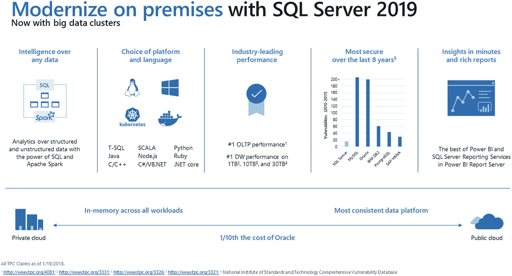
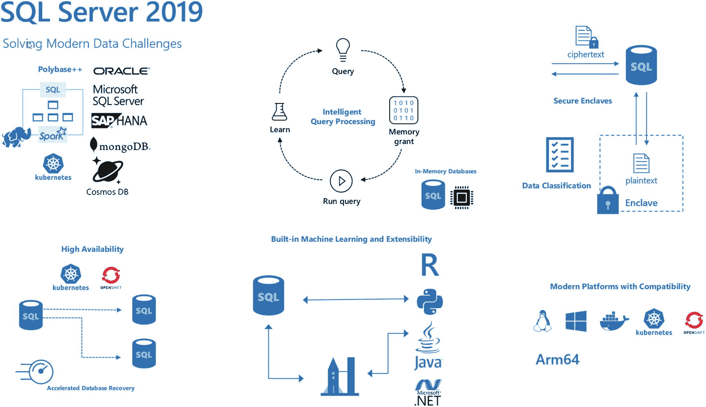

# 西雅图项目成就了 SQL Server 2019

虽然 Aris 项目和`大数据集群`的概念宏大、创新，而且坦白说，还有点令人生畏，但`SQL Server`的每一次主要版本发布都会在平台的多个领域带来增强。这包括性能、安全性和可用性，这三个领域 Conor Cunningham 常常称之为“`SQL Server`的根基”。我们的团队也在`SQL Server 2017`中首次将`SQL Server`引入了 Linux。尽管那款产品令人惊叹，但仍有一些随`Windows`版`SQL Server`提供的功能需要被添加到 Linux 版本中。我们也认识到容器技术非常重要——我的意思是，它们是未来部署和运行应用程序（包括`SQL Server`）的一个主要方向。因此，我们知道在这方面需要做一些工作，包括探索`Kubernetes`集群的新场景（而不仅仅是大数据集群解决方案）。

如此多的团队为`SQL Server`这一卓越的产品做出了贡献。我们的企业团队（又称 Tiger Team）有一系列他们希望在新版本中加入的、能带来真正客户价值的新功能（因为这就是他们的职责！）。为`Azure SQL Database`构建性能、可用性和安全新功能的同事们，也希望在“西雅图”项目中看到他们的工作成果，因为驱动 Azure 服务和`SQL Server`的引擎是相同的。正如我在 2017 年所看到的那样，我能预感到一次历史性版本发布的势头正在形成。

随着 2017 日历年的结束，我们已经为下一版`SQL Server`——`SQL Server 2018`——做好了一切准备。这对我来说顺理成章。我们在连续的两年里发布了两个主要版本`SQL Server 2016`和`SQL Server 2017`，那么为什么不能是`SQL Server 2018`呢？

我们的产品和发布架构师 Conor Cunningham 曾告诉我，凭借我们敏捷的工程能力，如果我们愿意，我们可以每个月都发布`SQL Server`。而且我们能保证质量。当然，我们不会这样做，因为我们希望发布的`SQL Server`版本既有质量，又能为客户带来重大价值。当时间进入 2018 日历年的头几个月时，我们必须决定是否要在那一年发布一个全新的主要版本。当我们审视了可以纳入此版本的功能全景（包括大数据集群）后，我们在 2018 年春季做出了决定：将在 2018 日历年内发布`SQL Server` vNext 的第一个预览版。（当我们不知道下一个版本的正式名称时，即使有像“西雅图”这样的项目代号，我们也称其为“vNext”。）您可能已经注意到，我们经常尝试在大型活动上发布主要新版本的消息。查看日历，微软最大的全球客户活动之一是 Microsoft Ignite（现在在奥兰多举行，约有 30,000 人参加）。因此，在 2018 年夏天，我们的领导层决定在 Microsoft Ignite 上启动`SQL Server` vNext 的预览，并将其命名为`SQL Server 2019`，这意味着我们将在 2019 日历年的某个时间点使此版本 GA（即正式发布）。

这对团队中的每个人来说都合情合理。它给了我们更多的时间来完善大数据集群，以及基于客户反馈和体验来增强`SQL Server`的“核心”功能。我的任务是什么？利用我此前为推广和展示`SQL Server 2016`和`2017`所做的工作，向我们的客户、业界和社区展示，我们已经凭借`SQL Server 2019`真正构建了一个现代化的数据平台。

## 使用 SQL Server 2019 实现数据库现代化

图 1-2 是我谈论`SQL Server 2019`时主要使用的“推介”图。它由我在微软市场部的一位同事 Debbi Lyons（您可能见过我和 Debbi 有时一起谈论`SQL Server`）制作，它完整地展示了`SQL Server 2019`全新的现代化数据平台。

图 1-2

使用`SQL Server 2019`实现现代化

如果您曾听过我谈论`SQL Server 2016`或`2017`，您会注意到这张幻灯片看起来有些相似，但存在关键差异：

*   一种集成的数据虚拟化解决方案，以创新的方式集成了`Spark`、`HDFS`和`SQL Server`（本质上是`SQL Server`“遇见大数据”）
*   新的功能，继续为我们的客户提供跨 Windows、Linux、容器和`Kubernetes`的“首选平台”价值

`SQL Server`持续引领数据库行业性能，并且是过去十年中漏洞最少的数据平台。凭借`SQL Server`许可证，客户可以访问商业智能服务，例如`Power BI Report Server`。此外，借助新的`Azure SQL Database`托管实例服务，在您的私有云中的`SQL Server`和 Azure 公有云中的功能几乎是完全一致的。一致性信息还不止于此。您在`T-SQL`方面的技能适用于`SQL Server`和 Azure，我们的工具也继续在`SQL Server`和 Azure 数据服务之间无缝工作。

在新功能的讨论中，似乎容易被忽略的另一组功能是`SQL Server`（和 Azure）提供的内存中功能，这些功能使您能够最大化计算资源利用率，包括内存中 OLTP 和列存储索引。所有这些都包含在`SQL Server 2019`中。图 1-3 是`SQL Server 2019`独有的主要新关键功能更详细的图示。

图 1-3

`SQL Server 2019`关键功能

我将使用这张图（从左到右，从左上角开始）为您勾勒出`SQL Server 2019`的主要新功能，这将如同您阅读本书剩余部分的一份蓝图。在您阅读这些新功能时，请记住`SQL Server`是`Azure SQL Database`的引擎，这意味着您在本书中看到的许多功能在`Azure SQL Database`中以相同的方式工作。此外，您在本书中看到的一切都可以在 Azure 中完成，无论是 Azure 虚拟机中的`SQL Server`，还是云中的容器和`Kubernetes`。

### 数据虚拟化

本章前面，我讨论了数据虚拟化的起源，即 Aris 项目。`SQL Server 2019`通过两个具体的功能实现了这一愿景：

*   **SQL Server 2019 中的 PolyBase**

    我称之为 PolyBase++，因为我们扩展了随`SQL Server 2016`发布的 PolyBase 功能（有关 PolyBase 的更多信息，请参见 [`https://docs.microsoft.com/en-us/sql/relational-databases/polybase/polybase-guide?view=sql-server-2017`](https://docs.microsoft.com/en-us/sql/relational-databases/polybase/polybase-guide%253Fview%253Dsql-server-2017)），以提供包括 Oracle、`SQL Server`、MongoDB（`CosmosDB`）和 Teradata 在内的不同数据源连接器。而且，您无需安装任何客户端软件即可连接到这些数据源；`SQL Server`内置了您所需的一切。此外，通过安装您自己的 ODBC 驱动程序，您可以连接到其他源（如 SAP HANA）。我将在第 9 章介绍`SQL Server 2019`中的新 PolyBase。

*   **大数据集群**

    正如本章前面我描述了我们对 Aris 项目的愿景那样，我们决定构建一个完整的解决方案，将`SQL Server`与新的 PolyBase 功能、`HDFS`、`Spark`以及其他用于管理、安全和可用性的组件一起部署。这其中包含的内容远比我在此能描述的要多，因此请在第 10 章中阅读更多关于大数据集群的内容。

## 注意事项

我最初希望直接在本书的第二章和第三章讨论这些主题。然而，我后来认为，如果你需要更多关于容器和 Kubernetes 的信息，将这些章节提前会有所帮助。因此，我将在这本书中以这个新功能作为“重磅结尾”。如果你等不及了，可以直接跳转到第 9 章。

### 性能

在每一次 SQL Server 版本发布中，我们都会致力于提升性能。始终如此。但是，仅仅让你的查询运行得更快是不够的。我们需要持续让 SQL Server 引擎变得更智能，能够适应你的工作负载、硬件投入和复杂的查询模式。第 2 章完整探讨了 SQL Server 2019 的性能功能，包括但不限于：

*   `智能查询处理`，这是对 SQL Server 2017 中引入的自适应查询处理的扩展。
*   通过轻量级查询分析、上次执行计划和查询存储增强功能，随时随地提供查询计划 `洞察`。
*   一系列功能可提供真正的 `内存中数据库`，包括增强的 I/O、用于持久内存的混合缓冲池以及内存优化的 tempdb 架构。将这些技术与我们内置的列存储索引和内存 OLTP 相结合，可提供一个引人注目的内存中数据库解决方案。

### 安全性

在过去十年中，SQL Server 不仅是业界漏洞最少的数据库产品，还包含了一系列广泛的特性和工具，以满足任何企业的现代安全需求。这包括 SQL Server 2019 的以下增强功能：

*   `使用安全飞地的始终加密`
    SQL Server 2016 引入了一个名为 `始终加密` 的新数据应用程序端到端安全系统。虽然该系统提供了静态、内存中和跨网络的加密，但仍存在一些限制，最重要的是不支持 `丰富计算`。在第 3 章中，我将讨论 `始终加密` 如何利用称为 `安全飞地` 的概念来支持丰富计算和其他有趣的安全场景。

*   `内置的数据分类与审核`
    欧盟（EU）的《通用数据保护条例》（GDPR）于 2018 年 5 月生效。自那时起，我与许多欧盟境内以及与欧盟客户有业务往来的公司的客户进行了交流。我们新的内置数据分类和审核功能，结合我们的工具，可以对 GDPR 等合规性场景以及你的业务可能需要处理的其他场景非常有帮助。

我将在第 3 章中介绍这些安全方面的新特性及更多内容。

### 任务关键型可用性

快速和安全是一方面，但依赖 SQL Server 运营业务的客户需要他们的数据平台始终可用。SQL Server 2019 包含满足你高可用数据需求的新功能，包括：

*   可恢复的联机创建索引和聚集列存储索引联机创建，以帮助完成联机索引可用性故事。
*   增强了我们的旗舰 HADR 功能——Always On 可用性组，包括增加副本数量和主连接重定向。
*   想象这样一个世界：事务回滚立即发生，恢复和日志截断不依赖于大型或长时间运行的事务。欢迎来到全新的加速数据库恢复世界！

我将在第 4 章中更详细地讨论这些以及其他任务关键型可用性解决方案。

### 现代开发平台

到目前为止，我确信我所谈到的 SQL Server 2019 中的所有新功能似乎都只针对 DBA 或 IT 专业人员。我们绝对相信开发人员对 SQL Server 的成功至关重要，因此我们也对以下新功能进行了投入：

*   在 SQL Server 2016 中，我们引入了一个名为 `R` 的语言，用于数据库内机器学习的新平台。在 SQL Server 2017 中，我们通过允许 `Python` 程序增强了这一模型。利用相同的基础设施，我们现在允许开发人员使用 `Java` 类来扩展 `T-SQL` 语言。事实上，我们构建了一个可扩展性 SDK，以使其他语言也能成为 SQL Server 故事的一部分。
*   我们扩展了图数据库的功能（该功能在 SQL Server 2017 中首次引入），增加了诸如边约束和 `MERGE` 支持等新特性。
*   我们希望开发人员使用 Unicode 数据类型，因此我们增加了新的 `UTF-8` 排序规则，可以帮助开发人员管理 `UTF-8` 数据，而无需承担 Unicode 数据类型的开销。

我将在第 5 章中更详细地讨论 SQL Server 2019 中面向开发人员的功能。

### 投资于你选择的平台

我们在 SQL Server 2017 中推出了 Linux 版 SQL Server，但引擎“边缘”的一些功能未能包含在该版本中。我们希望我们的用户能够完全选择运行 SQL Server 的操作系统，而无需担心功能或兼容性问题。我们在 SQL Server 2019 中通过向 Linux 版 SQL Server 添加 `复制`、`更改数据捕获 (CDC)`、`分布式事务 (DTC)`、`机器学习` 和 `Polybase` 来改进了这一点。

我们在容器方面也进行了投资，包括新的容器注册表、支持 Red Hat Enterprise Linux (`RHEL`)，并持续支持包括 OpenShift 在内的 Kubernetes。虽然本书未涵盖，但我们在 2019 年 5 月宣布了对 Azure SQL Database Edge 中的 Arm 处理器的预览支持，从而扩展了 SQL Server 的平台。你可以在 [`https://azure.microsoft.com/en-us/services/sql-database-edge/`](https://azure.microsoft.com/en-us/services/sql-database-edge/) 阅读更多关于 Azure SQL Database Edge 的信息。

你应该停下来思考一下所有这些平台标志，因为 SQL Server 不仅仅是一个可选平台。它是一个 `具备兼容性的可选平台`。你可以在这些平台中的任何一个上备份数据库，并将其原封不动地恢复到这些平台中的任何一个上。

我将在本书的第 6 章、第 7 章和第 8 章中花时间深入探讨 Linux 版 SQL Server 的增强功能、SQL Server 容器以及 Kubernetes 上的 SQL Server。

除了 SQL Server 2019 的这些主要投资领域外，还有其他值得一提的创新。

### Azure Data Studio

SQL Server Management Studio (`SSMS`) 多年来一直是 SQL Server 坚定的图形用户界面。去年，我们开始构建一个名为 SQL Operations Studio 的新工具，用于数据探索、可扩展性和新体验。在 2018 年 9 月，我们正式推出了这个工具，并将其命名为 Azure Data Studio (`ADS`)。

Azure Data Studio 包含一些创新的新技术，包括笔记本、大数据集群部署、外部数据向导，以及对 SQL Server、`HDFS` 和其他 Azure 数据服务的探索。

没有专门章节介绍 Azure Data Studio。相反，你会在本书各章中看到我使用这个工具（以及 `SSMS` 等其他工具）。

## 客户之声

凭借我在客户支持方面的背景，我总是很高兴看到我们的工程团队在新版本中加入那些能直接与客户反馈或我们的 CSS 团队支持问题趋势相关联的功能。

这次的发布也不例外，其中包含了一系列对数据库引擎的增强，包括但不限于：

*   更好的字符串截断错误信息，并提供了可操作的上下文。这是客户投票排名第一的需求，获得了数千票。
*   新的动态管理对象，以深入洞察数据库页头的内部结构（是的，你也可以成为 Paul Randal）。这些语句可以帮助诊断页面闩锁争用问题。
*   引擎在可扩展性方面的改进，包括并发 PFS 更新、并行批量插入和间接检查点。

我将在第 `11` 章向你详细介绍这组增强功能。

当你阅读本书的其余部分时，各章内容相对独立。然而，我强烈建议你首先阅读第 `7` 章和第 `8` 章作为基础知识，然后再深入学习关于数据虚拟化和大数据群集的第 `9` 章和第 `10` 章。

## SQL Server 2019 入门

以下是一些资源，可帮助你在准备学习新特性并尝试本书剩余章节中的示例时，部署和配置 SQL Server 2019。

### 下载 SQL Server 2019

要下载并试用 SQL Server 2019，请访问 [`www.microsoft.com/en-us/sql-server/sql-server-2019#Install`](http://www.microsoft.com/en-us/sql-server/sql-server-2019%2523Install)。

### 部署 SQL Server 2019

有关如何在 Windows 上部署 SQL Server 2019 的说明，请访问 [`https://docs.microsoft.com/en-us/sql/database-engine/install-windows/installation-for-sql-server?view=sql-server-ver15`](https://docs.microsoft.com/en-us/sql/database-engine/install-windows/installation-for-sql-server%253Fview%253Dsql-server-ver15)。

对于 Linux 上的 SQL Server 2019，请访问 [`https://docs.microsoft.com/en-us/sql/linux/sql-server-linux-overview?view=sql-server-ver15`](https://docs.microsoft.com/en-us/sql/linux/sql-server-linux-overview%253Fview%253Dsql-server-ver15)。

要学习如何在容器中部署 SQL Server，请访问 [`https://docs.microsoft.com/en-us/sql/linux/quickstart-install-connect-docker?view=sql-server-linux-ver15&pivots=cs1-bash`](https://docs.microsoft.com/en-us/sql/linux/quickstart-install-connect-docker%253Fview%253Dsql-server-linux-ver15%2526pivots%253Dcs1-bash.%255C)。

## 迁移到 SQL Server 2019

第 `11` 章将讨论迁移以及支持从旧版 SQL Server 和其他供应商数据库产品迁移至 SQL Server 2019 的工具。

### SQL Server 2019 新增功能

在 [`https://docs.microsoft.com/en-us/sql/sql-server/what-s-new-in-sql-server-ver15?view=sqlallproducts-allversions`](https://docs.microsoft.com/en-us/sql/sql-server/what-s-new-in-sql-server-ver15%253Fview%253Dsqlallproducts-allversions) 了解关于 SQL Server 2019 所有新功能的具体信息。

### 下载本书代码和示例数据库

为了能够使用本书中的所有示例，你需要克隆本书的 GitHub 仓库，如本书引言中所讨论的那样。

> **提示**
>
> Windows 用户，请务必使用以下 git 语法来克隆仓库，以避免 Linux 脚本的 CRLF 问题：
>
> `git clone --config core.autocrlf=false` `https://github.com/microsoft/sqlworkshops.git`

此外，你还需要从 [`https://github.com/Microsoft/sql-server-samples/releases/tag/wide-world-importers-v1.0`](https://github.com/Microsoft/sql-server-samples/releases/tag/wide-world-importers-v1.0) 下载示例数据库 `WideWorldImporters`，并从 [`https://github.com/Microsoft/sql-server-samples/releases/download/wide-world-importers-v1.0/WideWorldImportersDW-Full.bak`](https://github.com/Microsoft/sql-server-samples/releases/download/wide-world-importers-v1.0/WideWorldImportersDW-Full.bak) 下载 `WideWorldImportersDW`。本书的代码包含如何在 Windows、Linux、容器和 Kubernetes 上还原备份的示例。

### SQL Server 研讨会

尽管我在本书中包含了许多动手练习，但你仍可以访问 [`http://aka.ms/sqlworkshops`](http://aka.ms/sqlworkshops) 以查找更多关于 SQL Server 的免费相关培训（我的朋友兼同事 Buck Woody 是我所知最优秀的培训师之一，他是这个网站背后的策划者）。

### 这是你爷爷的 SQL Server 吗？

我喜欢编写这本书，不仅因为我喜欢这项技术（好吧，我对 SQL Server 有偏爱），还因为我们的工程团队正以业内任何其他竞品数据产品或平台都未曾见过的速度进行创新。而且我们得承认，学习新事物很有趣。

也许 *ITProToday* 杂志的这句引述说得最好："我从未想过有一天我会在同一个句子里讨论 Microsoft SQL Server 的发布特性与 Linux、Oracle 和 Apache Spark，但这是一个勇敢的新世界。Microsoft 的 SQL Server 开发正以其竞争对手无法匹敌的速度前进" ([`www.itprotoday.com/sql-server/polybase-expansion-big-clusters-are-key-features-new-sql-server-2019`](https://www.itprotoday.com/sql-server/polybase-expansion-big-clusters-are-key-features-new-sql-server-2019))。

我记得我的同事 Travis Wright 在谈到 SQL Server 2019 时说："这不是你爷爷的 SQL Server。" 这是因为该产品已经从一个强大的关系数据库引擎，演变为现在包含了 Spark、HDFS、Notebooks、Polybase、R、Python、Java、Linux、容器和 Kubernetes 等技术，所有这些都作为产品的一部分，真正成为了一个现代数据平台。

我记得把这段话发在了 Twitter 上。我的同事 Pedro Lopes 看到后评论说，SQL Server 2019 确实是你爷爷的 SQL Server。那么谁是对的呢？他们两个都对。SQL Server 2019 仍然是你所熟知和喜爱的、令人难以置信的数据库引擎，具有可扩展的性能、关键任务安全性和高可用性。你将在本书中看到所有这些核心领域的增强功能。但 SQL Server 2019 远不止于此。它是地球上最受欢迎的数据库平台之一，也是最新的后起之秀。它可以兼具两者。欢迎来到 SQL Server 2019。

