# 2. 智能性能

SQL Server 性能对任何数据平台的运营都至关重要。本章包含了大量关于 SQL Server 2019 如何帮助你在不更改应用程序的情况下提升查询性能的信息。这是本书中最长的章节之一，包含大量示例，所以请坐稳并准备好你最喜欢的咖啡。


## 为何是智能性能？

对我而言，这本书最重要的启示在于，`SQL Server 2019`的新功能`为何`能为您带来益处，或解决特定的问题或挑战。就性能而言，其主题是帮助您提升工作负载的性能，通常`无需`对应用程序或查询进行任何更改。

2018 年 9 月，我正在为佛罗里达州奥兰多市的`Microsoft Ignite`大会准备演讲。在那年此时之前，大家仅从高层次了解我们对`SQL vNext`的计划。我和我的同事`Amit Banerjee`的任务是在`Ignite`上展示`SQL Server 2019 预览版`的发布。在构建演示文稿时，我们知道需要展示我们在性能方面的新增强功能。`Amit`提出了一个新术语：`智能数据库`。其理念是，`SQL Server`正在构建将智能融入引擎的能力，以实现前所未有的检测、适应和提供洞察力。

我沿用了这个术语，并将其更聚焦于性能，称之为`智能性能`。这包括`SQL Server 2019`中的以下新增强功能：

*   `智能查询处理`
*   `轻量级查询分析`
*   `内存中数据库`
*   `末页插入争用`

这些领域中的每一个都在`SQL Server`引擎中内置了智能，以帮助您从系统中获得更好的性能，在许多情况下完全无需更改。在某些情况下，`SQL Server`为您提供了前所未有的查询性能洞察级别。在其他情况下，`SQL Server`具有内置功能，可自动利用硬件方面的创新。

当您创作一本书时，您会做出各种决定。其中之一是如何组织您的章节。这一章非常长，主要是因为其中包含许多视觉元素的示例。我是一个视觉型的人，所以我认为这是向您展示这些新功能的好方法。本章的每一部分本身就是一个独立的章节，您可以将其视为独立章节。我决定将所有内容包含在一个章节中，是因为我希望您能看到所有细节以及`SQL Server 2019`中`智能性能`的庞大广度。

本章的每一部分都列出了运行任何示例所需的先决条件。概括来说，您需要：

*   安装在`Windows`或`Linux`上的`SQL Server 2019`
*   `SQL Server Management Studio (SSMS)` 18.0 或更高版本
*   `Azure Data Studio`（任何操作系统，但您需要的最低版本是 1.7.0）

许多示例使用`SSMS`查看查询计划，但在学习这些示例时，您也可以使用`Azure Data Studio`（您只需使用新的`SentryOne Plan Explorer`扩展查看计划`XML`）。有关此扩展的更多信息，请访问 [`https://cloudblogs.microsoft.com/sqlserver/2019/07/11/the-july-release-of-azure-data-studio-is-now-available`](https://cloudblogs.microsoft.com/sqlserver/2019/07/11/the-july-release-of-azure-data-studio-is-now-available)。

## 智能查询处理

在`SQL Server 2014`中，我们的工程团队做出了一个大胆的决定，在引擎内为查询处理器引入一套新的代码，用于基数估计（`CE`）决策。如果数据库使用的兼容级别为`120`或更高（`120`是`SQL Server 2014`的默认值），则新的`CE 模型`将生效。您可以在我们的文档中阅读有关其工作原理以及我们为何做出此更改的所有详细信息：[`https://docs.microsoft.com/en-us/sql/relational-databases/performance/cardinality-estimation-sql-server`](https://docs.microsoft.com/en-us/sql/relational-databases/performance/cardinality-estimation-sql-server)。

许多人争论这是否是正确的决定。这种方法的一个问题是它是一个广泛、不灵活的改动。当团队完成`SQL Server 2016`并规划`SQL Server 2017`时，他们都同意我们需要一种新的方式来构建查询处理功能。正如查询处理器（`QP`）的首席程序经理之一`Joe Sack`所说，“团队意识到，进行一刀切式的改动不是我们未来应该做的。相反——我们需要投资于能够适应`SQL Server`生态系统中庞杂客户工作负载（大型、小型、`OLTP`、混合型、`DW`）的功能。”

因此，在`SQL Server 2017`中诞生了一系列名为`自适应查询处理 (AQP)`的新增强`功能家族`。其概念是在查询处理器中内置在查询执行期间（或在它`再次`执行之前）进行`自适应`的能力，以提供更快的执行速度，而无需任何用户干预或应用程序更改。

## 注意

您可以在以下位置查看`SQL Server 2017`和`AQP`的示例：[`https://github.com/Microsoft/bobsql/tree/master/demos/sqlserver/aqp`](https://github.com/Microsoft/bobsql/tree/master/demos/sqlserver/aqp)。

随着团队发布`SQL Server 2017`和`AQP`，他们已经在处理积压的新需求，这些是他们本想放入`AQP`但当时没有时间的功能。他们开始在`Azure SQL Server Database`中添加增强`AQP`的新功能，并计划将它们纳入`SQL Server 2019`。此外，`自适应`这个词并没有真正反映团队所做工作的愿景。多年来，`SQL Server`查询处理器一直相当智能——使用一套复杂的基于成本的算法来制定计划决策。但团队想要更多；他们希望`QP`展现出更多的智能。于是，`智能查询处理`这个名字就确定下来了。

图 2-1 展示了这个包含`SQL Server 2017`和 2019 的`QP`能力的`家族树`。

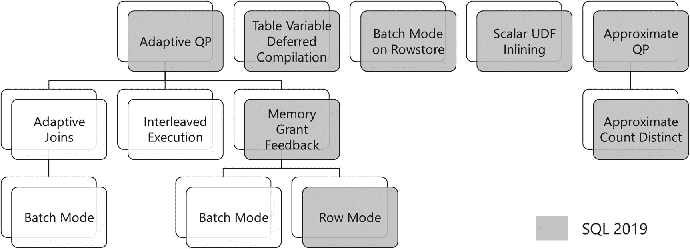

*图 2-1: 智能查询处理家族树*

让我们看一下图 2-1 中以灰色显示的每个新功能，并举例说明其工作原理。在阅读本节时，请务必牢记，我们构建这些功能的目的**是让您无需了解它们**。将来，如果我们工作做得好，`智能查询处理`就是“默认”的查询处理器，而您作为应用程序开发人员、`DBA`或数据专业人员，只会习惯于一个灵活、智能且能适应您工作负载的引擎。您可以在关于`IQP`的新文档中查看`自适应查询处理`的所有功能：[`https://docs.microsoft.com/en-us/sql/relational-databases/performance/intelligent-query-processing`](https://docs.microsoft.com/en-us/sql/relational-databases/performance/intelligent-query-processing)。

## 注意

除`近似计数 distinct`外，在所有场景中，您都可以通过将数据库的兼容级别更改为`150`来启用`智能查询处理`的功能。`近似计数 distinct`是`SQL Server 2019`新增的`T-SQL`函数，不需要数据库兼容级别为`150`。


### 使用智能查询处理示例的先决条件

虽然许多工作负载都能从智能查询处理中受益，但使用较大数据集和为分析查询设计的数据库能更轻松地展示其性能优势。因此，本章示例将使用 `WideWorldImportersDW` 示例数据库（您可以在 [`https://docs.microsoft.com/en-us/sql/samples/wide-world-importers-dw-database-catalog`](https://docs.microsoft.com/en-us/sql/samples/wide-world-importers-dw-database-catalog) 了解更多关于此数据库及其架构的信息）。

这些示例适用于 Windows、Linux 和容器上运行的 SQL Server 2019。鉴于数据集较大，SQL Server 需要至少 12GB 内存才能正常观察到性能差异。此外，部分查询示例使用了并行处理，因此更推荐在多处理器系统上安装 SQL Server。

本章使用的所有脚本都可以在 GitHub 仓库的 `ch2_intelligent_performance\iqp` 目录下找到。

这些示例（包括如何扩展 `WideWorldImportersDW` 数据库的方法）完全归功于我在微软的同事 Joe Sack。这些示例是基于 Joe 的 GitHub 仓库 [`https://github.com/joesackmsft/Conferences/tree/master/IQPDemos`](https://github.com/joesackmsft/Conferences/tree/master/IQPDemos) 修改而来。

要使用本章中的示例，您需要完成以下步骤：

1.  从 [`https://github.com/Microsoft/sql-server-samples/releases/download/wide-world-importers-v1.0/WideWorldImportersDW-Full.bak`](https://github.com/Microsoft/sql-server-samples/releases/download/wide-world-importers-v1.0/WideWorldImportersDW-Full.bak) 下载 `WideWorldImportersDW` 数据库备份文件。
2.  将此数据库还原到您的 SQL Server 2019 实例。您可以使用提供的 `restorewwidw.sql` 脚本。您可能需要更改备份文件位置以及数据库文件还原目录的路径。
3.  为了运行部分示例，您需要比 `WideWorldImportersDW` 默认安装更大的表，并且这些表不使用列存储索引。因此，请运行脚本 `extendwwidw.sql` 来创建两个大表。扩展此数据库将使其大小（包括事务日志）增加到总共约 8GB。其中一个表名为 `Fact.OrderHistory`。基于 `Orders` 表，我们将大幅扩展此表且不使用列存储索引。我们将创建另一个名为 `Fact.OrderHistoryExtended` 的表，它将基于 `Fact.OrderHistory`，但包含更多行。

几乎所有示例都提供两种方法：

*   一套 T-SQL 脚本，您可以配合任何工具使用，例如 `SQL Server Management Studio`、`Azure Data Studio` 或 `sqlcmd`。
*   一个需要使用 `Azure Data Studio` 的 T-SQL 笔记本。请仔细查阅如何在 [`https://docs.microsoft.com/en-us/sql/azure-data-studio/sql-notebooks`](https://docs.microsoft.com/en-us/sql/azure-data-studio/sql-notebooks) 使用 `Azure Data Studio` 运行笔记本。

有一个示例需要在 Windows 客户端运行，因为它使用了著名的 `ostress.exe` 工具。有关如何安装和使用 `ostress.exe` 的详细信息，请参见“内存授权反馈（行模式）”部分。我编写所有脚本时假设您将以系统管理员身份运行（我使用了 `sa` 登录）。在实际操作中，您会创建其他登录名来使用 SQL Server，但为了简化示例——请仅使用具有系统管理员权限的登录名。

### 内存授权反馈（行模式）

在加入 SQL Server 工程团队之前，我在微软技术支持部门有很长的职业生涯。在性能方面，我见过客户面临的最棘手问题之一就是与 `内存授权` 相关的问题。什么是 `内存授权`？

SQL Server 会因各种原因分配内存。当 SQL Server 执行查询时，可能会使用内存来缓存与查询中索引或表的页面相关联的缓冲区。在大多数已运行一段时间的 SQL Server 实例中，缓冲池可能已经在分配的内存中，因此引入页面不需要额外内存。

某些查询操作是密集型的，需要某种临时区域来存储数据。其中两种操作是 `哈希联接`（或仅仅是哈希运算符）和 `排序`。要执行 `哈希联接`，SQL Server 实际上必须在内存中构建一个迷你表来执行该操作。任何类型的数据 `排序` 都可能需要某种数组或结构来对数据进行排序。SQL Server 必须有某个地方来执行这些操作，因此它会在缓冲池之外分配内存。查询执行引擎分配此内存的过程称为 `内存授权`。

听起来很简单。问题在于：`内存授权` 是基于优化器在首次执行查询计划时对查询的了解。而这些决策的“依据”通常归结为基数估计或操作的唯一行数。如果 SQL Server 认为查询计划中的 `排序` 操作将作用于总大小为 100 字节的数据列，并且估计有 10 亿行数据，它必须获取足够的 `内存授权` 来分配内存以对如此多行、该大小的数据进行排序。同样的概念也适用于 `哈希` 运算符。


### 提示

SQL Server 工程团队撰写了一篇关于内存授权（memory grants）的非常古老的博客。我建议您暂停阅读本文，以了解更多概念和细节。您可以阅读这篇博客：[`https://blogs.msdn.microsoft.com/sqlqueryprocessing/2010/02/16/understanding-sql-server-memory-grant/`](https://blogs.msdn.microsoft.com/sqlqueryprocessing/2010/02/16/understanding-sql-server-memory-grant/)。

在许多场景中，这个系统运行良好，不会出现明显问题。但是，如果内存授权基于不准确的基数估计会怎样？

可能会出现两类问题：

*   内存授权可能*小于实际所需*，导致臭名昭著且令人头疼的“tempdb 溢出”。SQL Server 不会允许哈希连接运算符或排序操作获得其所需的所有内存。如果内存请求过大（我们没有记录什么算“过大”，因为我们可能会更改它，并且不希望您依赖于此），当前分配的内存必须被保存。保存到哪里？您猜对了… tempdb。可以将此视为类似于物理 RAM 耗尽时操作系统对内存进行分页的分页系统。

*   内存授权可能*大于实际所需*。这可能会挤压 SQL Server 引擎其他部分的内存压力，但更可能的情况是多个用户运行的查询都具有*过多*的内存授权，从而导致 SQL Server 对查询进行节流。结果是一些用户在名为 `RESOURCE_SEMAPHORE` 的等待类型上遇到瓶颈。

这两个问题都可能导致性能问题。在 SQL Server 2017 中，我们为批处理模式引入了一个称为*内存授权反馈*的概念。此功能是*自适应*的完美示例。当查询执行完成后，SQL Server 知道实际使用的内存与原始请求的内存相比如何。如果实际使用的内存远少于授权的内存，为什么下次执行相同的缓存计划时还要请求过多的内存？同样，如果实际使用的内存远多于原始授权请求的内存，为什么还要一遍又一遍地向 tempdb 溢出？

内存授权反馈通过将未来执行的正确内存授权信息存储在缓存查询计划中来解决此问题。对用户而言，感觉就像 SQL Server *自我修复*了。此功能在 SQL Server 2017 中很好用，但仅适用于批处理模式操作，这意味着它仅适用于列存储索引操作。正如您将在本章后面题为“行存储上的批处理模式”的部分中了解到的，SQL Server 支持的批处理模式操作不仅仅针对列存储。那么，为什么在未使用批处理模式时不支持内存授权反馈呢？

其结果是，无论使用何种类型的表或索引，SQL Server 引擎在内存授权场景下都具备了自适应能力。

启用行模式内存授权反馈只需将数据库兼容性级别 (`dbcompat`) 更改为 150 即可。

即使 `dbcompat` 为 150，您也可以使用 `ALTER DATABASE SCOPED CONFIGURATION` 的 `ROW_MODE_MEMORY_GRANT_FEEDBACK` 选项来禁用或启用行模式内存授权反馈。您还可以使用 `DISABLE_ROW_MODE_MEMORY_GRANT_FEEDBACK` 查询选项在查询级别禁用此功能。您可以阅读如何设置这些选项的示例：[`https://docs.microsoft.com/en-us/sql/relational-databases/performance/intelligent-query-processing?#row-mode-memory-grant-feedback`](https://docs.microsoft.com/en-us/sql/relational-databases/performance/intelligent-query-processing%253F%2523row-mode-memory-grant-feedback)。

#### 低估的内存授权

让我们看一些例子。首先看一个内存授权小于实际内存使用量，导致溢出到 tempdb 的场景。这些示例中使用的所有脚本都可以在 **ch2_intelligent_performance\iqp\rowmodemgf** 目录中找到。有两种方法可以运行此场景的示例：

*   使用 T-SQL 脚本 **iqp_rowmodemfg.sql**。
*   使用 Azure Data Studio 中名为 **iqp_rowmodemfg.ipynb** 的 T-SQL notebook。

让我们逐步使用 T-SQL 脚本 **iqp_rowmodemfg.sql**。我将使用 SQL Server Management Studio 来解释查询计划差异，但您可以使用任何可以显示查询计划的工具。T-SQL 脚本中注释了示例的每个步骤。

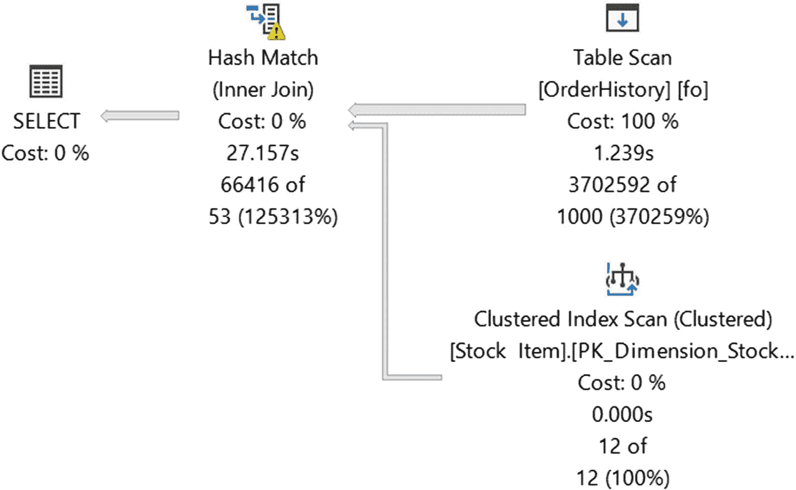

图 2-2

低估内存授权的查询计划

1.  **步骤 1** 说明将数据库兼容性级别更改为 150，清除过程缓存，并*预热* `WideWorldImportersDW` 数据库中名为 `Fact.OrderHistory` 的表所在的缓冲池。需要 `Dbcompat` 150 以为行存储启用内存授权反馈。清除过程缓存只是确保我们“从干净状态开始”的一步。（注意使用 `ALTER DATABASE` 选项仅为此数据库清除过程缓存。这个选项非常有用！）从磁盘加载 `Fact.OrderHistory` 表的页面只是为了确保有无内存授权反馈的查询性能比较是“公平的”。

    ```
    -- 步骤 1：确保此数据库处于兼容级别 150，并清除此数据库的过程缓存。同时将表加载到缓存中以比较预热缓存的查询
    USE [WideWorldImportersDW]
    GO
    ALTER DATABASE [WideWorldImportersDW] SET COMPATIBILITY_LEVEL = 150
    GO
    ALTER DATABASE SCOPED CONFIGURATION CLEAR PROCEDURE_CACHE
    GO
    SELECT COUNT(*) FROM [Fact].[OrderHistory]
    GO
    ```

2.  **步骤 2** 完全是为内存授权的*低估*设置条件。我将向您展示如何模拟此情况的技巧。T-SQL `UPDATE STATISTICS` 命令有一个特殊选项，可强制存储特定的行数或页数统计信息。通常您绝不会想使用此选项。事实上，在 [`https://docs.microsoft.com/en-us/sql/t-sql/statements/update-statistics-transact-sql`](https://docs.microsoft.com/en-us/sql/t-sql/statements/update-statistics-transact-sql) 的 `UPDATE STATISTICS` 命令文档中，关于此选项写道：“仅出于信息目的而标识。不支持。将来不保证兼容性。”因此，此选项仅用于此演示目的。在这种情况下，让我们强制将此表的统计信息的基数设置为 1000 行：

    ```
    -- 步骤 2：模拟统计信息过期
    UPDATE STATISTICS Fact.OrderHistory
    WITH ROWCOUNT = 1000
    GO
    ```

    此表实际有 3702592 行；强制统计信息认为其只有 1000 行，可以模拟统计信息与表中实际数据不同步的场景。

3.  进入 **步骤 3**。现在是运行使用 `Fact.OrderHistory` 表的查询的时候了。

    ```
    -- 步骤 3：运行查询以获取订单和库存项目数据
    -- 不要选中此处的注释来运行查询！
    SELECT fo.[Order Key], fo.Description, si.[Lead Time Days]
    FROM  Fact.OrderHistory AS fo
    INNER HASH JOIN Dimension.[Stock Item] AS si
    ON fo.[Stock Item Key] = si.[Stock Item Key]
    WHERE fo.[Lineage Key] = 9
    AND si.[Lead Time Days] > 19
    GO
    ```


该查询试图获取订单和库存项目数据。注意在 T-SQL 语法中使用了 `HASH JOIN` 来强制优化器使用哈希连接。这是一种简单的方法，用于在演示中将哈希连接引入行数被低估的查询中。我在这里包含了注释，但关键在于不要执行带有注释的此 T-SQL 代码段。我最初构建这些演示时就因此吃过亏。在匹配缓存计划以唯一标识查询时，注释是“算数的”。如果查询的下次执行没有相同的注释，这些查询将不会被重用。在 SSMS 中，执行查询前，请选择**包含实际执行计划**选项（可以使用 `Ctrl+M` 启用）。此文档页面描述了如何启用此功能，[`https://docs.microsoft.com/en-us/sql/relational-databases/performance/display-an-actual-execution-plan`](https://docs.microsoft.com/en-us/sql/relational-databases/performance/display-an-actual-execution-plan)。

## 步骤 3：运行查询以获取订单和库存项目数据

```sql
-- DO NOT select the comments here to run the query!
SELECT fo.[Order Key], fo.Description, si.[Lead Time Days]
FROM  Fact.OrderHistory AS fo
INNER HASH JOIN Dimension.[Stock Item] AS si
ON fo.[Stock Item Key] = si.[Stock Item Key]
WHERE fo.[Lineage Key] = 9
AND si.[Lead Time Days] > 19
GO
```

此查询应至少需要 30 秒运行，并返回大约 66K 行（实际结果可能有所不同）。使用 SSMS 的选项查看执行计划，它应该类似于图 2-2。

### 分析执行计划

利用此计划，有几个细节需要观察。在 SSMS 中，如果将鼠标悬停在 `Table Scan` 运算符上，它应该类似于图 2-3。请注意，`估计行数`与扫描读取的实际行数相差甚远。

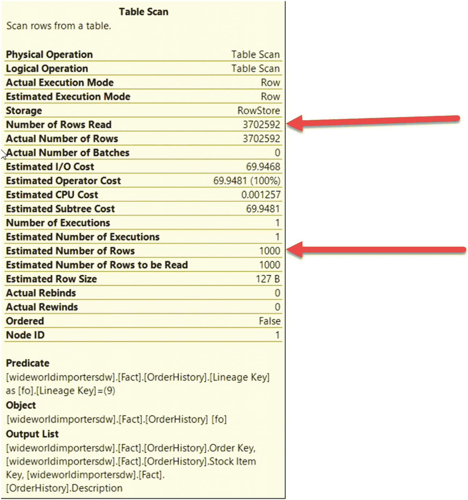
*图 2-3：`Fact.OrderHistory` 表扫描的估计值与实际值对比*

在这种情况下，`Fact.OrderHistory` 表是哈希连接的*生成输入*。SQL Server 将根据此生成输入为哈希连接请求内存授予。这是个问题，因为内存授予是基于仅估计为 1000 行的估算值。使用鼠标悬停在带有警告图标的 `Hash Join` 上，注意如图 2-4 所见的关于溢出的警告。

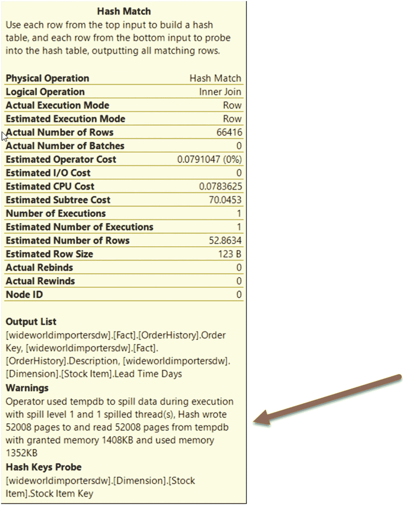
*图 2-4：哈希连接 tempdb 溢出*

注意警告中的数字。`52008` 个页面（每页 8K）大约是 426Mb 的数据 I/O 写入 `tempdb` 文件。溢出非常糟糕，因为这不是放入与 `tempdb` 关联的缓冲池页面的数据。`Tempdb` 数据文件成为哈希连接内存授予的*页面文件*（这些不是用于临时表的 `tempdb` 页面）。这也是我经常称 `tempdb` 为 SQL Server 垃圾堆的另一个原因）。

### 提示：哈希连接如何工作

想知道哈希连接如何工作吗？请阅读我们顶级查询处理团队工程师之一，独一无二的 Craig Freedman 的这篇经典博文：[`https://blogs.msdn.microsoft.com/craigfr/2006/08/10/hash-join/`](https://blogs.msdn.microsoft.com/craigfr/2006/08/10/hash-join/)。

### 检查内存授予

将鼠标移到查询计划左侧，悬停在 `SELECT` 运算符上。在此运算符中是有关查询计划内存授予数量的详细信息。图 2-5 显示为此查询的授予请求了大约 1.4Mb 的内存。

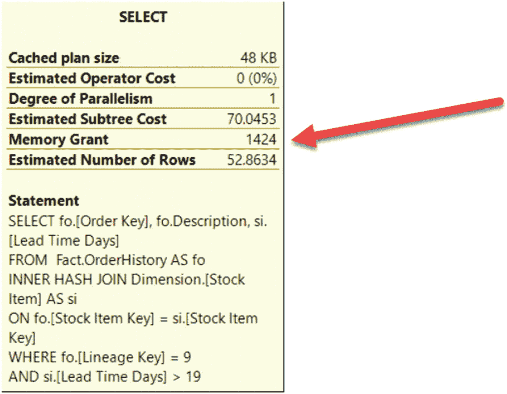
*图 2-5：显示所请求内存授予的 `SELECT` 运算符*

请求的 1.4Mb 内存授予远不足以容纳所需内容，根据溢出情况，大约需要 ~400Mb。

XML 执行计划中提供的另一个有趣信息位于计划的属性中。要查看此信息，请右键单击 `SELECT` 运算符并选择 `属性`。展开名为 `MemoryGrantInfo` 的选项，它将类似于图 2-6。

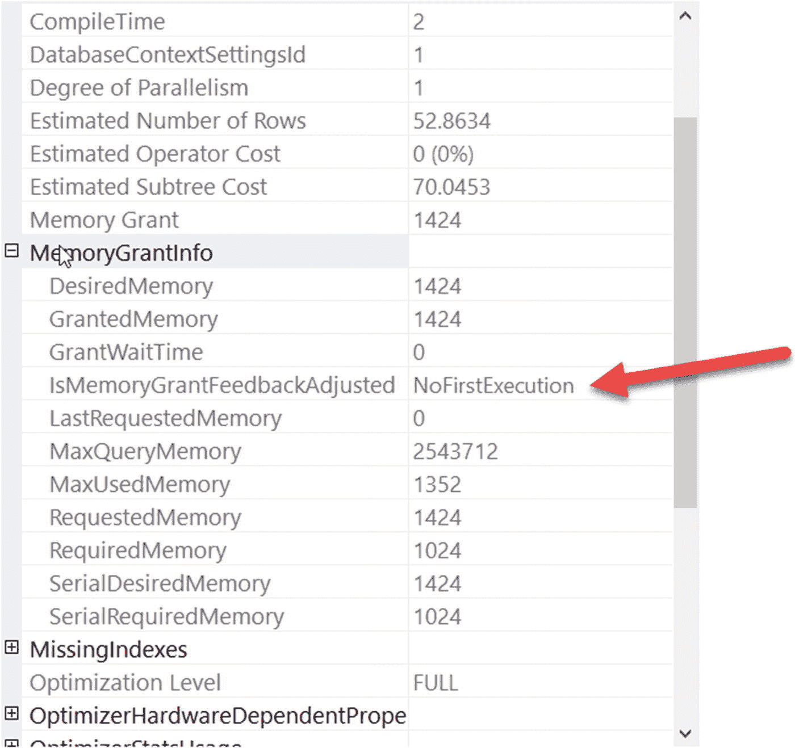
*图 2-6：查询计划属性中的内存授予详细信息*

关于内存授予反馈，最重要的属性是名为 **IsMemoryGrantFeedbackAdjusted** 的字段。**NoFirstExecution** 的值意味着这只是查询的第一次执行，因此尚未收集反馈。您可以在我们的文档中查看可能的值列表：[`https://docs.microsoft.com/en-us/sql/relational-databases/performance/intelligent-query-processing?#row-mode-memory-grant-feedback`](https://docs.microsoft.com/en-us/sql/relational-databases/performance/intelligent-query-processing%253F%2523row-mode-memory-grant-feedback)。

由于已启用内存授予反馈，如果执行缓存中相同的查询，SQL Server 将进行自适应调整并更改内存授予以适应低估情况。

## 步骤 4：让我们再试一次

1.  转到脚本中的 **步骤 4**，再次运行相同的查询。**重要提示**：运行查询时请勿使用注释。在匹配计划缓存中的确切查询时，注释是算数的。请确保保持 SSMS 中的 `包含实际执行计划` 选项。

```sql
-- Step 4: Let's try this again
-- DO NOT select the comments here to run the query!
SELECT fo.[Order Key], fo.Description, si.[Lead Time Days]
FROM  Fact.OrderHistory AS fo
INNER HASH JOIN Dimension.[Stock Item] AS si
ON fo.[Stock Item Key] = si.[Stock Item Key]
WHERE fo.[Lineage Key] = 9
AND si.[Lead Time Days] > 19
GO
```

这次查询应该在 3 秒或更短时间内运行完成，而不是 30 秒或更长时间。请记住，概念是计划不会改变，所以当您查看 `实际执行计划` 时，它应该看起来相同，只是 `Hash Match Join` 没有警告图标，也没有溢出警告。将鼠标悬停在 `SELECT` 运算符上，您将看到内存授予的显著差异，如图 2-7 所示。

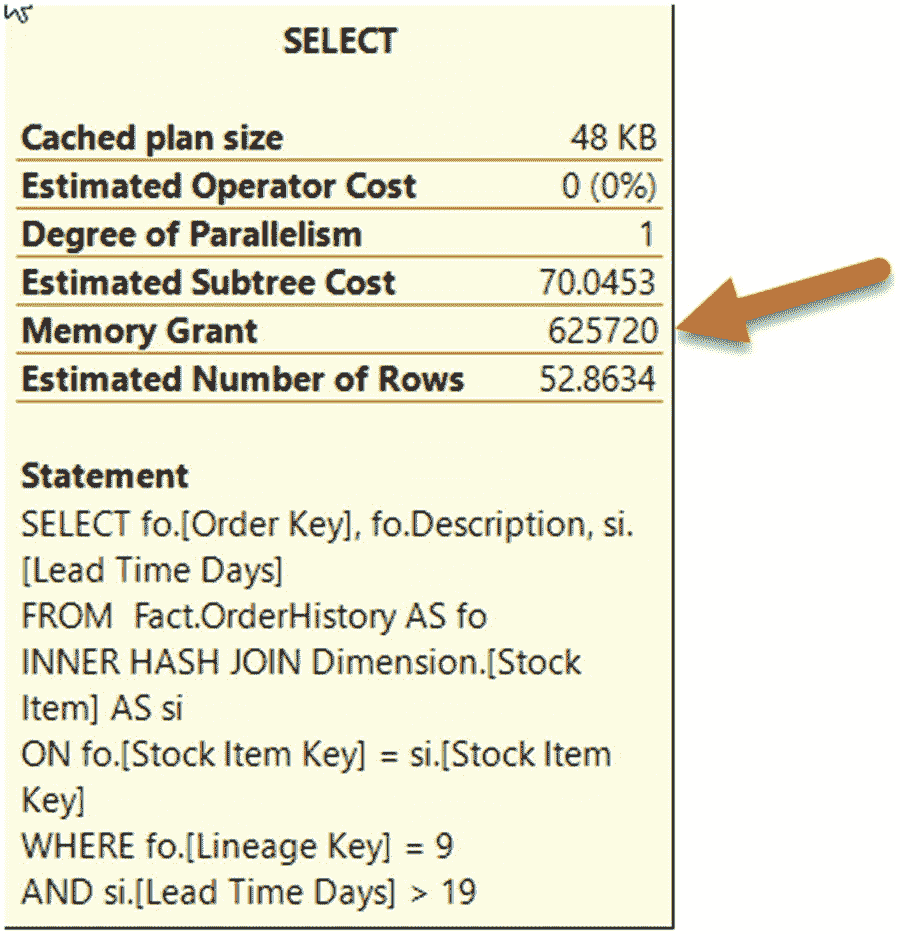
*图 2-7：显示改进后内存授予的 `SELECT` 运算符。*

您可以看到它实际上需要大约 ~625Mb 才能获得正确的内存授予来适应 `Hash Join`。

右键单击 `SELECT` 运算符并选择 `属性`。`内存授予反馈` 部分现在看起来像图 2-8。

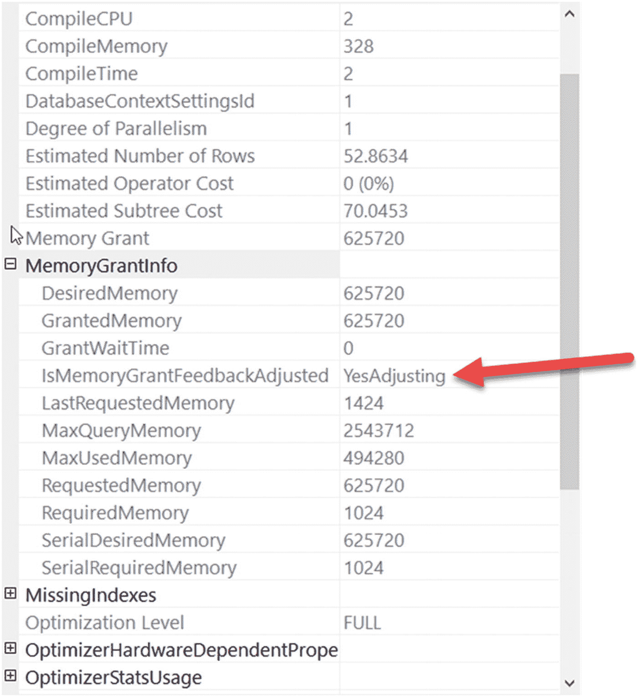
*图 2-8：内存授予修正后的内存授予反馈属性*

## 步骤 5：将表和聚集索引恢复到其原始状态

我们需要确保通过运行 T-SQL 脚本中的 **步骤 5** 来将统计信息恢复到其原始状态：

```sql
-- Step 5: Restore table and clustered index back to its original state
UPDATE STATISTICS Fact.OrderHistory
WITH ROWCOUNT = 3702592;
GO
ALTER TABLE [Fact].[OrderHistory] DROP CONSTRAINT [PK_Fact_OrderHistory]
GO
ALTER TABLE [Fact].[OrderHistory] ADD  CONSTRAINT [PK_Fact_OrderHistory] PRIMARY KEY NONCLUSTERED
(
[Order Key] ASC,
[Order Date Key] ASC
)
GO
```


## 过度内存授予

让我们来看一个内存授予量远大于实际需要的例子。正如我之前提到的，如果内存授予非常大且并非实际所需，它可能是无害的——但也可能导致意外的内存压力或性能问题。

这个例子运行起来稍微复杂一些，需要模拟并发用户。因此，对于本例，你需要使用名为 `ostress` 的免费工具，可从 [`ostress 下载页面`](https://www.microsoft.com/en-us/download/details.aspx%253Fid%253D4511) 下载。该工具目前需要在 Windows 客户端计算机上使用。

要了解此问题如何导致意外的性能问题和 `RESOURCE_SEMAPHORE` 等待，请使用以下步骤。所有脚本均位于 `ch2_intelligent_performance\iqp\rowmodemgf` 目录中。我构建的所有命令行脚本都使用 `sa` 登录名。

1.  首先，我们需要通过运行脚本 `adjustrg.cmd`（该脚本会运行 T-SQL 脚本 `adjustrg.sql`）来调整资源调控器关于服务器最大授予内存量的设置。此脚本假设服务器名称为 `bwsql2019`，因此你需要根据你的服务器进行编辑。我进行此调整是为了在示例中允许 SQL Server 获取非常大的超额授予。

    ```
    ALTER WORKLOAD GROUP [default]
    WITH (REQUEST_MAX_MEMORY_GRANT_PERCENT = 50)
    GO
    ALTER RESOURCE GOVERNOR RECONFIGURE
    GO
    ```

2.  现在执行脚本 `turn_off_mgf.cmd`（该脚本会执行 T-SQL 脚本 `turn_off_mgf.sql`）。

    ```
    -- 关闭内存授予反馈
    USE [WideWorldImportersDW]
    GO
    -- 步骤 2: 模拟统计信息过期
    UPDATE STATISTICS Fact.OrderHistory
    WITH ROWCOUNT = 5000000000
    GO
    ALTER DATABASE SCOPED CONFIGURATION CLEAR PROCEDURE_CACHE;
    GO
    ALTER DATABASE SCOPED CONFIGURATION SET ROW_MODE_MEMORY_GRANT_FEEDBACK = OFF
    GO
    ALTER DATABASE SCOPED CONFIGURATION SET_BATCH_MODE_MEMORY_GRANT_FEEDBACK = OFF
    GO
    ```

在此示例脚本中，我将使用与之前低估授予示例类似的技术，但这次将统计信息更改为远大于表中实际行数的数字。

## 注意

多年来，我见过几个基数估计值看起来大于应有值的例子。其中一个例子是链接服务器查询，无法访问远程数据源的统计信息。在这些情况下，基数估计可能不准确且异常大。

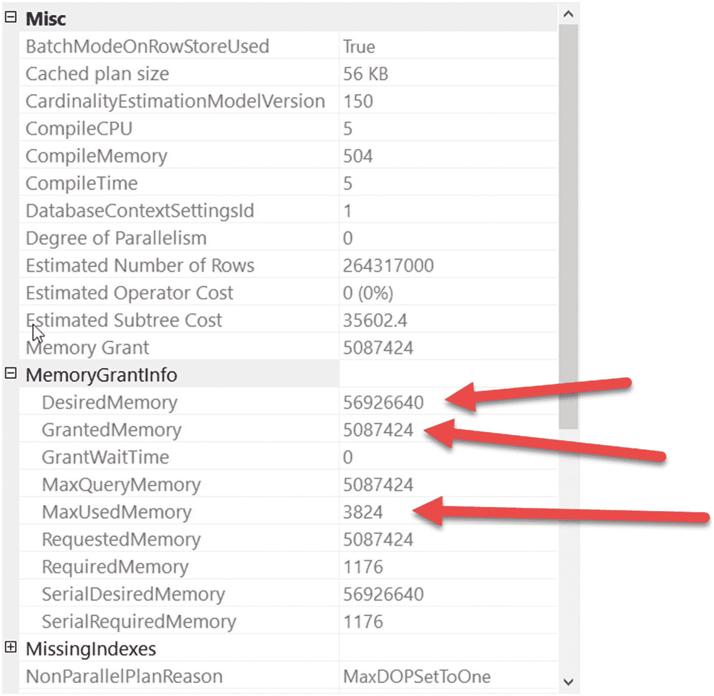

图 2-9: 过度内存授予的属性

1.  现在运行脚本 `rowmode_mgf.cmd`，该脚本将运行 T-SQL 脚本 `rowmode_mgf.sql`。

    ```
    SELECT fo.[Order Key], fo.Description, si.[Lead Time Days]
    FROM  Fact.OrderHistory AS fo
    INNER JOIN Dimension.[Stock Item] AS si
    ON fo.[Stock Item Key] = si.[Stock Item Key]
    WHERE fo.[Lineage Key] = 9
    AND si.[Lead Time Days] > 19
    ORDER BY fo.[Order Key], fo.Description, si.[Lead Time Days]
    OPTION (MAXDOP 1)
    GO
    ```

    此查询与之前的低估内存授予示例类似，但增加了 `ORDER BY` 子句以添加一个排序运算符。

    该命令行脚本将使用 `ostress` 运行此 T-SQL 查询，并发用户数为十，每个用户重复十次。在此脚本运行时，使用另一个 SQL 会话运行脚本 `dm_exec_requests.sql` 来观察查询可能遇到的等待类型。你会注意到大量的 `RESOURCE_SEMAPHORE` 等待。你可以在整个 `ostress` 脚本运行期间重复运行此脚本。这些等待解释了 `ostress` 脚本执行时间长的原因。

    此 `ostress` 脚本的总执行时间应超过 40 秒。脚本完成后，你的输出应如下所示：

    ```
     [0x000046CC] OSTRESS exiting normally, elapsed time: 00:00:43.833
     [0x000046CC] RsFx I/O completion thread ended.
    ```

2.  使用 `rowmode_mgf.sql` 执行单个查询，并在 SQL Server Management Studio 中查看查询计划的内存授予属性。使用与本章前面部分相同的技术来查看计划中 `SELECT` 操作符的属性。展开 `MemoryGrantInfo` 部分。结果应与图 2-9 相似。

以下是对关键属性的描述：

`DesiredMemory` – 这是基于基数估计的理想内存授予量。这个数字大约在 ~56Gb 左右。这真是个疯狂的数量！

`GrantedMemory` – 我们不能让这个查询拥有 56Gb 内存，所以我们只授予它大约 5Gb。这仍然是一个相当大的授予内存量。

`MaxUsedMemory` – 这是查询期间实际用于授予的内存，你可以看到只有 3Mb。这无疑是一个过度内存授予（与实际所需相比）的例子。

1.  现在，通过执行命令脚本 `turn_on_mgf.cmd`（该脚本会运行 T-SQL 脚本 `turn_on_mgf.sql`）来打开内存授予反馈。

2.  让我们再次运行工作负载，执行 `rowmode_mgf.cmd`。执行时间应缩短一半（通常在 20 秒左右）。如果在 `ostress` 脚本运行时运行 `dm_exec_requests.sql`，你会看到短暂的 `RESOURCE_SEMAPHORE` 等待峰值，然后它就会消失，因为内存授予反馈已生效，并减少了内存授予的大小，使其更符合查询的实际需要。

### 提示

尝试第二次运行 `rowmode_mgf.cmd`。它是否更快？实际上现在可能会运行得稍快一些。这是因为当你第一次运行 `rowmode_mgf.cmd` 时，查询的最初执行非常快，缓存的计划尚未用新的授予进行更新。但随着后续执行的进行，它们使用了新的授予。当你第二次运行 `rowmode_mgf.cmd` 时，所有查询都在使用新的内存授予。

1.  如果你查看 `rowmode_mgf.sql` 的内存授予中 `SELECT` 操作符的属性，你会看到内存授予数字更接近查询应该使用的数值。

2.  通过运行脚本 `adjustrgback.cmd` 和 `restore_orderhistory_state.cmd` 来恢复数据库状态、表统计信息和资源调控器设置。

## 注意

即使有反馈系统，在某些情况下，实际需要的内存授予量也可能非常大。大到并发用户将遇到 `RESOURCE_SEMAPHORE` 等待，导致 SQL Server 内部出现内存压力。在这些情况下，你可以使用资源调控器来限制授予的内存量。有关如何更改此设置，请参阅文档 [`CREATE WORKLOAD GROUP`](https://docs.microsoft.com/en-us/sql/t-sql/statements/create-workload-group-transact-sql)。在 SQL Server 2019 中，此值现在可以是浮点数，因此小于 1% 的值是有效的。这对于具有大量内存的系统可能很重要。此外，你可以在查询级别设置这些值。请参阅文档 [`查询提示 (Transact-SQL) 参数`](https://docs.microsoft.com/en-us/sql/t-sql/queries/hints-transact-sql-query%2523arguments)。

这个系统设计得很好，确实可以为你节省对需要内存授予的工作负载进行昂贵调优的时间。

有几种情况不会启用或不会生效内存授予反馈：

*   未检测到溢出，或使用了 50% 的授予内存。
*   存在波动，其中内存授予被持续减少和增加。


### 表变量延迟编译

当你在微软工作了 26 年，你会遇到很多人。我遇到的很多人中，有比我更聪明的，坦率地说，也比我更友善。Jack Li 就是其中之一。Jack 曾在德克萨斯州欧文市的办公室与我一起在 CSS 技术支持部门共事多年。几年前，在我加入之后，Jack 有机会进入 SQL 工程团队工作。有一天，他一如既往地谦逊地问我是否应该接受这份工作。我毫不犹豫。我告诉他，他具备成为顶尖开发人员的所有技能，并且在 SQL Server 性能方面拥有独特的技能。尽管 CSS 失去了他们最优秀的员工之一，但我们的工程团队因此获益。

Jack 在新工作中接手的第一个项目就是解决表变量的著名问题——**基数估计**。自从表变量存在以来，就一直存在一个固有问题：无论向表变量中填充了多少行，SQL Server 优化器的基数估计始终是 1 行。诚实地讲，优化器不知道表变量中实际有多少行，因为表变量是在批处理或存储过程中定义和填充的。事实上，当 Jack 还在支持部门时，他写过一篇关于此问题和跟踪标志解决方案的博客：[`https://blogs.msdn.microsoft.com/psssql/2014/08/11/having-performance-issues-with-table-variables-sql-server-2012-sp2-can-help/`](https://blogs.msdn.microsoft.com/psssql/2014/08/11/having-performance-issues-with-table-variables-sql-server-2012-sp2-can-help/)。

这意味着，当 Jack 加入团队时，他非常了解这个问题。查询处理器团队的领导有一个想法，希望将其作为智能查询处理的一部分在 SQL Server 2019 中实现，即*表变量延迟编译*。他们找到 Jack 来构建它。

正如 SQL Server 文档在 [`https://docs.microsoft.com/en-us/sql/relational-databases/performance/intelligent-query-processing?#table-variable-deferred-compilation`](https://docs.microsoft.com/en-us/sql/relational-databases/performance/intelligent-query-processing%253F%2523table-variable-deferred-compilation) 中恰当描述的那样：“表变量延迟编译将引用表变量的语句的编译推迟到该语句第一次实际运行时。这种延迟编译行为与临时表相同。此更改导致使用实际基数，而不是原始的 1 行猜测值。”

你可以在 [`https://docs.microsoft.com/en-us/sql/t-sql/data-types/table-transact-sql?#table-variable-deferred-compilation`](https://docs.microsoft.com/en-us/sql/t-sql/data-types/table-transact-sql%253F%2523table-variable-deferred-compilation) 阅读有关如何启用和禁用表变量延迟编译的示例，包括数据库选项和查询提示。

本节所有的示例脚本可以在 `ch2_intelligent_performance\iqp\tablevariable` 找到。

让我们通过一个 T-SQL 笔记本（注意：你也可以从文件 `iqp_tablevariable.sql` 查看此功能的 T-SQL 脚本）来逐步了解这个概念。

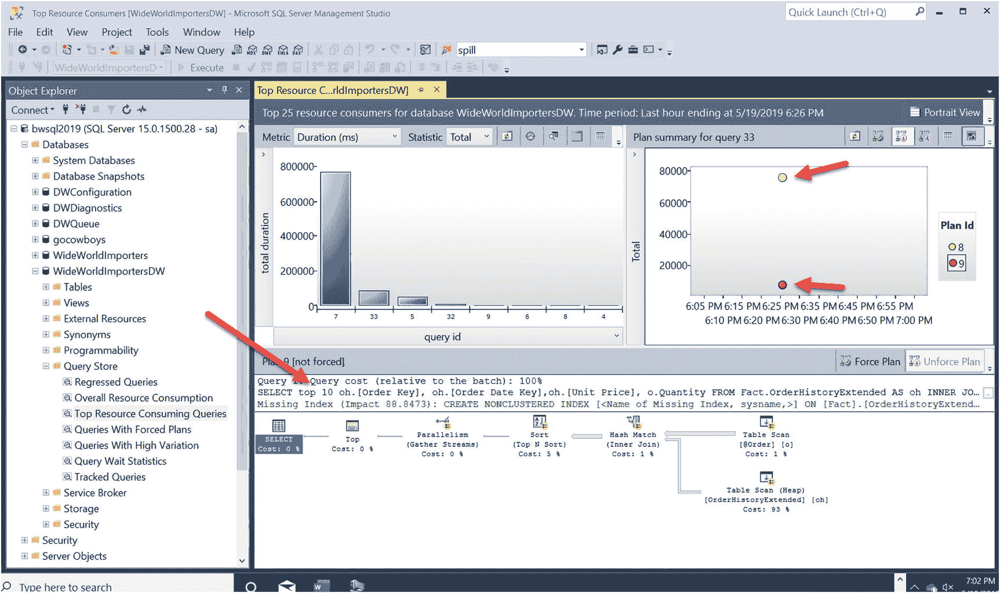
*图 2-11 表变量使用的查询计划*

1.  使用 Azure Data Studio 打开名为 `iqp_tablevariable.ipynb` 的 T-SQL 笔记本。
2.  按照笔记本中的每个步骤，比较使用和不使用延迟编译时表变量的性能。
3.  要比较这两种场景的查询计划，我们可以使用一个称为**查询存储**的功能，它在 SQL Server 2016 中引入。你可能没有意识到，但当你还原 WideWorldImportersDW 备份时，该数据库已经启用了查询存储。
4.  以下是使用查询存储比较两个查询的方法：一个使用表变量延迟编译，一个不使用。
5.  打开 SSMS，连接到你运行笔记本示例的 SQL Server，并找到“资源消耗最高的查询”报告，如图 2-10 所示。

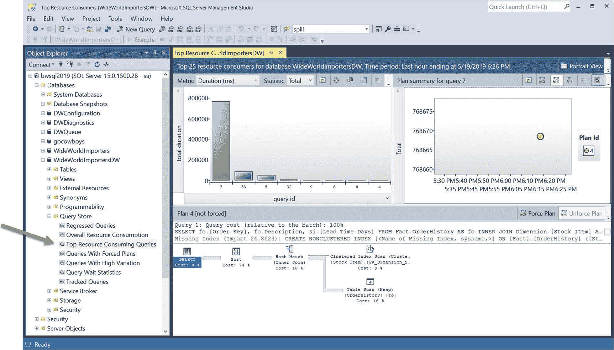
*图 2-10 查询存储的“资源消耗最高的查询”报告*

6.  图 2-10 中的报告展示了运行之前行模式内存授权反馈示例以及本节表变量示例之后的查询存储数据。根据你运行过的内容，你的视图可能看起来略有不同。图表中的每个条形代表一个唯一的查询，因此你需要找到与表变量示例相关的查询。如果你点击每个条形，查询文本会列在下方。如果你查看笔记本中此示例的存储过程查询，它类似于这样：
    ```sql
    SELECT top 10 oh.[Order Key], oh.[Order Date Key],oh.[Unit Price], o.Quantity
    FROM Fact.OrderHistoryExtended AS oh
    INNER JOIN @Order AS o
    ON o.[Order Key] = oh.[Order Key]
    WHERE oh.[Unit Price] > 0.10
    ORDER BY oh.[Unit Price] DESC
    ```
7.  点击图表中的每个条形，直到看到这个查询。注意右侧的两个点，它们代表此查询的两个查询计划。当你点击时，报告的输出应如图 2-11 所示。
图表中点的“高度”越高，表示该查询计划的平均持续时间越长。如果你点击每个点，可以在底部窗口中看到查询计划的视觉变化。

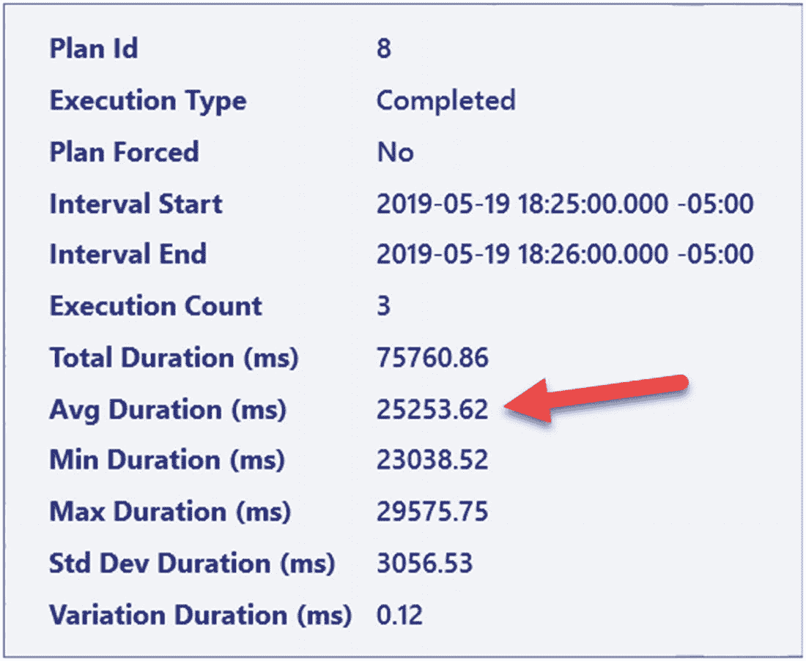
*图 2-12 较慢查询计划的平均持续时间*

8.  将光标悬停在顶部的点上，以查看该查询计划的执行统计信息。查看如图 2-12 所示的平均持续时间等统计信息。
如果你点击该点并在底部窗格中查看查询计划，将鼠标悬停在 Table Scan 运算符上。注意其估计值为 1，如图 2-13 所示。

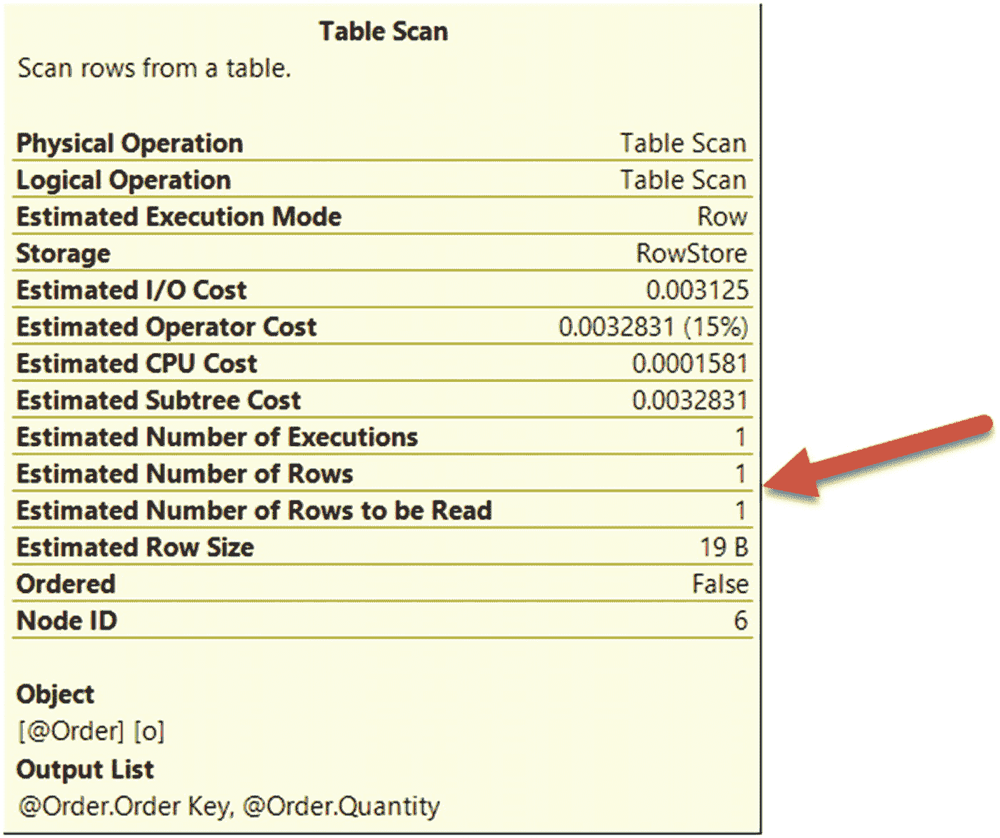
*图 2-13 表变量的估计行数为 1*

注意表变量与 OrderHistoryExtended 表的联接。它使用了一个 Nested Loops Join（嵌套循环联接）。优化器做出这个选择是有道理的，因为它*认为*表变量只有 1 行。问题在于表变量有大约 300 万行！对如此多的行使用 Nested Loops Join 将非常昂贵且不合理。

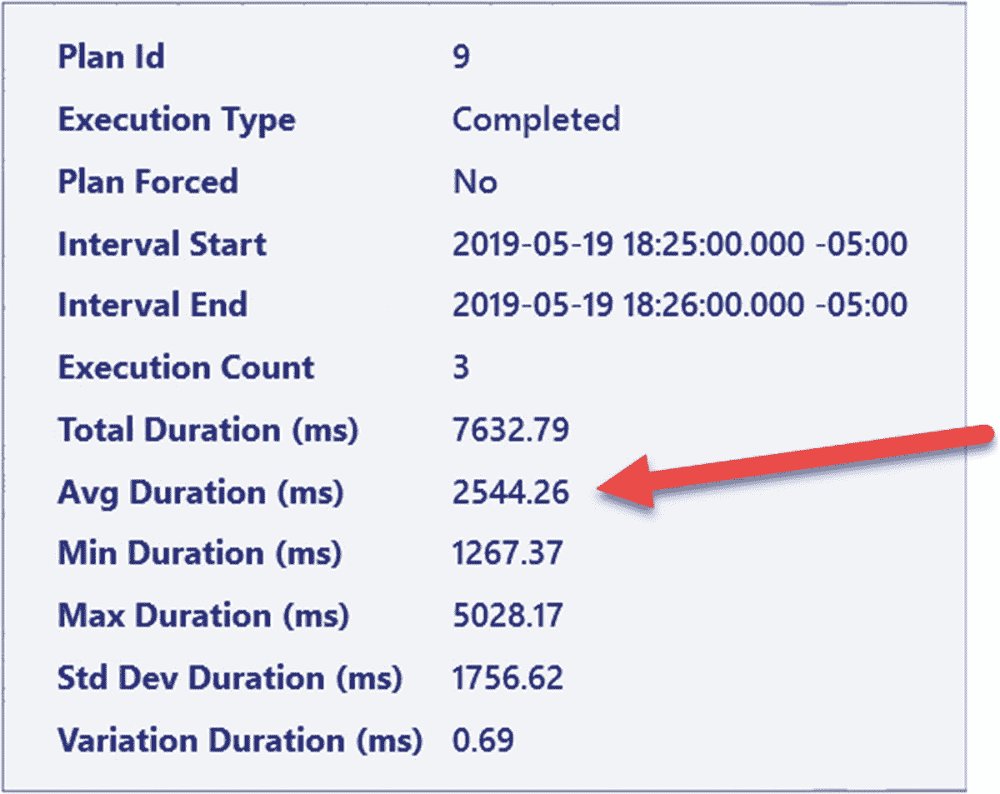
*图 2-14 较快查询计划的平均持续时间*

9.  现在点击显示查询计划窗口中“较低”的点。将鼠标指针悬停在该点上以查看平均持续时间。它应该类似于图 2-14。
2.5 秒的平均值远好于 25 秒。
现在查看查询计划。将鼠标指针移到 Table Scan 运算符上。注意估计值现在是准确的，而且，既然需要进行表扫描，使用批处理模式是有意义的。这是同时使用多个智能查询处理功能的一个例子。此运算符的详细信息应如图 2-15 所示。

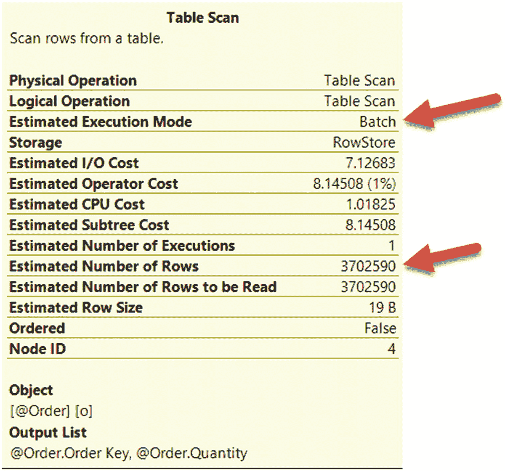
*图 2-15 使用表变量时更好的估计值*

现在查看表变量与 OrderHistoryExtended 表的联接。现在使用了一个 Hash Join（哈希联接），同时也对 OrderHistoryExtended 表进行了表扫描。


### 行存储上的批处理模式

SQL Server 2012 添加了一项巧妙（说得太轻了！）、如今非常著名的能力，称为**列存储索引**，该项目代号 Apollo。原始博客见 [`https://cloudblogs.microsoft.com/sqlserver/2011/08/04/columnstore-indexes-a-new-feature-in-sql-server-known-as-project-apollo/`](https://cloudblogs.microsoft.com/sqlserver/2011/08/04/columnstore-indexes-a-new-feature-in-sql-server-known-as-project-apollo/)。作为交付此功能的一部分，查询处理器得到增强，可与列存储索引一起使用行的**批处理模式**。在此之前，计划操作符（如扫描）执行和处理数据是基于单个行（以及整行）。批处理模式提供了一种新的范式，允许操作符基于按列组织并包含向量以标识合格行的行批来处理数据。这个概念与列存储索引非常契合，因为列存储索引是按列而非按行组织的。

虽然列存储索引对于需要扫描和处理大量行的分析查询工作负载非常有帮助，但它可能不符合您的需求，或者可能存在限制阻止您使用它。此外，您可能有一些符合“分析工作负载”场景的查询。换句话说，您并非试图查询单行或仅几行（许多人认为这是正常的“OLTP 场景”）。任何未使用列存储索引组织的表或索引都被恰当地命名为**行存储**。

在 SQL Server 2019 中，查询处理器可以自动检测您的查询是否符合在行存储上进行批处理模式处理的条件。同样，批处理模式可能并不适用于所有查询，因此必须满足一些基本条件。例如，您的查询需要处理*大量*行，并涉及需要聚合（例如 `count(∗)` 或 `sum()`）、连接或排序的操作。换句话说，当大量行在多个操作符之间流动以执行查询时，批处理才有意义。多少算大量？我们没有在文档中说明具体数字（因为将来可能会改变），但阈值通常是 128K 行。

您可以在 [`https://docs.microsoft.com/en-us/sql/relational-databases/performance/intelligent-query-processing?#batch-mode-on-rowstore`](https://docs.microsoft.com/en-us/sql/relational-databases/performance/intelligent-query-processing%253F%2523batch-mode-on-rowstore) 阅读有关行存储上批处理模式的所有详细信息，包括启用和禁用此功能。该文档文章详细介绍了此功能的背景，包括哪些工作负载会受益，以及限制和约束。

### 提示

您是否想真正深入这个主题？那么您会喜欢 SQL 社区专家 Dima Pilugin 的博客文章，他调试了神奇的 128K 数字。您可以在此处阅读该博客：[`www.queryprocessor.com/batch-mode-on-row-store/`](http://www.queryprocessor.com/batch-mode-on-row-store/)。

使用您在本章开始时恢复并扩展的 `WideWorldImportersDW` 数据库，让我们看一个示例，其中行存储的批处理模式可以加速查询性能。所有脚本示例请使用目录 **ch2_intelligent_performance\iqp\batchmoderow**。

您可以从提供的示例脚本 **iqp_batchmoderow.sql** 或从 T-SQL 笔记本 **iqp_batchmoderow.ipynb** 运行以下查询。

无论采用哪种方法，让我们一步一步来。对于本节，我鼓励您尝试 T-SQL 笔记本示例。您可以使用 `iqp_batchmoderow.sql` 和任何 SQL 工具，但您需要在图形工具（如 SSMS 或 Azure Data Studio）中分析查询计划（或详细阅读计划 XML）。

打开连接到 SQL Server 2019 实例的 Azure Data Studio，并打开 **iqp_batchmoderow.ipynb** 笔记本。

笔记本的一个美妙之处在于每个步骤和单元格的文档都在笔记本本身中。而且，保存在本书 GitHub 仓库下的笔记本已经包含了所有答案，因此您知道可以期待什么！

我甚至放入了使用 Azure Data Studio 的查询计划差异图像示例以及您应该期望看到的内容。

阅读并遵循笔记本的每个步骤。您将看到行存储上的批处理模式可以显著提高性能，尤其是在处理大型数据集表时。此外，批处理模式现在同时适用于列存储（在 SQL Server 2017 中实现）和行存储，因此您无需担心。查询处理器知道何时使用它以及如何帮助提升查询性能。

作为完整性检查，图 2-16 显示了加载后此示例笔记本顶部的样子。

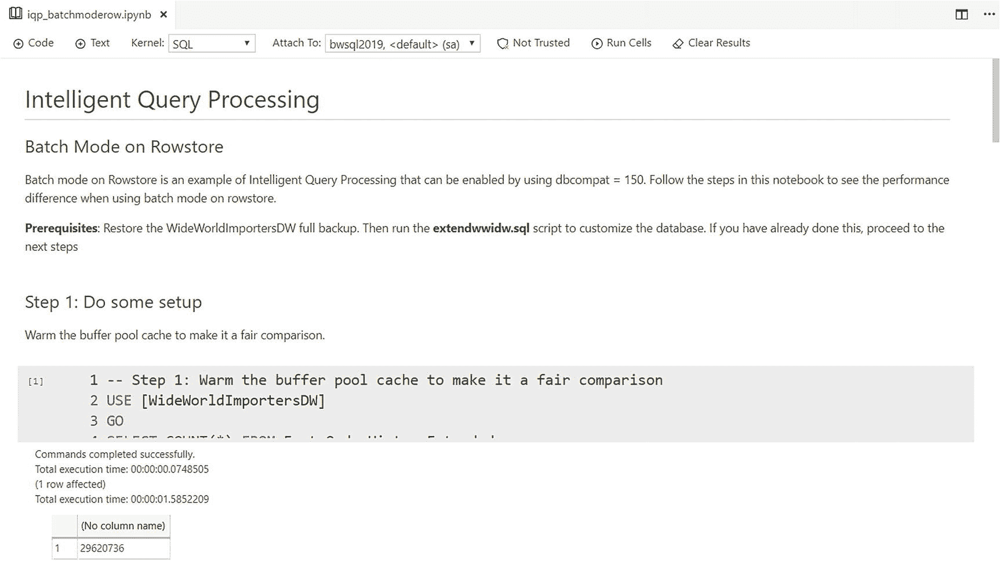

图 2-16

用于演示行存储上批处理模式的 T-SQL 笔记本

### 标量 UDF 内联

SQL Server 很久以前就有一个称为用户定义函数的概念。这个概念是您在 `FUNCTION` 中构建一些 T-SQL 代码，该函数接受一个或多个参数，并返回一个值。然后您可以在任何 T-SQL `SELECT` 语句中使用该函数。这是一种像存储过程一样的代码重用流行方式，但函数具有作为 `SELECT` 语句*一部分*的良好特性。

## 注意

用户定义函数还有其他用途，您可以在 [`https://docs.microsoft.com/en-us/sql/t-sql/statements/create-function-transact-sql`](https://docs.microsoft.com/en-us/sql/t-sql/statements/create-function-transact-sql) 阅读更多信息。

用户定义函数有两种类型：

*   标量，返回单个值
*   表值，以 `TABLE` 类型的形式返回结果集

尽管 UDF 很流行且具有编程优势，但它们的使用可能会导致性能问题，因为它们在编译和集成到整个查询计划中的方式存在限制。例如，任何时候使用标量 UDF 作为列列表的一部分来返回值，作为所访问表一部分的每一行都会被应用到 UDF 的代码中，*一次一行*。查询处理器在处理 UDF 时还有其他限制，在某些情况下，这从性能角度来看使它们效率非常低。

现在出现了标量 UDF **内联**。查询处理器可以获取代码（UDF 可能包含多个 T-SQL 语句），并能够将这些语句与整个查询集成，因此称为内联。

您可以通过使用 `dbcompat` 在 [`https://docs.microsoft.com/en-us/sql/relational-databases/user-defined-functions/scalar-udf-inlining?#enabling-scalar-udf-inlining`](https://docs.microsoft.com/en-us/sql/relational-databases/user-defined-functions/scalar-udf-inlining%253F%2523enabling-scalar-udf-inlining) 文档中阅读如何启用标量 UDF 内联。

您可以在 [`https://docs.microsoft.com/en-us/sql/relational-databases/user-defined-functions/scalar-udf-inlining?#disabling-scalar-udf-inlining-without-changing-the-compatibility-level`](https://docs.microsoft.com/en-us/sql/relational-databases/user-defined-functions/scalar-udf-inlining%253F%2523disabling-scalar-udf-inlining-without-changing-the-compatibility-level) 阅读有关如何在不更改 `dbcompat` 的情况下禁用和启用标量 UDF 内联的更多信息。

与所有这些智能查询处理场景一样，最好看一个示例。所有脚本示例请使用目录 **ch2_intelligent_performance\iqp\scalarinlineudf**。

与本章中的其他示例一样，您有两种方式来体验标量 UDF 内联。您可以使用 **iqp_scalarudfinlining.pynb** T-SQL 笔记本或使用一组 T-SQL 脚本。


## 注意事项

本文档示例基于微软的一篇博文，博文链接为[`https://blogs.msdn.microsoft.com/sqlserverstorageengine/2018/11/07/introducing-scalar-udf-inlining/`](https://blogs.msdn.microsoft.com/sqlserverstorageengine/2018/11/07/introducing-scalar-udf-inlining/)。该博文还详细介绍了标量 UDF 函数先前存在的限制，以及智能查询处理如何实现显著的性能提升。

对于本节内容，让我们结合 SQL Server Management Studio (SSMS) 中的实际执行计划来检查 T-SQL 脚本。

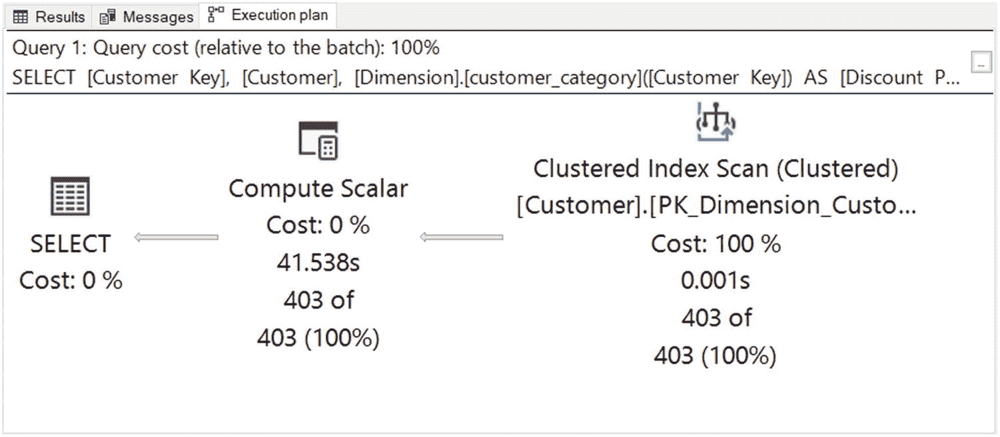
*图 2-17 未内联的标量 UDF 的执行计划*

1.  打开 T-SQL 脚本 **get_customer_spend.sql**。
该脚本代码如下：
```
    USE WideWorldImportersDW
    GO
    SELECT c.[Customer Key], SUM(oh.[Total Including Tax]) as total_spend
    FROM [Fact].[OrderHistory] oh
    JOIN [Dimension].[Customer] c
    ON oh.[Customer Key] = c.[Customer Key]
    GROUP BY c.[Customer Key]
    ORDER BY total_spend DESC
    GO
    ```
此脚本将找出 `OrderHistory` 表中每个客户的总消费金额。检查输出，您可以看到客户的消费范围从 200 万到超过 700 万。根据应用程序需求，我们需要创建一个用户定义函数，该函数以客户“键”作为输入，并根据其总消费金额将客户分类到某个类别中。任何小于等于 300 万的标记为 'REGULAR'。消费在 300 万到 450 万之间的客户标记为 'GOLD'。超过此金额的任何人将被视为 'PLATINUM'。使用函数的优势在于，我们可以更改判定 REGULAR、GOLD 或 PLATINUM 的规则，而不会影响所有其他使用此函数的代码。

2.  打开 T-SQL 脚本 **iqp_scalarudfinlining.sql**，并按照脚本中的注释执行每个步骤。

3.  执行脚本中的 **Step 1** 部分，这将创建标量 UDF。
```
    -- Step 1: 创建一个新函数，根据订单消费获取客户类别
    USE WideWorldImportersDW
    GO
    CREATE OR ALTER FUNCTION [Dimension].customer_category
    RETURNS CHAR(10) AS
    BEGIN
    DECLARE @total_amount DECIMAL(18,2)
    DECLARE @category CHAR(10)
    SELECT @total_amount = SUM([Total Including Tax])
    FROM [Fact].[OrderHistory]
    WHERE [Customer Key] = @CustomerKey
    IF @total_amount <= 3000000
    SET @category = 'REGULAR'
    ELSE IF @total_amount < 4500000
    SET @category = 'GOLD'
    ELSE
    SET @category = 'PLATINUM'
    RETURN @category
    END
    GO
    ```

4.  设置数据库兼容性级别 (`dbcompat`)，清除过程缓存，并通过执行 **Step 2** 预热缓冲池缓存。
```
    -- Step 2: 将数据库设置为 db compat 150，清除之前执行的过程缓存，并通过预热缓存使比较公平
    ALTER DATABASE WideWorldImportersDW
    SET COMPATIBILITY_LEVEL = 150
    GO
    ALTER DATABASE SCOPED CONFIGURATION
    CLEAR PROCEDURE_CACHE;
    GO
    SELECT COUNT(*) FROM [Fact].[OrderHistory]
    GO
    ```

5.  让我们运行一个使用 UDF 的查询，但使用查询提示临时禁用标量 UDF 内联。在 SSMS 中启用实际执行计划，并按脚本顺序运行 **Step 3**。
```
    -- Step 3: 运行查询，但使用查询提示禁用标量内联功能
    SELECT [Customer Key], [Customer], [Dimension].customer_category AS [Discount Price]
    FROM [Dimension].[Customer]
    ORDER BY [Customer Key]
    OPTION (USE HINT('DISABLE_TSQL_SCALAR_UDF_INLINING'))
    GO
    ```
该查询至少需要 30 多秒。实际执行计划应类似于图 2-17。
如果将鼠标指针悬停在每个运算符上，您会看到它影响了 403 行。这看起来行数并不多，那为什么需要这么长时间？这是因为您看不到的是，标量函数访问了具有 300 万+行的 `OrderHistory` 表；对于 `Dimension.Customer` 表中的每一行，它都要访问 `OrderHistory` 表中的所有 300 万行。效率很低。

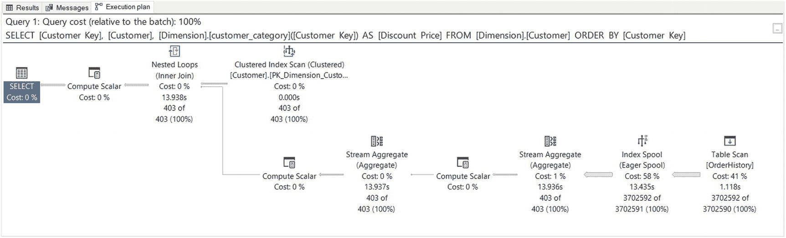
*图 2-18 启用内联的标量 UDF 的执行计划*

1.  运行脚本中的 **Step 4**，它将运行相同的查询但不使用提示，从而启用标量 UDF 内联。
```
    -- Step 4: 再次运行，但不使用提示
    SELECT [Customer Key], [Customer], [Dimension].customer_category AS [Discount Price]
    FROM [Dimension].[Customer]
    ORDER BY [Customer Key]
    GO
    ```
查询的执行速度应该显著加快。如果查看实际执行计划，您将看到运行函数所需的操作符如何在计划中展现出来，以及为了支持函数中的查询，如何使访问 `OrderHistory` 表更高效的新操作符。该计划将类似于图 2-18。

您可以看到标量 UDF 内联的强大功能；现在您应该更有信心在应用程序中使用标量 UDF 了。

您可以在[`https://docs.microsoft.com/en-us/sql/relational-databases/user-defined-functions/scalar-udf-inlining`](https://docs.microsoft.com/en-us/sql/relational-databases/user-defined-functions/scalar-udf-inlining)阅读更多关于标量 UDF 内联的信息，包括所有要求和限制。


### 近似计数不同值

存在需要统计任何表中行数的场景。这很简单，只需使用 `SELECT COUNT(*) FROM <table>` 即可得到答案。但也有些情况需要知道表中某一列在所有行中的不同值数量。此时，问题也不算太难，只需使用 `SELECT COUNT(DISTINCT <col>) FROM <table>`。这看起来足够简单，唯一的问题在于查询处理器需要做大量工作来找出所有不同的值。

对于 SQL Server，这通常需要使用 `Hash Match` 操作符。该操作符类似于 Hash Join，它使用一个“哈希表”来构建所有不同值的列表以进行计数。如果你还记得本章前面内容，Hash Join 需要一个内存授权，因此所有与内存授权相关的问题都可能出现。此外，使用哈希表来统计所有不同值会消耗大量计算资源。

有更好的方法吗？嗯，有一种不同的方法可能更快，代价是答案的精确度稍低。解决方案是一个名为 `APPROX_COUNT_DISTINCT()` 的新 T-SQL 函数。这是一个内置函数，它基于样本近似来统计列的不同值数量。这不是对 `COUNT()` 函数的增强，而是一个全新的函数，这就是为什么它不需要 `dbcompat = 150`。该函数使用了一个称为 `HyperLogLog` 的概念（你可以在 [`https://en.wikipedia.org/wiki/HyperLogLog`](https://en.wikipedia.org/wiki/HyperLogLog) 阅读更多关于此概念的内容）。使用近似值统计不同值会带来 2% 的误差率（在 97% 的概率下）。这意味着，如果你可以接受一个你认为很接近真实情况的答案，就可以使用此函数。

让我们看一个使用此函数与使用 `COUNT` 和 `DISTINCT` 的对比示例。

所有脚本示例请使用目录 `ch2_intelligent_performance\iqp\approxcount`。你可以使用 T-SQL 笔记本 `iqp_approxcountdistinct.ipynb` 来逐步查看示例。我还提供了一个名为 `iqp_approxcountdistinct.sql` 的 T-SQL 脚本。让我们使用这个 T-SQL 脚本，逐步检查查询和执行计划的差异。

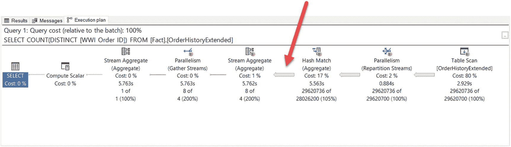

图 2-19

`COUNT` 和 `DISTINCT` 的查询计划

1.  在 SSMS 中打开 `iqp_approxcountdistinct.sql` 脚本。
2.  运行 **Step 1** 组的语句以清除过程缓存、将数据库兼容级别更改为 130，并预热缓冲池（以确保公平竞争）。

    ```sql
    -- Step 1: 清除缓存，将数据库兼容级别设置为 130 以证明其有效，并预热缓存
    USE WideWorldImportersDW
    GO
    ALTER DATABASE SCOPED CONFIGURATION CLEAR PROCEDURE_CACHE
    GO
    ALTER DATABASE WideWorldImportersDW SET COMPATIBILITY_LEVEL = 130
    GO
    SELECT COUNT(*) FROM Fact.OrderHistoryExtended
    GO
    ```

你可能会好奇为什么我强制将 `dbcompat` 设置为 130——这是为了向你证明，利用此功能不必使用最新的 `dbcompat` 150。这是因为新的 T-SQL 函数 `APPROX_COUNT_DISTINCT()` *仅仅* 随 SQL Server 2019 引擎提供，不像其他智能查询处理功能那样需要新的数据库兼容级别。

3.  在 SSMS 中启用实际执行计划，然后按如下方式运行 **Step 2**：

    ```sql
    -- Step 2: 首先使用 COUNT 和 DISTINCT
    SELECT COUNT(DISTINCT [WWI Order ID])
    FROM [Fact].[OrderHistoryExtended]
    GO
    ```

根据计算机速度，此查询运行时间不会太长——大约 4 到 5 秒。你的结果应该是 29620736。用五秒钟统计不同值并不算太糟。然而，如果这个表有一亿行或更多呢？在大型数据库中，这并不罕见。

如果你查看执行计划，会看到类似图 2-19 的内容。

注意 `Hash Match` 操作符。将鼠标悬停在该操作符上，你会看到它使用行模式，并且必须在哈希操作符中处理全部 2900 万行数据。

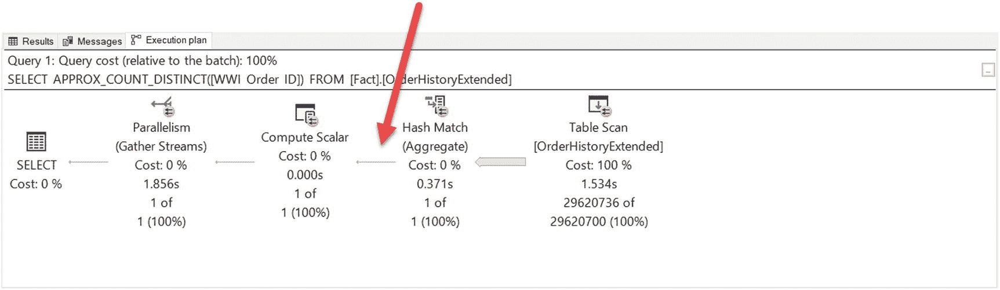

图 2-20

`APPROX_COUNT_DISTINCT` 的查询计划

1.  现在运行脚本中的 **Step 3**：

    ```sql
    -- Step 3: 使用新的 APPROX_COUNT_DISTINCT 函数来比较值和性能
    -- 我们与实际不同值的偏差不应超过 2%（97% 概率）
    SELECT APPROX_COUNT_DISTINCT([WWI Order ID])
    FROM [Fact].[OrderHistoryExtended]
    GO
    ```

这次，查询应该只需要一两秒——比之前快了约 50%。同样，在非常大的数据集上，这可能意义重大。

如果你查看执行计划，它看起来相似但操作符更少，如图 2-20 所示。

注意 `Hash Match` 操作符的输出没有“粗线”，因为近似操作随此操作符应用，只向计划的其余部分输出一行。

如你所见，使用近似值来统计不同值可以提供更好的性能，前提是你只需要一个“足够接近”的值。

1.  通过执行脚本中的 **Step 4** 将数据库兼容级别恢复为 150。

    ```sql
    -- Step 4: 恢复数据库兼容级别
    ALTER DATABASE WideWorldImportersDW SET COMPATIBILITY_LEVEL = 150
    GO
    ```

你可以在 [`https://docs.microsoft.com/en-us/sql/t-sql/functions/approx-count-distinct-transact-sql`](https://docs.microsoft.com/en-us/sql/t-sql/functions/approx-count-distinct-transact-sql) 阅读更多关于 `APPROX_COUNT_DISTINCT` 函数的内容。

智能查询处理的核心在于，一个更智能的查询处理器无需对应用程序进行重大修改即可满足你的查询工作负载需求。大多数功能只需将数据库兼容级别更改为 150 即可启用。随着查询处理器在未来基于你的反馈应对新场景，我期待看到更多的增强功能。


## 轻量级查询分析

2016 年我加入 SQL Server 工程团队时，已在技术支持部门工作多年，处理过 SQL Server 客户遇到的一些最具挑战性的问题。其中，没有任何一类问题比性能问题更让我和 CSS 部门的同事们感到棘手。SQL Server 的性能问题非常棘手——它们模糊不清、时间紧迫，而且你几乎总是在需要时无法获得所需的信息。

SQL Server 提供了强大的性能问题诊断工具，包括`动态管理视图（DMVs）`和`扩展事件`。我们构建`DMVs`是为了提供一种出色的机制，让你能随时查看`正在运行的内容`。这是了解活动会话及其正在执行查询的好方法。但通常，要解决复杂的性能问题，你需要查询计划的详细信息。

因此，差距在于深入分析。你可以看到正在运行的内容，但无法深入查看活动查询的查询计划。此外，如果你需要查找已完成查询的查询计划详情，就必须使用`扩展事件`这种可能`影响较大`的诊断方式。或者，你需要找到确切的查询，并在单独的工具中`离线`（即远离应用程序）运行它，并开启查询计划诊断来获取所有细节。

加入工程团队后，我发现著名的老虎团队正在开展工作以解决这类问题。Pedro Lopes、Alexey Eksarevskiy 和 Jay Choe 已经在研究一个名为`查询分析基础设施`的项目。如果你问任何开发人员如何追踪代码，他们会使用`分析`这个术语。那么，在 SQL Server 中如何分析查询呢？这通常归结为获取查询执行计划的详细信息。关键在于在查询运行时获取这些洞见，并在查询完成后获取实际的查询执行计划。

这个团队已经建立了`实时查询统计信息`的概念。（你可以在[`https://docs.microsoft.com/en-us/sql/relational-databases/performance/live-query-statistics`](https://docs.microsoft.com/en-us/sql/relational-databases/performance/live-query-statistics)阅读更多关于这个主题的内容。）按逻辑，他们可以做得更多。正如 Alexey 所说，“我早在 2009 年就希望产品中能有这个功能……那时花了那么多时间盯着计划看，我真希望它们能‘活’过来，以便更容易看清发生了什么。于是有了实时查询统计信息的想法。这两者完美互补，尽管当然，轻量级分析允许做更多的事情。”

事实上，团队已经构建了一个查询执行统计信息分析基础设施，即`标准分析`。此功能为你提供操作符级别的行数、`CPU`和`I/O`的实际执行计划统计信息。这是分析查询的关键信息，但有个问题。你必须在运行查询前启用此功能，或者为所有查询启用`扩展事件`，这可能会影响生产工作负载。你可以在[`https://docs.microsoft.com/en-us/sql/relational-databases/performance/query-profiling-infrastructure?#the-standard-query-execution-statistics-profiling-infrastructure`](https://docs.microsoft.com/en-us/sql/relational-databases/performance/query-profiling-infrastructure%253F%2523the-standard-query-execution-statistics-profiling-infrastructure)阅读更多关于标准分析的内容。

我喜欢与 Pedro、Alexey 和 Jay 这样的同事一起工作。他们总是问，“我们能让这个变得更好吗？”当然，他们都非常聪明。他们从经验中知道使用标准分析可能有多么痛苦。他们创建了轻量级查询执行统计信息分析基础设施，即`轻量级分析`。其理念是在不需要标准分析所需开销的情况下获取查询分析。然而，为了使其“轻量”，我们不得不移除收集`CPU`统计信息的功能，因此你仍然可以获得“每个操作符”的行数和`I/O`统计信息。你可以在[`https://docs.microsoft.com/en-us/sql/relational-databases/performance/query-profiling-infrastructure?#lwp`](https://docs.microsoft.com/en-us/sql/relational-databases/performance/query-profiling-infrastructure%253F%2523lwp)阅读更多关于轻量级分析的内容。

这很好，但是……你仍然需要`开启它`才能使其工作。你怎么知道何时启用轻量级分析呢？嗯，通常你不知道。没人知道。真正的答案就是让轻量级分析`默认运行`。而这正是 SQL Server 2019 所提供的。Pedro 称之为，“随时随地获取性能洞见。”有陷阱吗？有。你只能从正在运行的查询中获取行数信息，但这通常足以帮助查看性能问题。但还有个额外好处。我们增加了为大多数缓存查询获取上一次实际执行计划的能力。

让我们看两个场景，以便你理解在 SQL Server 2019 中默认启用轻量级查询分析的好处。

### 使用轻量级查询分析示例的先决条件

首先，你需要进行一些设置来使用两个场景的示例。对于本章的示例，你将使用`WideWorldImporters`示例数据库（你可以在[`https://docs.microsoft.com/en-us/sql/samples/wide-world-importers-oltp-database-catalog`](https://docs.microsoft.com/en-us/sql/samples/wide-world-importers-oltp-database-catalog)阅读更多关于该数据库及其架构的内容）。

这些示例适用于 Windows、Linux 和容器上的 SQL Server 2019。鉴于数据集较大，SQL Server 至少需要 12Gb `RAM`才能正确观察到性能差异。此外，部分查询示例使用了并行处理，因此更推荐在多处理器系统上安装 SQL Server。

本章使用的所有脚本都可以在 GitHub 仓库的`ch2_intelligent_performance\lwp`目录下找到。

要使用本章中的示例，你需要完成以下步骤：

1.  从[`https://github.com/Microsoft/sql-server-samples/releases/download/wide-world-importers-v1.0/WideWorldImporters-Full.bak`](https://github.com/Microsoft/sql-server-samples/releases/download/wide-world-importers-v1.0/WideWorldImporters-Full.bak)下载`WideWorldImporters`数据库备份。

2.  将此数据库还原到你的 SQL Server 2019 实例。你可以使用提供的`restorewwi.sql`脚本。你可能需要更改备份文件位置和数据库文件还原目录的路径。

3.  为了运行部分示例，你需要比`WideWorldImporters`默认安装更大的表。因此，运行脚本`extendwwi.sql`以创建更大的表。扩展此数据库将使其大小（包括事务日志）增加到总共约 5Gb。其中一张表名为`Sales.InvoiceLinesExtended`。基于`InvoiceLines`表，我们将使这张表变得更大，并且不使用列存储索引。


### 我应该终止一个活动查询吗？

考虑以下场景。有人告知你 SQL Server 正被一个查询占用，该查询在服务器上消耗了大量 CPU 资源。你使用像 `sys.dm_exec_requests` 这样的 DMV 来识别查询和用户。该用户是你的副总裁，正在运行一份报表，而查询是基于一个缓存计划。你使用常见的 DMV `sys.dm_exec_requests` 和 `sys.dm_exec_query_stats` 来查看哪个查询正在运行。你该如何判断这个查询是会很快完成，还是应该被终止并进行修正？

让我们通过以下示例来观察这种行为，并了解内置的、默认开启的轻量级查询分析如何能帮你找到答案。

你可以在任何能连接到 SQL Server 的工具中运行这些 T-SQL 脚本，但最佳体验是在 SQL Server Management Studio (SSMS) 中查看所有细节。

1.  打开 T-SQL 脚本 `mysmartquery.sql`（这名字或许暗示它没那么智能）并执行该批处理。
2.  在一个新连接中，打开 T-SQL 脚本 `show_active_queries.sql`。
3.  运行脚本中的 **步骤 1**，如下所示：

    ```
    -- 步骤 1: 仅显示除本连接外的活动查询请求
    SELECT er.session_id, er.command, er.status, er.wait_type, er.cpu_time, er.logical_reads, eqsx.query_plan, t.text
    FROM sys.dm_exec_requests er
    CROSS APPLY sys.dm_exec_query_statistics_xml(er.session_id) eqsx
    CROSS APPLY sys.dm_exec_sql_text(er.sql_handle) t
    WHERE er.session_id <> @@SPID
    GO
    ```

    此代码查找任何活动查询（当前连接除外）。如果你反复运行此查询，你会看到 `cpu` 和 `logical_reads` 的值在增加，并且 `wait_type` 为 `ASYNC_NETWORK_IO`。这种模式表明两点：
    *   该查询正在消耗大量 CPU 资源，并且很可能在扫描一个大表（`logical_reads` 值高且在增加）。
    *   有大量结果正被发送回客户端（例如，`ASYNC_NETWORK_IO` 等待）。

根据我的经验，这不是一个“好”的查询，存在“优化”的机会。但问题是，你现在应该终止它，还是它“即将完成”？

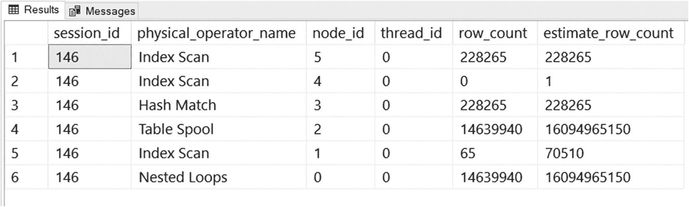

图 2-21：活动查询的查询计划分析图

1.  当查询处于活动状态时，若能了解查询计划操作符（如实时查询统计信息）的进度会很有帮助。运行脚本中的 **步骤 2**，如下所示：

    ```
    -- 步骤 2: 活动查询的查询计划分析图是什么样子
    SELECT session_id, physical_operator_name, node_id, thread_id, row_count, estimate_row_count
    FROM sys.dm_exec_query_profiles
    WHERE session_id <> @@SPID
    ORDER BY session_id, node_id DESC
    GO
    ```

    结果应类似于图 2-21。

注意嵌套循环和表假脱机操作符巨大的 `estimate_row_count`（估计行数）。同时注意 `row_count`（这是当前已处理的行数）远低于估计值。可能估计不准确，但如果估计正确，此查询还远未完成。再次运行此查询以观察这些操作符 `row_count` 的进展。

## 注意

当轻量级查询分析在 SQL Server 2019 中默认开启时，捕获的唯一统计信息是 `row_count`。默认情况下捕获 CPU 和 I/O 等统计信息可能开销较大。你可以使用标准分析来捕获这些信息。

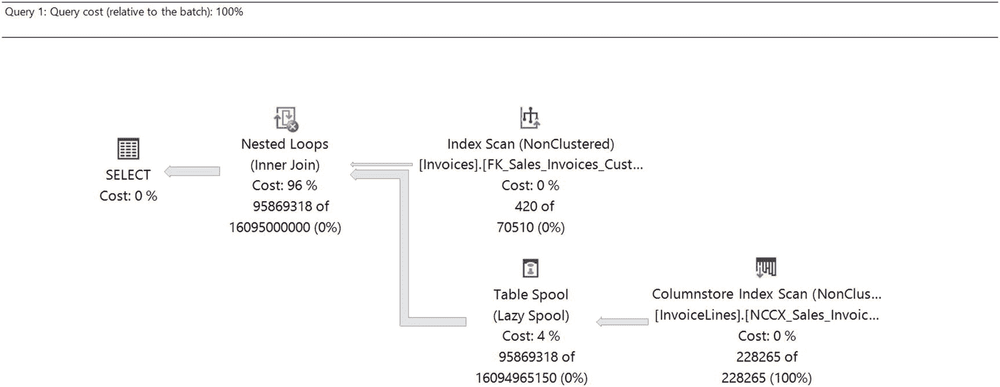

图 2-22：活动查询的查询计划

1.  让我们看一下查询计划本身。这是估计的计划，但可能为这些巨大的估计行数提供线索。运行脚本中的 **步骤 3**，如下所示：

    ```
    -- 步骤 3: 回头查看计划和查询文本以寻找线索
    SELECT er.session_id, er.command, er.status, er.wait_type, er.cpu_time, er.logical_reads, eqsx.query_plan, t.text
    FROM sys.dm_exec_requests er
    CROSS APPLY sys.dm_exec_query_statistics_xml(er.session_id) eqsx
    CROSS APPLY sys.dm_exec_sql_text(er.sql_handle) t
    WHERE er.session_id <> @@SPID
    GO
    ```

    在 SSMS 中，点击 `query_plan` 的值，这应该会打开一个带有可视化查询计划的新窗口。
    该计划应类似于图 2-22。

注意嵌套循环联接上带有 **X** 的图标符号。如果将鼠标指针悬停在嵌套循环联接操作符上，它将显示如图 2-23 所示。

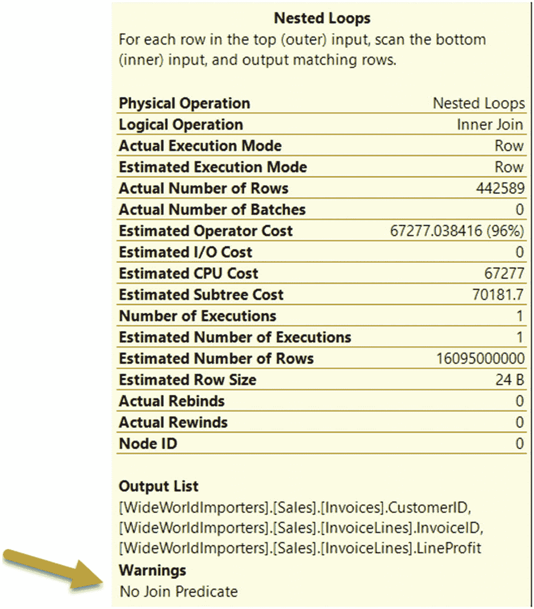

图 2-23：嵌套循环联接警告

“无联接谓词”是什么意思？这意味着查询中的 JOIN 操作符存在重大问题。这意味着实际上没有“等值”联接。

在 **步骤 3** 的结果中，查看诊断信息的 `text` 列的值。它看起来像这样：

```
SELECT si.CustomerID, sil.InvoiceID, sil.LineProfit
FROM Sales.Invoices si
INNER JOIN Sales.InvoiceLines sil
ON si.InvoiceID = si.InvoiceID
OPTION (MAXDOP 1)
```

由于 JOIN 操作符有问题，让我们专注于 INNER JOIN 子句：

```
INNER JOIN Sales.InvoiceLines sil
ON si.InvoiceID = si.InvoiceID
```

你会看到此查询只是将一个表与其自身联接。一个简单的拼写错误 `si` 与 `sil` 就是问题所在。此查询几乎永远不会完成。它可以被终止或修正，而你的副总裁会高兴得多。

1.  如果 `mysmartquery.sql` 中的查询仍在运行，请将其取消。

轻量级查询分析还包括扩展事件和查询提示支持以启用它。你可以在 `https://docs.microsoft.com/en-us/sql/relational-databases/performance/query-profiling-infrastructure?#lwp` 阅读更多关于如何启用这些功能以及如何按数据库禁用该功能的信息。


### 我抓不住它

考虑另一种场景。你观察到 SQL Server 的 CPU 使用率升高，并且认为这不应该发生（因为这与正常行为不同）。你可以从像 `sys.dm_exec_query_stats` 这样的动态管理视图（DMV）中看到哪些查询消耗了最多的 CPU，但你只能通过该 DMV 获取估计的执行计划。你可以尝试离线自行运行查询并观察实际执行计划，但你想看到来自应用程序的真实查询的实际执行计划，以确保你掌握了正确的细节。这个查询一直由许多用户运行，但每次只持续几秒钟（因此 CPU 持续处于较高水平），所以很难使用新工具来捕获正在运行的查询。你可以开启标准查询分析，但你发现那可能太重了，会在查询执行的关键时期导致应用程序问题。

SQL Server 2019 引入了一项名为轻量级查询分析的新功能。一个新的动态管理函数（DMF） `sys.dm_exec_query_plan_stats` 随 SQL Server 2019 一同提供。其理念是捕获缓存查询的上一次实际执行计划。你可以在 [`https://docs.microsoft.com/en-us/sql/relational-databases/system-dynamic-management-views/sys-dm-exec-query-plan-stats-transact-sql`](https://docs.microsoft.com/en-us/sql/relational-databases/system-dynamic-management-views/sys-dm-exec-query-plan-stats-transact-sql) 阅读关于使用此 DMF 的所有细节。

让我们看看如何使用这个 DMF 来解决一个问题：找到一个一直在运行的查询的实际执行计划，而*无需*开启任何特殊的诊断、开关或标志，也无需手动运行查询。这里唯一需要注意的是，轻量级查询分析的这一部分功能确实需要你为每个想要启用此功能的数据库启用它。你可以使用以下 T-SQL 语句来完成，该语句将在稍后的示例中使用：

```
ALTER DATABASE SCOPED CONFIGURATION SET LAST_QUERY_PLAN_STATS = ON
```

本示例的所有脚本也可以在 `ch2_intelligent_performance\lwp` 目录中找到。为了更轻松地查看可视化的执行计划，建议你使用 SSMS 运行此示例。

1.  打开 T-SQL 脚本 `mysmartquery_top.sql`。
2.  通过运行脚本中的 **Step 1** 来设置示例，如下所示：

    ```
    -- Step 1: 清除过程缓存并将数据库兼容性级别设为 130，以证明你不需 150 就能使用最后计划统计信息
    USE WideWorldImporters
    GO
    ALTER DATABASE SCOPED CONFIGURATION CLEAR PROCEDURE_CACHE
    GO
    ALTER DATABASE [WideWorldImporters] SET COMPATIBILITY_LEVEL = 130
    GO
    ALTER DATABASE SCOPED CONFIGURATION SET LAST_QUERY_PLAN_STATS = ON
    GO
    SELECT COUNT(*) FROM Sales.InvoiceLinesExtended
    GO
    ```

    将数据库兼容性级别设置为 130 只是为了证明你不需要 150 的兼容性级别就能使用此功能。

3.  现在，通过运行脚本中的 **Step 2** 来模拟统计信息不正确的情况，如下所示：

    ```
    -- Step 2: 模拟一个过期的统计信息，将其设为一个非常低的值
    UPDATE STATISTICS Sales.InvoiceLinesExtended
    WITH ROWCOUNT = 1
    GO
    ```

4.  现在运行查询。它应该只需要几秒钟，但完全消耗 CPU。运行脚本中的 **Step 3** 来执行查询，如下所示：

## 注意

你不需要选择实际执行计划，因为我们是在模拟如何独立于应用程序来查看计划。

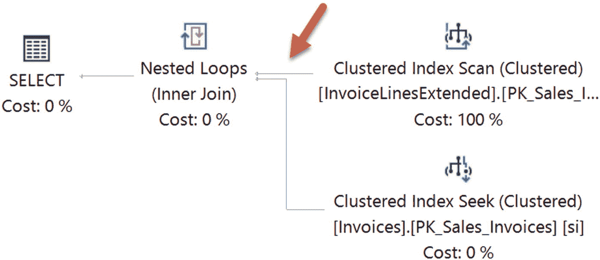

图 2-24
问题查询的估计查询计划

1.  现在，让我们使用标准的 DMV 查看此查询的估计查询计划。运行 **Step 4** 查看估计计划。记住，这允许你从不同的连接查看该查询的计划。

    ```
    -- Step 4: 估计计划怎么说？看起来像是基于估计的正确计划
    SELECT st.text, cp.plan_handle, qp.query_plan
    FROM sys.dm_exec_cached_plans AS cp
    CROSS APPLY sys.dm_exec_sql_text(cp.plan_handle) AS st
    CROSS APPLY sys.dm_exec_query_plan(cp.plan_handle) AS qp
    WHERE qp.dbid = db_id('WideWorldImporters')
    GO
    ```

    从输出中，你想找到 `text` 列值以 “**-- Step 3**” 开头的那一行。点击该行的 `query_plan` 值。你应该会看到一个类似于图 2-24 的计划。

    ```
    -- Step 3: 运行一个查询。这应该只需要几秒钟，但完全消耗 CPU
    SELECT si.InvoiceID, sil.StockItemID
    FROM Sales.InvoiceLinesExtended sil
    JOIN Sales.Invoices si
    ON si.InvoiceID = sil.InvoiceID
    AND sil.StockItemID >= 225
    GO
    ```

    注意从聚集索引扫描出来的那条线有多细。这是因为优化器估计 `InvoiceLinesExtended` 表只有一行。但这只是估计计划，所以你不知道这是否是错误的（你刚刚模拟了估计行数是错误的，但假装你并不知道这一点）。

    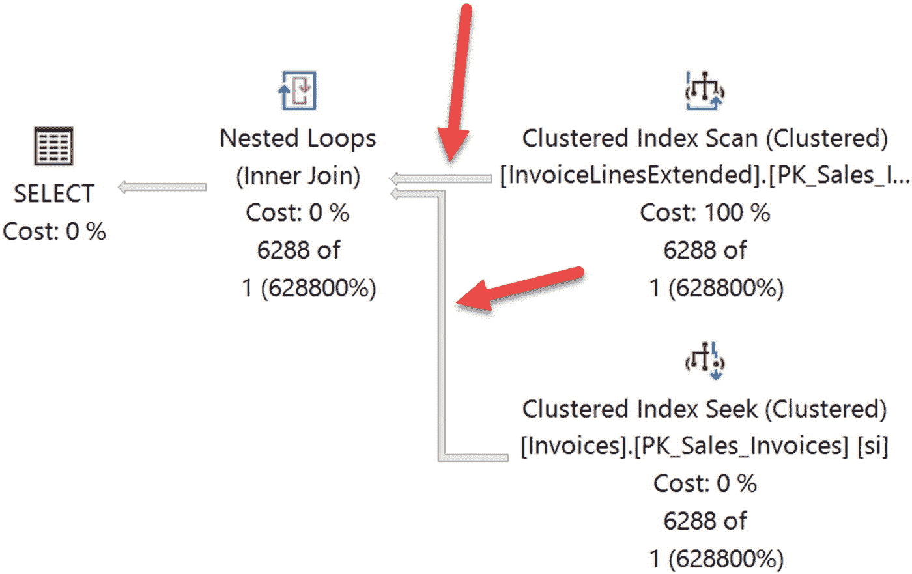

    图 2-25
    问题查询的实际查询计划

1.  现在，让我们使用新的 DMV 来获取此查询的上一次实际计划，看看估计行数是否不正确。运行 **Step 5**，如下所示：

    ```
    -- Step 5: 上一次实际计划怎么说？哎呀，实际值与估计值相差甚远
    SELECT st.text, cp.plan_handle, qps.query_plan, qps.*
    FROM sys.dm_exec_cached_plans AS cp
    CROSS APPLY sys.dm_exec_sql_text(cp.plan_handle) AS st
    CROSS APPLY sys.dm_exec_query_plan_stats(cp.plan_handle) AS qps
    WHERE qps.dbid = db_id('WideWorldImporters')
    GO
    ```

    在这个例子中，我们使用的是 `dm_exec_query_plan_stats` 而不是 `dm_exec_query_plan`。在列表中再次找到该查询，并点击 `query_plan` 值。该计划应该看起来像图 2-25。

    注意那些“更粗”的线。这是因为实际需要处理的行数远大于估计值。这是一个问题，也解释了为什么优化器选择使用嵌套循环连接并将 `InvoiceLinesExtended` 作为“外部”表（因为它认为只有一行）。

    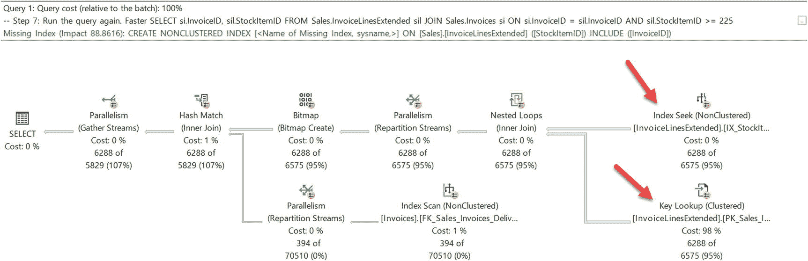

    图 2-26
    更优查询的实际计划

1.  更新统计信息以纠正它们，这样你就可以看到查询真正应该做什么。运行脚本中的 **Step 6**，如下所示：

    ```
    -- Step 6: 将统计信息更新为正确的值并清除过程缓存
    UPDATE STATISTICS Sales.InvoiceLinesExtended
    WITH ROWCOUNT = 3652240
    GO
    ALTER DATABASE SCOPED CONFIGURATION CLEAR PROCEDURE_CACHE
    GO
    ```

2.  使用脚本中的 **Step 7** 再次运行查询，让我们看看新的实际计划。你会注意到它运行得快了一点：

    ```
    -- Step 7: 再次运行查询。更快了
    SELECT si.InvoiceID, sil.StockItemID
    FROM Sales.InvoiceLinesExtended sil
    JOIN Sales.Invoices si
    ON si.InvoiceID = sil.InvoiceID
    AND sil.StockItemID >= 225
    GO
    ```

3.  运行 **Step 8** 看看新的实际计划是否更优。


## 内存数据库

在 SQL Server 2014 中，我们引入了一项名为 `In-Memory OLTP` 的功能，其核心概念是内存优化表。此功能中，整张表存储在内存中，而其特殊之处在于**优化的**（即：无锁）访问方式。我们在 SQL Server 2016 中对 `In-Memory OLTP` 进行了重大增强。你可以在 [`In-Memory OLTP (内存中 OLTP)](https://docs.microsoft.com/en-us/sql/relational-databases/in-memory-oltp)` 阅读关于该功能的更多细节。

在着手规划 SQL Server 2019 新功能时，工程团队的 Slava Oks、Pam Lahoud、Brian Carrig、Argenis Fernandez 等人共同决定，将一套新的功能套件命名为**内存数据库**，以扩充 `In-Memory OLTP` 的能力。

以下功能共同构成了内存数据库特性套件：

- `In-Memory OLTP`
- `Memory-Optimized TempDB Metadata`
- `Hybrid Buffer Pool`
- `Persistent Memory Support`

你可以在 [`内存数据库](https://docs.microsoft.com/en-us/sql/relational-databases/in-memory-database?view=sqlallproducts-allversions)` 查看此特性套件的完整集合。

在本节中，我们将介绍除 `In-Memory OLTP`（对 SQL Server 2019 而言并非新功能）之外的所有这些新能力。

### 内存优化 TempDB 元数据

自从我接触 SQL Server 以来，使用临时表的工作负载的并发性能一直是个问题。这导致几乎每一位 SQL Server 管理员都需要将 `tempdb` 配置为使用多个文件。你可以通过以下资源了解更多关于此探索历程的背景：

- Bob Ward 在 2017 年 PASS 峰会上的 Inside TempDB 演讲（[`https://www.youtube.com/watch?v=SvseGMobe2w`](https://www.youtube.com/watch?v=SvseGMobe2w)）
- Paul Randal 关于添加 `tempdb` 文件的博客（[`https://www.sqlskills.com/blogs/paul/correctly-adding-data-files-tempdb/`](https://www.sqlskills.com/blogs/paul/correctly-adding-data-files-tempdb/)）

使用 `tempdb` 文件的一个方面，大多数 SQL 专业人士并未意识到（因为现在这已成为普遍常识），即你是在为 SQL Server 引擎创建一种分区方案，以访问诸如 `PFS`、`GAM` 和 `SGAM` 等分配页。这种方案很有用，因为使用临时表的工作负载会经历繁重的创建表、分配页、删除表循环。这会在这些系统分配页上引发**闩锁**争用。通过创建多个文件，你分散了对这些页的闩锁争用，从而提升了并发 `tempdb` 工作负载的性能。

在创建多个文件后（从 SQL Server 2016 开始，安装程序可以自动完成此操作，或者你也可以手动配置），对于更繁重的并发 `tempdb` 工作负载，你可能会看到更多的页闩锁等待，但这些等待是发生在你可能不识别的对象（如 `sysschobjs`）所属的页上。这些页闩锁等待是针对 `tempdb` 中系统表页的。当你快速创建和删除表时，SQL Server 必须在系统表页上执行内部读写操作，以保持表元数据的一致性。这些操作导致跨用户的页闩锁压力。过去，当客户在支持服务中遇到系统表上的高页闩锁争用时，我通常会回答：“不幸的是，你必须减少 `tempdb` 的使用负载以避免此问题。”

Pam Lahoud 在她的博客 [`tempdb 文件、跟踪标志和更新，哦，我的天！`](https://blogs.msdn.microsoft.com/sql_server_team/tempdb-files-and-trace-flags-and-updates-oh-my/) 中对这个问题描述得非常清楚。

SQL Server 2019 提供了一个解决方案：内存优化 `tempdb` 元数据。内存优化表（还记得著名的 Hekaton 项目吗）天生无锁，且这些表的数据全部存在于内存中。如果内存优化表是“仅架构”的，它们甚至没有持久性约束。这是系统表的一个完美平台。由于 `tempdb` 在每次服务器重启时都会重新创建，系统表不需要持久性。并且由于存储在内存优化表中的唯一数据是元数据（而非你的临时表中的数据），这些表的内存消耗应该很小。此项目的首席开发人员 Ravinder Vuppula 称其为让 `tempdb` 系统表**Hekaton 化**。

安装 SQL Server 时，默认情况下 `tempdb` 元数据并不使用内存优化表。你必须运行以下 `T-SQL` 命令来启用此功能：

```sql
ALTER SERVER CONFIGURATION SET MEMORY_OPTIMIZED TEMPDB_METADATA = ON
```

你可以在 2019 年 SQLBits 主题演讲中观看我对该功能的演示：[`SQLBits 2018 主题演讲`](https://sqlbits.com/Sessions/Event18/Keynote)。Brent Ozar 在他的博客中谈及此功能（在 2018 年 `PASS` 峰会主题演讲中看到演示后）时说：“……那个 `TempDB` 改进真是太棒了。这才是真正能改变局面的实际改进。人们一直在为 `TempDB` 争用问题和他们无法解决的闩锁争用问题而苦恼。”


不过，您应该亲自尝试一下，看看实际效果。让我们看一个示例，了解内存优化的 tempdb 元数据如何提升使用临时表的应用程序的并发性。此示例的所有脚本都可以在 `ch2_intelligent_performance\inmem\tempdb` 目录中找到。这个示例运行起来稍复杂一些，需要协调或模拟并发用户。因此，您将需要一款名为 `ostress` 的免费压力测试工具，可以从 [`www.microsoft.com/en-us/download/details.aspx?id=4511`](https://www.microsoft.com/en-us/download/details.aspx%253Fid%253D4511) 下载。该工具目前需要 Windows 客户端计算机。此示例在 Linux 上安装的 SQL Server 上仍然有效；您只需要一个 Windows 客户端来通过 `ostress` 驱动并发用户工作负载。

另外，我在一个拥有八个逻辑 CPU 的虚拟机上设置了我的 SQL Server。当我运行 SQL Server 安装程序时，它自动创建了八个 tempdb 数据文件。我建议在您的系统上，如果您有八个或更多逻辑 CPU，请确保至少有八个 tempdb 数据文件。有关如何执行此操作的更多信息，请参阅此技术支持文章：[`https://support.microsoft.com/en-us/help/2154845/recommendations-to-reduce-allocation-contention-in-sql-server-tempdb-d`](https://support.microsoft.com/en-us/help/2154845/recommendations-to-reduce-allocation-contention-in-sql-server-tempdb-d)。

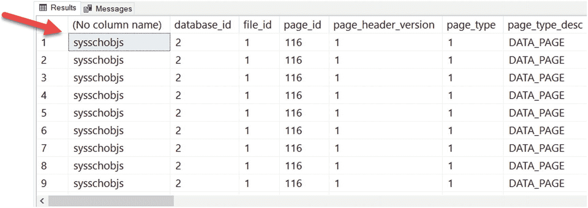
图 2-27：Tempdb 中系统表的页闩锁等待

## 1. 禁用内存优化的 tempdb 元数据

运行脚本 `disableopttempdb.cmd` 以禁用内存优化的 tempdb 元数据。默认情况下它是关闭的，但如果您曾经启用过它，请运行此脚本。您需要 *在安装了 SQL Server 的服务器上* 运行此脚本（或使用其他技术远程重启 SQL Server）。此脚本假设使用 `sysadmin` 登录和服务器名称。您可以通过将 `-Usa` 更改为 `-E` 来修改以使用集成身份验证，并且不要忘记为 `-S` 参数替换您的服务器名称：

```
sqlcmd -Usa -idisableopttempdb.sql -Sbwsql2019
net stop mssqlserver
net start mssqlserver
```

如您所见，此脚本指示 Windows Server 重启 SQL 服务。您可以在 Linux 上修改自己的脚本，使用像 `sudo systemctl restart mssql-server` 这样的命令来重启 SQL Server。

`disableopttempdb.sql` 包含以下 T-SQL 语句：

```
ALTER SERVER CONFIGURATION SET MEMORY_OPTIMIZED TEMPDB_METADATA = OFF
GO
```

## 2. 创建测试数据库和存储过程

运行 T-SQL 脚本 `tempstress_ddl.sql` 以创建一个数据库和存储过程，该存储过程仅执行一个简单的临时表创建操作：

```
DROP DATABASE IF EXISTS DallasMavericks
GO
CREATE DATABASE DallasMavericks
GO
USE DallasMavericks
GO
CREATE OR ALTER PROCEDURE letsgomavs
AS
CREATE TABLE #gomavs (col1 INT)
GO
```

您可以看到该存储过程并没有真正对临时表执行任何操作。这是为了展示能够对临时表元数据并发性造成压力的最小工作负载量（因为存储过程的任何退出都会自动删除临时表）。

## 3. 运行并发工作负载

现在您已准备好使用 `ostress` 运行并发 tempdb 工作负载。使用脚本 `tempstress.cmd` 来执行此 `ostress` 工作负载：

```
ostress -Usa -Q"exec letsgomavs" -n50 -r10000 -dDallasMavericks -Sbwsql2019
```

您可能需要调整脚本中的一些参数，包括在 Windows 上使用 `-E` 代替 `-Usa` 进行集成身份验证。您可能还想使用 `-S` 更改服务器名称。`-n50` 参数是要运行工作负载的用户数，`-r10000` 是每个用户的迭代次数。注意使用 `-Q` 直接运行存储过程，这是我在此演示的早期版本工作中学到的一个技巧。使用 `ostress` 的 `-Q` 选项直接运行查询比使用 `-i` 指定脚本更快。

如果您使用 `-Usa`，系统将提示您输入密码，然后就开始运行。根据您计算机的速度，此工作负载将需要几分钟时间。

## 4. 监控页闩锁等待

在此运行期间，在新连接中，打开 T-SQL 脚本 `pageinfo.sql`：

```
USE tempdb
GO
SELECT object_name(page_info.object_id), page_info.*
FROM sys.dm_exec_requests AS d
CROSS APPLY sys.fn_PageResCracker(d.page_resource) AS r
CROSS APPLY sys.dm_db_page_info(r.db_id, r.file_id, r.page_id,'DETAILED')
AS page_info
GO
```

此脚本使用 SQL Server 2019 中的新功能，从 `sys.dm_exec_requests` 中找到的 *资源* 中 *解析* 页面信息，并以列格式转储出页面头的各个字段。

您为什么要运行这个？这是因为当您遇到 tempdb 的闩锁等待时，会以 `<dbid>:<fileid>:<pageid>` 的形式提供一个资源。在此功能公开之前，您需要手动使用 `DBCC PAGE` 来找出闩锁等待的页面属于哪个对象，而这个命令并非官方支持。现在，这种技术为您提供了官方支持，以便在页闩锁等待场景中查明页面。

在上一步查询运行期间，您的结果应类似于图 2-27。

如前所述，`sysschobjs` 是一个系统表，也是在创建和删除临时表时常见的争用点。

## 5. 启用内存优化的 tempdb 元数据

现在让我们启用内存优化的 tempdb 元数据。在安装了 SQL Server 的服务器上运行脚本 `optimizetempdb.cmd`。此脚本运行以下命令，因此您可以使用其他方法来启用该功能并重启 SQL Server：

```
sqlcmd -Usa -ioptimizetempdb.sql -Sbwsql2019
net stop mssqlserver
net start mssqlserver
```

`optimizetempdb.sql` 包含以下 T-SQL 语句：

```
ALTER SERVER CONFIGURATION SET MEMORY_OPTIMIZED TEMPDB_METADATA = ON
GO
```

## 6. 验证功能已启用

通过检查 SQL Server 的 `ERRORLOG` 文件来确认内存优化的 tempdb 元数据已启用。您应该在 `ERRORLOG` 中看到一条类似于下面的语句：

`Tempdb started with memory-optimized metadata`。

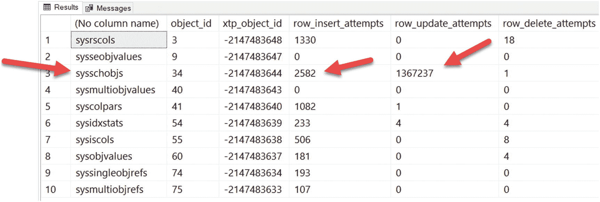
图 2-28：作为内存优化的 Tempdb 系统表

## 7. 再次运行工作负载并对比结果

现在使用 `tempstress.cmd` 再次运行工作负载。这次运行相同的工作负载将只需要大约 30 多秒，应用程序无需任何更改。

再次运行脚本 `pageinfo.sql` 以查看是否发生任何页闩锁等待。您的结果应该是 0 行！

在此运行期间，在另一个会话中，运行 T-SQL 脚本 `find_memoptimized_tables.sql`。您的结果应该类似于图 2-28。

您可以看到所有内存优化的系统表（您的结果甚至可能包含更多，因为此功能正在增强）。注意对 `sysschobjs` 的重大更改，但它并不是唯一涉及的系统表。

## 8. 检查内存消耗

您可能想知道使用此功能会消耗多少额外内存。当您仍然在此环境运行时，对 DMV `sys.dm_os_memory_clerks` 运行一个查询。您将看到一行，其中 `type = MEMORYCLERK_XTP` 且 `name = DB_ID_2`。`pages_kb` 列大致就是内存优化的 tempdb 元数据消耗的内存量，根据此示例，大约为 200Mb。


此时，您可以选择为服务器保留此选项启用状态，但如果需要关闭它，请使用脚本 `disableopttempdb.cmd`。

您可以体会到该引擎内置功能带来的巨大优势。只需开启一个服务器配置选项，重新启动 SQL Server，即可投入使用。

如果您访问 tempdb 中的目录视图，会发现使用内存优化的 tempdb 元数据时存在一些限制。您可以在以下链接中阅读有关这些限制以及此功能的所有详细信息：[`https://docs.microsoft.com/en-us/sql/relational-databases/databases/tempdb-database?view=sqlallproducts-allversions#memory-optimized-tempdb-metadata`](https://docs.microsoft.com/en-us/sql/relational-databases/databases/tempdb-database%253Fview%253Dsqlallproducts-allversions%2523memory-optimized-tempdb-metadata)。

### 混合缓冲池

持久内存设备已经存在几年了，但如今正开始变得更加普及。其概念是基于内存的硬件，通过电源保障实现数据持久性。可以想象一下 RAM 的速度，同时保证存储的任何数据在电源重启后依然存在。其中一种较为流行的持久内存产品来自英特尔，称为傲腾（Optane）([`www.intel.com/content/www/us/en/architecture-and-technology/optane-technology/optane-for-data-centers.html`](https://www.intel.com/content/www/us/en/architecture-and-technology/optane-technology/optane-for-data-centers.html))。

我们的 SQL Server 工程团队始终致力于寻找优化数据访问的方法，而持久内存带来了多种机会。事实上，SQL Server 2016 就包含了一项基于持久内存的特性，称为“日志尾部缓存”（参见 Kevin Farlee 关于该主题的博文 [`https://blogs.msdn.microsoft.com/sqlserverstorageengine/2016/12/02/transaction-commit-latency-acceleration-using-storage-class-memory-in-windows-server-2016sql-server-2016-sp1/`](https://blogs.msdn.microsoft.com/sqlserverstorageengine/2016/12/02/transaction-commit-latency-acceleration-using-storage-class-memory-in-windows-server-2016sql-server-2016-sp1/))。

由于持久内存本质上就是内存，SQL Server 可以像访问普通内存一样访问存储在持久内存设备上的任何数据。这意味着在访问持久内存设备上的数据时，SQL Server 可以创造性地绕过内核代码进行 I/O 处理。

其中一项新功能就是 `混合缓冲池`。其概念是，如果您将数据库数据文件放置在持久内存设备上，SQL Server 可以直接从该设备访问数据文件中的页面，而无需将数据从数据文件复制到缓冲池页面中。混合缓冲池使用内存映射内核调用来实现这一点。如果数据库页面被修改，则必须将其复制到缓冲池中，最终再写回持久内存设备。

使用混合缓冲池带来的性能提升因情况而异，但通常可以预期该技术会带来一定的性能提升，尤其是在读取密集型工作负载中。

对于 SQL Server，只要您已将一个或多个数据库文件放置在持久内存设备上，就可以使用以下 T-SQL 语句为 SQL Server 的所有数据库启用混合缓冲池：

```sql
ALTER SERVER CONFIGURATION SET MEMORY_OPTIMIZED HYBRID_BUFFER_POOL = ON
```

## 注意

为所有数据库启用混合缓冲池时，必须重新启动 SQL Server。

您可以使用类似以下的 T-SQL 语句为特定数据库启用混合缓冲池（这不需要重启服务器）：

```sql
ALTER DATABASE <database_name> SET MEMORY_OPTIMIZED = ON
```

要了解更多关于如何为数据库配置持久内存设备、如何禁用混合缓冲池以及使用混合缓冲池的最佳实践，请参阅以下文档：[`https://docs.microsoft.com/en-us/sql/database-engine/configure-windows/hybrid-buffer-pool`](https://docs.microsoft.com/en-us/sql/database-engine/configure-windows/hybrid-buffer-pool)。

## 持久内存支持

如果您不想启用混合缓冲池，但希望 SQL Server 能够利用持久内存设备进行数据和事务日志数据的读写，您可以在 Linux 上将您的设备配置为持久内存设备。SQL Server 将自动检测它，并使用基于内存的操作将数据移入 SQL Server 缓存和设备，从而绕过 Linux 内核 I/O 堆栈。此过程称为 `enlightenment`。

Dell EMC 通过 enlightenment 实现了显著的性能提升，详情记录于 [`www.emc.com/about/news/press/2019/20190402-01.htm`](http://www.emc.com/about/news/press/2019/20190402-01.htm)。根据戴尔的说法，“借助全新的英特尔® 傲腾™ DC 持久内存，客户可以加速内存数据库、虚拟化和数据分析工作负载，为精选的 PowerEdge 服务器提供高达 2.5 倍的内存容量。在采用 VMware ESXi 的虚拟化 Microsoft SQL Server 2019 预览版环境中，与 NVMe 驱动器相比，PowerEdge R740xd 能够将每秒事务数提升高达 2.7 倍。”

您可以在以下链接中阅读有关如何在 Linux 上为 SQL Server 启用持久内存设备的所有详细信息：[`https://docs.microsoft.com/en-us/sql/linux/sql-server-linux-configure-pmem?view=sqlallproducts-allversions`](https://docs.microsoft.com/en-us/sql/linux/sql-server-linux-configure-pmem%253Fview%253Dsqlallproducts-allversions)。

## 最后一页插入争用

这是 SQL Server 用户长期以来面临的一个常见问题。你希望创建一个包含主键的表，该主键将用于聚集索引。并且此主键是一个 `顺序` 值。换句话说，每次插入一行都会产生一个递增的新值。这种类型键最常见的形式是使用 `SEQUENCE` 对象或 `IDENTITY` 属性的列。

虽然这种设计在大多数情况下表现良好，但它会给应用程序性能带来一个具有挑战性的问题。每次查询需要修改一个数据页时，SQL Server 必须物理地保护其他查询，防止它们在同一时间更改或读取该页的结构（即使使用行级锁），这是通过页 `闩锁` 实现的。

如果有许多用户都试图修改同一页，你的应用程序可能会因为页闩锁争用而遭受性能下降。如果你在一个顺序键上构建聚集索引，数据会根据该键排序。每次插入都会试图在聚集索引叶子级别的最后一页插入一个新行。如果许多用户并发执行插入操作，他们最终可能都试图修改索引的最后一页，因此称为“最后一页插入争用”。

虽然这种争用并不理想，但通常问题不大，直到一种称为闩锁 `convoy`（车队）的现象发生。团队的高级项目经理 Pam Lahoud（也被称为 `@SQLGoddess`）给我展示了这个关于 convoy 问题的资源：[`https://blog.acolyer.org/2019/07/01/the-convoy-phenomenon/`](https://blog.acolyer.org/2019/07/01/the-convoy-phenomenon/)。对于 SQL Server 和最后一页插入争用问题，页拆分是可能形成 convoy 的一个场景示例。当一页上没有足够的行容纳新的 `INSERT` 时，就很容易发生页拆分，需要在聚集索引中创建一个新页。Pam 还用了一个非常贴切的类比来说明 convoy 问题。据 Pam 说：“交通堵塞是用来描述这个问题的常见类比。如果有一条道路已达到最大容量，只要所有车辆继续以相同的速度行驶，吞吐量将保持稳定，尽管会稍慢一些。一旦发生导致司机踩刹车的情况，例如有慢车、道路上的危险或有争议的交叉口，车辆就会堆积起来。如果汽车继续以之前的速度进入道路，交通状况只会越来越糟。司机们仍在前进，但速度非常缓慢。此时，吞吐量速率直到汽车进入道路的速率大幅下降——远低于道路通常能处理的水平——才会恢复。”

多年来，SQL 社区、技术支持和工程团队中的许多用户以多种不同的方式解决了这个问题。这篇支持文章提到了其中许多方法（[`https://support.microsoft.com/kb/4460004`](https://support.microsoft.com/kb/4460004)）。那么，有没有一种无需修改应用程序、在引擎内部的解决方案呢？当我在 SQL Server 2019 CTP 3.1 中看到我们的解决方案出现时，我知道这个问题之前已经被我们的工程团队讨论过，并提出了许多可能的解决方案。我询问了该功能的首席开发 Wonseok Kim 关于它的历史。他给我看了一封电子邮件，实际上这封邮件一直躺在我的邮件文件夹里，但我忘记了。原来是一个熟悉的名字曾致力于此方法的开发，Slava Oks，以及 SQL Server 工程团队的许多其他巨人。

该解决方案现在以一种名为 `OPTIMIZE_FOR_SEQUENTIAL_KEY` 的索引选项形式存在。通过将此选项添加到你的索引或主键约束中，你是在告诉 SQL Server 启用新代码以尝试避免 convoy 问题。此选项不会消除闩锁或防止闩锁争用问题。它所做的是尝试避免可怕的 convoy 问题，从而使你的工作负载吞吐量保持一致。你可以在我们的文档 [`https://docs.microsoft.com/en-us/sql/t-sql/statements/create-index-transact-sql?view=sqlallproducts-allversions#sequential-keys`](https://docs.microsoft.com/en-us/sql/t-sql/statements/create-index-transact-sql?view=sqlallproducts-allversions#sequential-keys) 中阅读有关此选项以及如何使用它的更多信息。

## 注意

如果你使用此选项，可能会注意到一个新的 `wait_type`，称为 `BTREE_INSERT_FLOW_CONTROL`。这是正常的，是避免或减少 convoy 问题机制的一部分。

此选项并不适合所有人。如果你没有为聚集索引使用顺序键，或者没有看到严重的争用，那么我不建议使用此选项。事实上，盲目地将其应用到任何聚集索引上，可能会导致性能更差。

如果你想亲自尝试，请确保你有一个足够“宽”的表。在我的测试中，仅创建一个具有单个 `IDENTITY` 列的表并未带来任何性能提升。你需要做的是制造足够的页拆分条件，从而引发 convoy 问题。

## 注意

文章 [`https://support.microsoft.com/kb/4460004`](https://support.microsoft.com/kb/4460004) 中描述的技术可能会为你提供更好的性能，但这种索引的新方法可能会提供你需要的稳定性能，并且对你的应用程序侵入性要小得多。

## 总结

本章非常长，它反映了 SQL Server 2019 中内置的智能性能的惊人能力，旨在帮助你在不修改应用程序的情况下提高性能。我提供了许多详细的示例，以便你可以亲身体验这些丰富的功能，以及它们如何帮助加速性能，并在你将 SQL Server 2019 部署到整个组织或使用应用程序进行开发时，为你节省性能调优的时间。

