# 3. 新的安全功能

安全性对于管理数据至关重要。SQL Server 不仅拥有构建安全产品的可靠记录，还提供了必要的功能来帮助你保护数据以及对 SQL Server 实例的访问。本章是关于我们在 SQL Server 2019 中为安全故事所增添的内容。


## 增强我们已构建的功能

在阅读并使用了关于性能的非常长的章节示例后，你可能会看着本章的页数问自己：“嘿，安全性不重要吗？”答案绝对是肯定的！对于 `SQL Server`，安全性是整个数据平台非常重要的一部分。

在 `SQL Server 2019` 中，新的安全功能及其旨在应对的*挑战*包括：

*   **`具有安全飞地的始终加密 (Always Encrypted with Secure Enclaves)`**

    提供一种端到端的加密解决方案，但不限制应用程序的查询能力。

*   **数据分类与审计**

    为 `SQL Server` 对象提供内置的分类系统，并对查看标记为分类数据的操作进行审计。

*   **`透明数据加密 (TDE)` 挂起与恢复**

    提供一种机制来调度针对数据库的高开销“静态”加密操作。

*   **证书管理**

    使 `SQL Server` 中的证书管理更加简便，包括故障转移集群实例和 Always On 可用性组场景。

这看起来可能不是一个很大的改进集合，但每个新功能都试图解决客户面临的重要安全问题，并且都源自他们的反馈。例如，将数据分类功能专门内置于 `SQL Server` 中是为了满足《通用数据保护条例》(`GDPR`)的合规要求，但它也可以用于许多分类和审计需求。

同样重要的是要记住，`SQL Server 2019` 附带了 `SQL Server 2016` 中引入的一套丰富的安全功能。这包括：

*   始终加密
*   动态数据屏蔽
*   行级安全性
*   硬件加速的透明数据加密性能

你可以在以下网址阅读所有这些安全功能： [`https://docs.microsoft.com/en-us/sql/database-engine/whats-new-in-sql-server-2016?view=sql-server-2017#security-enhancements`](https://docs.microsoft.com/en-us/sql/database-engine/whats-new-in-sql-server-2016%253Fview%253Dsql-server-2017%2523security-enhancements)。

必须记住，近十年来，根据美国国家标准与技术研究院 (`NIST`) 运行的国家漏洞数据库 (`NVD`) 的追踪，`SQL Server` 一直是漏洞最少的数据库和数据平台——并且领先幅度很大。你可以在以下网址查看所有这些详细信息： [`https://nvd.nist.gov/`](https://nvd.nist.gov/)。

让我们更详细地了解 `SQL Server 2019` 的每个新安全功能，首先从 `具有安全飞地的始终加密` 开始。

## 具有安全飞地的始终加密

在 `SQL Server 2016` 之前，你有几种加密数据的方法，包括：

*   **加密连接** – 客户端应用程序与 `SQL Server` 之间交换的所有数据（`TDS` 协议数据）都经过加密。
*   使用 **`T-SQL`** 在 `SQL Server` 表中**加密数据**（有时称为列级或单元级加密）。
*   **`透明数据加密 (TDE)`** – 加密*静态*数据，或为 `SQL Server` 数据库文件在文件级别加密数据。

这些解决方案都不提供“端到端”加密机制。更重要的是，`SQL Server` 管理员控制着用于加密数据的密钥。因此，不存在*职责分离*的概念。在当今要求严苛的安全环境中，应用程序所有者（即业务所有者）希望完全控制其数据的安全性。他们希望数据库管理员等角色管理数据平台基础设施，但不能访问业务数据或用于控制对该数据访问的密钥。

在 `SQL Server 2016` 中，我们引入了一个名为 `始终加密` 的功能来解决这些问题。`始终加密` 源自微软研究院的项目。正如微软首席软件工程师 Raghav Kaushik 所述，“...有两个项目值得一提。一个是位于雷德蒙德微软研究院的 Cipherbase 项目，旨在构建对加密数据的查询处理；另一个是位于剑桥微软研究院的 Trusted Cloud 项目，更侧重于围绕安全硬件的构建模块。”

图 3-1 展示了 `始终加密` 的架构和流程示例。

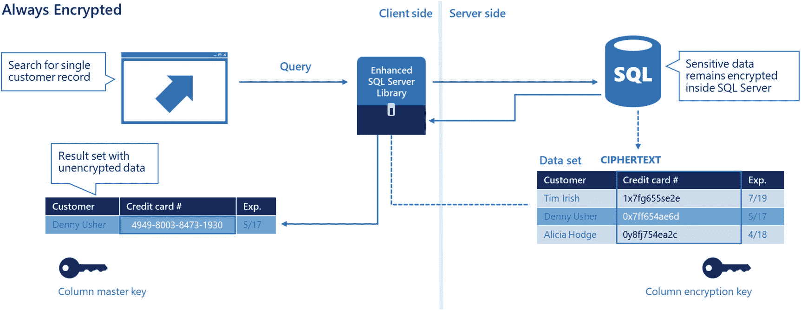

图 3-1
`SQL Server 2016` 中的 `始终加密`

其概念是客户端应用程序及其所有者控制加密生命周期。所有数据在从客户端应用程序传递到 `SQL Server` 时都是加密的，在 `SQL Server` 中以加密形式存储（在列级），并以加密形式发回客户端应用程序。只有客户端应用程序可以在应用层解密数据。此外，用于加密和解密数据的密钥实际上并不存储在 `SQL Server` 中。这些密钥的位置（由应用程序所有者拥有）存储在 `SQL Server` 中，但对这些密钥的访问由应用程序控制。

这听起来是个很棒的解决方案，但有一个缺点。因为所有的解密都发生在客户端应用程序中，所以某些查询模式不允许在数据上进行（例如，只允许相等的 `WHERE` 子句）。此外，不支持对使用 `始终加密` 加密的数据建立索引。鉴于客户端应用程序是唯一进行解密的地方，无法真正使用 `始终加密` 来构建索引。`SQL Server` 必须将作为索引一部分的加密列的所有数据发送到客户端应用程序以构建索引，然后再将其发送回服务器。因此，尽管 `始终加密` 的承诺很好，但这些限制使其...嗯，在多种场景下受到限制。

有解决方案吗？有，它以一种称为*安全飞地*的概念形式出现。

### 为什么需要飞地？

韦氏词典将飞地（enclave）定义为“被外国领土包围或似乎包围的独特领土、文化或社会单元”([`www.merriam-webster.com/dictionary/enclave`](http://www.merriam-webster.com/dictionary/enclave))。在计算机术语中，它是一个安全且独立于敌对入侵者的受保护区域。那些入侵者可能是黑客，但不幸的是，也可能是管理员或 DBA。

英特尔在其芯片组中发布了飞地的概念，称为软件防护扩展 (`SGX`)，你可以在以下网址阅读相关信息： [`https://software.intel.com/en-us/blogs/2016/06/06/overview-of-intel-software-guard-extension-enclave`](https://software.intel.com/en-us/blogs/2016/06/06/overview-of-intel-software-guard-extension-enclave)。`SGX` 在 `CPU` 中提供指令，允许创建受保护的内存区域，用于安全加密并提供免受入侵的安全避风港。这很有趣，但如果你恰好没有 `SGX` 芯片怎么办？微软提出了一种*虚拟化*飞地解决方案，称为基于虚拟化的安全 (`VBS`) 内存飞地。你可以在以下网址阅读有关 `VBS` 的所有详细信息： [`www.microsoft.com/security/blog/2018/06/05/virtualization-based-security-vbs-memory-enclaves-data-protection-through-isolation/`](https://www.microsoft.com/security/blog/2018/06/05/virtualization-based-security-vbs-memory-enclaves-data-protection-through-isolation/)。

这对 `始终加密` 意味着什么，为什么这很重要？


### 使用带安全区域的全程加密

安全区域为全程加密的“索引问题”提供了一个独特的解决方案。从客户端应用程序到 SQL Server 再返回的数据仍然是完全加密的。SQL Server 内存中和磁盘上的数据也是如此。然而，当需要解密数据时（例如，为了构建索引或支持 `富计算`），解密操作可以在服务器上的安全区域内进行。安全区域是 SQL Server 进程空间中的一个安全内存区域。这个内存区域很小，并通过安全区域 API 与引擎表达服务紧密集成。富计算是指需要进行范围查询或模式匹配（即 `LIKE`）的查询。安全区域现在为全程加密解决方案提供了这种能力。

请考虑来自 SQL Server 文档页面（[`https://docs.microsoft.com/en-us/sql/relational-databases/security/encryption/always-encrypted-enclaves`](https://docs.microsoft.com/en-us/sql/relational-databases/security/encryption/always-encrypted-enclaves)）的图 3-2，该图展示了安全区域如何以安全的方式支持解密，同时也为应用程序提供了更大的灵活性。

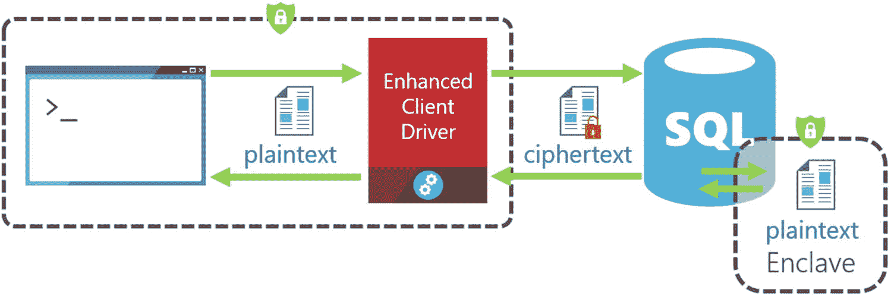

图 3-2

带安全区域的全程加密

配置全程加密从来不是面向普通的 SQL Server 用户的。它是一个针对复杂问题的复杂解决方案。但它非常强大，尤其是在现在有了安全区域之后。

带安全区域的全程加密需要另一个重要的组件，称为 `认证` 服务。客户端应用程序使用认证服务来验证用于加密的安全区域是否可以被信任。对于 `VBS` 安全区域，Windows 提供了 `Windows Defender System Guard` 运行时认证（这使用了称为主机守护服务 (`HGS`) 的技术）。您可以在 [`www.microsoft.com/security/blog/2018/04/19/introducing-windows-defender-system-guard-runtime-attestation/`](https://www.microsoft.com/security/blog/2018/04/19/introducing-windows-defender-system-guard-runtime-attestation/) 阅读更多关于 `Windows Defender System Guard` 的内容。您还可以在 [`https://docs.microsoft.com/en-us/windows/desktop/api/enclaveapi/nf-enclaveapi-callenclave`](https://docs.microsoft.com/en-us/windows/desktop/api/enclaveapi/nf-enclaveapi-callenclave) 阅读有关应用程序如何与安全区域通信的更多细节。

除了设置 `VBS` 和配置主机守护服务外，您的应用程序还必须使用支持与安全区域通信的提供程序。您可以在 [`https://docs.microsoft.com/en-us/sql/relational-databases/security/encryption/always-encrypted-enclaves?view=sqlallproducts-allversions#secure-enclave-providers`](https://docs.microsoft.com/en-us/sql/relational-databases/security/encryption/always-encrypted-enclaves%3Fview%3Dsqlallproducts-allversions%23secure-enclave-providers) 阅读有关提供程序对安全区域支持的详细信息。

在撰写本书时，SQL Server 尚未正式支持由 `Intel SGX` 等芯片制造商提供的硬件安全区域。我预计这种支持很快就会到来，您可以通过 [`https://docs.microsoft.com/en-us/sql/relational-databases/security/encryption/always-encrypted-enclaves?view=sqlallproducts-allversions#why-use-always-encrypted-with-secure-enclaves`](https://docs.microsoft.com/en-us/sql/relational-databases/security/encryption/always-encrypted-enclaves%3Fview%3Dsqlallproducts-allversions%23why-use-always-encrypted-with-secure-enclaves) 关注关于安全区域的全程加密文档以获取更新。目前 `Linux` 不支持像 `VBS` 这样的虚拟安全区域。然而，一旦 SQL Server 支持了硬件安全区域，我预计 `Linux` 的支持也会随之而来。

我没有为您构建一个完整的示例来设置和使用带安全区域的全程加密。正如本章前面所说，这不是一个面向普通 SQL Server 用户的功能。它是一个企业级功能，需要一些时间来设置。但一旦设置完成，它就非常强大。全程加密的高级项目经理和负责人 Jakub Szymaszek 提供了一些关于该主题的宝贵资源。

请使用以下 GitHub 仓库，亲自尝试一个使用 `VBS` 安全区域的全程加密示例：[`https://github.com/microsoft/sql-server-samples/tree/master/samples/features/security/always-encrypted-with-secure-enclaves`](https://github.com/microsoft/sql-server-samples/tree/master/samples/features/security/always-encrypted-with-secure-enclaves)。Jakub 还在 Microsoft Ignite 上做了一个精彩的演示，您可以通过 [`https://myignite.techcommunity.microsoft.com/sessions/65357#ignite-html-anchor`](https://myignite.techcommunity.microsoft.com/sessions/65357%23ignite-html-anchor) 获取有关带安全区域的全程加密的更多细节。

## 数据分类

随着 SQL Server 2017 的发布，我们 SQL Server 工程团队内部的安全小组在 SQL Server Management Studio (`SSMS`) 中构建了一个工具，以帮助客户对 SQL Server 数据库中的数据进行 `分类`。该工具包含一个向导、一组 `T-SQL` 逻辑和一个报告。图 3-3 显示了 `SSMS` 中的数据分类向导。

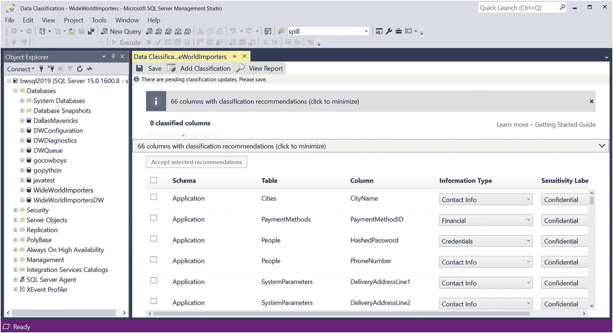

图 3-3

SSMS 中的数据分类向导

构建这样一个工具的驱动因素之一，是公司和监管机构对隐私日益增长的趋势。尤为重要的是欧盟正在制定的《通用数据保护条例》（`GDPR`）（[`https://eugdpr.org/`](https://eugdpr.org/)）。

## 提示

GDPR 法规已于 2018 年 5 月生效。如果您需要关于如何使用 SQL Server 来满足组织中 GDPR 需求的完整指南，请访问 [`www.microsoft.com/en-us/trustcenter/cloudservices/sql/gdpr`](https://www.microsoft.com/en-us/trustcenter/cloudservices/sql/gdpr)。

该工具的理念是分析数据库中的列名，并就如何通过一个`标签`和一个`信息类型`对列进行分类提出建议。`信息类型`可用于告知您列中存在何种数据（例如，联系信息、姓名、财务信息），而`标签`则可用于对存储在该列中的数据`敏感度`进行分类（机密、机密-GDPR、HIPAA 等）。

该工具会分析列名，查找与已知信息类型和敏感度相匹配的已知模式。一个简单的匹配示例是任何名称中包含“Email”一词的列。工具会提供`标签`和`信息类型`的建议，并允许您将这些信息持久化存储在数据库中。然后，您可以使用报告来查看此分类信息。

该工具虽然不错，但存在两个局限：
*   该工具使用了 SQL Server 中一个称为`扩展属性`的概念。虽然这种方法受支持且有效，但它并非存储列分类元数据的最有效方式，因为它是一种通用属性机制（您可以在 [`https://docs.microsoft.com/en-us/sql/relational-databases/system-stored-procedures/sp-addextendedproperty-transact-sql`](https://docs.microsoft.com/en-us/sql/relational-databases/system-stored-procedures/sp-addextendedproperty-transact-sql) 阅读更多关于扩展属性的内容）。
*   没有内置的对访问被标记分类列的审计功能。审计是任何分类系统的重要组成部分，也是满足 GDPR 需求所必需的。

因此，我们的团队为 SQL Server 2019（也适用于 Azure SQL Database 服务套件）开发了一个用于内置`敏感度分类`的新解决方案。内置意味着一套新的 T-SQL 语句、目录视图和审计功能。SQL Server 2019 中现在支持的分类 T-SQL 语句有：
*   [`ADD SENSITIVITY CLASSIFICATION`](https://docs.microsoft.com/en-us/sql/t-sql/statements/add-sensitivity-classification-transact-sql)
*   [`DROP SENSITIVITY CLASSIFICATION`](https://docs.microsoft.com/en-us/sql/t-sql/statements/drop-sensitivity-classification-transact-sql)

这些 T-SQL 语句会将元数据直接存储到系统表中（通过目录视图公开），这些元数据专用于与表中列关联的`标签`和`信息类型`。

现在支持一个新的目录视图来查看此元数据，称为 [`sys.sensitivity_classifications`](https://docs.microsoft.com/en-us/sql/relational-databases/system-catalog-views/sys-sensitivity-classifications-transact-sql)。

此外，SQL Server 审计现在支持一个名为`data_sensitivity_information`的新属性，可用于审计谁、在何时、试图查看分类数据。

借助这些功能，SSMS 向导已被修改为：如果操作对象是 SQL Server 2019 中的数据库，则使用新的 T-SQL 语句。这为您提供了通过 SSMS 中的工具和原生 T-SQL 支持实现内置分类和审计的能力。

## 注意

如果您使用 SSMS 17.0 或 18.0 针对 SQL Server 2019 之前的版本使用过该向导，并将该数据库还原到 SQL Server 2019，那么已分类的`扩展属性`将被迁移到新的`敏感度分类`元数据中。

让我们通过一个使用 SSMS 工具、新 T-SQL 语法、目录视图和审计功能的示例来逐步了解。

### 使用示例的先决条件

首先，您需要进行一些设置才能使用本章节中的示例。对于本章的示例，您将使用`WideWorldImporters`示例数据库（您可以在 [`https://docs.microsoft.com/en-us/sql/samples/wide-world-importers-oltp-database-catalog`](https://docs.microsoft.com/en-us/sql/samples/wide-world-importers-oltp-database-catalog) 阅读更多关于此数据库及其架构的信息）。如果您已经从第 2 章的示例中还原了该数据库，则可以继续使用该数据库。

这些示例适用于 Windows、Linux 和容器上的 SQL Server 2019。

您还需要 SQL Server Management Studio (SSMS) `18.2`或更高版本来完成示例中的所有步骤。您可以使用提供的 T-SQL 脚本完成部分步骤，但有些示例依赖于 SSMS 中内置的工具。您可以从 [`https://docs.microsoft.com/en-us/sql/ssms/download-sql-server-management-studio-ssms`](https://docs.microsoft.com/en-us/sql/ssms/download-sql-server-management-studio-ssms) 下载最新版本的 SSMS。

本章使用的所有脚本都可以在本书的 GitHub 仓库的 `ch3_new_security_capabilities\dataclassification` 目录下找到。

为了使用本章中的示例，您需要执行以下步骤（如果已经从第 2 章还原了数据库，请跳过这些步骤）：
1.  从 [`https://github.com/Microsoft/sql-server-samples/releases/download/wide-world-importers-v1.0/WideWorldImporters-Full.bak`](https://github.com/Microsoft/sql-server-samples/releases/download/wide-world-importers-v1.0/WideWorldImporters-Full.bak) 下载 WideWorldImporters 数据库备份。
2.  将此数据库还原到您的 SQL Server 2019 实例。您可以使用提供的 `restorew wi.sql` 脚本。您可能需要更改备份位置和数据库文件还原位置的目录路径。

### 数据分类操作指南

以下步骤将演示数据分类的实际操作。下一节中，你将学习如何设置审计，以跟踪试图查看设置了分类的列的用户。

#### 运行设置脚本

首先，你可能需要多次运行这些示例，因此请先运行以下脚本 `setup_classification.sql`：

```sql
-- Step 1: In case you have run these demos before drop existing classifications
USE WideWorldImporters
GO
IF EXISTS (SELECT * FROM sys.sensitivity_classifications sc WHERE object_id('[Application].[PaymentMethods]') = sc.major_id)
BEGIN
DROP SENSITIVITY CLASSIFICATION FROM [Application].[PaymentMethods].[PaymentMethodName]
END
GO
IF EXISTS (SELECT * FROM sys.sensitivity_classifications sc WHERE object_id('[Application].[People]') = sc.major_id)
BEGIN
DROP SENSITIVITY CLASSIFICATION FROM [Application].[People].[FullName]
DROP SENSITIVITY CLASSIFICATION FROM [Application].[People].[EmailAddress]
END
GO
```

#### 使用 SSMS 数据分类工具

现在，使用 SSMS 数据分类工具为 `WideWorldImporters` 数据库中的两个列添加分类。启动 SSMS，在对象资源管理器中找到 `WideWorldImporters` 数据库。右键单击并选择 **任务** ➤ **数据发现与分类** ➤ **对数据进行分类**，如图 3-4 所示。

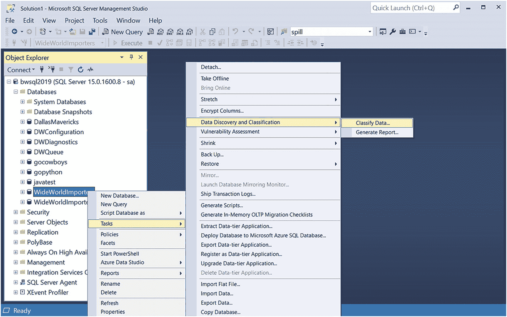

**图 3-4**

启动数据分类工具

#### 查看分类建议

该工具会分析 `WideWorldImporters` 数据库中对象的列名，并为应分类的列以及要使用的标签和信息类型创建建议。当你使用 `WideWorldImporters` 启动该工具时，应该会得到 66 个带有建议的列。单击“建议”以查看结果，如图 3-5 所示。

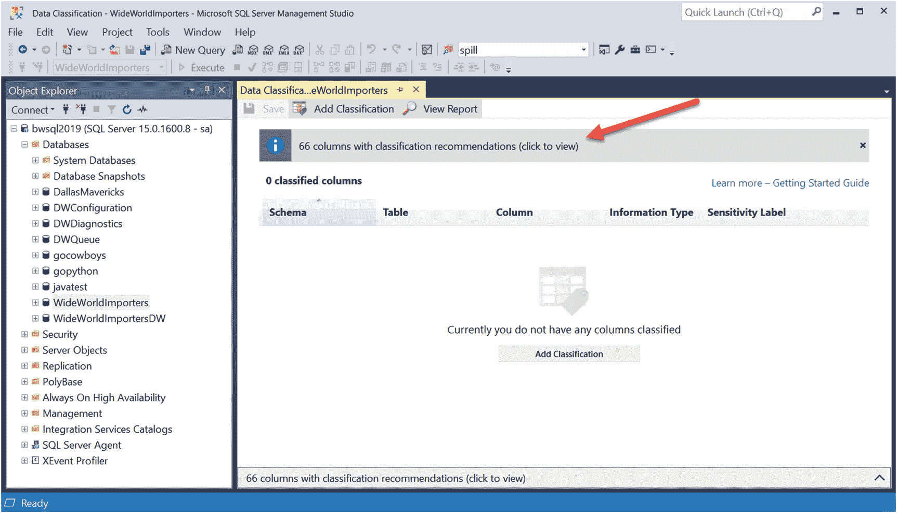

**图 3-5**

SSMS 的分类建议

#### 接受建议

你现在将看到一个列列表，其中包含建议的 `information_type`（信息类型）和（敏感性）`label`（标签）选项。这些建议的值是内置在工具中的，无法配置。不过，我会用 T-SQL 展示如何“使用你自己的系统”。勾选 `PaymentMethodName` 和 `FullName` 列以保存这些建议，然后单击 **接受所选建议**。在单击“接受”之前，你的屏幕应如图 3-6 所示。

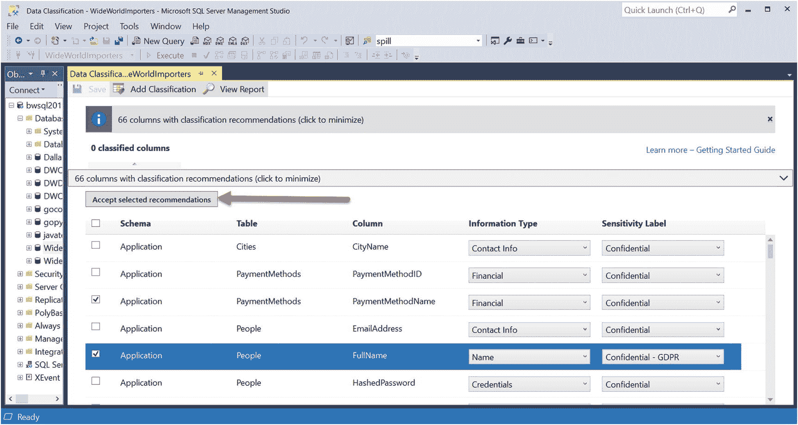

**图 3-6**

接受分类建议

请注意，`PaymentMethodName` 的建议是 `Financial`（财务）和 `Confidential`（机密）（如果你查询此表，会发现值是 `Cash`、`Check`、`Credit-Card` 和 `EFT`）。对于 `FullName`，建议是 `Name`（姓名）和 `Confidential-GDPR`（机密-GDPR）。

## 注意

该工具不保证 GDPR 合规性，甚至不会特别查看 GDPR 的详细信息。这些只是基于我们对 GDPR 的了解的建议。如果你需要将此系统用于 GDPR 目的，请务必遵循你公司的政策和程序。

#### 保存选择

单击“接受”后，工具将显示哪些列被选中，并允许你保存选择。“垃圾桶”图标允许你删除你的选择并重新选择。请注意，建议列的数量已减少 2 个。现在，选择“保存”，如图 3-7 所示。

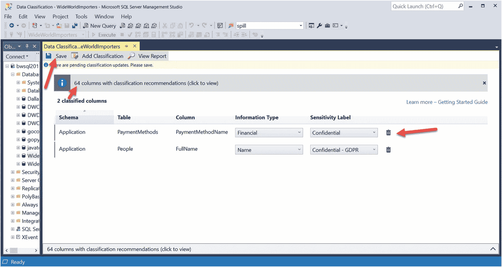

**图 3-7**

保存已接受的建议

#### 查看报告

保存后，你可以选择“查看报告”选项，以查看与你的数据库一起保存的分类的可视化报告。将在 SSMS 中为报告创建一个新选项卡。请务必单击 `Application` 架构旁边的 `+` 号以查看所有已分类的列。报告应如图 3-8 所示。

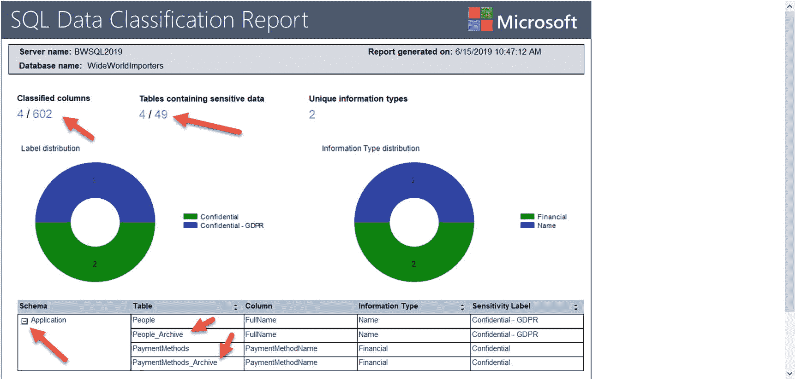

**图 3-8**

数据分类报告

该报告将查询 `sys.sensitivity_classifications` 目录视图以及数据库中的其他元数据。报告显示了在所有可能的列和表中，有多少列和表被标记了标签。报告还显示了数据库中标签和信息类型值的分布情况。请注意，在报告底部的列列表中，出现了 `People_Archive` 和 `PaymentMethods_Archive` 表。为什么？因为这些表是随系统版本临时表一起构建的。临时表（在 SQL Server 2016 中引入）提供了数据库中表随时间变化的信息（你可以在 [`https://docs.microsoft.com/en-us/sql/relational-databases/tables/temporal-tables`](https://docs.microsoft.com/en-us/sql/relational-databases/tables/temporal-tables) 阅读有关临时表的更多信息）。

由于你接受了包含临时表的表中列的建议，我们希望确保也对“隐藏”存档表中的列进行分类。你不会直接访问那些列，但 SQL Server 会持久保存存档表。因此，对临时数据的任何访问也可以被审计。

**注意**

不允许直接从时态数据中为归档表添加敏感度分类。当您删除某列的敏感度分类时，该列所在归档表的分类也会被一并删除。

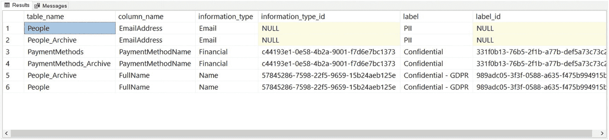
**图 3-10：来自工具和 T-SQL 的分类**

1.  如果您回到保存了建议的选项卡，会看到一个 **“添加分类”** 的选项。这是一种让您通过工具手动添加敏感度分类的方式，可用于覆盖建议，或为未被推荐的列进行分类。您仍然可以获得工具提供的标签和信息类型选项。如果您点击“添加分类”，界面将如图 3-9 所示。
    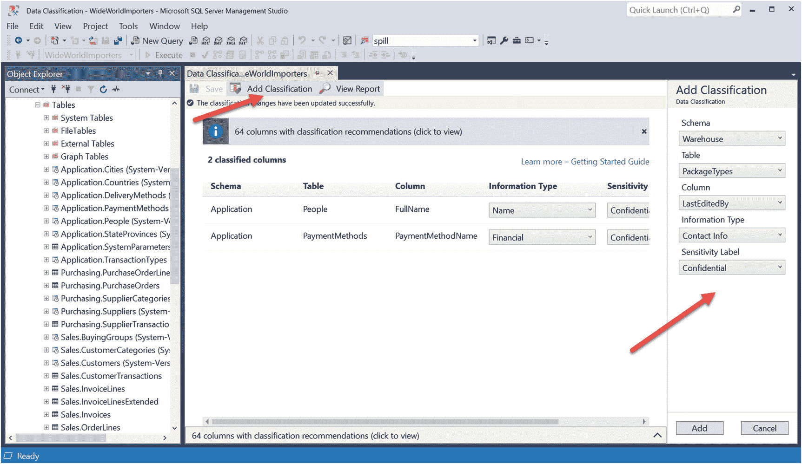
    **图 3-9：通过工具手动添加分类**

2.  工具很好用，但您可能也想直接使用 T-SQL 来添加您自己的分类和体系。首先，使用脚本 `findclassifications.sql` 来查看如何使用 T-SQL 查看所有现有分类。
    ```sql
    USE WideWorldImporters
    GO
    SELECT o.name as table_name, c.name as column_name, sc.information_type, sc.label
    FROM sys.sensitivity_classifications sc
    JOIN sys.objects o
    ON o.object_id = sc.major_id
    JOIN sys.columns c
    ON c.column_id = sc.minor_id
    AND c.object_id = sc.major_id
    ORDER BY sc.information_type, sc.label
    GO
    ```
    您的结果应该与报表中的结果相同。

3.  要通过 T-SQL 添加您自己的分类，请使用脚本 `addclassification.sql`。运行每个步骤来添加分类并查看新结果。您可以根据需要输入任何 `label`（标签）和 `information_type`（信息类型）值。在这个例子中，我选择了与工具不同的标签和类型。由于这是一个电子邮件地址，我将类型设为 `Email`，标签设为 `PII`（代表个人身份信息）。本质上，这些只是我们存储的与列关联的字符串值。但就像任何正在构建和设计的系统一样，一个好的分类体系会对公司及数据库应使用哪些 `label` 和 `information_type` 标签规定一些结构，正如我们稍后将看到的，这些元数据将以这种方式出现在审计中。
    ```sql
    -- 步骤 1：添加分类
    ADD SENSITIVITY CLASSIFICATION TO
    [Application].[People].[EmailAddress]
    WITH (LABEL='PII', INFORMATION_TYPE="Email")
    GO
    -- 步骤 2：查看所有分类
    USE WideWorldImporters
    GO
    SELECT o.name as table_name, c.name as column_name, sc.information_type, sc.information_type_id, sc.label, sc.label_id
    FROM sys.sensitivity_classifications sc
    JOIN sys.objects o
    ON o.object_id = sc.major_id
    JOIN sys.columns c
    ON c.column_id = sc.minor_id
    AND c.object_id = sc.major_id
    ORDER BY sc.information_type, sc.label
    GO
    ```
    您的结果应如图 3-10 所示。

在这些结果中，请注意工具添加的列具有 `information_type_id` 和 `label_id` 的值。T-SQL 语句 `ADD SENSITIVITY CLASSIFICATION` 支持使用 GUID 值来标记标签和类型的字符串。如果您的公司构建了一个分类系统来存储所有可接受的标签和类型，这一点可能特别有价值。您现在可以通过 GUID 值引用任何标签或类型，不过生成 GUID 值的工作需要您自己完成。

**提示**

T-SQL 函数 `NEWID()` 可用于在 SQL Server 中生成唯一的 GUID 值。您可以在 [`docs.microsoft.com/en-us/sql/t-sql/functions/newid-transact-sql`](https://docs.microsoft.com/en-us/sql/t-sql/functions/newid-transact-sql) 找到更多详细信息。

到目前为止一切顺利。这看起来是一个相当简单直接的系统，事实也确实如此。但它的效果完全取决于您选择使用的 `label` 和 `information_type` 值。T-SQL 支持的优点在于，任何支持 T-SQL 的应用程序现在都可以构建分类系统并进行查询，因为通过 T-SQL 也支持编目视图。

那么审计呢？请继续下一节了解其工作原理。请保持所有设置不变，以便利用前面这些步骤来展示审计的工作方式。

### 审计与数据分类

拥有列的敏感度分类元数据很有价值，但更有价值的功能是，审计应能自动拾取用户查看标有这些分类的列的操作。

现代版本的 SQL Server 包含一个名为`SQL Server Audit`的内置功能。基于扩展事件技术，`审计`提供了众多选项和一个丰富的审计系统。你可以在 [`https://docs.microsoft.com/en-us/sql/relational-databases/security/auditing/sql-server-audit-database-engine`](https://docs.microsoft.com/en-us/sql/relational-databases/security/auditing/sql-server-audit-database-engine) 阅读关于`SQL Server Audit`完整功能的更多信息。

审计以记录格式生成，每个`审计事件`都附带各种属性。SQL Server 2019 新增了一个名为`data_sensitivity_information`的审计事件属性。例如，如果你正在对某些表（你已在这些表的列上添加了敏感度分类）上的`SELECT`语句进行审计，并且这些列是`SELECT`“列表”的一部分以查看数据，那么`data_sensitivity_information`列将显示此次访问。

让我们延续之前的例子，看看审计如何与敏感度分类协同工作。

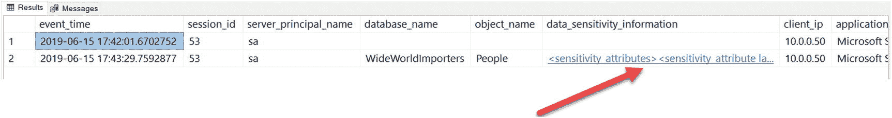

**图 3-11** 对带有分类的表进行单次表扫描的审计

1.  由于你可能多次运行这些示例，并且不想每次都必须还原数据库，首先运行脚本 `dropsqlaudit.sql`。

    ```sql
    -- Step 1: Disable the audits and drop them
    USE WideWorldImporters
    GO
    IF EXISTS (SELECT * FROM sys.database_audit_specifications WHERE name = 'People_Audit')
    BEGIN
    ALTER DATABASE AUDIT SPECIFICATION People_Audit
    WITH (STATE = OFF)
    DROP DATABASE AUDIT SPECIFICATION People_Audit
    END
    GO
    USE master
    GO
    IF EXISTS (SELECT * FROM sys.server_audits WHERE name = 'GDPR_Audit')
    BEGIN
    ALTER SERVER AUDIT GDPR_Audit
    WITH (STATE = OFF);
    DROP SERVER AUDIT GDPR_Audit
    END
    GO
    -- Step 2: Remove the .audit files from default or your path
    -- del C:\program files\microsoft sql server\mssql15.mssqlserver\mssql\data\GDPR*.audit
    ```

    注意，步骤 2 是脚本中用于删除文件的注释。当你运行审计时，它会在你指定的路径中创建文件。当你禁用并删除审计后，这些文件仍会留在该目录中。为了保持示例干净，请手动删除之前执行留下的任何文件。

2.  打开脚本 `setupsqlaudit.sql` 以创建并启动审计。我不会深入探讨审计和规范如何工作的细节。通过我提供的语法，你可以看到审计被设置为跟踪 `WideWorldImporters` 数据库中 `[Application].[People]` 表上的 `SELECT` 语句。请查阅审计相关文档以了解更多：[`https://docs.microsoft.com/en-us/sql/relational-databases/security/auditing/sql-server-audit-database-engine`](https://docs.microsoft.com/en-us/sql/relational-databases/security/auditing/sql-server-audit-database-engine)。

    ```sql
    USE master
    GO
    -- Create the server audit.
    CREATE SERVER AUDIT GDPR_Audit
    TO FILE (FILEPATH = 'C:\program files\microsoft sql server\mssql15.mssqlserver\mssql\data')
    GO
    -- Enable the server audit.
    ALTER SERVER AUDIT GDPR_Audit
    WITH (STATE = ON)
    GO
    USE WideWorldImporters
    GO
    -- Create the database audit specification.
    CREATE DATABASE AUDIT SPECIFICATION People_Audit
    FOR SERVER AUDIT GDPR_Audit
    ADD (SELECT ON Application.People BY public )
    WITH (STATE = ON)
    GO
    ```

3.  现在让我们运行一些查询，看看审计了什么。打开脚本 `findpeople.sql`，并按照脚本中的注释指导运行步骤 1 和步骤 2：

    ```sql
    -- Step 1: Scan the table and see if the sensitivity columns were audited
    USE WideWorldImporters
    GO
    SELECT * FROM [Application].[People]
    GO
    -- Step 2: Check the audit
    -- The audit may not show up EXACTLY right after the query but within a few seconds.
    SELECT event_time, session_id, server_principal_name,
    database_name, object_name,
    cast(data_sensitivity_information as XML) as data_sensitivity_information,
    client_ip, application_name
    FROM sys.fn_get_audit_file ('C:\program files\microsoft sql server\mssql15.mssqlserver\mssql\data\*.sqlaudit',default,default)
    GO
    ```

    你的结果应如图 3-11 所示。

    在这个例子中，你运行了一个从 `People` 表中选择所有列的查询。`fn_get_audit_file` T-SQL 函数用于以行/列格式检索审计结果。我仅从此函数的结果集中提取了部分列。你可以在 [`https://docs.microsoft.com/en-us/sql/relational-databases/system-functions/sys-fn-get-audit-file-transact-sql`](https://docs.microsoft.com/en-us/sql/relational-databases/system-functions/sys-fn-get-audit-file-transact-sql) 查看此函数的所有参数和输出列的完整列表。

    第一行是审计已启动的记录。第二行是对 `SELECT` 语句的审计记录。注意 `data_sensitivity_information` 列值是 XML 数据类型。点击该值，SSMS 将打开一个包含完整 XML 数据的新窗口。你的结果应如图 3-12 所示。

    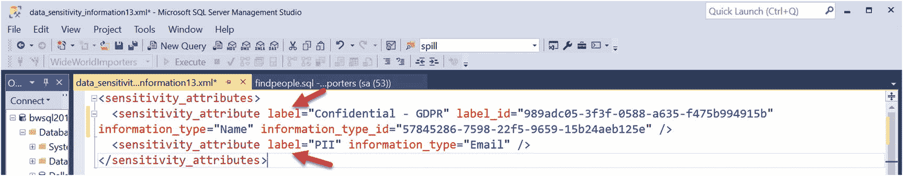

    **图 3-12** 数据敏感度详情

    XML 的详细信息包含 `SELECT` 语句访问的任何唯一`标签`和`信息类型`的属性。你现在可以获取此信息，并通过 `sys.sensitivity_classifications` 目录视图查找哪些列与这些详细信息相关联。

4.  现在执行 `findpeople.sql` 中的步骤 3 和步骤 4：

    ```sql
    -- Step 3: What if I access just one of the columns directly?
    SELECT FullName FROM [Application].[People]
    GO
    -- Step 4: Check the audit
    -- The audit may not show up EXACTLY right after the query but within a few seconds.
    SELECT event_time, session_id, server_principal_name,
    database_name, object_name,
    cast(data_sensitivity_information as XML) as data_sensitivity_information,
    client_ip, application_name
    FROM sys.fn_get_audit_file ('C:\program files\microsoft sql server\mssql15.mssqlserver\mssql\data\*.sqlaudit',default,default)
    GO
    ```

    步骤 4 的结果应如图 3-13 所示。

    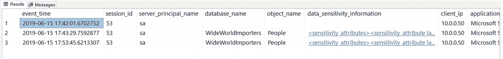

    **图 3-13** 包含对一个标记为分类的列进行`SELECT`操作的审计

    审计中存在第三行（每次`SELECT`操作会产生一行）。如果你点击 `data_sensitivity_information` 列，你将只看到一个标签，因为只选择了 `FullName` 列。

    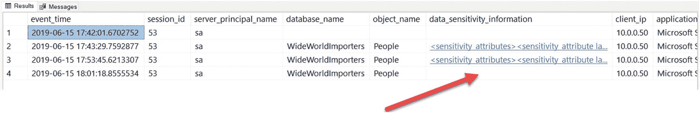

    **图 3-14** `WHERE`子句中对分类列的审计结果

5.  审计只会在分类的某个列是`SELECT`*列表*或查询输出的一部分时，才会跟踪对该分类的访问。让我们来验证一下。运行 `findpeople.sql` 中的步骤 5 和步骤 6：


```
-- 步骤 5：如果在 WHERE 子句中只引用了已分类列，会怎样？
SELECT PreferredName FROM [Application].[People]
WHERE EmailAddress LIKE '%microsoft%'
GO
-- 步骤 6：检查审核日志
-- 审核结果可能不会在查询后立即准确显示，但会在几秒钟内出现。
SELECT event_time, session_id, server_principal_name,
database_name, object_name,
cast(data_sensitivity_information as XML) as data_sensitivity_information,
client_ip, application_name
FROM sys.fn_get_audit_file ('C:\program files\microsoft sql server\mssql15.mssqlserver\mssql\data\*.sqlaudit',default,default)
GO
```

步骤 6 的结果应如图 3-14 所示。

在此示例中，查询使用 `EmailAddress` 列作为条件，为 `PreferredName` 列生成结果。`PreferredName` 未被分类，但 `EmailAddress` 已被分类。然而，由于 `EmailAddress` 不是 `SELECT` 列表的一部分，`data_sensitivity_information` 列不会被填充。

数据分类是 SQL Server 2019 中一个简单但非常强大的新功能，您可以将其添加到保持数据安全和确保组织符合任何监管政策的工具集中。此功能在 SQL Server 2019 和 Azure SQL Database 中均有效。请查阅我们团队关于信息保护的完整指南：[`https://docs.microsoft.com/en-us/azure/sql-database/sql-database-data-discovery-and-classification`](https://docs.microsoft.com/en-us/azure/sql-database/sql-database-data-discovery-and-classification)。

## 其他新安全功能

SQL Server 2019 中还有其他一些次要但重要的新安全功能，包括 TDE 的暂停和恢复，以及简化的 SQL Server 加密证书管理。

### TDE 暂停和恢复

透明数据加密（TDE）专注于对*静止*数据进行加密。这允许您独立于 SQL Server 引擎加密 SQL Server 数据库和日志文件。这样，如果有人试图访问您的数据库和/或事务日志文件，文件中的数据将被加密。TDE 已经是几个版本中都有的功能；您可以在 [`https://docs.microsoft.com/en-us/sql/relational-databases/security/encryption/transparent-data-encryption`](https://docs.microsoft.com/en-us/sql/relational-databases/security/encryption/transparent-data-encryption) 阅读更多关于如何使用它的信息。

当您为现有数据库启用 TDE 时，SQL Server 必须将*每个*数据库页从磁盘读入缓冲池，并将其写回已加密的数据库文件。加密在后台工作线程中进行，因此不会直接影响用户工作负载，但读取和写入所有数据库页可能非常密集，并消耗 CPU 和 I/O 资源。对于非常大的数据库，这可能会影响关键任务应用程序。

SQL Server 2019 引入了 TDE 加密的*暂停*和*恢复*概念。现在，您可以为数据库启用 TDE，但随后在任何时候暂停加密，并从暂停的最后一个点恢复加密。这允许您根据应用程序需求有效地安排使用 TDE 对数据库进行完整加密。

暂停 TDE 很简单，只需运行以下 T-SQL 语句：
```
ALTER DATABASE  SET ENCRYPTION SUSPEND
```
从暂停点恢复加密过程可以通过以下 T-SQL 语句完成：
```
ALTER DATABASE  SET ENCRYPTION RESUME
```
为了帮助诊断此新功能，DMV `sys.dm_database_encryption_keys` 有三个新列来查看 TDE 扫描的状态：
*   `encryption_scan_state` – 一个数字，指示 TDE 扫描是正在进行、已暂停还是已完成
*   `encryption_scan_state_desc` – 扫描状态的字符串描述，例如 RUNNING、SUSPENDED、COMPLETE
*   `encryption_scan_modify_date` – 扫描状态最后一次更改的日期/时间

这是对在非常大的 SQL Server 数据库中使用 TDE 的一个重要但微小的增强。您可以在 [`https://docs.microsoft.com/en-us/sql/relational-databases/security/encryption/transparent-data-encryption`](https://docs.microsoft.com/en-us/sql/relational-databases/security/encryption/transparent-data-encryption) 阅读更多关于 TDE 暂停和恢复的信息。

### 证书管理

假设您想要加密到 SQL Server 的连接，这是确保客户端应用程序和 SQL Server 之间的表格数据流（TDS）协议被加密的常见做法。当您使用 TLS 等协议设置加密时，需要证书。Windows 上的 SQL Server 提供了一种通过流行的程序 SQL Server 配置管理器使用证书的机制。但是，您必须首先完成所有工作，在服务器甚至多台服务器（用于故障转移群集实例（FCI）或 Always On 可用性组）上安装证书。

图 3-15 显示了 SQL Server 配置管理器的对话框，用于选择要用于 SQL Server 2017 的已安装证书。

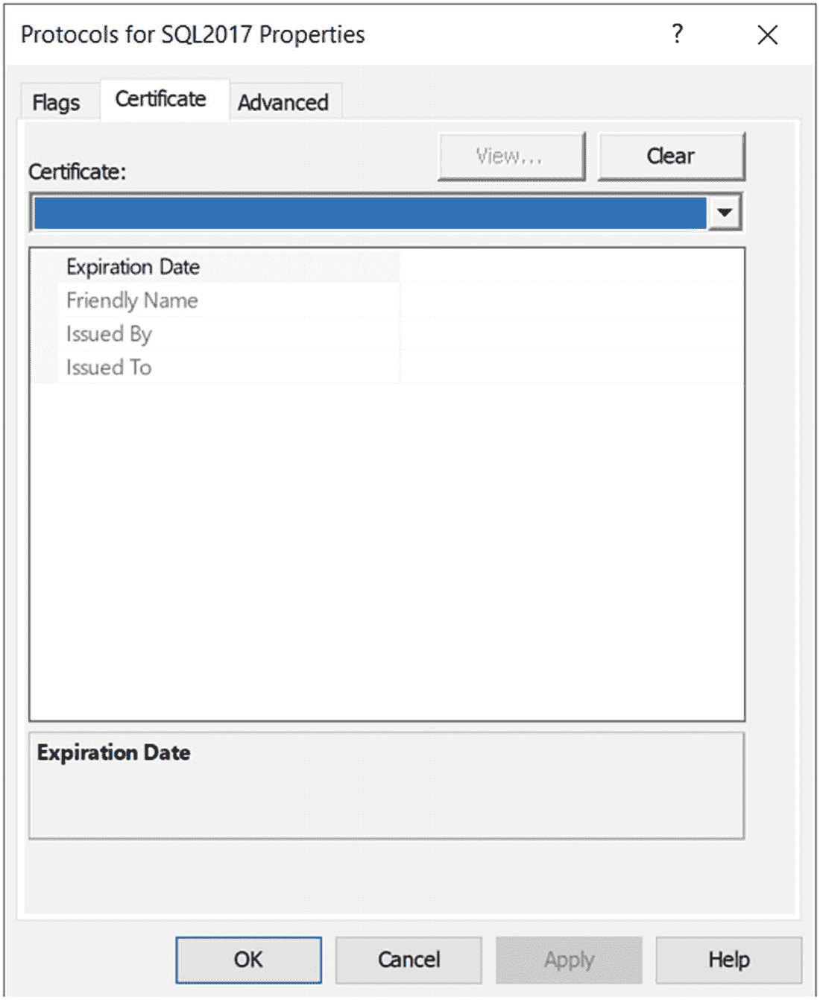

图 3-15 SQL Server 2017 和证书管理

SQL Server 2019 现在通过 SQL Server 配置管理器提供了导入证书的能力，甚至可以在故障转移群集实例或可用性组的节点之间导入证书——并且您可以从主实例执行所有这些操作。图 3-16 显示了 SQL Server 2019 上 SQL Server 配置管理器的对话框。

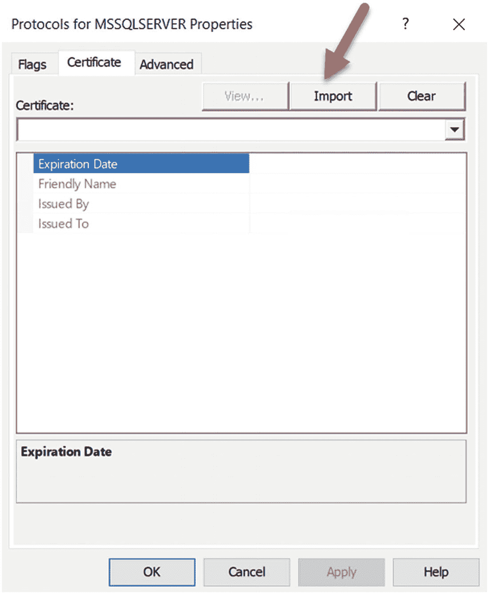

图 3-16 SQL Server 2019 和配置管理

请注意此对话框上的新“导入”按钮。您可以在 [`https://docs.microsoft.com/en-us/sql/database-engine/configure-windows/manage-certificates`](https://docs.microsoft.com/en-us/sql/database-engine/configure-windows/manage-certificates) 阅读有关如何在单台服务器或群集上使用此功能的所有说明。

## 总结

建立在 SQL Server 2016 的丰富功能（如 Always Encrypted、行级安全和动态数据屏蔽）之上，SQL Server 2019 引入了新的安全功能，如安全飞地、数据敏感度分类、TDE 暂停/恢复以及更简单的证书管理。所有这些，加上 SQL Server 以前版本中内置的所有安全功能，提供了一个正确的平台，以保持您的数据安全、可信、合规且可管理。


