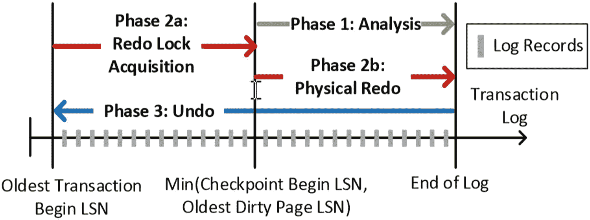

# 4. 任务关键型可用性

在前面两章中，你了解了 SQL Server 2019 中应对性能和安全性方面现代挑战的新功能。对于许多企业客户而言，确保数据库平台能够满足当今应用程序和业务挑战还有一个关键要素：*可用性*。

SQL Server 默认就提供了可用性，因为几乎所有对 SQL 的操作都可以 **联机** 完成。SQL Server 2019 通过以下旨在解决新挑战的新功能，增强了数据的联机可用性：

*   **联机索引增强**

    用户总是“鱼与熊掌兼得”。他们希望管理员保持索引健康且最新，同时又希望随时能完全访问自己的数据。SQL Server 2019 通过 `可恢复的联机索引创建` 和 `联机聚集列存储索引` 维护，增强了之前的联机索引功能。

*   **可用性组增强**

    SQL Server 的旗舰高可用性灾难恢复功能——Always On 可用性组，在 SQL Server 的每个版本中持续增强，包括支持更多副本和更好的应用程序连接重定向。

*   **加速数据库恢复**

    阅读本书的任何人可能都遇到过这种情况。有人试图终止一个长时间运行的事务，最终沮丧地不得不重启 SQL Server。然后他们来找你，却发现数据库的恢复过程长得令人抓狂，这让他们更加沮丧。为什么 SQL Server 不能立即将数据库恢复上线？你解释道，因为恢复过程必须回滚你终止的事务，否则数据库将处于不一致状态。想象一下，如果这一切都不再需要发生。欢迎了解加速数据库恢复（ADR），这是我近来见过的最具创新性的技术之一，它被引入到了核心 SQL Server 引擎中。ADR 旨在实现即时回滚、允许事务日志被积极截断，并为用户数据库提供“恒定时间恢复”。我本想从这个主题开始介绍，但为了满足你的好奇心，我会把它留到本章末尾。

## 联机索引维护

索引对于数据库性能至关重要。因此，维护索引是保持数据库健康的常见任务。创建索引的一个问题在于，由于需要在表上加锁，可能会影响数据的可用性。创建或重建聚集索引实质上会在索引操作期间锁定整个表。非聚集索引的创建或重建同样可能具有侵入性，因为它需要共享（SH）表锁。

SQL Server 2005（是的，它已经存在这么久了）引入了 *联机* 索引创建或重建的概念。联机索引构建为应用程序提供了更好的可用性，因为在索引构建过程中不需要表锁。

## 注意

在联机索引构建过程中，确实会对表进行一些锁定，但这些锁的持续时间较短，并且是在构建过程中分阶段执行的。要了解更多关于联机索引如何构建的信息，请阅读文档 [`https://docs.microsoft.com/zh-cn/sql/relational-databases/indexes/how-online-index-operations-work`](https://docs.microsoft.com/zh-cn/sql/relational-databases/indexes/how-online-index-operations-work)。理解原始联机索引实现的有用资源位于 [`https://docs.microsoft.com/zh-cn/previous-versions/sql/sql-server-2005/administrator/cc966402(v=technet.10)`](https://docs.microsoft.com/zh-cn/previous-versions/sql/sql-server-2005/administrator/cc966402%28v%3Dtechnet.10%29)。

虽然联机索引构建有助于提高可用性，但构建索引可能非常消耗资源，根据应用程序查询的性质，这仍然可能影响应用程序的整体可用性。此外，在某些情况下，一次性在大型表上构建索引可能会出现问题，例如索引在完成前失败。在索引构建期间失败（例如，数据库空间不足）需要你修复问题并从头开始重新构建索引。如果能够对任何索引构建操作进行“从上次中断处继续”，在失败时恢复，那不是很好吗？将索引构建计划为多个段，例如分散在不同的维护窗口中进行，也会很方便。

### 可恢复索引操作

在 SQL Server 2017 中，我们引入了 *可恢复* 索引 *重建* 操作的概念。其思路是，你使用 T-SQL 语句 `ALTER INDEX REBUILD` 开始重建索引，然后可以使用带有 `PAUSE` 选项的 `ALTER INDEX` 来暂停索引重建。重建新联机索引的所有进度都会被保存，这样你就可以使用带有 `RESUME` 选项的 `ALTER INDEX` 来恢复索引重建。你还可以选择使用带有 `ABORT` 选项的 `ALTER INDEX` 命令中止正在进行的联机索引重建。你可以在文档 [`https://docs.microsoft.com/zh-cn/sql/t-sql/statements/alter-index-transact-sql`](https://docs.microsoft.com/zh-cn/sql/t-sql/statements/alter-index-transact-sql) 中阅读有关如何使用 `ALTER INDEX` 进行可恢复索引操作的完整语法。你还可以在 [`https://docs.microsoft.com/zh-cn/sql/t-sql/statements/alter-index-transact-sql#online-index-operations`](https://docs.microsoft.com/zh-cn/sql/t-sql/statements/alter-index-transact-sql%23online-index-operations) 阅读有关可恢复索引重建如何工作以及任何限制的更多具体细节。

SQL Server 2019 在使用 `CREATE INDEX` *创建* 索引时引入了可恢复索引的概念。你可以在文档 [`https://docs.microsoft.com/zh-cn/sql/t-sql/statements/create-index-transact-sql`](https://docs.microsoft.com/zh-cn/sql/t-sql/statements/create-index-transact-sql) 中阅读如何创建可恢复索引的语法。你还可以在 [`https://docs.microsoft.com/zh-cn/sql/t-sql/statements/create-index-transact-sql#online-option`](https://docs.microsoft.com/zh-cn/sql/t-sql/statements/create-index-transact-sql%23online-option) 阅读有关可恢复索引创建的更多详细信息。

此外，SQL Server 2019 为联机和可恢复索引操作引入了 `默认数据库范围设置` 的概念。这些新选项称为 `ELEVATE_ONLINE` 和 `ELEVATE_RESUMABLE`。你可以在文档 [`https://docs.microsoft.com/zh-cn/sql/relational-databases/indexes/guidelines-for-online-index-operations?#online-default-options`](https://docs.microsoft.com/zh-cn/sql/relational-databases/indexes/guidelines-for-online-index-operations%3F%23online-default-options) 中阅读使用这些选项的详细信息。

与其只是阅读关于可恢复索引创建的内容，不如让我们尝试一个使用新的数据库范围选项的示例。

### 使用示例的先决条件

要执行本章介绍的示例，你必须安装 SQL Server 2019。在 SQL Server 2017 中，可恢复索引重建需要企业版。因此，对于这些示例，你需要安装企业版、评估版或开发者版。

此示例的所有脚本和文件都可以在本书的 GitHub 仓库中找到，位于 `ch4_mission_critical_availability\resumableindex` 目录下。

使用该示例有三种方式：

*   一个名为 `resumableindex.ipynb` 的 T-SQL 笔记本，需要 Azure Data Studio（你需要 2019 年 6 月或之后的版本）。该 T-SQL 笔记本包含了完整示例的所有说明。
*   在 SQL Server Management Studio (SSMS) 或 Azure Data Studio 中加载 T-SQL 脚本 `resumableindex.sql`，并按照脚本中的注释逐步操作。
*   单独运行 T-SQL 脚本 `resumableindex.sql` 中的每组 T-SQL 语句，正如我将在下一节中引导你做的那样。


### 尝试可恢复索引创建

让我们逐步了解如何使用可恢复的在线索引。

#### 步骤 1：运行脚本创建数据库
在`resumableindex.sql`脚本中运行第 1 步，为此示例创建数据库：
```sql
    -- Step 1: Create the database
    USE master
    GO
    DROP DATABASE IF EXISTS gotexasrangers
    GO
    CREATE DATABASE gotexasrangers
    GO
    ```

#### 步骤 2：创建表并填充数据
运行第 2 步以创建一个表并填充一些数据。我选择这个行数是为了让索引构建花费一分钟以上。这是因为当我向你展示如何使用`MAX_DURATION`选项时，该选项的最小值为 1 分钟。请耐心等待此步骤，因为它可能需要长达 10-15 分钟才能运行完成。你可以去喝杯咖啡，回来看到它完成后再继续第 3 步。
```sql
    -- Step 2: Create a table as a heap with no clustered index
    -- Make the table fairly big so an index build takes at least
    -- a few minutes. The resumable index option for MAX_DURATION has
    -- a minimum value of 1 minute.
    USE gotexasrangers
    GO
    DROP TABLE IF EXISTS letsgorangers
    GO
    CREATE TABLE letsgorangers (col1 int, col2 char(7000) not null)
    GO
    SET NOCOUNT ON
    GO
    BEGIN TRANSACTION
    GO
    INSERT INTO letsgorangers values (1, 'I would love to win the World Series')
    GO 750000
    COMMIT TRANSACTION
    GO
    SET NOCOUNT OFF
    GO
    ```

#### 步骤 3：创建在线、可恢复的聚集索引
运行第 3 步以创建一个在线的、可恢复的聚集索引。注意名为`MAX_DURATION`选项的用法。这意味着如果索引构建在 1 分钟后未完成，它将被暂停。
```sql
    -- Step 3: Try to create the index as online, resumable, and a max_duration of one minute
    CREATE CLUSTERED INDEX rangeridx ON letsgorangers (col1) WITH (ONLINE = ON, RESUMABLE = ON, MAX_DURATION = 1)
    GO
    ```

当持续时间到期时，`CREATE INDEX`将遇到失败。通常，这会要求你“重新开始”，因为整个索引构建将被回滚。但由于你创建索引时指定了可恢复，索引构建只是被暂停了。

当失败发生时，你的输出应类似于以下内容：
```text
    Msg 3643, Level 16, State 1, Line 31
    The operation elapsed time exceeded the maximum time specified for this operation. The execution has been stopped.
    The statement has been terminated.
    Msg 596, Level 21, State 1, Line 29
    Cannot continue the execution because the session is in the kill state.
    Msg 0, Level 20, State 0, Line 29
    A severe error occurred on the current command.  The results, if any, should be discarded.
    ```
此消息意味着语句已失败并终止了连接。这看起来是个问题，但同样，创建索引的进度只是被暂停了。

注意 暂停可恢复索引构建的另一种方法是在创建索引运行时，在另一个连接上使用带有`PAUSE`选项的`ALTER INDEX`命令。

#### 步骤 4：检查索引构建进度
运行第 4 步，使用动态管理视图`sys.index_resumable_operations`来检查索引构建的进度。
```sql
    -- Step 4: Check the progress of the index build
    USE gotexasrangers
    GO
    SELECT * FROM sys.index_resumable_operations
    GO
    ```
在你的结果集中，`state_desc`应该为`PAUSED`，`percent_complete`应该在 30% 左右。这意味着当你恢复索引构建时，它应该只剩下大约 70% 的工作需要完成。

#### 步骤 5：恢复并完成索引构建
要恢复索引构建操作并完成它，你可以像第 5 步那样使用`ALTER INDEX`语句。
```sql
    -- Step 6: Resume the index build
    ALTER INDEX rangeridx on letsgorangers RESUME
    GO
    ```
在此运行期间，你可以使用带有`PAUSE`选项的`ALTER INDEX`来再次暂停索引构建（然后再次恢复它）。

#### 步骤 6：使用默认选项创建可恢复索引
让我们尝试用另一种方式创建可恢复索引。首先，使用第 6 步删除现有索引，并设置两个数据库范围选项，使创建在线和可恢复的索引成为默认设置（在支持的情况下）。

注意 并非所有索引都可以在线且可恢复地构建。例如，XML 索引不支持。你可以在 [`https://docs.microsoft.com/en-us/sql/relational-databases/indexes/guidelines-for-online-index-operations`](https://docs.microsoft.com/en-us/sql/relational-databases/indexes/guidelines-for-online-index-operations) 查看不支持在线操作的索引列表。

1.  现在使用第 7 步创建索引，不使用任何特殊选项。**让`CREATE INDEX`运行大约 30 秒，然后取消它。** 使用你工具中取消查询的任何技术（对于 SSMS，点击红色停止按钮）：
```sql
    -- Step 7: Create the index again. Notice there are no options used.
    -- CANCEL this after about 30 seconds
    CREATE CLUSTERED INDEX rangeridx ON letsgorangers (col1)
    GO
    ```
你的输出将类似于：
```text
    The statement has been terminated.
    Query was canceled by user.
    ```
通常，取消`CREATE INDEX`会导致它回滚。但由于受支持索引的默认选项是`ONLINE`和`RESUMABLE`，即使你没有显式指定这些选项，索引构建也只是被暂停了。

2.  使用第 8 步检查暂停的索引构建状态。
```sql
    -- Step 8: Check the index progress
    USE gotexasrangers
    GO
    SELECT * FROM sys.index_resumable_operations
    GO
    ```
如本示例前面所见，`state_desc`应为`PAUSED`，`percent_complete`应在 20-30% 左右。

3.  使用第 9 步恢复并完成索引构建。
```sql
    -- Step 9: Resume the index build
    ALTER INDEX rangeridx on letsgorangers RESUME
    GO
    ```
```sql
    -- Step 6: Drop the first index . Use the default scoped option for resumable and online
    USE gotexasrangers
    GO
    ALTER DATABASE SCOPED CONFIGURATION SET ELEVATE_RESUMABLE = WHEN_SUPPORTED
    GO
    ALTER DATABASE SCOPED CONFIGURATION SET ELEVATE_ONLINE = WHEN_SUPPORTED
    GO
    DROP INDEX IF EXISTS letsgorangers.rangeridx
    GO
    ```
当你想到可恢复索引时，请记住这种可能的场景。假设创建或重建一个索引需要 4 小时，在此期间，构建索引会消耗一定数量的内存、CPU 和 I/O 资源，这可能对你的应用程序产生一定影响。你现在可以使用一种技术，即分多个片段进行`CREATE`，然后`PAUSE`/`RESUME`。选择在应用程序使用率最低的时间段创建或恢复索引构建；你实际上是将索引构建安排到多个阶段。你甚至可以使用 SQL Server Agent 作业来调度这些阶段，以最适合你应用程序需求的时间进行。


### 列存储的在线索引维护

聚集列存储索引对于高性能分析查询至关重要，尤其是在数据仓库场景中。鉴于通常需要为其构建聚集列存储索引的表的大小，构建（或重建）聚集列存储索引可能是一项耗时的操作。由于聚集列存储索引的构建或重建是 `离线` 操作，整个表必须被锁定，阻止其他事务访问，这很可能不是你所需的可用性。

SQL Server 2017 引入了在线构建和重建非聚集列存储索引的功能。在 SQL Server 2019 中，聚集列存储索引现在也可以在线构建和重建。你可以在 [`https://docs.microsoft.com/en-us/sql/t-sql/statements/create-columnstore-index-transact-sql`](https://docs.microsoft.com/en-us/sql/t-sql/statements/create-columnstore-index-transact-sql) 阅读在线构建聚集列存储索引的语法详情。在线重建聚集列存储索引的语法将与使用 `ALTER INDEX` 语法的标准索引相同，具体可参考 [`https://docs.microsoft.com/en-us/sql/t-sql/statements/alter-index-transact-sql`](https://docs.microsoft.com/en-us/sql/t-sql/statements/alter-index-transact-sql)。对于在线聚集或非聚集列存储索引，目前尚不支持可恢复索引功能。

## 增强 Always On 可用性组

Always On 可用性组（在本章剩余部分我将简称其为可用性组）是 SQL Server 中的旗舰级高可用性灾难恢复（HADR）功能。该功能首次发布于 SQL Server 2012，其后的每个版本都带来了新的增强，以扩展可用性组的能力。

例如，在 SQL Server 2016 中，我们引入了基于数据库健康状态进行可用性组故障转移的概念（你可以在 [`https://docs.microsoft.com/en-us/sql/database-engine/availability-groups/windows/sql-server-always-on-database-health-detection-failover-option`](https://docs.microsoft.com/en-us/sql/database-engine/availability-groups/windows/sql-server-always-on-database-health-detection-failover-option) 阅读更多关于此概念的信息）。我们还提升了可用性组的内部性能，相关内容可在 [`https://blogs.msdn.microsoft.com/bobsql/2016/09/26/sql-server-2016-it-just-runs-faster-always-on-availability-groups-turbocharged/`](https://blogs.msdn.microsoft.com/bobsql/2016/09/26/sql-server-2016-it-just-runs-faster-always-on-availability-groups-turbocharged/) 阅读。

在 SQL Server 2017 中，可用性组的一项关键新功能是 `无集群` 可用性组的概念。这允许你在没有集群软件的情况下设置可用性组。任何故障转移都是手动的，但此功能使你能够建立一个读取横向扩展的副本平台，甚至可以在 Windows 和 Linux 之间设置可用性组。你可以在 [`https://docs.microsoft.com/en-us/sql/database-engine/availability-groups/windows/read-scale-availability-groups`](https://docs.microsoft.com/en-us/sql/database-engine/availability-groups/windows/read-scale-availability-groups) 阅读更多关于此功能的信息。

对于 SQL Server 2019，基于客户反馈和技术趋势，我们为可用性组引入了两项新功能：

*   支持更多副本
*   一种确保你的应用程序连接到主副本的新方法

### 支持更多同步副本

我们现在支持在单个可用性组中最多 `五个同步副本`，总共最多九个副本。更多信息请参阅文档：[`https://docs.microsoft.com/en-us/sql/database-engine/availability-groups/windows/always-on-availability-groups-sql-server`](https://docs.microsoft.com/en-us/sql/database-engine/availability-groups/windows/always-on-availability-groups-sql-server)。

### 辅助副本到主副本的读写连接重定向

`辅助副本到主副本的读写连接重定向` 是一项新功能，旨在解决无论承载可用性组主副本的是哪个 SQL 实例，你的应用程序都必须被定向到主副本的挑战。

在早期版本的 SQL Server 中，作为开发人员，确保你连接到可用性组的主副本的唯一方法是使用 `侦听器` 的概念。然而，如我之前在本节描述的，当你配置类似 `无集群` 可用性组这样的 SQL Server 可用性组时，侦听器可能并非总是可用。

SQL Server 2019 现在为可用性组提供了 T-SQL 设置，并为客户端应用程序提供了连接字符串选项，以确保无论应用程序连接到可用性组中的哪个服务器，它都将始终连接到主副本。SQL Server 为此概念提供了内置逻辑，并使用重定向的概念：如果应用程序连接到一个作为辅助副本的服务器，则会被重定向。

你可以在文档 [`https://docs.microsoft.com/en-us/sql/database-engine/availability-groups/windows/secondary-replica-connection-redirection-always-on-availability-groups`](https://docs.microsoft.com/en-us/sql/database-engine/availability-groups/windows/secondary-replica-connection-redirection-always-on-availability-groups) 中阅读所有关于如何为 SQL Server 和你的应用程序设置主连接重定向的细节。

## 加速数据库恢复

我在微软工作中仍然感到非常兴奋的一个方面，是了解到那些最初作为项目开始的创新，然后看到它们成为已发布产品的新功能，有时是几年之后。

举个例子，我记得在 2016 年我刚加入工程团队时，看到了一个名为常数时间恢复（`CTR`）的项目。我记得我花了一些时间去了解这个项目，因为我看到了我的长期同事 Peter Byrne 的名字参与其中。`CTR` 在 SQL Server 2019 和 Azure SQL Database 中已演变为加速数据库恢复（`ADR`）。

`CTR` 实际上始于 2015 年由微软杰出工程师 Hanuma Kodavalla 发起的一个项目。Hanuma 招募了其他人加入该项目，包括 Peter Byrne、Panagiotis Antonopoulos 和 Srikumar Rangarajan 等。该项目试图解决 SQL Server 中一个非常棘手的问题：`长时间运行的事务`。当这些工程师完成工作后，他们决定就这个概念撰写一篇论文。在你阅读本章剩余部分并使用示例时，也请考虑阅读 `CTR` 项目论文的全部细节：[`www.microsoft.com/en-us/research/publication/constant-time-recovery-in-azure-sql-database/`](https://www.microsoft.com/en-us/research/publication/constant-time-recovery-in-azure-sql-database/)。我称其为 `CTR 论文`，并在本章剩余部分如此称呼。我建议你采取我在撰写本章时的做法：打开这篇论文，边阅读章节边使用示例时，来回参考它。


### 长活动事务的挑战

长运行事务可能导致**恢复“失控”**（即耗时极长且无法预测），并影响应用程序对数据的可用性。这并非 SQL Server 引擎的某种错误或问题；它完全是在按应用程序的指令执行。SQL Server 无法阻止应用程序在一个事务中执行大量修改操作，或者阻止一个修改操作很少但长时间不提交或不回滚的事务。这就是*长运行事务*的经典定义。

此外，回滚一个长事务需要执行所谓的*补偿*操作。回滚要求进行逻辑撤销。一个删除了 100 万行的 DELETE 操作需要生成 100 万条 DELETE 日志记录。要回滚这个删除事务，SQL Server 需要撤销所有这些删除操作，并生成 100 万条 INSERT 日志记录。这**会减慢回滚事务所需的时间**。我经常看到客户试图 `KILL` 一个有长活动事务的会话，并疑惑为什么 `KILL` 命令没有立即生效。这通常是因为在可以安全终止会话之前，事务必须先完成回滚（否则会导致数据不一致）。

长运行事务的另一个后果是它对**事务日志截断**的影响。事务日志只能截断到最旧的活动事务处。对于尚未提交或回滚的事务，你无法移除其事务日志记录。但由于事务日志是串行的，一个“古老”的活动事务（即使它可能没有任何关联的活动）也可能阻碍其后所有其他事务的日志截断。对你而言，这意味着事务日志可能会“失控地增长”（并且你常常无法找出原因）。

加速数据库恢复 (Accelerated Database Recovery) 正是为了解决所有这些问题而设计的。

### 加速数据库恢复的工作原理

加速数据库恢复 (ADR) 旨在通过以下功能来解决长运行事务的问题（如文档 [`https://docs.microsoft.com/en-us/azure/sql-database/sql-database-accelerated-database-recovery`](https://docs.microsoft.com/en-us/azure/sql-database/sql-database-accelerated-database-recovery) 所述）：

*   **快速且一致的数据库恢复**

    借助 ADR，长运行事务不会影响整体恢复时间，从而实现快速且一致的数据库恢复，无论系统中有多少活动事务或其大小如何。

*   **瞬时事务回滚**

    借助 ADR，事务回滚是瞬时完成的，无论该事务已活动了多久或执行了多少次更新。

*   **积极的日志截断**

    借助 ADR，事务日志会被积极截断，即使存在活动的长运行事务，这可以防止其失控增长。

#### SQL Server 常规恢复

为了理解加速数据库恢复如何解决这些问题，首先需要了解 SQL Server 传统恢复的工作原理。

请考虑 CTR 论文（[`www.microsoft.com/en-us/research/publication/constant-time-recovery-in-azure-sql-database/`](http://www.microsoft.com/en-us/research/publication/constant-time-recovery-in-azure-sql-database/)）中提供的图 4-1。



图 4-1

SQL Server 的常规恢复过程

SQL Server 的恢复过程包括三个阶段：

1.  **分析**

    从记录 `CHECKPOINT` 的日志记录开始扫描，一直扫描到日志末尾。

    此分析使 SQL Server 能够知道：
    *   在数据库最后一次离线时（可能仅仅是 SQL Server 关闭），哪些事务未提交（处于活动状态）。这些事务很可能需要回滚以确保一致性。
    *   包含最旧的已修改或“脏”页的日志记录。SQL Server 需要此信息，以便在必要时重做（redo）任何已提交事务中，其关联页面未能反映事务状态的情况。

    换句话说，分析就是为执行接下来的两个阶段——**重做 (redo)** 和 **撤销 (undo)** ——做好准备。

2.  **重做**

    为了保证数据一致性，SQL Server 必须确保在恢复期间准确反映所有已提交的事务。实现此目标的方法涉及从事务日志中最旧的已修改或“脏”页的日志记录开始，将已提交事务中每个日志记录的 `LSN` 与受影响页面上的 `LSN` 进行比较。如果页面的 `LSN` 小于日志记录的 `LSN`，则必须*重做*该日志记录的操作（`INSERT`、`UPDATE`、`DELETE` 等）。以此方式检查每个已提交事务的日志记录，直至日志末尾。

    然而，第二阶段，即重做阶段，实际上是从最旧活动事务的日志记录处开始。重做阶段从这里开始是因为它需要为活动事务获取锁，以便在重做阶段之后数据库可以对用户可用（用户将被这些锁阻塞，因此无法访问活动事务的数据）。但是，这意味着重做阶段会受到最旧活动事务的日志记录大小的影响。现在你明白为什么恢复时间的长度会受到一个长活动事务的影响了吧？一旦重做完成，第三个也是最后一个阶段，撤销 (undo)，随即开始。

3.  **撤销**

    就像确保已提交事务准确反映在数据库页面上一样，SQL Server 必须确保任何**未**提交的事务**不**反映在数据库页面上。你可能想知道，对于未提交的事务，SQL Server 怎么会将数据库页面固化到磁盘上呢？这是因为，如果 SQL Server 需要某个页面给其他用户，并且没有空闲页面可用，它可以在任何时候将已修改或脏页写入磁盘。或者，可能发生了 `CHECKPOINT`（包括间接检查点）操作，该操作会将已修改的页面写入磁盘，无论事务是否已提交。因此，如果 SQL Server 在有未提交的活动事务时关闭，引擎必须在恢复期间确保没有任何数据库页面包含与该未提交事务相关的任何修改。任何处于此状态的活动事务都需要被回滚，就像在运行时执行了 `ROLLBACK TRANSACTION` 一样。

    SQL Server 通过反向扫描日志（从日志末尾扫描到最旧活动事务的日志记录）来执行必要的回滚操作，从而实现这一点。现在，撤销所需的时间与最旧活动事务的长度成正比。这也解释了为什么当客户试图终止 SQL Server 以期望快速启动数据库时会感到惊讶，因为一个长运行事务无法被终止（因为它正处于回滚状态），并且恢复需要很长时间。这是因为 SQL Server 必须保持你的数据一致性，并且必须完成之前正在运行的回滚。

    这种基于名为 ARIES 的设计的恢复系统（更多详情请参阅论文 [`https://dl.acm.org/citation.cfm?id=128770`](https://dl.acm.org/citation.cfm%253Fid%253D128770)）在过去的 25 年里一直为 SQL Server 提供良好服务，并且除了我指出的这一种场景外，它都运行得非常完美（并且仍然需要并被使用）：即一个长运行的活动事务会延长重做和撤销处理的时间。

    现在，让我们看看加速数据库恢复 (ADR) 如何改变局面。


