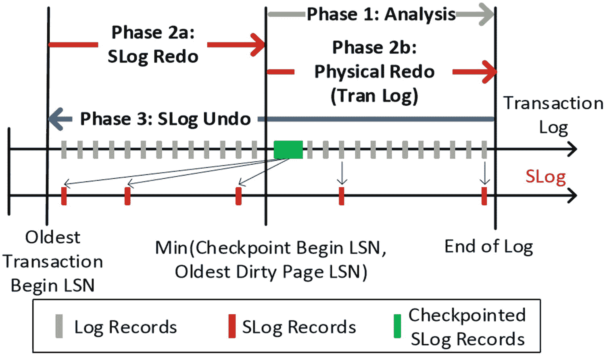
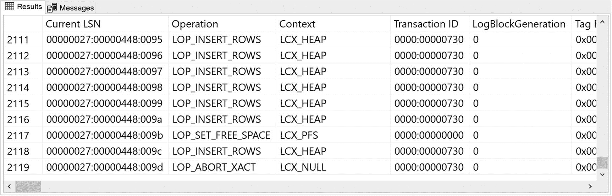
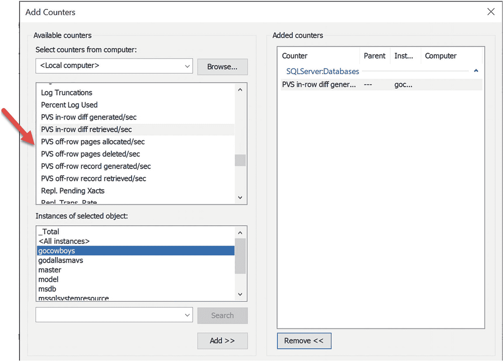

# SQL Server 使用加速数据库恢复 (ADR)

我不会试图详细介绍 CTR 论文描述的所有细节，但会阐述使 ADR 工作的基本组件，以及它与标准 ARIES 恢复方法的不同之处，然后通过一个例子让你有更深入的了解。

ADR 引入了**持久化版本存储** (PVS) 的概念。SQL Server 有一个称为版本存储的概念，用于快照隔离，但该版本存储保存在 `tempdb` 中。PVS 是一个类似的概念，即为行的修改保存版本，但这个版本存储是持久的，因为它存储在用户数据库中（用于快照隔离的版本存储）不是持久的，因为它保存在 `tempdb` 中，而 `tempdb` 在服务器重启后会重建）。一旦启用 ADR，SQL Server 将开始使用版本跟踪修改。版本可以存储在数据库页面的行内 (`in-row`) 或数据库内的 `off-row` 存储中。版本包含修改前数据的先前状态以及导致该版本的事务 ID，以便轻松识别数据版本是否应对其它事务可见。

现在有了 PVS，像回滚这样的事务操作变得有趣且*简单*。如果一个事务被回滚，SQL Server 只需将该事务标记为 ABORTED（已中止）。现在，任何查询该行数据的请求都可以确定该行的某个版本是否可见并应被使用。如果一行的最新版本与一个 ABORTED 事务相关联，查询可以忽略此版本并查找先前的版本。如果该行的版本与已提交或活动事务相关联，则应用隔离级别规则来判断该行是否可见。

SQL Server 通过*中止事务映射表*的概念来维护事务状态以实现所有这些功能。CTR 论文中对此有更详细的讨论。

## 注意

ADR 中关于版本的一个可能令人困惑的方面是隔离级别。当前的版本功能（在 `tempdb` 中）是专门为支持快照隔离级别而构建的。ADR 的版本并非为支持快照隔离而构建，但可以用来支持它们，并提供 ADR 的其它好处。

PVS 还对快速恢复有益（因此有恒定时间恢复的说法）。重做阶段只需确保版本存储在表页面的行内一致。撤销阶段只需将任何活动事务标记为已中止，然后如前所述的版本化过程会完成其余工作。这使得恢复非常迅速。

有些事务，主要是系统事务（例如，页面分配、更新统计信息），不能使用新的 PVS 方案。因此，当启用 ADR 时，SQL Server 为任何无法使用版本化的事务维护一个辅助日志 (`Slog`，存储在事务日志中)。与 Slog 关联的事务必须使用正常的 ARIES 恢复模式。幸运的是，系统事务几乎总是短暂的，因此不会像长时间运行的用户事务那样引起问题。

图 4-2 摘自 CTR 论文，展示了启用 ADR 后的新的恢复过程。



图 4-2: SQL Server 使用加速数据库恢复

如图所示，SQL Server 的恢复仍然有三个阶段：分析、重做和撤销。但现在这个过程快得多，因此得名加速。

**分析**阶段仍然必须完成与过去相同的工作，从 CHECKPOINT 的最后一条日志记录开始，但重做和撤销阶段则大不相同。

**重做**将确保 Slog 操作的日志记录从最旧的活动事务到最旧的脏页操作的日志记录被重做。从这一点开始，重做将执行与 ARIES 恢复相同的确保数据正确提交的操作。但假设数据库使用了标准的检查点配置，这个序列通常应该是很短的。

**撤销**阶段只需将任何未提交的事务标记为已中止，但需要撤销 Slog 事务操作，类似于 ARIES 撤销用户事务。但系统事务本质上是短暂的，并且只占所有事务的极小部分，因此这个过程应该总是很快。

结果是一个全新的、基于保存在用户数据库中的版本存储的、极其快速的恢复系统。

让我们用一个例子来更深入地了解使用 ADR 时事务日志记录有何不同。这个例子是完全独立的。你只需要 SQL Server 2019 和 SQL Server Management Studio (SSMS) 或 Azure Data Studio (ADS) 来运行此示例。你将使用脚本 `alookatadr.sql`，该脚本位于 `ch4_mission_critical_availability/adr` 目录中。



图 4-3: 来自中止的 DELETE 操作的日志记录

1.  打开脚本 `alookatadr.sql` 并执行脚本中的步骤 1 来创建数据库。

    ```sql
    -- Step 1: 创建数据库并设为简单恢复模式。ADR 默认关闭
    USE master
    GO
    DROP DATABASE IF EXISTS gocowboys
    GO
    CREATE DATABASE gocowboys
    GO
    ALTER DATABASE gocowboys SET RECOVERY SIMPLE
    GO
    ```

    提示：此示例对数据库使用 SIMPLE（简单）恢复模型，以便于检查日志记录。

2.  运行脚本中的步骤 2 来创建一个表并插入行。注意脚本插入了 1000 行。由于 ADR 的一项优化，你不能只用一行数据（你将在本章后面了解更多关于此优化的信息）。


### 使用加速数据库恢复

正如您从刚刚完成的示例中所见，使用加速数据库恢复无需进行任何应用程序更改。您只需使用以下 T-SQL 语句启用 ADR，即可开始运行：

```
ALTER DATABASE  SET ACCELERATED_DATABASE_RECOVERY = ON
```

让我们通过两个示例来了解：
*   回滚现在执行的速度有多快，以及事务日志是如何被积极截断的
*   恢复完成的速度有多快，让您可以快速访问数据库

运行这些示例所需的一切都可以在每个示例的笔记本和脚本中找到。

#### 快速回滚与积极的日志截断

使用以下示例，您可以查看使用 ADR 执行回滚的速度有多快，以及事务日志现在被截断得多么积极，从而避免过度的日志增长场景。在此示例中，我们将比较启用和不启用 ADR 时回滚的速度以及事务日志的增长情况。

您可以使用 `ch4_mission_critical_availability\adr` 目录中的 T-SQL 脚本 `adr.sql` 来运行此示例。

我建议在此情况下使用 `ch4_mission_critical_availability\adr` 目录中的 T-SQL 笔记本 `adr.ipynb`。该笔记本包含创建数据库、创建表和插入数据的所有说明。然后，在禁用 ADR 的情况下，您将在一个事务中删除表中的所有行。接着，您将检查已使用但即使在检查点之后也无法截断的日志空间量。然后，您将观察回滚整个删除操作的速度（更准确地说，是缺乏速度）。

之后，在笔记本中，您将重复这些步骤，但这次启用 ADR。T-SQL 脚本包含所有相同的步骤。完成此示例后，让我们做一些更高级的操作。让我们使用相同的 T-SQL 示例，但增加更多行，以查看恢复操作的影响。

#### 加速恢复

为了展示恢复速度有多快，您必须创建一个示例，其中恢复的撤销阶段需要尝试回滚大量修改或事务。

那么，如何创建一个 SQL Server 必须对某个事务运行撤销阶段的场景呢？为此，您需要构造一个场景，使得一个活动事务在 SQL Server 关闭前既未被回滚也未被提交。有三种方法可以实现这一点：
*   执行 T-SQL 语句 `SHUTDOWN WITH NOWAIT`。
*   关闭 SQL Server 服务（例如，`net stop mssqlserver`）。
*   终止 `SQLSERVR.EXE` 进程（在 Windows 上，使用任务管理器的“结束任务”）。

这些技术中的任何一种都会在不影响活动事务的情况下停止 SQL Server。还有一个额外的考虑因素。为了让 SQL Server 回滚活动事务，“必须有可回滚的内容”。如果受活动事务影响的数据库页从未被刷写到磁盘，那么当 SQL Server 运行恢复时，它无法“撤销”从未存在的东西。因此，当使用这些方法之一时，您应该对数据库执行一次 `CHECKPOINT`（正常关闭 SQL Server 服务确实会对所有数据库运行检查点）。请注意，恢复编写器或延迟编写器可能已经刷写了这些页面，但这对于演示来说是不可靠的。

### 提示

如果需要强制重做该怎么办？这有点像相反的方法。你必须有一个已提交的事务，但该事务影响的页面不能被刷新到磁盘。运行一个类似本章示例的事务，但提交该事务。然后“崩溃”服务器，但你必须在不进行检查点的情况下执行此操作，因此请使用“结束任务”方法。

了解这些知识后，你可以查阅位于 `ch4_mission_critical_availability\adr` 目录下的 T-SQL 脚本 `adr_recovery.sql` 或 T-SQL 笔记本 `adr_recovery.ipynb`。我推荐使用笔记本，因为它有文档说明了每个步骤，并指导何时“崩溃” SQL Server。

在执行笔记本或脚本的步骤时，你需要检查 `ERRORLOG`。我这里提供了在启用和未启用 ADR 的情况下，恢复运行时你应该看到的日志示例。

以下是未启用 ADR 时的 `ERRORLOG` 示例。

```
spid25s     数据库 'gocowboys' (6) 的恢复已完成 2%（大约剩余 697 秒）。3 个阶段中的第 2 阶段。这只是信息性消息。不需要用户操作。
spid25s     数据库 'gocowboys' (6) 的恢复已完成 5%（大约剩余 682 秒）。3 个阶段中的第 2 阶段。这只是信息性消息。不需要用户操作。
spid25s     数据库 'gocowboys' (6) 的恢复已完成 7%（大约剩余 667 秒）。3 个阶段中的第 2 阶段。这只是信息性消息。不需要用户操作。
spid25s     数据库 'gocowboys' (6) 的恢复已完成 7%（大约剩余 667 秒）。3 个阶段中的第 3 阶段。这只是信息性消息。不需要用户操作。
spid8s      数据库 'gocowboys' (6) 的恢复已完成 40%（大约剩余 113 秒）。3 个阶段中的第 3 阶段。这只是信息性消息。不需要用户操作。
spid8s      数据库 'gocowboys' (6) 的恢复已完成 50%（大约剩余 94 秒）。3 个阶段中的第 3 阶段。这只是信息性消息。不需要用户操作。
spid8s      数据库 'gocowboys' (6) 的恢复已完成 59%（大约剩余 79 秒）。3 个阶段中的第 3 阶段。这只是信息性消息。不需要用户操作。
spid8s      数据库 'gocowboys' (6) 的恢复已完成 68%（大约剩余 65 秒）。3 个阶段中的第 3 阶段。这只是信息性消息。不需要用户操作。
spid8s      数据库 'gocowboys' (6) 的恢复已完成 76%（大约剩余 48 秒）。3 个阶段中的第 3 阶段。这只是信息性消息。不需要用户操作。
spid8s      数据库 'gocowboys' (6) 的恢复已完成 84%（大约剩余 32 秒）。3 个阶段中的第 3 阶段。这只是信息性消息。不需要用户操作。
spid8s      数据库 'gocowboys' (6) 的恢复已完成 93%（大约剩余 15 秒）。3 个阶段中的第 3 阶段。这只是信息性消息。不需要用户操作。
spid8s      在数据库 'gocowboys' (6:0) 中回滚了 1 个事务。这只是信息性消息。不需要用户操作。
spid8s      恢复正在数据库 'gocowboys' (6) 中写入一个检查点。这只是信息性消息。不需要用户操作。
spid8s      数据库 gocowboys（数据库 ID 6）的恢复已在 211 秒内完成（分析 15 毫秒，重做 56340 毫秒，撤销 154549 毫秒）。这只是信息性消息。不需要用户操作。
```

## 注意

对于此示例，重做步骤是因涉及索引统计信息的一些系统事务所需。

以下是启用 ADR 时的 `ERRORLOG`。启用 ADR 后，恢复发生得如此之快，以至于 SQL Server 甚至没有记录恢复花费了多长时间！

```
spid25s     在数据库 'gocowboys' (6:0) 中回滚了 1 个事务。这只是信息性消息。不需要用户操作。
spid25s     恢复正在数据库 'gocowboys' (6) 中写入一个检查点。这只是信息性消息。不需要用户操作。
```

### 加速数据库恢复的机制详解

这一切听起来好得令人难以置信，我相信你一定在想这是否会有什么副作用。如果 ADR 如此出色，为什么我们不直接将其设为默认功能呢？

#### 性能和大小

当我和客户讨论 ADR 时，经常会出现两个问题：

**数据库会变大吗？**

这个问题的简短答案是：是的。更重要的问题是变大多少。由于我们在一段时间内保留行的版本，因此 PVS 所需的空间自然比没有它时更大。

和任何类似功能一样，问题在于那个令人头疼的答案：“视情况而定”。取决于什么？影响因素包括：

*   应用程序是否是写入密集型的，有大量修改？修改的数量越大，存储版本所需的空间就越多。
*   需要读取版本数据的事务有多长？一旦任何查询都不再需要某些版本，它们就可以被移除。

加速数据库恢复具有内置优化，以尽可能减小版本存储的大小，包括以下内容：

*   **“按需”**
    在更新一行时，SQL Server 可以“重用”已中止事务的行版本，并在原处写入一个新版本。这发生在数据修改的过程中。
*   **后台清理**
    如果版本仍然存在但不再需要（例如，已中止的事务），并且尚未发生更新怎么办？SQL Server 使用现有的后台工作线程架构来调度清理（每隔“几分钟”）任何可以丢弃的版本，包括行内和行外版本。SQL Server 使用一种称为*逻辑还原*的概念来清理这些版本。逻辑还原是确保行的已提交版本是页面的“主要”行的过程，从而缩短需要遍历的版本“列表”。CTR 论文 [`(www.microsoft.com/en-us/research/publication/constant-time-recovery-in-azure-sql-database/`](https://www.microsoft.com/en-us/research/publication/constant-time-recovery-in-azure-sql-database/)) 的第 3.3 节对逻辑还原的工作原理进行了出色的详细描述。此外，该论文的第 3.7 节描述了整个清理过程。

该论文的第 4 节提供了关于增长的实验测试结果，使用了一个包含 5000 万次插入、更新和删除操作的示例。团队发现，在 5000 万次更新后，PVS 使数据库增长了大约 1GB。你应该仔细阅读这些结果，因为它还显示了由于使用 ADR 而导致事务日志大小的显著减少（你在本章使用 `alookatadr.sql` 脚本的活动中也观察到了这一点）。

**使用 ADR 会导致任何性能影响吗？**

这可能是关于 ADR 最常被问到的问题。和增长因素一样，答案是“可能，并且视情况而定”。由于 ADR 通过版本跟踪每一次修改，写入密集型工作负载将受到最大影响。对于写入密集型工作负载的读取操作，在查找行版本时也可能受到一些影响。

作为 CTR 论文的一部分，工程团队使用源自行业标准 `TPC-C` 和 `TPC-E` 基准的测试进行了性能测试（有关这些基准的更多信息，请参见 [`www.tpc.org`](http://www.tpc.org)）。`TPC-C` 是一个较旧的基准测试，但写入非常密集。`TPC-E` 是一个更均衡但仍然是“OLTP”写入工作负载的基准测试。你可以在论文的 **第 4.2 节** 中看到结果，但简而言之，`TPC-C` 的运行遇到了大约 14%（行内版本）的影响，而 `TPC-E` 遇到了 2.5%（行内版本）的影响。

我自己使用开源工具 `HammerDB`（更多详细信息请参见 [`www.hammerdb.com`](http://www.hammerdb)）进行了“快速而简单”的测试。该工具附带一个 `TPC-C` 基准的变体。使用 10 个仓库/10 个虚拟用户在 5 分钟内执行，我观察到使用 ADR 大约造成了 15% 的影响。


### ADR 性能测试说明

这些测试结果都不意味着，当你为自己的数据库启用 ADR 时，会看到这些完全相同的数字或任何性能影响。这是因为这些测试使用的是特定类型工作负载的基准测试，它们可能与你的应用程序匹配，也可能不匹配。你需要找到一种标准方法，在启用和不启用 ADR 的情况下测试你的应用程序性能，才能了解真正的性能影响。
请仔细查看论文第 4 节的所有结果，因为它还展示了团队在 Azure 中观察到的一些惊人的恢复时间结果（你已经看到了一个简单数据库的可能影响）。
加速数据库恢复的另一个主要好处是，Always On 可用性组的故障转移时间可以更快，并且对于副本上的只读查询存在一个更好的版本方案。

#### 意外场景

在某些情况下，持久化版本存储 (`PVS`) 无法存储在行内，因为它不适合页面。在这种情况下，版本存储在一个内部系统表中。这些被称为“行外”场景。可以想象，当 `PVS` 存储在行外时，这并非理想情况。因此，如果可能，应避免这些场景。
行外版本主要发生在对当前行的版本进行重大修改时。如果一个更新非常显著，以至于在行内存储版本不可行或不合理；该版本将作为一个行外版本存储在内部系统表中。我在一个启用了 `ADR` 的数据库中做了一些探查，发现 `PVS` 保存在每个数据库中一个名为 `persistent_version_store` 的表中。该表被标记为 `INTERNAL_TABLE` 类型，类似于查询存储等其他表。这个系统表包含版本数据和元数据，用于将其链接回表中页面的实际行。
如果你担心你的应用程序是否生成了大量行外版本，有一些性能计数器和扩展事件可以使用，我将在下一节“追踪 `ADR`”中描述。

#### 文件组与优化说明

在我撰写本章时，行外 `PVS` 存储在你数据库的 `PRIMARY` 文件组中，并且无法选择其他文件组。工程团队当时正在讨论是否可以通过 `ALTER DATABASE` 添加一个选项，让用户选择将行外 `PVS` 移动到另一个文件组。请查阅 `ALTER DATABASE` 的文档，看看这项增强功能是否已包含在最终的 SQL Server 2019 版本中。
另一个意外情况称为短事务优化。这种情况是件好事。当事务本质上非常短时，使用 `PVS` 没有意义。因此，在测试 `ADR` 时，不要期望一个只删除几行的事务会使用 `ADR`。如果你使用 `fn_dblog()` 检查日志，你可以通过以下操作和上下文 `LOP_FORGET_XACT` 和 `LCX_XACT_DOES_NOT_SUPPORT_CTR` 看到哪些事务不会应用 `ADR`。

#### 追踪 ADR

与 SQL Server 的许多新功能一样，`ADR` 团队提供了等待类型、扩展事件和性能监视计数器来跟踪 `ADR` 的执行、持久化版本存储 (`PVS`) 的使用以及清理处理过程。
图 4-5 显示了一些可用于跟踪持久化版本存储 (`PVS`) 使用情况的性能计数器，包括跟踪生成了多少行外版本。

图 4-5 `PVS` 性能计数器
还有几个扩展事件也可用于跟踪特定版本的生成和清理任务。你可以通过针对 `XE` 动态管理视图执行以下查询来找到所有这些事件：
```sql
select * from sys.dm_xe_objects where name like '%pvs%'
select * from sys.dm_xe_objects where name like '%ctr%'
```
其中一个可能有趣的事件是 `pvs_add_record` 事件。你可以将此事件与一个 `sql_text` 操作结合使用，以找出哪些查询正在生成行外版本。
我尚未使用这些扩展事件进行任何测试，因此无法说明它们可能对你的应用程序产生的性能影响。
最后，对于那些真正想深入了解的人，`sys.dm_os_wait_stats` `DMV` 中列出了几个适用于 `ADR` 的等待类型。你可以监控这些等待类型来跟踪清理等活动的执行情况。使用以下 `T-SQL` 语句查找这些等待类型：
```sql
select * from sys.dm_os_wait_stats
where wait_type like '%pvs%' or wait_type like '%ctr%'
```

#### 是否应该使用 ADR？

如果你没有长时间运行的事务，`ADR` 可能对你帮助不大，甚至可能对你的应用程序产生负面影响。如果你的应用程序生成大量行外版本，其影响可能过高，以至于看不到 `ADR` 的好处。不过请记住，对于故障转移场景（例如 Always On 可用性组），这仍然可能带来巨大益处。
我的建议是找到一种方法用你的应用程序进行测试。我们没有在 SQL Server 2019 中（暂时）将其设为默认，因为存在太多类型的工作负载，正如我在本章所讨论的，并非所有工作负载都能看到好处。但请牢记这些最终思考：
*   这是那种你现在可能不知道自己需要，但当你需要它时……你确实需要它的功能之一。你可能无法预测何时一次长时间运行的恢复会导致你的业务中断。如果启用了这个功能，让这种情况根本不会发生，岂不是很好？
*   大多数工作负载不像 `TPC-C` 那样是真正、极其写密集型的。我们使用像 `TPC-E` 这样更均衡的读/写工作负载进行的测试结果并未显示出巨大影响。
*   考虑一下工程团队在 `CTR` 论文中引用的这句话，他们采用“云优先”方法首先在 Azure 中推出此功能：“……`CTR` 已经在五个区域启用，涉及大约一百万个数据库，结果非常有希望。”

## 总结

确保你的数据和应用程序可用是任何值得信赖的数据平台产品的重要方面。SQL Server 2019 持续增强核心可用性功能，例如可恢复的联机索引创建和可用性组。此外，SQL Server 2019 为业界带来了一种非常创新的方法，通过加速数据库恢复来解决因长时间运行的活动事务导致的停机问题。

