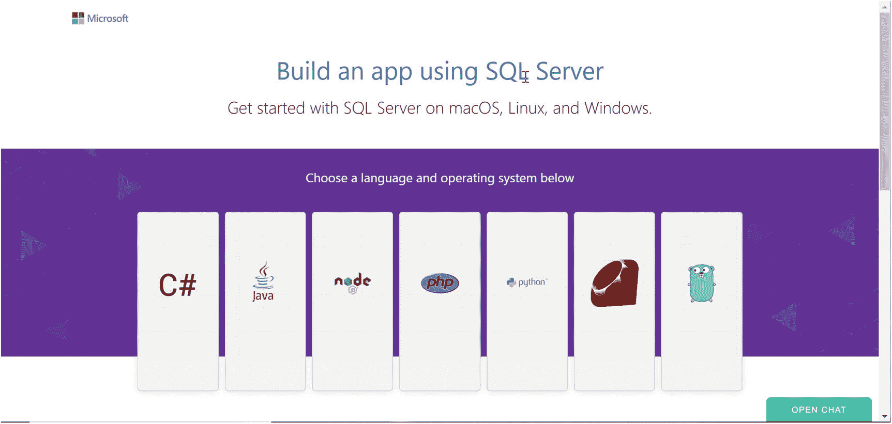
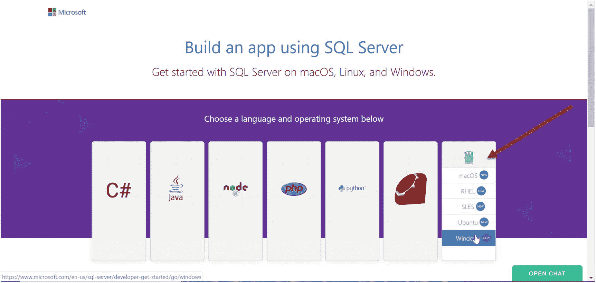
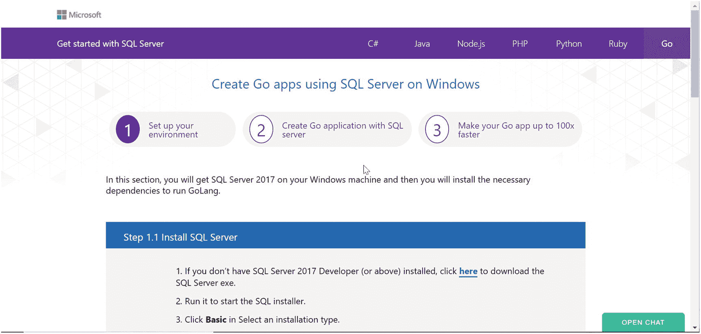
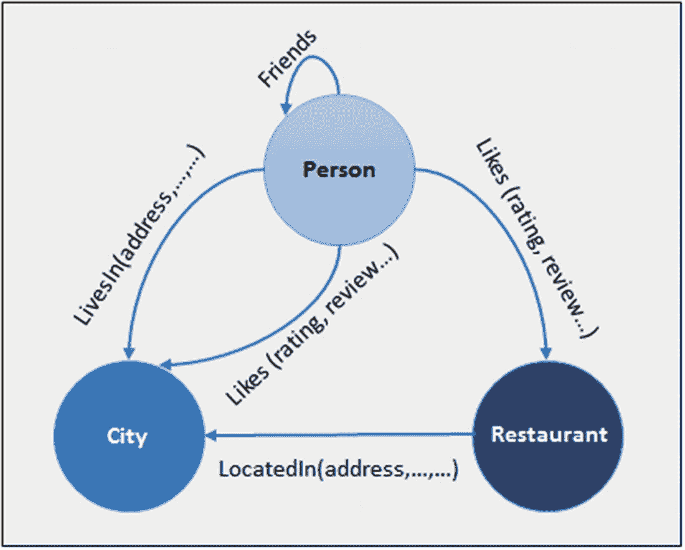
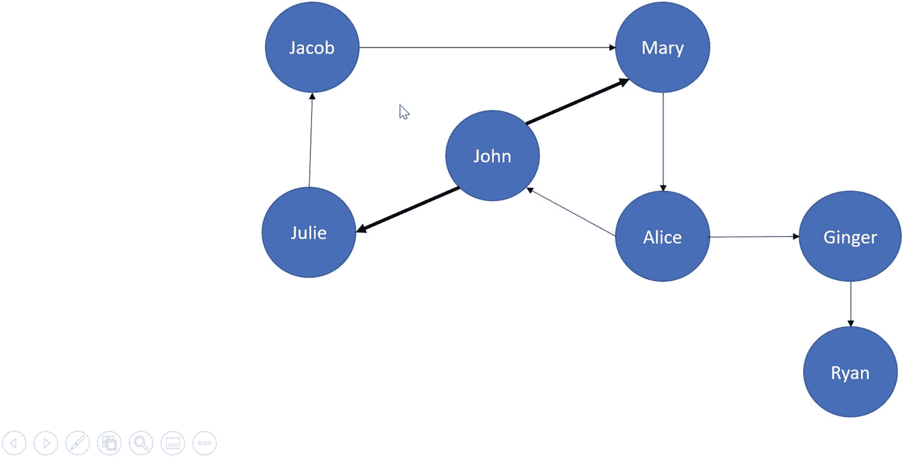
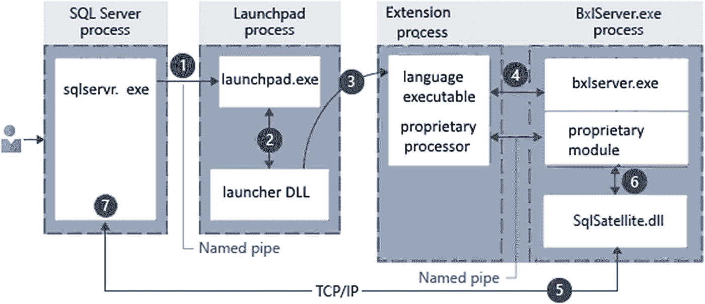

# 5. 现代开发平台

几乎任何开发者都需要数据，而像 SQL Server 这样的产品具备你所需的能力、语言、驱动程序和平台。现代数据开发者需要一个数据库平台来应对当今应用程序的挑战。SQL Server 2019 通过以下功能迎接这些挑战：
*   支持跨多种操作系统平台（如 Windows、macOS 和 Linux）的多种语言和驱动程序，并具有兼容性。SQL Server 各版本提供公共的应用程序接口区域，以最小化应用程序逻辑。
*   与 SQL Server 集成的图数据库允许开发人员实现诸如社交网络等数据模型，而无需额外产品——并使用熟悉的语言（如 `T-SQL`）进行查询。
*   开发人员需要能够构建应用程序，使用业界广泛使用的编码系统处理 Unicode 数据。SQL Server 2019 通过新的排序规则支持 `UTF-8` 编码。
*   开发人员需要一个数据库平台来支持整合了机器学习的新型应用程序，这些应用程序应可扩展、安全且与数据库集成。SQL Server 机器学习服务在 SQL Server 2019 中包含了新的增强功能。
*   `T-SQL` 语言提供了许多功能，但开发人员可能需要更多。他们希望能够扩展与数据库集成的 `T-SQL` 语言。SQL Server 2019 中的 SQL Server 语言扩展允许开发人员安装和使用与 SQL Server 数据集成的新语言，例如 `Java`。


## 语言、驱动程序与平台

1993 年我刚加入微软时，为 SQL Server 编写应用程序的开发人员主要使用 Visual C 或 Visual Basic 等语言，并通过一种名为 DB-Library 的驱动程序进行连接。客户端全部运行在 DOS（是的，DOS）或 Windows 上，而 SQL Server 则是 Windows NT 上的主流数据库服务器。C++ 和 ODBC 很快也出现了，但可供选择的语言、驱动程序和平台种类相当有限。时至今日，无论是客户端应用程序还是 SQL Server 本身，在语言、驱动程序和平台方面的选择之多，已远超我当初的想象。

### 语言与驱动程序

SQL Server 2019 是一个现代化的数据库平台，随之而来的是广泛的编程语言选择，包括那些传统上不使用 SQL Server 的开发人员所青睐的现代语言。

与这些语言选择相匹配的，是满足每种语言需求的、用于访问 SQL Server 的驱动程序。此外，这些驱动程序可在多种客户端平台上运行，包括 macOS、Linux 和 Windows。

另外，像 ODBC、OLE-DB 和 .Net 这样的驱动程序选择也变得更加聚焦，而不像过去那样种类繁多、有时甚至令人困惑。

那么，如何选择语言和/或驱动程序呢？首先，在某些情况下，语言的选择决定了你将使用的驱动程序。例如，如果你想用 PHP 编写代码来访问 SQL Server，就必须使用 `PHP Driver for SQL Server`。

幸运的是，微软建立了一个非常实用的网站来帮助你做出语言选择、选择合适的驱动程序、选定一个或多个客户端平台，并查看用该语言编写代码访问 SQL Server 的示例。

要查看实际效果，请访问网站 `http://aka.ms/sqldev`。主网页如图 5-1 所示。



图 5-1

SQL Server 开发中心

将鼠标悬停在某个语言选项上，你可以选择一个客户端平台语言，以获取使用该语言和相应驱动程序的详细信息以及代码示例教程（图 5-2 展示了使用 Go 语言的示例）。



图 5-2

将 Go 语言与 SQL Server 结合使用

选择 Windows 选项后，你会看到一个完整的教程，指导你使用 SQL Server Developer Edition 构建你的第一个适用于 Windows 的 Go 应用程序（你的 SQL Server 可以运行在 Windows、Linux 甚至容器上）。每种语言和平台选择都有类似的模板，如图 5-3 所示的 Go 语言模板。



图 5-3

为 SQL Server 创建 Go 应用程序

许多使用 C++ 或 C# 等语言的开发人员，老实说，过去都曾面对过 SQL Server 令人困惑的驱动程序选择列表。

在 SQL Server 2012 之后，我们整合了用于 ODBC、OLE-DB 或 ADO.Net 的驱动程序及版本列表。我发现这个文档页面 `https://docs.microsoft.com/en-us/sql/connect/connect-history` 很好地展示了过往驱动程序的历史，并说明了如果你使用的是 SQL Server 2014 或更新版本，现在应该使用哪些驱动程序。

此外，要获取构建 SQL Server 应用程序的完整语言及相应驱动程序选择列表，我认为这个文档页面是一个极好的资源：`https://docs.microsoft.com/en-us/sql/connect/sql-connection-libraries`。（这包括用于对象关系映射（ORM）框架应用程序的驱动程序。）

我算是个“老派”开发人员，所以 ODBC 是我的首选驱动程序。我们为 SQL Server 构建了一个 ODBC 驱动程序，它能跟上 SQL Server 的新特性，并且适用于 Linux、macOS 和 Windows。你可以在 `https://docs.microsoft.com/en-us/sql/connect/odbc/microsoft-odbc-driver-for-sql-server` 阅读最新的 SQL Server ODBC 驱动程序的完整文档。

### 平台与版本

从 SQL Server 2017 开始，SQL Server 现已支持在 Windows、Linux 以及 Docker 容器上运行。这为那些以前从未考虑过 SQL Server 的开发人员打开了平台之门。无论生产环境 SQL Server 运行在何种操作系统上，开发人员现在都可以在 Windows、Linux 或容器上使用 SQL Server Developer Edition 来测试他们的应用程序。并且，由于 SQL Server 引擎代码库在所有平台上都是一致的，开发人员可以针对其 SQL Server 部署环境编写应用程序，并确信它与生产环境 SQL Server 兼容。这包括了 SQL Server on Linux 过去存在的功能差距，例如复制和分布式事务（DTC），这些功能现在已在 SQL Server 2019 中提供。

虽然对于 SQL Server 2019 来说并非新特性（此功能在 SQL Server 2016 SP1 中引入），但除企业版外的 SQL Server 版本现在都包含类似的“功能范围”，使得构建一个能在不同版本间工作的单一应用程序变得更加容易。例如，内存中 OLTP 现在作为一项功能可用于 SQL Server 企业版和标准版，甚至 SQL Server Express 版（尽管该功能的规模在不同版本中并不相同）。现在，你可以在 Developer Edition 上使用内存中 OLTP 来构建应用程序，并确信它能在各种版本上运行，而无需在你的应用程序中加入检测版本的逻辑。

## 图形数据库

关系数据库的概念可以处理所有类型的设计模型、数据模式和应用程序。然而，有一些根据现实世界问题设计的数据模型，不一定能很好地适应标准的关系系统和 SQL 语言。这些模型通常涉及层级的、“网络状”的或复杂的多对多数据关系。维基百科对这个问题及其解决方案有很好的描述：`https://en.m.wikipedia.org/wiki/Graph_database`。

一些开发人员曾尝试仍然使用关系数据库来“适应”图模型，并使用复杂的 T-SQL 语句来“遍历”图。在某些情况下，还构建了专门用于图形数据的项目，例如流行的开源图数据库 Neo4j (`https://github.com/neo4j/neo4j`)。其他数据库平台则在其关系数据库中包含了一个“附加组件”来提供图能力。

2016 年，SQL 工程团队的成员，包括 Hanuma Kodavalla、Craig Freedman、Devin Rider 和 Shreya Verma，组成了一个项目组，研究将图数据库功能构建到 SQL Server 和 Azure SQL Database 中。他们的目标是将图能力内置到 SQL Server 引擎中，并找到一种方法使用 T-SQL 语言来创建图表，并用 T-SQL 操作和搜索它们。这是通过扩展来利用 T-SQL 功能的又一个绝佳范例。

这项努力的结果是，SQL Server 2017 和 Azure SQL Database 发布了图数据库功能。在 SQL Server 中使用图数据库的一大好处是，它附带了 SQL Server 的强大功能。这包括高可用性与灾难恢复（HADR）、安全性、性能以及引擎的所有功能。其他平台并未将这些功能融入引擎，而是将它们视为附加组件或完全独立的产品。


### SQL Server 中的图数据库是什么？

SQL Server 中的图数据库使用 T-SQL 扩展，通过表来表示图模型中的 *节点* 和 *边*。术语“数据库”在此是逻辑上的，因为从 SQL Server 的角度来看，它并非一个不同的数据库。在图数据库中，节点代表实体或对象，而边则代表节点之间的关系。

因此，一个图数据库就是节点表和边表，以及将它们绑定在一起的数据和元数据的集合。SQL Server 支持对 T-SQL 语言进行扩展，可以通过 `CREATE TABLE` 语句中的 `AS NODE` 或 `AS EDGE` 语法来定义节点表或边表。创建节点或边表的完整语法可在此处找到：[`https://docs.microsoft.com/zh-cn/sql/t-sql/statements/create-table-sql-graph`](https://docs.microsoft.com/zh-cn/sql/t-sql/statements/create-table-sql-graph)。

此外，SQL Server 支持一个新的 T-SQL 关键字 `MATCH`，用于在 `SELECT` 语句中导航节点表和边表。关于如何使用 `MATCH` 关键字的语法可在文档中查阅：[`https://docs.microsoft.com/zh-cn/sql/t-sql/queries/match-sql-graph`](https://docs.microsoft.com/zh-cn/sql/t-sql/queries/match-sql-graph)。

您可以在以下地址阅读 SQL Server 和 Azure SQL Database 中图数据库的完整文档集：[`https://docs.microsoft.com/zh-cn/sql/relational-databases/graphs/sql-graph-overview`](https://docs.microsoft.com/zh-cn/sql/relational-databases/graphs/sql-graph-overview)。您还可以在 YouTube 上观看来自微软的 Kevin Farlee 的一个精彩演示：[`www.youtube.com/watch?v=xirfl_t4Gqs`](https://www.youtube.com/watch%3Fv%3Dxirfl_t4Gqs)。

了解节点表或边表如何在 SQL Server 中工作的最佳方式，就是运行一个示例。

### 在 SQL Server 中使用图数据库

作为读者，你们中的许多人可能初次接触 SQL Server 中的图数据库，因此我将使用一个简单的示例来演示此功能的强大之处。实际上，我将使用文档中提供的示例（可在 [`https://docs.microsoft.com/zh-cn/sql/relational-databases/graphs/sql-graph-sample`](https://docs.microsoft.com/zh-cn/sql/relational-databases/graphs/sql-graph-sample) 找到），但会做一些改动并添加注释来解释该示例。

考虑 *社交网络* 的概念。你们中的许多人每天都在 Facebook 或 LinkedIn 等平台上体验它。网络本质上是事物的连接，通常用图来建模。考虑一个如图 5-4 所示的朋友网络。



图 5-4：一个朋友网络

在这个图模型中，节点是 Person（人）、City（城市）和 Restaurant（餐厅）。箭头代表节点之间的关系；这些就是边。注意一个特定的称为 Friends（朋友）的关系，其中 Person 节点相互关联。用纯关系型表来构建这个模型并不困难，但使用传统的 T-SQL 查询来遍历图会变得复杂。

让我们基于上述模型构建一个图数据库的示例，这样你就能感受到其基础，然后看看 SQL Server 2019 中有什么新特性。

## 注意

使用图数据库示例没有特殊的先决条件，只需安装 SQL Server 2019（Windows、Linux 或容器）并使用诸如 SQL Server Management Studio (`SSMS`) 或 Azure Data Studio (`ADS`)（2019 年 6 月版或更高版本）之类的工具。本节中的图示例专为 SQL Server 2019 设计。

对于此示例，考虑这个社交网络中的 John（约翰）。他知道自己与 Mary（玛丽）和 Julie（朱莉）是朋友，但他不知道她们和谁是朋友（以及她们的朋友又和谁是朋友，以此类推）。他想扩展自己的社交网络，并了解他的朋友们喜欢哪些餐厅。

考虑图 5-5 中的“朋友社交网络”。



图 5-5：朋友社交网络

John 不知道整个网络，因此他需要使用图数据库来导航。

所有图数据库示例的脚本都可以在 `ch5_modern_development_platform\sqlgraph` 目录中找到。以图 5-4 为指导，在 Azure Data Studio 中按照 T-SQL 笔记本 `socialnetwork.ipynb` 的步骤 1-7 进行操作。这些步骤将展示如何将图表构建为节点和边，填充数据，然后使用 T-SQL `MATCH` 语法遍历图。

还有一个 T-SQL 脚本 `socialnetwork.sql`，你可以使用 `SSMS` 或 `ADS` 来遵循步骤 1-7。

### SQL Server 2019 的图功能增强

SQL Server 2019 提供了一些增强功能，使其相较于其他产品，成为一个更强大、更具吸引力的图数据平台。这些增强包括：
- 使用新的 `SHORTEST_PATH()` 语法遍历图路径
- 支持图数据库中的派生表和视图
- 边约束以强制执行正确的图关系
- 使用 T-SQL `MERGE` 语句来支持 *更新插入* 等场景

让我们回顾一下其中一些新的增强功能。

#### SHORTEST_PATH

使用图数据库需要解决的更常见挑战之一，是递归地遍历图数据，而无需手动导航到每个层级。SQL Server 2017 不支持此概念，但 SQL Server 2019 通过新的 `SHORTEST_PATH()` T-SQL 语法提供了支持。

使用 `socialnetwork.ipynb` 和 `socialnetwork.sql` 中的 `步骤 8 和 9` 示例，看看 `SHORTEST_PATH` 如何让 John 和 Jacob 遍历朋友社交网络。

你可以在文档 [`https://docs.microsoft.com/zh-cn/sql/relational-databases/graphs/sql-graph-shortest-path`](https://docs.microsoft.com/zh-cn/sql/relational-databases/graphs/sql-graph-shortest-path) 或 Shreya Verma 在 [`https://techcommunity.microsoft.com/t5/SQL-Server/Public-Preview-of-Shortest-Path-on-SQL-Server-2019/ba-p/721240`](https://techcommunity.microsoft.com/t5/SQL-Server/Public-Preview-of-Shortest-Path-on-SQL-Server-2019/ba-p/721240) 的博客文章中查看使用 `SHORTEST_PATH()` 的详细信息。


## 边缘约束

虽然 `NODE` 和 `EDGE` 的 T-SQL 语法提供了一种利用 SQL Server 表构建图数据的绝佳新方式，但在 SQL Server 2017 中，尚无法强制实施节点和边缘数据的 *完整性*。就像 SQL Server 表中的外键约束概念一样，SQL Server 2019 提供了对节点和边缘强制实施数据完整性的能力。

考虑一下你刚刚使用本章示例构建的社交网络。能够确保 `friendOf` 边缘表中的任何数据都必须来自 `Person` 表中的有效行，这将是非常好的。边缘约束提供了这种能力。

此外，边缘约束强制实施正确的网络关系。在我们的社交网络模型中，一个 `Person` 可以喜欢一家 `Restaurant`，但一家 `Restaurant` 不能喜欢一个 `Person`。边缘约束同样可以强制实施这一点。更进一步，边缘约束确保边缘不会 *悬空*。借助边缘约束，如果边缘表中存在数据，你将无法删除作为边缘关系一部分的节点。再次说明，此行为类似于传统关系表中的外键。

你可以在以下文档中阅读更多关于边缘约束的信息：[`https://docs.microsoft.com/en-us/sql/relational-databases/tables/graph-edge-constraints`](https://docs.microsoft.com/en-us/sql/relational-databases/tables/graph-edge-constraints) 或者 Shreya 的另一篇博客文章：[`https://blogs.msdn.microsoft.com/sqlserverstorageengine/2018/09/28/public-preview-of-graph-edge-constraints-on-sql-server-2019/`](https://blogs.msdn.microsoft.com/sqlserverstorageengine/2018/09/28/public-preview-of-graph-edge-constraints-on-sql-server-2019/)。

## 在图中表使用 MERGE

SQL Server 提供了一个名为 `MERGE` 的 T-SQL 语句，它根据与源表连接的结果，在目标表上执行插入、更新或删除操作。在 SQL Server 2017 中，你可以使用 `MERGE` 语句对节点表进行整合的 DML 操作，但不能用于边缘表。SQL Server 2019 现在提供了同样将 `MERGE` 用于边缘表的能力。

请查看 Shreya 在她关于此主题的博客文章中的一些精彩示例：[`https://blogs.msdn.microsoft.com/sqlserverstorageengine/2018/07/16/match-support-in-merge-dml-for-graph-tables/`](https://blogs.msdn.microsoft.com/sqlserverstorageengine/2018/07/16/match-support-in-merge-dml-for-graph-tables/)。

## UTF-8 支持

早在 1990 年代初，应用程序和数据库就一直使用 Unicode 作为对字符数据进行编码的标准。Windows 上的 SQL Server 几乎在产品存在之初就包含了支持 Unicode 字符编码的数据类型和排序规则。SQL Server 2019 引入了一种称为 `UTF-8` 的新 Unicode 编码方法，它通常在 Linux 系统上被应用程序和数据库广泛使用。

如果你想在阅读本节之前了解更多关于 Unicode 的基础知识，可以使用以下资源：

[`https://docs.microsoft.com/en-us/windows/win32/intl/unicode`](https://docs.microsoft.com/en-us/windows/win32/intl/unicode)
[`https://en.wikipedia.org/wiki/Unicode`](https://en.wikipedia.org/wiki/Unicode)
[`https://unicode.org/standard/WhatIsUnicode.html`](https://unicode.org/standard/WhatIsUnicode.html)

### Unicode 与 SQL Server

SQL Server 支持 Unicode 编码的常规方式是通过 `nchar` 和 `nvarchar` 数据类型。SQL Server 使用 `UTF-16` 编码方案支持这些数据类型的 Unicode 编码。`UTF-16` 要求每个“字符”最少使用 2 字节来存储数据。使用 `UTF-16` 的 ASCII 字符 “a” 需要 2 字节的存储空间。当你定义如下列时：

```
col1 nchar(10) not null
```

SQL Server 需要为此列分配 20 字节的存储空间，即使你只使用标准 ASCII 字符。

这与以下列定义形成对比：

```
col1 char(10) not null
```

它需要 10 字节，但只能存储 ASCII 字符集中的字符。

## 注意

开发人员和数据专业人员常犯的一个错误是使用 `nchar`、`char` 等类型时，默认其长度是字符数而非字节存储量。

`UTF-16` 允许表示整个 Unicode 字符范围，因为许多超出 ASCII 字符的语言支持字符需要 2 字节来表示该字符。

### 为什么使用 UTF-8？

虽然大多数应用程序和数据库（如 SQL Server）对 Unicode 字符编码使用 `UTF-16`，但 Linux 社区中的许多人使用一种称为 `UTF-8` 的编码。`UTF-8` 与 `UTF-16` 类似，因为它支持整个 Unicode 字符集，但根据所存储的字符不同，采用不同的编码和字节存储方案。例如，ASCII 字符在 `UTF-8` 中只需要 1 字节存储，而在 `UTF-16` 中需要 2 字节。

考虑一个仅针对 ASCII 字符集开发但需要更新以支持所有 Unicode 字符的应用程序。该应用程序可能在 SQL Server 中使用了 `char` 和 `varchar` 数据类型。在 SQL Server 支持 `UTF-8` 之前，数据专业人员需要将所有 SQL Server 列的数据类型从 `char` 更改为 `nchar`，从 `varchar` 更改为 `nvarchar`。使用 `ALTER TABLE` 以这种方式更改数据类型，对于 ASCII 字符来说，实际上使这些列的存储需求翻倍，即使最初你只使用 ASCII 字符。

现在，有了 SQL Server 2019，另一种选择是保留数据类型为 `char` 和 `varchar`，但将列的排序规则更改为使用新的 `UTF-8` 排序规则，例如 `LATIN1_GENERAL_100_CI_AS_SC_UTF8`。`ALTER TABLE` 允许你在列级别更改排序规则。`UTF-8` 编码对于 ASCII 字符仅需要 1 字节的存储空间。

请谨慎做出这些决定，因为 `UTF-8` 有一些限制，并且对于某些字符，`UTF-8`（非 ASCII 字符）的存储需求比 `UTF-16` 更大。

SQL Server for Windows、Linux 和容器均支持 `UTF-8`（请记住，由于 SQLPAL 架构，SQL Server on Linux 支持“Windows”排序规则。文档说明 `UTF-8` 仅支持 Windows 排序规则，不支持 SQL 排序规则）。

使用这些资源来研究 `UTF-8` 是否适合你：

[`https://cloudblogs.microsoft.com/sqlserver/2018/12/18/introducing-utf-8-support-in-sql-server-2019-preview/`](https://cloudblogs.microsoft.com/sqlserver/2018/12/18/introducing-utf-8-support-in-sql-server-2019-preview/)
[`https://docs.microsoft.com/en-us/sql/relational-databases/collations/collation-and-unicode-support`](https://docs.microsoft.com/en-us/sql/relational-databases/collations/collation-and-unicode-support)
[`https://docs.microsoft.com/en-us/sql/relational-databases/collations/collation-and-unicode-support#utf8`](https://docs.microsoft.com/en-us/sql/relational-databases/collations/collation-and-unicode-support#utf8)


## SQL Server 机器学习服务

我在微软支持部门工作了 20 多年后，于 2016 年加入 SQL 工程团队时，Joseph Sirosh 是负责 SQL Server 的副总裁。当时 SQL Server 2016 刚刚发布，我知道 Joseph 对 SQL Server 团队通过 R 编程语言将机器学习集成到产品中的工作感到特别自豪。

Joseph 是一位数据科学家，对机器学习和数据有着无比的热情。R 作为一种开源语言，是数据科学和机器学习领域最受欢迎的编程语言之一，因此将其与 SQL Server 集成似乎是自然而然的。此外，微软在 2015 年收购了一家名为 Revolution Analytics 的公司，该公司构建了 R 的商业版本，包括使其更具可扩展性的改进，称为`RevoScaleR`。（有关 R 的历史，请参阅此资源：[`https://en.wikipedia.org/wiki/R_(programming_language)`](https://en.wikipedia.org/wiki/R_%2528programming_language%2529)。）现在，将这些力量结合起来，为数据构建一个基于 SQL Server 的机器学习平台成为可能。这个最初的功能被称为`SQL Server 2016 R Services`。SQL Server 2017 引入了与 Python 编程语言的集成，使用了相同的概念和架构。随着这一改变，R 和 Python 结合的新能力成为了`SQL Server Machine Learning Services`。

虽然 SQL Server 2019 的 SQL Server 机器学习服务（ML Services）变化不大，但这可能是你正在研究的新功能，因此我将简要介绍一下它的工作原理。这很重要，原因有几个：

*   了解 ML Services 如何工作以及使用它的好处，将帮助你判断这个功能是否适合你和你的应用程序。
*   如果你更了解此功能的集成、安全性和治理，你将更有信心在 SQL Server 中使用 ML Services。
*   ML Services 所使用的、称为`可扩展性框架`的架构，与 SQL Server 2019 的新功能——SQL Server 语言扩展所使用的架构是相同的。

在阅读本章剩余部分之前，建议你查阅 SQL Server ML Services 的文档：[`https://docs.microsoft.com/en-us/sql/advanced-analytics/sql-server-machine-learning-services`](https://docs.microsoft.com/en-us/sql/advanced-analytics/sql-server-machine-learning-services)。

## 工作原理

在 SQL Server ML Services 出现之前，数据科学家在单独的计算机（工作站或服务器）上开发和执行他们的*模型*（通常指机器学习程序），而所有数据（如来自 SQL Server 的数据）都是远程访问的。在许多情况下，用于这些模型的 R 或 Python 程序会简单地“拉取”整个表，然后在程序中过滤结果，从而未能发挥像 SQL 这样的语言的强大能力。

SQL Server ML Services 提供了一种新的能力，可在以下概念下执行可扩展的机器学习程序：

*   机器学习程序在与 SQL Server 相同的计算机上执行，但在独立于`SQLSERVR.EXE`的进程中运行。
*   SQL Server 通过系统存储过程`sp_execute_external_script`提供一个 T-SQL 接口，以执行机器学习代码。
*   SQL Server 提供了一种架构，用于与机器学习代码进行智能数据交换和实现可扩展性。

请参阅图 5-6，该图展示了 SQL Server ML Services 的架构，称为`SQL Server 机器学习服务中的可扩展性架构`，可在 SQL Server 文档中找到：[`https://docs.microsoft.com/en-us/sql/advanced-analytics/concepts/extensibility-framework#architecture-diagram`](https://docs.microsoft.com/en-us/sql/advanced-analytics/concepts/extensibility-framework%2523architecture-diagram)。



图 5-6：SQL Server ML Services 架构

遗憾的是，文档并未提供图中编号的详细说明，因此我将在此说明，这将帮助你更深入地理解其工作原理。


