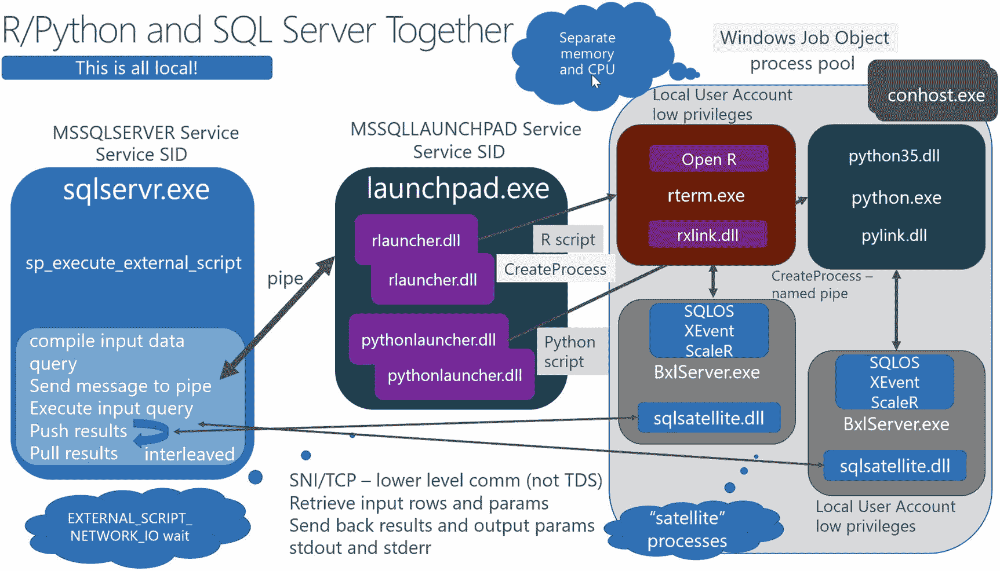
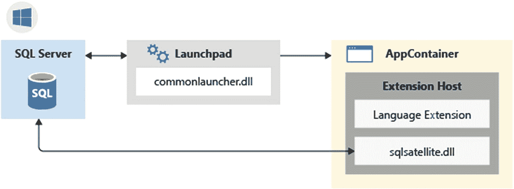
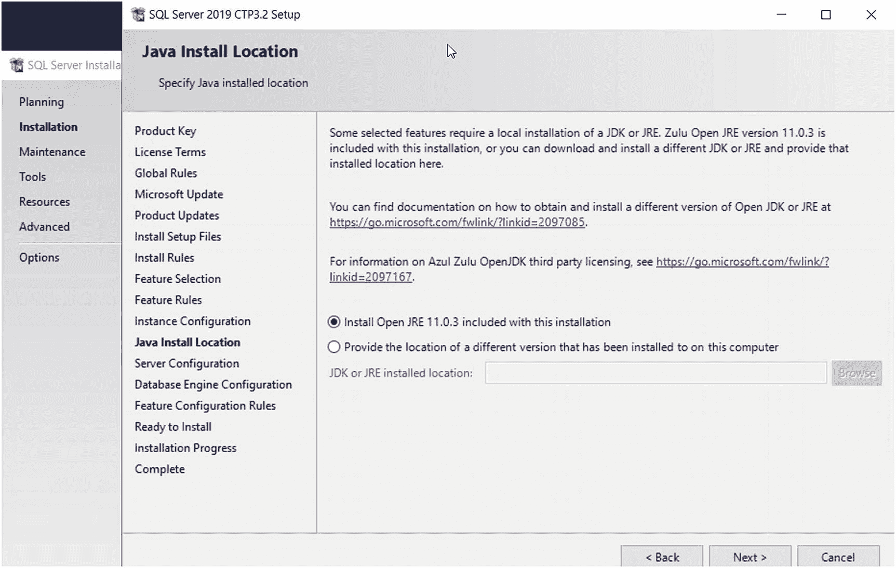
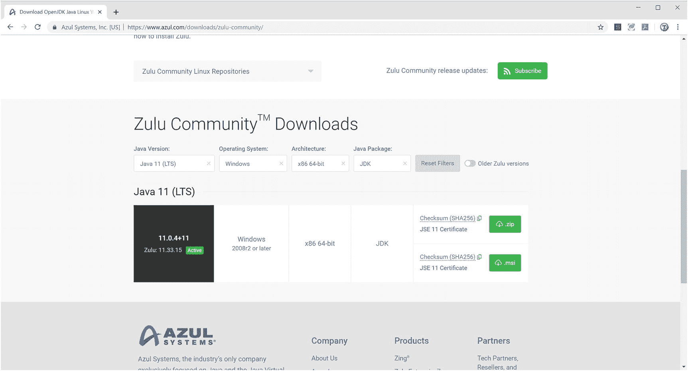

# 注

我过去曾就这个主题发表过演讲，并有一份非常详细的架构图和说明。你可以在图 5-7 中查看，或者在以下链接中查看细节：[`www.youtube.com/watch?v=y52oBaI32Jo`](https://www.youtube.com/watch%253Fv%253Dy52oBaI32Jo) 和 [`www.slideshare.net/BobWard28/sql-server-r-services-what-every-sql-professional-should-know`](https://www.slideshare.net/BobWard28/sql-server-r-services-what-every-sql-professional-should-know)。这些资源展示了 SQL 2016 R Services 的架构，但它同样适用于包含 Python 的架构。包含 Python 的更新幻灯片可以在 [`https://aka.ms/bobwardms`](https://aka.ms/bobwardms) 找到。请在 SQL2017 文件夹中搜索名为 `Inside SQL Server Machine Learning Services` 的演示文稿。

图 5-7

## 深入探究 SQL Server ML Services

以下是我更深入探究的架构版本（图 5-7）。

1.  用户执行 `sp_execute_external_script`，指定一种语言（R 或 Python）、一个脚本以及其他参数（例如要执行的 T-SQL 查询）。SQL Server 通过命名管道与一个名为 Launchpad（Windows 中的服务或 Linux 中的守护进程）的独立程序通信，传入所有相关细节（如 R 或 Python 脚本）。

2.  Launchpad 拥有执行与 R 或 Python 语言对应的 DLL 的代码。Launchpad 使用与 SQL Server 引擎类似的工作线程模型。实际上，它加载了 SQL Server 用于操作系统服务的 SQLOS 系统。

3.  Launchpad DLL 将为对应的语言（R 为 `rterm.exe`，Python 为 `python.exe`）派生或创建一个新进程。

4.  另一个名为 `bxlserver.exe`（通常被称为*卫星*进程）的进程被派生出来。这个程序将与 `rterm.exe` 或 `python.exe` 交互以交换数据。

5.  `bxlserver.exe` 通过一个私有 TCP 通道（与作为客户端连接到 SQL Server 的连接不同）与 SQL Server 引擎通信，接收来自已执行 T-SQL 查询的数据，以提供给 R 或 Python 程序。此执行以*交织*的方式进行。这意味着引擎可以获取 T-SQL 查询的行来提供给机器学习程序，同时也可以获取返回的结果。支持此交换的 DLL 称为 `sqlsatellite.dll`。

6.  `sqlsatellite.dll` 与 `bxlserver.exe` 中的一个模块协作，与 `rterm.exe` 或 `python.exe` 交换数据。

7.  来自 `rterm.exe` 或 `python.exe` 程序的所有结果（包括标准输出消息）都通过 TCP 通道流回 SQL Server。

这样做的结果是，用户执行 `sp_execute_external_script` 并会收到以表形式（类似于 SELECT 结果集）以及标准输出消息返回的结果。还有一些用于输出参数等的选项。

更好解决方案的关键概念是，R 或 Python 代码在与 SQL Server 相同的计算机上运行（靠近数据），并且 SQL Server 可以以高效的方式与代码交换数据（没有网络流量用于交换数据）。

理解 T-SQL 查询（即“输入查询”）与 R 或 Python 程序如何交互的最好方法是尝试一个示例。与其在这里介绍一个例子，我强烈建议你使用 [`https://aka.ms/sqldev`](https://aka.ms/sqldev) 处的示例，或者直接使用 Python 的示例：[`https://microsoft.github.io/sql-ml-tutorials/python/rentalprediction/`](https://microsoft.github.io/sql-ml-tutorials/python/rentalprediction/)。我推荐你使用此示例的一个原因是，它还包括了如何通过 T-SQL 使用**原生评分**的示例（[`https://docs.microsoft.com/en-us/sql/advanced-analytics/sql-native-scoring`](https://docs.microsoft.com/en-us/sql/advanced-analytics/sql-native-scoring)）。

我的同事 Buck Woody 还有一个很好的研讨会，可以尝试所有这些并查看实际效果：[`https://github.com/Microsoft/sqlworkshops/tree/master/SQLServerMLServices`](https://github.com/Microsoft/sqlworkshops/tree/master/SQLServerMLServices)。这个研讨会的好处是，你将在此过程中学到一些数据科学知识（对于我们这些不像 Buck 那样，只是数据科学领域普通凡人的人来说）。

### 安全、隔离与治理

Joseph Sirosh 最早交办给我的任务之一，是提升广大 SQL 社区对 SQL Server R 服务的信心。他曾与几家使用 SQL Server 的大公司讨论过此功能，而这些公司的数据专业人员对在 SQL Server 中运行 R 脚本持谨慎态度。

我首先做的几件事之一，便是如前文所述，并在演示文稿 [`www.slideshare.net/BobWard28/sql-server-r-services-what-every-sql-professional-should-know`](https://www.slideshare.net/BobWard28/sql-server-r-services-what-every-sql-professional-should-know) 中描述的那样，阐释其架构。该架构有助于解释 SQL Server ML 服务的*隔离*模型。所有 R 和 Python 脚本都在与 `SQLSERVR.EXE` 分离的独立进程中运行，因此这些脚本的任何问题都不会导致数据库引擎出现问题。这与 SQL Server 的其他“扩展”模型（如扩展存储过程和 SQLCLR）形成对比，后者均在 `SQLSERVR.EXE` 的“进程内”运行。此外，辅助进程彼此隔离运行，因此无法干扰每个用户的 R 或 Python 处理。除了这些作为独立进程运行之外，任何从 `Launchpad` 创建的进程都在使用 Windows 中的 `AppContainer` 概念（[`https://docs.microsoft.com/en-us/windows/win32/secauthz/appcontainer-isolation`](https://docs.microsoft.com/en-us/windows/win32/secauthz/appcontainer-isolation)）和 Linux 中的 `namespace` 概念（[`https://en.wikipedia.org/wiki/Linux_namespaces`](https://en.wikipedia.org/wiki/Linux_namespaces)）的隔离模型中运行。

#### 安全

我需要解释的第二个概念是安全。考虑 SQL Server ML 服务执行 R 或 Python 的安全模型：

*   此功能仅在先安装然后通过 `sp_configure` 配置后才启用。您可以阅读关于如何在 Windows 上安装 SQL Server ML 服务的文档 [`https://docs.microsoft.com/en-us/sql/advanced-analytics/install/sql-machine-learning-services-windows-install`](https://docs.microsoft.com/en-us/sql/advanced-analytics/install/sql-machine-learning-services-windows-install)，以及在 Linux 上的文档 [`https://docs.microsoft.com/en-us/sql/linux/sql-server-linux-setup-machine-learning`](https://docs.microsoft.com/en-us/sql/linux/sql-server-linux-setup-machine-learning)。关于 `sp_configure` 选项的说明，请参阅 [`https://docs.microsoft.com/en-us/sql/database-engine/configure-windows/external-scripts-enabled-server-configuration-option`](https://docs.microsoft.com/en-us/sql/database-engine/configure-windows/external-scripts-enabled-server-configuration-option)。
*   T-SQL 系统存储过程 `sp_execute_external_script` 要求具有 `EXECUTE ANY EXTERNAL SCRIPT` 数据库权限。此权限默认仅授予具有 `CONTROL` 权限的用户或角色，或具有 `CONTROL SERVER` 权限的登录名或角色。任何其他尝试执行 R 或 Python 脚本的用户或登录名都必须被明确授予权限。
*   用户还需要权限来访问在 `sp_execute_external_script` 的“输入查询”中引用的对象。
*   用于执行 R 和 Python 的进程（`rterm.exe` 和 `python.exe`）都在特定的低权限帐户下运行。对于 Windows，您可以在 [`https://docs.microsoft.com/en-us/sql/advanced-analytics/security/create-a-login-for-sqlrusergroup`](https://docs.microsoft.com/en-us/sql/advanced-analytics/security/create-a-login-for-sqlrusergroup) 了解更多。对于 Linux，这些程序在 `mssql_satellite` 帐户下运行。
*   默认情况下，辅助进程无法连接到运行 SQL Server 的计算机之外的网络。

#### 治理

为了增强对 R 和 Python 执行的控制，从而提供更多信心，第三个概念是*治理*。自 SQL Server 2008 以来，SQL Server 就具有治理的概念，其功能称为 `Resource Governor`。资源治理器提供了一种机制，用于控制 SQL Server 执行的 CPU、内存和 I/O 资源。因此，资源治理器是控制 ML 服务程序资源使用的天然接口。

SQL Server 新增了外部资源池的概念，以明确控制通过 `sp_execute_external_script` 创建的进程（包括 `rterm.exe`、`python.exe`、`bxlserver.exe` 等）的资源使用。在 Windows 中，外部资源组是通过称为 Windows *Jobs* 或 Job Objects 的概念实现的。您可以在 [`https://docs.microsoft.com/en-us/windows/win32/procthread/job-objects`](https://docs.microsoft.com/en-us/windows/win32/procthread/job-objects) 了解更多关于 Windows Job Objects 的信息。对于 Linux，则使用控制组（`cgroups`）的概念来控制资源使用。关于 `cgroups` 的更多信息，请参阅 [`https://en.wikipedia.org/wiki/Cgroups`](https://en.wikipedia.org/wiki/Cgroups)。

外部资源组不仅可以帮助您控制外部进程的 CPU 和内存，还可以指定 CPU 亲和性。这样，您可以将辅助进程绑定到特定节点或一组 CPU，同时将 SQL Server 处理绑定到其他 CPU 或节点。这正是实现如今著名的每秒 100 万次预测证明点所使用的架构，您可以在 [`https://cloudblogs.microsoft.com/sqlserver/2016/10/11/1000000-predictions-per-second/`](https://cloudblogs.microsoft.com/sqlserver/2016/10/11/1000000-predictions-per-second/) 阅读相关内容。

### SQL Server 2019 的新特性？

SQL Server 机器学习服务是*革命性的*，它帮助 SQL Server 从数据库引擎转变为真正的数据平台。SQL Server 2019 通过以下新特性增强了 SQL Server ML 服务：

*   现在可以使用 T-SQL 语句 `CREATE EXTERNAL LIBRARY` 为新的 R 或 Python 包安装外部库。您可以在 [`https://docs.microsoft.com/en-us/sql/t-sql/statements/create-external-library-transact-sql`](https://docs.microsoft.com/en-us/sql/t-sql/statements/create-external-library-transact-sql) 了解更多（SQL Server 2017 仅允许对 R 进行此操作）。
*   `Launchpad` 服务（或在 Linux 上是守护进程）对于 SQL Server ML 服务架构至关重要。现在在 SQL Server 2019 中，SQL Server ML 服务（包括 `Launchpad` 服务）可以成为 Always On 故障转移群集实例的一部分。
*   SQL Server 机器学习服务现在在 Linux 上得到支持。我将在第 6 章进一步讨论这一点。
*   SQL Server ML 服务现在支持使用 `sp_execute_external_script` 的新参数，在分区数据上创建和训练模型。要了解此新功能的示例，请阅读 [`https://docs.microsoft.com/en-us/sql/advanced-analytics/tutorials/r-tutorial-create-models-per-partition`](https://docs.microsoft.com/en-us/sql/advanced-analytics/tutorials/r-tutorial-create-models-per-partition)。

我认为 SQL Server 机器学习服务是一个“变革者”。我询问了我的同事 Buck Woody（微软应用数据科学家）对 SQL Server 与机器学习集成重要性的看法。根据 Buck 的说法，“在 SQL Server 上运行预测性和分类性机器学习工作负载，不仅可以通过将计算直接置于数据之上来获得性能优势，而且在安全性方面也具有优势。SQL Server 保持了业界最高级别的安全性之一，通过添加 R 和 Python 等传统机器学习语言以及各种库，可以透明地利用这种安全性。使用 SQL Server 作为机器学习平台还有另一个优势——它为数据科学家提供了一个实验和使工作负载可操作化的场所，并让数据库开发人员能够通过 Transact-SQL 控制 R 和 Python 机器学习代码的实现，从而实现有效的职责分离。”

## 扩展 T-SQL 语言

2018 年夏末，我在华盛顿州雷德蒙德的微软公司总部，准备制作一份演示文稿，以协助在 Microsoft Ignite 大会上正式发布 SQL Server 2019 的预览版。为此，我采访了多位项目经理以确保内容准确，并与他们讨论演示的构建。

其中一位项目经理是内莉·古斯塔夫森。内莉是 SQL Server 机器学习服务的首席项目经理之一。当时，我一直在与内莉讨论团队为 SQL Server 2019 的 ML 服务还考虑支持哪些其他语言。在我们的会议中，她告诉我 `Java` 将是下一个语言，这让我感到意外。她进一步说明：团队希望通过一个 SDK（软件开发包）来开放 ML 服务的架构。这样，任何具备足够技术知识的人都可以*自带语言*，使用与 SQL Server ML 服务中运行 R 和 Python 相同的架构来扩展 T-SQL。

然而，在发布 SQL Server 2019 的 CTP 2.0 时，我们决定暂缓推出 SDK，仅将 Java 作为 SQL Server ML 服务的第三种语言发布。Java 并非机器学习领域的常用语言，因此我们发布此功能时，附带的示例主要演示了如何为 T-SQL 扩展语言本身未内置的功能（公平地说，我们当时也使用 Java 来演示大数据集群上的机器学习）。

其概念与 SQL Server ML 服务相同。你将使用相同的 `sp_execute_external_script` 系统存储过程，但指定 “Java” 作为语言并提供一个编译好的 Java 类。尽管这还不是完整的可扩展开放架构，但将 Java 与 SQL Server 2019 集成，已经让许多人对微软更激进的工作方向有所领悟。

### 可扩展框架

到我们发布 SQL Server 2019 时，我们已决定*开放* ML 服务的架构。我们称之为*可扩展框架*。访问可扩展框架的方式是通过一种称为*语言扩展*的机制。Java 将仅仅是使用这个新框架的一个*示例*，我们会将该语言扩展随产品一起提供。

为了使可扩展框架可行，我们必须对现有的 SQL Server ML 服务架构进行补充，包括：

*   我们需要保持 R 和 Python “原样”，因此这些语言被视为“内置”于 SQL Server。R 和 Python 不被视为语言扩展，它们只是作为 SQL Server ML 服务的一部分。
*   启动板服务中用于 R 和 Python 的“启动器”专门用于启动 `rterm.exe` 和 `python.exe`。`bxlserver.exe` 的设计初衷也是专门与 R 和 Python 配合工作。我们在启动板服务器内构建了一个“通用”启动器，用于启动任何语言（你将看到这与 `CREATE EXTERNAL LANGUAGE` 概念相关联）。
*   我们需要一个新的“宿主”程序来运行其他语言。因此，我们提供了一个名为 `扩展宿主` 的宿主程序。在 Windows 上，此程序称为 `exthost.exe`。
*   `扩展宿主` 必须包含 `sqlsatellite.dll`（在 Linux 上为 `sqlsatellite.so`），并为语言扩展提供一种与之交互以与 SQL Server 交换数据的方式。

图 5-8 展示了 Windows 上此架构的粗略示意图（Linux 架构图也包含在内），来源于 [`https://docs.microsoft.com/en-us/sql/language-extensions/concepts/extensibility-framework`](https://docs.microsoft.com/en-us/sql/language-extensions/concepts/extensibility-framework)。

图 5-8：Windows 上外部语言的可扩展架构

现在，借助 SQL Server 2019 中的这些增强功能，你可以：

*   使用 `sp_execute_external_script` 来运行用于机器学习程序的 R 或 Python 脚本。
*   通过安装语言扩展，使用 `sp_execute_external_script` 用 Java 等其他语言扩展 T-SQL。在 SQL Server 2019 中，我们提供了所有使用 Java 扩展 T-SQL 所需的软件。

需要明确的是，语言扩展（在 Windows 上是 DLL，在 Linux 上是共享对象库 `.so`，通常用 C++ 编写）是支持语言扩展的关键软件。微软在你安装 SQL Server 时提供了 Java 的语言扩展。由于该语言扩展是为 Java 构建的，它将加载一个 Java 虚拟机（`JVM`）来运行你的 Java 类。如何让 `JVM` 来运行这些类呢？你将在下一节中了解。

此外，你还需要一个与你的语言原生的 SDK 库。正如你将在下一节读到的，微软为 Java 提供了一个 SDK 库。该 SDK 将实现一组已知的类和方法，以便你的类可以被执行，并且你可以与 SQL Server 交换数据。

### 用 Java 扩展 T-SQL

你可能要问的一个问题是：扩展 T-SQL 语言的实例是什么？使用 R 和 Python 进行机器学习是有道理的，因为 T-SQL 没有内置的机器学习函数或能力。那么，为什么你可能需要 Java 呢？你听说过正则表达式或 regex 这个术语吗（[`https://en.wikipedia.org/wiki/Regular_expression`](https://en.wikipedia.org/wiki/Regular_expression)）？正则表达式完全基于表达式在字符串或字符数据中搜索模式。一个正则表达式可以非常强大——比 `LIKE` 子句和其他 T-SQL 字符串函数强大得多。

由于 T-SQL 中没有内置完整的正则表达式功能，你可以构建一个支持正则表达式的 Java 类，并使用可扩展框架和 SQL Server 2019 附带的 Java 扩展将其集成到 T-SQL 中。因为该框架允许语言扩展以一种独特的方式与 SQL Server 交换数据，所以你可以结合 `sp_execute_external_script` 使用一个 Java 类，基于 T-SQL 查询对数据应用正则表达式。

实际上，这就是文档中提供的教程所演示的内容，详见 [`https://docs.microsoft.com/en-us/sql/language-extensions/tutorials/search-for-string-using-regular-expressions-in-java`](https://docs.microsoft.com/en-us/sql/language-extensions/tutorials/search-for-string-using-regular-expressions-in-java)。

我不提供逐步示例，而是鼓励你亲自完成这个教程。我在 Windows 上完成了这个教程，它在 Linux 上同样运行良好。我有一些提示以及一些我用来完成它的脚本。

本教程将向你展示：

*   创建一个数据库和示例数据。
*   创建一个 Java 类来实现正则表达式引擎。
*   构建你的代码，以便可以使用 SQL Server Java SDK 将其安装到 SQL Server。
*   创建一个外部语言和库以启用 Java 并安装你的代码。该外部语言将映射到语言扩展 DLL 或 `.so` 文件。外部库将是 SQL Server Java SDK 和你的代码。
*   使用 `sp_execute_external_script` 调用你的 Java 类。

从技术上讲，你可以在与 SQL Server 不同的计算机上构建你的代码。但如果这样做，你将需要 SQL Server Java SDK，它被称为 `mssql-java-lang-extension.jar`（适用于 Windows 和 Linux）。获取该 SDK 的一种方法是安装带有 Java 可扩展功能的 SQL Server。因此，我建议你在安装 SQL Server 的同一台计算机上运行此教程。你也可以在例如你的笔记本电脑上，使用 SQL Server 开发者版进行构建，然后将代码的最终结果（将是一个 `.jar` 文件）安装到生产 SQL Server 上。

## 注意

在撰写本书时，我们已在 GitHub 上发布了一个关于语言扩展的仓库 [`https://github.com/microsoft/sql-server-language-extensions`](https://github.com/microsoft/sql-server-language-extensions)，其中包括 SQL Server Java SDK。但 `mssql-java-lang-extension.jar` 文件当时尚未提供。计划是使该 SDK 在 GitHub 上可用，以便您可以构建自己的 Java 类，而无需依赖 SQL Server 安装。

#### 教程前提条件

使用该教程所需的前提条件在文档 [`https://docs.microsoft.com/en-us/sql/language-extensions/tutorials/search-for-string-using-regular-expressions-in-java#prerequisites`](https://docs.microsoft.com/en-us/sql/language-extensions/tutorials/search-for-string-using-regular-expressions-in-java%2523prerequisites) 中已指明。

前提条件之一是安装 Java 运行时引擎（JRE）。这里有个更劲爆的消息。在 SQL Server 2019 中，我们附带了来自 Zulu Open JRE 的 JRE。没错，`SQL Server 2019 免费附带了 Java`！

以下是在 Windows 上选择 JRE 的安装界面外观（图 5-9）。

图 5-9：为 SQL Server 选择 JRE

#### 关于 JRE 和安装的注意事项

尽管 Zulu Open JRE 是免费的并随 SQL Server 一起提供，但它得到了 Microsoft 的完全支持。您也可以选择安装自己的 JRE。如果安装自己的 JRE，则需要一些额外的配置步骤，安装文档中对此有说明。

别忘了在 Windows 上正确设置 `JRE_HOME` 环境变量，并在安装 SQL Server 后重新启动 Launchpad 服务。您可以阅读 [`https://docs.microsoft.com/en-us/sql/language-extensions/install/install-sql-server-language-extensions-on-windows#add-the-jre_home-variable`](https://docs.microsoft.com/en-us/sql/language-extensions/install/install-sql-server-language-extensions-on-windows%2523add-the-jre_home-variable) 了解更多。（对于 Linux，则是 `JAVA_HOME`，但安装过程应该已为您添加了此变量。）请注意，教程中提到了一个示例路径 `C:\Program Files\Zulu\zulu-8\jre\`，但实际上 SQL Server 将 Azul Open JRE 安装在 `C:\Program Files\Microsoft SQL Server\MSSQL15.MSSQLSERVER\AZUL-OpenJDK-JRE`。

作为安装过程的一部分，Microsoft 还将安装 Java 语言扩展文件。对于 Windows，它名为 `javaextension.dll`，并打包在名为 `java-lang-extension.zip` 的文件中。在 Linux 上，它名为 `javaextension.so`，并打包在名为 `java-lang-extension.tar.gz` 的文件中。教程会向您展示这些文件的位置，因为您需要此路径来创建外部语言。

现在，您可以按照教程创建数据库和数据，构建您的 Java 类，安装外部语言，安装您的代码，然后调用您的 Java 类。

#### 教程使用提示

以下是一些使用教程的提示。我在 `ch5_modern_development_platform\java` 目录中提供了一套我使用的示例脚本。

*   **选择 JDK 来编译您的代码**

    教程向您展示了用于正则表达式类的示例代码以及包含 SQL Server Java SDK 的说明。遗憾的是，教程没有提供很多关于如何在 Java 中构建某些东西的细节。我安装了 Zulu Open JDK 来获取我的 Java 编译器 `javac`，以配合本教程使用，下载地址是 [`www.azul.com/downloads/zulu-community`](https://www.azul.com/downloads/zulu-community)。由于我使用的是 Windows，所以我选择了如图 5-10 所示的这些选项。

    

    图 5-10：在 Windows 上安装 Zulu JDK

    您的计算机上可能已经有一个 Java SDK。您可能正在使用 Visual Studio Code、IntelliJ 或 Eclipse，这些是较为流行的一些 IDE。我只是想要一种从命令行编译 Java 代码的简单方法，因此我选择了 Zulu JDK。

    Zulu JDK 以 zip 文件形式提供，我将其下载到了我的“下载”文件夹。然后，我将 zip 文件解压到当前目录。我希望 `javac` 和 `jar` 程序位于我的路径中，因此我直接在当前位置解压了 zip 文件，并将此目录 `C:\Users\Administrator\Downloads\zulu11.33.15-ca-jdk11.0.4-win_x64\zulu11.33.15-ca-jdk11.0.4-win_x64\bin` 添加到了系统路径中。

*   **构建您的代码**

    我建议按照教程中的说明为您的代码构建一个 `.jar` 文件，但使用包的概念。使用此方法将假设您的类位于 `pkg` 子目录中。我提供了一个我使用的 `buildclass.cmd` 脚本，它完成所有工作。它将编译 `RegexSample.java` 代码以及 SQL Server Java SDK 文件 `mssql-java-lang-extension.jar`。然后它使用 `jar` 程序从 `pkg` 子目录中的代码构建一个包。（教程示例使用了一个包，当您构建 `.jar` 文件时，这将假设一个 `pkg` 子目录。）整个构建过程的结果是生成一个 `sqlregex.jar` 文件。这就是您的类代码，并将作为 `外部库` 安装。

*   **安装您的代码**

    T-SQL 脚本 `setuplanguage.sql` 在 Windows 上用于为 Java 创建外部语言，并创建两个外部库：(1) 用于 SQL Server Java SDK 和 (2) 您的代码。

    重要的是要注意，外部语言和库是安装在用户数据库中的。

*   **执行您的代码**

    T-SQL 脚本 `sqlregex.sql` 展示了一个类似教程中的示例，用于执行您的 Java 类。

    我坦诚地告诉您，如果您在此处遗漏了一个步骤，包括所有前提条件，您在执行 `sp_execute_external_script` 时将会遇到错误。调试此功能的问题可能会令人沮丧。

    请记住以下几点：

    *   您必须使用配置选项 `external scripts enabled` 来启用外部脚本执行。
    *   如果您在安装时选择了 Zulu Open JRE，请确保在 Windows 上设置 `JRE_HOME` 并重新启动 Launchpad 服务。
    *   如果您使用自己的 JRE，您需要执行额外的步骤来获取对 JRE 二进制文件的权限。文档说明了如何在 Windows 和 Linux 上执行此操作。
    *   当您为代码构建 `.jar` 文件时，必须将编译后的代码（`.class` 文件）放在您构建代码的子目录中，该目录名为 `pkg`。这是使用包名称的约定（包名称可以是您代码中的任何名称，然后您的子目录需要与该名称匹配）。文档谈到了使用 Java IDE 来完成这一切要容易得多；我确实尝试过 IntelliJ 和 Visual Studio Code；我只是更喜欢使用 `javac` 和 `jar` 从命令行进行可编写脚本的方法。

### 实现和使用其他语言

由于我们构建了扩展框架和外部语言的概念，现在除了 Java 之外的编程语言也可以与`T-SQL`一起使用。Java 只是我们提供给你的一个“开箱即用”的扩展示例，同时也展示了如何集成其他编程语言。想象一下，如果`.Net`或`Go`也能有外部语言可用会怎样。

关键在于语言扩展。语言扩展是一个`DLL`文件（在`Windows`上）或一个共享库对象（在`Linux`上），它理解如何与`扩展主机`通信。一旦有了可用的语言扩展，就可以用该扩展的原生语言构建一套`SDK`类。你的代码将使用`SDK`实现的类，以及通过调用`sp_execute_external_script`来执行的类。

通过 Java 示例[`https://docs.microsoft.com/en-us/sql/language-extensions/how-to/extensibility-sdk-java-sql-server`](https://docs.microsoft.com/en-us/sql/language-extensions/how-to/extensibility-sdk-java-sql-server)展示了为使语言扩展可用所需的`SDK`类集。

此外，正如我在上一节中描述的，关于如何编写语言扩展的源代码和文档将在`GitHub`上提供，网址是 [`https://github.com/microsoft/sql-server-language-extensions`](https://github.com/microsoft/sql-server-language-extensions)。

观察语言扩展在`SQL Server`社区内如何发展将会很有趣。对你而言，可以想象一下那些目前无法用`T-SQL`实现，但希望通过扩展语言并利用`SQL Server`所有功能（包括安全性、可用性和资源治理），而无需在`T-SQL`之外编写代码的场景。

适用于`SQL Server ML Services`的所有进程隔离、安全性和治理能力都同样适用于语言扩展和扩展框架。

## 总结

在本章中，你已经了解到`SQL Server 2019`如何为现代数据开发人员提供特性和工具，包括支持几乎所有你需要的编程语言、更新的数据提供程序、图形数据库、`UTF-8`支持、`机器学习`和`T-SQL`扩展。这些与已有的强大功能，如`智能查询处理`和`tempdb`元数据优化相结合，为任何现代数据开发人员提供了所需的完整工具包。

