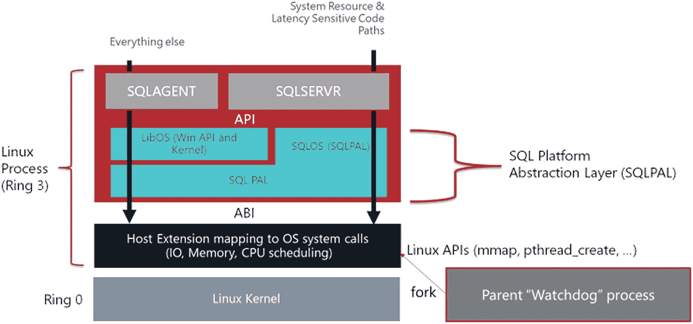
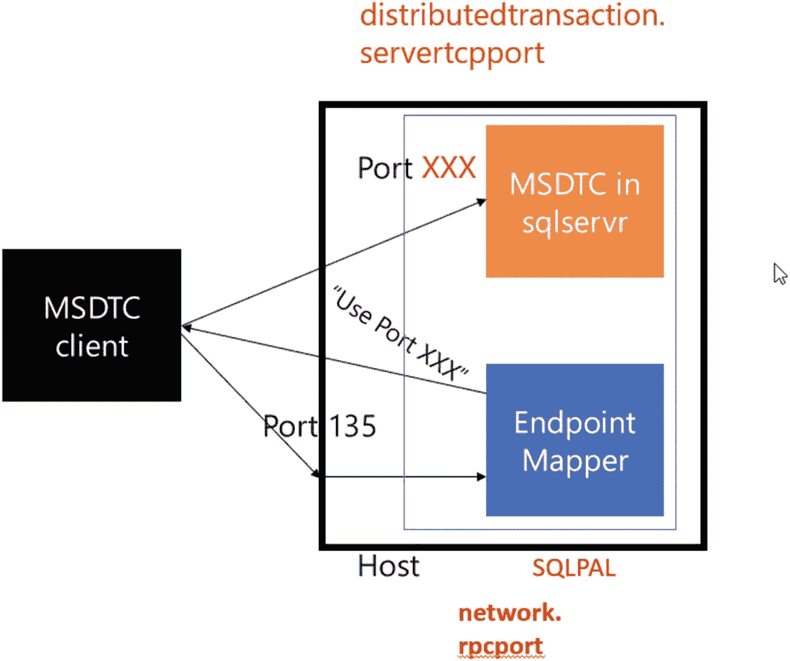
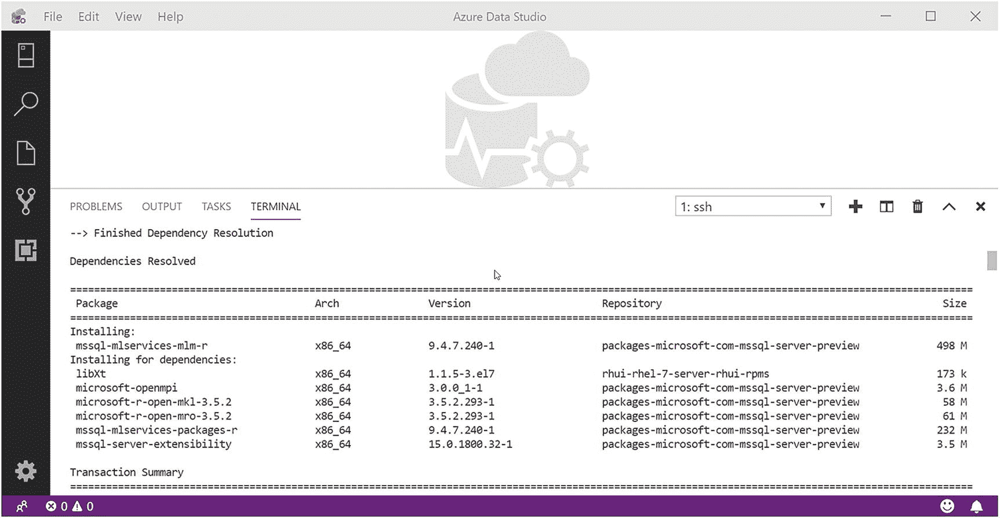
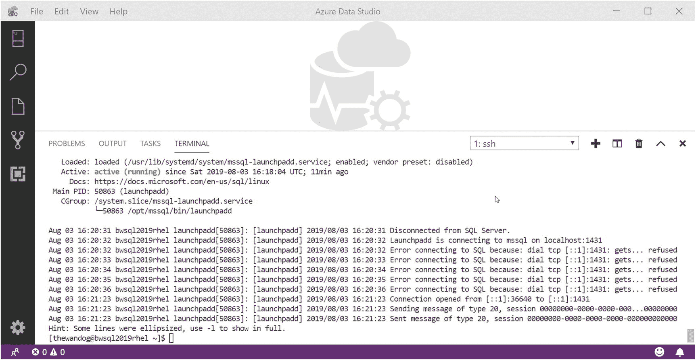
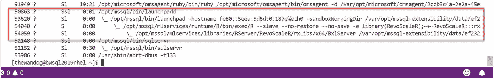
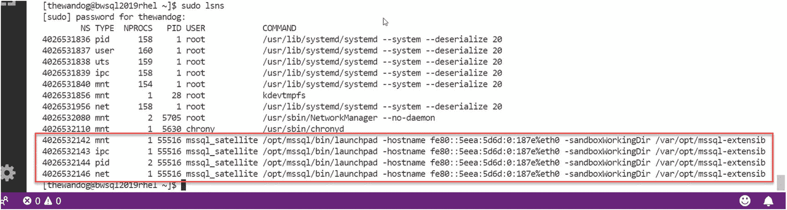
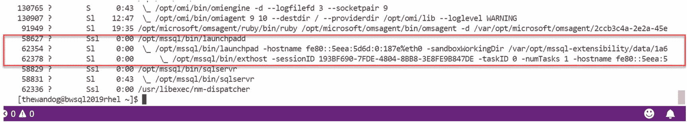

# 6. SQL Server 2019 on Linux

在本章中，我将介绍`SQL Server 2019`在`Linux`上的新特性。然而，如果你是`SQL Server` on `Linux`的新手，我将先回顾一下我们为何以及如何将`SQL Server`构建到`Linux`上运行这一非凡故事，以此作为本章的开始。

## SQL Server on Linux 的非凡故事

2017 年 10 月，我们的`SQL Server`工程团队通过在`Red Hat`、`Ubuntu`和`SUSE`等平台上发布`Linux`版的`SQL Server`，震撼了业界。我们的工程团队能够采用一种非常创新的策略和架构，利用一种名为`SQL 平台抽象层` (`SQLPAL`)的软件，将`SQL Server`推向市场。

图 6-1 展示了基于`SQLPAL`的`SQL Server` on `Linux`的基础架构。



图 6-1
`SQL Server` `Linux` 架构

我在`Apress Media`出版的`Pro SQL Server on Linux`一书中对此架构进行了非常深入的探讨，因此我不会在本书中重复（我知道；这是对另一本书的无耻推销）。然而，我包含此图并进行简要讨论，是因为它讲述了`兼容性带来的选择`这一故事。`SQL Server`核心引擎及其代码在`Windows`和`Linux`上是相同的代码库。`SQLPAL`提供了软件，使得`SQL Server`引擎不关心它运行在哪个`OS`平台上。这意味着你可以在`Windows`的`SQL Server`上获取数据库备份，然后完全兼容地在`Linux`上还原它。

在很大程度上，`SQL Server 2017`在`Linux`上的功能集与`Windows`上的完全相同。Slava Oks 曾告诉我，“Bob，`查询处理器`就是…`查询处理器`，无论是在`Windows`还是`Linux`上。”他的意思是，`查询处理器`的相同二进制代码在`Windows`和`Linux`上都能运行。甚至像`SQL Server Agent`和`SSIS`这样的功能在`Linux`版的`SQL Server`中也是可用的。

我们为`SQL Server`的几乎每个版本都设置了“时间盒”，试图在我们需要它上市的时间框架内，最大化放入一个主要版本中的价值，并取得平衡。

虽然我们本希望将`Windows`版`SQL Server`的所有功能都包含在`Linux`版的`SQL Server 2017`中，但有一些“引擎边缘”的功能我们没有时间放入该版本中——比如`复制`和`分布式事务协调器`(`DTC`)。此外，我们还进行了一些平台增强，以确保`Linux`上的`SQL Server`与`Windows`上的软件一样稳健，为企业客户做好准备。

在我深入探讨这个主题之前，我应该坦诚地告诉你，本章没有示例。你可能会读到这里并感到震惊，毕竟我写了一整本关于`Linux`上的`SQL Server`的书。本章的大部分内容要么需要一些复杂的配置，要么是独立于`Linux`使用`SQL Server`的一部分。话虽如此，请考虑以下关于`SQL Server`示例和演示的选项：

- `Pro SQL Server on Linux` `GitHub` 仓库 – [`https://github.com/Apress/pro-sql-server-on-linux`](https://github.com/Apress/pro-sql-server-on-linux)
- `bobsql` `GitHub` 仓库上的演示和示例 – [`https://github.com/microsoft/bobsql`](https://github.com/microsoft/bobsql)
- `Microsoft`关于`Linux`上`SQL Server`的动手实验 – [`https://docs.microsoft.com/en-us/learn/paths/sql-server-2017-on-linux/`](https://docs.microsoft.com/en-us/learn/paths/sql-server-2017-on-linux/)
- `SQL Server Workshop` 网站 – [`https://aka.ms/sqlworkshops`](https://aka.ms/sqlworkshops)。虽然我还没有在上面开设专门针对`Linux`上`SQL Server`的研讨会，但如果它将来某天出现，请不要惊讶。在这些研讨会中有使用容器进行`Linux`上`SQL Server` `复制`的实验。
- 最后，在第 7 章中，我将让你使用容器亲身体验`Linux`上的`SQL Server` `复制`。

## SQL Server 2019 在 Linux 上有哪些新功能

承接在 Linux 上交付 SQL Server 的势头，我们在 SQL Server 2019 中增加了多项增强功能，旨在解决数据专业人员面临的挑战，并实现与 Windows 版 SQL Server 的功能对等，包括：

*   **平台与部署增强**：确保 Linux 上的 SQL Server 能根据当前资源可用性做出正确响应，并提供与 Windows 版 SQL Server 对等的部署选项。此外，我们努力确保支持最新版本的 Linux 发行版，其中包含受 SQL Server 工程团队影响的 Linux I/O 增强功能。

*   **采用持久内存支持的 I/O 加速性能**：以跟上硬件技术的进步。

*   **Linux 上现已支持 SQL Server 复制**：以提供数据同步功能——这是多年来一直广受欢迎的 SQL Server 功能。

*   **更改数据捕获 (CDC)**：为开发人员和数据专业人员提供了一种跟踪 SQL Server 表中结构和数据变化的方法。这是 Windows 版 SQL Server 多个发行版中一直广受欢迎的功能，现在在 Linux 上也可用。

*   **确保支持分布式事务**：使开发人员能够像多年来在 Windows 版 SQL Server 上那样，编写分布式数据应用程序。

*   **使用 OpenLDAP 提供程序简化 Active Directory 部署**。

*   **在 Linux 上支持 SQL Server 机器学习服务和可扩展性**：以启用新的应用场景，以安全且可扩展的方式将机器学习模型靠近数据，并扩展 T-SQL 语言。

*   **通过支持对 Hadoop、SQL Server、Oracle、Teradata 和 MongoDB 等外部数据源的 PolyBase 查询（无需数据移动），将数据虚拟化引入 Linux 版 SQL Server**。

在本章后续部分，我将用一个主要章节来分别介绍这些增强功能。

## 平台与部署增强

对于 SQL Server 2019，我们对核心引擎和 `SQLPAL` 进行了增强，以确保 SQL Server 像在 Windows 上一样“为企业就绪”。此外，我们投入资源改进部署，以支持实现新功能所需的新安装包，并为用户提供与 Windows 上安装类似的功能。我们还想确保 Linux 版 SQL Server 受到最新 Linux 发行版的支持，例如 Red Hat Enterprise Linux 8.0、Ubuntu 18.04 和 SUSE Linux Enterprise Server 15。这些新的 Linux 发行版包含对 Linux 内核的增强，以提升具有持久性的 I/O 性能，这一点受到了 SQL Server 中 I/O 重要性的影响。

### 平台增强

虽然 Linux 上的 SQL Server 核心引擎与 Windows 上的 SQL Server 使用完全相同的代码库是千真万确的，但 `SQLPAL`（以及一个称为 Host Extension 的组件）的设计目的是允许 SQL Server 在必要时与 Linux 内核交互。我们在发布 Linux 版 SQL Server 后发现，有一些领域需要进行增强，以确保我们的数据库平台表现得与 Windows 版 SQL Server 一致。由于这些是集成在操作系统中的核心数据库引擎功能，我们将这些更改移植回了 SQL Server 2017——如果您安装了 SQL Server 2017 的最新累积更新，您将拥有这些更改。

#### 内存通知

SQL Server 的内存管理系统始终设计为具有弹性，能够响应 SQL Server 内部的内存需求以及整体操作系统环境中引擎外部的需求。

虽然 SQL Server 的核心引擎与 Windows 上的相同，但响应内存压力等概念是特定于操作系统的。我们发现 SQL Server 2017 on Linux 在“内存通知”概念上存在一些问题，并增强了我们的 Linux 集成，以确保其在 SQL Server 2019 中与 Windows 上的工作方式一致。

## 注意

我们还在最新的累积更新中进行了更改，以确保这些增强功能也包含在 SQL Server 2017 on Linux 中。

我们的增强功能将确保我们的“目标”（即 SQL Server 内存分配的上限）在操作系统存在内存压力时进行调整。换句话说，如果整个操作系统的物理内存不足，SQL Server 将调低“目标”，以尝试避免操作系统内存交换或可怕的“OOMKiller”场景（您可以在 `https://unix.stackexchange.com/questions/153585/how-does-the-oom-killer-decide-which-process-to-kill-first` 阅读更多关于 oomkiller 的信息）。

查看 SQL Server 目标内存随内存压力（即物理内存不足）而调整的方式是监控 `dm_os_sys_info` 动态管理视图 (DMV) 中的 `committed_target_kb` 列。

#### 环形缓冲区动态管理视图

SQL Server 有一个名为 `dm_os_ring_buffers` 的 DMV，可用于跟踪服务器和 `SQLSERVR.EXE` 进程的 CPU 利用率。此 DMV 官方未提供支持，但它用于一个关键的监控工具，即 SQL Server Management Studio (SSMS) 中的性能仪表板。您可以在 `https://docs.microsoft.com/en-us/sql/relational-databases/performance/performance-dashboard` 阅读更多关于如何使用性能仪表板的信息。

该仪表板的一个有用功能是显示计算机和 `SQLSERVR.EXE` 的整体 CPU 利用率（甚至可以是过去一小时的数据），以帮助缩小特定于 SQL Server 的 CPU 问题范围。此报告依赖于 `dm_os_ring_buffers` 的数据。问题是，在 Linux 上，我们始终报告 CPU 使用率为固定的 100%，因此该报告无法显示正确的数据。使用 SQL Server 2019（以及 SQL Server 2017 的最新 CU），此 DMV 报告正确的使用率，现在性能仪表板可以用于 Linux 上的 SQL Server 了。


## 在 Linux 上部署 SQL Server 2019

如果您熟悉在 Windows 上安装 SQL Server，那么您将对在 Linux 上部署 SQL Server 的简易性感到非常惊讶。您可以从此文档页面 [`https://docs.microsoft.com/en-us/sql/linux/sql-server-linux-overview`](https://docs.microsoft.com/en-us/sql/linux/sql-server-linux-overview) 开始，查看在 Linux 上部署 SQL Server 的“快速入门”。

Linux 版 SQL Server 的部署有几点值得注意的更改：

*   创建了`新软件包`以支持新功能。Linux 版 SQL Server 部署更轻量、更快的原因之一是产品以一系列软件包的形式部署。虽然 `mssql-server` 软件包包含了核心数据库引擎、SQL Agent、复制、CDC 和分布式事务，但启用新功能需要以下软件包：

    `mssql-mlservices-mlm-py∗` 和 `mssql-mlservices-mlm-r∗` – 机器学习服务的软件。还有其他用于 ML 服务的软件包，我将在本章后面描述。

    `mssql-server-extensibility` – 用于为可扩展性框架启用外部语言的软件。

    `mssql-server-extensibility-java` – 用于为外部语言启用 Java 支持的软件。此软件包将安装 `mssql-server-extensibility` 软件包。

    `mssql-server-polybase` – 用于在 Linux 版 SQL Server 上启用 Polybase 的数据虚拟化功能的软件。

*   与 Windows 版 SQL Server 一样，Linux 版 SQL Server 现在将根据安装过程中检测到的核心数，自动为 tempdb 创建`多个数据文件`（最多 8 个）。此选项有助于避免在系统分配页上的页面闩锁争用。

*   添加了 `mssql-conf` 选项以支持 SQL Server 2019 的新功能。例如，添加了用于 `DTC` 支持的 `mssql-conf` 选项，您可以在 [`https://docs.microsoft.com/en-us/sql/linux/sql-server-linux-configure-msdtc`](https://docs.microsoft.com/en-us/sql/linux/sql-server-linux-configure-msdtc) 阅读更多内容。

## 支持新的 Linux 版本

SQL Server 支持最新的主要 Linux 发行版版本至关重要。因此，对于 SQL Server 2019，我们希望确保支持这些主要的 Linux 版本：

*   Red Hat Linux Enterprise 8.0
*   Ubuntu 18.04
*   SUSE Linux Enterprise Server 15

## 注意

在本书撰写时，我们计划正式支持这些 Linux 版本与 SQL Server 2019。SQL Server 确实可以在所有这些版本上运行，但我们不得不对部署软件包进行一些更改，并确保它们经过充分测试。在 SQL Server 2019 发布时，可能会出现一些问题阻碍我们达到 100%就绪的状态，但如果届时未宣布，我预计不久之后会正式公布。

支持最新的 Linux 版本还带来了一个 I/O 性能方面的好处。我的长期同事 Bob Dorr 在 SQL Server 2017 发布后注意到，在 Linux 上使用`完全持久性`的 SQL Server 的 I/O 性能可能存在问题。这导致添加了一些 SQL Server 配置选项，用于一个称为“强制刷新”的概念，如微软文章 [`https://support.microsoft.com/en-us/help/4131496/enable-forced-flush-mechanism-in-sql-server-2017-on-linux`](https://support.microsoft.com/en-us/help/4131496/enable-forced-flush-mechanism-in-sql-server-2017-on-linux) 中所述。我们决定确保 SQL Server 默认优先考虑持久性而非性能。但客户当然希望两者兼得。如果客户知道其磁盘系统能够支持正确的刷新写入，他们可以更改默认设置，在保证性能的同时实现持久性。

在 2018 日历年，Bob Dorr 和 SQL Server 工程团队的其他人与 Linux 开源工程人员，特别是 Red Hat 的人员进行了合作。这项工作的成果是对 Linux 内核中 `XFS` 文件系统的 `上游` 进行了更改。Red Hat Enterprise Linux (`RHEL`) 8.0 包含了这些内核更改。其他 Linux 发行版将陆续包含这些更改。现在，用户可以“关闭”我们对 Linux 版 SQL Server 强制执行的刷新更改，但仍能在保证持久性的同时获得最大性能。

就像我们职业生涯中的其他经历一样，Bob Dorr 想讲述“故事背后的故事”。他在这篇详细的博客文章 [`https://bobsql.com/sql-server-on-linux-forced-unit-access-fua-internals/`](https://bobsql.com/sql-server-on-linux-forced-unit-access-fua-internals/) 中做到了这一点。我在 2019 年 5 月的 Red Hat 峰会上展示了这些更改，并展示了使用 `RHEL` 7.6 与 `RHEL` 8.0 相比，在配置 SQL Server 使用 `FUA` 增强功能时实现了惊人的 100%以上的性能提升。这看起来像是个小故事，但停下来想一想：`微软协助为开源 Linux 内核做出了贡献，以改进所有应用程序的 I/O 性能！`

## 持久内存支持

我喜欢 SQL Server 工程团队的一点是，他们总是着眼未来。始终关注技术的最新进展，以确保 SQL Server 保持领先。

看到 Linux 版 SQL Server 能够利用持久内存设备，我并不感到惊讶。持久内存 (`pmem`) 是一种`字节可寻址`的存储设备。这意味着持久内存可以像标准 RAM 一样访问，但具有存储设备的属性——因此存储在其上的数据可以在计算机断电和重启后得以保留。

在 Windows 和 Linux 中，持久内存设备通常都可以被视为`块`设备。换句话说，它们可以由操作系统呈现为标准磁盘驱动器，SQL Server 可以像访问任何驱动器一样访问它们。在块模式下，持久内存设备的访问速度甚至可能比市场上一些最快的 SSD 还要快。然而，由于 `pmem` 设备是字节可寻址的，像 SQL Server 这样的应用程序可以使用 `memcpy()` 等 API 调用，像访问内存一样在设备与标准 RAM 之间传输数据，从而获得更快的 I/O 性能。

SQL Server 2019 经过增强，能够识别存储在 `pmem` 设备上的数据库和事务日志文件，并`绕过` Linux 内核 I/O 堆栈来从这些设备传输数据。您可以在 [`https://docs.pmem.io/getting-started-guide/installing-ndctl`](https://docs.pmem.io/getting-started-guide/installing-ndctl) 阅读更多关于应用程序如何利用 `pmem` 设备的内容，这涉及一个称为 `DAX` 的概念 [`(www.kernel.org/doc/Documentation/filesystems/dax.txt`](https://www.kernel.org/doc/Documentation/filesystems/dax.txt))。

您可以在我们的文档 [`https://docs.microsoft.com/en-us/sql/linux/sql-server-linux-configure-pmem`](https://docs.microsoft.com/en-us/sql/linux/sql-server-linux-configure-pmem) 中了解如何为 SQL Server 配置 `pmem` 设备。正如我在第 2 章所述，DELL EMC 能够利用 `pmem` 支持实现 SQL Server 更快的性能，您可以在 [`www.emc.com/about/news/press/2019/20190402-01.htm`](https://www.emc.com/about/news/press/2019/20190402-01.htm) 阅读相关内容。此外，HPE 工程师在该 YouTube 视频 [`www.youtube.com/watch?v=8WUix125tQQ`](https://www.youtube.com/watch%253Fv%253D8WUix125tQQ) 中展示了 SQL Server 2019 的 I/O 性能改进。


## SQL Server 复制在 Linux 上

SQL Server 复制是用于将数据复制和分发到其他 SQL Server 实例的最流行技术之一。由于 SQL Server Agent 在 SQL Server 2017 中被包含，并且核心数据库引擎提供了 SQL Server 复制的大部分功能，我们希望该功能成为 SQL Server 2017 for Linux 的一部分。但在我们能够将所有部分连接起来并确保其经过充分测试之前，时间已经耗尽，因此 Linux 版的 SQL Server 复制现在随 SQL Server 2019 一起提供。

为了延续兼容性的伟大故事，Windows 版 SQL Server 复制的几乎全部功能在 Linux 上都存在。这包括快照、事务、合并和对等复制。此外，您可以配置复制以在 Windows 和 Linux 之间使用发布者和订阅者。

要了解 Linux 上 SQL Server 复制功能的完整集合，请阅读位于 [`https://docs.microsoft.com/en-us/sql/linux/sql-server-linux-replication`](https://docs.microsoft.com/en-us/sql/linux/sql-server-linux-replication) 的文档。

在关于容器的第 7 章中，我将向您展示一个如何使用容器在 Linux 上使用 SQL Server 复制的示例。该文档还包括一个位于 [`https://docs.microsoft.com/en-us/sql/linux/sql-server-linux-replication-tutorial-tsql`](https://docs.microsoft.com/en-us/sql/linux/sql-server-linux-replication-tutorial-tsql) 的教程。

## Linux 上的变更数据捕获

与 SQL Server 复制的情况类似，变更数据捕获的所有组件都存在于 SQL Server on Linux 中。然而，由于时间限制，我们无法在 SQL Server 2017 for Linux 中发布此功能。在 SQL Server 2019 中，CDC 得到了完全支持。

如果您不熟悉 CDC，它是一项捕获表中数据更改的出色技术，对于提取、转换和加载应用程序特别有用。

所有用于跟踪和查询更改的功能都由 SQL Server 内部提供。CDC 使用与 SQL Server 复制相同的一些内部技术来捕获更改的数据。您可以在 [`https://docs.microsoft.com/en-us/sql/relational-databases/track-changes/about-change-data-capture-sql-server`](https://docs.microsoft.com/en-us/sql/relational-databases/track-changes/about-change-data-capture-sql-server) 阅读所有关于 CDC 的内容。

## Linux 上的 DTC

在我们发布 SQL Server 2017 for Linux 之后，我问我的朋友 Bob Dorr 他的新重点会是什么。当然他说“所有事情”，但 Slava Oks 交给他的一个任务是努力实现 SQL Server for Linux 的功能对等。其中一项功能是分布式事务支持，包括对 Microsoft 分布式事务协调器的支持。

与工程团队的 Kapil Thacker 和其他人一起，我们能够利用 SQLPAL 架构让核心 MSDTC 服务和软件在 Linux 上工作，而无需为 Linux 编写一个“新的”DTC。（那个 SQLPAL 是个好东西。我们总有一天应该找到一种方法来开放 SQLPAL 架构，以便其他人可以让他们的 Windows 应用程序在 Linux 上运行。）

使用 DTC 进行 SQL Server 操作的最常见方法之一是通过链接服务器在分布式事务中使用，从一个 SQL Server 到另一个 SQL Server，使用 T-SQL `BEGIN DISTRIBUTED TRANSACTION` 语句。跨 SQL Server 实例的链接服务器查询在 SQL Server 2017 for Linux 上有效，但不适用于分布式事务。正如 Bob Dorr 在这篇博客文章 [`https://bobsql.com/sql-server-linux-distributed-transactions-requiring-the-microsoft-distributed-transaction-coordinator-service-are-not-supported-on-sql-server-running-on-linux-sql-server-to-sql-server-distributed-tr/`](https://bobsql.com/sql-server-linux-distributed-transactions-requiring-the-microsoft-distributed-transaction-coordinator-service-are-not-supported-on-sql-server-running-on-linux-sql-server-to-sql-server-distributed-tr/) 中指出的那样，如果您尝试这样做（等着瞧吧……现在使用最新的累积更新，在 SQL Server 2017 上就可以工作了），您将会收到错误。

如果您想知道 DTC 如何工作及与 SQL Server（或任何 XA 事务）交互的内部原理，请阅读 Bob Dorr 在 [`https://bobsql.com/how-it-works-sql-server-dtc-msdtc-and-xa-transactions/`](https://bobsql.com/how-it-works-sql-server-dtc-msdtc-and-xa-transactions/) 上这篇极其详细的博客文章。

虽然分布式链接服务器事务是该团队将 DTC 事务引入 SQL Server for Linux 的首要目标，但团队还希望为开发人员启用其他场景，包括：

*   针对 SQL Server on Linux 的 ODBC 提供程序的 OLE-TX 分布式事务。您可以在 [`https://docs.microsoft.com/en-us/sql/relational-databases/native-client-odbc-how-to/use-microsoft-distributed-transaction-coordinator-odbc`](https://docs.microsoft.com/en-us/sql/relational-databases/native-client-odbc-how-to/use-microsoft-distributed-transaction-coordinator-odbc) 阅读更多关于构建 OLE-TX 应用程序的信息。

*   使用 JDBC 和 ODBC 提供程序针对 SQL Server on Linux 的 XA 分布式事务。您可以在 [`https://docs.microsoft.com/en-us/sql/connect/jdbc/understanding-xa-transactions`](https://docs.microsoft.com/en-us/sql/connect/jdbc/understanding-xa-transactions) 阅读更多关于 XA 事务的信息。

为了实现此功能，Kapil、Bob 和团队必须以这样一种方式构建 MSDTC 服务：利用 SQLPAL 来支持其当前在 Windows 上运行时的现有端口通信结构。最终得到的架构如图 6-2 所示（Tejas Shah 和我合作构建了此图，并得到了 Kapil 和 Bob 的帮助）。



图 6-2

Linux 上的 MSDTC

这个图表绝对需要一些解释。想象 MSDTC 客户端是一个通过链接服务器的 SQL Server 分布式事务（因此是另一个运行 Linux 或 Windows 的 SQL Server）。在右侧的方框中，有两个使用 SQLPAL 在 SQLSERVR Linux 进程中运行的组件：端点映射器和 MSDTC。整体主机是承载 SQLSERVR 进程的 Linux 操作系统。

MSDTC 特别依赖端口 135，我们无法更改这一点，除非我们为 Linux 修改 MSDTC 代码。MSDTC 客户端首先尝试在端口 135 上进行通信。我们构建了一个“端点映射器”，它将端口 135 映射到我们可以监听的端口。这是由 `mssql-conf` 选项 `network.rpcport` 配置的。然后，该端点映射器将回传信息告诉 MSDTC 客户端使用哪个端口与 MSDTC Linux 服务通信，该服务随后与 SQL Server 集成。MSDTC 服务的端口可以是随机生成的，但您需要对此端口的防火墙访问权限，因此您应该使用 `mssql-conf` 选项 `distributedtransaction.servertcpport` 来配置它。

完整的配置体验可在 [`https://docs.microsoft.com/en-us/sql/linux/sql-server-linux-configure-msdtc`](https://docs.microsoft.com/en-us/sql/linux/sql-server-linux-configure-msdtc) 获取。完成这些配置后，您现在就可以跨 SQL Server 链接服务器启动 `BEGIN DISTRIBUTED TRANSACTION` 了。事实上，我有一个使用容器进行尝试的示例，位于 [`https://github.com/microsoft/sql-server-samples/tree/master/samples/containers/dtc`](https://github.com/microsoft/sql-server-samples/tree/master/samples/containers/dtc)。


## Active Directory 与 OpenLDAP

为了确保 Linux 上的 SQL Server 具备企业级可信度，我们必须支持 Active Directory (AD) 认证。与 Linux 上的 SQL Server 其他方面类似，其配置体验与 Windows 不同，但功能体验和兼容性是相同的。

我们在 [`https://docs.microsoft.com/en-us/sql/linux/sql-server-linux-active-directory-auth-overview`](https://docs.microsoft.com/en-us/sql/linux/sql-server-linux-active-directory-auth-overview) 文档中概述了在 Linux 上设置此功能的过程，而我在我著作 *Linux 上的 Pro SQL Server* 的第 7 章中讨论了其架构。

为 SQL Server on Linux 配置 AD 支持的步骤之一，是让托管 SQL Server 的 Linux 服务器加入 Active Directory 域。当我们发布 SQL Server 2017 on Linux 时，我们记录了如何使用名为 `SSSD` 的 Linux 包和名为 `realmd` 的程序来完成此操作。我们收到了客户的反馈，他们希望有替代方法加入域——具体来说，是更简单的体验，使用像 PBIS、VAS 或 Centrify 这样的第三方包。事实证明，SQL Server 并不阻止使用这些包；我们只需要进行一些微小的配置更改就能使它们工作。我们在 [`https://docs.microsoft.com/en-us/sql/linux/sql-server-linux-active-directory-join-domain`](https://docs.microsoft.com/en-us/sql/linux/sql-server-linux-active-directory-join-domain) 文档中概述并记录了这些方法。Tejas Shah 和团队花了一些时间清理了所有这些选项的文档。需要了解的是，这并非 SQL Server 2019 的新增强功能，因为它同样适用于 SQL Server 2017。然而，这个概念足够新，我想在本书中特别指出。

## SQL Server 机器学习服务与 Linux 上的可扩展性

正如我在第 5 章详细描述的，SQL Server 机器学习服务是**革命性的**——它允许您结合 R 和 Python 的强大功能，与 SQL Server 集成，以构建可扩展且强大的机器学习模型和应用程序。

虽然这对于 Windows 上的 SQL Server 来说一直是个很棒的功能，但我们需要通过将此技术引入 Linux 来完善兼容性故事。此外，当我们引入新的可扩展性框架和语言扩展（包括 Java）时，我们也需要确保其同样适用于 Linux。

### 在 Linux 上部署 SQL Server 机器学习服务

与 Windows 上的 SQL Server 类似，对于 Linux 上的 SQL Server 机器学习，我们会帮助您安装必要的包来部署 R 和 Python 脚本。

我们为您提供了部署 SQL Server 机器学习服务的选择——`minimal`、`full` 或 `combo`。它们的功能如下：

`full` – 包含 R 或 Python 的所有包，并包括可用于机器学习的预训练模型。此包名为 `mssql-mlservices-mlm-r` 或 `mssql-mlservices-mlm-py`。当您使用此选项时，所有依赖包（如 R Open）也会被安装。

`minimal` – 包含 R 或 Python 的所有包，但不包含预训练模型。此包名为 `mssql-mlservices-packages-r` 或 `mssql-mlservices-packages-py`。所有依赖包（如 R Open）也会被安装。

`combo` – 一步安装 SQL Server 2019（数据库引擎）和 SQL Server 机器学习服务。您可以在 [`https://docs.microsoft.com/en-us/sql/linux/sql-server-linux-setup-machine-learning#install-all`](https://docs.microsoft.com/en-us/sql/linux/sql-server-linux-setup-machine-learning%2523install-all) 阅读如何操作。

当我为 R 安装完整版 SQL Server 机器学习服务时，安装的包如图 6-3 所示。



图 6-3

为 R 安装完整的 SQL Server 机器学习服务

### 提示

如果您正在寻找一种通过 SSH 连接到 Linux 上 SQL Server 的好方法，可以使用 Azure Data Studio 中的终端选项，正如您将在本章示例中看到的。

请注意，安装的包之一是 `mssql-server-extensibility`，我将在本章后面描述，它是语言扩展的可扩展性框架所必需的（同一个框架既用于 SQL Server 机器学习服务，也用于语言扩展）。

部署完成后，您需要执行一些安装后步骤，例如接受 R 或 Python 的最终用户许可协议。请按照 [`https://docs.microsoft.com/en-us/sql/linux/sql-server-linux-setup-machine-learning#post-install-config-required`](https://docs.microsoft.com/en-us/sql/linux/sql-server-linux-setup-machine-learning%2523post-install-config-required) 文档中的步骤操作。

我还建议，就像在 Windows 上一样，使用 “hello world” 示例来验证安装是否成功。R 的示例如下 T-SQL 语句：

```
EXEC sp_execute_external_script
@language =N'R',
@script=N'
OutputDataSet <- InputDataSet',
@input_data_1 =N'SELECT 1 AS hello'
WITH RESULT SETS (([hello] int not null));
GO
```

也有可能您、数据科学家或数据工程师需要额外的 R 或 Python 库用于您的应用程序。请使用 [`https://docs.microsoft.com/en-us/sql/linux/sql-server-linux-setup-machine-learning#add-more-rpython-packages`](https://docs.microsoft.com/en-us/sql/linux/sql-server-linux-setup-machine-learning%2523add-more-rpython-packages) 文档中的以下指南了解如何添加此代码。

## 注意

如果您曾在 SQL Server 2019 CTP 版本中使用此功能，请务必在尝试使用 SQL Server 2019 RTM 功能之前删除所有那些包。


## 工作原理

我在第 5 章描述了 SQL Server ML Services 的架构，包括启动板服务和卫星进程。

SQL Server ML Services 在 Linux 上的概念相同。在 Linux 上，启动板进程是一个名为 `mssql-launchpadd` 的 systemd 单元服务。你可以使用 `systemctl` 查看或控制此服务。图 6-4 显示了该服务在 Linux 上状态的示例。



图 6-4 Linux 上的启动板

在 Linux 上，启动板服务由一个名为 `launchpadd` 的守护进程表示。与在 Windows 上为卫星进程派生进程的概念相同，这在 Linux 上也适用，包括 R 程序和 `bxlserver`。图 6-5 显示了从 `launchpadd` 服务派生出来运行 R 脚本的进程。



图 6-5 SQL Server on Linux 上用于 R 脚本的卫星进程

你可能会问，我是如何捕获这些正在运行的进程的？请按以下步骤操作：

从另一个 `ssh` 会话，运行以下 T-SQL 脚本：

```sql
EXEC sp_execute_external_script
@language =N'R',
@script=N'
OutputDataSet <- InputDataSet
Sys.sleep(10)',
@input_data_1 =N'SELECT 1 AS hello'
WITH RESULT SETS (([hello] int not null));
GO
```

注意 `Sys.sleep()` 调用会使 R 脚本在执行期间暂停。

从你的另一个 `ssh` 会话，从 Linux shell 运行以下命令：

```bash
ps -axf
```

SQL Server ML Services（以及可扩展性框架）使用命名空间来实现卫星进程的进程隔离。你可以使用与前面相同的示例使 R 脚本暂停，并在 Linux 上运行命令：

```bash
sudo lsns
```

你将看到为启动板进程（它会派生卫星进程）创建的独立命名空间。图 6-6 显示了这个独立命名空间的示例。



图 6-6 Linux 上用于卫星进程的命名空间

图 6-6 揭示了关于 SQL Server ML Services（以及可扩展性框架）的另一个重要方面。卫星进程运行所使用的用户账户称为 `mssql_satellite` 登录名。这对于 R 或 Python 脚本（以及可扩展语言）所需的任何权限都很重要。

## 注意

别忘了，SQL Server 的本机评分功能内置于 SQL Server 引擎中，因此可以在 SQL Server on Linux（甚至 SQL Server 2017）上使用。请在 [`https://docs.microsoft.com/en-us/sql/advanced-analytics/sql-native-scoring`](https://docs.microsoft.com/en-us/sql/advanced-analytics/sql-native-scoring) 阅读更多信息。

## 可扩展性框架与语言扩展

基于与 SQL Server ML Services 相同的框架，我们引入了语言扩展的概念，我在第 5 章对此有详细描述。作为此功能的一部分，我们将 Java 作为一个开箱即用的语言扩展示例进行了发布。

要在 Linux 上部署 SQL Server 语言扩展，你可以安装以下软件包之一：

`mssql-server-extensibility` – 这是用于任何语言的可扩展性框架的核心软件。如你在本章前面所见，这是一个依赖包，在安装 SQL Server ML Services 时会一同安装。

`mssql-server-extensibility-java` – 这将安装可扩展性框架、Java 语言扩展以及 SDK，以便你可以运行 Java 代码。

与 SQL Server ML Services 一样，你还可以选择执行 SQL Server 与语言扩展的组合安装，你可以在 [`https://docs.microsoft.com/en-us/sql/linux/sql-server-linux-setup-language-extensions`](https://docs.microsoft.com/en-us/sql/linux/sql-server-linux-setup-language-extensions) 阅读相关信息。此外，如果 Linux 上尚未安装 Java 运行时环境（JRE）版本 8（与 Windows 类似，我们将安装 Zulu JRE），SQL Server 将会安装它。

部署 Java 类的过程与 Windows 上的 SQL Server 以及我在第 5 章描述的如何使用正则表达式教程几乎相同。事实上，Java 的兼容性非常好，因此你可以获取在第 5 章构建的相同 Java 类，并在 Linux 上编译/构建一个 `jar` 文件。你使用相同的步骤来创建外部语言、用于 SDK 的外部库以及用于你的 Java 类（以 `jar` 文件形式）的外部库。

当你运行代码时，会使用相同的启动板架构来派生一个进程进行卫星处理。与 Windows 上的 SQL Server 类似，此进程称为扩展主机，在 Linux 上的进程输出如图 6-7 所示。



图 6-7 用于在 SQL Server on Linux 上运行 Java 的 `exthost` 卫星进程

## Linux 上的 PolyBase

很难在书中将所有内容都以完全正确的顺序安排妥当。第 9 章专门介绍 SQL Server 2019 中的数据虚拟化和 PolyBase 概念。我在这里想简要提一下，因为这对 SQL Server on Linux 来说是新的功能。

PolyBase 在 SQL Server 2016 中作为 Hadoop 连接器引入，并在 SQL Server 2019 中通过用于 SQL Server、Oracle、Teradata 和 MongoDB 的连接器得到了增强。

正如你将在第 9 章读到的，PolyBase 使用了我们 Analytics Platform System（APS，以前称为并行数据仓库）的一些组件来执行横向扩展查询处理。这些在 Windows 上作为服务存在，并在 SQL Server 2019 for Linux 上使用 SQLPAL。

我们引入了 `mssql-server-polybase` 软件包来为 SQL Server on Linux 启用 PolyBase。你可以在 [`https://docs.microsoft.com/en-us/sql/relational-databases/polybase/polybase-linux-setup`](https://docs.microsoft.com/en-us/sql/relational-databases/polybase/polybase-linux-setup) 阅读完整的部署步骤。

用于 SQL Server on Linux 的 PolyBase 与用于 Windows 的 PolyBase 使用相同的 T-SQL 语句和概念，但 SQL Server 2019 有以下例外：

*   SQL Server on Linux 的 PolyBase 不支持横向扩展组。

*   不支持通用 ODBC 连接器。

我们未来的计划是使 SQL Server on Linux 的 PolyBase 在 SQL Server 2019 之后实现功能完全对等。你将在第 9 章了解更多关于如何使用 PolyBase 的信息。


