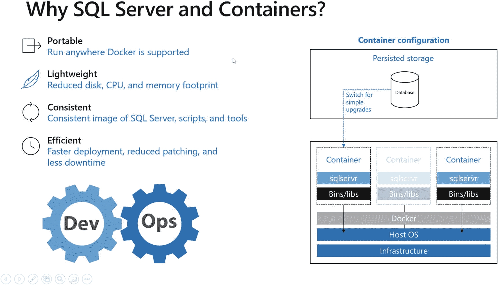
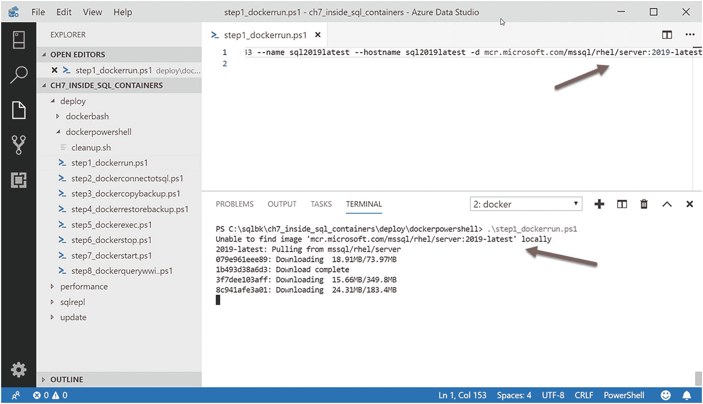
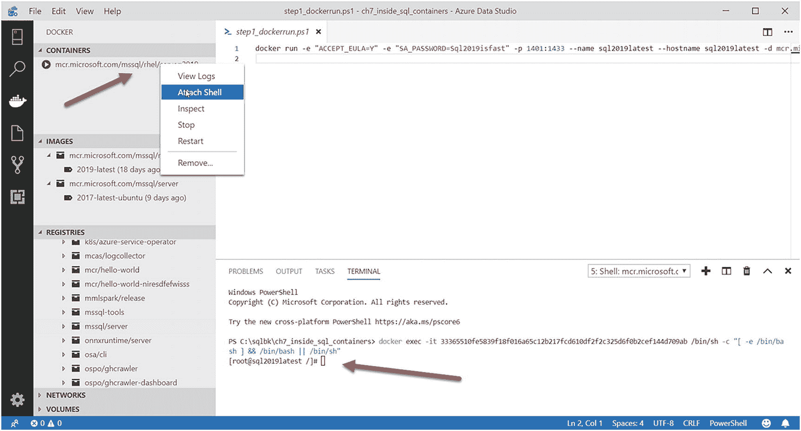
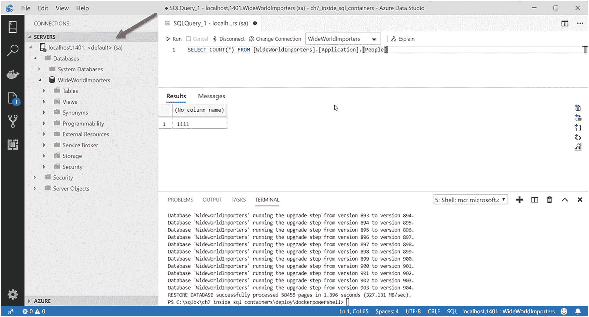
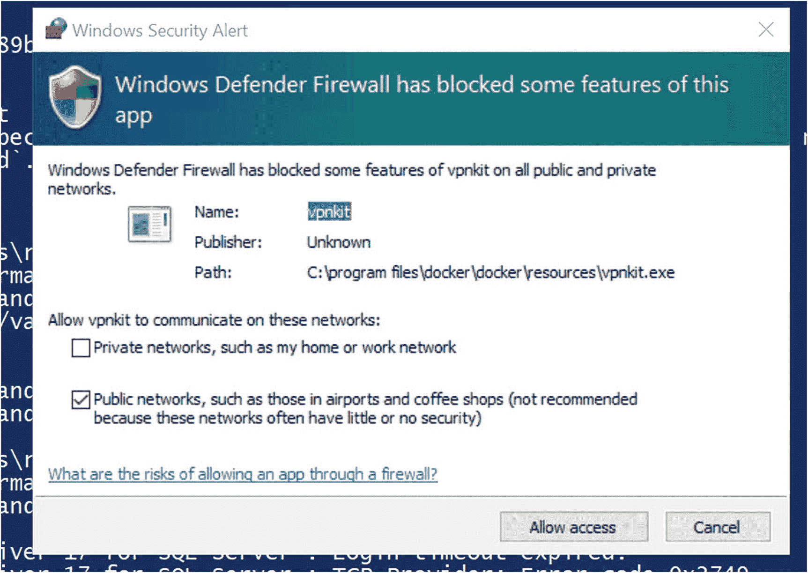
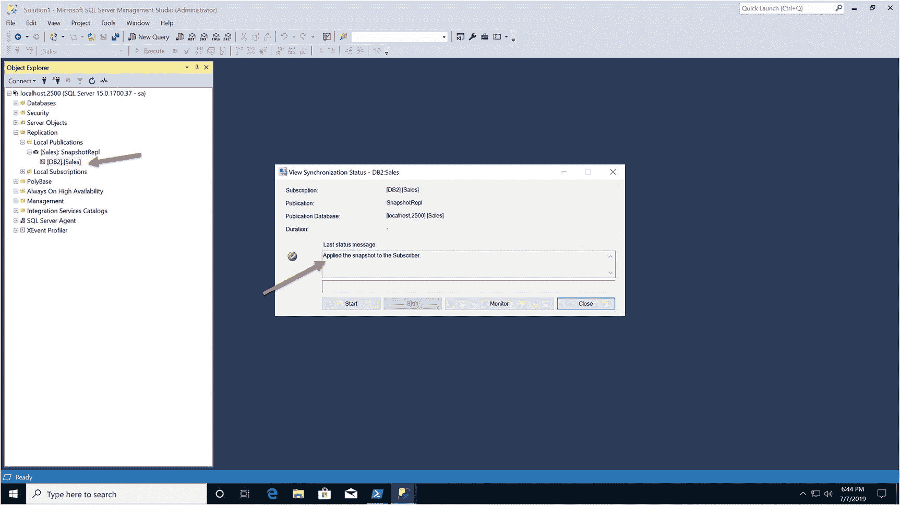

# 7. SQL Server 容器内部探秘

## 概要

SQL Server on Linux 的核心在于提供**兼容的选择**。在 SQL Server 2017 中，用于 Linux 的核心数据库引擎与 Windows 上的 SQL Server 保持兼容。到了 SQL Server 2019，我们进一步增强了引擎边缘能力的特性支持，包括 `复制`、`变更数据捕获`、`分布式事务`、`机器学习服务` 和 `语言扩展`，以及 `Polybase`。

此外，我们还改进了与 Linux 平台的集成，支持最新的 Linux 发行版，通过增强的 I/O 性能提高了持久性，增加了持久内存支持，并明确了如何使用 `OpenLDAP` 提供程序来配置 `Active Directory` 身份验证。

SQL Server on Linux 的故事是强有力的。2019 年 5 月，我受邀参加红帽峰会，不仅作为听众，还与几位同事一起（其中一次是与红帽联合演讲）讲述 SQL Server on Linux 的故事。我也曾参加过 2018 年的红帽峰会，当 2019 年的活动结束时，我不再觉得 Microsoft SQL Server 是“新来的”。我感到我们现在已成为 Linux 生态系统和社区的主流组成部分。

## 为何选择 SQL Server 容器？

当我构思本章内容时，曾考虑只介绍 SQL Server 2019 在容器方面的新特性。虽然仅此内容就足以成章，但我决定扩大范围，更全面地探讨容器的概念、为何将其作为部署 SQL Server 的新方式很重要，当然还有 SQL Server 2019 为容器带来的新功能。关于容器我可以写一整本书，因此你读完本章后不会对该主题有详尽无遗的了解。有许多关于容器的优秀资源（我发现 [`www.docker.com`](http://www.docker.com) 仍然很有价值！）可以作为本章的补充。我本章的目标是为你提供足够的信息，让你了解 SQL Server 容器的工作原理以及为何应考虑使用它们。我保证，读完本章你将懂得如何部署、管理和使用 SQL Server 容器。

如果你觉得自己对容器的概念已经相当熟悉，欢迎直接跳转到“SQL Server 2019 的新特性”一节。该节之后是一系列示例，你会发现它们对深入探索容器非常有价值。我应该说，即使你了解容器的基础知识，也可能需要从“SQL Server 容器如何工作”一节开始阅读，特别是“SQL Server 容器”小节，因为我将揭示 SQL Server 使用容器时一些独特方面的内部机制。

容器解决了虚拟机目前无法应对的一项挑战。虚拟机是一项将应用程序与底层硬件*抽象分离*的卓越技术，但它需要为你的应用程序加载并运行一整套操作系统。虚拟机确实允许应用程序在主机上彼此隔离运行，对于 SQL Server 而言，这一直是整合场景的一个很好的解决方案（尽管 SQL Server 本身也支持在同一台计算机上托管多个实例）。容器提供了相同的概念隔离，但它们比使用虚拟机**轻量得多**。容器通常被视为对操作系统的一种抽象。

在我描述容器时，请记住一个重要概念：容器**并非取代**虚拟机，而是对虚拟机的**补充**。事实上，运行容器最常见的环境之一就是在虚拟机内部。让我先定义*容器镜像*，再给出容器的定义。容器镜像是一个二进制文件，描述了按文件系统组织的一组文件以及要从这些文件运行的 `程序`。而*容器*则是在**隔离方式**下运行容器镜像程序以及该镜像文件系统的一个实例。

请看下面图 7-1 中我常用来讨论容器是什么以及为何能解决现代应用某些挑战的示意图。



让我从图的左侧开始解读这张图：

**可移植性**

容器具有可移植性，因为容器镜像可以在任何能运行 `docker` 的地方运行，这几乎无处不在，包括 Windows、Linux 和 macOS 计算机，或是支持这些操作系统的云系统，亦或是 `Kubernetes`（你将在第 8 章了解更多关于 `Kubernetes` 的内容）。你可以将 SQL Server 容器镜像作为二进制文件“拉取”到上述任何系统中，它都能以相同方式运行。

## 注意

所有 macOS 用户请注意。请查看我撰写的以下博文，了解如何无需任何 Windows 软件即可运行 SQL Server 及其工具！[`https://bobsql.com/take-the-sql-server-mac-challenge/`](https://bobsql.com/take-the-sql-server-mac-challenge/)

**轻量级**

容器是容器镜像的运行实例，它本质上只是一个基于程序、以隔离方式运行的进程。这使得它比运行一整套虚拟机来托管一个程序要**轻量得多**。容器的足迹也得到了优化，因为如果你从一个镜像运行多个容器，镜像文件的一部分（称为 `可读` 层，我将在本章后面解释）会在容器之间共享。这将减少在同一台主机或虚拟机上运行多个 SQL Server 实例所需的占用空间和资源。


## 注意

Linux 上的 SQL Server 不支持多实例，但你可以通过容器实现相同的解决方案。

`一致性`

这是我在容器方面绝对喜爱的特性之一，它帮助解决了 SQL Server 的一大难题。多年来，公司都为开发者搭建了安装了 SQL Server 的 `开发` 服务器，作为测试和开发的演练场。但这会带来巨大的痛苦，因为太多开发者使用同一个 SQL Server（而且他们通常需要较高的 SQL Server 访问权限），可能导致不一致性和给数据库管理员等人员带来重大困扰。

容器为开发者提供了一种一致的方式来使用 SQL Server，而无需共享一个 SQL Server 实例。例如，如果你希望所有开发者都使用特定版本的 SQL Server 镜像以及特定的数据库，你可以构建一个容器镜像来实现这一点。而且由于容器具有可移植性，并且 SQL Server 现在支持 Linux，你可以为使用不同平台的开发者提供相同的 SQL Server 容器镜像。你的 macOS 开发者可以使用与 Windows 开发者相同的 SQL Server 镜像。这真是一个一致的方案！图中 `DevOps` 标志左下角的符号仅仅描述了容器对于支持 DevOps 模型是多么重要。

`高效`

容器为更新像 SQL Server 这样的软件提供了一种全新的、坦白说令人思维开阔的体验。如果你曾经需要为 SQL Server 应用累积更新或补丁，你会发现容器的体验令人惊叹。你将体验到更少的停机时间，以及需要时更快回滚更新的体验。

在右侧的图 7-1 中，图示说明了其工作原理。中间“灰掉”的容器代表一个已停止的 SQL Server 容器。左侧的容器是新版本的 SQL Server，它已启动但指向相同的系统和用户数据库，这些数据库存储在 `持久化存储` 中（这称为卷的概念，我将在本章后面解释）。这是我在本章后面要向你展示的一种技术，我称之为“切换”容器，以应用或回滚 SQL Server 的累积更新。

在你查看图示时，我想指出以下几点观察：

*   标有 `Bin/libs` 的黑色方框代表运行 SQL Server 所需的最小二进制文件。这代表了容器相对于整个虚拟机的“轻量级”方面。图中没有真正体现的是，如果容器来自同一个镜像，这些文件是跨容器共享的。
*   标有 `Docker` 的方框代表用于运行和管理容器的 docker 软件。实际上，这里应该写“容器运行时”，因为 Docker 只是容器运行时的一个例子。
*   注意那些指向下方 *穿过* Docker 到 `主机操作系统` 的箭头。Docker 并不是容器和主机操作系统之间的一层。换句话说，SQL Server 不必通过某个层来通信以执行内核操作系统操作。这就是为什么容器也被认为更轻量级，因为它们有一个直接与主机操作系统对话的程序。容器执行的独特之处在于它们彼此隔离运行，因此得名容器。

有了这些容器的基础知识，让我们花时间学习容器的工作原理。理解事物的工作原理通常能让你更高效地使用它们。

## SQL Server 容器如何工作

在你开始尝试 SQL Server 容器之旅前，让我花时间解释它们的工作原理。为了解释它们如何工作，我需要花一些时间谈谈 `容器托管`、docker 背后的魔力以及 `容器生命周期`。

### 容器托管

我刚在上一节结束时谈到容器实际上是直接与主机操作系统协同工作的程序。主机操作系统可以位于虚拟机中，也可以直接位于主机 `裸机` 计算机上。

由于该程序像系统上的任何程序一样直接与主机操作系统交互（当然，它们以特殊隔离的方式运行），它们必须被编译和执行以在主机操作系统上运行。

当我们在 Linux 上发布 SQL Server 2017 时，我们还引入了基于 Linux 的 SQL Server 容器镜像，即 Ubuntu Linux。世界上几乎每个容器镜像都基于一个主机操作系统，并且大多数基于 Linux。对于 Linux 主机系统，运行基于 Linux 的 SQL Server 容器没有问题。无论 Linux 系统是裸机计算机还是虚拟机，SQL Server Linux 容器都是天然契合的。

那么 Windows 和 macOS 呢？作为容器运行时的 Docker 是关键。Docker 通过一个名为 Docker Desktop for Windows 的程序支持在 Windows 上运行容器。任何基于 Linux 镜像的容器都将在运行 Linux 的虚拟机上下文中运行，该虚拟机称为 `DockerDesktopVM`。macOS 的 Docker Desktop 使用一个称为 HyperKit 的概念（ [`https://github.com/moby/hyperkit`](https://github.com/moby/hyperkit) ）。你可以在 [`www.docker.com/products/docker-desktop`](https://www.docker.com/products/docker-desktop) 上阅读更多关于 Docker Desktop 的信息。

最近，Docker for Windows 在容器方面取得了一些进展，支持一个称为 Linux Containers for Windows (LCOW) 的概念。Windows 团队将此概念描述为在 Windows 中运行 Linux 容器比使用完整虚拟机更轻量的方法。你可以在 [`https://docs.microsoft.com/en-us/virtualization/windowscontainers/deploy-containers/linux-containers`](https://docs.microsoft.com/en-us/virtualization/windowscontainers/deploy-containers/linux-containers) 上阅读更多关于 LCOW 的信息。此外，Docker Desktop for Windows 可以使用一种更优化的方法，利用新的 Windows Subsystem for Linux (WSL)。你可以在 [`https://engineering.docker.com/2019/06/docker-hearts-wsl-2/`](https://engineering.docker.com/2019/06/docker-hearts-wsl-2/) 上阅读更多关于 Docker Desktop 如何使用 WSL2 的信息。

那么基于 Windows 或 macOS 镜像的容器呢？如果容器镜像基于像 Linux 这样的操作系统，那么是否存在基于 Windows 或 macOS 的容器镜像？答案是 Windows 有。Windows 确实有一个基于 Windows 的容器镜像概念。你可以在 [`https://docs.microsoft.com/en-us/virtualization/windowscontainers/about/`](https://docs.microsoft.com/en-us/virtualization/windowscontainers/about/) 上阅读更多关于 Windows 容器的信息。SQL Server 尚未发布受支持的 Windows 容器版本。但在 2019 年夏天，我们宣布了 SQL Server Windows 容器的私有预览计划。我将在本章末尾更多地讨论 SQL Server Windows 容器。在我撰写本书时，我尚未看到基于 macOS 的容器镜像。由于 SQL Server 并非原生为 macOS 构建，这不是问题，但正如我所说，SQL Server 支持 Linux，而 Linux 将使用 macOS 的 Docker Desktop（使用 HyperKit）运行。

### Docker 有魔法吗？

到目前为止我所描述的内容，对任何熟悉计算机系统的人来说似乎都有些神奇。每当有人提到“容器”这个词，“Docker”这个名字几乎总会紧随其后。事实证明，操作系统虚拟化的概念——即定义了容器到底是什么的概念——已经存在一段时间了（更多信息请阅读 [`https://en.wikipedia.org/wiki/OS-level_virtualisation`](https://en.wikipedia.org/wiki/OS-level_virtualisation)）。任何曾与我共事过、当我去研究某样东西如何工作时的人都知道，我总是想知道“API 是什么？” 换句话说，就是用来实现目标的编程接口是什么。对于容器而言，答案隐藏在内核操作系统提供的 API 之后。

Docker（以及市场上其他的容器运行时）采用了容器的概念，并构建了一个被广泛使用的平台和生态系统。但 Docker 本身是利用操作系统的功能来实现容器概念的，具体来说，是以下这些主要结构（在 Linux 上，但类似概念也适用于 Windows 容器）：

`命名空间（Namespace）` – 命名空间提供了一种机制，使进程能够彼此隔离运行。你可以在 [`https://en.wikipedia.org/wiki/Cgroups#NAMESPACE-ISOLATION`](https://en.wikipedia.org/wiki/Cgroups%2523NAMESPACE-ISOLATION) 阅读更多关于命名空间的信息。

`控制组（Control groups，cgroups）` – `cgroups` 提供了一种控制进程或一组进程资源使用情况的机制。容器默认情况下可以访问所有计算资源，如内存和 CPU，但 `cgroups` 提供了一种限制容器资源使用的方法。

`联合文件系统（Union file system）` – 联合文件系统允许将多个目录呈现为一个目录。这个概念是保持容器体积小巧以及支持`可读`和`可写`层的关键。在 Linux 系统中，`OverlayFS` 文件系统支持联合文件系统。你可以在 [`https://docs.docker.com/storage/storagedriver/overlayfs-driver/#how-the-overlay-driver-works`](https://docs.docker.com/storage/storagedriver/overlayfs-driver/%2523how-the-overlay-driver-works) 阅读更多关于它如何为容器工作。

让我停下来解释一下我刚刚为容器引入的一个关键概念：

`可读层（readable layer）` – 容器镜像是只读的，由文件系统中呈现的一组文件组成。对于 SQL Server 而言，这包括基础操作系统镜像支持的最小文件集，以及 SQL Server 的文件，包括二进制文件和系统数据库。

`可写层（writeable layer）` – 可写层是指容器启动后对其文件系统所做的任何更改。这可能包括对来自可读层的文件的任何修改或添加的新文件。可写层在容器的整个生命周期内都是持久存在的。一旦容器被移除，可写层也会被移除。正如你可以想象的那样，对于 SQL Server 用户数据库来说，这就带来了问题。

`卷（volume）` – 卷是主机上持久存储的一个位置，它映射到容器可写层中的一个目录位置。你会看到，对于 SQL Server，常见的做法是使用一个卷来映射到容器中的某个目录以存储数据库。卷的存在独立于容器的生命周期，因此即使容器被移除，卷仍然存在。

我非常喜欢 Docker 所做的一件事是引入了他们自己的 API，抽象了支持容器的底层操作系统概念，称为 `libcontainer`。你可以在 [`https://github.com/opencontainers/runc/tree/master/libcontainer`](https://github.com/opencontainers/runc/tree/master/libcontainer) 阅读更多关于 `libcontainer` 的信息。另一篇关于容器开源性质的有趣读物是开放容器倡议（OCI），微软是其创始成员之一（[`www.opencontainers.org/`](https://www.opencontainers.org/)）。

需要指出的是，Docker 是容器运行时的一个例子，也是业界最受欢迎的之一。还有一个名为 `containerd` 的开源容器运行时，你可以在 [`https://containerd.io/`](https://containerd.io/) 了解它。

## 容器生命周期

无论您在 Linux、Windows 还是 macOS 上安装 Docker，都会安装以下支持容器的组件：

`Docker 引擎` – 这由 `docker 守护进程` 组成，它是一个用于控制构建和运行容器的所有操作的“服务”。`docker 引擎` 支持一个 API，供程序与之交互以构建和运行容器。您可以在 [`https://docs.docker.com/engine/`](https://docs.docker.com/engine/) 阅读更多关于 `docker 引擎` 的内容。您可以在 [`https://docs.docker.com/develop/sdk/`](https://docs.docker.com/develop/sdk/) 阅读更多关于引擎 API 的内容。

`docker 客户端` – 这是一个名为 `docker` 的程序，它使用引擎 API 来构建和运行容器。`docker 客户端` 是一个一致性程序，因为它在 Windows、macOS 和 Linux 上支持相同的选项和行为。在本章的示例中，您将全程使用 `docker 客户端`。

`docker compose` – 这是一个名为 `docker-compose` 的程序，它允许您构建和运行多容器应用程序。在本章稍后关于 SQL Server 复制的示例中，您将使用 `docker-compose`。

结合这些组件，以下是我称之为容器生命周期的工作流程，如图 7-2 所示。


图 7-2

容器生命周期

让我们更详细地看看其中的每一个环节：

### 构建

`docker build` 命令用于构建新的容器镜像。尽管支持 SDK，但标准方法是使用名为 `Dockerfile` 的文件来定义要构建的镜像。您可以在 [`https://docs.docker.com/engine/reference/commandline/build/`](https://docs.docker.com/engine/reference/commandline/build/) 阅读更多关于 `docker build` 的内容。`Dockerfile` 语法的参考文档可以在 [`https://docs.docker.com/engine/reference/builder/`](https://docs.docker.com/engine/reference/builder/) 找到。Microsoft 构建了包含 SQL Server 的镜像，因此在许多情况下您永远不需要构建自己的镜像。但是，在某些情况下，您可能需要构建一个 *基于 SQL Server* 的自定义镜像。我将在本章后面展示一些例子。

### 推送

构建镜像后，您可能希望其他人也能使用它，因此您可以使用 `docker push` 命令将容器镜像推送或发布到注册表。该注册表可以位于本地服务器上，也可以是公共领域的。最常见的公共领域注册表之一是 Docker Hub 或 hub.docker.com。Microsoft（包括 SQL Server）在 mcr.microsoft.com（称为 Microsoft 容器注册表）发布其容器镜像。我将在本章后面讨论如何在 Microsoft 容器注册表上找到各种 SQL Server 镜像。您可以在 [`https://docs.docker.com/engine/reference/commandline/push/`](https://docs.docker.com/engine/reference/commandline/push/) 阅读更多关于 `docker push` 的内容。

### 拉取

任何想要使用容器镜像的人都必须先拉取它，即使它存储在本地服务器上。容器镜像使用 `docker pull` 命令进行拉取。`docker 引擎` 会将镜像的一份副本本地存储在主机计算机上。您可以在 [`https://docs.docker.com/engine/reference/commandline/pull/`](https://docs.docker.com/engine/reference/commandline/pull/) 阅读更多关于 `docker pull` 命令的内容。

### 运行

要基于镜像运行容器，请使用 `docker run` 命令。如果您运行容器的镜像尚未拉取，docker 会先拉取该镜像，然后运行容器。您将在本章中学习运行 SQL Server 容器所需的所有参数和细节。

### 管理

运行容器后，您将需要 `管理` 它。`docker 客户端` 将允许您停止、启动、重启和移除容器。此外，`docker 客户端` 还允许您管理镜像，包括删除它们。

### 监控

`docker 客户端` 也可用于 `监控` 和管理容器生态系统，方法是列出正在运行和已停止的容器，并转储运行中和已停止容器的统计信息和日志。

### 交互

最后，`docker 客户端` 允许您与正在运行的容器进行 `交互`，方法是从主机系统将文件复制到容器的可写层，并运行存在于容器文件系统中的程序（该程序将在与主容器程序相同的命名空间中运行）。这些命令对于 SQL Server 容器将非常有用，正如您将在本章的示例中看到的那样。

### SQL Server 容器

SQL Server 容器镜像包含了 SQL Server 引擎、SQL Server Agent、引擎附带的所有功能（如复制）以及 SQL Server 命令行工具（`sqlcmd` 和 `bcp`）所需的必要文件。当你运行一个 SQL Server 容器时，`SQL Server` 已经预先安装好了！换句话说，当你拉取并运行一个 SQL Server 容器后，就可以直接使用它了。这是使用 SQL Server 容器的主要优势之一。一旦启动容器，就无需再安装 SQL Server。

我在前一节提到过，镜像是使用一个名为 Dockerfile 的文件通过 `docker build` 命令构建的。为了理解 SQL Server 容器是如何预先安装的，这里大致列出了 SQL Server Dockerfile 中的命令：

```
FROM 
LABEL 
EXPOSE 1433
COPY 
RUN ./install.sh
CMD ["/opt/mssql/bin/sqlservr”]
```

`FROM` 命令指定了 SQL Server 容器镜像所基于的基础操作系统镜像。容器的一大优点就是能够基于其他镜像构建新镜像，从而形成镜像的分层效果。实际上，本章稍后我会展示如何基于 SQL Server 镜像（该镜像又基于基础操作系统镜像）构建你自己的镜像。

`EXPOSE` 命令允许 SQL Server 容器使程序能够连接到容器内部的 `1433` 端口。这一点很重要，因为默认情况下容器是隔离的。你会看到，这个端口通常会被映射到主机上的另一个端口，从而允许多个 SQL Server 容器在同一主机上运行（否则通常会失败，因为两个程序不能监听同一个端口）。

`COPY` 和 `RUN` 命令只是构建过程的一部分，用于将所有 SQL Server 二进制文件复制到容器镜像的文件系统中，并安装任何软件依赖项。

到目前为止，SQL Server Dockerfile 中的这些命令都是构建容器镜像的一部分。当执行 `docker build` 命令时，这些语句中的每一个都会被用来构建镜像。`CMD` 语句向 docker 指明容器启动时要运行的程序名称，即 `sqlservr`。这意味着 SQL Server 容器的运行方式不像一个“服务”（例如 Linux 中的 `systemd` 单元服务）。当我向一些人描述这一点时，他们曾问：“那 SQL Server 是如何保持运行的？”原来，SQL Server 程序（这与在 Windows 上相同）被设计为一个守护程序，这意味着它会在后台运行，直到收到停止信号。

考虑到这一点，让我们看看如何运行一个 SQL Server 容器，然后讨论一下我们是如何在内部“预先安装” SQL Server 的。

## 运行 SQL Server 容器

使用 `docker run` 命令运行 SQL Server 容器的基本语法如下（注意：在 Linux 上，通常需要在命令前加 `sudo`）：

```
docker run
-e 'ACCEPT_EULA=Y' -e 'MSSQL_SA_PASSWORD=Sql2017isfast’
-p 1401:1433
-v sqlvolume:/var/opt/mssql
--hostname sql2019latest
--name sql2019latest
-d
mcr.microsoft.com/mssql/rhel/server:2019-latest
```

让我解释一下每个参数的含义：

#### 环境变量 (`-e`)

```
-e 'ACCEPT_EULA=Y' -e 'MSSQL_SA_PASSWORD=Sql2017isfast’
```

`-e` 参数指定了容器执行所需的环境变量。对于 SQL Server，你至少需要接受 EULA 协议和设置 `sa` 密码。还可以使用其他环境变量来指定 SQL Server 版本或启用 SQL Server Agent。任何 SQL Server 支持的环境变量都可以用来在启动容器时预配置 SQL Server 的安装。你可以在 [`https://docs.microsoft.com/en-us/sql/linux/sql-server-linux-configure-environment-variables`](https://docs.microsoft.com/en-us/sql/linux/sql-server-linux-configure-environment-variables) 获取完整的环境变量列表。

#### 端口映射 (`-p`)

```
-p 1401:1433
```

如果你只打算在主机上运行一个 SQL Server 容器（并且假设主机上没有安装 SQL Server），则不需要此参数。如果你有多个 SQL Server 实例，则需要将 `1433` 端口映射到不同的端口。现在，任何想要连接此 SQL Server 容器的应用程序都需要使用端口 `1401`，而不是默认端口。

#### 卷映射 (`-v`)

```
-v sqlvolume:/var/opt/mssql
```

此参数指定用于映射到存储数据库的 SQL Server 目录的卷。这不是必需的，但如果你希望你的数据库独立于容器的生命周期而持久存在，就需要使用一个卷。对于任何生产环境的 SQL Server 容器，你都应该使用一个卷。

#### 主机名 (`--hostname`)

```
--hostname sql2019latest
```

此参数也不是必需的，但非常方便。因为你指定的主机名将成为 SQL Server 内部的 `@@SERVERNAME`。

#### 容器名称 (`--name`)

```
--name sql2019latest
```

此参数也不是必需的，但便于你管理容器。通过使用一个名称，你现在可以轻松地通过名称来识别和管理容器。例如，启动此容器后，你可以通过运行 `docker stop sql2019latest` 来停止它。

#### 分离模式 (`-d`)

```
-d
```

此参数表示在后台运行容器。你通常希望对 SQL Server 容器使用此参数。然而，如果你无法启动 SQL Server 容器，一个很好的调试技巧是移除此参数。这是因为当 `sqlservr` 程序从命令行运行时，默认行为是将 `ERRORLOG` 的内容转储到 `stdout`，这会在你运行容器时显示出来。你也可以使用 `docker logs` 命令来转储 SQL Server 容器的 `ERRORLOG`。

#### 镜像标签

```
mcr.microsoft.com/mssql/rhel/server:2019-latest
```

这是你想要运行的容器镜像的标签。我将在下一节展示如何确定特定 SQL Server 容器应使用的标签。如果标记的镜像在本地不存在，`docker` 会先拉取该镜像，然后运行容器。

### SQL Server 容器启动

SQL Server 容器工作原理的一个有趣方面是它的启动序列。当 `sqlservr` 程序在容器中运行时，`/var/opt/mssql` 目录并不存在。然而，`sqlservr` 程序具备智能，能够在启动时创建此目录，并从容器镜像的已安装文件中提取系统数据库。此外，`sqlservr` 知道如何将环境变量用作启动参数，以绑定 EULA 协议、`sa` 密码和其他环境变量。换句话说，`sqlservr` 程序懂得如何安装它自己！

在深入探讨一些示例之前，让我们先看看 SQL Server 2019 中与容器相关的新特性。

## SQL Server 2019 有哪些新特性

现在你已经了解了容器的工作原理以及它们如何与 SQL Server 协同工作，让我们来回顾一下 SQL Server 2019 中与容器相关的新功能：

*   我们现在提供基于 **红帽企业级 Linux (RHEL)** 基础 OS 镜像的 SQL Server 2019 容器镜像。请参阅下一点了解如何查看这些镜像的样子。在本章的示例中，我将主要使用 RHEL 镜像。

*   SQL Server 2019 容器默认以非 root 用户身份运行，这使得 SQL Server 获得了在红帽 OpenShift 上运行的官方支持。

*   所有 SQL Server 容器镜像现在都存储在 Microsoft 容器注册表 (`mcr.microsoft.com`) 中。

    当我们发布 SQL Server 2017 和容器镜像时，我们将镜像发布在 Docker Hub 仓库 [`https://hub.docker.com/_/microsoft-mssql-server`](https://hub.docker.com/_/microsoft-mssql-server) 中。自那时起，微软内部确立了一个标准，即官方的微软容器镜像现在将发布在 Microsoft 容器注册表 (`mcr.microsoft.com`) 中。我们继续在 Docker Hub 上“分发”或列出我们的镜像，但镜像本身只能在 `mcr.microsoft.com` 找到。

    让我在这里停下来解释一下容器镜像的命名约定：

    SQL 容器镜像将遵循以下命名约定：

    `mcr.microsoft.com/mssql/server:<标签>` – Ubuntu 镜像

    `mcr.microsoft.com/mssql/rhel/server:<标签>` – 红帽企业级 Linux 镜像

    ### 注意

    虽然我们目前没有为 SUSE 打包容器镜像，但你可以使用微软的 Vin Yu 提供的这个示例自行构建一个：[`https://github.com/microsoft/mssql-docker/tree/master/linux/preview/SLES`](https://github.com/microsoft/mssql-docker/tree/master/linux/preview/SLES)。

`<标签>` 语法基于你正在寻找的特定构建或“最新”构建。

例如，要获取适用于 Ubuntu 的 SQL Server 2017 最新构建容器镜像，你会使用以下容器镜像名称：

```
mcr.microsoft.com/mssql/server:2017-latest-ubuntu
```

或者，对于适用于 Ubuntu 的 SQL 2017 CU10，你会使用

```
mcr.microsoft.com/mssql/server:2017-CU10-ubuntu
```

## 注意

你也可以使用 `2017-latest` 作为标签来获取最新的 Ubuntu 镜像，但这并不推荐。那是我们最初发布 SQL 2017 时使用的原始标签。最好通过名称明确指定基础镜像。

我们没有为 SQL Server 2017 发布任何 RHEL 容器镜像。它们都是为 SQL Server 2019 列出的。例如，要获取最新的 SQL Server 2019 RHEL 容器镜像，你会使用：

```
mcr.microsoft.com/mssql/rhel/server:2019-latest
```

如果你拉取了一个 SQL 容器镜像，但不确定该镜像是为哪个版本的 SQL Server 构建的，请使用 `docker inspect` 命令。首先运行以下命令：

```
docker images
```

这将列出本地服务器上存储的镜像。`TAG`（标签）列可能会给你关于 SQL Server 版本的线索。但是，如果 `TAG` 的值类似于 `2017-latest-ubuntu`，在不运行基于此镜像的容器的情况下，你无法知道这是 SQL Server 2017 的哪个 CU 构建。但如果你运行类似以下的命令：

```
docker inspect <IMAGE ID>
```

其中 `<IMAGE ID>` 是来自 `docker images` 命令的 `GUID`。

结果是一个描述该镜像的 `JSON` 文件。这对于任何容器镜像都非常有用。如果你在 `JSON` 文本中搜索名为 `Labels`（标签）的部分，你会得到类似下面的结果：

```
"Labels": {
"com.microsoft.product": "Microsoft SQL Server",
"com.microsoft.version": "14.0.3223.3",
"vendor": "Microsoft"
```

版本号就是 SQL Server 的构建版本。你可以在互联网上进行简单搜索，找到与 SQL Server 构建版本匹配的版本号。在此示例中，`14.0.3223.3` 对应 SQL Server 2017 CU16。

这当然很好，但你如何知道 `mcr.microsoft.com` 上所有可能的容器镜像列表呢？我的同事 Umachandar Jayachandran（他叫 UC）提供的这个技巧将为你节省大量时间。

使用此 URL 查找所有 Ubuntu 镜像的列表：

[`https://mcr.microsoft.com/v2/mssql/server/tags/list`](https://mcr.microsoft.com/v2/mssql/server/tags/list)

对于 RHEL 镜像，你可以使用

[`https://mcr.microsoft.com/v2/mssql/rhel/server/tags/list`](https://mcr.microsoft.com/v2/mssql/rhel/server/tags/list)

### 提示

如果你在 Azure Data Studio 或 Visual Studio Code 中安装了 Docker 扩展，你可以使用该扩展浏览 `mcr.microsoft.com`，包括 `mssql/server` 镜像。这篇博客文章介绍了该扩展：[`https://jeeweetje.net/2019/07/10/exploring-containers-in-the-microsoft-container-registry-with-visual-studio-code/`](https://jeeweetje.net/2019/07/10/exploring-containers-in-the-microsoft-container-registry-with-visual-studio-code/)。

### 非 root 容器

*   我们现在在 SQL Server 2019 中支持非 root 容器。在此之前，所有 SQL Server 容器都是在 Linux 中以 root 用户身份运行的。虽然容器在隔离环境中运行，但业内一些人士认为以 root 身份运行并非安全模型，并且阻碍了 SQL Server 在诸如红帽 OpenShift 等环境中获得官方支持。

### Active Directory 身份验证

*   到目前为止，SQL Server 容器仅支持 SQL Server 身份验证。我们的目标是在 SQL Server 2019 中支持容器的 Active Directory 身份验证。在我撰写本章时，这功能是否会在 SQL Server 2019 版本中获得官方支持尚不确定。我将在本章后面的“在生产环境中部署 SQL 容器”一节中进一步讨论这个概念。

### Windows 容器镜像

*   随着 SQL Server 2019 发布临近，我们宣布了对基于 Windows 基础镜像的 SQL Server 容器的预览支持。我称之为 SQL Server 容器 Windows 镜像。在本章末尾有一个单独的章节讨论此主题。

与许多计算机技术相关的话题一样，你只能阅读到关于某物如何工作的部分内容。只有通过使用某物，你才能真正将所有拼图碎片组合起来。让我们通过一系列关于 SQL Server 容器的示例来探讨相关主题。


## 示例的先决条件

上一章或许让你们失望了，因为没有示例，而本章的示例将绰绰有余。这是我最喜欢的章节之一，因为我热爱容器这个主题。

在本章中，我将向你展示几种在 Windows 和 Linux 上运行容器的不同方法。我为你提供了脚本，可以在任一平台（或 macOS）上运行所有示例，但在示例中，我可能会更详细地介绍如何在特定平台上使用某个示例。

我编写本章的目标是，所有示例都基于 Bash shell 脚本，并且为 Windows 用户使用新的 Windows Subsystem for Linux (`WSL2`)。然而，在撰写本文时，这需要 Windows 10 的 `insider` 版本，而我不希望让作为读者的你承担这个风险。对于 Windows 用户，我提供了可在 PowerShell 中使用的示例（但请记住，正如我在上一节讨论的，这仍然会使用 Docker Desktop 虚拟机）。`WSL2` 将改变这个局面，但需要下一个主要的生产版 Windows 10 才能使用 `WSL2`（除非你愿意尝试 insider 版本）。

对于所有平台上的所有示例，你都需要

*   互联网连接，因为这些示例将从 Microsoft 容器注册表拉取 docker 镜像。
*   WideWorldImporters 示例数据库备份，可以在 [`https://github.com/Microsoft/sql-server-samples/releases/download/wide-world-importers-v1.0/WideWorldImporters-Full.bak`](https://github.com/Microsoft/sql-server-samples/releases/download/wide-world-importers-v1.0/WideWorldImporters-Full.bak) 找到。
*   如果尚未安装，需要在你的计算机上安装 SQL Server 命令行工具。Windows 用户可以从 [`https://docs.microsoft.com/en-us/sql/tools/sqlcmd-utility`](https://docs.microsoft.com/en-us/sql/tools/sqlcmd-utility) 找到下载。Linux 用户可以使用以下文档：[`https://docs.microsoft.com/en-us/sql/linux/sql-server-linux-setup-tools`](https://docs.microsoft.com/en-us/sql/linux/sql-server-linux-setup-tools)。macOS 用户请参考以下文档：[`https://docs.microsoft.com/en-us/sql/linux/sql-server-linux-setup-tools#macos`](https://docs.microsoft.com/en-us/sql/linux/sql-server-linux-setup-tools#macos)。
*   Azure Data Studio 或 `ADS` (至少是 2019 年 6 月版)，从 [`https://docs.microsoft.com/en-us/sql/azure-data-studio/download`](https://docs.microsoft.com/en-us/sql/azure-data-studio/download) 获取。`ADS` 非常适合这些示例，因为它是一个跨平台工具。对于 `ADS` 用户，我建议你安装这个扩展：[`https://marketplace.visualstudio.com/items?itemName=ms-azuretools.vscode-docker`](https://marketplace.visualstudio.com/items?itemName=ms-azuretools.vscode-docker)。对于 `ADS`，你需要在安装页面上选择 Download Extension 选项。将 `VSIX` 文件下载到你的本地计算机，然后按照 `ADS` 的文档进行安装。以下是为 `ADS` 添加扩展的方法：[`https://docs.microsoft.com/en-us/sql/azure-data-studio/extensions`](https://docs.microsoft.com/en-us/sql/azure-data-studio/extensions)。

以下是每个平台需要安装的内容列表：

### Windows 用户

在 [`https://hub.docker.com/editions/community/docker-ce-desktop-windows`](https://hub.docker.com/editions/community/docker-ce-desktop-windows) 安装 Docker Desktop for Windows。Windows Server 用户也可以通过阅读 [`https://docs.docker.com/install/windows/docker-ee/`](https://docs.docker.com/install/windows/docker-ee/) 来安装 Docker。

对于 Windows 用户，这里还有一个重要的点。你可能会使用 `git` 来克隆本书的仓库以获取所有示例。为此，你很可能已经安装了 Git for Windows。在安装 Git for Windows 时，请务必关闭 `autocrlf` 选项。否则，本章所需的 Linux shell 脚本将运行失败。如果你不知道该使用什么选项，在克隆仓库时可以使用如下语法：

```
git clone --config core.autocrlf=false
```

### Linux 用户

Docker 有免费或社区版 (`CE`) 和付费企业版 (`EE`)。对于 `CE`，根据你的 Linux 发行版有不同的安装选项。例如，Ubuntu 用户可以从 [`https://docs.docker.com/install/linux/docker-ce/ubuntu/`](https://docs.docker.com/install/linux/docker-ce/ubuntu/) 或 [`https://hub.docker.com/search/?type=edition&offering=community`](https://hub.docker.com/search/?type=edition&offering=community) 安装 docker。

如果你使用 Docker `EE`，在 [`www.docker.com/products/docker-enterprise`](http://www.docker.com/products/docker-enterprise) 有针对 Ubuntu、`RHEL` 和 `SUSE` 的具体安装说明。

### macOS 用户

从 [`https://hub.docker.com/editions/community/docker-ce-desktop-mac`](https://hub.docker.com/editions/community/docker-ce-desktop-mac) 安装 Docker Desktop for Mac。我为 Linux 和 macOS 用户构建的脚本在所有 docker 命令前都加了 `sudo`。虽然在 macOS 上不是必需的，但使用 `sudo` 效果良好，并且允许为两个平台使用同一套脚本。


## 部署 SQL Server 容器

你真的需要亲眼看到容器运行起来，才能真正体会到它们带来的强大功能以及其工作原理。如果你还记得本章前面讨论的**容器生命周期**，那么微软实际上已经完成了 SQL Server 容器的**构建**和**推送**步骤。本章后面我将讨论如何基于 SQL Server 构建你自己的镜像，但目前我会先向你展示**拉取 ➤ 运行**序列以及**停止 ➤ 启动 ➤ 移除**的管理序列。并且我会向你展示其他一些可用于探索容器的 docker 命令。

**重要提示**：你必须将 WideWorldImporters 备份文件复制到运行这些脚本的本地目录中，才能完成此活动。你可以从 [`https://github.com/Microsoft/sql-server-samples/releases/download/wide-world-importers-v1.0/WideWorldImporters-Full.bak`](https://github.com/Microsoft/sql-server-samples/releases/download/wide-world-importers-v1.0/WideWorldImporters-Full.bak) 下载此备份文件。

本节中的所有示例都可以在 `ch7_inside_sql_containers\deploy` 目录下找到。Windows 用户请使用 `dockerpowershell` 目录。Linux 和 macOS 用户请使用 `dockerbash` 目录（请确保使用 `chmod u+x <script>` 命令使你的脚本可执行）。本章我将带你逐步了解 PowerShell 示例。

## 运行 SQL Server 容器

从 PowerShell 运行以下命令以启动 SQL Server 容器。（我选择使用 Azure Data Studio (ADS)中的 Terminal 选项来运行脚本或执行 `step1_dockerrunsql.ps1` 脚本。）由于 SQL Server 2019 的镜像尚未在我的本地计算机上，docker 将先执行拉取操作，然后启动容器：

```
docker run -e "ACCEPT_EULA=Y" -e "SA_PASSWORD=Sql2019isfast" -p 1433:1433 --name sql2019latest --hostname sql2019latest -d mcr.microsoft.com/mssql/rhel/server:2019-latest
```

图 7-3 展示了在 ADS 中运行此脚本以拉取 SQL Server 2019 RHEL 镜像的示例。



*图 7-3 部署 SQL Server RHEL 容器*

你可能想了解更多关于 SQL Server 2019 镜像的信息。你可以使用如下命令来实现：

```
docker inspect mcr.microsoft.com/mssql/rhel/server:2019-latest
```

输出将是一个非常长的 JSON 文件。请注意输出中的这个有趣部分：

```
"Cmd": [
"/bin/sh",
"-c",
"#(nop) ",
"CMD [\"/opt/mssql/bin/sqlservr\"]"
],
```

这向你展示了 Dockerfile 中的 `CMD` 指令，其作用就是运行 `sqlservr`。不幸的是，目前并没有一种可靠的方法来确认一个容器镜像的基础镜像是什么。我见过很多工具，对于我们使用的容器，`docker history` 命令也不会给出基础镜像的名称。

当容器运行时，不幸的是，你无法立即知道 SQL Server 是否正确启动。该命令会输出一长串“guid”值，然后返回到命令提示符。我们可以使用 docker 工具来查看容器是否启动，并尝试连接到 SQL Server。

## 检查容器状态

运行以下命令以查看为 SQL Server 运行的容器的状态：

```
docker ps
```

如果 SQL Server 启动成功，你的输出将类似于以下内容：

```
CONTAINER ID        IMAGE                                             COMMAND                  CREATED
STATUS                  PORTS                    NAMES
95345f25b901        mcr.microsoft.com/mssql/rhel/server:2019-latest   "/opt/mssql/bin/sqls..."   About a minute ago   Up About a minute       0.0.0.0:1401->1433/tcp   sql2019latest
```

## 连接到 SQL Server

验证 SQL Server 是否启动的唯一可靠方法是尝试连接到它。你可以使用容器外部或内部的程序进行连接。让我们先使用容器外的一种方式，执行以下命令或使用脚本 `step2_dockerconnecttosql.ps1`：

```
sqlcmd -Usa -PSql2019isfast '-Slocalhost,1401' '-Q"SELECT @@VERSION"'
```

你的输出应类似于以下内容（版本可能不同，因为我是使用 SQL Server 2019 CTP 3.2 进行的操作）：

```
Microsoft SQL Server 2019 (CTP3.2) - 15.0.1800.32 (X64)
Jul 17 2019 21:29:33
Copyright (C) 2019 Microsoft Corporation
Developer Edition (64-bit) on Linux (Red Hat Enterprise Linux Server 7.6 (Maipo)) 
```

请注意，SQL Server 认为它运行在 RHEL 7.6 上。我也提到过，容器是一个以隔离方式运行的程序。如果你在 Linux 系统上，可以通过在主机上运行以下命令来证明这一点：

```
ps -axf
```

你的输出应类似于这样（PID 值可能会不同）：

```
/usr/bin/containerd
22846 ?        Sl     0:02  \_ containerd-shim -namespace moby -workdir /var/lib/containerd/io.containerd.runtime.v1.linux/moby/4f5c
22864 ?        Ssl    0:00      \_ /opt/mssql/bin/sqlservr
22909 ?        Sl    31:37          \_ /opt/mssql/bin/sqlservr
```

### 面向 Windows 和 macOS 用户

Windows 和 macOS 用户：我有一个技巧可以让你们看到同样的信息。由于 SQL Server Linux 容器运行在一个 Linux 虚拟机中，你如何访问这个虚拟机本身呢？

试试这个。从 PowerShell 或你的 macOS 终端运行以下命令（完全归功于这篇博文 [`https://nickjanetakis.com/blog/docker-tip-70-gain-access-to-the-mobylinux-vm-on-windows-or-macos`](https://nickjanetakis.com/blog/docker-tip-70-gain-access-to-the-mobylinux-vm-on-windows-or-macos)）：

```
docker container run --rm -it -v /:/host alpine
```

你应该会得到一个 root 提示符。现在运行这个命令：

```
chroot /host
```

你现在处于 Windows 上 Linux 虚拟机上下文中的 Bash shell 里。你能做的操作是有限的，前面的 `ps` 命令在这里不起作用。但你可以运行这个命令：

```
ps -o ppid,pid,comm
```

这将输出一系列进程，由于 `sqlservr` 是刚刚启动的，它应该靠近列表的末尾。会有两个 `sqlservr` 进程，像这样（你的值很可能不同）：

```
2922  2946 sqlservr
2946  2991 sqlservr
```

对于第一个 `sqlservr` 进程，左边的值是 `ppid` 或父进程 ID。现在运行这个命令（将你的 `ppid` 值代入）：

```
ps | grep 2922
```

你应该会看到类似这样的结果：

```
2922 root      0:00 containerd-shim -namespace moby -workdir /var/lib/docker/containerd/daemon/io.containerd.runtime.v1.linux/moby/a0c005ccefe8c8a716e066b0a857e919bded6f50ac791cb82f6de2b0dbef220e -address /var/run/docker/containerd/containerd.sock -containerd-binary /usr/local/bin/containerd -runtime-root /var/run/docker/runtime-runc -debug
```

这是一个 docker 进程，用于 fork 容器程序，在这个例子中就是 `sqlservr`。

## 复制备份文件

要还原 WideWorldImporters 备份，你必须将此文件复制到容器的可写层中。运行以下命令或脚本 `step3_dockercopybackup.ps1`：

```
docker cp c:\sql_sample_databases\WideWorldImporters-Full.bak sql2019latest:/var/opt/mssql
```

通过将备份文件复制到 `/var/opt/mssql` 目录，该备份文件立即可被容器内的 SQL Server 访问。

#### 还原数据库

备份文件位于可写层后，容器上下文中的 SQL Server 便可以访问此备份，从而进行还原。要还原数据库，你可以使用容器中存在的 `sqlcmd` 工具。为此，你可以使用 `docker exec` 命令，如下所示，或在脚本 `step4_dockerrestorebackup.ps1` 中执行：

```
docker exec -it sql2019latest /opt/mssql-tools/bin/sqlcmd -S localhost -U SA -P "Sql2019isfast" -Q "RESTORE DATABASE WideWorldImporters FROM DISK = '/var/opt/mssql/WideWorldImporters-Full.bak' WITH MOVE 'WWI_Primary' TO '/var/opt/mssql/data/WideWorldImporters.mdf', MOVE 'WWI_UserData' TO '/var/opt/mssql/data/WideWorldImporters_userdata.ndf', MOVE 'WWI_Log' TO '/var/opt/mssql/data/WideWorldImporters.ldf', MOVE 'WWI_InMemory_Data_1' TO '/var/opt/mssql/data/WideWorldImporters_InMemory_Data_1'"
```


## 查看 SQL Server 容器日志与管理

WideWorldImporters 备份文件是使用 SQL Server 2016 构建的，因此您会看到一条输出信息，提示数据库正在被还原并升级到 2019 版本。

## 1. 查看 ERRORLOG

您可能想查看容器中运行的 SQL Server 的 ERRORLOG。实现此目的的一种方法是使用 `docker exec`，并通过以下命令或脚本 `step5_dockerexec.ps1` 来浏览容器的目录结构：

```
docker exec -it sql2019latest bash
```

此命令成功后，您的光标将位于容器环境下的 Bash shell 提示符处，如下所示：

```
root@sql2019latest:/#
```

现在您可以切换到 `/var/opt/mssql/log` 目录，并使用 `cat ERRORLOG` 命令显示 ERRORLOG。

请记住，容器的优势之一是比在虚拟机中运行整个操作系统具有更小的资源占用。此外，我之前告诉过您，容器实际上只是一个以隔离方式运行的程序，它共享主机操作系统的资源。您可以通过运行以下命令来查看此行为：

```
ps -axf
```

您的输出应类似于：

```
[root@sql2019latest /]# ps -axf
PID TTY      STAT   TIME COMMAND
268 pts/0    Ss     0:00 bash
561 pts/0    R+     0:00  \_ ps -axf
1 ?        Ssl    0:00 /opt/mssql/bin/sqlservr
7 ?        Sl     1:25 /opt/mssql/bin/sqlservr
```

您可以看到只有 `bash` 和 `sqlservr` 在运行。您可以将此与在主机（而非容器）的 RHEL 7.6 服务器或虚拟机上运行以下命令进行比较：

```
ps -axf | wc -l
```

该命令用于统计进程数量。在我在 Azure 中安装的“全新”RHEL 7.6 服务器上，我得到了 122 这个数字！`bash` 程序与 SQL Server 容器在同一个命名空间中运行，因此它被隔离，只能访问此特定容器的可读写层中的文件。

输入命令 `exit` 退出 shell。

## 注意
您可能会问，如果容器只是 `sqlservr` 程序，怎么可能运行这些 Linux 命令。这是因为 `docker exec` 能够在容器程序的命名空间中运行一个程序（类似于 `sqlcmd` 与 SQL Server 容器的工作方式）。如果程序本身不存在于容器的文件目录结构中，`docker exec` 将会失败。`bash` 可用是因为它在基础镜像中。`sqlcmd` 可用是因为我们在 SQL Server 镜像中安装了 `sqlcmd`。

让我停下来提一下，Docker 扩展与 Azure Data Studio（或 Visual Studio Code）配合使用是多么方便。我在“先决条件”中提到过您可能希望安装此扩展。图 7-4 是管理一个正在运行的 SQL Server 容器以“附加”一个 `bash` shell 的示例。



**图 7-4**
在 Azure Data Studio 中使用 Docker 扩展

从该扩展的“资源管理器”选项中可以看到，您可以查看正在运行（或已停止）的容器、已拉取的镜像，甚至可以浏览像 `mcr.microsoft.com` 这样的注册表，或者您自己的 Azure 容器注册表或 Docker Hub。

## 2. 停止容器

如果您需要关闭容器中的 SQL Server，从技术上讲，您可以发出 T-SQL `SHUTDOWN` 命令。这将停止 `SQLSERVR` 进程并关闭容器，因为它是容器的主程序。或者，您可以运行以下命令来停止容器，或使用脚本 `step6_dockerstop.ps1`：

```
docker stop sql2019latest
```

命令成功时，它会将容器名称打印到标准输出。

当您停止容器时，启动容器的程序会被终止。对于 SQL Server，这将导致检测到终止信号并执行 SQL Server 的干净关闭。

您可以在容器停止后运行以下命令来证明 SQL Server 已关闭：

```
docker logs sql2019latest
```

SQL Server 容器的 ERRORLOG 输出将显示在控制台中，其中包含如下语句：

```
 spids      SQL Server is terminating in response to a 'stop' request from Service Control
```

此时，容器的可读写层（在本例中，由于 WideWorldImporters 数据库已被还原，它是此层的一部分）会被保留，容器被认为是*空闲*的但可以再次启动。您可以通过运行以下命令查看任何已停止但未被移除的容器：

```
docker ps -a
```

您的输出应如下所示：

```
CONTAINER ID        IMAGE                                               COMMAND                  CREATED
STATUS                      PORTS               NAMES
95345f25b901        mcr.microsoft.com/mssql/rhel/server:2019-latest      "/opt/mssql/bin/sqls..."   10 hours ago
Exited (0) 11 seconds ago                 sql2019latest
```

## 3. 启动容器

您可以使用以下命令或脚本 `step7_dockerstart.ps1` 再次启动容器：

```
docker start sql2019latest
```

容器的名称将再次显示在控制台中，然后您将返回到命令提示符。

## 4. 查询数据库

您可以使用以下命令或脚本 `step8_dockerquerywwi.ps1` 查询 WideWorldImporters 数据库：

```
sqlcmd -Usa -PSql2019isfast '-Slocalhost,1401' '-Q"SELECT COUNT(*) FROM [WideWorldImporters].[Application].[People]"'
```

您应该会得到 People 表中行数为 1111 的结果。

## 5. 停止并移除容器

如果您停止容器并移除它，可读写层将会消失，您的数据库也随之消失（这可不是好事）。您可以通过以下命令或脚本 `step9_dockerstopandremove.ps1` 来停止并移除容器：

```
docker stop sql2019latest
docker rm sql2019latest
```

可以将停止并移除 SQL Server 视为卸载 SQL Server。但好消息是，任何其他 SQL Server 容器（即使基于同一镜像）都不受此操作影响。

## 6. 使用数据卷持久化数据

正如我在描述 SQL Server 容器工作原理时所说的，使用卷将数据库存储在持久化的主机存储上，这样即使容器被移除，数据也能得以保留。

使用以下命令或脚本 `step10_dockerrunvolume.ps1` 通过卷运行容器：

```
docker run -e "ACCEPT_EULA=Y" -e "SA_PASSWORD=Sql2019isfast" -p 1401:1433 --name sql2019latest --hostname sql2019latest -v sqlvolume:/opt/mssql/data -d mcr.microsoft.com/mssql/rhel/server:2019-latest
```

## 注意
由于 SQL 2019 的镜像已在您的本地计算机上，`docker` 不会尝试再次拉取它。

在此示例中，名称 `sqlvolume` 将自动映射到主机服务器或虚拟机上的一个目录，该目录不是可读写层的一部分。任何对可读写层中 `/var/opt/mssql` 目录的写入操作都会被重定向到主机上 `sqlvolume` 对应的文件夹。

您可以通过运行以下命令来找出 `sqlvolume` 所对应的目录：

```
docker inspect sqlvolume
```

您的输出应类似于：

```
[
{
"CreatedAt": "2019-08-07T02:24:50Z",
"Driver": "local",
"Labels": null,
"Mountpoint": "/var/lib/docker/volumes/sqlvolume/_data",
"Name": "sqlvolume",
"Options": null,
"Scope": "local"
}
]
```

在 Windows 上，`/var/lib/docker/volumes/sqlvolume/_data` 是 Linux 虚拟机内部的一个目录，但仍然会被持久化。


## 注意

在编写本书的过程中，我们发现了 SQL Server 容器与 Windows 卷之间的一个问题。我原本希望 Windows 用户在示例中看到类似如下的卷映射：

`-v c:\data:/var/opt/mssql`

但我们发现了一个自 SQL Server 2017 CU14 开始出现并破坏此模型的问题。其他用户已在 GitHub 上报告了相同的问题：[`https://github.com/microsoft/mssql-docker/issues/441`](https://github.com/microsoft/mssql-docker/issues/441)。我相信在本书出版时，此问题将得到解决。您可以在该 GitHub 页面上跟踪我们对此问题的修复进展。

1.  复制 WideWorldImporters 备份文件，并按照之前的步骤再次还原数据库。执行脚本 `step11_dockercopyandrestore.ps1` 或以下命令：

    ```
    docker cp c:\sql_sample_databases\WideWorldImporters-Full.bak sql2019latest:/var/opt/mssql
    docker exec -it sql2019latest /opt/mssql-tools/bin/sqlcmd -S localhost -U SA -P "Sql2019isfast" -Q "RESTORE DATABASE WideWorldImporters FROM DISK = '/var/opt/mssql/WideWorldImporters-Full.bak' WITH MOVE 'WWI_Primary' TO '/var/opt/mssql/data/WideWorldImporters.mdf', MOVE 'WWI_UserData' TO '/var/opt/mssql/data/WideWorldImporters_userdata.ndf', MOVE 'WWI_Log' TO '/var/opt/mssql/data/WideWorldImporters.ldf', MOVE 'WWI_InMemory_Data_1' TO '/var/opt/mssql/data/WideWorldImporters_InMemory_Data_1'"
    ```

1.  现在停止并移除容器。然后使用相同的卷名，通过以下命令或脚本 `step12_dockerrestart.ps1` 重新启动它：

    ```
    docker stop sql2019latest
    docker rm sql2019latest
    docker run -e "ACCEPT_EULA=Y" -e "SA_PASSWORD=Sql2019isfast" -p 1401:1433 --name sql2019latest --hostname sql2019latest -v sqlvolume:/var/opt/mssql -d mcr.microsoft.com/mssql/rhel/server:2019-latest
    ```

在此情况下，当新的 SQL 2019 容器启动时，所有系统数据库和用户数据库已经存在。SQL Server 会识别这一点，并直接“使用”这些数据库并启动。

1.  通过运行查询（使用以下命令或脚本 `step13_dockerquerywwi.ps1`）来确保你的数据仍然存在：

    ```
    sqlcmd -Usa -PSql2019isfast '-Slocalhost,1401' '-Q"SELECT COUNT(*) FROM [WideWorldImporters].[Application].[People]"'
    ```

你应返回 `People` 表中的行数为 1111。

让我们使用 Azure Data Studio (ADS) 工具连接到容器。启动 Azure Data Studio（如果尚未启动）。开始一个新连接，在**服务器**字段中输入 **localhost,1401**（或 `<servername>,1401`）。输入你用于启动容器的 sa 密码。ADS 应能像连接其他任何 SQL Server 一样连接并与容器交互。

图 7-5 展示了使用 ADS 连接到 WideWorldImporters 数据库并执行查询的界面。



**图 7-5**

使用 Azure Data Studio 连接到容器

1.  让我们通过停止容器、移除它、移除卷并移除镜像来清理所有资源，使用以下命令或脚本 `cleanup.sh`：

    ```
    sudo docker stop sql2019latest
    sudo docker rm sql2019latest
    sudo docker volume rm sqlvolume
    sudo docker rmi mcr.microsoft.com/mssql/rhel/server:2019-latest
    ```

现在你已经了解了部署和管理带有 SQL Server 的容器的基础知识，包括在卷中持久化用户数据库，让我们运用这些技能来学习一种使用容器更新 SQL Server 的新颖独特方式。

### 一种更新 SQL Server 的新方法

我在本章开头提到过，容器提供了一种全新且令人惊叹的更新 SQL Server 的方法。让我们看看它的实际操作。由于本书编写时 SQL Server 2019 仍处于预览版，没有可用于展示 2019 版容器更新的累积更新。因此，在此示例中，我将展示如何使用 SQL Server 2017 来更新容器。一旦 SQL Server 2019 正式发布并开始提供累积更新，你将能够使用相同的方法。

想象一下这个场景以理解示例：你目前正在生产环境中运行带有 SQL Server 2017 累积更新 (CU) 10 的容器。你需要为 SQL Server 2017 应用最新的 CU。在 Windows 或 Linux 上，此过程是对当前 SQL Server 实例进行修补或更新，这需要重启 SQL Server。

容器提供了一种新方法，虽然也需要重启，但更新速度更快，并为回滚提供了巨大优势。记住 SQL Server 容器是预安装的。因此，当你运行基于任何累积更新的 SQL Server 容器时，你并不是在修补现有软件。

所有展示更新实际操作的示例都可以在 `ch7_inside_sql_containers\update` 找到。Windows 用户可以使用 `dockerpowershell` 目录，而 Linux 和 macOS 用户可以使用 `dockerbash` 目录（确保使用 `chmod u+x <script>` 使你的脚本可执行）。

我将在本节中引导你完成 PowerShell 的体验。

1.  运行以下命令或脚本 `step1_dockerrun.ps1` 来部署一个 SQL Server 2017 CU10 容器：

    ```
    docker run -e "ACCEPT_EULA=Y" -e "SA_PASSWORD=Sql2017isfast" -p 1401:1433 --name sql2017CU10 --hostname sql2017CU10 -v sqlvolume:/var/opt/mssql -d mcr.microsoft.com/mssql/server:2017-CU10-ubuntu
    ```

    你很可能还没有拉取 SQL 2017 CU10 镜像，所以它会先被拉取。注意这里使用了卷，这是这种 SQL Server 更新方法的关键。

2.  使用以下命令或脚本 `step2_dockerconnecttosql.ps1` 连接到 SQL Server 以查找已安装的版本：

    ```
    sqlcmd -Usa -PSql2017isfast '-Slocalhost,1401' '-Q"SELECT @@VERSION"'
    ```

    你的输出应类似于：

    ```
    Microsoft SQL Server 2017 (RTM-CU10) (KB4342123) - 14.0.3037.1 (X64)
    Jul 27 2018 09:40:27
    Copyright (C) 2017 Microsoft Corporation
    Developer Edition (64-bit) on Linux (Ubuntu 16.04.5 LTS)
    ```

3.  运行以下命令来更新容器，或使用脚本 `step3_dockerupdate.ps1`：

    ```
    docker stop sql2017CU10
    docker run -e "ACCEPT_EULA=Y" -e "SA_PASSWORD=Sql2017isfast" -p 1401:1433 --name sql2017latest --hostname sql2017latest -v sqlvolume:/var/opt/mssql -d mcr.microsoft.com/mssql/server:2017-latest-ubuntu
    ```

    让我描述一下这里发生了什么。第一个容器被停止，不再能访问卷上的系统数据库。第二个容器启动，*使用相同的卷和端口*，但使用了最新 CU 版本的不同镜像。新容器启动 SQL Server，它识别出系统数据库已经存在。引擎足够智能，能在系统数据库存在时直接使用它们。此外，SQL Server 足够智能，能够对系统和用户数据库执行任何必要的“更新”步骤，以确保它们与特定的 CU 版本兼容。

4.  运行以下命令连接到容器（记住是同一个端口）以验证 SQL Server 版本已更新，或使用脚本 `step4_dockerconnecttosql.ps1`：

    ```
    sqlcmd -Usa -PSql2017isfast '-Slocalhost,1401' '-Q"SELECT @@VERSION"'
    ```

    根据你在更新后执行此步骤的时间早晚，你可能会收到此错误：

    ```
    Sqlcmd: Error: Microsoft ODBC Driver 17 for SQL Server : Login failed for user 'sa'. Reason: Server is in script upgrade mode. Only administrator can connect at this time..
    ```


这是因为 SQL Server 正在执行所有必要步骤，以更新系统和用户数据库，确保它们与新的累积更新兼容。此过程不影响任何用户数据。

从技术上讲，并非每个累积更新都需要更改系统和用户数据库的元数据。然而，我们发现对于任何累积更新的更改，我们都会“尝试”运行这些更新步骤。这可能会减慢更新过程，但它远比实际修补 SQL Server 要快得多。有一个技巧可以避免这种情况，但它仅用于调试目的。跟踪标志 902 可以绕过所有这些累积更新步骤。

这意味着你可以通过将此语句添加到你迄今为止使用的 `docker run` 命令的末尾来运行容器。

```
/opt/mssql/bin/sqlservr -T902
```

这是 Docker 提供的一个有趣的技巧。我已经向你展示过，`CMD` 语句是 Docker 用来为容器运行程序的指令。事实证明，你可以通过指定要运行的替代程序来覆盖容器镜像的默认设置。通过使用此跟踪标志运行 SQL Server，你可以启动一个使用 `sqlservr` 的容器，并用跟踪标志覆盖默认值。我在演示这种新的容器更新方法时会使用它，但这仅用于演示目的。我曾与我们的工程团队中的一位开发负责人张立讨论过，或许将来我们能巧妙地实现仅在需要时才运行更新步骤。

最终，连接查询将会成功，你的输出应如下所示：

```
Microsoft SQL Server 2017 (RTM-CU16) (KB4508218) - 14.0.3223.3 (X64)
Jul 12 2019 17:43:08
Copyright (C) 2017 Microsoft Corporation
Developer Edition (64-bit) on Linux (Ubuntu 16.04.6 LTS)
```

你可能会得到一个不同的版本，因为当你尝试这些步骤时，SQL Server 2017 很可能已有其他后续的累积更新版本。关键在于版本应晚于 CU10，并且你无需手动修补 SQL Server。

### 回滚到先前的累积更新

虽然更新本身很不错，但真正引人入胜的是回滚功能。实际上，这并非严格意义上的回滚，而更像是一个*切换*的故事。这是因为 `SQL Server 的累积更新版本彼此兼容`。通过使用相同的卷和端口，你现在只需运行以下语句或脚本 `step5_dockerrollback.ps1` 即可切回 CU10：

```
docker stop sql2017latest
docker start sql2017CU10
```

由于容器的参数已被保存，你实际上只是在针对同一组系统和/或用户数据库，在已安装的 SQL Server 版本之间进行切换。

### 验证回滚

运行以下命令或脚本 `step6_dockerconnecttosql.ps1` 来证明你已切回并正在运行 SQL 2017 CU10：

```
sqlcmd -Usa -PSql2017isfast '-Slocalhost,1401' '-Q"SELECT @@VERSION"'
```

再次说明，你可能会遇到脚本升级错误，但很快，你的结果应显示版本为 SQL 2017 CU10。

你现在可以根据需要来回切换。想象一下，甚至可以在本地服务器上预先拉取一系列用于生产环境的累积更新版本的镜像。然后，你可以根据应用或公司需求，使用任何你需要的累积更新版本启动容器。

真正具有吸引力的是使用容器在测试服务器上测试特定的累积更新，然后在合适的时候将其带到生产服务器进行更新。

### 清理资源

使用 `cleanup.ps1` 脚本清理所有资源。如果你想删除所有资源但保留镜像以便更快地测试此序列，请使用 `reset.ps1` 脚本。

## 将容器作为应用程序部署

在某些情况下，你可能希望*自定义* SQL Server 容器镜像。自定义容器涉及使用 SQL Server 容器镜像作为基础，并向容器镜像中添加文件。在许多情况下，这些文件是数据库备份和/或脚本文件。

自定义 SQL 容器镜像的一个场景是将多个容器作为一个应用程序进行部署。我的同事 Vin Yu 经常演示的一个例子是部署一个带有数据库的 SQL Server 容器和一个 ASP.Net 应用程序。你可以在 [`https://docs.docker.com/compose/aspnet-mssql-compose/`](https://docs.docker.com/compose/aspnet-mssql-compose/) 查看一个构建此类带有 SQL Server 的容器化应用程序的示例。

一个非常有用的、用于构建多个容器镜像并基于这些镜像运行容器的工具是 `docker-compose`。Docker-compose 允许你声明要构建的容器镜像的定义，以及基于这些镜像运行容器的参数。

一个涉及 SQL Server 且需要多个容器的应用程序的绝佳示例是 SQL Server 复制。由于 SQL Server 复制现已在 SQL Server 2019 中得到支持，容器提供了一种有趣的部署方式。在 2018 年，Vin Yu 和我需要在各种会议上展示 SQL Server on Linux 的新功能。我请 Vin 来介绍复制部分。在我们准备演示时，他让我看看他构建的东西。他说他使用容器通过一条命令部署了快照复制，包含发布者、分发者和订阅者。我对 Vin 的第一反应是“你不可能做到这一点。”我很喜欢他证明我错了这一点。让我们使用他为那次演示构建的示例（你也可以在我们的 GitHub 示例中找到：[`https://github.com/microsoft/sql-server-samples/tree/master/samples/containers/replication`](https://github.com/microsoft/sql-server-samples/tree/master/samples/containers/replication)）。

本示例的所有文件可在 `ch7_inside_sql_containers\sqlrepl` 找到。因为我们将为此示例使用 `docker-compose`，所以不需要 PowerShell 与 bash 版本的脚本。我们将提供一组 Bash Shell 和 T-SQL 脚本，但它们*在每个容器的上下文中运行*。

由于此示例只需一条命令即可部署和运行容器以部署 SQL Server 复制，因此在你运行之前，让我们先看看此示例提供的所有文件。

### docker-compose.yml 文件

`docker-compose` 依赖于一个名为 `docker-compose.yml` 的声明性文本文件（这是一个 YAML 文件。YAML 代表另一种标记语言）。你可以使用不同的文件名，但默认情况下 `docker-compose` 会查找名为 `docker-compose.yml` 的文件。

让我们看一下此示例的 `docker-compose.yml` 文件。文件顶部的 version 标签声明了应使用的 `docker-compose` 版本（3 是最新版本，但你可以在 [`https://docs.docker.com/compose/compose-file/compose-versioning/`](https://docs.docker.com/compose/compose-file/compose-versioning/) 阅读关于 Compose 版本控制的信息）。

```
services:
db1:
build: ./db1
environment:
SA_PASSWORD: "MssqlPass123"
ACCEPT_EULA: "Y"
MSSQL_AGENT_ENABLED: "true"
ports:
- "2500:1433"
container_name: db1
hostname: db1
db2:
build: ./db2
environment:
SA_PASSWORD: "MssqlPass123"
ACCEPT_EULA: "Y"
MSSQL_AGENT_ENABLED: "true"
ports:
- "2600:1433"
container_name: db2
hostname: db2
```

有两个“服务”或容器将由 `docker-compose` 构建并执行，一个名为 `db1`，另一个名为 `db2`。

`docker-compose` 的工作方法是首先构建一个容器镜像（如果提供了 `build` 子句），然后使用 `docker-compose.yml` 文件中的其他参数基于该镜像运行一个容器。

子句

```
build: ./db1
```

表示 `docker-compose` 应从当前目录切换到 `db1` 目录，并在该目录中执行 `docker build`。`db2` 采用相同的概念。

yml 文件中的其余定义指定了如何在每个目录中运行已构建的容器。

```
environment:
SA_PASSWORD: "MssqlPass123"
ACCEPT_EULA: "Y"
MSSQL_AGENT_ENABLED: "true"
ports:
- "2500:1433"
container_name: db1
hostname: db1
```

这些值中的每一个都被传递给用于在构建后运行容器的 `docker run` 命令。请注意此示例中 `MSSQL_AGENT_ENABLED` 的使用，因为 SQL Server 复制依赖于 SQL Server 代理。


### 构建每个容器

让我们看看示例中提供的各个目录的内容，以便构建和运行用于复制的容器。我将使用这些文件的场景称为“Vin Yu 方法”，用以构建 SQL Server 自定义容器镜像，以此向我的同事 Vin Yu 致敬，是他教会了我如何做到这一点。

每个目录包含以下文件：

`Dockerfile` – 包含如何基于 SQL Server 容器镜像构建自定义镜像的定义。

`entrypoint.sh` – 这成为容器要运行的主程序。它会启动一个名为 `db-init.sh` 的脚本和 `sqlservr` 程序。

`db-init.sh` – 此脚本由 `entrypoint.sh` 调用，并将暂停一段时间，然后执行 `db-init.sql` 脚本。

`db-init.sql` – 包含用于在 `db1` 上创建发布者、分发者、订阅者和快照发布的 T-SQL 代码。它将为 `db2` 创建订阅者数据库。实际上，Vin 所做的是将 SQL Server Management Studio 用于设置复制的构建过程脚本化，并以一种巧妙的方式保存为 T-SQL 执行。

如果你查看 `db1` 和 `db2` 的 `Dockerfile`，它看起来是这样的：

```dockerfile
FROM mcr.microsoft.com/mssql/rhel/server:2019-latest
COPY . /
RUN chmod +x /db-init.sh
CMD /bin/bash ./entrypoint.sh
```

当 `docker-compose` 为每个容器执行“构建”阶段时，`Dockerfile` 的定义指示：

*   使用最新的 SQL Server RHEL 容器镜像作为基础（该镜像本身使用 RHEL 操作系统镜像作为基础）。
*   将 `entrypoint.sh`、`db-init.sh` 和 `db-init.sql` 脚本复制到容器镜像的文件系统中。
*   修改 `db-init.sh` 脚本，使其成为可执行脚本（对于 `entrypoint.sh` 脚本，你不需要这样做）。
*   使要运行的默认程序成为执行 `entrypoint.sh` 脚本的 Bash shell。

现在让我们看看 `entrypoint.sh` 脚本：

```bash
#启动 SQL Server，启动创建/设置数据库的脚本
#你需要一个非终止进程来保持容器运行。
#在一系列由单个 & 分隔的命令中，最右侧 & 左边的命令会在后台运行。
#因此——如果你使用单个 & 同时执行一系列命令，最右边的命令需要是非终止的。
/db-init.sh & /opt/mssql/bin/sqlservr
```

此脚本将首先执行 `db-init.sh` 脚本，并在执行的同时启动 `sqlservr` 程序（这就是 `&` 符号的含义，启动一个程序，然后运行下一个）。

`db1` 的 `db-init.sh` 如下所示：

```bash
#等待 SQL Server 启动
sleep 45s
mkdir /var/opt/mssql/ReplData/
chown mssql /var/opt/mssql/ReplData/
chgrp mssql /var/opt/mssql/ReplData/
echo "正在运行设置脚本"
#运行设置脚本以在数据库中创建 DB 和架构
/opt/mssql-tools/bin/sqlcmd -S localhost -U sa -P MssqlPass123 -d master -i db-init.sql
```

由于 `db-init.sh` 首先启动，它必须等待 SQL Server 启动后才能执行任何 T-SQL 脚本。

然后，它在容器的可写层中创建存储复制快照所需的一些目录。

最后，此脚本使用 `sqlcmd`（存在于每个 SQL Server 容器中）执行 `db-init.sql` T-SQL 脚本。

`db1` 的 `db-init.sql` 相当长，但实际上包含用于设置发布者、分发者、订阅者和快照发布的 T-SQL 代码。

`db2` 的 `db-init.sh` 也会暂停等待其 SQL Server 启动，然后执行其目录中的 `db-init.sql` 脚本。`db2` 的 `db-init.sql` 只需要创建用于保存订阅者数据的数据库。

这是一种相当有趣的自定义 SQL Server 容器的方法。相同的方法可用于自定义 SQL Server 容器以创建数据库并运行你自己的 T-SQL 脚本。从长远来看，我们希望有一种更好的方法来实现此类目标，这样你就不必手动在 shell 脚本中“sleep”来执行自定义代码。就目前而言，这种方法效果很好。

### 运行用于复制的容器

通过以下两种方法之一亲自尝试：

*   运行以下命令（在 Linux 上需加 `sudo` 前缀）。你必须位于 `ch7_inside_sql_containers\sqlrepl` 目录中才能运行此命令。
    ```
    docker-compose up
    ```
    如果你使用此选项，容器不会在后台启动，因此你将在控制台上看到大量信息输出，包括 SQL Server 的 ERRORLOG 文件。此时请勿按 `<ctrl>+<c>`，否则你将关闭容器。

*   如果你安装了 Docker 扩展，可以右键单击 `docker-compose.yml` 文件并选择“Compose Up”。此方法将在后台运行容器。

## 注意

在某些 Windows 10 系统上，我见过图 7-6 所示的弹出窗口，涉及 Docker 所需网络服务的 Windows Defender 防火墙。如果你看到此窗口，请单击“允许访问”。



图 7-6

Docker 的 Windows 防火墙警告

为确保容器正确部署且 SQL Server 复制正在运行，首先要检查订阅者是否已复制数据。使用 Azure Data Studio 或 SQL Server Management Studio (SSMS) 连接到 `localhost,2600`，并查看 `[Sales].[dbo].[customer]` 表是否有数据。它应该包含三行。

此外，你可以通过使用 SSMS 连接到订阅者来验证快照代理作业是否已成功应用。使用如图 7-7 所示的对象资源管理器检查快照作业状态。



图 7-7

SQL Server 复制容器的快照作业

当 Vin 第一次向我展示这个时，我不得不停下来思考这种方法。自从它首次在 SQL Server 6.0 中发明以来，我就一直在研究像复制这样的复杂系统。我从未想过会看到一种如此简单的方法来部署它。当然，SQL Server 复制可以更复杂，因此针对你的场景使用容器可能涉及更多内容。但是，请看看容器能为像 SQL Server 复制这样的分布式系统带来的前景。

*   如果你是从命令行运行 `docker-compose up`，请按 `Ctrl+C`，这将停止容器。
*   你会想要清理资源，因此完成后，运行以下命令（在 Linux 上需加 `sudo` 前缀）。你必须位于 `ch7_inside_sql_containers\sqlrepl` 目录中才能运行此命令。
    ```
    docker-compose down
    ```
    这将停止并移除正在运行的容器。
    这不会移除 Docker 自定义镜像，因此要清理所有资源，请使用 `cleanup.ps1` 或 `cleanup.sh` 脚本来移除自定义镜像。

### 在生产环境中部署 SQL 容器

自从我们通过 SQL Server 2017 开始支持容器以来，我一直在介绍和谈论容器。即使我用“容器实际上只是以独特方式运行的 `sqlservr` 程序”这样的故事来介绍这个主题时，我也面临着一些怀疑，即 SQL Server 容器能否用于生产工作负载。我希望通过本节中关于 SQL Server 容器的性能、安全性、可用性、资源控制和服务器配置的信息，能够说服一些怀疑论者。


### 性能

在我谈论容器的过程中，我听到的一个传言是，SQL Server 容器的性能可能不如未运行在容器中的 SQL Server 实例。我已经阐明，SQL Server 容器本质上就是一个以隔离方式运行的程序，并且可以直接访问操作系统资源。因此，对于 SQL Server Linux 容器，你可以预期获得与未运行在容器中的 SQL Server on Linux **完全相同**的性能。

不过，如果你像我一样，你可能需要一些证据证明。因此，我使用了名为 `HammerDB` (`www.hammerdb.com`) 的开源基准测试工具，并采用基于 TPC-H 衍生的分析性能测试运行了一项测试。我在同一台主机 Linux 虚拟机上，比较了运行在容器中的 SQL Server on Linux 与容器外的 SQL Server on Linux 使用 `HammerDB` 测试的性能。通过这些部署方式，我发现性能**完全一致**。

我鼓励你自己尝试一下。以下是我如何使用 `HammerDB` 进行此测试的详细信息：

*   我在 Azure 中的一个 Windows 10 虚拟机上安装了 `HammerDB` 工具。
*   我创建了一个使用 RHEL 7.4 的 Azure VM，大小为 DS13 v2（8 个 vCPU，56GB RAM）。
*   我创建了一个 2TB 的高级 SSD 来托管 `HammerDB` 的数据库。我将此驱动器挂载到 Linux 上的一个目录中，并将其命名为 `/data`。这是我用来向 Azure VM 中的 Linux 添加数据磁盘的指南 (`https://docs.microsoft.com/en-us/azure/virtual-machines/linux/attach-disk-portal`)。
*   在主机 Linux 虚拟机中安装了 SQL Server 2019 CTP 3.2。
*   我预先创建了大小为 35GB、日志为 5GB 的 `tpch` 数据库。我使用了比例因子 10 和 16 个虚拟用户（Windows VM 客户端是一个 8 核 VM）。

#### 提示

当使用最新版本的 `HammerDB` 时，请将驱动程序更改为“ODBC Driver 17 for SQL Server”，并使用聚集列存储索引。

*   然后，我使用 16 个虚拟用户运行了 TPC-H 测试。在针对 SQL Server 容器和同一 VM 上安装的容器外的 SQL Server（我一次只运行其中之一）运行 `HammerDB` 时，我都能够实现约 160,000 qph 的性能。

我鼓励你自己运行这样的测试，或者对 SQL Server 容器进行任何其他性能测试。只要确保你在容器和容器外的 SQL Server 之间进行的是公平的比较。

### 安全性

由于 SQL Server 容器只是以隔离程序形式运行的 SQL Server on Linux，因此 SQL Server on Linux 的所有安全能力和功能都适用于容器。这包括 SQL Server 引擎的所有登录、安全对象和主体的安全功能。像动态数据屏蔽、行级安全性、透明数据加密（TDE）等功能都适用于容器。

### Active Directory 身份验证

唯一例外是完整的安全功能集是 Active Directory（AD）身份验证。在构建 SQL Server 2019 的生命周期内，我们的意图是记录并支持容器的 Active Directory 身份验证。它仍然可能出现在我们的最终版本中。但在我撰写本章时，我与我们 Linux 和容器的首席开发人员之一 Dylan Gray 讨论了这项支持。如果在我们发布 SQL Server 2019 时，AD 支持尚未被记录和可用，我预计它将在 SQL Server 2019 发布后不久推出。

Dylan 和我讨论了记录在案的过程会是什么样子，它与为不使用容器的 SQL Server on Linux 设置 AD 身份验证非常相似，你可以在 (`https://docs.microsoft.com/en-us/sql/linux/sql-server-linux-active-directory-authentication`) 阅读。关键区别将是，需要通过一个 SQL Server 容器可以使用的卷中的 keytab 文件，将有关 Kerberos SPN 的信息传递给容器。我有几个客户告诉我，拥有 AD 身份验证是在生产环境中使用 SQL Server 容器的关键要素，我们打算满足这一请求和要求。

### 非 root 容器

自从我们发布 SQL Server 容器以来，容器程序都是在容器命名空间中的 root 用户上下文下运行的。即使一个 root 容器程序并不拥有对宿主机的完全 root 权限，最佳实践仍然是不要以 root 身份运行容器程序。

SQL Server 2019 将支持非 root 容器。事实上，当我与我们的容器首席开发人员之一 Madeline McDonald 谈论对非 root 容器的支持时，她告诉我，我们的意图是在发布 SQL Server 2019 时，默认将所有 SQL Server 2019 容器作为非 root 容器发布，但 SQL Server 2017 容器则“保持原样”。

我询问 Madeline 将 SQL Server 2017 或 SQL Server 2019 CTP 容器作为非 root 运行的过程是什么，她给了我一个示例来尝试。

尝试一下我在 `ch7_inside_sql_containers\nonroot` 文件夹中提供的脚本和文件。你将使用 `Dockerfile` 来构建一个自定义容器。`Dockerfile` 如下所示：

```
FROM mcr.microsoft.com/mssql/rhel/server:2019-latest
RUN useradd -u 10001 -g root mssql
RUN mkdir -p -m 770 /var/opt/mssql && chgrp -R 0 /var/opt/mssql
USER mssql
CMD ["/opt/mssql/bin/sqlservr"]
```

注意 `RUN` 命令，它将为 `mssql` 添加一个用户和组，并为 `mssql` 组预先创建 SQL Server 目录以设置权限。`Dockerfile` 的 `USER` 命令指示在哪个用户上下文下运行容器程序。其余部分与当今运行 SQL Server 容器相同。使用 `docker build` 构建 Docker 镜像，然后使用我提供的脚本来运行容器。

### 高可用性

SQL Server 容器支持基本的备份和还原，甚至日志传送也可以工作。我已经向你展示了使用 SQL Server 复制的一个例子，这对某些客户来说可以是一种高可用解决方案。

尽管在容器之间建立 Always On 可用性组是可行的，但容器首选的高可用方法是使用 `Kubernetes`。我将在第 8 章讨论如何使用 `Kubernetes` 实现 SQL Server 的高可用性。


