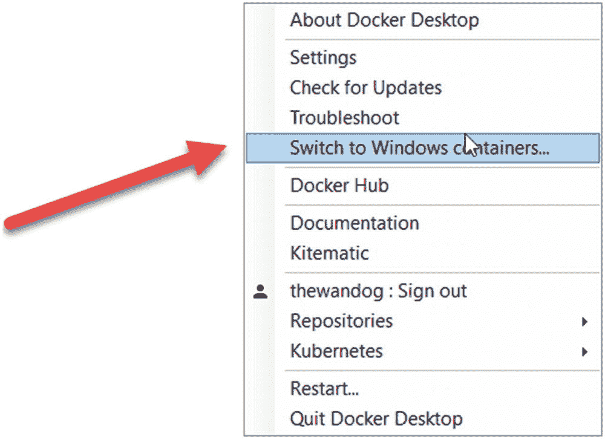
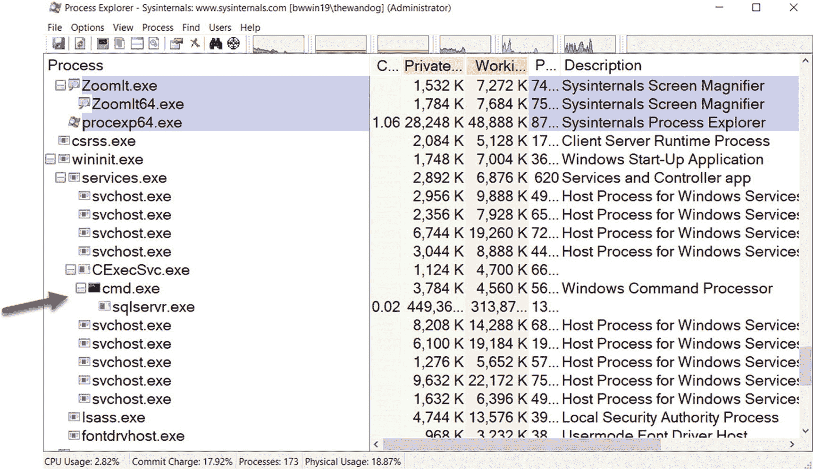

# 使用其他包

我已经告诉过您，SQL Server 容器镜像包含数据库引擎、SQL Server Agent，并包含复制和 DTC 等功能。Linux 上的 SQL Server 是基于包的概念构建的。像 Polybase 这样的功能不包含在标准的 SQL Server 包中，也不在 SQL Server 容器镜像中。

我们为您构建了一系列示例，指导您如何基于 SQL Server 镜像构建自己的自定义镜像，添加您希望在容器中包含的包。您可以在 [`https://github.com/microsoft/mssql-docker/tree/master/linux/preview/examples`](https://github.com/microsoft/mssql-docker/tree/master/linux/preview/examples) 找到这些示例。


### 版本与许可

默认情况下，如本章所示，当你拉取并运行 SQL Server 容器镜像时，我们自动使用的是 SQL Server **开发人员版**。如你所知，开发人员版不支持用于生产环境。

因此，在运行 SQL Server 容器时，你可以使用 `MSSQL_PID` 环境变量来指明 SQL Server 的版本。你可以在 [`https://docs.microsoft.com/en-us/sql/linux/sql-server-linux-configure-docker#production`](https://docs.microsoft.com/en-us/sql/linux/sql-server-linux-configure-docker%2523production) 阅读更多关于使用此选项的信息。

关于容器，我收到的最常见问题之一是容器如何获得许可。

随着 SQL Server 2017 的发布，我们更新了许可指南，其中包含了关于容器的讨论。你可以从 [`www.microsoft.com/en-us/sql-server/sql-server-2017-pricing`](https://www.microsoft.com/en-us/sql-server/sql-server-2017-pricing) 下载该指南。请特别查看 "`Licensing SQL Server 2017 in Containers`"（`在容器中许可 SQL Server 2017`）这一节（SQL Server 2019 发布时会有新的指南）。容器的许可方式与虚拟机类似。对于许多用户，完整的基于核心的许可模型适用。你应该阅读的一个有趣的例外情况是，拥有软件保障（SA）的企业版客户可获得一项福利。根据指南，“……在所有企业版核心许可证上增加软件保障（SA）覆盖（针对一个完全获得许可的服务器）后，客户的使用权限得以扩展，允许在许可的服务器上运行任意数量的容器。这项宝贵的 SA 福利使客户能够部署无限数量的容器来处理动态工作负载，并充分利用硬件计算能力。”

## SQL Server Windows 容器

到目前为止，本章中关于容器的所有讨论都是基于 Linux 镜像的 SQL Server 容器。你已经看到这些容器可以在任何平台上运行，包括 Linux、Windows 和 macOS。

然而，Windows 团队已经基于 Windows 镜像构建了在 Windows 中原生运行容器的能力。我们在 2019 年夏天宣布了一项私人预览计划，以支持基于 Windows 镜像的 SQL Server 容器。

本章中我讨论的许多相同概念几乎都适用于此。这部分归功于 SQL Server 在 Windows 和 Linux 上出色的兼容性。关键差异将体现在 Windows 和 Linux 有所不同的某些方面，例如 Active Directory 的配置。此外，当你想要直接与容器交互时，通常会使用 PowerShell 或命令行 shell。

Windows 支持与 Linux 相同的概念来使容器成为一个引人注目的方案，包括通过命名空间实现的隔离。你可以在 [`https://docs.microsoft.com/en-us/virtualization/windowscontainers/about/`](https://docs.microsoft.com/en-us/virtualization/windowscontainers/about/) 阅读更多关于 Windows 容器工作原理的信息。

Windows 在容器方面提供了一个与 Linux 略有不同的选项。容器可以以两种隔离模式运行：

`进程隔离` – 容器作为使用命名空间的隔离进程运行。

`Hyper-V 隔离` – 容器在一个“特殊”的虚拟机中运行（这是文档使用的术语，不是我的）。

你可以在 [`https://docs.microsoft.com/en-us/virtualization/windowscontainers/manage-containers/hyperv-container`](https://docs.microsoft.com/en-us/virtualization/windowscontainers/manage-containers/hyperv-container) 阅读更多关于这些隔离模型的信息。

在 Windows 版 Docker Desktop 上，你**只能**运行 Windows 容器或 Linux 容器中的一种。（注：当 Docker for WSL2 可用时，这应该会改变。你可以在 [`https://engineering.docker.com/2019/06/docker-hearts-wsl-2/`](https://engineering.docker.com/2019/06/docker-hearts-wsl-2/) 阅读更多相关信息。）

默认情况下，Docker Desktop 支持 Linux 容器。要切换到使用 Windows 容器，请从 Windows 系统托盘中的 Docker 图标选择该选项，如图 7-8 所示。



图 7-8

使用 Docker Desktop 切换到 Windows 容器

在最新版本的 Windows 10 和 Windows Server 2019 上，Windows 容器支持 Hyper-V 隔离和进程隔离。你可以在 [`https://docs.microsoft.com/en-us/virtualization/windowscontainers/quick-start/quick-start-windows-server`](https://docs.microsoft.com/en-us/virtualization/windowscontainers/quick-start/quick-start-windows-server) 阅读更多关于 Windows Server 2019 上 Windows 容器的信息。我也鼓励你阅读 Windows 容器的常见问题解答（FAQ）[`https://docs.microsoft.com/en-us/virtualization/windowscontainers/about/faq`](https://docs.microsoft.com/en-us/virtualization/windowscontainers/about/faq)。

此外，Windows Server 2019 支持 Windows 上的 Linux 容器（LCOW），它使用 Hyper-V 隔离来支持 Linux 容器。你可以在 [`https://docs.microsoft.com/en-us/virtualization/windowscontainers/deploy-containers/linux-containers`](https://docs.microsoft.com/en-us/virtualization/windowscontainers/deploy-containers/linux-containers) 阅读更多关于 LCOW 的信息。这使得 Windows Server 几乎成为唯一一个能同时运行 Windows 和 Linux 容器的平台（你可以在 macOS 上安装一个 Windows 虚拟机来运行 Windows 容器，但 Windows Server 是唯一“原生”支持这些场景的平台）。

我在 Windows Server 2019 系统上尝试了早期私人预览形式的 Windows 容器。

以下是用于 SQL Server Windows 容器的 Hyper-V 隔离和进程隔离的 `docker run` 命令示例语法：

```
docker run -e 'ACCEPT_EULA=Y' -e 'MSSQL_SA_PASSWORD=SafePassw0rd' -p 1401:1433 --isolation=process -d -e 'MSSQL_PID=Developer' --name sql1 private-repo.microsoft.com/mssql-private-preview/mssql-server:windows-ctp3.1
docker run -e 'ACCEPT_EULA=Y' -e 'MSSQL_SA_PASSWORD=SafePassw0rd' -p 1402:1433 --isolation=hyperv -d -e 'MSSQL_PID=Developer' --name sql2 private-repo.microsoft.com/mssql-private-preview/mssql-server:windows-ctp3.1
```

你可以看到语法与 Linux 容器几乎完全相同。注意 `--isolation` 参数的语法。

我使用著名的 Sysinternals 工具 Process Explorer（[`https://docs.microsoft.com/en-us/sysinternals/downloads/process-explorer`](https://docs.microsoft.com/en-us/sysinternals/downloads/process-explorer)）来查看进程隔离下 `sqlservr` 程序的样子。如图 7-9 所示，类似于 docker 守护进程，一个名为 `CExecSvc` 的程序负责派生（forking） `sqlservr` 容器程序。



图 7-9

进程隔离模式下的 SQL Server Windows 容器

关于 Hyper-V 隔离的文档不多，只知道容器程序托管在一个名为 `vmwp.exe` 的 Windows 程序中。

我希望当你读到这本书时，我们在 SQL Server Windows 容器方面的工作已经取得进展，因为我相信许多客户希望实现容器的承诺，但由于各种原因无法或不能使用基于 Linux 的容器。我个人认为，如果 LCOW 容器性能良好，那么许多客户最终可能会在他们的 Windows Server 上拥有 Windows 和 Linux 容器混合的环境。


## 总结

这是一个非常长的章节，需要耐心阅读和消化。我介绍了什么是容器，以及它为何能解决托管 SQL Server 等产品和开发应用程序所面临的现代挑战。容器具有可移植、轻量、一致和高效的特点。

我向你描述并展示了，容器本质上就是以隔离且独特方式运行的程序。你了解了 SQL Server 2019 为容器带来的新增强功能，包括 RHEL 镜像和新的 Microsoft 容器注册表。

如果你学习了本章的其他内容，你就有机会亲自尝试几个示例，包括部署容器、体验更新（及回滚）SQL Server 的全新高效方式，以及部署像 SQL Server 复制这样的多容器应用程序。

你了解了容器已经为生产环境做好了准备，无论你之前可能听到过什么说法，包括 SQL Server 容器的性能、安全性和可用性。

最后，你还对 SQL Server Windows 容器的未来面貌进行了一番预览。

希望你现在已经对 SQL Server 容器有了扎实的理解，并准备好学习一个专为部署和扩展容器而构建的平台——Kubernetes。

