# 8. Kubernetes 上的 SQL Server

如果说容器是新的虚拟机，那么 Kubernetes 就是新的服务器。在本章中，你将看到 Kubernetes 对于容器化应用程序的未来是一项重要技术，尤其是运行像 SQL Server 这样的企业级工作负载。

## 什么是 k8s？

如果你没有阅读第 7 章，那么至少请在阅读本章前回去浏览一下。为什么？因为 Kubernetes 或 k8s 的核心就是*托管容器*。实际上，k8s 远不止是托管。在本章的剩余部分，我将使用 k8s 作为 Kubernetes 的简称，因为这是流行的缩写（而且打字肯定更快）。k8s 代表 Kubernetes 这个词中 k 后的 8 个字母（我第一次看到这个术语时也自己研究过）。

与第 7 章不同，我不会深入探讨 k8s 的内部细节，因为那真的需要一整本书来描述。我将做的是向你介绍一些术语，穿插一些关于其内部工作原理的评论，并为你指出一些优秀的参考资料。

在本章介绍了 k8s 的基础知识后，我将讨论 k8s 如何解决容器部署中的重要挑战，它提供了一个具有内置高可用性（HA）的可扩展平台。我还将展示如何在 k8s 环境中更新所有 SQL Server 容器，其过程类似于我在第 7 章描述的更新单个容器的过程。我将向你介绍一个在 k8s 中部署 SQL Server 的有趣概念，称为 `Helm Charts`。最后，我将讨论 SQL Server 2019 与 k8s 在可用性方面的未来展望，以及我们如何计划将 Always On 可用性组与 k8s 集成。

### k8s 对象

无论你是否阅读了这些资源，让我在本章中从我的角度描述一些 k8s 的术语，并分享一些我在学习这个主题时发现的关于内部原理的有趣评论。阅读本章时，你需要了解的基本术语和对象包括：

**集群** – 将 k8s `Cluster` 视为一台服务器或计算机。这是运行在 k8s 上的所有软件的*主要宿主*。通常将托管所有对象的主机称为 k8s 集群。

**节点** – 将 `Node` 视为在集群上运行的虚拟机。节点将在集群内托管运行 *Pod*（其中包含容器）的主机。一个 k8s 集群上拥有多个节点是非常常见的。你可以在 [`https://kubernetes.io/docs/concepts/architecture/nodes/`](https://kubernetes.io/docs/concepts/architecture/nodes/) 阅读更多关于节点的信息。

**Pod** – `Pod` 是集群中节点上运行的容器的逻辑集合。Pod 将是部署、管理和故障转移集群中运行容器的单位。你可以在 [`https://kubernetes.io/docs/concepts/workloads/pods/pod-overview/`](https://kubernetes.io/docs/concepts/workloads/pods/pod-overview/) 阅读更多关于 Pod 的信息。

**服务** – Kubernetes 文档将 `Service` 描述为“定义一组逻辑 Pod 以及访问它们的策略的抽象”。对于 SQL Server 而言，服务将充当*负载均衡器*，并且是托管 SQL Server 的 Pod 的私有 IP 地址的抽象。它非常类似于 SQL Server 故障转移集群中的侦听器。k8s 提供了内置于 k8s 软件中的服务概念，像 SQL Server 这样的应用程序可以绑定到它们，这样无论 SQL Server Pod 在集群中的哪个位置托管，应用程序始终可以使用相同的 IP 地址和端口连接到该服务。你可以在 [`https://kubernetes.io/docs/concepts/services-networking/service/`](https://kubernetes.io/docs/concepts/services-networking/service/) 阅读更多关于 k8s 服务的信息。

**Secret** – `Secret` 是一种 k8s 对象，允许你存储敏感信息，例如密码。这对于 SQL Server 存储 `sa` 密码非常方便。你可以在 [`https://kubernetes.io/docs/concepts/configuration/secret/`](https://kubernetes.io/docs/concepts/configuration/secret/) 阅读更多关于 k8s Secrets 的信息。

**存储类** – `Storage Class` 是一种 k8s 对象，用于暴露存储，如磁盘系统。你可以在 [`https://kubernetes.io/docs/concepts/storage/storage-classes/`](https://kubernetes.io/docs/concepts/storage/storage-classes/) 阅读更多关于 k8s 存储类的信息。

**持久卷声明** – `Persistent Volume Claim` (PVC) 是对存储的请求，由映射到存储类的 `Persistent Volume` 提供支持。对我来说，这就像在磁盘驱动器上请求一个卷用于存储。对于 SQL Server 的情况，这将非常适用于数据库文件。

在本章剩余部分的使用示例中，我还会介绍并讨论其他术语。


## 关于 K8s 内部原理的评论

你可以利用本章前面提供的参考资料来真正深入探究其内部机制，但我必须指出，你应该理解 K8s 的一个核心方面就是 `API`。我非常欣赏能够通过查看应用程序编程接口 (API) 来理解事物运作方式的做法。K8s 的核心一切都基于一个 `API 服务器`。你可以阅读所有支撑 K8s 集群的组件，但 `API 服务器` 是一个接收请求并“执行操作”的软件。可以把 `API 服务器` 想象成 `SQL Server`。`SQL Server` 的 API 是 `T-SQL`，应用程序可以向 `SQL Server` 提交 `T-SQL` 命令，然后它就“执行操作”。K8s 的工作方式与此类似。你可以在 [`https://kubernetes.io/docs/concepts/overview/kubernetes-api/`](https://kubernetes.io/docs/concepts/overview/kubernetes-api/) 阅读更多关于 K8s API 的内容。`API 服务器` 是 K8s `控制平面` 的一部分，你可以在 [`https://en.wikipedia.org/wiki/Kubernetes#Kubernetes_control_plane_`](https://en.wikipedia.org/wiki/Kubernetes%2523Kubernetes_control_plane_) (主要部分) 阅读更多相关信息。在你使用 K8s 并随后开始学习第 10 章中的 `SQL Server 大数据群集` 时，请牢记 `控制平面` 和 `API 服务器` 的概念。

这意味着，如果你喜欢编写代码，可以使用 API 在 K8s 中部署和管理容器；或者，你也可以使用一个非常方便的命令行界面 (CLI) —— 叫做 `kubectl` (Buck Woody 总是把它读作“kubecuttle”)，它会替你与 K8s API 交互。你使用 `kubectl` 对 K8s API 进行编程的方式是采用声明式协议，使用 `YAML` 文件。你可以在 [`https://kubernetes.io/docs/reference/kubectl/overview/`](https://kubernetes.io/docs/reference/kubectl/overview/) 阅读更多关于 `kubectl` 程序的信息。使用这个“速查表”作为快速参考：[`https://kubernetes.io/docs/reference/kubectl/cheatsheet/`](https://kubernetes.io/docs/reference/kubectl/cheatsheet/)。

请在 [`https://kubernetes.io/docs/concepts/overview/components/`](https://kubernetes.io/docs/concepts/overview/components/) 查看构成 K8s 集群的各个组件。如果你想知道容器是如何在 K8s 集群中部署和管理的，`Docker` 是 K8s 安装并运行在集群每个节点中的一个组件。我认为 K8s 是一个用于部署、调度、管理、扩缩和支持容器应用程序的，既简单又复杂的系统，就像 `SQL Server` 一样。

由于 K8s 是开源的，因此可以通过多种不同的方式、平台和系统来部署集群。让我们来看看满足你需求或要求的各种 K8s 部署选项。

## K8s 部署选项

K8s 由 Google 在 2014 年左右创立（当时 Brendan 在那里工作），旨在为内部应用程序构建一个可扩展容器化应用程序的系统。2015 年，K8s 1.0 成为开源项目，至今仍是。（K8s 维基百科上有一个有趣的起源故事：[`https://en.wikipedia.org/wiki/Kubernetes#History`](https://en.wikipedia.org/wiki/Kubernetes%2523History)。）Kubernetes 源于希腊语，意为“飞行员”或“舵手”，对于引导容器世界之船的事物来说，这是一个贴切的名字。

自从 K8s 开源以来，几家公司基于 K8s 项目构建了商业化的 K8s 系统供客户使用。你可以在 K8s 文档站点查看合作伙伴列表：[`https://kubernetes.io/partners/#kcsp`](https://kubernetes.io/partners/%2523kcsp)。

在我撰写本书时，我所了解的 K8s 领域可以归结为以下几种部署选择：

`开源 K8s` – 我与一些考虑在 k8s 上使用 `SQL Server` 的客户交流过，他们表示将使用最新的 K8s 开源版本，在自己的数据中心或在云中的虚拟机中部署自己的 k8s。如果你选择这条路径，通常会使用一个名为 `kubeadm` ([`https://kubernetes.io/docs/setup/production-environment/tools/kubeadm/install-kubeadm/`](https://kubernetes.io/docs/setup/production-environment/tools/kubeadm/install-kubeadm/)) 的部署工具。另一个流行的选择是名为 `kubespray` ([`https://kubernetes.io/docs/setup/production-environment/tools/kubespray/`](https://kubernetes.io/docs/setup/production-environment/tools/kubespray/)) 的工具。如果你考虑在自己的数据中心部署 K8s，这确实能给你最大的控制权，但*你就得负全责*。换句话说，你必须承担维护和管理 K8s 集群以及运行其中的 `SQL Server` 的全部责任。

`Minikube` – 想要在你的笔记本电脑或虚拟机中快速轻松地运行一个单节点的 K8s 吗？`Minikube` 就是你的朋友；它适用于小型测试和开发目的，你可以快速启动并运行。你可以在 [`https://kubernetes.io/docs/setup/learning-environment/minikube/`](https://kubernetes.io/docs/setup/learning-environment/minikube/) 阅读如何设置 `Minikube`。


### Kubernetes 部署选项

**提示**

Docker Desktop 可以自动为您部署 Minikube。请参阅示例：[`https://docs.docker.com/docker-for-windows/#kubernetes`](https://docs.docker.com/docker-for-windows/%2523kubernetes)。

### Azure Kubernetes 服务 (AKS)

如果您想要一个*托管的 `k8s` 集群*体验，那么可以考虑像 Azure Kubernetes 服务 (AKS) 这样的云服务。Brendan 领导着构建和运行此服务的团队，因此我非常确信在使用 AKS 时，我能获得 `k8s` 的最新创新以及云的强大功能。本章中的示例将使用 AKS，但它们与任何 `k8s` 发行版都兼容。由于 AKS 是一项云服务，它们可以以云的速度进行创新（抱歉，我忍不住这么说）。例如，AKS 可以同时支持 Linux 和 Windows 容器（请参阅 [`https://azure.microsoft.com/en-us/blog/announcing-the-preview-of-windows-server-containers-support-in-azure-kubernetes-service/`](https://azure.microsoft.com/en-us/blog/announcing-the-preview-of-windows-server-containers-support-in-azure-kubernetes-service/)）。并且 AKS 支持虚拟节点的概念（ [`https://docs.microsoft.com/en-us/azure/aks/virtual-nodes-cli`](https://docs.microsoft.com/en-us/azure/aks/virtual-nodes-cli)）。请访问 [`https://azure.microsoft.com/en-us/services/kubernetes-service`](https://azure.microsoft.com/en-us/services/kubernetes-service) 深入了解 AKS。

### Azure Stack

Azure Stack 是一个设备系统，在客户的自身数据中心中提供 Azure 服务。`k8s` 是 Azure Stack 的一个部署选项，您可以在 [`https://docs.microsoft.com/en-us/azure-stack/user/azure-stack-solution-template-kubernetes-deploy`](https://docs.microsoft.com/en-us/azure-stack/user/azure-stack-solution-template-kubernetes-deploy) 阅读相关信息。您可以将 Azure Stack 上的 `k8s` 视为等同于在您数据中心运行的 AKS。随着 AKS 的发展，Azure Stack 上的 `k8s` 也会随之发展。

### Red Hat OpenShift

OpenShift 在行业中已成为一个非常受欢迎的平台。OpenShift 是一个 `k8s` 平台，可以在您的数据中心或公共云中运行，您可以在 [`www.openshift.com/`](https://www.openshift.com/) 阅读更多信息。虽然 OpenShift 与开源 `k8s` 兼容性很高，但在系统和平台的使用上存在差异。您可能不会相信，但我在 2019 年 5 月的 Red Hat 峰会上领导了一支微软工程师团队，负责指导一个关于在 OpenShift 上运行 SQL Server 2019 的实验。请自行查看：[`https://github.com/Microsoft/sqlworkshops/tree/master/SQLonOpenShift`](https://github.com/Microsoft/sqlworkshops/tree/master/SQLonOpenShift)。本章中的几个示例在那个 GitHub 站点上都有对应的 OpenShift 版本，供您在 OpenShift 环境中使用。微软提供了一个托管的 OpenShift 平台（类似于 AKS），称为 Azure Red Hat OpenShift。您可以在 [`https://docs.microsoft.com/en-us/azure/virtual-machines/linux/openshift-get-started#azure-red-hat-openshift`](https://docs.microsoft.com/en-us/azure/virtual-machines/linux/openshift-get-started%2523azure-red-hat-openshift) 阅读有关此服务的更多信息。

### Windows Server

这个平台是怎么进入本章的呢？到目前为止，我所描述的关于 `k8s` 的一切都基于 Linux。`k8s` 起源于 Linux，所以这很有道理。不过，为了给您更多灵活性，我们希望 Windows Server 能成为 `k8s` 世界的一部分，因此现在可以使用 Windows Server 来托管 `k8s` 集群。集群中的所有内容不会是“纯” Windows，但支持基于 Windows 容器的节点。您可以在 [`https://docs.microsoft.com/en-us/virtualization/windowscontainers/kubernetes/getting-started-kubernetes-windows`](https://docs.microsoft.com/en-us/virtualization/windowscontainers/kubernetes/getting-started-kubernetes-windows) 阅读更多关于 Kubernetes 与 Windows 的信息。

### 其他 `k8s` 云提供商

Azure 并不是唯一的云 `k8s` 提供商。亚马逊有 Elastic Kubernetes 服务 (EKS)，谷歌有 Google Kubernetes 引擎 (GKE)，还有其他一些。

### 其他 `k8s` 提供商

市场上还有其他 `k8s` 提供商。SUSE 有几个 `k8s` 解决方案，您可以在 [`www.suse.com/solutions/kubernetes/`](https://www.suse.com/solutions/kubernetes/) 阅读相关信息。我看到客户经常谈论的一个较受欢迎的方案是 Rancher ( [`https://rancher.com/`](https://rancher.com/) )。我相信您可能也听说过客户想使用的其他方案。我未来将特别关注的另一个 `k8s` 提供商是 VMWare PKS ( [`https://cloud.vmware.com/vmware-enterprise-pks`](https://cloud.vmware.com/vmware-enterprise-pks) )。

最终，您对 `k8s` 的选择取决于您是想在数据中心还是在公共云中部署 `k8s`。您的其他决策应基于您将获得何种支持、`k8s` 集群是托管的还是需要您管理一切，以及该 `k8s` 发行版是否能够持续存在并在未来保持相关性。SQL Server 几乎可以在所有 `k8s` 平台和提供商上运行。作为微软的员工，我很有兴趣观察 AKS 和 Windows Server 上 `k8s` 的普及程度。根据我与 Linux 的经验，OpenShift 是一股主要力量，也是许多客户正在使用或评估的 `k8s` 平台。

是时候通过示例来学习了，让我们来看看使用 `k8s` 和 SQL Server 2019 进行部署、高可用性和更新的示例所需的先决条件。


## 示例的先决条件

本章中的所有示例都依赖于跨平台 CLI 工具 `kubectl`。您应该能够将任何使用 `kubectl` 的 k8s 发行版与本章中的示例配合使用。

我使用 Azure Kubernetes Service (`AKS`) 来部署我的 k8s 集群以运行所有示例。因此，当您将我的示例用于您的 k8s 发行版时，可能会存在两个差异：

*   `存储类` – 我的示例使用了 Azure 磁盘的存储类。您需要将其替换为特定于您平台的存储类。
*   `负载均衡器` – 我的示例为服务使用了负载均衡器类型，但这仅在 k8s 云提供商中实现。如果您不是为 k8s 使用云提供商，您将需要使用一种名为 `NodePort` 的服务类型。您可以在 [`https://kubernetes.io/docs/concepts/services-networking/#nodeport`](https://kubernetes.io/docs/concepts/services-networking/%2523nodeport) 阅读更多关于 `NodePort` 的信息。

除此之外，本章中的这些示例应该能在您配置的任何 k8s 平台上运行。

如果您使用 `AKS`，我根据文档 [`https://docs.microsoft.com/en-us/azure/aks/kubernetes-walkthrough`](https://docs.microsoft.com/en-us/azure/aks/kubernetes-walkthrough) 中的步骤创建了我的 `AKS` 集群。

**`createaksrg.sh`**
```
az group create --name bwaks --location eastus2
```

**`createaks.sh`**
```
az aks create \
--resource-group bwaks \
--name bwsqlaks \
--node-count 2 \
--enable-addons monitoring \
--generate-ssh-keys
```

**`connectoaks.sh`**
```
az aks get-credentials --resource-group bwaks --name bwsqlaks
```

您可以在 `ch8_sql_on_k8s` 目录中看到我用于创建资源组、创建集群和连接到集群的脚本及命令。尽管这些是 Bash shell 脚本，但您可以在支持 Azure CLI 的地方运行这些命令。我喜欢使用 Azure Cloud Shell（我将在这些示例中展示），因为其中内置了 Azure CLI。如果您想使用某个平台，您需要在 [`https://docs.microsoft.com/en-us/cli/azure/install-azure-cli?view=azure-cli-latest`](https://docs.microsoft.com/en-us/cli/azure/install-azure-cli%253Fview%253Dazure-cli-latest) 安装 Azure CLI。

我还建议您安装 Kubernetes Visual Studio Code 扩展，以协助使用 k8s 集群和对象。我本想将其安装在 Azure Data Studio 上。为此，您需要下载以下扩展：
*   [`https://marketplace.visualstudio.com/items?itemName=redhat.vscode-yaml`](https://marketplace.visualstudio.com/items%253FitemName%253Dredhat.vscode-yaml)
*   [`https://marketplace.visualstudio.com/items?itemName=ms-kubernetes-tools.vscode-kubernetes-tools`](https://marketplace.visualstudio.com/items%253FitemName%253Dms-kubernetes-tools.vscode-kubernetes-tools)

要使用此扩展，您还需要从 [`https://kubernetes.io/docs/tasks/tools/install-kubectl/`](https://kubernetes.io/docs/tasks/tools/install-kubectl/) 安装 `kubectl`。

要了解有关如何使用 Azure Data Studio 安装扩展的更多信息，请参阅文档 [`https://docs.microsoft.com/en-us/sql/azure-data-studio/extensions`](https://docs.microsoft.com/en-us/sql/azure-data-studio/extensions)。

正如我所说，对我来说，我喜欢在 Azure Cloud Shell 中使用这些示例。Azure Cloud Shell 同时支持 PowerShell 和 bash，并包含许多内置工具，如 Azure CLI、`kubectl`，甚至 `sqlcmd`。您可以在 [`https://azure.microsoft.com/en-us/features/cloud-shell`](https://azure.microsoft.com/en-us/features/cloud-shell) 阅读更多关于 Azure Cloud Shell 的信息。

无论您使用什么客户端或 k8s 发行版，只要您能运行 `kubectl`，您就可以使用这些示例。

## 在 k8s 上部署 SQL Server

对于本节中的示例，让我向您展示如何部署一个包含单个 SQL Server 容器的 pod。

您将需要一个用于 `sa` 密码的 secret，用于数据库的存储，以及一个用于连接到 SQL Server 的负载均衡器。所有这些都将通过一系列 `kubectl` 命令和声明式的 `YAML` 文件来完成。

此外，我建议您使用 k8s 中的命名空间概念来创建自己的 pod。命名空间为您在 k8s 集群中创建的对象（例如 pod）提供了一个作用域，使其与其他对象分离。命名空间提供了一个非常好的机制来组织和管理您的 k8s 对象。

让我们一步一步地完成在 pod 中部署和连接到 SQL Server 容器的过程。这些步骤假设您有一个现有的 k8s 集群。我按照先决条件中描述的那样，使用 `AKS` 创建了一个双节点集群，但即使是单节点集群也可以工作。

当我进行这些示例时，我使用了 Azure Cloud Shell，它可以从任何浏览器运行，如图 8-1 所示。

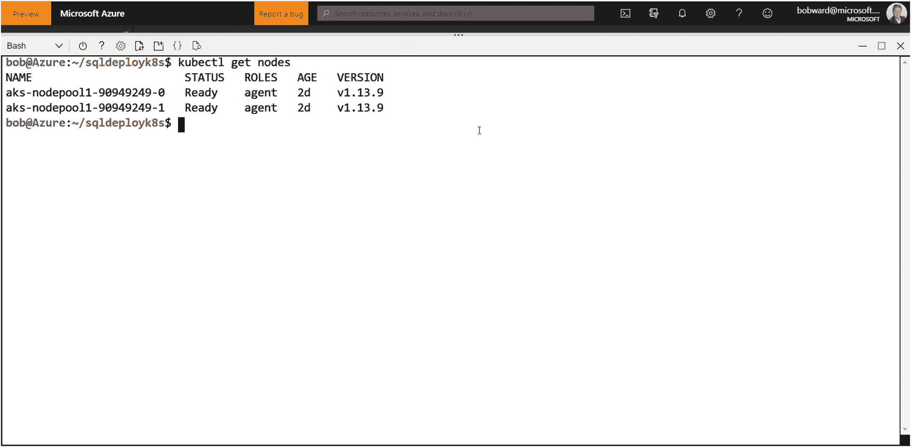
*图 8-1 使用 Azure Cloud Shell 运行 Kubernetes*

我喜欢 Azure Cloud Shell。有一次，我在飞回德克萨斯州的航班上，笔记本电脑的电池没电了。我需要为正在构建的演示做一些与 `AKS` 相关的工作。我的 iPhone 还有电，而且我听说过 Azure 应用（[`https://apps.apple.com/us/app/microsoft-azure/id1219013620`](https://apps.apple.com/us/app/microsoft-azure/id1219013620)）。我安装了该应用，使用我的订阅登录，并浏览了我的 Azure 资源。然后我注意到该应用有一个云 Shell 选项。我选择了它，现在我又能继续工作了。图 8-2 展示了我从手机使用 Azure Cloud Shell 的示例。

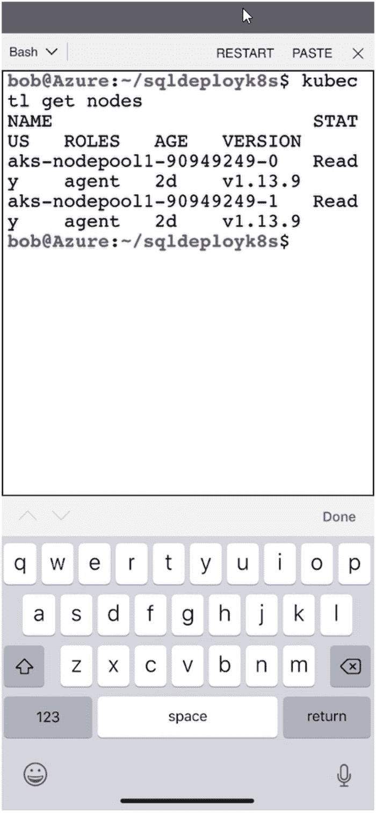
*图 8-2 移动的 k8s 用户*

我记得当时坐在一位正在手机上玩 Candy Crush 的乘客旁边。他看到我做的事，问道：“你在玩什么游戏？”我的回答是：“我正在用 Cloud Shell 部署一个 Kubernetes 集群。”他回去玩他的游戏了，毫无疑问在想这个怪人玩的是什么“Kubernetes 游戏”。

部署的示例脚本可以在 `ch8_sql_on_k8s\deploy` 目录中找到。确保使用 `chmod u+x <script>` 为 shell 脚本设置执行权限。另外，如果您想在 Azure Cloud Shell 中运行这些脚本，请阅读以下关于上传这些示例脚本的文档（[`https://docs.microsoft.com/en-us/azure/cloud-shell/persisting-shell-storage#transfer-local-files-to-cloud-shell`](https://docs.microsoft.com/en-us/azure/cloud-shell/persisting-shell-storage%2523transfer-local-files-to-cloud-shell)）。请记住，Azure Cloud Shell 的最大优势在于它只需要一个浏览器，并且所有工具如 `kubectl`、`az` 和 `sqlcmd` 都已预先安装。

开始在 `AKS` 中部署 SQL Server 的示例：

1.  使用以下命令或脚本 `step1_create_namespace.sh` 创建一个命名空间：
    ```
    kubectl create namespace mssql
    ```
    您应该会收到这条指示命名空间已创建的消息：
    ```
    namespace/mssql created
    ```
    您也可以通过运行此命令来验证命名空间是否已创建：
    ```
    kubectl get namespaces
    ```
    在我的集群上，我得到了以下结果。其他命名空间是 k8s 集群自带的。
    ```
    NAME          STATUS   AGE
    default       Active   2d10h
    kube-public   Active   2d10h
    kube-system   Active   2d10h
    mssql         Active   56s
    ```


2. 我希望我所有的对象都在新的 `mssql` 命名空间中创建。在创建对象时，我可以显式地使用命名空间，也可以使用以下命令（或使用脚本 **step2_setcontext.sh**）设置新命名空间的默认上下文。请替换你的集群和用户名。你可以使用命令 `kubectl config view` 来找到这些信息。

```
kubectl config set-context mssql --namespace=mssql --cluster=bwsqlaks --user=clusterUser_bwaks_bwsqlaks
kubectl config use-context mssql
```

如果此命令成功，你应该会看到如下输出：

```
Context "mssql" created.
Switched to context "mssql".
```

要验证你的上下文是否正确或随时查看它，请运行以下命令：

```
kubectl config current-context
```

3. 现在，让我们创建用于 SQL Server Pod 的负载均衡器服务。关于负载均衡器和 Azure 这样的云服务，我要提醒你注意。Azure 实际上是为你提供一个不会改变的公共 IP 端点，因此你可以将其绑定到 Pod 的私有 IP 地址，无论该地址如何变化。我遇到过负载均衡器服务需要一些时间才能创建的情况。因此，我建议一旦创建它们，就不要删除，除非你正在进行本章演示中的测试。

运行以下命令或脚本 **step3_create_service.sh** 来创建负载均衡器：

```
kubectl apply -f sqlloadbalancer.yaml --record
```

这是一个使用 YAML 文件以声明方式访问 k8s API 服务器的示例。使用 `kubectl apply` 你实际是在向 API 服务器发送 API 命令，就像你直接使用 API 编写代码一样（是的，你现在是一名 k8s 程序员了）。

让我们查看 **sqlloadbalancer.yaml** 文件来理解这种格式的示例：

```
apiVersion: v1
kind: Service
metadata:
  name: mssql-service
spec:
  selector:
    app: mssql
  ports:
    - protocol: TCP
      port: 31433
      targetPort: 1433
  type: LoadBalancer
```

协议使用标签和值语法。你可以使用的一个参考资源是 [`https://kubernetes.io/docs/concepts/overview/working-with-objects/kubernetes-objects/`](https://kubernetes.io/docs/concepts/overview/working-with-objects/kubernetes-objects/) ，用于确定各种 k8s 对象的确切标签和值集。就我个人而言，我会查看示例，复制它们，然后根据我自己的场景进行修改。

让我们使用这个 YAML 文件来解释一些值。

```
apiVersion: v1
```

每个 YAML 文件都需要这个 `apiVersion` 字段。这告诉 API 服务器你在使用哪个“版本”的 API 来进行各种 k8s 操作。你通常应该坚持使用 `v1`，但一些新的 k8s 概念可能需要“beta”或其他版本。在 [`https://kubernetes.io/docs/reference/using-api/api-overview/#api-versioning`](https://kubernetes.io/docs/reference/using-api/api-overview/%23api-versioning) 阅读更多关于 API 版本控制的信息。

```
kind: Service
```

这告诉 API 服务器你正在与哪种对象进行交互。在这种情况下，它是一个 `Service` 对象，它将帮助我们部署一个负载均衡器。你可以在 [`https://kubernetes.io/docs/concepts/services-networking/service/`](https://kubernetes.io/docs/concepts/services-networking/service/) 阅读更多关于 k8s `Service` 的信息。

```
metadata:
  name: mssql-service
```

这是服务的名称。你将使用它来管理对象，并将其绑定到另一个对象（如 Pod）。

```
spec:
  selector:
    app: mssql
  ports:
    - protocol: TCP
      port: 31433
      targetPort: 1433
  type: LoadBalancer
```

`spec` 标签允许你定义有关 `Service` 对象的更多详细信息。`selector` 允许你使用“标签”来分组和标识对象。在这种情况下，使用 **app:mssql** 标签将允许你基于标签在 k8s 中管理和查看对象。我将在本练习中展示一个使用此标签的示例。`app: mssql` 标签对于 `LoadBalancer` 也很关键，因为它将 `LoadBalancer` 绑定到任何使用相同标签的 Pod（这将是我们的 SQL Server Pod）。

`ports` 部分允许你将外部查看的端口映射到 Pod 内部的端口。这对于 SQL Server 来说是合理的，因为就像你在第 7 章关于容器中学到的，在主机级别不能有多个 SQL Server 监听端口 1433。在这个示例中，当应用程序想要连接到 SQL Server 时，它们将使用 `Service` 的 IP 地址和端口 31433。我稍后会在示例中向你展示一个连接到 SQL Server `Service` 的巧妙技巧。

`type` 是服务的类型，在这种情况下，是由云提供商实现的 `LoadBalancer` 服务。可以在 [`https://kubernetes.io/docs/concepts/services-networking/service/#publishing-services-service-types`](https://kubernetes.io/docs/concepts/services-networking/service/%23publishing-services-service-types) 找到各种服务类型。

当你使用 `apply` 选项和 YAML 文件执行 `kubectl` 时，执行通常是*异步*的。这意味着 `kubectl` 命令将立即返回，但 YAML 文件中声明的操作由 API 服务器在后台调度。

在这种情况下，当你为此服务执行 `kubectl apply` 命令时，你的结果应该如下所示：

```
service/mssql-service created
```

这个结果实际上意味着服务创建已被*调度*。如何知道服务是否已准备好使用？有几种方法。首先，你可以运行以下命令：

```
kubectl get service
```

你的结果可能如下所示：

```
NAME            TYPE           CLUSTER-IP      EXTERNAL-IP   PORT(S)           AGE
mssql-service   LoadBalancer   10.0.150.233    <pending>     31433:32010/TCP   61s
```

`CLUSTER-IP` 是 k8s 集群内的私有 IP 地址。`EXTERNAL-IP` 将是你可以用于连接 SQL Server 的静态公共 IP。注意 `PORT` 的值是 `31433:32010`。尽管 SQL Server 在容器中监听端口 1433，但端口 32010 映射到集群内的端口 1433。端口 31433 映射到 32010，允许你通过连接 `<EXTERNAL-IP>,<31433>` 来连接 SQL Server，无论 SQL Server 的 Pod 位于 k8s 集群内的哪个位置。

注意，在你运行此 `kubectl apply` 命令后立即查看时，`EXTERNAL-IP` 的值是 `<pending>`。在该值变为有效的 IP 地址之前，你将无法使用 `LoadBalancer`；这可能需要几分钟才能完成。

4. 既然 `LoadBalancer` 已被调度创建，让我们创建一个 `secret` 来保存 SQL Server 的 `sa` 密码。使用以下命令或脚本 **step4_create_secret.sh**：

```
kubectl create secret generic mssql-secret --from-literal=SA_PASSWORD="Sql2019isfast"
```

当此命令完成时，你应该会看到以下结果，并且 `secret` 应该立即创建：

```
secret/mssql-secret created
```


## 注意

在第 7 章中，我提到了 SQL Server 容器对 Active Directory 认证的支持即将到来，适用于 SQL Server 2019。一旦此功能最终确定，我们应该也能够在 k8s 中为 SQL Server 支持 AD 认证。

### 步骤 1
下一步是使用`PersistentVolumeClaim`（PVC）的概念为 SQL Server 数据库创建存储。PVC 类似于在核心磁盘系统之上定义的卷，我们可以将其映射到 SQL Server Pod 的数据库目录。

使用以下命令创建用于 SQL Server Pod 的 PVC，或运行脚本`step5_create_storage.sh`：
```bash
kubectl apply -f storage.yaml
```

您应该会很快看到此消息返回，并且 PVC 将在后台创建：
```
persistentvolumeclaim/mssql-data created
```

在创建的同时（这可能很快），让我们查看`storage.yaml`文件以了解幕后发生的事情：
```yaml
apiVersion: v1
kind: PersistentVolumeClaim
metadata:
  name: mssql-data
  annotations:
    volume.beta.kubernetes.io/storage-class: azure-disk
spec:
  accessModes:
    - ReadWriteOnce
  resources:
    requests:
      storage: 8Gi
```

元数据很有趣，因为注释标签将 PVC 绑定到一个名为存储类的磁盘。我怎么知道要使用`azure-disk`？这是因为当您创建 AKS 集群时，您会自动获得一个基于高级存储的 Azure 磁盘，其存储类名为`azure-disk`。您可以创建其他的，但这是 AKS 创建的标准存储类。您可以在 [`https://docs.microsoft.com/zh-cn/azure/aks/concepts-storage`](https://docs.microsoft.com/zh-cn/azure/aks/concepts-storage) 阅读更多关于 AKS 存储的信息。如果您不使用 k8s，您可能已经创建了存储类，或者可以咨询您的 k8s 管理员，或者使用以下命令找出可用的存储类：
```bash
kubectl get StorageClass
```

通过运行以下命令，您可以找到有关`azure-disk`的更多详细信息：
```bash
kubectl describe StorageClass azure-disk
```

`storage.yaml`的`spec`部分描述了 PVC 允许的访问方式以及卷的大小。`AccessModes`为`ReadWriteOnce`意味着卷是读/写的，并且一次只允许一个 Pod/节点访问该卷。这并不意味着 Pod 不能移动到另一个节点并访问卷（正如您将在本章后面学到的，这将是高可用性（HA）的基本概念）。它只是意味着两个 Pod 或两个节点不能同时访问该卷。这对于 SQL Server 数据库来说是合理的。`8Gi`表示卷的大小为 8GB。

您可以通过运行以下命令查看 PVC 是否成功创建：
```bash
kubectl describe PersistentVolumeClaims mssql-data
```

在输出的底部，成功的 PVC 创建看起来像这样：
```
Type    Reason                 Age    From                         Message
----    ------                 ----   ----                         -------
Normal  ProvisioningSucceeded  9m16s  persistentvolume-controller  Successfully provisioned volume pvc-b8c9225e-c038-11e9-b5fa-c6f80bad26d8 using kubernetes.io/azure-disk
```

我见过一些场景，可能会有一些临时的超时或错误，但最终 PVC 会被创建。

### 步骤 2
现在您有了负载均衡器服务、sa 密码的秘钥和存储。是时候将这些整合在一起，创建一个包含单个 SQL Server 容器的 Pod 了。运行以下命令或脚本`step6_deploy_sql2019.sh`（`--record`选项提供了来自部署幕后更多的细节）：
```bash
kubectl apply -f sql2019deployment.yaml --record
```

您应该会看到这些结果，表明已调度了一个`deployment`：
```
deployment.apps/mssql-deployment created
```

`deployment`将允许我们使用`ReplicaSet`的概念为 SQL Server Pod 创建 Pod。当我向您展示 k8s 的内置 HA 功能时，我会稍后定义`ReplicaSet`。

要查看部署的状态以及与 Pod 相关的对象，请运行以下命令：
```bash
kubectl get all
```

这将显示当前上下文（命名空间 mssql）中的所有对象，包括 Pod、LoadBalancer 和部署的状态。

如果您立即运行此命令，可能会看到类似以下的结果：
```
NAME                                   READY  STATUS             RESTARTS  AGE
pod/mssql-deployment-7bb4c5f5d7-rpw45  0/1    ContainerCreating  0         4s
NAME                    TYPE           CLUSTER-IP     EXTERNAL-IP     PORT(S)           AGE
service/mssql-service   LoadBalancer   10.0.150.233   13.77.103.119   31433:32010/TCP   55m
NAME                              READY  UP-TO-DATE  AVAILABLE  AGE
deployment.apps/mssql-deployment  0/1    1           0          4s
NAME                                         DESIRED  CURRENT  READY  AGE
replicaset.apps/mssql-deployment-7bb4c5f5d7  1        1        0      4s
```

第一行是 Pod 创建的`STATUS`。`STATUS`为`ContainerCreating`意味着为 Pod 定义的容器正在创建过程中。如果这是您第一次使用 SQL Server 容器镜像创建 Pod，可能需要更长时间，因为容器镜像必须被拉取到 k8s 的本地 docker 注册表中。

部署`STATUS`指示整体部署何时成功。LoadBalancer 的`STATUS`独立于部署。这意味着您需要等待 Pod 状态变为`Running`，LoadBalancer 具有有效的`EXTERNAL-IP`地址，并且部署的`AVAILABLE = 1`，然后才能开始连接到 SQL Server。`Replica`的状态应与 Pod 或部署的状态匹配。

在 Pod 仍在创建时，让我们看看各个部分中的`sql2019deployment.yaml`文件。
```yaml
kind: Deployment
metadata:
  name: mssql-deployment
```

此部分告诉 API 服务器我们正在创建一个 Pod 的部署及其名称。

YAML 的其余部分是部署的规范，让我们来分解一下。
```yaml
replicas: 1
selector:
  matchLabels:
    app: mssql
strategy:
  type: Recreate
```

这定义了 Pod 的副本数（一个），并在需要任何更新时重新创建 Pod。我将在本章后面解释这些术语的重要性。`matchLabels`用于将部署的标签与 Pod 标签（两者都是`mssql`）关联起来。

下一个主要部分称为`template`，它定义了 Pod 容器的更多细节以及用于存储的卷。

您可以在`template`部分看到我们使用了另一个`app`标签为`mssql`，因此我们可以使用标签来管理、查看或控制与部署相关的对象。

接下来是 Pod 的规范，其中包含有关要在 Pod 中部署的容器的详细信息。
```yaml
spec:
  terminationGracePeriodSeconds: 10
  containers:
  - name: mssql
    image: mcr.microsoft.com/mssql/rhel/server:2019-latest
    env:
    - name: MSSQL_PID
      value: "Developer"
    - name: ACCEPT_EULA
      value: "Y"
    - name: MSSQL_SA_PASSWORD
      valueFrom:
        secretKeyRef:
          name: mssql-secret
          key: SA_PASSWORD
    volumeMounts:
    - name: mssqldb
      mountPath: /var/opt/mssql
```

在`spec`中，您可以看到一些熟悉的东西，如果您使用过容器。您看到容器将基于的镜像以及提供给 SQL Server 容器的环境变量。请注意`sa`密码是如何映射到您已经创建的秘钥的。

`terminationGracePeriodSeconds`的值定义了 k8s 在容器需要终止时允许其自行关闭的时间。SQL Server 可能需要或多或少的时间，但我在我们的示例中选择了 10 秒。无论是否正常关闭，SQL Server 都具有一致性弹性。

`volumeMount`条目是一个名为`mssqldb`的名称，它映射到存储所有 SQL Server 数据库的目录。`mssqldb`在此`spec`下方作为部署的一部分定义：
```yaml
volumes:
- name: mssqldb
  persistentVolumeClaim:
    claimName: mssql-data
```

这里是与所创建 PVC 的映射。现在，当 SQL Server 容器在 Pod 中启动时，默认情况下所有系统和用户数据库都将存在于具有 PVC 的持久存储中。当您在本章的其他部分了解 HA 和更新时，您将看到这如何变得重要。

您可以再次运行`kubectl get all`，查看 SQL Server 的所有组件是否已就绪。

您还可以使用其他一些有趣的`kubectl`命令来检查 Pod 和 SQL Server 的状态。要查看选项的完整列表，您可以运行命令`kubectl help`，或者查看`[`https://kubernetes.io/docs/reference/kubectl/overview`](https://kubernetes.io/zh-cn/docs/reference/kubectl/overview)`处的`kubectl`参考文档。

### 步骤 3
运行以下命令以查看 Pod（以及 Pod 中的容器）的日志，这恰好是 SQL Server 的`ERRORLOG`。您也可以使用脚本`step7_getlogs.sh`：
```bash
kubectl logs -l app=mssql --tail=100000
```

通常，`kubectl logs`命令需要 Pod 名称，但您可以使用`mssql`标签，而不必查找 Pod 的名称。

您的结果应该是 SQL Server `ERRORLOG`的转储。

### 步骤 4
您还可以通过运行以下命令或脚本`step8_getevents.sh`，查看到目前为止在此命名空间中完成的与操作相关的事件的详细视图：
```bash
kubectl get events
```

您的输出应显示此命名空间中发生的事件的时间线。如果一切顺利，它应该类似于以下内容：
```
LAST SEEN   TYPE     REASON                   KIND                     MESSAGE
29m         Normal   ProvisioningSucceeded    PersistentVolumeClaim   Successfully provisioned volume pvc-c18b530f-c040-11e9-b5fa-c6f80bad26d8 using kubernetes.io/azure-disk
25m         Normal   Scheduled                Pod                      Successfully assigned mssql/mssql-deployment-7b6565d684-8r7cc to aks-nodepool1-90949249-0
25m         Normal   SuccessfulAttachVolume   Pod                      AttachVolume.Attach succeeded for volume "pvc-c18b530f-c040-11e9-b5fa-c6f80bad26d8"
24m         Normal   Pulled                   Pod                      Container image "mcr.microsoft.com/mssql/rhel/server:2019-latest" already present on machine
24m         Normal   Created                  Pod                      Created container
24m         Normal   Started                  Pod                      Started container
25m         Normal   SuccessfulCreate         ReplicaSet               Created pod: mssql-deployment-7b6565d684-8r7cc
25m         Normal   ScalingReplicaSet        Deployment               Scaled up replica set mssql-deployment-7b6565d684 to 1
30m         Normal   EnsuringLoadBalancer     Service                  Ensuring load balancer
29m         Normal   EnsuredLoadBalancer      Service                  Ensured load balancer
```

### 步骤 5
您还可以使用以下命令或脚本`step9_describe_deployment.sh`获取有关部署的更多详细信息：
```bash
kubectl describe deployment mssql-deployment
```

您将获得有关部署的所有类型详细信息，包括专门与部署相关的最新事件。

### 步骤 6
您还可以使用以下命令或脚本`step10_describe_pod.sh`获取有关已部署 Pod 的更多详细信息：
```bash
kubectl describe pod -l app=mssql
```

这就是使用`mssql`标签再次发挥作用的地方。您将获得有关 Pod、Pod 内的容器以及与 Pod 相关的事件的更多详细信息，而您只需记住`mssql`标签。

此命令与`kubectl get events`一起，对于 Pod 部署的故障排除目的非常有用。

### 步骤 7
现在（终于）是时候连接到在 Pod 容器中运行的 SQL Server 了。这是我从 Anthony Nocentino（Linux、容器和 k8s 方面的知名专家，也是我《Pro SQL Server on Linux》的技术审稿人）那里学到的一个技巧。运行以下命令或脚本`step11_testsql.sh`以通过 LoadBalancer 连接到 SQL Server：
```bash
SERVERIP=$(kubectl get service | grep mssql-service | awk {'print $4'})
PORT=31433
sqlcmd -Usa -PSql2019isfast -S$SERVERIP,$PORT -Q"SELECT @@version"
```

您的结果应显示已安装的 SQL Server 版本。如果您仔细查看此命令，它会动态提取 LoadBalancer 的`EXTERNAL-IP`并解析出 IP 地址以用作连接字符串的一部分。您还可以更进一步，从`kubectl get service`的输出中添加用于解析端口的逻辑。

这比仅仅让您运行每个步骤要详细得多，因为我想向您描述幕后发生的事情，并让您了解更多关于 YAML 如何作为 k8s 的编程接口 API 工作的知识。

### 关于 Kubernetes 的使用技巧

在进入下一节之前，既然你已经部署了一个 SQL Server Pod，让我向你展示一些结合 Kubernetes 使用其他资源的技巧。

#### Kubernetes 扩展组件

我在本章前面名为“示例先决条件”的一节中讨论了适用于 Visual Studio Code 的 Kubernetes 扩展组件，并演示了如何为 Azure Data Studio (ADS) 安装该组件。

让我向你展示一些在已部署的 SQL Server Pod 上使用此扩展组件的示例。

首先，使用 k8s 扩展组件及其对 YAML 的依赖关系时，它会为 YAML 文件的使用提供提示。使用 ADS 的资源管理器功能在示例的 `ch8_sql_on_k8s\deploy` 目录中找到 `sql2019deployment.yaml` 文件。

将鼠标悬停在任何 YAML 语法上，即可获取文件中各种语句的提示。例如，图 8-3 显示了关于 `terminationGracePeriodSeconds` 声明的提示。

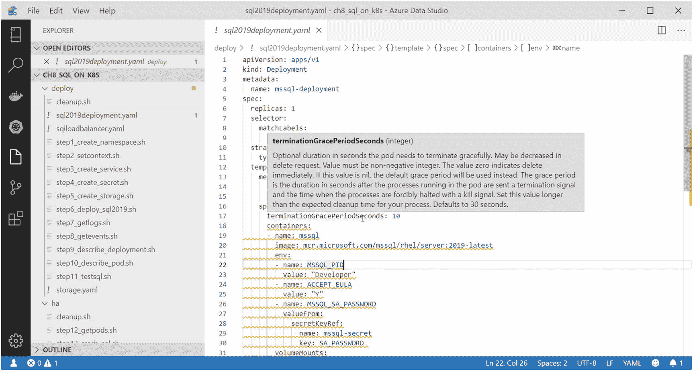

*图 8-3：使用 k8s 扩展组件浏览 YAML 文件*

ADS 扩展组件还包含一个“实时”资源管理器，用于查看 k8s 资源。我使用它来连接到我的 AKS 集群（如果你使用 AKS，在使用该工具时需要提供一些登录信息）。连接后，我可以浏览对象，甚至执行一些有趣的操作。

由于我的 Pod 部署在一个命名空间中，我首先需要将上下文切换到该命名空间，如图 8-4 所示。

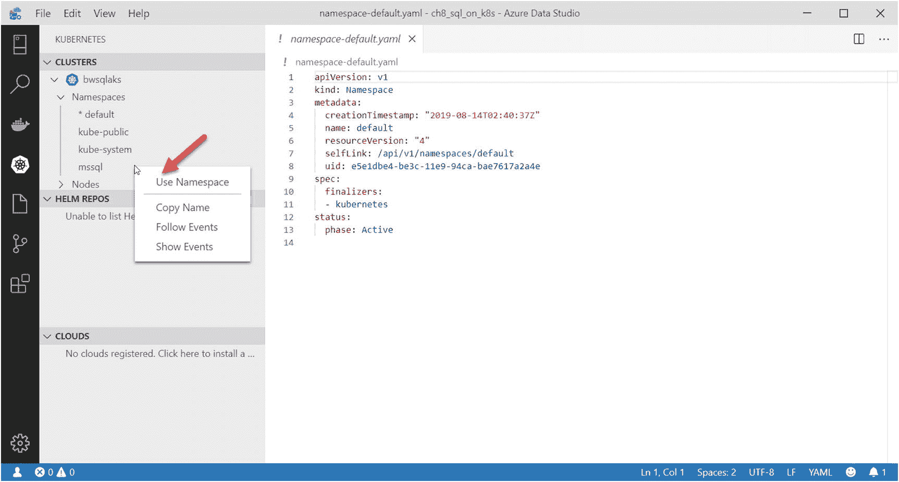

*图 8-4：使用 k8s 扩展组件设置命名空间*

一个很酷的功能是，我可以附加到正在运行的 Pod 上，并运行一个 Bash shell 来查看 `ERRORLOG`。首先，我在 k8s 资源管理器中找到我的部署，然后使用右键选项选择“终端”，如图 8-5 所示。

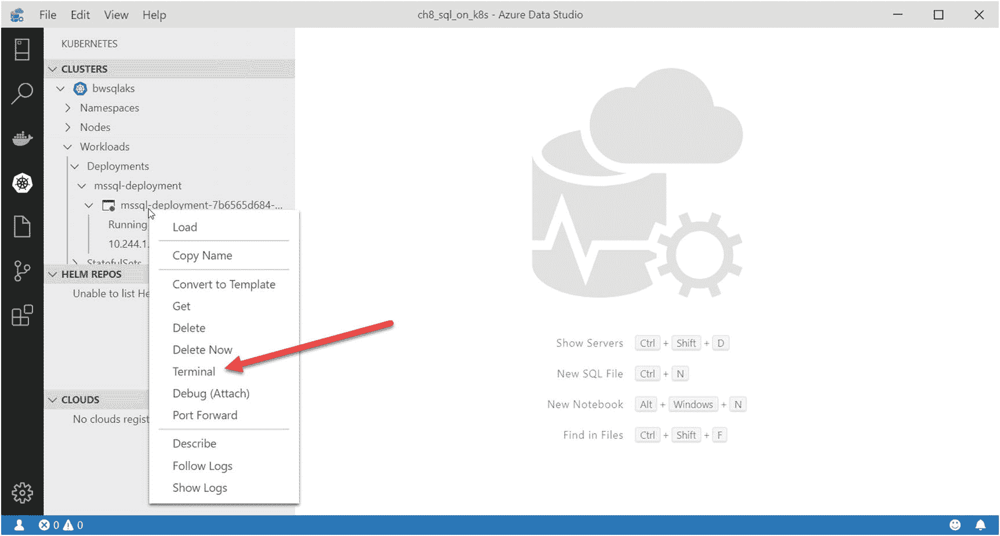

*图 8-5：在 k8s Pod 中运行终端会话*

ADS 的终端随即显示，现在我处于 Pod 的 SQL 容器内的 Bash shell 中。然后我可以导航到 `/var/opt/mssql/log` 并输出 `ERRORLOG`，如图 8-6 所示。

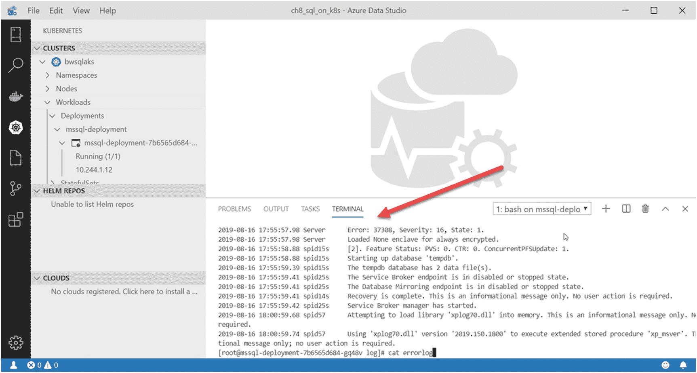

*图 8-6：在 k8s 中转储 SQL Server Pod 的 ERRORLOG*

我输入 `exit` 以退出终端会话。我注意到的另一件事是能够对部署进行反向工程，以查看该部署对应的 YAML 文件是什么样子。在部署上使用右键功能，我选择了“转换为模板”，如图 8-7 所示。

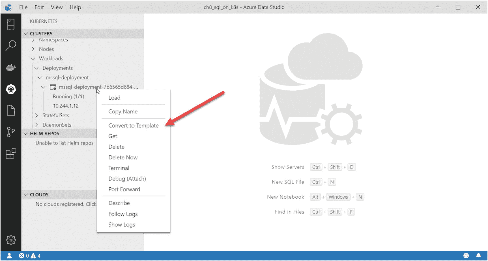

*图 8-7：对 k8s 部署进行反向工程*

我输入了 YAML 文件的名称，随后出现了一个编辑器，显示了生成的 YAML 文件。

我相信 k8s 扩展组件还有其他我没有探索到的巧妙选项，但我将在我的 Kubernetes 之旅中继续使用它。

#### 其他 kubectl 命令

`kubectl` 还有很多其他值得展示的命令，包括：

*   `kubectl top` – 此命令可按节点或 Pod 基础显示内存和 CPU 的指标。例如，这有助于查看某个 Pod 消耗了多少内存，或者节点上还剩多少内存。
*   `kubectl cp` – 此命令可用于将文件复制到 Pod 的容器文件系统中。就像 `docker cp` 一样，你可以使用此命令将 SQL Server 数据库的备份文件复制到容器的可写层中。

    例如，假设你部署的示例 Pod 名称在 `mssql` 命名空间中是 `mssql-deployment-7b6565d684-92l8s`，并且你已将 WideWorldImporters 数据库示例 ([`https://github.com/Microsoft/sql-server-samples/releases/download/wide-world-importers-v1.0/WideWorldImporters-Full.bak`](https://github.com/Microsoft/sql-server-samples/releases/download/wide-world-importers-v1.0/WideWorldImporters-Full.bak)) 下载到本地目录。以下命令会将备份文件复制到 SQL Server 容器中以便还原：

    ```
    kubectl cp ./WideWorldImporters-Full.bak mssql/mssql-deployment-7b6565d684-92l8s:/var/opt/mssql
    ```
*   `kubectl exec` – 此命令允许你在 Pod 的容器命名空间中执行程序。你会像使用 `docker exec` 一样使用此命令来为容器运行 Bash shell，或者对于 SQL Server，运行 `sqlcmd` 实用程序，因为它是 SQL Server 容器的一部分。

    基于我刚才展示的复制 WideWorldImporters 备份的示例，可以使用以下命令来还原备份：

    ```
    kubectl exec mssql-deployment-7b6565d684-92l8s -- /opt/mssql-tools/bin/sqlcmd -S localhost -U SA -P "Sql2019isfast" -Q "RESTORE DATABASE WideWorldImporters FROM DISK = '/var/opt/mssql/WideWorldImporters-Full.bak' WITH MOVE 'WWI_Primary' TO '/var/opt/mssql/data/WideWorldImporters.mdf', MOVE 'WWI_UserData' TO '/var/opt/mssql/data/WideWorldImporters_userdata.ndf', MOVE 'WWI_Log' TO '/var/opt/mssql/data/WideWorldImporters.ldf', MOVE 'WWI_InMemory_Data_1' TO '/var/opt/mssql/data/WideWorldImporters_InMemory_Data_1'"
    ```

    我花了一些时间才弄清楚这个语法；请注意，这里没有指定命名空间，因此你必须处于该 Pod 所在命名空间的上下文中。还要注意在指定 `/opt/mssql/bin/sqlcmd` 之前使用了 `--` 语法，该语法用于分隔 `kubectl` 的参数和程序的参数（本例中程序是 `sqlcmd`）。
*   `kubectl version` – 此命令会输出 `kubectl` 的版本。我见过用户遇到 `kubectl` 问题的情况，是因为其版本过旧且与 k8s 集群的版本不兼容。此命令会打印出客户端和服务器的版本。请阅读 [`https://kubernetes.io/docs/setup/release/version-skew-policy/`](https://kubernetes.io/docs/setup/release/version-skew-policy/) 了解更多关于版本兼容性的信息。
*   `kubectl explain` – 此命令显示解释 k8s 对象信息的文档。使用如下命令可以了解更多关于 `ReplicaSet` 的 YAML 要求：

    ```
    kubectl explain ReplicaSet
    ```
*   `kubectl cluster-info dump` – 让开，kubeheads（这是个术语吗？如果不是，我刚发明了一个）。此命令将转储大量诊断信息。使用 `--output-directory` 来创建一组诊断文件。务必使用 `--all-namespaces` 选项来获取所有命名空间的诊断信息。此命令转储了 k8s 集群中几乎所有的日志文件，包括 Pods 的日志。我其实没有找到关于日志具体内容的详细文档，但随着我自己对 k8s 的使用增多，我可能会了解更多（并成为一个 kubehead）。

## k8s Dashboard

Kubernetes 仪表板可视化展示 k8s 集群的相关信息。您可以在 [`https://kubernetes.io/docs/tasks/access-application-cluster/web-ui-dashboard/`](https://kubernetes.io/docs/tasks/access-application-cluster/web-ui-dashboard/) 阅读关于仪表板的所有内容。

对于 AKS，您可以参考 [`https://docs.microsoft.com/en-us/azure/aks/kubernetes-dashboard`](https://docs.microsoft.com/en-us/azure/aks/kubernetes-dashboard) 了解如何为集群显示 k8s 仪表板。当我按照此文档页面的步骤启动仪表板时，浏览器弹出了用户界面。随后，我将命名空间更改为 `mssql`，屏幕显示如图 8-8 所示。

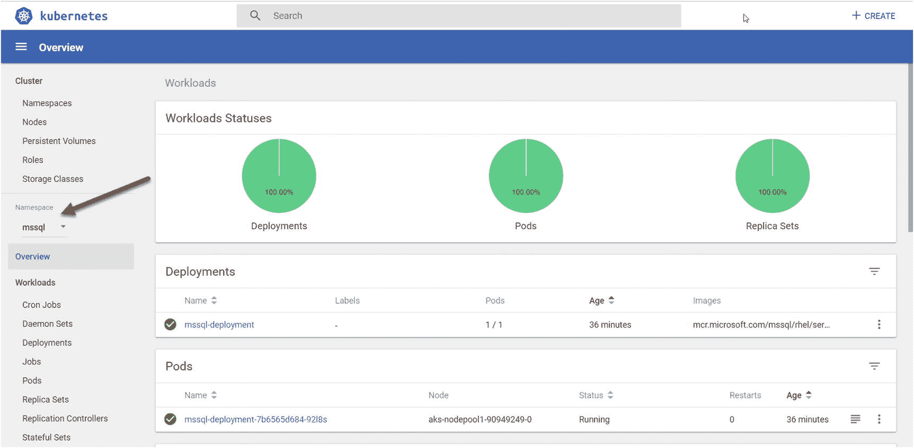
*图 8-8：k8s 仪表板*

## 使用 AKS 的指标和日志

使用 AKS 有其优势，因为它类似于一个托管的 k8s 平台。它在 Azure 门户中内置了指标、可视化图表和日志查看功能。图 8-9 展示了我通过 Azure 门户从 AKS 集群中获得的一些洞察。

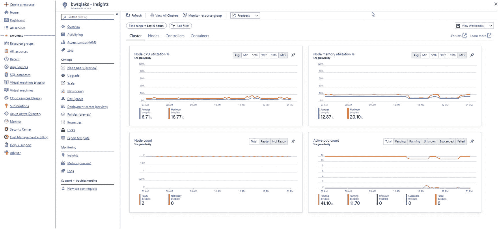
*图 8-9：来自 AKS 的 Azure 门户洞察*

本章的下一步是向您展示 k8s 内置的高可用性（HA）如何工作以及它如何应用于 SQL Server。如果您打算使用下一节中的示例，请不要移除任何已配置的资源。脚本 `cleanup.sh` 可用于清理所有资源，因此如果您*不*打算继续学习下一节的示例，可以使用它。

## 在 k8s 上实现 SQL Server 高可用性

k8s 最出色的方面之一是其内置的高可用性功能集。想象一下，无需安装或维护任何集群软件就能为 SQL Server 实现高可用性！

我在本章前面提到了 `ReplicaSet` 这个术语，现在是时候讨论它的重要性了。

当您在上一节的示例中应用 SQL Server 部署时，YAML 文件包含了如下声明：

```yaml
replicas: 1
```

此声明指示 k8s *始终尝试确保* pod 中的容器（本例中是 SQL Server 容器）有一个实例在运行。如果容器崩溃，k8s 将重启该容器。如果 pod 终止，k8s 将启动一个新的 pod。如果节点终止，且存在新节点并有足够资源，k8s 将在新节点上启动一个新的 pod。

对于 SQL Server，当您将 `ReplicaSet` 与 `LoadBalancer` 和持久化存储结合使用时，就形成了一个天然的共享存储高可用性方案。请将图 8-10 视为您在上一节创建的部署的可视化表示。

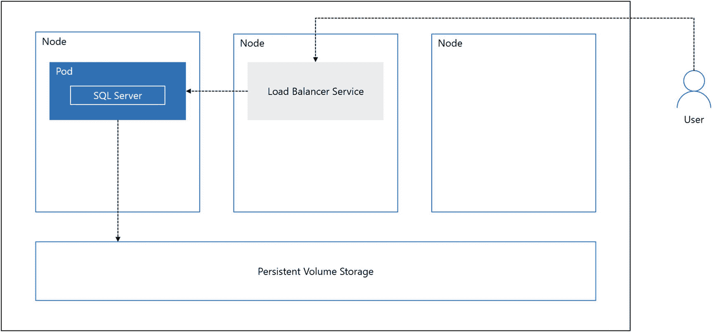
*图 8-10：使用 SQL Server 和 k8s 的基本高可用性*

在此示例中，用户将连接到与持有 SQL Server 容器的 pod 绑定的负载均衡器（实际上，负载均衡器并不仅仅存在于用户节点中）。如果 SQL Server 容器崩溃，您只会看到短暂的停顿，因为 k8s 会在 pod 中启动另一个容器。

考虑一下如果 pod 出现问题会发生什么，如图 8-11 所示。

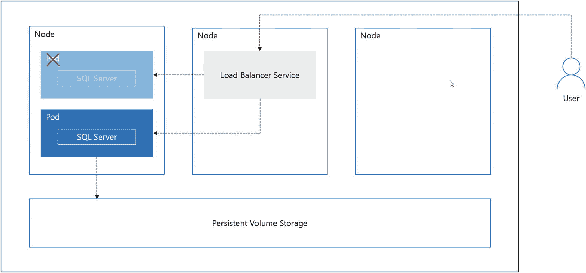
*图 8-11：k8s 中的 pod 故障*

在此场景下，k8s 将启动另一个 pod（很可能在同一个节点上），并启动一个新容器。但请注意，新容器仍然指向 `PVC`，而 `PVC` 绑定着系统和用户数据库。对 SQL Server 而言，它只看到现有的系统和用户数据库，然后启动。新 pod 会有一个新的私有 IP 地址，但负载均衡器会自动重定向到这个新地址。从应用程序的角度来看，只需重试连接，一切就恢复正常。

如果节点（可能是一个虚拟机）崩溃了，如图 8-12 所示。

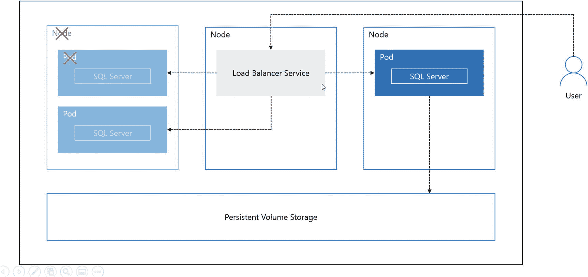
*图 8-12：k8s 中的节点故障*

k8s 会检测到此情况，并在新节点上启动一个新的 pod。即使新 pod 有一个新的私有 IP 地址，负载均衡器仍会被重定向到新的 pod。这与“始终开启的故障转移集群实例”（Always On Failover Cluster Instance）有相似之处，只是您无需安装任何特殊的集群软件。

让我们基于前一章的示例来构建，看看这是如何工作的。此示例的所有脚本都可以在 `ch8_sql_on_k8s\ha` 找到。

1.  运行以下命令或 `step12_getpods.sh` 脚本，以查看 pod 的名称、IP 地址及其运行的节点：

    ```bash
    kubectl get pods -o wide
    ```

    您的结果应类似于：

    ```
    NAME                               READY  STATUS   RESTARTS     AGE  IP           NODE                      NOMINATED NODE  READINESS GATES
    mssql-deployment-7b6565d684-8r7cc  1/1    Running  0            91m  10.244.1.11  aks-nodepool1-90949249-0
    ```

2.  让我们通过关闭 SQL Server 来模拟容器故障。运行以下命令或脚本 `step13_crash_sql.sh` 以关闭 SQL Server，从而停止容器：

    ```bash
    SERVERIP=$(kubectl get service | grep mssql-service | awk {'print $4'})
    PORT=31433
    sqlcmd -Usa -PSql2019isfast -S$SERVERIP,$PORT -Q"SHUTDOWN WITH NOWAIT"
    ```

## 3. 运行以下命令或脚本 `step14_getpods.sh` 以查看所有内容是否相同：

```
kubectl get pods -o wide
```

你的结果应该与之前相同，因为容器在同一个节点上的同一个 Pod 中重启了：

```
NAME                               READY  STATUS   RESTARTS    AGE  IP           NODE                      NOMINATED NODE  READINESS GATES
mssql-deployment-7b6565d684-8r7cc  1/1    Running  1           91m  10.244.1.11  aks-nodepool1-90949249-0
```

运行以下命令以查看事件序列：

```
kubectl get events
```

你的结果应该类似于：

```
LAST SEEN   TYPE     REASON    KIND   MESSAGE
16s         Normal   Pulled    Pod    Container image "mcr.microsoft.com/mssql/rhel/server:2019-latest" already present on machine
16s         Normal   Created   Pod    Created container
16s         Normal   Started   Pod    Started container
```

## 4. 尝试连接到 SQL Server，使用以下命令或脚本 `step15_testsql.sh` 查看一切是否正常：

```
SERVERIP=$(kubectl get service | grep mssql-service | awk {'print $4'})
PORT=31433
sqlcmd -Usa -PSql2019isfast -S$SERVERIP,$PORT -Q"SELECT @@version"
```

你应该能够看到成功连接到 SQL Server 并显示了版本信息。

## 5. 使用以下命令或脚本 `step16_pod_failure.sh` 测试 Pod 故障：

```
kubectl delete pod -l app=mssql
```

在这个例子中，我们不是按名称指定 Pod，而是利用了我们为 Pod 关联了一个易于记忆的标签这一点。

你应该会看到类似这样的消息：

```
pod "mssql-deployment-7b6565d684-8r7cc" deleted
```

## 6. 使用以下命令或脚本 `step17_getpods.sh` 检查 Pod 的状态，包括 IP 地址：

```
kubectl get pods -o wide
```

从输出中可以看到，Pod 现在运行在同一个节点上（它也可能被调度到一个新节点），并有了新的名称和新的 IP 地址：

```
NAME                                READY   STATUS    RESTARTS   AGE     IP            NODE                       NOMINATED NODE   READINESS GATES
mssql-deployment-7b6565d684-gq48v   1/1     Running   0          2m55s  10.244.1.12   aks-nodepool1-90949249-0
```

使用以下命令查看事件序列：

```
kubectl get events
```

你的输出将显示终止旧 Pod 并创建新 Pod 的序列，类似于：

```
LAST SEEN  TYPE    REASON            KIND        MESSAGE
6m53s      Normal  Pulled            Pod         Container image "mcr.microsoft.com/mssql/rhel/server:2019-latest" already present on machine
6m53s      Normal  Created           Pod         Created container
6m53s      Normal  Started           Pod         Started container
39s        Normal  Killing           Pod         Killing container with id docker://mssql:Need to kill Pod
40s        Normal  Scheduled         Pod         Successfully assigned mssql/mssql-deployment-7b6565d684-gq48v to aks-nodepool1-90949249-0
34s        Normal  Pulled            Pod         Container image "mcr.microsoft.com/mssql/rhel/server:2019-latest" already present on machine
34s        Normal  Created           Pod         Created container
34s        Normal  Started           Pod         Started container
40s        Normal  SuccessfulCreate  ReplicaSet  Created pod: mssql-deployment-7b6565d684-gq48v
```

## 7. 使用以下命令或脚本 `step18_testsql.sh` 尝试通过 LoadBalancer 服务连接到 SQL Server：

```
SERVERIP=$(kubectl get service | grep mssql-service | awk {'print $4'})
PORT=31433
sqlcmd -Usa -PSql2019isfast -S$SERVERIP,$PORT -Q"SELECT @@version"
```

因为我们将 LoadBalancer 绑定到了 Pod，所以即使 Pod 有了新的私有 IP 地址，连接保持不变。

## 8. 通过运行以下命令或脚本 `cleanup.sh` 清理所有资源：

```
kubectl delete namespace mssql
kubectl config delete-context mssql
kubectl config use-context bwsqlaks
```

现在你已经了解了 SQL Server 在 k8s 中运行的基本 HA（高可用）能力。对于节点不再可用的情况，要模拟节点的真正崩溃，你需要直接访问支持节点的虚拟机并“崩溃”它。不过，你可以通过运行以下命令，观察 k8s 如何根据 ReplicaSet 定义自动调度 SQL Server 部署的行为：

```
kubectl drain
```

你可以通过运行以下命令让节点重新上线以供调度（但这并不意味着 Pod 会移回该节点）：

```
kubectl uncordon
```

现在让我们探讨如何在 k8s 中更新 SQL Server，类似于你在第 7 章中更新容器的方式。


## 在 k8s 上更新 SQL Server

你在第 7 章中学习了如何通过“切换”由持久卷支持的容器来更新 SQL Server 容器。运行中的容器被停止，然后启动一个装有新 CU 版本 SQL Server 的新容器——指向同一个卷，该卷映射到包含系统和用户数据库的目录。

你可以在 k8s 中实现同样的效果。只是这一次，在给出正确的声明后，k8s 将为你完成所有工作。让我们回头看看本章第一个练习中的 `sql2019deployment.yaml` 文件的这一部分：

```yaml
spec:
  replicas: 1
  selector:
    matchLabels:
      app: mssql
  strategy:
    type: Recreate
```

注意 `strategy`（策略）的类型是 `Recreate`（重新创建）。`Recreate` 向 k8s 声明，如果部署被更新，则停止并重新创建容器。策略类型的另一个选择是 `RollingUpdate`（滚动更新）。除非我们协调多个 SQL Server 容器，否则不能对 SQL Server 使用此策略。不过，我们将在本章最后一节关于 Always On 可用性组和 k8s 的内容中讨论这个概念。

更新部署的一种方式是更新 pod 中运行的容器的 `image`（镜像）。对于 SQL Server，这可能意味着更新到一个新的累计更新，就像我在第 7 章中展示的如何切换到包含新镜像的容器一样。并且因为我们使用的是持久卷，系统和用户数据库将被使用更新镜像的新容器识别。k8s 为你提供了一种方法，通过一个命令完成所有这些操作。而且还有回滚机制，因为 k8s 将对部署的更新跟踪为一个修订版。

让我们实际操作一下。此示例的所有脚本都可以在 `ch8_sql_on_k8s\update` 找到。如果你已经运行了之前的示例，请务必使用 `ha` 或 `deploy` 文件夹中的 `cleanup.sh` 脚本清理所有现有资源。

在撰写本书时，我们尚未发布 SQL Server 2019 的累计更新，因此在这些示例中我将使用 SQL Server 2017。然而，一旦我们开始发布 CU 版本，你可以对 SQL Server 2019 使用相同的技术。

1.  首先，我们需要像本章第一个示例那样部署一个 SQL Server pod。为了省去所有步骤，我编写了一个名为 `step1_deploysql.sh` 的脚本来完成所有操作。这个脚本使用以下命令：

    ```bash
    kubectl create namespace mssql
    kubectl config set-context mssql --namespace=mssql --cluster=bwsqlaks --user=clusterUser_bwaks_bwsqlaks
    kubectl config use-context mssql
    kubectl apply -f sqlloadbalancer.yaml
    kubectl create secret generic mssql --from-literal=SA_PASSWORD="Sql2017isfast"
    kubectl apply -f storage.yaml
    kubectl apply -f sql2017deployment.yaml
    ```

    `storage.yaml` 和 `sqlloadbalancer.yaml` 文件与本章第一个示例中使用的文件相同。`sql2017deployment.yaml` 文件也相同，除了这一部分：

    ```yaml
    image:  mcr.microsoft.com/mssql/server:2017-CU10-ubuntu
    ```

    这意味着我们的新 pod 容器将使用 SQL Server 2017 CU10 for Ubuntu 镜像。如果此镜像不在部署 pod 的节点上，k8s 将首先拉取该镜像。

## 注意
迄今为止，除了运行使用这些镜像的容器然后删除容器（镜像将保留在本地节点缓存）之外，我还没有找到一种简单的方法来在所有 k8s 节点上预拉取 SQL Server 镜像。还有其他技术，其中之一是获取管理员权限登录到实际的 Linux 节点虚拟机，并直接使用 docker 拉取镜像。

使用与第一个示例相同的技术来检查 pod 和部署是否已启动并正在运行。例如，运行以下命令：

```bash
kubectl get all
```

pod 的状态必须是 `Running`，并且 LoadBalancer 必须有一个有效的 `External-IP` 地址，然后你才能继续。

2.  现在我们希望通过更改镜像来更新部署，使用以下命令或脚本 `step2_updatesql.sh`：

    ```bash
    kubectl --record deployment set image mssql-deployment mssql=mcr.microsoft.com/mssql/server:2017-latest-ubuntu
    ```

k8s 将在幕后完成所有工作，停止当前容器并使用相同部署参数启动一个新容器（使用新镜像）。

3.  使用以下命令或脚本 `step3_checkstatus.sh` 来观察更新进度。该命令将一直等待，直到使用新镜像的容器更新完成并且容器再次运行为止：

    ```bash
    kubectl rollout status deployment mssql-deployment
    kubectl rollout history deployment mssql-deployment
    ```

当新的部署完成后，你的结果应该如下所示：

```
    Waiting for deployment "mssql-deployment" rollout to finish: 0 out of 1 new replicas have been updated...
    Waiting for deployment "mssql-deployment" rollout to finish: 0 out of 1 new replicas have been updated...
    Waiting for deployment "mssql-deployment" rollout to finish: 0 out of 1 new replicas have been updated...
    Waiting for deployment "mssql-deployment" rollout to finish: 0 of 1 updated replicas are available...
    deployment "mssql-deployment" successfully rolled out
    deployment.extensions/mssql-deployment
    REVISION  CHANGE-CAUSE
    2         kubectl deployment set image mssql-deployment mssql=mcr.microsoft.com/mssql/server:2017-latest-ubuntu --record=true
```

4.  你可以使用此命令或脚本 `step4_getpods.sh` 确保你的 pod 再次运行：

    ```bash
    kubectl get pods -o wide
    ```

你的 pod 状态应显示为 `Running`。

5.  SQL Server 将识别现有的系统和用户数据库，但需要执行任何必要的步骤来更新到新的 CU 版本。因此，如果你尝试过快地连接到 SQL Server，可能会遇到以下错误：

```
    Sqlcmd: Error: Microsoft ODBC Driver 17 for SQL Server : Login failed for user 'sa'. Reason: Server is in script upgrade mode. Only administrator can connect at this time.
```

尝试执行以下命令或脚本 `step5_testsql.sh`，直到你看到新版本的 SQL Server：

```bash
    SERVERIP=$(kubectl get service | grep mssql-service | awk {'print $4'})
    PORT=31433
    sqlcmd -Usa -PSql2017isfast -S$SERVERIP,$PORT -Q"SELECT @@version"
```

6.  就像第 7 章中的容器示例一样，你可能希望回滚到之前的容器。k8s 提供了一种通过更改修订版本号来实现此目的的方法。运行以下命令回滚到之前的 CU 版本，或使用脚本 `step6_rollbacksql.sh`：

    ```bash
    kubectl rollout undo deployment mssql-deployment --to-revision=1
    ```

7.  运行以下命令或脚本 `step7_getpods.sh` 以验证 pod 已回到 `Running` 状态：

    ```bash
    kubectl get pods -o wide
    ```

8.  一旦 pod 处于 `Running` 状态，运行以下命令（或使用脚本 `step8_testsql.sh`）以确保你已回滚到 SQL 2017 CU10：

    ```bash
    SERVERIP=$(kubectl get service | grep mssql-service | awk {'print $4'})
    PORT=31433
    sqlcmd -Usa -PSql2017isfast -S$SERVERIP,$PORT -Q"SELECT @@version"
    ```

现在，你已经成功更新了一个 SQL Server 容器，并利用 k8s 内置的更新镜像功能将其从运行中的容器回滚。

使用脚本 `cleanup.sh` 清理你在本章此示例中部署的所有资源。


### 使用 Helm Chart

在 Kubernetes（k8s）中部署带有容器的 Pod 过程非常直接，但正如你在示例中所见，涉及许多步骤。如果能像从包管理器（例如 RHEL 上的 `yum`）安装软件一样，轻松地将一个容器（如 SQL Server）部署到 Pod 中，岂不是很好？

Helm 使其成为可能。你可以在 [`https://helm.sh/`](https://helm.sh/) 上了解如何使用 Helm Chart。

对于 SQL Server，一个适用于 Linux 上 SQL Server 2017 的 Helm Chart 可在此处获取：[`https://github.com/helm/charts/tree/master/stable/mssql-linux`](https://github.com/helm/charts/tree/master/stable/mssql-linux)。

当你在 k8s 集群中安装 Helm 后，你将能够使用如下单条命令部署一个 SQL Server Pod：

```
helm install --name sql-server stable/mssql-linux --set acceptEula.value=Y --set sapassword=Sql2019isfast --set edition.value=Developer
```

[`https://github.com/helm/charts/tree/master/stable/mssql-linux`](https://github.com/helm/charts/tree/master/stable/mssql-linux) 上的示例包含了如何配置持久化安装，以及如何使用部署的内置 `LoadBalancer` 服务连接到正在运行的 Pod。

我认为 Helm 在简化 k8s 上部署 SQL Server 的体验方面具有巨大潜力，因此结合 k8s 部署继续研究这项技术将会很有趣。

### k8s 上的 SQL Server 可用性组

k8s 内置的高可用性解决方案非常契合 SQL Server 的需求。然而，仅使用这种方法为数据库提供高可用性存在几个问题：

*   如果 k8s 必须启动一个新的 Pod 和容器，这实际上等同于重启 SQL Server。必须在所有系统和用户数据库上执行完整恢复。根据容器的关闭方式（如果你没有使用我们新的加速数据库恢复选项），这可能导致新的 SQL Server 容器达到可用状态所需的时间超出预期（即使 Pod 状态为 `Running`）。一个 `Running` 的 Pod 仅意味着 `sqlservr` 进程正在运行，并不意味着 SQL Server 实际上可用。

*   第二个问题是拉取新的 SQL Server 镜像可能需要时间。如果在为 SQL Server 创建新 Pod 的节点上没有预先拉取 SQL Server 镜像，这可能会导致启动 Pod 并使 SQL Server 可用出现延迟。

*   k8s 仅能*理解*容器、Pod 或节点的运行状况。它无法理解运行在容器内的程序的运行状况。由于 SQL Server *运行状况*问题，一个 SQL Server 容器可能正在运行但不可用（或数据库不可用）。

我们构建了 Always On 可用性组来帮助减少故障转移所需的停机时间。该技术的一部分是识别 SQL Server 主机运行状况之外的故障转移条件。你可以在 [`https://docs.microsoft.com/en-us/sql/database-engine/availability-groups/windows/flexible-automatic-failover-policy-availability-group`](https://docs.microsoft.com/en-us/sql/database-engine/availability-groups/windows/flexible-automatic-failover-policy-availability-group) 阅读有关这些故障转移条件的更多信息。此外，我们为可用性组中的数据库添加了故障转移运行状况检测，你可以在 [`https://docs.microsoft.com/en-us/sql/database-engine/availability-groups/windows/sql-server-always-on-database-health-detection-failover-option`](https://docs.microsoft.com/en-us/sql/database-engine/availability-groups/windows/sql-server-always-on-database-health-detection-failover-option) 了解更多。

*   第四个问题是，对于单个 `sqlservr` Pod，没有副本的概念。一次只有一个 Pod 可以访问系统和用户数据库。如果能有多个 SQL Server 参与高可用性解决方案，这样其他实例（副本）可以拥有数据的只读副本，并且所有容器都不依赖于单一的持久卷声明（`Persistent Volume Claim`），将会很有益。

因此，为我们找到一种方法将 k8s 的内置高可用性与 SQL Server 可用性组的故障转移技术结合起来是有意义的。我们在 SQL Server 2019 预览版期间就做到了这一点。你可以通过我的同事 Sourabh Agarwal 在 [`https://cloudblogs.microsoft.com/sqlserver/2018/12/10/availability-groups-on-kubernetes-in-sql-server-2019-preview/`](https://cloudblogs.microsoft.com/sqlserver/2018/12/10/availability-groups-on-kubernetes-in-sql-server-2019-preview/) 发表的这篇博客文章，了解我们如何实现以及它的工作原理的完整故事。

其方法是使用 k8s 的 *StatefulSet* 概念（在 [`https://kubernetes.io/docs/concepts/workloads/controllers/statefulset/`](https://kubernetes.io/docs/concepts/workloads/controllers/statefulset/) 阅读更多）来部署可用性组副本。我们还将使用 *operator* 的概念来编排可用性组的部署并检测故障转移场景。

此外，我们将此解决方案设计为对主副本和辅助副本都使用 `LoadBalancer` 服务。这样，应用程序可以使用主 `LoadBalancer` 连接到主副本，而不管哪个副本是主副本。同时，另一个应用程序（可能是报告应用程序）可以连接到一个或多个只读辅助副本，并使用 k8s 真正实现连接的负载均衡。

我们还在 SQL Server Pod 中构建了一个名为 *AG Agent* 的新容器，以帮助检测和协调 SQL Server 的故障转移检测逻辑。结合称为 k8s *ConfigMap* 的概念（在 [`https://kubernetes.io/docs/tasks/configure-pod-container/configure-pod-configmap/`](https://kubernetes.io/docs/tasks/configure-pod-container/configure-pod-configmap/) 阅读更多），`AG Agent` 和 `operator` 将帮助将故障转移决策与 k8s 集群集成，以处理超出 k8s 运行状况（容器、Pod 或节点）范围的情况。

所有这些都基于我们在 SQL Server 2019 预览版期间构建的组件；我们已宣布 k8s 上的可用性组将不会是 SQL Server 2019 版本的一部分。但是，可用性组是大数据集群（Big Data Clusters）HADR 故事的一部分，你将在第 10 章了解更多内容。

我与该功能的首席开发人员 Ross Monster 进行了交谈。他告诉我，其意图仍是在未来投资此功能。Ross 告诉我，我们的思路仍然是最终使用 `operator` 概念、`AG Agent` 概念和 `StatefulSet` 概念，但整体设计可能会改变。一旦可用性组（`AG`）部署完成，其行为将与 k8s 之外的 `AG` 完全一样，允许你读取辅助副本并拥有类似的故障转移体验。同样，k8s 与 `AG` 的美妙之处在于，无需你安装或维护任何故障转移集群软件。

如果你想查看使用预览版 `AG` 与 k8s 的实验练习，请查看 [`https://github.com/microsoft/sqlworkshops/blob/master/SQLonOpenShift/sqlonopenshift/05_Operator.md`](https://github.com/microsoft/sqlworkshops/blob/master/SQLonOpenShift/sqlonopenshift/05_Operator.md) 上的 SQL Server 2019 on OpenShift 实验的模块 5。

Ross 解释的一个我们正在考虑的概念是，我们实际上可以支持滚动更新场景。因此，无需依赖手动切换容器并最终经历更多停机时间，我们有可能为在可用性组中更新一系列 SQL Server 容器提供近乎零停机时间的场景。这个全新的世界将与我们在 2019 年 5 月 Red Hat 峰会上演示的代码非常相似。你可以在 [`www.pscp.tv/RedHatOfficial/1vAGRWYPjngJl`](https://www.pscp.tv/RedHatOfficial/1vAGRWYPjngJl) 观看此演示的视频，亲眼目睹 `operator` 和 SQL Server 近乎零停机更新的这一全新世界。


