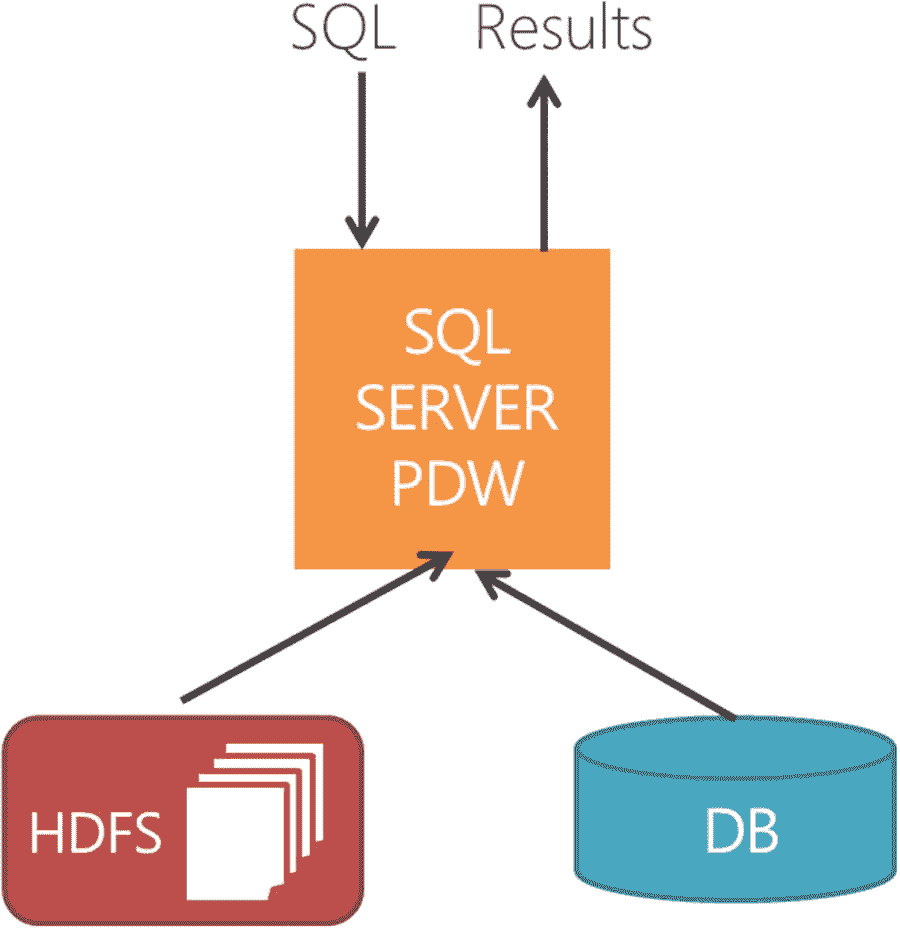
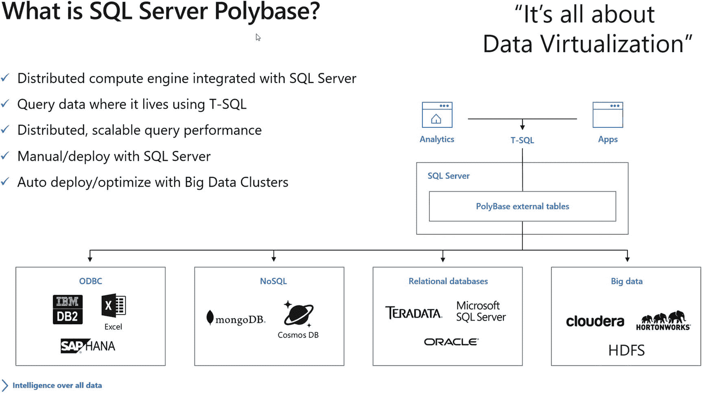
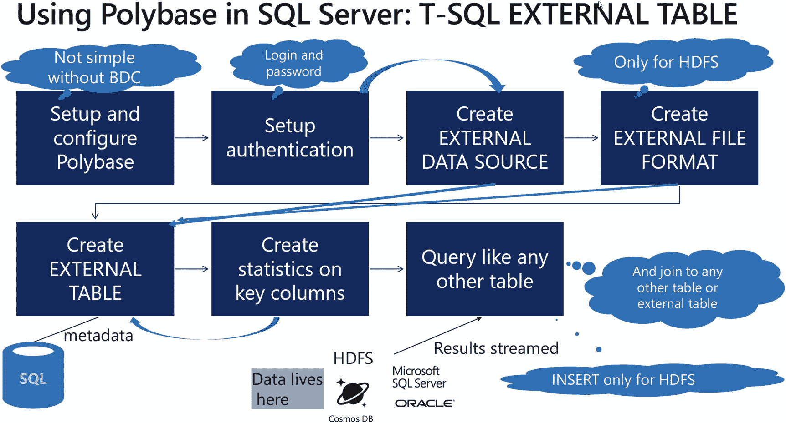
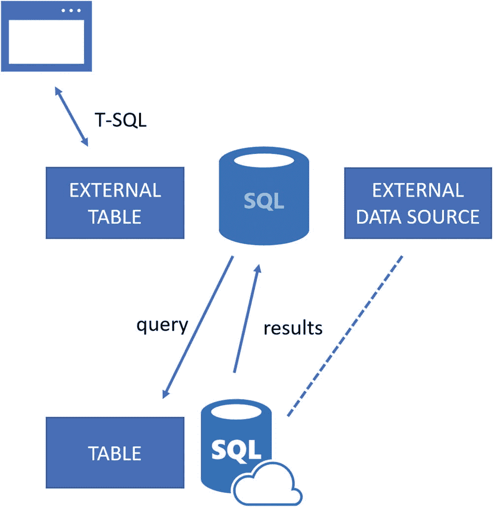
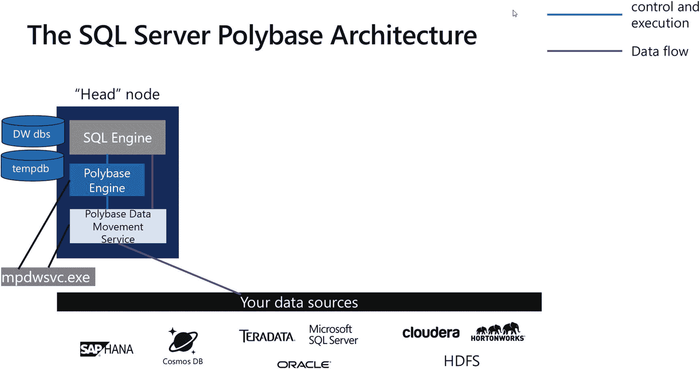
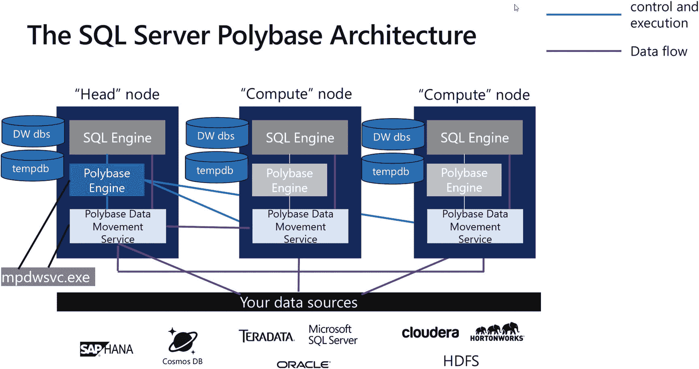
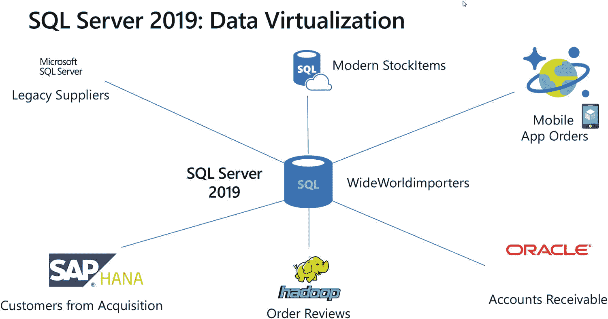
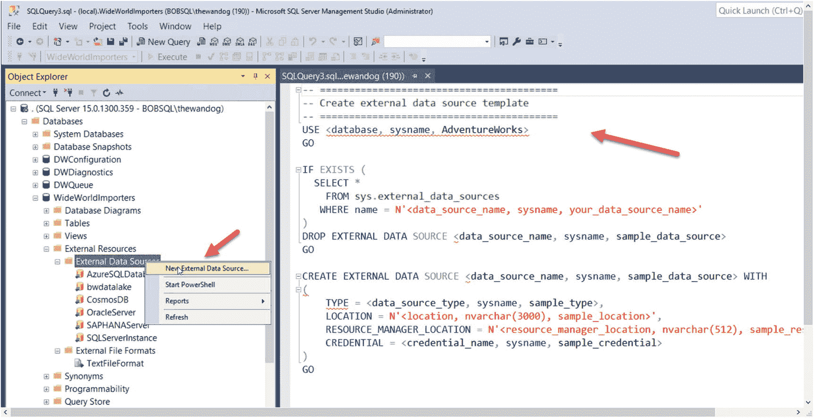
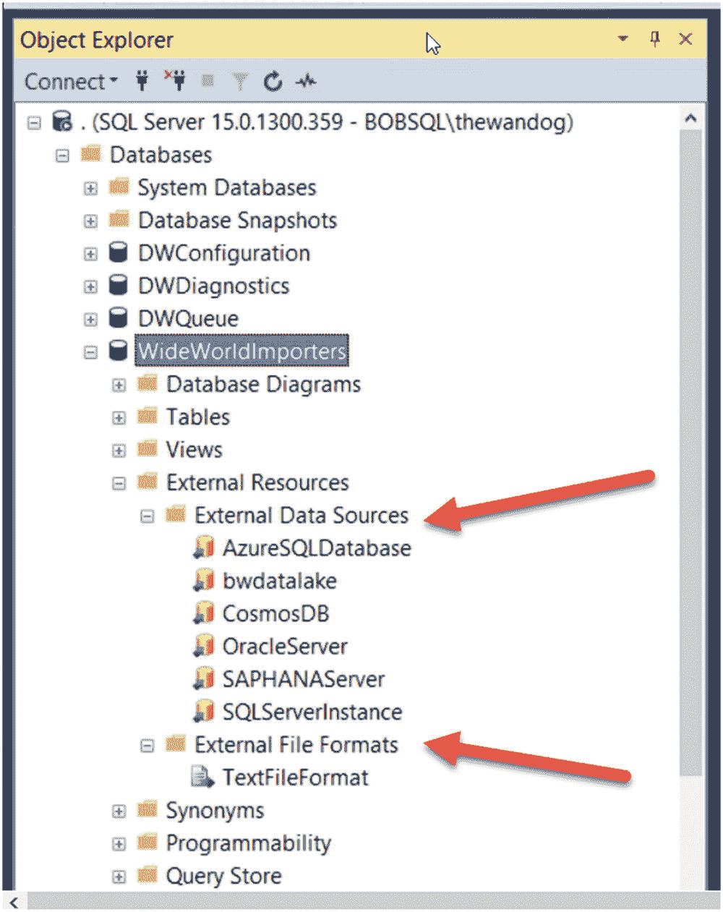
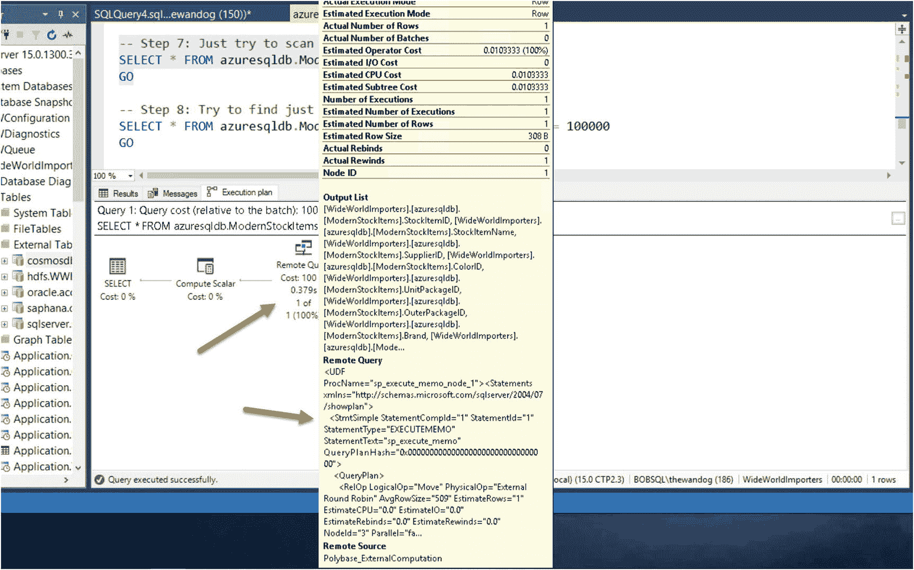

# 9. SQL Server 数据虚拟化

## 概要

我坚信容器和 Kubernetes 将成为分布式与可扩展计算未来的重要组成部分，而 SQL Server 正是为此未来而构建。在本章中，你学习了足够的 Kubernetes (`k8s`) 基础知识，足以理解如何在 `k8s` 集群中部署 SQL Server。你也见证了内置于 `k8s` 的高可用性（HA）的强大功能，以及 SQL Server 如何利用它。就像你在第 7 章中看到的容器那样，你可以使用 `k8s` 的功能来更新 Pod 中的 SQL Server 容器（应用新的累积更新），并在必要时回滚。我还简要介绍了 Helm Charts，它代表了一种使用包管理方式在 `k8s` 中部署 Pod 和容器的新方法。

最后，我让你简要了解了 SQL Server 与 `k8s` 集成的未来，我们将可用性组与 `k8s` 集成，以提供一个健壮、集成的 HA 解决方案，其中包含了你今天所见到的可用性组的所有强大功能。第 7 章和第 8 章是重要的学习基石，有助于你学习第 10 章关于 SQL Server 大数据集群的内容。

数据虚拟化是我们通过 SQL Server 2019 提供的最令人兴奋的功能之一。在本章中，你将学习更多关于 SQL Server 2019 中如何通过一种名为 PolyBase 的技术实现数据虚拟化。本章，连同第 6、7 和 8 章，为学习第 10 章的 `SQL Server 大数据集群`奠定了基础。

## 什么是 PolyBase？

PolyBase 是一项在 SQL Server 2016 中引入并在 SQL Server 2019 中扩展的创新技术，旨在解决 *数据移动* 问题。数据移动通常涉及构建昂贵且复杂的提取、转换和加载（ETL）过程，将数据从其他数据源移入 SQL Server。PolyBase 通过实现 *数据虚拟化* 解决方案来应对此挑战，我将在下文中讨论并定义这个术语。我将贯穿本章讨论并定义数据虚拟化。

在本章中，我将带你了解 PolyBase 的历史以及它如何提供数据虚拟化。我将讲解 PolyBase 在幕后的工作原理，以及通过 *外部表* 概念的典型 PolyBase 工作流程。并且，像本书大多数章节一样，我们将使用示例向你展示如何使用 PolyBase 满足数据虚拟化需求的细节。

你也可以使用我们的文档作为指南，在 [`https://docs.microsoft.com/en-us/sql/relational-databases/polybase/polybase-guide`](https://docs.microsoft.com/en-us/sql/relational-databases/polybase/polybase-guide) 了解更多关于 PolyBase 的信息。

### PolyBase 的历史

大约在 2011 年，David DeWitt 博士及其团队创建了一个名为 *Polybase* 的新项目（你可以在 [`http://gsl.azurewebsites.net/Projects/Polybase.aspx`](http://gsl.azurewebsites.net/Projects/Polybase.aspx) 看到项目网站）。他的团队成员包括 Rimma Nehme（现以 Azure CosmosDB 闻名）和来自微软研究院 Jim Gray 系统实验室的 Alan Halverson。该项目的目标是创建一种无需编写 MapReduce 作业即可访问 Hadoop 系统中数据的新方法（你可以在 [`https://en.wikipedia.org/wiki/MapReduce`](https://en.wikipedia.org/wiki/MapReduce) 阅读更多关于 MapReduce 的信息，它在 Hadoop 用户中非常流行）。

我采访了现在 MIT 工作的 David，了解了 PolyBase 的历史。我问他为什么尝试创建一种使用 MapReduce 的新方法。他向我指了一篇他与 Michael Stonebraker 写的博客文章，你可以在 [`https://homes.cs.washington.edu/~billhowe/mapreduce_a_major_step_backwards.html`](https://homes.cs.washington.edu/%257Ebillhowe/mapreduce_a_major_step_backwards.html) 找到。该文章描述了 MapReduce 作为一种访问数据的劣等方式的多种表现。

David 和他的团队随后创建了 PolyBase 项目，利用微软的并行数据仓库（PDW）技术来访问 Hadoop 系统中的“大数据”。PDW，现在称为分析平台系统（APS），是云端 Azure SQL 数据仓库的前身。正如 David 所说，“...我们可以将 PDW 连接到 HDFS，并使用 PDW 的并行查询，让客户能够使用标准的 SQL 而不是 MapReduce。这将使客户能够在一个查询中同时访问他们的关系数据和存储在 HDFS 中的外部表。”

该团队为这项技术撰写了一篇论文，你可以在 [`http://gsl.azurewebsites.net/portals/0/users/projects/polybase/polybasesigmod2013.pdf`](http://gsl.azurewebsites.net/portals/0/users/projects/polybase/polybasesigmod2013.pdf) 阅读。该论文发表在 2013 年 ACM SIGMOD 会议的论文集中。PolyBase 首次作为一项功能出现在 PDW 中是在 2012 年中，并且至今仍在那里。

图 9-1 展示了原始 PolyBase 概念的示意图。



图 9-1：来自 Jim Gray 系统实验室的原始 PolyBase 概念

快进到 SQL Server 2016 的开发。如果 PolyBase 可以通过 PDW 中的 SQL 使用，那为什么不能在 SQL Server 中使用呢？在 SQL Server 2016 中，我们添加了 PolyBase 功能以使用 T-SQL 访问 Hadoop 系统中的数据。我常将此功能称为“经典 PolyBase”（这是我的说法；并非微软官方术语）。你可以使用 T-SQL 创建所谓的 *外部表* 来映射 HDFS 文件，然后像查询任何其他表一样查询该外部表。该“查询”会被转换为 MapReduce Java 程序，在目标 Hadoop 系统上运行。

我大约在 SQL Server 2016 发布时加入了工程团队，但我从未真正看到 PolyBase 在我们的客户中流行起来。我不确定确切原因，但部分答案可能是客户必须在与 SQL Server 同一台计算机上安装 Java——通常是来自 Oracle 的 Java 运行时环境（`JRE`）。也可能是在 2016 年，SQL Server 客户还没有准备好与 Hadoop 集成，而 Hadoop 用户则希望与关系数据库保持距离。

2016 年，微软收购了一家名为 Metanautix 的公司，我在本书开篇章节提到过。通过此次收购，我们获得了 `ODBC` 技术，用于访问 SQL Server、Oracle、Teradata 和 MongoDB 等数据源。像 Travis Wright 和 Slava Oks 这样的人看到了这些技术的愿景，因此他们在 SQL Server 2019 中扩展了 PolyBase，允许用户使用外部表访问的不仅仅是 Hadoop，还包括 SQL Server、Oracle、Teradata 和 MongoDB。并且，“锦上添花”的是，我们添加了使用你选择的 `ODBC` 驱动程序访问 *任何数据源* 的支持。我称这种新能力为 `PolyBase++`（再次强调，这是我的说法，不是微软官方术语）。


### 什么是数据虚拟化？

我并没有在 `SQL Server 2016` 的 `Polybase` 上花费太多时间，但我了解其概念。当我开始投入大量时间用于 `SQL Server 2019` 的演讲和培训时，“`数据虚拟化`”（我想我第一次听到这个词是从 Travis Wright 那里）才真正促使我开始深入研究 `Polybase`。

`数据虚拟化`有多种定义方式，但你可以在维基百科上阅读其“官方”定义：[`https://en.wikipedia.org/wiki/Data_virtualization`](https://en.wikipedia.org/wiki/Data_virtualization)。我喜欢其中这句特别的话：“与传统的提取、转换、加载（`"ETL"`）过程不同，`数据保持在原地`，并为源系统提供实时数据访问。这降低了数据出错的风险，避免了传输那些可能永远不会被使用的数据的工作量，并且它不会试图将单一的数据模型强加于数据之上。”

`数据虚拟化`的关键在于 `无数据移动` 这一概念。需要澄清的是，这里的“数据”并非指以其原生格式从源位置移动。相反，是通过查询或向数据源请求来检索数据。

作为 `SQL Server 2019` 整体策略中实现 `数据虚拟化` 解决方案的一部分，我们的期望和承诺是：`SQL Server` 是 `数据虚拟化` 的一个卓越 `中心`。换言之，`SQL Server 2019` 可以成为您组织的 `数据枢纽`。

图 9-2 是一张常用来阐述 `Polybase`、`数据虚拟化` 和 `SQL Server 2019` 整体概念的幻灯片。



图 9-2

`SQL Server 2019` 中的 `Polybase` 与 `数据虚拟化`

看看图中所有的这些图标。借助 `SQL Server 2019`，你可以对基于外部表运行 `T-SQL` 查询，这些外部表的数据源范围广泛，从 `HDFS` 到 `Oracle`，再到 `CosmosDB`，再到 `SAP HANA`。而这里激进的部分在于：你可以使用 `T-SQL` 查询这些资源，并将它们与本地 `SQL Server` 表或代表这些其他数据源的任何其他外部表进行连接。

在这张幻灯片上，我试图简化 `Polybase` 的定义：

*   **分布式计算引擎**

    `Polybase` 包含源自最初 `PDW` 设计的软件，该软件与 `SQL Server` 集成，并提供了自己的分布式计算引擎。我将在下一节“`Polybase` 工作原理”中更详细地描述这个组件。

*   **使用 `T-SQL` 在数据所在的位置查询数据**

    这是 `数据虚拟化` 的承诺。对本地 `SQL Server` 执行 `T-SQL` 查询，并在不移动数据的情况下查询其他数据源中的数据。关于 `SQL Server 2019` 的 `Polybase` 还有一点：查询 `SQL Server`、`Oracle`、`Teradata` 和 `MongoDB` 所需的软件已内置到 `SQL Server` 的安装程序中。**无需额外的客户端软件！**

*   **分布式、可扩展的查询性能**

    `Polybase` 提供的不仅仅是“连接”到其他数据源的方法；`链接服务器` 就能提供这种功能。因为 `Polybase` 是一个集成的分布式计算引擎，它可以提供可扩展的查询性能。一个称为 `横向扩展组` 的概念提供了将查询分发到 `Hadoop`、`SQL Server` 和 `Oracle` 等数据源的能力。

*   **手动/随 `SQL Server` 部署**

    到目前为止，这听起来非常酷，那么，有什么陷阱吗？嗯，设置 `Polybase` 确实需要一些工作，特别是如果你想在 Windows 上设置 `横向扩展组`。一旦部署了 `Polybase`，就不需要太多配置了。设置数据源连接确实需要一些工作，因为 `Polybase` 的效能取决于你通过外部表所代表的数据源获取访问权限和建立连接的能力。

*   **随 `大数据群集` 自动部署/优化**

    正如你将在第 10 章发现的，`SQL Server 大数据群集` 将提供 `数据虚拟化`，其中 `Polybase` 已部署，并且部署了 `Hadoop` 群集，可优化对 `HDFS` 中数据的访问。

## `Polybase` 工作原理

我常常认为，在某种程度上理解 `SQL Server` 功能的工作原理，能让你更有效地使用它。如果你看过我在各种会议（如 `PASS Summit`）上的演讲，你也会知道我以讲解 `SQL Server` 功能的内部机制而闻名。因此，当我在英国曼彻斯特的 `SQL Bits 2019` 会议上被邀请做几场报告时，我选择了 `Polybase` 作为我的主题。我想更深入地研究 `Polybase` 的内部工作原理，特别是我们如何构建一个架构来访问像 `Oracle` 这样的数据源。我有深厚的 `SQL Server` 背景，因此对 `链接服务器` 的细节非常熟悉。`Polybase` 有何不同？我将在本章后面更多地讨论这些技术的比较。作为本章的一个很好补充，你可以观看我在 `SQL Bits` 上关于这个主题的演讲，你可以在 [`https://sqlbits.com/Sessions/Event18/Inside_SQL_Server_2019_Polybase`](https://sqlbits.com/Sessions/Event18/Inside_SQL_Server_2019_Polybase) 找到它。


### Polybase 工作流程

在我描述 SQL Server 为提供 Polybase 功能而部署的所有软件组件之前，我认为你应该先了解使用 Polybase 的工作流程。

图 9-3 是我经常用来展示 SQL Server 中 Polybase 工作流程的一张幻灯片。



图 9-3：SQL Server 中的 Polybase 工作流程

让我解释这个工作流程中的每一部分：

**设置和配置 Polybase** – 我将在名为“示例的先决条件”的部分中更详细地讨论 Polybase 的设置和配置。你也可以阅读关于 Windows 上 Polybase 设置的文档：`https://docs.microsoft.com/en-us/sql/relational-databases/polybase/polybase-installation`，以及 Linux 上的设置：`https://docs.microsoft.com/en-us/sql/relational-databases/polybase/polybase-linux-setup`。

**设置身份验证** – 你必须有一种方式来验证到外部数据源的连接。Polybase 仅支持基本身份验证的概念，这意味着你必须在 SQL Server 中存储某种类型的 `IDENTITY`（或用户）和 `SECRET`（密码或密钥）才能访问外部数据源。这是一个名为 `数据库范围凭据` 的对象，它使用 SQL Server 的 `MASTER KEY` 对象进行加密。你可以阅读关于数据库范围凭据的文档：`https://docs.microsoft.com/en-us/sql/t-sql/statements/create-database-scoped-credential-transact-sql`。

**`外部数据源`** – 可以将 `外部数据源` 视为类似于 ODBC 数据源的 T-SQL 对象。为你打算用于一个或多个 `外部表` 定义的数据源创建一次。在本章的示例中，你会看到需要为 `外部数据源` 提供连接信息。你可以阅读关于 `外部数据源` 的文档：`https://docs.microsoft.com/en-us/sql/t-sql/statements/create-external-data-source-transact-sql`。`CREDENTIAL` 值将是你创建的数据库范围凭据的名称。

**`外部文件格式`** – 关系型甚至 NoSQL 数据都具有结构，通常以列或字段的形式存在。存储在 Hadoop 系统中的数据通常是半结构化的。为了使 SQL Server 能够访问 HDFS 中文件的数据，你必须指定一种格式，这正是 `外部文件格式` 所定义的。对于 Oracle 等数据源，此规范是不必要的。你可以阅读关于 `外部文件格式` 的文档：`https://docs.microsoft.com/en-us/sql/t-sql/statements/create-external-file-format-transact-sql`。

**`外部表`** – 可以将 `外部表` 视为虚拟的 SQL Server 表（更常被称为视图）。这意味着 `外部表` 的行为类似于 SQL Server 表——有关表的元数据存储在目录视图中，但外部表的数据或存储位于数据源本身。你可以阅读关于 `外部表` 的文档：`https://docs.microsoft.com/en-us/sql/t-sql/statements/create-external-table-transact-sql`。当你创建外部表时，`DATA_SOURCE` 属性将是你创建的外部数据源的名称。对于 HDFS 外部表，你将使用 `FILE_FORMAT` 属性指定你创建的外部文件格式。

**统计信息** – 为了协助查询处理器和 Polybase 计算引擎为外部表生成最优的查询计划，你可以基于外部表中的列创建存储在 SQL Server 中的统计信息。你可以阅读关于创建统计信息的文档：`https://docs.microsoft.com/en-us/sql/t-sql/statements/create-statistics-transact-sql`。

**查询** – 一旦你定义了所有这些对象，就可以针对外部表运行 T-SQL 查询，甚至可以将它们与本地 SQL Server 表或其他外部表进行联接。关键概念是数据驻留在外部数据源，而不是加载到 SQL Server 中；只有元数据和统计信息存储在 SQL Server 数据库中。针对外部表的查询是只读的，Hadoop 除外。SQL Server 支持摄取或 `INSERT` 到基于 Hadoop 的外部表中。你可以阅读关于 Polybase 查询的文档：`https://docs.microsoft.com/en-us/sql/relational-databases/polybase/polybase-queries`。

## SQL Server 2019 Polybase 架构

现在你已经了解了用于针对外部表查询的 Polybase 的对象和工作流程，让我在你亲自尝试之前描述一下支撑此功能的软件组件。

## 注意

Stuart Padley、David Kryze、James Rowland-Jones 和 UC 对 Polybase 内部原理的所有细节完全负责，这些细节构成了你在本章中看到的部分。

## 外部表如何工作

首先，图 9-4 是我在谈论 Polybase 如何工作时展示的第一张图。



图 9-4：外部表如何工作

在使用和研究 Polybase 时，理解这一点很重要：SQL Server 仅为 `外部数据源` 和 `外部表` 存储元数据，*而不是数据*。用户运行 T-SQL 查询时，像引用 SQL Server 表一样引用 `外部表`。`外部表` 被映射到 `外部数据源`，以定位数据的真实位置。SQL Server 作为数据枢纽，将针对 `外部表` 的查询接收，并使用对应于该数据源的驱动程序向外部数据源提交一个新查询。结果被发送回 SQL Server，并最终返回给原始用户。针对外部表的查询的另一个方面是下推的概念。

下推是将过滤数据的责任推给外部数据源的概念。在图 9-4 中，如果外部数据源是 Azure SQL Database，并且查询使用了 `WHERE` 子句作为查询条件，Polybase 将尝试将查询（包括 `WHERE` 子句）（对于所有数据源，它可能不是显式的 `WHERE` 子句）下推到 Azure SQL Database，以便获取最少行数的计算在外部数据源上完成。相反（效率较低）的方法是将外部表中的所有行取回到 SQL Server 中，然后让 SQL Server 引擎过滤出满足查询所需的行。你可以阅读更多关于使用 Polybase 进行下推计算的文档：`https://docs.microsoft.com/en-us/sql/relational-databases/polybase/polybase-pushdown-computation`。


## Polybase 独立实例

让我们通过图 9-5 更深入地探讨一下 Polybase 的架构。



图 9-5 Polybase 头节点架构

让我先在 Windows 的背景下更详细地描述这张图，然后再讨论我们如何在 Linux 上实现它。

当你在 Windows 上部署 Polybase 时，有两个选择：

**独立的支持 PolyBase 的实例**
如果你只想使用一个 SQL Server 实例进行 Polybase 操作，请选择此选项。Polybase 所需的所有软件都将安装在此实例上，它将被视为*头节点*。

**将 SQL Server 实例用作 PolyBase 横向扩展组的一部分**
使用此选项来设置所谓的横向扩展组。我将在后面更详细地描述横向扩展组。

图 9-5 表示的是一个独立的支持 PolyBase 的实例场景。让我描述一下此图中的组件：

**Polybase 引擎** – Polybase 引擎是一个 Windows 服务，包含一个名为`mpdwsvc.exe`的程序。请注意，图中的 Polybase 引擎负责**控制和执行**。换句话说，Polybase 引擎是执行外部表查询的协调器。SQL Server 引擎将与 Polybase 引擎协调。Polybase 引擎实际上包含了来自 PDW 中 Polybase 功能的代码，以支持外部表。`mpdwsvc.exe`由 Windows 服务使用`-dweng`参数执行。Polybase 引擎与 SQL Server 之间的通信通过本地命名管道进行。

**Polybase 数据移动服务 (DMS)** – 正如其名，Polybase DMS 负责数据。这意味着 Polybase DMS 将对远程数据源执行查询，并将结果传回 SQL Server 引擎。有趣的是，Polybase DMS 同样是通过名为`mpdwsvc.exe`的可执行文件实现的，但使用的是`-dms`参数。在头节点的服务器上，你应该能看到两个名为`mpdwsvc.exe`的进程。这也意味着 Polybase DMS 是加载所有 ODBC 驱动程序或运行针对 Hadoop 系统的 MapReduce Java 代码的程序。Polybase DMS 还通过命名管道与 SQL Server 引擎和 Polybase 引擎通信。Polybase DMS 服务将通过命名管道与 SQL Server 引擎流式传输数据，以发送来自外部数据查询的结果。

**DW 数据库** – Polybase 功能需要自己的元数据。当你安装 Polybase 时，你会在 SQL Server 上发现安装了这些数据库：`DWConfiguration`、`DWDiagnostics`和`DWQueue`。你应该将这些数据库视为 Polybase 的系统数据库，因此它们需要可用，此功能才能工作。我不会详细介绍每个数据库的具体内容，而且我们也没有文档化这些。我确实发现一位有趣的博主撰写了关于探查这些数据库内部的文章：[`https://36chambers.wordpress.com/2019/04/03/polybase-revealed-the-dw-databases/`](https://36chambers.wordpress.com/2019/04/03/polybase-revealed-the-dw-databases/)。

**Tempdb** – Polybase 在执行外部表查询时可能会使用`tempdb`进行中间查询处理。此外，为了确保数据流能被正确处理，Polybase 会创建`tempdb`表作为数据流的“存储后端”（尽管它可能永远不会使用该后端）。在我使用 Polybase 的过程中，我没有看到对`tempdb`的显著使用；我只是想让你了解`tempdb`的使用情况——这样你就不会对看到与 Polybase 相关的临时表活动感到惊讶。

Polybase 还附带了一系列目录视图和动态管理视图，我将在本章的示例中使用其中一些。你可以在以下网址查看这些目录视图和动态管理视图的列表：[`https://docs.microsoft.com/en-us/sql/relational-databases/polybase/polybase-troubleshooting`](https://docs.microsoft.com/en-us/sql/relational-databases/polybase/polybase-troubleshooting)。

## Polybase 横向扩展组

如果你选择设置一个 Polybase 横向扩展组，则可以使用多个 SQL Server 实例进行查询处理以实现横向扩展。有关横向扩展组配置，请参见图 9-6。



图 9-6 Polybase 横向扩展组

通过 Polybase 横向扩展组，你可以在其他 SQL Server 实例上启用 Polybase，用于横向扩展查询处理。启用 Polybase 的其他 SQL Server 实例称为*计算节点*。请注意，在计算节点上，Polybase 引擎是不活动的。在 Windows 上，Polybase 引擎服务已安装，但它被禁用且不需要。头节点上的 Polybase 引擎负责跨所有节点的协调，而 Polybase DMS 服务则在每个节点上执行所有数据交换。我们在所有节点上安装 Polybase 引擎的原因是为了让计算节点可以在需要时（例如，当前头节点出现问题）成为头节点。

当 SQL Server 确定使用多个实例可以加速对外部表的查询时，横向扩展组可能是最有效的。这对于 Hadoop 系统可能非常强大，横向扩展组在构建时就考虑了分布式 Hadoop 系统。对于其他数据源，如 SQL Server 或 Oracle，Polybase 可以检测这些源上的分区，并使用横向扩展组来查询目标上的每个分区。我们将此功能称为*横向扩展读取*，你可以在以下网址阅读相关内容：[`https://docs.microsoft.com/en-us/sql/relational-databases/polybase/polybase-scale-out-groups?view=sql-server-ver15#scale-out-reads`](https://docs.microsoft.com/en-us/sql/relational-databases/polybase/polybase-scale-out-groups%253Fview%253Dsql-server-ver15%2523scale-out-reads)。

## 查询处理与 Polybase

Polybase 的一项重大创新是，查询外部表已集成到 SQL Server 查询处理器中。这意味着 SQL Server 查询处理器*理解*它何时在处理外部表，并构建正确的执行详细信息以提交给 Polybase 引擎，从而支持像谓词下推这样的操作。

在本章后面，我将展示一个示例，说明 SQL Server 引擎中外部表查询的远程查询操作符是什么样子。

## 在 Linux 上如何工作？

Linux 上的 SQL Server 2019 仅支持独立的 Polybase 实例（我们将在第 10 章介绍的 SQL Server 大数据集群中支持横向扩展组的概念）。此外，Linux 上 SQL Server 2019 的 Polybase 不支持用于数据源的通用 ODBC 连接器。

因此，在 Linux 上，Polybase 的架构是使用 SQLPAL（有关 SQLPAL 的更多详细信息，请参见第 6 章）在`sqlservr`进程中实现 Polybase 引擎和 Polybase 数据移动服务。

在我撰写本章时，我们正接近 SQL Server 的发布尾声，但仍未发布带有 Linux 版 SQL Server 的 Hadoop 外部表功能（SQL Server 大数据集群除外）。我预计此功能将包含在 SQL Server 2019 的最终版本中，但其概念与 Windows 版相同。我们可能会为此功能提供单独的 Linux 软件包，但它应该记录在以下文档中：[`https://docs.microsoft.com/en-us/sql/relational-databases/polybase/polybase-linux-setup`](https://docs.microsoft.com/en-us/sql/relational-databases/polybase/polybase-linux-setup)。

### 这与 Azure 有何不同？

Polybase 目前作为一项功能存在于 SQL Server、Azure SQL Data Warehouse 和 Analytics Platform System（APS，原名并行数据仓库）中。然而，它们各自提供的功能有所不同。

## 注意

`EXTERNAL TABLE`（外部表）对象确实存在于 Azure SQL Database 中，但它本身并不是 Polybase 功能（截至 SQL Server 2019 版本）。Azure SQL Database 中的外部表用于支持弹性查询。你可以在 [`https://docs.microsoft.com/en-us/azure/sql-database/sql-database-elastic-query-getting-started`](https://docs.microsoft.com/en-us/azure/sql-database/sql-database-elastic-query-getting-started) 阅读更多关于弹性查询的内容。

Azure SQL Data Warehouse 的 Polybase 专注于使用外部表来访问 Hadoop 或 HDFS，数据源可以是 Azure Blob Storage 或 Azure Data Lake 等。Azure SQL Data Warehouse 不支持 SQL Server、Oracle 等数据源。你可以在 [`https://docs.microsoft.com/en-us/sql/t-sql/statements/create-external-data-source-transact-sql?view=azure-sqldw-latest`](https://docs.microsoft.com/en-us/sql/t-sql/statements/create-external-data-source-transact-sql%3Fview%3Dazure-sqldw-latest) 阅读更多关于 Azure SQL Data Warehouse 中 Polybase 的内容。

APS 的 Polybase 与 Azure SQL Data Warehouse 类似，但更侧重于提供对“本地”Hadoop 系统的访问。你可以在 [`https://docs.microsoft.com/en-us/sql/t-sql/statements/create-external-table-transact-sql?view=aps-pdw-2016-au7`](https://docs.microsoft.com/en-us/sql/t-sql/statements/create-external-table-transact-sql%3Fview%3Daps-pdw-2016-au7) 了解 APS 的 Polybase。

## 示例的先决条件

我们将在本章剩余部分讨论一些示例。首先，我将给你一些部署和配置 Polybase 的提示，然后是一些关于使用示例的指导。

### 设置并启用 Polybase

要在 Windows 上安装 Polybase，你可以按照文档 [`https://docs.microsoft.com/en-us/sql/relational-databases/polybase/polybase-installation`](https://docs.microsoft.com/en-us/sql/relational-databases/polybase/polybase-installation) 中的步骤操作。在选择独立 Polybase 实例时，步骤非常直接。你必须做出的一个选择是是否要使用 `Java connector for HDFS`（HDFS 的 Java 连接器）。如果你选择支持 HDFS 的外部表，你可以选择使用 SQL Server 2019 提供的默认 Open Java，或者安装你自己的 Java。我们提供的 Open Java 基于 Zulu Java，你可以在 [`https://cloudblogs.microsoft.com/sqlserver/2019/07/24/free-supported-java-in-sql-server-2019-is-now-available/`](https://cloudblogs.microsoft.com/sqlserver/2019/07/24/free-supported-java-in-sql-server-2019-is-now-available/) 了解相关信息。

在 Windows 上安装 Polybase 后，我们将安装一系列 ODBC 驱动程序（放置在 `binn\Polybase\ODBC Drivers` 目录中）。这些驱动程序为内置的 SQL Server、Oracle、Teradata 和 MongoDB 连接器提供支持。

安装 Polybase 功能后，你必须按照 [`https://docs.microsoft.com/en-us/sql/relational-databases/polybase/polybase-installation?view=sql-server-ver15#enable`](https://docs.microsoft.com/en-us/sql/relational-databases/polybase/polybase-installation%3Fview%3Dsql-server-ver15%23enable) 的文档说明，使用 `sp_configure` 启用该功能。

对于 Linux 上的 SQL Server，我们提供了一个单独的 Polybase 包，你可以在 [`https://docs.microsoft.com/en-us/sql/relational-databases/polybase/polybase-linux-setup`](https://docs.microsoft.com/en-us/sql/relational-databases/polybase/polybase-linux-setup) 了解如何配置和使用它。

对于横向扩展组，设置过程变得非常有趣。由于目前仅在 Windows 上支持横向扩展组，因此对于 SQL Server 2019，这是你唯一需要担心的配置。

我的横向扩展组部署经验相当困难。你可以在我们的文档 [`https://docs.microsoft.com/en-us/sql/relational-databases/polybase/configure-scale-out-groups-windows?view=sql-server-ver15`](https://docs.microsoft.com/en-us/sql/relational-databases/polybase/configure-scale-out-groups-windows%3Fview%3Dsql-server-ver15) 中阅读所有步骤。在你踏上这条路之前，让我给你一些初步的想法：

*   你将需要一个 Windows 域，因此如果你没有域控制器，你需要先设置一个。
*   Polybase 横向扩展组的所有 Windows 服务必须使用相同的域服务帐户。你必须通过安装程序或使用 SQL Server 配置管理器进行配置。
*   你最初必须在头节点和计算节点上做出一些选择。当你首次使用安装程序在所有节点上安装 Polybase 并选择选项 `Use the SQL Server instance as part of a PolyBase scale-out group`（将 SQL Server 实例用作 PolyBase 横向扩展组的一部分）时，所有节点都可能是头节点候选。要使 Polybase 正常工作，你需要选择一台计算机作为头节点。然后对于其他节点，你需要运行一个存储过程将它们配置为计算节点，并列出头节点服务器的名称和端口（注意你在安装过程中选择的端口，因为这里会用到）。作为计算节点加入的过程记录在 [`https://docs.microsoft.com/en-us/sql/relational-databases/polybase/configure-scale-out-groups-windows?view=sql-server-ver15#add-other-sql-server-instances-as-compute-nodes`](https://docs.microsoft.com/en-us/sql/relational-databases/polybase/configure-scale-out-groups-windows%3Fview%3Dsql-server-ver15%23add-other-sql-server-instances-as-compute-nodes)。
*   你需要在所有节点上使用 `sp_configure` 启用 Polybase，并重新启动 SQL Server。
*   你还需要在所有节点上重新启动所有 Polybase 服务。实际上，如果存储过程没有自动执行此操作，你需要在计算节点上停止 Polybase 引擎。如果一切顺利，Polybase 引擎服务将在计算节点上被禁用，但你应该仔细检查这一点。
*   查询 DMV `dm_exec_compute_nodes` 以确保所有节点都处于正确的 `HEAD` 或 `COMPUTE` 状态。你可以在 [`https://docs.microsoft.com/en-us/sql/relational-databases/system-dynamic-management-views/sys-dm-exec-compute-nodes-transact-sql`](https://docs.microsoft.com/en-us/sql/relational-databases/system-dynamic-management-views/sys-dm-exec-compute-nodes-transact-sql) 阅读更多关于此 DMV 的内容。


## 使用示例

考虑图 9-7 中 WideWorldImporters 公司的一个可能场景。



图 9-7：SQL Server 数据枢纽

在此示例中，WideWorldImporters (WWI) 公司使用 SQL Server 2019，但希望访问以下数据源中的数据：

`SQL Server 2008R2` – 公司有一个较旧的 SQL Server 系统，用于存储供应商存档。他们不想动这个系统，但希望访问此供应商信息。

`Azure SQL Database` – 公司内的一个团队正考虑迁移到云端，并使用 Azure 构建一个新的 StockItems 数据库。WWI 的团队希望查看此 StockItem 数据，并将其与 SQL Server 2019 数据库中的现有数据进行连接，同时不干扰新团队的工作。

`Azure CosmosDB` – 另一个团队正在为订单（Orders）试点一个移动应用程序，并试验使用 Azure CosmosDB。WWI 团队希望能够查看这些订单，并与本地数据库中与该订单相关的数据进行连接。

`Oracle` – WWI 的会计软件运行在 Oracle 上。虽然 WWI 正在考虑将此数据库迁移到 SQL Server，但迁移项目尚需时日。与此同时，WWI 知道 SQL Server 数据库中的某些数据引用了应收账款（Accounts Receivable）中的数据。如果他们能获得合理的 Oracle 访问权限，他们希望将本地 SQL Server 数据与 Oracle 中的应收账款数据进行连接，直到迁移完成。

`Hadoop` – WWI 的一个团队正在公司网站上构建一个评级系统，供客户评论订单体验。为了加速项目，开发团队使用 Azure Blob 存储以半结构化格式存储订单评论。WWI 的团队希望对此数据运行分析，并与 SQL Server 中的本地数据进行连接。

`SAP HANA` – WWI 最近收购了另一家公司 Vandelay Industries（我的灵感来源于*Seinfeld*中的虚构公司。参见[`seinfeld.fandom.com/wiki/Vandelay_Industries`](https://seinfeld.fandom.com/wiki/Vandelay_Industries)）。该公司在 SAP HANA 中存储了其客户的数据。在 WWI 团队制定迁移策略期间，他们希望分析这些客户的数据，而无需移动数据。

所有这些场景都可以通过 SQL Server 2019 中的 Polybase 和外部表实现。实际上，在你的`ch9_data_virtualization\sqldatahub`文件夹示例中，每种情况都有一个例子。

## 使用外部表

在我详细介绍`sqldatahub`文件夹中的一些示例之前，让我先解释一下你在这些示例中会一致发现的基本模板。此模板遵循外部表的一般工作流程，我在名为“Polybase 工作流程”的章节中已作描述。所有 Polybase 对象都在用户数据库范围内。

1.  在数据库中创建`MASTER KEY`。

2.  创建一个`DATABASE SCOPED CREDENTIAL`，用于对外部数据源进行身份验证。

3.  创建一个`EXTERNAL DATA SOURCE`以指定数据源的位置。`CREDENTIAL`属性将是数据库范围凭据的名称。

4.  为 HDFS 数据创建一个`EXTERNAL FILE FORMAT`。

5.  创建一个`EXTERNAL TABLE`以映射到外部数据源的目标表。`DATA_SOURCE`属性将是外部数据源的名称。`FILE_FORMAT`属性（仅适用于 HDFS）将是外部文件格式对象的名称。

6.  在外部表的列上创建本地统计信息。

7.  查询`EXTERNAL TABLE`，有时将该表与本地 SQL Server 表或其他外部表进行连接。

关于创建 Polybase 对象所涉及的所有 T-SQL 语句，有一个很好的参考文档：[`docs.microsoft.com/en-us/sql/relational-databases/polybase/polybase-t-sql-objects`](https://docs.microsoft.com/en-us/sql/relational-databases/polybase/polybase-t-sql-objects)。

### 工具与外部表

在我详细介绍 sqldatahub 的示例脚本之前，你应该了解工具对外部数据源和外部表的支持情况。

SQL Server Management Studio (SSMS) 通过 SSMS 模板支持创建外部数据源和外部表。图 9-8 展示了一个使用 SSMS 创建外部数据源的示例。



图 9-8：使用 SSMS 模板创建外部数据源

同样的概念也适用于外部表。

一旦你创建了外部数据源和表，就可以使用 SSMS 对象资源管理器浏览这些资源。图 9-9 展示了在 WideWorldImporters 数据库中创建的外部数据源和文件格式的一个示例。



图 9-9：SSMS 对象资源管理器浏览外部数据源和文件格式

Azure Data Studio (ADS) 也为 SQL Server 和 Oracle 数据源提供了一个“外部表向导”，指导你完成创建新外部表的过程。你可以在[`docs.microsoft.com/en-us/sql/relational-databases/polybase/data-virtualization`](https://docs.microsoft.com/en-us/sql/relational-databases/polybase/data-virtualization)阅读有关此功能的信息。

我将引导你完成为 Azure SQL Database 设置外部表的步骤。对于其他 sqldatahub 示例，我将指引你查看脚本示例，并对每种情况解释几个要点。


## 在 Azure SQL 数据库中使用外部表

SQL Server 的内置连接器之一提供了对 SQL Server、Azure SQL 数据库和 Azure SQL 数据仓库数据源的访问。

我已经基于我所描述的模板步骤，在 `ch9_data_virtualization\sqldatahub\azuredb` 文件夹中提供了示例脚本。我提供了 T-SQL 笔记本和 T-SQL 脚本两种方式来创建和查询外部表。

要使用这些脚本，您首先需要预配并获取 Azure SQL 数据库的访问权限。针对您的 Azure SQL 数据库运行 `createazuredbtable.sql` 脚本中的语句。

设置完成后，让我们逐步演练使用 `azuredbexternaltable.sql` T-SQL 脚本的每个步骤及您应预期的结果：

1.  运行 T-SQL 脚本中的 `Step 1` 以更改数据库上下文并创建主密钥来加密数据库范围凭据：

```sql
-- 步骤 1：创建主密钥来加密数据库凭据
USE [WideWorldImporters]
GO
CREATE MASTER KEY ENCRYPTION BY PASSWORD = 'S0me!nfo'
GO
```

2.  运行 `Step 2` 以创建受主密钥保护的数据库范围凭据。您需要提供所创建的 Azure SQL 数据库的服务器登录名和密码：

```sql
-- 步骤 2：创建存储 Azure SQL Server 数据库登录凭据的数据库凭据
-- IDENTITY = 登录名
-- SECRET = 密码
CREATE DATABASE SCOPED CREDENTIAL AzureSQLDatabaseCredentials
WITH IDENTITY = '', SECRET = ''
GO
```

3.  运行 `Step 3` 以使用数据库范围凭据作为 `CREDENTIAL` 进行身份验证，来创建外部数据源：

```sql
-- 步骤 3：创建外部数据源
-- sqlserver 是一个关键字，表示数据源是 SQL Server、Azure SQL 数据库或 Azure SQL 数据仓库
-- :// 后面的名称是 Azure SQL Server 数据库服务器。您的 SQL Server 必须位于与 Azure SQL Server 数据库相同的虚拟网络中，或者必须通过其防火墙规则
CREATE EXTERNAL DATA SOURCE AzureSQLDatabase
WITH (
LOCATION = 'sqlserver://',
PUSHDOWN = ON,
CREDENTIAL = AzureSQLDatabaseCredentials
)
GO
```

关于此脚本需要注意几点。`LOCATION` 语法包含一个 `<类型>:<连接信息>`，其中类型可以有以下可能值：
*   sqlserver
*   oracle
*   teradata
*   mongodb
*   obdc

该类型将指示 SQL Server 为外部数据源使用哪个 ODBC 驱动程序。对于 SQL Server，Azure SQL 数据库的连接信息应该是服务器的 URL（例如，`<server>..database.windows.net`）。

当您成功创建外部数据源后，可以在用户数据库的上下文中，使用 `external_data_sources` 目录视图查看已创建源的列表。

## 提示

遗憾的是，创建外部数据源时并不验证与数据源的连接。如果您弄错了连接信息的名称，直到尝试创建外部表时才会发现。数据库范围凭据也存在同样的问题。如果您没有提供正确的登录名和密码，直到尝试创建外部表时才会知道。

4.  运行脚本的 `Step 4` 以创建一个架构来存放外部表对象。这不是必需的，但我喜欢使用架构来帮助组织对象，这也使得安全设置非常方便：

```sql
-- 步骤 4：在 WideWorldImporters 中为外部表创建一个架构
CREATE SCHEMA azuresqldb
GO
```

5.  运行 `Step 5`，使用 `DATA_SOURCE` 属性中指定的外部数据源来创建外部表：

```sql
-- 步骤 5：创建外部表
-- 每一列必须与远程表中的列相匹配
-- 注意字符列使用了与目标表兼容的排序规则
-- WITH 子句包含了远程 [数据库].[架构].[表] 的名称以及外部数据库源
CREATE EXTERNAL TABLE azuresqldb.ModernStockItems
(
[StockItemID] [int] NOT NULL,
[StockItemName] nvarchar COLLATE Latin1_General_100_CI_AS NOT NULL,
[SupplierID] [int] NOT NULL,
[ColorID] [int] NULL,
[UnitPackageID] [int] NOT NULL,
[OuterPackageID] [int] NOT NULL,
[Brand] nvarchar COLLATE Latin1_General_100_CI_AS NULL,
[Size] nvarchar COLLATE Latin1_General_100_CI_AS NULL,
[LeadTimeDays] [int] NOT NULL,
[QuantityPerOuter] [int] NOT NULL,
[IsChillerStock] [bit] NOT NULL,
[Barcode] nvarchar COLLATE Latin1_General_100_CI_AS NULL,
[TaxRate] decimal NOT NULL,
[UnitPrice] decimal NOT NULL,
[RecommendedRetailPrice] decimal NULL,
[TypicalWeightPerUnit] decimal NOT NULL,
[LastEditedBy] [int] NOT NULL
)
WITH (
LOCATION='wwiazure.dbo.ModernStockItems',
DATA_SOURCE=AzureSQLDatabase
)
GO
```

这是 Polybase 场景中的一个重要部分，因此我将指出一些细节：
*   列数、列名和数据类型必须与外部数据源表完全匹配，但您可以在 SQL 端自由命名列名和表名。
*   类型映射可能比较棘手。我们有文档帮助您定义 SQL Server 类型以匹配相应的外部数据源类型，地址是 `https://docs.microsoft.com/en-us/sql/relational-databases/polybase/polybase-type-mapping`。
*   外部表的 `LOCATION` 语法是您映射外部数据源对象的方式。每个数据源都有一个 `LOCATION`，其内容可以不同，用于标识数据源对象。对于 SQL Server 或 Azure SQL 数据库，您应使用 `<database>.<schema>.<tablename>` 的“三部分”约定来引用表。
*   在尝试创建外部表时会执行验证，以确保正确的列匹配、类型映射以及是否使用了任何受限类型（我将在本章后面的“限制与约束”一节中提到限制）。

创建后，您可以使用目录视图 `sys.external_tables` 查看外部表的列表。`sys.objects` 目录视图将外部表列为类型 `USER_TABLE`。`sys.tables` 目录视图中有一个可用的列 `is_external`，用于识别哪些表是外部表。

6.  运行 `Step 6`，在外部表的关键列上创建本地统计信息。这不是必需的，但建议执行，以帮助查询处理器做出明智的决策来支持如下推计算等操作：


-- 步骤 6：在你将用于筛选器的列上创建本地统计信息

```sql
CREATE STATISTICS ModernStockItemsStats ON azuresqldb.ModernStockItems ([StockItemID]) WITH FULLSCAN
GO
```

4. 运行**步骤 7**，查看一个扫描外部表中所有行的简单示例。在此示例中，如果查询成功，应该只返回一行：

```sql
-- 步骤 7：尝试扫描远程表
SELECT * FROM azuresqldb.ModernStockItems
GO
```

远程运算符内置于查询处理器中，用于支持通过 PolyBase 服务对外部表进行查询。图 9-10 显示了步骤 7 中查询的实际执行计划，包括远程运算符的详细信息。



图 9-10：用于外部表的远程运算符

PolyBase 还附带了一系列动态管理视图，可用于查看针对外部表的查询执行情况。

`sys.dm_exec_distributed_requests` – 与 `sys.dm_exec_requests` 非常相似，你可以找出特定于 PolyBase 的查询。这个 DMV 的优点在于它保存了最近查询的历史记录，而不仅仅是活动查询。`execution_id` 列中的值是使用其他 DMV 深入挖掘查询执行情况的关键。

`sys.dm_exec_distributed_request_steps` – 此 DMV 将接收来自 `sys.dm_exec_distributed_requests` 的 `execution_id`，并让你查看 PolyBase 处理针对外部表的查询的执行过程中的特定步骤。对于一个 `execution_id`，每个步骤都有一个 `step_index` 值。

`sys.dm_exec_distributed_sql_requests` – 此 DMV 显示 `sys.dm_exec_distributed_steps` 中每个 `step_index` 的更多详细信息，包括哪个计算节点正在执行查询（对于横向扩展查询，可能是头节点和/或计算节点）。

`sys.dm_exec_dms_workers` – 此 DMV 提供有关通过 PolyBase 数据移动服务 (DMS) 为特定 `execution_id` 和 `step_index` 执行的更多详细信息。此 DMV 对于查看通过 ODBC 驱动程序连接到外部数据源的详细信息（包括可能的错误信息）非常重要。

5. 运行**步骤 8**，使用 WHERE 子句筛选结果（并可能使用向下推送到外部数据源）：

```sql
-- 步骤 8：尝试查找特定的 StockItemID
SELECT * FROM azuresqldb.ModernStockItems WHERE StockItemID = 100000
GO
```

6. 运行**步骤 9**，使用 UNION 查找 SQL Server 2019 和 Azure SQL 数据库上的所有库存物品：

```sql
-- 步骤 9：使用 UNION 查找本地表和 Azure 表中特定供应商的所有库存物品
SELECT msi.StockItemName, msi.Brand, c.ColorName
FROM azuresqldb.ModernStockItems msi
JOIN [Purchasing].[Suppliers] s
ON msi.SupplierID = s.SupplierID
and s.SupplierName = 'Graphic Design Institute'
JOIN [Warehouse].[Colors] c
ON msi.ColorID = c.ColorID
UNION
SELECT si.StockItemName, si.Brand, c.ColorName
FROM [Warehouse].[StockItems] si
JOIN [Purchasing].[Suppliers] s
ON si.SupplierID = s.SupplierID
and s.SupplierName = 'Graphic Design Institute'
JOIN [Warehouse].[Colors] c
ON si.ColorID = c.ColorID
GO
```

UNION 的第一部分涉及外部表与本地 SQL Server 表的连接。

你已经看到了一个使用内置的 SQL Server 连接器，通过外部表与 Azure SQL 数据库进行数据虚拟化的示例。请继续阅读有关 `sqldatahub` 文件夹中其他示例的一些信息。

## 使用内置连接器创建外部表

以下是其他使用内置连接器创建外部表的示例。每个示例都有一个 `readme.md` 文件，其中包含有关设置外部数据源以及构建数据源对象和填充数据的脚本的提示。它们都遵循与 Azure SQL 数据库示例相同的模板。

*   `ch9_data_virtualization\sqldatahub\cosmosdb` – 用于使用 MongoDB 连接器与 Azure CosmosDB 的示例。
*   `ch9_data_virtualization\sqldatahub\oracle` – 用于使用 Oracle 连接器的示例。

#### 提示

我遇到的一个问题是，用于 Oracle 的外部表的 LOCATION 属性值是区分大小写的。

*   `ch9_data_virtualization\sqldatahub\sql2008r2` – 用于使用 SQL Server 连接器连接到旧版本 SQL Server 的示例。

## 注意

此示例需要针对 SQL Server 2008R2 的变通方法，而在我撰写本章时该问题尚未解决。由于我们即将发布，目前尚不清楚我们会支持到多旧的 SQL Server 版本，因为 2008R2 已经停止支持。

### 使用外部表与 HDFS

可以在 `ch9_data_virtualization\sqldatahub\hdfs` 目录中找到一个使用 PolyBase 与 HDFS 和 Azure Blob 存储的示例。附带的 `readme.md` 文件提供了有关如何设置以及如何使用此示例的更多信息。

使用 HDFS 的外部数据源的一个很大不同之处在于对外部数据源使用 LOCATION 属性以及使用 TYPE 属性。

以下是从该示例中创建外部数据源的 T-SQL 语句示例：

```sql
CREATE EXTERNAL DATA SOURCE bwdatalake with (
TYPE = HADOOP,
LOCATION ='wasbs://@',
CREDENTIAL = AzureStorageCredential
)
GO
```

与其他示例不同，对于 HADOOP 需要一个 TYPE 字段。此外，LOCATION 属性没有像 `sqlserver` 这样的 `<type>`。这是因为 `TYPE = HADOOP` 告诉 SQL Server 要为 HDFS 使用哪种类型的连接器。

### 使用外部表与 ODBC 连接器

最后一个示例是关于使用 ODBC 连接器创建用于 SAP HANA 的外部表。请注意，此示例仅适用于 Windows 上的 SQL Server 2019。你可以在 `ch9_data_virtualization\sqldatahub\saphana` 目录中找到此示例。

在此示例中，数据源不同，因为它需要 ODBC 数据源和连接字符串详细信息。以下是此示例的外部数据源创建语句：

```sql
CREATE EXTERNAL DATA SOURCE SAPHANAServer
WITH (
LOCATION = 'odbc://',
CONNECTION_OPTIONS = 'Driver={HDBODBC};ServerNode=:',
PUSHDOWN = ON,
CREDENTIAL = SAPHANACredentials
)
GO
```

#### 提示

这里是使用 ODBC 数据连接器与横向扩展组的一个重要提示，因为在我首次设置这些场景时它给我造成了问题。你必须在横向扩展组的每个节点上安装你正在使用的 ODBC 驱动程序。如果不这样做，在执行查询时可能会遇到间歇性错误。这是因为当你有一个横向扩展组时，即使查询不是横向扩展就绪的，任何节点都有可能被用来执行针对外部数据源的查询。

我们也有文档指导你使用 ODBC 连接器：[`https://docs.microsoft.com/zh-cn/sql/relational-databases/polybase/polybase-configure-odbc-generic`](https://docs.microsoft.com/zh-cn/sql/relational-databases/polybase/polybase-configure-odbc-generic)。我应该告诉你，ODBC 连接器为使用 SQL Server 作为数据枢纽开辟了一些有趣的可能。我在一个大型活动上有一位客户问我关于将 PolyBase 与 Office 365 一起使用的问题。我当时不知道答案，并想知道，“有 O365 的 ODBC 驱动程序吗？” 结果发现有：[`https://marketplace.visualstudio.com/items?itemName=CDATASOFTWARE.Office365ODBCDriver`](https://marketplace.visualstudio.com/items?itemName=CDATASOFTWARE.Office365ODBCDriver)。退后一步。也许有一天你会看到我创建一个演示，展示 SQL Server 对我的 Office 邮件运行查询！

### 外部表的注意事项

现在你已经了解了 PolyBase 的工作原理并看了一些示例，在决定是否将 PolyBase 与 SQL Server 2019 一起使用时，有几个方面需要考虑。


### 一个全新的语义层

这个概念我借鉴了我的同事特拉维斯·赖特（Travis Wright）。其核心思想是，Polybase 允许你通过自己掌控的命名约定来定义对象，而不必使用来自外部数据源的对象的命名约定。

换句话说，你可以使用你在 SQL Server 中使用的策略和过程的语义。当你构建外部表时，你使用的是你掌控下的 SQL Server 约定、架构和安全对象。将此功能与能够同本地 SQL Server 表进行联接、使用 `UNION` 与本地表进行组合，然后在这些结构之上创建视图的能力相结合。

另外请记住，Polybase 是在用户数据库级别定义的，因此所有对象都由该用户数据库的所有者进行保护和管理。

### 外部表 vs. 链接服务器

关于 Polybase 和外部表，我最常被问到的一个问题是：它们与自 SQL Server 7.0 以来就存在于产品中的链接服务器是否有所不同。

我们在文档中对这两种技术进行了一个很好的比较：[`https://docs.microsoft.com/en-us/sql/relational-databases/polybase/polybase-faq?view=sql-server-ver15#polybase-vs-linked-servers`](https://docs.microsoft.com/en-us/sql/relational-databases/polybase/polybase-faq%253Fview%253Dsql-server-ver15%2523polybase-vs-linked-servers)。

最明显的区别在于，链接服务器是在实例级别定义的，并使用 OLE-DB 访问其他数据源的数据。而 Polybase 是在用户数据库级别定义的，并使用 ODBC 访问外部数据。

### 限制与约束

你需要知道的首要限制是，Polybase 在绝大多数情况下是一个只读解决方案（例外是你可以对基于 HDFS 的外部表使用 `INSERT` 语句）。

我还遇到了 SQL Server 对外部表支持的数据类型的一些问题。在 SQL Server 2019 中，以下数据类型不支持用于 `EXTERNAL TABLE`：

*   `VARCHAR(MAX)`
*   `GEOGRAPHY`
*   计算列
*   `JSON`

## 总结

随着新增的内置连接器以及对 ODBC 的支持，我相信 Polybase 将比它首次在 SQL Server 2016 中发布时获得更广泛的采用。现在能够访问和查询许多不同数据源的数据，而无需移动数据，这一可能性非常有吸引力。事实上，自 2019 年 9 月我开始介绍 SQL Server 2019 的特性以来，这是客户询问最多的新功能之一。能够通过 SQL Server 查询 Oracle 数据，而无需在 SQL Server 上安装任何特殊软件，这一事实让许多人眼前一亮。Polybase 有可能成为 `从 Oracle 迁移到 SQL Server 的迁移策略` 的一部分。请查看这段录像，那是我在 2019 年微软 Ignite 大会上与微软同事阿米特·班纳吉（Amit Banerjee）共同主持的一场会议，阿米特展示了如何使用 Polybase 配合 SQL Server 2019 实现从 Oracle 到 SQL Server 的增量迁移策略：[`https://myignite.techcommunity.microsoft.com/sessions/65955`](https://myignite.techcommunity.microsoft.com/sessions/65955)。

在你继续阅读第 10 章之前，请务必先阅读本章。这是因为在第 10 章中，我将讨论 SQL Server 2019 的一个新解决方案，该方案将涉及数据虚拟化和 Polybase 的概念，称为 SQL Server 大数据群集。

