# 10. SQL Server 大数据群集

如果你还记得第 1 章，我展示了 SQL Server 2019 的主要新功能。图 10-1 显示了该章图 1-3 左上角的第一个主要特性。

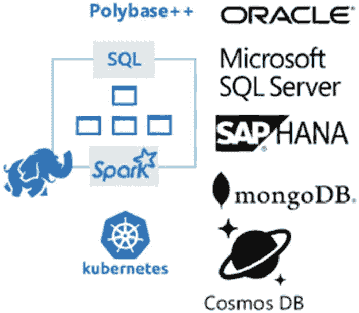

*图 10-1*

对这个信息图更准确的表述是 `对您所有数据的智能处理`。这是因为图 10-1 背后的功能远不止 Polybase++。随着你阅读本章，你会更多地理解我所说的 `对您所有数据的智能处理` 是什么意思。

图 10-1 简洁地概括了 `SQL Server 大数据群集 (BDC)` 的核心，但它不可能展示其全部潜力。始于我在第 1 章描述的 Project Aris 的这个项目，已经发展成为一个 `产品中的产品`，并且是 SQL Server 2019 最引人入胜的亮点之一。

既然我在第 1 章就从谈论 Project Aris 和图 10-1 中的这个信息图开始，为什么 SQL Server 大数据群集要放在第 10 章这么靠后呢？

在我规划这本书时，原本打算将 BDC 作为第一章，作为开场的重头戏！然而，当我更深入地思考全书的结构后，将其作为后面的章节之一是有道理的，原因如下：

*   我希望你首先学习 SQL Server 2019 在 Linux、容器、Kubernetes 和 Polybase 方面的基础知识，这将有助于你理解 BDC。这就是为什么这些主题分布在第 6、7、8 和 9 章。
*   你会看到 BDC 的一部分是一个 `SQL Server 主实例`。当你看到 `SQL Server 主实例` 时，我希望你已经熟悉 BDC 的该组件随附的 SQL Server 2019 其他核心功能。
*   BDC 是一项重大工程，需要众多团队成员设计、构建和编码。因此，它是在我们的 CTP 版本和预览发布期间，SQL Server 2019 中功能完善最晚、最大的组件。我希望尽可能等到书稿完成时再定稿，以便为你提供关于 BDC 最新、最准确的信息，包括它的用途和工作原理。

在本章中，你将了解为什么 BDC 能为当今的数据专业人士解决一些有趣的挑战：

*   正如我在第 9 章关于 Polybase 的描述中所说，数据专业人士需要访问其组织中 SQL Server 之外的数据源。他们希望能够 `以很少或无需数据移动` 的方式访问来自各种来源的数据。
*   许多数据专业人士正在考虑投资 `大数据`。我将在下一节更详细地讨论 `大数据` 这个术语的一些清晰细节，但当这个术语出现时，它通常涉及一个由 `Hadoop` 驱动的系统。
*   有些组织从未投资过 `Hadoop`，因此希望获得指导甚至自动化部署一个 `Hadoop` 系统来存储非结构化或半结构化数据。这类数据通常是 `高容量数据`，而存储在其 SQL Server 中的数据则被视为 `高价值数据`。
*   此外，许多组织需要更严格地保护和管理 `Hadoop` 系统，就像他们今天对 SQL Server 所做的那样。他们希望有一个完整的生态系统来构建一个易于部署、安全且可扩展的 `数据湖`，并充分利用 SQL Server 和大数据两方面的现代技术优势。


## 大数据集群简介

各组织希望在机器学习（ML）上投入更多，并希望构建和部署可扩展、安全且靠近驱动 ML 模型的数据源运行的 ML 应用程序。我听到客户说，他们想要一个*端到端机器学习平台*。

图 10-2 是我们用来阐述大数据集群试图解决的三大解决方案领域的可视化图表。

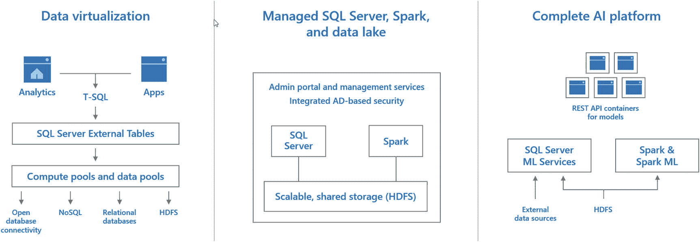

图 10-2

`大数据集群`解决方案

在本章中，我打算回答以下问题：

*   我们**为什么**称其为大数据集群？
*   部署大数据集群后，您能获得**哪些**功能？
*   如何**部署**大数据集群？
*   大数据集群的架构是什么，它**如何工作**？
*   如何**使用**大数据集群？
*   如何**使用大数据集群进行机器学习**？
*   如何**管理和监控**大数据集群？

这似乎足够单独写成一本书了，所以我无法深入探讨一切。但是，我将探讨一些文档中没有但我认为您应该知道的细节。我还将从我的角度给出示例和提示，说明为什么 `BDC` 是 SQL Server 2019 的一个重要解决方案。

## 注意

在本章中，我有时会提到我的同事 Buck Woody 制作的一个研讨会中的陈述或示例，该研讨会名为 `研讨会：SQL Server 大数据集群 – 架构`，您可以在 [`https://github.com/Microsoft/sqlworkshops/tree/master/sqlserver2019bigdataclusters`](https://github.com/Microsoft/sqlworkshops/tree/master/sqlserver2019bigdataclusters) 找到它。它是补充本章内容的一个极佳资源。

## 为什么是大数据集群？

我相信我们团队会有很多理由说我们称这个解决方案为 SQL Server 大数据集群。对我来说，答案很简单。我们通过这个解决方案部署和结合了三大技术：

*   **SQL Server** – SQL Server 将成为访问集群中数据的中心。这是完整的 SQL Server 产品，包含了我在这本书中描述的所有功能，运行在一个基于 Linux 操作系统镜像的容器中。
*   **大数据** – 我们为您部署大数据技术，如 `HDFS` 和 `Spark`。
*   **集群** – 我们使用 `Kubernetes` 集群来部署和运行不同的容器，以提供一个完整的端到端系统。

当您在接下来的几节中阅读更多内容时，关于我们将如何集成这些技术的细节会逐渐清晰。

我认为描述一下我对*大数据*这个术语的看法，以及为什么我们认为将其包含在大数据集群解决方案中很重要，这一点很关键。我在微软的同事 Buck Woody 就大数据主题撰写了一篇出色的博客文章，地址是 [`https://buckwoody.wordpress.com/2019/08/26/big-data-is-just-data/`](https://buckwoody.wordpress.com/2019/08/26/big-data-is-just-data/)。

我喜欢这个对大数据术语的描述，“大数据是任何您无法在想要的时间内用现有系统处理的数据。”这对 SQL Server 意味着，您的组织中可能有一些数据，也许不太适合存储在像 SQL Server 这样的关系数据库管理系统（`RDBMS`）中。这可能有各种原因，包括规模、结构、数据来源以及转换为关系表的复杂性。

阅读最初 Hadoop 项目的起源很有趣。Hadoop 的创始人最初希望有一个文件系统，能够以分布式方式在商用硬件集群上存储海量数据。他们称之为 Google 文件系统（这其实是一个更复杂的故事；您可以在 [`https://en.wikipedia.org/wiki/Apache_Hadoop#History`](https://en.wikipedia.org/wiki/Apache_Hadoop%2523History) 阅读更多关于 Hadoop 的历史）。那个最初项目的目标就是解决 Buck 为大数据术语所定义的问题。

通过 SQL Server 大数据集群，我认为我们真正提供的是一个*单一系统*，让您拥有数据存储和处理的*两个世界*。我们为您部署 SQL Server 来存储和访问以关系格式（表）存储的数据。同时，我们部署一个 Hadoop 分布式文件系统（`HDFS`）集群，允许您以非结构化或半结构化文件格式存储数据。让这个系统特别的关键成分在于它们是*集成*的。在 `Polybase` 的帮助下，您可以将来自 SQL Server（以及 Oracle、Teradata 和 MongoDB 等其他来源）的表与 `HDFS` 文件进行连接，这种方法是无缝的，并且具有可扩展的性能。

这个故事还有更多内容；在下一节中，我将确切描述部署 SQL Server 大数据集群后您能获得什么价值。

## 大数据集群包含什么？

我将 SQL Server 大数据集群（`BDC`）描述为产品中的产品。这是因为当您部署 `BDC` 时，您会获得丰富的功能，包括以下内容。

### SQL Server 2019

`BDC` 附带一个使用 Linux 操作系统镜像在容器中运行的*完整* SQL Server 2019 实例。这意味着 SQL Server 2019 for Linux 的所有功能也都包含在 `BDC` 中。这将包括 Active Directory 身份验证和使用 Always On 可用性组的高可用性。

### Polybase

SQL Server 的 `Polybase` 功能在安装 `BDC` 时会自动安装并启用。这意味着您将获得用于 SQL Server、Oracle、Teradata、MongoDB 和 Hadoop 的内置连接器。此外，`BDC` 附带*特殊连接器*，可以以优化的方式访问集群内的 `HDFS` 文件和数据缓存。再者，尽管 Linux 上的 SQL Server 2019 不支持 `Polybase 横向扩展组`，但 `BDC` 通过使用称为*计算池*的概念实现了 `Polybase 横向扩展组`，我将在“大数据集群架构”一节中详细讨论。

### Hadoop 分布式文件系统 (HDFS)

`BDC` 将使用开源 Apache Hadoop 部署一个 `HDFS` 存储集群。您将有几种不同的方式可以访问 `BDC` 中 `HDFS` 集群里存储的文件，包括通过 SQL Server 的 `Polybase`。我们还提供了一种方法，让您可以将您自己的外部 `HDFS` 存储挂载到 `BDC` 中的本地 `HDFS` 存储，这个概念我们称之为*HDFS 分层*。

### Spark

`BDC` 安装 Apache `Spark` 以提供另一种分析和处理数据的方法。我喜欢 Buck Woody 对 `Spark` 的定义：“Apache Spark 是一个用于处理大规模数据的分析引擎。它可以与存储在 `HDFS` 中的数据一起使用，并且也有连接器可用于处理 SQL Server 中的数据。”您将通过 Spark 作业与集群内的数据进行交互。我将在标题为“使用 Spark”的部分更详细地讨论如何在 `BDC` 中使用 `Spark`。

### 数据缓存

我们的文档说我们提供了一个*数据集市*，我认为这个术语在技术上是正确的。对我来说，我们真正提供的是一个*数据缓存*。我称它为数据缓存，因为我们提供了一组专门优化的 SQL Server 实例，用于存储针对 `Polybase` 外部数据源查询的结果。设想一下这样的场景：您希望*存储一组结果*，每周刷新一次，用于报告目的。这些结果可能来自使用许多不同数据源的 `Polybase` 查询，而我们在 `BDC` 中的数据缓存是解决这个问题的完美方案。我们在一个称为*数据池*的组件中实现数据缓存，我将在“大数据集群架构”一节中更详细地解释。


### 工具与服务

为了帮助您部署、使用和管理大数据集群，我们提供了一套作为解决方案一部分的可用工具。您会发现，本书中已使用的 Azure Data Studio 工具将是整个 BDC 工具解决方案的关键部分，包括对 `Notebooks` 的支持。此外，我们部署了一组容器作为 `services` 来帮助协调和管理大数据集群。文档称这些服务为 `Controller`，您将在本章的几个部分了解更多关于控制器工作原理的信息。

### 端点

您需要能够连接到大数据集群以执行所有类型的任务，因此我们提供了一系列 `Service endpoints`。这将包括用于连接到 SQL Server、HDFS 和 Spark 的端点，以及多个管理和监控服务的端点。您将在本章剩余部分了解更多关于服务端点的信息。

### 应用程序部署

SQL Server 大数据集群允许您通过 T-SQL 语句和 Spark 作业执行代码。SQL Server Machine Learning Services 和 Extensibility 还允许您运行与 SQL Server 集成的 R、Python 和 Java 代码。由于大数据集群部署在 Kubernetes 集群中，我们希望为开发人员提供一种方法，以便在大数据集群中部署应用程序，提供一个暴露的接口来与这些应用程序交互，并允许应用程序访问大数据集群中连接的数据源，例如 SQL Server 表和外部表。因此，大数据集群提供了 `Application Deployment` 的概念，供您部署 R、Python、MLeap 和 SSIS 应用程序。应用程序部署是将大数据集群用作端到端机器学习平台的关键要素。我将在本章后面的“使用大数据群集”一节中更详细地讨论应用程序部署。

### 机器学习

我曾告诉您，大数据集群提供的解决方案之一是端到端机器学习平台。大数据集群通过以下能力实现这一点：

*   SQL Server Machine Learning Services
*   SparkML
*   MLeap
*   Machine Learning packages
*   Application Deployment

我将在本章后面的“机器学习与大数据群集”一节中更详细地讨论这些内容。

回顾这个列表！您现在能看出为什么 SQL Server 大数据集群是“产品中的产品”了吗？这个故事还有更精彩的部分。请继续阅读。

## 注意

Buck Woody 的 `Workshop: SQL Server Big Data Clusters – Architecture` 在模块 2.0 中有一个描述大数据集群组件的优秀页面。请将此作为另一个资源来研究大数据集群的内容。

## 示例的先决条件

在我开始讨论部署之前，让我先描述一下如何找到本章中将使用的示例。我将不提供具体的示例和脚本，而是使用来自以下来源的几个示例：

*   `SQL Server Samples GitHub Repo` – 我将使用并讨论位于 [`https://github.com/Microsoft/sql-server-samples/tree/master/samples/features/sql-big-data-cluster`](https://github.com/Microsoft/sql-server-samples/tree/master/samples/features/sql-big-data-cluster) 的几个示例。
*   `SQL Server 2019 Big Data Cluster Workshop` – Buck Woody 在 [`https://github.com/Microsoft/sqlworkshops/tree/master/sqlserver2019bigdataclusters`](https://github.com/Microsoft/sqlworkshops/tree/master/sqlserver2019bigdataclusters) 提供了一些我将使用的优秀示例。

使用这些示例需要满足以下条件：

*   一个已部署的 SQL Server 2019 大数据集群。在我撰写本书本章时，我使用的是 SQL Server 2019 Release Candidate，它非常接近 SQL Server 2019 的最终版本。我将在下一节“部署大数据群集”中详细讨论要求，包括客户端工具。
*   一个 Windows、macOS 或 Linux 客户端，用于部署和运行示例脚本或 T-SQL 查询。几乎所有的部署工具和示例工具都可以在 Windows、macOS 和 Linux 上运行。我还建议您安装并使用 Azure Data Studio (ADS)，您可以从 [`https://docs.microsoft.com/en-us/sql/azure-data-studio/download`](https://docs.microsoft.com/en-us/sql/azure-data-studio/download) 下载。ADS 和笔记本电脑的使用是成功使用大数据群集的关键。

## 部署大数据群集

我将向您展示我部署 SQL Server 大数据集群的经验，以便向您展示其组件和架构。很难决定是先展示架构还是先展示部署。我认为先进行部署然后再描述部署了什么很重要，我建议您也这样做。

## 注意

大数据集群中的所有软件都作为容器部署在 Kubernetes 集群中。大数据集群依赖于您部署自己的 Kubernetes 集群，但也提供了工具来帮助将 k8s 部署作为一个选项。

### 计划部署

部署需要一些规划。让我描述一下我计划如何部署大数据集群的经验，因为它可能对您的规划工作有所帮助。如果您正在计划大数据集群的生产部署，我建议您通读本章后面的“为生产配置部署”一节。

#### 决定 k8s

部署大数据集群时要做的第一个决定是选择 Kubernetes (k8s) 发行版和位置。大数据集群支持部署在公共云提供商的 k8s 上，例如 `Azure Kubernetes Service` (AKS)，或部署在您自己的 Linux 服务器或虚拟机上的 k8s（例如，如果您自己使用 kubeadm 部署了 k8s）。我预计随着 SQL Server 2019 及更高版本的发布，大数据集群将支持其他知名 k8s 提供商的列表会增加，包括 Azure Stack、Red Hat OpenShift 等。在我撰写本书时，您可以在 Windows Server 上的 k8s 部署上技术性地部署大数据集群，但这种场景需要在 Windows Server 上运行 Linux 虚拟机来运行 k8s。

我们的部署大数据集群的工具将在 k8s 中创建一系列包含容器的 Pod（在大多数情况下，Pod 将包含多个容器）以支持大数据集群系统。我们还将部署和使用其他 k8s 对象，例如 Load Balancer、Persistent Volume Claim、ReplicaSet 和 StatefulSet 对象。

一旦决定了 k8s 选择，您可以自己部署 k8s，或者使用我们构建的脚本来同时部署 k8s 和大数据集群。

对于这两种选项，仅用于“开发/测试”大数据集群的基本要求是一个 Linux 虚拟机 (VM) 或计算机（对于 AKS，选择 VM 大小），具备以下资源：

```
*   64Gb RAM。
*   8 个 CPU（可以是逻辑 CPU）。
*   对于 AKS，一个支持至少 24 个磁盘的 Azure VM 大小。
*   如果您计划部署多个大数据集群节点，每个节点（VM）都需要满足这些资源要求。
```

## 注意

Slava Oks 和我讨论过需要减少大数据集群“开发者版”的占用空间，使其不需要那么多 RAM。我告诉 Slava，理想情况下我可以在我的笔记本电脑上部署一个大数据集群，仅仅用于测试基本功能。

我们的脚本和笔记本默认选择 Azure VM 大小为 Standard_L8s_v2，但是，只要您为 AKS 选择具有 64Gb、8 个 CPU 和 24 个磁盘的 Azure VM，部署就应该可以工作。您可以在 [`https://docs.microsoft.com/en-us/azure/virtual-machines/linux/sizes-general`](https://docs.microsoft.com/en-us/azure/virtual-machines/linux/sizes-general) 阅读更多关于 Azure VM 大小的信息。

就我的部署经验而言，我将使用 AKS 并使用我们提供的脚本，该脚本将一次性部署 AKS 集群和大数据集群。我建议您在规划部署时阅读以下文档资源：

[`https://docs.microsoft.com/en-us/sql/big-data-cluster/deploy-get-started`](https://docs.microsoft.com/en-us/sql/big-data-cluster/deploy-get-started)

[`https://docs.microsoft.com/en-us/sql/big-data-cluster/deployment-guidance`](https://docs.microsoft.com/en-us/sql/big-data-cluster/deployment-guidance)


#### 选择客户端与下载工具

一旦你决定了 k8s 策略，就需要工具来部署 BDC。在尝试部署 BDC 之前，确保在客户端上安装了所有正确的工具至关重要。文档在 [`https://docs.microsoft.com/en-us/sql/big-data-cluster/deploy-big-data-tools`](https://docs.microsoft.com/en-us/sql/big-data-cluster/deploy-big-data-tools) 提供了所需工具列表。对于我的客户端，我选择了我的“云端笔记本电脑”。这意味着我在一个 Azure 虚拟机中安装了 Windows 10，并在那个 VM 中进行了所有的 BDC 操作。

工具列表包括以下内容：

`python` – `python` 是几个不同工具使用的关键组件，可在所有操作系统平台上使用。安装 BDC 所需的 `azdata` 工具就是用 `python` 编写的。我需要 `python`，因为我使用了一个 `python` 脚本来一步部署 AKS 和 BDC。对于 Windows 版的 `python`，我只是从 [`www.python.org/downloads/release/python-374/`](https://www.python.org/downloads/release/python-374/) 下载最新的 `python` 版本。

`kubectl` – 正如你在第 8 章所学，`kubectl` 是一个专门设计用来向 k8s API 服务器发送请求的工具。这是你与 Kubernetes 的编程接口。

我已经在 Windows 机器上安装了 `kubectl`；我检查了版本，是 1.14。文档说明指出：“你必须使用 1.10 或更高版本的 `kubectl`。此外，`kubectl` 的版本应该比你的 Kubernetes 集群的次要版本高或低一个版本。”因为我使用的是 AKS，我检查了命令以查看我的 AKS 部署中将使用哪些版本，发现支持的最高版本是 1.14.6 – 所以我应该可以继续。你可以在 [`https://docs.microsoft.com/en-us/azure/aks/supported-kubernetes-versions`](https://docs.microsoft.com/en-us/azure/aks/supported-kubernetes-versions) 找到更多关于检查你的集群上是否支持 AKS 版本的信息。

`azdata` – 这个工具在 SQL Server 2019 的早期预览版中称为 `mssqlctl`，对于部署和管理 BDC 是*至关重要*的。它用 `python` 编写，你应该把 `azdata` 看作是 BDC 的“`kubectl`”。

为了验证我是否正确安装了 `azdata`，我只是从命令行运行 `azdata` 来看看接口是什么样子。结果如图 10-3 所示。

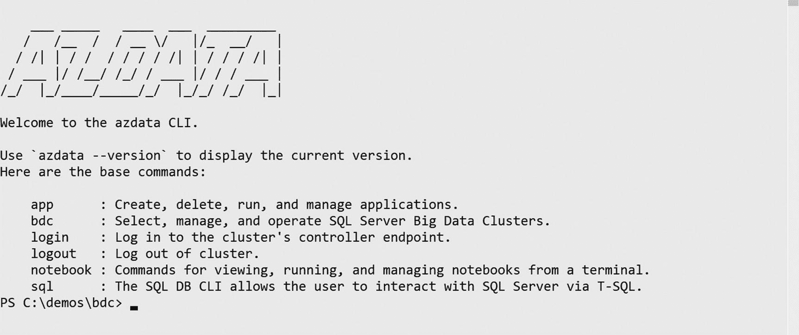
*图 10-3：`azdata` CLI*

你可以在 [`https://docs.microsoft.com/en-us/sql/big-data-cluster/reference-azdata`](https://docs.microsoft.com/en-us/sql/big-data-cluster/reference-azdata) 查看完整的 `azdata` 参考文档。

Azure Data Studio (ADS) – 这个跨平台的开源工具可用于查询、部署、管理和导航 BDC 的数据。虽然 SQL Server Management Studio (SSMS) 可用于连接到 BDC 中的 SQL Server 主实例，但 ADS 具有专为 BDC 设计的功能和扩展，包括对 Notebook 的支持。

我使用了来自 [`https://github.com/microsoft/azuredatastudio#try-out-the-latest-insiders-build-from-master`](https://github.com/microsoft/azuredatastudio%2523try-out-the-latest-insiders-build-from-master) 的 ADS Insiders 构建版本，但我预计在 SQL Server 2019 发布时，你将获得一个包含 BDC 所需一切的公共 ADS 版本。你可以在 [`https://docs.microsoft.com/en-us/sql/azure-data-studio/download`](https://docs.microsoft.com/en-us/sql/azure-data-studio/download) 获取最新的 ADS 构建版本。

我还在 [`https://docs.microsoft.com/en-us/sql/azure-data-studio/sql-server-2019-extension`](https://docs.microsoft.com/en-us/sql/azure-data-studio/sql-server-2019-extension) 获取了最新的 SQL Server 2019 预览版扩展并安装了 vsix 文件。（你可以忽略关于第三方扩展的警告，因为该扩展来自微软。）很难知道它是否正常工作或已完成，但等几分钟，你会在右下角看到一条类似“扩展 `microsoft.sql-vnext` 安装完成”的消息。

`az` – 如果你使用 AKS，你将需要 Azure 命令行界面来登录 Azure 并部署和管理 AKS。

`curl` – `curl` 代表“Client URL”，是一个流行的工具，用于从特定 URL 复制数据，通常是存储在网站上的文件。对我来说，`curl` 随 Windows 10 一起提供。`curl` 是一个很棒的工具，不仅可以将远程脚本复制下来与 BDC 一起使用，还可以将数据复制到 BDC HDFS 集群中。

#### 部署方法

现在你知道了要部署哪种类型的 k8s 集群，并已下载了所需的工具；你可以选择部署方法：

*   使用 `python` 的“单步”方法部署 AKS 和 BDC，你可以在 [`https://docs.microsoft.com/en-us/sql/big-data-cluster/quickstart-big-data-cluster-deploy`](https://docs.microsoft.com/en-us/sql/big-data-cluster/quickstart-big-data-cluster-deploy) 找到。
*   使用 `kubeadm` 在你的 k8s 集群上部署 k8s 和 BDC 的“单步” Bash shell 脚本，你可以在 [`https://docs.microsoft.com/en-us/sql/big-data-cluster/deployment-script-single-node-kubeadm`](https://docs.microsoft.com/en-us/sql/big-data-cluster/deployment-script-single-node-kubeadm) 找到。
*   首先创建你自己的 AKS 或 k8s 集群，然后使用 `azdata` 工具部署 BDC，你可以在 [`https://docs.microsoft.com/en-us/sql/big-data-cluster/deployment-guidance`](https://docs.microsoft.com/en-us/sql/big-data-cluster/deployment-guidance) 阅读相关内容。
*   使用 Azure Data Studio (ADS) 将 BDC 部署到新的 AKS 集群、现有的 AKS 集群或你已使用 `kubeadm` 部署的现有 k8s 集群。

图 10-4 展示了如何在 ADS 中访问此部署体验。
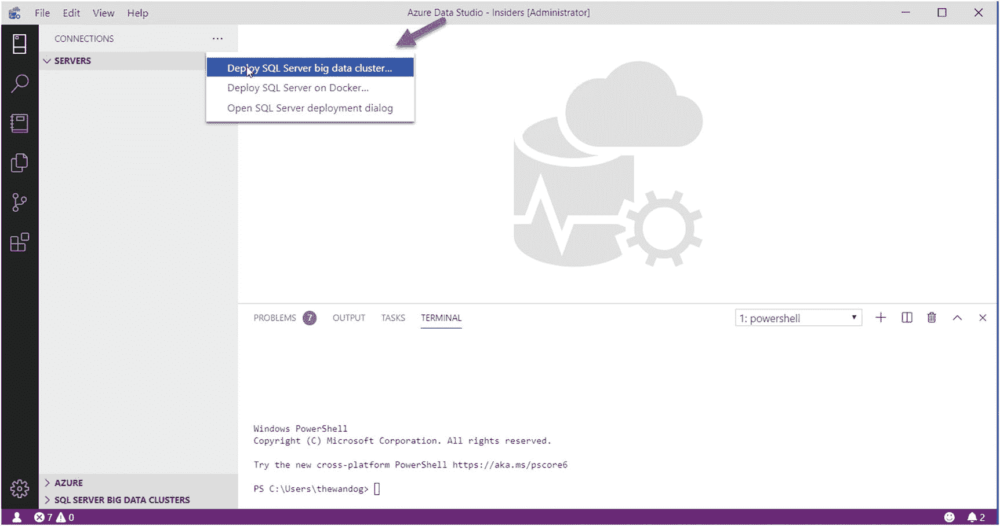
*图 10-4：在 Azure Data Studio 中选择部署 BDC*

图 10-5 展示了选择你的部署方法的体验。
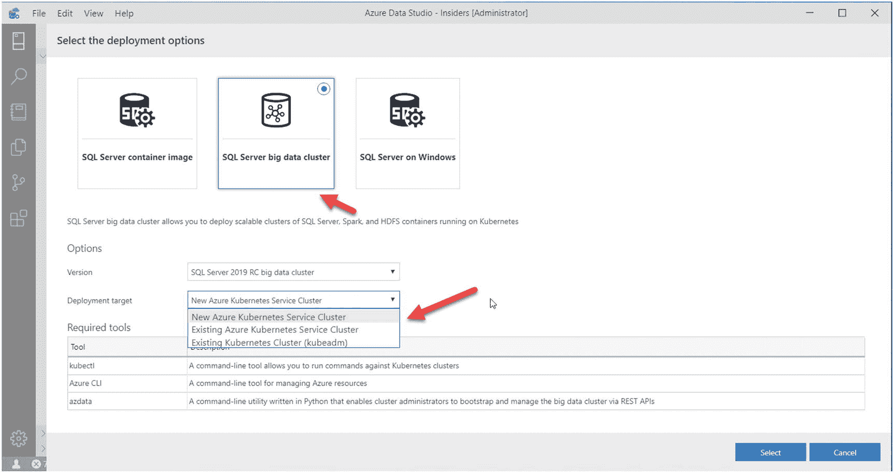
*图 10-5：Azure Data Studio 中 BDC 的部署选项*

#### 离线部署

我想提一下，如果你需要离线部署体验，因为你的 k8s 集群没有连接到互联网（至少在你需要部署 BDC 的时候），我们已经记录了如何拉取我们的容器镜像并在 k8s 上部署 BDC。你仍然需要本章描述的所有工具来进行离线部署。你可以在 [`https://docs.microsoft.com/en-us/sql/big-data-cluster/deploy-offline`](https://docs.microsoft.com/en-us/sql/big-data-cluster/deploy-offline) 阅读详细信息。


### BDC 部署体验

为了分享我对 BDC 部署体验的看法，我将把 BDC 部署到 AKS 上，并使用提供的 Python 脚本作为“一步式”解决方案。您可以在 [`https://docs.microsoft.com/en-us/sql/big-data-cluster/quickstart-big-data-cluster-deploy`](https://docs.microsoft.com/en-us/sql/big-data-cluster/quickstart-big-data-cluster-deploy) 阅读如何使用此解决方案的详细信息。

除了我需要将 AKS 和 BDC 群集部署在 `eastus2` 区域之外，其余我都选择了默认值。

Python 脚本实际上是 `az` 和 `azdata` 的包装器。它使用您的选择（或环境变量或默认值）来创建 Azure 资源组、AKS 群集和 BDC。BDC 是使用 `aks-dev-test` 配置创建的。这是 BDC 的基本配置，非常适用于开发或测试场景。我将在本章后面的“为生产环境配置部署”一节中讨论生产部署的配置。

部署需要时间！BDC 解决方案需要部署许多 Pod 和容器，如果您还部署了 k8s 群集，这个过程将需要更长时间。对我来说，使用 Python 脚本和 AKS 的总部署时间约为 20 分钟，但我见过它需要长达一个小时的情况。

当您运行 Python 脚本时，您将收到类似以下的消息：

```
Creating azure resource group: 

Creating AKS cluster: 

Creating SQL Big Data cluster:mssql-cluster
custom\bdc.json created
custom\control.json created
The privacy statement can be viewed at:
https://go.microsoft.com/fwlink/?LinkId=853010
The license terms for SQL Server Big Data Cluster can be viewed at:
https://go.microsoft.com/fwlink/?LinkId=2002534
Cluster deployment documentation can be viewed at:
https://aka.ms/bdc-deploy
NOTE: Cluster creation can take a significant amount of time depending on
configuration, network speed, and the number of nodes in the cluster.
Starting cluster deployment.
Waiting for cluster controller to start.
```

最后一条消息 `Waiting for cluster controller to start` 是一条关键消息，可能会重复出现几次。`controller` 是首先在 k8s 群集中创建的，`controller service` 将用于部署 BDC 的其余部分。

然后您将看到类似这样的消息：

```
Cluster controller endpoint is available at :
Cluster control plane is ready.
```

很快您将看到这些消息：

```
Data pool is ready.
Master pool is ready.
Compute pool is ready.
Storage pool is ready.
Cluster deployed successfully.
```

最后一条消息意味着 AKS 和 BDC 都已成功部署。我采用“信任但验证”的原则，因此，在下一节中，我将讨论如何验证部署是否成功以及您是否准备好使用 BDC。

## 注意事项

`Creating SQL Big Data cluster:mssql-cluster` 中提供的名称将成为 BDC 创建的所有对象的 Kubernetes 命名空间。因此，在我的部署中，`mssql-cluster` 是 k8s 命名空间。

## 验证部署

我使用以下方法对 AKS 和 BDC 的成功部署进行了“完整性检查”：

*   按照以下步骤使用 `kubectl` 检查群集：[`https://docs.microsoft.com/en-us/sql/big-data-cluster/quickstart-big-data-cluster-deploy?view=sqlallproducts-allversions#inspect-the-cluster`](https://docs.microsoft.com/en-us/sql/big-data-cluster/quickstart-big-data-cluster-deploy%3Fview%3Dsqlallproducts-allversions%23inspect-the-cluster)。

*   使用 `azdata` 登录群集，找到控制器端点，然后连接到 SQL Server 以确保您可以连接到 SQL Server。请按照 [`https://docs.microsoft.com/en-us/sql/big-data-cluster/deployment-guidance?view=sqlallproducts-allversions#endpoints`](https://docs.microsoft.com/en-us/sql/big-data-cluster/deployment-guidance%3Fview%3Dsqlallproducts-allversions%23endpoints) 中的步骤操作。
    查找名为 `SQL Server Master Instance Front-End` 的端点。该端点是连接到 SQL Server 的 IP 地址和端口。
    请按照以下文档页面中的指导，使用 Azure Data Studio (ADS) 连接到 BDC 中的 SQL Server：
    [`https://docs.microsoft.com/en-us/sql/big-data-cluster/connect-to-big-data-cluster`](https://docs.microsoft.com/en-us/sql/big-data-cluster/connect-to-big-data-cluster)
    我在 ADS 中对我的 BDC 进行的基本连接测试如图 10-6 所示。


## 注意

我在部署 BDC 时使用的是 ADS 的 Insider 版本，因此随着 SQL Server 2019 的正式发布，此界面的一部分内容可能会发生变化。

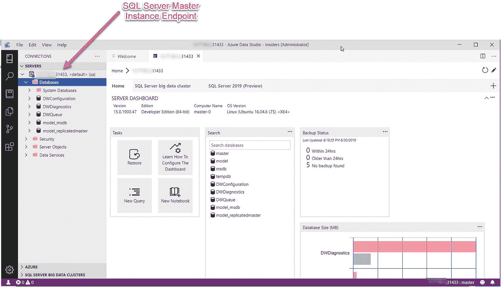

图 10-6：部署后连接到 BDC 中的 SQL Server。

使用以下命令验证 BDC 的整体状态：

```
azdata bdc status show
```

我的 BDC 集群结果如下所示：

```
Mssql-cluster: ready                                         Health Status:  healthy
 =============================================================================
 Services: ready                                              Health Status:  healthy
 -----------------------------------------------------------------------------
 Servicename  State  Healthstatus  Details
 sql          ready  healthy       -
 hdfs         ready  healthy       -
 spark        ready  healthy       -
 control      ready  healthy       -
 gateway      ready  healthy       -
 app          ready  healthy       -
 Sql Services: ready                                          Health Status:  healthy
 -----------------------------------------------------------------------------
 Resourcename  State  Healthstatus  Details
 master        ready  healthy       StatefulSet master is healthy
 compute-0     ready  healthy       StatefulSet compute-0 is healthy
 data-0        ready  healthy       StatefulSet data-0 is healthy
 storage-0     ready  healthy       StatefulSet storage-0 is healthy
 Hdfs Services: ready                                         Health Status:  healthy
 -----------------------------------------------------------------------------
 Resourcename  State  Healthstatus  Details
 nmnode-0      ready  healthy       StatefulSet nmnode-0 is healthy
 storage-0     ready  healthy       StatefulSet storage-0 is healthy
 sparkhead     ready  healthy       StatefulSet sparkhead is healthy
 Spark Services: ready                                        Health Status:  healthy
 -----------------------------------------------------------------------------
 Resourcename  State  Healthstatus  Details
 sparkhead     ready  healthy       StatefulSet sparkhead is healthy
 storage-0     ready  healthy       StatefulSet storage-0 is healthy
 Control Services: ready                                      Health Status:  healthy
 -----------------------------------------------------------------------------
 Resourcename  State  Healthstatus  Details
 controldb     ready  healthy       -
 control       ready  healthy       -
 metricsdc     ready  healthy       DaemonSet metricsdc is healthy
 metricsui     ready  healthy       ReplicaSet metricsui is healthy
 metricsdb     ready  healthy       StatefulSet metricsdb is healthy
 logsui        ready  healthy       ReplicaSet logsui is healthy
 logsdb        ready  healthy       StatefulSet logsdb is healthy
 mgmtproxy     ready  healthy       ReplicaSet mgmtproxy is healthy
 Gateway Services: ready                                      Health Status:  healthy
 -----------------------------------------------------------------------------
 Resourcename  State  Healthstatus  Details
 gateway       ready  healthy       StatefulSet gateway is healthy
 App Services: ready                                          Health Status:  healthy
 -----------------------------------------------------------------------------
 Resourcename  State  Healthstatus  Details
 appproxy      ready  healthy       ReplicaSet appproxy is healthy
```

如果并非所有项都显示为健康，请考虑使用以下文档来对集群进行故障排除：[`https://docs.microsoft.com/en-us/sql/big-data-cluster/cluster-troubleshooting-commands`](https://docs.microsoft.com/en-us/sql/big-data-cluster/cluster-troubleshooting-commands)。

### 配置生产环境部署

我的部署经验使用了随 `azdata` 工具附带的一种*配置*，该配置是为开发或测试集群设计的。`azdata` 的配置通过 JSON 文件定义，用于控制集群内的各种资源定义。你可以使用以下命令查看这些配置的列表：

```
azdata bdc config list
```

配置的 JSON 文件与我在第 8 章中向你展示的 Kubernetes YAML 文件非常相似。在这种情况下，JSON 文件具有 `azdata` 工具可识别的格式（就像 YAML 文件具有 `kubectl` 可识别的格式一样）。

为了查看可以配置 BDC 部署的选项，你可以运行类似以下的命令来查看 `aks-dev-test` 默认配置是如何部署的：

```
azdata bdc config init --source aks-dev-test --target custom
```

此命令创建一个名为 `custom` 的新文件夹，并将名为 `bdc.json` 和 `control.json` 的文件存储在此目录中。你可以修改这些文件，然后运行类似以下的命令来使用这些所需的配置设置创建一个新的 BDC：

```
azdata bdc create --config-profile custom --accept-eula yes
```

文档 [`https://docs.microsoft.com/en-us/sql/big-data-cluster/deployment-guidance?view=sqlallproducts-allversions#customconfig`](https://docs.microsoft.com/en-us/sql/big-data-cluster/deployment-guidance%253Fview%253Dsqlallproducts-allversions%2523customconfig) 中讨论了这种方法。

为了了解如何修改 BDC JSON 文件，你需要了解更多架构知识，我将在下一节“大数据集群架构”中进行描述。届时，你可能需要返回本节，更仔细地研究 JSON 文件以及相应修改它们的技巧。一旦你对需要修改的内容有了一些想法，可以参考我们文档中关于如何修改 BDC JSON 文件的指南 [`https://docs.microsoft.com/en-us/sql/big-data-cluster/deployment-custom-configuration`](https://docs.microsoft.com/en-us/sql/big-data-cluster/deployment-custom-configuration)。BDC JSON 文件的完整部署配置参考可以在 [`https://docs.microsoft.com/en-us/sql/big-data-cluster/reference-deployment-config`](https://docs.microsoft.com/en-us/sql/big-data-cluster/reference-deployment-config) 找到。你还应该研究我们的 Python 和 bash “自动部署”脚本，以了解如何创建 `k8s` 和 `BDC`。

`python` – [`https://docs.microsoft.com/en-us/sql/big-data-cluster/quickstart-big-data-cluster-deploy`](https://docs.microsoft.com/en-us/sql/big-data-cluster/quickstart-big-data-cluster-deploy)

`bash` – [`https://docs.microsoft.com/en-us/sql/big-data-cluster/deployment-script-single-node-kubeadm`](https://docs.microsoft.com/en-us/sql/big-data-cluster/deployment-script-single-node-kubeadm)

这些脚本假设使用一个 Kubernetes (`k8s`) 节点。在生产 `k8s` 集群中，你可能希望使用多个节点。然后，你可以在 [`https://docs.microsoft.com/en-us/sql/big-data-cluster/deployment-custom-configuration`](https://docs.microsoft.com/en-us/sql/big-data-cluster/deployment-custom-configuration) 决定如何将 `BDC` 的各个组件放置在特定的 `k8s` 节点上。

为生产环境配置 `BDC` 的另一个重要方面是存储。我们的文档提供了关于如何为生产环境配置 `BDC` 存储以匹配你的 `k8s` 存储配置的指南，请访问 [`https://docs.microsoft.com/en-us/sql/big-data-cluster/concept-data-persistence`](https://docs.microsoft.com/en-us/sql/big-data-cluster/concept-data-persistence)。`BDC` 中每一个具有有状态存储的 Pod 都使用一个单独的持久卷声明 (`PVC`)。你可以通过执行以下命令获取 `BDC` 中所有 `PVC` 对象的列表：

```
get PersistentVolumeClaim --namespace=mssql-cluster
```


部署 BDC 时另外两个重要方面是安全性和高可用性，我将在本章后面的“安全性”和“高可用性”小节中进行更详细的描述。

## 大数据集群架构

我将使用我部署的 BDC 来更详细地描述架构。我已经介绍了 BDC 包含哪些组件，但这更像是一个组件的“能力列表”。研究其架构很有趣，因为你可以准确地看到我们安装了哪些 Pod 和容器。你从第 7 和 8 章获得的知识在这里将变得重要。

## 注意

如果你想开始使用 BDC，请转到下一节“使用大数据集群”。我认为本节关于架构的内容是本章的“400 级”部分。在了解了 BDC 的使用方面后，你随时可以返回来阅读本节。你应该知道，我们构建 BDC 时已考虑到你无需了解架构的每个细节。本节中的任何细节都可能随时更改。我将向你展示一些“幕后”细节，这些细节当然会随着时间的推移而发生变化。

让我们以图 10-7 作为 SQL Server 大数据集群 (BDC) 的整体架构。

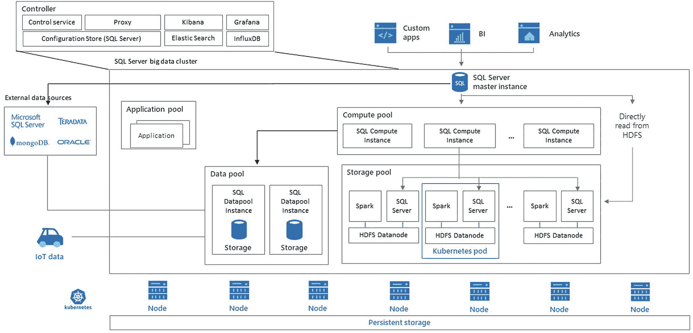

图 10-7

SQL Server 大数据集群架构

请注意，在此图中使用了术语 `pool`。在 BDC 中，`pool` 是一个逻辑术语，代表一组服务于 BDC 中特定用途的 Pod。我在本章前面已经提到过其中一些池，如计算池和数据池。我将在本节中更详细地描述哪些 Pod 和容器组成了这些池。

让我们分解图 10-7 的每个部分来描述 BDC 架构，使用各种命令和图示。一种分解架构的方式是从 `k8s perspective` 出发。

当我运行这个命令时，我得到 BDC 在我的单节点 k8s 集群上部署的所有 Pod 的列表：

```
kubectl get pods --namespace mssql-cluster
```

结果是这个 Pod 列表及其状态：

```
NAME              READY   STATUS    RESTARTS   AGE
appproxy-q8zkk    2/2     Running   0          24h
compute-0-0       3/3     Running   0          24h
control-vjwjf     3/3     Running   0          24h
controldb-0       2/2     Running   0          24h
controlwd-l8fmp   1/1     Running   0          24h
data-0-0          3/3     Running   0          24h
data-0-1          3/3     Running   0          24h
gateway-0         2/2     Running   0          24h
logsdb-0          1/1     Running   0          24h
logsui-f42ln      1/1     Running   0          24h
master-0          3/3     Running   0          24h
metricsdb-0       1/1     Running   0          24h
metricsdc-gtrxn   1/1     Running   0          24h
metricsui-kwh4q   1/1     Running   0          24h
mgmtproxy-nc8tl   2/2     Running   0          24h
nmnode-0-0        2/2     Running   0          24h
sparkhead-0       4/4     Running   0          24h
storage-0-0       4/4     Running   0          24h
storage-0-1       4/4     Running   0          24h
```

基于此列表和我到目前为止描述的概念，你可能可以猜到一些 Pod 如何映射到图 10-7。`READY` 列中的数字显示了每个 Pod 中运行的容器数量。这意味着用于“开发/测试”的简单 BDC 集群大约有 43 个容器！

让我们使用此列表将 k8s 集群中的 Pod 映射到图 10-7 的组件，包括 `pools` 的概念。

### SQL Server 主实例

SQL Server 主实例由 Pod `master-0` 表示。在此 Pod 中运行的主要容器是一个 SQL Server Linux 容器。你可以使用以下命令来获取 BDC 如何部署 SQL Server 容器的详细信息：

```
kubectl describe pod master-0 --namespace mssql-cluster
```

我们组织 BDC 的一个重要方面是使用 Kubernetes 的标签。我在第 8 章中介绍了如何在 SQL Server 和 k8s 中使用标签。查看上述命令输出的这一部分：

```
Labels:             MSSQL_CLUSTER=mssql-cluster
app=master
controller-revision-hash=master-7bbc4d95fb
mssql.microsoft.com/sql-instance=master
plane=data
role=master-pool
statefulset.kubernetes.io/pod-name=master-0
type=sqlservr
```

你可以看到我们如何使用其中一些标签映射到 BDC 中的术语。例如，这两个标签很有意思：

```
plane=data
role=master-pool
```

如果你运行以下命令，你可以看到“数据平面”中的所有 Pod：

```
get pods --namespace mssql-cluster -lplane=data
```

在我的 BDC 上，我得到以下输出：

```
NAME             READY   STATUS    RESTARTS   AGE
appproxy-q8zkk   2/2     Running   0          24h
compute-0-0      3/3     Running   0          24h
data-0-0         3/3     Running   0          24h
data-0-1         3/3     Running   0          24h
master-0         3/3     Running   0          24h
nmnode-0-0       2/2     Running   0          24h
sparkhead-0      4/4     Running   0          24h
storage-0-0      4/4     Running   0          24h
storage-0-1      4/4     Running   0          24h
```

此列表代表了图 10-7 中的大部分主要组件，除了我将在下一节“控制器”中描述的 `Controller`。

如果你进一步查看前面 `kubectl describe pod` 命令的输出，你将看到 SQL Server 容器的详细信息，从以下开始：

```
Containers:
mssql-server:
```

如果你回顾第 8 章，在 k8s 中用于 SQL Server 的 Pod 所涉及的重要组件是

*   容器镜像
*   持久卷声明
*   密钥
*   负载均衡器
*   副本集

前面 `kubectl describe` 命令的输出显示了所有这些组件。

你可以在这个部分看到 SQL Server 容器的 `container image`（请记住我当时使用的是 SQL Server 2019 大数据集群版本）：

```
Image:          mcr.microsoft.com/mssql/bdc/mssql-server-data:2019-RC1-ubuntu
```

在输出的后面部分，你将看到一个 `mounts` 列表，它描述了挂载到 `PersistentVolumeClaim` 对象的持久化存储。

注意这个挂载：

```
/var/opt from data (rw)
```

以及这个 Volume

```
Volumes:
data:
Type:       PersistentVolumeClaim (a reference to a PersistentVolumeClaim in the same namespace)
ClaimName:  data-master-0
ReadOnly:   false
```

如果你还记得第 8 章，我向你展示了如何将像 `/var/opt` 这样的 SQL Server 目录映射到 PVC 对象。

你可以运行此命令来查看 PVC 对象的详细信息：

```
describe PersistentVolumeClaim data-master-0 --namespace=mssql-cluster
```

从这个输出中，你可以看到这个 PVC 对象绑定到 AKS 的默认 `StorageClass`，大小为 15Gb。当然，这对于存储你的 SQL Server 数据来说并不是很大，但这只是一个测试集群。如果你需要为自定义配置更改这些大小，你可以阅读我们的文档 [`https://docs.microsoft.com/en-us/sql/big-data-cluster/concept-data-persistence`](https://docs.microsoft.com/en-us/sql/big-data-cluster/concept-data-persistence) 来了解如何操作。


第 8 章中提到的 SQL Server 秘钥用于控制连接 SQL Server 的`sa`密码。BDC 的部署包含一个名为`MSSQL_SA_PASSWORD`的环境变量，在使用 Python 部署脚本时系统会提示我输入该密码。对于 SQL Server 主实例，我们创建了一个名为`mssql-sa-password`的秘钥。

如果你还记得在第 8 章中，我展示了如何为 pod 中的 SQL Server 创建一个`LoadBalancer`服务以连接到 SQL Server。我们的 BDC 部署工具会为 SQL Server 主实例创建一个这样的服务。要查看此服务的确切对象，你可以运行以下命令：

```
kubectl get service --namespace=mssql-cluster -lrole=master-pool
```

输出将显示`master-svc-external`服务以及一个外部 IP 和端口。

SQL Server pod 的最后一个组件是`ReplicaSet`。我在第 8 章向你展示了`ReplicaSet`如何为 k8s 上的 SQL Server 提供“基础高可用性”。对于 BDC，我们使用一个称为`StatefulSet`的概念，它提供与`ReplicaSet`类似的高可用性功能，但能力更强。在 BDC 中，除控制器外，所有 pod 都使用`StatefulSet`对象。`StatefulSet`对象允许对 pod 进行排序和扩展，是实现 BDC 稳健高可用性的关键组件。我将在本章后面的“高可用性”一节中更详细地讨论 BDC 的高可用性。

如果你查看`kubectl describe`命令的输出，你会看到这一部分：

```
Controlled By:      StatefulSet/master
```

你可以通过运行以下命令获取更多关于我们如何定义`StatefulSet`的信息：

```
kubectl describe StatefulSet master --namespace=mssql-cluster
```

你还会注意到在`master-0` pod 中有另外两个容器：

```
collectd:
fluentbit:
```

这些容器是 BDC 中每个 pod 的一部分，用于帮助收集管理和监控 BDC 所需的日志和指标。

我们的文档提供了关于 SQL Server 主实例的信息，位于 [`https://docs.microsoft.com/en-us/sql/big-data-cluster/concept-master-instance`](https://docs.microsoft.com/en-us/sql/big-data-cluster/concept-master-instance)。我将在本章后面的“使用大数据集群”一节中更详细地讨论如何使用 SQL Server 主实例。

### 控制器

控制器是一个逻辑术语，代表一组 pod 和容器。你可以使用以下命令找到控制器中的 pod 列表：

```
kubectl get pods --namespace mssql-cluster -lplane=control
```

以下是我的 BDC 部署中的 pod 列表：

```
NAME              READY   STATUS    RESTARTS   AGE
control-vjwjf     3/3     Running   0          38h
controldb-0       2/2     Running   0          38h
controlwd-l8fmp   1/1     Running   0          38h
gateway-0         2/2     Running   0          38h
logsdb-0          1/1     Running   0          38h
logsui-f42ln      1/1     Running   0          38h
metricsdb-0       1/1     Running   0          38h
metricsdc-gtrxn   1/1     Running   0          38h
metricsui-kwh4q   1/1     Running   0          38h
mgmtproxy-nc8tl   2/2     Running   0          38h
```

控制器也被称为控制平面，很类似于 Kubernetes 的控制平面概念（[`https://kubernetes.io/docs/concepts/#kubernetes-control-plane`](https://kubernetes.io/docs/concepts/%2523kubernetes-control-plane)）。图 10-8 展示了 BDC 控制平面组件的特写。

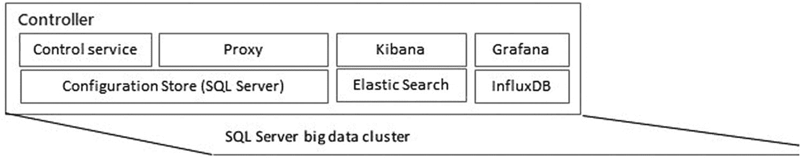

图 10-8
BDC 控制平面

你应该将控制器视为一组用于管理 BDC 的服务。管理的任务之一是部署，控制器用于帮助部署 BDC。一旦`azdata`部署了控制器，控制器就会“接管”并部署 BDC 的其他组件。控制平面中运行的所有 pod 都使用 k8s 的`ReplicaSet`概念来实现基础高可用性。

控制器最重要的组件之一是控制器服务（在图 10-8 中也列为控制服务）。控制器服务实际上是 BDC 的 API 服务器。该服务接受 REST API 以执行 BDC 的所有类型的操作，包括部署、管理、数据虚拟化等。你将使用几种不同的方法与控制器服务交互，包括`azdata`、T-SQL 外部表和 Azure Data Studio (ADS)。

在撰写本文时，尚无关于使用控制器服务特定 API 协议的公开文档。所有 API 都可以通过`azdata`、Azure Data Studio (ADS)和 T-SQL 语句访问。

### 提示

Azure Data Studio (ADS) 无需`azdata`即可连接并与 BDC 交互。因此，其开源代码中存在与控制器服务交互的 REST API 示例，位于 [`https://github.com/microsoft/azuredatastudio`](https://github.com/microsoft/azuredatastudio)。虽然你可以在源代码中阅读这些示例，但我不建议你依赖它们，因为我们可能会更改它们。此外，没有方法让你在 BDC 内安装程序并使用证书获得访问权限。

控制平面中的其他 pod 实现了支持各种服务连接的代理（proxy）、用于日志记录的 Kibana 和 Elasticsearch、用于指标和监控的 Grafana 和 InfluxDB，以及一个用于存储 BDC“元数据”的 SQL Server。

用于存储元数据的 SQL Server 容器是一个普通的 SQL Server 实例，但它是“私有的”。换句话说，你永远不能连接到这个实例。控制器容器使用这个 SQL Server 来读取管理和健康状况的重要数据，同时也用于 HDFS 查询功能。

我喜欢弄清楚事物的工作原理，因此我使用以下技术在这个特殊的 SQL Server 容器内运行了一个 Bash shell。托管此容器的 pod 名称为`controldb-0`。

我使用以下命令运行 Bash shell 并连接到 SQL Server 容器：

```
kubectl exec -it controldb-0 --namespace=mssql-cluster -- /bin/bash
```

这将我连接到 pod 中的第一个容器，即 SQL Server。事实证明，我们基于核心 SQL Server 镜像构建了这个 SQL Server 镜像，其中安装了`sqlcmd`。

我需要`sa`密码来使用`sqlcmd`，但它不是用于连接到 SQL Server 主实例的`sa`密码。它是一个仅由控制器使用的私有密码。我发现我们将`sa`密码的秘钥存储在容器内的`/var/run/secrets/credentials/mssql-sa-password/password`。使用该密码字符串，我使用`sqlcmd`连接并发现容器中安装了这些数据库：`health_system`、`controller`和`hive_metastore`。这些是 BDC 内部使用的数据库。这是一个用于内部 BDC 功能的 SQL Server 容器示例，与用于正常 SQL Server 用途以及通过 HDFS 和其他数据源进行数据虚拟化的 SQL Server 主实例不同。


### 存储池

我在第 9 章描述了 Polybase 如何允许你访问 SQL Server 之外的数据源，包括 HDFS 数据。通过 Polybase 访问 HDFS 会将 T-SQL 查询转换为 Java MapReduce 作业来访问 HDFS 数据。

BDC 为你部署了自己的 HDFS 集群，以便你既可以通过 Polybase 访问 HDFS 数据，也可以通过 **Knox Gateway**（ [`https://knox.apache.org/`](https://knox.apache.org/) ）经由 Controller 直接访问。

图 10-9 更详细地展示了 HDFS 集群在 BDC 中如何作为 *存储池* 进行部署。

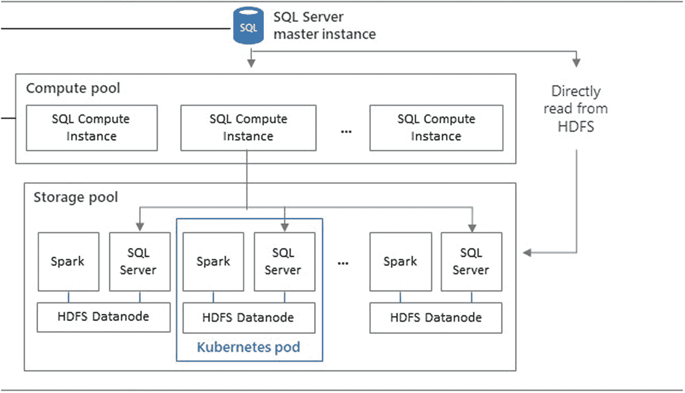
图 10-9 BDC 存储池

存储池由一个或多个 k8s Pod 组成。默认情况下，使用 aks-dev-test 配置会部署两个存储池 Pod。如果你使用 `kubectl describe` 查看存储池中的 Pod，你会看到它们通过标签 `role=storage-pool` 绑定在一起。你可以通过自定义配置指定副本数（Replicas）来扩展更多的存储池 Pod。

在我部署在 BDC 上的 Pod 列表中，代表存储池的 Pod 如下：
```
storage-0-0      4/4     Running   0          24h
storage-0-1      4/4     Running   0          24h
```

存储池 Pod 是它们自己 StatefulSet 的一部分，因此，对于 BDC 配置中的两个副本，你会在一个 StatefulSet 中得到两个 Pod。

存储池中的每个 Pod 包含四个容器（安装了 collectd 和 fluentbit），其中一个容器用于 **Hadoop** 组件，另一个用于 **SQL Server**。运行 YARN 和 HDFS 的容器（容器名称为 Hadoop）承载 Hadoop 组件。YARN 是 Hadoop 组件（包括 Spark 作业）在集群中运行的资源管理器（你可以在 [`https://hadoop.apache.org/docs/current/hadoop-yarn/hadoop-yarn-site/YARN.html`](https://hadoop.apache.org/docs/current/hadoop-yarn/hadoop-yarn-site/YARN.html) 阅读更多关于 YARN 的信息）。HDFS 提供 Hadoop 分布式文件系统功能。BDC 还部署了一个 HDFS 名称节点（Name Node）用于存储元数据并控制对 HDFS 集群的访问。

YARN 和 HDFS 的部分能力是分布式计算和存储，这意味着当你通过 T-SQL 和 Spark 与存储池交互和使用时，你的计算和存储是内置分布式系统的一部分。

SQL Server 容器在 BDC 系统中扮演着特殊的角色。注意图 10-9 中名为“直接从 HDFS 读取”的连接器。这意味着存储池 Pod 中的 SQL Server 容器可以直接从 HDFS 存储读取数据，包括 csv 和 parquet 等文件类型。你不会直接连接到这些 SQL Server 容器；它们在 BDC 内部使用，以优化对 BDC 集群中 HDFS 文件的访问。Controller 服务将针对 BDC 中 HDFS 的外部表查询重定向到这些 SQL Server 实例（可能会通过计算池）。

如果你有自己的 HDFS 系统，可以使用称为 HDFS 分层（HDFS Tiering）的概念将其挂载到存储池中。你可以在 [`https://docs.microsoft.com/en-us/sql/big-data-cluster/hdfs-tiering`](https://docs.microsoft.com/en-us/sql/big-data-cluster/hdfs-tiering) 阅读关于 HDFS 分层的信息。

### 计算池

上一节关于存储池的图 10-9 也展示了 *计算池* 的概念。计算池是一个 Pod 的 StatefulSet，实现了我在第 9 章讨论的 **Polybase 扩展组**。

计算池可以通过使用副本数自定义 BDC 部署的配置来扩展。默认情况下，aks-dev-test 配置仅部署一个计算池 Pod（文档也称之为实例）。

如果存在计算池，所有通过 BDC 的外部表查询都将使用计算池。Controller 将所有针对 BDC 中数据源的外部表查询重定向到计算池。

在我的 BDC 部署中，计算池由此 Pod 实现，并使用标签 `role=compute-pool`。
```
compute-0-0       3/3     Running   0          43h
```

### 数据池

数据池实现了一个或多个 Pod，用于我在“大数据集群包含什么？”一节中讨论的数据缓存功能。默认情况下，BDC 的 aks-dev-test 配置为数据池部署两个 Pod。在我的 BDC 部署中，这些 Pod 表示为：
```
data-0-0          3/3     Running   0          43h
data-0-1          3/3     Running   0          43h
```

数据池由一个或多个使用标签 `role=data-pool` 在 StatefulSet 中的 Pod 组成，每个 Pod 都有一个 SQL Server 容器。你对数据池中 SQL Server 的访问是通过来自 SQL Server 主实例的 Polybase 外部表进行的。

当你使用数据池的外部数据源在 SQL Server 主实例中创建外部表时，SQL Server 将在数据池的每个 Pod 中创建一个数据库，其名称与 SQL Server 主实例中外部表的范围相同。此外，我们还会创建一个与外部表同名的表。

这意味着你与数据池的所有交互都是通过 SQL Server 主实例中的外部表进行的。在数据池 Pod 的每个 SQL Server 上，我们将创建一个数据库和表来匹配你的外部表。此外，当你将数据插入数据池时，我们会自动分片或分区数据（不使用 SQL Server 分区）（默认使用轮询方式），并在每个数据池 Pod 的每个表上构建聚集列存储索引以优化读取访问。这意味着我们的计算池可以跨分片以可扩展的方式访问此数据。数据池无法修改；你只能摄取（INSERT）或查询数据。由于它是一个缓存，这意味着当你需要刷新缓存时，必须删除外部表并重新填充它。Controller 将特定的外部表请求重定向到数据池中的 SQL Server 实例（可能会通过计算池）。

### 应用程序池

应用程序池是基于在 BDC 中创建 *应用程序* 而部署的 Pod 集合。图 10-10 展示了 BDC 中用于应用程序池的区域。

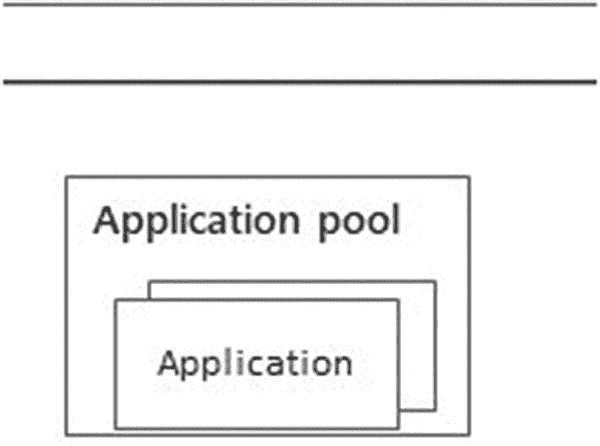
图 10-10 BDC 中的应用程序池

当你使用 BDC 接口通过 YAML 文件创建应用程序时，Controller 服务将动态创建一个包含你的应用程序在容器中运行的 Pod 副本集。目前支持的类型包括 Python、MLeap 和 SSIS。

还有另一个代表应用程序代理的 Pod，包括一个负载均衡器，它允许你从 BDC 内部以及通过服务端点从外部世界连接到池中运行的应用程序：
```
appproxy-
```

你可以在 [`https://docs.microsoft.com/en-us/sql/big-data-cluster/concept-application-deployment`](https://docs.microsoft.com/en-us/sql/big-data-cluster/concept-application-deployment) 阅读更多关于 BDC 中应用程序部署架构的信息。


## 使用大数据集群

在本节中，我将回顾大数据集群的各种用例。你需要做的第一件事就是使用 `azdata` `登录到 BDC`。从技术上讲，你无需登录即可访问 BDC 中的某些资源，但使用 `azdata` 登录可以让你以简单的方式访问所有服务端点，并获得相应的上下文。

要登录 BDC，你需要控制器服务端点，即控制器服务 Pod 的负载均衡器 IP 地址和端口。在我的 AKS 部署上，我能够通过以下命令获取控制器服务端点：

```bash
kubectl get svc controller-svc-external -n mssql-cluster
```

我现在可以通过以下命令为 `azdata` 工具提供正确的上下文，以便在各种场景中使用：

```bash
azdata login --controller-endpoint https://:30080 --controller-username admin
```

系统提示我输入密码（这是在名为“BDC 部署体验”的章节中，当 python 脚本提示时我提供的密码）。当登录成功时，我看到了以下消息：

```
Logged in successfully to `https://:30080`
```

有了这个上下文，我可以将 `azdata` 用于多种目的。我想做的第一件事是获取其他服务端点的列表以使用 BDC。我将使用以下命令来检索这些端点：

```bash
azdata bdc endpoint list -o table
```

我的列表如下所示：

```
Protocol
------------------------------------------------------  ----------------------------------------------------  -----------------  -------
用于访问 HDFS 文件、Spark 的网关                     https://:30443                              gateway            https
Spark 作业管理及监控仪表板                              https://:30443/gateway/default/sparkhistory  spark-history      https
Spark 诊断和监控仪表板                                 https://:30443/gateway/default/yarn          yarn-ui            https
应用程序代理                                           https://:30778                         app-proxy          https
管理代理                                               https://:30777                              mgmtproxy          https
日志搜索仪表板                                        https://:30777/grafana                       metricsui          https
集群管理服务                                          https://:30080                         controller         https
SQL Server 主实例前端                                  ,31433                              sql-server-master  tds
HDFS 文件系统代理                                      https://:30443/gateway/default/webhdfs/v1    webhdfs            https
用于运行 Spark 语句、作业、应用程序的代理             https://:30443/gateway/default/livy/v1       livy               https
```

我使用了一些名称来代表集群上的实际 IP 地址：

*   `<knox-ip>` – 这是 Knox 网关的 IP 地址，如你在此列表中所见，它用于多种用途。Knox 网关用于访问 HDFS 文件 (`webhdfs`)、运行 Spark 作业 (`livy`)、查看 Spark 作业历史 (`spark-history`) 以及监控 Spark 作业 (`yarn-ui`)。
*   `<appproxy-ip>` – 这是用于连接到部署在 BDC 中的应用程序的 IP 地址。
*   `<sql-ip>` – 这是连接到 SQL Server 主实例的 IP 地址。
*   `<cluster-ip>` – 这是控制器服务的 IP 地址。

你也可以使用 `kubectl` 获取所有端点的 IP 地址和端口，但只有 `azdata` 能为你提供诸如如何访问 `webhdfs` 和 `livy` 等具体细节。

Azure Data Studio (ADS) 现在提供了 BDC 管理体验，包括查看端点列表的功能。

图 10-11 展示了使用 ADS 查看 BDC 端点的示例。

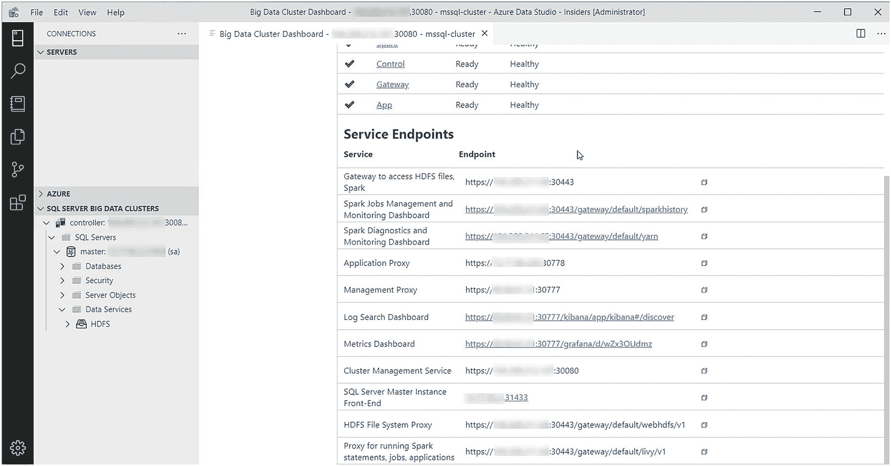

图 10-11

Azure Data Studio 中的 BDC 端点

位于 [`docs.microsoft.com/en-us/sql/big-data-cluster/concept-security`](https://docs.microsoft.com/en-us/sql/big-data-cluster/concept-security) 的文档（也在图 10-12 中显示）展示了常见的 BDC 端点。

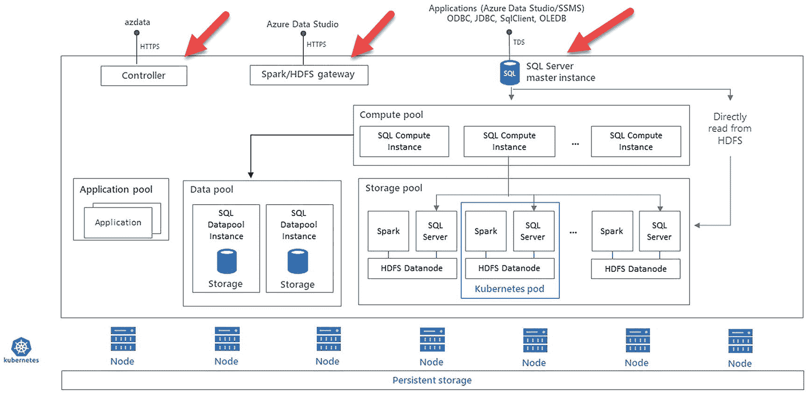

图 10-12

常见的 BDC 端点

### 使用数据虚拟化

BDC 的一个重要用途是使用 Polybase 从外部数据源访问数据，正如我在第 9 章中所描述的。

BDC 中的 Polybase 提供了与 Linux 版 Polybase 相同的功能，包括用于 SQL Server、Oracle、Teradata、MongoDB 和 HDFS 的内置连接器。

BDC 通过两个 BDC 独有的额外内置连接器为这一功能提供了独特的扩展：

*   `sqlhdfs` – 此连接器允许你访问存储池内的 HDFS 数据。
*   `sqldatapool` – 此连接器允许你访问专门存储在数据池中的数据。

以下是在数据库中创建外部数据源以访问这些内置连接器的 T-SQL 脚本示例：

```sql
IF NOT EXISTS(SELECT * FROM sys.external_data_sources WHERE name = 'SqlDataPool')
CREATE EXTERNAL DATA SOURCE SqlDataPool
WITH (LOCATION = 'sqldatapool://controller-svc/default');
IF NOT EXISTS(SELECT * FROM sys.external_data_sources WHERE name = 'SqlStoragePool')
CREATE EXTERNAL DATA SOURCE SqlStoragePool
WITH (LOCATION = 'sqlhdfs://controller-svc/default');
```

请注意，`LOCATION` 的 URI 是控制器服务的特定位置。如果已部署，控制器服务会通过计算池将对外部表的请求（基于这些源）定向到相应的池。

我们的文档有一个关于如何在 BDC 中使用外部表访问 Oracle 数据的示例，链接为 [`docs.microsoft.com/en-us/sql/relational-databases/polybase/data-virtualization`](https://docs.microsoft.com/en-us/sql/relational-databases/polybase/data-virtualization)。你需要一个 Oracle 实例来使用此示例。你也可以使用我在第 9 章 `ch9_data_virtualization\sqldatahub` 文件夹中提供的示例。


## 注意

本文件夹中唯一不能使用的两个示例是 `hdfs` 和 `saphana`。在 BDC 中，HDFS 数据通过 `sqlhdfs` 连接器访问。目前 BDC 不支持所需的用于 SAP HANA 的 ODBC 连接器。

我认为你可能会更有兴趣使用示例通过 `sqlhdfs` 和 `sqldatapool` 连接器来访问数据。

我建议你首先按照以下文档页面的说明加载用于使用 BDC 的示例数据：[`https://docs.microsoft.com/en-us/sql/big-data-cluster/tutorial-load-sample-data`](https://docs.microsoft.com/en-us/sql/big-data-cluster/tutorial-load-sample-data)。我执行了这些说明，加载此数据没有问题。在此示例中，你将使用 curl 将 csv 文件目录加载到 HDFS 中。此示例使用来自 Knox 网关的 `WebHDFS` ([`https://hadoop.apache.org/docs/r1.0.4/webhdfs.html`](https://hadoop.apache.org/docs/r1.0.4/webhdfs.html)) 端点，该网关被称为 `HDFS 文件系统代理`。

加载数据后，你现在可以按照教程访问 HDFS 数据：[`https://docs.microsoft.com/en-us/sql/big-data-cluster/tutorial-query-hdfs-storage-pool`](https://docs.microsoft.com/en-us/sql/big-data-cluster/tutorial-query-hdfs-storage-pool)。你可能还会觉得尝试 Azure Data Studio 附带的 **外部表向导** 作为在 BDC 中创建映射到 HDFS 数据的外部表的另一种方式很有趣：[`https://docs.microsoft.com/en-us/sql/relational-databases/polybase/data-virtualization-csv`](https://docs.microsoft.com/en-us/sql/relational-databases/polybase/data-virtualization-csv)。

你可能需要从 IOT 设备等来源将数据直接摄取到 BDC 的 HDFS 中。我们的文档中有如何直接与 BDC 中的 HDFS 交互的示例：[`https://docs.microsoft.com/en-us/sql/big-data-cluster/data-ingestion-curl`](https://docs.microsoft.com/en-us/sql/big-data-cluster/data-ingestion-curl)。

此外，Azure Data Studio 包含直接浏览和处理 HDFS 中文件的功能，如图 10-13 所示。

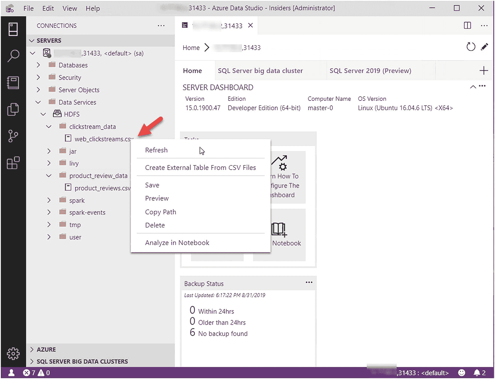

图 10-13
使用 Azure Data Studio 在 BDC 中处理 HDFS

Buck Woody 创建了一个名为 `SQL Server 大数据集群 – 架构` 的研讨会，并有一套可以与 ADS 一起使用的 Notebooks，用于了解数据虚拟化如何与 BDC 协同工作。你可以在 [`https://github.com/microsoft/sqlworkshops/tree/master/sqlserver2019bigdataclusters/SQL2019BDC/notebooks`](https://github.com/microsoft/sqlworkshops/tree/master/sqlserver2019bigdataclusters/SQL2019BDC/notebooks) 尝试这些 Notebooks，使用教程 00、01 和 02 作为基础的数据虚拟化 notebooks。

### 使用数据池

我在本书中将数据池描述为数据缓存。使用数据池的过程是根据来自其他数据源的查询摄取或插入数据，这些数据源可以是 SQL Server 主实例表、来自 HDFS 的外部数据源或任何其他 Polybase 连接器。

数据会自动分片分布到数据池中的 Pod 上，并通过聚集列存储索引优化读取访问。

我建议你阅读我们文档中的示例，以了解使用数据池的基础知识：[`https://docs.microsoft.com/en-us/sql/big-data-cluster/tutorial-data-pool-ingest-sql`](https://docs.microsoft.com/en-us/sql/big-data-cluster/tutorial-data-pool-ingest-sql)。

Buck Woody 在教程 03 中的研讨会展示了如何在 BDC 中使用数据池：[`https://github.com/microsoft/sqlworkshops/blob/master/sqlserver2019bigdataclusters/SQL2019BDC/notebooks/bdc_tutorial_03.ipynb`](https://github.com/microsoft/sqlworkshops/blob/master/sqlserver2019bigdataclusters/SQL2019BDC/notebooks/bdc_tutorial_03.ipynb)。

### 使用 Spark

Spark ([`https://spark.apache.org/`](https://spark.apache.org/)) 是一个常用于 Hadoop 系统的计算引擎。BDC 自动提供了运行 Spark 作业以满足各种应用需求的功能。在 BDC 中运行 Spark 作业有几种方法，我将在本节中讨论。你可以运行其中一些示例，以了解 Spark 如何与 BDC 协同工作。如果你是 Spark 新手，在向 BDC 提交 Spark 作业之前，你需要首先考虑为什么想使用 Spark。有一些非常好的场景，其中 Spark 可以是处理 HDFS 中数据的有效方法，这就是为什么我们将 Spark 作为整个 BDC 解决方案的一部分。你还会发现 Spark 是机器学习场景中常用的解决方案，我将在本章后面的“机器学习与大数据集群”一节中详细讨论。

#### 从 Azure Data Studio 运行 Spark 作业

Spark 可能有用的一个场景是将存储池中 HDFS 的数据摄取到 BDC 中数据池的表中。

运行 Spark 作业的一种方法是使用直接连接到 SQL Server 主实例的 Azure Data Studio。图 10-14 展示了如何使用 Azure Data Studio (ADS) 运行 Spark 作业的示例。

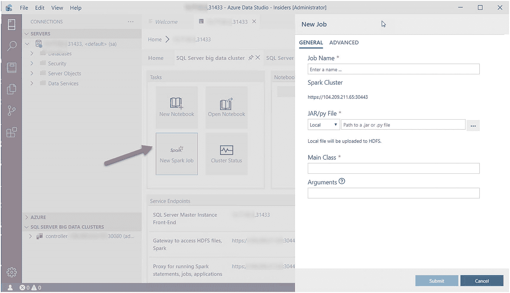

图 10-14
在 Azure Data Studio 中提交 Spark 作业

有关直接使用 ADS 提交 Spark 作业的更多信息，请访问：[`https://docs.microsoft.com/en-us/sql/big-data-cluster/spark-submit-job`](https://docs.microsoft.com/en-us/sql/big-data-cluster/spark-submit-job)。

#### 从其他工具运行 Spark 作业

我们还支持使用名为 `IntelliJ` 的工具向 BDC 提交 Spark 作业，你可以阅读：[`https://docs.microsoft.com/en-us/sql/big-data-cluster/spark-submit-job-intellij-tool-plugin`](https://docs.microsoft.com/en-us/sql/big-data-cluster/spark-submit-job-intellij-tool-plugin)。你也可以使用 `Visual Studio Code` 向 BDC 提交 Spark 作业，相关说明请阅读：[`https://docs.microsoft.com/en-us/sql/big-data-cluster/spark-hive-tools-vscode`](https://docs.microsoft.com/en-us/sql/big-data-cluster/spark-hive-tools-vscode)。在这两种场景中，你都将使用 `访问 HDFS 文件、Spark 的网关` 端点连接到 BDC 以运行 Spark 作业。

BDC 还提供了一个用于提交 Spark 作业的 REST 端点，称为 `Livy` ([`https://livy.apache.org/`](https://livy.apache.org/))。Livy 端点通过作为 `<knox-ip>` 一部分的代理提供，称为 `运行 Spark 语句、作业、应用程序的代理`。

也许你在 BDC 上下文中使用 Spark 最常见的方法是通过 Azure Data Studio (ADS) 的 Notebooks。在本章之前，我已经向你展示了许多使用 ADS Notebooks 配合 SQL `内核` 的示例。ADS 支持其他语言环境的内核，包括

*   PySpark3
*   PySpark
*   Spark | Scala
*   Spark | R
*   Python

在任何这些场景中，你都将使用 Notebook 连接到 SQL Server 主实例。ADS 将通过 Knox 网关处理从 Notebook 提交 Spark 作业，以便在 BDC 中正确运行。这些 Notebook 中的任何 Python 或 R 代码都将在你的本地计算机上运行。

### MSSQL Spark 连接器

我们提供了另一种通过 `MSSQL Spark 连接器` 运行 Spark 作业的方法。该连接器与 SQL Server 主实例通信，使用 SQL 批量复制 API 进行写入，并具有熟悉的 JDBC 接口。你可以在 [`https://docs.microsoft.com/en-us/sql/big-data-cluster/spark-mssql-connector`](https://docs.microsoft.com/en-us/sql/big-data-cluster/spark-mssql-connector) 阅读有关 `MSSQL Spark 连接器` 及其如何与 BDC 配合使用的更多信息。


### 部署和使用应用程序

我在“大数据集群架构”一节中描述了应用池在 BDC 中如何工作，包括关于如何在 BDC 中部署应用程序的文档。

我们为用 R 和 Python 编写的应用程序提供“运行时”，也支持 MLeap（[`https://mleap-docs.combust.ml/`](https://mleap-docs.combust.ml/)）应用程序和 SSIS 包。开发者将提供代码和一个 YAML 文件来指定如何运行应用程序，而 BDC 将为应用程序代码运行一个容器副本集。

应用程序一旦部署，就会始终作为容器“运行”。如果你想要使用或执行应用程序代码，可以使用带有`app`选项的`azdata`命令。你可以在[`https://docs.microsoft.com/en-us/sql/big-data-cluster/reference-azdata-app`](https://docs.microsoft.com/en-us/sql/big-data-cluster/reference-azdata-app)查看`azdata app`的参考文档。

BDC 还提供了通过 REST Web 界面使用已部署应用程序的另一种方法。默认情况下，所有已部署的应用程序都通过一个名为`Swagger`（[`https://swagger.io/`](https://swagger.io/)）的协议具备此功能。

要理解这一切如何运作的最佳方式，是查看我们在[`https://github.com/Microsoft/sql-server-samples/tree/master/samples/features/sql-big-data-cluster/app-deploy`](https://github.com/Microsoft/sql-server-samples/tree/master/samples/features/sql-big-data-cluster/app-deploy)提供的示例。

### 安全性

在我撰写本章时，BDC 仅支持基本身份验证，即登录名和密码。来自控制器、Knox 和 SQL Server 主实例的所有服务终结点都需要登录名和密码。

集群内 Pod 之间的所有通信都通过使用`k8s`机密（本身也有登录名和密码）和自签名证书的私有通信通道进行。

我们的目标是在发布 SQL Server 2019 大数据集群时，为 BDC 中的所有服务终结点支持 Active Directory (AD)身份验证。这包括连接到 SQL Server 主实例、控制器服务和 Knox 网关。

我预计，关于如何将 BDC 加入域、如何使用必要的 AD 信息部署 BDC、添加 AD 用户的过程，以及如何使用 AD 账户登录 BDC 的所有详细信息，都将在我们的文档[`https://docs.microsoft.com/en-us/sql/big-data-cluster/concept-security`](https://docs.microsoft.com/en-us/sql/big-data-cluster/concept-security)中提供。

### 高可用性

正如我在本章中提到的，BDC 中的 Pod 是使用`k8s`的`StatefulSet`或`ReplicaSet`部署的。这为`k8s`平台提供了*内置的高可用性*，以防容器、Pod 或节点故障（节点故障仅在多节点`k8s`部署中有效）。

虽然这种*基本高可用性*形式对 SQL Server 有帮助，但最好使用我们的 Always On 可用性组(AG)技术，该技术包括只读副本和 SQL Server 运行状况检测。

在部署 BDC 时，你可以选择启用`hadr`。启用`hadr`将在 BDC 中默认创建一个可用性组，并将`系统数据库`包含在 AG 中。会创建`StatefulSet`中的多个 Pod 来支持此部署。

使用此配置，我们还会创建连接到 AG 主副本和辅助副本的终结点。由于`系统数据库`作为 AG 的一部分包含在内，你的主连接是连接到 SQL Server 主实例的主副本，就像 AG 侦听器一样。如果发生故障转移，此终结点将保持连接到成为新主副本的任何副本。还通过单独的终结点支持辅助只读副本连接。

请查看我们的文档，了解如何启用`hadr`以及使用此类部署的一些影响：[`https://docs.microsoft.com/en-us/sql/big-data-cluster/deployment-high-availability`](https://docs.microsoft.com/en-us/sql/big-data-cluster/deployment-high-availability)。

### SQL Server 大数据集群的 Jupyter Books

Jupyter Books（[`https://jupyter.org/jupyter-book/intro.html`](https://jupyter.org/jupyter-book/intro.html)）提供了一种构建笔记本集合的机制。Azure Data Studio (`ADS`)提供了一个 Jupyter Book 笔记本，帮助监控、管理和排查 SQL Server 大数据集群问题。所有这些笔记本都基于 SQL Server 工程团队使用的实际故障排除指南(`TSG`)！

图 10-15 展示了 SQL Server 大数据集群的 Jupyter Books。

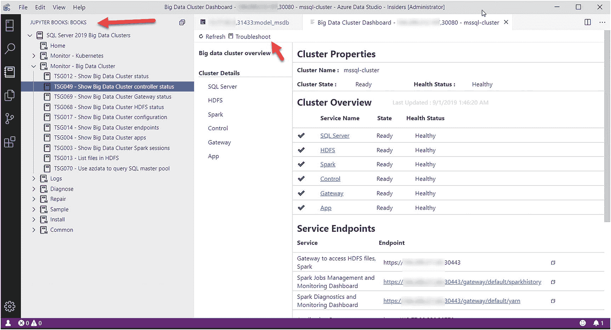

图 10-15：SQL Server 大数据集群的 Jupyter Books

### 机器学习与大数据集群

SQL Server 大数据集群(BDC)的承诺之一是提供一个*端到端的机器学习平台*。考虑图 10-16 中的工作流。

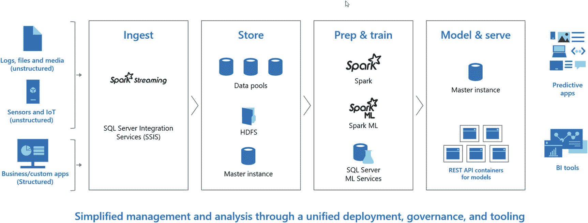

图 10-16：*大数据集群中的机器学习*

你可以在 BDC 中完成所有这些操作！使用 Spark 和 SSIS 从不同类型的数据源（包括结构化和非结构化）摄取数据。你可以使用数据池、HDFS 甚至 SQL Server 主实例将数据存储在 BDC 中。你的一些机器学习模型数据可能存在于 BDC 外部的外部数据源中，例如 Azure、SQL Server、Oracle、Teradata 和 MongoDB。BDC 允许你使用 T-SQL 访问这些数据中的任何一个。

你现在可以使用 Spark、SparkML 和/或 SQL Server 机器学习服务(ML)来准备和训练你的机器学习模型。然后，你可以使用带有 T-SQL 的 SQL Server ML 将你的模型作为*机器学习应用程序*公开，或者在应用池中作为一个带有 REST 接口的应用程序公开。应用池为开发人员提供了一种有趣的方法，因为它完全基于你的代码，使用声明式 YAML 和容器。这意味着它可能成为*持续集成/持续交付*(CI/CD)开发模型的绝佳候选方案。

### 机器学习包

数据科学家使用 BDC 和 SQL Server 2019 的一个巨大优势是我们部署产品时附带的所有机器学习包。我询问了我们团队的高级项目经理 Rony Chatterjee 博士，如何发现所有这些已安装的 ML 包。他给了我以下可以在 SQL Server 2019 或 BDC 上运行的 T-SQL 查询，以查看这些包：

```sql
EXEC sp_execute_external_script
@language=N'Python',
@script=N'
import pkg_resources
import pandas
OutputDataSet = pandas.DataFrame([(d.project_name, d.version) for d in pkg_resources.working_set])'
```

我在部署的 BDC 上运行了这个查询，结果有超过 160 个机器学习包！


## 使用示例

我相信你应该回顾甚至尝试一些示例，来了解机器学习和 SQL Server 大数据集群能实现什么：

*   **`SparkML`** – 我们提供了一个使用 Spark 和 Spark ML 与大数据集群的示例，该示例基于美国过去的人口普查数据来预测收入水平。你可以在 [`https://docs.microsoft.com/zh-cn/sql/big-data-cluster/spark-create-machine-learning-model`](https://docs.microsoft.com/zh-cn/sql/big-data-cluster/spark-create-machine-learning-model) 查看此示例。

*   **`BDC 应用程序`** – 在 [`https://github.com/microsoft/sql-server-samples/tree/master/samples/features/sql-big-data-cluster/app-deploy`](https://github.com/microsoft/sql-server-samples/tree/master/samples/features/sql-big-data-cluster/app-deploy) 处，有几个使用应用程序部署的机器学习应用示例供你使用。

*   **Buck Woody 示例** – 2019 年春天，我和 Buck Woody 正在为一位客户做培训，Buck 提出了一个非常酷的机器学习现实世界示例。这个想法是，假设虚构的公司 WideWorldImporters 拥有运输对温度敏感产品的卡车。卡车的制冷系统由电池供电。一个大问题是，卡车的制冷系统可能会因电池生命周期而故障。电池设计寿命应为 3 个月，但在许多情况下它们会提前失效。公司希望建立一个预测性机器学习模型，以根据卡车和货物的动态因素（而非固定的 3 个月周期）来确定电池何时可能需要更换。

    Buck 有一个特定的 Notebook 可供你使用，你可以在 [`https://github.com/microsoft/sqlworkshops/blob/master/sqlserver2019bigdataclusters/SQL2019BDC/notebooks/bdc_tutorial_05.ipynb`](https://github.com/microsoft/sqlworkshops/blob/master/sqlserver2019bigdataclusters/SQL2019BDC/notebooks/buc_tutorial_05.ipynb) 查看此示例。你需要遵循所有的 Notebook 才能使用这个教程，地址在 [`https://github.com/microsoft/sqlworkshops/tree/master/sqlserver2019bigdataclusters/SQL2019BDC/notebooks`](https://github.com/microsoft/sqlworkshops/tree/master/sqlserver2019bigdataclusters/SQL2019BDC/notebooks)。当 Buck 和我做这个培训时，一位客户大概这样评论道：“终于有人向我解释了一个实用的、现实世界的机器学习示例，而且我认识到可以使用大数据集群来实现它。”

### 管理和监控大数据集群

你可以看到 SQL Server 大数据集群有很多组件和活动部分。监控和管理大数据集群有许多需要考虑的事项，包括管理 Kubernetes 集群、SQL Server 和其他大数据集群组件。

### 管理 Kubernetes (k8s)

如果你看看我们用大数据集群构建的东西，它实质上是一个 `由 Kubernetes 支撑的应用程序`。虽然我们具备特定功能来帮助你管理大数据集群应用程序，但你仍然必须准备好管理你的 k8s 集群。对于大数据集群的开发和测试，这对你来说可能不是问题，但是，要在生产环境中运行大数据集群，你必须规划如何独立于大数据集群来管理和监控你的 k8s 集群。我无法开始强调理解如何确保你的 k8s 集群得到妥善管理并以健康水平运行有多么重要。整个大数据集群解决方案都依赖于此。

我推荐以下用于管理 k8s 的资源：

*   查看我们关于管理 Azure Kubernetes 服务 (AKS) 的文档：[`https://docs.microsoft.com/zh-cn/azure/aks/best-practices`](https://docs.microsoft.com/zh-cn/azure/aks/best-practices)。

*   我强烈推荐这本书，它也包含了一些关于 k8s 内部原理的精彩信息：[`https://learning.oreilly.com/library/view/managing-kubernetes/9781492033905/`](https://learning.oreilly.com/library/view/managing-kubernetes/9781492033905/)。

我还在我负责的第 8 章“关于 k8s 的技巧”一节中提供了管理和监控 k8s 集群的技巧和技术。


### 管理和监控大数据集群

除了通过动态管理视图（`DMVs`）和扩展事件等 `SQL Server` 诊断工具对 `SQL Server` 主实例进行标准的管理和监控外，我们还提供了一系列工具和资源，帮助您专门管理和监控 `SQL Server 大数据集群`（`BDC`）。

*   **`Azure Data Studio (ADS) 大数据集群仪表板`**

    `ADS` 自带一个 `BDC` 仪表板，用于查看 `BDC` 集群（包括其所有组件）的健康状况。图 10-17 展示了 `ADS` `BDC` 仪表板的示例。

    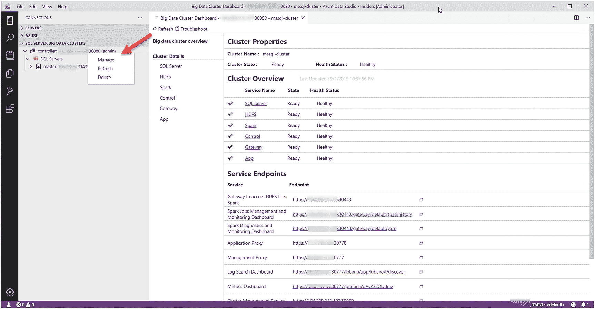
    图 10-17 `Azure Data Studio` 大数据集群仪表板

    您可以点击“集群详细信息”中的某一项，例如 `SQL Server`，以查看 `SQL Server` 主实例、计算池、数据池和存储池的状态。我们已在 `BDC` 的每个 Pod 中实现了 `活性探针`（ `https://kubernetes.io/docs/tasks/configure-pod-container/configure-liveness-readiness-probes/` ），以反馈所有 `BDC` 组件的总体健康状况。您可以在 `https://docs.microsoft.com/en-us/sql/big-data-cluster/manage-with-controller-dashboard` 阅读更多关于大数据集群仪表板的信息。

*   **`Grafana` 指标**

    利用此上下文，您可以深入查看由控制器中组件驱动的 `Grafana`（ `https://grafana.com/` ）仪表板显示的指标。图 10-18 显示了 `SQL Server` 主实例的 `Grafana` 仪表板。

    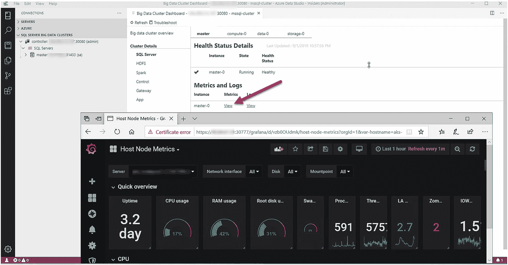
    图 10-18 `SQL Server 大数据集群` 的 `Grafana` 仪表板

*   **`Kibana` 和 `Elasticsearch`**

    `BDC` 的每个主要组件都有一个 `Grafana` 仪表板和一个 `Kibana`（ `https://en.wikipedia.org/wiki/Kibana` ）对 `Elasticsearch`（ `www.elastic.co/` ）的可视化，其中包含用于更深入故障排除和分析的日志。图 10-19 显示了通过 `ADS` 大数据集群仪表板查看的、来自 `SQL Server` 主实例的 `Elasticsearch` 日志的 `Kibana` 可视化。

    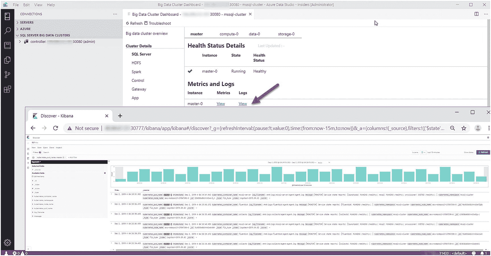
    图 10-19 `BDC` 日志的 `Kibana` 和 `Elasticsearch`

*   **在 `SQL Server` 中使用 `azdata`**

    虽然 `Kubernetes` 允许您使用 `kubectl exec` 等命令与容器交互，但 `azdata` 程序允许您使用 `azdata` 的 `sql` 选项与 `SQL Server` 交互，如 `https://docs.microsoft.com/en-us/sql/big-data-cluster/reference-azdata-sql` 文档所述。这使您可以针对 `SQL Server` 主实例执行 `T-SQL` 命令，并访问 `sqlcmd` “shell”。请记住，`azdata` 之于 `BDC`，就如同 `kubectl` 程序之于 `Kubernetes`；您可以在 `https://docs.microsoft.com/en-us/sql/big-data-cluster/reference-azdata` 查看完整的参考文档。

*   **`Kubernetes (k8s)` 和 `BDC` 故障排除**

    请通读我在第 8 章中对 `k8s` 命令的讨论，但我们也在 `https://docs.microsoft.com/en-us/sql/big-data-cluster/cluster-troubleshooting-commands` 的文档中提供了一些提示。别忘了也使用我们的 `SQL Server` 故障排除指南，我在本章前面的“`SQL Server 大数据集群` 的 Jupyter 书籍”一节中描述过这些指南。

## 总结

虽然 `SQL Server 2019` 是革命性的，但 `SQL Server 大数据集群` 是 *颠覆性的*。谁会想到一个有些人认为仅仅是关系数据库引擎的产品，却包含了您自己 *数据湖*、*数据虚拟化* 和一个 *端到端机器学习平台* 的完整解决方案，并且全部构建在 `Kubernetes` 之上？

想想我们为大数据集群部署的技术：

*   `SQL Server`
*   `Polybase`
*   `HDFS`
*   `Spark`
*   `Livy`
*   `Kibana`
*   `Elasticsearch`
*   `Grafana`
*   `InfluxDB`
*   `Notebooks`
*   使用 `R` 和 `Python` 的机器学习
*   `Java 可扩展性`
*   `Always On 可用性组`

所有这些都由一个控制平面提供动力，该平面利用我们的“`API Server`”或控制器服务，来部署、管理和驱动构建在 `Kubernetes` 上的大数据集群。

这是我的观点，但何不听听已经看到此解决方案前景的客户怎么说：

> “构建和部署我们用于临床放射学的垂直 AI 解决方案需要结合非常多样化的实现范式、数据格式和法规要求。`SQL Server 2019 大数据集群` 让我们能够在一个共享平台上容纳和整合所有方面——既适用于从事深度学习的数据科学家，也适用于连接工作流、安全性和可扩展性的软件工程师。在运行时，我们的医疗客户受益于简化的容器化部署和维护，同时能够轻松地在本地和云之间迁移我们的解决方案。” – René Balzano，Balzano 公司创始人兼首席执行官。

此引述来自我们在 `https://cloudblogs.microsoft.com/sqlserver/2019/08/29/sql-server-2019-release-candidate-refresh-with-big-data-clusters/` 发布 `SQL Server 2019` 大数据集群候选发布版时发布的博客。我期待更多客户相信大数据集群正是他们推动业务所需的革命性解决方案。

