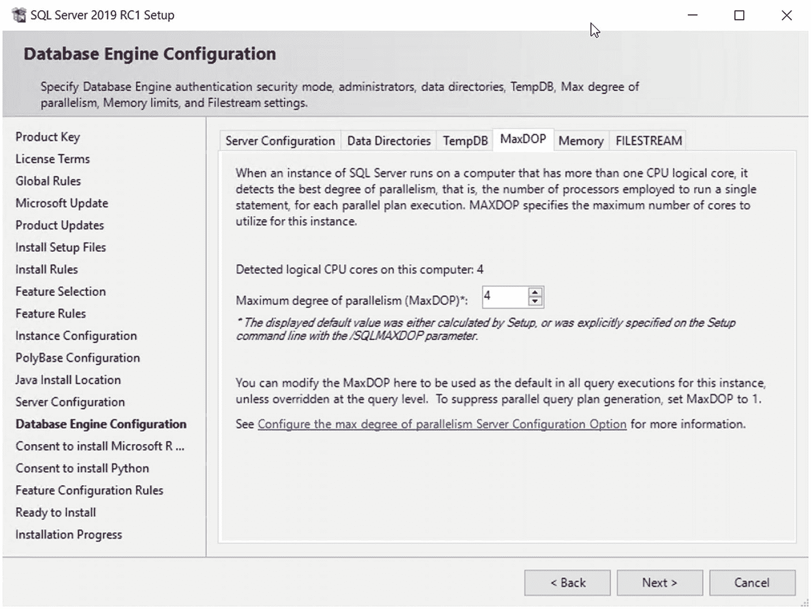
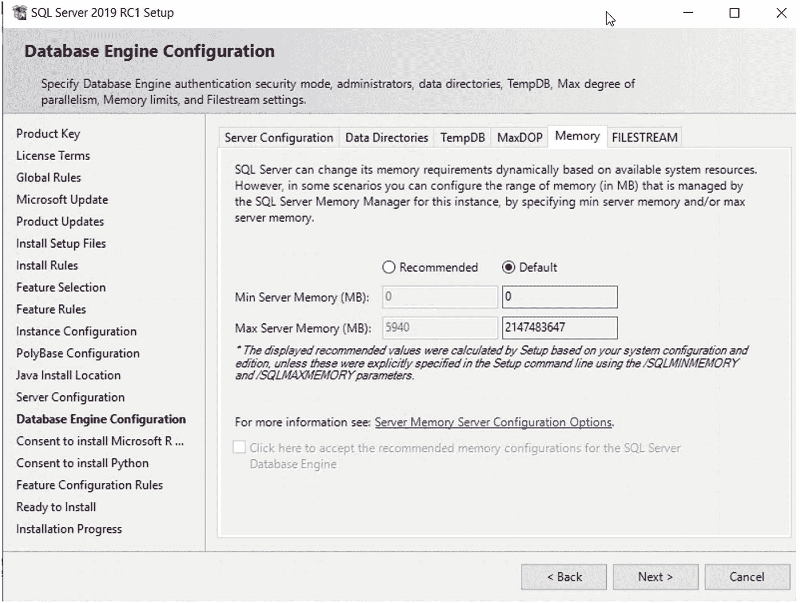
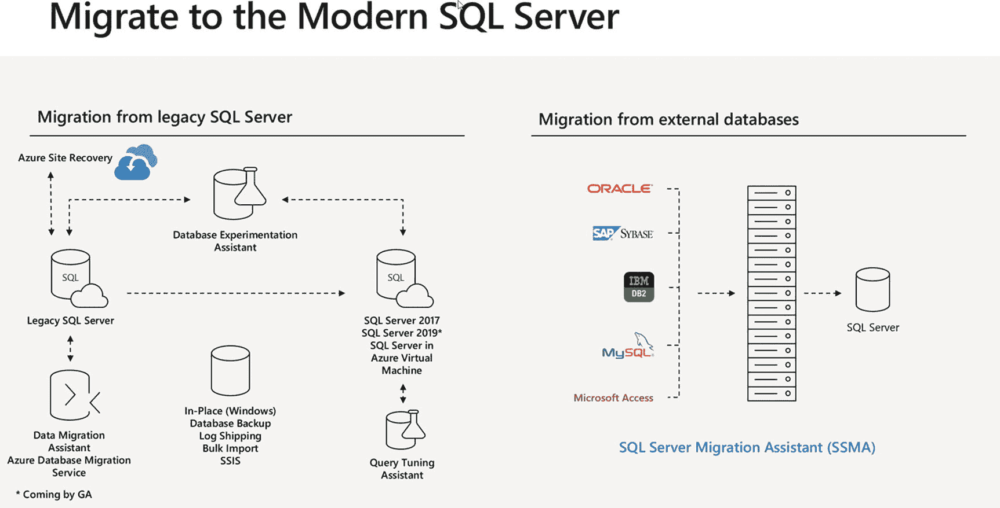
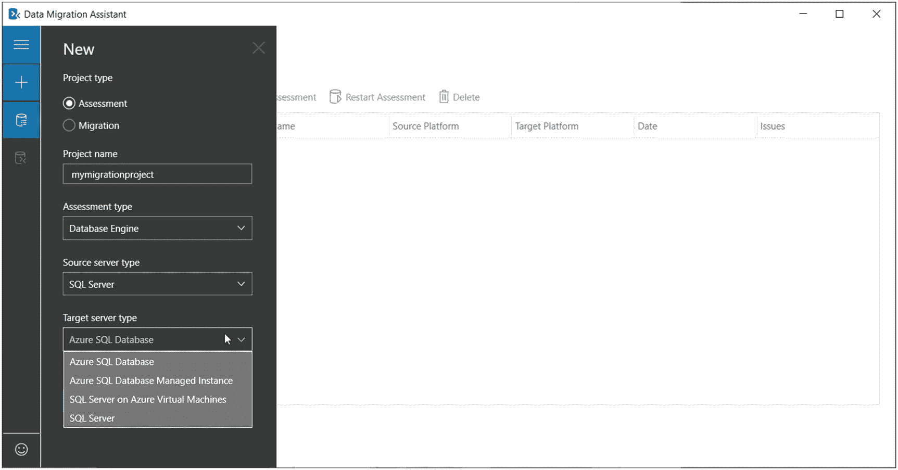
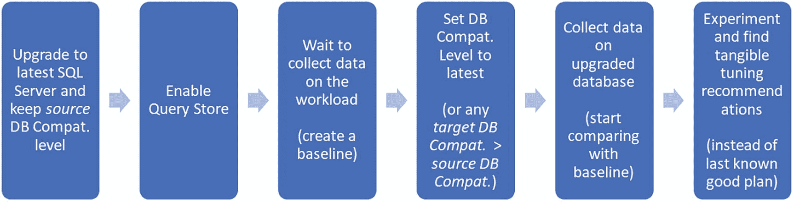
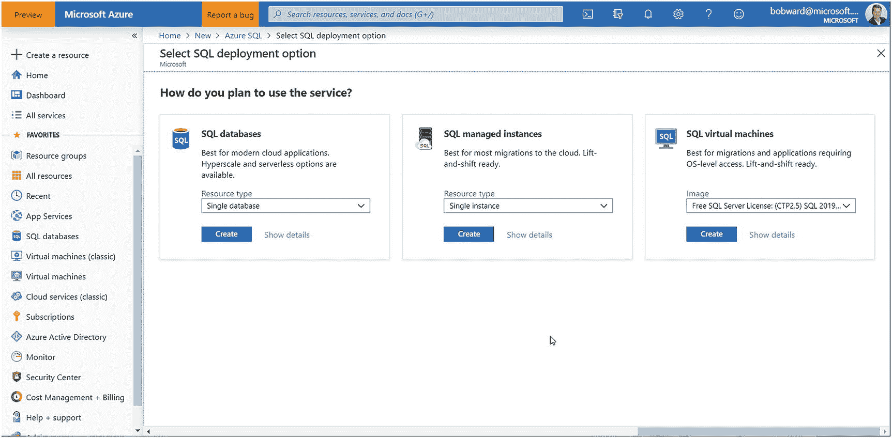
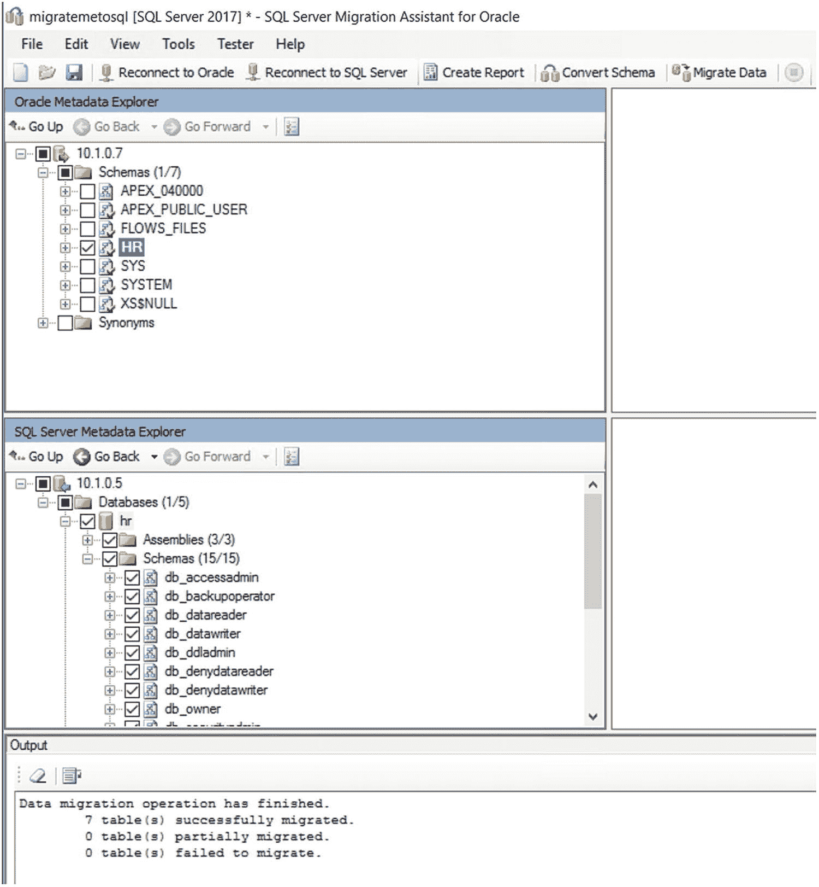

# 11. 客户之声与迁移

我希望当您读到本章时，能够体会到投入到 `SQL Server 2019` 中的惊人创新量。如果您已经阅读了前十章，您可能会有“信息过载”的感觉。过去参加我演讲的几个人都感觉他们的“大脑要融化了”。如果您读到本书此处也有这种感觉，那么我的目标之一就实现了。我希望这本书不仅仅是 `SQL Server 2019` 的回顾，因为任何人都可以从文档中获得这些信息。我希望这是一次对 `SQL Server 2019` 版本的全面审视。

具备了所有这些解决现代数据挑战的能力，还有什么可谈的吗？嗯，事实上，还有。我将通过讨论我们根据客户反馈构建到 `SQL Server 2019` 中的“一堆功能”（我借用了同事 Conor Cunningham 的术语）来结束本书。我还将讨论您在迁移到 `SQL Server 2019` 时可以使用的方法、工具和技术。


## 客户之声

到目前为止，你在本书中读到的一切，都以这样或那样的方式受到了我们客户的影响。在本节中，我将向你展示一系列 `SQL Server 2019` 的增强功能，这些功能直接来源于客户的反馈和请求，途径包括 Microsoft 支持的升级、我们自己的内部测试，或工程团队与客户的直接互动。如果你从未接触过直达产品团队的反馈渠道，可以访问 `https://aka.ms/sqlfeedback` 查看。在本节中，我为你整理了一份按三个领域组织的增强功能列表：

### 性能

*   **性能** – SQL Server 数据库引擎的性能增强，旨在帮助所有或特定的工作负载运行得更快。
*   **用户体验** – 这些是用于改进 `SQL Server` 产品使用或配置方式的增强功能。
*   **诊断** – 这些是旨在改进 `SQL Server` 问题故障排除或诊断的增强功能。

### 性能增强

我们的工程团队始终致力于改进核心数据库引擎的性能，并通过客户观察、Microsoft 支持升级，以及经常通过基准测试调查来寻求机会。这些经验和观察促成了核心数据库引擎的以下变更：

#### 减少临时表的编译

使用临时表的一种设计模式是在一个*作用域*中创建临时表，然后在另一个作用域中使用它。例如，你可以在一个批处理中创建临时表，然后尝试在该批处理调用的存储过程中使用该临时表。这通常会导致引用临时表的存储过程重新编译。在 `SQL Server 2019` 中，默认情况下，我们能够避免在此场景中进行重新编译。虽然这项改进可能不会使工作负载显著加快，但它有助于整个应用程序更好地使用 `SQL Server`，因为降低重新编译次数可以减少 `SQL Server` 的总体 CPU 使用率。

#### 间接检查点的可伸缩性

间接检查点是数据库检查点的新默认方法，你可以在 `https://docs.microsoft.com/en-us/sql/relational-databases/logs/database-checkpoints-sql-server` 阅读相关内容。我们通过一些基准测试和客户反馈发现，繁重的修改工作负载可能导致 `SQL Server` 引擎出现停滞，从而引发一种称为“非让步调度程序”的状况。我们通常只在具有多个 CPU 的大型系统上看到这些问题，这让我们认为这是一个可伸缩性问题。`SQL Server 2019` 在数据库引擎中进行了改进以避免此问题。

#### 并发 PFS 更新

PFS 页是数据库文件内的特殊页面，`SQL Server` 用它来帮助在为对象分配空间时定位可用空间。（你可以阅读 Paul Randal 在 Microsoft 工作时撰写的一篇关于 PFS 页的旧博文：`https://blogs.msdn.microsoft.com/sqlserverstorageengine/2006/07/08/under-the-covers-gam-sgam-and-pfs-pages/`。）

PFS 页上的页面闩锁争用通常与 `tempdb` 相关联，但当存在大量并发对象分配线程时，也可能发生在用户数据库上。这项改进改变了 PFS 更新的并发管理方式，使得它们可以在共享闩锁下更新，而不是独占闩锁。从 `SQL Server 2019` 开始，此行为在所有数据库（包括 `tempdb`）中默认开启。

随着客户采用 `SQL Server 2019`，我非常期待看到这项增强功能与 `TempDB` 内存优化元数据（在第 2 章讨论）相结合，对 `TempDB` 并发性的实际效果。

#### 工作线程窃取

我将这项改进称为“Slava 特别版”，以 Slava Oks 的名字命名。多年来，我们看到 `SQLOS` 调度程序的一个弱点是工作线程的调度程序争用。如果我们能在检测到争用问题时，将特定任务的动态工作线程更改为不同的调度程序，`SQLOS` 系统将会变得多么酷。在底层，我们已经开始以有限的规模实现这样的系统。`SQL Server` 支持恢复的并行重做概念。Dong Cao 是这项工作的负责人，他在 `https://blogs.msdn.microsoft.com/sql_server_team/sql-server-20162017-availability-group-secondary-replica-redo-model-and-performance/` 撰写了关于并行重做以及在 Always On 可用性组辅助副本上重做的内部机制的博文。Dong 在后台实现了工作线程窃取的概念，仅用于辅助副本上的并行重做。如果我们的测试继续成功，我期待有一天我们可以将这一改变应用于引擎核心调度程序 `SQLOS` 中，适用于所有类型的工作负载。


### 用户体验

我们致力于一系列旨在提升用户体验的改进，涵盖错误信息、SQL Server 的安装与配置。

### 详细的截断警告

你知道 SQL Server 史上获得最多投票的客户反馈请求之一是什么吗？那就是改进下面这条错误信息：

```
String or binary data would be truncated
```

这条错误信息（错误号 `8152`）会在您尝试向列中插入或更新数据，而待插入或更新的值超出目标列的大小时发生。这条信息的问题在于*没有提供上下文*——它没有提供表名、列名或即将被截断的具体数据片段。

在 SQL Server 2019 中，应用程序接收到的默认错误信息是错误号 `2628`，如下所示：

```
String or binary data would be truncated
in table '%.*ls', column '%.*ls’.
Truncated value: '%.*ls'
```

著名的 SQL Tiger Team 成员 Pam Lahoud 在其博客 [`https://blogs.msdn.microsoft.com/sql_server_team/string-or-binary-data-would-be-truncated-replacing-the-infamous-error-8152/`](https://blogs.msdn.microsoft.com/sql_server_team/string-or-binary-data-would-be-truncated-replacing-the-infamous-error-8152/) 中介绍了这一改进，并包含示例。

在该博客中，她指出您可以在 SQL Server 2017 中使用跟踪标志 `460` 来利用这条更好的错误信息。

SQL Server 2019 还提供了一个数据库选项，用于更改此错误信息的默认行为，您可以在 [`https://docs.microsoft.com/en-us/sql/t-sql/statements/alter-database-scoped-configuration-transact-sql?#verbose-truncation`](https://docs.microsoft.com/en-us/sql/t-sql/statements/alter-database-scoped-configuration-transact-sql%253F%2523verbose-truncation) 阅读相关内容。

### 安装期间的内存与并行选项

安装 SQL Server 后最常更改的两个实例配置选项是 "`max server memory`" 和 "`max degree of parallelism`"。

考虑到这些选项更改的频率，我们现在在 Windows 上安装 SQL Server 时加入了选择这些配置选项的设置项。

图 11-1 显示了配置并行度的安装选项。



图 11-1

在安装期间配置 MaxDOP

图 11-2 显示了安装期间的内存配置选项。



图 11-2

安装期间的内存配置

请注意，在此图中，SQL Server 安装程序推荐了一个 **`最大服务器内存 (MB)` 值**。我们没有记录如何得出特定值的过程，您可以根据您的环境使用合理的值。我们发现大多数客户使用的值都小于计算机或虚拟机的最大物理内存。我个人认为，这些推荐值所使用的算法，您也可以在 Tiger Team 工具 `BPCheck` 中找到，该工具位于 [`https://github.com/microsoft/tigertoolbox/tree/master/BPCheck`](https://github.com/microsoft/tigertoolbox/tree/master/BPCheck)。

### 资源调控器中的内存授予百分比

我在第 2 章描述了一个可能因大型内存授予而发生的性能问题。一个有助于控制大型内存授予的解决方案是使用带有 `REQUEST_MAX_MEMORY_GRANT_PERCENT` 选项的资源调控器。此选项的一个问题是可能的值是 `1` 到 `100` 的整数，代表 SQL Server 最大内存值的一个百分比。即使 `1TB` 的 `1%` 也是 `10Gb`，这对于内存授予来说可能仍然过多。SQL Server 2019 现在允许 `REQUEST_MAX_MEMORY_GRANT_PERCENT` 是一个浮点值，这意味着它可以接受小于 `1.0` 的值。

您可以在 [`https://docs.microsoft.com/en-us/sql/relational-databases/resource-governor/change-workload-group-settings`](https://docs.microsoft.com/en-us/sql/relational-databases/resource-governor/change-workload-group-settings) 阅读更多关于 `REQUEST_MAX_MEMORY_GRANT_PERCENT` 的用法。

### 列存储索引压缩估算

SQL Server 包含一个系统存储过程，用于帮助估算页压缩和行压缩的节省量，名为 `sp_estimate_data_compression_savings`。SQL Server 2019 现在增强了此过程，以显示使用列存储索引和列存储存档选项的估计压缩率。您可以在 [`https://docs.microsoft.com/en-us/sql/relational-databases/system-stored-procedures/sp-estimate-data-compression-savings-transact-sql`](https://docs.microsoft.com/en-us/sql/relational-databases/system-stored-procedures/sp-estimate-data-compression-savings-transact-sql) 阅读更多关于使用此过程及其选项的信息。


### 诊断功能

诊断和故障排除曾是我在微软支持部门工作 20 多年的领域。我仍然乐于看到产品中新增的诊断功能，即使它们看起来微不足道。对一些人来说可能微不足道的功能，却能为其他人带来巨大的好处。

### 你也可以成为 Paul Randal

Paul Randal 是我多年的朋友，无论是在他任职于微软 SQL Server 工程部门期间，还是在他与妻子 Kimberly Tripp 一起担任 SQLskills CEO 的漫长职业生涯中。Paul 和我都以内核知识著称，而检查数据库页面的内部结构（有时称为“页面破解”）是一项重要的技能。多年来，我们两人都使用未文档化且不受支持的 `DBCC PAGE` 命令来“破解”数据库页面。随着 SQL Server 2019 的推出，新增了一对系统对象来帮助检查数据库页面的头部：

`dm_db_page_info` – 这是一个系统函数，用于返回页面头部信息，结果集中的每一列对应页面头部的一个字段。你可以在 [`docs.microsoft.com/en-us/sql/relational-databases/system-dynamic-management-views/sys-dm-db-page-info-transact-sql`](https://docs.microsoft.com/en-us/sql/relational-databases/system-dynamic-management-views/sys-dm-db-page-info-transact-sql) 阅读关于此系统函数的说明。

此函数所需的输入是标识一个页面的信息，即 `database id`、`file id` 和 `page number`。在某些情况下，页面的标识符会出现在查询结果中，例如来自某个 DMV 的列。一个例子是 `dm_exec_requests` 中的 `wait_resource`。来自 `wait_resource` 的页面标识符采用页面资源字符串的形式，即 `<dbid>:<fileid>:<pageid>`。系统函数 `fn_PageResCracker` 接受一个页面资源字符串作为输入，并返回一个包含 `db_id`、`file_id` 和 `page_id` 的结果。

因此，你可以运行如下的 T-SQL 语句：

```
SELECT page_info.*
FROM sys.dm_exec_requests AS d
CROSS APPLY sys.fn_PageResCracker(d.page_resource) AS r
CROSS APPLY sys.dm_db_page_info(r.db_id, r.file_id, r.page_id,'DETAILED')
AS page_info;
```

这将从一个页面资源中提取页面头部详细信息。对于像页面闩锁等待这样的并发场景，此技术对于找出闩锁等待所涉及的页面属于哪个对象非常有用。

如果你回顾第 2 章，你会发现我提供了一个示例，使用此技术来查看 tempdb 中哪些表涉及了页面闩锁等待：

```
USE tempdb
GO
SELECT object_name(page_info.object_id), page_info.*
FROM sys.dm_exec_requests AS d
CROSS APPLY sys.fn_PageResCracker(d.page_resource) AS r
CROSS APPLY sys.dm_db_page_info(r.db_id, r.file_id, r.page_id,'DETAILED')
AS page_info
GO
```

Pam Lahoud 也撰写了一篇关于这个虽小但重要的引擎增强功能的精彩博客文章，你可以在 [`blogs.msdn.microsoft.com/sql_server_team/sql-server-2019-ctp-2-0-new-features-introducing-the-page-cracker-aka-sys-dm_db_page_info/`](https://blogs.msdn.microsoft.com/sql_server_team/sql-server-2019-ctp-2-0-new-features-introducing-the-page-cracker-aka-sys-dm_db_page_info/) 阅读。

### 关于统计信息的诊断

统计信息是查询性能非常重要的一部分。统计信息可以通过同步或异步方式更新，其中同步意味着查询必须等待统计信息更新完成，而异步则意味着查询可以继续执行，但统计信息会在后台更新。同步统计信息更新在某些情况下可能会导致 `SELECT` 语句执行时间比正常情况更长。SQL Server 2019 提供了一些诊断功能，可以为你提供关于等待同步统计信息更新的详细信息：

`WAIT_ON_SYNC_STATISTICS_REFRESH` – 这是在 `dm_os_wait_stats` 中发现的一个新 `wait_type`。它显示了在同步统计信息刷新操作上累计花费的实例级别时间。

`dm_exec_requests` – 如果一个查询正在等待同步统计信息更新操作完成才能继续执行，`sys.dm_exec_requests` 的 `command` 列将显示 `SELECT (STATMAN)` 的值。

### 查询存储增强功能

查询存储是用于性能调优、基准测试和故障排除的重要功能。在第 2 章中，我展示了一些使用查询存储来比较智能查询处理前后查询性能差异的示例。

查询存储的功能已得到增强，包括以下内容：

**强制快速转发和静态游标** – 查询存储现在支持强制执行包含快速转发和静态游标的计划。

**查询存储的自定义捕获策略** – 一些客户在使用查询存储处理特定类型的工作负载时遇到了问题。在 SQL Server 2019 中，我们添加了更多参数，以帮助对查询存储捕获的内容进行更精细的控制。你可以在文档中找到这些新选项的解释，它们与 `QUERY_CAPTURE_POLICY` 相关： [`docs.microsoft.com/en-us/sql/t-sql/statements/alter-database-transact-sql-set-options`](https://docs.microsoft.com/en-us/sql/t-sql/statements/alter-database-transact-sql-set-options)。有什么比从 SQL Server 社区了解如何使用这些选项更好的方式呢？在我认识的人中，可能没有人比 Erin Stellato 更热衷于查询存储了，她在博客中精彩地讨论了这些新选项：[www.sqlskills.com/blogs/erin/query-store-in-sql-server-2019-ctp-3-0/](https://www.sqlskills.com/blogs/erin/query-store-in-sql-server-2019-ctp-3-0/)。

### 计划缓存的精细控制

在某些情况下，你可能希望手动从计划缓存中清除某个查询或存储过程。一种场景可能是强制查询重新编译。你可以使用 `ALTER DATABASE SCOPED CONFIGURATION` 选项 `CLEAR PROCEDURE_CACHE` 来清除与数据库相关的所有查询和对象的计划缓存。从 SQL Server 2019 开始，你可以使用基于 `plan_handle` 的此语句来清除计划缓存。你可以使用像 `dm_exec_query_stats` 这样的 DMV 找到 `plan_handle`。

### DBCC CLONEDATABASE 增强功能

`DBCC CLONEDATABASE` 可用于故障排除，从数据库中收集架构和统计信息（但不包含用户数据），并存入一个新数据库。这使你能够调查数据库的估计查询计划，而无需复制所有实际数据。

SQL Server 2019 通过收集列存储索引的统计信息增强了 `DBCC CLONEDATABASE`，你可以在 [`docs.microsoft.com/en-us/sql/t-sql/database-console-commands/dbcc-clonedatabase-transact-sql`](https://docs.microsoft.com/en-us/sql/t-sql/database-console-commands/dbcc-clonedatabase-transact-sql) 阅读更多相关内容。

### 提示

由于 `DBCC CLONEDATABASE` 捕获系统表中的所有数据（即元数据），这包括了查询存储的数据。这意味着你可以离线检查来自主用户数据库的查询存储性能数据。


## 商业智能方面如何？

SQL Server 产品自带商业智能 (BI) 功能，包括 SQL Server Analysis Services (`SSAS`) 和 SQL Server Reporting Services (`SSRS`)。

`SSRS` 和 `SSAS` 都是 SQL Server 各个版本许可的一部分（`SSAS` 仅包含在企业版和标准版中）。

在 SQL Server 2019 中，`SSRS` 没有新的增强功能。需要重点注意的是，Power BI 报表服务器（其更新节奏与 SQL Server 版本发布不同）是 SQL Server 企业版许可的一部分。您可以在此处阅读更多关于 Power BI 报表服务器的信息：[`https://docs.microsoft.com/en-us/power-bi/report-server/get-started#licensing-power-bi-report-server`](https://docs.microsoft.com/en-us/power-bi/report-server/get-started%2523licensing-power-bi-report-server)。

在 SQL Server 2019 中，`SSAS` 确实提供了新功能；您可以在此处阅读关于这些增强功能的信息：[`https://docs.microsoft.com/en-us/sql/sql-server/what-s-new-in-sql-server-ver15?#analysis-services`](https://docs.microsoft.com/en-us/sql/sql-server/what-s-new-in-sql-server-ver15%253F%2523analysis-services)。

## 迁移到 SQL Server 2019

当您决定将一个、多个或所有实例迁移到 SQL Server 2019 时，制定一个迁移计划总是明智的。在本节中，我将讨论一些工具和资源，它们在您做出决策和制定迁移到 SQL Server 2019 的计划时会有所帮助。

### Pam 和 Pedro 的展示

这不是一个新的电视剧，但它听起来确实有点像。它代表了我的同事 Pam Lahoud 和 Pedro Lopes 一直在向客户和社区宣讲和培训的关于如何规划成功迁移到更新版本 SQL Server 的方法。Pam 和 Pedro 将此过程称为 `现代化正确之路`。与其尝试重复 Pam 和 Pedro 在其培训中使用的所有信息，不如您自己观看视频？我强烈建议您坐下来，按照自己的节奏观看 YouTube 上由 Pam 和 Pedro 关于此主题进行的 1 小时演讲视频：[`www.youtube.com/watch?v=5RPkuQHcxxs`](https://www.youtube.com/watch%253Fv%253D5RPkuQHcxxs)。

在我的演示文稿中，我也使用了一张关于迁移流程以及您可能考虑使用的工具的幻灯片，如图 11-3 所示。



图 11-3
SQL Server 的迁移流程和工具

Pam 和 Pedro 在他们的培训中讨论了这些工具。本章的剩余部分，我将回顾这个流程以及图 11-3 中的工具。

### 数据库迁移助手

`数据库迁移助手 (DMA)` 是一个可免费下载并在 Windows 计算机上运行的工具，用于评估现有 SQL Server 实例的配置和代码，并查看迁移到新版本时可能遇到的任何问题。Pedro 在我之前提到的视频中向您展示了该工具的演练，但请允许我再为您提供一些关于该工具的详细信息，以及为什么我认为您应该强烈考虑使用它。

`DMA` 比其前身工具 `数据库升级顾问` 强大得多。`DMA` 具备这些主要功能：

*   评估您的 SQL Server 迁移可能遇到的阻碍（`DMA` 也支持将 `Amazon Relational Database Service (RDS)` 作为源）。这包括查看使用各种数据库兼容级别选项在迁移过程中能为您提供什么。这些阻碍可能包括中断性变更、行为变更和已弃用功能。我将在“数据库兼容性”一节中更详细地讨论这些术语。
*   基于对您当前部署的评估，发现 SQL Server 新版本中的新功能；`DMA` 足够智能，可以识别可能为您带来益处的功能。一些新功能推荐的例子包括 `列存储索引`、`Always Encrypted`、`透明数据加密 (TDE)` 和 `动态数据屏蔽`。
*   虽然与 SQL Server 2019 没有直接关系，但在迁移到 `Azure SQL Database` 时，`DMA` 也会评估 `SSIS` 包的迁移问题。
*   `DMA` 还支持将您的数据库执行迁移到各种目标类型，如 SQL Server 2019。我只建议您将此用于非常小的迁移或测试数据库迁移。

尽管 `DMA` 是一个构建在 Windows 上运行的工具，但您可以将此工具用于许多不同的源和目标，包括 Windows 和 Linux 上的 SQL Server、`Azure SQL Database`、`Azure SQL Database 托管实例` 以及 `Azure 虚拟机` 中的 SQL Server。

图 11-4 显示了使用 `DMA 4.4` 进行评估和迁移可能的目标。



图 11-4
`DMA` 支持的目标

您还应该了解 `DMA` 的一些其他优点：

*   `DMA` 在 Windows 上是一个图形化工具，但也提供命令行界面 (`CLI`)，以便您可以在自动化场景中使用它。您可以在此处阅读更多关于 `DMA` `CLI` 的信息：[`https://docs.microsoft.com/en-us/sql/dma/dma-commandline`](https://docs.microsoft.com/en-us/sql/dma/dma-commandline)。
*   如果您想对大量 SQL Server 实例运行评估，我们的迁移团队提供了一种方法，可以将信息存储在数据库中以便生成报告，您可以在此处阅读相关信息：[`https://docs.microsoft.com/en-us/sql/dma/dma-consolidatereports`](https://docs.microsoft.com/en-us/sql/dma/dma-consolidatereports)。
*   凭借这个评估数据仓库，您现在可以基于这些数据构建 `Power BI` 报告。迁移团队还为 `Power BI` 报告提供了一个 `GitHub` 仓库：[`https://docs.microsoft.com/en-us/sql/dma/dma-powerbiassesreport`](https://docs.microsoft.com/en-us/sql/dma/dma-powerbiassesreport)。

Pedro Lopes 在本章前面“Pam 和 Pedro 的展示”一节中指向您的 YouTube 视频链接中，有一个很好的使用 `DMA` 的演示演练。

我们有一个出色的数据库迁移团队，您可以在 [`https://techcommunity.microsoft.com/t5/Microsoft-Data-Migration/bg-p/MicrosoftDataMigration`](https://techcommunity.microsoft.com/t5/Microsoft-Data-Migration/bg-p/MicrosoftDataMigration) 找到他们关于此主题的一些非常有价值的博客文章。


### 数据库实验助手

评估数据库迁移和 SQL Server 部署是基于你的 SQL Server 和数据库（包括存储过程等 T-SQL 代码）的配置。然而，这种评估对于迁移 SQL Server 可能出现的问题来说是相当静态的。

因此，迁移的一个重要环节是性能。对你的 SQL Server 应用程序执行尽可能多的性能测试，是成功迁移最关键的环节之一。`Database Experimentation Assistant (DEA)` 可以成为一个非常强大的工具，帮助你实现这一目标。其目的是使用 `DEA` 告知你，应用程序中的哪些查询在新的目标 `SQL Server` 版本上会运行得更好、更差或保持不变。此外，`DEA` 还可以告诉你是否有任何查询可能会失败，例如，由于兼容性问题。

`DEA` 的文档可以在 [`https://docs.microsoft.com/en-us/sql/dea/database-experimentation-assistant-overview`](https://docs.microsoft.com/en-us/sql/dea/database-experimentation-assistant-overview) 找到，其中包含指向下载该工具的链接。该工具是免费的，运行在 `Windows` 上，但可用于评估向 `Linux` 上的 `SQL Server` 的迁移。

要正确使用 `DEA`，你可能最多需要四个 `SQL Server` 实例：

*   源 `SQL Server`，用于捕获工作负载
*   两个目标 `SQL Server`，用于重放捕获的工作负载跟踪
*   一个 `SQL Server` 用于存储分析结果和运行报告（你需要一个数据库来存储结果，因此它实际上可以存在于其中一个目标 `SQL Server` 实例上）

使用 `DEA` 的基本流程如下：

1.  备份源 `SQL Server` 上的数据库。
2.  使用 `DEA` 工具捕获工作负载的跟踪，该工具可以使用 `SQL Server Trace` 或 `Extended Events`。如果你在早于 `SQL Server 2012` 的版本上捕获工作负载，则必须使用 `SQL Server Trace`，因为 `Extended Events` 在 `SQL Server 2008` 中没有所需的事件。`DEA` 确实支持 `SQL Server 2005`，但你必须使用 `SQLTrace`（对于任何 `2012` 之前的 `SQL Server` 版本，都必须使用 `SQLTrace`）。

    为了充分利用 `DEA` 工具，你需要捕获一个能代表应用程序的工作负载跟踪。`DEA` 工具允许捕获时长从 `5` 分钟到 `3` 小时不等。你可能有一个测试服务器可以在其上为应用程序捕获跟踪，或者可能需要针对生产 `SQL Server` 运行它。

3.  准备重放跟踪：将步骤 `1` 中的备份还原到两个目标 `SQL Server` 实例：

    **目标服务器 #1** – 与步骤 `2` 中捕获跟踪的源相同版本的 `SQL Server`。你通常不希望使用你的生产 `SQL Server`。

    **目标服务器 #2** – 你要迁移到的新版本 `SQL Server`，可以是 `Linux` 上的 `SQL Server`。

    你应该将这些 `SQL Server` 实例的环境（在 `CPU`、内存、磁盘速度和 `SQL Server` 配置方面）设置得尽可能接近相同。

4.  使用 `DEA` 工具在两个目标 `SQL Server` 上重放步骤 `2` 中捕获的跟踪。`DEA` 工具将要求提供一个位置来保存重放的跟踪。
5.  使用 `DEA` 工具分析两个捕获的重放跟踪，以便比较跟踪中查询的性能或可能的错误。`DEA` 工具将提示你提供一个 `SQL Server` 数据库来存储分析结果以及步骤 `4` 中重放跟踪的位置。

### 提示

早期版本的 `DEA` 要求你使用 `SQL Server` 中一个称为分布式重放（`Distributed Replay`）的功能。你仍然可以使用该方法，但自 `DEA` 版本 `2.6` 起，你可以使用 **内置** 重放方法。**内置** 重放方法在内部使用一个名为 `ostress.exe` 的工具（我在第 `2` 章向你介绍过这个工具）。它在 `SQL Server` 团队和社区中仍然是一个著名的工具，由我终生的朋友 `Keith Elmore` 和 `Robert Dorr` 在微软开发。

我强烈建议你在执行任何主要的 `SQL Server` 迁移之前先看看 `DEA`。`Pedro Lopes` 在本章前面指向你的 YouTube 视频链接“The Pam and Pedro Show”中有一个很好的 `DEA` 报告演示。

以下是关于使用 `DEA` 工具的一些提示和注意事项：

*   `DEA` 附带报告工具来查看重放的分析结果。你可以在 [`https://docs.microsoft.com/en-us/sql/dea/database-experimentation-assistant-view-report`](https://docs.microsoft.com/en-us/sql/dea/database-experimentation-assistant-view-report) 阅读更多关于 `DEA` 报告的信息。
*   `DEA` 还允许你通过命令行界面（`CLI`）自动化执行，你可以在 [`https://docs.microsoft.com/en-us/sql/dea/database-experimentation-assistant-run-command-prompt`](https://docs.microsoft.com/en-us/sql/dea/database-experimentation-assistant-run-command-prompt) 阅读更多相关信息。

### 升级到 SQL Server 2019

在你完成所有评估并准备好继续升级后，你有以下选择。

#### 就地升级

这是通过在同一台计算机上运行安装程序来直接升级 `SQL Server` 的过程。虽然此过程得到微软对生产环境企业级安装的完全支持，但我不推荐它，除非是滚动升级的情况，我将在本章后面讨论。这不是微软的官方立场，而是我根据在微软支持部门与客户合作多年的经验提出的建议。即使你选择此选项，在执行升级之前，**务必** 确保你拥有来自先前版本 `SQL Server` 的完整备份。事实上，我实际上建议你捕获服务器或虚拟机的完整映像，以便在需要时能够快速回滚到生产服务器的确切快照。

## 注意

`Linux` 上的 `SQL Server` 也支持就地升级，方法是将存储库更改为新版本的 `SQL Server` 并运行包管理器更新（例如，`yum update mssql-server`）。

有一种称为*滚动升级*的就地升级变体。你可以在 `Always On` 故障转移群集实例或 `Always On` 可用性组中使用此方法。我将在“实时迁移”一节中讨论此选项。

不要忘记我在第 `7` 章“更新 SQL Server 的新方法”一节中描述的可能使用容器的升级方案。

```
yum update mssql-server
```


#### 还原数据库

这或许是升级 SQL Server 最常见的方法（除了滚动升级之外）。SQL Server 引擎在还原数据库时懂得如何进行 `upgrade`（从技术上讲，SQL Server 知道在数据库联机时如何升级，而这正是就地升级的工作方式）。因此，许多客户选择为迁移在另一台计算机或虚拟机上安装 SQL Server，并从旧版本的 SQL Server 还原其数据库。

无法将升级后的主要版本数据库还原回旧的主要版本。例如，你不能将 SQL Server 2019 的备份还原到 SQL Server 2017（但正如我在第 7 章向你展示的，你可以在一个主要版本内的累积更新之间切换）。

对于 SQL Server 2019，你将能够从 SQL Server 2008 或更高版本还原数据库。这包括能够从 Windows 上的 SQL Server 还原到 Linux 上的 SQL Server 2019，因为数据库在不同操作系统平台之间是完全兼容的。如果你的数据库备份来自 SQL Server 2008 之前的版本，你将需要执行一个“跳转”过程：先将备份还原到一个受支持的 SQL Server 版本（最早到 2008 年），然后从那里进行备份，再执行另一次还原到 SQL Server 2019。

帮助减少迁移问题的关键支柱之一是，当数据库被还原到新版本的 SQL Server 时，`数据库兼容性级别会被保留`，与旧的 SQL Server 版本一致。我将在本章后面名为“数据库兼容性”的章节中更详细地讨论这个概念。

#### SQL Server Integration Services (SSIS) 或批量导入/导出

另一种将数据库迁移到 SQL Server 2019 的方法是使用 SQL Server Integration Services (SSIS) 或其他批量导出/导入工具来导出和导入数据。

我曾见过一些客户在需要执行转换或对整体数据库设计或架构进行结构性更改时使用此方法。换句话说，有些客户在迁移到新版本 SQL Server 的同时 `迁移应用程序`，而不是仅仅“原样”移动数据库。这包括对数据库架构的更改。我见过的另一种转换技术是从先前版本还原数据库，然后在新版本的 SQL Server 上运行构建代码，以重新设计某些表或存储过程。

#### 实时迁移

还原数据库需要应用程序和用户停机。如果你的业务要求需要非常短的停机时间怎么办？在这些情况下，你可以考虑使用一些技术，例如：

`滚动升级`

如果你使用的是 Always On 故障转移群集实例或 Always On 可用性组，一个流行的选择是滚动升级。这两种选项在 SQL Server 2019 中都可行，而滚动升级是客户使用这些高可用性解决方案的原因之一。

Always On 故障转移群集实例支持滚动升级，前提是当前群集上的 SQL Server 版本支持就地升级场景。你可以在 [`https://docs.microsoft.com/en-us/sql/sql-server/failover-clusters/windows/upgrade-a-sql-server-failover-cluster-instance`](https://docs.microsoft.com/en-us/sql/sql-server/failover-clusters/windows/upgrade-a-sql-server-failover-cluster-instance) 阅读更多关于 Always On 故障转移群集实例的滚动升级信息。

Always On 可用性组仅支持回溯到 SQL Server 2012，因为那是该技术首次可用的版本。此滚动升级选项有许多配置，可能是企业 SQL Server 实时迁移场景最受青睐的方法。你可以在 [`https://docs.microsoft.com/en-us/sql/database-engine/availability-groups/windows/upgrading-always-on-availability-group-replica-instances`](https://docs.microsoft.com/en-us/sql/database-engine/availability-groups/windows/upgrading-always-on-availability-group-replica-instances) 了解此选项。

SQL Server 2017 还为可用性组引入了一个名为 `无群集` 可用性组的新功能。无群集可用性组不需要底层故障转移群集软件。也可以使用此技术执行实时迁移，它可能是你从 SQL Server 2017 迁移到 Linux 上的 SQL Server 的最佳选择之一。你可以在 [`https://docs.microsoft.com/en-us/sql/linux/sql-server-linux-availability-group-cross-platform`](https://docs.microsoft.com/en-us/sql/linux/sql-server-linux-availability-group-cross-platform) 阅读更多关于此选项的信息。

`日志传送`

一种更基础的实时迁移方法是使用日志传送。日志传送是一种简单的技术，它使用 SQL Server 数据库和事务日志备份与还原，将数据同步到辅助 SQL Server。你可以在 [`https://docs.microsoft.com/en-us/sql/database-engine/log-shipping/about-log-shipping-sql-server`](https://docs.microsoft.com/en-us/sql/database-engine/log-shipping/about-log-shipping-sql-server) 了解日志传送。这是一种 `手动` 滚动升级的形式，不需要任何 Always On 技术。

你可以在 [`https://docs.microsoft.com/en-ca/sql/database-engine/log-shipping/upgrading-log-shipping-to-sql-server-2016-transact-sql`](https://docs.microsoft.com/en-ca/sql/database-engine/log-shipping/upgrading-log-shipping-to-sql-server-2016-transact-sql) 阅读使用日志传送升级的过程。

`复制`

我们的文档在 [`https://docs.microsoft.com/en-us/sql/database-engine/install-windows/upgrade-replicated-databases`](https://docs.microsoft.com/en-us/sql/database-engine/install-windows/upgrade-replicated-databases) 提供了如何升级完整 SQL Server 复制拓扑的详细信息。一个有趣的想法（当我与 Amit Banerjee 一起拜访一位客户时，受到了他的启发）是即使你不需要将复制作为策略，也使用 SQL Server 复制进行实时迁移。

由于复制拓扑中的订阅者可以是比分发者和发布者更新版本的 SQL Server，你可以将订阅者用作你的新主服务器。换句话说，你可以将订阅者设置为 SQL Server 2019，而使用旧版本的 SQL Server 作为分发者和发布者。当你的应用和用户针对旧的发布者进行写入时，你的 SQL Server 2019 订阅者拥有所有最新数据。当你准备好进行切换时，禁用复制并将所有用户指向新的 SQL Server 2019 数据库（该数据库 `曾经是` 订阅者）。听起来很简单，但会有一些停机时间，并且设置和禁用复制可能很麻烦。禁用复制不会删除订阅者数据库中的数据，这一点记录在 [`https://docs.microsoft.com/en-us/sql/relational-databases/replication/disable-publishing-and-distribution`](https://docs.microsoft.com/en-us/sql/relational-databases/replication/disable-publishing-and-distribution)。

### 数据库兼容性

数据库兼容性旨在当你迁移到新版本的 SQL Server 时 `提供向后兼容性`。对于所有术语和关于数据库兼容性的详细信息，你应该使用以下资源：[`https://aka.ms/dbcompat`](https://aka.ms/dbcompat)。

你首先应该了解的事情之一是数据库兼容性级别如何对应于 SQL Server 版本的默认级别。你可以在 [`https://docs.microsoft.com/en-us/sql/t-sql/statements/alter-database-transact-sql-compatibility-level?#syntax`](https://docs.microsoft.com/en-us/sql/t-sql/statements/alter-database-transact-sql-compatibility-level%253F%2523syntax) 查看此列表。例如，SQL Server 2012 的默认数据库兼容性级别是 110。

## 注意

之前有人问过我，为什么数据库兼容性级别（dbcompat levels）与 SQL Server 发布版本的名称或版本号不对应。这是因为 SQL Server 有一个内部版本号，而数据库兼容性级别正是与该内部版本号对齐。例如，SQL Server 2012 实际上是 11.x 版本（参见 `@@VERSION`），因此其数据库兼容性级别为 110。我知道这有点令人困惑，但我们对发布版本的命名方式与其版本编号方式略有不同。

如果您将 SQL Server 2012 的数据库备份还原到 SQL Server 2019，SQL Server 会将数据库兼容性级别保持在 110。这样设计的目的是让您确信，您的应用程序、查询以及对数据库的操作行为，将与在 SQL Server 2012 上运行时完全一致。不同之处在于，您现在可以利用 SQL Server 新版本中的新功能（有一个例外，即我们有时会使用数据库兼容性来启用新功能）。

我在前面关于 `数据库迁移助手 (DMA)` 的部分提到过，`DMA` 工具会使用以下术语来查找迁移问题：`重大变更`、`行为变更` 和 `已弃用功能`。现在让我结合数据库兼容性用于向后兼容的用途，来定义这些术语。

`重大变更` 被定义为可能导致不同结果的 *行为变更*。在某些情况下，通过在新版 SQL Server 上使用数据库兼容性级别，可以保护系统免受重大变更的影响。在其他情况下，重大变更则不受数据库兼容性级别的保护。听起来很混乱？我理解您的感受。幸运的是，最新版本的 SQL Server 中，不受保护的重大变更非常少。好消息是，`DMA` 工具正是为了帮助检测这些问题而设计的。

要了解每个 SQL Server 版本中的重大变更列表，请从这个文档页面开始：[`https://docs.microsoft.com/en-us/sql/t-sql/statements/alter-database-transact-sql-compatibility-level?#using-compatibility-level-for-backward-compatibility`](https://docs.microsoft.com/en-us/sql/t-sql/statements/alter-database-transact-sql-compatibility-level%253F%2523using-compatibility-level-for-backward-compatibility)，然后向下滚动到以“在特定 SQL Server 版本中引入的重大变更...”这句话开头的部分。该部分包含了指向从 SQL Server 2012 起所有版本重大变更的指引。

数据库兼容性级别所涉及的一些行为变更是为了纠正问题或启用新功能而设计的。其中一个例子是我将在第 2 章讨论的智能查询处理功能，该功能在数据库兼容性级别为 140 或 150 时启用。

`已弃用` 功能受数据库兼容性级别的保护。已弃用功能包括我们不打算在未来增强的特性或行为。微软可能在任何新版本中移除这些功能。`已停止` 功能意味着我们已经从某个 SQL Server 版本中移除了某个特性或行为，因此数据库兼容性将无济于事。已停止功能通常首先会经历被弃用的阶段。幸运的是，我们在最近的版本中已经决定不再停止使用任何功能。然而，我个人建议不要依赖已弃用功能，尤其是对于新项目。在近期版本中，通过 SQL Server 文档查找已弃用功能变得更加容易。请使用以下文档链接查找近期版本中的已弃用和已停止功能：[`https://docs.microsoft.com/en-us/sql/database-engine/sql-server-database-engine-backward-compatibility`](https://docs.microsoft.com/en-us/sql/database-engine/sql-server-database-engine-backward-compatibility)。要追溯更早的版本，您需要切换到旧版本的文档。例如，这是 SQL Server 2014 的文档链接：[`https://docs.microsoft.com/en-us/sql/database-engine/sql-server-database-engine-backward-compatibility?view=sql-server-2014`](https://docs.microsoft.com/en-us/sql/database-engine/sql-server-database-engine-backward-compatibility%253Fview%253Dsql-server-2014)。

考虑到这一点，在迁移到新版本 SQL Server 时，数据库兼容性级别在维护向后兼容性方面的效果如何？它足够好，以至于 Pedro Lopes 希望您能信赖它。他也希望说服许多独立软件供应商（ISV）这样做。Pedro 的愿景是让应用程序开发人员基于数据库兼容性级别来 *认证* 他们的应用程序，而不是基于某个特定的 SQL Server 版本。如果您仔细聆听 Pedro 在我“Pam 和 Pedro 秀”部分提供的视频链接中所说的话，他提到，“微软将支持以数据库兼容性级别作为认证模型”，具体体现在：

*   如果 `DMA` 工具返回干净结果，没有错误，则提供完整的功能保护。
    这意味着，如果您选择一个返回无错误的适当数据库兼容性级别，您的应用程序就不会遇到重大变更。

*   在类似硬件上提供查询计划形状保护
    这意味着，在类似硬件上，当您在先前版本上使用相同数据库兼容性级别运行查询时，查询计划的结构（即操作符及其流程）在新版本的 SQL Server 上不应改变。

迄今为止，我们的经验表明，这些大胆的声明在我们的客户那里得到了验证。

以下是我对您在考虑迁移到 SQL Server 2019 时，关于向后兼容性所能期望情况的总结：

*   如果您一直在使用已停止的功能，迁移后您的应用程序可能会中断。
*   如果您一直在使用已弃用的功能，应该没问题。但我建议您制定计划，逐步减少对此类已弃用功能的依赖。
*   从与您迁移来源 SQL Server 版本相匹配的数据库兼容性级别开始。如果您使用的是 SQL Server 2012，请将 dbcompat 保持在 110 作为起点。

### 数据库兼容级别注意事项

影响查询性能最大的数据库兼容性级别（`dbcompat`）变化是 120。这是因为我们引入了对查询优化器的一个重大更改，称为基数估计（CE）模型。如果你迁移到较新版本的 SQL Server 并且需要使用 120 或更高的 `dbcompat` 级别，但遇到与 CE 模型相关的问题，可以使用 `ALTER DATABASE SCOPED CONFIGURATION` 的 `LEGACY_CARDINALITY_ESTIMATION` 选项来禁用 CE 模型。

*   在你的生产环境 SQL Server 2019 实例中保留此 `dbcompat` 级别，或者执行一次到 SQL Server 2019 的测试迁移，并使用更新的 `dbcompat` 级别进行进一步测试，以查找你的应用程序可能存在的任何问题。在下一节中，我将讨论一个名为 **查询调优助手** 的工具，它可以在这些工作中帮助你。你可以使用 DMA 工具查看你的数据库在 SQL Server 2019 上各个 `dbcompat` 级别的配置评估。

关于数据库兼容性（`dbcompat`）和向后兼容性的其他几点说明：

*   你可以从这个文档链接开始查看 `dbcompat` 级别之间行为差异的完整列表：[`https://docs.microsoft.com/en-us/sql/t-sql/statements/alter-database-transact-sql-compatibility-level?#differences-between-compatibility-level-140-and-level-150`](https://docs.microsoft.com/en-us/sql/t-sql/statements/alter-database-transact-sql-compatibility-level%253F%2523differences-between-compatibility-level-140-and-level-150)。从这里开始向下滚动查看差异，一直到 90（SQL Server 2005）。
*   数据库兼容性不影响 SQL Server 实例级别的破坏性更改。因此，尽管我们将 `dbcompat` 用作认证应用程序的机制，但如果应用程序使用了任何 SQL Server 实例级别的功能，你需要确保对此进行充分测试。实例级别的功能可以是任何从使用系统目录视图、系统动态管理视图、SQL Server 代理、链接服务器，到影响整个 SQL Server 实例且不局限于数据库的 T-SQL 语句。

### 查询调优助手和迁移后工作

在 2018 年的不同时期，我不断看到 Pedro Lopes 发给我们的团队的电子邮件，内容是关于一个他正在从事的名为 TUNA 的项目。至少这是我记忆中一直记得的项目名称。后来我发现，这个项目的真正名称其实是 **TunA**。TunA 代表 **Tun**ing **A**ssistant（调优助手）。

如果你还记得前面关于数据库兼容性建议的部分，我提到了在迁移过程中针对新的数据库兼容级别测试你的应用程序的想法。

让我们回顾一下本章前面“Pam and Pedro Show”部分的视频。在视频大约 40 分 40 秒处，你会看到 Pedro 谈论 **迁移后** 。他这里的意思是，在你迁移到较新版本的 SQL Server 后，你可以采取一些步骤来优化你的工作负载，*假设* 你从旧版本的 SQL Server 中保留了 *源* 数据库的兼容级别。

Pedro 提出了一种使用查询存储来比较更改数据库兼容级别前后工作负载性能的方法。该方法来自查询存储文档中的一个使用场景，称为 **在升级到较新 SQL Server 版本期间保持性能稳定性**，你可以在 [`https://docs.microsoft.com/en-us/sql/relational-databases/performance/query-store-usage-scenarios?#CEUpgrade`](https://docs.microsoft.com/en-us/sql/relational-databases/performance/query-store-usage-scenarios%253F%2523CEUpgrade) 阅读。

现在轮到 TunA 项目登场了。Pedro 和他的团队在 SQL Server Management Studio (SSMS) 18.x 版本中内置了一个名为 **查询调优助手 (QTA)** 的功能。QTA 允许你自动化使用查询存储来评估和修复在迁移到新的数据库兼容级别时可能出现的任何查询性能问题。

图 11-5 展示了 QTA 的工作流程。



图 11-5 QTA 工作流程

在 SSMS 中使用 QTA 工具，可以在迁移到较新版本的 SQL Server 后，当查询性能在新的数据库兼容级别下可能变差时，为你提供专家建议。最终的建议可能涉及对查询的更改，例如使用查询选项。所有的建议都基于有据可查的建议。这就像拥有“盒子里的 Pedro Lopes”。

我曾考虑在本章中放一个 QTA 的示例，但是，为什么不直接使用 Pedro Lopes 在 GitHub 上整理得极其完善的示例呢。你可以从 [`https://github.com/microsoft/tigertoolbox/blob/master/Sessions/Winter-Ready-2019/Lab-QTA.md`](https://github.com/microsoft/tigertoolbox/blob/master/Sessions/Winter-Ready-2019/Lab-QTA.md) 下载和使用此示例。

```json
{
    "name": "sample",
    "version": "1.0.0",
    "description": "示例配置",
    "settings": {
        "database": {
            "compatibilityLevel": 150,
            "useLegacyCardinalityEstimation": false
        }
    }
}
```

### 在 Azure 虚拟机中运行

当你决定部署或迁移到 `SQL Server 2019` 时，你可能需要考虑在云端使用 `SQL Server 2019`。在云端运行 `SQL Server 2019` 的一个选择是使用 `Azure 虚拟机`（这被称为基础设施即服务或 `IAAS` 环境）。

`Azure 虚拟机 (VM)` 允许你专注于操作系统（`Windows` 或 `Linux`）和 `SQL Server` 的部署，而无需担心硬件平台和基础设施。

`Azure VM` 被认为是将 `SQL Server` 迁移到云端阻力最小的方法之一，因为你与 `SQL Server` 的交互就像操作数据中心或你本地环境中的虚拟机一样。

实际上，这并非 100% 正确，因为你必须做出一些特定于 `Azure` 的选择，包括机器大小、存储、网络和安全性。我们在文档中提供了关于所有这些选择的指南，地址是 [`https://docs.microsoft.com/en-us/azure/virtual-machines/windows/sql/virtual-machines-windows-sql-server-iaas-overview`](https://docs.microsoft.com/en-us/azure/virtual-machines/windows/sql/virtual-machines-windows-sql-server-iaas-overview)。

我们还提供了你可能不知道的、与 `Azure 虚拟机` 相关的自动化功能。这包括 `SQL Server` 的自动备份以及操作系统和 `SQL Server` 的自动修补。你可以通过以下链接阅读关于自动备份（[`https://docs.microsoft.com/en-us/azure/virtual-machines/windows/sql/virtual-machines-windows-sql-automated-backup-v2`](https://docs.microsoft.com/en-us/azure/virtual-machines/windows/sql/virtual-machines-windows-sql-automated-backup-v2)）和自动修补（[`https://docs.microsoft.com/en-us/azure/virtual-machines/windows/sql/virtual-machines-windows-sql-automated-patching`](https://docs.microsoft.com/en-us/azure/virtual-machines/windows/sql/virtual-machines-windows-sql-automated-patching)）的信息。

在 2019 年夏天，我们宣布了在 `Azure` 中的三项重要更新，它们有助于管理 `Azure 虚拟机` 中的 `SQL Server`：

*   一个新的 `Azure` 门户体验，名为 `Azure SQL`，它简化了在云端创建和管理与 `SQL Server` 相关的资产。

图 11-6 展示了新的 `Azure SQL` 门户体验。



图 11-6
`Azure SQL` 门户体验

*   一种通过我们的资源提供程序 `注册你的 Azure 虚拟机 (VM) 和 SQL Server` 的方法。此注册适用于你在 `Azure 虚拟机` 中安装 `SQL Server` 而非使用库映像的场景。它能解锁你 `Azure VM` 中的 `SQL Server`，以便利用 `Azure 混合权益`、合规性、自动备份和自动修补。你可以通过此链接阅读更多关于此功能的信息：[`https://docs.microsoft.com/en-us/azure/virtual-machines/windows/sql/virtual-machines-windows-sql-register-with-resource-provider`](https://docs.microsoft.com/en-us/azure/virtual-machines/windows/sql/virtual-machines-windows-sql-register-with-resource-provider)。

*   `Azure` 宣布了 `超磁盘存储` 或 `Ultra SSD` 的正式发布。`Ultra SSD` 在云端提供了低延迟、极快的性能，这与 `I/O` 密集型的 `SQL Server` 工作负载非常匹配。你可以通过此链接阅读关于 `Ultra SSD` 的公告：[`https://azure.microsoft.com/en-us/blog/announcing-the-general-availability-of-azure-ultra-disk-storage/`](https://azure.microsoft.com/en-us/blog/announcing-the-general-availability-of-azure-ultra-disk-storage/)。如果你想看到 `Ultra 磁盘存储` 在 `SQL Server` 中的实际应用，请查看 2018 年 `Microsoft Ignite` 会议的此段录像：[`https://azure.microsoft.com/en-us/resources/videos/ignite-2018-running-high-performance-workloads-in-azure-with-ultra-ssds-the-next-gen-azure-managed-disk/`](https://azure.microsoft.com/en-us/resources/videos/ignite-2018-running-high-performance-workloads-in-azure-with-ultra-ssds-the-next-gen-azure-managed-disk/)。如果你从录像的第 46 分钟左右看起，当演示者展示 `Ultra 磁盘存储` 的 `SQL Server` 性能时，你可能会认出他。

### SQL Server 迁移助手

阅读本书的你们中，有些人可能并未使用 `SQL Server`，或者在你的组织中还有其他用于诸如 `Oracle`、`mySQL` 和 `DB2` 等数据库产品的资产。我在第 9 章介绍了如何使用 `Polybase` 访问这些数据源。但是，如果你想将数据库和应用程序从这些产品迁移到 `SQL Server` 怎么办呢？

我们提供了一个免费工具来帮助你从其他“第三方”数据库解决方案迁移到 `SQL Server`（和 `Azure`）。这个工具叫做 `SQL Server 迁移助手`。图 11-3 的右侧展示了使用此工具的可能性。你可以通过此链接阅读更多关于此工具的信息，包括如何部署它以及如何成功用于迁移：[`https://docs.microsoft.com/en-us/sql/ssma/sql-server-migration-assistant`](https://docs.microsoft.com/en-us/sql/ssma/sql-server-migration-assistant)。

图 11-7 展示了使用 `SSMS` 从 `Oracle` 进行迁移的屏幕截图。



图 11-7
使用 `SSMS` 从 `Oracle` 迁移到 `SQL Server`

`SSMA` 作为一系列工具提供，每种工具对应一种支持迁移的第三方产品类型。与 `DMA` 和 `DEA` 类似，`SSMS` 也有一个命令行界面 (`CLI`)。你可以通过此链接阅读更多关于 `SSMA` 针对 `Oracle` 的语法：[`https://docs.microsoft.com/en-us/sql/ssma/oracle/command-line-options-in-ssma-console-oracletosql`](https://docs.microsoft.com/en-us/sql/ssma/oracle/command-line-options-in-ssma-console-oracletosql)。

## 总结

在本章中，我展示了基于客户反馈以及我们与客户直接合作的经验而对 `SQL Server 2019` 进行的众多增强。其中每一项可能看起来都不是重大增强，但它们共同代表了提升 `SQL Server` 性能、用户体验和诊断能力的关键创新。

我还讨论了如何规划和执行向 `SQL Server 2019` 的迁移，包括工具、策略以及利用数据库兼容性来实现功能和性能保护。

本章标志着我们在这本书中与 `SQL Server 2019` 的共同旅程的结束。我希望你喜欢阅读和了解 `SQL Server 2019`，就像我享受撰写它的过程一样。对你们中的许多人来说，这将是你们与 `SQL Server 2019` 旅程的真正开始。对我来说，你们将继续听到我谈论 `SQL Server 2019`。但我也将展望未来，关注我们的下一个版本、我们在云端的快速工作节奏，以及使 `SQL Server` 成为行业中真正独特产品的下一波创新。

### 索引

### A

已中止事务映射
加速数据库恢复 (`ADR`)
快速回滚和激进的日志事务
长时间活动事务
性能/大小
`PVS` 日志记录
行外存储
阶段
恢复过程
快照隔离
加速恢复
`SQL` 过程跟踪
扩展事件
用法
Active Directory (`AD`) 身份验证
自适应查询处理 (`AQP`)
激进的日志截断
全程加密
架构
证明服务
客户端应用程序
安全飞地
`SQL Server 2016`
`Apache Spark`
应用程序编程接口 (`API`)
`APPROX_COUNT_DISTINCT()` 函数
架构，`BDC`
控制器
`ADS`
应用程序池
计算池
控制平面
数据池
服务器容器服务
存储池
`k8s` 视角
池
`SQL` 服务器主实例
`Aris` 集群
证明服务
可用性组 (`AG`)
可用性组增强
概念
读写连接重定向
同步副本
`Azure Data Studio (ADS)`
`Azure Kubernetes Service (AKS)`

## B

`Bare metal computer`、`Bash shell scripts`、`Batch mode`、`rowstore`、`Big data clusters (BDC)`、`ADS application deployment architecture`（参见 `Architecture`）、`BDC controller service endpoint`、`data cache deployment`（参见 `Deployment`）、`BDC HDFS high availability`、`high-value data`、`IP address`、`Jupyter Book`、`Kubernetes (k8s)`、`ML examples packages`、`managing/monitoring ADS`、`azdata`、`Grafana metrics`、`kibana and elastic search`、`master instance`、`polybase security`、`service endpoints`、`solutions`、`sources`、`spark SQL Server 2019`、`Swagger technologies`、`Breaking/behavior changes`、`Business Intelligence (BI)`

## C

`Cardinality estimation (CE)`、`Certificate management`、`Change data capture (CDC)`、`Columnstore indexes`、`Command-line interface (CLI)`、`Complete durability`、`Compute nodes`、`Constant time recovery (CTR)`、`Containers, SQL Server AD Authentication`、`application bin/libs capability`、`CMD statement`、`command-line tools`、`concept`、`concept of isolation consistent`、`COPY command`、`cumulative update`、`daemon program`、`db-init.sh`、`db-init.sql`、`debugging technique`、`deployment directory`、`docker Docker magic`、`editions/licensing efficient`、`entrypoint.sh -e parameters`、`EXPOSE command`、`FROM command`、`high availability hosting`、`host OS image`、`isolated manner lifecycle`、`lightweight Linux users`、`macOS users`、`non-root containers operating system packages`、`performance persisted storage`、`portable replication`、`resource control RUN command`、`security server/database configuration`、`startup sequence virtual machines`、`windows users working`、`Continuous integration/continuous delivery (CI/CD)`、`COUNT() function`

## D

`Data nodes`、`Database compatibility backward certification model`、`Database Experimentation Assistant (DEA) flow instances tool`、`Database Migration Assistant (DMA) capabilities targets`、`Database scoped credential`、`Data classification`、`accept classification recommendations`、`auditing data sensitivity details`、`information_type`、`launching tool manually adding`、`report saving accepted recommendations`、`SSMS tool`、`T-SQL view columns WHERE clause`、`wizard in SSMS`、`Data Movement Service (DMS)`、`Data platform`、`Data pool`、`data_sensitivity_information`、`Data virtualization`、`built-in connectors`、`concept definition`、`external tables, BDC HDFS in BDC, working`、`polybase T-SQL scripts`、`Deployment, BDC configuration experience`、`Kubernetes (k8s) distribution method`、`offline sanity check tools`、`Deployment options, Kubernetes`、`AKS Azure Stack cloud providers`、`Minikube open source`、`Red Hat OpenShift Windows Server`、`Deployment, SQL Server ADS dockerpowershell directory`、`RHEL container WideWorldImporters backup file`、`Deprecated functionality`、`Development servers`、`Diagnostics`、`Discontinued functionality`、`Distributed Transaction Coordinator (DTC)`、`Docker-compose.yml file`、`DockerDesktopVM`、`Docker inspect command`、`Docker magic`、`control groups`、`Namespace`、`readable layer`、`union file system volume`、`writeable layer`、`Dynamic Management Function (DMF)`、`Dynamic Management Views (DMVs)`

## E

`Edge constraints`、`Elastic Kubernetes Service (EKS)`、`Enclaves`、`Encrypting connections`、`Encrypting data`、`End-to-end encryption mechanism`、`Extensibility framework`、`External resource pool`、`External tables`、`Azure SQL database built-in connectors`、`HDFS vs. linked servers`、`ODBC connector restrictions/limitations`、`scope semantic layer tools`、`Extract, Transform, and Load (ETL)`

## F

`Failover Cluster Instance (FCI)`、`Fast and consistent database recovery`

## G

`General Data Protection Regulation (GDPR)`、`Go application`、`Go language`、`Google Kubernetes Engine (GKE)`、`Graph database`、`data and metadata enhancements`、`edge constraints`、`MERGE with graph tables`、`SHORTEST_PATH MATCH keyword`、`nodes and edges social network SQL Server`

## H

`Hadoop distributed file system (HDFS)`、`Hash joins operation`、`Hash Match operator`、`HDFS Tiering`、`Helm charts`、`High Availability Disaster Recovery (HADR)`、`Host Guardian Service (HGS)`、`Hybrid Buffer Pool`、`HyperLogLog`

## I

`Independent Software Vendors (ISV)`、`In-Memory Database features`、`hybrid buffer pool`、`page latch`、`persistent memory`、`technical support article`、`Tempdb metadata`、`Tempdb system`、`In-Memory OLTP`、`Instantaneous transaction rollback`、`Intelligent performance, new enhancements`、`Intelligent Query Processing (IQP) family tree`、`faster query plan methods`、`slower query plan steps`、`table variable estimation`、`table variable use`、`top resource consuming report`

## J

`Java Runtime Engine (JRE)`、`Java Runtime Environment (JRE)`

## K

`kubectl`、`Kubernete (k8s)`、`Kubernetes (k8s) availability`、`Azure Cloud Shell dashboard`、`deployment options extension`、`ERRORLOG namespace setting`、`terminal session Visual Studio Code YAML file`、`Helm Charts high availability hosting containers internal comments`、`kubectl commands kubectl distribution`、`load balancer metrics/logs`、`mobile user objects cluster node pod PVC secret service storage class references`、`reverse engineering SQL Server deployment`、`storage class updating SQL Server`、`kubespray`

## L

`Languages and drivers`、`Last-page insert contention`、`Latch convoy`、`launchpadd`、`Libcontainer`、`Lifecycle, container build command`、`client compose engine pull command push command run command`、`Lightweight profiling`、`Lightweight query profiling active query better query nested loops problem query SSMS usage`、`Linux AD CDC deployment enchancements`、`deployment, SQL ML services DTC extensibility framework/language extensions feature parity launchpadd mssql_satellite login R script T-SQL script platform enchancements dm_os_ring_buffers memory notifications pmem polybase to SQL Server releases replication SQLPAL SQL server architecture`、`Linux Containers for Windows (LCOW)`、`Live query stats`、`Log Sequence Number (LSN)`、`Log Shipping`

## M

`Machine Learning MATCH`、`Max Server Memory (MB) value`、`Memory-based hardware`、`Memory grants excessive properties sa login feedback healed itself operations problems underestimated estimates vs. actuals feedback properties hash join tempdb spill query plan query plan properties SELECT operator underestimated query plan properties T-SQL script`、`Memory notifications`、`Memory-optimized tables`、`Metanautix`、`Microsoft Container Registry`、`Microsoft Distributed Transaction Coordinator (MSDTC)`、`Mission-critical availability`、`Modern data developer graph database`（参见 `Graph database languages and drivers`）、`ML Services`（参见 `SQL Server Machine Learning Services platforms and editions`）、`UTF-8 Support`、`Modern Data Platform`、`ADS customer support`、`data virtualization developers investment`、`mission-critical availability performance security`、`Modern development platform`、`mssql-java-lang-extension.jar`、`mssql-launchpadd`、`mssql-mlservices-packages-py`、`mssql-mlservices-packages-r`

## N

`National Vulnerability Database (NVD)`、`nchar and nvarchar data types`、`Non-root containers`

## O

`off-row storage`、`Online index maintenance clustered columnstore creation prerequisites, example resumable index rebuild operation`、`Open Container Initiative (OCI)`

## P

`Paging file`、`Parallel data warehouse`、`Parallel Data Warehouse (PDW)`、`Performance Performance enhancements`、`Persistent memory (pmem)`、`Persistent Version Store (PVS)`、`Persistent Volume Claim (PVC)`、`Polybase`、`Azure data movement`、`data virtualization external tables work history Linux prerequisites`（参见 `Prerequisites, polybase scale-out group standalone instance workflow`）、`Post migration`、`Prerequisites, polybase setting up and enabling WWI`、`Program managers (PM)`、`Project SQL Server Seattle Pushdown`

## Q

`Query processing and polybase`、`Query Processor (QP)`、`Query profiling infrastructure`、`Query Tuning Assistant (QTA)`

## R

`Red Hat Enterprise Linux (RHEL)`、`Relational database`、`Relational database management system (RDBMS)`、`Resource Governor`、`RevoScaleR`、`Ring buffer dynamic management views`


### S

`Seattle project` `Secure enclaves` 安全始终加密 请参阅`Always encrypted`功能 证书管理 挑战 数据分类 请参阅`Data classification`特性 `GDPR` `TDE` 暂停与恢复 敏感度分类 服务器/数据库配置 `SHORSHORT_PATH()` T-SQL 语法 短事务优化 `Software Guard Extensions (SGX)` 排序操作 Spark `ADS` `MSSQL` spark 连接器 运行工具 `SQL Platform Abstraction Layer (SQLPAL)` `SQL Server 2016` `R Services` `SQL Server 2019` `Azure VM` 部署与配置 关键功能 从 Oracle 迁移 迁移 `DEA` `DMA` 流程与工具 升级数据库，原地/滚动还原 `Log Shipping` 复制 滚动 `SSIS` `SQL Server Analysis Services (SSAS)` `SQL Server Audit` `SQL Server development hub` `SQL Server Integration Services (SSIS)`/大容量导出/导入 `SQL Server Machine Learning Services` 架构 深入探讨 可扩展性架构 可扩展性框架 特性 模型 激进的 可扩展的 机器学习程序 安全性、隔离与治理 `SQL Server Management Studio (SSMS)` `SQL Server` 驱动 `Azure SQL Database` `SQL server` 复制，`Linux` `SQL Server Reporting Services (SSRS)` `SQL server` 研讨会 Standard profiling `Sys.sleep()`

### T

表变量 延迟编译 `Tabular Data Stream (TDS)` 协议 `Transparent Data Encryption (TDE)` `Troubleshooting Guides (TSG)` T-SQL `BEGIN DISTRIBUTED TRANSACTION` 语句 T-SQL 语言可扩展性框架 `Java` 扩展，教程 语言扩展 T-SQL notebook T-SQL 查询 T-SQL 语句 调优助理 (`TunA`)

### U

`Ultra Disk Storage` `Union file system` 用户定义函数 (`UDF`) Actual Execution Plan `APPROX_COUNT_DISTINCT` `COUNT` 与 `DISTINCT` Execution Plan，内联 Execution Plan，未内联 类型 用户体验 `MaxDOP` 内存配置 `UTF-8` 支持 unicode 编码 `nchar` 与 `nvarchar` 数据类型 `Windows`, `Linux`, 与容器 `UTF-16`

### V

`varchar` 数据类型 `Verbose` 截断警告 `Virtualization-based security (VBS)` 内存飞地 虚拟机 (`VM`)

### W, X, Y, Z

`WideWorldImporters (WWI)` `Windows` 容器 `Windows Subsystem for Linux (WSL)` Worker stealing
