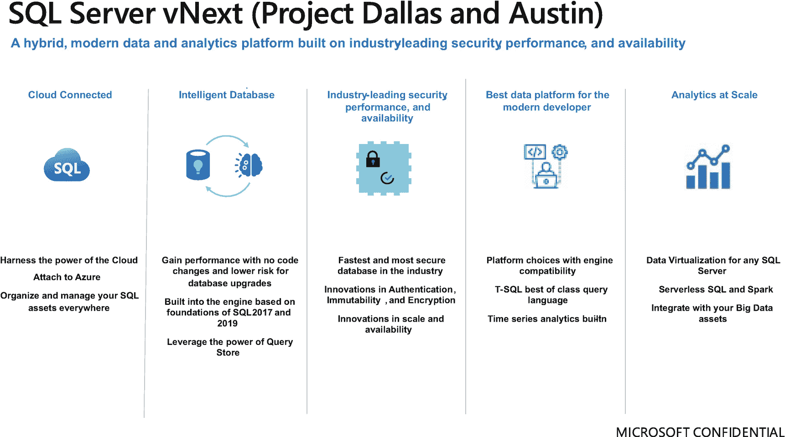
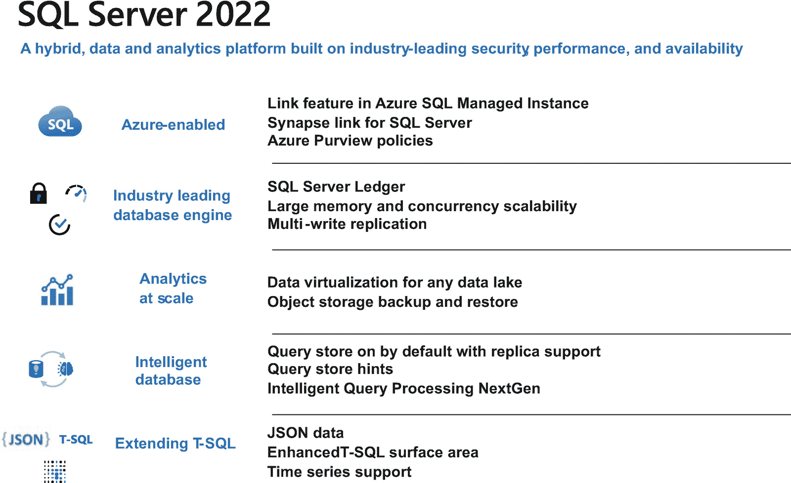

# 1. 项目 Dallas 演变为 SQL Server 2022

`SQL Server 2022` 在 `SQL Server 2019` 发布之前就已在酝酿之中。在本书的这一章中，我将带你了解 `SQL Server 2022` 的历史，它始于一个项目，并最终成为 `SQL Server` 历史上最成功的版本之一。

我还将介绍为什么你会希望考虑使用 `SQL Server 2022` 作为数据平台，因为它连接云端、具备智能且经过行业验证。

我的目标是，你读完本章后会感到兴奋，并渴望深入研读后续章节，以了解所有你需要知道的关于 `SQL Server 2022` 的细节。

## 达拉斯项目

2019 年 12 月，我庆祝了 SQL Server 2019 的发布，并与位于雷德蒙德微软园区 43 号楼的 SQL Server 团队所有同事相聚。对于 SQL Server 和我个人而言，那都是一段令人振奋的时光。在刚过去的一个日历年里，我飞行了大约 50,000 英里，向外界推广 SQL Server 2019。我还发行了我的第二本书`SQL Server 2019 Revealed`（[`https://aka.ms/sql2019book`](https://aka.ms/sql2019book)），讲述了我们最新版 SQL Server 发布的完整故事。我为这次发布感到自豪，并向工程团队的许多人讲述了所有来自客户的积极反馈和故事。在那次行程中，我在由微软杰出工程师、SQL Server 2019 发布首席开发经理斯拉瓦·奥克斯组织的一次内部会议上，向参与发布的全体工程师发表了演讲。

在雷德蒙德期间，我花了一些时间与我在 CSS 的长期好友罗伯特·多尔叙旧，他现在为斯拉瓦工作。午餐时，我向鲍勃讲述了所有旅途见闻以及发布产品和著书的经历。SQL Server 2019 被斯拉瓦、特拉维斯·赖特和托比亚斯·特恩斯特罗姆标记为西雅图项目。午餐时我告诉鲍勃：“嘿，我想你和我应该为下一版 SQL Server 想个项目名。”鲍勃比我晚入职一年，所以我们加起来代表了超过 55 年的 SQL Server 经验。那天鲍勃（他经常这样）穿着一件达拉斯牛仔队的球衣。我提议项目名称应该叫达拉斯。午餐后，我顺道去了斯拉瓦的工位，向他提出了这个想法。他告诉我：“这很有道理。这个新版本应该是对多年来为 SQL Server 辛勤工作的两位‘鲍勃’的致敬。”斯拉瓦第二天就给我们团队发了一封邮件，于是达拉斯这个项目名就此诞生。有时候，微软的项目名称就是这样创造出来的。

尽管我们刚刚发布了 SQL Server 2019，但关于达拉斯项目可以包含哪些新功能的讨论早已开始。对我来说，我的工作重点将发生巨大变化。在这同一次行程中，我与我的经理、负责整个 Azure SQL 和 SQL Server 程序管理的副总裁阿萨德·汗进行了会晤，这将引导我开始从事 Azure SQL 方面的工作。但我仍然密切关注着达拉斯项目的进展。

早在 2019 年 12 月末，我的同事阿米特·班纳吉就在为该项目准备提案。当我们迈入 2020 年时，我和任何人都没有料到，我们所有人都将不得不适应一场全球疫情。坦率地说，疫情加速了我们在云端的工作，这导致达拉斯项目的规划进度放缓。好消息是，基于我们的工程系统，我们在云端设计和构建的大部分工作都自然适用于 SQL Server；智能查询处理和 SQL 账本就是很好的例子。

对我个人而言，专注于云端工作非常合适，因为我当时已经走上了从事 Azure SQL 工作的道路。我没想到疫情会加速这项工作，其形式是与安娜·霍夫曼合作开发 Azure SQL Workshop（[`https://aka.ms/azuresqlworkshop`](https://aka.ms/azuresqlworkshop)），这进而催生了广受欢迎的 Azure SQL 基础知识学习路径（[`https://aka.ms/azuresqlfundamentals`](https://aka.ms/azuresqlfundamentals)）以及一个名为 Azure SQL 入门系列的大型视频系列（[`https://aka.ms/azuresql4beginners`](https://aka.ms/azuresql4beginners)）。既然我们的内容已经全部转向数字化，为什么不写第三本书呢？于是`Azure SQL Revealed`（[`https://aka.ms/azuresqlbook`](https://aka.ms/azuresqlbook)）在 2020 年秋季应运而生。

但达拉斯项目怎么样了呢？

在 2020 年全年，在开发方面由斯拉瓦领导、程序管理方面由阿米特领导，达拉斯项目的工作已经启动。一个例子是项目名为盖亚下的并行度反馈功能。盖亚雄心勃勃，是我们仍在努力的一项事业，但并行度反馈的概念从中诞生，你将在本书第 5 章听到更多相关内容。其他功能，如参数敏感型计划优化、跨平台备份、缓冲池扫描、查询存储提示、多写入复制、SQL 账本、T-SQL 语言改进等等，都在进行中。我们正在积极推进达拉斯项目的改进工作，但尚未真正确定一个完整的发布计划。同样，我们现在的做事方式很酷的一点是，这些功能中有许多是为 Azure SQL 设计的，但我们知道由于引擎的兼容性，它们随时可以融入到达拉斯项目中。

随着 2020 年继续推进，我越来越清楚地意识到，达拉斯项目最早也要到 2022 年才能真正发布。2020 年末，我与斯拉瓦、阿米特、阿萨德和特拉维斯·赖特开会讨论计划。我们所有人，连同我们的 Azure 数据副总裁罗翰·库马尔，都一致认为我们需要一个新版的 SQL Server，宜早不宜迟。但我们也一致认为，在 2022 年之前仓促行事不会带来一个出色的版本。在 2020 年末，我第一次听到了`SQL Server 2022`这个词。

## 项目背景与团队变动

当本书出版时，我在微软从事 SQL 相关工作就将满 29 年了。这些年来，我目睹了无数的变更、重组和过渡，多到自己都记不清了。但在 2021 年日历年初发生的两件事令我惊讶，并让我为达拉斯项目感到担忧。斯拉瓦·奥克斯离开了 SQL 团队，转去从事 Azure 工作（注：斯拉瓦最终于 2021 年秋季离开了微软），而阿米特·班纳吉则离开了微软。此外，特拉维斯·赖特从程序管理领导团队转岗，成为 Azure Arc 的开发经理。对我个人而言，失去斯拉瓦这样的人相当艰难。我与斯拉瓦在 SQL 领域共事了 20 年。我们一起经历了所有旅程（斯拉瓦就是那个教我调试的人，万一有人想知道这个小事实；在遇到斯拉瓦之前，我以为自己知道什么是调试），从 SQL Server 2005 到 Linux 上的 SQL Server，当然还有 SQL Server 2019。我也会深深怀念阿米特。实际上，阿米特刚加入微软时，我曾担任他的导师，后来我们作为工程部门的同事度过了那么多年。我本非常期待与阿米特合作发布达拉斯项目。但我知道，他即将投身的新机遇对他和他的家庭很重要。我为这些人感到高兴和兴奋，但正如你所能想象的，我很快就与阿萨德·汗开了几次会，讨论如何应对这种情况，并确保达拉斯项目继续推进。

对于其他团队或其他公司来说，失去这样的领导者可能会动摇根基，极大地影响产品发布能力。但 SQL Server 不会。阿萨德仍然是我们的程序管理负责人。长期担任 SQL Server 和 Azure SQL 工程领导的彼得·卡林将成为我们所有 Azure SQL 和 SQL Server 的副总裁（如今甚至负责更多）。罗翰·库马尔仍然是我们的 Azure 数据副总裁。微软技术院士、SQL 资深专家哈努玛·科达瓦拉将成为我们所有开发人员的工程负责人，致力于让达拉斯成为现实。阿萨德将提拔著名的乔·萨克来负责整个 SQL Server 的程序经理团队。在一个重大举措中，我们提拔佩德罗·洛佩斯担任达拉斯项目的技术负责人程序经理。佩德罗不仅是一位极具才华、备受尊敬的技术领导者，也是我个人称为朋友的人。嗯，我想，我们还有我。SQL Server 已融入我的血液，因此我当然需要坚持到底，无论遇到什么挑战，都要亲眼见证达拉斯项目完成。

在 2021 年春季的这些组织公告发布的同时，我们也初步确定了达拉斯项目的几个关键方面：

*   达拉斯项目将命名为 SQL Server 2022。
*   我们将于 2021 年秋季宣布此版本为私人预览版。
*   我们将于 2022 年春末宣布公开预览版。
*   我们的目标是在 2022 年秋季实现 SQL Server 2022 的正式发布。

## 构建演示文稿与发布策略

为了实现 2021 年秋季发布私人预览版的目标（我们当时已决定在 2021 年 11 月初的 Microsoft Ignite 虚拟活动上宣布此事），我们必须比以往任何时候都更有条理，并开始加紧构建一些版本。乔指派佩德罗作为我们事实上的发布程序经理，负责掌控全局，确保每个人都满足发布标准，并为宣布做好功能准备。

我们的市场团队指派马修·巴罗斯担任 SQL Server 2022 的首席市场经理。马特迅速开始组织每周的虚拟团队会议，讨论 SQL vNext（在 100%确定确切名称之前，我们总是将版本称为`vNext`），与会者包括我本人、乔·萨克、佩德罗·洛佩斯、詹姆斯·罗兰-琼斯和索尼娅·韦特曼（索尼娅与马特在市场部合作，在整个发布过程中贡献巨大）。我们很快为这个团队增添了另一位成员，肯德尔·范·戴克。乔聘请肯德尔来管理我们的早期采用计划（`EAP`），因为我们的首次宣布将是一个私人预览计划，要求客户向微软注册以测试和试用早期版本。肯德尔是微软的资深客户工程师，在社区和微软内部都备受尊敬。

我很快与佩德罗和乔会面，询问我能如何最好地帮助我们迈向私人预览版。他们俩都非常迅速地回答：“给我们做一个演示文稿！”

于是，在 2021 年春末，我开始“做我擅长的事”，构建一份可供使用的“保密协议”（NDA）演示文稿（供任何与微软签有保密协议的人使用）。最初尝试概述 SQL Server `vNext`的幻灯片如下面的图 1-1 所示。

图 1-1：第一张 SQL Server `vNext` 幻灯片

你可以看到图 1-1 中并没有列出任何具体功能，只是一些主题。另外，你会注意到当时我们仍在讨论大数据集群（`BDC`）的未来。由詹姆斯·罗兰-琼斯命名的奥斯汀项目，是早期提出的一个用无服务器 SQL 和 Spark 来重塑`BDC`的方案。

**注意**
你可能已经读到，我们在 2022 年 2 月宣布了 SQL Server 大数据集群的退役，这也解释了为什么它不是 SQL Server 2022 版本的一部分。你可以在 [`https://cloudblogs.microsoft.com/sqlserver/2022/02/25/the-path-forward-for-sql-server-analytics`](https://cloudblogs.microsoft.com/sqlserver/2022/02/25/the-path-forward-for-sql-server-analytics) 阅读更多信息。

我知道达拉斯项目所有计划的功能，但当时我还不能百分之百确定我们可以谈论所有功能。有一件事我是知道的，那就是这些“支柱”代表了该版本功能的主要类别。

为了给真正的 SQL Server `vNext`公开演示文稿奠定基础，我们首先需要确定名称。大约在 Ignite 大会前 1 个月，我们从马修·巴罗斯那里得到了确认。名称就是 SQL Server 2022。我们也更清晰地了解了所有已知会纳入该版本的功能，因此我制作了这个包含主要功能的第一个版本的 SQL Server 2022 全景幻灯片，并对类别进行了一些品牌重塑，如下面的图 1-2 所示。

图 1-2：第一张 SQL Server 2022 全景幻灯片

## 功能展示与保密策略

考虑到这一点，我们都决定对 SQL Server 2022 的宣布保持高度保密。我仍在进行虚拟演讲，甚至是面对面的演讲（是的，是真的，我早在 2021 年 6 月就开始在诸如 SQL Server 和 Azure SQL Conference 等线下活动中演讲了）。而我总会被问到这个问题：“下一个版本的 SQL Server 什么时候发布？”或者更妙的是，“还会有新版本的 SQL Server 吗？”这两个问题都很合理，因为我们对此事一直非常低调，而且到 2021 年夏季，距离我们发布 SQL Server 或甚至谈论它，已经过去了将近 2 年。

随后，我制作了更多幻灯片来详细说明这些领域中的每一个，包括所有已知会纳入该版本的功能。我定期与佩德罗协商，确切确认我们可以承诺哪些内容会包含在版本中，即使它不会立即出现在私人预览版的构建中。

