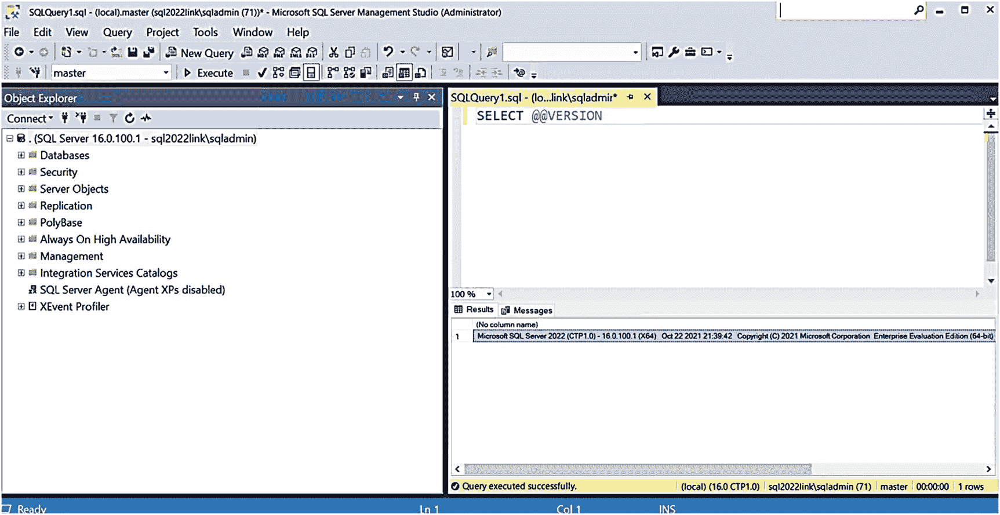
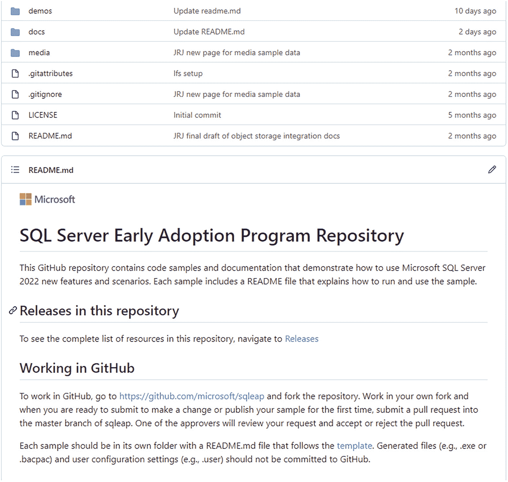

# 宣布推出 SQL Server 2022

筹备如此规模的发布活动绝非易事，我们整个团队在整个十月里不眠不休地工作，直到 Ignite 大会宣布前夕，才将一切准备就绪。

Asad Khan 和 Anna Hoffman 录制了他们宣布 SQL Server 2022 的 Ignite 演讲（你可以在 [`https://learn.microsoft.com/en-us/events/ignite-nov-2021/azure/breakouts/brk225/`](https://learn.microsoft.com/en-us/events/ignite-nov-2021/azure/breakouts/brk225/) 观看他们的原始会议录像）。

Joe、Pedro 和 Kendal 努力确保所有事项安排妥当，以便准备好 Private Preview 版本和 EAP 注册设置。

Matthew 和 Sonya 负责让我们的主网站 ([`https://aka.ms/sqlserver2022`](https://aka.ms/sqlserver2022)) 上线运行，并构建博客。该博客将由我们 Azure Data SQL 工程部门的企业副总裁 Peter Carlin 撰写（我的经理 Asad Khan 向 Peter 汇报，而 Peter 向 Rohan Kumar 汇报），网址是 [`https://cloudblogs.microsoft.com/sqlserver/2021/11/02/announcing-sql-server-2022-preview-azure-enabled-with-continued-performance-and-security-innovation`](https://cloudblogs.microsoft.com/sqlserver/2021/11/02/announcing-sql-server-2022-preview-azure-enabled-with-continued-performance-and-security-innovation)。

在我们为盛大的发布公告做准备期间，著名的 Microsoft Mechanics 团队（由 Jeremy Chapman 领导）联系了我，希望录制一期关于 SQL Server 2022 的 Mechanics 视频。Microsoft Mechanics ([`https://aka.ms/microsoftmechanics`](https://aka.ms/microsoftmechanics)) 就是一个很酷的团队。他们为演示、脚本和动画所做的准备堪称奇迹。我在发布公告前的几周，在德克萨斯州北里奇兰山的家中，一次录制就完成了会议内容！成果是一个非常受欢迎的视频，地址是 [`https://aka.ms/sqlmechanics22`](https://aka.ms/sqlmechanics22)。它成为 Microsoft Ignite 期间观看次数最多的视频。这类视频也是一个强大的驱动力，能促使演示在早期构建版本上也能正常工作。我能够与托管实例团队合作，使托管实例的链接功能得以运行（Anna 在 Asad 的会议中也演示了此功能），所用的正是 SQL Server 2022 和 SSMS（SQL Server Management Studio）的早期构建版本。我与团队合作让 Synapse Link 正常工作，并制作了一个有趣的演示（非常感谢 Anna 在 Spark 中构建了一个机器学习模型），其中还带点德克萨斯风情！然后还有一个演示，可能你在阅读本书时会发现它是我最喜欢的功能：参数敏感计划（PSP）优化。PSP 是“纯引擎”功能，所以我启动了一台带有“预 CTP”版本的 Azure 虚拟机，并修改了 Pedro Lopes 和我的好朋友、开发人员 Jack Li 给我的一个演示。

在发布公告前的几周，Joe Sack 要求我为我们的一些关键合作伙伴做几次关于 SQL Server 2022 的保密演示，为他们的发布做准备。做这些演示相当有趣，因为这是我第一次在微软之外向任何人透露 SQL Server 2022 的信息。

关于 SQL Server 2022 Private Preview 发布的最后一点推广是与英特尔合作在《连线》（*WIRED*）杂志上发表一篇文章。最终的文章网址是 [`https://www.wired.com/sponsored/story/data-is-driving-the-future-of-business`](https://www.wired.com/sponsored/story/data-is-driving-the-future-of-business)，发布时广受欢迎，获得了很多浏览量，热度持续数月。

对我来说另一个有趣的转折是在 2021 年 10 月底 Ignite 前一周前往雷德蒙德出差。由于疫情，我自 2020 年 2 月以来就没有去过雷德蒙德。我去雷德蒙德有几个原因。首先，我需要在我们的微软演播室与 Matt Burrows 和 Anna Hoffman 一起录制一个关于 SQL Server 2022 的网络研讨会。你可以随时观看该网络研讨会：[`https://aka.ms/sqlserver2022webinar`](https://aka.ms/sqlserver2022webinar)。第二个原因是为 PASS 峰会的主题演讲录制一个演示，与 Rohan 和 Peter Carlin 一起。录制这个很有趣，因为我使用了为 Microsoft Mechanics 做的 PSP 演示，但转折点在于让 Conor Cunningham 在我录制时打断我。我们稍微计划了一下，但有趣的是我们第一次尝试就捕捉到了这个场景。这做起来很有趣，因为我们俩都习惯了在 Rohan 主持的 PASS 主题演讲中现场登台，而这在 2021 年无法实现。你可以在 [`https://youtu.be/Ydlg1KpmrKU?list=PLoGAcXKPcRvYWLmrDZJ9XTdSJAduAefm7`](https://youtu.be/Ydlg1KpmrKU?list=PLoGAcXKPcRvYWLmrDZJ9XTdSJAduAefm7) 观看该主题演讲的录像。我前往雷德蒙德的第三个原因是与一些同事面对面会面，这是我们近两年来的第一次。能再次见到大家真是太好了。当我在那里时，负责我们 MVP 计划的 Rie Merrit 问我是否能为 MVP 们做一个 SQL Server 2022 的预览公告，因为我们下周就要进行重大发布了。做那个环节真的很有趣，因为这是我第一次向相当多的观众介绍 SQL Server 2022。我习惯于保守这类机密信息，但这仍然很难。例如，我们为 Ignite 后一周的 PASS 峰会预留了 SQL Server 2022 的会议时段，但甚至无法告诉 PASS 活动组织者我们会议的细节。此外，Thomas LaRock 邀请我和其他人在 11 月于奥兰多举行的他们的 SQL Live 活动上发言 ([`https://sqllive360.com/ECG/live360events/Events/Orlando-2021/SQL.aspx`](https://sqllive360.com/ECG/live360events/Events/Orlando-2021/SQL.aspx))，我预留了一个名为“保密的 Microsoft SQL 工程会议”的环节。组织者问我：“关于这个你就不能再多透露一点吗？”我的回答是：“真的不能。”在 MVP 会议上，我能听到 Thomas 在心里想：“啊，原来这就是 Bob 不能告诉我们的原因。”我在 12 月于拉斯维加斯举行的 SQL Server 和 Azure SQL 会议（原 SQLIntersection）上做演讲时也遇到了同样的问题。

那是旋风般的一周，也标志着我入职微软 28 周年。从 SQL OS/2 到现在，我从未想过自己仍会从事 SQL Server 的工作。

最终，在 11 月 2 日的 Microsoft Ignite 大会上，Scott Guthrie 宣布了 SQL Server 2022。我们在 Ignite 上推出了所有其他资源，同时也推出了 Asad 的会议。我也觉得 LinkedIn 可以成为一个强大的发布公告的工具，所以在发布当天，我在 [`www.linkedin.com/posts/bobwardms_activity-6861322082387664896-mBzK`](http://www.linkedin.com/posts/bobwardms/activity-6861322082387664896-mBzK) 撰写了一篇 LinkedIn 文章。

我认为 SQL Server 2022 Private Preview 的反响非常积极。坦率地说，我认为业界和社区的许多人都曾怀疑我们是否会再开发另一个主要版本的 SQL Server。我个人看到了一些评论和反馈，人们惊讶地发现我们不仅在开发新版本，而且还包含了一些相当重大的增强功能，包括所有 Azure 连接功能、内置查询智能、SQL Ledger 和数据虚拟化。这次宣布有点尴尬，因为我们是从 Private Preview 开始的，这不同于我们宣布 SQL Server 2019 的方式。SQL Server 2017 有过先例，但我意识到这给一些急于下载程序集并查看其内部内容的人带来了挫败感。


## 私有预览至公开预览

在宣布 Joe Sack 离开后，我接到了我在微软的长期好友 Ajay Jagannathan 的电话。Ajay 告诉我，他将接替 Joe 来管理 `SQL Server`（以及 `Azure Arc data`）的所有项目管理。我们在微软有深厚的人才储备，因此知道 Ajay 和 Pedro 将领导我们发布 `SQL Server 2022` 的工作，这让我精神为之一振。

年初，我们遇到了一些挑战（这也给本书的写作带来了一些挑战），并遇到了一些意外。最大的挑战是，我们为 `SQL Server 2022` 宣布的几项功能在当时的 `CTP` 版本中尚未可用。`CTP 1.0` 是 2021 年 11 月发布的第一个版本，随后是 2021 年 12 月的 `CTP 1.1` 和 2022 年 1 月的 `CTP 1.2`。你可以在下图 1-4 中看到我的 `SSMS` 连接到第一个官方的 `CTP` 版本。



`CTP` 版本的 `SQL` 查询窗口截图。左侧列出了对象资源管理器文件，右侧显示了 `SQL` 查询结果。

图 1-4

`SQL Server 2022` 的第一个 `CTP` 版本

不幸的是，并非所有功能在当时都已完全就绪，有些甚至还没有出现在这些早期的 `CTP` 版本中。好消息是，我们的 `PM` 团队已经开始由 Kendal Van Dyke 创建的 `GitHub` 仓库中记录现有功能。下图 1-5 展示了我们在私有预览期间使用的 `GitHub` 仓库。



`SQL Server` 早期采用计划仓库的截图。它列出了版本和工作中的 `GitHub` 文件，顶部有几个文件夹。

图 1-5

私有预览 `GitHub` 仓库

这些挑战也带来了巨大的发展势头。我发现许多微软内部的客户团队和销售小组都希望我向他们介绍 `SQL Server 2022`。关于 `SQL Server 2022` 新功能（尤其是云连接功能）的消息传播得很快。微软的同事们希望尽快了解这些内容，以便开始向他们的客户进行培训。

随后我发现，我将再次踏上征途，参加比我想象中更多的活动。`SQLBits` 将于 2022 年 3 月在伦敦恢复线下举行。`SQL Server and Azure SQL Conference` 于 2022 年 4 月在拉斯维加斯举行。`Dell Technologies World` 也于 2022 年 5 月初在拉斯维加斯恢复线下举行。在每一个活动中，我都传达了关于 `SQL Server 2022` 及其丰富功能的信息（在我众多同事的大力协助下才得以实现这一切）。

然后，就在我们准备发布 `SQL Server 2022` 的第一个公开预览版（`CTP 2.0`）时，我的朋友 Pedro Lopes 宣布他将于 2022 年 5 月离开微软。我们的团队在失去这些 `SQL Server` 的关键专家和领导者之后，还能否成功交付？尽管看到 Pedro 离开让我感到难过，但当我看到团队中的其他人挺身而出时，我意识到了一些事情。我们都怀着极大的热情去做正确的事情，以构建并交付一个伟大的产品。一个重要的产品。一个有价值的产品。

## 通往正式发布之路

我们继续前进，并于 2022 年 5 月底在 `Microsoft Build` 虚拟大会上宣布了第一个公开预览版。你可以通过 [`https://aka.ms/sqlserver2022build`](https://aka.ms/sqlserver2022build) 查看我本人和其他人在 `Build` 上的演讲。夏天过得很快。我在 `HPE Discover`、`Microsoft Inspire`、`Data Platform Summit` 以及各种用户组和 `Data Saturday` 活动上，对内对外都介绍了 `SQL Server 2022`。在此期间，我们将 `CTP` 版本更新到了 2.1，然后在 2022 年 8 月推出了第一个候选发布版本（`Release Candidate`）。当一个候选发布版本出现时，你就知道正式发布（`General Availability`）即将到来。在我对本章进行最后更新时，正式发布已经非常接近了。我很兴奋地知道我们将“名副其实”。

对我来说，写书面临一个有趣的挑战，因为我希望在产品发布之前，尽可能地将预览版中出现的每一个功能更新都纳入书中。我相信我已经做到了这一点，但在某些章节中，你会发现一些“在撰写本书时”这样的表述。

Ignite 大会之后就是著名的 `PASS Summit`，现在由 `Redgate` 组织和运营，2021 年的活动完全在线上举行。`Microsoft` 是主要赞助商，因此我安排了我们在微软的团队将就 `SQL Server 2022` 进行四场演讲：

*   ``SQL Server 2022 简介`` - 这是一场关于 `SQL Server 2022` 所有新宣布功能的“全面”会议。
*   ``SQL Server 2022：混合数据平台`` - 我也主持了这场会议，更深入地探讨了 `SQL Server 2022` 所有与 `Azure` 连接的功能。
*   ``SQL Server 2022 存储引擎功能`` - 我请 `David Pless` 深入讲解 `SQL Server 2022` 的核心引擎领域：安全性、性能和高可用性。
*   ``Azure SQL 与 SQL Server 2022：智能数据库未来`` - 我请 `Pedro` 深入讲解 `SQL Server 2022` 新的内置查询智能功能。

我们的会议出席率很高，我认为调查结果显示人们对此感到兴奋。这是因为在虚拟的 `Microsoft Ignite` 期间，我们没能真正详细探讨 `SQL Server 2022` 的所有功能。`PASS` 是我们首次有机会在公共场合为社区做到这一点。如果你注册了该活动（全体会议是免费的），你可以观看我们演讲的录像。但你也可以在 [`https://aka.ms/sqlserver2022decks`](https://aka.ms/sqlserver2022decks) 查看我们使用的原始演示文稿（使用 `Private Preview` 文件夹查看我们的原始幻灯片）。如果你仔细观察这些幻灯片的第一页（如下方图 1-3 所示），你会注意到一张德克萨斯州达拉斯市中心的图片，以向项目 `Dallas` 致敬。背后的故事是，在 2021 年 10 月录制的网络研讨会中，我们的制作团队设计了一个很酷的开场幻灯片，上面有一个城市市中心，但那是芝加哥（只是为了展示一个很酷的市中心图像——他们当时不知道项目名称）。我请团队将其改为达拉斯市中心的图片。这算是我在原始幻灯片中埋下的一个“复活节彩蛋”，以向我们的项目名称致敬。


`Microsoft SQL server 2022` 的原始介绍幻灯片，右侧是城市的摩天大楼景观。提到了首席架构师 `Bob Ward` 的名字。

图 1-3

包含达拉斯市中心图片的 `SQL Server 2022` 介绍幻灯片

当时间接近 2021 年底时，有人告诉我，我们的 `PASS Summit` 会议仅对注册该活动的人免费开放。于是我询问 `Rie Merrit` 是否认识谁可以 hosting 我做一个关于 `SQL Server 2022` 的免费虚拟演讲。`Rie` 很快找到了 `Virtual DBA Fundamentals` 小组，因此我为他们做了一次 `SQL Server 2022` 的整体介绍，你可以在 [`https://youtu.be/M1h4kSZYdu4`](https://youtu.be/M1h4kSZYdu4) 观看。此后不久，我发现 `PASS` 已将他们所有的 `SQL Server 2022` 会议发布在 `PASStv` 上：[`https://www.youtube.com/user/SQLPASSTV/videos`](https://www.youtube.com/user/SQLPASSTV/videos)。

一切在 2021 年 12 月之前都进展顺利，我们士气高涨，准备在 2022 年大干一场。然后有一天，`Joe Sack` 打电话告诉我他要离开 `Microsoft`。尽管我为 `Joe` 追求新的机会感到高兴，但私下里我感到心碎，因为 `Joe` 不仅是我的朋友，而且我真的认为他对 `SQL Server 2022` 的成功至关重要。但 `SQL Server` 不仅仅是一个人的事。它是微软历史上最成功的产品之一的传承和传统。我知道我们仍然拥有合适的人选来确保在 2022 年成功交付这个产品。

```
if (condVar > someVal) {console.log("xxx")}
```


