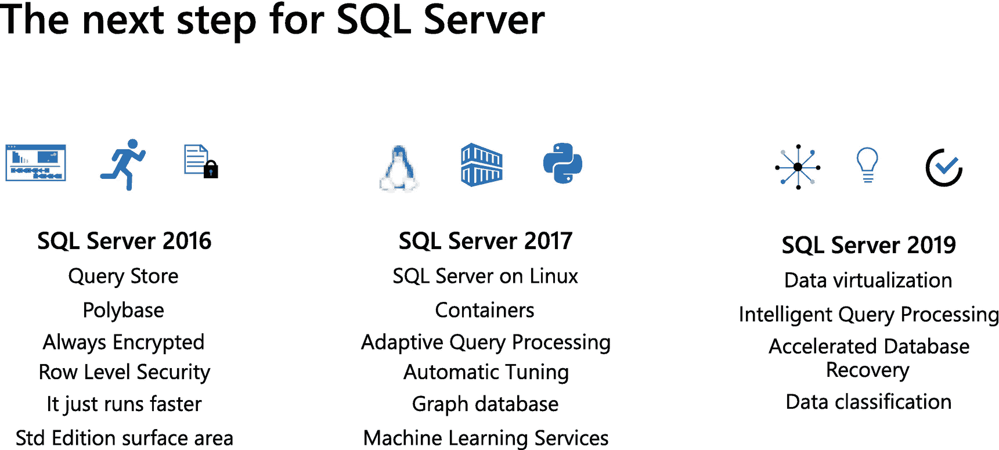
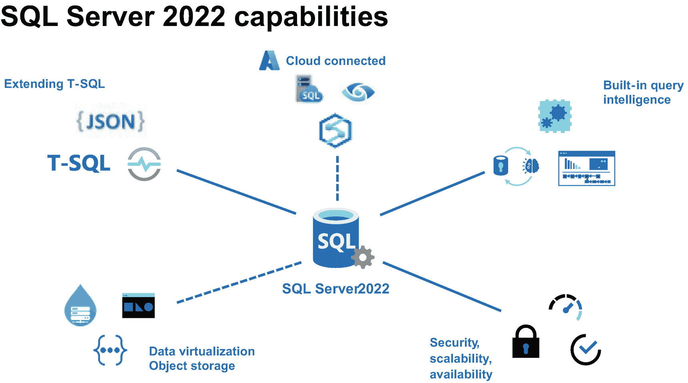

# SQL Server 2022 简介

既然您已经了解了 SQL Server 2022 的发布历程和“幕后故事”，让我们来概览一下 SQL Server 2022 包含哪些内容，为本书后续章节做好铺垫。

## 基于坚实基础构建

我在 2018 年和 2019 年环游世界，在大型活动和直接面向客户宣讲 SQL Server 2019 时，学到了一点：我忘了谈论之前的版本以及 SQL Server 2019 的基础。

一幅题为“SQL Server 下一步”的图解。它包含了 SQL Server 2016、2017 和 2019，以及各年份对应的 SQL 功能。

图 1-6. 先前 SQL Server 版本的主要功能

与我交谈的客户甚至尚未使用 SQL Server 2016，也不知道诸如 `查询存储`、`PolyBase`、`始终加密` 或 `智能查询处理` 等功能。这不是他们的错，而是我的错，因为我没有更广泛地宣传 SQL Server 2016 和 2017。SQL Server 的版本是累积性的，因此您在本书中学到的关于 SQL Server 2022 的一切，都包含了如图 1-6 所示的功能。*《SQL Server 2019 揭秘》* 可以让您深入了解 SQL Server 2019 的内容，当您升级到 SQL Server 2022 时也能获得这些功能。更重要的是，我们在 SQL Server 2022 中构建的新功能是作为对这些现有功能的 `增强`，或以新颖创新的方式加以运用。了解这一背景后，让我们来看看 SQL Server 2022 主要的 `新` 增强功能。

## 能力之轮

2019 年，我为 SQL Server 2019 的演示文稿制作了一张带有“象限”的幻灯片，以展示该版本的主要功能。（您可以在 *《SQL Server 2019 揭秘》* 的第一章中看到这张幻灯片。）在宣讲 SQL Server 2019 几次后，我开始称它为我的“相机幻灯片”。这是因为每当我在活动上展示它时，每个人都会拍照（这让我感到非常谦卑）。但其理念是一致的：创建一张捕捉该版本主要功能的幻灯片。

对于 SQL Server 2022，我做了类似但有所不同的东西。图 1-7 展示了我称之为“能力之轮”的图解。

一幅 SQL Server 2022 功能图解。它由中心的 SQL Server 2022 组成，连接着扩展 T-SQL、云连接、内置查询、安全和数据虚拟化等功能。

图 1-7. SQL Server 2022 “能力之轮”

“虚线”表示 SQL Server 可以连接到服务器或虚拟机外部源的领域。并非每个领域的投入程度都相同，但这为我们的功能提供了一个很好的分类。当您阅读本书后续章节时，您会看到有几章就是围绕着这个轮子的“辐条”组织的。

## 云连接

云连接代表了一系列功能，能够以前所未有的新颖且令人兴奋的方式将 SQL Server 连接到 Azure。这些云连接功能使 SQL Server 2022 在 `混合计算` 领域占据了独特地位。您将在本书第 3 章中详细了解这些功能的细节。以下是亮点：

- **Azure SQL 托管实例链接功能**
  利用内置的分布式可用性组的强大功能，您现在可以使用 Azure SQL 托管实例进行灾难恢复。Azure SQL 托管实例是一种平台即服务 (`PaaS`) 形式的托管 SQL 实例。您将能够在 SQL Server 2022 和 Azure SQL 托管实例之间来回进行故障转移。此功能的首次迭代采用离线方法（备份和还原），完全在线的故障转移将在未来推出。
- **SQL Server 2022 的 Synapse Link**
  使用您的 SQL Server 2022 实例将操作数据库更改馈送到 Synapse Analytics，以进行近实时分析。这是减少对 `ETL` 应用程序需求并利用 Synapse 的强大功能将 SQL Server 数据与其他数据源结合以支持分析的绝佳解决方案。
- **Microsoft Purview 策略管理**
  大规模管理 SQL Server 资源的身份验证和访问权限可能既繁琐又容易出错。Microsoft Purview 允许您从中心位置发布 `策略`，以管理对 SQL Server 或任何 Azure SQL 虚拟机、实例或数据库的访问。Microsoft Purview 依赖于 Azure Active Directory (`AAD`) 身份验证，该验证现在也可用于 SQL Server 2022。

## 内置查询智能

在 SQL Server 2016 中，我们引入了 `查询存储` 来捕获数据库中的关键性能信息。在 SQL Server 2017 中，我们增强了引擎中的查询处理器 (`QP`)，帮助您在不更改代码的情况下获得更快的性能。在 SQL Server 2019 中，我们通过添加更多查询处理器场景提升了水平，并将其命名为 `智能查询处理` (`IQP`)。

在 SQL Server 2022 中，我们默认启用了 `查询存储`，增加了对只读副本的支持，并引入了提示来影响查询计划。我们为 `下一代` `智能查询处理` 构建了一套新的增强功能，包括一些与 `查询存储` 协同工作的功能。

这是 SQL Server 2022 最令人兴奋的投资领域之一，您将在本书第 4 章和第 5 章中全面了解。

## 经行业验证的数据库引擎

如果没有一个经过行业验证的数据库引擎，我们就没有产品。而如果我们不在每个版本中投入于安全性、可扩展性和可用性，我们就没有引擎。我称此为 SQL Server 的“基本要素”。您将在本书第 6 章中读到许多此类功能，但这里列举一些亮点：

- **SQL Server 账本功能**
  区块链技术可以提供防篡改的更改“账本”，但传统上是在分布式系统中实现的。SQL Server 2022 包含将数据库表声明为 `账本表` 的能力，以提供内置的、防篡改的更改记录。
- **系统页闩锁并发**
  自 SQL Server 成为产品以来，`系统页闩锁并发` 一直是使用 `tempdb` 的工作负载的一个主要痛点。我们通过指导用户如何为 `tempdb` 创建多个文件，并在 SQL Server 2019 中引入 `tempdb` 元数据优化和并发 `PFS` 更新等功能，逐步缓解了这个问题。在 SQL Server 2022 中，我们进一步提高了需要访问其他系统页的操作的并发性。我个人认为我们可能已经实现了 `tempdb` 的“免手动”管理，但您需要亲自体验。
- **包含可用性组**
  我们的客户经常要求的功能现在已成为现实。您现在可以创建 `包含可用性组`，我们会将实例级对象（如 `SQL Server 代理` 作业、链接服务器和登录名）复制到辅助副本。

### 数据虚拟化与对象存储

在 SQL 2016 中，我们引入了一个称为 `Polybase` 的概念。最初的想法是使用 T-SQL 来访问 Hadoop 系统中的非关系型文件格式，而无需移动数据。在 SQL Server 2019 中，我们将这个概念扩展到支持诸如 Oracle、Teradata、MongoDB 和通过 ODBC 驱动连接的 SQL 等数据源。SQL Server 现在可以成为数据虚拟化的 `data hub`。

在 SQL Server 2022 中，我们引入了一种新方法，通过使用相同的 T-SQL 结构来访问其他数据，但在底层使用 REST API 来访问连接器，如 `S3`、Azure Data Lake 和 Azure Blob Storage。此外，我们增加了对常见文件格式（包括 parquet 和 delta tables）的原生识别支持。

与此功能相关但不依赖于它的是，能够将数据库执行 `native backup and restore` 到 `S3 compatible` 的 `object storage` 系统中。这为存储 SQL 备份打开了更多选择，而不仅仅是通过 URL 的磁盘或 Azure Blob Storage。我想你会对我如何使用此功能从 AWS RDS 迁移到 SQL Server 感兴趣。

你将在本书的第 7 章中了解更多关于数据虚拟化和对象存储的细节。

### 为开发人员增强 T-SQL

SQL Server 仍然为开发人员提供了一些最佳的接口和功能。T-SQL 语言对于访问或操作数据的几乎所有场景都非常丰富。我们有一个传统，即使用 T-SQL 语言来访问我们构建的任何新功能。

在 SQL Server 2022 中，我们延续了这一传统，通过增强 T-SQL 函数以处理 `JSON` 格式的数据，基于开发人员反馈和 ANSI 兼容性添加新的和增强的 `T-SQL functions`，并将处理来自 Azure SQL Edge 的 `time series` 数据的 T-SQL 函数引入到 SQL Server 2022 引擎中。

你将在本书的第 8 章中看到所有这些 T-SQL 增强功能的示例。

## 开始使用 SQL Server 2022

你现在已阅读了关于 SQL Server 2022 可能性的概述，并知道本书的后续章节将帮助你学习“力量之轮”这些领域的细节。你可能会问，“我如何获取并开始使用它？”

### 如何获取 SQL Server 2022

除了通过常规许可渠道获取 SQL Server，你还可以从 [`https://aka.ms/getsqlserver2022`](https://aka.ms/getsqlserver2022) 下载 SQL Server 2022 的 Developer 或 Evaluation Edition。

本书的第 9 章向你展示如何下载 SQL Server 容器镜像或 SQL Server Linux 发行版。

另一种获取 SQL Server 2022 的方法是使用 Azure 虚拟机的市场镜像。本书的第 10 章涵盖了在 Azure 中获取和部署 SQL Server 2022 的所有细节。

### 安装 SQL Server 2022

SQL Server 2022 的设置和安装过程与过去的版本相同，只有一些微小的变化。要了解如何安装和部署 SQL Server 2022，请访问 [`https://aka.ms/deploysqlserver2022`](https://aka.ms/deploysqlserver2022)。本书的第 2 章提供了更多关于如何在 Windows 上安装和升级到 SQL Server 2022 的细节。本书的第 9 章涵盖了如何使用容器镜像、在 Linux 发行版上以及在 Kubernetes 集群上安装 SQL Server 2022 的细节。本书的第 10 章涵盖了如何在 Azure 虚拟机上安装 SQL Server 的细节。

### 了解所有功能与版本

虽然本书全面介绍了 SQL Server 2022，但你可能还想查阅我们的文档以了解新功能和示例。此外，我们的文档总是列出每个 SQL Server 版本（如 Enterprise 或 Standard）所启用的确切功能集。使用链接 [`https://aka.ms/sqlserver2022docs`](https://aka.ms/sqlserver2022docs) 查看 SQL Server 2022 文档的最新版本。

### 了解定价与许可

我有时会收到关于 SQL Server 许可的问题，我相信 SQL Server 2022 也不例外。然而，与其尝试解释许可的所有细微差别，最好的参考资料是我们关于定价和许可的文档，地址是 [`https://aka.ms/sqlserver2022licensing`](https://aka.ms/sqlserver2022licensing)。

### 获取 SQL Server 2022 培训

与 SQL Server 2019 和 Azure SQL 一样，你可以通过我们的 workshop 了解更多关于 SQL Server 2022 的知识。使用我们的主要 workshop 站点 [`https://aka.ms/sqlworkshops`](https://aka.ms/sqlworkshops)，或直接访问 SQL Server 2022 workshop [`https://aka.ms/sql2022workshop`](https://aka.ms/sql2022workshop)。我们还计划了一个 Microsoft learning path，地址是 [`https://aka.ms/learnsqlserver2022`](https://aka.ms/learnsqlserver2022)。

我也自称是一个开源演讲者，所以你可以在 [`https://aka.ms/sqlserver2022decks`](https://aka.ms/sqlserver2022decks) 找到我和其他人制作的所有演示文稿。

### 通过我们的博客系列深入了解

通过我们 Microsoft 项目经理的博客系列深入了解每个 SQL Server 2022 功能，地址是 [`https://aka.ms/sqlserver2022blogs`](https://aka.ms/sqlserver2022blogs)。

### 下载本书代码与示例

你可以从本书引言中列出的 GitHub 仓库下载本书所有示例的代码和脚本。与我写的其他书一样，你也可以在 [`https://aka.ms/sql2022bookexamples`](https://aka.ms/sql2022bookexamples) 找到代码、脚本以及本书的任何勘误。

## 云连接、智能且经行业验证的数据平台

我常将 SQL Server 2019 称为现代化数据平台，因为该版本的功能远不止数据库引擎所提供的。SQL Server 2019 提供了构建数据平台所需的能力，包括数据虚拟化、强大的引擎以及机器学习服务。

SQL Server 2022 将混合数据平台提升到了新的高度。它以前所未有的创新方式，按照您自己的条件连接到云。SQL Server 2022 内置查询智能，解决了您和开发人员当前面临的一些最常见且代价高昂的查询调优问题。并且，SQL Server 2022 配备了经过行业验证的数据库引擎，在安全性、可扩展性、可用性、数据虚拟化方面进行了创新，并对世界上最流行的数据库语言 `T-SQL` 进行了增强。

我们的 SQL Server 首席集团项目经理 Ajay Jagannathan 分享了他的看法：

> 这是一个特别的 SQL Server 版本。在为每个主要版本的 SQL Server 进行规划时，我们都会投入大量精力来审视定义该版本的几个关键主题。这包括行业领先的创新、云原生以及任务关键型功能，最重要的是客户和社区的反馈。这帮助我们将 SQL Server 打造成了地球上最流行的商业关系型数据库。对于 SQL Server 2022，让这个版本通过引入一些最新创新（如托管实例的 Link 功能、通过 Azure Synapse Link 进行近实时分析以及通过 Microsoft Purview 进行治理），成为微软智能数据平台不可或缺的一部分，是至关重要的。不仅如此，我们的客户还将能够利用 SQL Server 行业领先的任务关键型能力的进步，这些进步涵盖了围绕 T-SQL 语言、智能查询处理、性能、安全性、可用性和可扩展性等备受期待的主题。并且，通过成为第一个开箱即用支持 Azure Arc 的版本，我们的客户可以在任何地方，在他们选择的环境中，通过混合和多云部署来利用 Azure 的优势。我不仅为整个 SQL Server 产品团队将此版本交付给我们的客户、合作伙伴和社区所完成的工作感到自豪，而且我的好友兼同事 Bob Ward 在这本书中也做得非常出色，帮助深入探讨产品的多个领域，并为读者简化内容。阅读本书将使热情的 SQL Server 用户清晰地理解这些功能，并有能力在其环境中最大化利用这些功能。我迫不及待地希望我们的客户开始使用 SQL Server 2022，并聆听他们利用这些功能解决业务问题的所有精彩场景。

如果您想了解更多关于 SQL Server 2022 的安装和升级体验，可以从第 2 章开始您的旅程。

**注意**
对于那些安装 SQL Server 的老手来说，安装程序变化不大，因此如果您想安装 Windows 版的 Developer Edition 并直接跳到第 3 章开始学习，请直接开始吧！安装中有一个方面会启用一些云连接功能，因此您可能需要先在第 2 章中了解更多相关信息。请记住，使用容器镜像、Linux 和 Kubernetes 安装 SQL Server 的部署指南在第 9 章，如何通过 Azure 虚拟机部署的详细信息在第 10 章。

