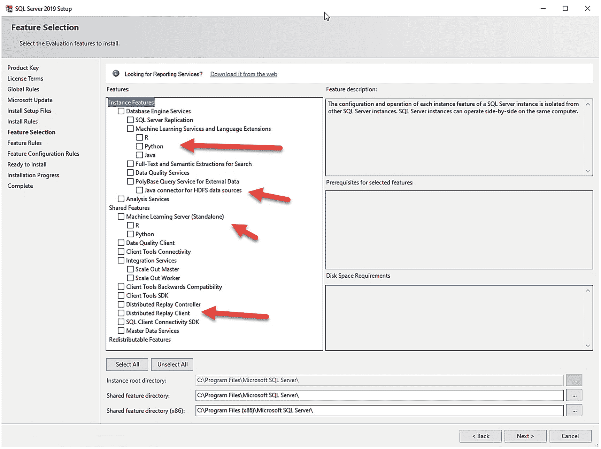
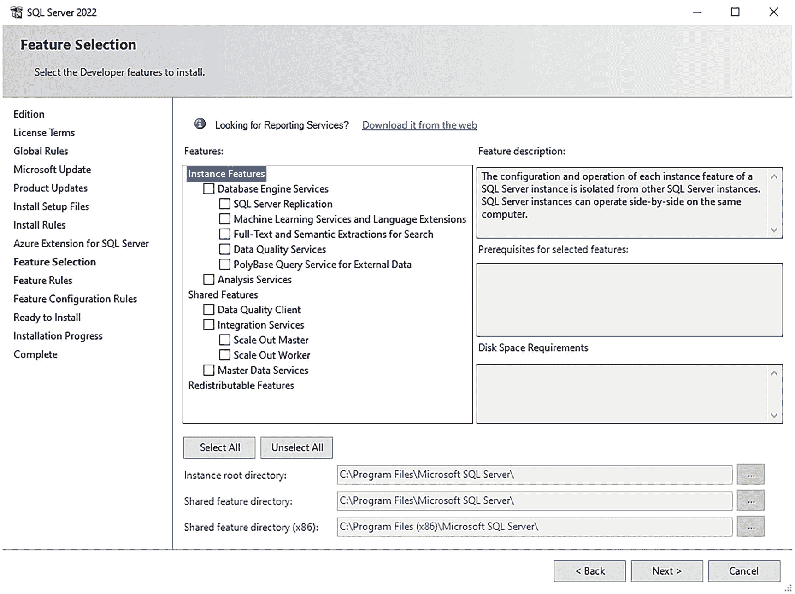
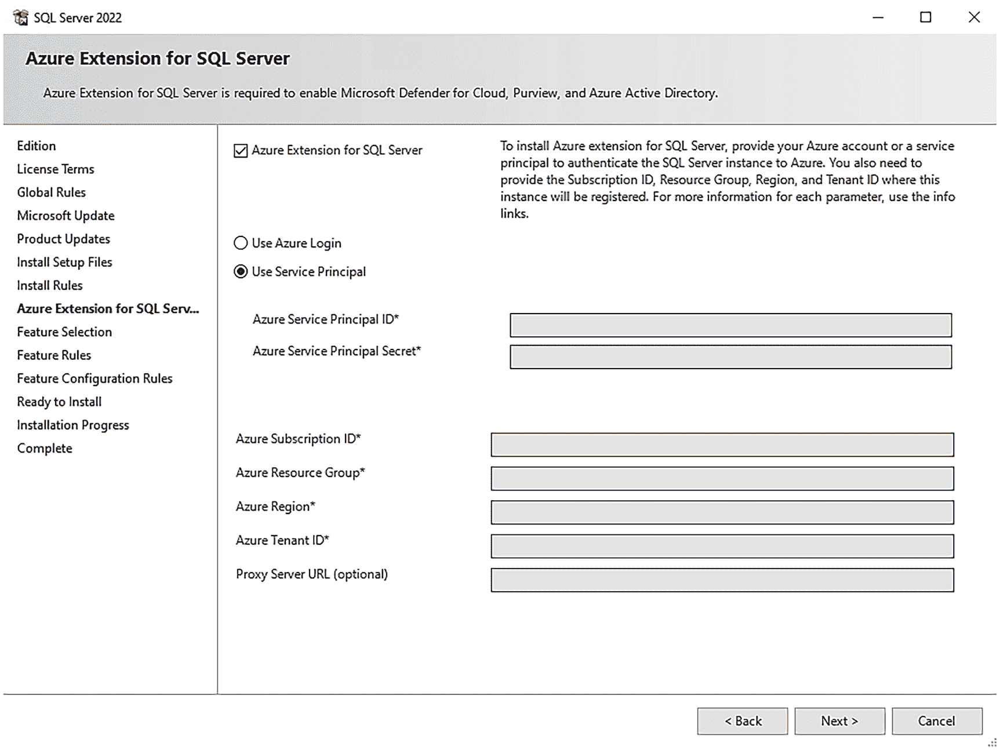
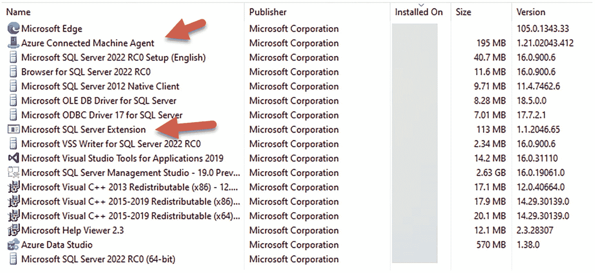

# 2. 安装与升级

您首先想做的事情之一就是安装 SQL Server 2022，以便探索它所提供的所有优秀功能。对于任何熟悉 SQL Server 的人来说，好消息是 SQL Server 2022 的安装体验与之前的版本基本相同，只有一些微小的改变。

如果您是经验丰富的 SQL Server 用户，在本章中您可以回顾 SQL Server 2022 的不同之处。如果您是 SQL Server 的新手，也不必担心。首先，安装过程极其简单，我们的用户体验会引导您完成整个过程。其次，如果您需要一个“分步”流程，请直接访问我们的文档 [`https://aka.ms/deploysqlserver2022`](https://aka.ms/deploysqlserver2022)。

## 如何安装 SQL Server 2022

您可能习惯于通过安装免费的 Developer 或 Evaluation 版 SQL Server 来开始评估该产品。SQL Server 2022 支持这两种版本，所以如果您只想直接开始，请访问 [`https://aka.ms/getsqlserver2022`](https://aka.ms/getsqlserver2022) 并开始测试！

我知道有些人希望在“直接获取二进制文件”之前了解更多关于 SQL Server 安装的信息。在本章的这一部分，我将回顾安装 SQL Server 的先决条件，并讨论与之前版本的差异以及部署选项。

本章这一部分重点介绍在 Windows 上安装 SQL Server。本章后面标题为“在其他平台上部署”的部分将讨论在 Linux、容器、Kubernetes 和 Azure 上的安装。在这些平台上部署的详细信息可以在本书的第 9 章和第 10 章中找到。

### 先决条件

在 Windows 上安装 SQL Server 2022 的先决条件（包括所需资源）与之前的 SQL Server 主要版本相比没有变化，除了我们支持的特定 Windows 操作系统版本或 Linux 发行版。和过去一样，我们将支持“官方”支持的 Windows Server 和 Windows（客户端）版本，包括所需的任何特定 Windows 更新。请查阅 [`https://docs.microsoft.com/sql/sql-server/sql-server-2022-release-notes`](https://docs.microsoft.com/sql/sql-server/sql-server-2022-release-notes) 上的 SQL Server 2022 发行说明，了解 SQL Server 2022 先决条件的任何可能变更。

与之前版本的 SQL Server 相比，先决条件的一个不同之处是需要连接到 Azure 以支持一些新的*云连接*场景。最重要的要求是，如果您在安装过程中选择设置 Azure 连接的场景，您将需要一个 Azure 订阅和一个服务主体。

**注意**
一些云连接场景，如托管实例和 Synapse Link，在安装过程中不需要任何特殊步骤。而像 Azure Active Directory (`AAD`) 和 Microsoft Purview 集成这样的新功能则需要此配置。

我将在本章后面标题为“为 SQL Server 设置 Azure 扩展”的部分描述此要求的确切步骤。我还将在本书第 3 章更详细地介绍 SQL Server 如何连接到 Azure。

要查找在 Windows 上安装 SQL Server 2022 所需的所有确切资源要求，请查阅文档 [`https://aka.ms/deploysqlserver2022`](https://aka.ms/deploysqlserver2022)。


### SQL Server 2022 有何不同？

在 Windows 上使用“向导”安装 SQL Server 2022 与安装以前版本的 SQL Server 非常相似。因此，我不会向你展示“逐屏”体验。完整步骤请参见 [`https://aka.ms/deploysqlserver2022`](https://aka.ms/deploysqlserver2022)。

> 注意
> 我可以自夸地说，我安装和卸载 SQL Server 2022 的次数可能比世界上任何人都多。老实说，从 2021 年 11 月到 2022 年 11 月，我已经数不清安装和卸载了多少次 SQL Server 2022。可能只有我们在微软的自动化测试能胜过我！

相反，我将讨论与之前版本的差异。让我们从运行 SQL Server 安装程序的角度来看看这些差异。

#### SQL Server 的 Azure 扩展

在选择功能之前，你将看到的第一个选项是 SQL Server 的 Azure 扩展。SQL Server 的 Azure 扩展功能代表运行在安装了 SQL Server 的计算机或虚拟机上的软件，用于将其连接到 Azure。此扩展的功能并非新功能，它通过 `Azure Arc–enabled SQL Server` 提供（你可以在 [`https://docs.microsoft.com/sql/sql-server/azure-arc/overview`](https://docs.microsoft.com/sql/sql-server/azure-arc/overview) 阅读更多内容）。你仍然可以使用文档中的方法将 SQL Server 2022 连接到 Azure。我们只是将其作为 SQL Server 安装程序的集成部分提供了一种实现方法。

这是一个很大的主题，因此要了解有关先决条件以及如何填写此功能信息的更多信息，请参阅本章后面的标题为 `设置 SQL Server 的 Azure 扩展` 的部分。

#### 功能差异

在安装过程中选择功能时存在一些差异，主要涉及被移除的功能。你可以通过查看图 2-1 中的 SQL Server 2019 安装功能选择以及我已突出显示现已移除的功能来查看这些差异。



SQL Server 2019 的截图。实例功能中的 Python、Java 连接器、机器学习服务器和分布式重放客户端被突出显示。

图 2-1

SQL Server 2019 安装功能，其中被移除的功能已突出显示

图 2-2 显示了安装程序中现在可用的功能列表更短了。



SQL Server 2022 的截图。功能选择文件下是为 SQL Server 2022 选择的实例功能列表。

图 2-2

SQL Server 2022 功能选择

让我们进一步看看从 SQL Server 2022 中移除的功能。

#### 移除 R、Python 和 Java

在 SQL Server 2016、2017 和 2019 中，我们包含了安装 R、Python 和 Java 的开源运行时包作为机器学习服务和语言扩展功能的一部分。虽然这对许多人来说很方便，但我们发现许多使用此功能的客户希望使用他们自己的运行时包。我们还必须弄清楚如何更新我们安装的开源包。因此，我们认为在安装程序中继续安装这些包没有意义。在 SQL Server 2022 中，我们在安装程序中不再提供这些包作为选项。如果你想使用机器学习服务或语言扩展，你仍然必须在安装程序中选择此功能。

相反，你可以安装自己的包。有关 R 和 Python 的入门，请参阅 [`https://docs.microsoft.com/sql/machine-learning/install/sql-machine-learning-services-windows-install`](https://docs.microsoft.com/sql/machine-learning/install/sql-machine-learning-services-windows-install) 的文档。对于 Java 语言扩展，你可以从 [`https://docs.microsoft.com/sql/language-extensions/install/windows-java`](https://docs.microsoft.com/sql/language-extensions/install/windows-java) 开始。

#### 移除基于 Java 的 Polybase Hadoop 连接

在 SQL Server 2016 中，我们引入了 Polybase 的概念，即使用 T-SQL 查询“其所在位置”的不同格式和存储中的数据的能力。原始设计将 T-SQL 语句转换为 Java 代码以查询 Hadoop 系统中的文件。这具有革命性，但特定于 Hadoop 系统的连接从未在广大客户中真正流行起来。

在 SQL Server 2022 中，我们已停止提供此功能以及 Polybase 横向扩展组。你可以在 [`https://cloudblogs.microsoft.com/sqlserver/2022/02/25/the-path-forward-for-sql-server-analytics/`](https://cloudblogs.microsoft.com/sqlserver/2022/02/25/the-path-forward-for-sql-server-analytics/) 阅读有关停止支持基于 Java 的 Polybase 到 Hadoop、横向扩展组和大数据群集的更多信息。然而，Polybase 的概念仍然存在并运行良好。你将在本书第 7 章中看到使用 REST API 的 Polybase 新实现。

> 重要提示
> 为了使用 Polybase REST API，你需要选择“Polybase 外部数据查询服务”功能。这将安装 Polybase 服务。Polybase REST API 不使用这些服务，而是直接内置在引擎中。但是，目前你必须选择此功能才能启用支持 Polybase REST API 的配置选项。用于 ODBC 驱动程序的 Polybase 服务也需要你选择此功能并且确实使用了 Polybase 服务。

#### 移除机器学习服务器

在 2022 年夏天，我们宣布了机器学习服务器的退役，并声明它将不再作为下一个版本 SQL Server 的功能。因此，在 SQL Server 2022 安装程序中它不是一个功能选项。你可以在 [`https://docs.microsoft.com/lifecycle/announcements/microsoft-machine-learning-server-retiring`](https://docs.microsoft.com/lifecycle/announcements/microsoft-machine-learning-server-retiring) 阅读更多关于此退役声明的信息。

#### 移除分布式重放

分布式重放是一个重放 SQL Profiler 跟踪的工具，已在产品中存在多年。我们决定将此功能从 SQL Server 安装中解绑，并将以单独的下载包形式提供。我向本书的读者坦率地说，我们已经很长时间没有增强此功能了。

#### 内存建议

过去，我们在安装程序中引入了为 SQL Server 实例配置 `最大服务器内存` 的能力，其中包括*建议*值。`最大服务器内存` 的建议值来自我们的文档 [`https://docs.microsoft.com/sql/database-engine/configure-windows/server-memory-server-configuration-options`](https://docs.microsoft.com/sql/database-engine/configure-windows/server-memory-server-configuration-options)。

我们已经确定我们之前计算得不太正确，并且我们已经在 SQL Server 2022 安装程序中更新了方法。请注意，在我看来这个建议非常保守，所以在使用它时要小心。`最大服务器内存` 的计算方式是运行安装程序时*可用*空闲内存的约 75%。我们这样设计是为了适用于许多不同的工作负载和配置。同样重要的是要注意，此建议不考虑其他 SQL 实例，因此如果你在同一服务器上运行多个 SQL 实例，则需要仔细考虑每个实例的 `最大服务器内存` 值。


## 其他安装方法

Windows 上的 SQL Server 安装程序仍然支持通过命令行进行无用户界面选项安装。你可以找到相关示例并查看所有选项，地址是 [`https://docs.microsoft.com/sql/database-engine/install-windows/install-sql-server-from-the-command-prompt`](https://docs.microsoft.com/sql/database-engine/install-windows/install-sql-server-from-the-command-prompt)。SQL Server 2022 的唯一区别在于：如本章前文所述，移除了已停止使用功能的选项，并添加了支持 `Azure extension for SQL Server` 的新参数。

如果你是初次设置 SQL Server，需要知道 SQL Server 评估版和开发版附带了一个“简易安装”模式，其安装程序会直接安装默认组件，无需经过任何设置界面。如果你选择此方法，则不会选中 `Azure extension for SQL Server` 功能。如果你想要使用评估版或开发版的完整安装体验，请从初始设置界面选择 `Custom` 选项。

## 设置 Azure extension for SQL Server

2020 年，我们宣布了一项名为 `Azure Arc–enabled SQL Server` 的 SQL Server 新混合功能。其理念是将现有的 SQL Server 安装连接到 Azure，以提供新功能，例如在 Azure 门户中查看实例详情、使用 `Microsoft Defender` 以及进行最佳实践评估。使用 `Azure Arc` 设置 SQL Server 的过程是通过 Azure 门户或脚本完成的。SQL Server 2022 在安装过程中提供了一种集成方法来安装此功能，通过一个名为 `Azure extension for SQL Server` 的安装功能实现。

`Azure extension for SQL Server` 为 SQL Server 2022 提供以下功能：

*   `Microsoft Defender` for SQL
*   `SQL Assessment`（你可以在 [`https://docs.microsoft.com/sql/sql-server/azure-arc/assess`](https://docs.microsoft.com/sql/sql-server/azure-arc/assess) 阅读更多相关内容）
*   在 Azure 门户中查看已连接的 SQL Server 以及其他的 Azure SQL 资源
*   `Azure Active Directory (AAD)` 身份验证
*   `Microsoft Purview` 中的访问策略（`Purview` 集成需要 `AAD`，而 `AAD` 也需要 `Azure extension for SQL Server`）

你将在本书的第 3 章了解更多关于这些功能的内容。我将在本书的第 11 章进一步描述 `Azure Arc–enabled SQL Server` 的作用。仅仅将 SQL Server 连接到 Azure 不会产生任何费用。只有当你选择了某些服务，例如 `Microsoft Defender` 或 `Purview` 时，才会产生订阅费用。

注意

在 Azure 虚拟机上运行 SQL Server 时，不支持 `Azure extension for SQL Server`。SQL Server 使用 `Infrastructure-as-a-Service (IaaS) Agent Extension` 来提供诸如 `Defender`、评估和 `AAD` 身份验证等功能。你可以在 [`https://docs.microsoft.com/azure/azure-sql/virtual-machines/windows/sql-server-iaas-agent-extension-automate-management`](https://docs.microsoft.com/azure/azure-sql/virtual-machines/windows/sql-server-iaas-agent-extension-automate-management) 阅读更多关于 `IaaS Agent Extension` 的信息。

图 2-3 展示了设置 `Azure extension for SQL Server` 所需的信息。



SQL Server 2022 的屏幕截图。其中包含 Azure 服务、订阅 ID、资源组、区域、租户 ID 和 Azure 扩展的服务器 URL 等选项。

图 2-3

设置 `Azure extension for SQL Server`

我将描述如何用 Azure 信息填写这些字段。在本书示例代码的 `ch2_install` 文件夹中，我提供了一些可以帮助你的示例文件。

### 你首先应该了解什么

在你继续阅读之前，让我先就填写这些字段时会涉及的 Azure 主题，给你一些指导：

*   以下信息假设你拥有一个 `Azure subscription`（Azure 订阅），并且你的 SQL Server 直接连接到互联网或通过代理连接。如果你没有 `Azure subscription`，请咨询你所在组织。或者你也可以在 [`https://azure.microsoft.com/get-started/`](https://azure.microsoft.com/get-started/) 开始使用。
*   请阅读 `Azure Role-Based Access Control (RBAC)`（Azure 基于角色的访问控制）的概念。`RBAC` 是 Azure 中的一个权限系统，用于授予你在 Azure 中执行某些操作的权限。你可以在 [`https://docs.microsoft.com/azure/role-based-access-control/overview`](https://docs.microsoft.com/azure/role-based-access-control/overview) 了解更多关于 `Azure RBAC` 的信息。
*   你需要检查你在 `Azure subscription` 中的权限，以确保你可以创建一个 `resource group`（资源组）以及为 `Azure Arc` 设置自定义权限，或者有能力创建 `custom role`（自定义角色）和 `service principal`（服务主体）。如果这些示例因权限不足而失败，请咨询你的 `Azure subscription` 管理员。你的 `Azure account`（Azure 账户）或要与 `service principal` 一起使用的 `custom role` 的权限可以在 [`https://docs.microsoft.com/sql/sql-server/azure-arc/overview#required-permissions`](https://docs.microsoft.com/sql/sql-server/azure-arc/overview#required-permissions) 找到。
*   一个有效的 `Azure Resource Group`（Azure 资源组）。你可能已经有一个想要使用的，或者可以新建一个。你可以使用此文档页面学习如何创建新的 `resource group`：[`https://docs.microsoft.com/azure/azure-resource-manager/management/manage-resource-groups-portal`](https://docs.microsoft.com/azure/azure-resource-manager/management/manage-resource-groups-portal)。创建 `resource group` 时，请选择一个支持 `Azure Arc–enabled servers` 的 `Azure region`（Azure 区域），其支持列表记录在 [`https://docs.microsoft.com/sql/sql-server/azure-arc/overview#supported-azure-regions`](https://docs.microsoft.com/sql/sql-server/azure-arc/overview#supported-azure-regions)。
*   我建议你从 [`https://docs.microsoft.com/cli/azure/`](https://docs.microsoft.com/cli/azure/) 安装 `az` 命令行界面（`CLI`），或者使用 `Azure Cloud Shell`（你可以在 [`https://docs.microsoft.com/azure/cloud-shell/overview`](https://docs.microsoft.com/azure/cloud-shell/overview) 了解更多）。
*   如果你决定使用 `service principal`，你将需要在 Azure 中创建一个包含以下权限的 `custom role`：[`https://docs.microsoft.com/sql/sql-server/azure-arc/overview#required-permissions`](https://docs.microsoft.com/sql/sql-server/azure-arc/overview#required-permissions)。要学习如何创建 `custom role`，请前往 [`https://docs.microsoft.com/azure/active-directory/roles/custom-create`](https://docs.microsoft.com/azure/active-directory/roles/custom-create)。

注意

在我位于 Microsoft 的租户中，我没有在 Azure 门户中创建 `custom role` 的权限。但是，我能够使用 `az CLI` 创建一个，如 [`https://docs.microsoft.com/azure/role-based-access-control/custom-roles-cli`](https://docs.microsoft.com/azure/role-based-access-control/custom-roles-cli) 所述。你可以在本章示例的 `sqlazureext.json` 文件中看到我的示例 JSON 文件。使用此 JSON 文件创建角色的脚本在示例文件 `createcustomrole.ps1` 中。

*   如果你决定使用 `service principal`，你可以使用 `az` 命令行界面（`CLI`）为你的订阅和 `resource group` 创建一个：[`https://docs.microsoft.com/cli/azure/create-an-azure-service-principal-azure-cli`](https://docs.microsoft.com/cli/azure/create-an-azure-service-principal-azure-cli)。


你将把服务主体分配给你创建的自定义角色和资源组。你可以参考脚本 `sqlazureextsp.ps1` 中的示例来了解如何操作。

当你使用 CLI 创建服务主体时，会得到一个 JSON 格式的结果，其中包含此屏幕所需字段的值。**请务必保存此结果，尤其是密码。** 我将为你展示输出中的每个字段如何与 SQL Server 安装功能屏幕上的字段相对应。

生成的 JSON 应该类似于这样：
```
{
"appId": "",
"displayName": "",
"password": "",
"tenant": ""
}
```

注意：在功能设置屏幕上使用这些值时，不要包含引号。

服务主体在 Azure 中是拥有极高权限的账户。我是在资源组作用域创建的服务主体，但通过自定义角色分配的权限非常高。如果你决定断开连接并从 Azure 中移除 SQL Server，请务必同时移除该服务主体。

### 为功能设置提供值

创建好这些资源后，你就可以填写图 2-3 中的字段了（除代理服务器 URL 外，所有这些字段都是必填的）。

#### 检查 SQL Server 的 Azure 扩展

如果你不想安装 SQL Server 的 Azure 扩展，可以取消勾选此框。保留勾选状态以安装扩展。请记住，仅设置扩展不会产生任何费用。

#### 登录或服务主体

你可以选择使用订阅中的 Azure 登录凭据或服务主体。如果选择 `使用 Azure 登录`，系统将显示一个屏幕，让你根据公司要求使用凭据登录（微软要求 MFA）。登录后，我们会验证你的账户是否有设置扩展的正确权限。然后，我们会自动填充以下字段：

*   `Azure 租户 ID`
    *   这是与你的账户关联的 Azure Active Directory 的 ID。
*   `Azure 订阅 ID`
    *   这是你的 Azure 账户的默认订阅 ID。我们将在此订阅下注册你的 SQL Server。你可以从下拉列表中选择不同的订阅。
*   `Azure 资源组`
    *   我们将选择你订阅下的一个资源组，用于注册你的 SQL Server。你可以从下拉列表中选择一个不同的资源组。
*   `Azure 区域`
    *   我们将从资源组中选择 Azure 区域，但你可以从下拉列表中选择一个不同的区域。
*   `代理服务器 URL`
    *   如果你的 SQL Server 无法直接连接到 Internet，可以可选地填写代理 URL。默认情况下，服务器上随扩展安装的代理将使用出站 TCP 端口 443 通过 Internet 连接到 Azure 服务。你可以设置代理服务器。如果使用代理服务器，请在此字段中填写代理的 URL。你可以在 [`https://docs.microsoft.com/azure/azure-arc/servers/manage-agent#update-or-remove-proxy-settings`](https://docs.microsoft.com/azure/azure-arc/servers/manage-agent#update-or-remove-proxy-settings) 阅读更多相关信息。**如果未使用代理，请将此字段留空**。

如果你决定使用服务主体，则需要填写在使用自定义角色创建服务主体时收集的信息：

*   `Azure 服务主体 ID`
    *   这是创建服务主体时 JSON 结果中的 `appId` 值。
*   `Azure 服务主体密码`
    *   这是 JSON 结果中的 `password` 值。
*   `Azure 订阅 ID`
    *   这是你在创建服务主体时作为 `–scopes` 参数一部分使用的订阅 ID 值。
*   `Azure 资源组`
    *   这是你作为先决条件创建并用于 `–scopes` 参数来创建服务主体的资源组名称。
*   `Azure 区域`
    *   你创建资源组所在的 Azure 区域名称。此处的区域名称不应包含空格且应为小写。我的区域是美国东部，所以值应为 `eastus`。
*   `Azure 租户 ID`
    *   这是你在创建服务主体时 JSON 结果中的 `tenant` 值。

在此场景下也可以使用 `代理服务器 URL`。

接下来会发生什么？

当你点击下一步按钮后，会有几分钟的延迟才能继续。这是为了进行一些连接到 Azure 的验证。在安装过程中，将安装 Azure Arc 代理和 SQL Server 的 Azure 扩展，以连接并注册到 Azure。安装成功完成后，你可以通过查看已安装的程序看到这些代理，如图 2-4 所示。



一个屏幕截图。两个标题为 "azure connected machine agent" 和 "Microsoft S Q L server extension" 的文件及其发布者、大小和版本被突出显示。

图 2-4：Azure Arc 代理和 SQL Server 的 Azure 扩展

此外，`Azure Connected SQL Server Onboarding` 角色将自动分配给该服务主体。将 SQL Server 连接到 Azure 需要此角色。

安装日志显示了安装程序执行的 PowerShell 脚本的详细信息（这在 SQL Server 安装日志的 `details.txt` 文件中）：


