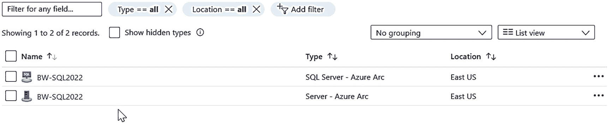
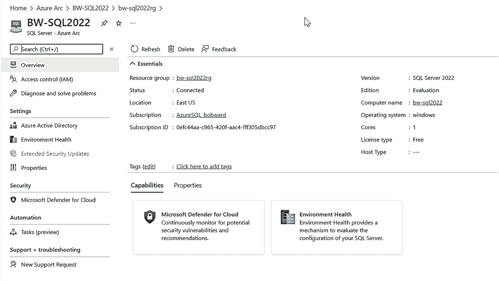

# SQL Server 2022 的安装与配置

## 安装日志与初始配置

```
SQLArcOnboard: --SqlArcOnboardPrivate: ----------------------------------------
SQLArcOnboard: 正在获取设置 AZURESERVICEPRINCIPAL: source = UI, type = Microsoft.SqlServer.Configuration.ArcOnboard.SqlArcServicePrincipal.
SQLArcOnboard: 正在获取设置 AZURESERVICEPRINCIPALSECRET: source = UI, type = Microsoft.SqlServer.Configuration.ArcOnboard.SqlArcServicePrincipalSecret.
SQLArcOnboard: 正在获取设置 AZURESUBSCRIPTIONID: source = UI, type = Microsoft.SqlServer.Configuration.ArcOnboard.SqlArcSubscriptionId.
SQLArcOnboard: 正在获取设置 AZURETENANTID: source = UI, type = Microsoft.SqlServer.Configuration.ArcOnboard.SqlArcTenantId.
SQLArcOnboard: 正在获取设置 AZUREREGION: source = UI, type = Microsoft.SqlServer.Configuration.ArcOnboard.SqlArcRegion.
SQLArcOnboard: 正在获取设置 AZURERESOURCEGROUP: source = UI, type = Microsoft.SqlServer.Configuration.ArcOnboard.SqlArcResourceGroupName.
SQLArcOnboard: 正在获取设置 AZUREARCPROXYSERVER: source = UI, type = Microsoft.SqlServer.Configuration.ArcOnboard.SqlArcProxy.
SQLArcOnboard: PowerShell 结果：已安装 PowerShell 版本 5.1.20348.643
SQLArcOnboard: PowerShell 结果：Az 模块已安装。跳过安装。
SQLArcOnboard: PowerShell 结果：Az.ConnectedMachine 模块已安装。跳过安装。
SQLArcOnboard: PowerShell 结果：Az.Resources 模块已安装。跳过安装。
SQLArcOnboard: PowerShell 结果：未找到 Arc for Servers 资源。正在注册当前计算机。
SQLArcOnboard: PowerShell 结果：Microsoft.Azure.PowerShell.Cmdlets.ConnectedMachine.Models.Api20210520.Machine
SQLArcOnboard: PowerShell 结果：正在获取 BW-SQL2022 的托管标识 ID。
SQLArcOnboard: PowerShell 结果：Arc 计算机的托管标识不具备 Azure Connected SQL Server Onboarding 角色。正在为其分配。
SQLArcOnboard: PowerShell 结果：正在后台安装 SQL Server - Azure Arc 扩展。
SQLArcOnboard: PowerShell 结果：Microsoft.Azure.PowerShell.Cmdlets.ConnectedMachine.Runtime.PowerShell.AsyncOperationResponse
SQLArcOnboard: PowerShell 结果：Onboarding 过程已完成。
```

在 Azure 门户 (`portal.azure.com`) 中，您可以搜索所创建的资源组，并将看到两个资源，如图 2-5 所示。


Azure 门户截图。其中显示了资源组的两个文件，包含其类型和位置。
**图 2-5：门户中启用 Azure Arc 的 SQL Server**

如果您选择 “SQL Server – Azure Arc”，将在主门户页面上看到有趣的信息，如图 2-6 所示。


Azure 门户主页截图。顶部有一系列基本信息，底部是各项功能。
**图 2-6：启用 Azure Arc 的 SQL Server 主门户页面**

### 设置后连接到 Azure

如果您在 SQL Server 2022 安装期间未选择 Azure 扩展 for SQL Server 功能，可以稍后按照 [`https://docs.microsoft.com/sql/sql-server/azure-arc/connect`](https://docs.microsoft.com/sql/sql-server/azure-arc/connect) 中的步骤将 SQL Server 2022 实例与 Azure 连接。或者，您可以返回并为现有的 SQL Server 2022 实例“添加功能”，这将提供与原始安装相同的界面。您还可以使用 [`https://docs.microsoft.com/sql/sql-server/azure-arc/connect-at-scale`](https://docs.microsoft.com/sql/sql-server/azure-arc/connect-at-scale) 中的步骤大规模连接多个 SQL 实例。

### 删除 SQL Server 的 Azure 扩展

您可以随时使用 [`https://learn.microsoft.com/en-us/sql/sql-server/azure-arc/connect#delete-your-arc-enabled-sql-server-resource`](https://learn.microsoft.com/en-us/sql/sql-server/azure-arc/connect#delete-your-arc-enabled-sql-server-resource) 中记录的步骤从 Azure 断开 SQL Server 2022 实例的连接。如果您决定完全移除与 Azure 的连接，建议同时使用 SQL Server 安装程序删除 SQL Server 的 Azure 扩展。

## 在其他平台上部署

本章主要关注在 Windows 上安装 SQL Server 的体验。SQL Server 还支持其他平台，包括 Linux、容器和 Kubernetes。本书第 9 章将介绍这些体验，但如果您想立即开始，可以使用以下资源：

**SQL Server on Linux** – [`https://aka.ms/sqllinux`](https://aka.ms/sqllinux)

**SQL Server on containers** – [`https://aka.ms/sqlcontainers`](https://aka.ms/sqlcontainers)

**SQL Server on Kubernetes** – [`https://aka.ms/sqlk8s`](https://aka.ms/sqlk8s)

> 注意
> 此页面包含在 Azure Kubernetes Service (AKS) 上部署 SQL 容器的说明。有关部署 Pod 和容器的正确方法，请咨询您的 Kubernetes 平台文档。
>
> 请务必查阅 SQL Server 2022 on Linux and containers 的最新发行说明：[`https://docs.microsoft.com/sql/linux/sql-server-linux-release-notes-2022`](https://docs.microsoft.com/sql/linux/sql-server-linux-release-notes-2022)。

此外，SQL Server 2022 可以部署在 Azure 虚拟机上。本书第 10 章将详细介绍这方面的体验。有关 SQL Server on Azure Virtual Machines 的更多信息，请查阅我们的文档：[`https://aka.ms/sqlazurevm`](https://aka.ms/sqlazurevm)。

## 并排和多实例安装

与 SQL Server 的早期版本一样，SQL Server 2022 支持在同一个计算机上与不同版本（受支持的版本）进行并排安装，以及多实例（也称为命名实例）安装。对于并排和多实例安装，其支持与之前的 SQL Server 版本没有差异。更多信息，请查阅我们的文档：[`https://docs.microsoft.com/sql/sql-server/install/work-with-multiple-versions-and-instances-of-sql-server`](https://docs.microsoft.com/sql/sql-server/install/work-with-multiple-versions-and-instances-of-sql-server)。SQL Server on Linux 通过使用容器支持多实例。

## 如何升级到 SQL Server 2022

SQL Server 2022 支持使用与早期版本相同的方法从早期 SQL Server 版本升级。您可以在 [`https://docs.microsoft.com/sql/database-engine/install-windows/upgrade-sql-server`](https://docs.microsoft.com/sql/database-engine/install-windows/upgrade-sql-server) 阅读更多详细信息。

在本书撰写时，计划支持从 SQL Server 2012 Service Pack 4 或更高版本进行“就地”升级，以及从 SQL Server 2008/2008R2 及更高版本进行数据库还原升级。

## 数据库兼容性级别的重要性

在我在 Microsoft 的职业生涯中，很明显，客户不升级到新的 SQL Server 主要版本的原因之一是最新版本与他们的应用程序不兼容。

在过去的几个 SQL Server 版本中，我们一直在努力说服客户和开发人员使用用户数据库的数据库兼容性级别进行兼容性测试。如果您将 SQL Server 数据库升级到新版本，我们会保留之前的数据库兼容性级别。您可以在 [`https://aka.ms/dbcompat`](https://aka.ms/dbcompat) 阅读更多关于为什么这可能成为您兼容性新策略的信息。请注意，使用较旧的数据库兼容性级别可以让您有更多时间探索和测试最新的兼容性级别，这些级别启用了如智能查询处理等新功能，本书第 4 和 5 章将对此进行更多讨论。


