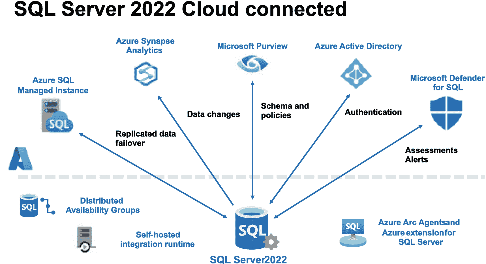

# 3. 将数据库连接至云端

## 配置

尽管本章专门为您提供安装和升级方面的指导，但安装后 SQL Server 的配置同样是一个重要主题。不过，在 SQL Server 2022 中，实例配置的改动非常少：

*   新增了少量服务器级别的 `sp_configure` 选项。这些选项将在本书中结合 SQL Server 2022 的新特性进行讨论。

*   SQL Server 配置管理器已得到增强，允许您控制 Azure SQL Server 扩展功能的服务（启动和停止）。

除此之外，没有新的实例级别配置变更。

您将在探索本书中各种新特性时，了解到新的数据库级别配置选项。

## 易于安装和升级

SQL Server 一直以来以其简便的安装和升级体验而闻名，这一点在 SQL Server 2022 中并未改变。作为该体验的一部分，我们提供了集成设置，以便在您需要实现混合策略时连接到 Azure。

如果您通读了本章的所有细节，那么您已基本准备好深入探索各项功能了。那么，让我们开始吧！下一章将介绍如何以前所未有的行业方式将 SQL Server 连接到云端，该方式将 SQL Server 与 Azure 相结合，以提供灾难恢复、分析和安全功能。

SQL Server 可在您需要的任何平台上运行，从边缘到云端。无论您在何处运行 SQL Server，我们都看到了行业和客户将 SQL Server *连接* 到云端的趋势。*连接* 是一个相当宽泛的术语，因此在本章中，您将详细了解 SQL Server 2022 如何连接到云端。

首先，我将分享我对 *混合* 含义的理解，以及 SQL Server 多年来如何成为一个混合平台。然后，我将深入介绍 SQL Server 2022 现在在哪些主要领域以空前的方式启用了 Azure 功能。这包括托管的灾难恢复、近实时分析以及新的安全功能。作为此部分内容的一部分，我将描述如何使用 Azure Arc 来实现其中一些技术。

本章包含供您实践学习的示例，以了解这些功能的工作原理。对于其中任何一项功能，您都需要一个 Azure 订阅，并且需要能够将您的 SQL Server 连接到 Azure，无论是直接连接互联网还是通过代理连接。您的公司或组织可能已为您提供了 Azure 账户或订阅。但是，如果您需要自己的账户，请从 `https://azure.microsoft.com/get-started` 开始。在本章中，我将详细说明每种场景可能需要的特定访问权限，以及您可能希望使用的任何特殊连接配置（如代理）。

## 混合 SQL Server

在本书的这一部分，我将分享我对 *混合* 一词在 SQL Server 相关语境下含义的理解，简要回顾 SQL Server 在以往版本中如何具备混合功能，并概述 SQL Server 2022 的独特之处。

### 什么是 *混合*？

我相信你们很多人都思考过 *混合* 的含义，我的研究表明行业内对此有多种定义和见解。我喜欢将 *混合* 一词简单地定义为与计算或数据平台相关的概念：

*   同时在本地和云端提供的产品或服务，*且具有一致性*

    SQL Server 绝对符合这一条件，因为它可在 Azure 云端的 Azure SQL 中运行：Azure 虚拟机上的 SQL、Azure SQL 托管实例以及 Azure SQL 数据库。请注意我在短语末尾的强调：“且具有一致性”。我这样说是因为，您可能会找到其他同时存在于本地和云端的产品，但它们是否具备与 SQL Server 相同的一致性故事呢？相同的核心数据库引擎、相同的 T-SQL 语言以及相同的工具。

*   一种在本地运行的产品，通过连接到云端以 *增强* 数据能力

这个短语有两个关键词：连接和增强。*连接* 意味着通过某种方式将本地产品现有功能的数据连接起来。*增强* 意味着这种连接能带来真正的商业价值。您将在本章中看到，我认为 SQL Server 2022 同时做到了这两点。

首先，让我们回顾一下 SQL Server 历年来如何连接到 Azure，以建立一些背景知识。

### 历年 SQL Server 的混合特性

SQL Server 历年来包含的最基本的混合功能是备份。从 SQL Server 2012 开始，您就可以使用包含 URL 的语法，将数据库备份到 Azure Blob 存储或从其中恢复。此功能多年来不断增强，至今仍然存在，您可以在 `https://docs.microsoft.com/sql/relational-databases/backup-restore/sql-server-backup-to-url` 阅读相关内容。

还有其他连接 SQL Server 到 Azure 的方法，包括使用现有功能来扩展高可用性、冗余或查询。例如，您可以将 Always On 可用性组扩展到 Azure，您可以在 `https://docs.microsoft.com/previous-versions/azure/virtual-machines/windows/sqlclassic/virtual-machines-windows-classic-sql-onprem-availability` 阅读相关信息。

您还可以设置事务复制，其中发布服务器是本地 SQL Server，而订阅服务器数据库位于 Azure 虚拟机、Azure SQL 托管实例，甚至 Azure SQL 数据库上（您可以在 `https://docs.microsoft.com/azure/azure-sql/database/replication-to-sql-database` 阅读有关如何为 Azure SQL 数据库设置此功能的具体说明）。

最后，任何 Azure SQL 服务都可以作为本地 SQL Server 通过链接服务器查询的数据源。这些都是连接 SQL Server 到 Azure 的基本方法，但 SQL Server 2022 将其提升到了一个新的水平。

### SQL Server 2022 混合功能阵容

图 3-1 直观地展示了 SQL Server 2022 的所有 Azure 启用功能。

SQL Server 2022 具备 3 项内置能力，可云连接至 5 项 Azure 启用功能，从复制数据故障转移到评估警报。

图 3-1

SQL Server 2022 实现云连接

从左至右，SQL Server 2022 在顶部内置了提供这些云连接功能的能力。

#### Azure SQL 托管实例

Azure SQL 托管实例的链接功能为 SQL Server 2022 提供 *托管式* 灾难恢复。内置的分布式可用性组 (DAG) 功能用于桥接 SQL Server 和 Azure SQL 托管实例。

#### Azure Synapse Analytics

适用于 SQL Server 的 Azure Synapse Link 允许 SQL Server 2022 将选定表中的数据无缝同步到 Azure Synapse 的专用 SQL 池。自承载集成运行时 (SHIR) 用于协调 Synapse 和 SQL Server 之间的通信，但 SQL Server 也具备向 Azure 发送数据的内置能力。

#### Azure Active Directory 身份验证

SQL Server 2022 现在可以使用 Azure Active Directory (AAD) 账户进行登录身份验证。这支持了诸如多因素身份验证等概念。您必须在 SQL Server 2022 上启用 AAD 才能支持 Purview 集成的策略管理。SQL Server 2022 的 AAD 需要 Azure SQL Server 扩展。

