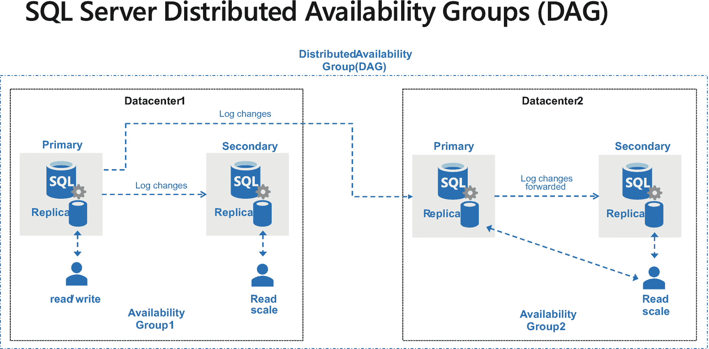

# 使用 Azure SQL Managed Instance 进行托管灾难恢复

您只会在……嗯，发生灾难时才需要担心灾难恢复。但当然没有人知道那是什么时候，这就是为什么为 SQL Server 数据和安装制定灾难恢复计划是任何生产系统的关键组成部分。

您如何构建灾难恢复系统通常取决于您可能知道的行业术语，例如恢复时间目标 (RTO) 和恢复点目标 (RPO)。我们的高可用性解决方案，例如 SQL Server 的内置崩溃恢复和故障转移群集，可以帮助满足这些要求。这些解决方案通常不能帮助灾难恢复的原因是，真正的灾难通常意味着您的本地数据副本不可用。

SQL Server 提供了许多帮助解决方案，包括一个基本的数据库备份和还原解决方案，您通常将备份存储在另一个物理位置，如果在灾难情况下发生，可以检索和还原这些备份。您甚至可以建立一个 Always On 可用性组，将辅助副本放在不同的物理位置，但这可能需要更复杂的群集设置。

对于 SQL Server 2022，我们希望为灾难恢复提供一个新选项，我称之为 `managed disaster recovery`（托管灾难恢复）。

## Project Chimera 和 DAG

为了理解我们如何构建托管灾难恢复解决方案，让我们看看这个新功能的背景。

### 分布式可用性组

为了帮助灾难恢复场景，我们在 SQL Server 2016 中构建了一个名为 `Distributed Availability Groups` (分布式可用性组，DAG) 的新功能。DAG 是一个跨越多个可用性组 (AG) 的可用性组，通常跨越遥远的区域。DAG 技术最棒的地方在于它完全内置于 SQL Server 中。实际上，AG 技术也内置于 SQL Server 中以管理数据复制。诸如 Windows Server 故障转移群集 (WSFC) 和 Pacemaker (Linux) 之类的技术用于协调故障转移。

图 3-2 显示了一个可能的 DAG 配置。

图 3-2：SQL Server 分布式可用性组 (DAG)

您可以看到此设计的一个有趣方面是，可用性组 1 (AG1) 中的主副本不仅将其事务日志更改发送到其 AG 中的辅助副本，还发送到可用性组 2 (AG2) 的主副本。AG2 的主副本将其日志更改转发到其辅助副本。用户只能向 AG1 的主副本写入更改。但如果出现情况，您可以故障转移到 AG2，然后用户就可以向 AG2 的主副本写入更改。副本和 AG 之间的所有通信和数据复制都在 SQL Server 引擎内管理。

AG 和 DAG 都内置于 SQL Server 中，这一事实让我们想到将这个概念扩展为混合方法。为什么第二个 AG 不能在 Azure 中呢？但不仅仅是在 Azure 中，因为您肯定可以在您的数据中心中的 SQL Server 与 Azure 虚拟机上的第二个 AG 之间构建一个 DAG。我们希望构建一些新的、革命性的东西。

### Project Chimera

大约 3 年前，负责 Azure SQL Managed Instance 的工程团队提出了一个想法，导致了一个名为 Chimera 的项目。正如 Managed Instance 团队的高级项目经理 Dani Ljepava 告诉我的那样，*“Chimera 是希腊神话中的神话怪兽，看起来像一条龙，有多个来自不同动物的头合而为一。正如我们正在构建 SQL Server 和云之间的混合能力，Chimera 似乎是这个项目的完美名称，因为它指的是一个混合怪兽——多个动物合为一体。”*

团队最初只是想在 SQL Server 和 Azure SQL Managed Instance (MI) 之间建立一个链接，以便 MI 可以用作只读副本，并最终成为从 SQL Server 在线迁移的目标。最终，随着我们为项目 Dallas 制定计划，该项目章程不断扩展，以便此功能可以支持 SQL Server 2022 的灾难恢复场景。

Dani 告诉我，*“我们面临着解决微软以前没有人解决过的问题，并且不得不在此过程中经历一些独特的挑战（并且在我们说话的今天仍在进行中）。尽管如此，以前从未有人在 SQL Server 和完全托管的 Azure PaaS 服务之间构建过在线 DR。”*

随着我们朝着 SQL Server 2022 的私人预览版发布迈进，我们将 Chimera 品牌化为 `Azure SQL Managed Instance` 的 `link feature`（链接功能）。

