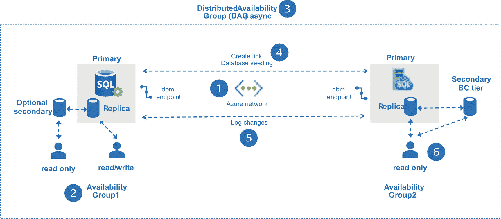
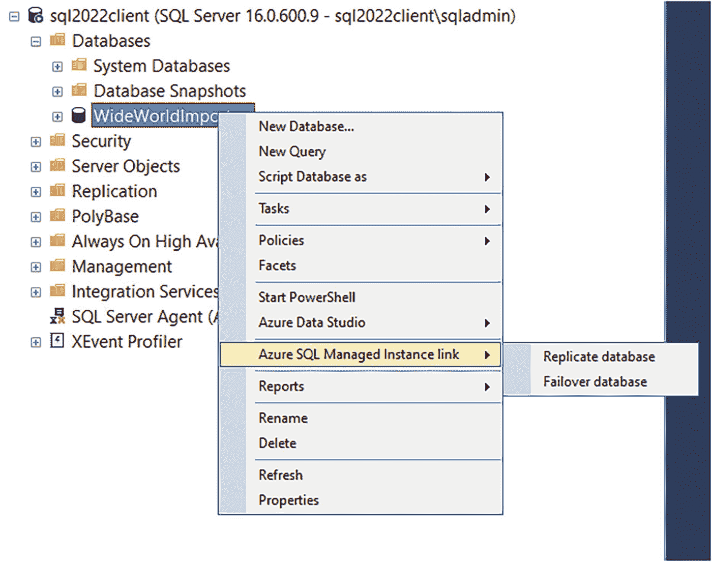
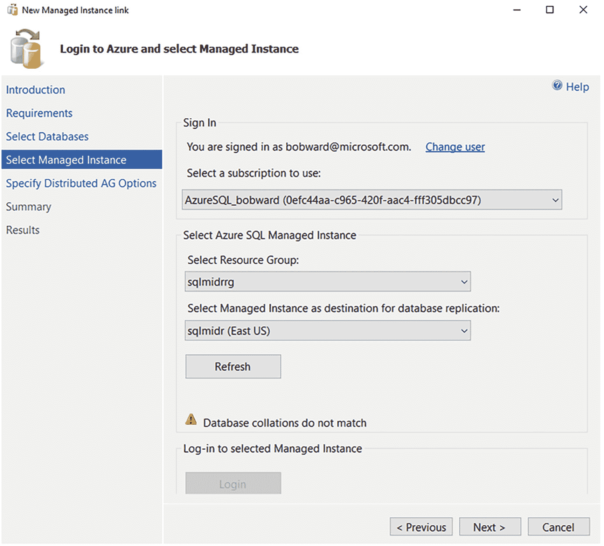
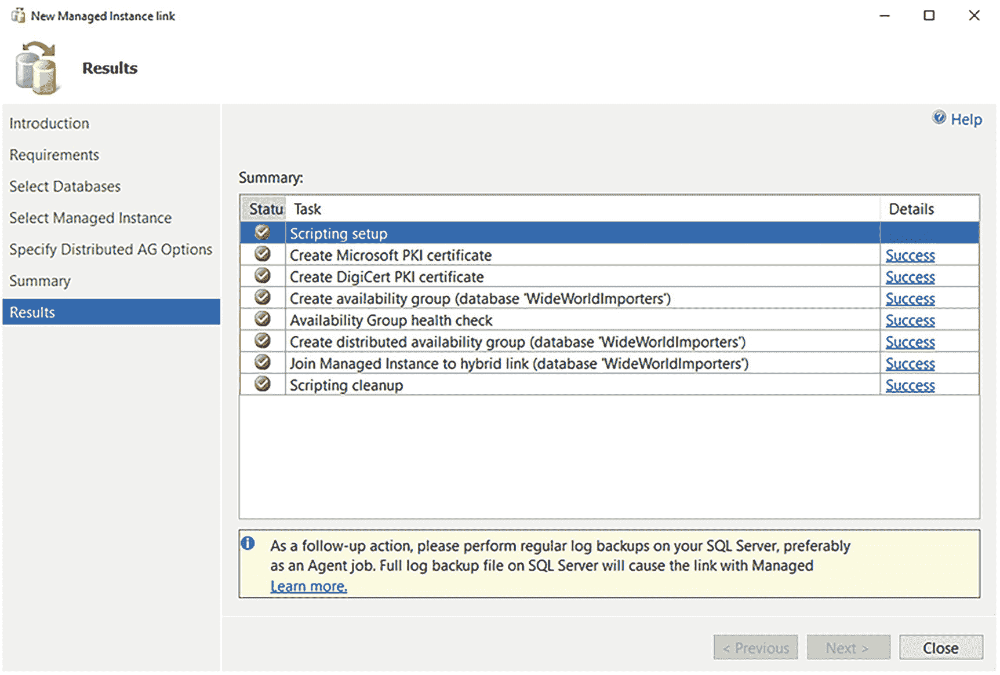
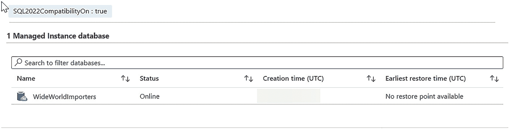
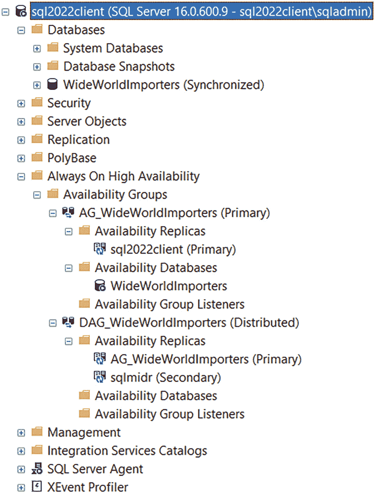
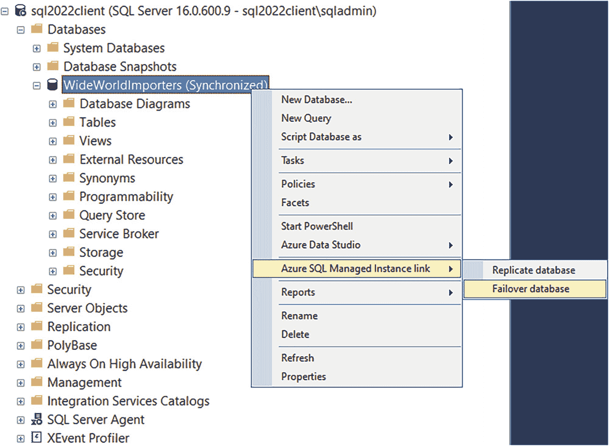
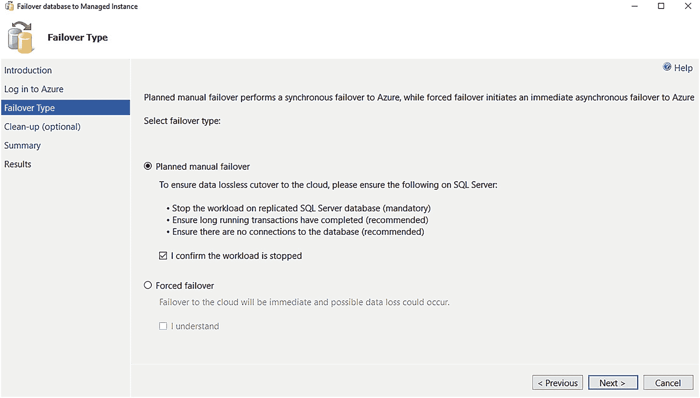
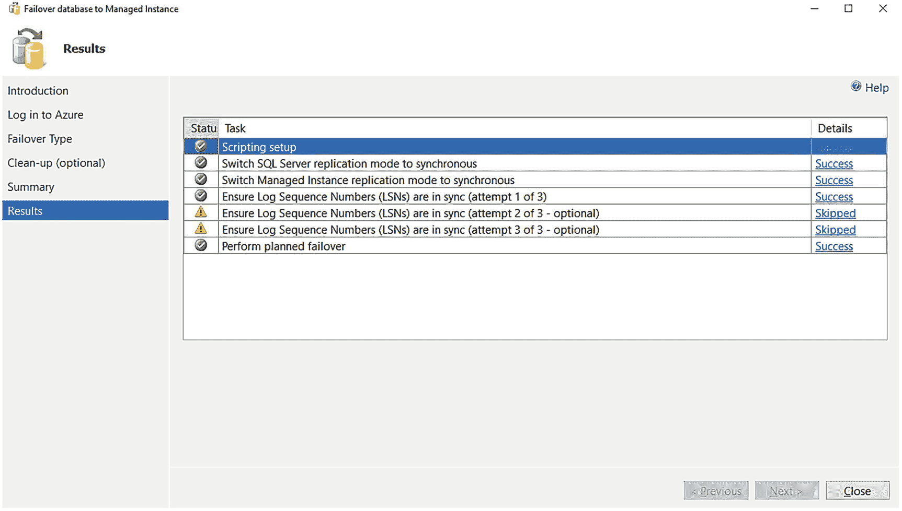

# Azure SQL 托管实例的链接功能

Azure SQL 托管实例的链接功能，让你能够以简单无缝的方式，将现有的 SQL Server 数据库连接或链接到一个托管实例。我们利用了 SQL Server 引擎中内置的可用性组和 `分布式可用性组` 技术的强大功能，再加上一些幕后的技术，实现了 Azure SQL 托管实例的这一功能。

Azure SQL 托管实例的链接功能可用于 `SQL Server 2016`、`SQL Server 2019` 或 `SQL Server 2022` 的数据库（`SQL Server 2017` 的支持将在稍后添加）。此功能支持通过 AG 技术将数据复制到 Azure SQL 托管实例（MI），并将该 MI 数据库用于读取横向扩展场景。如果你最终希望从 SQL Server 迁移到 MI，那么可以故障转移到 MI，此时 MI 就成为了主系统。这是一个 `单向` 操作，这也是为什么它能帮助你建立一个向 Azure 迁移的在线解决方案（并且由于我们使用的是 AG 技术，这是向 MI 进行在线迁移的最快方法）。此功能有时被称为向 Azure MI 进行 `单向` 复制。

`SQL Server 2022` 独有的功能是能够设置一个到 Azure SQL 托管实例的链接，其中托管实例被声明为灾难恢复站点，可以 `在线` 故障转移到 MI，但在某个时间点可以 `离线` 故障回退到 `SQL Server 2022`。此功能有时被称为向 Azure MI 进行 `双向` 复制。我将在本章后面名为 "`使用链接功能进行离线灾难恢复`" 的部分解释故障回退为何是离线的，以及我为何称其为受控灾难恢复。

## 工作原理

让我们通过查看如何创建链接和故障转移到 MI，来了解 Azure SQL 托管实例（MI）的链接功能是如何工作的。

### 创建和使用链接

Azure SQL 托管实例的链接功能结合使用内置的 `T-SQL` 和 `PowerShell` 脚本，在 `SQL Server 2022` 上创建一个可用性组（如果不存在的话），并在 `SQL Server 2022` 和 Azure SQL 托管实例（任何服务层级）之间创建一个 `分布式可用性组`，其中包含来自你的 `SQL Server 2022` 实例的数据库。通过 `SQL Server Management Studio (SSMS)` 中新增的 GUI 向导，创建链接的过程也变得更加容易，在对象资源管理器中数据库的上下文菜单里有一个选项叫做 `Azure SQL 托管实例链接 ➤ 复制数据库`。

图 3-3 展示了创建到 Azure SQL 托管实例链接的架构和流程。



一个图表展示了 Azure SQL 托管实例的链接。步骤 1 到 6 分别是 Azure 网络、可用性组 1、DAG 异步、创建链接数据库种子设定、日志更改和可用性组 2。

图 3-3

Azure SQL 托管实例的链接功能

让我们从创建链接的过程来拆解链接功能的组成部分。`SSMS` 会自动化这些步骤：

1.  **建立网络连接**，使用 Azure 网络和数据库镜像（`dbm`）端点，在 SQL Server 和 Azure SQL 托管实例之间建立连接。

2.  在 `SQL Server 2022` 上**创建一个可用性组（AG）**和数据库镜像（`dbm`）端点（如果尚不存在）。将 AG 构建为 `无群集` 或 `CLUSTER_TYPE = NONE`。我们不会对 AG 使用任何群集技术，因为这不是一个基于自动故障转移的解决方案。现有的 AG 可能已经有一个辅助副本。事实证明，有一个有趣但不太为人所知的特性是，如果你自己构建 AG，`你不必拥有辅助副本`（在这种情况下不使用可用性模式）。但你必须创建一个 AG，以便能够创建一个 DAG。

3.  **创建一个分布式可用性组（DAG）**，其中包含 `SQL Server 2022` 的 AG 和你的托管实例名称。

4.  **创建到 Azure SQL 托管实例的链接**（`PowerShell` cmdlet）。这会为 `常规用途` 服务层级的托管实例建立一个 AG，或使用 `业务关键` 服务层级中现有的 AG（该层级已有一个辅助副本）。再次注意，AG 不一定必须有辅助副本，这就是为什么此解决方案能很好地适用于 `常规用途` 服务层级。创建链接还会启动到 Azure SQL 托管实例的数据库复制或种子设定。种子设定使用 `dbm` 端点将数据库的副本流式传输到托管实例。你可以在 [`https://docs.microsoft.com/sql/database-engine/availability-groups/windows/automatically-initialize-always-on-availability-group`](https://docs.microsoft.com/sql/database-engine/availability-groups/windows/automatically-initialize-always-on-availability-group) 阅读更多关于种子设定工作原理的信息。

5.  现在对主数据库所做的**更改**将作为日志更改自动传输到 Azure SQL 托管实例。

6.  用户可以连接到 Azure SQL 托管实例并以 `只读` 方式访问数据库，对于 `业务关键` 服务层级，还可以访问辅助副本。

**注意** 当 Azure SQL 托管实例的链接功能最终版本发布时，我们可能会提供一个选项，让你为灾难恢复（DR）目的声明你的托管实例。这个概念是在这种情况下使托管实例免许可费用，因此你只需支付计算和存储费用。如果此选项可用，你将无法从 Azure SQL 托管实例数据库读取，因为你仅将其用于灾难恢复目的。

一旦数据库在 Azure SQL 托管实例中同步，事务日志中的任何更改都会自动发送到 Azure SQL 就像你自己构建了一个 DAG 一样。用户也可以访问 Azure SQL 托管实例中的数据库进行读取，就像访问 DAG 中的辅助副本一样。

### 故障转移到 Azure SQL 托管实例

假设现在你已准备好将你的主要工作负载迁移到 Azure SQL 托管实例。你可以使用链接功能执行故障转移。对于 `SQL Server 2022` 之前的 SQL Server 版本，这是一个 `单向操作`。

在故障转移操作上你有两个选择（两者都是手动的）：

*   **计划内手动故障转移**
    *   如果你使用此选项，你的 SQL Server 实例是可用的，并且你希望确保故障转移中没有数据丢失。这将需要停止你的应用程序对主副本进行修改，并同步 DAG。

*   **强制故障转移**
    *   使用此选项，你愿意接受一些数据丢失（即使在 DAG 已经同步的情况下可能没有丢失）。如果 SQL Server 实例不可用，这是你进行故障转移的唯一选择。

当你故障转移到 Azure SQL 托管实例时，数据库将被设置为读/写。我们会处理托管实例上所有 AG 的后勤工作。在 SQL Server 端，你也可以选择删除 AG（如果它是被创建的）和/或 DAG。

现在你需要更改你的应用程序以连接到 Azure SQL 托管实例服务器名称。你还需要手动迁移任何实例级别的对象（`SQL Agent` 作业、登录名等）。因此，事先将这些对象全部编写成脚本以准备故障转移是一个好主意。

## 使用链接功能进行离线灾难恢复

到目前为止，这听起来不像一个灾难恢复解决方案，而是一个单向迁移解决方案，这确实是真的。然而，对于 `SQL Server 2022`，我们将允许你使用托管实例作为离线灾难恢复站点。我称此功能为离线灾难恢复，因为尽管到托管实例的故障转移被认为是在线的，但故障回退是离线的。我们添加的关键功能是能够将数据库从 Azure SQL 托管实例 `恢复回` SQL Server。


#### 为何选择托管式灾难恢复？

本章节的标题以*托管式灾难恢复*开头。我称其为*托管式*是因为，借助此功能，你的灾难恢复 (DR) 站点将使用平台即服务 (PaaS) SQL。SQL Server 本身具备构建 DR 站点的所有功能，但你必须自行管理它，并确保在需要时它可用。

一旦你将 SQL Server 链接到托管实例，Microsoft 就会为你管理 DR 站点。Microsoft 通过托管实例管理整个基础架构、可用性以及 SQL Server 数据库的备份。这样，你就可以放心，当你需要 DR 站点时，它将随时可用并准备就绪。

#### SQL Server 与数据库版本兼容性

你可能早就知道，我们不允许你将较新主要版本的 SQL Server 数据库备份还原到较旧的主要版本。当你执行 `RESTORE` T-SQL 语句时，会遇到错误，提示备份的版本*高于*当前版本。

实际上，不兼容性存在于数据库级别，而非实例级别。每个 SQL Server 主要版本的数据库都有一个版本号。你可以使用 T-SQL 函数 `DATABASEPROPERTYEX(<db>, ‘Version’)` 查看此版本。你也可以使用 `RESTORE HEADERONLY` T-SQL 语句来查看备份的 `DatabaseVersion`。

实际情况是，当我们构建一个新的主要版本的 SQL Server 时，我们通常会进行一些更改，这些更改会影响数据库在构建新软件版本*期间*的版本兼容性（不是数据库兼容性级别）。这包括像系统表修改这样的变更。由于这些更改依赖于新版本的代码，因此无法在旧版本中访问新代码。在构建新的主要版本时，数据库版本可能会经历多个*小版本跳跃*或*步骤*（实际上，每个 CTP 构建通常都会有几次小版本跳跃）。一旦我们发布了某个主要版本的正式版 (General Availability)，我们会锁定该数据库版本，直到下一个主要版本。我们绝不会在累积更新中更改此版本号，这就解释了为什么它们彼此兼容。当你将旧版本的数据库备份还原到新版本时，可以看到这些版本跳跃的过程。在 `RESTORE` 的输出中，你可能会看到几条这样的消息：

```
Database 'WideWorldImporters' running the upgrade step from version 928 to version 929.
```

在我们构建每个主要版本的过程中，可能会有多个这样的“步骤”。从版本号可以看出，多年来我们已经进行了多次这样的操作。

由于 Azure SQL 托管实例是*无版本*的，它将始终*领先于* SQL Server 的主要版本。这就是为什么你无法将 Azure SQL 托管实例的数据库备份还原到 SQL Server。

随着 Azure SQL 托管实例与 SQL Server 2022 链接功能的发布，我们提供了一项能力，使得 Azure SQL 托管实例可以在数据库版本级别上与 SQL Server 2022 *兼容*。这就是我们如何支持离线灾难恢复流程的方式。一个被标记为兼容的 Azure SQL 托管实例的备份，可以被还原到 SQL Server 2022 实例，因为它们将使用**相同的数据库版本**。

灾难恢复概念是*离线*的，因为在你将数据库从 Azure SQL 托管实例还原到 SQL Server 2022 并完成恢复和运行之前，你的 SQL Server 2022 应用程序将处于停机状态。

让我们通过一个练习来看看 Azure SQL 托管实例的链接功能如何用于离线灾难恢复。

本练习基于我们文档中的步骤，文档地址为 `https://docs.microsoft.com/azure/azure-sql/managed-instance/managed-instance-link-feature-overview#use-the-link-feature`。在这个练习中，我们将使用 SSMS 来执行复制和故障转移的步骤。从该文档页面你也可以看到使用 T-SQL 和 PowerShell 执行相同过程的步骤。阅读这些内容以了解复制和故障转移在后台如何工作可能会很有趣。

我要亲自感谢 Microsoft 的 Dani Ljepava 和 Mladen Andzic。他们在帮助我创建这些练习方面发挥了重要作用。

#### 先决条件

*   使用你的 Azure 订阅部署一个 Azure SQL 托管实例。你可以在我们的文档中查看快速入门指南：`https://docs.microsoft.com/azure/azure-sql/managed-instance/instance-create-quickstart`。部署托管实例时，请务必选择与你的源 SQL Server 排序规则相匹配的排序规则。你可以使用 T-SQL 语句 `SELECT SERVERPROPERTY(N'Collation')` 检查你的 SQL Server 排序规则。同时记下你创建的 SQL 管理员帐户，因为你需要它通过 SSMS 登录到托管实例。
*   一个带有容器的 Azure 存储帐户，用于存储托管实例的数据库备份。请使用此文档页面作为在 Azure 中创建存储帐户的快速入门指南：`https://docs.microsoft.com/azure/storage/common/storage-account-create`。使用此快速入门页面在你的存储帐户中创建容器：`https://docs.microsoft.com/azure/storage/blobs/storage-quickstart-blobs-portal#create-a-container`。
*   一台至少有两个 CPU 和 8GB 内存的虚拟机或计算机。链接功能同时支持 Windows 和 Linux。本章中的练习将向你展示在 Windows 上使用链接功能的说明。
*   具有数据库引擎功能的 SQL Server 2022 评估版。
*   SQL Server Management Studio (SSMS)。最新的 18.x 或 19.x 版本均可使用。
*   你需要 SQL Server 和 Azure 之间的网络连接。如果你的 SQL Server 运行在本地，请使用 VPN 链接或 ExpressRoute 专线。如果你的 SQL Server 运行在 Azure 虚拟机上，请将你的虚拟机部署到与托管实例相同的子网，或者使用全局 VNet 对等互连来连接两个独立的子网。在本练习中，我为 SQL Server 部署了一台 Azure 虚拟机，并将其与 Azure SQL 托管实例放在同一个子网中。这是测试此功能最快的方式。如果你需要其他选项，可能需要获取一些关于 Azure 网络的帮助。Azure 网络的完整指南可在 `https://docs.microsoft.com/azure/networking` 获取。
*   将 WideWorldImporters `Standard` 示例备份从 `https://github.com/Microsoft/sql-server-samples/releases/download/wide-world-importers-v1.0/WideWorldImporters-Standard.bak` 下载到你将运行 SQL Server 的机器上。使用 `Standard` 备份是因为它不包含内存优化表，如果你为托管实例选择了通用目的服务层，内存优化表将不受支持。
*   从书籍示例的 `ch3_cloudconnected\milinkdr` 文件夹中获取的脚本副本。


## 准备环境

首先，您需要做一些准备工作，以便创建到托管实例的链接。完整详细信息请查阅 [`https://docs.microsoft.com/azure/azure-sql/managed-instance/managed-instance-link-preparation`](https://docs.microsoft.com/azure/azure-sql/managed-instance/managed-instance-link-preparation)。请仔细阅读这些内容。涉及以下步骤：

- 在主数据库中创建一个主密钥。
- 为 SQL Server 启用可用性组功能（如果尚未启用）。
- （可选但推荐）启用启动跟踪标志以提升性能。
- 配置 SQL Server 与 Azure SQL 托管实例之间的网络连接。
- 为端口 `5022`（dbm 端点）开放防火墙和 Azure 网络安全组（NSG）设置。
- 如果您的 SQL Server 数据库使用了透明数据加密（TDE），则需要将证书迁移到托管实例，以便链接该数据库。

## 创建链接以复制数据库

现在，让我们逐步介绍如何使用 SSMS 中的向导创建到托管实例的链接，以复制 SQL Server 上的数据库：



*屏幕截图显示了 sql 2022 客户端文件夹的内容。已选择“wide world importers”子文件夹用于“azure sql managed instance link”，其中包含“复制”和“故障转移”选项。*

**图 3-4** 使用 SSMS 创建到 Azure SQL 托管实例的链接

1.  执行脚本 `restorewwi_std.sql`，将 `WideWorldImporters` 数据库还原到 SQL Server 2022。您可能需要编辑备份文件以及数据和日志文件的文件路径。此脚本使用以下 T-SQL 语句：

    ```
    USE master;
    GO
    RESTORE DATABASE WideWorldImporters FROM DISK = 'c:\sql_sample_databases\WideWorldImporters-Standard.bak' WITH
    MOVE 'WWI_Primary' TO 'f:\data\WideWorldImporters.mdf',
    MOVE 'WWI_UserData' TO 'f:\data\WideWorldImporters_UserData.ndf',
    MOVE 'WWI_Log' TO 'g:\log\WideWorldImporters.ldf',
    stats=5;
    GO
    ```

2.  我们需要将恢复模式更改为 `FULL` 并备份数据库。执行脚本 `fullandbackup.sql`，其中包含以下 T-SQL 语句。您可能需要编辑备份文件的路径：

    ```
    -- 在 SQL Server 上运行
    -- 为所有要复制的数据库设置完整恢复模式。
    ALTER DATABASE WideWorldImporters SET RECOVERY FULL;
    GO
    -- 为所有要复制的数据库执行备份。
    BACKUP DATABASE WideWorldImporters TO DISK = N'c:\sql_sample_databases\wwi.bak';
    GO
    ```

3.  启动 `SSMS` 并连接到 SQL Server 2022。右键单击您的数据库，选择复制数据库的选项，如图 3-4 所示。



*屏幕截图显示了新的托管实例链接。左侧窗格选择了“选择托管实例”。右侧窗格中的警告消息显示“数据库排序规则不匹配”。*

**图 3-5** 选择托管实例以创建链接

1.  现在，您将进入“复制数据库向导”的一系列步骤。选择 `下一步`。第一个屏幕会验证您是否满足使用链接功能的 `要求`。
2.  现在 `选择您的数据库` 进行复制，然后选择 `下一步`。
3.  接下来，您需要提供已部署托管实例的信息。这需要您登录 Azure 并选择订阅、资源组和托管实例。您还需要选择 `登录` 以连接到所选的托管实例。完成后，您的屏幕应如图 3-5 所示。

请注意关于排序规则的警告。我为我的托管实例选择了不同的排序规则，以便向您展示如果排序规则不匹配时您将看到的警告。如果您的数据库中使用的字符数据不依赖于不同的排序规则，这可能对您不是问题。选择 `下一步`。



*屏幕截图显示了新的托管实例链接。左侧窗格选择了“结果”选项。右侧窗格的“摘要”下选择了名为“脚本设置”的任务。*

**图 3-6** 成功创建到 Azure SQL 托管实例的链接

1.  下一个屏幕显示创建 `分布式可用性组`（DAG）的选项。保留这些默认设置并选择 `下一步`。
2.  下一个屏幕是 `最后一步`。选择 `完成`。请注意，完成链接创建所需的时间取决于源数据库的大小，因为此处会进行数据库设定。还有一个按钮可以生成向导操作的脚本。完成后，您的屏幕应如图 3-6 所示。



*Azure 复制数据库的屏幕截图，显示了 1 个托管实例数据库。Wide World Importers 数据库处于联机状态，并且没有可用的恢复点。*

**图 3-7** 托管实例中已复制的数据库

1.  在 Azure 门户中导航到您的托管实例。您应该会看到您的数据库已在 Azure 中复制，并且状态为 `联机`，如图 3-7 所示。

请注意，此图顶部的标签显示该托管实例与 SQL Server 2022 兼容。



*屏幕截图显示了一个文件夹列表，其父节点是“sql 2022 客户端”。在父节点下可以看到“数据库”、“安全性”、“可用性组”、“DAG”和其他可折叠项目。*

**图 3-8** 链接创建后的数据库、AG 和 DAG 状态

1.  使用连接到 SQL Server 的 `SSMS` 中的对象资源管理器，可以看到数据库状态为 `已同步`（您需要刷新才能看到此状态），以及为链接创建的 AG 和 DAG 的详细列表。您的屏幕应类似于图 3-8。

由于我们使用的是 SQL Server 用于 AG 和 DAG 的内置功能，您还可以使用丰富的动态管理视图（`DMV`）来检查配置。请查看 [`https://docs.microsoft.com/sql/database-engine/availability-groups/windows/distributed-availability-groups#monitor-health`](https://docs.microsoft.com/sql/database-engine/availability-groups/windows/distributed-availability-groups#monitor-health) 上的这些示例。

1.  针对 SQL Server 2022 实例执行脚本 `checkstatus.sql`，该脚本使用以下 T-SQL 语句：

    ```
    SELECT @@SERVERNAME;
    GO
    SELECT DATABASEPROPERTYEX('WideWorldImporters', 'Updateability');
    GO
    SELECT DATABASEPROPERTYEX('WideWorldImporters', 'Version');
    GO
    ```

    您将看到状态为 `READ_WRITE`，以及锁定为 SQL Server 2022 的数据库版本。

2.  使用 `SSMS` 连接到您已部署的托管实例。执行 `checkstatus.sql` 脚本。您应该看到 `Updateability` 为 `READ_ONLY`，并且数据库版本应与 SQL Server 2022 匹配。


#### 查看更改的复制情况

1.  在 SQL Server 2022 数据库上执行脚本 `ddl.sql` 以创建两个新表。此脚本使用以下 T-SQL 语句：

    ```
    USE [WideWorldImporters];
    GO
    DROP TABLE IF EXISTS [Warehouse].[Vehicles];
    GO
    CREATE TABLE [Warehouse].Vehicles NOT NULL,
    [Vehicle_Type] nchar NULL,
    [Vehicle_State] nvarchar NULL,
    [Vehicle_City] nvarchar NULL,
    [Vehicle_Status] nvarchar NULL,
    PRIMARY KEY CLUSTERED
    (
    [Vehicle_Registration] ASC
    )WITH (PAD_INDEX = OFF, STATISTICS_NORECOMPUTE = OFF, IGNORE_DUP_KEY = OFF, ALLOW_ROW_LOCKS = ON, ALLOW_PAGE_LOCKS = ON, OPTIMIZE_FOR_SEQUENTIAL_KEY = OFF) ON [USERDATA]
    ) ON [USERDATA];
    GO
    DROP TABLE IF EXISTS [Warehouse].[Vehicle_StockItems];
    GO
    CREATE TABLE [Warehouse].Vehicle_StockItems NOT NULL,
    [StockItemID] [int] NOT NULL,
    CONSTRAINT [PK_Vehicle_StockItems] PRIMARY KEY CLUSTERED
    (
    [Vehicle_Registration] ASC,
    [StockItemID] ASC
    )WITH (PAD_INDEX = OFF, STATISTICS_NORECOMPUTE = OFF, IGNORE_DUP_KEY = OFF, ALLOW_ROW_LOCKS = ON, ALLOW_PAGE_LOCKS = ON, OPTIMIZE_FOR_SEQUENTIAL_KEY = OFF) ON [USERDATA]
    ) ON [USERDATA];
    GO
    ```

2.  执行脚本 `populatedata.sql` 向这些表添加数据。请注意，在此脚本中，每辆车将关联一件货物。
3.  在 SSMS 中，针对 SQL Server 和托管实例执行脚本 `getcargocounts.sql`。此脚本使用以下 T-SQL 语句：

    ```
    USE WideWorldImporters;
    GO
    SELECT v.Vehicle_Registration, v.Vehicle_City, count(*) AS cargo
    FROM Warehouse.Vehicles v
    JOIN Warehouse.Vehicle_StockItems vs
    ON v.Vehicle_Registration = vs.Vehicle_Registration
    GROUP BY v.Vehicle_Registration, v.Vehicle_City;
    GO
    ```

    你应该会看到 SQL Server 和托管实例返回的结果相同。

#### 故障转移到托管实例

现在，让我们看看故障转移到托管实例的过程。



截图显示，在父节点 `sql 2022 client` 下选择了 `wide world importers` 选项。从下拉菜单中选择了“从 Azure SQL 托管实例链接故障转移数据库”。

图 3-9
使用 SSMS 执行故障转移

1.  在 SSMS 中使用对象资源管理器，选择“故障转移数据库”，使用与你复制数据库时相同的选择，如图 3-9 所示。



截图显示“故障转移数据库到托管实例”窗口。左侧窗格中突出了故障转移类型。右侧窗格中选择了“计划的手动故障转移”。

图 3-10
选择故障转移类型

1.  选择“下一步”，你将看到一个登录 Azure 的屏幕。选择你的托管实例部署所使用的订阅，然后选择“下一步”。
2.  你可以选择“计划或强制故障转移”。选择“计划手动故障转移”，并勾选你已停止工作负载的选项（我们没有运行任何写入操作）。你的屏幕应如图 3-10 所示。
    选择 **下一步**。



截图显示“故障转移数据库到托管实例”窗口。左侧窗格中选择了“结果”选项。右侧显示了六个任务，其中四个带有复选标记，脚本设置被突出显示。

图 3-11
已完成的故障转移到托管实例

1.  你现在可以选择“清理”之前创建的 AG 和/或 DAG。你可以选择保留它们并在以后重新创建链接，但为了本练习的目的，我将勾选两个选项并选择“下一步”。
2.  你现在处于完成故障转移的最终屏幕。选择“完成”。此步骤将 DAG 更改为同步模式，通过比较两个系统上的 LSN 值来检查所有日志更改是否已同步，然后删除链接。完成后，你的屏幕应如图 3-11 所示。
3.  使用 SSMS 再次对托管实例执行脚本 `checkstatus.sql`，查看状态现在是否为 `READ_WRITE`。
4.  你也可以从连接到 SQL Server 的 SSMS 中看到 AG 和 DAG 已被移除。

在真实的故障转移场景中，你现在需要将应用程序更改为连接到托管实例，并将任何实例级对象（如 SQL Agent 作业、登录名等）迁移到托管实例。

#### 将数据库还原回 SQL Server

正如我们在本章所述，此灾难恢复选项被称为“离线”，因为即使你可以执行在线故障转移，但要故障恢复回 SQL Server 则需要数据库备份和还原。完全备份和还原可能需要一些时间，因此你的停机时间更长，故称为“离线”。

将数据库从托管实例还原到 SQL Server 的步骤如下：

1.  如果你希望故障恢复包含对 SQL Server 的所有更改，请停止对 Azure SQL 托管实例工作负载的所有写入操作。
2.  从 Azure SQL 托管实例创建数据库的 `COPY_ONLY` 备份。请参阅文档了解如何通过连接到托管实例的 SSMS 将数据库备份到 Azure 存储。（如果你需要，也有 T-SQL 选项。从步骤 [`https://docs.microsoft.com/sql/relational-databases/tutorial-sql-server-backup-and-restore-to-azure-blob-storage-service#create-credential`](https://docs.microsoft.com/sql/relational-databases/tutorial-sql-server-backup-and-restore-to-azure-blob-storage-service#create-credential) 开始。）
3.  使用 SSMS（也有 T-SQL 选项）连接到 SQL Server，从 Azure 存储还原数据库。从 [`https://docs.microsoft.com/sql/relational-databases/tutorial-sql-server-backup-and-restore-to-azure-blob-storage-service#restore-database`](https://docs.microsoft.com/sql/relational-databases/tutorial-sql-server-backup-and-restore-to-azure-blob-storage-service#restore-database) 开始按照文档中的步骤操作。如果链接功能的原始数据库仍然存在，你将需要为 SQL Server 上的数据库选择一个不同的名称。
4.  你还需要将应用程序重新指向 SQL Server 而非托管实例。此外，你需要迁移实例对象，例如 SQL Agent 作业。
5.  你现在可以选择重新创建到托管实例的链接，以重建你的灾难恢复站点。在执行此操作之前，你需要先删除之前在托管实例上链接的数据库。


### 注意事项

使用 Azure SQL 托管实例时，请牢记以下几点细节：

*   一个链接只允许对应一个数据库。您可以在一个 SQL Server 上创建多个链接，或让多个服务器指向同一个托管实例。目前，一个托管实例最多可支持 100 个链接。同时，请考虑您的托管实例需要多少存储空间来支持链接中的数据库。
*   任何 Azure SQL 托管实例不支持的功能（例如 `filestream`）也不支持链接功能。
*   如果目标 Azure SQL 托管实例使用的是通用服务层，则不支持内存中 OLTP，因为该服务层不支持内存中 OLTP。
*   请遵循最佳实践，例如定期进行事务日志备份，这是任何 `DAG` 设置都应执行的操作。
*   对您主要 SQL Server 上工作负载的性能影响，与您自己设置基于异步的 `DAG` 相同。由于我们使用的是异步方式，您应该会看到对写入性能的影响很小。
*   链接功能没有监听器概念，因此在故障转移后，您的应用程序需要手动更改指向托管实例。
*   实例级对象（如 `SQL Agent` 作业）不会被复制。故障转移后，您需要手动将这些对象迁移到托管实例。

有关限制和约束的最新更新，请访问我们的文档：`https://docs.microsoft.com//azure/azure-sql/managed-instance/managed-instance-link-feature-overview#limitations`。

### Azure SQL 托管实例链接功能的未来

在撰写本书时，我们仅为 `SQL Server 2016`、`SQL Server 2019` 和 `SQL Server 2022` 提供单向链接。正如您在书中所见，我们还正在发布将 Azure SQL 托管实例用作离线灾难恢复站点的功能，因为您必须手动将完整备份还原到 `SQL Server 2022` 才能故障回复。

未来无法保证，但我们打算通过诸如在线故障回复等功能来增强灾难恢复场景，类似于当今使用 `SQL Server` 时通过可用性组进行故障回复的方式。我们还想探索像同步 `DAG` 这样的可能性。我询问了 Dani Ljepava 关于团队的愿景，以及为什么将链接功能发展到其全部功能对微软和我们的客户如此重要*：*

*“Azure SQL 托管实例于 2018 年 11 月作为一项服务推出，旨在提供与 SQL Server 兼容性最高的最佳 PAAS 服务。当时我们在内部将该项目称为‘云提升器’，主要理念是我们希望使客户能够将其工作负载从 SQL Server 直接迁移到完全托管的 PAAS 服务。自从我们推出该服务以来，客户一直向我们提出以下问题——我还没准备好迁移到 Azure，我想在 Azure 中实现现代化但不进行迁移；我希望能够在托管实例上运行分析和读取扩展，同时仍然运行在我的 SQL Server 上。当准备好迁移时，客户询问如何降低迁移到 Azure 的风险？如果出现任何问题，我能轻松回退到 SQL Server 吗？我的工作负载很关键，我需要尽可能短的最小迁移停机时间。一些客户问——我需要在云中我的 SQL Server 和托管实例之间建立灾难恢复。法律要求我能够轻松地从 Azure 回退到 SQL Server，并定期执行灾难恢复演练。现在，如果您发现自己问的是这些问题之一，那么我们正是为您构建了 MI 链接。该链接是我们‘云提升器’承诺的延伸，通过提供极致的混合灵活性，让您以自己的条款、步调和时间使用 Azure。”*

请在 `https://aka.ms/milink` 关注 Azure SQL 托管实例链接功能的所有最新动态。

## Azure Synapse Link for SQL Server

Azure Synapse Analytics 是解决所有类型大数据的完美方案。它是一个分析解决方案，因为它拥有用于需要分析数据的应用程序所需的强大功能和工具。然而，问题在于：要分析的数据在哪里？在许多情况下，数据可能存在于您想要使用 Synapse 分析的 `SQL Server` 实例中。挑战在于如何在不依赖复制数据或 `ETL` 作业的情况下，将所需的数据从 `SQL Server` 引入 `Synapse`。任何想要分析数据的人通常都希望在某种*近实时*的时间范围内完成。

### 什么是 Synapse Link for SQL Server？

Synapse Link for SQL Server 是 `SQL Server` 和 `Synapse` 的一项功能，可将近实时地将 `SQL Server` 中的数据与 `Synapse` 链接起来，且无缝衔接。这涉及您最初同步数据，然后 `Synapse Link` 将以增量方式自动捕获更改，使您能够在近实时查询 `Synapse` 中的数据。

`SQL Server` 多年来一直包含内置在 `SQL Server` 引擎中用于捕获更改的技术，称为*更改流*，包括复制和变更数据捕获（`CDC`）。这些功能内置于 `SQL Server` 引擎中，以从事务日志中*提取*更改并将其*输送*到另一个目标。在目标提交更改之前，事务不会从事务日志中被截断。`Synapse Link` 使用了更改流的一些核心功能来实现相同的目标，只不过目标将是 Azure Synapse。

Azure Synapse Link 适用于 `SQL Server 2022` 和 Azure SQL Database。在 `SQL Server 2022` 中使用此功能不需要 Azure 扩展。Synapse 还为 Cosmos DB 和 Dataverse 提供链接服务。Synapse Link for SQL 的一个很大区别是数据被同步并输送到 SQL 池中。请在 `https://aka.ms/synapselinksqlserver` 获取有关 Synapse Link for SQL Server 的最新信息。


