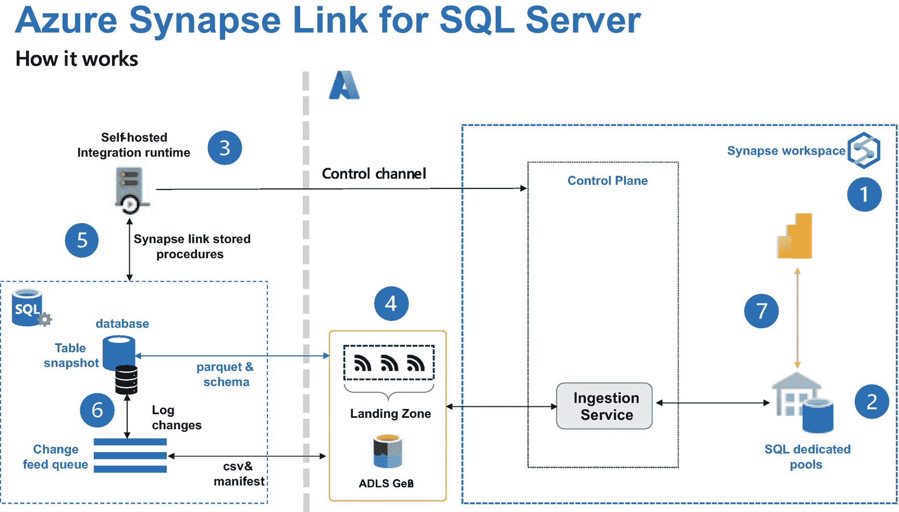
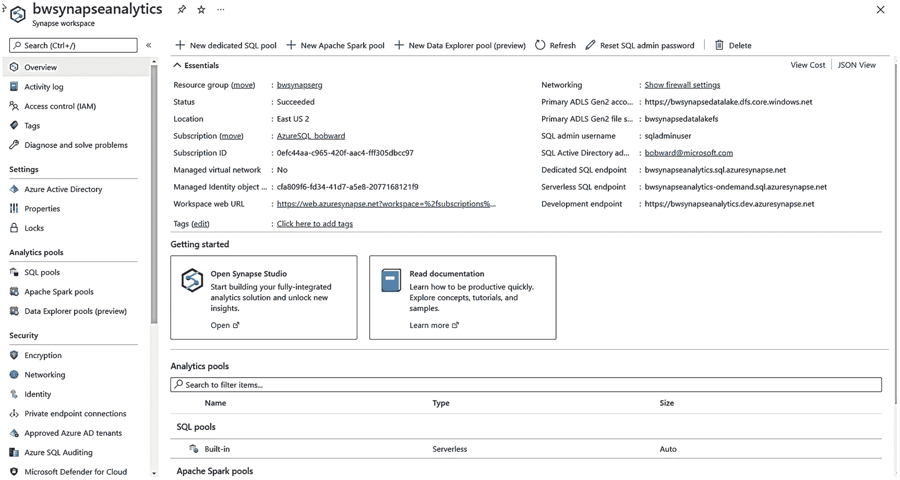
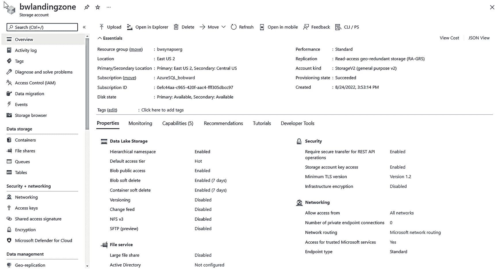
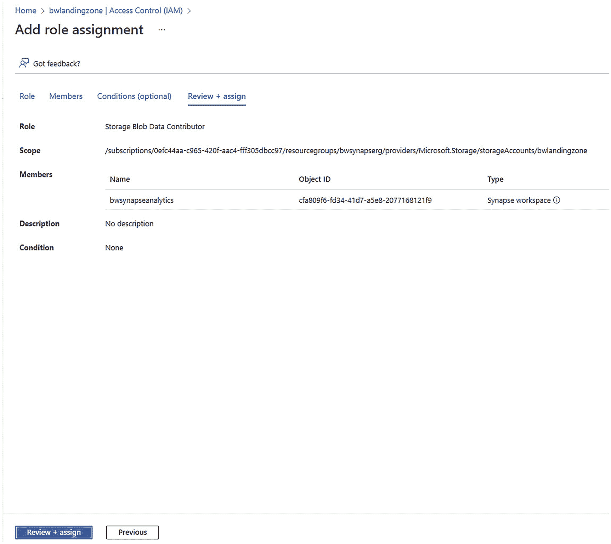

# Synapse Link 如何工作？

Synapse Link 的工作涉及多个组件。让我们回顾图 3-12 来理解这些组件和数据流。

Azure Synapse Link for SQL Server 的六步流程图。步骤从 Synapse 工作区开始，以更改数据流队列结束。

图 3-12

SQL Server 的 Synapse Link 架构

让我们使用图中的数字来了解组件创建和数据流的顺序。不用担心如何创建这些组件的细节。你将在下一节的练习中看到这些细节。

1.  首先，你需要一个 Azure Synapse 工作区。
2.  现在创建一个 SQL 专用池来承载数据。
3.  创建一个 `SQL Server 2022 的链接服务`。这在 Synapse 内建立了一个控制平面，并能够将 SQL Server 和 Synapse 连接起来。你将在 SQL Server 的计算机或网络上安装自承载集成运行时 (`SHIR`)。此链接服务专用于此特定的 SQL Server 和数据库。如果你想为同一 SQL 实例上的不同数据库设置链接，则需要一个唯一的链接服务，这需要另一个不同的 `SHIR`。一次只能在 `VM` 或计算机上运行一个 `SHIR` 程序。但由于 `SHIR` 可以远程连接到 SQL Server，你可以在网络中的不同 `VM` 或计算机上运行该程序的另一个副本。`SHIR` 仅在 Windows 上工作，因此如果你在 Linux 上使用 Synapse Link for SQL Server，你将需要在网络中的一台可以连接到你的 Linux 上的 SQL Server 的 Windows `VM` 或计算机上安装 `SHIR`。
4.  创建一个名为 `暂存区` 的 Azure 存储帐户以及该暂存区的链接服务。此暂存区帐户将专用于此 SQL Server 和数据库。暂存区将存储从 SQL Server 提取的文件，Synapse 知道如何将这些文件摄取到 SQL 池表中。
5.  基于 SQL 的链接服务创建一个 `链接连接`。从 SQL Server 上的源数据库选择要链接的表。启动连接。`SHIR` 在 SQL Server 2022 中执行系统存储过程以启动该过程。表的快照被捕获并通过 `HTTPS` 以 Parquet 和架构文件的形式提交到暂存区。控制平面中的摄取服务获取暂存区文件并在 SQL 池中创建表。数据根据初始快照插入到池表中。链接连接针对数据库中的特定表。你可以为同一个数据库拥有多个链接连接，但一个表只能位于一个链接连接中。
6.  对 SQL Server 中表的任何修改都会记录在事务日志中。SQL Server 中的更改数据捕获任务获取日志更改并将其放入队列，这些队列是 SQL Server 内的内存结构。内部任务将更改从队列以 `CSV` 和清单文件的形式通过 `HTTPS` 发布到暂存区。我们尽量将所需的内存量保持在尽可能小的水平，同时平衡需要有良好的吞吐量来捕获日志更改并发布到暂存区。SQL Server 使用一个工作线程池来执行捕获日志更改并将这些更改发布到暂存区的任务。工作线程池是专用于 Synapse Link 更改数据捕获的池，并且跨实例上所有启用了 Synapse Link 的数据库工作。Synapse 中的摄取服务获取暂存区文件并执行对 SQL 池中受影响表的修改。
7.  可选地创建一个 Power BI 报表，直接在 SQL 池表上可视化你的数据。

现在你已经了解了组件和流程，让我们尝试一个练习，看看 Synapse Link 如何运作。

## 尝试 Synapse Link for SQL Server

为了成功完成本练习，你需要仔细遵循先决条件、设置练习的步骤以及每个练习步骤。

我要感谢 Chuck Heinzelman、Mine Token、Milos Vucic 和 Tim Chen 帮助我理解 Synapse Link 的工作原理，并为本练习创建了所有资源。

### 先决条件

*   一台至少有两个 CPU 和 `8Gb` 内存的虚拟机或计算机。对于我的测试，我使用了 Azure `E4ds_v5` `VM`，它带有四个 `vCPU` 和 `32Gb` 内存。你的虚拟机或计算机需要能够通过 Internet 连接到 Azure，或者作为 Azure 虚拟机运行。
*   SQL Server 2022 评估版。本练习只需要数据库引擎功能。
*   一个具有创建 Azure Synapse 工作区和 Azure Data Lake Storage Gen2 帐户权限的 Azure 订阅（Synapse 使用自己的存储帐户，但你需要一个单独的帐户作为暂存区）。
*   SQL Server Management Studio (`SSMS`)。最新的 18.x 或 19.x 版本均可使用。
*   将 WideWorldImporters `Standard` 示例备份从 [`https://github.com/Microsoft/sql-server-samples/releases/download/wide-world-importers-v1.0/WideWorldImporters-Standard.bak`](https://github.com/Microsoft/sql-server-samples/releases/download/wide-world-importers-v1.0/WideWorldImporters-Standard.bak) 下载到你将运行 SQL Server 的计算机上。之所以使用 Standard 备份，是因为像内存中 OLTP 这样的功能不被 Synapse Link 支持。
*   一份来自书籍示例 `ch3_cloudconnected\synapselink` 文件夹中的脚本副本。

#### 设置练习

*一张截图显示了 Azure Synapse Analytics。左侧窗格中选择了“概述”。右侧窗格显示了基本信息、入门、分析池和 Apache Spark 池。*
**图 3-13**
*一个 Azure Synapse Analytics 工作区*

1.  创建一个 `Azure Synapse Analytics` 工作区。以下是如何创建工作区的快速入门指南：[`https://docs.microsoft.com/azure/synapse-analytics/get-started-create-workspace`](https://docs.microsoft.com/azure/synapse-analytics/get-started-create-workspace)。
    在创建工作区时，需要遵循以下要点：
    *   你在工作区创建过程中使用的 `Data Lake Storage Gen2` 存储账户是给 `Synapse` 用的。在本练习的后续步骤中，你将为 `登陆区` 另外创建一个。
    *   对于网络设置，你必须为 `托管虚拟网络` 选择 `禁用`，并勾选 `允许来自所有 IP 地址的连接`。如果担心此要求的安全性，你可以设置防火墙规则。
    *   虽然不是必须的，但我喜欢将 `Azure` 资源整理到特定的资源组中。在本练习中，我在与 `Synapse` 相同的资源组中创建了一个运行 `SQL Server 2022` 的 `Azure 虚拟机`，因为我将使用 `允许 Azure 服务和资源访问此工作区` 选项来访问 `Synapse`，而不是设置防火墙规则。
    *   其他所有选项我都保留了默认值。`Synapse Link` 应该在支持 `Synapse` 的任何区域都可用，但请查看 [`https://docs.microsoft.com/azure/synapse-analytics/synapse-link/connect-synapse-link-sql-server-2022#prerequisites`](https://docs.microsoft.com/azure/synapse-analytics/synapse-link/connect-synapse-link-sql-server-2022#prerequisites) 以获取最新更新。
    根据我的经验，`Synapse` 工作区的部署时间不会超过 5-10 分钟。
    图 3-13 展示了我的 `Synapse` 工作区创建后的门户视图。

*一张截图显示了 Azure 存储登陆区账户。左侧窗格中选择了“概述”。右侧窗格显示了基本信息、数据湖存储、文件服务、安全性和网络。*
**图 3-14**
*Azure 存储登陆区账户*

2.  接下来，我们需要一个地方来存放数据，对于 `Synapse Link` 来说，这个地方称为 `专用 SQL 池`。你可以将其理解为 `Synapse` 内部的一个数据库，用于承载来自源 `SQL Server` 的基于 `SQL` 的表。有几种方法可以创建它。一种简单的方法是通过 `Azure` 门户。转到屏幕左侧工作区的资源菜单，在 `分析池` 下选择 `SQL 池`。选择 `+ 新建`。对于本练习，输入一个池名称（我选择了 `wwisqlpool`）并保留默认值。对于生产系统，你可能需要在此处选择不同的选项。有关更多详情，请参阅本章后面的标题为“关于 Synapse Link 的更多细节”的部分。
3.  创建一个新的 `Azure` 存储账户，用作 `Azure Data Lake Storage Gen2`，即 `登陆区`。我使用此文档页面中的说明创建了我的存储账户：[`https://docs.microsoft.com/azure/storage/blobs/create-data-lake-storage-account`](https://docs.microsoft.com/azure/storage/blobs/create-data-lake-storage-account)。对于本练习，我使用了与我的 `Synapse` 工作区相同的区域和资源组（非必需），并且对于 `性能` 我选择了 `标准` 选项（对于生产工作负载，你可能需要 `高级`）。除了在 `高级` 选项卡上，我**必须选择 `启用分层命名空间`** 外，其他所有选项我都保留了默认值。图 3-14 展示了我创建后的存储账户。

*一张截图显示了访问控制下的“添加角色分配”。在“查看 + 分配”菜单下可以看到角色、范围、成员、描述和条件选项。*
**图 3-15**
*将 Synapse 工作区访问权限分配给登陆区容器*

4.  仅仅有一个存储账户不足以存储来自 `SQL Server` 的文件。你还需要一个文件夹或 `容器`。在屏幕左侧存储账户的资源菜单下，`数据存储` 部分，选择 `容器`。然后在新屏幕上，选择 `+ 容器`。输入你选择的名称（稍后你会需要它）。我将我的容器命名为 `wwidata`。保留默认设置并选择 `创建`。这应该只需要几秒钟。
5.  你现在需要为 `Synapse` 工作区授予对 `登陆区` 存储账户的访问权限。按照文档中此链接的步骤 1 和 2，将 `托管标识` 的访问权限分配给 `登陆区`：[`https://docs.microsoft.com/azure/synapse-analytics/synapse-link/connect-synapse-link-sql-server-2022#create-linked-service-to-connect-to-your-landing-zone-on-azure-data-lake-storage-gen2`](https://docs.microsoft.com/azure/synapse-analytics/synapse-link/connect-synapse-link-sql-server-2022#create-linked-service-to-connect-to-your-landing-zone-on-azure-data-lake-storage-gen2)。
    我的角色分配如图 3-15 所示。

设置这些步骤确实很多，但请花点时间确保你已准备好使用 `Synapse Link`。

