# 使用 Synapse Link 同步数据

我提供了一系列详细的步骤，指导你设置并完成从 SQL Server 到 Synapse 的初始数据同步。当你逐步完成这些步骤时，可能会觉得有点复杂。但一旦你完成设置并初始化，数据的更改同步就"只需启用"了。

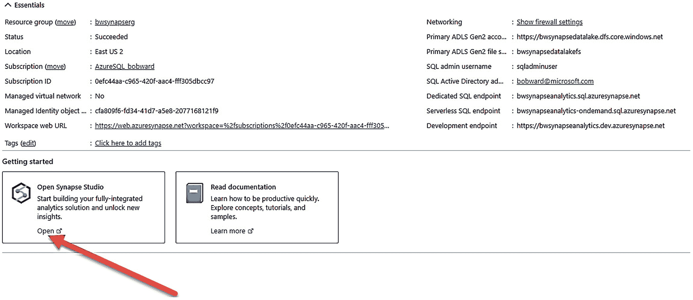

一张截图展示了基本要素和入门操作。箭头指向入门部分下的"打开 Synapse Studio"选项。

**图 3-16** 启动 Synapse Studio

## 启动 Synapse Studio

1.  我们将使用 WideWorldImporters 备份，因此你需要将其还原到你的 SQL Server 实例。你可以使用 sysadmin 帐户登录并运行 `restorewwi_std.sql` 脚本。你可能需要编辑备份文件以及数据/日志文件的文件路径。此脚本执行以下 T-SQL 语句：

```sql
USE master;
GO
RESTORE DATABASE WideWorldImporters FROM DISK = 'c:\sql_sample_databases\WideWorldImporters-Standard.bak' WITH
MOVE 'WWI_Primary' TO 'f:\data\WideWorldImporters.mdf',
MOVE 'WWI_UserData' TO 'f:\data\WideWorldImporters_UserData.ndf',
MOVE 'WWI_Log' TO 'g:\log\WideWorldImporters.ldf',
stats=5;
GO
```

2.  让我们在数据库中添加两个新表来跟踪车辆货物。在 SQL Server 上执行脚本 `extendwwitables.sql`，该脚本执行以下 T-SQL 语句：

```sql
USE [WideWorldImporters];
GO
DROP TABLE IF EXISTS [Warehouse].[Vehicles];
GO
CREATE TABLE [Warehouse].Vehicles NOT NULL,
[Vehicle_Type] nchar NULL,
[Vehicle_State] nvarchar NULL,
[Vehicle_City] nvarchar NULL,
[Vehicle_Status] nvarchar NULL,
PRIMARY KEY CLUSTERED
(
[Vehicle_Registration] ASC
));
GO
DROP TABLE IF EXISTS [Warehouse].[Vehicle_StockItems];
GO
CREATE TABLE [Warehouse].Vehicle_StockItems NOT NULL,
[StockItemID] [int] NOT NULL
PRIMARY KEY CLUSTERED
(
[Vehicle_Registration] ASC,
[StockItemID] ASC
));
GO
```

3.  通过在 SQL Server 上执行脚本 `populatedata.sql`，将数据填充到这些表中。

4.  WideWorldImporters 数据库包含一些 Synapse Link 不支持的功能和数据类型。因此，在 SQL Server 上执行脚本 `alterwwi.sql` 以移除其中一些功能（例如，时态表）和具有不支持数据类型的列。

**注意** 在 SQL Server 2022 发布时，其中一些数据类型可能会得到支持，但为了本练习的目的，安全起见，我移除了所有可能导致问题的功能或类型。

5.  Synapse 和 SQL Server 2022 都需要一个主密钥用于加密目的，以及为 Synapse 构建的架构。
    1.  连接到 SQL Server 2022 并运行脚本 `createmasterkey.sql`，该脚本执行以下 T-SQL 语句：

```sql
USE [WideWorldImporters];
GO
CREATE MASTER KEY ENCRYPTION BY PASSWORD = 'Strongpassw0rd!';
GO
```

    2.  Synapse 池也需要一个主密钥，但你不需要密码。让我们来熟悉一下 Synapse Studio（因为你将在整个练习中需要用到它）来完成此操作。在 Synapse 工作区的 Azure 门户中，在页面中部，点击标有 **Open Synapse Studio** 的框的"打开"按钮，如图 3-16 所示。

打开 Synapse Studio 后，点击左侧菜单中的"数据"图标，展开 `wwipool` 数据库，然后选择"新建 SQL 脚本"。接着输入 `CREATE MASTER KEY;` 并点击"运行"，如图 3-17 所示。

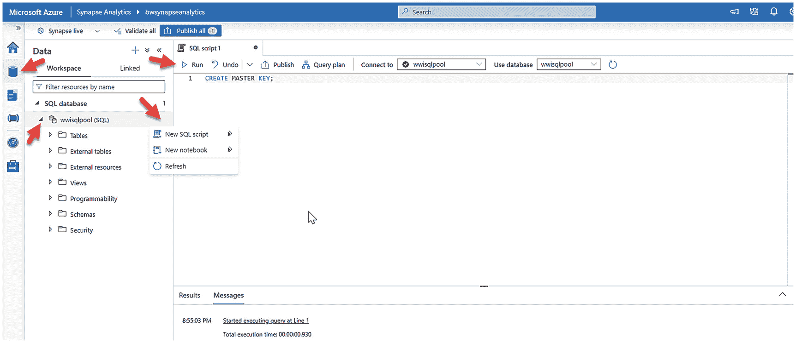

一张截图显示了 Microsoft Azure 下的 BW Synapse Analytics 选项卡。箭头指向数据图标、WWI SQL 池选项、新建 SQL 脚本选项和运行图标。

**图 3-17** 在 SQL 专用池中创建主密钥

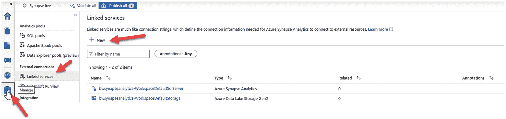

一张截图显示了 BW Synapse Analytics 选项卡的一部分。箭头指向管理图标、链接服务选项和新建按钮。

**图 3-18** 为 SQL Server 2022 创建新的链接服务

1.  我们现在已准备好从 Synapse Studio 创建**到 SQL Server 2022 的链接服务**。在 Synapse Studio 中，点击左侧菜单（最后一个）上的"管理"图标，选择"链接服务"，然后点击 + 新建，如图 3-18 所示。

2.  Synapse Link 在从 SQL Server 同步表时不会自动创建架构。由于 WideWorldImporters 使用了架构，我们需要先在 Synapse 中创建这些架构。使用你在 Synapse Studio 中创建主密钥的同一个窗口，在清除了 `CREATE MASTER KEY` 语句后，运行以下 SQL 语句：

```sql
CREATE SCHEMA Application;
GO
CREATE SCHEMA Purchasing;
GO
CREATE SCHEMA Sales;
GO
CREATE SCHEMA Warehouse;
GO
CREATE SCHEMA Website;
GO
```

在搜索窗口中输入 `sql`，选择 SQL Server，然后点击继续，如图 3-19 所示。

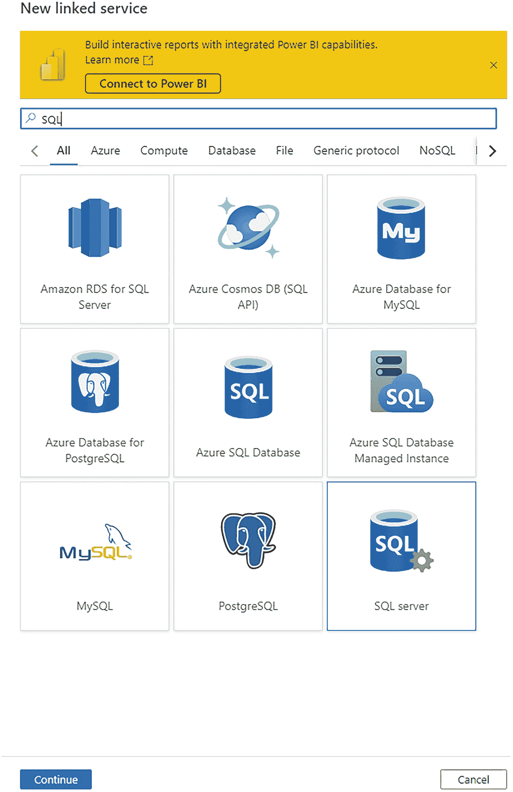

一张截图显示了新建链接服务选项卡，下方搜索栏中输入了 SQL。在菜单选项"全部"下的 9 个图标中，SQL Server 被选中。

**图 3-19** 选择 SQL Server 作为链接服务

屏幕上会显示一个需要填写多项信息的页面。请按照以下步骤操作，因为你需要在这里填写一些信息，然后转到你托管 SQL Server 的机器，最后再回到这个页面。

输入链接服务的名称，然后在 **通过集成运行时连接** 字段中，点击"向下"箭头，然后选择 **+ 新建**，如图 3-20 所示。

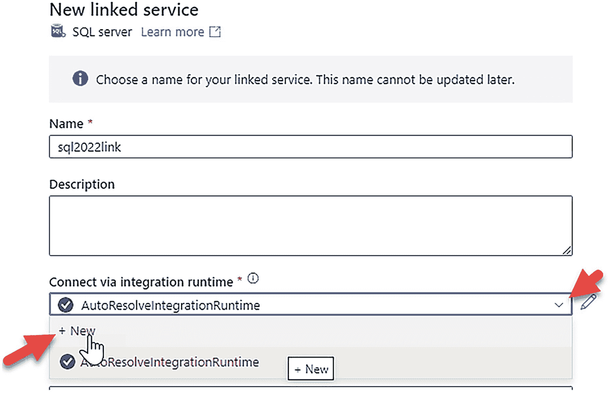

一张截图显示了新的链接服务。光标悬停在"通过集成运行时连接"下拉菜单中的"新建"选项上。

**图 3-20** 为 SQL 的 Synapse Link 选择集成运行时

选择 **自承载**，然后点击 **继续。**

保留默认名称字段，然后点击创建。现在，你将看到一个类似图 3-21 的屏幕。

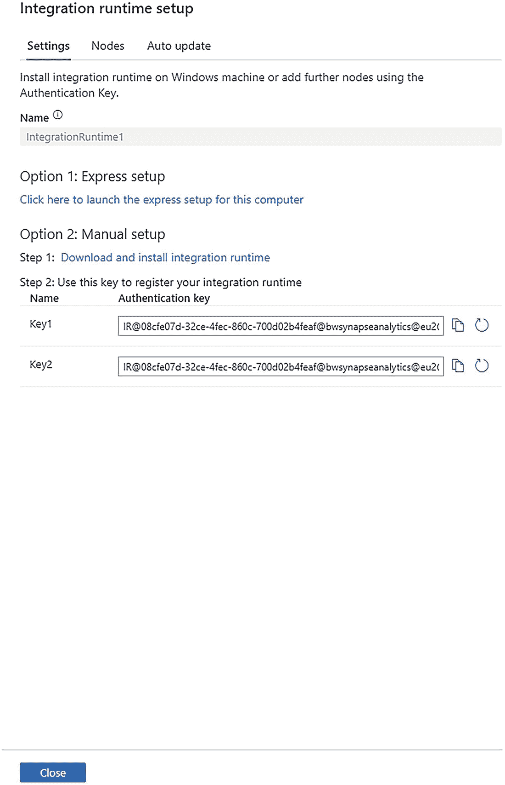

一张截图显示了集成运行时设置。在设置选项卡下，选项 2 手动设置中可以看到密钥 1 和密钥 2。

**图 3-21** 安装自承载集成运行时的说明

集成运行时代码现已安装在 Synapse 工作区的控制平面中。你现在需要在安装了 SQL Server 的计算机或虚拟机上安装自承载集成运行时 (SHIR) 软件。

**注意**

SHIR 可以安装在网络上任何能连接到并发现 SQL Server 的位置。对于本练习，我们仅将其安装在本地。

如果图 3-21 中的屏幕上的选项 1 是你从计划安装 SHIR 的计算机或虚拟机启动 Synapse Studio 时的正确选择。我在做这个练习时是从自己的笔记本电脑使用门户，所以我选择了选项 2 进行手动安装。当你点击选项 2 时，将启动一个新的浏览器标签页来下载软件。请保持 Synapse Studio 浏览器标签页打开。你将需要该屏幕上的**身份验证密钥**，并且在完成 SHIR 安装后，我们需要回到此位置以完成链接服务的安装。

在新网页上点击下载后，我选择了最新的 MSI 版本，然后将下载的 .MSI 文件复制到了我在 Azure 中的虚拟机中。此文件大小约为 1GB，因此复制到你的虚拟机或计算机中可能需要几分钟时间。

在复制此文件的同时，从 SSMS 为 SQL Server 启动标准 SQL XEvent Profiler（点击启动会话），如图 3-22 所示。

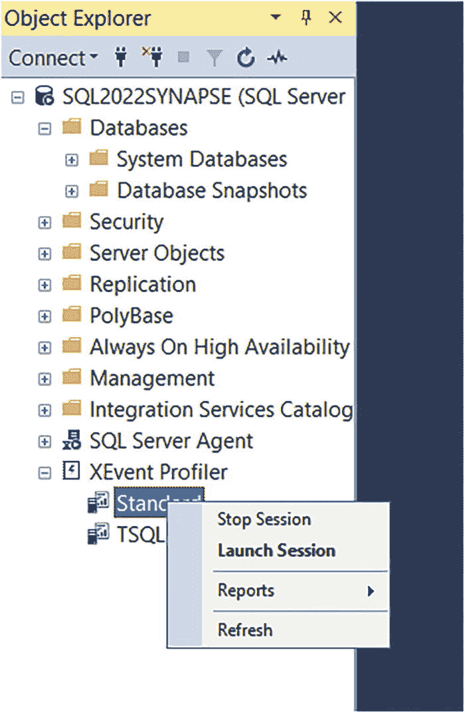


## 屏幕截图说明

图 3-22 显示了对象资源管理器。X 事件探查器下的“标准”选项被选中。旁边显示一个包含 4 个选项的弹出窗口。

### 启动标准 XEvent 探查器会话

这将允许你追踪进入服务器的所有 SQL 流量。我们将在本练习的后面部分使用此功能来查看 SHIR 向 SQL Server 2022 发送了何种类型的 SQL 过程。

### 下载并安装 SHIR

下载后，运行 `MSI` 文件以安装 `SHIR`。安装时请使用所有默认设置。完成安装后，会出现一个输入身份验证密钥的屏幕。

在你发起 `SHIR` 下载的 `Synapse Studio` 中，从 `key1` 或 `key2` 复制身份验证密钥的值，粘贴到 `SHIR` 屏幕中，然后点击 **注册**。接着点击 **完成**。如果一切成功，你的 `SHIR` 屏幕应如图 3-23 所示。

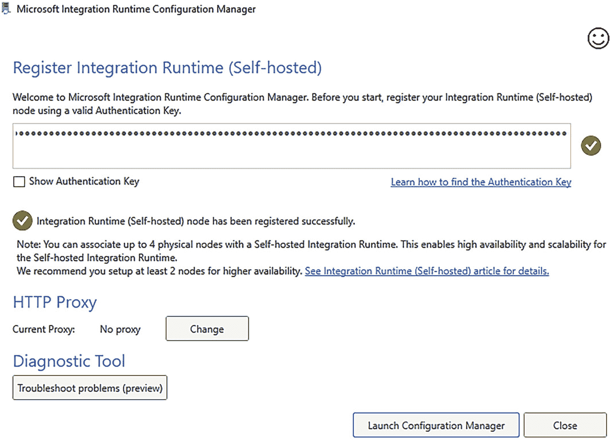

图 3-23：SHIR 注册成功

点击 **关闭**。

### 验证连接

在 Windows Server 上，从“开始”菜单启动 `Microsoft Integration Runtime` 程序以验证与 `Synapse` 的连接。你的屏幕应如图 3-24 所示。

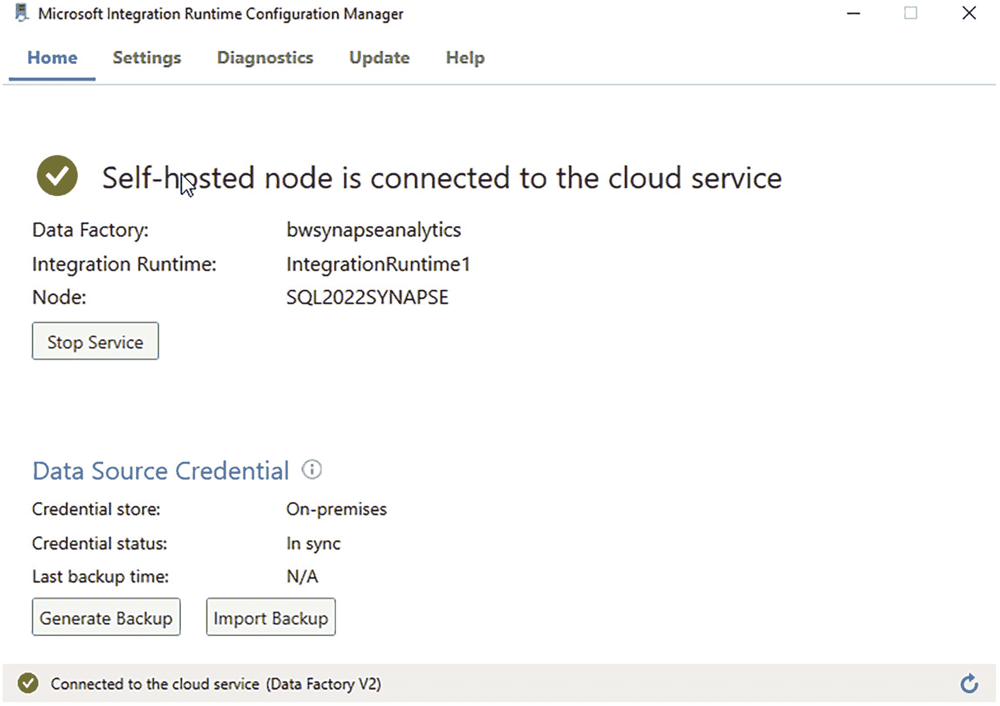

图 3-24：SHIR 成功连接到 Synapse

`SHIR` 作为服务运行，因此你可以关闭此窗口。

回到 `Synapse Studio`，在集成运行时设置屏幕上点击 **关闭**。

无需担心在“通过集成运行时连接”上可能看到的错误。只需点击刷新图标，一切应变为“绿色”。

### 创建链接服务

现在，填写服务器名称和数据库名称（本练习使用 `WideWorldImporters`）。使用 `SQL` 身份验证，并填写你为 `SQL Server` 创建的 `sysadmin` 的 `SQL` 登录名和密码。首先，点击屏幕右下角的 **测试连接** 以验证连接是否有效。如果成功，点击 **创建**。

你将在 `Synapse Studio` 中看到一个类似图 3-25 的屏幕。

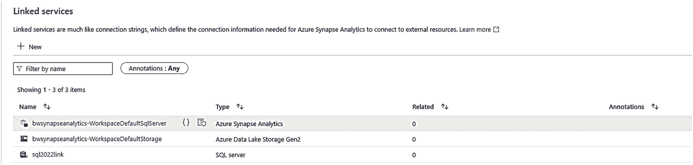

图 3-25：SQL Server 的链接服务创建成功

### 设置落地区链接

1.  现在我们需要为落地区创建另一个**链接服务**。在“链接服务”页面上，选择 **+ 新建** 并选择 **Azure Data Lake Storage Gen2**。
    为链接服务命名。“通过集成运行时连接”保留为默认值。将身份验证类型选择为“系统分配的托管标识”，这将选择你的 `Synapse` 工作区托管标识（该标识在创建工作区时自动创建）。这就是你之前授予落地区访问权限的托管标识。
    选择你的 `Azure` 订阅和你为落地区创建的存储帐户名称。选择屏幕底部的 **测试连接**。如果一切顺利，你的屏幕应如图 3-26 所示。

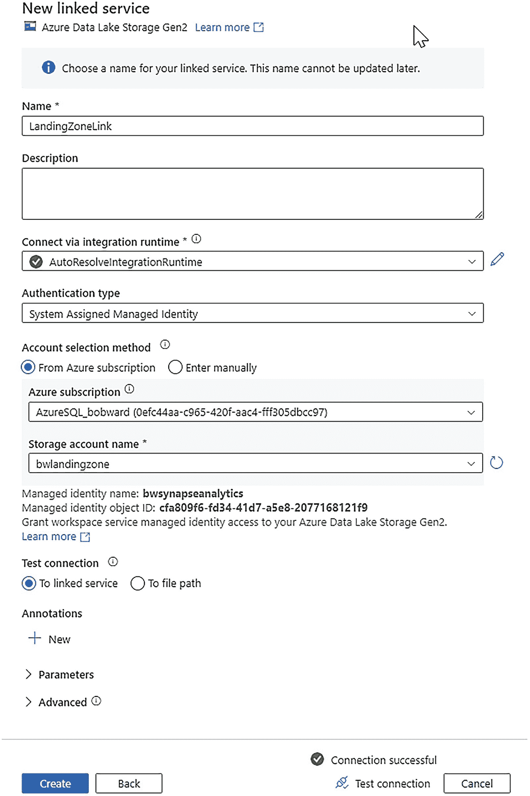

图 3-26：设置落地区链接

点击 **创建** 以创建新链接。

### 发布更改

现在，点击屏幕顶部的 **发布所有** 选项，如图 3-27 所示。

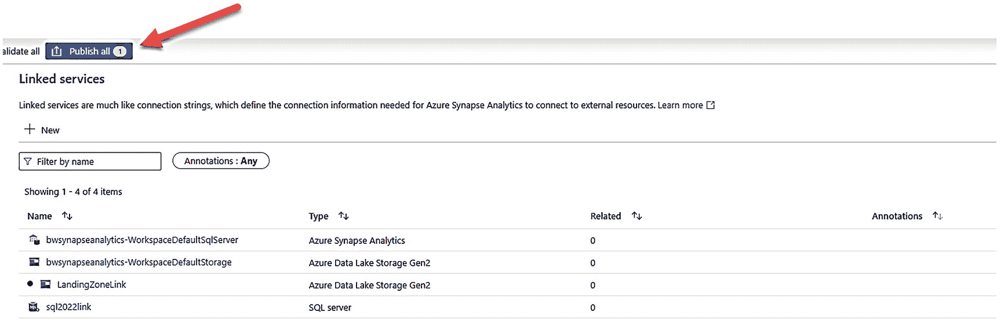

图 3-27：发布所有更改


