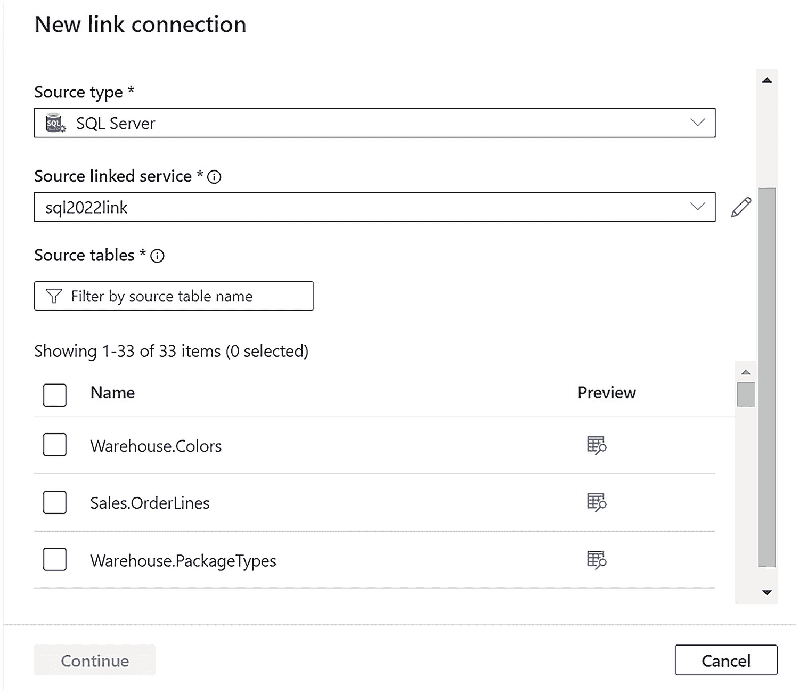

# 创建新的链接连接

## 开始创建链接连接

现在链接服务已就位，是时候通过基于链接服务创建**链接连接**来将数据从 SQL Server 同步到 Synapse 了。选择所有表。在 Synapse Studio 中，点击屏幕左侧的 `Integrate` 图标，然后点击 +，如图 3-28 所示。

选择 `Linked connection`。您将看到一个创建新链接连接的屏幕。选择 `SQL Server` 作为源类型，然后选择您之前为 SQL Server 创建的链接服务。您的屏幕应刷新并显示 WideWorldImporters 的表列表，如图 3-29 所示。

*一张显示新链接连接的截图。为源类型和源链接服务选择的选项是 SQL Server 和 SQL 2022 link。源表功能包含 33 个项目。*

