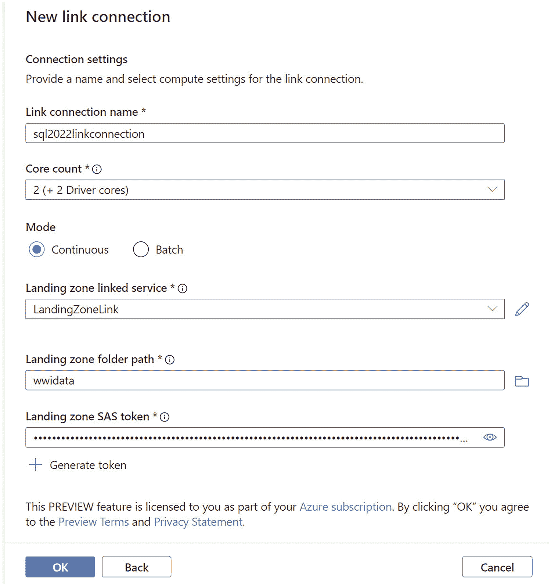

# 设置新的链接连接

## 选择要链接的表

您可以浏览可能的表列表，甚至预览列和数据。我希望链接所有表，因此点击 `Name` 旁边的复选框（这将选择所有表），然后点击 `Continue`。

## 配置目标与完成连接

在下一个屏幕上，选择您之前创建的 SQL 专用池。我的池名为 `wwisqlpool`。点击 `Continue`。您现在将看到一个完成创建链接连接过程的屏幕。

为链接连接命名。使用默认的核心数和连续模式。您将在本章后面的“**关于 Synapse Link 的更多细节**”部分中了解更多关于何时为这些选项做出不同选择的信息。现在选择您为着陆区创建的链接服务。输入您之前为着陆区文件夹路径创建的容器名称。然后选择 `+ Generate token`（并在新屏幕上使用默认值）。您的屏幕现在应如图 3-30 所示。

*一张显示新链接连接的截图。连接设置下的选项包括链接连接名称、核心数、模式、着陆区链接服务、文件夹路径、SAS 令牌。*

