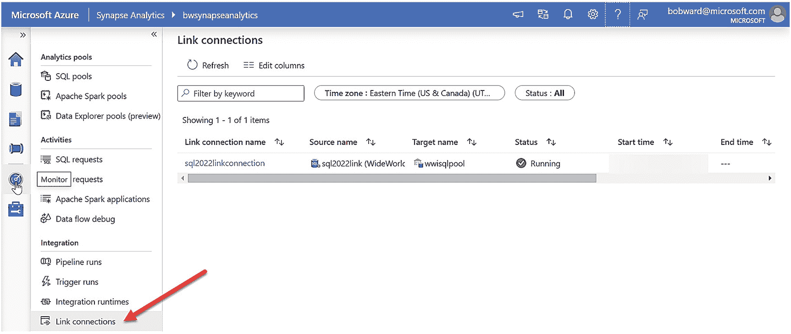

# 完成链接连接

点击 `OK`。您现在将进入一个显示链接连接所有详细信息的新屏幕。您可以浏览这些信息。目前选择 `Publish all`，然后点击 `Publish`。接着点击 `Start`。您的屏幕将显示 `Starting the link connection. This may take a few minutes`。对我来说，“几分钟”大约是 10 分钟。

*一张显示 B W Synapse Analytics 选项卡的截图。箭头指向左侧窗格中“集成”下的“链接连接”选项。右窗格列出了链接连接名称、源、目标、状态。*

