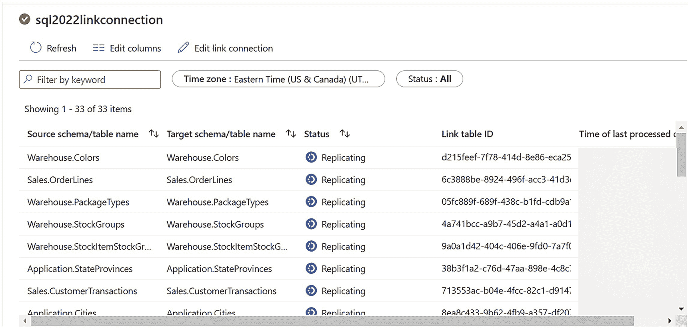

# 监控 SQL Server 的链接连接

## 观察初始同步过程

在此连接启动期间，您可以返回 SSMS 并查看您的 XEvent Profiler 会话。查找来自 `client_app_name` 字段、名为 `AzureDataMovement` 的事件。这些是来自 SHIR 的查询。

在这些事件中，您将看到使用存储过程和 T-SQL 的批处理，例如：
*   `sys.sp_change_feed_enable_db`。现在，该数据库的 `sys.databases.is_change_feed_enabled` 列被设置为 1。
*   为着陆区存储账户创建的数据库范围凭据。
*   `sys.sp_change_feed_create_table_group`，它创建一个指向 Synapse 工作区和着陆区的*表组*。每个数据库的每个链接连接都会创建一个表组。
*   `sys.sp_change_feed_enable_table`。由于我们在链接连接中选择了所有表，您将看到对数据库中每个表执行一次 `sys.sp_change_feed_enable_table`。
*   针对系统目录视图的查询，以获取每个表的架构，包括列和数据类型。

**注意** 在本书撰写时，这些存储过程和 T-SQL 尚未被记录或支持。Synapse Link 必须通过 Synapse Studio 进行配置，它与 SHIR 进行通信。

## 查看连接状态

使用 Synapse Studio 监控链接连接，如图 3-31 所示。

点击链接连接名称以深入了解详细信息，如图 3-32 所示。

*一张显示 SQL 2022 link connection 的截图。它包含一个 33 项的表，详细信息包括：源架构、目标架构、状态、链接表 ID 等。*

