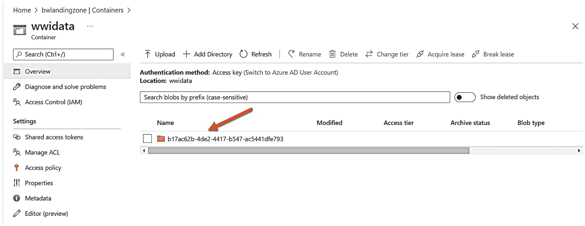

# 执行查询获取货物计数

## 运行示例查询

现在使用 Synapse Studio 像之前一样运行查询。粘贴以下 T-SQL（在脚本 `getcargocounts.sql` 中找到）来运行查询以查看货物计数：

```sql
    SELECT v.Vehicle_Registration, v.Vehicle_City, count(*) AS cargo
    FROM Warehouse.Vehicles v
    JOIN Warehouse.Vehicle_StockItems vs
    ON v.Vehicle_Registration = vs.Vehicle_Registration
    GROUP BY v.Vehicle_Registration, v.Vehicle_City;
    GO
```

结果应如图 3-34 所示，这与这些表中的初始数据填充相匹配。


*一张标题为 wwi data 的容器页面截图。左侧窗格中选择了“概述”。箭头指向右侧窗格中的文件夹。*

