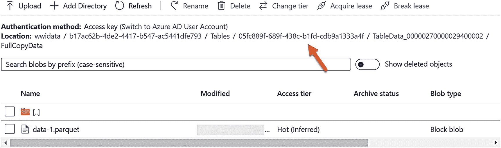

# 着陆区中的表组

## 浏览着陆区容器

我们不支持复制或修改着陆区中的文件，但为了学习目的，值得查看容器中的文件。如果您进入着陆区账户中的容器并深入查看，您的结果将类似于图 3-35。

文件夹的 GUID 值与在 WideWorldImporters 数据库的系统表 `changefeed.change_feed_table_groups` 中创建并存储的表组 ID 相匹配。

当您深入查看此文件夹时，您将看到另一个名为 `Tables` 的文件夹。深入其中，您将看到一系列更多文件夹。每个文件夹代表一个表。名称是存储在 WideWorldImporters 数据库的系统表 `changefeed.change_feed_tables` 中的 `table_id`。深入第一个文件夹直到找到一个 parquet 文件，如图 3-36 所示。

*一张容器页面右窗格的截图。箭头指向根目录“wwi data”下“位置”给出的链接。*

